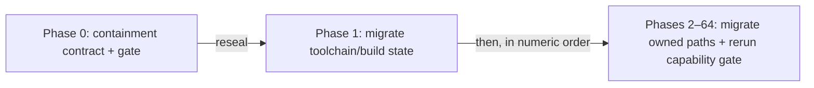

# Amoebius Development Plan

> **Purpose**: Provide the authoritative numeric phase order, current status, remaining work, and routing
> to each phase's human-authored validation contract.
> **Read this if**: the current phase, the next permitted work, or the location of a phase gate must be established.

This tracker owns phase order, status, and dated implementation progress. Each phase document owns its
capability-specific validation contract, while the universal source-snapshot postcondition is owned by
[development_plan_standards.md §S](development_plan_standards.md#s-universal-artifact-hygiene-gate).
Architecture remains owned by the doctrine suite under [`../documents/`](../documents/README.md).

Link-graph metadata

**Status**: Authoritative source
**Supersedes**: N/A
**Referenced by**: DEVELOPMENT_PLAN/development_plan_gate_integrity.md, DEVELOPMENT_PLAN/development_plan_phase_model.md, DEVELOPMENT_PLAN/development_plan_standards.md, DEVELOPMENT_PLAN/later_phases.md, DEVELOPMENT_PLAN/legacy_tracking_for_deletion.md, DEVELOPMENT_PLAN/overview.md, DEVELOPMENT_PLAN/phase_00_documentation_suite.md, DEVELOPMENT_PLAN/phase_01_toolchain_spike.md, DEVELOPMENT_PLAN/phase_02_formal_model_kernel.md, DEVELOPMENT_PLAN/phase_03_gateway_migration_model.md, DEVELOPMENT_PLAN/phase_04_dhall_gate1_schema.md, DEVELOPMENT_PLAN/phase_05_gadt_decoder_gate2.md, DEVELOPMENT_PLAN/phase_06_illegal_state_corpus.md, DEVELOPMENT_PLAN/phase_07_capacity_core_folds.md, DEVELOPMENT_PLAN/phase_08_storage_geometry_folds.md, DEVELOPMENT_PLAN/phase_09_execution_accelerator_folds.md, DEVELOPMENT_PLAN/phase_10_capability_bind.md, DEVELOPMENT_PLAN/phase_11_provision_seal.md, DEVELOPMENT_PLAN/phase_12_inference_accelerator_provision.md, DEVELOPMENT_PLAN/phase_13_render_manifest_goldens.md, DEVELOPMENT_PLAN/phase_14_chain_kernel_boundary.md, DEVELOPMENT_PLAN/phase_15_deterministic_sim_substrate.md, DEVELOPMENT_PLAN/phase_16_ui_program_schema.md, DEVELOPMENT_PLAN/phase_17_scoped_identity_kernel.md, DEVELOPMENT_PLAN/phase_18_ui_authorization_kernel.md, DEVELOPMENT_PLAN/phase_19_ui_effect_binding.md, DEVELOPMENT_PLAN/phase_20_ui_plan_compiler.md, DEVELOPMENT_PLAN/phase_21_ui_browser_interpreter.md, DEVELOPMENT_PLAN/phase_22_ui_server_boundary.md, DEVELOPMENT_PLAN/phase_23_ui_local_composition.md, DEVELOPMENT_PLAN/phase_24_bootstrap_coordinator_kind.md, DEVELOPMENT_PLAN/phase_25_base_image_registry.md, DEVELOPMENT_PLAN/phase_26_object_reconciler.md, DEVELOPMENT_PLAN/phase_27_capacity_scheduler.md, DEVELOPMENT_PLAN/phase_28_retained_storage.md, DEVELOPMENT_PLAN/phase_29_vault_pki.md, DEVELOPMENT_PLAN/phase_30_platform_backbone.md, DEVELOPMENT_PLAN/phase_31_platform_services_2.md, DEVELOPMENT_PLAN/phase_32_keycloak_ingress.md, DEVELOPMENT_PLAN/phase_33_live_dsl_singleton.md, DEVELOPMENT_PLAN/phase_34_app_tenancy.md, DEVELOPMENT_PLAN/phase_35_pulsar_client.md, DEVELOPMENT_PLAN/phase_36_user_tenant_isolation_live.md, DEVELOPMENT_PLAN/phase_37_content_store_workflow.md, DEVELOPMENT_PLAN/phase_38_ui_projection_runtime.md, DEVELOPMENT_PLAN/phase_39_release_lifecycle.md, DEVELOPMENT_PLAN/phase_40_ui_program_release.md, DEVELOPMENT_PLAN/phase_41_network_fabric_wireguard.md, DEVELOPMENT_PLAN/phase_42_multicluster_spawn_georepl.md, DEVELOPMENT_PLAN/phase_43_gateway_migration_drills.md, DEVELOPMENT_PLAN/phase_44_provider_deploy_checkpoint.md, DEVELOPMENT_PLAN/phase_45_provider_child_bringup.md, DEVELOPMENT_PLAN/phase_46_provider_ebs_credential.md, DEVELOPMENT_PLAN/phase_47_provider_dynamic_nodes.md, DEVELOPMENT_PLAN/phase_48_determinism_jitcache.md, DEVELOPMENT_PLAN/phase_49_infernix_lift.md, DEVELOPMENT_PLAN/phase_50_infernix_ui_lift.md, DEVELOPMENT_PLAN/phase_51_jitml_lift_cuda.md, DEVELOPMENT_PLAN/phase_52_jitml_ui_lift.md, DEVELOPMENT_PLAN/phase_53_apple_metal_host_daemon.md, DEVELOPMENT_PLAN/phase_54_test_topology_dsl.md, DEVELOPMENT_PLAN/phase_55_ui_single_tenant_live.md, DEVELOPMENT_PLAN/phase_56_ui_multi_tenant_live.md, DEVELOPMENT_PLAN/phase_57_ui_rollout_reconnect.md, DEVELOPMENT_PLAN/phase_58_ui_ha_multizone.md, DEVELOPMENT_PLAN/phase_59_offline_language_plan.md, DEVELOPMENT_PLAN/phase_60_encrypted_browser_runtime.md, DEVELOPMENT_PLAN/phase_61_offline_replay_receipts.md, DEVELOPMENT_PLAN/phase_62_offline_blobs_isolation.md, DEVELOPMENT_PLAN/phase_63_offline_release_evolution.md, DEVELOPMENT_PLAN/phase_64_offline_multizone_continuity.md, DEVELOPMENT_PLAN/substrates.md, DEVELOPMENT_PLAN/system_components.md, README.md, documents/README.md, documents/documentation_standards.md, documents/engineering/README.md, documents/engineering/app_vs_deployment_doctrine.md, documents/engineering/apple_metal_headless_builds.md, documents/engineering/backup_recovery_doctrine.md, documents/engineering/bootstrap_sequence_doctrine.md, documents/engineering/browser_offline_runtime_doctrine.md, documents/engineering/capability_extension_doctrine.md, documents/engineering/chaos_failover_doctrine.md, documents/engineering/chaos_failover_second_axis.md, documents/engineering/chaos_failover_worked_examples.md, documents/engineering/cluster_lifecycle_doctrine.md, documents/engineering/cluster_topology_doctrine.md, documents/engineering/conformance_harness_doctrine.md, documents/engineering/consistency_pacelc_doctrine.md, documents/engineering/content_addressing_doctrine.md, documents/engineering/daemon_topology_doctrine.md, documents/engineering/deterministic_simulation_doctrine.md, documents/engineering/diagram_conventions.md, documents/engineering/dsl_doctrine.md, documents/engineering/formal_model_doctrine.md, documents/engineering/gateway_migration_doctrine.md, documents/engineering/gateway_migration_model_doctrine.md, documents/engineering/generated_artifacts_doctrine.md, documents/engineering/host_cluster_comms_doctrine.md, documents/engineering/image_build_doctrine.md, documents/engineering/inforcespec_migration_doctrine.md, documents/engineering/lift_and_compose_doctrine.md, documents/engineering/low_code_ui_runtime_doctrine.md, documents/engineering/manifest_generation_doctrine.md, documents/engineering/migration_doctrine.md, documents/engineering/monitoring_doctrine.md, documents/engineering/namespace_layout_doctrine.md, documents/engineering/network_fabric_doctrine.md, documents/engineering/platform_services_doctrine.md, documents/engineering/preflight_validation_doctrine.md, documents/engineering/pulsar_client_doctrine.md, documents/engineering/pulumi_iac_doctrine.md, documents/engineering/readiness_ordering_doctrine.md, documents/engineering/release_lifecycle_doctrine.md, documents/engineering/repository_layout_doctrine.md, documents/engineering/resource_capacity_construction.md, documents/engineering/resource_capacity_doctrine.md, documents/engineering/resource_capacity_folds.md, documents/engineering/resource_capacity_schema.md, documents/engineering/resource_capacity_sources.md, documents/engineering/resource_capacity_storage.md, documents/engineering/resource_capacity_types.md, documents/engineering/service_capability_doctrine.md, documents/engineering/single_logical_data_plane_doctrine.md, documents/engineering/storage_lifecycle_doctrine.md, documents/engineering/substrate_doctrine.md, documents/engineering/tenancy_doctrine.md, documents/engineering/test_derivation_analysis.md, documents/engineering/testing_doctrine.md, documents/engineering/ui_realtime_coordination_doctrine.md, documents/engineering/vault_pki_doctrine.md, documents/glossary.md, documents/illegal_state/README.md, documents/illegal_state/illegal_state_catalog.md, documents/illegal_state/illegal_state_lifecycle.md, documents/illegal_state/illegal_state_security.md, documents/illegal_state/illegal_state_techniques.md, documents/reading_order.md
**Generated sections**: none

## Contents
- [Phase discipline](#phase-discipline)
- [Repository and evidence discipline](#repository-and-evidence-discipline)
- [Toolchain](#toolchain)
- [Document index](#document-index)
- [Status vocabulary](#status-vocabulary)
- [Implementation-progress vocabulary](#implementation-progress-vocabulary)
- [Definition of Done](#definition-of-done)
- [Reopened numeric sequence](#reopened-numeric-sequence)
- [Current implementation audit](#current-implementation-audit)
- [Phase overview](#phase-overview)
- [Related Documents](#related-documents)

---

amoebius is one Haskell runtime with command, host-daemon, singleton, scheduler, and worker responsibilities.
The Python `pb` bootstrap coordinator exists only before binary handoff and as the later admin-REST client.
The constituent prodbox, infernix, jitML, and hostbootstrap capabilities converge as libraries and
behaviours rather than separate products.

## Phase discipline

1. Phases close strictly in numeric order. Phase N+1 cannot close or begin new implementation work before
   Phase N satisfies its redesigned gate.
2. Each phase document owns one cohesive capability claim and one acceptance command.
3. Every gate inherits the artifact-hygiene postcondition in
   [development_plan_standards.md §S](development_plan_standards.md#s-universal-artifact-hygiene-gate).
4. Every hardware substrate can run the `linux-cpu` baseline. Pristine Linux uses Incus on Linux or
   Linux-CUDA, Lima on Apple, and WSL2 on Windows.
5. A gate may additionally require at most one specialized lane, Apple or Linux-CUDA. The baseline cannot
   substitute for a specialized claim.
6. Register 1 is pure/golden, Register 2 is boundary-with-fakes, and Register 3 is live. Register 2.5 is a
   deterministic-simulation activity, never a phase-gate register.
7. Missing prerequisites fail; they never skip to green. Unreached applicable layers remain UNVERIFIED.

## Repository and evidence discipline

Only human-authored inputs and reviewed external source are version-controlled. Generated projections,
compiled output, lock/freeze files, package checksum databases, hard-coded library or package SHA values,
resolved paths, test enumeration, ledgers, receipts, logs, reports, screenshots, and generated
documentation remain untracked.

All amoebius-owned state stays under the physical checkout. `.build/**` owns reproducible, transient, and
evidentiary output; `.data/**` owns production runtime and durable state; `.test_data/**` owns exclusively
harness-created test state. Immutable run attestations live in `.build/evidence-store/**`. The complete
repository tree, output inventory, lifecycle rules, and normative `.gitignore`/`.dockerignore` patterns
are owned by
[repository_layout_doctrine.md](../documents/engineering/repository_layout_doctrine.md).

## Toolchain

Compilers, package tools, libraries, code generators, browsers, and transitive dependencies resolve
dynamically from authored compatibility requirements. Every clean run records the selected versions,
source identities, dependency graph, executable paths, and observed integrity data under `.build/toolchain/`
and `.build/locks/`, then binds them into repository-local evidence. No generated resolution is copied into Git.

## Document index

| Document | Role |
|---|---|
| [development_plan_standards.md](development_plan_standards.md) | The plan rulebook's hub: every section heading and anchor, and the document-form rules |
| [development_plan_phase_model.md](development_plan_phase_model.md) | Rulebook slice: status vocabulary, the phase model, honesty, substrate discipline, reopening and re-baselining |
| [development_plan_gate_integrity.md](development_plan_gate_integrity.md) | Rulebook slice: gate integrity, universal artifact hygiene, reconciliation, and the final repository layout |
| [overview.md](overview.md) | Target architecture and cross-cutting invariants |
| [system_components.md](system_components.md) | Implemented, substituted, missing, generated, and planned component inventory |
| [substrates.md](substrates.md) | Hardware/substrate registry and pristine-host routing |
| [legacy_tracking_for_deletion.md](legacy_tracking_for_deletion.md) | Current-tree and history divergences, owners, and closure conditions |
| [Repository Layout and Artifact Provenance](../documents/engineering/repository_layout_doctrine.md) | Complete authored/generated tree, dynamic resolution, and ignore/context contract |
| [Conformance Harness Doctrine](../documents/engineering/conformance_harness_doctrine.md) | Validation registers and boundary discipline |
| [Deterministic Simulation Doctrine](../documents/engineering/deterministic_simulation_doctrine.md) | Register-2.5 scheduling and replay discipline |
| [Lift and Compose Doctrine](../documents/engineering/lift_and_compose_doctrine.md) | Sibling-source migration and convergence rules |
| `phase_00_*.md` … `phase_64_*.md` | One human-authored capability and validation contract per phase |
| [later_phases.md](later_phases.md) | In-scope phases not yet assigned an integer document |

## Status vocabulary

✅ Done · 🔄 Active · 📋 Planned · ⏸️ Blocked · 🧪 Live-proof pending. Definitions live in
[development_plan_standards.md §C](development_plan_standards.md#c-status-vocabulary). The former
non-standard `🟡 Scoped` marker is retired. A scoped historical result is diagnostic, not a current status.

## Implementation-progress vocabulary

Status is a gate decision; progress is a dated repository observation. **No footprint observed**, **Observed
footprint**, **Known partial**, and **Policy-conformant** have the exact meanings in
[development_plan_standards.md §C](development_plan_standards.md#c-status-vocabulary). Source, tests, a gate
script, or an old run can establish only an observed footprint. Only the redesigned current gate plus its
verified repository-local attestation can establish Policy-conformant progress or support ✅ Done.

## Definition of Done

A phase is Done only when all of the following are true:

1. Its phase-specific acceptance command passes in the declared register and substrate, against a recorded
   source snapshot of every non-ignored file.
2. Its runtime-generated surface enumeration joins completely to independently authored expectations.
3. Applicable mutants, negative controls, external observers, authority pairs, and cleanup checks pass.
4. All deliberate generated files stay under ignored output roots; source-adjacent ignored Python interpreter
   caches are the sole exception, and no other command writes beneath an authored root.
5. Nothing the gate ran altered a tracked file, and it left no unignored path behind.
6. The Docker context contains no generated output, evidence, cache, dependency tree, secret, or runtime state.
7. The generated run bundle passes its schema and honesty checks.
8. An immutable repository-local attestation verifies against that source-snapshot digest and the phase contract.
9. The source snapshot contains every referenced authored input and passes the same documented gate with no
   ignored worktree file as an input.
10. Semantic provenance checks reject reproducible tracked copies, including generated fixtures placed beneath
    otherwise authored roots.
11. A before/after host inventory proves that the gate created no amoebius-owned state outside the checkout.
12. Production state uses only `.data/**`; normal teardown preserves durable descendants.
13. Tests use only one marker-owned `.test_data/runs/<run-id>/**` root, fail fast on production state, and
    delete only that exact root after verifying ownership.
14. `test-secrets.dhall` is the sole cleartext secret-at-rest, is read only by the elevated test harness, is
    never copied or emitted, and is rejected by all production entry points.

Markdown never embeds the generated ledger, receipt, hash, transcript, or dependency resolution. A human
status decision may link the content-addressed run reference. A prior seal cannot satisfy Done, and neither can a run whose
source snapshot no longer matches the tree. **When the operator commits is their own affair and never a gate
condition** ([development_plan_standards.md §S](development_plan_standards.md#s-commit-timing)).

## Reopened numeric sequence

The **2026-08-15 repository-containment amendment** reopens every previously sealed phase without
renumbering. Phases 0–24 are Done under the amended gate, Phase 25 is live-proof pending at the requested
development pause, and Phases 26–64 are Blocked; each returns to work only in numerical order after its
predecessor validates. A previous capability result remains useful historical evidence, but no prior seal
satisfies the amended gate because the old contract admitted `.build/`'s predecessor, system temporary roots,
user-home state, and host-global container-engine data.

Phase 0 has validated the closed root set, both ignore contracts, production rejection of
`test-secrets.dhall`, test/production root separation, and a host-inventory negative that detects any escaped
path or global engine resource. Each later phase then migrates its own paths and subprocess configuration,
clears its rows in the legacy register, reruns its capability gate, and records a new repository-local
attestation. Later-phase containment criteria are inherited immediately even where the phase body still
describes an implementation path awaiting migration.

*Orientation. [Phase 0](phase_00_documentation_suite.md) decides the universal boundary; each later phase migrates and validates only the paths it owns, in numeric order.*

**Historical amendment record (superseded as status, retained as rationale):**

The 2026-08-11 generated-artifact amendment reopened phases 0–64 without renumbering them.

1. **Phase 0 adopted and sealed the repository-containment boundary on 2026-08-15.** Its ten-sided gate is
   green with 17 independently seeded policy rules, project-contained run evidence and attestation, and an
   unchanged outside-host inventory. The whole-tree containment scanner attributes 158 legacy callers to
   their numerical owner phases; none is a Phase-0 deferral.

2. **Phase 0 was reopened again on 2026-08-14 by the final-layout amendment, and resealed the same day.**
   [development_plan_standards.md §U](development_plan_standards.md#u-the-final-repository-layout) makes the
   target repository tree normative and gives it to Phase 0. The tree in
   [`repository_layout_doctrine.md` §2](../documents/engineering/repository_layout_doctrine.md#2-complete-repository-structure)
   had enumerated thirty-one roots and called itself exhaustive, but nothing compared it to the worktree, so
   its rule that a new root needs an amendment first had never decided anything. [§2](../documents/engineering/repository_layout_doctrine.md#2-complete-repository-structure) is now the target final
   layout at fourteen roots; Phase 0 owns the check that the tree matches, the no-phase-ordinal rule of [§U](development_plan_standards.md#u-the-final-repository-layout)
   clause 3, and the ignore contracts that are now exhaustive in both directions. Every divergence is recorded
   in
   [`legacy_tracking_for_deletion.md`](legacy_tracking_for_deletion.md#layout-and-naming-divergence-snapshot--2026-08-14)
   with an owner and a closure condition, deferred on the shrink-only terms
   [§S clause 5](development_plan_standards.md#s-universal-artifact-hygiene-gate) already sets. The three
   checks and the write-guard repair landed as Sprint 0.9; 1,327 findings are deferred with owners, none of
   them Phase 0's, and the phase resealed with all nine sides passing.
   A **re-baseline follows**, not precedes, that work: the third-party monocontainer bake moves to immediately
   after the toolchain phase, because its dependency floor is the toolchain and not the DSL, and the runtime
   image and registry publication stay in the live sequence. It is sequenced after the de-phasing because a
   re-baseline is documentation-only once no path names a phase, and it lands with the audit map
   [§E](development_plan_standards.md#e-one-canonical-phase-model) requires. Both obligations are recorded in
   [`legacy_tracking_for_deletion.md`](legacy_tracking_for_deletion.md#layout-and-naming-divergence-snapshot--2026-08-14).
3. **Phase 0 was reopened and resealed on 2026-08-13.** Its deliverables — the provenance classifier,
   generator registry, authored-root write guard, semantic generated-file scan, source-snapshot verification,
   ignore/context coverage, reachable-history audit, external-attestation validation, and the documentation
   lints — were sealed on 2026-08-12. Once commit `0526152` first tracked this phase's own machinery, the
   audit began scanning its own seeded negative corpora and the `policy` side went red. The finding belonged
   to Phase 0, which cannot defer what it owns; it closed by declaring the corpora as one authored set and
   is sealed again.
4. **Phases 1–3 were previously Done.** Phase 1 replaced its pin manifest with authored compatibility requirements and a
   run-local resolver; Phases 2 and 3 migrated the formal-model and gateway-migration gates onto resolved
   toolchains, run-bundle ledgers, and run-time surface enumeration. Each was sealed on 2026-08-12 with a
   verified pre-containment external attestation, recorded in the historical phase record table below.
5. **The lowest phase not yet sealed is Active; every phase above it is Blocked.** In order, each must migrate
   enumeration and evidence to `.build/`, establish oracle provenance, adopt the authored-root write guard, rerun
   its capability gate, and publish a snapshot-bound repository-local attestation. The phase-overview table is the
   authority on which phase that currently is.
6. **Later phases remain Planned.** They inherit the redesigned doctrine from their first authored contract.

Prior implementation and run records may guide diagnosis. They do not allow a phase to skip its reopened
gate or numeric predecessor.

### The 2026-08-13 secrets amendment reopens Phases 4 and 5

Secrets reach a workload only from Vault, and a production config cannot express a secret value. That second
half is a statement about **Gate 1 and Gate 2**, so it belongs to the phases that own them: Phase 4 gains the
shared `SecretRef` union and Phase 5 gains its decode-and-reject. Both were sealed on 2026-08-12; both are
reopened under [§N](development_plan_standards.md#n-reopening-and-amending-a-phase) with the reason dated in
their status blocks.

Locating the type anywhere later would be the forward dependency
[§E](development_plan_standards.md#e-one-canonical-phase-model) forbids: Phases 4 and 5 would keep claiming a
complete admission boundary while a higher-numbered phase quietly completed it.

**Consequence for order of work.** While 4 and 5 are Active, no phase above them begins new implementation
work ([phase discipline](#phase-discipline) rule 1). Both are pure Register-1 gates, so reclosing them is a
short run rather than a campaign, and phases 6–24 keep the seals they already hold — each is bound to the
snapshot it actually ran against, and this amendment does not touch what those gates cover.

**Vault before providers is now structural, not procedural.** Because a spec cannot be admitted until every
`SecretRef` it names resolves in Vault
([vault_pki_doctrine.md §3.4](../documents/engineering/vault_pki_doctrine.md#34-admission-proves-the-named-secret-exists-before-any-effect)),
no live provider phase can run before Phase 29 exists. The check ranges over the references a spec *names*,
so a spec naming none needs no Vault — which is what keeps Phases 25–28 free of any dependency on 29.

## Current implementation audit

**Current conclusion — 2026-08-16:** Phases 0–24 are **Policy-conformant**. Phase 25 is implemented with its
live proof incomplete at the requested pause, and Phases 26–64 remain blocked under the amended contract.
The existing later-phase implementation still
uses legacy repository roots, system temp and data directories, user-home state, and host-global Docker
resources. The detailed pre-containment rows below are retained as historical capability observations; every
`Policy-conformant` label in them is invalidated for current status by the containment amendment.

The governed documentation lint and full Phase-0 verifier are sealed. The gate reports every remaining
containment migration as a shrink-only, owner-attributed deferral and writes all of its own state beneath
`.build/**`.

This is a static audit of clean commit `c8870a2` observed on **2026-08-11**. At inspection time it matched
`origin/master`; ignored paths, the effective source-closure boundary, reachable revision history, and
unreachable local objects were inspected separately. A clean or pushed commit is not automatically
policy-conformant. Exact counts, paths, historical findings, and actionable mismatches live in
[legacy_tracking_for_deletion.md](legacy_tracking_for_deletion.md#existing-code-divergence-snapshot--2026-08-11).

| Phase(s) | Progress | Observed state | Required next boundary |
|---|---|---|---|
| 0 | **Policy-conformant** | Refreshed 2026-08-15. The ten-sided gate passes with 17 clean, mutation-proven artifact rules; all Phase-0 state and attestation are beneath `.build/**`; the outside-host inventory is unchanged; and every remaining migration finding has a nonzero owner phase | None. Phase 0 is sealed under the containment amendment |
| 1 | **Policy-conformant** | Refreshed 2026-08-15. Dynamic tools, npm dependencies, Cabal metadata/store/build roots, temp/cache homes, run evidence, and attestation are project-contained; the 225-package graph resolves twice and from the snapshot; probes and mutants pass; the host inventory is unchanged | None. Phase 1 is sealed and has no owner deferral |
| 2 | **Policy-conformant** | Refreshed 2026-08-15. The complete nine-sided gate passes: 31 authored metrics match, all model and renderer mutants are caught, 608 emitted `.tla`/`.cfg` files stay beneath `.build/**` and outside the source snapshot, 14 surfaces join to 39 run-time items, and the outside-host inventory is unchanged | None. Phase 2 is sealed and has no owner deferral |
| 3 | **Policy-conformant** | Refreshed 2026-08-15. The complete nine-sided gate passes: all 12 authored results match, every per-invariant, mechanical, fairness, cutoff, and shared-resource mutant reddens, 34 emitted `.tla`/`.cfg` files remain beneath `.build/**`, 15 surfaces join to 17 run-time items, and the outside-host inventory is unchanged | None. Phase 3 is sealed and has no owner deferral |
| 4 | **Policy-conformant** | Refreshed 2026-08-15. The complete nine-sided gate passes after canonical Dhall normalization: all 18 authored metrics match, every field-deletion, type-substitution, special-resource, and custom-arm mutant reddens, 18 surfaces join to 21 run-time items, generated results remain beneath `.build/**`, and the outside-host inventory is unchanged | None. Phase 4 is sealed and has no owner deferral |
| 5 | **Policy-conformant** | Refreshed 2026-08-15. The complete eleven-sided gate passes: all 20 authored metrics match, the decoder/negative/compile-pair/mutant/partiality/absolute-tool checks are green, 23 surfaces join to 26 run-time items, all generated output remains beneath `.build/**`, and the outside-host inventory is unchanged | None. Phase 5 is sealed and has no owner deferral |
| 6 | **Policy-conformant** | Refreshed 2026-08-15. The complete eleven-sided gate passes: all 19 metrics match, 88 catalog entries and 104 subcases reconcile, all mutant families redden, the corpus and honesty-bannered ledger pass, 24 surfaces join to 27 run-time items, and host state is unchanged | None. Phase 6 is sealed and has no owner deferral |
| 7 | **Policy-conformant** | Refreshed 2026-08-15. The complete ten-sided gate passes: every fold, twin, compile pair, compatibility row, property, and all 19 mutants pass; 25 surfaces join exactly; the normalized test role tree and all output are contained; host state is unchanged | None. Phase 7 is sealed and has no owner deferral |
| 8 | **Policy-conformant** | Refreshed 2026-08-15. The complete ten-sided gate passes: all 27 storage variants and twins, both Gate-1 barriers, six properties, all 31 mutants, the honesty ledger, and all 13 authored metrics pass; 39 surfaces join to 44 run-time items; host state is unchanged | None. Phase 8 is sealed and has no owner deferral |
| 9 | **Policy-conformant** | Refreshed 2026-08-15. The complete ten-sided gate passes: 32 variants and twins across eighteen families, one Gate-1 barrier, seven properties, all 45 mutants, all 13 metrics, and the honesty ledger pass; 56 surfaces join to 94 run-time items; generated output, Cabal state, and host state remain contained | None. Phase 9 is sealed and has no owner deferral |
| 10 | **Policy-conformant** | Refreshed 2026-08-15. The complete ten-sided gate passes: nine capability arms in both shapes, eighteen exact goldens, three Gate-1 and four Gate-2 negatives, the covered property, all four mutants, all twelve metrics, and the honesty ledger pass; 29 surfaces join to 36 enumerated items; generated output, Cabal state, and host state remain contained | None. Phase 10 is sealed and has no owner deferral |
| 11 | **Policy-conformant** | Refreshed 2026-08-15. The complete ten-sided gate passes: 26 activation, planner, provision, and mutant items, all ten mutants, all twelve metrics, and the honesty ledger pass; 34 surfaces join to 42 enumerated items; generated output, Cabal state, and host state remain contained | None. Phase 11 is sealed and has no owner deferral |
| 12 | **Policy-conformant** | Refreshed 2026-08-15. The complete ten-sided gate passes: 23 coexistence, family/lane, offering, provision, and mutant items, all five mutants, all twelve metrics, and the honesty ledger pass; 28 surfaces join to 39 enumerated items; generated output, normalized capability tests, Cabal state, and host state remain contained | None. Phase 12 is sealed and has no owner deferral |
| 13 | **Policy-conformant** | Refreshed 2026-08-15. The complete ten-sided gate passes: 30 deployment and mutant items, all twelve mutants, all ten metrics, and the honesty ledger pass; 31 surfaces join to 46 enumerated items; generated output, normalized manifest tests, Cabal state, and host state remain contained | None. Phase 13 is sealed and has no owner deferral |
| 14 | **Policy-conformant** | Refreshed 2026-08-15. The complete twelve-sided gate passes: the chain, boundary, AST, compile-fail, and network-isolation suites, all seven mutants, and all eleven metrics pass; 40 surfaces join to 40 enumerated items; generated output, test scratch, Cabal state, and host state remain contained | None. Phase 14 is sealed and has no owner deferral |
| 15 | **Policy-conformant** | Refreshed 2026-08-15. The complete eleven-sided gate passes: both interpreters, six fake contracts, four schedules, trace determinism/sensitivity, IOSimPOR, the seeded mutant, all nine metrics, and the exact simulation source checks pass; 26 surfaces join to 36 enumerated items; modeled-environment fidelity remains ASSUMED and Runtime UNVERIFIED | None. Phase 15 is sealed and has no owner deferral |
| 16 | **Policy-conformant** | Refreshed 2026-08-15. The complete twelve-sided gate passes: three positives, ten exact negatives, graph/wire oracles, eight coverage classes, the compile seal, network isolation, all six mutants, and all ten metrics pass; 29 surfaces join to 46 enumerated items; generated output, test scratch, Cabal state, and host state remain contained | None. Phase 16 is sealed and has no owner deferral |
| 17 | **Policy-conformant** | Refreshed 2026-08-15. The complete twelve-sided gate passes: all owner joins/swaps, the independent flow matrix, three compile loci, six coverage classes, the owner-equality mutant, all ten metrics, and nine constructor-privacy checks pass; 40 surfaces join to 47 enumerated items; generated output, test scratch, Cabal state, and host state remain contained | None. Phase 17 is sealed and has no owner deferral |
| 18 | **Policy-conformant** | Refreshed 2026-08-15. The complete eleven-sided gate passes: registry, access, parity, epoch, independent-reference, closed-union, constructor-privacy, network-isolation, both mutants, and all eleven metrics pass; 40 surfaces join to 57 enumerated items; generated output, test scratch, Cabal state, and host state remain contained | None. Phase 18 is sealed and has no owner deferral |
| 19 | **Policy-conformant** | Refreshed 2026-08-15. The complete eleven-sided gate passes: seven ports, two trusted links, eight exact errors, thirteen coverage classes, all seven mutants, and all twelve metrics pass; four closed sums and the independent handler/capability key sets are checked directly; 55 surfaces join to 85 enumerated items; generated output, test scratch, Cabal state, and host state remain contained | None. Phase 19 is sealed and has no owner deferral |
| 20 | **Policy-conformant** | Refreshed 2026-08-15. The complete eleven-sided gate passes: four independent projections, four byte-exact canonical artifacts, four independently derived digests, six finite demand cells, two fresh-process determinism checks, all six mutants, and all thirteen metrics pass; 55 surfaces join to 66 enumerated items; generated output, test scratch, Cabal state, and host state remain contained | Independent human review of the four plan goldens; the Phase-20 gate cannot supply the chronology Git does not record |
| 21 | **Policy-conformant** | Refreshed 2026-08-15. The complete eleven-sided gate passes in resolved Chrome: two plans, five event arms, four independently derived traces, two DOM snapshots, three accessibility rows, five focus rows, four transport rows, CSP and WebSocket checks, all nine mutants, and all sixteen metrics pass; 66 surfaces join to 84 enumerated items; Node, Spago, PureScript, browser, Cabal, and host state remain contained | None. Phase 21 is sealed and has no owner deferral |
| 22 | **Policy-conformant** | Refreshed 2026-08-15. The complete thirteen-sided gate passes: seven HTTP rows, five access rows, five sanitized audit rows, five handler-effect rows, five startup rows, five public assets, five private probes, seven WebSocket rows, loopback-only OS observation, all nine mutants, and all nineteen metrics pass; 77 surfaces join to 94 run-time items; build/test scratch and host state remain contained | None. Phase 22 is sealed and has no owner deferral |
| 23 | **Policy-conformant** | Refreshed 2026-08-15. The complete thirteen-sided gate passes in resolved Chrome: two Dhall applications, five interactions, four exact visible states, four ordered effects, three access rows, five zero-leak denials, loopback-only OS observation, all five mutants, and all seventeen metrics pass; 58 surfaces join to 71 run-time items; the legacy `tests/` root is gone and all generated, build, browser, and host state remains contained | None. Phase 23 is sealed and has no owner deferral |
| 24 | **Policy-conformant** | Refreshed 2026-08-15. `python3 tools/bootstrap_coordinator_gate.py --execute` passes all eleven sides against a newly materialized pristine Incus guest. All six mutants are independently red, all sixteen metrics match, and 28 surfaces join to 30 run-time items. Tool acquisition, Cabal state, guest transport, build/evidence, production state, and marker-owned test state are repository-contained; the outside-host inventory is unchanged and the guest is destroyed. Attestation `sha256:cf31b7eb39b7419bc51375e18cc24e56aac1b697150029f52257be751dce4b66`, source `sha256:7503a6e8d86c0f95…` | None. Phase 24 is sealed and has no owner deferral |
| 25 | **Known partial** | The companion-payload implementation, pure/static/ladder checks, dual-architecture bake, OCI file oracle, Sprint-25.1 receipt, and Sprint-25.2 side-load transition have been observed. Run `20260816T180210Z` stopped before the Sprint-25.2 receipt because documentation lint failed; that lint defect is fixed. The requested pause interrupted diagnostic retry `20260816T191417Z` during warm build-product preparation, and its exact test root was cleaned. | Resume the complete live gate from a fresh run; seal Sprints 25.2–25.4 and the phase before Phase 26 reopens |
| 26 | **Observed footprint** | The prior capability remains historical, but its exact Phase-25 handoff is superseded by the open image amendment. | Revalidate against the amended Phase-25 seal |
| 27 | **Observed footprint** | The prior capability remains historical pending the amended Phase-26 predecessor chain. | Revalidate after Phase 26 |
| 28 | **Observed footprint** | The prior capability remains historical pending the amended Phase-27 predecessor chain. | Revalidate after Phase 27 |
| 29 | **Observed footprint** | The prior capability remains historical pending the amended Phase-28 predecessor and Phase-25 handoff. | Revalidate after Phase 28 |
| 30–43 | **Known partial** | Phase 30's live run found the Phase-25 offloader defect; its registry correction and containment changes remain implemented. Phases 30–43 are blocked behind the open predecessor chain, and no current policy-conformant result exists for the range. | Resume Phase 30 only after Phases 25–29 reseal, then validate each later phase in numeric order |
| 44–47 | **Known partial** | Provider/AWS gate footprints exist, while the phase contracts explicitly record missing authenticated provider materialization, EBS/IAM behavior, node provisioning, audit, and leak-freedom | Complete the provider seams after predecessors close and run the live provider gates |
| 48 | **Observed footprint** | Pure and live/cache footprints exist; the prior `linux-cpu` result is invalidated by the artifact-policy amendment | Migrate and rerun the current Phase-48 gate |
| 49–58 | **Known partial** | Gate and test footprints exist. Phase 49 retains frozen sibling-source hashes and Phase 53 commits reference-program output; the range also retains scoped capability gaps in sibling lift, native transport, production topology, hardware, cleanup, or multi-zone behavior | Remove derived/hash expectations in their owning phases, close each capability gap, and rerun in numeric order on the required lane |
| 59 | **Observed footprint** | The offline-language source/test/gate footprint exists; its prior pre-cluster result is invalidated | Migrate and rerun the current Phase-59 gate |
| 60–64 | **Known partial** | Browser/offline gate footprints exist; the contracts retain production compiler, broker, identity, object-store, Kubernetes/CNI, rollout, or provider multi-zone gaps | Close the named Register-2/3 gaps and rerun in numeric order |
| 65+ | **No footprint observed** | This audit did not attribute an implementation footprint to an unnumbered later phase | Author a phase contract in numeric order before implementation |

The absence of a separately listed phase within a range does not hide its state: every integer in that range
inherits the row. Any later code or plan change that affects these observations must refresh this audit and
the legacy register in the same documentation change.

## Phase overview

The table is an order-and-status index. It is read with the dated progress audit above, not as an assertion
that a blocked phase has no code. The linked phase document owns the phase-specific gate; every gate also
inherits the universal postcondition above.

| Phase | Name | Substrate | Register | Status | Validation contract |
|---|---|---|---|---|---|
| 0 | Documentation suite + the final repository layout | none | — | ✅ Done — containment gate resealed 2026-08-15; `sha256:01134ab7c7f2c70ec769116123c1bee9f528dc4e7d351eadd3ba1a7716114ca6` | [phase_00](phase_00_documentation_suite.md) |
| 1 | Toolchain spike | none | 1 | ✅ Done — resealed 2026-08-15; `sha256:915a26a7b76634ac544f9a3c81296b0699ad26193b76b5548d3f6a5d6133438f` | [phase_01](phase_01_toolchain_spike.md) |
| 2 | Formal-model EDSL (`Model`/`interpret`/`emitTLA`) | none | 1 | ✅ Done — resealed 2026-08-15; `sha256:fae2ea35bd57b40dd1a054a362ba53a63bc4fbab0833672a08687b1406ab7d0f` | [phase_02](phase_02_formal_model_kernel.md) |
| 3 | Gateway-migration model (both branches) | none | 1 | ✅ Done — resealed 2026-08-15; `sha256:25c7f79b9a5007e6ee9cf0a0a45886242884a6359f92cf37eae4e610051bd7dd` | [phase_03](phase_03_gateway_migration_model.md) |
| 4 | Dhall Gate-1 schema + smart-constructor prelude | none | 1 | ✅ Done — resealed 2026-08-15; `sha256:4a315c09a5250c2c35e9461cee0a3390fbfa4e0afa969333c4c483c931c0eb85` | [phase_04](phase_04_dhall_gate1_schema.md) |
| 5 | GADT-indexed IR + total decoder (Gate 2) | none | 1 | ✅ Done — resealed 2026-08-15; `sha256:7f9907ae8c5dde956367f67a1e5663f364b8887625351c654bdd829a8c58112c` | [phase_05](phase_05_gadt_decoder_gate2.md) |
| 6 | Illegal-state corpus + validation-locus ledger | none | 1 | ✅ Done — resealed 2026-08-15; `sha256:a0b75311f33ab71f39ee18b5813d271f0dc93239e553b16aa5af1afb153bdc3f` | [phase_06](phase_06_illegal_state_corpus.md) |
| 7 | Capacity core fold + topology relation | none | 1 | ✅ Done — resealed 2026-08-15; `sha256:90c1297a9e16a7d316daf6d1bdecb1df4f6b65378519c18db64b05e4bac7eaf6` | [phase_07](phase_07_capacity_core_folds.md) |
| 8 | Logical→physical storage geometry folds | none | 1 | ✅ Done — resealed 2026-08-15; `sha256:cea869188d4bb543b62a216ca00c7cc98feb47c7218f3744bae546828680a247` | [phase_08](phase_08_storage_geometry_folds.md) |
| 9 | Execution-epoch + scheduler + accelerator + provider-root folds | none | 1 | ✅ Done — resealed 2026-08-15; `sha256:c7215afa4852c49dbc4eb9320c41430eef84afeb1ca60b06236a74e354bfa9a8` | [phase_09](phase_09_execution_accelerator_folds.md) |
| 10 | Capability union + representational bind | none | 1 | ✅ Done — resealed 2026-08-15; `sha256:2e71dade980d2205a70538ac3db3d20b5f04cc81b52a2a345ea237529e2ba30b` | [phase_10](phase_10_capability_bind.md) |
| 11 | Whole-deployment provision seal + expansion | none | 1 | ✅ Done — resealed 2026-08-15; `sha256:308b526838567e092e59afdff70e48337acd988bb39f67f857e95357f7fc21b5` | [phase_11](phase_11_provision_seal.md) |
| 12 | InferenceEngine capability + accelerator provision | none | 1 | ✅ Done — resealed 2026-08-15; `sha256:656509c77d5b6239bcbb1df1a3d327f6e889aaff87893c093faf5867a45e01d6` | [phase_12](phase_12_inference_accelerator_provision.md) |
| 13 | Pure `renderAll` + rendered-output goldens | none | 1 | ✅ Done — resealed 2026-08-15; `sha256:ea494782b218d35a2dc64587b97224850f903cb44d9af61bd2f0a24f7770b24f` | [phase_13](phase_13_render_manifest_goldens.md) |
| 14 | chain/Step kernel + `--dry-run` + boundary fake-tool harness + Gate-3 AST checker | none | 1/2 | ✅ Done — resealed 2026-08-15; `sha256:a3ab699be5f004bd68fd7b3ea0ecbc15bac74328d4b39924d44cd35f61f5dade` | [phase_14](phase_14_chain_kernel_boundary.md) |
| 15 | Deterministic-simulation substrate | none | 2 | ✅ Done — resealed 2026-08-15; `sha256:6be4c197c0739f6ffaa5950391b49ede59c758bc8373609a545acea513de1465` | [phase_15](phase_15_deterministic_sim_substrate.md) |
| 16 | Bounded UI-program schema | none | 1 | ✅ Done — resealed 2026-08-15; `sha256:2016b288fe76e5fa1d609d203269c7b17ea81c202eaa341f18e12ea99440e2b9` | [phase_16](phase_16_ui_program_schema.md) |
| 17 | Scoped identity kernel | none | 1 | ✅ Done — resealed 2026-08-15; `sha256:9aeed4fb73be7214c732f671f86c14a0f376f50ffd5197b980f7ad5f2df1ab58` | [phase_17](phase_17_scoped_identity_kernel.md) |
| 18 | UI authorization kernel | none | 1 | ✅ Done — resealed 2026-08-15; `sha256:713eaf822194a615813fc3a6416124ab04c3e8208ae43a6ddd160d61cab4ccc0` | [phase_18](phase_18_ui_authorization_kernel.md) |
| 19 | UI effect binding | none | 1 | ✅ Done — resealed 2026-08-15; `sha256:7856f436a05c393072bd2fabfc62fe77c7c07a40bc85f8c3c526b50515b2ae7d` | [phase_19](phase_19_ui_effect_binding.md) |
| 20 | UI plan compiler | none | 1 | ✅ Done — resealed 2026-08-15; `sha256:a9f17c21a0a39642219d8b31e3d666d06baa9c02db1b9a4cdd7d2db1a7d91d4a` | [phase_20](phase_20_ui_plan_compiler.md) |
| 21 | Generic browser interpreter | none | 2 | ✅ Done — resealed 2026-08-15; `sha256:9813b93d168470d07173b797177ef225e38f619edf9320865fa8c9c1ef48a47b` | [phase_21](phase_21_ui_browser_interpreter.md) |
| 22 | UI-server boundary | none | 2 | ✅ Done — resealed 2026-08-15; `sha256:eb3b77ef745fb93f5b3c423f1e2e37b19f1fd4de2f61eade51f9c5e63ce3ec80` | [phase_22](phase_22_ui_server_boundary.md) |
| 23 | Local UI composition | none | 2 | ✅ Done — resealed 2026-08-15; `sha256:ce0760e84c49139141af398ca54f1b85beeb6407440c2f068650bda4ac37feee` | [phase_23](phase_23_ui_local_composition.md) |
| 24 | Python bootstrap coordinator + substrate detect + single kind cluster | linux-cpu | 3 | ✅ Done — resealed 2026-08-15; `sha256:cf31b7eb39b7419bc51375e18cc24e56aac1b697150029f52257be751dce4b66` | [phase_24](phase_24_bootstrap_coordinator_kind.md) |
| 25 | Typed bake catalog + multi-arch base image + jit-build resolver + distribution registry | linux-cpu | 3 | 🧪 Live-proof pending — paused after partial amended run | [phase_25](phase_25_base_image_registry.md) |
| 26 | Typed renderer + object reconciler | linux-cpu | 3 | ⏸️ Blocked pending amended Phase-25 seal | [phase_26](phase_26_object_reconciler.md) |
| 27 | amoebius-capacity scheduler + bootstrap cutover | linux-cpu | 3 | ⏸️ Blocked pending Phase-26 revalidation | [phase_27](phase_27_capacity_scheduler.md) |
| 28 | No-provisioner retained storage + lossless rebind | linux-cpu | 3 | ⏸️ Blocked pending Phase-27 revalidation | [phase_28](phase_28_retained_storage.md) |
| 29 | Root Vault + PKI + built-in Haskell Vault client | linux-cpu | 3 | ⏸️ Blocked pending Phase-28 revalidation | [phase_29](phase_29_vault_pki.md) |
| 30 | Platform backbone (MetalLB + MinIO + Pulsar HA) | linux-cpu | 3 | ⏸️ Blocked pending amended Phase-29/Phase-25 seals | [phase_30](phase_30_platform_backbone.md) |
| 31 | Platform services-2 (Redis/Sentinel + Percona/Patroni + pgAdmin + observability + readiness-DAG) | linux-cpu | 3 | ⏸️ Blocked pending predecessor revalidation | [phase_31](phase_31_platform_services_2.md) |
| 32 | Keycloak-owned ingress | linux-cpu | 3 | ⏸️ Blocked pending predecessor revalidation | [phase_32](phase_32_keycloak_ingress.md) |
| 33 | Live DSL deploy via the replicas=1 singleton | linux-cpu | 3 | ⏸️ Blocked pending predecessor revalidation | [phase_33](phase_33_live_dsl_singleton.md) |
| 34 | Tenant/provider provisioning | linux-cpu | 3 | ⏸️ Blocked pending predecessor revalidation | [phase_34](phase_34_app_tenancy.md) |
| 35 | Native Pulsar client (CBOR) | linux-cpu | 3 | ⏸️ Blocked pending predecessor revalidation | [phase_35](phase_35_pulsar_client.md) |
| 36 | Live subject/tenant isolation | linux-cpu | 3 | ⏸️ Blocked pending predecessor revalidation | [phase_36](phase_36_user_tenant_isolation_live.md) |
| 37 | Content store + workflow runtime (Pulsar-Failover single-writer) | linux-cpu | 3 | ⏸️ Blocked pending predecessor revalidation | [phase_37](phase_37_content_store_workflow.md) |
| 38 | Owner-scoped UI projection runtime | linux-cpu | 3 | ⏸️ Blocked pending predecessor revalidation | [phase_38](phase_38_ui_projection_runtime.md) |
| 39 | Release lifecycle | linux-cpu | 3 | ⏸️ Blocked pending predecessor revalidation | [phase_39](phase_39_release_lifecycle.md) |
| 40 | Atomic immutable UI-program release | linux-cpu | 3 | ⏸️ Blocked pending predecessor revalidation | [phase_40](phase_40_ui_program_release.md) |
| 41 | WireGuard network fabric | linux-cpu | 3 | ⏸️ Blocked pending predecessor revalidation | [phase_41](phase_41_network_fabric_wireguard.md) |
| 42 | Multi-cluster spawn + geo-replication | linux-cpu | 3 | ⏸️ Blocked pending predecessor revalidation | [phase_42](phase_42_multicluster_spawn_georepl.md) |
| 43 | Gateway-migration drills + model-correspondence | linux-cpu | 3 | ⏸️ Blocked pending predecessor revalidation | [phase_43](phase_43_gateway_migration_drills.md) |
| 44 | Provider Pulumi deploy-from-inside + enveloped checkpoint | linux-cpu → provider | 3 | ⏸️ Blocked pending predecessor revalidation | [phase_44](phase_44_provider_deploy_checkpoint.md) |
| 45 | Hostless provider child + convergence + Lease handoff | linux-cpu → provider | 3 | ⏸️ Blocked pending predecessor revalidation | [phase_45](phase_45_provider_child_bringup.md) |
| 46 | Per-PV EBS decoupling + create-vs-delete credential | linux-cpu → provider | 3 | ⏸️ Blocked pending predecessor revalidation | [phase_46](phase_46_provider_ebs_credential.md) |
| 47 | Dynamic node provisioning by signal + leak-free provider gate | linux-cpu → provider | 3 | ⏸️ Blocked pending predecessor revalidation | [phase_47](phase_47_provider_dynamic_nodes.md) |
| 48 | Determinism kernel + jit-build CacheBudget cache | linux-cpu | 3 | ⏸️ Blocked pending predecessor revalidation | [phase_48](phase_48_determinism_jitcache.md) |
| 49 | infernix core artifact lift | linux-cpu | 3 | ⏸️ Blocked pending predecessor revalidation | [phase_49](phase_49_infernix_lift.md) |
| 50 | infernix UI lift | linux-cpu | 3 | ⏸️ Blocked pending predecessor revalidation | [phase_50](phase_50_infernix_ui_lift.md) |
| 51 | Core jitML CUDA artifact lift | linux-cuda | 3 | ⏸️ Blocked pending predecessor revalidation | [phase_51](phase_51_jitml_lift_cuda.md) |
| 52 | jitML UI lift | linux-cuda | 3 | ⏸️ Blocked pending predecessor revalidation | [phase_52](phase_52_jitml_ui_lift.md) |
| 53 | Apple-Metal host compute daemon | apple | 3 | ⏸️ Blocked pending predecessor revalidation | [phase_53](phase_53_apple_metal_host_daemon.md) |
| 54 | Test-topology DSL + suggest-test + elevated harness | per generated test | 3 | ⏸️ Blocked pending predecessor revalidation | [phase_54](phase_54_test_topology_dsl.md) |
| 55 | Single-tenant low-code UI live path | linux-cpu | 3 | ⏸️ Blocked pending predecessor revalidation | [phase_55](phase_55_ui_single_tenant_live.md) |
| 56 | Multi-tenant low-code UI isolation | linux-cpu | 3 | ⏸️ Blocked pending predecessor revalidation | [phase_56](phase_56_ui_multi_tenant_live.md) |
| 57 | UI rollout, projection catch-up, and reconnect | linux-cpu | 3 | ⏸️ Blocked pending predecessor revalidation | [phase_57](phase_57_ui_rollout_reconnect.md) |
| 58 | Initial online UI multi-zone high availability | linux-cpu → provider | 3 | ⏸️ Blocked pending predecessor revalidation | [phase_58](phase_58_ui_ha_multizone.md) |
| 59 | Offline language and paired plans | none | 1 | ⏸️ Blocked pending predecessor revalidation | [phase_59](phase_59_offline_language_plan.md) |
| 60 | Encrypted browser offline runtime | none | 2 | ⏸️ Blocked pending predecessor revalidation | [phase_60](phase_60_encrypted_browser_runtime.md) |
| 61 | Offline replay and durable receipts | linux-cpu | 3 | ⏸️ Blocked pending predecessor revalidation | [phase_61](phase_61_offline_replay_receipts.md) |
| 62 | Offline blobs and partition isolation | linux-cpu | 3 | ⏸️ Blocked pending predecessor revalidation | [phase_62](phase_62_offline_blobs_isolation.md) |
| 63 | Offline release and schema evolution | linux-cpu | 3 | ⏸️ Blocked pending predecessor revalidation | [phase_63](phase_63_offline_release_evolution.md) |
| 64 | Offline multi-zone continuity | linux-cpu → provider | 3 | ⏸️ Blocked pending predecessor revalidation | [phase_64](phase_64_offline_multizone_continuity.md) |
| 65+ | Later phases | varies | — | 📋 Planned | [later_phases](later_phases.md) |

## Related Documents

- [Documentation Standards](../documents/documentation_standards.md)
- [Engineering Doctrine Index](../documents/engineering/README.md)
- [Repository Layout and Artifact Provenance](../documents/engineering/repository_layout_doctrine.md)
- [Testing Doctrine](../documents/engineering/testing_doctrine.md)
- [Substrates](substrates.md)
- [Legacy Tracking for Deletion](legacy_tracking_for_deletion.md)
