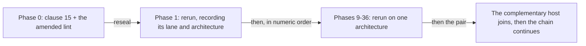

# Amoebius Development Plan

> **Purpose**: Provide the authoritative numeric phase order, current status, remaining work, and routing
> to each phase's human-authored validation contract.
> **Read this if**: the current phase, the next permitted work, or the location of a phase gate must be established.

This tracker owns phase order, status, and dated implementation progress. Each phase document owns its
capability-specific validation contract, while the universal source-snapshot postcondition is owned by
[development_plan_standards.md §S](development_plan_standards.md#s-universal-artifact-hygiene-gate).
Architecture remains owned by the doctrine suite under [`../documents/`](../documents/README.md).

Link-graph metadata

**Status**: Authoritative source
**Supersedes**: N/A
**Referenced by**: DEVELOPMENT_PLAN/development_plan_gate_integrity.md, DEVELOPMENT_PLAN/development_plan_phase_model.md, DEVELOPMENT_PLAN/development_plan_standards.md, DEVELOPMENT_PLAN/later_phases.md, DEVELOPMENT_PLAN/legacy_tracking_for_deletion.md, DEVELOPMENT_PLAN/legacy_tracking_for_deletion_archive.md, DEVELOPMENT_PLAN/overview.md, DEVELOPMENT_PLAN/phase_00_documentation_suite.md, DEVELOPMENT_PLAN/phase_01_toolchain_spike.md, DEVELOPMENT_PLAN/phase_02_repository_layout_conformance.md, DEVELOPMENT_PLAN/phase_03_artifact_calculus.md, DEVELOPMENT_PLAN/phase_04_budget_calculus.md, DEVELOPMENT_PLAN/phase_05_lift_calculus.md, DEVELOPMENT_PLAN/phase_06_workflow_calculus.md, DEVELOPMENT_PLAN/phase_07_evidence_calculus.md, DEVELOPMENT_PLAN/phase_08_scope_index.md, DEVELOPMENT_PLAN/phase_09_resource_index.md, DEVELOPMENT_PLAN/phase_10_calculus_composition.md, DEVELOPMENT_PLAN/phase_11_formal_model_kernel.md, DEVELOPMENT_PLAN/phase_12_explicit_state_checker.md, DEVELOPMENT_PLAN/phase_13_symbolic_checker.md, DEVELOPMENT_PLAN/phase_14_refinement_checker.md, DEVELOPMENT_PLAN/phase_15_compile_fail_harness.md, DEVELOPMENT_PLAN/phase_16_deterministic_sim_substrate.md, DEVELOPMENT_PLAN/phase_17_gateway_migration_model.md, DEVELOPMENT_PLAN/phase_18_dsl_formal_model.md, DEVELOPMENT_PLAN/phase_19_reconcile_core_simulation.md, DEVELOPMENT_PLAN/phase_20_extension_declaration.md, DEVELOPMENT_PLAN/phase_21_extension_laws_per_extension.md, DEVELOPMENT_PLAN/phase_22_extension_laws_compositional.md, DEVELOPMENT_PLAN/phase_23_extension_security_laws.md, DEVELOPMENT_PLAN/phase_24_conformance_gate_generator.md, DEVELOPMENT_PLAN/phase_25_dhall_schema_generation.md, DEVELOPMENT_PLAN/phase_26_gadt_decode_ir.md, DEVELOPMENT_PLAN/phase_27_illegal_state_covering.md, DEVELOPMENT_PLAN/phase_28_storage_geometry_folds.md, DEVELOPMENT_PLAN/phase_29_execution_accelerator_folds.md, DEVELOPMENT_PLAN/phase_30_capability_bind.md, DEVELOPMENT_PLAN/phase_31_provision_seal.md, DEVELOPMENT_PLAN/phase_32_inference_accelerator_provision.md, DEVELOPMENT_PLAN/phase_33_render_manifest_oracles.md, DEVELOPMENT_PLAN/phase_34_chain_kernel_boundary.md, DEVELOPMENT_PLAN/phase_35_image_recipe_generation.md, DEVELOPMENT_PLAN/phase_36_transaction_vocabulary.md, DEVELOPMENT_PLAN/phase_37_ui_program_schema.md, DEVELOPMENT_PLAN/phase_38_ui_authorization_kernel.md, DEVELOPMENT_PLAN/phase_39_ui_effect_binding.md, DEVELOPMENT_PLAN/phase_40_ui_plan_compiler.md, DEVELOPMENT_PLAN/phase_41_offline_language_plan.md, DEVELOPMENT_PLAN/phase_42_ui_browser_interpreter.md, DEVELOPMENT_PLAN/phase_43_ui_server_boundary.md, DEVELOPMENT_PLAN/phase_44_ui_local_composition.md, DEVELOPMENT_PLAN/phase_45_encrypted_browser_runtime.md, DEVELOPMENT_PLAN/phase_46_ui_contract_generation.md, DEVELOPMENT_PLAN/phase_47_tool_and_mutant_generation.md, DEVELOPMENT_PLAN/phase_48_test_workflow_algebra.md, DEVELOPMENT_PLAN/phase_49_self_referential_gates.md, DEVELOPMENT_PLAN/phase_50_host_assert_cli.md, DEVELOPMENT_PLAN/phase_51_host_ensure_kernel.md, DEVELOPMENT_PLAN/phase_52_linux_engine_bringup.md, DEVELOPMENT_PLAN/phase_53_apple_engine_bringup.md, DEVELOPMENT_PLAN/phase_54_windows_engine_bringup.md, DEVELOPMENT_PLAN/phase_55_bootstrap_coordinator_kind.md, DEVELOPMENT_PLAN/phase_56_base_image_registry.md, DEVELOPMENT_PLAN/phase_57_complementary_arch_child.md, DEVELOPMENT_PLAN/phase_58_object_reconciler.md, DEVELOPMENT_PLAN/phase_59_capacity_scheduler.md, DEVELOPMENT_PLAN/phase_60_retained_storage.md, DEVELOPMENT_PLAN/phase_61_vault_pki.md, DEVELOPMENT_PLAN/phase_62_platform_backbone.md, DEVELOPMENT_PLAN/phase_63_platform_services_2.md, DEVELOPMENT_PLAN/phase_64_keycloak_ingress.md, DEVELOPMENT_PLAN/phase_65_live_dsl_deploy.md, DEVELOPMENT_PLAN/phase_66_app_tenancy.md, DEVELOPMENT_PLAN/phase_67_pulsar_client.md, DEVELOPMENT_PLAN/phase_68_user_tenant_isolation_live.md, DEVELOPMENT_PLAN/phase_69_content_store_workflow.md, DEVELOPMENT_PLAN/phase_70_ui_projection_runtime.md, DEVELOPMENT_PLAN/phase_71_release_lifecycle.md, DEVELOPMENT_PLAN/phase_72_ui_program_release.md, DEVELOPMENT_PLAN/phase_73_network_fabric_wireguard.md, DEVELOPMENT_PLAN/phase_74_multicluster_spawn_georepl.md, DEVELOPMENT_PLAN/phase_75_gateway_migration_drills.md, DEVELOPMENT_PLAN/phase_76_provider_deploy_checkpoint.md, DEVELOPMENT_PLAN/phase_77_provider_child_bringup.md, DEVELOPMENT_PLAN/phase_78_provider_ebs_credential.md, DEVELOPMENT_PLAN/phase_79_provider_dynamic_nodes.md, DEVELOPMENT_PLAN/phase_80_determinism_jitcache.md, DEVELOPMENT_PLAN/phase_81_ui_single_tenant_live.md, DEVELOPMENT_PLAN/phase_82_ui_multi_tenant_live.md, DEVELOPMENT_PLAN/phase_83_ui_rollout_reconnect.md, DEVELOPMENT_PLAN/phase_84_ui_ha_multizone.md, DEVELOPMENT_PLAN/phase_85_offline_replay_receipts.md, DEVELOPMENT_PLAN/phase_86_offline_blobs_isolation.md, DEVELOPMENT_PLAN/phase_87_offline_release_evolution.md, DEVELOPMENT_PLAN/phase_88_offline_multizone_continuity.md, DEVELOPMENT_PLAN/phase_89_apple_metal_host_daemon.md, DEVELOPMENT_PLAN/phase_90_test_topology_live.md, DEVELOPMENT_PLAN/phase_91_infernix_rederivation.md, DEVELOPMENT_PLAN/phase_92_infernix_ui_rederivation.md, DEVELOPMENT_PLAN/phase_93_jitml_rederivation.md, DEVELOPMENT_PLAN/phase_94_jitml_ui_rederivation.md, DEVELOPMENT_PLAN/phase_95_webapp_rederivation.md, DEVELOPMENT_PLAN/substrates.md, DEVELOPMENT_PLAN/system_components.md, README.md, documents/README.md, documents/documentation_standards.md, documents/engineering/README.md, documents/engineering/app_vs_deployment_doctrine.md, documents/engineering/apple_metal_headless_builds.md, documents/engineering/backup_recovery_doctrine.md, documents/engineering/bootstrap_sequence_doctrine.md, documents/engineering/browser_offline_runtime_doctrine.md, documents/engineering/capability_extension_doctrine.md, documents/engineering/chaos_failover_doctrine.md, documents/engineering/chaos_failover_second_axis.md, documents/engineering/chaos_failover_worked_examples.md, documents/engineering/cluster_lifecycle_doctrine.md, documents/engineering/cluster_topology_doctrine.md, documents/engineering/conformance_harness_doctrine.md, documents/engineering/consistency_pacelc_doctrine.md, documents/engineering/content_addressing_determinism.md, documents/engineering/content_addressing_doctrine.md, documents/engineering/daemon_topology_doctrine.md, documents/engineering/deterministic_simulation_doctrine.md, documents/engineering/diagram_conventions.md, documents/engineering/dsl_doctrine.md, documents/engineering/evidence_calculus_doctrine.md, documents/engineering/extension_conformance_doctrine.md, documents/engineering/extension_conformance_laws.md, documents/engineering/extension_conformance_security.md, documents/engineering/extension_conformance_transactions.md, documents/engineering/formal_model_doctrine.md, documents/engineering/gateway_migration_doctrine.md, documents/engineering/gateway_migration_model_doctrine.md, documents/engineering/generated_artifacts_doctrine.md, documents/engineering/host_cluster_comms_doctrine.md, documents/engineering/image_build_doctrine.md, documents/engineering/inforcespec_migration_doctrine.md, documents/engineering/jit_artifact_doctrine.md, documents/engineering/jit_budget_doctrine.md, documents/engineering/lift_and_compose_doctrine.md, documents/engineering/low_code_ui_runtime_doctrine.md, documents/engineering/low_code_ui_workflow_lifting.md, documents/engineering/manifest_generation_doctrine.md, documents/engineering/migration_doctrine.md, documents/engineering/monitoring_doctrine.md, documents/engineering/namespace_layout_doctrine.md, documents/engineering/network_fabric_doctrine.md, documents/engineering/platform_services_doctrine.md, documents/engineering/preflight_validation_doctrine.md, documents/engineering/pulsar_client_doctrine.md, documents/engineering/pulumi_ebs_credential_model.md, documents/engineering/pulumi_iac_doctrine.md, documents/engineering/readiness_ordering_doctrine.md, documents/engineering/release_lifecycle_doctrine.md, documents/engineering/repository_layout_doctrine.md, documents/engineering/resource_capacity_construction.md, documents/engineering/resource_capacity_doctrine.md, documents/engineering/resource_capacity_folds.md, documents/engineering/resource_capacity_schema.md, documents/engineering/resource_capacity_sources.md, documents/engineering/resource_capacity_storage.md, documents/engineering/resource_capacity_types.md, documents/engineering/service_capability_doctrine.md, documents/engineering/single_logical_data_plane_doctrine.md, documents/engineering/storage_lifecycle_doctrine.md, documents/engineering/substrate_doctrine.md, documents/engineering/substrate_node_inventory.md, documents/engineering/tenancy_doctrine.md, documents/engineering/test_derivation_analysis.md, documents/engineering/testing_doctrine.md, documents/engineering/testing_spoof_resistance.md, documents/engineering/ui_realtime_coordination_doctrine.md, documents/engineering/validation_frame_doctrine.md, documents/engineering/vault_pki_doctrine.md, documents/engineering/workflow_calculus_doctrine.md, documents/glossary.md, documents/illegal_state/README.md, documents/illegal_state/illegal_state_catalog.md, documents/illegal_state/illegal_state_lifecycle.md, documents/illegal_state/illegal_state_security.md, documents/illegal_state/illegal_state_techniques.md, documents/illegal_state/illegal_state_tenancy.md, documents/reading_order.md
**Generated sections**: none

## Contents
- [Phase discipline](#phase-discipline)
- [Repository and evidence discipline](#repository-and-evidence-discipline)
- [Toolchain](#toolchain)
- [Document index](#document-index)
- [Status vocabulary](#status-vocabulary)
- [Implementation-progress vocabulary](#implementation-progress-vocabulary)
- [Definition of Done](#definition-of-done)
- [Reopened numeric sequence](#reopened-numeric-sequence)
- [Current implementation audit](#current-implementation-audit)
- [Phase overview](#phase-overview)
- [Related Documents](#related-documents)

---

amoebius is one Haskell runtime with command, host-daemon, control-plane daemon, scheduler, and worker responsibilities.
The Python `pb` bootstrap coordinator exists only before binary handoff and as the later admin-REST client.
The constituent prodbox, infernix, jitML, and hostbootstrap capabilities converge as libraries and
behaviours rather than separate products.

## Phase discipline

1. Phases close strictly in numeric order. Phase N+1 cannot close or begin new implementation work before
   Phase N satisfies its redesigned gate.
2. Each phase document owns one cohesive capability claim and one acceptance command.
3. Every gate inherits the artifact-hygiene postcondition in
   [development_plan_standards.md §S](development_plan_standards.md#s-universal-artifact-hygiene-gate).
4. Every hardware substrate can run the `linux-cpu` baseline **at its own natural architecture and no
   other**. Pristine Linux uses Incus on Linux or Linux-CUDA, Lima on Apple at `arm64`, and WSL2 on Windows at
   `amd64`. A gate names its lane with that architecture; nothing is emulated or cross-built
   ([substrate_doctrine.md §1.1](../documents/engineering/substrate_doctrine.md#11-the-natural-architecture-rule)).
5. A gate may additionally require at most one specialized lane — Apple, Linux-CUDA, or Windows. The baseline cannot
   substitute for a specialized claim, and one architecture cannot substitute for the other.
6. Register 1 is pure/golden, Register 2 is boundary-with-fakes, and Register 3 is live. Register 2.5 is a
   deterministic-simulation activity, never a phase-gate register.
7. Missing prerequisites fail; they never skip to green. Unreached applicable layers remain UNVERIFIED.

## Repository and evidence discipline

Only human-authored inputs and reviewed external source are version-controlled. Generated projections,
compiled output, lock/freeze files, package checksum databases, hard-coded library or package SHA values,
resolved paths, test enumeration, ledgers, receipts, logs, reports, screenshots, and generated
documentation remain untracked.

All amoebius-owned state stays under the physical checkout. `.build/**` owns reproducible, transient, and
evidentiary output; `.data/**` owns production runtime and durable state; `.test_data/**` owns exclusively
harness-created test state. Immutable run attestations live in `.build/evidence-store/**`. The complete
repository tree, output inventory, lifecycle rules, and normative `.gitignore`/`.dockerignore` patterns
are owned by
[repository_layout_doctrine.md](../documents/engineering/repository_layout_doctrine.md).

## Toolchain

Compilers, package tools, libraries, code generators, browsers, and transitive dependencies resolve
dynamically from authored compatibility requirements. Every clean run records the selected versions,
source identities, dependency graph, executable paths, and observed integrity data under `.build/toolchain/`
and `.build/locks/`, then binds them into repository-local evidence. No generated resolution is copied into Git.

**No requirement is expected on the developer host**, per the ensure rule of
[development_plan_standards.md §F](development_plan_standards.md#f-the-sprint-block-format). The floor it
leaves behind is authored data evaluated before any requirement resolves, so an unsupportable host is named
along with its remedy rather than discovered as a symptom. Every authored platform key is the one canonical
`<os>-<arch>` token, and a publisher that offers no asset for the host's architecture is a refusal, never a
substitution.

## Document index

| Document | Role |
|---|---|
| [development_plan_standards.md](development_plan_standards.md) | The plan rulebook's hub: every section heading and anchor, and the document-form rules |
| [development_plan_phase_model.md](development_plan_phase_model.md) | Rulebook slice: status vocabulary, the phase model, honesty, substrate discipline, reopening and re-baselining |
| [development_plan_gate_integrity.md](development_plan_gate_integrity.md) | Rulebook slice: gate integrity, universal artifact hygiene, reconciliation, and the final repository layout |
| [overview.md](overview.md) | Target architecture and cross-cutting invariants |
| [system_components.md](system_components.md) | Implemented, substituted, missing, generated, and planned component inventory |
| [substrates.md](substrates.md) | Hardware/substrate registry and pristine-host routing |
| [legacy_tracking_for_deletion.md](legacy_tracking_for_deletion.md) | Current-tree and history divergences, owners, and closure conditions |
| [Repository Layout and Artifact Provenance](../documents/engineering/repository_layout_doctrine.md) | Complete authored/generated tree, dynamic resolution, and ignore/context contract |
| [Conformance Harness Doctrine](../documents/engineering/conformance_harness_doctrine.md) | Validation registers and boundary discipline |
| [Deterministic Simulation Doctrine](../documents/engineering/deterministic_simulation_doctrine.md) | Register-2.5 scheduling and replay discipline |
| [Lift and Compose Doctrine](../documents/engineering/lift_and_compose_doctrine.md) | Sibling-source migration and convergence rules |
| `phase_0_*.md` … `phase_82_*.md` | One human-authored capability and validation contract per phase |
| [later_phases.md](later_phases.md) | In-scope phases not yet assigned an integer document |

## Status vocabulary

✅ Done · 🔄 Active · 📋 Planned · ⏸️ Blocked · 🧪 Live-proof pending. Definitions live in
[development_plan_standards.md §C](development_plan_standards.md#c-status-vocabulary). The former
non-standard `🟡 Scoped` marker is retired. A scoped historical result is diagnostic, not a current status.

## Implementation-progress vocabulary

Status is a gate decision; progress is a dated repository observation. **No footprint observed**, **Observed
footprint**, **Known partial**, and **Policy-conformant** have the exact meanings in
[development_plan_standards.md §C](development_plan_standards.md#c-status-vocabulary). Source, tests, a gate
script, or an old run can establish only an observed footprint. Only the redesigned current gate plus its
verified repository-local attestation can establish Policy-conformant progress or support ✅ Done.

## Definition of Done

A phase is Done only when all of the following are true:

1. Its phase-specific acceptance command passes in the declared register and substrate, against a recorded
   source snapshot of every non-ignored file.
2. Its runtime-generated surface enumeration joins completely to independently authored expectations.
3. Applicable mutants, negative controls, external observers, authority pairs, and cleanup checks pass.
4. All deliberate generated files stay under ignored output roots; source-adjacent ignored Python interpreter
   caches are the sole exception, and no other command writes beneath an authored root.
5. Nothing the gate ran altered a tracked file, and it left no unignored path behind.
6. The Docker context contains no generated output, evidence, cache, dependency tree, secret, or runtime state.
7. The generated run bundle passes its schema and honesty checks.
8. An immutable repository-local attestation verifies against that source-snapshot digest and the phase contract.
9. The source snapshot contains every referenced authored input and passes the same documented gate with no
   ignored worktree file as an input.
10. Semantic provenance checks reject reproducible tracked copies, including generated fixtures placed beneath
    otherwise authored roots.
11. A before/after host inventory proves that the gate created no amoebius-owned state outside the checkout.
12. Production state uses only `.data/**`; normal teardown preserves durable descendants.
13. Tests use only one marker-owned `.test_data/runs/<run-id>/**` root, fail fast on production state, and
    delete only that exact root after verifying ownership.
14. `test-secrets.dhall` is the sole cleartext secret-at-rest, is read only by the elevated test harness, is
    never copied or emitted, and is rejected by all production entry points.

Markdown never embeds the generated ledger, receipt, hash, transcript, or dependency resolution. A human
status decision may link the content-addressed run reference. A prior seal cannot satisfy Done, and neither can a run whose
source snapshot no longer matches the tree. **When the operator commits is their own affair and never a gate
condition** ([development_plan_standards.md §S](development_plan_standards.md#s-commit-timing)).

## Reopened numeric sequence

### The 2026-08-20 covering closure, and Phase 0's reseal

The re-baseline left three obligations on Phase 0's gate, and two of them were checks the day it landed. The
third — [§S](development_plan_gate_integrity.md#s-universal-artifact-hygiene-gate) clause 16, the illegal-state
covering — was red on eleven cells for which the router said plainly that no honest reason could be written,
because the instrument could not tell an empty cell from an unpaired one. The argument is
[Sprint 0.16](phase_00_documentation_suite.md#sprint-016-the-covering-as-a-measurement-)'s; what follows is
what changed in the plan.

**The estimate is replaced by a measurement.** Every catalogue entry now pairs each foreclosure it makes to the
one locus that observes it, on an authored `Cells:` line. Occupancy falls from 143 credited cells to the 64
the entries assert, which is the size of the error the product had been hiding. A second authored input, the
admissibility relation between the two axes, forecloses 154 more cells for a structural reason — a locus
downstream of the check that forecloses a state never sees that state, and a locus upstream of an effect
cannot settle a residue about it — leaving 34 empty admissible cells, each with a reason, and none owing one.

**Six defects surfaced that every green gate had missed**, all of them concealed by the product. Five entries
claimed a foreclosure layer at no locus at all, which is a claim with nothing behind it; one image state was
recorded as having no runtime residue where its entry plainly claims one; and one justification row asserted
that no `image` state is ever observed live, which was false and is deleted. Twenty-eight further entries
stated the layer of one part of their claim and left the rest unnamed.

**Four checks added**, because the review's finding is again that all of this coexisted with a clean lint:
`c1` (an entry that pairs nothing, or pairs a layer its own text never states), `c2` (a pairing the relation
forbids), `c3` (an admissible empty cell with no reason), and `c4` (six seeded defects that must each turn the
covering red). The foreclosure layer also becomes a column of `locus_registry.tsv`, so a Phase-27 fixture
cannot pin a cell the catalog never claimed.

**Consequence for order of work.** Phases 0 through 41 are ✅ Done and Phase 42 is the open contract. The
remaining phases stay Blocked in numeric order, each pending its predecessor's revalidation. Phases 1 and 2
needed no amendment to reopen and close: the five calculi the re-baseline named sit at phases 3–7, above both,
so what each owed was a pass of the current gate against a current snapshot rather than a new deliverable.
Phases 3 through 7 are different in kind — they are inserted calculi with no prior seal, and none of their
gate scripts existed. All five are now built, which is what makes the phases above them decidable rather than
pending: the re-baseline's whole reason for reopening every contract was that the five calculi change what
each gate must cover, and a contract cannot be checked against a calculus that does not exist.

### The 2026-08-20 conformance review

The re-baseline moved every ordinal and added eight documents, but most of the prose describing the world it
created had been swept rather than re-derived. A review of the whole corpus found roughly two hundred and fifty
defects across four kinds, and none had been caught by any check.

**Doctrine arguments repaired.** The closure argument of
[`extension_conformance_doctrine.md` §7](../documents/engineering/extension_conformance_doctrine.md#7-link-time-union-closure)
read as a theorem and is a finite pairwise test; it now says so, and records that a proof of C1 is owed. The
claim that the security family "adds no power" is withdrawn — three of its six laws reach where no L-law does,
so the closure argument does not carry them across a seam, and nothing yet closes that. A digest is described as
total and collision-resistant rather than injective, which it cannot be. C7 is restated so two extensions
rendering identical content name one artifact instead of failing a disjointness assertion. The fifth calculus
gained the owner it never had, in
[`evidence_calculus_doctrine.md`](../documents/engineering/evidence_calculus_doctrine.md).

**Two contradictions closed.** `repository_layout_doctrine.md` recorded `source-repository-package` entries on
two seeds as the achieved target state, which
[`lift_and_compose_doctrine.md` §2](../documents/engineering/lift_and_compose_doctrine.md#2-the-two-non-dependencies)
forbids by name; and `image_build_doctrine.md`'s image-identity section framed the tagging scheme as an open
question that its own [published-tag rule](../documents/engineering/image_build_doctrine.md#21-a-published-tag-is-a-cache-warm-up-and-its-name-is-the-content-address)
had already decided.

**Three corrections to this plan's own claims.** The register cut is **51/52**, not 49/50 — the two pre-binary
phases at 50 and 51 are Register 2 against a committed fake-host boundary. There are **nine** bands, not eight.
And `Phase scope` was present in all 96 contracts rather than missing from 63, but 63 of them repeated the
document's own Purpose blockquote and so carried nothing.

**The covering closed.** The case-family axis was described rather than enumerated, and the generator inferred
it from the entries it measured — so a family nothing declared produced no cells, and the covering could not
report the one thing it exists to report. The axis is now declared at fourteen members, the generator reads
that declaration, and the grid resolves 252 cells with 11 owing a reason for the documented reason that they
are *unknown* rather than empty.

**Four checks added**, because the review's real finding is that all of this coexisted with a clean lint:
`phase_contract_lint`'s `d5` (a scope that restates its purpose), `d6` (clause 13 neither discharged nor
excused — 67 contracts were silent), `d7` (a completion marker surviving in a reopened phase), and `d8`, which
recomputes every band, register and substrate claim the plan makes about itself from the contracts.

### The 2026-08-19 generative re-baseline

The plan sequenced a closed DSL that lifted its sibling projects. amoebius is an **open core** whose lawful
instances are domains and hardware substrates, it depends on no seed project, and every artifact that is not
Haskell source is generated from Haskell types. Twenty-one phases are inserted for capabilities that had no
owner — the five calculi, the two indices, the amoebius-owned proof stack, the extension contract, and the
generative classes — one phase splits into a pure half and a live half, and the sequence is re-ordered so the
algebra precedes every instance of it. The count goes from 75 to 96. The exhaustive old-to-new map is recorded
in [legacy_tracking_for_deletion.md](legacy_tracking_for_deletion.md#the-audit-map), as
[§E](development_plan_phase_model.md#e-one-canonical-phase-model) requires.

**It reopens every phase.** Four things every gate rests on are different afterwards: where the Dhall schema
comes from, what an expectation over rendered output is, whether releasing a resource is optional, and who
maintains the checkers. No prior seal survives that, so every sealed phase loses ✅ and its attestation becomes
history rather than completion evidence
([§N](development_plan_phase_model.md#n-reopening-and-amending-a-phase)). The two phases green on 2026-08-19
are reopened with the rest: their host capability is unaffected, but a host gate under the lift calculus is not
the gate they passed.

**Consequence for order of work.** Phase 0 is Active and every other phase is Blocked, returning to work in
numeric order. The register cut moves from 34/35 to **51/52**: everything at or below 51 is a statement about
values — the two pre-binary phases at 50 and 51 reach Register 2 against a committed fake-host boundary — and
the first gate needing a machine is the Linux engine bringup at 52
([§K](development_plan_phase_model.md#k-honesty-proven--tested--assumed)). Two new gate obligations land with
it — [§M](development_plan_gate_integrity.md#m-gate-integrity-a-gate-cannot-be-passed-by-a-stub) clause 13,
extension-conformance discharge, and
[§S](development_plan_gate_integrity.md#s-universal-artifact-hygiene-gate) clause 16, the illegal-state
covering — and each is owed by every phase it applies to, in numeric order.

### The 2026-08-17 one-binary-many-roles amendment

The role a running copy of the binary holds is a **decoded value** on its frame config, not the identity of
the file that was executed
([`daemon_topology_doctrine.md` §2](../documents/engineering/daemon_topology_doctrine.md#2-context--role-an-orthogonal-grid)).
The suite said "one binary" in a dozen places and then drew four of them in the target tree; the union naming
the roles was written three times — in the schema, and in two doctrine documents — with no two agreeing on
its arms; and the context × role grid stayed prose, so the grid's empty cells were foreclosed by nothing. The
grid is now a closed `Process` union with a named schema module to carry it, `app/`'s second level has one
name, and the two states the shape forecloses are catalogued as 3.89 and 3.90.

**Consequence for order of work: none.** Phase 0 reopened and resealed the same day under
[§N](development_plan_phase_model.md#n-reopening-and-amending-a-phase), gaining
[Sprint 0.13](phase_00_documentation_suite.md#sprint-013-one-binary-many-roles-). Phase 1 is Active and
untouched by this change. Every other phase is Blocked, so amending its contract invalidates no seal —
Phases 25, 25, 33, 39, 41, 61 and 77 each gain or sharpen a deliverable. What the amendment condemns in code is
recorded in
[`legacy_tracking_for_deletion_archive.md`](legacy_tracking_for_deletion_archive.md#one-binary-many-roles--2026-08-17),
including the finding that **neither the dhall-typecheck nor the gadt-decode gate can run today**: both resolve their
oracles under a `tests/` directory the tree does not have.

### The 2026-08-17 host-ensure amendment

A tool with a supported install plan is **ensured**, never recorded as a prerequisite
([`substrate_doctrine.md` §3](../documents/engineering/substrate_doctrine.md#3-the-no-environment--no-path-lazy-tool-ensure-contract)).
[§F](development_plan_standards.md#f-the-sprint-block-format)'s `host-toolchain` token contradicted that by
naming six binaries a developer had to supply — two of which the resolver was already acquiring — and the
doctrine suite had never written down what a host must supply instead. The token is replaced by `host-floor`,
pointing at the per-substrate floor now stated in
[§3.1](../documents/engineering/substrate_doctrine.md#31-the-per-substrate-floor-what-only-the-operator-can-supply);
`accelerator-device-plugin` is retired because the device plugin is a DaemonSet the reconciler renders like
every other operator install. The vocabulary is now parsed from the rulebook's own table and joined to the
declaring phases in both directions, which immediately found two phases the table listed that declared
nothing and one that declared a token its row omitted.

**Consequence for order of work: none.** Only Phase 0 was Done, and it reopened and resealed the same day
under [§N](development_plan_phase_model.md#n-reopening-and-amending-a-phase). Phase 1 was already Active and
gains [Sprint 1.7](phase_01_toolchain_spike.md#sprint-17-discover-then-ensure--the-resolver-acquires-what-it-needs-).
Every other phase was Blocked, so amending its contract invalidates no seal. What the amendment condemns is
recorded in
[`legacy_tracking_for_deletion_archive.md`](legacy_tracking_for_deletion_archive.md#host-ensure-amendment--2026-08-17).

### The 2026-08-16 natural-architecture amendment

It **reopens every phase**, and re-baselines the sequence. Its
predicate is [development_plan_gate_integrity.md §S](development_plan_gate_integrity.md#s-universal-artifact-hygiene-gate)
clause 15: a run records the natural architecture it proved, and executes no artifact of another. No seal
recorded before 2026-08-16 names an architecture, and the one that named two reached the second under an
emulator, so no prior seal satisfies the amended gate. Phase 0 adopted the clause and resealed on 2026-08-17;
Phase 1 is Active and Phases 9–74 are Blocked, each returning to work only in numerical order after its
predecessor validates.

The re-baseline is the amendment's second half. No host can build an architecture it cannot execute, so the
old Phase 41 — one gate claiming a two-architecture image — became two: Phase 41 builds, proves, and publishes
its own architecture's child, and a new **Phase 85** does the same on the complementary substrate and joins
both into one attested index. Old phases 26–64 shift to 27–65 (that re-baseline's own record, not this one's); the audit map is recorded in
[legacy_tracking_for_deletion_archive.md](legacy_tracking_for_deletion_archive.md#natural-architecture-rebaseline--2026-08-16),
as [§E](development_plan_standards.md#e-one-canonical-phase-model) requires.

**Consequence for order of work.** Every phase reopens, so work restarts at Phase 0 and proceeds in numeric
order; a phase's rerun differs from its last one only by recording the architecture it ran on, except in the
image band where the contract itself changed. Phases 0–2 and 9–34 are substrate `none` and pure, so re-recording their
lane is a short run rather than a campaign. From Phase 57 onward the plan needs **two physical machines** — one
per architecture — which is a cost the amendment accepts rather than hides: a two-architecture image proven by
one machine was proven for one of them.

Each phase reruns its own gate and records the architecture that gate ran on; the containment criteria every
phase already inherited are unchanged and carry forward.

*Orientation. [Phase 0](phase_00_documentation_suite.md) adopts the architecture postcondition; each later phase reruns its own gate in numeric order, and the image band needs both machines.*

**Historical amendment record (superseded as status, retained as rationale):**

The **2026-08-15 repository-containment amendment** reopened every previously sealed phase without
renumbering, because the older contract admitted `.build/`'s predecessor, system temporary roots, user-home
state, and host-global container-engine data. Phase 0 validated the closed root set, both ignore contracts,
production rejection of `test-secrets.dhall`, test/production root separation, and a host-inventory negative
that detects any escaped path or global engine resource; each later phase then migrated its own paths, cleared
its rows in the legacy register, and reran its capability gate. Those containment criteria remain in force —
this amendment adds to them rather than replacing them.

The 2026-08-11 generated-artifact amendment reopened every phase — then numbered 0–68 — without renumbering them.

1. **Phase 0 adopted and sealed the repository-containment boundary on 2026-08-15.** Its ten-sided gate is
   green with 17 independently seeded policy rules, project-contained run evidence and attestation, and an
   unchanged outside-host inventory. The whole-tree containment scanner attributes 158 legacy callers to
   their numerical owner phases; none is a Phase-0 deferral.

2. **Phase 0 was reopened again on 2026-08-14 by the final-layout amendment, and resealed the same day.**
   [development_plan_standards.md §U](development_plan_standards.md#u-the-final-repository-layout) makes the
   target repository tree normative and gives it to Phase 0. The tree in
   [`repository_layout_doctrine.md` §2](../documents/engineering/repository_layout_doctrine.md#2-complete-repository-structure)
   had enumerated thirty-one roots and called itself exhaustive, but nothing compared it to the worktree, so
   its rule that a new root needs an amendment first had never decided anything. [§2](../documents/engineering/repository_layout_doctrine.md#2-complete-repository-structure) is now the target final
   layout at fourteen roots; Phase 0 owns the check that the tree matches, the no-phase-ordinal rule of [§U](development_plan_standards.md#u-the-final-repository-layout)
   clause 3, and the ignore contracts that are now exhaustive in both directions. Every divergence is recorded
   in
   [`legacy_tracking_for_deletion_archive.md`](legacy_tracking_for_deletion_archive.md#layout-and-naming-divergence-snapshot--2026-08-14)
   with an owner and a closure condition, deferred on the shrink-only terms
   [§S clause 5](development_plan_standards.md#s-universal-artifact-hygiene-gate) already sets. The three
   checks and the write-guard repair landed as Sprint 0.9; 876 findings are deferred with owners, none of
   them Phase 0's, and the phase resealed with all nine sides passing.
   A **re-baseline follows**, not precedes, that work: the third-party monocontainer bake moves to immediately
   after the toolchain phase, because its dependency floor is the toolchain and not the DSL, and the runtime
   image and registry publication stay in the live sequence. It is sequenced after the de-phasing because a
   re-baseline is documentation-only once no path names a phase, and it lands with the audit map
   [§E](development_plan_standards.md#e-one-canonical-phase-model) requires. Both obligations are recorded in
   [`legacy_tracking_for_deletion_archive.md`](legacy_tracking_for_deletion_archive.md#layout-and-naming-divergence-snapshot--2026-08-14).
3. **Phase 0 was reopened and resealed on 2026-08-13.** Its deliverables — the provenance classifier,
   generator registry, authored-root write guard, semantic generated-file scan, source-snapshot verification,
   ignore/context coverage, reachable-history audit, external-attestation validation, and the documentation
   lints — were sealed on 2026-08-12. Once commit `0526152` first tracked this phase's own machinery, the
   audit began scanning its own seeded negative corpora and the `policy` side went red. The finding belonged
   to Phase 0, which cannot defer what it owns; it closed by declaring the corpora as one authored set and
   is sealed again.
4. **Phases 1, 2, 11, and 17 were previously Done.** Phase 1 replaced its pin manifest with authored compatibility requirements and a
   run-local resolver; Phases 11 and 17 migrated the formal-model and gateway-migration gates onto resolved
   toolchains, run-bundle ledgers, and run-time surface enumeration. Each was sealed on 2026-08-12 with a
   verified pre-containment external attestation, recorded in the historical phase record table below.
5. **The lowest phase not yet sealed is Active; every phase above it is Blocked.** In order, each must migrate
   enumeration and evidence to `.build/`, establish oracle provenance, adopt the authored-root write guard, rerun
   its capability gate, and publish a snapshot-bound repository-local attestation. The phase-overview table is the
   authority on which phase that currently is.
6. **Later phases remain Planned.** They inherit the redesigned doctrine from their first authored contract.

Prior implementation and run records may guide diagnosis. They do not allow a phase to skip its reopened
gate or numeric predecessor.

### The 2026-08-13 secrets amendment reopens Phases 25 and 26

Secrets reach a workload only from Vault, and a production config cannot express a secret value. That second
half is a statement about **dhall-typecheck and gadt-decode**, so it belongs to the phases that own them: Phase 25 gains the
shared `SecretRef` union and Phase 26 gains its decode-and-reject. Both were sealed on 2026-08-12; both are
reopened under [§N](development_plan_standards.md#n-reopening-and-amending-a-phase) with the reason dated in
their status blocks.

Locating the type anywhere later would be the forward dependency
[§E](development_plan_standards.md#e-one-canonical-phase-model) forbids: Phases 25 and 26 would keep claiming a
complete admission boundary while a higher-numbered phase quietly completed it.

**Consequence for order of work.** While 4 and 5 are Active, no phase above them begins new implementation
work ([phase discipline](#phase-discipline) rule 1). Both are pure Register-1 gates, so reclosing them is a
short run rather than a campaign, and phases 13–35 keep the seals they already hold — each is bound to the
snapshot it actually ran against, and this amendment does not touch what those gates cover.

**Vault before providers is now structural, not procedural.** Because a spec cannot be admitted until every
`SecretRef` it names resolves in Vault
([vault_pki_doctrine.md §3.4](../documents/engineering/vault_pki_doctrine.md#34-admission-proves-the-named-secret-exists-before-any-effect)),
no live provider phase can run before Phase 61 exists. The check ranges over the references a spec *names*,
so a spec naming none needs no Vault — which is what keeps Phases 36–39 free of any dependency on 34.

## Current implementation audit

**Current conclusion — 2026-08-22:** **Phases 0 through 49 are Policy-conformant; no higher phase is.** [§C](development_plan_standards.md#c-status-vocabulary) reserves that term for a pass of the *current* gate,
and the generative re-baseline changed what every current gate covers. Phases 0–7 re-established the plan,
repository, toolchain, and five inserted calculi. Phases 8–40 then closed in numeric order over the scoped
indices, calculus composition, formal-checker stack, simulation/models, extension-law stack, typed schema and
capacity/provision/render/chain/image/transaction seams, and the checked UI schema, authorization, binding,
paired-plan compiler, offline-language, generic-browser-interpreter, authenticated UI-server, encrypted
offline-browser, generated browser-contract, generated checking-corpus, pure test-workflow-algebra, and self-referential gate boundaries. Those fifty rows below are current results; every higher row remains
an **observed footprint** or planned work against a contract that has not yet been revalidated.

**An attestation reference names the run, not the tree that records it.** Writing a digest into this tracker
changes the corpus the digest was taken over, so no seal can cite a hash of the tree containing its own
citation. Each row above cites the run that built or resealed that phase, and this record follows it; a later
run differs from the cited one by exactly that record, which is a fact about self-reference rather than a gap
in the evidence.

**What that leaves possible, and what it does not.** Sealing phase N changes the tree phase N−1 sealed
against, so a sweep that writes its record between runs leaves every seal on a different snapshot. A sweep
that writes nothing until it finishes does not. On 2026-08-20 the eight current gates were run back to back
with no authored edit between them, and all eight bound to one source snapshot,
`sha256:ead199b3c3f1ee63…` over 2,139 files.

| Phase | Gate | Attestation over `sha256:ead199b3c3f1ee63…` |
|---|---|---|
| 0 | `python3 tools/doc_lint_verify.py` | `sha256:f106228fe9ba2a1…` |
| 1 | `python3 tools/toolchain_spike_gate.py` | `sha256:7afae8bca2aa244…` |
| 2 | `python3 tools/repository_conformance_gate.py` | `sha256:14d006bbb1653a6…` |
| 3 | `python3 tools/artifact_calculus_gate.py` | `sha256:c67f6b31d1b33fc…` |
| 4 | `python3 tools/budget_calculus_gate.py` | `sha256:f6f43bf8da035ef…` |
| 5 | `python3 tools/lift_calculus_gate.py` | `sha256:d5c3e5343ed1551…` |
| 6 | `python3 tools/workflow_calculus_gate.py` | `sha256:a0f5c07982cd886…` |
| 7 | `python3 tools/evidence_calculus_gate.py` | `sha256:e1ea2aaedcc5c1a…` |

The self-reference is unchanged and is the only thing that survives it: the table names a snapshot the tree no
longer has, because the tree now contains the table. What a sweep can establish is that the eight gates agree
with each other about **one** tree, which is what the rows above say and what eight seals on eight snapshots
could not. The individual seals cited in each phase's own record stand as what they are — the run that built
or resealed that phase — and are not restated here.

**One thing the sweep caught rather than confirmed.** A Phase-1 run made while this session was still editing
tracked files failed its write guard, naming thirteen created paths and two modified ones. That is the guard
working: the run's snapshot was taken before the edits and compared after, so a gate cannot pass over a tree
that moved beneath it. The row above is a later run made with nothing in flight.

*The paragraphs that follow describe the pre-re-baseline conclusion and are retained as rationale.*

**Superseded conclusion — 2026-08-17:** Phases 0 and 1 were Policy-conformant; no other phase was.
[§C](development_plan_standards.md#c-status-vocabulary) reserves that term for a pass of the *current* gate,
and the current gate is [§S](development_plan_gate_integrity.md#s-universal-artifact-hygiene-gate) clause 15.
Phase 0's 2026-08-17 run is the first to satisfy it: it records the substrate, lane, and natural architecture
it executed on, and refuses a translated one. The current seal is the third of that day and covers
[Sprint 0.13](phase_00_documentation_suite.md#sprint-013-one-binary-many-roles-). Phase 1 followed the same
day on the host-ensure contract: the two tools its previous run declared missing are now acquired rather than
expected, so the phase seals on the host it stopped on rather than on a differently-provisioned one.
Every other row below stays at
**Observed footprint** or **Known partial**, which is a change of label, not a claim that the work is gone —
each phase's capability evidence stands as history and is what makes its rerun short.
The existing later-phase implementation still
uses legacy repository roots, system temp and data directories, user-home state, and host-global Docker
resources. The detailed pre-containment rows below are retained as historical capability observations; every
`Policy-conformant` label in them is invalidated for current status by the containment and
natural-architecture amendments alike.

The governed documentation lint and full Phase-0 verifier are sealed. The gate reports every remaining
containment migration as a shrink-only, owner-attributed deferral and writes all of its own state beneath
`.build/**`.

This is a static audit of clean commit `c8870a2` observed on **2026-08-11**. At inspection time it matched
`origin/master`; ignored paths, the effective source-closure boundary, reachable revision history, and
unreachable local objects were inspected separately. A clean or pushed commit is not automatically
policy-conformant. Exact counts, paths, historical findings, and actionable mismatches live in
[legacy_tracking_for_deletion_archive.md](legacy_tracking_for_deletion_archive.md#existing-code-divergence-snapshot--2026-08-11).

| Phase(s) | Progress | Observed state | Required next boundary |
|---|---|---|---|
| 0 | **Policy-conformant** | 2026-08-20, resealed against the re-baseline's added obligations: the thirteen-sided gate passes on natural `arm64`, untranslated, with 50 seeded documentation negatives red at their own checks, 49 surfaces joined to 90 implemented checks, 17 clean artifact rules, and a covering that resolves all 252 cells with none owing a reason. The reseal replaced the covering's product-credited occupancy with the pairing each catalogue entry now authors, which found six claims the estimate had concealed, and moved `phase_contract_lint`'s scratch tree inside the checkout. The deferral total is unchanged at 314. **Superseded observation —** 2026-08-17, resealed against the tree Phase 2 moved: the eleven-sided gate passes on natural `arm64`, untranslated, with 17 clean artifact rules, 49 seeded documentation negatives red at their own checks, and 37 surfaces joined to 77 implemented checks. The deferral total is 314, down from 876, because Phase 2 deleted every `r13` and `r15` row rather than re-owning it. The reseal also resolved the pre-implementation manifest pins and eleven contracts' artifact paths, which had named a pre-amendment ordinal since the ordering re-baseline | None. The next boundary belongs to Phase 26 |
| 1 | **Policy-conformant** | 2026-08-20, resealed on the contract Sprint 1.8 added: the twelve-sided gate passes on natural `arm64`, untranslated. `supernova` is reviewed source under `vendor/**`, the `patches/` root is deleted, and the clean-store build wrote no git checkout for it; the source-closure check gained the arm that forbids refetching a vendored package and a seeded reintroduction reddens it. The floor resolves with nothing expected on the host, two independent resolutions admit the same 260 packages, the same graph resolves from the 2,088-file source snapshot alone, all five probes match their authored expectations, both mutants redden, and 40 surfaces join to 62 enumerated items. **Superseded observation —** 2026-08-20, resealed on the reopened contract: the same twelve sides pass over a 2,055-file snapshot, with `supernova` still fetched from a branch head and patched into the run-local checkout. The re-baseline asked this phase for revalidation rather than a deliverable: the five calculi it named sit at phases 3–7, above this one. **Superseded observation —** 2026-08-17, resealed against the tree Phase 2 moved: the twelve-sided gate passes on natural `arm64`, untranslated. All 17 authored requirements resolve with none expected on the host, two independent resolutions admit the same 260 packages, the same graph resolves from the 1,965-file source snapshot alone, the representative set builds from an empty store, every probe matches its authored expectation, both mutants redden — the `drop-allow-newer` project regained the two sibling `source-repository-package` entries the merged package now needs, so it reddens at the seeded `proto`/`base` conflict rather than at an unknown package — and 40 surfaces join to 62 enumerated items | None. The next boundary belongs to Phase 26 |
| 2 | **Policy-conformant** | 2026-08-20, resealed a second time after Phase 1 vendored `supernova`: `one-package-declaration` had carried a literal list of the three `.cabal` paths that existed when it was written, and §2.1 admits two grounds — foreign provenance at `vendor/**`, foreign resolution at `probe/**` — rather than a list, so the check reported two packages the doctrine admits. It now derives the set from those roots and all fourteen sides pass over the 2,088-file snapshot. **Superseded observation —** 2026-08-20, resealed after the reopening observation closed: the fourteen-sided gate passes on natural `arm64`, untranslated, with `r13` and `r15` at zero findings and no allowlist row for either, all seven committed mutants red at their own check, and 29 surfaces joined to 29 enumerated items. `questions.txt` is no longer tracked, which is what `target-tree-clean` was reporting. The gate's mutant banner said six while seven ran and is now read from the registry. **Superseded observation —** 2026-08-17: the fourteen-sided gate passes on substrate `none`, lane `none`, natural `arm64`, untranslated. `test/`'s second level is exactly the seven role nouns over 1,084 files; fourteen package declarations are one, and `cabal build all --dry-run` and `cabal test all --dry-run` resolve against it; 468 authored paths, 216 build flags, and 43 `main-is` values carry a capability name rather than a phase ordinal; one mutant registry covers all 411 mutations, 99 of which no file named before; rules `r13` and `r15` report zero findings and the allowlist carries no row for either; all six committed mutants redden their own check and no other; 27 surfaces join to 27 enumerated items. The deferral total falls from 876 to 314. **Reopened by an observation on 2026-08-19**: `questions.txt` is tracked outside the section 2 target tree, so `target-tree-clean` reports one `r13` finding and the gate exits 1 | Untrack `questions.txt`; every other side is green |
| 7 | **Policy-conformant** | 2026-08-20, built from nothing: the thirteen-sided gate passes on natural `arm64`, untranslated. A hand-authored claim inventory for Phase 5 names seven claims, each bound to one fixture that exists on disk at a strength its fixture's kind entitles it to; the four calculus modules carry no ambient read and no partial token; the suite reaches its acceptance token with twelve checks green; the claim with no fixture and the gate with no register each have no type; and all three seeded mutants redden their own locus and no other. This is the phase where the self-referential gap is nearest — a gate checking a calculus about evidence, using evidence — and what stands in for independence is that the inventory is a *different* phase's, hand-written from that phase's contract, so the derivation being wrong and the inventory being wrong are two errors rather than one | None. The next boundary belongs to Phase 8 |
| 6 | **Policy-conformant** | 2026-08-20, built from nothing: the thirteen-sided gate passes on natural `arm64`, untranslated. An independently authored obligation ledger names eight obligations over five workflows and every one is replayed against what the run recorded; the four calculus modules carry no ambient read and no partial token; the suite reaches its acceptance token with ten checks green; three compile-fail pairs are red at the reason each asserts — a workflow ending while it still owes, a transfer stating no condition, and a discharge of an obligation never held; and all three seeded mutants redden their own locus and no other. The ledger asks three questions rather than one because the three ways an obligation can be mishandled are invisible to each other: dropping one breaks set equality and leaves multiplicity intact, doubling one does the reverse, and a transfer recorded as a teardown leaves both untouched | None. Phase 7 sealed after it |
| 5 | **Policy-conformant** | 2026-08-20, built from nothing: the fourteen-sided gate passes on natural `arm64`, untranslated. Two authored tables decide the calculus — the pair table naming all nine ordered layer pairs, the observation table crossing every admitted pair with every observation — and both join in both directions; the four calculus modules carry no ambient read and no partial token; the suite reaches its acceptance token with eleven checks green; the unmet composition and the asserted witness each have no type while their twins compile; and all three seeded mutants redden their own locus and no other. The fallback mutant is the one that earns its own instrument: it answers every pair exactly as before and leaves every check green, and is caught only by a scan of the source the compiler sees | None. Phase 6 sealed after it |
| 4 | **Policy-conformant** | 2026-08-20, built from nothing: the fifteen-sided gate passes on natural `arm64`, untranslated. The authored capacity table gives 24 demand vectors a verdict and a reason, names every reason admission can give and no other, and repeats none; the four calculus modules carry no ambient read and no partial token; the suite reaches its acceptance token with ten checks green; both refusals leave the store byte-identical when its image is read from a second process; the forged grant and the reaper-less retention each have no type while their legal twins compile; and all three seeded mutants redden their own locus and no other. The run also builds `.build/grants/**`, the output class the generator registry had named this phase as the owner of and nothing had written | None. Phase 5 sealed after it |
| 3 | **Policy-conformant** | 2026-08-20, built from nothing: the fourteen-sided gate passes on natural `arm64`, untranslated. The authored address oracle names 24 cells over six targets and four inputs and the fold is checked as a biconditional in both directions; the four calculus modules carry no ambient read and no partial token; the suite reaches its acceptance token with eleven checks green; two independently seeded processes render identical bytes; the region escape has no type while its legal twin compiles; and all three seeded mutants redden their own locus and no other. The run found two divergences it did not introduce, both ledgered: a library sharing `hs-source-dirs: src` with a sibling it depends on does not build, and the content address now has two renderings | None. Phase 4 sealed against this, and worked around the first divergence rather than adding an instance of it |
| 8 | **Policy-conformant** | 2026-08-21, rebuilt around the standalone scope index: the thirteen-sided gate passes on natural `arm64`, untranslated. Six owner rows, two exact swaps, four flow decisions, four exact diagnostics, five legal/illegal compile pairs, nine generated rejection classes, and one real build-flag mutant pass; all eleven metrics match; 45 surfaces join to 59 items; documentation and repository support gates pass; generated state stays contained. Attestation `sha256:05f9c2f19d07c604d0ec425ae5761d36495e28e2bf034c4f0e71d84834e97ded` binds source `sha256:3783dab57707c462…` | None. The next boundary belongs to Phase 9 |
| 9 | **Policy-conformant** | 2026-08-21, rebuilt around the standalone `capacity-topology` library: the eleven-sided gate passes on natural `arm64`, untranslated. Fifteen exact negative/twin folds, two constructed placement positives, the complete 3×3 compatibility relation, seven compiler pairs, four coverage-bound properties, and all nineteen mutants pass. All fourteen metrics match and 25 surfaces join completely. The eight current catalogue loci are discharged while three schema loci remain honestly deferred to Phase 25. Documentation and repository-conformance support gates pass. Attestation `sha256:1e30df2732e6d8075017d84ac061c64850adedc8919919b5f00396cb164acf86` binds source `sha256:014a86815113e09e…` over 2,149 files | None. The next boundary belongs to Phase 10 |
| 10 | **Policy-conformant** | 2026-08-21, built as the standalone `calculus-composition` library over real artifact, budget, lift, workflow, and evidence values. All thirteen gate sides pass on natural `arm64`, untranslated. The suite exhausts five constructors, 25 ordered pairs, and 125 ordered triples, then passes three 500-case index properties. The compiler barrier rejects cross-request composition and all three real scope/arithmetic/transform mutants turn red. All ten metrics match and 18 surfaces join completely; documentation and repository support gates pass. Attestation `sha256:d18a3046817c4ab9c5291cc345c8c0ee78703bcdc420c777b4714e069261eb2e` binds source `sha256:9660bb0796d25968…` over 2,156 files | None. The next boundary belongs to Phase 11 |
| 11 | **Policy-conformant** | 2026-08-21: the amended ten-sided gate passes on natural `arm64`, untranslated. All 32 authored metrics match; five safety-model, one fairness, one invariant-weakening, and four renderer mutants are caught at their distinct loci; explorer and TLC agree across the eight-state reference model and 200 generated models; the real Phase-10 five-calculus/resource projection is green; 608 emitted `.tla`/`.cfg` files remain beneath `.build/**`; and 15 surfaces join to 40 items. The generated-output byte lock is gone, replaced by 25 renderer-semantic facts and an eight-case invariant truth table. Repository-conformance and documentation support gates pass. Attestation `sha256:64a906b6e357d5cedf1fdfd8e83106437d2c42045edb33b9b29ca64f9856751e` binds source `sha256:ee194c5b58976d08…` over 2,158 files | None. The next boundary belongs to Phase 12 |
| 12 | **Policy-conformant** | 2026-08-21: the new twelve-sided gate passes on natural `arm64`, untranslated. Seven hand-enumerated models cover safe, invariant-red, deadlock-red, constraint, branching, exact-bound, and exhausted-bound behavior; all 10 authored metrics match; five applicable fixtures agree with the independent Phase-11 explorer; both counterexamples replay; and guard-widening, invariant-skip, and frontier-truncation mutants are red at their exact loci. The dedicated checker imports interpreter semantics but not the explorer, generated results remain under `.build/checkers/**`, and 18 surfaces join to 21 items. Repository-conformance and documentation support gates pass. Attestation `sha256:a3c020f5fabd75e5a96295fb4895694852b102e0ac16bff95af92d9f0215761e` binds source `sha256:8c15e647c970372c…` over 2,163 files | None. The next boundary belongs to Phase 13 |
| 13 | **Policy-conformant** | 2026-08-21: the new twelve-sided symbolic gate passes on natural `arm64`, untranslated. Seven authored models separate inductive, base-red, step-red, conservative non-induction, and unsupported-theory results; all 11 metrics match; five overlap fixtures agree with Phase 12; three successful invariants bind all 14 base/step obligations to query digests; and all three hypothesis, guard-polarity, and satisfiable-step mutants are red at their exact loci. The checker owns QF_LIA/boolean translation and induction while Z3 5.1.0 is injected from the authored `>=4.13 <6` range. Repository-conformance and documentation support gates pass. Attestation `sha256:4cf08cabb41f3c66082d6e7458d5299c2773103779c5a1628fe3aef2a46cb2c4` binds source `sha256:0b10b77934700fda…` over 2,168 files | None. The next boundary belongs to Phase 14 |
| 14 | **Policy-conformant** | 2026-08-21: the new twelve-sided refinement gate passes on natural `arm64`, untranslated. Six actual one-equation Haskell modules compile with GHC; two compiled Phase-11 `Model` values are structurally valid and safe across eight reachable states, then project the invariant expressions the checker consumes. Three functions prove preservation and implication to those predicates; the body, correspondence, and missing-invariant negatives retain exact reasons; all 11 metrics match; and the precondition, correspondence, and postcondition mutants are red at their exact loci. The checker owns parsing, translation, obligations, and classification while GHC 9.12.4 and Z3 5.1.0 are injected from authored ranges. Twenty-one surfaces join to 24 items, and repository-conformance/documentation support gates pass. Attestation `sha256:49a4add5639a432da7f97d798a0012e6163000a98deb1dab9c335438ca027e45` binds source `sha256:dfccfc0bf4d2c531…` over 2,180 files | None. The next boundary belongs to Phase 15 |
| 15 | **Policy-conformant** | 2026-08-21: the new twelve-sided compile-fail harness gate passes on natural `arm64`, untranslated. Ten unrepresentability claims from five owner phases bind separately compiled legal/illegal twins to four structured GHC codes, ten exact source starts, required message fragments, and exclusive dimension probes. All 12 metrics match; eleven structured error records satisfy the ten pins; and accept-any-failure, positive-deletion, and impossible-pin defects are red at their exact loci. GHC 9.12.4 is injected from the authored `>=9.12 <9.13` range, 23 surfaces join to 25 items, and repository-conformance/documentation support gates pass. Attestation `sha256:ffec5a0b37b42e263c7bb5dcb84870289b02cb0baa82d5be379ba73aac8f0a74` binds source `sha256:0f20aadfd92e96f8…` over 2,184 files | None. The next boundary belongs to Phase 16 |
| 16 | **Policy-conformant** | 2026-08-21: the amended twelve-sided gate passes on natural `arm64`, untranslated. One reference reconciler runs under injected-client and `IOSim` interpreters; six fake contracts and four semantic schedule verdicts pass; an actual Phase-10 five-calculus composition projects its order, names, exact resource sum, commands, and outcome through the same reconciler. All 10 metrics match, four same-seed traces are byte-identical while the changed-seed control differs, four bounded POR replays are green, the dropped-partition mutant reddens at `NoActOnStaleRead`, and 28 surfaces join to 38 items. Repository-conformance/documentation support gates pass. Attestation `sha256:f532c640a409bca78bb309721749c314d7f57cebf76c795558da5e3a0eb72e7d` binds source `sha256:0e946733b9f1fb06…` over 2,186 files | None. The next boundary belongs to Phase 17 |
| 17 | **Policy-conformant** | 2026-08-21: the amended ten-sided gate passes on natural `arm64`, untranslated. Explorer and TLC agree on 53 states; five safety and three fair-liveness obligations pass; all 14 metrics match; invariant, mechanical, fairness, renderer, cutoff, and shared-resource mutants redden; bounded `IOSimPOR`, the semantic TLA+/CFG oracle, and the actual five-calculus formal projection pass. Thirty-four emitted artifacts remain beneath `.build/**`, 17 surfaces join to 19 items, and repository-conformance/documentation support gates pass. Attestation `sha256:492ebe71ffe1abac5cf95bfa800518685544eadabdba440f46b95d30fdb84031` binds source `sha256:fce1f042661a4eb4…` over 2,185 files | None. The next boundary belongs to Phase 18 |
| 18 | **Policy-conformant** | 2026-08-21: the new ten-sided gate passes on natural `arm64`, untranslated. Five DSL/protocol models plus the shared calculus-composition model cover 18 states; explorer and TLC agree on all five transition-bearing fingerprints; eight safety and four fair-liveness obligations pass; eight exact safety and four fairness-drop mutants turn red. Actual-code projections cover five decoder positives, four negatives, all 6,561 bounded capacity pairs, two 19-object render/chain fixtures, three protocol readings, and the real five-calculus projection. All 14 metrics match, 34 generated artifacts remain untracked, 15 surfaces join to 18 items, and repository-conformance/documentation support gates pass. Attestation `sha256:9fcb3a2cf8686c7c04e90029a2b1f894b67edebe5bb0a4df3ef2062a7b6fd81b` binds source `sha256:3bfce081173586eb…` over 2,192 files | None. The next boundary belongs to Phase 19; effectful runtime fidelity remains UNVERIFIED |
| 19 | **Policy-conformant** | 2026-08-21: the new thirteen-sided gate passes on natural `arm64`, untranslated. Nine actual planner cases match authored outcomes and an independent textual planner; two exact fixed points are empty; Delete requires a compiler-checked Present witness. Baseline, duplicate, crash-before-apply, and stale-snapshot schedules converge to the exact three-object inventory under `IOSim` and bounded POR; four fresh same-seed encodings agree and a changed seed changes action order. A concurrent snapshot token accepts one write/rejects one reuse, and the actual scheduler algebra retains one debit and reaches `Bound` across three crash cuts. Four tested properties resolve to Phase-18 invariant names, all five mutants redden exact loci, all 13 metrics match, and 21 surfaces join to 23 items. Repository-conformance/documentation support gates pass. Attestation `sha256:1967ded20d6c6db55b1b75e074d021ff860b4a075d4d31909d93a23e03a4cf4c` binds source `sha256:1ab645d7ff28a43b…` over 2,208 files | None. The next boundary belongs to Phase 20; modeled-store fidelity is ASSUMED and live runtime fidelity remains UNVERIFIED |
| 20 | **Policy-conformant** | 2026-08-21: the new thirteen-sided gate passes on natural `arm64`, untranslated. Two declaration-shape fixtures match ten independently authored component rows; every calculus reader returns one mandatory component and both aggregate resources are exact Phase-10 natural folds. Canonical payload fields avoid diagnostic `Show`, and a separate Python implementation recomputes both length-framed SHA-256 identities. The legal five-component/same-scope twin compiles, missing-component and mixed-request siblings fail for their pinned reasons, all three mutations redden exact loci, all 10 metrics match, and 18 surfaces join to 20 items. Repository-conformance/documentation support gates pass. Attestation `sha256:8fda8331662847891e69173fe8ea43b041c4aa43ef688638b921085ff62c8d99` binds source `sha256:fedf29ba024d1e10…` over 2,216 files | None. The next boundary belongs to Phase 21; collision absence is ASSUMED, and law conformance plus runtime fidelity remain UNVERIFIED |
| 21 | **Policy-conformant** | 2026-08-21: the new thirteen-sided gate passes on natural `arm64`, untranslated. A declaration-joined evaluator reports typed L1–L5 failures over two lawful controls and five single-law negatives; all 35 authored verdicts match. Six operation inputs are total, differently seeded child-process renders are byte-identical, real budget exhaustion refuses before materialization while retention names a reaper, and real evidence claims bind fixtures. Finite source scans and the Phase-15 pinned compiler pair pass, all five mutants redden exactly one law, all 12 metrics match, and 22 surfaces join to 24 items. Repository-conformance/documentation support gates pass. Attestation `sha256:20d5afb51d7e2e3abeafe1df76232aebb5f2fda2cdbe1031fddb0c3e09de646b` binds source `sha256:37c11b4d2ffb432d…` over 2,225 files | None. The next boundary belongs to Phase 22; termination, scanner completeness, generated gates, runtime correspondence, and conformance verdicts remain UNVERIFIED |
| 22 | **Policy-conformant** | 2026-08-21: the new thirteen-sided gate passes on natural `arm64`, untranslated. A private normalized composite preserves complete same-request declarations, unions Phase-21 vocabularies, and folds exact resources. Seven authored identity/link cases pass all 49 C-law cells; a separate grid matches all 63 verdicts over two lawful address controls and seven exact defects. Four emitted SHA-256 addresses are independently recomputed, byte-identical content shares an address without collision, the cross-request sibling fails at GHC-25897, and all seven mutants redden exact law sets. All 13 metrics match and 26 surfaces join to 28 items; repository-conformance/documentation support gates pass. Attestation `sha256:493b4b435a75e526c73d21e5c9500d29b00f837dad867911284ea940752c1ac7` binds source `sha256:36c615a921ed637b…` over 2,235 files | None. The next boundary belongs to Phase 23; universal C1, arbitrary link sets, scanner completeness, collision absence, runtime correspondence, and conformance verdicts remain UNVERIFIED |
| 23 | **Policy-conformant** | 2026-08-21: the new thirteen-sided gate passes on natural `arm64`, untranslated. Claimed and attested identities are distinct; Phase 8's rank-2 request scope is mandatory at operation and derived-key boundaries. Fifteen operation cases, five byte-identical/no-mutation refusal pairs, five injective namespace pairs, two edge-or-bound authority layers, and all 42 authored S-law verdicts pass. Four illegal identity/scope/key programs fail at their pinned GHC reasons, Python independently recomputes the fixture signature and namespace framing, and all six mutants redden exactly one law. All 13 metrics match and 26 surfaces join to 30 items; repository-conformance/documentation support gates pass. Attestation `sha256:d93277812867d29982bdead0f3af23f29f698672eb4aa229bb0a0cddb63547dd` binds source `sha256:e1cf7fa2dbb2d06e…` over 2,247 files | None. The next boundary belongs to Phase 24; production cryptography, wall-clock timing, persisted-value re-entry, compositional S closure, runtime correspondence, and a conformance verdict remain UNVERIFIED |
| 24 | **Policy-conformant** | 2026-08-21: the new thirteen-sided gate passes on natural `arm64`, untranslated. One Infernix declaration and one same-request JitML peer derive nineteen executable L/C/S/compile identities, five suite files, and 24 coverage cells; P1–P6 remain explicit not-applicable cells because the declaration has no transaction vocabulary. Python independently decodes every axis and recomputes all case, six-file suite, and verdict digests. The exact all-pass observation mints one opaque same-request verdict and admits one pure link-set member; direct construction, omission, and cross-request use fail at pinned GHC reasons, and all three bypass mutants redden exact loci. All 15 metrics match and 23 surfaces join to 29 items; repository-conformance/documentation support gates pass. Attestation `sha256:409bc8a3b8ef295e3e35b6d3a079b4a7ae6b2b15cb0d5eced39ceca40b8c03b7` binds source `sha256:50cd1986a0f74ba7…` over 2,257 files | None. The next boundary belongs to Phase 25; transaction instances, observer authenticity, semantic execution, C1 proof, collision absence, and runtime correspondence remain UNVERIFIED |
| 25 | **Policy-conformant** | 2026-08-21: the amended eleven-sided gate passes on natural `arm64`, untranslated. The bounded schema suite, 525 field deletions, 176 type substitutions, four special-resource mutations, and all 20 metrics pass; 20 surfaces join to 24 items. The Phase-24 projection derives 19 extension obligations while explicitly retaining `CaseFailed`/UNVERIFIED verdicts. Repository-conformance and documentation support gates pass. Attestation `sha256:9fa9d64aa7942c0ede6cf6e183cc6f82f99dd347be9b9521bdfc75a3deb89a02` binds source `sha256:710489258c7b2768…` over 2,259 files | None. The next boundary belongs to Phase 26 |
| 26 | **Policy-conformant** | 2026-08-21: the amended twelve-sided gate passes on natural `arm64`, untranslated. The bounded `gadt-decode-spec` decodes five positives, rejects four distinct tags, separates three compiler pairs, and retains all 5,527 structural rows. Its independent Phase-10 projection preserves those rows across the five calculus kinds. All 22 metrics match, every mutant reddens at its locus, and 25 surfaces join to 28 items. The Phase-9 ownership regression, repository-conformance, and documentation support gates pass. Attestation `sha256:191f73334197dd821f5463e3467368597b4310df64dd483ad215a969f1b8cc98` binds source `sha256:df8136496ef04daa…` over 2,260 files | None. The next boundary belongs to Phase 27; capacity feasibility, binding, provisioning, and runtime remain UNVERIFIED |
| 27 | **Policy-conformant** | 2026-08-21: the amended twelve-sided gate passes on natural `arm64`, untranslated. 97 catalog entries reconcile to 121 registry subcases; the bounded corpus passes with 17 Gate-1 negatives, 13 Gate-2 negatives and 12 positives, while the ledger records 43 discharged and 78 deferred subcases. Seven predecessor rows join, four Phase-9 compiler pairs rerun, the five-calculus projection accounts for 172 units, all 21 metrics match, every mutant reddens at its locus, and 26 surfaces join to 29 items. Attestation `sha256:2927a4939a6087fcc81cbbcecf627bc383665c6852c21fc3474c05b7c4157c82` binds source `sha256:02eecba789d0c085…` over 2,265 files | None. The next boundary belongs to Phase 28 |
| 28 | **Policy-conformant** | 2026-08-21: the amended eleven-sided gate passes on natural `arm64`, untranslated. The bounded suite rejects 30 direct variants beside 30 legal twins, admits two decoded positives, retains both Gate-1 pairs, and composes 99 observed units through all five calculus kinds. All 31 mutants redden, all 17 metrics match, all five current-owner registry rows discharge, and 43 surfaces join to 51 items. Attestation `sha256:baf06e5a7d5512990b583fcf29912f008819e2e358c14da4f38937dc8cdb1d58` binds source `sha256:5c316f972c37912d…` over 2,266 files | None. The next boundary belongs to Phase 29 |
| 29 | **Policy-conformant** | 2026-08-21: the amended eleven-sided gate passes on natural `arm64`, untranslated. The bounded suite rejects 37 direct variants beside 37 legal twins, admits two composed positives, retains the Gate-1 pair, and composes 128 observed units through all five calculus kinds. All 45 mutants redden, all 17 metrics match, both current-owner registry rows discharge, and 57 surfaces join to 103 items. Attestation `sha256:105c9db46ad2cd0d081120819eb8a23c4b0537211010542f37af0ff461e661cf` binds source `sha256:6a074c77a1af3f3a…` over 2,267 files | None. The next boundary belongs to Phase 30; live scheduler, storage, accelerator, provider, and model/runtime correspondence remain UNVERIFIED |
| 30 | **Policy-conformant** | 2026-08-21: the amended eleven-sided gate passes on natural `arm64`, untranslated. The bounded suite binds nine arms under two shapes against 18 exact semantic projections, preserves nine normalized app slices, rejects three dhall-typecheck and four gadt-decode negatives, observes 18 exact controller-child inventories plus three unresolved references, and composes 39 units through all five calculus kinds. All four paired mutants redden, the 29-row locus ledger and all 21 metrics match, and 30 surfaces join to 45 items. The 18 generated-byte snapshots and their test-only renderer are retired. Attestation `sha256:02597da00b53added138d476f488681f82119cd3f5bb411efa3a293867f66088` binds source `sha256:ee38ea5e6012b70d…` over 2,251 files | None. The next boundary belongs to Phase 31; provider realization, engine resolution, and model/runtime correspondence remain UNVERIFIED |
| 31 | **Policy-conformant** | 2026-08-21: the amended eleven-sided gate passes on natural `arm64`, untranslated. The bounded suite provisions 18 inherited arm/shape positives, exercises two planner paths, rejects ten specific seal-locus negatives, observes four activation stages, and covers two provision properties. All ten paired mutants redden, the 40-row locus ledger and all 25 metrics match, 42 units compose through all five calculus kinds, and 37 surfaces join to 55 items. The six formerly empty planner/locus surfaces now have exact metrics. Attestation `sha256:f7b2deabc1f523c89e54d63ddbd01ccf6b17c716a71f612b865c540df70312f1` binds source `sha256:731bcd90f8e4074f…` over 2,252 files | None. The next boundary belongs to Phase 32; provider realization, engine resolution, and model/runtime correspondence remain UNVERIFIED |
| 32 | **Policy-conformant** | 2026-08-21: the amended eleven-sided gate passes on natural `arm64`, untranslated. Three inference positives provision, four offering quotients and all twelve family/lane cells are exact, the URL negative fails at dhall-typecheck, and eight provision negatives retain exact seal tags. The eight-branch property passes, all five paired mutants redden, the 17-row locus ledger and all 18 metrics match, 34 units compose through all five calculus kinds, and 29 surfaces join to 45 items. The two formerly empty opaque-output/locus surfaces now have exact metrics. Attestation `sha256:7ec3964301757207c836b03009f32f04992cabaefe62286f55b25ff1a0750879` binds source `sha256:5ee180b5f8a72121…` over 2,253 files | None. The next boundary belongs to Phase 33; live engine resolution, cross-lane weight loading, and runtime correspondence remain UNVERIFIED |
| 33 | **Policy-conformant** | 2026-08-21: the amended eleven-sided gate passes on natural `arm64`, untranslated. Eighteen exact semantic projections cover 164 objects and replace all eighteen generated-output digest snapshots. Canonical Aeson round trips, source/identity/activation/reconcile/namespace/API projection, and three non-vacuous safety predicates pass; all twelve paired mutants redden only at their named loci; the 33-row ledger and all 26 metrics match; 198 units compose through all five calculus kinds; and 35 surfaces join to 62 items. Attestation `sha256:ae04f382a58b27465b85a7bbe483a2359f1c00973a2523dc9dd3a29345f1234e` binds source `sha256:e7ce8ed1cc41fe2a…` over 2,236 files | None. The next boundary belongs to Phase 34; live apiserver, network-policy, and runtime correspondence remain UNVERIFIED |
| 34 | **Policy-conformant** | 2026-08-21: the amended thirteen-sided gate passes on natural `arm64`, untranslated. Two consumed cases match all nineteen ordered Plan semantics and canonical encodings with zero render actions and one observed canary. The real binary records four exact boundary transcripts across three invoked tools, relays the authored input byte-for-byte, and defeats a hostile-`PATH` decoy; extension-astcheck retains six exact negatives and its opaque-source compile seal. All seven paired mutants redden, all 29 metrics match, and 45 surfaces join to 58 items. Attestation `sha256:c7da6c817733030e3ef69578629de6c781260c9e002d70d7bcd7c334734b52bb` binds source `sha256:bb3fa3736080d8d2…` over 2,233 files | None. The next boundary belongs to Phase 35; live tool fidelity, apiserver apply, checked-source behavior, and runtime correspondence remain UNVERIFIED |
| 35 | **Policy-conformant** | 2026-08-21: the reconciled twelve-sided gate passes on natural `arm64`, untranslated. The real Dhall catalog projects all twenty-two authored step semantics across the `7,9,6,0` acquisition-rung vector; repeated generated Dockerfiles are byte-identical while no renderer-output copy is committed. The catalog and recipe carry zero authored base digests and one dynamic base reference. Four CPU/CUDA × amd64/arm64 cases join to all forty-four exact plain-build tokens, two cross-architecture requests refuse, the real five-calculus projection accounts for 77 units, all three paired mutants redden, all 26 metrics match, and 37 surfaces join to 63 items. Attestation `sha256:438484c249a92f555afce5a684425a75f24522368e847aed60fa08a1e39368f4` binds source `sha256:2e1f9a9e9e580eaf…` over 2,246 files | None. The next boundary belongs to Phase 36; live image build, publication, registry resolution, and runtime correspondence remain UNVERIFIED |
| 36 | **Policy-conformant** | 2026-08-21: the new thirteen-sided gate passes on natural `arm64`, untranslated. Three private row declarations project all ten required columns, three composite keys, three scope foreign keys, and three policies; five closed GADT transactions require one generative request scope and retain it on their result. Two adjacent schema generations admit additive table creation while current, regression, and skipped edges retain exact refusals. The same-scope twin compiles; unscoped, raw-statement, predicate-constructor, and cross-scope programs each fail for their pinned GHC reason. The real five-calculus projection accounts for 20 units, all three paired mutants redden, all 26 metrics match, and 39 surfaces join to 56 items. Attestation `sha256:b495878926a33fddd6683321a73fe2e7234c3b5d80c49700c7e027730ecfa58d` binds source `sha256:fb0977c3af96a99e…` over 2,259 files | None. The next boundary belongs to Phase 37; live catalog installation, row-policy enforcement, and executor-role fidelity remain UNVERIFIED |
| 37 | **Policy-conformant** | 2026-08-21: the amended thirteen-sided gate passes on natural `arm64`, untranslated. Three positive Dhall programs join exact tenant/module/node/link semantics, ten negatives retain exact tag/span diagnostics, three independent graph rows match, and all eight generated rejection classes meet their floor. The checked-program compiler seal rejects its illegal twin, all six paired mutants redden at exact loci, the real five-calculus projection accounts for 30 units, all 17 metrics match, and 39 surfaces join to 56 items. The rendered-wire byte golden is retired. Attestation `sha256:99821aa662d19520fee179bae3cc860d03b6ac5e6bff98fad128f02854778b5e` binds source `sha256:4db7e943dae7534f…` over 2,260 files | None. The next boundary belongs to Phase 38; browser, server, authorization, handler, and provider enforcement remain UNVERIFIED |
| 38 | **Policy-conformant** | 2026-08-21: the amended thirteen-sided gate passes on natural `arm64`, untranslated. Five exact action declarations project identically to client, server, and independent reference views; six decisions, four parity errors, and four stale-epoch refusals match their authored rows; nine generated classes meet their floor; both paired mutants redden at exact loci; and the real five-calculus projection accounts for 30 units. All 15 metrics match and 46 surfaces join to 63 items. Attestation `sha256:ab73be4f6ad8cf16be617c7f4681f880241612da3aa01d6bf56d4715a43bfd1f` binds source `sha256:43020e5e808f2ef4…` over 2,261 files | None. The next boundary belongs to Phase 39; live edge, identity-provider, UI-server, and provider-policy enforcement remains UNVERIFIED |
| 39 | **Policy-conformant** | 2026-08-21: the amended twelve-sided gate passes on natural `arm64`, untranslated. Seven ports exact-join independently authored handler, codec, capability, scope, retry, and audit tuples; two names exact-join canonical fixed-HTTPS links; eight binding, eight link, and three bounded-input failures retain exact tags with empty traces; thirteen generated classes meet their floor; and all seven paired mutants redden at exact loci. The real five-calculus projection accounts for 48 units, all 16 metrics match, and 61 surfaces join to 91 items. Attestation `sha256:6466f549d0a079b773a86cda14acc2625c45fd3161bfa19d3444786c092f8b4a` binds source `sha256:a9a2fe607e95c82e…` over 2,262 files | None. The next boundary belongs to Phase 40; browser traffic, handler behavior, provider state, and live tenant isolation remain UNVERIFIED |
| 40 | **Policy-conformant** | 2026-08-21: the amended twelve-sided gate passes on natural `arm64`, untranslated. Four logical projections match an independent relation; four canonical regression artifacts and four run-time-derived digests are byte-exact; six demand cells, four pinned negatives, two fresh-process executions, and all six exact-locus mutants pass. The real five-calculus projection accounts for 32 units, all 17 metrics match, and 61 surfaces join to 72 items. Attestation `sha256:9dde7747671bfbc30e18c84853a2c940e91bd01ad0ee2c314da6891433ab4010` binds source `sha256:6fdf9fdecbff0cb8…` over 2,263 files | None. The four same-commit JSON files remain regression fixtures rather than independent semantic oracles. The next boundary belongs to Phase 41; interpreter fidelity, publication, edge enforcement, and live freshness remain UNVERIFIED |
| 41 | **Policy-conformant** | 2026-08-21: the current twelve-sided Register-1 gate passes on natural `arm64`, untranslated. Three exact continuity rows decode from authored Dhall; thirteen boundedness/semantic/operation refusals retain exact tags; eight independent plan rows and three queue/projection/blob key-set equalities pass. Two artifact commands, zero private fields, zero authored browser/Redis mechanisms, repeated compilation, and Darwin network denial pass. The real five-calculus projection accounts for 40 units; all five production mutants redden at distinct loci; all 17 metrics match; and 52 surfaces join to 76 items. Attestation `sha256:7944511e6443a31dc21930a6709f44eaf88f80c75a1ff485f72aa0ab979c7cb8` binds source `sha256:0ef61fb8294d82f1…` over 2,266 files | None. The next boundary belongs to Phase 42; browser persistence and live replay authority remain UNVERIFIED |
| 42 | **Policy-conformant** | 2026-08-21: the current thirteen-sided Register-2 gate passes on natural `arm64`, untranslated, in resolved Chrome. Two plans drive one generic bundle; five interactions, four independent traces, two DOM snapshots, three accessibility rows, five focus rows, four transport rows, fresh-challenge/CSP enforcement, and all nine production mutants pass. The real five-calculus projection accounts for 72 units; Darwin loopback-only enforcement passes while Chromium local IPC remains usable; all 20 metrics match; and 73 surfaces join to 91 items. Attestation `sha256:7da8538efe9b17ecb8eb3c1dd536e2c7b9abb4cdd9db412eb39da63f8d9621a6` binds source `sha256:e58ef921b89f759d…` over 2,267 files | None. The next boundary belongs to Phase 43; server authorization, live provider isolation, release rollout, and HA remain UNVERIFIED |
| 43 | **Policy-conformant** | 2026-08-22: the current fourteen-sided Register-2 gate passes on natural `arm64`, untranslated. Seven HTTP rows, five access rows, five sanitized audits, five handler-effect rows, six pre-readiness startup rows, five public assets, five private probes, seven WebSocket rows, the post-start challenge/idempotency checks, and all nine production mutants pass. The sixth startup row admits an unreferenced linked handler without adding it to the plan's dispatch set. The real five-calculus projection accounts for 80 units; Darwin loopback-only enforcement passes; all 23 metrics match; and 84 surfaces join to 102 items. Attestation `sha256:0bf76e1e1c17b9d525470fd9a72c3d51f931999a60058801cbd7f049b014f0e9` binds source `sha256:28428437a5b25a11…` over 2,268 files | None. The next boundary belongs to Phase 44; live Keycloak/Envoy, provider policy, cluster deployment, replica loss, and HA remain UNVERIFIED |
| 44 | **Policy-conformant** | 2026-08-22: the current fourteen-sided Register-2 gate passes on natural `arm64`, untranslated. Two authored applications, five interactions, four visible-state rows, four ordered effect rows, three access rows, five denials, the post-ready workflow challenge, and all five production mutants pass. Real Chrome and Darwin loopback-only enforcement recover the challenge without a browser/backend bypass. The real five-calculus projection accounts for 55 units; all 20 metrics match; and 65 surfaces join to 78 items. Attestation `sha256:b459d8ef68ad02e09c56731b1ab0423c28b02ef22cda8ef7db559140c15b8812` binds source `sha256:08324edd25df15c0…` over 2,269 files | None. The next boundary belongs to Phase 45; live infernix/jitML adapters, Keycloak/Envoy, provider storage, release rollout, replica loss, and HA remain UNVERIFIED |
| 45 | **Policy-conformant** | 2026-08-22: the current fourteen-sided Register-2 gate passes on natural `arm64`, untranslated. The production PureScript graph and generic bundle compile with all offline modules; two real Chrome processes pass the fourteen-action trace and all twelve WebCrypto, IndexedDB, partition, Web Locks, BroadcastChannel, Service Worker, cache, restart, and quota observations. Three storage rows, two assets, three quota rows, three access rows, and all six exact-locus mutants pass. The real five-calculus projection accounts for 50 units; all 17 metrics match; and 66 surfaces join completely. Attestation `sha256:ae246b901d94b7b2013812e71af9de8d9f65676fdb8346e75b4e1ef4b9c8d8ef` binds source `sha256:593e71d60584b02e…` over 2,274 files | None. The next boundary belongs to Phase 46; server replay and live multi-zone behavior remain UNVERIFIED |
| 46 | **Policy-conformant** | 2026-08-22: the current fourteen-sided Register-1 gate passes on natural `arm64`, untranslated. The gate independently projects sixteen public contracts from the Haskell/PureScript boundary, renders three recipes twice with byte-identical paths and contents, and strictly compiles the generated `ui-client-v1` entry point into content-addressed bundle `sha256:a7473c3334c797df…`. Six forbidden-token scanner rules pass; all three production mutants red in the independent scanner; the clean configuration restores; all 11 metrics match; and 47 surfaces join to 54 items. Attestation `sha256:f69a69ebedb305830b6a3d7df83d52fadd87814f7d5a61c7d60b11bd296adb86` binds source `sha256:59c38520465d4ce0…` over 2,285 files | None. The next boundary belongs to Phase 47; protocol and runtime behavior remain UNVERIFIED |
| 47 | **Policy-conformant** | 2026-08-22: the current thirteen-sided Register-1 gate passes on natural `arm64`, untranslated. Closed inventories name 234 checking-tool sources and 371 mutation declarations; the Haskell materializer renders all 605 artifacts twice with identical paths and bytes and records 605 content addresses. Four representative materialized checkers reproduce their authored whole-corpus verdicts under network isolation; all three generator mutants redden at exact loci; all 14 metrics match; and 639 surfaces join to 645 runtime items. Attestation `sha256:9bfeffd694b2b854c0d742de1acb40dbc6ec3f5e9f3573bba2598f29b131d04e` binds source `sha256:fae4b04ece44c0a5…` over 2,296 files. Authored gate replacement belongs to Phase 49 | None. The next boundary belongs to Phase 48; protocol and live runtime behavior remain UNVERIFIED |
| 48 | **Policy-conformant** | 2026-08-22: the current fourteen-sided Register-1 gate passes on natural `arm64`, untranslated. The `MissingTeardown`/`CarriesTeardown` phantom state accepts its legal compile twin and rejects the illegal twin at the exact mismatch. Fifteen authored projection rows cover four branches, two credential refusals, and one-short supply on all nine resource axes; two pure renders agree under denied networking; evidence distinguishes Tested from UNVERIFIED; all four build mutants redden; all 14 metrics match; and 47 surfaces join to 53 items. Attestation `sha256:77e2d39f21282e8b3f82e1783501dd1cb535c0fa35afc6ec9940683e0eb84889` binds source `sha256:7cf44e7ae9fc20d1…` over 2,304 files | None. The next boundary belongs to Phase 49; generated Dhall, host probes, allocation, teardown, leak sweeps, failover, Protocol, and Runtime remain UNVERIFIED until Phase 90 |
| 49 | **Policy-conformant** | 2026-08-22: the new fourteen-sided Register-1 gate passes on natural `arm64`, untranslated. A pre-derivation inventory covers all 96 contracts: 93 runnable commands become typed five-arm workflow values and route through the generic consumer, while three prose-only future gates remain explicitly non-runnable. PASS and RED verdicts are observation evidence; one provision and one release balance; the leaking compile twin is rejected; the direct and routed Phase-0 verdicts both pass; and all three observation, cleanup and mutant-participation defects redden exact loci. All nine metrics match and seven surfaces join to 122 items. Attestation `sha256:bddbcecde00b62f28aaa9afd76894c6da8a8a18e927ba94a4f991bf66b2bb79b` binds source `sha256:0a796e4c78466571…` over 2,318 files. Live mechanism behavior retains its owning register | None. The next boundary belongs to Phase 50 |
| 81–82, 92 | **Known partial** | Browser/offline gate footprints exist; the contracts retain production compiler, broker, identity, object-store, Kubernetes/CNI, rollout, or provider multi-zone gaps | Close the named Register-2/3 gaps and rerun in numeric order |
| 50 | **Policy-conformant** | 2026-08-22: the workflow-routed eleven-sided Register-2 gate passes on substrate `none`, lane `none`, natural `arm64`, untranslated. The Poetry/Click quality floor is green at 100% branch coverage; the fake-host replay converges once and mutates nothing thereafter; absolute-path invocation, closed topology, floor refusal, and maintainer authority all pass; all four mutants redden their exact checks; and 36 surfaces join completely. The gate provisions its fresh Poetry environment and caches only beneath `.build/toolchain/host_assert_cli/`, while the authored tree and outside-host inventory remain unchanged. Attestation `sha256:452fc0ad35e56526c952558ff578a5fa175a00856f6af20b885630befda86ace` binds source `sha256:48c9e75353198eb4…` over 2,318 files | None. The next boundary belongs to Phase 51 |
| 51 | **Policy-conformant** | 2026-08-22: the workflow-routed twelve-sided Register-2 gate passes on substrate `none`, lane `none`, natural `arm64`, untranslated. The closed algebra builds with every warning an error and no wildcard arm; four catalogue plans join their oracle; reconciler applicability is the single source for diagnostics and refusal; replay converges once; and one fold preserves host, frame and container argv. All five mutants redden exact loci and 23 surfaces join completely. The run also removed a redundant workflow-calculus constructor import exposed by the `-Werror` boundary. Attestation `sha256:ecd9481e8540827635b55f31947ccaa619266faecad103fd6e1b7d9287b2a6e5` binds source `sha256:42ce8e5f7946e151…` over 2,318 files | None. The next boundary belongs to Phase 52 |
| 55 | **Observed footprint** | Historical, refreshed 2026-08-15: `python3 tools/bootstrap_coordinator_gate.py --execute` passes all eleven sides against a newly materialized pristine Incus guest. All six mutants are independently red, all sixteen metrics match, and 28 surfaces join to 30 run-time items. Tool acquisition, Cabal state, guest transport, build/evidence, production state, and marker-owned test state are repository-contained; the outside-host inventory is unchanged and the guest is destroyed. Attestation `sha256:cf31b7eb39b7419bc51375e18cc24e56aac1b697150029f52257be751dce4b66`, source `sha256:7503a6e8d86c0f95…`. None of it records the architecture it proved, so clause 15 leaves the result UNVERIFIED for every architecture | Rerun the amended gate, recording the substrate, lane, and natural architecture |
| 56 | **Known partial** | The catalog, acquisition ladder, pure/static checks, OCI file oracle, and registry standup have been observed. The bake that was observed is the pre-amendment dual-architecture one, whose non-native half was built and probed under emulation; the single-architecture bake this contract now specifies has never run | Rerun the narrowed gate on one host, natively, after Phase 19 reseals |
| 57 | **No footprint observed** | Authored 2026-08-16 by the natural-architecture amendment. No complementary-architecture bake, attestation, or index join exists | Author the oracles and mutants, then run the gate on an `arm64` host after Phase 37 seals |
| 58 | **Observed footprint** | The prior capability remains historical, but its exact Phase-37 handoff is superseded by the open image amendment. | Revalidate against the amended Phase-37 seal |
| 59 | **Observed footprint** | The prior capability remains historical pending the amended Phase-38 predecessor chain. | Revalidate after Phase 38 |
| 60 | **Observed footprint** | The prior capability remains historical pending the amended Phase-39 predecessor chain. | Revalidate after Phase 39 |
| 61 | **Observed footprint** | The prior capability remains historical pending the amended Phase-40 predecessor and Phase-37 handoff. | Revalidate after Phase 40 |
| 62–69 | **Known partial** | Phase 58's live run found the Phase-42 offloader defect; its registry correction and containment changes remain implemented. Phases 37–50 are blocked behind the open predecessor chain, and no current policy-conformant result exists for the range. | Resume Phase 58 only after Phases 31–36 reseal, then validate each later phase in numeric order |
| 70–73 | **Known partial** | Provider/AWS gate footprints exist, while the phase contracts explicitly record missing authenticated provider materialization, EBS/IAM behavior, node provisioning, audit, and leak-freedom | Complete the provider seams after predecessors close and run the live provider gates |
| 75–79, 83–84, 86, 91 | **Known partial** | Gate and test footprints exist. Phase 77 retains frozen sibling-source hashes and Phase 91 commits reference-program output; the range also retains scoped capability gaps in sibling lift, native transport, production topology, hardware, cleanup, or multi-zone behavior | Remove derived/hash expectations in their owning phases, close each capability gap, and rerun in numeric order on the required lane |
| 80 | **Observed footprint** | Pure and live/cache footprints exist; the prior `linux-cpu` result is invalidated by the artifact-policy amendment | Migrate and rerun the current Phase-70 gate |
| 3–7, 10, 20–24, 35–36, 45–47, 49, 52–54, 74, 85, 87–90, 93–95 | **No footprint attributed** | The 2026-08-11 audit predates the generative re-baseline and was keyed to the old sequence. These ordinals are the twenty-one phases the re-baseline created and the twelve whose old ordinal the audit never listed, so no observation in this table was ever attributed to them | Author or re-author the contract, then run its gate in numeric order |
| 96+ | **No footprint observed** | This audit did not attribute an implementation footprint to an unnumbered later phase | Author a phase contract in numeric order before implementation |

The absence of a separately listed phase within a range does not hide its state: every integer in that range
inherits the row, and every ordinal in 0–95 appears in exactly one row.

**This audit is keyed to the current sequence but was taken against the old one.** It observed commit
`c8870a2` on 2026-08-11, before the generative re-baseline moved every ordinal; the `Phase(s)` column has been
re-keyed through the audit map in
[legacy_tracking_for_deletion.md](legacy_tracking_for_deletion.md#the-audit-map), so a row names the phase that
*now* owns the capability the footprint was observed under. It does not follow that the footprint satisfies
that phase's current contract: every phase is reopened, and each row is an observation awaiting a fresh
attestation rather than a claim about the contract as it now reads. Any later code or plan change that affects
these observations must refresh this audit and the legacy register in the same documentation change.

## Phase overview

The table is an order-and-status index. It is read with the dated progress audit above, not as an assertion
that a blocked phase has no code. The linked phase document owns the phase-specific gate; every gate also
inherits the universal postcondition above.

| Phase | Name | Substrate | Lane | Register | Status | Validation contract |
|---|---|---|---|---|---|---|
| 0 | Documentation suite (whole DSL) | none | `none` | — | ✅ Done — resealed 2026-08-20 against the re-baseline's three added obligations; thirteen sides green at attestation `sha256:a2bdd9d5704eee3…`, which names that run rather than the tree that afterwards records it | [phase_0](phase_00_documentation_suite.md) |
| 1 | Toolchain spike | none | `none` | 1 | ✅ Done — resealed 2026-08-20 on the contract Sprint 1.8 added; twelve sides green at attestation `sha256:623f31521d92226…`, built from vendored `supernova` with no git checkout written | [phase_1](phase_01_toolchain_spike.md) |
| 2 | Repository layout conformance and de-phased naming | none | `none` | 1 | ✅ Done — resealed 2026-08-20 after `one-package-declaration` stopped enumerating instances; fourteen sides green at attestation `sha256:7924df39d756bb8…` | [phase_2](phase_02_repository_layout_conformance.md) |
| 3 | The artifact calculus | none | `none` | 1 | ✅ Done — built and sealed 2026-08-20; fourteen sides green at attestation `sha256:520eb5ce22f97fb…` | [phase_3](phase_03_artifact_calculus.md) |
| 4 | The budget calculus | none | `none` | 1 | ✅ Done — built and sealed 2026-08-20; fifteen sides green at attestation `sha256:569236c8d48ed0b…` | [phase_4](phase_04_budget_calculus.md) |
| 5 | The lift calculus | none | `none` | 1 | ✅ Done — built and sealed 2026-08-20; fourteen sides green at attestation `sha256:68195dae8d0a8b8…` | [phase_5](phase_05_lift_calculus.md) |
| 6 | The workflow calculus | none | `none` | 1 | ✅ Done — built and sealed 2026-08-20; thirteen sides green at attestation `sha256:7f3b34a513bdad6…` | [phase_6](phase_06_workflow_calculus.md) |
| 7 | The evidence calculus | none | `none` | 1 | ✅ Done — built and sealed 2026-08-20; thirteen sides green at attestation `sha256:a7920f6ede39c60…` | [phase_7](phase_07_evidence_calculus.md) |
| 8 | Scoped identity kernel | none | `none` | 1 | ✅ Done — built and sealed 2026-08-21; thirteen sides green at attestation `sha256:05f9c2f19d07c60…` | [phase_8](phase_08_scope_index.md) |
| 9 | Capacity core fold + topology relation | none | `none` | 1 | ✅ Done — built and sealed 2026-08-21; Phase-26 ownership regression eleven sides green at attestation `sha256:35d089fb2dcc3f52…` | [phase_9](phase_09_resource_index.md) |
| 10 | Composition across the five calculi | none | `none` | 1 | ✅ Done — built and sealed 2026-08-21; thirteen sides green at attestation `sha256:d18a3046817c4ab9…` | [phase_10](phase_10_calculus_composition.md) |
| 11 | Formal-model EDSL (`Model`/`interpret`/`emitTLA`) | none | `none` | 1 | ✅ Done — sealed 2026-08-21; ten sides green at attestation `sha256:64a906b6e357d5ce…` | [phase_11](phase_11_formal_model_kernel.md) |
| 12 | The amoebius explicit-state checker | none | `none` | 1 | ✅ Done — sealed 2026-08-21; twelve sides green at attestation `sha256:a3c020f5fabd75e5…` | [phase_12](phase_12_explicit_state_checker.md) |
| 13 | The amoebius symbolic checker | none | `none` | 1 | ✅ Done — sealed 2026-08-21; twelve sides green at attestation `sha256:4cf08cabb41f3c66…` | [phase_13](phase_13_symbolic_checker.md) |
| 14 | The amoebius refinement checker | none | `none` | 1 | ✅ Done — sealed 2026-08-21; twelve sides green at attestation `sha256:49a4add5639a432d…` | [phase_14](phase_14_refinement_checker.md) |
| 15 | The compile-fail fixture harness | none | `none` | 1 | ✅ Done — sealed 2026-08-21; twelve sides green at attestation `sha256:ffec5a0b37b42e26…` | [phase_15](phase_15_compile_fail_harness.md) |
| 16 | Deterministic-simulation substrate | none | `none` | 2 | ✅ Done — sealed 2026-08-21; twelve sides green at attestation `sha256:f532c640a409bca7…` | [phase_16](phase_16_deterministic_sim_substrate.md) |
| 17 | Gateway-migration model (both branches) | none | `none` | 1 | ✅ Done — sealed 2026-08-21; ten sides green at attestation `sha256:492ebe71ffe1abac…` | [phase_17](phase_17_gateway_migration_model.md) |
| 18 | DSL formal model | none | `none` | 1 | ✅ Done — sealed 2026-08-21; ten sides green at attestation `sha256:9fcb3a2cf8686c7…` | [phase_18](phase_18_dsl_formal_model.md) |
| 19 | Reconcile decision core under deterministic simulation | none | `none` | 2 | ✅ Done — sealed 2026-08-21; thirteen sides green at attestation `sha256:1967ded20d6c6db5…` | [phase_19](phase_19_reconcile_core_simulation.md) |
| 20 | The extension declaration | none | `none` | 1 | ✅ Done — sealed 2026-08-21; thirteen sides green at attestation `sha256:8fda833166284789…` | [phase_20](phase_20_extension_declaration.md) |
| 21 | The per-extension laws L1-L5 | none | `none` | 1 | ✅ Done — sealed 2026-08-21; thirteen sides green at attestation `sha256:20d5afb51d7e2e3a…` | [phase_21](phase_21_extension_laws_per_extension.md) |
| 22 | The compositional laws C1-C7 | none | `none` | 1 | ✅ Done — sealed 2026-08-21; thirteen sides green at attestation `sha256:493b4b435a75e526…` | [phase_22](phase_22_extension_laws_compositional.md) |
| 23 | The security laws S1-S6 | none | `none` | 1 | ✅ Done — sealed 2026-08-21; thirteen sides green at attestation `sha256:d93277812867d299…` | [phase_23](phase_23_extension_security_laws.md) |
| 24 | The generated conformance gate | none | `none` | 1 | ✅ Done — sealed 2026-08-21; thirteen sides green at attestation `sha256:409bc8a3b8ef295e…` | [phase_24](phase_24_conformance_gate_generator.md) |
| 25 | Dhall dhall-typecheck schema + smart-constructor prelude | none | `none` | 1 | ✅ Done — sealed 2026-08-21; eleven sides green at attestation `sha256:9fa9d64aa7942c0e…` | [phase_25](phase_25_dhall_schema_generation.md) |
| 26 | GADT-indexed IR + total decoder (gadt-decode) | none | `none` | 1 | ✅ Done — sealed 2026-08-21; twelve sides green at attestation `sha256:191f73334197dd82…` | [phase_26](phase_26_gadt_decode_ir.md) |
| 27 | Illegal-state corpus + validation-locus ledger | none | `none` | 1 | ✅ Done — sealed 2026-08-21; twelve sides green at attestation `sha256:2927a4939a6087fc…` | [phase_27](phase_27_illegal_state_covering.md) |
| 28 | Logical→physical storage geometry folds | none | `none` | 1 | ✅ Done — sealed 2026-08-21; eleven sides green at attestation `sha256:baf06e5a7d551299…` | [phase_28](phase_28_storage_geometry_folds.md) |
| 29 | Execution-epoch + scheduler + accelerator + provider-root folds | none | `none` | 1 | ✅ Done — sealed 2026-08-21; eleven sides green at attestation `sha256:105c9db46ad2cd0d…` | [phase_29](phase_29_execution_accelerator_folds.md) |
| 30 | Capability union + representational bind | none | `none` | 1 | ✅ Done — sealed 2026-08-21; eleven sides green at attestation `sha256:02597da00b53adde…` | [phase_30](phase_30_capability_bind.md) |
| 31 | Whole-deployment provision seal + expansion | none | `none` | 1 | ✅ Done — sealed 2026-08-21; eleven sides green at attestation `sha256:f7b2deabc1f523c8…` | [phase_31](phase_31_provision_seal.md) |
| 32 | InferenceEngine capability + accelerator provision | none | `none` | 1 | ✅ Done — sealed 2026-08-21; eleven sides green at attestation `sha256:7ec3964301757207…` | [phase_32](phase_32_inference_accelerator_provision.md) |
| 33 | Pure `renderAll` + rendered-artifact oracles | none | `none` | 1 | ✅ Done — sealed 2026-08-21; eleven sides green at attestation `sha256:ae04f382a58b2746…` | [phase_33](phase_33_render_manifest_oracles.md) |
| 34 | chain/Step kernel + `--dry-run` + boundary fake-tool harness + extension-astcheck AST checker | none | `none` | 1/2 | ✅ Done — sealed 2026-08-21; thirteen sides green at attestation `sha256:c7da6c817733030e…` | [phase_34](phase_34_chain_kernel_boundary.md) |
| 35 | The amoebius image recipe | none | `none` | 1 | ✅ Done — sealed 2026-08-21; twelve sides green at attestation `sha256:438484c249a92f55…` | [phase_35](phase_35_image_recipe_generation.md) |
| 36 | The closed transaction vocabulary | none | `none` | 1 | ✅ Done — sealed 2026-08-21; thirteen sides green at attestation `sha256:b495878926a33fdd…` | [phase_36](phase_36_transaction_vocabulary.md) |
| 37 | Bounded UI-program schema | none | `none` | 1 | ✅ Done — sealed 2026-08-21; thirteen sides green at attestation `sha256:99821aa662d19520…` | [phase_37](phase_37_ui_program_schema.md) |
| 38 | UI authorization kernel | none | `none` | 1 | ✅ Done — sealed 2026-08-21; thirteen sides green at attestation `sha256:ab73be4f6ad8cf16…` | [phase_38](phase_38_ui_authorization_kernel.md) |
| 39 | UI effect binding | none | `none` | 1 | ✅ Done — sealed 2026-08-21; twelve sides green at attestation `sha256:6466f549d0a079b7…` | [phase_39](phase_39_ui_effect_binding.md) |
| 40 | UI plan compiler | none | `none` | 1 | ✅ Done — sealed 2026-08-21; twelve sides green at attestation `sha256:9dde7747671bfbc3…` | [phase_40](phase_40_ui_plan_compiler.md) |
| 41 | Offline language and paired plans | none | `none` | 1 | ✅ Done — sealed 2026-08-21; twelve sides green at attestation `sha256:7944511e6443a31d…` | [phase_41](phase_41_offline_language_plan.md) |
| 42 | Generic browser interpreter | none | `none` | 2 | ✅ Done — sealed 2026-08-21; thirteen sides green at attestation `sha256:7da8538efe9b17ec…` | [phase_42](phase_42_ui_browser_interpreter.md) |
| 43 | UI-server boundary | none | `none` | 2 | ✅ Done — sealed 2026-08-22; fourteen sides green at attestation `sha256:0bf76e1e1c17b9d…` | [phase_43](phase_43_ui_server_boundary.md) |
| 44 | Local UI composition | none | `none` | 2 | ✅ Done — sealed 2026-08-22; fourteen sides green at attestation `sha256:b459d8ef68ad02e0…` | [phase_44](phase_44_ui_local_composition.md) |
| 45 | Encrypted browser offline runtime | none | `none` | 2 | ✅ Done — sealed 2026-08-22; fourteen sides green at attestation `sha256:ae246b901d94b7b2…` | [phase_45](phase_45_encrypted_browser_runtime.md) |
| 46 | Generated browser contracts and bundle | none | `none` | 1 | ✅ Done — sealed 2026-08-22; fourteen sides green at attestation `sha256:f69a69ebedb30583…` | [phase_46](phase_46_ui_contract_generation.md) |
| 47 | Generated checking tools and mutants | none | `none` | 1 | ✅ Done — sealed 2026-08-22; thirteen sides green at attestation `sha256:9bfeffd694b2b854…` | [phase_47](phase_47_tool_and_mutant_generation.md) |
| 48 | The test-workflow algebra | none | `none` | 1 | ✅ Done — sealed 2026-08-22; fourteen sides green at attestation `sha256:77e2d39f21282e8…` | [phase_48](phase_48_test_workflow_algebra.md) |
| 49 | The self-referential gate suite | none | `none` | 1 | ✅ Done — sealed 2026-08-22; fourteen sides green at attestation `sha256:bddbcecde00b62f2…` | [phase_49](phase_49_self_referential_gates.md) |
| 50 | The `pb` host-assertion CLI | none | `none` | 2 | ✅ Done — sealed 2026-08-22; eleven sides green at attestation `sha256:452fc0ad35e56526…` | [phase_50](phase_50_host_assert_cli.md) |
| 51 | The host-ensure kernel | none | `none` | 2 | ✅ Done — sealed 2026-08-22; twelve sides green at attestation `sha256:ecd9481e85408276…` | [phase_51](phase_51_host_ensure_kernel.md) |
| 52 | Linux: sudoless Docker and the native image | linux-cpu | `linux-cpu/amd64` | 3 | 🔄 Active — Phase 51 sealed 2026-08-22, so this contract is the open one | [phase_52](phase_52_linux_engine_bringup.md) |
| 53 | Apple: Homebrew, Colima, and the native image | apple | `linux-cpu/arm64` | 3 | ⏸️ Blocked pending Phase-52 revalidation | [phase_53](phase_53_apple_engine_bringup.md) |
| 54 | Windows: WSL2 and the lifted Linux engine | windows | `linux-cpu/amd64` | 3 | ⏸️ Blocked pending Phase-53 revalidation | [phase_54](phase_54_windows_engine_bringup.md) |
| 55 | Python bootstrap coordinator + substrate detect + single kind cluster | linux-cpu | `linux-cpu/amd64` | 3 | ⏸️ Blocked pending Phase-54 revalidation | [phase_55](phase_55_bootstrap_coordinator_kind.md) |
| 56 | The base image, the jit-build resolver, and the in-cluster registry | linux-cpu | `linux-cpu/amd64` | 3 | ⏸️ Blocked pending Phase-55 revalidation | [phase_56](phase_56_base_image_registry.md) |
| 57 | The complementary-architecture base image | apple | `linux-cpu/arm64` | 3 | ⏸️ Blocked pending Phase-56 revalidation | [phase_57](phase_57_complementary_arch_child.md) |
| 58 | Typed renderer + object reconciler | linux-cpu | `linux-cpu/amd64` | 3 | ⏸️ Blocked pending Phase-57 revalidation | [phase_58](phase_58_object_reconciler.md) |
| 59 | amoebius-capacity scheduler + bootstrap cutover | linux-cpu | `linux-cpu/amd64` | 3 | ⏸️ Blocked pending Phase-58 revalidation | [phase_59](phase_59_capacity_scheduler.md) |
| 60 | No-provisioner retained storage + lossless rebind | linux-cpu | `linux-cpu/amd64` | 3 | ⏸️ Blocked pending Phase-59 revalidation | [phase_60](phase_60_retained_storage.md) |
| 61 | Root Vault + PKI + built-in Haskell Vault client | linux-cpu | `linux-cpu/amd64` | 3 | ⏸️ Blocked pending Phase-60 revalidation | [phase_61](phase_61_vault_pki.md) |
| 62 | Platform backbone (MetalLB + MinIO + Pulsar HA) | linux-cpu | `linux-cpu/amd64` | 3 | ⏸️ Blocked pending Phase-61 revalidation | [phase_62](phase_62_platform_backbone.md) |
| 63 | Platform services-2 (Redis/Sentinel + Percona/Patroni + pgAdmin + observability + readiness-DAG) | linux-cpu | `linux-cpu/amd64` | 3 | ⏸️ Blocked pending Phase-62 revalidation | [phase_63](phase_63_platform_services_2.md) |
| 64 | Keycloak-owned ingress | linux-cpu | `linux-cpu/amd64` | 3 | ⏸️ Blocked pending Phase-63 revalidation | [phase_64](phase_64_keycloak_ingress.md) |
| 65 | Live DSL deploy via the replicas=1 control-plane daemon | linux-cpu | `linux-cpu/amd64` | 3 | ⏸️ Blocked pending Phase-64 revalidation | [phase_65](phase_65_live_dsl_deploy.md) |
| 66 | Tenant/provider provisioning | linux-cpu | `linux-cpu/amd64` | 3 | ⏸️ Blocked pending Phase-65 revalidation | [phase_66](phase_66_app_tenancy.md) |
| 67 | Native Pulsar client (CBOR) | linux-cpu | `linux-cpu/amd64` | 3 | ⏸️ Blocked pending Phase-66 revalidation | [phase_67](phase_67_pulsar_client.md) |
| 68 | Live subject/tenant isolation | linux-cpu | `linux-cpu/amd64` | 3 | ⏸️ Blocked pending Phase-67 revalidation | [phase_68](phase_68_user_tenant_isolation_live.md) |
| 69 | Content store + workflow runtime (Pulsar-Failover single-writer) | linux-cpu | `linux-cpu/amd64` | 3 | ⏸️ Blocked pending Phase-68 revalidation | [phase_69](phase_69_content_store_workflow.md) |
| 70 | Owner-scoped UI projection runtime | linux-cpu | `linux-cpu/amd64` | 3 | ⏸️ Blocked pending Phase-69 revalidation | [phase_70](phase_70_ui_projection_runtime.md) |
| 71 | Release lifecycle | linux-cpu | `linux-cpu/amd64` | 3 | ⏸️ Blocked pending Phase-70 revalidation | [phase_71](phase_71_release_lifecycle.md) |
| 72 | Atomic immutable UI-program release | linux-cpu | `linux-cpu/amd64` | 3 | ⏸️ Blocked pending Phase-71 revalidation | [phase_72](phase_72_ui_program_release.md) |
| 73 | WireGuard network fabric | linux-cpu | `linux-cpu/amd64` | 3 | ⏸️ Blocked pending Phase-72 revalidation | [phase_73](phase_73_network_fabric_wireguard.md) |
| 74 | Multi-cluster spawn + geo-replication | linux-cpu | `linux-cpu/amd64` | 3 | ⏸️ Blocked pending Phase-73 revalidation | [phase_74](phase_74_multicluster_spawn_georepl.md) |
| 75 | Gateway-migration drills + model-correspondence | linux-cpu | `linux-cpu/amd64` | 3 | ⏸️ Blocked pending Phase-74 revalidation | [phase_75](phase_75_gateway_migration_drills.md) |
| 76 | Provider Pulumi deploy-from-inside + enveloped checkpoint | linux-cpu → provider | `linux-cpu/amd64 → provider` | 3 | ⏸️ Blocked pending Phase-75 revalidation | [phase_76](phase_76_provider_deploy_checkpoint.md) |
| 77 | Hostless provider child + convergence + Lease handoff | linux-cpu → provider | `linux-cpu/amd64 → provider` | 3 | ⏸️ Blocked pending Phase-76 revalidation | [phase_77](phase_77_provider_child_bringup.md) |
| 78 | Per-PV EBS decoupling + create-vs-delete credential | linux-cpu → provider | `linux-cpu/amd64 → provider` | 3 | ⏸️ Blocked pending Phase-77 revalidation | [phase_78](phase_78_provider_ebs_credential.md) |
| 79 | Dynamic node provisioning by signal + leak-free provider gate | linux-cpu → provider | `linux-cpu/amd64 → provider` | 3 | ⏸️ Blocked pending Phase-78 revalidation | [phase_79](phase_79_provider_dynamic_nodes.md) |
| 80 | Determinism kernel + jit-build CacheBudget cache | linux-cpu | `linux-cpu/amd64` | 3 | ⏸️ Blocked pending Phase-79 revalidation | [phase_80](phase_80_determinism_jitcache.md) |
| 81 | Single-tenant low-code UI live path | linux-cpu | `linux-cpu/amd64` | 3 | ⏸️ Blocked pending Phase-80 revalidation | [phase_81](phase_81_ui_single_tenant_live.md) |
| 82 | Multi-tenant low-code UI isolation | linux-cpu | `linux-cpu/amd64` | 3 | ⏸️ Blocked pending Phase-81 revalidation | [phase_82](phase_82_ui_multi_tenant_live.md) |
| 83 | UI rollout, projection catch-up, and reconnect | linux-cpu | `linux-cpu/amd64` | 3 | ⏸️ Blocked pending Phase-82 revalidation | [phase_83](phase_83_ui_rollout_reconnect.md) |
| 84 | Initial online UI multi-zone high availability | linux-cpu → provider | `linux-cpu/amd64 → provider` | 3 | ⏸️ Blocked pending Phase-83 revalidation | [phase_84](phase_84_ui_ha_multizone.md) |
| 85 | Offline replay and durable receipts | linux-cpu | `linux-cpu/amd64` | 3 | ⏸️ Blocked pending Phase-84 revalidation | [phase_85](phase_85_offline_replay_receipts.md) |
| 86 | Offline blobs and partition isolation | linux-cpu | `linux-cpu/amd64` | 3 | ⏸️ Blocked pending Phase-85 revalidation | [phase_86](phase_86_offline_blobs_isolation.md) |
| 87 | Offline release and schema evolution | linux-cpu | `linux-cpu/amd64` | 3 | ⏸️ Blocked pending Phase-86 revalidation | [phase_87](phase_87_offline_release_evolution.md) |
| 88 | Offline multi-zone continuity | linux-cpu → provider | `linux-cpu/amd64 → provider` | 3 | ⏸️ Blocked pending Phase-87 revalidation | [phase_88](phase_88_offline_multizone_continuity.md) |
| 89 | Apple-Metal host compute daemon | apple | `metal` | 3 | ⏸️ Blocked pending Phase-88 revalidation | [phase_89](phase_89_apple_metal_host_daemon.md) |
| 90 | The live test topology and elevated harness | linux-cpu | `linux-cpu/amd64` | 3 | ⏸️ Blocked pending Phase-89 revalidation | [phase_90](phase_90_test_topology_live.md) |
| 91 | The infernix inference core, re-derived | linux-cpu | `linux-cpu/amd64` | 3 | ⏸️ Blocked pending Phase-90 revalidation | [phase_91](phase_91_infernix_rederivation.md) |
| 92 | The infernix workflow and artifact contracts, re-derived | linux-cpu | `linux-cpu/amd64` | 3 | ⏸️ Blocked pending Phase-91 revalidation | [phase_92](phase_92_infernix_ui_rederivation.md) |
| 93 | The jitML numerical core, re-derived | linux-cuda | `cuda` | 3 | ⏸️ Blocked pending Phase-92 revalidation | [phase_93](phase_93_jitml_rederivation.md) |
| 94 | The jitML training and checkpoint contracts, re-derived | linux-cuda | `cuda` | 3 | ⏸️ Blocked pending Phase-93 revalidation | [phase_94](phase_94_jitml_ui_rederivation.md) |
| 95 | The multi-tenant web application re-derived | linux-cpu | `linux-cpu/amd64` | 3 | ⏸️ Blocked pending Phase-94 revalidation | [phase_95](phase_95_webapp_rederivation.md) |
| 96+ | Later phases | varies | varies | — | 📋 Planned | [later_phases](later_phases.md) |

## Related Documents

- [Documentation Standards](../documents/documentation_standards.md)
- [Engineering Doctrine Index](../documents/engineering/README.md)
- [Repository Layout and Artifact Provenance](../documents/engineering/repository_layout_doctrine.md)
- [Testing Doctrine](../documents/engineering/testing_doctrine.md)
- [Substrates](substrates.md)
- [Legacy Tracking for Deletion](legacy_tracking_for_deletion.md)
