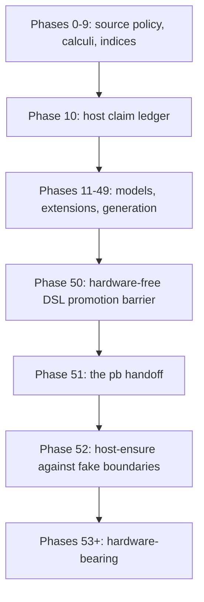

# Amoebius Development Plan

> **Purpose**: Provide the authoritative numeric phase order, current status, remaining work, and routing
> to each phase's human-authored validation contract.
> **Read this if**: the current phase, the next permitted work, or the location of a phase gate must be established.

This tracker owns phase order, status, and dated implementation progress. Each phase document owns its
capability-specific validation contract, while the universal source-snapshot postcondition is owned by
[development_plan_standards.md §S](development_plan_standards.md#s-universal-artifact-hygiene-gate).
Architecture remains owned by the doctrine suite under [`../documents/`](../documents/README.md).

Link-graph metadata

**Status**: Authoritative source
**Supersedes**: N/A
**Referenced by**: DEVELOPMENT_PLAN/development_plan_gate_integrity.md, DEVELOPMENT_PLAN/development_plan_phase_model.md, DEVELOPMENT_PLAN/development_plan_standards.md, DEVELOPMENT_PLAN/later_phases.md, DEVELOPMENT_PLAN/legacy_tracking_for_deletion.md, DEVELOPMENT_PLAN/overview.md, DEVELOPMENT_PLAN/phase_00_documentation_suite.md, DEVELOPMENT_PLAN/phase_01_toolchain_spike.md, DEVELOPMENT_PLAN/phase_02_repository_layout_conformance.md, DEVELOPMENT_PLAN/phase_03_artifact_calculus.md, DEVELOPMENT_PLAN/phase_04_budget_calculus.md, DEVELOPMENT_PLAN/phase_05_lift_calculus.md, DEVELOPMENT_PLAN/phase_06_workflow_calculus.md, DEVELOPMENT_PLAN/phase_07_evidence_calculus.md, DEVELOPMENT_PLAN/phase_08_scope_index.md, DEVELOPMENT_PLAN/phase_09_resource_index.md, DEVELOPMENT_PLAN/phase_10_host_claim_ledger.md, DEVELOPMENT_PLAN/phase_11_calculus_composition.md, DEVELOPMENT_PLAN/phase_12_formal_model_kernel.md, DEVELOPMENT_PLAN/phase_13_explicit_state_checker.md, DEVELOPMENT_PLAN/phase_14_symbolic_checker.md, DEVELOPMENT_PLAN/phase_15_refinement_checker.md, DEVELOPMENT_PLAN/phase_16_compile_fail_harness.md, DEVELOPMENT_PLAN/phase_17_deterministic_sim_substrate.md, DEVELOPMENT_PLAN/phase_18_gateway_migration_model.md, DEVELOPMENT_PLAN/phase_19_dsl_formal_model.md, DEVELOPMENT_PLAN/phase_20_reconcile_core_simulation.md, DEVELOPMENT_PLAN/phase_21_extension_declaration.md, DEVELOPMENT_PLAN/phase_22_extension_laws_per_extension.md, DEVELOPMENT_PLAN/phase_23_extension_laws_compositional.md, DEVELOPMENT_PLAN/phase_24_extension_security_laws.md, DEVELOPMENT_PLAN/phase_25_conformance_gate_generator.md, DEVELOPMENT_PLAN/phase_26_dhall_schema_generation.md, DEVELOPMENT_PLAN/phase_27_gadt_decode_ir.md, DEVELOPMENT_PLAN/phase_28_illegal_state_covering.md, DEVELOPMENT_PLAN/phase_29_storage_geometry_folds.md, DEVELOPMENT_PLAN/phase_30_execution_accelerator_folds.md, DEVELOPMENT_PLAN/phase_31_capability_bind.md, DEVELOPMENT_PLAN/phase_32_provision_seal.md, DEVELOPMENT_PLAN/phase_33_inference_accelerator_provision.md, DEVELOPMENT_PLAN/phase_34_render_manifest_oracles.md, DEVELOPMENT_PLAN/phase_35_chain_kernel_boundary.md, DEVELOPMENT_PLAN/phase_36_image_recipe_generation.md, DEVELOPMENT_PLAN/phase_37_transaction_vocabulary.md, DEVELOPMENT_PLAN/phase_38_ui_program_schema.md, DEVELOPMENT_PLAN/phase_39_ui_authorization_kernel.md, DEVELOPMENT_PLAN/phase_40_ui_effect_binding.md, DEVELOPMENT_PLAN/phase_41_ui_plan_compiler.md, DEVELOPMENT_PLAN/phase_42_offline_language_plan.md, DEVELOPMENT_PLAN/phase_43_ui_browser_interpreter.md, DEVELOPMENT_PLAN/phase_44_ui_server_boundary.md, DEVELOPMENT_PLAN/phase_45_ui_local_composition.md, DEVELOPMENT_PLAN/phase_46_encrypted_browser_runtime.md, DEVELOPMENT_PLAN/phase_47_ui_contract_generation.md, DEVELOPMENT_PLAN/phase_48_tool_and_mutant_generation.md, DEVELOPMENT_PLAN/phase_49_test_workflow_algebra.md, DEVELOPMENT_PLAN/phase_50_self_referential_gates.md, DEVELOPMENT_PLAN/phase_51_host_assert_cli.md, DEVELOPMENT_PLAN/phase_52_host_ensure_kernel.md, DEVELOPMENT_PLAN/phase_53_linux_engine_bringup.md, DEVELOPMENT_PLAN/phase_54_apple_engine_bringup.md, DEVELOPMENT_PLAN/phase_55_windows_engine_bringup.md, DEVELOPMENT_PLAN/phase_56_bootstrap_coordinator_kind.md, DEVELOPMENT_PLAN/phase_57_base_image_registry.md, DEVELOPMENT_PLAN/phase_58_complementary_arch_child.md, DEVELOPMENT_PLAN/phase_59_object_reconciler.md, DEVELOPMENT_PLAN/phase_60_capacity_scheduler.md, DEVELOPMENT_PLAN/phase_61_retained_storage.md, DEVELOPMENT_PLAN/phase_62_vault_pki.md, DEVELOPMENT_PLAN/phase_63_platform_backbone.md, DEVELOPMENT_PLAN/phase_64_platform_services_2.md, DEVELOPMENT_PLAN/phase_65_keycloak_ingress.md, DEVELOPMENT_PLAN/phase_66_live_dsl_deploy.md, DEVELOPMENT_PLAN/phase_67_app_tenancy.md, DEVELOPMENT_PLAN/phase_68_pulsar_client.md, DEVELOPMENT_PLAN/phase_69_user_tenant_isolation_live.md, DEVELOPMENT_PLAN/phase_70_content_store_workflow.md, DEVELOPMENT_PLAN/phase_71_ui_projection_runtime.md, DEVELOPMENT_PLAN/phase_72_release_lifecycle.md, DEVELOPMENT_PLAN/phase_73_ui_program_release.md, DEVELOPMENT_PLAN/phase_74_network_fabric_wireguard.md, DEVELOPMENT_PLAN/phase_75_multicluster_spawn_georepl.md, DEVELOPMENT_PLAN/phase_76_gateway_migration_drills.md, DEVELOPMENT_PLAN/phase_77_provider_deploy_checkpoint.md, DEVELOPMENT_PLAN/phase_78_provider_child_bringup.md, DEVELOPMENT_PLAN/phase_79_provider_ebs_credential.md, DEVELOPMENT_PLAN/phase_80_provider_dynamic_nodes.md, DEVELOPMENT_PLAN/phase_81_determinism_jitcache.md, DEVELOPMENT_PLAN/phase_82_ui_single_tenant_live.md, DEVELOPMENT_PLAN/phase_83_ui_multi_tenant_live.md, DEVELOPMENT_PLAN/phase_84_ui_rollout_reconnect.md, DEVELOPMENT_PLAN/phase_85_ui_ha_multizone.md, DEVELOPMENT_PLAN/phase_86_offline_replay_receipts.md, DEVELOPMENT_PLAN/phase_87_offline_blobs_isolation.md, DEVELOPMENT_PLAN/phase_88_offline_release_evolution.md, DEVELOPMENT_PLAN/phase_89_offline_multizone_continuity.md, DEVELOPMENT_PLAN/phase_90_apple_metal_host_daemon.md, DEVELOPMENT_PLAN/phase_91_test_topology_live.md, DEVELOPMENT_PLAN/phase_92_infernix_rederivation.md, DEVELOPMENT_PLAN/phase_93_infernix_ui_rederivation.md, DEVELOPMENT_PLAN/phase_94_jitml_rederivation.md, DEVELOPMENT_PLAN/phase_95_jitml_ui_rederivation.md, DEVELOPMENT_PLAN/phase_96_webapp_rederivation.md, DEVELOPMENT_PLAN/substrates.md, DEVELOPMENT_PLAN/system_components.md, README.md, documents/README.md, documents/documentation_standards.md, documents/engineering/README.md, documents/engineering/app_vs_deployment_doctrine.md, documents/engineering/apple_metal_headless_builds.md, documents/engineering/backup_recovery_doctrine.md, documents/engineering/bootstrap_sequence_doctrine.md, documents/engineering/browser_offline_runtime_doctrine.md, documents/engineering/capability_extension_doctrine.md, documents/engineering/chaos_failover_doctrine.md, documents/engineering/chaos_failover_second_axis.md, documents/engineering/chaos_failover_worked_examples.md, documents/engineering/cluster_lifecycle_doctrine.md, documents/engineering/cluster_topology_doctrine.md, documents/engineering/consistency_pacelc_doctrine.md, documents/engineering/content_addressing_determinism.md, documents/engineering/content_addressing_doctrine.md, documents/engineering/daemon_topology_doctrine.md, documents/engineering/deterministic_simulation_doctrine.md, documents/engineering/diagram_conventions.md, documents/engineering/dsl_doctrine.md, documents/engineering/evidence_calculus_doctrine.md, documents/engineering/extension_conformance_doctrine.md, documents/engineering/extension_conformance_laws.md, documents/engineering/extension_conformance_security.md, documents/engineering/extension_conformance_transactions.md, documents/engineering/formal_model_doctrine.md, documents/engineering/gateway_migration_doctrine.md, documents/engineering/gateway_migration_model_doctrine.md, documents/engineering/generated_artifacts_doctrine.md, documents/engineering/host_cluster_comms_doctrine.md, documents/engineering/host_resource_research.md, documents/engineering/hostclaim_spec.md, documents/engineering/image_build_doctrine.md, documents/engineering/inforcespec_migration_doctrine.md, documents/engineering/jit_artifact_doctrine.md, documents/engineering/jit_budget_doctrine.md, documents/engineering/lift_and_compose_doctrine.md, documents/engineering/low_code_ui_runtime_doctrine.md, documents/engineering/low_code_ui_workflow_lifting.md, documents/engineering/manifest_generation_doctrine.md, documents/engineering/migration_doctrine.md, documents/engineering/monitoring_doctrine.md, documents/engineering/namespace_layout_doctrine.md, documents/engineering/network_fabric_doctrine.md, documents/engineering/platform_services_doctrine.md, documents/engineering/preflight_validation_doctrine.md, documents/engineering/pulsar_client_doctrine.md, documents/engineering/pulumi_ebs_credential_model.md, documents/engineering/pulumi_iac_doctrine.md, documents/engineering/readiness_ordering_doctrine.md, documents/engineering/release_lifecycle_doctrine.md, documents/engineering/repository_layout_doctrine.md, documents/engineering/resource_capacity_construction.md, documents/engineering/resource_capacity_doctrine.md, documents/engineering/resource_capacity_folds.md, documents/engineering/resource_capacity_schema.md, documents/engineering/resource_capacity_sources.md, documents/engineering/resource_capacity_storage.md, documents/engineering/resource_capacity_types.md, documents/engineering/service_capability_doctrine.md, documents/engineering/single_logical_data_plane_doctrine.md, documents/engineering/storage_lifecycle_doctrine.md, documents/engineering/substrate_doctrine.md, documents/engineering/substrate_node_inventory.md, documents/engineering/tenancy_doctrine.md, documents/engineering/test_derivation_analysis.md, documents/engineering/testing_doctrine.md, documents/engineering/testing_spoof_resistance.md, documents/engineering/tla_modelling_assumptions.md, documents/engineering/ui_realtime_coordination_doctrine.md, documents/engineering/vault_pki_doctrine.md, documents/engineering/workflow_calculus_doctrine.md, documents/glossary.md, documents/illegal_state/README.md, documents/illegal_state/illegal_state_capability_messaging.md, documents/illegal_state/illegal_state_capacity.md, documents/illegal_state/illegal_state_catalog.md, documents/illegal_state/illegal_state_lifecycle.md, documents/illegal_state/illegal_state_ml_asset.md, documents/illegal_state/illegal_state_multicluster.md, documents/illegal_state/illegal_state_security.md, documents/illegal_state/illegal_state_storage.md, documents/illegal_state/illegal_state_techniques.md, documents/illegal_state/illegal_state_tenancy.md, documents/illegal_state/illegal_state_topology.md, documents/reading_order.md
**Generated sections**: none

## Contents
- [Phase discipline](#phase-discipline)
- [Repository and evidence discipline](#repository-and-evidence-discipline)
- [Toolchain](#toolchain)
- [Document index](#document-index)
- [Status vocabulary](#status-vocabulary)
- [Implementation-progress vocabulary](#implementation-progress-vocabulary)
- [Definition of Done](#definition-of-done)
- [Reopened numeric sequence](#reopened-numeric-sequence)
- [Current implementation audit](#current-implementation-audit)
- [Phase overview](#phase-overview)
- [Related Documents](#related-documents)

---

amoebius is one Haskell runtime with command, host-daemon, control-plane daemon, scheduler, and worker responsibilities.
The bounded Python `pb` pre-binary handoff exists only to make the minimum platform-adapter distinction,
establish the contained Haskell toolchain, build the source-bound binary, and exec it with argv unchanged. It
does not own a public command, product decision, or validation verdict and is distinct from the Haskell
`BootstrapCoordinator` role.
The constituent prodbox, infernix, jitML, and hostbootstrap capabilities converge as libraries and
behaviours rather than separate products.

## Phase discipline

1. Phases close strictly in numeric order. Phase N+1 cannot close or begin new implementation work before
   Phase N satisfies its redesigned gate.
2. Each phase document owns one cohesive capability claim and one acceptance command.
3. Every gate inherits the artifact-hygiene postcondition in
   [development_plan_standards.md §S](development_plan_standards.md#s-universal-artifact-hygiene-gate).
4. Every hardware substrate can run the `linux-cpu` baseline **at its own natural architecture and no
   other**. Pristine Linux uses Incus on Linux or Linux-CUDA, Lima on Apple at `arm64`, and WSL2 on Windows at
   `amd64`. A gate names its lane with that architecture; nothing is emulated or cross-built
   ([substrate_doctrine.md §1.1](../documents/engineering/substrate_doctrine.md#11-the-natural-architecture-rule)).
5. A hardware gate names exactly one substrate and one lane. `apple`, `linux-cuda`, and `windows` are
   substrate members; `metal` and `cuda` are specialized capability lanes, while `provider` is a managed
   target lane. The `linux-cpu` baseline cannot substitute for a specialized claim, and one architecture
   cannot substitute for the other.
6. Register 1 is pure/semantic-oracle, Register 2 is boundary-with-fakes, and Register 3 is live. Register 2.5 is a
   deterministic-simulation activity, never a phase-gate register.
7. Missing prerequisites fail; they never skip to green. Unreached applicable layers remain UNVERIFIED.
8. Phase 50 is the complete no-hardware DSL promotion barrier and requires every `LTD-SRC-*` query,
   including the Phase-0-owned `LTD-SRC-008` boundary, to be zero. Phase 51 owns no migration and validates
   only the runtime behavior of that already-bounded handoff. Phase 0 through Phase 50 invoke the exact
   source-built Haskell validator directly from an authenticated offline toolchain input; `pb` is unavailable
   as validation transport until Phase 51 proves it. Phase 52 remains a hardware-free Haskell host-ensure
   kernel. Phase 53 is the first hardware-bearing gate. No host, image, registry, cluster, accelerator, or
   cloud validation work may begin before the Phase-50 approval and the intervening numerical predecessor
   approvals exist.
9. A gate, CI job, agent, evidence reader, digest, or attestation may produce a Validation candidate only. The
   human validation authority alone may sign approval and personally change a phase or sprint to Done.

## Repository and evidence discipline

Version-controlled behavioral source is Haskell (`*.hs`) only. Python beneath `pb/**` is the sole source-code
exception and is limited to the bootstrap handoff described above. Documentation, licences, Cabal/project
metadata, ignore rules, and narrowly bounded packaging metadata are tracked inputs, not alternative product
languages. Dhall, PureScript, JavaScript, Python outside `pb/**`, shell, Proto, Pulumi, Dockerfiles,
configuration projections, fixtures, checking tools, oracle serializations, mutants, ledgers, receipts, logs,
reports, screenshots, and other executable or behavioral artifacts are generated lazily from Haskell into
`.build/**` and remain untracked.

All amoebius-owned state stays under the physical checkout. `.build/**` owns reproducible, transient, and
evidentiary output; `.data/**` owns production runtime and durable state; `.test_data/**` owns exclusively
harness-created test state. Raw candidate evidence lives in `.build/runs/**`; a content-addressed receipt may
be installed beneath `.build/evidence-store/**`. Neither has status authority. The complete
repository tree, output inventory, lifecycle rules, and normative `.gitignore`/`.dockerignore` patterns
are owned by
[repository_layout_doctrine.md](../documents/engineering/repository_layout_doctrine.md).

## Toolchain

Compilers, package tools, libraries, code generators, browsers, and transitive dependencies resolve
dynamically from authored compatibility requirements. Every clean run records the selected versions,
source identities, dependency graph, executable paths, and observed integrity data under `.build/toolchain/`
and `.build/locks/`, then binds them into repository-local evidence. No generated resolution is copied into Git.

Only the irreducible host floor is supplied by the operator; everything with a supported install path is
ensured beneath `.build/**`. The floor is checked before any requirement resolves, so an unsupported host is
named with its remedy rather than discovered as a later symptom. Every authored platform key is the canonical
`<os>-<arch>` token, and a publisher that offers no asset for the host's architecture is a refusal, never a
substitution.

## Document index

| Document | Role |
|---|---|
| [development_plan_standards.md](development_plan_standards.md) | The plan rulebook's hub: every section heading and anchor, and the document-form rules |
| [development_plan_phase_model.md](development_plan_phase_model.md) | Rulebook slice: status vocabulary, the phase model, honesty, substrate discipline, reopening and re-baselining |
| [development_plan_gate_integrity.md](development_plan_gate_integrity.md) | Rulebook slice: gate integrity, universal artifact hygiene, reconciliation, and the final repository layout |
| [overview.md](overview.md) | Target architecture and cross-cutting invariants |
| [system_components.md](system_components.md) | Target-only Haskell component-to-doctrine/phase map; never a present-tree or status ledger |
| [substrates.md](substrates.md) | Hardware/substrate registry and pristine-host routing |
| [legacy_tracking_for_deletion.md](legacy_tracking_for_deletion.md) | The sole reader-facing explanation of active typed Haskell divergence bindings; never executable authority |
| [Repository Layout and Artifact Provenance](../documents/engineering/repository_layout_doctrine.md) | Complete authored/generated tree, dynamic resolution, and ignore/context contract |
| [Conformance Harness Doctrine](../documents/engineering/conformance_harness_doctrine.md) | Validation registers and boundary discipline |
| [Deterministic Simulation Doctrine](../documents/engineering/deterministic_simulation_doctrine.md) | Register-2.5 scheduling and replay discipline |
| [Lift and Compose Doctrine](../documents/engineering/lift_and_compose_doctrine.md) | Sibling-source migration and convergence rules |
| `phase_00_*.md` … `phase_96_*.md` | One human-authored capability and validation contract per phase |
| [later_phases.md](later_phases.md) | In-scope phases not yet assigned an integer document |

## Status vocabulary

The validation reset uses only two current phase states: **🔄 Active — NOT VALIDATED** for Phase 0 and
**⏸️ Blocked — NOT VALIDATED** for Phases 1–96. `Validated` and `Done` are reserved for a future human
promotion after the redesigned, independently qualified acceptance contract is satisfied; neither is a
current status. Historical status words and symbols cannot reactivate themselves.

## Implementation-progress vocabulary

Until revalidation, the only permitted implementation classifications are **Observed footprint** and
**Known partial**. They report that files or prior run material exist; they do not establish correctness,
source-policy conformance, gate integrity, or phase completion. No digest, seal, receipt, attestation, or
previous command result promotes either classification.

## Definition of Done

A phase is Done only after all of the following occur in order:

1. Its fixed eighteen-row Gate-integrity contract has no `UNRESOLVED`, `MISSING`, skipped, implicit, or empty
   required field and has received independent oracle/reviewer acceptance.
2. Phase 0 satisfies the explicit genesis-predecessor contract declared in its phase document; every later
   phase has a valid external human approval for its exact immediate-predecessor contract.
3. The semantic source scan accounts for every tracked path and admits behavioural source only as `.hs`, with
   the bounded `pb/**` minimal-platform-discrimination, contained-toolchain-establishment,
   source-bound-build, and opaque-exec exception.
4. A fresh cleanroom run starts without generated/state roots or condemned legacy copies and lazily derives
   every required non-Haskell product beneath `.build/**`.
5. The exact Haskell harness build first rejects every qualification sabotage, then runs the clean candidate.
6. Discovery is non-empty and joins in both directions; positive controls, paired specific-reason negatives,
   applied changed-subject mutants, freshness, external observers, authority/bypass probes, and cleanup all
   produce their explicit expected observations.
7. Every typed Haskell legacy binding owned by the phase returns zero findings and its independently authored
   reintroduction negative turns red; Markdown row content is not an input.
8. The candidate bundle contains raw per-row observations and explicit `UNVERIFIED` residue. Its digest binds
   provenance only and cannot authorize status.
9. A human validation authority reviews the source diff, contract, oracle custody, harness qualification, raw
   observations, residue, predecessor, and legacy closure; signs the external approval; and personally changes
   the tracker and phase/sprint status to Done.

Markdown never embeds or manufactures generated evidence, an approval, a hash, a transcript, or dependency
resolution. Automation and LLMs may report a Validation candidate but may not apply or claim the human
decision. A prior seal or pre-reset result can never satisfy Done. Commit timing is not a gate input
([development_plan_standards.md §S](development_plan_standards.md#s-universal-artifact-hygiene-gate)).

## Reopened numeric sequence

**Validation reset — 2026-08-22.** Every prior phase and sprint validation claim is invalidated. Phase 0 is
**🔄 Active — NOT VALIDATED** solely for the documentation, validation, and tracked-source-boundary
redesign. Phases 1–96 are **⏸️ Blocked — NOT VALIDATED** and may advance only after their immediate
numerical predecessor has been independently validated and promoted by the human maintainer.

Existing source and historical results are retained only as **Observed footprint / Known partial** migration
input. They cannot satisfy an acceptance condition, and historical prose cannot become current through a
status change. Phase 0 now has a Haskell dispatcher whose explicit readiness findings force refusal; later
phase-specific gate commands remain planned contracts pending the comprehensive anti-spoof review. This reset
makes no claim that any gate has run or passed.

Hardware validation is frozen. No phase at or above Phase 53 may run for promotion until the hardware-free
DSL promotion barrier and every preceding redesigned phase have been independently satisfied and
human-approved.

## Current implementation audit

The current audit makes no validation attribution.

| Phase(s) | Current classification | Meaning |
|---|---|---|
| 0 | **Observed footprint / Known partial — NOT VALIDATED** | Haskell validation-kernel modules and eighteen component oracles exist. The typed policy contract, closed 25-ID legacy lifecycle/analyzer dispatch, descriptor-pinned source observer, v2 byte-bound debt observer, one-file static `pb` grammar, compiler/consumer adapters, and typed phase/resource registries are present. The governed inventory now registers 198 paths, including the authoritative Host Claim Ledger specification, its reference-only research companion, and the Phase-10 contract that owns their implementation; their live interpreters and conformance evidence remain owned by later numerical phases. Adversarial reviews rejected candidate integration and exposed remaining trust, completeness, and oracle-independence gaps. Source acquisition remains permanently diagnostic without authenticated atomic external authority; the compiler route establishes only four restricted-session facts and cannot reach the repository graph. The worktree has one `pb/__main__.py`; the unstaged Git index still has the condemned fifteen-path bootstrap footprint. The `LTD-SRC-000` and `LTD-SRC-008` analyzers are integrated but unqualified, while `LTD-VAL-001` through `LTD-VAL-004` owner analyzers are absent. Independent human review/key custody, clean-room observation, evidence integration, contract resolution, legacy closure, and human promotion remain absent. |
| 1–95 | **Observed footprint / Known partial — NOT VALIDATED** | Existing files and historical run material are migration input only; each phase is blocked behind numerical predecessor validation and human promotion. |

The 2026-08-23 inspection reran `cabal build lib:validation-kernel test:validation-kernel-component` and the
clean `cabal test validation-kernel-component` aggregate after connecting the source-debt, source-consumer,
compiler-component, compiler-graph, and one-file `pb` grammar modules. All fourteen then-named component oracles
executed and reported their diagnostic expectations met. The runner now contains eighteen oracles; its latest
completed aggregate reached every oracle, with a stale Dispatch classifier and the intentionally stale
Documentation manifest refusing. Subsequent semantic hardening invalidated that aggregate. Earlier policy and
legacy changed-production runs are stale wherever their production/oracle subjects changed; the current
clean-plus-twenty legacy matrix and the integrated source/compiler/bootstrap/semantic mutant matrix must be
rerun before candidate preparation. Supporting
focused mutant observations are compilation and component diagnostics only, never validation or independent
reviewer custody. The current dirty worktree and unstaged source transition are ineligible for clean snapshot
acquisition, and the dispatcher also carries explicit fail-closed findings for unexecuted qualification,
missing independent human review/key custody, missing external clean-room observation, and missing evidence
integration. The evidence schema also lacks closed typed command, toolchain, substrate, run, and cleanup
fields, and no reviewed binding connects Git object-format identity to its required SHA-256 provenance. In
addition, all 97 phase contracts contain 1,746 exact-prefix `UNRESOLVED` gate cells. The former 92 generic `MISSING`
predecessor cells now specify typed `ImmediatePredecessorApproval` inputs and leave receipt availability to
candidate observation; this specification correction supplies no approval or validation. All 274 sprint
sections now carry the exact ordered reset schema and immediate blocker edge. Unknown implementation, oracle,
validation, legacy, and documentation bindings remain explicit `UNRESOLVED` values, and no structural rewrite
claims their semantics are complete. The compiled phase-semantic/resource registry and its independent oracle
are under adversarial integration review; every remaining gap and missing reviewer-custody value keeps the
Phase-0 gate refusing.

The 2026-08-24 single-worker component rerun made no diagnostic claim: compilation stopped in
`Documentation.Internal` at six header-finding helpers referenced but absent from `HEAD`. The newly registered
resource-authority doctrine changes only that module's governed count and path digest, so Sprint 0.4 retains
this compile refusal and the post-edit prose/finding-manifest remeasurement as explicit residue.

Capability-by-capability target ownership remains in the linked phase contracts and the target-only
[system_components.md](system_components.md). Current divergence identity, ownership, and closure are typed
Haskell bindings; the single
[legacy register](legacy_tracking_for_deletion.md) is their reader-facing explanation, with correspondence
owned by human review. No historical digest, receipt, attestation, pass statement, supporting diagnostic, or
component result is a current validation result.

## Phase overview

*Orientation. Design intent. Numeric order is validation order, and each band opens only on human promotion of the one before it. The hardware-free barrier itself is owned by [conformance_harness_doctrine.md](../documents/engineering/conformance_harness_doctrine.md).*

The table is an order-and-status index. It is read with the dated progress audit above, not as an assertion
that a blocked phase has no code. The linked phase document owns the phase-specific gate; every gate also
inherits the universal postcondition above.

| Phase | Name | Substrate | Lane | Register | Status | Validation contract |
|---|---|---|---|---|---|---|
| 0 | Documentation, source policy, and validation trust root | none | `none` | — | 🔄 Active — NOT VALIDATED | [phase_0](phase_00_documentation_suite.md) |
| 1 | Haskell toolchain and probe-source closure | none | `none` | 1 | ⏸️ Blocked — NOT VALIDATED | [phase_1](phase_01_toolchain_spike.md) |
| 2 | Repository layout conformance and de-phased naming | none | `none` | 1 | ⏸️ Blocked — NOT VALIDATED | [phase_2](phase_02_repository_layout_conformance.md) |
| 3 | The artifact calculus | none | `none` | 1 | ⏸️ Blocked — NOT VALIDATED | [phase_3](phase_03_artifact_calculus.md) |
| 4 | The budget calculus | none | `none` | 1 | ⏸️ Blocked — NOT VALIDATED | [phase_4](phase_04_budget_calculus.md) |
| 5 | The lift calculus | none | `none` | 1 | ⏸️ Blocked — NOT VALIDATED | [phase_5](phase_05_lift_calculus.md) |
| 6 | The workflow calculus | none | `none` | 1 | ⏸️ Blocked — NOT VALIDATED | [phase_6](phase_06_workflow_calculus.md) |
| 7 | The evidence calculus | none | `none` | 1 | ⏸️ Blocked — NOT VALIDATED | [phase_7](phase_07_evidence_calculus.md) |
| 8 | Scoped identity kernel | none | `none` | 1 | ⏸️ Blocked — NOT VALIDATED | [phase_8](phase_08_scope_index.md) |
| 9 | Capacity core fold + topology relation | none | `none` | 1 | ⏸️ Blocked — NOT VALIDATED | [phase_9](phase_09_resource_index.md) |
| 10 | The host claim ledger | none | `none` | 1 | ⏸️ Blocked — NOT VALIDATED | [phase_10](phase_10_host_claim_ledger.md) |
| 11 | Composition across the five calculi | none | `none` | 1 | ⏸️ Blocked — NOT VALIDATED | [phase_11](phase_11_calculus_composition.md) |
| 12 | Formal-model EDSL (`Model`/`interpret`/`emitTLA`) | none | `none` | 1 | ⏸️ Blocked — NOT VALIDATED | [phase_12](phase_12_formal_model_kernel.md) |
| 13 | The amoebius explicit-state checker | none | `none` | 1 | ⏸️ Blocked — NOT VALIDATED | [phase_13](phase_13_explicit_state_checker.md) |
| 14 | The amoebius symbolic checker | none | `none` | 1 | ⏸️ Blocked — NOT VALIDATED | [phase_14](phase_14_symbolic_checker.md) |
| 15 | The amoebius refinement checker | none | `none` | 1 | ⏸️ Blocked — NOT VALIDATED | [phase_15](phase_15_refinement_checker.md) |
| 16 | The compile-fail fixture harness | none | `none` | 1 | ⏸️ Blocked — NOT VALIDATED | [phase_16](phase_16_compile_fail_harness.md) |
| 17 | Deterministic-simulation substrate | none | `none` | 2 | ⏸️ Blocked — NOT VALIDATED | [phase_17](phase_17_deterministic_sim_substrate.md) |
| 18 | Gateway-migration model (both branches) | none | `none` | 1 | ⏸️ Blocked — NOT VALIDATED | [phase_18](phase_18_gateway_migration_model.md) |
| 19 | DSL formal model | none | `none` | 1 | ⏸️ Blocked — NOT VALIDATED | [phase_19](phase_19_dsl_formal_model.md) |
| 20 | Reconcile decision core under deterministic simulation | none | `none` | 2 | ⏸️ Blocked — NOT VALIDATED | [phase_20](phase_20_reconcile_core_simulation.md) |
| 21 | The extension declaration | none | `none` | 1 | ⏸️ Blocked — NOT VALIDATED | [phase_21](phase_21_extension_declaration.md) |
| 22 | The per-extension laws L1-L5 | none | `none` | 1 | ⏸️ Blocked — NOT VALIDATED | [phase_22](phase_22_extension_laws_per_extension.md) |
| 23 | The compositional laws C1-C7 | none | `none` | 1 | ⏸️ Blocked — NOT VALIDATED | [phase_23](phase_23_extension_laws_compositional.md) |
| 24 | The security laws S1-S6 | none | `none` | 1 | ⏸️ Blocked — NOT VALIDATED | [phase_24](phase_24_extension_security_laws.md) |
| 25 | The generated conformance gate | none | `none` | 1 | ⏸️ Blocked — NOT VALIDATED | [phase_25](phase_25_conformance_gate_generator.md) |
| 26 | Haskell-derived Dhall projection and smart-constructor prelude | none | `none` | 1 | ⏸️ Blocked — NOT VALIDATED | [phase_26](phase_26_dhall_schema_generation.md) |
| 27 | Haskell protocol declarations, GADT-indexed IR, and total decoder | none | `none` | 1 | ⏸️ Blocked — NOT VALIDATED | [phase_27](phase_27_gadt_decode_ir.md) |
| 28 | Illegal-state corpus + validation-locus ledger | none | `none` | 1 | ⏸️ Blocked — NOT VALIDATED | [phase_28](phase_28_illegal_state_covering.md) |
| 29 | Logical→physical storage geometry folds | none | `none` | 1 | ⏸️ Blocked — NOT VALIDATED | [phase_29](phase_29_storage_geometry_folds.md) |
| 30 | Execution-epoch + scheduler + accelerator + provider-root folds | none | `none` | 1 | ⏸️ Blocked — NOT VALIDATED | [phase_30](phase_30_execution_accelerator_folds.md) |
| 31 | Capability union + representational bind | none | `none` | 1 | ⏸️ Blocked — NOT VALIDATED | [phase_31](phase_31_capability_bind.md) |
| 32 | Whole-deployment provision seal + expansion | none | `none` | 1 | ⏸️ Blocked — NOT VALIDATED | [phase_32](phase_32_provision_seal.md) |
| 33 | InferenceEngine capability + accelerator provision | none | `none` | 1 | ⏸️ Blocked — NOT VALIDATED | [phase_33](phase_33_inference_accelerator_provision.md) |
| 34 | Pure `renderAll` + rendered-artifact oracles | none | `none` | 1 | ⏸️ Blocked — NOT VALIDATED | [phase_34](phase_34_render_manifest_oracles.md) |
| 35 | chain/Step kernel + `--dry-run` + boundary fake-tool harness + extension-astcheck AST checker | none | `none` | 2 | ⏸️ Blocked — NOT VALIDATED | [phase_35](phase_35_chain_kernel_boundary.md) |
| 36 | The amoebius image recipe | none | `none` | 1 | ⏸️ Blocked — NOT VALIDATED | [phase_36](phase_36_image_recipe_generation.md) |
| 37 | The closed transaction vocabulary | none | `none` | 1 | ⏸️ Blocked — NOT VALIDATED | [phase_37](phase_37_transaction_vocabulary.md) |
| 38 | Bounded UI-program schema | none | `none` | 1 | ⏸️ Blocked — NOT VALIDATED | [phase_38](phase_38_ui_program_schema.md) |
| 39 | UI authorization kernel | none | `none` | 1 | ⏸️ Blocked — NOT VALIDATED | [phase_39](phase_39_ui_authorization_kernel.md) |
| 40 | UI effect binding | none | `none` | 1 | ⏸️ Blocked — NOT VALIDATED | [phase_40](phase_40_ui_effect_binding.md) |
| 41 | UI plan compiler | none | `none` | 1 | ⏸️ Blocked — NOT VALIDATED | [phase_41](phase_41_ui_plan_compiler.md) |
| 42 | Offline language and paired plans | none | `none` | 1 | ⏸️ Blocked — NOT VALIDATED | [phase_42](phase_42_offline_language_plan.md) |
| 43 | Haskell browser-interpreter semantics and projection | none | `none` | 1 | ⏸️ Blocked — NOT VALIDATED | [phase_43](phase_43_ui_browser_interpreter.md) |
| 44 | Haskell UI-server boundary | none | `none` | 2 | ⏸️ Blocked — NOT VALIDATED | [phase_44](phase_44_ui_server_boundary.md) |
| 45 | Hardware-free Haskell UI composition | none | `none` | 2 | ⏸️ Blocked — NOT VALIDATED | [phase_45](phase_45_ui_local_composition.md) |
| 46 | Haskell offline-state semantics and runtime projection | none | `none` | 1 | ⏸️ Blocked — NOT VALIDATED | [phase_46](phase_46_encrypted_browser_runtime.md) |
| 47 | Haskell-generated browser contracts and bundle | none | `none` | 1 | ⏸️ Blocked — NOT VALIDATED | [phase_47](phase_47_ui_contract_generation.md) |
| 48 | Foreign-source generator closure, checking tools, and mutants | none | `none` | 1 | ⏸️ Blocked — NOT VALIDATED | [phase_48](phase_48_tool_and_mutant_generation.md) |
| 49 | The test-workflow algebra | none | `none` | 1 | ⏸️ Blocked — NOT VALIDATED | [phase_49](phase_49_test_workflow_algebra.md) |
| 50 | No-hardware DSL promotion barrier + self-referential gate suite | none | `none` | 2 | ⏸️ Blocked — NOT VALIDATED | [phase_50](phase_50_self_referential_gates.md) |
| 51 | Validate the bounded `pb` → Haskell handoff | none | `none` | 2 | ⏸️ Blocked — NOT VALIDATED | [phase_51](phase_51_host_assert_cli.md) |
| 52 | The host-ensure kernel | none | `none` | 2 | ⏸️ Blocked — NOT VALIDATED | [phase_52](phase_52_host_ensure_kernel.md) |
| 53 | Linux: sudoless Docker and the native image | linux-cpu | `linux-cpu/amd64` | 3 | ⏸️ Blocked — NOT VALIDATED | [phase_53](phase_53_linux_engine_bringup.md) |
| 54 | Apple: Homebrew, Colima, and the native image | apple | `linux-cpu/arm64` | 3 | ⏸️ Blocked — NOT VALIDATED | [phase_54](phase_54_apple_engine_bringup.md) |
| 55 | Windows: WSL2 and the lifted Linux engine | windows | `linux-cpu/amd64` | 3 | ⏸️ Blocked — NOT VALIDATED | [phase_55](phase_55_windows_engine_bringup.md) |
| 56 | Haskell substrate coordinator + single kind cluster | linux-cpu | `linux-cpu/amd64` | 3 | ⏸️ Blocked — NOT VALIDATED | [phase_56](phase_56_bootstrap_coordinator_kind.md) |
| 57 | The base image, the jit-build resolver, and the in-cluster registry | linux-cpu | `linux-cpu/amd64` | 3 | ⏸️ Blocked — NOT VALIDATED | [phase_57](phase_57_base_image_registry.md) |
| 58 | The complementary-architecture base image | apple | `linux-cpu/arm64` | 3 | ⏸️ Blocked — NOT VALIDATED | [phase_58](phase_58_complementary_arch_child.md) |
| 59 | Typed renderer + object reconciler | linux-cpu | `linux-cpu/amd64` | 3 | ⏸️ Blocked — NOT VALIDATED | [phase_59](phase_59_object_reconciler.md) |
| 60 | amoebius-capacity scheduler + bootstrap cutover | linux-cpu | `linux-cpu/amd64` | 3 | ⏸️ Blocked — NOT VALIDATED | [phase_60](phase_60_capacity_scheduler.md) |
| 61 | No-provisioner retained storage + lossless rebind | linux-cpu | `linux-cpu/amd64` | 3 | ⏸️ Blocked — NOT VALIDATED | [phase_61](phase_61_retained_storage.md) |
| 62 | Root Vault + PKI + built-in Haskell Vault client | linux-cpu | `linux-cpu/amd64` | 3 | ⏸️ Blocked — NOT VALIDATED | [phase_62](phase_62_vault_pki.md) |
| 63 | Platform backbone (MetalLB + MinIO + Pulsar HA) | linux-cpu | `linux-cpu/amd64` | 3 | ⏸️ Blocked — NOT VALIDATED | [phase_63](phase_63_platform_backbone.md) |
| 64 | Platform services-2 (Redis/Sentinel + Percona/Patroni + pgAdmin + observability + readiness-DAG) | linux-cpu | `linux-cpu/amd64` | 3 | ⏸️ Blocked — NOT VALIDATED | [phase_64](phase_64_platform_services_2.md) |
| 65 | Keycloak-owned ingress | linux-cpu | `linux-cpu/amd64` | 3 | ⏸️ Blocked — NOT VALIDATED | [phase_65](phase_65_keycloak_ingress.md) |
| 66 | Live DSL deploy via the replicas=1 control-plane daemon | linux-cpu | `linux-cpu/amd64` | 3 | ⏸️ Blocked — NOT VALIDATED | [phase_66](phase_66_live_dsl_deploy.md) |
| 67 | Tenant/provider provisioning | linux-cpu | `linux-cpu/amd64` | 3 | ⏸️ Blocked — NOT VALIDATED | [phase_67](phase_67_app_tenancy.md) |
| 68 | Native Pulsar client (CBOR) | linux-cpu | `linux-cpu/amd64` | 3 | ⏸️ Blocked — NOT VALIDATED | [phase_68](phase_68_pulsar_client.md) |
| 69 | Live subject/tenant isolation | linux-cpu | `linux-cpu/amd64` | 3 | ⏸️ Blocked — NOT VALIDATED | [phase_69](phase_69_user_tenant_isolation_live.md) |
| 70 | Content store + workflow runtime (Pulsar-Failover single-writer) | linux-cpu | `linux-cpu/amd64` | 3 | ⏸️ Blocked — NOT VALIDATED | [phase_70](phase_70_content_store_workflow.md) |
| 71 | Owner-scoped UI projection runtime | linux-cpu | `linux-cpu/amd64` | 3 | ⏸️ Blocked — NOT VALIDATED | [phase_71](phase_71_ui_projection_runtime.md) |
| 72 | Release lifecycle | linux-cpu | `linux-cpu/amd64` | 3 | ⏸️ Blocked — NOT VALIDATED | [phase_72](phase_72_release_lifecycle.md) |
| 73 | Atomic immutable UI-program release | linux-cpu | `linux-cpu/amd64` | 3 | ⏸️ Blocked — NOT VALIDATED | [phase_73](phase_73_ui_program_release.md) |
| 74 | WireGuard network fabric | linux-cpu | `linux-cpu/amd64` | 3 | ⏸️ Blocked — NOT VALIDATED | [phase_74](phase_74_network_fabric_wireguard.md) |
| 75 | Multi-cluster spawn + geo-replication | linux-cpu | `linux-cpu/amd64` | 3 | ⏸️ Blocked — NOT VALIDATED | [phase_75](phase_75_multicluster_spawn_georepl.md) |
| 76 | Gateway-migration drills + model-correspondence | linux-cpu | `linux-cpu/amd64` | 3 | ⏸️ Blocked — NOT VALIDATED | [phase_76](phase_76_gateway_migration_drills.md) |
| 77 | Haskell-derived provider Pulumi program and enveloped checkpoint | linux-cpu | `provider` | 3 | ⏸️ Blocked — NOT VALIDATED | [phase_77](phase_77_provider_deploy_checkpoint.md) |
| 78 | Hostless provider child + convergence + Lease handoff | linux-cpu | `provider` | 3 | ⏸️ Blocked — NOT VALIDATED | [phase_78](phase_78_provider_child_bringup.md) |
| 79 | Per-PV EBS decoupling + create-vs-delete credential | linux-cpu | `provider` | 3 | ⏸️ Blocked — NOT VALIDATED | [phase_79](phase_79_provider_ebs_credential.md) |
| 80 | Dynamic node provisioning by signal + leak-free provider gate | linux-cpu | `provider` | 3 | ⏸️ Blocked — NOT VALIDATED | [phase_80](phase_80_provider_dynamic_nodes.md) |
| 81 | Determinism kernel + jit-build CacheBudget cache | linux-cpu | `linux-cpu/amd64` | 3 | ⏸️ Blocked — NOT VALIDATED | [phase_81](phase_81_determinism_jitcache.md) |
| 82 | Single-tenant low-code UI live path | linux-cpu | `linux-cpu/amd64` | 3 | ⏸️ Blocked — NOT VALIDATED | [phase_82](phase_82_ui_single_tenant_live.md) |
| 83 | Multi-tenant low-code UI isolation | linux-cpu | `linux-cpu/amd64` | 3 | ⏸️ Blocked — NOT VALIDATED | [phase_83](phase_83_ui_multi_tenant_live.md) |
| 84 | UI rollout, projection catch-up, and reconnect | linux-cpu | `linux-cpu/amd64` | 3 | ⏸️ Blocked — NOT VALIDATED | [phase_84](phase_84_ui_rollout_reconnect.md) |
| 85 | Initial online UI multi-zone high availability | linux-cpu | `provider` | 3 | ⏸️ Blocked — NOT VALIDATED | [phase_85](phase_85_ui_ha_multizone.md) |
| 86 | Offline replay and durable receipts | linux-cpu | `linux-cpu/amd64` | 3 | ⏸️ Blocked — NOT VALIDATED | [phase_86](phase_86_offline_replay_receipts.md) |
| 87 | Offline blobs and partition isolation | linux-cpu | `linux-cpu/amd64` | 3 | ⏸️ Blocked — NOT VALIDATED | [phase_87](phase_87_offline_blobs_isolation.md) |
| 88 | Offline release and schema evolution | linux-cpu | `linux-cpu/amd64` | 3 | ⏸️ Blocked — NOT VALIDATED | [phase_88](phase_88_offline_release_evolution.md) |
| 89 | Offline multi-zone continuity | linux-cpu | `provider` | 3 | ⏸️ Blocked — NOT VALIDATED | [phase_89](phase_89_offline_multizone_continuity.md) |
| 90 | Apple-Metal host compute daemon | apple | `metal` | 3 | ⏸️ Blocked — NOT VALIDATED | [phase_90](phase_90_apple_metal_host_daemon.md) |
| 91 | The live test topology and elevated harness | linux-cpu | `linux-cpu/amd64` | 3 | ⏸️ Blocked — NOT VALIDATED | [phase_91](phase_91_test_topology_live.md) |
| 92 | The infernix inference core, re-derived | linux-cpu | `linux-cpu/amd64` | 3 | ⏸️ Blocked — NOT VALIDATED | [phase_92](phase_92_infernix_rederivation.md) |
| 93 | The infernix workflow and artifact contracts, re-derived | linux-cpu | `linux-cpu/amd64` | 3 | ⏸️ Blocked — NOT VALIDATED | [phase_93](phase_93_infernix_ui_rederivation.md) |
| 94 | The jitML numerical core, re-derived | linux-cuda | `cuda` | 3 | ⏸️ Blocked — NOT VALIDATED | [phase_94](phase_94_jitml_rederivation.md) |
| 95 | The jitML training and checkpoint contracts, re-derived | linux-cuda | `cuda` | 3 | ⏸️ Blocked — NOT VALIDATED | [phase_95](phase_95_jitml_ui_rederivation.md) |
| 96 | The multi-tenant web application re-derived | linux-cpu | `linux-cpu/amd64` | 3 | ⏸️ Blocked — NOT VALIDATED | [phase_96](phase_96_webapp_rederivation.md) |

Unnumbered future work remains in [later_phases.md](later_phases.md). It is not a numbered phase, tracker row,
predecessor, or validation state until a reviewed standards change assigns it an exact ordinal and contract.

## Related Documents

- [Documentation Standards](../documents/documentation_standards.md)
- [Engineering Doctrine Index](../documents/engineering/README.md)
- [Repository Layout and Artifact Provenance](../documents/engineering/repository_layout_doctrine.md)
- [Testing Doctrine](../documents/engineering/testing_doctrine.md)
- [Substrates](substrates.md)
- [Legacy Tracking for Deletion](legacy_tracking_for_deletion.md)
