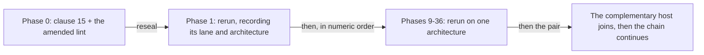

# Amoebius Development Plan

> **Purpose**: Provide the authoritative numeric phase order, current status, remaining work, and routing
> to each phase's human-authored validation contract.
> **Read this if**: the current phase, the next permitted work, or the location of a phase gate must be established.

This tracker owns phase order, status, and dated implementation progress. Each phase document owns its
capability-specific validation contract, while the universal source-snapshot postcondition is owned by
[development_plan_standards.md §S](development_plan_standards.md#s-universal-artifact-hygiene-gate).
Architecture remains owned by the doctrine suite under [`../documents/`](../documents/README.md).

Link-graph metadata

**Status**: Authoritative source
**Supersedes**: N/A
**Referenced by**: DEVELOPMENT_PLAN/development_plan_gate_integrity.md, DEVELOPMENT_PLAN/development_plan_phase_model.md, DEVELOPMENT_PLAN/development_plan_standards.md, DEVELOPMENT_PLAN/later_phases.md, DEVELOPMENT_PLAN/legacy_tracking_for_deletion.md, DEVELOPMENT_PLAN/overview.md, DEVELOPMENT_PLAN/phase_00_documentation_suite.md, DEVELOPMENT_PLAN/phase_01_toolchain_spike.md, DEVELOPMENT_PLAN/phase_02_repository_layout_conformance.md, DEVELOPMENT_PLAN/phase_03_host_assert_cli.md, DEVELOPMENT_PLAN/phase_04_host_ensure_kernel.md, DEVELOPMENT_PLAN/phase_05_amoebius_image_recipe.md, DEVELOPMENT_PLAN/phase_06_linux_engine_bringup.md, DEVELOPMENT_PLAN/phase_07_apple_engine_bringup.md, DEVELOPMENT_PLAN/phase_08_windows_engine_bringup.md, DEVELOPMENT_PLAN/phase_09_formal_model_kernel.md, DEVELOPMENT_PLAN/phase_10_gateway_migration_model.md, DEVELOPMENT_PLAN/phase_11_dhall_typecheck_schema.md, DEVELOPMENT_PLAN/phase_12_gadt_decode_ir.md, DEVELOPMENT_PLAN/phase_13_illegal_state_corpus.md, DEVELOPMENT_PLAN/phase_14_capacity_core_folds.md, DEVELOPMENT_PLAN/phase_15_storage_geometry_folds.md, DEVELOPMENT_PLAN/phase_16_execution_accelerator_folds.md, DEVELOPMENT_PLAN/phase_17_capability_bind.md, DEVELOPMENT_PLAN/phase_18_provision_seal.md, DEVELOPMENT_PLAN/phase_19_inference_accelerator_provision.md, DEVELOPMENT_PLAN/phase_20_render_manifest_goldens.md, DEVELOPMENT_PLAN/phase_21_chain_kernel_boundary.md, DEVELOPMENT_PLAN/phase_22_deterministic_sim_substrate.md, DEVELOPMENT_PLAN/phase_23_dsl_formal_model.md, DEVELOPMENT_PLAN/phase_24_reconcile_core_simulation.md, DEVELOPMENT_PLAN/phase_25_ui_program_schema.md, DEVELOPMENT_PLAN/phase_26_scoped_identity_kernel.md, DEVELOPMENT_PLAN/phase_27_ui_authorization_kernel.md, DEVELOPMENT_PLAN/phase_28_ui_effect_binding.md, DEVELOPMENT_PLAN/phase_29_ui_plan_compiler.md, DEVELOPMENT_PLAN/phase_30_offline_language_plan.md, DEVELOPMENT_PLAN/phase_31_ui_browser_interpreter.md, DEVELOPMENT_PLAN/phase_32_ui_server_boundary.md, DEVELOPMENT_PLAN/phase_33_ui_local_composition.md, DEVELOPMENT_PLAN/phase_34_encrypted_browser_runtime.md, DEVELOPMENT_PLAN/phase_35_bootstrap_coordinator_kind.md, DEVELOPMENT_PLAN/phase_36_base_image_registry.md, DEVELOPMENT_PLAN/phase_37_object_reconciler.md, DEVELOPMENT_PLAN/phase_38_capacity_scheduler.md, DEVELOPMENT_PLAN/phase_39_retained_storage.md, DEVELOPMENT_PLAN/phase_40_vault_pki.md, DEVELOPMENT_PLAN/phase_41_platform_backbone.md, DEVELOPMENT_PLAN/phase_42_platform_services_2.md, DEVELOPMENT_PLAN/phase_43_keycloak_ingress.md, DEVELOPMENT_PLAN/phase_44_live_dsl_deploy.md, DEVELOPMENT_PLAN/phase_45_app_tenancy.md, DEVELOPMENT_PLAN/phase_46_pulsar_client.md, DEVELOPMENT_PLAN/phase_47_user_tenant_isolation_live.md, DEVELOPMENT_PLAN/phase_48_content_store_workflow.md, DEVELOPMENT_PLAN/phase_49_ui_projection_runtime.md, DEVELOPMENT_PLAN/phase_50_release_lifecycle.md, DEVELOPMENT_PLAN/phase_51_ui_program_release.md, DEVELOPMENT_PLAN/phase_52_network_fabric_wireguard.md, DEVELOPMENT_PLAN/phase_53_multicluster_spawn_georepl.md, DEVELOPMENT_PLAN/phase_54_gateway_migration_drills.md, DEVELOPMENT_PLAN/phase_55_provider_deploy_checkpoint.md, DEVELOPMENT_PLAN/phase_56_provider_child_bringup.md, DEVELOPMENT_PLAN/phase_57_provider_ebs_credential.md, DEVELOPMENT_PLAN/phase_58_provider_dynamic_nodes.md, DEVELOPMENT_PLAN/phase_59_determinism_jitcache.md, DEVELOPMENT_PLAN/phase_60_infernix_lift.md, DEVELOPMENT_PLAN/phase_61_infernix_ui_lift.md, DEVELOPMENT_PLAN/phase_62_test_topology_dsl.md, DEVELOPMENT_PLAN/phase_63_ui_single_tenant_live.md, DEVELOPMENT_PLAN/phase_64_ui_multi_tenant_live.md, DEVELOPMENT_PLAN/phase_65_ui_rollout_reconnect.md, DEVELOPMENT_PLAN/phase_66_ui_ha_multizone.md, DEVELOPMENT_PLAN/phase_67_offline_replay_receipts.md, DEVELOPMENT_PLAN/phase_68_offline_blobs_isolation.md, DEVELOPMENT_PLAN/phase_69_offline_release_evolution.md, DEVELOPMENT_PLAN/phase_70_offline_multizone_continuity.md, DEVELOPMENT_PLAN/phase_71_jitml_lift_cuda.md, DEVELOPMENT_PLAN/phase_72_jitml_ui_lift.md, DEVELOPMENT_PLAN/phase_73_complementary_arch_child.md, DEVELOPMENT_PLAN/phase_74_apple_metal_host_daemon.md, DEVELOPMENT_PLAN/substrates.md, DEVELOPMENT_PLAN/system_components.md, README.md, documents/README.md, documents/documentation_standards.md, documents/engineering/README.md, documents/engineering/app_vs_deployment_doctrine.md, documents/engineering/apple_metal_headless_builds.md, documents/engineering/backup_recovery_doctrine.md, documents/engineering/bootstrap_sequence_doctrine.md, documents/engineering/browser_offline_runtime_doctrine.md, documents/engineering/capability_extension_doctrine.md, documents/engineering/chaos_failover_doctrine.md, documents/engineering/chaos_failover_second_axis.md, documents/engineering/chaos_failover_worked_examples.md, documents/engineering/cluster_lifecycle_doctrine.md, documents/engineering/cluster_topology_doctrine.md, documents/engineering/conformance_harness_doctrine.md, documents/engineering/consistency_pacelc_doctrine.md, documents/engineering/content_addressing_determinism.md, documents/engineering/content_addressing_doctrine.md, documents/engineering/daemon_topology_doctrine.md, documents/engineering/deterministic_simulation_doctrine.md, documents/engineering/diagram_conventions.md, documents/engineering/dsl_doctrine.md, documents/engineering/formal_model_doctrine.md, documents/engineering/gateway_migration_doctrine.md, documents/engineering/gateway_migration_model_doctrine.md, documents/engineering/generated_artifacts_doctrine.md, documents/engineering/host_cluster_comms_doctrine.md, documents/engineering/image_build_doctrine.md, documents/engineering/inforcespec_migration_doctrine.md, documents/engineering/lift_and_compose_doctrine.md, documents/engineering/low_code_ui_runtime_doctrine.md, documents/engineering/low_code_ui_workflow_lifting.md, documents/engineering/manifest_generation_doctrine.md, documents/engineering/migration_doctrine.md, documents/engineering/monitoring_doctrine.md, documents/engineering/namespace_layout_doctrine.md, documents/engineering/network_fabric_doctrine.md, documents/engineering/platform_services_doctrine.md, documents/engineering/preflight_validation_doctrine.md, documents/engineering/pulsar_client_doctrine.md, documents/engineering/pulumi_ebs_credential_model.md, documents/engineering/pulumi_iac_doctrine.md, documents/engineering/readiness_ordering_doctrine.md, documents/engineering/release_lifecycle_doctrine.md, documents/engineering/repository_layout_doctrine.md, documents/engineering/resource_capacity_construction.md, documents/engineering/resource_capacity_doctrine.md, documents/engineering/resource_capacity_folds.md, documents/engineering/resource_capacity_schema.md, documents/engineering/resource_capacity_sources.md, documents/engineering/resource_capacity_storage.md, documents/engineering/resource_capacity_types.md, documents/engineering/service_capability_doctrine.md, documents/engineering/single_logical_data_plane_doctrine.md, documents/engineering/storage_lifecycle_doctrine.md, documents/engineering/substrate_doctrine.md, documents/engineering/substrate_node_inventory.md, documents/engineering/tenancy_doctrine.md, documents/engineering/test_derivation_analysis.md, documents/engineering/testing_doctrine.md, documents/engineering/testing_spoof_resistance.md, documents/engineering/ui_realtime_coordination_doctrine.md, documents/engineering/validation_frame_doctrine.md, documents/engineering/vault_pki_doctrine.md, documents/glossary.md, documents/illegal_state/README.md, documents/illegal_state/illegal_state_catalog.md, documents/illegal_state/illegal_state_lifecycle.md, documents/illegal_state/illegal_state_security.md, documents/illegal_state/illegal_state_techniques.md, documents/reading_order.md
**Generated sections**: none

## Contents
- [Phase discipline](#phase-discipline)
- [Repository and evidence discipline](#repository-and-evidence-discipline)
- [Toolchain](#toolchain)
- [Document index](#document-index)
- [Status vocabulary](#status-vocabulary)
- [Implementation-progress vocabulary](#implementation-progress-vocabulary)
- [Definition of Done](#definition-of-done)
- [Reopened numeric sequence](#reopened-numeric-sequence)
- [Current implementation audit](#current-implementation-audit)
- [Phase overview](#phase-overview)
- [Related Documents](#related-documents)

---

amoebius is one Haskell runtime with command, host-daemon, control-plane daemon, scheduler, and worker responsibilities.
The Python `pb` bootstrap coordinator exists only before binary handoff and as the later admin-REST client.
The constituent prodbox, infernix, jitML, and hostbootstrap capabilities converge as libraries and
behaviours rather than separate products.

## Phase discipline

1. Phases close strictly in numeric order. Phase N+1 cannot close or begin new implementation work before
   Phase N satisfies its redesigned gate.
2. Each phase document owns one cohesive capability claim and one acceptance command.
3. Every gate inherits the artifact-hygiene postcondition in
   [development_plan_standards.md §S](development_plan_standards.md#s-universal-artifact-hygiene-gate).
4. Every hardware substrate can run the `linux-cpu` baseline **at its own natural architecture and no
   other**. Pristine Linux uses Incus on Linux or Linux-CUDA, Lima on Apple at `arm64`, and WSL2 on Windows at
   `amd64`. A gate names its lane with that architecture; nothing is emulated or cross-built
   ([substrate_doctrine.md §1.1](../documents/engineering/substrate_doctrine.md#11-the-natural-architecture-rule)).
5. A gate may additionally require at most one specialized lane — Apple, Linux-CUDA, or Windows. The baseline cannot
   substitute for a specialized claim, and one architecture cannot substitute for the other.
6. Register 1 is pure/golden, Register 2 is boundary-with-fakes, and Register 3 is live. Register 2.5 is a
   deterministic-simulation activity, never a phase-gate register.
7. Missing prerequisites fail; they never skip to green. Unreached applicable layers remain UNVERIFIED.

## Repository and evidence discipline

Only human-authored inputs and reviewed external source are version-controlled. Generated projections,
compiled output, lock/freeze files, package checksum databases, hard-coded library or package SHA values,
resolved paths, test enumeration, ledgers, receipts, logs, reports, screenshots, and generated
documentation remain untracked.

All amoebius-owned state stays under the physical checkout. `.build/**` owns reproducible, transient, and
evidentiary output; `.data/**` owns production runtime and durable state; `.test_data/**` owns exclusively
harness-created test state. Immutable run attestations live in `.build/evidence-store/**`. The complete
repository tree, output inventory, lifecycle rules, and normative `.gitignore`/`.dockerignore` patterns
are owned by
[repository_layout_doctrine.md](../documents/engineering/repository_layout_doctrine.md).

## Toolchain

Compilers, package tools, libraries, code generators, browsers, and transitive dependencies resolve
dynamically from authored compatibility requirements. Every clean run records the selected versions,
source identities, dependency graph, executable paths, and observed integrity data under `.build/toolchain/`
and `.build/locks/`, then binds them into repository-local evidence. No generated resolution is copied into Git.

**No requirement is expected on the developer host**, per the ensure rule of
[development_plan_standards.md §F](development_plan_standards.md#f-the-sprint-block-format). The floor it
leaves behind is authored data evaluated before any requirement resolves, so an unsupportable host is named
along with its remedy rather than discovered as a symptom. Every authored platform key is the one canonical
`<os>-<arch>` token, and a publisher that offers no asset for the host's architecture is a refusal, never a
substitution.

## Document index

| Document | Role |
|---|---|
| [development_plan_standards.md](development_plan_standards.md) | The plan rulebook's hub: every section heading and anchor, and the document-form rules |
| [development_plan_phase_model.md](development_plan_phase_model.md) | Rulebook slice: status vocabulary, the phase model, honesty, substrate discipline, reopening and re-baselining |
| [development_plan_gate_integrity.md](development_plan_gate_integrity.md) | Rulebook slice: gate integrity, universal artifact hygiene, reconciliation, and the final repository layout |
| [overview.md](overview.md) | Target architecture and cross-cutting invariants |
| [system_components.md](system_components.md) | Implemented, substituted, missing, generated, and planned component inventory |
| [substrates.md](substrates.md) | Hardware/substrate registry and pristine-host routing |
| [legacy_tracking_for_deletion.md](legacy_tracking_for_deletion.md) | Current-tree and history divergences, owners, and closure conditions |
| [Repository Layout and Artifact Provenance](../documents/engineering/repository_layout_doctrine.md) | Complete authored/generated tree, dynamic resolution, and ignore/context contract |
| [Conformance Harness Doctrine](../documents/engineering/conformance_harness_doctrine.md) | Validation registers and boundary discipline |
| [Deterministic Simulation Doctrine](../documents/engineering/deterministic_simulation_doctrine.md) | Register-2.5 scheduling and replay discipline |
| [Lift and Compose Doctrine](../documents/engineering/lift_and_compose_doctrine.md) | Sibling-source migration and convergence rules |
| `phase_00_*.md` … `phase_64_*.md` | One human-authored capability and validation contract per phase |
| [later_phases.md](later_phases.md) | In-scope phases not yet assigned an integer document |

## Status vocabulary

✅ Done · 🔄 Active · 📋 Planned · ⏸️ Blocked · 🧪 Live-proof pending. Definitions live in
[development_plan_standards.md §C](development_plan_standards.md#c-status-vocabulary). The former
non-standard `🟡 Scoped` marker is retired. A scoped historical result is diagnostic, not a current status.

## Implementation-progress vocabulary

Status is a gate decision; progress is a dated repository observation. **No footprint observed**, **Observed
footprint**, **Known partial**, and **Policy-conformant** have the exact meanings in
[development_plan_standards.md §C](development_plan_standards.md#c-status-vocabulary). Source, tests, a gate
script, or an old run can establish only an observed footprint. Only the redesigned current gate plus its
verified repository-local attestation can establish Policy-conformant progress or support ✅ Done.

## Definition of Done

A phase is Done only when all of the following are true:

1. Its phase-specific acceptance command passes in the declared register and substrate, against a recorded
   source snapshot of every non-ignored file.
2. Its runtime-generated surface enumeration joins completely to independently authored expectations.
3. Applicable mutants, negative controls, external observers, authority pairs, and cleanup checks pass.
4. All deliberate generated files stay under ignored output roots; source-adjacent ignored Python interpreter
   caches are the sole exception, and no other command writes beneath an authored root.
5. Nothing the gate ran altered a tracked file, and it left no unignored path behind.
6. The Docker context contains no generated output, evidence, cache, dependency tree, secret, or runtime state.
7. The generated run bundle passes its schema and honesty checks.
8. An immutable repository-local attestation verifies against that source-snapshot digest and the phase contract.
9. The source snapshot contains every referenced authored input and passes the same documented gate with no
   ignored worktree file as an input.
10. Semantic provenance checks reject reproducible tracked copies, including generated fixtures placed beneath
    otherwise authored roots.
11. A before/after host inventory proves that the gate created no amoebius-owned state outside the checkout.
12. Production state uses only `.data/**`; normal teardown preserves durable descendants.
13. Tests use only one marker-owned `.test_data/runs/<run-id>/**` root, fail fast on production state, and
    delete only that exact root after verifying ownership.
14. `test-secrets.dhall` is the sole cleartext secret-at-rest, is read only by the elevated test harness, is
    never copied or emitted, and is rejected by all production entry points.

Markdown never embeds the generated ledger, receipt, hash, transcript, or dependency resolution. A human
status decision may link the content-addressed run reference. A prior seal cannot satisfy Done, and neither can a run whose
source snapshot no longer matches the tree. **When the operator commits is their own affair and never a gate
condition** ([development_plan_standards.md §S](development_plan_standards.md#s-commit-timing)).

## Reopened numeric sequence

### The 2026-08-17 one-binary-many-roles amendment

The role a running copy of the binary holds is a **decoded value** on its frame config, not the identity of
the file that was executed
([`daemon_topology_doctrine.md` §2](../documents/engineering/daemon_topology_doctrine.md#2-context--role-an-orthogonal-grid)).
The suite said "one binary" in a dozen places and then drew four of them in the target tree; the union naming
the roles was written three times — in the schema, and in two doctrine documents — with no two agreeing on
its arms; and the context × role grid stayed prose, so the grid's empty cells were foreclosed by nothing. The
grid is now a closed `Process` union with a named schema module to carry it, `app/`'s second level has one
name, and the two states the shape forecloses are catalogued as 3.89 and 3.90.

**Consequence for order of work: none.** Phase 0 reopened and resealed the same day under
[§N](development_plan_phase_model.md#n-reopening-and-amending-a-phase), gaining
[Sprint 0.13](phase_00_documentation_suite.md#sprint-013-one-binary-many-roles-). Phase 1 is Active and
untouched by this change. Every other phase is Blocked, so amending its contract invalidates no seal —
Phases 11, 11, 20, 28, 30, 40 and 56 each gain or sharpen a deliverable. What the amendment condemns in code is
recorded in
[`legacy_tracking_for_deletion.md`](legacy_tracking_for_deletion.md#one-binary-many-roles--2026-08-17),
including the finding that **neither the dhall-typecheck nor the gadt-decode gate can run today**: both resolve their
oracles under a `tests/` directory the tree does not have.

### The 2026-08-17 host-ensure amendment

A tool with a supported install plan is **ensured**, never recorded as a prerequisite
([`substrate_doctrine.md` §3](../documents/engineering/substrate_doctrine.md#3-the-no-environment--no-path-lazy-tool-ensure-contract)).
[§F](development_plan_standards.md#f-the-sprint-block-format)'s `host-toolchain` token contradicted that by
naming six binaries a developer had to supply — two of which the resolver was already acquiring — and the
doctrine suite had never written down what a host must supply instead. The token is replaced by `host-floor`,
pointing at the per-substrate floor now stated in
[§3.1](../documents/engineering/substrate_doctrine.md#31-the-per-substrate-floor-what-only-the-operator-can-supply);
`accelerator-device-plugin` is retired because the device plugin is a DaemonSet the reconciler renders like
every other operator install. The vocabulary is now parsed from the rulebook's own table and joined to the
declaring phases in both directions, which immediately found two phases the table listed that declared
nothing and one that declared a token its row omitted.

**Consequence for order of work: none.** Only Phase 0 was Done, and it reopened and resealed the same day
under [§N](development_plan_phase_model.md#n-reopening-and-amending-a-phase). Phase 1 was already Active and
gains [Sprint 1.7](phase_01_toolchain_spike.md#sprint-17-discover-then-ensure--the-resolver-acquires-what-it-needs-).
Every other phase was Blocked, so amending its contract invalidates no seal. What the amendment condemns is
recorded in
[`legacy_tracking_for_deletion.md`](legacy_tracking_for_deletion.md#host-ensure-amendment--2026-08-17).

### The 2026-08-16 natural-architecture amendment

It **reopens every phase**, and re-baselines the sequence. Its
predicate is [development_plan_gate_integrity.md §S](development_plan_gate_integrity.md#s-universal-artifact-hygiene-gate)
clause 15: a run records the natural architecture it proved, and executes no artifact of another. No seal
recorded before 2026-08-16 names an architecture, and the one that named two reached the second under an
emulator, so no prior seal satisfies the amended gate. Phase 0 adopted the clause and resealed on 2026-08-17;
Phase 1 is Active and Phases 9–74 are Blocked, each returning to work only in numerical order after its
predecessor validates.

The re-baseline is the amendment's second half. No host can build an architecture it cannot execute, so the
old Phase 30 — one gate claiming a two-architecture image — became two: Phase 30 builds, proves, and publishes
its own architecture's child, and a new **Phase 67** does the same on the complementary substrate and joins
both into one attested index. Old phases 26–64 shift to 27–65 (that re-baseline's own record, not this one's); the audit map is recorded in
[legacy_tracking_for_deletion.md](legacy_tracking_for_deletion.md#natural-architecture-rebaseline--2026-08-16),
as [§E](development_plan_standards.md#e-one-canonical-phase-model) requires.

**Consequence for order of work.** Every phase reopens, so work restarts at Phase 0 and proceeds in numeric
order; a phase's rerun differs from its last one only by recording the architecture it ran on, except in the
image band where the contract itself changed. Phases 0–2 and 9–34 are substrate `none` and pure, so re-recording their
lane is a short run rather than a campaign. From Phase 73 onward the plan needs **two physical machines** — one
per architecture — which is a cost the amendment accepts rather than hides: a two-architecture image proven by
one machine was proven for one of them.

Each phase reruns its own gate and records the architecture that gate ran on; the containment criteria every
phase already inherited are unchanged and carry forward.

*Orientation. [Phase 0](phase_00_documentation_suite.md) adopts the architecture postcondition; each later phase reruns its own gate in numeric order, and the image band needs both machines.*

**Historical amendment record (superseded as status, retained as rationale):**

The **2026-08-15 repository-containment amendment** reopened every previously sealed phase without
renumbering, because the older contract admitted `.build/`'s predecessor, system temporary roots, user-home
state, and host-global container-engine data. Phase 0 validated the closed root set, both ignore contracts,
production rejection of `test-secrets.dhall`, test/production root separation, and a host-inventory negative
that detects any escaped path or global engine resource; each later phase then migrated its own paths, cleared
its rows in the legacy register, and reran its capability gate. Those containment criteria remain in force —
this amendment adds to them rather than replacing them.

The 2026-08-11 generated-artifact amendment reopened every phase — then numbered 0–68 — without renumbering them.

1. **Phase 0 adopted and sealed the repository-containment boundary on 2026-08-15.** Its ten-sided gate is
   green with 17 independently seeded policy rules, project-contained run evidence and attestation, and an
   unchanged outside-host inventory. The whole-tree containment scanner attributes 158 legacy callers to
   their numerical owner phases; none is a Phase-0 deferral.

2. **Phase 0 was reopened again on 2026-08-14 by the final-layout amendment, and resealed the same day.**
   [development_plan_standards.md §U](development_plan_standards.md#u-the-final-repository-layout) makes the
   target repository tree normative and gives it to Phase 0. The tree in
   [`repository_layout_doctrine.md` §2](../documents/engineering/repository_layout_doctrine.md#2-complete-repository-structure)
   had enumerated thirty-one roots and called itself exhaustive, but nothing compared it to the worktree, so
   its rule that a new root needs an amendment first had never decided anything. [§2](../documents/engineering/repository_layout_doctrine.md#2-complete-repository-structure) is now the target final
   layout at fourteen roots; Phase 0 owns the check that the tree matches, the no-phase-ordinal rule of [§U](development_plan_standards.md#u-the-final-repository-layout)
   clause 3, and the ignore contracts that are now exhaustive in both directions. Every divergence is recorded
   in
   [`legacy_tracking_for_deletion.md`](legacy_tracking_for_deletion.md#layout-and-naming-divergence-snapshot--2026-08-14)
   with an owner and a closure condition, deferred on the shrink-only terms
   [§S clause 5](development_plan_standards.md#s-universal-artifact-hygiene-gate) already sets. The three
   checks and the write-guard repair landed as Sprint 0.9; 876 findings are deferred with owners, none of
   them Phase 0's, and the phase resealed with all nine sides passing.
   A **re-baseline follows**, not precedes, that work: the third-party monocontainer bake moves to immediately
   after the toolchain phase, because its dependency floor is the toolchain and not the DSL, and the runtime
   image and registry publication stay in the live sequence. It is sequenced after the de-phasing because a
   re-baseline is documentation-only once no path names a phase, and it lands with the audit map
   [§E](development_plan_standards.md#e-one-canonical-phase-model) requires. Both obligations are recorded in
   [`legacy_tracking_for_deletion.md`](legacy_tracking_for_deletion.md#layout-and-naming-divergence-snapshot--2026-08-14).
3. **Phase 0 was reopened and resealed on 2026-08-13.** Its deliverables — the provenance classifier,
   generator registry, authored-root write guard, semantic generated-file scan, source-snapshot verification,
   ignore/context coverage, reachable-history audit, external-attestation validation, and the documentation
   lints — were sealed on 2026-08-12. Once commit `0526152` first tracked this phase's own machinery, the
   audit began scanning its own seeded negative corpora and the `policy` side went red. The finding belonged
   to Phase 0, which cannot defer what it owns; it closed by declaring the corpora as one authored set and
   is sealed again.
4. **Phases 1, 2, 9, and 10 were previously Done.** Phase 1 replaced its pin manifest with authored compatibility requirements and a
   run-local resolver; Phases 9 and 10 migrated the formal-model and gateway-migration gates onto resolved
   toolchains, run-bundle ledgers, and run-time surface enumeration. Each was sealed on 2026-08-12 with a
   verified pre-containment external attestation, recorded in the historical phase record table below.
5. **The lowest phase not yet sealed is Active; every phase above it is Blocked.** In order, each must migrate
   enumeration and evidence to `.build/`, establish oracle provenance, adopt the authored-root write guard, rerun
   its capability gate, and publish a snapshot-bound repository-local attestation. The phase-overview table is the
   authority on which phase that currently is.
6. **Later phases remain Planned.** They inherit the redesigned doctrine from their first authored contract.

Prior implementation and run records may guide diagnosis. They do not allow a phase to skip its reopened
gate or numeric predecessor.

### The 2026-08-13 secrets amendment reopens Phases 11 and 12

Secrets reach a workload only from Vault, and a production config cannot express a secret value. That second
half is a statement about **dhall-typecheck and gadt-decode**, so it belongs to the phases that own them: Phase 11 gains the
shared `SecretRef` union and Phase 12 gains its decode-and-reject. Both were sealed on 2026-08-12; both are
reopened under [§N](development_plan_standards.md#n-reopening-and-amending-a-phase) with the reason dated in
their status blocks.

Locating the type anywhere later would be the forward dependency
[§E](development_plan_standards.md#e-one-canonical-phase-model) forbids: Phases 11 and 12 would keep claiming a
complete admission boundary while a higher-numbered phase quietly completed it.

**Consequence for order of work.** While 4 and 5 are Active, no phase above them begins new implementation
work ([phase discipline](#phase-discipline) rule 1). Both are pure Register-1 gates, so reclosing them is a
short run rather than a campaign, and phases 13–35 keep the seals they already hold — each is bound to the
snapshot it actually ran against, and this amendment does not touch what those gates cover.

**Vault before providers is now structural, not procedural.** Because a spec cannot be admitted until every
`SecretRef` it names resolves in Vault
([vault_pki_doctrine.md §3.4](../documents/engineering/vault_pki_doctrine.md#34-admission-proves-the-named-secret-exists-before-any-effect)),
no live provider phase can run before Phase 40 exists. The check ranges over the references a spec *names*,
so a spec naming none needs no Vault — which is what keeps Phases 36–39 free of any dependency on 34.

## Current implementation audit

**Current conclusion — 2026-08-17:** **Phases 0 and 1 are Policy-conformant; no other phase is.**
[§C](development_plan_standards.md#c-status-vocabulary) reserves that term for a pass of the *current* gate,
and the current gate is [§S](development_plan_gate_integrity.md#s-universal-artifact-hygiene-gate) clause 15.
Phase 0's 2026-08-17 run is the first to satisfy it: it records the substrate, lane, and natural architecture
it executed on, and refuses a translated one. The current seal is the third of that day and covers
[Sprint 0.13](phase_00_documentation_suite.md#sprint-013-one-binary-many-roles-). Phase 1 followed the same
day on the host-ensure contract: the two tools its previous run declared missing are now acquired rather than
expected, so the phase seals on the host it stopped on rather than on a differently-provisioned one.
Every other row below stays at
**Observed footprint** or **Known partial**, which is a change of label, not a claim that the work is gone —
each phase's capability evidence stands as history and is what makes its rerun short.
The existing later-phase implementation still
uses legacy repository roots, system temp and data directories, user-home state, and host-global Docker
resources. The detailed pre-containment rows below are retained as historical capability observations; every
`Policy-conformant` label in them is invalidated for current status by the containment and
natural-architecture amendments alike.

The governed documentation lint and full Phase-0 verifier are sealed. The gate reports every remaining
containment migration as a shrink-only, owner-attributed deferral and writes all of its own state beneath
`.build/**`.

This is a static audit of clean commit `c8870a2` observed on **2026-08-11**. At inspection time it matched
`origin/master`; ignored paths, the effective source-closure boundary, reachable revision history, and
unreachable local objects were inspected separately. A clean or pushed commit is not automatically
policy-conformant. Exact counts, paths, historical findings, and actionable mismatches live in
[legacy_tracking_for_deletion.md](legacy_tracking_for_deletion.md#existing-code-divergence-snapshot--2026-08-11).

| Phase(s) | Progress | Observed state | Required next boundary |
|---|---|---|---|
| 0 | **Policy-conformant** | 2026-08-17, resealed against the tree Phase 2 moved: the eleven-sided gate passes on natural `arm64`, untranslated, with 17 clean artifact rules, 49 seeded documentation negatives red at their own checks, and 37 surfaces joined to 77 implemented checks. The deferral total is 314, down from 876, because Phase 2 deleted every `r13` and `r15` row rather than re-owning it. The reseal also resolved the pre-implementation manifest pins and eleven contracts' artifact paths, which had named a pre-amendment ordinal since the ordering re-baseline | None. The next boundary belongs to Phase 12 |
| 1 | **Policy-conformant** | 2026-08-17, resealed against the tree Phase 2 moved: the twelve-sided gate passes on natural `arm64`, untranslated. All 17 authored requirements resolve with none expected on the host, two independent resolutions admit the same 260 packages, the same graph resolves from the 1,965-file source snapshot alone, the representative set builds from an empty store, every probe matches its authored expectation, both mutants redden — the `drop-allow-newer` project regained the two sibling `source-repository-package` entries the merged package now needs, so it reddens at the seeded `proto`/`base` conflict rather than at an unknown package — and 40 surfaces join to 62 enumerated items | None. The next boundary belongs to Phase 12 |
| 2 | **Policy-conformant** | 2026-08-17: the fourteen-sided gate passes on substrate `none`, lane `none`, natural `arm64`, untranslated. `test/`'s second level is exactly the seven role nouns over 1,084 files; fourteen package declarations are one, and `cabal build all --dry-run` and `cabal test all --dry-run` resolve against it; 468 authored paths, 216 build flags, and 43 `main-is` values carry a capability name rather than a phase ordinal; one mutant registry covers all 411 mutations, 99 of which no file named before; rules `r13` and `r15` report zero findings and the allowlist carries no row for either; all six committed mutants redden their own check and no other; 27 surfaces join to 27 enumerated items. The deferral total falls from 876 to 314 | None. The next boundary belongs to Phase 9 |
| 9 | **Policy-conformant** | 2026-08-17: the ten-sided gate passes on natural `arm64`, untranslated. The JVM and TLC resolve from authored requirements and TLC identifies itself from a live banner probe; all 31 authored metrics match, every model-safety, spec-weakening, renderer-golden, and renderer-differential mutant is caught, 608 emitted `.tla`/`.cfg` files stay beneath `.build/**` and outside the 1,965-file source snapshot, 14 surfaces join to 39 run-time items, and the outside-host inventory is unchanged | None. The next boundary belongs to Phase 4 |
| 10 | **Policy-conformant** | 2026-08-17: the ten-sided gate passes on natural `arm64`, untranslated. All 12 authored results match, every per-invariant, mechanical, fairness, cutoff, and shared-resource mutant reddens, 34 emitted `.tla`/`.cfg` files remain beneath `.build/**` and outside the 1,965-file source snapshot, 15 surfaces join to 17 run-time items, and the outside-host inventory is unchanged | None. The next boundary belongs to Phase 5 |
| 11 | **Policy-conformant** | 2026-08-17: the ten-sided gate passes on natural `arm64`, untranslated. The dhall-typecheck battery is green and all 18 authored metrics match after canonical normalization; every field-deletion, type-substitution, special-resource, and custom-arm mutant reddens; 18 surfaces join to 21 run-time items; generated results stay beneath `.build/**` and the outside-host inventory is unchanged. The rerun corrected an oracle root (`tests/oracle/dhall-typecheck/`) that named a directory the tree has never had, so the metrics are compared rather than skipped | None. The next boundary belongs to Phase 6 |
| 12 | **Policy-conformant** | 2026-08-17: the thirteen-sided gate passes on natural `arm64`, untranslated. `dsl-spec` is green, every recorded metric is derived from an observation, and 24 surfaces join to 27 enumerated items. The `strace` observer is replaced by a substrate-portable argv observer with two mutants of its own; on its first run it caught three call sites reaching `dhall` through an ambient PATH lookup, and four validation-locus thresholds that had drifted from their own registry | None. The next boundary belongs to Phase 7 |
| 13 | **Policy-conformant** | 2026-08-17: the twelve-sided gate passes on natural `arm64`, untranslated. 90 catalog entries reconcile to 106 registry subcases, the corpus is green with 14 dhall-typecheck and 13 gadt-decode negatives against 12 positives, and 24 surfaces join to 27 run-time items. The rerun found three of the four registry mutators no longer mutating anything — one pinned to an ordinal the re-baseline renumbered away — and two catalog pins left stale by the one-binary amendment | None. The next boundary belongs to Phase 8 |
| 14 | **Policy-conformant** | 2026-08-17: the eleven-sided gate passes on natural `arm64`, untranslated. Every authored oracle holds its declared shape, all nineteen mutants redden at their own loci, every result is derived from an observation, and 25 surfaces join to 25 run-time items. The rerun found Phase 2's mutant registry had dropped 101 rows whose mutation the owning gate materializes from its own code rather than from a file | None. The next boundary belongs to Phase 9 |
| 15 | **Policy-conformant** | 2026-08-17: the eleven-sided gate passes on natural `arm64`, untranslated. Every authored oracle holds its declared shape, the suite is green, all thirty-one mutants redden at their own loci, every result is derived from an observation, and 39 surfaces join to 44 run-time items | None. The next boundary belongs to Phase 10 |
| 16 | **Policy-conformant** | 2026-08-17: the eleven-sided gate passes on natural `arm64`, untranslated. Every authored oracle holds its declared shape, the suite is green, all forty-five mutants redden at their own loci, every result is derived from an observation, and 56 surfaces join to 94 run-time items | None. The next boundary belongs to Phase 11 |
| 17 | **Policy-conformant** | 2026-08-17: the eleven-sided gate passes on natural `arm64`, untranslated. Every authored oracle holds its declared shape, the suite is green, every seeded mutant reddens at its own locus, each result is derived from an observation, and 29 surfaces join to 36 run-time items | None. The next boundary belongs to Phase 12 |
| 18 | **Policy-conformant** | 2026-08-17: the eleven-sided gate passes on natural `arm64`, untranslated. Every authored oracle holds its declared shape, the suite is green, all ten mutants redden at their own loci, and 34 surfaces join to 42 run-time items. The rerun corrected three gates whose item enumerator read the one registry's first column, which is the capability rather than the mutant id | None. The next boundary belongs to Phase 13 |
| 19 | **Policy-conformant** | 2026-08-17: the eleven-sided gate passes on natural `arm64`, untranslated. Every authored oracle holds its declared shape, the suite is green, every seeded mutant reddens at its own locus, and 28 surfaces join to 39 run-time items | None. The next boundary belongs to Phase 14 |
| 20 | **Policy-conformant** | 2026-08-17: the eleven-sided gate passes on natural `arm64`, untranslated. The rendered-output goldens match byte for byte, every seeded mutant reddens at its own locus, each result is derived from an observation, and 31 surfaces join to 46 run-time items | None. The next boundary belongs to Phase 15 |
| 21 | **Policy-conformant** | 2026-08-17: the thirteen-sided gate passes on natural `arm64`, untranslated. The Part-A kernel and Part-B boundary suites are green, the extension-astcheck AST checker holds its compile-fail seal, every mutant reddens at its own locus, and 40 surfaces join to 40 run-time items. The rerun added a third sanctioned network observer — Darwin's `sandbox-exec`, control-proven before it is trusted — and made the four fake boundary tools portable off Linux | None. The next boundary belongs to Phase 16 |
| 22 | **Policy-conformant** | 2026-08-17: the thirteen-sided gate passes on natural `arm64`, untranslated. The real and io-sim interpreters agree from one reference reconciler, every authored fake-contract fault holds its outcome, the dropped-partition mutant reddens at its own locus, and 26 surfaces join to 36 run-time items. The rerun made Phase 2's mutant registry carry each capability's own vocabulary rather than flattening eight schemas into two columns | None. The next boundary belongs to Phase 17 |
| 23 | **Planned** | Created 2026-08-17 by the ordering re-baseline; no implementation footprint yet | Author the expected-outcome table, then model-check the DSL surfaces |
| 24 | **Planned** | Created 2026-08-17 by the ordering re-baseline; no implementation footprint yet | Separate the decision core, then replay it under the Phase-16 substrate |
| 25 | **Observed footprint** | Historical, refreshed 2026-08-15: The complete twelve-sided gate passes: three positives, ten exact negatives, graph/wire oracles, eight coverage classes, the compile seal, network isolation, all six mutants, and all ten metrics pass; 29 surfaces join to 46 enumerated items; generated output, test scratch, Cabal state, and host state remain contained. None of it records the architecture it proved, so clause 15 leaves the result UNVERIFIED for every architecture | Rerun the amended gate, recording the substrate, lane, and natural architecture |
| 26 | **Observed footprint** | Historical, refreshed 2026-08-15: The complete twelve-sided gate passes: all owner joins/swaps, the independent flow matrix, three compile loci, six coverage classes, the owner-equality mutant, all ten metrics, and nine constructor-privacy checks pass; 40 surfaces join to 47 enumerated items; generated output, test scratch, Cabal state, and host state remain contained. None of it records the architecture it proved, so clause 15 leaves the result UNVERIFIED for every architecture | Rerun the amended gate, recording the substrate, lane, and natural architecture |
| 27 | **Observed footprint** | Historical, refreshed 2026-08-15: The complete eleven-sided gate passes: registry, access, parity, epoch, independent-reference, closed-union, constructor-privacy, network-isolation, both mutants, and all eleven metrics pass; 40 surfaces join to 57 enumerated items; generated output, test scratch, Cabal state, and host state remain contained. None of it records the architecture it proved, so clause 15 leaves the result UNVERIFIED for every architecture | Rerun the amended gate, recording the substrate, lane, and natural architecture |
| 28 | **Observed footprint** | Historical, refreshed 2026-08-15: The complete eleven-sided gate passes: seven ports, two trusted links, eight exact errors, thirteen coverage classes, all seven mutants, and all twelve metrics pass; four closed sums and the independent handler/capability key sets are checked directly; 55 surfaces join to 85 enumerated items; generated output, test scratch, Cabal state, and host state remain contained. None of it records the architecture it proved, so clause 15 leaves the result UNVERIFIED for every architecture | Rerun the amended gate, recording the substrate, lane, and natural architecture |
| 29 | **Observed footprint** | Historical, refreshed 2026-08-15: The complete eleven-sided gate passes: four independent projections, four byte-exact canonical artifacts, four independently derived digests, six finite demand cells, two fresh-process determinism checks, all six mutants, and all thirteen metrics pass; 55 surfaces join to 66 enumerated items; generated output, test scratch, Cabal state, and host state remain contained. None of it records the architecture it proved, so clause 15 leaves the result UNVERIFIED for every architecture | Rerun the amended gate, recording the substrate, lane, and natural architecture |
| 30 | **Observed footprint** | The offline-language source/test/gate footprint exists; its prior pre-cluster result is invalidated | Migrate and rerun the current Phase-60 gate |
| 31 | **Observed footprint** | Historical, refreshed 2026-08-15: The complete eleven-sided gate passes in resolved Chrome: two plans, five event arms, four independently derived traces, two DOM snapshots, three accessibility rows, five focus rows, four transport rows, CSP and WebSocket checks, all nine mutants, and all sixteen metrics pass; 66 surfaces join to 84 enumerated items; Node, Spago, PureScript, browser, Cabal, and host state remain contained. None of it records the architecture it proved, so clause 15 leaves the result UNVERIFIED for every architecture | Rerun the amended gate, recording the substrate, lane, and natural architecture |
| 32 | **Observed footprint** | Historical, refreshed 2026-08-15: The complete thirteen-sided gate passes: seven HTTP rows, five access rows, five sanitized audit rows, five handler-effect rows, five startup rows, five public assets, five private probes, seven WebSocket rows, loopback-only OS observation, all nine mutants, and all nineteen metrics pass; 77 surfaces join to 94 run-time items; build/test scratch and host state remain contained. None of it records the architecture it proved, so clause 15 leaves the result UNVERIFIED for every architecture | Rerun the amended gate, recording the substrate, lane, and natural architecture |
| 33 | **Observed footprint** | Historical, refreshed 2026-08-15: The complete thirteen-sided gate passes in resolved Chrome: two Dhall applications, five interactions, four exact visible states, four ordered effects, three access rows, five zero-leak denials, loopback-only OS observation, all five mutants, and all seventeen metrics pass; 58 surfaces join to 71 run-time items; the legacy `tests/` root is gone and all generated, build, browser, and host state remains contained. None of it records the architecture it proved, so clause 15 leaves the result UNVERIFIED for every architecture | Rerun the amended gate, recording the substrate, lane, and natural architecture |
| 28, 61–64 | **Known partial** | Browser/offline gate footprints exist; the contracts retain production compiler, broker, identity, object-store, Kubernetes/CNI, rollout, or provider multi-zone gaps | Close the named Register-2/3 gaps and rerun in numeric order |
| 35 | **Observed footprint** | Historical, refreshed 2026-08-15: `python3 tools/bootstrap_coordinator_gate.py --execute` passes all eleven sides against a newly materialized pristine Incus guest. All six mutants are independently red, all sixteen metrics match, and 28 surfaces join to 30 run-time items. Tool acquisition, Cabal state, guest transport, build/evidence, production state, and marker-owned test state are repository-contained; the outside-host inventory is unchanged and the guest is destroyed. Attestation `sha256:cf31b7eb39b7419bc51375e18cc24e56aac1b697150029f52257be751dce4b66`, source `sha256:7503a6e8d86c0f95…`. None of it records the architecture it proved, so clause 15 leaves the result UNVERIFIED for every architecture | Rerun the amended gate, recording the substrate, lane, and natural architecture |
| 36 | **Known partial** | The catalog, acquisition ladder, pure/static checks, OCI file oracle, and registry standup have been observed. The bake that was observed is the pre-amendment dual-architecture one, whose non-native half was built and probed under emulation; the single-architecture bake this contract now specifies has never run | Rerun the narrowed gate on one host, natively, after Phase 24 reseals |
| 37 | **Observed footprint** | The prior capability remains historical, but its exact Phase-25 handoff is superseded by the open image amendment. | Revalidate against the amended Phase-25 seal |
| 38 | **Observed footprint** | The prior capability remains historical pending the amended Phase-27 predecessor chain. | Revalidate after Phase 27 |
| 39 | **Observed footprint** | The prior capability remains historical pending the amended Phase-28 predecessor chain. | Revalidate after Phase 28 |
| 40 | **Observed footprint** | The prior capability remains historical pending the amended Phase-29 predecessor and Phase-25 handoff. | Revalidate after Phase 29 |
| 35–48 | **Known partial** | Phase 37's live run found the Phase-31 offloader defect; its registry correction and containment changes remain implemented. Phases 37–50 are blocked behind the open predecessor chain, and no current policy-conformant result exists for the range. | Resume Phase 37 only after Phases 31–36 reseal, then validate each later phase in numeric order |
| 49–52 | **Known partial** | Provider/AWS gate footprints exist, while the phase contracts explicitly record missing authenticated provider materialization, EBS/IAM behavior, node provisioning, audit, and leak-freedom | Complete the provider seams after predecessors close and run the live provider gates |
| 59 | **Observed footprint** | Pure and live/cache footprints exist; the prior `linux-cpu` result is invalidated by the artifact-policy amendment | Migrate and rerun the current Phase-49 gate |
| 54–60, 65–66, 68 | **Known partial** | Gate and test footprints exist. Phase 56 retains frozen sibling-source hashes and Phase 60 commits reference-program output; the range also retains scoped capability gaps in sibling lift, native transport, production topology, hardware, cleanup, or multi-zone behavior | Remove derived/hash expectations in their owning phases, close each capability gap, and rerun in numeric order on the required lane |
| 73 | **No footprint observed** | Authored 2026-08-16 by the natural-architecture amendment. No complementary-architecture bake, attestation, or index join exists | Author the oracles and mutants, then run the gate on an `arm64` host after Phase 25 seals |
| 75+ | **No footprint observed** | This audit did not attribute an implementation footprint to an unnumbered later phase | Author a phase contract in numeric order before implementation |

The absence of a separately listed phase within a range does not hide its state: every integer in that range
inherits the row. Any later code or plan change that affects these observations must refresh this audit and
the legacy register in the same documentation change.

## Phase overview

The table is an order-and-status index. It is read with the dated progress audit above, not as an assertion
that a blocked phase has no code. The linked phase document owns the phase-specific gate; every gate also
inherits the universal postcondition above.

| Phase | Name | Substrate | Lane | Register | Status | Validation contract |
|---|---|---|---|---|---|---|
| 0 | Documentation suite + the final repository layout | none | `none` | — | ✅ Done — resealed 2026-08-17 against the tree Phase 2 moved and the documentation that followed it; attestation `sha256:7c9b0aa7180ec0a8ffa75c9e601658b68c70215658c3faa87d9b7b82b230d9e5` | [phase_00](phase_00_documentation_suite.md) |
| 1 | Toolchain spike | none | `none` | 1 | ✅ Done — resealed twice on 2026-08-17: after the [host-ensure amendment](legacy_tracking_for_deletion.md#host-ensure-amendment--2026-08-17), and again against the tree Phase 2 moved; the gate records lane `none` and natural `arm64`; attestation `sha256:284dd6643d5175319f2b3973b62073d53cc2a2654d7ba18be60a5b48dffc94f6` | [phase_01](phase_01_toolchain_spike.md) |
| 2 | Repository layout conformance + de-phased naming | none | `none` | 1 | ✅ Done — sealed 2026-08-17; the gate records lane `none` and natural `arm64`; attestation `sha256:3ffff73d52edc6defb74411f65d0f51acb0ca86309f8a8c138fd81e5f06389b9` | [phase_02](phase_02_repository_layout_conformance.md) |
| 3 | The `pb` host-assertion CLI | none | `none` | 2 | 📋 Planned | [phase_3](phase_03_host_assert_cli.md) |
| 4 | The host-ensure kernel | none | `none` | 2 | 📋 Planned | [phase_4](phase_04_host_ensure_kernel.md) |
| 5 | The amoebius image recipe | none | `none` | 1 | 📋 Planned | [phase_5](phase_05_amoebius_image_recipe.md) |
| 6 | Linux: sudoless Docker and the native image | linux-cpu | `linux-cpu/amd64` | 3 | 📋 Planned | [phase_6](phase_06_linux_engine_bringup.md) |
| 7 | Apple: Homebrew, Colima, and the native image | apple | `linux-cpu/arm64` | 3 | 📋 Planned | [phase_7](phase_07_apple_engine_bringup.md) |
| 8 | Windows: WSL2 and the lifted Linux engine | windows | `linux-cpu/amd64` | 3 | 📋 Planned | [phase_8](phase_08_windows_engine_bringup.md) |
| 9 | Formal-model EDSL (`Model`/`interpret`/`emitTLA`) | none | `none` | 1 | ✅ Done — resealed 2026-08-17 on the amended contract; the gate records lane `none` and natural `arm64`; attestation `sha256:936cc5a28f225c3ca57a1d460095bd3e3d7c9feee5ad3a30f2a3a11512561c33` | [phase_9](phase_09_formal_model_kernel.md) |
| 10 | Gateway-migration model (both branches) | none | `none` | 1 | ✅ Done — resealed 2026-08-17 on the amended contract; the gate records lane `none` and natural `arm64`; attestation `sha256:1f860509da226b8b171dbd336f3fc02b9bb1e617113e7cb45cc8a4378a590163` | [phase_10](phase_10_gateway_migration_model.md) |
| 11 | Dhall dhall-typecheck schema + smart-constructor prelude | none | `none` | 1 | ✅ Done — resealed 2026-08-17 on the amended contract; the gate records lane `none` and natural `arm64`; attestation `sha256:33e2d6750c7ad3d71c8c1902480e2f736253de8892f3c3acac94e2ff89564ed5` | [phase_11](phase_11_dhall_typecheck_schema.md) |
| 12 | GADT-indexed IR + total decoder (gadt-decode) | none | `none` | 1 | ✅ Done — resealed 2026-08-17 on the amended contract, with the OS-boundary observer made decidable on every substrate; attestation `sha256:9cd8bb1f864cfad9e41ce5a40a6857f373f429166845ac6dcc7bb2cb21d7275c` | [phase_12](phase_12_gadt_decode_ir.md) |
| 13 | Illegal-state corpus + validation-locus ledger | none | `none` | 1 | ✅ Done — resealed 2026-08-17 on the amended contract; the gate records lane `none` and natural `arm64`; attestation `sha256:10fd07860d415ff7b315ed39ae7cc9e3768400d6196ae5a862e324ab155fb9e8` | [phase_13](phase_13_illegal_state_corpus.md) |
| 14 | Capacity core fold + topology relation | none | `none` | 1 | ✅ Done — resealed 2026-08-17 on the amended contract; the gate records lane `none` and natural `arm64`; attestation `sha256:ead83f157bb7a69b8d039a29a92179073e03f87d8b24eb9c3d53c46a3596819b` | [phase_14](phase_14_capacity_core_folds.md) |
| 15 | Logical→physical storage geometry folds | none | `none` | 1 | ✅ Done — resealed 2026-08-17 on the amended contract; the gate records lane `none` and natural `arm64`; attestation `sha256:845732a8a5460be0cc61d4b48d3266fca295922c177be3db0affac0ad0aece4e` | [phase_15](phase_15_storage_geometry_folds.md) |
| 16 | Execution-epoch + scheduler + accelerator + provider-root folds | none | `none` | 1 | ✅ Done — resealed 2026-08-17 on the amended contract; the gate records lane `none` and natural `arm64`; attestation `sha256:42369748d2225285354a4e039c2a65a79f8bada077021905ddce52fd5e7aa7fc` | [phase_16](phase_16_execution_accelerator_folds.md) |
| 17 | Capability union + representational bind | none | `none` | 1 | ✅ Done — resealed 2026-08-17 on the amended contract; the gate records lane `none` and natural `arm64`; attestation `sha256:dde36776da998475241825343eac9a7e32fde32aa73596f799a2dada5e0e2a6a` | [phase_17](phase_17_capability_bind.md) |
| 18 | Whole-deployment provision seal + expansion | none | `none` | 1 | ✅ Done — resealed 2026-08-17 on the amended contract; the gate records lane `none` and natural `arm64`; attestation `sha256:d4740038bcbfce9974fafafbd8af989b0b7e74eeb3a9d6fae0d8f5ae8690facb` | [phase_18](phase_18_provision_seal.md) |
| 19 | InferenceEngine capability + accelerator provision | none | `none` | 1 | ✅ Done — resealed 2026-08-17 on the amended contract; the gate records lane `none` and natural `arm64`; attestation `sha256:d66d1dff3fcd123a58c2a4f333c81c6fd9b806ba1a9f27ee8e28354dba1a9b0a` | [phase_19](phase_19_inference_accelerator_provision.md) |
| 20 | Pure `renderAll` + rendered-output goldens | none | `none` | 1 | ✅ Done — resealed 2026-08-17 on the amended contract; the gate records lane `none` and natural `arm64`; attestation `sha256:3df8758b265a5d6f680661facbe3bfb508f14be5237581a6a1043c89752d7ddd` | [phase_20](phase_20_render_manifest_goldens.md) |
| 21 | chain/Step kernel + `--dry-run` + boundary fake-tool harness + extension-astcheck AST checker | none | `none` | 1/2 | ✅ Done — resealed 2026-08-17 on the amended contract; the gate records lane `none` and natural `arm64`; attestation `sha256:e6f6a3769d617195ede51736d91a8026b7bf397c42ea60b1b174ef5161a8bdc7` | [phase_21](phase_21_chain_kernel_boundary.md) |
| 22 | Deterministic-simulation substrate | none | `none` | 2 | ✅ Done — resealed 2026-08-17 on the amended contract; the gate records lane `none` and natural `arm64`; attestation `sha256:d063135dfcbd14ad2f483e425961be8eda95ef3dca28ff7b2531db9d0b48ef3d` | [phase_22](phase_22_deterministic_sim_substrate.md) |
| 23 | DSL formal model — TLA+ over the DSL semantics | none | `none` | 1 | 🔄 Active — opened 2026-08-17 when Phase 16 resealed | [phase_23](phase_23_dsl_formal_model.md) |
| 24 | Reconcile decision core under deterministic simulation | none | `none` | 2 | ⏸️ Blocked pending Phase-17 revalidation | [phase_24](phase_24_reconcile_core_simulation.md) |
| 25 | Bounded UI-program schema | none | `none` | 1 | ⏸️ Blocked pending Phase-18 revalidation | [phase_25](phase_25_ui_program_schema.md) |
| 26 | Scoped identity kernel | none | `none` | 1 | ⏸️ Blocked pending Phase-19 revalidation | [phase_26](phase_26_scoped_identity_kernel.md) |
| 27 | UI authorization kernel | none | `none` | 1 | ⏸️ Blocked pending Phase-20 revalidation | [phase_27](phase_27_ui_authorization_kernel.md) |
| 28 | UI effect binding | none | `none` | 1 | ⏸️ Blocked pending Phase-21 revalidation | [phase_28](phase_28_ui_effect_binding.md) |
| 29 | UI plan compiler | none | `none` | 1 | ⏸️ Blocked pending Phase-22 revalidation | [phase_29](phase_29_ui_plan_compiler.md) |
| 30 | Offline language and paired plans | none | `none` | 1 | ⏸️ Blocked pending Phase-23 revalidation | [phase_30](phase_30_offline_language_plan.md) |
| 31 | Generic browser interpreter | none | `none` | 2 | ⏸️ Blocked pending Phase-24 revalidation | [phase_31](phase_31_ui_browser_interpreter.md) |
| 32 | UI-server boundary | none | `none` | 2 | ⏸️ Blocked pending Phase-25 revalidation | [phase_32](phase_32_ui_server_boundary.md) |
| 33 | Local UI composition | none | `none` | 2 | ⏸️ Blocked pending Phase-26 revalidation | [phase_33](phase_33_ui_local_composition.md) |
| 34 | Encrypted browser offline runtime | none | `none` | 2 | ⏸️ Blocked pending Phase-27 revalidation | [phase_34](phase_34_encrypted_browser_runtime.md) |
| 35 | Python bootstrap coordinator + substrate detect + single kind cluster | linux-cpu | `linux-cpu/amd64` | 3 | ⏸️ Blocked pending Phase-28 revalidation | [phase_35](phase_35_bootstrap_coordinator_kind.md) |
| 36 | Typed bake catalog + native-architecture base image + jit-build resolver + distribution registry | linux-cpu | `linux-cpu/amd64` | 3 | ⏸️ Blocked pending Phase-29 revalidation | [phase_36](phase_36_base_image_registry.md) |
| 37 | Typed renderer + object reconciler | linux-cpu | `linux-cpu/amd64` | 3 | ⏸️ Blocked pending Phase-30 revalidation | [phase_37](phase_37_object_reconciler.md) |
| 38 | amoebius-capacity scheduler + bootstrap cutover | linux-cpu | `linux-cpu/amd64` | 3 | ⏸️ Blocked pending Phase-31 revalidation | [phase_38](phase_38_capacity_scheduler.md) |
| 39 | No-provisioner retained storage + lossless rebind | linux-cpu | `linux-cpu/amd64` | 3 | ⏸️ Blocked pending Phase-32 revalidation | [phase_39](phase_39_retained_storage.md) |
| 40 | Root Vault + PKI + built-in Haskell Vault client | linux-cpu | `linux-cpu/amd64` | 3 | ⏸️ Blocked pending Phase-33 revalidation | [phase_40](phase_40_vault_pki.md) |
| 41 | Platform backbone (MetalLB + MinIO + Pulsar HA) | linux-cpu | `linux-cpu/amd64` | 3 | ⏸️ Blocked pending Phase-34 revalidation | [phase_41](phase_41_platform_backbone.md) |
| 42 | Platform services-2 (Redis/Sentinel + Percona/Patroni + pgAdmin + observability + readiness-DAG) | linux-cpu | `linux-cpu/amd64` | 3 | ⏸️ Blocked pending Phase-35 revalidation | [phase_42](phase_42_platform_services_2.md) |
| 43 | Keycloak-owned ingress | linux-cpu | `linux-cpu/amd64` | 3 | ⏸️ Blocked pending Phase-36 revalidation | [phase_43](phase_43_keycloak_ingress.md) |
| 44 | Live DSL deploy via the replicas=1 control-plane daemon | linux-cpu | `linux-cpu/amd64` | 3 | ⏸️ Blocked pending Phase-37 revalidation | [phase_44](phase_44_live_dsl_deploy.md) |
| 45 | Tenant/provider provisioning | linux-cpu | `linux-cpu/amd64` | 3 | ⏸️ Blocked pending Phase-38 revalidation | [phase_45](phase_45_app_tenancy.md) |
| 46 | Native Pulsar client (CBOR) | linux-cpu | `linux-cpu/amd64` | 3 | ⏸️ Blocked pending Phase-39 revalidation | [phase_46](phase_46_pulsar_client.md) |
| 47 | Live subject/tenant isolation | linux-cpu | `linux-cpu/amd64` | 3 | ⏸️ Blocked pending Phase-40 revalidation | [phase_47](phase_47_user_tenant_isolation_live.md) |
| 48 | Content store + workflow runtime (Pulsar-Failover single-writer) | linux-cpu | `linux-cpu/amd64` | 3 | ⏸️ Blocked pending Phase-41 revalidation | [phase_48](phase_48_content_store_workflow.md) |
| 49 | Owner-scoped UI projection runtime | linux-cpu | `linux-cpu/amd64` | 3 | ⏸️ Blocked pending Phase-42 revalidation | [phase_49](phase_49_ui_projection_runtime.md) |
| 50 | Release lifecycle | linux-cpu | `linux-cpu/amd64` | 3 | ⏸️ Blocked pending Phase-43 revalidation | [phase_50](phase_50_release_lifecycle.md) |
| 51 | Atomic immutable UI-program release | linux-cpu | `linux-cpu/amd64` | 3 | ⏸️ Blocked pending Phase-44 revalidation | [phase_51](phase_51_ui_program_release.md) |
| 52 | WireGuard network fabric | linux-cpu | `linux-cpu/amd64` | 3 | ⏸️ Blocked pending Phase-45 revalidation | [phase_52](phase_52_network_fabric_wireguard.md) |
| 53 | Multi-cluster spawn + geo-replication | linux-cpu | `linux-cpu/amd64` | 3 | ⏸️ Blocked pending Phase-46 revalidation | [phase_53](phase_53_multicluster_spawn_georepl.md) |
| 54 | Gateway-migration drills + model-correspondence | linux-cpu | `linux-cpu/amd64` | 3 | ⏸️ Blocked pending Phase-47 revalidation | [phase_54](phase_54_gateway_migration_drills.md) |
| 55 | Provider Pulumi deploy-from-inside + enveloped checkpoint | linux-cpu → provider | `linux-cpu/amd64` → provider | 3 | ⏸️ Blocked pending Phase-48 revalidation | [phase_55](phase_55_provider_deploy_checkpoint.md) |
| 56 | Hostless provider child + convergence + Lease handoff | linux-cpu → provider | `linux-cpu/amd64` → provider | 3 | ⏸️ Blocked pending Phase-49 revalidation | [phase_56](phase_56_provider_child_bringup.md) |
| 57 | Per-PV EBS decoupling + create-vs-delete credential | linux-cpu → provider | `linux-cpu/amd64` → provider | 3 | ⏸️ Blocked pending Phase-50 revalidation | [phase_57](phase_57_provider_ebs_credential.md) |
| 58 | Dynamic node provisioning by signal + leak-free provider gate | linux-cpu → provider | `linux-cpu/amd64` → provider | 3 | ⏸️ Blocked pending Phase-51 revalidation | [phase_58](phase_58_provider_dynamic_nodes.md) |
| 59 | Determinism kernel + jit-build CacheBudget cache | linux-cpu | `linux-cpu/amd64` | 3 | ⏸️ Blocked pending Phase-52 revalidation | [phase_59](phase_59_determinism_jitcache.md) |
| 60 | infernix core artifact lift | linux-cpu | `linux-cpu/amd64` | 3 | ⏸️ Blocked pending Phase-53 revalidation | [phase_60](phase_60_infernix_lift.md) |
| 61 | infernix UI lift | linux-cpu | `linux-cpu/amd64` | 3 | ⏸️ Blocked pending Phase-54 revalidation | [phase_61](phase_61_infernix_ui_lift.md) |
| 62 | Test-topology DSL + suggest-test + elevated harness | per generated test | `per generated test` | 3 | ⏸️ Blocked pending Phase-55 revalidation | [phase_62](phase_62_test_topology_dsl.md) |
| 63 | Single-tenant low-code UI live path | linux-cpu | `linux-cpu/amd64` | 3 | ⏸️ Blocked pending Phase-56 revalidation | [phase_63](phase_63_ui_single_tenant_live.md) |
| 64 | Multi-tenant low-code UI isolation | linux-cpu | `linux-cpu/amd64` | 3 | ⏸️ Blocked pending Phase-57 revalidation | [phase_64](phase_64_ui_multi_tenant_live.md) |
| 65 | UI rollout, projection catch-up, and reconnect | linux-cpu | `linux-cpu/amd64` | 3 | ⏸️ Blocked pending Phase-58 revalidation | [phase_65](phase_65_ui_rollout_reconnect.md) |
| 66 | Initial online UI multi-zone high availability | linux-cpu → provider | `linux-cpu/amd64` → provider | 3 | ⏸️ Blocked pending Phase-59 revalidation | [phase_66](phase_66_ui_ha_multizone.md) |
| 67 | Offline replay and durable receipts | linux-cpu | `linux-cpu/amd64` | 3 | ⏸️ Blocked pending Phase-60 revalidation | [phase_67](phase_67_offline_replay_receipts.md) |
| 68 | Offline blobs and partition isolation | linux-cpu | `linux-cpu/amd64` | 3 | ⏸️ Blocked pending Phase-61 revalidation | [phase_68](phase_68_offline_blobs_isolation.md) |
| 69 | Offline release and schema evolution | linux-cpu | `linux-cpu/amd64` | 3 | ⏸️ Blocked pending Phase-62 revalidation | [phase_69](phase_69_offline_release_evolution.md) |
| 70 | Offline multi-zone continuity | linux-cpu → provider | `linux-cpu/amd64` → provider | 3 | ⏸️ Blocked pending Phase-63 revalidation | [phase_70](phase_70_offline_multizone_continuity.md) |
| 71 | Core jitML CUDA artifact lift | linux-cuda | `cuda` | 3 | ⏸️ Blocked pending Phase-64 revalidation | [phase_71](phase_71_jitml_lift_cuda.md) |
| 72 | jitML UI lift | linux-cuda | `cuda` | 3 | ⏸️ Blocked pending Phase-65 revalidation | [phase_72](phase_72_jitml_ui_lift.md) |
| 73 | The complementary-architecture base image | apple | `linux-cpu/arm64` | 3 | ⏸️ Blocked pending Phase-66 revalidation | [phase_73](phase_73_complementary_arch_child.md) |
| 74 | Apple-Metal host compute daemon | apple | `metal` | 3 | ⏸️ Blocked pending Phase-67 revalidation | [phase_74](phase_74_apple_metal_host_daemon.md) |
| 75+ | Later phases | varies | varies | — | 📋 Planned | [later_phases](later_phases.md) |

## Related Documents

- [Documentation Standards](../documents/documentation_standards.md)
- [Engineering Doctrine Index](../documents/engineering/README.md)
- [Repository Layout and Artifact Provenance](../documents/engineering/repository_layout_doctrine.md)
- [Testing Doctrine](../documents/engineering/testing_doctrine.md)
- [Substrates](substrates.md)
- [Legacy Tracking for Deletion](legacy_tracking_for_deletion.md)
