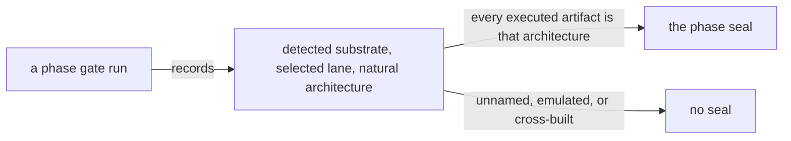

# Development Plan: gate integrity and artifact hygiene

> **Purpose**: The gate half of the plan rulebook — what a gate must prove before it can be trusted, the
> universal artifact-hygiene postcondition every gate inherits, how plan and implementation are reconciled, and
> the final repository layout no phase may write outside.
> **Read this if**: a phase gate is being written or judged sufficient, or a path is being added to the tree.

This slice is authoritative for gate integrity, artifact hygiene, and the target repository tree. The hub it
belongs to, [`development_plan_standards.md`](development_plan_standards.md), keeps every heading and anchor
and remains authoritative for the rulebook's structure.

Link-graph metadata

**Status**: Authoritative source
**Supersedes**: N/A
**Referenced by**: DEVELOPMENT_PLAN/README.md, DEVELOPMENT_PLAN/development_plan_phase_model.md, DEVELOPMENT_PLAN/development_plan_standards.md, DEVELOPMENT_PLAN/legacy_tracking_for_deletion.md, DEVELOPMENT_PLAN/legacy_tracking_for_deletion_archive.md, DEVELOPMENT_PLAN/phase_00_documentation_suite.md, DEVELOPMENT_PLAN/phase_01_toolchain_spike.md, DEVELOPMENT_PLAN/phase_02_repository_layout_conformance.md, DEVELOPMENT_PLAN/phase_09_resource_index.md, DEVELOPMENT_PLAN/phase_11_formal_model_kernel.md, DEVELOPMENT_PLAN/phase_16_deterministic_sim_substrate.md, DEVELOPMENT_PLAN/phase_17_gateway_migration_model.md, DEVELOPMENT_PLAN/phase_19_reconcile_core_simulation.md, DEVELOPMENT_PLAN/phase_25_dhall_schema_generation.md, DEVELOPMENT_PLAN/phase_26_gadt_decode_ir.md, DEVELOPMENT_PLAN/phase_27_illegal_state_covering.md, DEVELOPMENT_PLAN/phase_28_storage_geometry_folds.md, DEVELOPMENT_PLAN/phase_29_execution_accelerator_folds.md, DEVELOPMENT_PLAN/phase_30_capability_bind.md, DEVELOPMENT_PLAN/phase_31_provision_seal.md, DEVELOPMENT_PLAN/phase_32_inference_accelerator_provision.md, DEVELOPMENT_PLAN/phase_33_render_manifest_oracles.md, DEVELOPMENT_PLAN/phase_34_chain_kernel_boundary.md, DEVELOPMENT_PLAN/phase_57_complementary_arch_child.md, documents/engineering/repository_layout_doctrine.md, documents/engineering/substrate_doctrine.md
**Generated sections**: none

## Contents
- [M. Gate integrity (a gate cannot be passed by a stub)](#m-gate-integrity-a-gate-cannot-be-passed-by-a-stub)
- [S. Universal artifact-hygiene gate](#s-universal-artifact-hygiene-gate)
- [T. Plan-to-implementation reconciliation](#t-plan-to-implementation-reconciliation)
- [U. The final repository layout](#u-the-final-repository-layout)
- [Related Documents](#related-documents)

---

## M. Gate integrity (a gate cannot be passed by a stub)

A phase gate exists to prove the phase's objective was actually delivered. A gate a stub, fake, hardcoded
happy-path, or self-fulfilling fixture can pass is not a gate. Every phase **Gate** — and every sprint
**Validation** that feeds it — obeys the clauses below; a gate that omits an applicable clause is incomplete.

1. **Independent oracle provenance.** A version-controlled fixture, golden, expected error, or locus tag is a
   human-authored input reviewed independently of the implementation. The implementation author is not its
   sole author or reviewer.
   - A golden or expected value regenerated from the implementation's own output is not a test: it passes
     for any output, a stub's included.
   - A reference implementation may generate an expected value at run time, but that expected file remains
     under `.build/runs/` and is never committed. The reference implementation and its authored inputs may be
     version-controlled when they do not import or reuse the subject's decision logic.
   - Authorship before the implementation is strong provenance when Git history establishes it. An existing
     oracle whose chronology or independent review cannot be established is a regression fixture, not an
     independent oracle, until it receives an independent review or replacement.
   - A fixture and subject first introduced in the same commit have no Git-established chronology between
     them. The fixture is therefore a regression fixture until an independent reviewer validates or replaces
     its expectation; a manifest claim cannot supply the missing provenance.
   - **Amendment.** A pinned oracle is not frozen — a renderer's output, an error tag, or an expected value
     may legitimately change when the design does.
   - It is **amended**, never rewritten from a failing run: the new expectation is authored from the
     *intended* output, the change to the expectation is reviewed as its own change (with the reason
     recorded beside it), and the mutants that the oracle must still turn red are re-run against the amended
     value.
   - Copying the failing run's actual output over a golden converts an oracle into a snapshot and voids
     clause 1 for every subsequent run; it is prohibited in every phase.
   - Where a byte-exact golden is used, the phase must also pin the **canonical rendering convention** the
     golden is authored under (encoding, ordering, indentation, and a content-stable generated-by stamp
     carrying no timestamp or run-varying field) — without one, a hand-authored byte-exact fixture is not
     writable and clause 1 cannot be satisfied ([generated_artifacts_doctrine.md §3](../documents/engineering/generated_artifacts_doctrine.md#3-the-rule)).
     A byte-exact golden is therefore authored no earlier than the sprint that fixes its convention.
2. **Committed mutation quota.** Every gate names **at least one committed seeded mutant** — a deliberately
   broken implementation or spec — that the gate must turn red. Mutants are drawn from a defined operator set
   (guard negation/weakening, effect swap, dropped effect/`UNCHANGED`, quantifier flip, fairness drop,
   invariant-clause delete, union-arm addition), not one hand-picked strawman, and are committed and re-run,
   not run once. Every seeded mutant is one record in the single mutant corpus the
   [§U](#u-the-final-repository-layout) target tree declares, in one format, naming its operator, its change,
   and the locus at which the gate must go red. A mutation carried anywhere else — a build flag, a
   conditional-compilation symbol, an alternative project file or source directory — is **named by a field of
   that record**, never registered separately: a second registry no listing of the corpus can see is how a
   quota is met on paper and unmet in fact.
3. **Independent reference predicates.** An equivalence or exact-match check — an `accepts ⟺ in-envelope`
   property, an expected-argv assertion, an expected-error-tag assertion — defines its reference side
   **independently of the code under test** (a committed hand-authored table or a distinct specification),
   never by reusing the implementation's own fold, helper, or `Step→argv` function. A check whose oracle is the
   subject under test is a tautology.
4. **Generator coverage.** A property-based (QuickCheck) gate carries `cover` / `classify` obligations that
   force the illegal / reject / boundary branch to fire a stated minimum fraction of cases. A generator that
   emits one near-constant legal value proves nothing about the reject path.
5. **External-observer traces.** A gate that asserts *how* the binary behaved — every tool invoked by absolute
   path, zero Helm invocations, no public-registry pull, no credential access on the render path — reads its
   trace from an **observer at the OS boundary** (an argv-recording shim, `strace`, a CNI/containerd log),
   never from a compliance trace the code under test emits about itself, which cannot record the calls that
   bypass it.
6. **Determinism honesty.** A determinism / reproducibility gate forces an **independent recomputation** on the
   second run (cache-bypass, or a distinct content-addressed namespace) and asserts the compute path actually
   executed. A "second run" served from a content-addressed store hit proves memoization, not determinism.
7. **Concrete corpus.** A gate names its "representative set" **explicitly** — which capabilities, which
   service set, which fixtures — in the phase doc. An undefined "representative set" is satisfied by one
   hand-picked happy-path shape.
8. **Specific-reason negatives.** A negative fixture asserts **why** it fails — its expected `dhall type`
   error, `DecodeError` tag, or compile-fail locus — and is paired with a positive that differs only in the
   foreclosed dimension. A negative that merely "fails" can fail for an unrelated reason (a typo, a missing
   field) while the illegal state it targets stays representable.
9. **Fresh-challenge binding.** Every effectful boundary or live gate uses a harness-generated unpredictable
   nonce or canary issued after the subject starts, carries it through the public operation, and recovers it
   from the independent observation. Fixed output, stale state, or a pre-recorded response cannot satisfy the
   gate. Pure gates name a separately authored reference predicate and mark an effectful challenge not
   applicable.
10. **Authenticated observer provenance.** The gate names the observer outside the system under test and the
    raw evidence it reads. An unavailable, unauthenticated, incomplete, or challenge-mismatched observer fails
    closed; a self-reported compliance trace is never a fallback.
11. **Authority-paired security checks.** An authentication, authorization, tenancy, or ownership gate uses
    real least-privilege credentials minted by the authority under test. It pairs an own-scope success with a
    foreign-scope denial that differs only in authority or scope, and externally observes zero forbidden
    effect. Caller-authored identity or tenant headers are hostile inputs, not evidence.
12. **Bypass-path negatives.** A gate claiming a single edge, broker, store, workflow, or provider path probes
    the alternate direct paths as well as the intended path. Success through the sanctioned route cannot hide
    an independently reachable bypass.

13. **Extension-conformance discharge.** A gate that delivers an extension — a domain, a provider, or a
    hardware substrate — names, per law family, which laws it discharges and how: the L-law properties over its
    own declared vocabulary, the C-law composition suite against every other member of the link set, and the
    S- and P-law instances for the seams it declares. Each unrepresentability claim in that discharge names a
    compile-fail fixture that fails for its pinned reason, and the gate produces a sealed verdict binding the
    declaration digest, the core version the laws came from, the suite digest, and the result
    ([`extension_conformance_doctrine.md` §6](../documents/engineering/extension_conformance_doctrine.md#6-the-verdict-seal)).
    A gate delivering no extension marks the clause not applicable, on the same terms as clause 9. What this
    forecloses is the failure mode extension guidelines always have: a conformance claim discharged by the
    author's own reading rather than by a suite the author cannot weaken.

These clauses are what a phase's **Gate** and each sprint's **Validation** are checked against. The Phase-0
documentation lint verifies that every gate names its authored fixtures, mutant(s), and independent oracle.
The generated run ledger records the result and is externally attested. The implementation author must not be
the sole author or reviewer of the oracle.

Clauses 9–12 are the plan projection of
[`testing_spoof_resistance.md` §12](../documents/engineering/testing_spoof_resistance.md#12-spoof-resistant-evidence-a-gate-observes-an-unforgeable-fresh-effect).
Each applicable phase declares the challenge, observer, authority source, and paired negative in its gate
apparatus. Raw observations and digests remain generated run evidence outside Git.

**Gate → Gate-integrity delegation.** A `**Gate:**` line may discharge these clauses inline **or** delegate them to the
phase's `## Gate integrity` section ([§D](development_plan_standards.md#d-the-per-phase-document-skeleton)) by anchor. Delegation is a
first-class, conforming form: a `**Gate:**` line that names its fixtures, mutant(s), and oracle *in a linked
`## Gate integrity` section* satisfies this section exactly as an inline naming does. A conforming
implementation of the Phase-0 gate-integrity lint (check (f)) therefore **follows one anchor hop** from the
`**Gate:**` line into the delegated section before reporting a gate under-specified; it must not flag a gate
whose apparatus lives one hop away.

---

## S. Universal artifact-hygiene gate

Every phase gate includes one implicit postcondition in addition to its phase-specific capability check. A
gate cannot pass unless all of these conditions hold:

1. The result is bound to a recorded **source-snapshot** digest, and commit timing is not a gate input
   ([the enforcement contract](../documents/engineering/repository_layout_doctrine.md#8-enforcement-and-source-snapshot-acceptance) defines the snapshot).
2. Test surfaces are enumerated at run time into `.build/test-surfaces/` and joined to authored expectations.
3. All deliberate compilation, generation, resolution, caching, temporary output, and run evidence stays
   under `.build/**`; ignored Python interpreter caches are the sole source-adjacent exception.
4. No command writes beneath an authored root except for Python's ignored interpreter cache.
5. No `.lock`, `.freeze`, package checksum database, hard-coded library/package SHA, resolved user-home path,
   generated ledger, evidence file, enumeration, bytecode, or generated source is tracked.
6. The gate leaves tracked files unchanged and creates no unignored generated path.
7. The Docker context contains no generated output, evidence, dependency tree, cache, secret, or runtime state.
8. The generated run bundle is schema-checked and installed as an immutable, content-addressed attestation
   under `.build/evidence-store/**`, bound to the source-snapshot digest and phase contract.
9. The source snapshot contains every authored input the build, tests, and gate use, and the same documented
   command succeeds against the snapshot alone; an ignored worktree file is never an input.
10. The semantic provenance scan rejects tracked reproducible copies even when their paths are not ignored or
    their filenames resemble authored fixtures.
11. Every path the run leaves behind is either in the target tree of
    [`repository_layout_doctrine.md` §2](../documents/engineering/repository_layout_doctrine.md#2-complete-repository-structure)
    or ignored by **both** contracts. A tracked path outside that tree, an unignored generated path, an
    ignore rule for a path the tree does not contain, and a path naming a phase ordinal outside
    [§U](#u-the-final-repository-layout) clause 3's exception set each fail the gate. Clause 5's deferral
    mechanism applies unchanged.
12. A before/after host inventory proves that the run created no amoebius-owned path, mount, loop device,
    container, volume, cache, or daemon state outside the physical repository root.
13. Production runtime and durable state use only `.data/**`; test runtime and durable state use only one
    harness-owned `.test_data/runs/<run-id>/**` root. A test fails before mutation if production state or
    configuration is selected, and teardown deletes only its exact marker-proven run root.
14. `test-secrets.dhall` is the sole cleartext secret-at-rest. Only the elevated test harness may read it;
    production rejects it, and no run copies it into output, state, logs, arguments, environments, container
    contexts, or attestations.
15. The run records the detected substrate, the selected lane, and the **natural architecture** that lane ran
    on, and every executed artifact belongs to that architecture. A run that cannot name its architecture, that
    executes an artifact of another architecture under emulation, or that builds one through a cross-toolchain
    fails ([`substrate_doctrine.md` §1.1](../documents/engineering/substrate_doctrine.md#11-the-natural-architecture-rule)).

16. A gate that adds or amends an illegal-state catalogue entry leaves the catalogue a **complete covering**
    over its declared taxonomy: every cell of the product of the declared axes holds an entry or carries a
    one-line justification for holding none, and an unjustified empty cell fails the gate
    ([`documentation_standards.md` §16](../documents/documentation_standards.md#16-the-illegal-state-catalogue-is-a-covering-not-a-list)).
    The grid is generated; the entries and the justifications are authored.

**Clause 16 is partly discharged.** The taxonomy is declared with all three axes closed and enumerated, the
generator exists ([`../tools/covering_grid.py`](../tools/covering_grid.py)), and sixteen authored
justifications close 98 of the 109 empty cells. Eleven cells still owe a reason and cannot be given one as the
catalogue currently reads: an entry naming several foreclosure layers and several loci is credited with the
product of them, so those cells are *unknown* rather than evidently empty
([`../documents/illegal_state/README.md`](../documents/illegal_state/README.md)). Closing them means pairing a
layer to a locus in each entry, which is authoring work on the catalogue. Until then a gate amending an entry
inherits the postcondition and may not increase the eleven; which phase drives it to zero is recorded in
[README.md](README.md).

**Clause 15 invalidates every phase seal recorded before 2026-08-16.** No earlier gate recorded the
architecture it proved, so no earlier attestation can be read as a claim about one — and the seal that did
name two architectures reached the second under an emulator. This is the same shape as the containment
amendment's clauses 11–14: a postcondition the prior contract did not have, which every phase must now satisfy
in numeric order. What each phase's status becomes is recorded in [README.md](README.md), never here
([§R](development_plan_phase_model.md#r-where-the-cross-cutting-invariants-live)).

*Orientation. Clause 15 of [§S](#s-universal-artifact-hygiene-gate), whose lane vocabulary is owned by [`substrate_doctrine.md` §1.1](../documents/engineering/substrate_doctrine.md#11-the-natural-architecture-rule): a run that cannot name the architecture it proved has proven it for none.*

**Commit timing is not a gate input, and no document may reintroduce it as one.** A result is bound to the
source it actually ran against, so an uncommitted change is validated on exactly the same terms as a committed
one, and committing, amending, rebasing, or pushing that same source changes nothing a gate observed. The
operator commits whenever they choose, on their own cadence, and phase order never waits on it. This replaces
the pre-2026-08-12 precondition requiring a pristine committed worktree, and the companion rule that any other
run was merely diagnostic; both are withdrawn, because they made every phase closure wait on an unrelated
human act while adding nothing a reader needs to trust the result. Documentation check `t` fails any governed
document that asserts either again.

The snapshot digest is **provenance, not a standing precondition**. It records exactly which source produced a
result, so a reader can tell one run's evidence from another's. It does not mean an unrelated later edit
retracts a seal: a closed phase reopens only under [§N](development_plan_phase_model.md#n-reopening-and-amending-a-phase), when the change
touches what that phase's gate actually covers.

Python runs with ordinary bytecode caching enabled. `.gitignore` and `.dockerignore` must cover every
`__pycache__` directory and Python bytecode suffix, and Phase 0 rejects tracked bytecode, context leakage,
missing patterns, or command-level suppression. A source-adjacent ignored cache is allowed to remain locally;
it is not a gate output, authored input, or version-controlled artifact.

The target tree, the complete file classification, output inventory, ignore patterns, source-snapshot
acceptance, and revision-history disposition are owned by
[`repository_layout_doctrine.md`](../documents/engineering/repository_layout_doctrine.md). A phase document
states only its capability-specific acceptance condition; it does not duplicate these sixteen clauses.

**Clause 5 is enforced by every gate and remediated by the owning phase.** Read as a whole-tree condition it
would make Phase 0 wait on phases 1–95, because the tracked resolver output, digest tables, and generated-root
consumers those phases own are spread across the tree — which inverts the numeric order this plan is built on.
[`repository_layout_doctrine.md §3.5`](../documents/engineering/repository_layout_doctrine.md#35-tsv-inventory-and-provenance)
settles it: Phase 0 owns the shared corpora and the machinery, and each later phase owns its domain tables
before revalidation. A finding outside the running phase's ownership is therefore **deferred, never
suppressed** — it is reported at every run, attributed to the phase whose gate must clear it, justified by a
row in [`legacy_tracking_for_deletion.md`](legacy_tracking_for_deletion.md), and removed from the deferral
list when that phase closes. A deferral that no longer matches a finding fails the gate, so the list only
shrinks. Nothing may be deferred out of the phase that owns it.

Phase 0 additionally audits reachable revision history. A discovered secret requires rotation and a
coordinated purge. A non-secret generated or obsolete historical blob requires forward cleanup plus an
operator-recorded choice between retaining prior history and an explicitly approved coordinated rewrite.
Unreachable local objects are reported separately and do not change the shared repository closure.

This amendment invalidates every prior phase seal because the former gates could consume committed
enumerations and ledgers, write evidence beneath `DEVELOPMENT_PLAN/`, and rely on tracked resolver output or
host-specific paths. Existing code may satisfy the capability part, but that result cannot restore Done until
the redesigned gate passes in numeric order.

---

## T. Plan-to-implementation reconciliation

The plan, implementation, tests, and historical evidence are independent inputs to a reconciliation. None is
presumed correct merely because it already exists or is authoritative for a different concern. Target intent
comes from current doctrine and explicit operator decisions; sequencing and acceptance come from this plan;
implementation presence comes from dated repository inspection; current proof comes only from the redesigned
gate and verified repository-local attestation.

Every documentation sweep follows this policy:

1. **Establish the audit boundary.** Record the date, exact revision, worktree state, upstream relation, roots
   inspected, and whether observations are committed, uncommitted, ignored, untracked, generated, reachable
   history, unreachable local objects, or external. An audit states the snapshot it observed; it never presents
   one snapshot's counts as another's.
2. **Compare by contract, not filename.** For each phase, compare target capability, implementation paths,
   tests, gate behavior, artifact provenance, substrate/register, and remaining work. A similarly named file
   does not establish semantic coverage.
3. **Classify, do not promote.** Update the tracker with one [§C](development_plan_phase_model.md#c-status-vocabulary) progress term. File
   presence, compilation, an old ledger, or an invalidated pass cannot yield `Policy-conformant` or ✅ Done.
4. **Record every divergence.** Missing target code, extra legacy code, generated material in authored roots,
   a tracked path outside the target tree of [§U](#u-the-final-repository-layout), a phase ordinal in a
   directory, filename, or build-component name, a re-baseline's audit map, obsolete terminology,
   incompatible gate behavior, hard-coded resolution, test-plan mismatch, and unclear ownership each receive
   a row in
   [`legacy_tracking_for_deletion.md`](legacy_tracking_for_deletion.md), with an owner and closure condition.
5. **Resolve ambiguity explicitly.** If doctrine, plan, and code disagree on intended behavior, the phase stays
   open or blocked while documentation records the conflict and the decision required. An audit never chooses
   a new product policy implicitly.
6. **Update all owners together.** A settled decision updates the owning doctrine, tracker, affected phase
   contracts, component/substrate inventory, and legacy row in one documentation change. Duplicated status or
   generated audit projections are prohibited.
7. **Refresh or retire snapshots.** Counts and path inventories are dated diagnostics. A later relevant change
   refreshes them; closure replaces the divergence row with its verified disposition rather than preserving a
   stale count as current truth.
8. **Verify source closure against the source snapshot.** A build or gate input that exists only because the
   worktree retains an ignored file is missing source, even when the local command passes. A snapshot failure
   creates a legacy row owned by the phase that must relocate or replace the input.
9. **Audit history separately.** Current ignore rules do not remove earlier blobs. Record secrets, generated
   artifacts, obsolete terminology, and other unwanted history separately from current-tree findings, then
   apply the disposition policy in [§S](#s-universal-artifact-hygiene-gate).

`legacy_tracking_for_deletion.md` is therefore broader than a deletion list: until convergence it is the
mandatory register of existing code, test, tool, and generated-file state that conflicts with the intended
plan. The tracker provides the concise current view; the legacy register provides the actionable mismatch
detail.

---

## U. The final repository layout

**The problem.** Thirty-one top-level roots hold tracked content, and twenty-seven arrived in one commit
alongside the doctrine section declaring them canonical — so
[`repository_layout_doctrine.md` §2](../documents/engineering/repository_layout_doctrine.md#2-complete-repository-structure)
transcribed what a build target needed rather than a shape anyone chose. Four roots hold nothing but a package
declaration reaching into a sibling root; two test roots hold the same kinds of thing split by era, one
carrying a singular and a plural spelling of the same role. Nothing in this rulebook was violated to produce
any of it.

**Why the obvious alternative fails.** The alternative already in force is that each phase adds the paths its
build needs and a later cleanup converges the tree. It does not converge, because no clause makes a new path a
reviewable decision: a sprint's `**Implementation**` field ([§F](development_plan_standards.md#f-the-sprint-block-format)) is checked for
honesty, never for destination. And a cleanup cannot converge a tree whose taxonomy is instantiated once per
package — renaming one plural sibling fixes today's pair and leaves the next package free to mint the next.

**The rule.** There is **one target tree**, it is **normative**, and it lives in
[`repository_layout_doctrine.md` §2](../documents/engineering/repository_layout_doctrine.md#2-complete-repository-structure).
Phase 0 owns it, alongside the doctrine suite, the two ignore contracts, and the artifact-policy gate it
already owns. Four clauses follow.

1. **No phase creates a path that is not in the target tree.** A sprint's `**Implementation**`, a phase's
   `### Deliverables`, and a gate's outputs each name a path the finished repository has. A phase that needs a
   path the tree does not contain **amends the tree first**, in the same documentation change, with the root
   justified by what its contents *are* — the language they are written in, or the reader that consumes them —
   and never by which phase or build target introduced them. There is no provisional path and no scratch root:
   a directory whose reason to exist is that some phase needed somewhere to put something is a defect at the
   moment it is proposed, not at the moment someone notices.

2. **Everything this repository's source, checks, tests, or gates produce is ignored by both contracts;
   everything else exists only because it is intended for the final repository.** The classification is
   mechanical and already stated
   ([`repository_layout_doctrine.md` §1](../documents/engineering/repository_layout_doctrine.md#1-classification-rule)):
   if repository inputs plus a documented command reproduce the file, it is generated. What this clause adds
   is the **partition** — a path is generated *and covered by both ignore contracts*, or authored *and in the
   target tree*. There is no third state, so an untracked path no rule ignores and an ignored path nothing
   generates are both findings. The contracts themselves, including what a rule for a path outside the tree
   means, are owned by
   [`repository_layout_doctrine.md` §6](../documents/engineering/repository_layout_doctrine.md#6-gitignore-contract)–[§7](../documents/engineering/repository_layout_doctrine.md#7-dockerignore-contract).

3. **No directory or file name contains a phase ordinal.** A phase ordinal in a path encodes *when something
   was built* into *what it is*, which is the category error clause 1 forecloses, and it is what makes
   [§N](development_plan_phase_model.md#n-reopening-and-amending-a-phase) expensive: a phase that must rename its files to change its own
   validation criteria will not change them. The sanctioned exception set is **two entries and closed**:

   | Sanctioned | Why |
   |---|---|
   | `DEVELOPMENT_PLAN/phase_NN_<slug>.md` | [§B](development_plan_standards.md#b-canonical-file-layout-snake_case) makes `NN` the document's sort order and [§E](development_plan_phase_model.md#e-one-canonical-phase-model) makes it the document's identity. The ordinal is not a label on a capability; it *is* the file. |
   | `.build/**` paths keyed by phase | The phase is a run's partition key. These paths are generated, ignored by both contracts, and never repository names. The rule still binds the **authored constant** that spells such a path, so one constant is the only place a generated path learns a phase. |

   Everything else is out: source files and directories, fixtures, goldens, negatives, oracles, mutants,
   harness scripts, tool filenames, build flags, build-component names (they become build paths), and literal
   strings in diagnostics. A phase-numbered name is replaced by a **capability** name derived from the owning
   phase document's slug; ownership is recorded where it belongs — in that phase's contract and in
   [`system_components.md`](system_components.md). Naming a phase in *prose* is unaffected and expected.

4. **A root is justified by what it is**, recorded in the doctrine tree's role line and reviewable on its own
   terms. The criterion for the case this repository gets wrong repeatedly — whether a unit warrants its own
   build package — is owned by
   [`repository_layout_doctrine.md` §2](../documents/engineering/repository_layout_doctrine.md#2-complete-repository-structure).

**What it forecloses.** Adding a directory because a build target needed one, then deferring whether the
finished repository has it. That deferral has no natural closing date, and its cost is not the directories —
it is that the layout doctrine stops being a design a reader can disagree with.

---

## Related Documents
- [development_plan_standards.md](development_plan_standards.md) — the family hub this slice belongs to
- [README.md](README.md) — the live tracker, which owns every phase's status
- [legacy_tracking_for_deletion.md](legacy_tracking_for_deletion.md) — the divergence register
