# Development Plan: the phase model

> **Purpose**: The phase half of the plan rulebook — the status and progress vocabularies, the canonical phase
> model, the honesty discipline, the one-substrate rule, how a phase is reopened or re-baselined, how a seam is
> sized, and where the cross-cutting invariants live.
> **Read this if**: a phase's status, sequence, size, substrate, or reopening is being decided.

This slice is authoritative for the phase model. The hub it belongs to,
[`development_plan_standards.md`](development_plan_standards.md), keeps every heading and anchor and remains
authoritative for the rulebook's structure. No phase's status is stated here; that belongs to
[README.md](README.md) alone.

Link-graph metadata

**Status**: Authoritative source
**Supersedes**: N/A
**Referenced by**: DEVELOPMENT_PLAN/README.md, DEVELOPMENT_PLAN/development_plan_gate_integrity.md, DEVELOPMENT_PLAN/development_plan_standards.md, DEVELOPMENT_PLAN/legacy_tracking_for_deletion.md, DEVELOPMENT_PLAN/legacy_tracking_for_deletion_archive.md, DEVELOPMENT_PLAN/phase_00_documentation_suite.md, DEVELOPMENT_PLAN/phase_01_toolchain_spike.md, DEVELOPMENT_PLAN/phase_02_repository_layout_conformance.md, DEVELOPMENT_PLAN/phase_09_resource_index.md, DEVELOPMENT_PLAN/phase_11_formal_model_kernel.md, DEVELOPMENT_PLAN/phase_16_deterministic_sim_substrate.md, DEVELOPMENT_PLAN/phase_17_gateway_migration_model.md, DEVELOPMENT_PLAN/phase_25_dhall_schema_generation.md, DEVELOPMENT_PLAN/phase_26_gadt_decode_ir.md, DEVELOPMENT_PLAN/phase_27_illegal_state_covering.md, DEVELOPMENT_PLAN/phase_28_storage_geometry_folds.md, DEVELOPMENT_PLAN/phase_29_execution_accelerator_folds.md, DEVELOPMENT_PLAN/phase_30_capability_bind.md, DEVELOPMENT_PLAN/phase_31_provision_seal.md, DEVELOPMENT_PLAN/phase_32_inference_accelerator_provision.md, DEVELOPMENT_PLAN/phase_33_render_manifest_oracles.md, DEVELOPMENT_PLAN/phase_34_chain_kernel_boundary.md, DEVELOPMENT_PLAN/phase_35_image_recipe_generation.md, DEVELOPMENT_PLAN/phase_50_host_assert_cli.md, DEVELOPMENT_PLAN/phase_51_host_ensure_kernel.md, DEVELOPMENT_PLAN/phase_52_linux_engine_bringup.md, DEVELOPMENT_PLAN/phase_53_apple_engine_bringup.md, DEVELOPMENT_PLAN/phase_54_windows_engine_bringup.md, DEVELOPMENT_PLAN/substrates.md, documents/engineering/validation_frame_doctrine.md
**Generated sections**: none

## Contents
- [C. Status vocabulary](#c-status-vocabulary)
- [E. One canonical phase model](#e-one-canonical-phase-model)
- [K. Honesty (proven / tested / assumed)](#k-honesty-proven--tested--assumed)
- [L. One-substrate discipline](#l-one-substrate-discipline)
- [N. Reopening and amending a phase](#n-reopening-and-amending-a-phase)
- [O. Sprint-sized seams and bounded phase gates](#o-sprint-sized-seams-and-bounded-phase-gates)
- [R. Where the cross-cutting invariants live](#r-where-the-cross-cutting-invariants-live)
- [Related Documents](#related-documents)

---

## C. Status vocabulary

One vocabulary, used in the README Phase Overview, in each phase's **Phase Status**, and on every sprint:

| Marker | Meaning |
|--------|---------|
| ✅ **Done** | Delivered; the redesigned gate passed against a recorded source snapshot and its repository-local attestation verified. |
| 🔄 **Active** | In progress now. |
| 📋 **Planned** | Specified, not started. (The default for every phase and sprint pre-implementation.) |
| ⏸️ **Blocked** | Waiting on a named earlier-or-same-phase sprint or an external prerequisite. |
| 🧪 **Live-proof pending** | Code exists; the required live/substrate proof has not yet run (the honesty gap, [§K](#k-honesty-proven--tested--assumed)). |

Status lives **only** in the plan. A doctrine doc never carries status; it states the target shape and links
back here ([documentation_standards.md §1](../documents/documentation_standards.md#1-philosophy), [§6](../documents/documentation_standards.md#6-honesty-the-proventestedassumed-discipline)).

**Status and implementation progress are different axes.** Status answers whether the current validation
contract is open, blocked, pending live proof, or closed. Progress records what a dated static inspection can
actually find. A source path, test, gate script, or historical run is an **observed footprint**; it is not a
passed current gate. The tracker uses only these progress terms:

| Progress term | Meaning |
|---|---|
| **No footprint observed** | The audit found no implementation path attributable to the phase. Absence is not proof that no implementation exists outside the audit boundary. |
| **Observed footprint** | At least one attributable source, test, gate, or generated migration artifact exists; completeness and correctness are not established. |
| **Known partial** | The footprint exists and the phase contract or static inspection names a missing seam, target, provider, observer, or validation layer. |
| **Policy-conformant** | The current phase gate passed in numeric order against a recorded source snapshot, including [§S](development_plan_gate_integrity.md#s-universal-artifact-hygiene-gate), and its repository-local attestation verified. Only this term is compatible with ✅ Done. |

The tracker attaches a date and audit boundary to every progress summary. Doctrine may describe a target or a
specifically labelled historical observation, but it never converts progress into status.

---

## E. One canonical phase model

- **Contiguous numbering, no gaps.** Phases are `0..N`. A new phase is appended or inserted with a full
  renumber, never given a fractional id.
- **A full renumber carries an audit map.** A re-baseline may reorder or split phases only when the same
  change records every old phase as `old id/path → new id/path(s)`, updates every inbound link and
  dependency, and leaves no stale old-number reference. The map is recorded in
  [`legacy_tracking_for_deletion.md`](legacy_tracking_for_deletion.md), because a renumber is a divergence
  between the plan a reader remembers and the plan in force, and [§T](development_plan_gate_integrity.md#t-plan-to-implementation-reconciliation)
  clause 4 gives every such divergence a row.
- **A sealed phase is not frozen against re-baselining.** A phase whose gate has passed may still be
  reordered, split, or renamed. Its seal records that a stated contract was met by a recorded run, and
  reordering does not retract that: the run happened, the evidence stands, and the new number is a fact about
  sequence, not about the result. The former rule — a re-baseline only before any affected phase reached
  ✅ Done — is withdrawn, because it froze the plan's shape at the moment it became testable, which is the
  moment that shape is most likely to be wrong. A re-baseline still owes the audit map above, the
  [§N](#n-reopening-and-amending-a-phase) invariants, and a fresh attestation per phase.
- **A band is a reading aid, never a second numbering.** A band is a contiguous run of ordinals given a name,
  so that a reader can see what a stretch of the sequence is *for* without reading every contract. It has no
  identity of its own: a phase is named by its ordinal and its slug, never by a band and an offset, and a band
  boundary is derived from the ordinals rather than declared beside them. The nine bands of the 2026-08-19
  re-baseline are foundations, the algebra, the proof stack, the extension contract, the generative surface,
  test-as-workflow, pre-binary and host, the live platform, and the domain instances. Because a band range is
  prose and nothing in the lint checks one, a re-baseline re-derives every range it has written down — the
  ranges in [§K](#k-honesty-proven--tested--assumed) and [§L](#l-one-substrate-discipline) are the ones this
  rulebook owns, and a stale range is a defect the audit map records rather than a difference a check finds.
- **A sprint belongs to exactly one phase.** No sprint is duplicated across phases.
- **No forward dependencies.** A sprint's `Blocked by` names only an earlier-or-same-phase sprint or an
  external prerequisite — **never** a later phase (that would violate the strict numeric order in
  [README.md](README.md) Phase discipline).

---

## K. Honesty (proven / tested / assumed)

The plan inherits the chaos/failover moral rule ([documentation_standards.md §6](../documents/documentation_standards.md#6-honesty-the-proventestedassumed-discipline), [`chaos_failover_doctrine.md`](../documents/engineering/chaos_failover_doctrine.md)): **never mark a sprint ✅ Done on the strength of "it compiles."** A sprint whose live/substrate proof has not run is
🧪 Live-proof-pending, not Done. A phase gate is passed only when its acceptance test actually ran in its
register on its substrate ([§L](#l-one-substrate-discipline)). Before any implementation footprint is
observed, a phase or sprint is 📋 Planned and every prescriptive statement is design intent. Once a footprint
exists, [§C](#c-status-vocabulary)'s separate progress vocabulary prevents that observation from being
misreported as validation.

**Validation happens in registers, and the ledger names the register(s) it reached.** A phase gate runs
in **exactly one register** ([`conformance_harness_doctrine.md`](../documents/engineering/conformance_harness_doctrine.md), [`testing_doctrine.md` §2](../documents/engineering/testing_doctrine.md#2-the-registers-of-amoebius-testing)):
**Register 1** (pure/golden, in-process, no cluster), **Register 2** (boundary integration with fake tools, no
cluster), and **Register 3** (live infrastructure) — with exactly two deliberate exceptions: **Phase 0** (the
documentation-lint gate) reaches **no** register because it validates text and the link graph, not amoebius
behaviour; and **Phase 34** (the chain/Step kernel + `--dry-run` + boundary fake-tool harness) spans Register 1
(the in-process `chain`/`Step` corpus) and Register 2 (the boundary fake-tool harness). Every bounded-UI phase
has one register: pure schema, authorization, binding and compiler work is separate from boundary
browser/server/composition work, and both sit inside the generative surface.

The 2026-08-19 re-baseline names **nine bands** over the contiguous sequence, each a reading aid with no
identity of its own ([§E](#e-one-canonical-phase-model)). **Foundations** (phases 0–2, substrate `none`) is the
repository floor. **The algebra** (phases 3–10, `none`, Register 1) delivers the five calculi and the two
indices. **The proof stack** (phases 11–19, `none`, Registers 1–2) delivers the checkers amoebius owns and the
models they check. **The extension contract** (phases 20–24, `none`, Register 1) delivers the obligation
surface and the law families. **The generative surface** (phases 25–47, `none`, Registers 1–2) turns every
artifact class into a recipe. **Test-as-workflow** (phases 48–49, `none`, Register 1) delivers the topology as
values. **Pre-binary and host** (phases 50–57) is where the plan first touches a machine, one phase per
detected host family. **The live platform** (phases 58–90) is Register 3. **Domain instances** (phases 91–95)
re-derive the seeds as conforming extensions.

Diagram vocabulary: [diagram_conventions.md](../documents/engineering/diagram_conventions.md).

```mermaid
flowchart LR
%% register: orientation
  floor["0-2 foundations: substrate none"] --> alg["3-10 the algebra: five calculi, two indices, Register 1"]
  alg --> proof["11-19 the proof stack: amoebius-owned checkers, Registers 1-2"]
  proof --> contract["20-24 the extension contract: obligations and laws, Register 1"]
  contract --> gen["25-47 the generative surface: every artifact a recipe, Registers 1-2"]
  gen --> tw["48-49 test-as-workflow: the topology as values, Register 1"]
  tw --> host["50-57 pre-binary and host: the first machine, Registers 2-3"]
  host --> live["58-90 the live platform: Register 3"]
  live --> dom["91-95 domain instances: the seeds re-derived, Register 3"]
```

*Orientation. Design intent. After the repository floor the plan forks: the host chain builds the thing every later gate runs on, and the DSL chain models the language, and neither names an artifact the other delivers until they reconverge at the live band. The substrate catalog each band names is owned by [substrates.md](substrates.md).*

**The register cut is now a property of the sequence, and it is exact at 51/52.** No phase at or below 51
reaches Register 3, and no phase at 52 or above reaches Register 1 or 2 as its final register. The same
boundary is the substrate boundary: phases 0–51 declare substrate `none` and 52–95 declare a real one. The cut
sits there because the generative re-baseline put the pure work first — the calculi, the proof stack, the
extension contract, the generative surface and the test-workflow algebra are all statements about values — and
because the two pre-binary phases that follow them, the host-assertion CLI at 50 and the host-ensure kernel at
51, are Register 2: each states its claim against a committed fake-host boundary rather than a machine. The
first gate that needs a machine is the Linux engine bringup at 52. The earlier formulation had the cut at 34/35 with a
Register-3 host band *below* it, which made the cut a property of one band rather than of the plan; ordering the
algebra ahead of the host removes the exception rather than restating it. The former exception — promoted phases retaining a register their number
disagreed with — is withdrawn, because the 2026-08-17 re-baseline moved those phases into the band their
register already implied
([legacy_tracking_for_deletion.md](legacy_tracking_for_deletion.md#phase-re-baseline--2026-08-17)). **Rendering a plan / `--dry-run` must never require live infrastructure.** The per-phase proven/tested/assumed ledger names the register(s) its gate reached; a
Register-1/2 in-process ledger marks the Register-3 runtime layer UNVERIFIED and can never advance a production
`PromotionGate`.

**Register 2.5 — deterministic simulation — is a pre-cluster validation *activity*, not a phase-gate register.**
A live-band phase may additionally run its real daemon/reconciler code under `IOSim`/`IOSimPOR` against a
modeled, fault-injectable environment (no cluster, deterministically replayable;
[`deterministic_simulation_doctrine.md`](../documents/engineering/deterministic_simulation_doctrine.md),
[`testing_doctrine.md` §2](../documents/engineering/testing_doctrine.md#2-the-registers-of-amoebius-testing))
as an in-process check **before** its Register-3 gate. Because **no phase's acceptance gate keys to Register 2.5** — the phase's single gate remains its Register-3 live proof — the one-gate-one-register rule above is
unbroken; a `**Register:**` field is never `2.5`. The Register-2.5 run emits its own proven/tested/assumed
ledger (its result is *tested against a modeled environment*, with the environment's fidelity to the real
substrate recorded **assumed**), which does not by itself advance a `PromotionGate`.

A **design-proof / in-process phase** — one whose substrate is `none` ([§L](#l-one-substrate-discipline)) and whose gate is an in-process
type/model check rather than a live-substrate run, e.g. every phase at or below 51, [phases 0–51](README.md) —
emits a ledger whose acceptance token reads **"spec-composition proven"** / **"proven for the model"**, never
**"runtime proven"**: a green Dhall typecheck, Haskell decoder, or TLC run establishes that the spec composes
and the protocol is sound in the abstract, not that any cluster enforces it. Front-loading such a design
proof *ahead of* the later phase that builds the runtime it will correspond to is legitimate — **provided**
that same ledger marks the model↔code correspondence and the runtime fidelity **UNVERIFIED** until that later
phase discharges them. This front-loading introduces no forward dependency and does not bend the
contiguous-numbering / no-fractional-phase-id rule ([§E](#e-one-canonical-phase-model)): the design phase keeps its own integer id and its
own single-substrate (`none`) gate.

**A ✅ Done flip references verified repository-local evidence.** A phase moves to Done only when its gate runs from
a recorded source snapshot, satisfies [§S](development_plan_gate_integrity.md#s-universal-artifact-hygiene-gate), and its immutable external
attestation verifies. The tracker's Done row carries that attestation's reference — the identifier the sealing
run's bundle was stored under — so the evidence is locatable without copying any generated record into
Markdown. A sprint moves to Done only when its current independent validation passes and the
parent phase's run retains that result; an added phase-level requirement reopens only the sprint whose
deliverable or validation it changes. The tracker records the human status decision and may link the external
run. It never copies a generated ledger, receipt, hash, command transcript, or machine observation into
Markdown.

**Status is single-sourced and consistent.** Status lives only in the plan ([documentation_standards.md §1](../documents/documentation_standards.md#1-philosophy)). The
marker in a phase's README Phase-Overview row and the marker in that phase doc's `## Phase Status` line **must be identical**; the documentation lint checks this equality and fails on drift.

**The proven/tested/assumed ledger is generated, schema-checked, and externally retained.** Every gate emits
the ledger under `.build/runs/`; no ledger or evidence copy is committed. The repository-local attestation binds it to
the committed source tree and phase contract. The ledger names the reached register and marks every layer
outside that register UNVERIFIED. [`testing_doctrine.md` §4](../documents/engineering/testing_doctrine.md#4-no-skips-fail-fast-and-the-per-run-ledger-artifact)
owns its schema and retention boundary.

---

## L. One-substrate discipline

Every acceptance gate runs on the **always-available `linux-cpu` baseline** and may additionally require
**at most one specialized substrate** — `apple`, `linux-cuda`, or `windows`. A gate naming a specialized
member *implies* the baseline and need not restate it: a `linux-cuda` host **is** a Linux host, and an
`apple` host supplies the baseline through the VM its workload selects
([`substrates.md` §3](substrates.md#3-virtualized-substrates-incus--lima--wsl2)).
Windows supplies it through WSL2. When a gate requires a pristine Linux host, the provider is fixed by the
detected hardware: **Incus on `linux-cpu` or `linux-cuda`, Lima on `apple`, WSL2 on `windows`**. Consequently,
a gate row labelled `linux-cpu` names the CPU-only execution lane, not an assertion that the physical host is
Linux or has no accelerator.
**No gate may require two specialized substrates.** The DSL-validation band names `none`, which is a claim about *substrate-specific* capability rather than about hosts: see the frame-lifted form below.

**A lane is named with its architecture, and a gate proves only the one it ran on.** Each substrate derives
its baseline at its **natural architecture** — `arm64` on `apple`, `amd64` on `windows`, the detected one on
either Linux member — as owned by
[`substrate_doctrine.md` §1.1 — the natural-architecture rule](../documents/engineering/substrate_doctrine.md#11-the-natural-architecture-rule).
So a phase carries a **`Lane:`** field beside its `Substrate:` field, reading `linux-cpu/amd64`,
`linux-cpu/arm64`, `metal`, `cuda`, or `none`; `linux-cpu` alone is not a lane, because it names a claim two
different machines would satisfy differently. No gate emulates another architecture or cross-builds an
artifact for one, so a phase needing both is split exactly as a phase needing two substrates is.

The gate's substrate is named in the phase's `Phase Summary` and tracked in
[`substrates.md`](substrates.md). This prevents cross-substrate flip-flopping mid-development: a phase whose
work would need both an Apple host and a CUDA host is split until each gate needs at most one.

`windows` is gated by [Phase 54](phase_54_windows_engine_bringup.md) at lane `linux-cpu/amd64`, supplied by
WSL2. The retired claim — that no phase needed to gate it, because a `linux-cuda` host supplies the same lane
— confused a **lane** with a **route**: the lane is identical and the route is not, and the route is where
firmware virtualization, elevation, and the reboot outcome live. What remains ungated is Windows-CUDA
host-worker parity, which no phase in 0–95 keys its single substrate to.

**Four named forms satisfy the one-substrate rule without naming a fixed catalog member on the parent gate**, and
all four keep the discipline checkable rather than bending it:

- **Deferred-to-generation** ([Phase 90](phase_90_test_topology_live.md)). A gate that *emits* tests declares
  a fixed substrate for its own run — Phase 90 declares `linux-cpu` at lane `linux-cpu/amd64` — and carries the
  **rule** that each emitted test is substrate-locked to exactly one substrate chosen at generation time. The
  form is about the emitted artifacts, not about the emitting gate's own declaration: no contract's
  `**Substrate:**` field reads `per generated test`, and none may, because a field the catalog does not contain
  is unrecoverable by any check. The pure half of the split states the same rule from the other side
  ([Phase 48](phase_48_test_workflow_algebra.md), whose lane is `none`).
- **Parent-drives-provider** (Phases 76, 77, 78, 79, 84 and 88, `linux-cpu → provider`). The gate runs from one selected
  `linux-cpu` parent lane and *targets* a provider it does not itself run — EKS is a **declared managed engine,
  not a detected substrate** ([`substrates.md` §2](substrates.md#2-substrate-inventory)). The parent lane may be
  native Linux or the Incus/Lima/WSL2 guest appropriate to its detected hardware; the provider is a
  compute-engine axis, never a fifth substrate. The parent's lane architecture must still be the one the
  provider's nodes run, because the images the parent publishes are what those nodes pull.
- **Complementary-architecture pair** (Phases 56 and 57). One artifact must exist for both architectures, and
  no host may build the half it cannot execute. The capability is therefore split across two phases, each
  gating **one** substrate at **one** natural architecture. The 2026-08-19 re-baseline put them adjacent at 56 and 57;
  adjacency is a reading convenience and never what made the form work, because the split is by architecture
  rather than by position: the first builds, proves, and publishes its
  own architecture's image, and the second does the same on the complementary substrate. Each publishes under
  its own architecture-qualified tag and is advertised only on the attestation produced by the hardware that
  executed it, so the pair proves what one emulated run only appeared to. Nothing joins the halves: the
  architecture is in the reference a consumer names
  ([`image_build_doctrine.md` §3](../documents/engineering/image_build_doctrine.md#3-one-image-per-architecture--the-tag-carries-the-architecture-not-an-index)).
- **Frame-lifted validation** (every phase at or below 51, `none`). The gate runs its language-validation verbs inside
  `amoebius-base` through `docker run --rm`, so the only host fact it depends on is a container engine — and
  the host band gates one on all three substrates at each one's natural architecture. Substrate `none` is a
  claim that a gate is decidable everywhere, not that it uses no tools, and a verb that runs in the image is
  decidable wherever the image runs. The frame's contents, its bind mount, and why a separate container is
  not a fake are owned by
  [`validation_frame_doctrine.md`](../documents/engineering/validation_frame_doctrine.md).

---

## N. Reopening and amending a phase

[§C](#c-status-vocabulary) names five status markers and [§K](#k-honesty-proven--tested--assumed) defines one
transition: a phase moves **to** ✅ Done only after the redesigned gate and repository-local attestation verify. This
section defines reverse and lateral moves so changing a gated phase is recorded rather than silent.

**Reopening is permitted, and a reopened phase may change its validation criteria outright.** A closed phase
is not frozen: any phase may be reopened and given a different gate, sprint set, deliverables, or acceptance
condition. What is not permitted is a plan that stops being one story. Three invariants bound every reopen and
every re-baseline; one that breaks an invariant is rejected however well it is recorded, and the bullets below
say how it is recorded once it holds.

1. **One cohesive development narrative.** After the change the plan reads as a single story, not a design
   plus a list of exceptions. A superseded contract is replaced in place; it is not appended beside the
   contract that supersedes it. The bounded `Invalidated historical record` block below is the only form in
   which a superseded claim survives, and it is non-normative by construction.
2. **No later phase contradicts or undoes earlier work.** Phase M greater than N may extend, generalize, or
   subsume what Phase N delivered. It may not require Phase N's deliverable to be wrong, removed, or rebuilt
   differently. When new understanding invalidates Phase N's design, the change reopens **Phase N** — that is
   what reopening is for — and the later phase is amended to consume the new shape. A phase that exists to
   undo an earlier phase's output is the shape this invariant forbids; that work belongs to the phase that
   produced the output.
3. **Completable and validatable in numerical order.** Running phases `0..N` in order still works: every
   artifact each gate names is delivered by a phase at or below its own number, or declared under `Requires`
   ([§F](development_plan_standards.md#f-the-sprint-block-format)). A widened gate can silently reach forward, so this is the invariant a
   reopen most easily breaks, and the one to re-derive explicitly before the reopen is recorded.

   **Compilation is not consumption.** A gate that builds a compilation unit containing modules other phases
   own names only the entry points it exercises; the ledger marks every other module in that unit
   UNVERIFIED. The tree carries exactly one executable and a second one is forbidden
   ([`daemon_topology_doctrine.md` §2](../documents/engineering/daemon_topology_doctrine.md#2-context--role-an-orthogonal-grid)),
   so without this clause no phase could build the binary at all until the last module landed, and the host
   band could not exist. This is the same licence [§K](#k-honesty-proven--tested--assumed) already grants a
   front-loaded design proof, generalized from models to compilation units.

The register for what a reopen condemns is
[`legacy_tracking_for_deletion.md`](legacy_tracking_for_deletion.md): every implementation, test, tool, or path
the new criteria invalidate takes a row with an owner and a closure condition, and the owner is the phase whose
gate must clear it — never a later one ([§S](development_plan_gate_integrity.md#s-universal-artifact-hygiene-gate) clause 5).

- **A reverse transition is recorded, never silent.** Moving a phase ✅ Done → 🔄 Active or 📋 Planned, or a
  🔄 Active phase back to 📋 Planned, requires a dated entry in that phase's `## Phase Status` log
  ([§D](development_plan_standards.md#d-the-per-phase-document-skeleton) prescribes reverse-chronological dated entries) naming **which gate is invalidated, why, and by what change**. The README Phase-Overview marker and the phase doc's
  `## Phase Status` marker move together ([§K](#k-honesty-proven--tested--assumed) single-sourcing); the
  documentation lint's status-consistency check holds across the move.

- **Scope amendment of a gated phase invalidates the prior attestation.** A new sprint, doctrine adoption, or
  widened gate reverts the phase to Active, Planned, Blocked, or Live-proof pending. The current tracker and
  status block stop presenting the earlier run as completion evidence. Historical prose may state that a
  prior boundary ran only when it is explicitly labelled invalidated and carries no copied generated record.

- **The amendment log is the `## Phase Status` block.** Every reopen or scope amendment appends a dated entry
  there; the block is the phase's audit trail, and no amendment is made without one.

- **Reopening also refreshes observed progress and legacy divergence.** The same documentation change updates
  the tracker audit using [§C](#c-status-vocabulary)'s progress terms and records every discovered
  implementation-to-plan mismatch in
  [`legacy_tracking_for_deletion.md`](legacy_tracking_for_deletion.md). Neither the old plan nor the existing
  code silently wins; [§T](development_plan_gate_integrity.md#t-plan-to-implementation-reconciliation) governs reconciliation.

- **`Invalidated historical record` is a bounded non-normative block.** Inside `## Phase Status`, that exact
  label opens a historical sub-block and the next `##` heading closes it. Every status, gate result, evidence
  path, fixed version, integrity value, and completion claim inside the sub-block is migration context whenever
  it conflicts with current status, the current gate, this standard, or repository-layout doctrine. It does
  not make later sections historical implicitly: a retained historical statement elsewhere is labelled
  locally under [§K](#k-honesty-proven--tested--assumed). Reopening does not rewrite history into a false claim
  about what an earlier run did. A new sprint and gate state the replacement contract, and closure requires a
  new run under [§S](development_plan_gate_integrity.md#s-universal-artifact-hygiene-gate). In particular, old committed-ledger,
  lock/freeze, fixed-resolution, and developer-path language never governs future work.

- **What reopening never does.** It never mints a fractional id. Adding cross-cutting discipline with **zero
  renumber** — the [`later_phases.md`](later_phases.md) pattern, folding a discipline into the phases that
  already own its surfaces — remains the default, because a renumber costs a link sweep and buys nothing when
  the sequence is already right. Renumbering is the exception, available at any time, and is the fully mapped
  re-baseline of [§E](#e-one-canonical-phase-model). It is only affordable because no path names a phase
  ([§U](development_plan_gate_integrity.md#u-the-final-repository-layout) clause 3): where an ordinal appears in a directory, fixture, mutant,
  tool filename, or build-component name, changing a phase's number or its criteria means renaming its files,
  and the pressure is then to leave both alone. The two rules hold each other up.

**A cross-cutting redesign reopens phases by rule, not by roster.** When an amendment to this rulebook or to
governed doctrine invalidates a class of gate, the amendment states the **predicate** — which gate property is
invalidated — and [README.md](README.md) records the resulting status for each affected phase. This rulebook
names no phase's current status ([§C](#c-status-vocabulary), [§R](#r-where-the-cross-cutting-invariants-live));
a status sentence here is a second source, and the one that stood in this position drifted out of agreement
with both the tracker and the phase document it described, because the status lint reconciles those two and
never reads this file. A retained sprint body preserves functional and validation outcomes and pre-amendment
capability diagnostics; it never preserves closure, obsolete artifact mechanics, or dependency-resolution
mechanics. A retained instruction to commit generated output, freeze resolution, retain a resolved version,
path, or integrity hash, or consume repository-resident evidence, ledgers, or enumerations is historical and
superseded. Prior results remain historical until each phase gate satisfies
[§S](development_plan_gate_integrity.md#s-universal-artifact-hygiene-gate) and [§U](development_plan_gate_integrity.md#u-the-final-repository-layout).

---

## O. Sprint-sized seams and bounded phase gates

A **sprint** is the implementation-session unit; a **phase** is the smallest cohesive capability claim that
needs an integrated acceptance gate. This matches the plan's existing hierarchy: a phase may require several
ordered implementation seams, but each sprint isolates one seam and its independent validation so the final
gate cannot hide which part supplied the behaviour.

amoebius applies the following scope contract:

1. Each sprint owns **one primary implementation seam**: one algebra, interpreter, boundary adapter, runtime
   process change, live transition, or fault/isolation claim. Supporting fixtures, tests, documentation, and
   mechanical wiring may ride that sprint.
2. A phase groups only seams needed for **one cohesive end-to-end capability claim**. The phase summary names
   that claim; every implementation sprint must be necessary to its gate or be moved to another phase.
3. A phase has **one acceptance command in one register on at most one substrate**. Sprint validations may be
   pure or boundary-local prerequisites, but the phase's claimed evidentiary strength is only the named final
   register. A second final register, second substrate, or independently useful acceptance claim triggers a
   phase split.
4. Every implementation sprint has an independently checkable validation and a concrete completion state.
   The phase gate enumerates or composes those validations; it may not replace them with one broad success bit.
5. A sprint must be completable in one uninterrupted engineering session. If a sprint acquires a second
   public algebra, runtime process, or independently meaningful validation, that sprint is split before work
   continues.
6. A phase that discovers a second capability claim during implementation stops without widening its gate;
   the plan is amended into contiguous successor phases before work resumes.

The contract forecloses unbounded milestone phases while permitting a dependency-ordered seam chain such as a
typed kernel followed by the one live consumer that establishes the phase's integrated claim. It does not
impose a source-line estimate: generated fixtures, exhaustive negative corpora, and doctrinal explanation can
be large. The sprint blocks, phase summary, and phase gate are the auditable sizing record.

---

## R. Where the cross-cutting invariants live

**The problem.** The invariant set was stated twice — once as a bullet list in the tracker and once as a table
in the overview — and the two copies drifted in wording while both continued to claim currency. Near-duplicate
detection did not catch it, because paraphrase is not lexical overlap, so the drift was invisible to tooling
and to any reader who consulted only one of them.

**Why the obvious alternative fails.** Keeping both and reconciling them by review is what was already being
attempted. Review cannot hold two prose statements of twenty-three invariants in correspondence across every
edit, and the copy a reader trusts is whichever one they opened.

**The rule.** [overview.md §3](overview.md#3-the-hard-constraints-cross-cutting-invariants) is the sole home
of the cross-cutting invariant set, because it carries the owning-doctrine citation per invariant, which is
what makes the set maintainable. [README.md](README.md) is the live tracker ([§B](development_plan_standards.md#b-canonical-file-layout-snake_case)):
phase order, status, Definition of Done, and the document index. Each phase document owns its specific gate.
The tracker links to both and never restates them.

**What it forecloses.** Reading the tracker alone as a complete statement of what every phase must uphold.
That is the intended trade: one hop to a table that names its owners beats two lists that agree only by
accident.

---

## Related Documents
- [development_plan_standards.md](development_plan_standards.md) — the family hub this slice belongs to
- [README.md](README.md) — the live tracker, which owns every phase's status
- [legacy_tracking_for_deletion.md](legacy_tracking_for_deletion.md) — the divergence register
