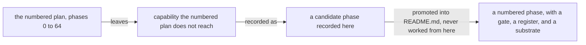

# Later Phases

> **Purpose**: The candidate pool of in-scope, high-numbered phases that are real commitments but do not
> yet warrant their own `phase_NN_<slug>.md` — each a one-line scope and a provisional gate, all 📋 Planned
> design intent until promoted to a numbered phase.
> **Read this if**: a capability is wanted that no numbered phase covers.

This document holds work deliberately deferred past the numbered plan: what it is, and why it is not yet
sequenced. Nothing here has a phase number, a gate, or a substrate, and an item gains those only by being
promoted into [README.md](README.md), which remains the sole tracker.

Link-graph metadata

**Status**: Authoritative source
**Supersedes**: N/A
**Referenced by**: DEVELOPMENT_PLAN/README.md, DEVELOPMENT_PLAN/development_plan_phase_model.md, DEVELOPMENT_PLAN/overview.md, DEVELOPMENT_PLAN/phase_04_dhall_gate1_schema.md, DEVELOPMENT_PLAN/system_components.md, documents/engineering/chaos_failover_second_axis.md, documents/engineering/dsl_doctrine.md, documents/engineering/release_lifecycle_doctrine.md, documents/engineering/resource_capacity_doctrine.md
**Generated sections**: none

## Contents
- [Candidate phase: DB schema-migration automation + manifest-change correctness semantics](#candidate-phase-db-schema-migration-automation--manifest-change-correctness-semantics)
- [Candidate phase: The amoebius-native JIT (jitML absorbed)](#candidate-phase-the-amoebius-native-jit-jitml-absorbed)
- [Candidate phase: Native desktop + mobile application surfaces](#candidate-phase-native-desktop--mobile-application-surfaces)
- [Candidate phase: Additional cloud providers](#candidate-phase-additional-cloud-providers)
- [Candidate phase: Additional GPU families + vendor-neutral compute protocols](#candidate-phase-additional-gpu-families--vendor-neutral-compute-protocols)
- [Candidate phase: Neural processing units / neural engines](#candidate-phase-neural-processing-units--neural-engines)
- [Candidate phase: MoE teacher → student model-distillation framework](#candidate-phase-moe-teacher--student-model-distillation-framework)
- [Candidate phase: Niche substrate — dual-boot same-cluster](#candidate-phase-niche-substrate--dual-boot-same-cluster)
- [Candidate phase: Surgical proof-assistant track (`emitTLA` faithfulness + fold-closure)](#candidate-phase-surgical-proof-assistant-track-emittla-faithfulness--fold-closure)
- [Candidate phase: Live backup / restore / cold-DR seed](#candidate-phase-live-backup--restore--cold-dr-seed)
- [Resolved — *not* a later phase: capacity / topology / bounded-storage type discipline](#resolved--not-a-later-phase-capacity--topology--bounded-storage-type-discipline)
- [Related Documents](#related-documents)

---

Phases 0–64 each own a dedicated `phase_NN_<slug>.md`. Everything past Phase 64 is *in scope* but not yet
detailed: the README phase index lists it as the single row **`65+ — Later phases`**. This document is that
row, expanded into a candidate pool.

Read it as a **backlog of confirmed-but-unscheduled work**, governed by the same disciplines as the rest of
the suite:

- **All 📋 Planned, all design intent.** Nothing here is implemented; every scope line and every gate is a
  target shape, never a tested amoebius result (honesty rule,
  [development_plan_standards.md §K](development_plan_standards.md#k-honesty-proven--tested--assumed)). Where a candidate leans on the sibling
  prodbox or hostbootstrap projects, that is *sibling evidence*, not amoebius proof.
- **Promotion means a contiguous number.** When a candidate is picked up, it is appended as the next
  `phase_NN_<slug>.md` with a full skeleton ([development_plan_standards.md §D](development_plan_standards.md#d-the-per-phase-document-skeleton)),
  a concrete single-substrate gate ([§L](development_plan_standards.md#l-one-substrate-discipline)), and a contiguous id — Phase 65, 66,
  … with no gaps or fractional ids ([§E](development_plan_standards.md#e-one-canonical-phase-model)). The provisional numbers below are
  *ordering hints only*; the real id is assigned at promotion.
- **No forward dependencies.** A later phase consumes earlier phases; nothing in Phases 0–64 is allowed to
  declare a `Blocked by` that points here ([§E](development_plan_standards.md#e-one-canonical-phase-model)). These candidates sit strictly
  *after* the offline multi-zone continuity gate of Phase 64.
- **One substrate per gate.** Each candidate names at most one provisional acceptance substrate; a candidate
  that would need more than one is split before promotion ([§L](development_plan_standards.md#l-one-substrate-discipline)).

The candidates are independent of one another and may be promoted in any order relative to each other; the
provisional ids reflect a *likely* sequencing, not a dependency chain.

## Candidate phase: DB schema-migration automation + manifest-change correctness semantics

**Status**: 📋 Planned (provisional Phase 65) **Provisional substrate**: linux-cpu **Scope** (one line): a
typed, ordered, idempotent schema-migration engine for the Patroni-via-Percona Postgres clusters, unified
with a precise account of what a *manifest change* means when the desired object already exists in etcd
(patch vs. immutable-field recreate vs. forbidden destructive change). **Provisional gate**: an
`InForceSpec` topology that evolves an app's declared schema across two revisions migrates a populated
database forward idempotently (re-apply is a no-op), and a manifest change touching an immutable field is
reconciled by the typed diff with **zero silent data loss**.

The reconcile half of this is a hardening of the typed reconciler's state model:
[`manifest_generation_doctrine.md` §6](../documents/engineering/manifest_generation_doctrine.md#6-the-reconcile-state-model-desired-is-renderallprovisionedspec-observed-is-live-inventory-actions-are-typed) — the reconcile state model (desired is the pure `bind/expand → plan/resolve infrastructure → provision → renderAll` result for the authenticated materialization, observed is etcd, a diff is typed)
already frames the diff as a *typed* value; this candidate extends that diff to classify schema-affecting and
immutable-field changes so a change that would otherwise drop rows cannot be applied as a silent replace. The
database half adds the migration ordering and idempotence on top of the per-consumer Postgres model. It is a
later phase because it presupposes a working app-with-Postgres deployment from Phase 34 and the storage-safety
guarantees from Phase 46 (durable bytes are not destroyed under normal credentials) — a schema migration must
move data *without* representing destruction.

**Folded into the release lifecycle (forward pointer).** The migration half of this candidate is now positioned
as a *phase of the delivery doctrine* rather than a standalone engine: a DB-schema migration is a
**`RolloutPhase`** — an ordered, readiness-gated phase obeying create-new → verified-migrate → retire-old,
enacted as one step of a `RolloutPlan` on the in-cluster SSA/ApplySet reconciler
([`release_lifecycle_doctrine.md` §5 — `RolloutPlan` / `RolloutPhase`](../documents/engineering/release_lifecycle_doctrine.md#5-rolloutplan--rolloutphase-the-readiness-gated-apply)).
Its "zero silent data loss" gate is exactly the `storage_lifecycle` create-new→migrate→retire discipline carried
on that phase, so the migration *ordering + idempotence* work belongs to the release rollout, not to a separate
mechanism. The manifest-change-correctness half stays as stated — the hardening of the typed reconcile diff
([`manifest_generation_doctrine.md` §6, above](../documents/engineering/manifest_generation_doctrine.md#6-the-reconcile-state-model-desired-is-renderallprovisionedspec-observed-is-live-inventory-actions-are-typed)) — because a typed diff that refuses a destructive
immutable-field replace is a precondition the `RolloutPlan`'s phases depend on. This remains 📋 Planned design
intent: jitML's `Bootstrap.hs` schema-grant pre/post-migration phase is *sibling evidence* that the phased shape
runs in a sibling, not an amoebius result.

*Orientation. What a candidate is and is not: nothing below carries a phase number, a gate, or a substrate, and an item acquires those only by promotion into [README.md](README.md). The candidates themselves are unordered with respect to one another.*

## Candidate phase: The amoebius-native JIT (jitML absorbed)

**Status**: 📋 Planned (provisional Phase 66) **Provisional substrate**: linux-cuda (the JIT path exercises
the GPU compute substrate) **Scope** (one line): the *native JIT* half of the vision's second language — an
amoebius-owned JIT into which jitML is absorbed, consumed through the constrained extension surface that
Gate 3 already admits. **Provisional gate**: a representative ML extension runs through the amoebius-native
JIT (replacing jitML) producing the bit-deterministic result its determinism contract requires.

**This candidate was split; its trusted-adapter checker half is now v1.** It formerly read "Haskell extension
DSL + custom AST checker + native JIT." A low-code app now needs neither an arbitrary container nor linked app
code: it is checked `UiSource` interpreted by the generic runtime. Gate 3 remains necessary only for a reviewed
trusted Haskell adapter that the closed handler catalog cannot supply. The **constrained adapter surface and its custom AST checker** are specified in
[`dsl_doctrine.md` §5](../documents/engineering/dsl_doctrine.md#5-the-illegal-state-unrepresentable-contract)
and [§8](../documents/engineering/dsl_doctrine.md#8-the-haskell-extension-dsl--the-constrained-surface-gate-3-admits),
and delivered by [Phase 14](phase_14_chain_kernel_boundary.md); the bounded UI schema and port binder in
[Phase 16](phase_16_ui_program_schema.md) and [Phase 19](phase_19_ui_effect_binding.md) consume only admitted
handler catalogs. These are separate from the native-JIT work remaining here.

What remains here is the **JIT** — a new capability rather than a discipline, and still correctly a later
phase: nothing in v1 requires amoebius to own its own JIT, because jitML supplies one as a vendored workload
extension.

## Candidate phase: Native desktop + mobile application surfaces

**Status**: 📋 Planned (provisional Phase 67) **Provisional substrate**: one client platform per eventual
acceptance gate **Scope** (one line): extend the typed application-composition and generated-contract model
beyond browser SPAs to native desktop applications on macOS, Windows, and Linux and native mobile
applications on Apple and Android phones and tablets (iPhone/iPad and Android phone/tablet), using the
platform's native language, UI, packaging, signing, distribution, and lifecycle model. **Provisional acceptance direction**: a representative native client generated or built from the same amoebius-owned
application/workflow contract performs an authenticated infernix or jitML interaction on one named client
platform; a contract, language/toolchain, CPU architecture, OS/API level, entitlement, signing, package, or
distribution-channel mismatch cannot produce a runnable or publishable artifact.

SPAs remain a supported application surface; native clients are an additional closed family rather than a
replacement. The intended platform arms include macOS, Windows, and Linux desktop, Apple phone/tablet, and
Android phone/tablet. Each arm selects only compatible implementation and packaging choices—for example Swift
and the Apple-native UI/toolchain surface for Apple clients, Kotlin and the Android-native UI/toolchain surface
for Android clients, and explicitly selected native toolchains for Windows and Linux. A free-authored language,
target triple, package kind, signing identity, entitlement, or store channel is not accepted as proof of
compatibility.

The existing JIT/content-addressed pattern is extended **subject to the target platform's execution and distribution rules**. Typed Haskell application/workflow ADTs remain the contract source; platform bindings and
client contract types are deterministic generated build artifacts rather than parallel handwritten truths.
Native code, models, kernels, and other runtime material are resolved by content identity into a bounded cache
where the platform permits it. Where a client platform requires ahead-of-time compilation, signing, review, or
immutable executable bundles, the same catalog identity resolves to a precompiled signed artifact—there is no
pretence that arbitrary runtime code generation is portable or permitted.

The illegal-state discipline applies across the whole relation:
`ClientPlatform → NativeLanguage/Toolchain → Architecture/API profile → Package/Signing/Distribution`.
Only constructors valid for that platform exist, and the provision/build seal consumes observed toolchain,
device/emulator, signing, and entitlement witnesses before producing a deployable client artifact. infernix and
jitML are consumed through the same generated application/workflow contracts as the SPA surface; neither native
client invents a separate wire schema or silently substitutes an incompatible compute/runtime path.

## Candidate phase: Additional cloud providers

**Status**: 📋 Planned (provisional Phase 68) **Provisional substrate**: provider (one provider per eventual
acceptance gate) **Scope** (one line): extend the provider-native provisioning, observation, quota,
credential, managed-cluster, node-supply, storage, networking, and teardown surfaces beyond AWS to GCP,
Azure, and subsequently admitted cloud providers without weakening the typed plan/validate/enact boundary.
**Provisional acceptance direction**: for each admitted provider, the same desired topology is lowered
through that provider's closed action and resource families, validated against fresh provider-native
observations, and enacted and torn down without leaking resources; a credential, quota, region/zone,
resource identity, or action from another provider cannot produce an enactable value and causes zero
effects.

This is a family of provider additions, not a promise that every provider lands together or in a fixed order.
AWS remains the first live provider and the evidence-bearing shape. Each additional provider must extend the
closed provider union and supply its own typed credentials, resource identities, capabilities, observations,
quotas, mutation actions, cleanup rules, and managed-cluster arm where applicable. There is no generic
stringly-typed escape hatch: an Azure identity cannot inhabit a GCP action, an AWS quota witness cannot admit
an Azure node class, and a provider feature absent from the closed capability relation is unsupported rather
than guessed. The provider-independent desired topology may be shared; the provisioned and validated actions
remain provider-indexed and single-use.

## Candidate phase: Additional GPU families + vendor-neutral compute protocols

**Status**: 📋 Planned (provisional Phase 69) **Provisional substrate**: varies by GPU family (one family and
one substrate per eventual acceptance gate) **Scope** (one line): extend the shared infernix/jitML engine
and accelerator-owner model beyond NVIDIA CUDA to AMD and Intel GPUs and explicitly admitted
open/vendor-neutral compute protocols, with observed family/profile/device/memory/runtime compatibility
sealed before dispatch. **Provisional acceptance direction**: a representative infernix workload and jitML
vectorized workload execute through an admitted non-CUDA GPU backend with an external device-execution
witness, while family/runtime/profile, device-count, memory-residency, ownership, or execution-shape
mismatches are rejected before effects.

GPU support preserves wholesale, identity-complete accelerator ownership and the existing
source/workload/coexistence accounting rather than treating a GPU as a boolean feature. Every backend is a
closed family with an observed offering, compatible runtime/protocol set, stable device identities, memory
geometry and reserve, owner policy, and execution witness. "Open protocols" means specifically admitted
vendor-neutral protocols or runtimes, not an arbitrary backend name; the concrete protocol set is chosen when
a candidate is promoted.

The workload/engine relation is structural: **GPU execution is available only to vectorized/batch work**,
including offline batch RL. A non-vectorized/online RL workload has no GPU-target constructor, so it cannot
survive Dhall decoding and provisioning as a GPU deployment. This restriction applies equally to CUDA, AMD,
Intel, and vendor-neutral GPU backends. Both infernix and jitML consume the same provisioned engine selection;
neither library may silently fall back to another engine.

## Candidate phase: Neural processing units / neural engines

**Status**: 📋 Planned (provisional Phase 70) **Provisional substrate**: varies by NPU/SoC family (one family
and one substrate per eventual acceptance gate) **Scope** (one line): add neural-engine execution for
infernix and jitML across explicitly supported Apple Silicon, Qualcomm Snapdragon, Google Tensor, MediaTek,
Intel Core Ultra, AMD Ryzen AI, and NVIDIA SoC families, with family-specific runtime, operator, memory,
residency, and availability witnesses behind one typed engine interface. **Provisional acceptance direction**: on each admitted neural-engine family, representative vectorized and non-vectorized
infernix/jitML workloads select only compatible operators and memory geometry and produce an external
execution witness; unsupported operators, runtimes, profiles, placements, or false accelerator claims are
rejected before effects with no CPU/GPU fallback.

An NPU is neither a generic GPU nor merely a faster CPU. Each admitted family owns a closed profile describing
the runtime/API, supported operator and numeric surfaces, memory model (including unified-memory systems),
concurrency/residency limits, host/cluster boundary, and how execution is independently observed. Marketing
names alone never constitute a capability witness.

Unlike GPUs, **CPU and neural-engine targets admit both execution shapes**: vectorized/batch workloads such as
offline batch RL, and non-vectorized/streaming workloads such as online RL. The intended indexed relation is:
`Vectorized → CPU | GPU | NeuralEngine`; `NonVectorized → CPU | NeuralEngine`. The Dhall surface uses
corresponding closed unions and the Haskell decoder/provision seal preserves the index, making
`NonVectorized → GPU` unrepresentable rather than a runtime convention. infernix and jitML share this relation,
their engine catalog and the no-silent-fallback rule.

## Candidate phase: MoE teacher → student model-distillation framework

**Status**: 📋 Planned (provisional Phase 71) **Provisional substrate**: one accelerator/engine family per
eventual acceptance gate **Scope** (one line): use a large mixture-of-experts teacher model (for example, a
DeepSeek-V3-class model) to generate a provenance-complete training corpus for fine-tuning a smaller student
model, optimizing the offline generation run for aggregate token throughput rather than interactive
per-token latency. **Provisional acceptance direction**: a pinned teacher, prompt/source corpus, sampling
policy, filter, and student-training specification produce a content-addressed dataset and fine-tuned
student while the observed run demonstrates sustained per-expert batching and aggregate token throughput;
missing expert weights, unbounded queues, memory-overcommitted residency plans, incomplete provenance,
objective/scheduler mismatches, or silent token loss/reordering are rejected before or during the typed
transition with no publishable dataset.

This is an **offline, long-running data-generation workload**, not the interactive inference path. Its objective
is total useful teacher tokens per unit time across the run. Time-to-first-token and latency for an individual
sequence may be substantially worse when doing so improves aggregate throughput. The workload objective is a
closed choice—at minimum `InteractiveLatency | OfflineTokenThroughput`—and the MoE distillation scheduler is
constructible only for `OfflineTokenThroughput`; an interactive endpoint cannot silently acquire its
latency-sacrificing queue and residency policy.

The teacher's router and expert execution are decoupled by typed asynchronous queues. Whenever a sequence has
an activation ready to route, the router assigns that work to the selected expert queue without waiting for
the expert to finish unrelated work. Each expert therefore receives a continuous bounded queue from many
sequences, and the executor forms efficient same-expert batches. Routing does not speculate past unavailable
activations or violate per-sequence token dependencies: asynchronous means the router and experts progress
independently across ready sequences, not that causal order is discarded.

Expert residency is a provisioned state machine rather than an ad-hoc cache. Queue length, oldest-work age,
batch opportunity, expert weight size, transfer/load cost, device memory, mandatory runtime reserve, and
currently in-flight batches determine load, retain, evict, and unload transitions. Hysteresis and minimum
residency prevent load/unload thrashing; bounded queues and explicit backpressure prevent the throughput
optimization from becoming an unbounded-memory claim. An expert may execute only after its exact
content-addressed weights and compatible numeric/runtime profile are resident under an identity-complete
memory witness. Eviction cannot strand or silently discard queued or in-flight work.

The distillation surface is also closed and provenance-bearing:
`TeacherIdentity + SourceCorpus + PromptTemplate + SamplingPolicy + OutputFilter + DatasetPolicy +
StudentIdentity + FineTunePolicy`. Every generated example records the teacher/model and tokenizer digests,
source/prompt identity, sampling parameters and derived seed, output/filter decision, and dataset shard
identity. Only verified shards enter the immutable dataset manifest used by jitML fine-tuning; infernix may
serve or evaluate the teacher and student through the same engine catalog. A run with unknown licensing or
retention policy, an unpinned teacher/tokenizer, an unbounded dataset, or a dataset manifest that does not
close over its examples cannot produce the opaque publishable dataset or fine-tuned-model artifact.

## Candidate phase: Niche substrate — dual-boot same-cluster

**Status**: 📋 Planned (provisional Phase 72) **Provisional substrate**: windows. **Scope** (one line): admit
a *dual-boot, same-cluster* host into the substrate model. **Provisional gate**: a dual-boot host joins and
rejoins the same cluster across an OS switch without violating the retained-PV rebind guarantees.

This is deferred because it probes the edge of one locked invariant. The substrate
model treats the substrate as a *fact about the host, not a knob*
([`substrate_doctrine.md` §1 — the substrate is a fact about the host, not a knob](../documents/engineering/substrate_doctrine.md#1-the-substrate-is-a-fact-about-the-host-not-a-knob));
a dual-boot host is a host whose *fact* changes under it, which is exactly the case the detection model does
not yet cover. WireGuard is already adopted in Phase 41 and the no-Linkerd service-mesh verdict is normative;
neither belongs in this candidate's gate.

## Candidate phase: Surgical proof-assistant track (`emitTLA` faithfulness + fold-closure)

**Status**: 📋 Planned (provisional Phase 73) **Provisional substrate**: none (a pure-proof track, validated
by the proof checker + the existing suite) **Scope** (one line): discharge — machine-checked — the **two**
load-bearing meta-properties the rest of the suite currently only *tests*: (a) the `emitTLA`/`interpret`
**faithfulness meta-theorem** (each `Expr`/`Temporal` constructor's `interpret`-denotation equals the TLA+
denotation `emitTLA` targets), and (b) the **fold-closure** laws (commutativity/associativity/idempotence)
for the capacity folds, the Pulsar dedup fold, and the CAS-pointer merge that the I-confluence ledger rests
on. **Provisional gate**: the two meta-properties are machine-checked green by the chosen proof tool, and a
deliberately broken variant (a mistranslated quantifier in `emitTLA`; a non-commutative merge) fails the
check — after which the corresponding
[`chaos_failover_second_axis.md §19`](../documents/engineering/chaos_failover_second_axis.md#19-the-cross-boundary-ledger-and-conformance-rows)
confluence ledger rows and the
[`formal_model_doctrine.md §4`](../documents/engineering/formal_model_doctrine.md#4-single-source-correspondence)
faithfulness claim may move from **tested** to **proven**.

This is a **surgical** track, not a broad proof-assistant layer — those two properties are the only places a
proof assistant earns its keep, precisely because they are small, closed, and load-bearing, and are today only
property-tested ([`formal_model_doctrine.md §4`](../documents/engineering/formal_model_doctrine.md#4-single-source-correspondence); the confluence ledger's own rule that a closure claim "is proof only when its closure argument is shown"). It is explicitly deferred because it *hardens* claims the Phase-2/3/7
differential and closure property-tests already exercise; the property tests are the affordable first line, and
this candidate upgrades them to proof only where the payoff is a genuine ledger promotion. A first sprint is an
**evaluation**: **Liquid Haskell vs Lean** — Liquid Haskell checks refinement types on the *actual* Haskell and
so introduces no second artifact to drift (the drift the whole `Model`-as-data pattern exists to foreclose),
while Lean/Agda offers a fuller metatheory; the verdict picks the tool the two proofs are written in. A broad
adoption is out of scope by design.

The "one base container with everything" packaging question is sometimes mistaken for deferred work. It is
**not**. It is **resolved and adopted in Phase 25**: every third-party service binary (the registry, MinIO,
Vault, Pulsar, Redis (`redis-server` and `redis-cli`), Postgres tooling, a Temurin JRE for the JVM services, …)
is baked into the multi-arch base
container, and clusters pull images only from the in-cluster `distribution` registry — never from a public
registry. That is the standing doctrine,
[`image_build_doctrine.md` §2](../documents/engineering/image_build_doctrine.md#2-the-single-distribution-rule-bake-the-binaries-build-the-amoebius-image-pull-only-in-cluster) — the single distribution rule (bake the binaries, build the amoebius image, pull only in-cluster),
delivered by [phase_25_base_image_registry.md](phase_25_base_image_registry.md) and
recorded as resolved in the README "Later phases" note. It is named here only to close the question: do not
re-open it as a candidate phase.

---

## Candidate phase: Live backup / restore / cold-DR seed

**Status**: 📋 Planned (provisional Phase 74) **Provisional substrate**: linux-cpu → provider (the
write-but-never-delete cloud credential is enacted on the provider substrate, as with the durable-EBS
create-vs-delete model) **Scope** (one line): the live enactment of the backup surface — the put-only backup
credential, the copy/verify `Job` that emits a verified `BackupArtifact` to a remote / append-only-WORM /
air-gapped medium, the restore that seeds a fresh coordinate, and the `ColdSeedFromBackup` down-primary
drill. **Provisional gate**: an `InForceSpec` topology backs a durable coordinate up to a bounded medium
under a credential that is denied delete/expire at the cloud API, verifies the artifact, then loses the
source backing and **seeds a fresh secondary from the backup**; the secondary takes the wild-ingress gateway
only after its seeded state proves fresh within `freshnessBound`, and an over-medium backup, an auto-restore
from a `Manual` air-gap medium, and a delete-a-backup attempt each perform zero effects.

The **representation** half of backup is **not** a later phase — like the capacity / bounded-storage discipline
below, it is folded into the pure band: the closed `BackupPolicy` / `BackupMedium` / `WriteRegime` /
`BackupRetention` shapes and the `freshnessBound ≥ cadence` fold land in **Phase 4/5**, the no-overcommit sizing
fold in **Phase 7/10**, the illegal-state corpus (`illegal_state_storage.md` [§3.53](../documents/illegal_state/illegal_state_storage.md#353-a-backup-larger-than-its-bounded-medium)–[§3.68](../documents/illegal_state/illegal_state_storage.md#368-two-conflicting-backup-policies-on-one-coordinate) / `illegal_state_multicluster.md` [§3.69](../documents/illegal_state/illegal_state_multicluster.md#369-a-cold-seeded-secondary-taking-the-gateway-without-proven-freshness)–[§3.71](../documents/illegal_state/illegal_state_multicluster.md#371-a-freshness-watermark-asserted-rather-than-derived-from-captured-content)) in **Phase 6**, and the `FreshnessWitness` /
`NoTakeWithoutProvenFreshness` guard extending the one formal obligation in **Phase 3**
([`gateway_migration_model_doctrine.md`](../documents/engineering/gateway_migration_model_doctrine.md)). Only
the **live** enactment is this candidate, and its runtime residues distribute to the phases that already own
each substrate: the Vault-Transit envelope to Phase 29, the MinIO remote target to Phase 30, the cross-cluster
cold-seed drill to Phases 42/43, the write-but-never-delete cloud credential to Phase 46, and the air-gap
manual/automatic handling drill to the test-topology harness of Phase 54. The standing doctrine is
[`backup_recovery_doctrine.md`](../documents/engineering/backup_recovery_doctrine.md); the deletion of any
backup remains out of band and outside amoebius automation, exactly as durable-backing reclaim is.

---

## Resolved — *not* a later phase: capacity / topology / bounded-storage type discipline

Foreclosing dysfunctional deployment states — resource overcommit (host / VM / cluster), compute-engine ↔
substrate incompatibility, illegal cluster topology (rke2-on-bare-apple, multi-node kind on two hosts,
multi-node rke2 with fewer hosts than nodes), unbounded storage, un-tiered Pulsar topics, and policy-less
capacity growth — is **not** a new phase. Two honesty layers apply. Closed union and topology shapes with no
illegal constructor are type-foreclosed; quantitative capacity sums, placements, and inventory-dependent
compatibility are total decode/provision checks, never dependent-type proofs. Raw incompatible values may
exist, but `provision` returns `Left` and therefore cannot construct the opaque `ProvisionedSpec`, the sole
deployable representation. The discipline is **folded into Phase 4** for source/schema shapes, **Phase 7** for
the pure fold implementation and generated properties, **Phase 10** for full bind/expansion plus the opaque
provision seal, and **Phase 13** for the closed `renderAll` consumer. None requires an external effect or a
forward live-phase dependency ([development_plan_standards.md §E](development_plan_standards.md#e-one-canonical-phase-model) one-canonical-phase). Its **runtime**
residues distribute to the phases that already own each substrate: the Pulsar two-ceiling offload to Phase
23, the Lima `LinuxHost` witness + host/VM capacity cross-check to Phase 53, live kind topology to Phases
17/32, and the `Managed EKS` arm + `ScalingPolicy` enaction + cloud quota to Phases 44/47. So there is **zero phase renumber**:
the discipline is owned by two new doctrines
([`resource_capacity_doctrine.md`](../documents/engineering/resource_capacity_doctrine.md), [`cluster_topology_doctrine.md`](../documents/engineering/cluster_topology_doctrine.md)) and catalogued in
[`illegal_state_catalog.md`](../documents/illegal_state/illegal_state_catalog.md) [§3.13](../documents/illegal_state/illegal_state_topology.md#313-a-compute-engine-incompatible-with-its-substrates-managed-providers-first-class)–[§3.22](../documents/illegal_state/illegal_state_capacity.md#322-a-hand-authored-un-derived-toleration) / [§4.6](../documents/illegal_state/illegal_state_techniques.md#46-capacity-accounting--placement-witness-compute-and-summed-demand-within-capacity-storage-checked) / [§4.7](../documents/illegal_state/illegal_state_techniques.md#47-compatibility--topology-relations-by-construction-over-a-collection),
delivered without inserting a phase. Named here only to close the question: do not re-open it as a candidate
phase.

Live multi-node rke2 remains **unassigned Phase-N work**: Phases 4–9 define/prove its server/agent topology,
role reserves, and elastic templates, but no current Register-3 gate may claim host admission, join, or
enforcement. Promoting that gate is required before an rke2 mutation continuation exists.

---

## Related Documents

- [README.md](README.md) — the live tracker; the `65+ — Later phases` row this document expands
- [development_plan_standards.md](development_plan_standards.md) — the rulebook ([§D](development_plan_standards.md#d-the-per-phase-document-skeleton) skeleton, [§E](development_plan_standards.md#e-one-canonical-phase-model) one-phase model, [§K](development_plan_standards.md#k-honesty-proven--tested--assumed) honesty, [§L](development_plan_standards.md#l-one-substrate-discipline) one-substrate) every candidate obeys at promotion
- [overview.md](overview.md) — target architecture and constraints these candidates extend
- [system_components.md](system_components.md) — target component inventory a promoted candidate adds to
- [substrates.md](substrates.md) — substrate registry; each candidate's provisional substrate is recorded here
  at promotion
- [phase_25_base_image_registry.md](phase_25_base_image_registry.md) — where the "one
  base container with everything" question is resolved (not deferred)
- [DSL Doctrine](../documents/engineering/dsl_doctrine.md) — [§8](../documents/engineering/dsl_doctrine.md#8-the-haskell-extension-dsl--the-constrained-surface-gate-3-admits) the extension-DSL forward pointer
- [App vs Deployment Doctrine](../documents/engineering/app_vs_deployment_doctrine.md) — the application logic
  and deployment-rule split the native-client candidate preserves
- [Lift and Compose Doctrine](../documents/engineering/lift_and_compose_doctrine.md) — the existing
  Haskell-contract-to-PureScript-SPA pattern the native-client family extends
- [Generated Artifacts Doctrine](../documents/engineering/generated_artifacts_doctrine.md) — generated client
  bindings remain build artifacts, never a second committed contract truth
- [Manifest Generation Doctrine](../documents/engineering/manifest_generation_doctrine.md) — [§6](../documents/engineering/manifest_generation_doctrine.md#6-the-reconcile-state-model-desired-is-renderallprovisionedspec-observed-is-live-inventory-actions-are-typed) the typed
  reconcile state model the manifest-change correctness candidate extends
- [Image Build Doctrine](../documents/engineering/image_build_doctrine.md) — [§2](../documents/engineering/image_build_doctrine.md#2-the-single-distribution-rule-bake-the-binaries-build-the-amoebius-image-pull-only-in-cluster) the baked-binary base
  container (Phase 25, resolved)
- [Substrate Doctrine](../documents/engineering/substrate_doctrine.md) — [§1](../documents/engineering/substrate_doctrine.md#1-the-substrate-is-a-fact-about-the-host-not-a-knob) the substrate-is-a-fact model the
  niche-substrate candidate probes
- [Release Lifecycle Doctrine](../documents/engineering/release_lifecycle_doctrine.md) — [§5](../documents/engineering/release_lifecycle_doctrine.md#5-rolloutplan--rolloutphase-the-readiness-gated-apply) `RolloutPlan` /
  `RolloutPhase`, where this backlog candidate's DB schema-migration half is folded into Phase 39 as a
  readiness-gated phase (create-new→verified-migrate→retire-old)
- [Network Fabric Doctrine](../documents/engineering/network_fabric_doctrine.md) — Phase 41 WireGuard and the
  no-Linkerd verdict are resolved inputs, not Phase-53 work
