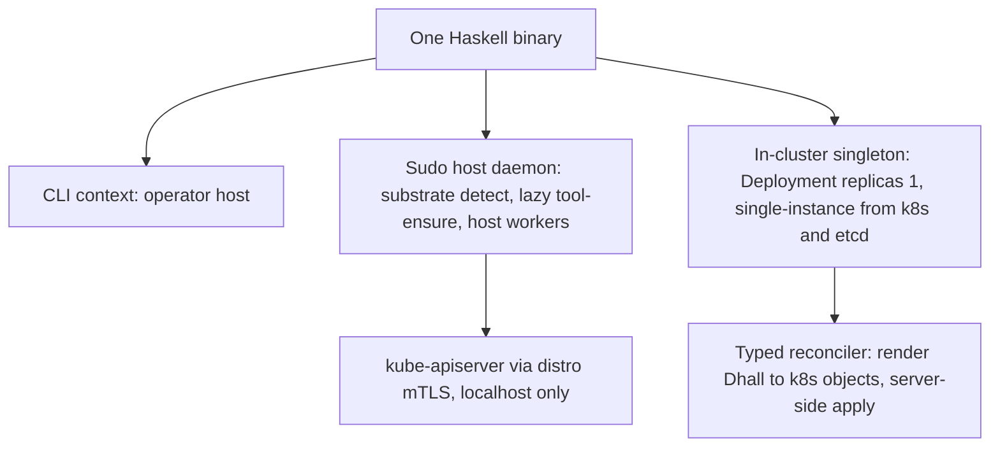

# Amoebius Overview

**Status**: Authoritative source
**Supersedes**: N/A
**Referenced by**: DEVELOPMENT_PLAN/README.md, DEVELOPMENT_PLAN/development_plan_standards.md, DEVELOPMENT_PLAN/later_phases.md, DEVELOPMENT_PLAN/phase_00_documentation_suite.md, DEVELOPMENT_PLAN/phase_01_toolchain_spike.md, DEVELOPMENT_PLAN/phase_02_formal_model_kernel.md, DEVELOPMENT_PLAN/phase_03_gateway_migration_model.md, DEVELOPMENT_PLAN/phase_04_dhall_gate1_schema.md, DEVELOPMENT_PLAN/phase_05_gadt_decoder_gate2.md, DEVELOPMENT_PLAN/phase_06_illegal_state_corpus.md, DEVELOPMENT_PLAN/phase_07_capacity_topology_folds.md, DEVELOPMENT_PLAN/phase_08_capability_binder.md, DEVELOPMENT_PLAN/phase_09_render_manifest_goldens.md, DEVELOPMENT_PLAN/phase_10_chain_kernel_dryrun.md, DEVELOPMENT_PLAN/phase_11_boundary_fake_tool_harness.md, DEVELOPMENT_PLAN/phase_12_spa_composition_representational.md, DEVELOPMENT_PLAN/phase_13_midwife_bootstrap_kind.md, DEVELOPMENT_PLAN/phase_14_base_image_registry.md, DEVELOPMENT_PLAN/phase_15_renderer_reconciler.md, DEVELOPMENT_PLAN/phase_16_retained_storage.md, DEVELOPMENT_PLAN/phase_17_vault_pki.md, DEVELOPMENT_PLAN/phase_18_platform_services.md, DEVELOPMENT_PLAN/phase_19_keycloak_ingress.md, DEVELOPMENT_PLAN/phase_20_live_dsl_singleton.md, DEVELOPMENT_PLAN/phase_21_app_tenancy.md, DEVELOPMENT_PLAN/phase_22_pulsar_client.md, DEVELOPMENT_PLAN/phase_23_content_store_workflow.md, DEVELOPMENT_PLAN/phase_24_determinism_kernel.md, DEVELOPMENT_PLAN/phase_25_jitbuild_engine_cache.md, DEVELOPMENT_PLAN/phase_26_infernix_lift.md, DEVELOPMENT_PLAN/phase_27_jitml_lift_cuda.md, DEVELOPMENT_PLAN/phase_28_apple_metal_host_daemon.md, DEVELOPMENT_PLAN/phase_29_multicluster_gateway_migration.md, DEVELOPMENT_PLAN/phase_30_provider_clusters.md, DEVELOPMENT_PLAN/phase_31_test_topology_dsl.md, DEVELOPMENT_PLAN/phase_32_spa_live_deploy.md, DEVELOPMENT_PLAN/system_components.md
**Generated sections**: none

> **Purpose**: The target-architecture / vision / current-baseline narrative — the "why and what" companion
> to [README.md](README.md)'s "where and when" — for the everything-orchestrator amoebius is becoming.

This document explains *what amoebius is and why it is shaped that way*. It does not track status, order, or
remaining work — that is [README.md](README.md)'s job, and per
[development_plan_standards.md §K](development_plan_standards.md) status lives **only** in the plan tracker.
The doctrine under [`../documents/engineering/`](../documents/engineering/README.md) owns the normative
detail of each subsystem; this overview summarizes and links, and **never restates** doctrine content
(documentation_standards §5). This document is the target-architecture companion to that grand, non-binding
vision; the plan is its binding, executable decomposition.

> **Greenfield, read this first.** Nothing is implemented. Only the Phase 0 documentation suite exists; there
> is no `src/` yet. Every phase and sprint is 📋 Planned and **every prescriptive sentence below is design
> intent, not a tested result.** Where this overview leans on the sibling `prodbox` project, that is cited as
> *evidence* that a shape works — never as amoebius proof.

---

## 1. The everything-orchestrator shape: one binary, three contexts

Amoebius is a single Haskell binary that runs in three contexts from the same build artifact:

1. a **CLI** on the operator's host,
2. a **sudo-capable host daemon** that owns substrate detection, lazy tool-ensure, and host-level worker
   subprocesses, and
3. an **in-cluster control-plane singleton** — a Kubernetes Deployment `replicas=1` with total authority over
   its cluster and its secrets, whose single-instance is delegated to k8s/etcd (no bespoke election).

There is no second binary, no sidecar fleet, no shell glue: context is a runtime fact, and *role* (control
plane vs. worker) is orthogonal to context. This is the doctrine of
[`daemon_topology_doctrine.md` §1 — One binary, three contexts](../documents/engineering/daemon_topology_doctrine.md#1-one-binary-three-contexts).
The cluster authority is one Deployment-`replicas=1` pod, reconciled with the HA-always rule, per
[`daemon_topology_doctrine.md` §3 — The control-plane singleton](../documents/engineering/daemon_topology_doctrine.md#3-the-control-plane-singleton):
"exactly one pod" is a k8s/etcd property (a k8s `Lease` if a hard lock is ever needed), **not** an amoebius
election, and the pod is stateless — no PVC; its durable state is the Vault-enveloped MinIO bucket.

The host daemon reaches the cluster only over localhost-restricted channels (kube-apiserver via the distro's
own mTLS, and Pulsar/MinIO over host-only NodePorts), never the public ingress path — see
[`host_cluster_comms_doctrine.md` §1 — The whole surface: two channels, both localhost-only](../documents/engineering/host_cluster_comms_doctrine.md#1-the-whole-surface-two-channels-both-localhost-only).

## 2. The constituent projects: libraries and behaviours unified under the DSL

The projects amoebius absorbs are **not separate products**. They become libraries and behaviours of the one
binary, tied together by the Dhall DSL so that an operator configures distro, replica count, and inference
substrate from a single `.dhall` with zero application change:

| Project | Becomes | Role under the DSL |
|---------|---------|--------------------|
| **prodbox** | root control-plane behaviour | the single-node root cluster: password-encrypted Vault unseal, PKI trust anchor, the human-gated init — see [`vault_pki_doctrine.md` §5 — The root cluster: single-node, password-encrypted unseal](../documents/engineering/vault_pki_doctrine.md#5-the-root-cluster-single-node-password-encrypted-unseal) |
| **infernix** + **jitML** | ML extension libraries | shared inference/training libraries whose hardware substrate is a *deployment rule*, not app code — [`app_vs_deployment_doctrine.md` §7 — infernix is a shared library; the inference substrate is a deployment rule](../documents/engineering/app_vs_deployment_doctrine.md#7-infernix-is-a-shared-library-the-inference-substrate-is-a-deployment-rule); jitML is the seed of the forward-looking Haskell extension DSL noted in [`dsl_doctrine.md` §8](../documents/engineering/dsl_doctrine.md#8-the-haskell-extension-dsl-forward-pointer-only) |
| **hostbootstrap** | bootstrap + DSL-`chain` core | the Python `pb` **midwife** CLI (ensure toolchain, build binary, hand off) plus the `dsl-step`/`chain` kernel — [`substrate_doctrine.md` §6 — The midwife contract](../documents/engineering/substrate_doctrine.md#6-the-midwife-contract-a-python-cli-ensures-a-toolchain-builds-the-binary-hands-off) |

Each of **infernix** and **jitML** additionally ships a **demo single-page web app** in its sibling repo that
illustrates its ML workflow and renders its results. Those demo web apps are amoebius's
**application-logic-only demonstrator** — the proof case that an app is written once as logic while HA replica
count, substrate, and inference binding are an orthogonal deployment-rules surface — and the SPA-composition
shakedown fixtures. A demo web app *uses* an extension but is not itself one — see
[`app_vs_deployment_doctrine.md` §6 — The proof case: a demo web app as application-logic-only](../documents/engineering/app_vs_deployment_doctrine.md#6-the-proof-case-a-demo-web-app-as-application-logic-only).

The unifying surface is the Dhall DSL: Dhall carries parameters, Haskell carries logic, and an app names
*capabilities* (ObjectStore, Sql, MessageBus, …) rather than products — see
[`service_capability_doctrine.md` §1 — Why capabilities, not products](../documents/engineering/service_capability_doctrine.md#1-why-capabilities-not-products)
and [`service_capability_doctrine.md` §2 — The capability set](../documents/engineering/service_capability_doctrine.md#2-the-capability-set).

## 3. The hard constraints (cross-cutting invariants)

These are the README "Cross-cutting invariants" — documented in Phase 0, upheld by every later phase. Each is
owned by exactly one doctrine SSoT; the overview only names and links them.

| Invariant | Owning doctrine (cited by name) |
|-----------|----------------------------------|
| **No environment variables, ever — including `PATH`.** Host tools are discovered lazily via the substrate package manager and invoked by full path. | [`substrate_doctrine.md` §3 — The no-environment / no-`PATH` lazy tool-ensure contract](../documents/engineering/substrate_doctrine.md#3-the-no-environment--no-path-lazy-tool-ensure-contract) |
| **Illegal/unsafe cluster state is unrepresentable in Dhall** (PVC↔PV, gateway, DNS, certs, taints/tolerations/affinity, NetworkPolicy, insecure ingress). | [`dsl_doctrine.md` §5 — The illegal-state-unrepresentable contract](../documents/engineering/dsl_doctrine.md#5-the-illegal-state-unrepresentable-contract); the enumerated catalog in [`illegal_state_catalog.md` §1 — Illegal states fail to type-check](../documents/illegal_state/illegal_state_catalog.md#1-illegal-states-fail-to-type-check) |
| **Resource demand never exceeds capacity** — a workload / VM / compute-engine over-committing its host or cluster is decode-rejected (a total fold over declared per-host `Capacity`; honestly decode-foreclosed). | [`resource_capacity_doctrine.md`](../documents/engineering/resource_capacity_doctrine.md); catalog [`§3.17`](../documents/illegal_state/illegal_state_catalog.md#3-the-catalog--states-a-valid-spec-cannot-represent) |
| **No unbounded storage** — host-bounded or cloud-quota-bounded; MinIO **and** Pulsar cannot exceed their backing; every topic has bounded retention + a size-triggered S3 offload so the hot tier never overflows. | [`resource_capacity_doctrine.md`](../documents/engineering/resource_capacity_doctrine.md); [`storage_lifecycle_doctrine.md` §5.2](../documents/engineering/storage_lifecycle_doctrine.md); [`pulsar_client_doctrine.md` §6.1](../documents/engineering/pulsar_client_doctrine.md) |
| **Compute engine matches its substrate; topology matches its hosts** — rke2/kind need a Linux host (a VM on apple/windows), multi-node kind is one host, multi-node rke2 is one Linux host per node, EKS is first-class; multi-substrate clusters are allowed. | [`cluster_topology_doctrine.md`](../documents/engineering/cluster_topology_doctrine.md); catalog [`§3.13`–`§3.16`](../documents/illegal_state/illegal_state_catalog.md#3-the-catalog--states-a-valid-spec-cannot-represent) |
| **Dynamic provisioning is amoebius-owned and typed** — capacity grows only through a quota-capped `ScalingPolicy` (capacity-based + instance price-shopping), never a bare "unbounded." | [`resource_capacity_doctrine.md`](../documents/engineering/resource_capacity_doctrine.md); [`cluster_lifecycle_doctrine.md` §8](../documents/engineering/cluster_lifecycle_doctrine.md#8-dynamic-node-provisioning) |
| **Pulsar payloads are exclusively CBOR** (canonical where content-addressed) — a typed codec; a non-CBOR application body (JSON/base64/protobuf/raw) is unrepresentable; protocol framing stays protobuf. | [`pulsar_client_doctrine.md` §3.1](../documents/engineering/pulsar_client_doctrine.md#31-payloads-are-exclusively-cbor); catalog [`§3.23`](../documents/illegal_state/illegal_state_catalog.md#3-the-catalog--states-a-valid-spec-cannot-represent) |
| **Application logic and deployment rules are separate DSL surfaces** — write the app once; HA, chaos, geo-replication, and failover are an orthogonal layer. | [`app_vs_deployment_doctrine.md` §1 — Two surfaces, one app written once](../documents/engineering/app_vs_deployment_doctrine.md#1-two-surfaces-one-app-written-once) |
| **Secrets never live in Dhall — only names.** Parents inject secrets directly into a child's Vault. | [`dsl_doctrine.md` §6 — Secrets are names, never values](../documents/engineering/dsl_doctrine.md#6-secrets-are-names-never-values); [`vault_pki_doctrine.md` §3 — The SecretRef contract: a name, never a value](../documents/engineering/vault_pki_doctrine.md#3-the-secretref-contract-a-name-never-a-value) |
| **Standard platform services on every cluster, HA always** — the chart is HA even at `replicas=1`. | [`platform_services_doctrine.md` §2 — HA always, including `replicas=1`](../documents/engineering/platform_services_doctrine.md#2-ha-always--including-replicas1) |
| **Only `no-provisioner` retained PVs** (`<ns>/<sts>/pv_<n>`, sized, host/EBS-bound); clusters are ephemeral, storage is not. | [`storage_lifecycle_doctrine.md` §2 — One storage class, and it provisions nothing](../documents/engineering/storage_lifecycle_doctrine.md#2-one-storage-class-and-it-provisions-nothing); the land-vs-cattle framing in [`storage_lifecycle_doctrine.md` §1](../documents/engineering/storage_lifecycle_doctrine.md#1-cluster-and-storage-have-independent-lifetimes) |
| **Every container declares CPU and RAM.** | [`platform_services_doctrine.md` §10 — Every container declares CPU and RAM](../documents/engineering/platform_services_doctrine.md#10-every-container-declares-cpu-and-ram) |
| **Keycloak owns all wild ingress** via the LB + Gateway API; the sole exception is host-origin, localhost-only traffic. | [`platform_services_doctrine.md` §9 — The LoadBalancer and the single wild-ingress path](../documents/engineering/platform_services_doctrine.md#9-the-loadbalancer-and-the-single-wild-ingress-path); the host-only carve-out in [`host_cluster_comms_doctrine.md` §1](../documents/engineering/host_cluster_comms_doctrine.md#1-the-whole-surface-two-channels-both-localhost-only) |
| **No Helm, no third-party charts** — every k8s object is rendered from pure typed Haskell and applied by the typed reconciler. | [`manifest_generation_doctrine.md` §1 — Why this doctrine exists: types render manifests, Helm does not](../documents/engineering/manifest_generation_doctrine.md#1-why-this-doctrine-exists-types-render-manifests-helm-does-not) |
| **Baked service binaries + the `distribution` registry** — every third-party *service* binary is baked into the multi-arch base container (in-cluster pulls only); the ML **engine payloads** are the exception — jit-resolved into a `CacheBudget`-bounded cache, never baked or URL-fetched. | [`image_build_doctrine.md` §2](../documents/engineering/image_build_doctrine.md#2-the-single-distribution-rule-bake-the-binaries-build-the-amoebius-image-pull-only-in-cluster); [`content_addressing_doctrine.md` §4.5](../documents/engineering/content_addressing_doctrine.md#45-the-ml-asset-lifecycle-one-bounded-content-addressed-cache-resolved-on-first-miss) |
| **Generated artifacts are never committed** — manifests, the emitted `.tla`/`.cfg`, the reflected Dhall schema, and PureScript contracts are rendered from Haskell source and not committed. | [`generated_artifacts_doctrine.md`](../documents/engineering/generated_artifacts_doctrine.md) |
| **The one formal obligation is the cross-cluster gateway migration** (both `Planned` and `Failover` branches), modelled as data, simulated + proven once; intra-cluster consensus is delegated, not re-proven. | [`gateway_migration_model_doctrine.md`](../documents/engineering/gateway_migration_model_doctrine.md); [`formal_model_doctrine.md`](../documents/engineering/formal_model_doctrine.md) |

The standard service set behind these capabilities — Registry (`distribution`) · MinIO · Vault · Pulsar ·
Prometheus/Grafana · Percona/Patroni Postgres + pgAdmin · Envoy/Gateway-API · Keycloak · LoadBalancer — is
inventoried in [system_components.md](system_components.md) and owned by
[`platform_services_doctrine.md`](../documents/engineering/platform_services_doctrine.md).

## 4. The canonical validation gates (one line per phase)

Each phase ends in a single, checkable acceptance gate on **at most one** substrate (the one-substrate
discipline, [development_plan_standards.md §L](development_plan_standards.md)). The authoritative gate text
and status live in [README.md](README.md); the line below names the gate and links the phase document. All
are 📋 Planned (greenfield).

*Pre-cluster band (substrate `none`, Registers 1–2):*
- **Phase 0 — Documentation suite** (`none`) → [phase_00](phase_00_documentation_suite.md): the documentation lint passes — valid headers, SSoT/no-duplication, no orphan cross-links.
- **Phase 1 — Toolchain spike** (`none`) → [phase_01](phase_01_toolchain_spike.md): a probe of `dhall` + `io-sim` + resolver deps builds on the pinned toolchain, or the exact blocker is recorded.
- **Phase 2 — Formal-model EDSL** (`none`) → [phase_02](phase_02_formal_model_kernel.md): the `Model` explorer + `emitTLA` round-trip a small model; the generated `.tla` is TLC-checkable and never committed.
- **Phase 3 — Gateway-migration model (both branches)** (`none`) → [phase_03](phase_03_gateway_migration_model.md): TLC reaches every invariant at scope for both `Planned` and `Failover`, io-sim agrees, a seeded mutation is caught.
- **Phase 4 — Dhall Gate-1 schema + prelude** (`none`) → [phase_04](phase_04_dhall_gate1_schema.md): `dhall type` accepts the positives and rejects each Gate-1 negative at authoring time.
- **Phase 5 — GADT IR + total decoder (Gate 2)** (`none`) → [phase_05](phase_05_gadt_decoder_gate2.md): each positive decodes; each Gate-2 negative returns a structured `Left`; the decode path is total.
- **Phase 6 — Illegal-state corpus + validation-locus ledger** (`none`) → [phase_06](phase_06_illegal_state_corpus.md): every negative is rejected at its tagged locus; QuickCheck green; the per-entry validation-locus ledger is emitted.
- **Phase 7 — Capacity / topology folds** (`none`) → [phase_07](phase_07_capacity_topology_folds.md): the `fits`/`carve`/`place` + topology-relation properties hold; the folds reject the negatives.
- **Phase 8 — Capability → provider → shape binder** (`none`) → [phase_08](phase_08_capability_binder.md): a capability need decodes to a `ServiceSpec`; a product-named app fails Gate 1.
- **Phase 9 — Pure `render` + rendered-output goldens** (`none`) → [phase_09](phase_09_render_manifest_goldens.md): `render` is byte-for-byte golden-locked; the rendered-output illegal states hold on the emitted objects.
- **Phase 10 — chain/Step kernel + `--dry-run`** (`none`) → [phase_10](phase_10_chain_kernel_dryrun.md): `chain` renders a byte-for-byte `--dry-run` plan with no effects; rendering never touches live infra.
- **Phase 11 — Boundary-integration fake-tool harness** (`none`) → [phase_11](phase_11_boundary_fake_tool_harness.md): the binary runs the plan against fake `kubectl`/`helm`/`docker`/`pulumi`, asserting exact commands + bytes — no cluster.
- **Phase 12 — SPA composition (representational) + demo-SPA local** (`none`) → [phase_12](phase_12_spa_composition_representational.md): the composition property holds and the PureScript demo SPA runs locally against a faked backend (Playwright).

*Live band (Register 3), substrate-ordered:*
- **Phase 13 — Python midwife + single kind cluster** (`linux-cpu`) → [phase_13](phase_13_midwife_bootstrap_kind.md): `pb bootstrap --distro=kind` brings up an empty cluster; re-run is a no-op.
- **Phase 14 — Base image + jit-build resolver + registry** (`linux-cpu`) → [phase_14](phase_14_base_image_registry.md): the multi-arch base image (services + resolver/toolchain) publishes atomically into the in-cluster `distribution` registry.
- **Phase 15 — Typed renderer + live SSA reconciler** (`linux-cpu`) → [phase_15](phase_15_renderer_reconciler.md): a rendered object set is applied to convergence; re-run is a no-op.
- **Phase 16 — Retained storage + lossless rebind** (`linux-cpu`) → [phase_16](phase_16_retained_storage.md): storage rebinds across delete+recreate with no data loss.
- **Phase 17 — Root Vault + PKI + Haskell Vault client** (`linux-cpu`) → [phase_17](phase_17_vault_pki.md): Vault inits/unseals fail-closed; the PKI anchor issues; the built-in client reads a `SecretRef`.
- **Phase 18 — Standard platform-service stack** (`linux-cpu`) → [phase_18](phase_18_platform_services.md): all standard services up HA from generated manifests + baked binaries, in readiness-DAG order.
- **Phase 19 — Keycloak-owned ingress** (`linux-cpu`) → [phase_19](phase_19_keycloak_ingress.md): every wild route is reachable only through Keycloak/Envoy.
- **Phase 20 — Live DSL deploy via the `replicas=1` singleton** (`linux-cpu`) → [phase_20](phase_20_live_dsl_singleton.md): a `.dhall` deploys platform + a trivial app via the no-election singleton; the pre-cluster negative corpus still fails live.
- **Phase 21 — App tenancy + `TenantSpec`** (`linux-cpu`) → [phase_21](phase_21_app_tenancy.md): per-app namespace + ObjectStore + Sql; a spec cannot name a foreign tenant's resource.
- **Phase 22 — Native Pulsar client (CBOR)** (`linux-cpu`) → [phase_22](phase_22_pulsar_client.md): a command→event round-trips with dedup; CBOR round-trips byte-for-byte; a non-CBOR fixture fails type-check.
- **Phase 23 — Content store + workflow runtime** (`linux-cpu`) → [phase_23](phase_23_content_store_workflow.md): store/fetch a content-addressed artifact; a killed worker triggers Pulsar-Failover takeover; leak-free teardown.
- **Phase 24 — Determinism kernel** (`linux-cpu`) → [phase_24](phase_24_determinism_kernel.md): `experimentHash` + seed derivation reproduce byte-identical output on the same substrate.
- **Phase 25 — jit-build engine resolver + cache** (`linux-cpu`) → [phase_25](phase_25_jitbuild_engine_cache.md): a named engine resolves on first miss into the `CacheBudget`-bounded cache; a second pod reuses it; over-budget is decode-rejected.
- **Phase 26 — infernix lift + CPU reproducibility** (`linux-cpu`) → [phase_26](phase_26_infernix_lift.md): an infernix CPU-inference workflow is reproducible; its demo web app deploys as application-logic-only.
- **Phase 27 — jitML lift + checkpoints + CUDA** (`linux-cuda`) → [phase_27](phase_27_jitml_lift_cuda.md): a jitML run is bit-deterministic; the trainer fails over via a Pulsar Failover subscription (no election).
- **Phase 28 — Apple-Metal host compute daemon** (`apple`) → [phase_28](phase_28_apple_metal_host_daemon.md): an Apple-Silicon host daemon runs a Metal ML workload as a cluster Pulsar/MinIO peer.
- **Phase 29 — Multi-cluster + gateway-migration correspondence** (`linux-cpu`) → [phase_29](phase_29_multicluster_gateway_migration.md): two children geo-replicate; a `Planned` handover is RPO=0 and a `Failover` rebinds within budget; the Phase-3 model corresponds to the built modules.
- **Phase 30 — Provider clusters + dynamic provisioning** (`linux-cpu → provider`) → [phase_30](phase_30_provider_clusters.md): spin a provider (EKS) cluster, dynamically provision a node, tear down leak-free.
- **Phase 31 — Test-topology DSL + suggest-test + elevated harness** (`per generated test`) → [phase_31](phase_31_test_topology_dsl.md): a generated test `.dhall` runs a failover simulation and tears down leak-free.
- **Phase 32 — Live SPA deploy** (`linux-cpu`) → [phase_32](phase_32_spa_live_deploy.md): an SPA `.dhall` composes a multi-service app + an ML workflow, deployed and reachable behind Keycloak/Envoy.
- **Phases 33+ — Later phases** (`varies`) → [later_phases.md](later_phases.md): GHC 9.14.1 bump, schema-migration automation, the Haskell extension DSL + AST checker + native JIT, niche substrates.

The substrate per gate is registered authoritatively in [substrates.md](substrates.md); the per-phase gate
ideally *is* an `InForceSpec` topology that spins resources up, runs a workflow, and tears them down — the
self-tearing-down test topology of [`testing_doctrine.md`](../documents/engineering/testing_doctrine.md).

## 5. Current baseline — GREENFIELD

- **Implemented:** nothing. There is no `src/` tree; the planned module layout lives only in
  [system_components.md](system_components.md) as intended paths, not built code.
- **Authored:** the Phase 0 documentation suite — the full DSL specification and every doctrine indexed in
  [`../documents/engineering/README.md`](../documents/engineering/README.md), plus this
  `DEVELOPMENT_PLAN/` tracker. Phase 0's gate (documentation lint) is the only gate currently in play.
- **Status posture:** every phase and sprint is 📋 Planned; nothing is 🔄 Active, ✅ Done, or
  🧪 Live-proof-pending. Per [development_plan_standards.md §K](development_plan_standards.md), a sprint is
  never marked Done on "it compiles," and a gate is passed only when its acceptance test actually ran on its
  substrate.
- **Toolchain pin:** GHC **9.12.4**, Cabal 3.16.1.0, one shared pin across all packages.
  (GHC 9.14.1 is a deferred later-phase bump.)
- **Evidence vs. proof:** the sibling `prodbox` project is cited throughout the doctrine as a working
  precedent for the root control-plane behaviour, the AWS/Pulumi reality, the ZeroSSL/route53 path, and the
  chaos-hardening ledger. Those are *evidence the shape works*, never amoebius results — amoebius has run
  none of it yet.

---

## Related Documents
- [README.md](README.md) — the live tracker: phase order, status, gates, and remaining work (the "where/when" to this "why/what")
- [development_plan_standards.md](development_plan_standards.md) — the rulebook this document obeys (§A header, §H citation rule, §K honesty, §L one-substrate)
- [system_components.md](system_components.md) — the target component inventory: surface → owning doctrine → planned module path
- [substrates.md](substrates.md) — the substrate registry and per-phase substrate map
- [legacy_tracking_for_deletion.md](legacy_tracking_for_deletion.md) — the migration-removal ledger as prodbox/infernix/jitML converge
- [later_phases.md](later_phases.md) — the in-scope, high-numbered phases not yet given their own document
- [Engineering Doctrine Index](../documents/engineering/README.md) — the doctrine SSoTs this overview summarizes and links
- [Documentation Standards](../documents/documentation_standards.md) — the header/link mechanics this inherits
