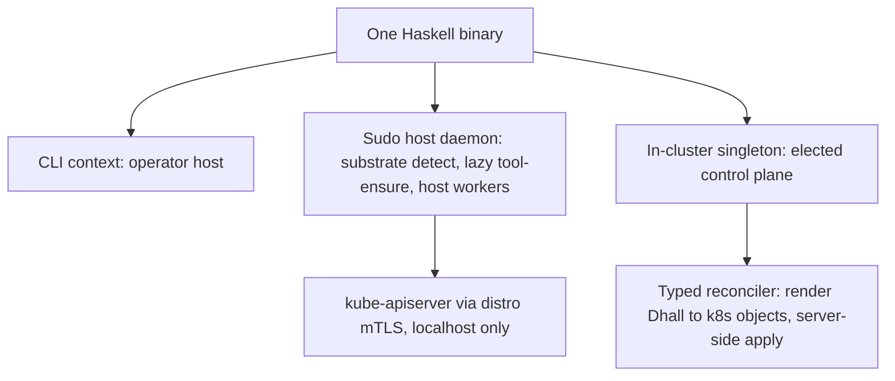

# Amoebius Overview

**Status**: Authoritative source
**Supersedes**: N/A
**Referenced by**: README.md, development_plan_standards.md, later_phases.md, phase_00_documentation_suite.md, phase_02_platform_services_storage_vault.md, phase_03_dsl_control_plane_singleton.md, phase_05_determinism_infernix.md, phase_07_host_compute_daemons.md, phase_08_mattandjames_app_logic.md, phase_09_multicluster_spawn_georeplication.md, phase_11_test_topology_dsl.md, phase_12_spa_composition.md, system_components.md
**Generated sections**: none

> **Purpose**: The target-architecture / vision / current-baseline narrative — the "why and what" companion
> to [README.md](README.md)'s "where and when" — for the everything-orchestrator amoebius is becoming.

This document explains *what amoebius is and why it is shaped that way*. It does not track status, order, or
remaining work — that is [README.md](README.md)'s job, and per
[development_plan_standards.md §K](development_plan_standards.md) status lives **only** in the plan tracker.
The doctrine under [`../documents/engineering/`](../documents/engineering/README.md) owns the normative
detail of each subsystem; this overview summarizes and links, and **never restates** doctrine content
(documentation_standards §5). This document is the target-architecture companion to that grand, non-binding
vision; the plan is its binding, executable decomposition.

> **Greenfield, read this first.** Nothing is implemented. Only the Phase 0 documentation suite exists; there
> is no `src/` yet. Every phase and sprint is 📋 Planned and **every prescriptive sentence below is design
> intent, not a tested result.** Where this overview leans on the sibling `prodbox` project, that is cited as
> *evidence* that a shape works — never as amoebius proof.

---

## 1. The everything-orchestrator shape: one binary, three contexts

Amoebius is a single Haskell binary that runs in three contexts from the same build artifact:

1. a **CLI** on the operator's host,
2. a **sudo-capable host daemon** that owns substrate detection, lazy tool-ensure, and host-level worker
   subprocesses, and
3. an **in-cluster singleton** — exactly one elected pod with total authority over its cluster and its
   secrets.

There is no second binary, no sidecar fleet, no shell glue: context is a runtime fact, and *role* (control
plane vs. worker) is orthogonal to context. This is the doctrine of
[`daemon_topology_doctrine.md` §1 — One binary, three contexts](../documents/engineering/daemon_topology_doctrine.md#1-one-binary-three-contexts).
The cluster authority is a single elected leader, reconciled with the HA-always rule, per
[`daemon_topology_doctrine.md` §3 — The control-plane singleton, exactly one, elected](../documents/engineering/daemon_topology_doctrine.md#3-the-control-plane-singleton--exactly-one-elected):
"exactly one pod" is a leadership election over a process that is itself HA-deployed, not a single point of
failure.

The host daemon reaches the cluster only over localhost-restricted channels (kube-apiserver via the distro's
own mTLS, and Pulsar/MinIO over host-only NodePorts), never the public ingress path — see
[`host_cluster_comms_doctrine.md` §1 — The whole surface: two channels, both localhost-only](../documents/engineering/host_cluster_comms_doctrine.md#1-the-whole-surface-two-channels-both-localhost-only).

## 2. The constituent projects: libraries and behaviours unified under the DSL

The projects amoebius absorbs are **not separate products**. They become libraries and behaviours of the one
binary, tied together by the Dhall DSL so that an operator configures distro, replica count, and inference
substrate from a single `.dhall` with zero application change:

| Project | Becomes | Role under the DSL |
|---------|---------|--------------------|
| **prodbox** | root control-plane behaviour | the single-node root cluster: password-encrypted Vault unseal, PKI trust anchor, the human-gated init — see [`vault_pki_doctrine.md` §5 — The root cluster: single-node, password-encrypted unseal](../documents/engineering/vault_pki_doctrine.md#5-the-root-cluster-single-node-password-encrypted-unseal) |
| **infernix** + **jitML** | ML extension libraries | shared inference/training libraries whose hardware substrate is a *deployment rule*, not app code — [`app_vs_deployment_doctrine.md` §7 — infernix is a shared library; the inference substrate is a deployment rule](../documents/engineering/app_vs_deployment_doctrine.md#7-infernix-is-a-shared-library-the-inference-substrate-is-a-deployment-rule); jitML is the seed of the forward-looking Haskell extension DSL noted in [`dsl_doctrine.md` §8](../documents/engineering/dsl_doctrine.md#8-the-haskell-extension-dsl-forward-pointer-only) |
| **hostbootstrap** | bootstrap + DSL-`chain` core | the substrate-specific `bootstrap.sh` (ensure toolchain, build binary, hand off) plus the `dsl-step`/`chain` kernel — [`substrate_doctrine.md` §6 — The `bootstrap.sh` contract](../documents/engineering/substrate_doctrine.md#6-the-bootstrapsh-contract-ensure-a-toolchain-build-the-binary-hand-off) |
| **mattandjames** | application logic only | the proof case: boil an app down to logic, let the deployment-rules DSL drive distro/replicas/inference — [`app_vs_deployment_doctrine.md` §6 — The proof case: mattandjames boiled to application-logic-only](../documents/engineering/app_vs_deployment_doctrine.md#6-the-proof-case-mattandjames-boiled-to-application-logic-only) |

The unifying surface is the Dhall DSL: Dhall carries parameters, Haskell carries logic, and an app names
*capabilities* (ObjectStore, Sql, MessageBus, …) rather than products — see
[`service_capability_doctrine.md` §1 — Why capabilities, not products](../documents/engineering/service_capability_doctrine.md#1-why-capabilities-not-products)
and [`service_capability_doctrine.md` §2 — The capability set](../documents/engineering/service_capability_doctrine.md#2-the-capability-set).

## 3. The hard constraints (cross-cutting invariants)

These are the README "Cross-cutting invariants" — documented in Phase 0, upheld by every later phase. Each is
owned by exactly one doctrine SSoT; the overview only names and links them.

| Invariant | Owning doctrine (cited by name) |
|-----------|----------------------------------|
| **No environment variables, ever — including `PATH`.** Host tools are discovered lazily via the substrate package manager and invoked by full path. | [`substrate_doctrine.md` §3 — The no-environment / no-`PATH` lazy tool-ensure contract](../documents/engineering/substrate_doctrine.md#3-the-no-environment--no-path-lazy-tool-ensure-contract) |
| **Illegal/unsafe cluster state is unrepresentable in Dhall** (PVC↔PV, gateway, DNS, certs, taints/affinity, NetworkPolicy, insecure ingress). | [`dsl_doctrine.md` §5 — The illegal-state-unrepresentable contract](../documents/engineering/dsl_doctrine.md#5-the-illegal-state-unrepresentable-contract); the enumerated catalog in [`illegal_state_catalog.md` §1 — The promise: illegal states fail to type-check](../documents/engineering/illegal_state_catalog.md#1-the-promise-illegal-states-fail-to-type-check) |
| **Application logic and deployment rules are separate DSL surfaces** — write the app once; HA, chaos, geo-replication, and failover are an orthogonal layer. | [`app_vs_deployment_doctrine.md` §1 — Two surfaces, one app written once](../documents/engineering/app_vs_deployment_doctrine.md#1-two-surfaces-one-app-written-once) |
| **Secrets never live in Dhall — only names.** Parents inject secrets directly into a child's Vault. | [`dsl_doctrine.md` §6 — Secrets are names, never values](../documents/engineering/dsl_doctrine.md#6-secrets-are-names-never-values); [`vault_pki_doctrine.md` §3 — The SecretRef contract: a name, never a value](../documents/engineering/vault_pki_doctrine.md#3-the-secretref-contract-a-name-never-a-value) |
| **Standard platform services on every cluster, HA always** — the chart is HA even at `replicas=1`. | [`platform_services_doctrine.md` §2 — HA always, including `replicas=1`](../documents/engineering/platform_services_doctrine.md#2-ha-always--including-replicas1) |
| **Only `no-provisioner` retained PVs** (`<ns>/<sts>/pv_<n>`, sized, host/EBS-bound); clusters are ephemeral, storage is not. | [`storage_lifecycle_doctrine.md` §2 — One storage class, and it provisions nothing](../documents/engineering/storage_lifecycle_doctrine.md#2-one-storage-class-and-it-provisions-nothing); the land-vs-cattle framing in [`storage_lifecycle_doctrine.md` §1](../documents/engineering/storage_lifecycle_doctrine.md#1-the-one-idea-clusters-are-cattle-storage-is-land) |
| **Every container declares CPU and RAM.** | [`platform_services_doctrine.md` §10 — Every container declares CPU and RAM](../documents/engineering/platform_services_doctrine.md#10-every-container-declares-cpu-and-ram) |
| **Keycloak owns all wild ingress** via the LB + Gateway API; the sole exception is host-origin, localhost-only traffic. | [`platform_services_doctrine.md` §9 — The LoadBalancer and the single wild-ingress path](../documents/engineering/platform_services_doctrine.md#9-the-loadbalancer-and-the-single-wild-ingress-path); the host-only carve-out in [`host_cluster_comms_doctrine.md` §1](../documents/engineering/host_cluster_comms_doctrine.md#1-the-whole-surface-two-channels-both-localhost-only) |
| **No Helm, no third-party charts** — every k8s object is rendered from pure typed Haskell and applied by the typed reconciler. | [`manifest_generation_doctrine.md` §1 — Why this doctrine exists: types render manifests, Helm does not](../documents/engineering/manifest_generation_doctrine.md#1-why-this-doctrine-exists-types-render-manifests-helm-does-not) |
| **Baked binaries + the `distribution` registry** — every third-party service binary is baked into the multi-arch base container; in-cluster pulls only, no public-registry fetches. | [`image_build_doctrine.md` §2 — The single distribution rule: bake the binaries, build the amoebius image, pull only in-cluster](../documents/engineering/image_build_doctrine.md#2-the-single-distribution-rule-bake-the-binaries-build-the-amoebius-image-pull-only-in-cluster) |

The standard service set behind these capabilities — Registry (`distribution`) · MinIO · Vault · Pulsar ·
Prometheus/Grafana · Percona/Patroni Postgres + pgAdmin · Envoy/Gateway-API · Keycloak · LoadBalancer — is
inventoried in [system_components.md](system_components.md) and owned by
[`platform_services_doctrine.md`](../documents/engineering/platform_services_doctrine.md).

## 4. The canonical validation gates (one line per phase)

Each phase ends in a single, checkable acceptance gate on **at most one** substrate (the one-substrate
discipline, [development_plan_standards.md §L](development_plan_standards.md)). The authoritative gate text
and status live in [README.md](README.md); the line below names the gate and links the phase document. All
are 📋 Planned (greenfield).

- **Phase 0 — Documentation suite** (`none`) → [phase_00_documentation_suite.md](phase_00_documentation_suite.md): the documentation lint passes — valid headers, SSoT/no-duplication holds, no orphan cross-links.
- **Phase 1 — Bootstrap + kernel + single kind cluster** (`linux-cpu`) → [phase_01_bootstrap_kernel_kind.md](phase_01_bootstrap_kernel_kind.md): `amoebius bootstrap` brings up an empty cluster; re-running is a no-op.
- **Phase 2 — Platform services + retained storage + root Vault/PKI** (`linux-cpu`) → [phase_02_platform_services_storage_vault.md](phase_02_platform_services_storage_vault.md): all standard services up from generated manifests + baked binaries, HA, reachable, ingress only via Keycloak; storage rebinds across delete+recreate with no data loss.
- **Phase 3 — Orchestration Dhall DSL + control-plane singleton** (`linux-cpu`) → [phase_03_dsl_control_plane_singleton.md](phase_03_dsl_control_plane_singleton.md): a `.dhall` deploys the platform + a trivial app, and a deliberately-illegal `.dhall` fails to type-check.
- **Phase 4 — Native Pulsar client + content-addressed store + workflow-runtime** (`linux-cpu`) → [phase_04_pulsar_content_store_workflow.md](phase_04_pulsar_content_store_workflow.md): round-trip a workflow over native Pulsar, store/fetch a content-addressed artifact, and a worker daemon fails over when killed.
- **Phase 5 — Determinism kernel + infernix migration** (`linux-cpu`) → [phase_05_determinism_infernix.md](phase_05_determinism_infernix.md): an infernix CPU-inference workflow is reproducible — same `experimentHash` ⇒ same output.
- **Phase 6 — jitML migration + HA coordinator** (`linux-cuda`) → [phase_06_jitml_ha_coordinator.md](phase_06_jitml_ha_coordinator.md): a jitML training run is bit-deterministic per its contract, and the coordinator fails over.
- **Phase 7 — Host compute daemons (Apple Metal / Windows CUDA)** (`apple`) → [phase_07_host_compute_daemons.md](phase_07_host_compute_daemons.md): an Apple-Silicon host daemon runs a Metal ML workload as a cluster Pulsar/MinIO peer.
- **Phase 8 — mattandjames as application-logic-only** (`linux-cpu`) → [phase_08_mattandjames_app_logic.md](phase_08_mattandjames_app_logic.md): mattandjames deploys from one app `.dhall` at a configurable replica count, with inference via infernix.
- **Phase 9 — Multi-cluster: amoebic spawning + geo-replication + failover** (`linux-cpu`) → [phase_09_multicluster_spawn_georeplication.md](phase_09_multicluster_spawn_georeplication.md): two children geo-replicate; killing the lead triggers DNS failover with measured loss ≤ the declared budget; the proof artifacts are green.
- **Phase 10 — Provider-managed clusters + dynamic provisioning** (`linux-cpu → provider`) → [phase_10_provider_clusters_provisioning.md](phase_10_provider_clusters_provisioning.md): spin a provider cluster, dynamically provision a node, and tear down leak-free.
- **Phase 11 — Test-topology DSL + suggest-test + storage-lifecycle safety** (`per generated test`) → [phase_11_test_topology_dsl.md](phase_11_test_topology_dsl.md): a generated test `.dhall` runs a failover/election simulation and tears down leak-free.
- **Phase 12 — SPA composition** (`linux-cpu`) → [phase_12_spa_composition.md](phase_12_spa_composition.md): an SPA `.dhall` composes a multi-service app + an ML workflow, deployed and reachable.
- **Phases 13+ — Later phases** (`varies`) → [later_phases.md](later_phases.md): each high-numbered in-scope phase (GHC 9.14.1 bump, schema-migration automation, the Haskell extension DSL + AST checker + native JIT, niche substrates) gets its own gate when reached.

The substrate per gate is registered authoritatively in [substrates.md](substrates.md); the per-phase gate
ideally *is* an `amoebius.dhall` that spins resources up, runs a workflow, and tears them down — the
self-tearing-down test topology of [`testing_doctrine.md`](../documents/engineering/testing_doctrine.md).

## 5. Current baseline — GREENFIELD

- **Implemented:** nothing. There is no `src/` tree; the planned module layout lives only in
  [system_components.md](system_components.md) as intended paths, not built code.
- **Authored:** the Phase 0 documentation suite — the full DSL specification and every doctrine indexed in
  [`../documents/engineering/README.md`](../documents/engineering/README.md), plus this
  `DEVELOPMENT_PLAN/` tracker. Phase 0's gate (documentation lint) is the only gate currently in play.
- **Status posture:** every phase and sprint is 📋 Planned; nothing is 🔄 Active, ✅ Done, or
  🧪 Live-proof-pending. Per [development_plan_standards.md §K](development_plan_standards.md), a sprint is
  never marked Done on "it compiles," and a gate is passed only when its acceptance test actually ran on its
  substrate.
- **Toolchain pin:** GHC **9.12.4**, Cabal 3.16.1.0, one shared pin across all packages.
  (GHC 9.14.1 is a deferred later-phase bump.)
- **Evidence vs. proof:** the sibling `prodbox` project is cited throughout the doctrine as a working
  precedent for the root control-plane behaviour, the AWS/Pulumi reality, the ZeroSSL/route53 path, and the
  chaos-hardening ledger. Those are *evidence the shape works*, never amoebius results — amoebius has run
  none of it yet.

---

## Related Documents
- [README.md](README.md) — the live tracker: phase order, status, gates, and remaining work (the "where/when" to this "why/what")
- [development_plan_standards.md](development_plan_standards.md) — the rulebook this document obeys (§A header, §H citation rule, §K honesty, §L one-substrate)
- [system_components.md](system_components.md) — the target component inventory: surface → owning doctrine → planned module path
- [substrates.md](substrates.md) — the substrate registry and per-phase substrate map
- [legacy_tracking_for_deletion.md](legacy_tracking_for_deletion.md) — the migration-removal ledger as prodbox/infernix/jitML/mattandjames converge
- [later_phases.md](later_phases.md) — the in-scope, high-numbered phases not yet given their own document
- [Engineering Doctrine Index](../documents/engineering/README.md) — the doctrine SSoTs this overview summarizes and links
- [Documentation Standards](../documents/documentation_standards.md) — the header/link mechanics this inherits
