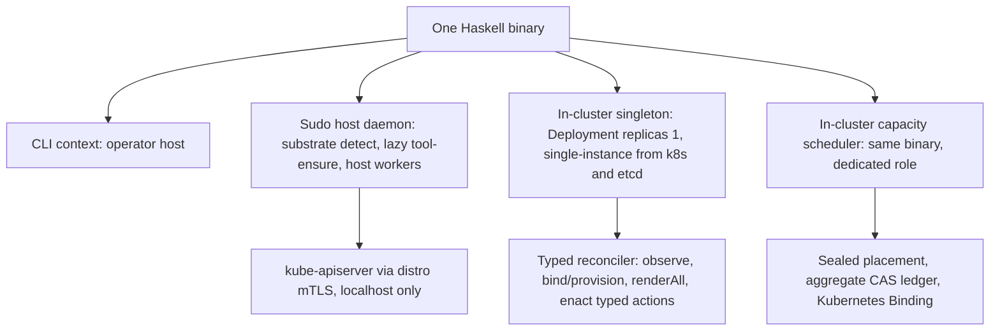

# Amoebius Overview

**Status**: Authoritative source
**Supersedes**: N/A
**Referenced by**: DEVELOPMENT_PLAN/README.md, DEVELOPMENT_PLAN/development_plan_standards.md, DEVELOPMENT_PLAN/later_phases.md, DEVELOPMENT_PLAN/phase_00_documentation_suite.md, DEVELOPMENT_PLAN/phase_01_toolchain_spike.md, DEVELOPMENT_PLAN/phase_02_formal_model_kernel.md, DEVELOPMENT_PLAN/phase_03_gateway_migration_model.md, DEVELOPMENT_PLAN/phase_04_dhall_gate1_schema.md, DEVELOPMENT_PLAN/phase_05_gadt_decoder_gate2.md, DEVELOPMENT_PLAN/phase_06_illegal_state_corpus.md, DEVELOPMENT_PLAN/phase_07_capacity_core_folds.md, DEVELOPMENT_PLAN/phase_08_storage_geometry_folds.md, DEVELOPMENT_PLAN/phase_09_execution_accelerator_folds.md, DEVELOPMENT_PLAN/phase_10_capability_bind.md, DEVELOPMENT_PLAN/phase_11_provision_seal.md, DEVELOPMENT_PLAN/phase_12_inference_accelerator_provision.md, DEVELOPMENT_PLAN/phase_13_render_manifest_goldens.md, DEVELOPMENT_PLAN/phase_14_chain_kernel_boundary.md, DEVELOPMENT_PLAN/phase_15_deterministic_sim_substrate.md, DEVELOPMENT_PLAN/phase_16_spa_composition_representational.md, DEVELOPMENT_PLAN/phase_17_midwife_bootstrap_kind.md, DEVELOPMENT_PLAN/phase_18_base_image_registry.md, DEVELOPMENT_PLAN/phase_19_object_reconciler.md, DEVELOPMENT_PLAN/phase_20_capacity_scheduler.md, DEVELOPMENT_PLAN/phase_21_retained_storage.md, DEVELOPMENT_PLAN/phase_22_vault_pki.md, DEVELOPMENT_PLAN/phase_23_platform_backbone.md, DEVELOPMENT_PLAN/phase_24_platform_services_2.md, DEVELOPMENT_PLAN/phase_25_keycloak_ingress.md, DEVELOPMENT_PLAN/phase_26_live_dsl_singleton.md, DEVELOPMENT_PLAN/phase_27_app_tenancy.md, DEVELOPMENT_PLAN/phase_28_pulsar_client.md, DEVELOPMENT_PLAN/phase_29_content_store_workflow.md, DEVELOPMENT_PLAN/phase_30_release_lifecycle.md, DEVELOPMENT_PLAN/phase_31_network_fabric_wireguard.md, DEVELOPMENT_PLAN/phase_32_multicluster_spawn_georepl.md, DEVELOPMENT_PLAN/phase_33_gateway_migration_drills.md, DEVELOPMENT_PLAN/phase_34_provider_deploy_checkpoint.md, DEVELOPMENT_PLAN/phase_35_provider_child_bringup.md, DEVELOPMENT_PLAN/phase_36_provider_ebs_credential.md, DEVELOPMENT_PLAN/phase_37_provider_dynamic_nodes.md, DEVELOPMENT_PLAN/phase_38_determinism_jitcache.md, DEVELOPMENT_PLAN/phase_39_infernix_lift.md, DEVELOPMENT_PLAN/phase_40_jitml_lift_cuda.md, DEVELOPMENT_PLAN/phase_41_apple_metal_host_daemon.md, DEVELOPMENT_PLAN/phase_42_test_topology_dsl.md, DEVELOPMENT_PLAN/phase_43_spa_live_deploy.md, DEVELOPMENT_PLAN/system_components.md
**Generated sections**: none

> **Purpose**: The target-architecture / vision / current-baseline narrative — the "why and what" companion
> to [README.md](README.md)'s "where and when" — for the everything-orchestrator amoebius is becoming.

This document explains *what amoebius is and why it is shaped that way*. It does not track status, order, or
remaining work — that is [README.md](README.md)'s job, and per
[development_plan_standards.md §K](development_plan_standards.md#k-honesty-proven--tested--assumed) status lives **only** in the plan tracker.
The doctrine under [`../documents/engineering/`](../documents/engineering/README.md) owns the normative
detail of each subsystem; this overview summarizes and links, and **never restates** doctrine content
([documentation_standards.md §5](../documents/documentation_standards.md#5-duplication-rules)). This document is the target-architecture companion to that grand, non-binding
vision; the plan is its binding, executable decomposition.

> **Greenfield, read this first.** Nothing is implemented. Only the Phase 0 documentation suite exists; there
> is no `src/` yet. Every phase and sprint is 📋 Planned and **every prescriptive sentence below is design
> intent, not a tested result.** Where this overview leans on the sibling `prodbox` project, that is cited as
> *evidence* that a shape works — never as amoebius proof.

---

## 1. The everything-orchestrator shape: one binary, three contexts

Amoebius is a single Haskell binary that runs in three contexts from the same build artifact:

1. a **CLI** on the operator's host,
2. a **sudo-capable host daemon** that owns substrate detection, lazy tool-ensure, and host-level worker
   subprocesses, and
3. an **in-cluster control-plane singleton** — a Kubernetes Deployment `replicas=1` with total authority over
   its cluster and its secrets, whose single-writer authority is enforced by a mandatory Kubernetes `Lease`,
   plus separately provisioned in-cluster worker and capacity-scheduler roles from the same executable.

There is no second binary, no sidecar fleet, no shell glue: context is a runtime fact, and *role* (control
plane vs. worker) is orthogonal to context. This is the doctrine of
[`daemon_topology_doctrine.md` §1 — One binary, three contexts](../documents/engineering/daemon_topology_doctrine.md#1-one-binary-three-contexts).
The cluster authority is one Deployment-`replicas=1` pod, reconciled with the HA-always rule, per
[`daemon_topology_doctrine.md` §3 — The control-plane singleton](../documents/engineering/daemon_topology_doctrine.md#3-the-control-plane-singleton):
"one desired pod" is a Deployment property, while the mandatory k8s/etcd `Lease` supplies at-most-one-writer
authority across termination/replacement overlap; this is **not** an amoebius election. The pod is stateless —
no PVC; its durable state is the Vault-enveloped MinIO bucket. A distinct `amoebius-capacity` scheduler
Deployment runs the same Haskell binary in its scheduler role, consumes only its named Pending Pods, performs
the sealed placement/root-ledger CAS/Binding protocol, and holds no singleton or secret authority.

The host daemon reaches the cluster only over localhost-restricted channels (kube-apiserver via the distro's
own mTLS, and Pulsar/MinIO over host-only NodePorts), never the public ingress path — see
[`host_cluster_comms_doctrine.md` §1 — The whole surface: two channels, both localhost-only](../documents/engineering/host_cluster_comms_doctrine.md#1-the-host-origin-surface-two-channels-both-localhost-only).

## 2. The constituent projects: libraries and behaviours unified under the DSL

The projects amoebius absorbs are **not separate products**. They become libraries and behaviours of the one
binary, tied together by the Dhall DSL so that an operator configures distro, replica count, and inference
substrate from a single `.dhall` with zero application change:

| Project | Becomes | Role under the DSL |
|---------|---------|--------------------|
| **prodbox** | root control-plane behaviour | the single-node root cluster: password-encrypted Vault unseal, PKI trust anchor, the human-gated init — see [`vault_pki_doctrine.md` §5 — The root cluster: single-node, password-encrypted unseal](../documents/engineering/vault_pki_doctrine.md#5-the-root-cluster-single-node-password-encrypted-unseal) |
| **infernix** + **jitML** | ML extension libraries | shared inference/training libraries whose hardware substrate is a *deployment rule*, not app code — [`app_vs_deployment_doctrine.md` §7 — infernix is a shared library; the inference substrate is a deployment rule](../documents/engineering/app_vs_deployment_doctrine.md#7-infernix-is-a-shared-library-the-inference-substrate-is-a-deployment-rule); jitML is the seed of the forward-looking Haskell extension DSL noted in [`dsl_doctrine.md` §8](../documents/engineering/dsl_doctrine.md#8-the-haskell-extension-dsl-forward-pointer-only) |
| **hostbootstrap** | bootstrap + DSL-`chain` core | the Python `pb` **midwife** CLI (ensure toolchain, build binary, hand off) plus the `dsl-step`/`chain` kernel — [`substrate_doctrine.md` §6 — The midwife contract](../documents/engineering/substrate_doctrine.md#6-the-midwife-contract-a-python-cli-ensures-a-toolchain-builds-the-binary-hands-off) |

Each of **infernix** and **jitML** additionally ships a **demo single-page web app** in its sibling repo that
illustrates its ML workflow and renders its results. Those demo web apps are amoebius's
**application-logic-only demonstrator** — the proof case that an app is written once as logic while HA replica
count, substrate, and inference binding are an orthogonal deployment-rules surface — and the SPA-composition
shakedown fixtures. A demo web app *uses* an extension but is not itself one — see
[`app_vs_deployment_doctrine.md` §6 — The proof case: a demo web app as application-logic-only](../documents/engineering/app_vs_deployment_doctrine.md#6-the-proof-case-a-demo-web-app-as-application-logic-only).

The unifying surface is the Dhall DSL: Dhall carries parameters, Haskell carries logic, and an app names
*capabilities* (ObjectStore, Sql, MessageBus, …) rather than products — see
[`service_capability_doctrine.md` §1 — Why capabilities, not products](../documents/engineering/service_capability_doctrine.md#1-why-capabilities-not-products)
and [`service_capability_doctrine.md` §2 — The capability set](../documents/engineering/service_capability_doctrine.md#2-the-capability-set).

**Convergence stance.** The sibling projects are **frozen typed evidence** that a shape works, not lockstep
peers to track: amoebius lifts each sibling's *role* onto its own seams and reimplements nothing
([`lift_and_compose_doctrine.md`](../documents/engineering/lift_and_compose_doctrine.md)), while what stops being
carried forward is the [`legacy_tracking_for_deletion.md`](legacy_tracking_for_deletion.md) ledger. infernix and
jitML join as the **closed `ExtensionSpec` set** linked onto the amoebius base — never a migration through
hostbootstrap first — with their engines jit-resolved into a bounded content-addressed cache rather than baked
([`capability_extension_doctrine.md`](../documents/engineering/capability_extension_doctrine.md),
[`content_addressing_doctrine.md` §4.5](../documents/engineering/content_addressing_doctrine.md#45-the-ml-asset-lifecycle-one-bounded-content-addressed-cache-resolved-on-first-miss)).

## 3. The hard constraints (cross-cutting invariants)

These are the README "Cross-cutting invariants" — documented in Phase 0, upheld by every later phase. Each is
owned by exactly one doctrine SSoT; the overview only names and links them.

| Invariant | Owning doctrine (cited by name) |
|-----------|----------------------------------|
| **No environment variables, ever — including `PATH`.** Host tools are discovered lazily via the substrate package manager and invoked by full path. | [`substrate_doctrine.md` §3 — The no-environment / no-`PATH` lazy tool-ensure contract](../documents/engineering/substrate_doctrine.md#3-the-no-environment--no-path-lazy-tool-ensure-contract) |
| **Illegal/unsafe state is foreclosed before effects at its honest layer** — closed illegal shapes are unrepresentable at Gate 1/Gate 2; constructible value and target failures are rejected by total decode/provision checks; only opaque `ProvisionedSpec` can reach `renderAll`. | [`dsl_doctrine.md` §5 — The illegal-state-unrepresentable contract](../documents/engineering/dsl_doctrine.md#5-the-illegal-state-unrepresentable-contract); the enumerated catalog in [`illegal_state_catalog.md` §1 — Illegal states fail to type-check](../documents/illegal_state/illegal_state_catalog.md#1-illegal-states-fail-to-type-check) |
| **Every resource provision is explicit in the pure model, and an unprovisionable pairing has no deployable representation** — CPU/memory; pod/CNI/CSI slots; mapped/API/etcd state; logical+physical pod/image/cache storage; durable/object/database/migration storage; controller/gateway/build/Pulumi/copy/schema execution; provider quotas; and accelerator devices/net VRAM are checked before render. CUDA-on-CPU-only, one-short admission/executor, or raw-VRAM-fits/net-fails cannot produce the opaque `ProvisionedSpec` required by apply. | [`resource_capacity_doctrine.md`](../documents/engineering/resource_capacity_doctrine.md); catalog [`§3.17`](../documents/illegal_state/illegal_state_capacity.md#317-an-over-committed-deploy-or-workload-host--vm--cluster-capacity-exceeded), [`§3.27`](../documents/illegal_state/illegal_state_capacity.md#327-a-deployment-that-fits-in-aggregate-but-has-no-resource-capable-placement), and [`§3.30`](../documents/illegal_state/illegal_state_capacity.md#330-an-accelerator-memory-envelope-that-cannot-fit-the-selected-devices-or-unified-memory-pool) |
| **No unbounded storage** — host-bounded or cloud-quota-bounded; kubelet/mapped/API/etcd, OCI, build/engine/fabric, registry/Pulumi/release/control-state, ZooKeeper/Patroni/Vault/TSDB, and MinIO/Pulsar transition/recovery/in-flight/orphan peaks have structural typed sources, attached budgets, and finite owners; every topic has bounded retention + size-triggered offload. | [`resource_capacity_doctrine.md`](../documents/engineering/resource_capacity_doctrine.md); [`storage_lifecycle_doctrine.md` §5.2](../documents/engineering/storage_lifecycle_doctrine.md#52-the-storage-backing-is-bounded--the-closed-storagebacking-union); [`pulsar_client_doctrine.md` §6.1](../documents/engineering/pulsar_client_doctrine.md#61-topic-storage-lifecycle-bounded-tiered-retained--and-the-hot-tier-never-overflows) |
| **Compute engine matches its substrate; topology matches its hosts** — rke2/kind need a Linux host (a VM on apple/windows), multi-node kind is one host, multi-node rke2 is one Linux host per node, EKS is first-class; multi-substrate clusters are allowed. | [`cluster_topology_doctrine.md`](../documents/engineering/cluster_topology_doctrine.md); catalog [`§3.13`–`§3.16`](../documents/illegal_state/illegal_state_catalog.md#3-the-catalog--states-a-valid-spec-cannot-represent) |
| **Dynamic provisioning is amoebius-owned and typed** — capacity grows only through a quota-capped `ScalingPolicy` (capacity-based + instance price-shopping), never a bare "unbounded." | [`resource_capacity_doctrine.md`](../documents/engineering/resource_capacity_doctrine.md); [`cluster_lifecycle_doctrine.md` §8](../documents/engineering/cluster_lifecycle_doctrine.md#8-dynamic-node-provisioning) |
| **Pulsar payloads are exclusively CBOR** (canonical where content-addressed) — a typed codec; a non-CBOR application body (JSON/base64/protobuf/raw) is unrepresentable; protocol framing stays protobuf. | [`pulsar_client_doctrine.md` §3.1](../documents/engineering/pulsar_client_doctrine.md#31-payloads-are-exclusively-cbor); catalog [`§3.23`](../documents/illegal_state/illegal_state_catalog.md#3-the-catalog--states-a-valid-spec-cannot-represent) |
| **Application logic and deployment rules are separate DSL surfaces** — write the app once; HA, chaos, geo-replication, and failover are an orthogonal layer. | [`app_vs_deployment_doctrine.md` §1 — Two surfaces, one app written once](../documents/engineering/app_vs_deployment_doctrine.md#1-two-surfaces-one-app-written-once) |
| **Secrets never live in Dhall — only names.** Parents inject secrets directly into a child's Vault. | [`dsl_doctrine.md` §6 — Secrets are names, never values](../documents/engineering/dsl_doctrine.md#6-secrets-are-names-never-values); [`vault_pki_doctrine.md` §3 — The SecretRef contract: a name, never a value](../documents/engineering/vault_pki_doctrine.md#3-the-secretref-contract-a-name-never-a-value) |
| **Standard platform services on every cluster, HA always** — the chart is HA even at `replicas=1`. | [`platform_services_doctrine.md` §2 — HA always, including `replicas=1`](../documents/engineering/platform_services_doctrine.md#2-ha-always--including-replicas1) |
| **Only `no-provisioner` retained PVs** (`<ns>/<sts>/pv_<n>`, sized, host/EBS-bound); cluster infrastructure is replaceable rather than TTL-bound, while durable backing has an independent lifetime. | [`cluster_lifecycle_doctrine.md` §4](../documents/engineering/cluster_lifecycle_doctrine.md#4-the-root-inforcespec-is-the-persistent-contract) and [`§7`](../documents/engineering/cluster_lifecycle_doctrine.md#7-ephemeral-spin-updown-with-deterministic-rebind); [`storage_lifecycle_doctrine.md` §1](../documents/engineering/storage_lifecycle_doctrine.md#1-cluster-and-storage-have-independent-lifetimes) and [`§2`](../documents/engineering/storage_lifecycle_doctrine.md#2-one-storage-class-and-it-provisions-nothing) |
| **Every execution unit declares its complete resource envelope.** Every rendered container, controller child, webhook/gateway, build/Pulumi/copy/schema/ACME Job, host worker, and static engine process has explicit CPU/memory and relevant storage/rollout bounds; pod cache/scratch/mapped files are nested in ephemeral or memory accounting, while durable/native-cache/accelerator provisions remain separately owned. | [`platform_services_doctrine.md` §10](../documents/engineering/platform_services_doctrine.md#10-every-execution-unit-declares-its-complete-resource-envelope); [`resource_capacity_doctrine.md` §3](../documents/engineering/resource_capacity_doctrine.md#3-the-types-quantity-capacity-demand-budget) |
| **Keycloak owns all wild ingress** via the LB + Gateway API; the sole exception is host-origin, localhost-only traffic. | [`platform_services_doctrine.md` §9 — The LoadBalancer and the single wild-ingress path](../documents/engineering/platform_services_doctrine.md#9-the-loadbalancer-and-the-single-wild-ingress-path); the host-only carve-out in [`host_cluster_comms_doctrine.md` §1](../documents/engineering/host_cluster_comms_doctrine.md#1-the-host-origin-surface-two-channels-both-localhost-only) |
| **No Helm, no third-party charts** — every k8s object comes from the sole public whole-deployment `renderAll :: ProvisionedSpec -> [K8sObject]`; private service/global projections first seal one identity-keyed source set, and live mutation proceeds through activation-gated typed actions. | [`manifest_generation_doctrine.md` §1 — Why this doctrine exists: types render manifests, Helm does not](../documents/engineering/manifest_generation_doctrine.md#1-why-this-doctrine-exists-types-render-manifests-helm-does-not) |
| **Baked service binaries + the `distribution` registry** — every third-party *service* binary is baked into the multi-arch base container (in-cluster pulls only); the ML **engine payloads** are the exception — jit-resolved into a `CacheBudget`-bounded cache, never baked or URL-fetched. | [`image_build_doctrine.md` §2](../documents/engineering/image_build_doctrine.md#2-the-single-distribution-rule-bake-the-binaries-build-the-amoebius-image-pull-only-in-cluster); [`content_addressing_doctrine.md` §4.5](../documents/engineering/content_addressing_doctrine.md#45-the-ml-asset-lifecycle-one-bounded-content-addressed-cache-resolved-on-first-miss) |
| **Generated artifacts are never committed** — manifests, the emitted `.tla`/`.cfg`, the reflected Dhall schema, and PureScript contracts are rendered from Haskell source and not committed. | [`generated_artifacts_doctrine.md`](../documents/engineering/generated_artifacts_doctrine.md) |
| **The one formal obligation is the cross-cluster gateway migration** (both `Planned` and `Failover` branches), modelled as data, **safety + liveness-under-fairness** proven (TLC) and simulated (io-sim) once; its runtime fidelity is bridged by deterministic simulation + trace validation before live; intra-cluster consensus is delegated, not re-proven. | [`gateway_migration_model_doctrine.md`](../documents/engineering/gateway_migration_model_doctrine.md); [`formal_model_doctrine.md`](../documents/engineering/formal_model_doctrine.md); [`deterministic_simulation_doctrine.md`](../documents/engineering/deterministic_simulation_doctrine.md) |
| **A test generates the enumeration, authors the expectation** — the spec generates the *enumeration* of surfaces requiring coverage; the operator authors the *expectations* asserted against them; an uncovered surface emits an UNVERIFIED `coverage` ledger row, never a silent pass. | [`testing_doctrine.md` §9 — Derivation: generated enumeration, authored expectation](../documents/engineering/testing_doctrine.md#9-derivation-generated-enumeration-authored-expectation); [`chaos_failover_doctrine.md` §11.2](../documents/engineering/chaos_failover_doctrine.md#112-the-typed-expectation-surface-expectation) |
| **Backups are write-only for amoebius; deletion/retention is out of band** — a backup names a bounded medium in a distinct failure domain, is written under a put-only credential (no delete/expire/lifecycle action is representable), is append-only/WORM where declared, and its restore **seeds a fresh coordinate, never overwrites** live bytes; a `ColdSeedFromBackup` down-primary secondary takes the gateway only after proven freshness — consistency over availability. | [`backup_recovery_doctrine.md`](../documents/engineering/backup_recovery_doctrine.md); [`storage_lifecycle_doctrine.md` §7](../documents/engineering/storage_lifecycle_doctrine.md#7-deleting-durable-data-is-forbidden-under-normal-operation); [`consistency_pacelc_doctrine.md` §3.7](../documents/engineering/consistency_pacelc_doctrine.md#37-the-cold-dr-seed-recovery-source) |

The standard service set behind these capabilities — Registry (`distribution`) · MinIO · Vault · Pulsar ·
Prometheus/Grafana · Percona/Patroni Postgres + pgAdmin · Envoy/Gateway-API · Keycloak · LoadBalancer — is
inventoried in [system_components.md](system_components.md) and owned by
[`platform_services_doctrine.md`](../documents/engineering/platform_services_doctrine.md).

## 4. The canonical validation gates (one line per phase)

Each phase ends in a single, checkable acceptance gate on **at most one** substrate (the one-substrate
discipline, [development_plan_standards.md §L](development_plan_standards.md#l-one-substrate-discipline)). The authoritative gate text
and status live in [README.md](README.md); the line below names the gate and links the phase document.
Pre-implementation, Phase 0 is 🔄 Active and every later phase is 📋 Planned (greenfield); the tracker is
authoritative.

The DSL is validated and **simulated per phase**, never as a monolithic pre-implementation: each pre-cluster
phase discharges an in-process Register-1/2 gate and each live-band phase a Register-3 gate before the next
opens, while the **Register-2.5 deterministic-simulation runs as a pre-cluster *activity*, never a phase gate**
([development_plan_standards.md §K](development_plan_standards.md#k-honesty-proven--tested--assumed)) ahead of the concurrency-bearing live
phases' Register-3 gates. Front-loading a *design* proof ahead of the phase that
builds the runtime it corresponds to is legitimate under the ledger discipline that marks correspondence and
runtime fidelity UNVERIFIED until that phase discharges them
([development_plan_standards.md §K](development_plan_standards.md#k-honesty-proven--tested--assumed),
[`deterministic_simulation_doctrine.md`](../documents/engineering/deterministic_simulation_doctrine.md)).

*Pre-cluster band (substrate `none`, Registers 1–2):*
- **Phase 0 — Documentation suite (whole DSL)** (`none`, no validation register — the `—` exception) → [phase_00](phase_00_documentation_suite.md): the documentation lint passes two-sided — headers, anchors, bidirectional Referenced-by, near-duplicate, status-consistency, gate-integrity, illegal-state catalog integrity — and fails on every committed seeded negative.
- **Phase 1 — Toolchain spike** (`none`) → [phase_01](phase_01_toolchain_spike.md): a probe of `dhall` + `io-sim`/`io-classes` + the jit-build resolver + `purescript-bridge` + the Pulsar `supernova` fork builds on the pinned GHC/Cabal, or the exact blocker is recorded with a transcript.
- **Phase 2 — Formal-model EDSL (`Model`/`interpret`/`emitTLA`)** (`none`) → [phase_02](phase_02_formal_model_kernel.md): the `Model` explorer + `emitTLA` round-trip (safety **and** a liveness `PROPERTY` under fairness); a differential generator finds no explorer/TLC safety disagreement; committed renderer mutants are caught; the `.tla` is TLC-checkable, never committed.
- **Phase 3 — Gateway-migration model (both branches)** (`none`) → [phase_03](phase_03_gateway_migration_model.md): TLC reaches every safety invariant and every liveness `PROPERTY` (under fairness) at scope for both `Planned` and `Failover` with passing vacuity / fairness-sensitivity / cutoff checks; io-sim agrees on safety; every mechanical mutant is caught.
- **Phase 4 — Dhall Gate-1 schema + smart-constructor prelude** (`none`) → [phase_04](phase_04_dhall_gate1_schema.md): `dhall type` accepts the positive corpus and rejects each Gate-1 negative at its committed expected error (no open escape arm).
- **Phase 5 — GADT-indexed IR + total decoder (Gate 2)** (`none`) → [phase_05](phase_05_gadt_decoder_gate2.md): `cabal test dsl-spec` green — each positive decodes, each Gate-2 negative returns a structured `Left` with its expected tag; the decode path is non-partial and fail-closed.
- **Phase 6 — Illegal-state corpus + validation-locus ledger** (`none`) → [phase_06](phase_06_illegal_state_corpus.md): every negative fixture is rejected at its tagged locus (Gate-1 / Gate-2 / compile-fail); QuickCheck green with coverage floors; the per-entry validation-locus ledger is emitted.
- **Phase 7 — Capacity core fold + topology relation** (`none`) → [phase_07](phase_07_capacity_core_folds.md): the `fits`/`podFits`/`carve`/`place` capacity fold and the `ComputeEngine`/`Topology` relation are provably total (compile-exhaustive + QuickCheck no-crash) and sound; each of the eleven base capacity/topology negatives returns its committed `Left` on its isolated axis and the per-fold seeded mutants turn it red.
- **Phase 8 — Logical→physical storage geometry folds** (`none`) → [phase_08](phase_08_storage_geometry_folds.md): the logical→physical storage-geometry fold holds under QuickCheck (every in-envelope producer fits its single-owner backing) and is provably total; each storage-geometry negative returns its structured `Left` on its over-backing axis, an independent envelope predicate accepts a demand iff in-envelope, and the per-geometry seeded mutants turn it red.
- **Phase 9 — Execution-epoch + scheduler + accelerator + provider-root folds** (`none`) → [phase_09](phase_09_execution_accelerator_folds.md): the composed full-resource-vector `place` witness proves every axis on the positive corpus (accepted by an independent validator that never calls `place`) and each of the eighteen execution/accelerator/provider-root/runtime-metadata negatives returns its committed `Left` on its isolated axis; provably total, and the per-fold seeded mutants turn it red.
- **Phase 10 — Capability union + representational bind** (`none`) → [phase_10](phase_10_capability_bind.md): `cabal test capability-bind-spec` green — each of the nine capability arms binds under both `SingleNode` and `Distributed` to a well-typed `BoundServiceSpec` matching its committed golden (structural-diff oracle; app-surface bytes shape-invariant); product/url/shape and unbuilt/unbound/cyclic negatives fail at Gate 1/2 and `mutant_copy_shape_tag` turns it red.
- **Phase 11 — Whole-deployment provision seal + expansion** (`none`) → [phase_11](phase_11_provision_seal.md): `cabal test provision-seal-spec` green — `planInfrastructure` derives exact demand from the expanded `BoundDeployment` and `provision` seals an opaque `ProvisionedSpec` with one equal-keyed render-source set (pre-existing proves `NoInfrastructureRequired`, creation CAS-enacts its batch); the committed insufficiency fixtures return their `Left` at the provision-seal locus and ≥1 seeded mutant turns it red.
- **Phase 12 — InferenceEngine capability + accelerator provision** (`none`) → [phase_12](phase_12_inference_accelerator_provision.md): the `legal_inference_cuda` positive binds and provisions to an opaque `ProvisionedSpec` by selecting the matching CUDA offering (epochs inside net allocatable VRAM); `illegal_cuda_on_cpu_target` returns `ProvisionError MissingCapability Cuda` with zero provisioned values, `illegal_engine_by_url` fails Gate 1, and the five accelerator-provision seeded mutants turn it red.
- **Phase 13 — Pure `renderAll` + rendered-output goldens** (`none`) → [phase_13](phase_13_render_manifest_goldens.md): `renderAll :: ProvisionedSpec -> [K8sObject]` is byte-for-byte golden-locked, total-maps Phase 10's unique identity-keyed render-source set, and projects every checked execution, slot, mapped/API/etcd, storage/migration, quota, and accelerator field; safety/resource mutants turn it red.
- **Phase 14 — chain/Step kernel + `--dry-run` + boundary fake-tool harness** (`none`) → [phase_14](phase_14_chain_kernel_boundary.md): two in-process registers pass on no substrate — (Part A/R1) `cabal test chain-spec` in a network-isolated namespace renders a byte-for-byte `--dry-run` plan whose Step manifests union to the Phase-13 `renderAll` golden with zero `stepRun` executions; (Part B/R2) `cabal test boundary-spec` runs the plan against fake `kubectl`/`docker`/`pulumi` by absolute path (the `helm` fake a zero-invocations control), recorded argv == the committed transcript and applied bytes == the goldens; the cfg/descent and argv/byte/PATH mutants turn each red.
- **Phase 15 — Deterministic-simulation substrate** (`none`) → [phase_15](phase_15_deterministic_sim_substrate.md): the real daemon/reconciler code under `IOSim`/`IOSimPOR` replays a committed fault/partition/redelivery schedule; same-seed → byte-identical trace (a distinct seed must differ); a committed fault-mutant turns the invariant red; modeled-env fidelity marked assumed.
- **Phase 16 — SPA composition (representational) + demo-SPA local** (`none`) → [phase_16](phase_16_spa_composition_representational.md): `prop_spaCompositionDecodes` holds over generated pairs (coverage floors); both PureScript demo SPAs run locally against a faked backend (Playwright), the contract from a committed golden.

*Live band (Register 3), substrate-ordered:*
- **Phase 17 — Python midwife + substrate detect + single kind cluster** (`linux-cpu`) → [phase_17](phase_17_midwife_bootstrap_kind.md): `pb bootstrap --distro=kind` admits named engine CPU/memory, pod/CNI/CSI slots, mapped/API/etcd logical+physical state, and inner/outer runtime storage, records the complete inventory, re-runs as a no-op, and teardown is leak-free.
- **Phase 18 — Multi-arch base image + jit-build resolver + distribution registry** (`linux-cpu`) → [phase_18](phase_18_base_image_registry.md): a snapshot-bound host envelope admits build CPU/memory/scratch/cache/concurrency; the explicit resource-provisioned bootstrap-registry action side-loads the image and initializes only registry/proxy objects, then an equal-digest one-time handoff transfers them into later whole-deployment ownership before atomic no-public-pull publication.
- **Phase 19 — Typed renderer + object reconciler** (`linux-cpu`) → [phase_19](phase_19_object_reconciler.md): the Phase-13 `renderAll` list is validated/indexed with source activation stages and enacted in a scratch namespace on the live `kind` cluster only through stage-eligible typed actions (never generic-SSA by list membership); a fresh inventory proves the transition fits residual capacity, a mismatch writes nothing, an immediate re-run is a byte-stable no-op, and the reconciler mutants + never-ready fixture stay red.
- **Phase 20 — amoebius-capacity scheduler + bootstrap cutover** (`linux-cpu`) → [phase_20](phase_20_capacity_scheduler.md): layered on the converged Phase-19 reconciler, the `amoebius-capacity` scheduler mints `BootstrapCapacitySchedulerReady`→`ManagedCapacityReady` and binds the guarded Pod set exclusively through CAS `Reserved`→`BindingInFlight`→Binding→`Bound`, an independent observer proving no Binding precedes a reservation CAS and each UID debited once; a pre-ready guarded workload is rejected with zero writes, re-run is a no-op, and the scheduler mutants turn it red.
- **Phase 21 — No-provisioner retained storage + lossless rebind** (`linux-cpu`) → [phase_21](phase_21_retained_storage.md): rounded retained claims and verified old+new+workspace/copy-Job migrations fit observed backing/compute, then rebind after real cluster replacement with no data loss.
- **Phase 22 — Root Vault + PKI + built-in Haskell Vault client** (`linux-cpu`) → [phase_22](phase_22_vault_pki.md): bounded Vault populations derive Raft WAL/snapshot/compaction/recovery and rotated-audit storage before init; unseal, PKI issuance, and `SecretRef` read pass fail-closed.
- **Phase 23 — Platform backbone (MetalLB + MinIO + Pulsar HA)** (`linux-cpu`) → [phase_23](phase_23_platform_backbone.md): ZooKeeper + BookKeeper recovery and six-arm MinIO geometry fit; registry source+target+Job is verified before cutover and size-triggered offload holds.
- **Phase 24 — Platform services-2 (Percona/Patroni + pgAdmin + observability + readiness-DAG)** (`linux-cpu`) → [phase_24](phase_24_platform_services_2.md): each SQL consumer provisions children/webhooks/gateway and data/WAL/recovery; monitoring derives Prometheus/proxy compute and rounded TSDB transition capacity.
- **Phase 25 — Keycloak-owned ingress** (`linux-cpu`) → [phase_25](phase_25_keycloak_ingress.md): Envoy children, Keycloak/Patroni, and ACME/Vault work provision before every wild route is restricted to Keycloak/Envoy.
- **Phase 26 — Live DSL deploy via the replicas=1 singleton** (`linux-cpu`) → [phase_26](phase_26_live_dsl_singleton.md): the singleton/app/gateway envelopes and exact five-kind control-plane-state producer fit before `.dhall` persistence or reconcile; `Recreate` + the mandatory Lease supplies authority.
- **Phase 27 — App tenancy + `TenantSpec`** (`linux-cpu`) → [phase_27](phase_27_app_tenancy.md): app/object-gateway/Patroni demands provision before namespace/bucket/database creation; a spec cannot name a foreign tenant's resource.
- **Phase 28 — Native Pulsar client (CBOR)** (`linux-cpu`) → [phase_28](phase_28_pulsar_client.md): embedded client work debits the consumer and the gate runner is provisioned before the native-protocol dedup/CBOR round-trip.
- **Phase 29 — Content store + workflow runtime (Pulsar-Failover single-writer)** (`linux-cpu`) → [phase_29](phase_29_content_store_workflow.md): orchestrator, three workers, gateways, takeover overlap, and Content producer fit before the fenced workflow.
- **Phase 30 — Release lifecycle** (`linux-cpu`) → [phase_30](phase_30_release_lifecycle.md): exact release/pointer objects and gateway fit; schema executor plus table/index/temp/WAL old+new high-water provision before the verified CAS/promotion/rollout.
- **Phase 31 — WireGuard network fabric** (`linux-cpu`) → [phase_31](phase_31_network_fabric_wireguard.md): topology-derived peer/rate/queue/log and API/etcd demand fits every node before raw-kernel mutation; external readback proves the Vault-keyed hub configuration and zero-effect overdraw.
- **Phase 32 — Multi-cluster spawn + geo-replication** (`linux-cpu`) → [phase_32](phase_32_multicluster_spawn_georepl.md): checkpoint objects/gateway, Pulumi executor Jobs/plugins/workspace, and both child supplies fit before projected siblings geo-replicate a workflow and tear down leak-free.
- **Phase 33 — Gateway-migration drills + model-correspondence** (`linux-cpu`) → [phase_33](phase_33_gateway_migration_drills.md): source/overlap/target edge/fabric, Pulumi/checkpoint, workflow, API/etcd, and journal-harness demand fits before RPO=0 planned handoff or budgeted failover; the trace matches Phase 3.
- **Phase 34 — Provider Pulumi deploy-from-inside + enveloped checkpoint** (`linux-cpu → provider`) → [phase_34](phase_34_provider_deploy_checkpoint.md): a `pulumi up` under the `replicas=1` singleton stands up an EKS control plane + one CPU-only base node group matching the declared class; the Pulumi executor/plugin/workspace and checkpoint object peaks provision first, checkpoints land in MinIO as Vault-Transit-enveloped objects with no data-key bytes on the pod filesystem, a sealed-Vault deploy refuses before any cloud create, and the static-key/leak-path mutants go red.
- **Phase 35 — Hostless provider child + convergence + Lease handoff** (`linux-cpu → provider`) → [phase_35](phase_35_provider_child_bringup.md): the `Managed Eks` child reaches `BootstrapCapacitySchedulerReady`→`ManagedCapacityReady` and converges the complete standard HA service set (reachable, HA, wild ingress only via Keycloak) with the parent bootstrap Lease released and observed absent before the child singleton acquires it; the host-worker-less child re-runs with zero mutating cloud/K8s calls and the public-pull mutant goes red.
- **Phase 36 — Per-PV EBS decoupling + create-vs-delete credential** (`linux-cpu → provider`) → [phase_36](phase_36_provider_ebs_credential.md): one per-PV durable EBS volume in `protect`/`Retain` backs a static `ebs.csi.aws.com` PV (no external provisioner), survives a `pulumi destroy` proven by an independent `DescribeVolumes` sweep, a real `ec2:DeleteVolume` under the operational credential returns `AccessDenied` while paired `CreateVolume` succeeds, and a second bring-up re-attaches the same `volumeHandle` and reads the marker byte-for-byte; ≥1 seeded mutant goes red.
- **Phase 37 — Dynamic node provisioning by signal + leak-free provider gate** (`linux-cpu → provider`) → [phase_37](phase_37_provider_dynamic_nodes.md): an extra node is provisioned by evaluating a declared `ScalingPolicy` signal (never operator hand-edit) and joins already `ManagedCapacity`-tainted; the worst-case elastic envelope fits node-class maxima and provider quota before the first cloud mutation (over-quota/missing-capability negatives make zero mutating AWS calls), then the per-run stack tears down leak-free under a run-tag+VPC+cluster-keyed sweep (durable EBS the sole survivor) with the ignore-signal/over-quota/skip-sweep/untagged-orphan mutants red.
- **Phase 38 — Determinism kernel + jit-build CacheBudget cache** (`linux-cpu`) → [phase_38](phase_38_determinism_jitcache.md): a two-part gate against Phase-0 oracles read from OS-boundary observers — (a) determinism: the seeded workload run twice under one `experimentHash` yields byte-identical retained outputs while a changed seed/input differs and a changed `.dhall`/substrate-fp changes the `experimentHash`; (b) cache owner: the named engine resolves on first miss into the `CacheBudget`-bounded cache (derived peak ≤ `CacheBudget` ≤ `emptyDir.sizeLimit`, zero public-registry pull), a second pod reuses the resident handle, and over-budget/conflict/deletion/overflow is rejected at the provision-seal; the const-output and fixed-marker/no-prune mutants turn it red.
- **Phase 39 — infernix lift + CPU inference reproducibility** (`linux-cpu`) → [phase_39](phase_39_infernix_lift.md): a finite inference budget derives workflow/cache/SPA/build/registry/harness and cold-run overlap; independent same-hash CPU output matches and the application-logic-only demo deploys.
- **Phase 40 — jitML lift + checkpoints + coordinator + CUDA** (`linux-cuda`) → [phase_40](phase_40_jitml_lift_cuda.md): observed CUDA family/count and allocatable/free VRAM after reserve are preflighted, the named owner container receives the exact whole-device claim and pod affinity, and incapable/raw-fits-net-fails targets perform zero effects.
- **Phase 41 — Apple-Metal host compute daemon** (`apple`) → [phase_41](phase_41_apple_metal_host_daemon.md): physical CPU/unified-memory/storage admits the Lima VM, Metal worker, and host cache; outputs use the provisioned mutation gateway and raw MinIO remains unexposed.
- **Phase 42 — Test-topology DSL + suggest-test + elevated harness** (`per generated test`) → [phase_42](phase_42_test_topology_dsl.md): a generated test provisions every observed resource class plus closed registry-publication, Pulumi/checkpoint, and migration/copy branches, then tears down with every applicable delta empty.
- **Phase 43 — Live SPA deploy** (`linux-cpu`) → [phase_43](phase_43_spa_live_deploy.md): full app/rollout, survivors, cold tenant, object/topic/database, image, slot, and API/etcd transition provisions before apply; the composed inference path round-trips behind Keycloak/Envoy.
- **Phases 44+ — Later phases** (`varies`) → [later_phases.md](later_phases.md): each high-numbered in-scope phase gets its own gate when reached (GHC 9.14 bump, schema-migration automation, the Haskell extension DSL + AST checker + JIT, niche substrates incl. Windows-CUDA).

The substrate per gate is registered authoritatively in [substrates.md](substrates.md); the per-phase gate
ideally *is* an `InForceSpec` topology that spins resources up, runs a workflow, and tears them down — the
self-tearing-down test topology of [`testing_doctrine.md`](../documents/engineering/testing_doctrine.md).

## 5. Current baseline — GREENFIELD

- **Implemented:** nothing. There is no `src/` tree; the planned module layout lives only in
  [system_components.md](system_components.md) as intended paths, not built code.
- **Authored:** the Phase 0 documentation suite — the full DSL specification and every doctrine indexed in
  [`../documents/engineering/README.md`](../documents/engineering/README.md), plus this
  `DEVELOPMENT_PLAN/` tracker. Phase 0's gate (documentation lint) is the only gate currently in play.
- **Status posture:** pre-implementation — Phase 0 (this documentation suite) is 🔄 Active and every later
  phase is 📋 Planned; nothing is ✅ Done or 🧪 Live-proof-pending. Authoritative per-phase status lives **only**
  in the [README.md tracker](README.md); this narrative defers to it rather than restating a status ledger.
  Per [development_plan_standards.md §K](development_plan_standards.md#k-honesty-proven--tested--assumed), a
  sprint is never marked Done on "it compiles," and a gate is passed only when its acceptance test actually
  ran on its substrate.
- **Toolchain pin:** GHC **9.12.4**, Cabal 3.16.1.0, one shared pin across all packages.
  (GHC 9.14.1 is a deferred later-phase bump.)
- **Evidence vs. proof:** the sibling `prodbox` project is cited throughout the doctrine as a working
  precedent for the root control-plane behaviour, the AWS/Pulumi reality, the ZeroSSL/route53 path, and the
  chaos-hardening ledger. Those are *evidence the shape works*, never amoebius results — amoebius has run
  none of it yet.

---

## Related Documents
- [README.md](README.md) — the live tracker: phase order, status, gates, and remaining work (the "where/when" to this "why/what")
- [development_plan_standards.md](development_plan_standards.md) — the rulebook this document obeys ([§A](development_plan_standards.md#a-header-metadata-same-block-as-the-doctrine-suite) header, [§H](development_plan_standards.md#h-the-doctrine-citation-rule-cite-by-name) citation rule, [§K](development_plan_standards.md#k-honesty-proven--tested--assumed) honesty, [§L](development_plan_standards.md#l-one-substrate-discipline) one-substrate)
- [system_components.md](system_components.md) — the target component inventory: surface → owning doctrine → planned module path
- [substrates.md](substrates.md) — the substrate registry and per-phase substrate map
- [legacy_tracking_for_deletion.md](legacy_tracking_for_deletion.md) — the migration-removal ledger as prodbox/infernix/jitML converge
- [later_phases.md](later_phases.md) — the in-scope, high-numbered phases not yet given their own document
- [Engineering Doctrine Index](../documents/engineering/README.md) — the doctrine SSoTs this overview summarizes and links
- [Documentation Standards](../documents/documentation_standards.md) — the header/link mechanics this inherits
