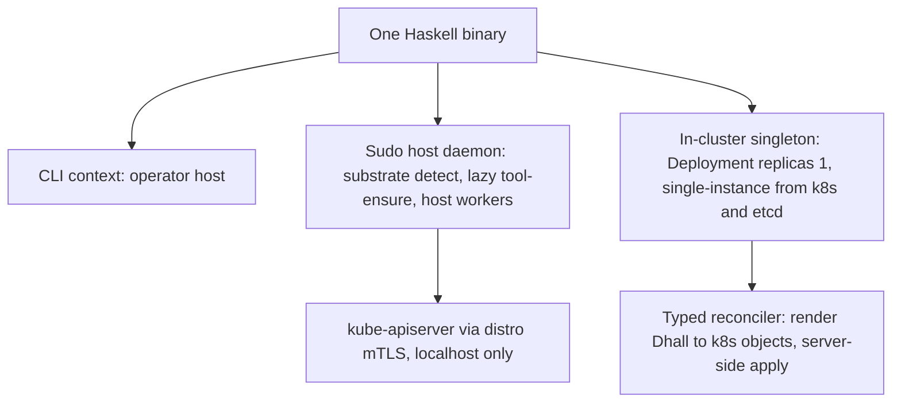

# Amoebius Overview

**Status**: Authoritative source
**Supersedes**: N/A
**Referenced by**: DEVELOPMENT_PLAN/README.md, DEVELOPMENT_PLAN/development_plan_standards.md, DEVELOPMENT_PLAN/later_phases.md, DEVELOPMENT_PLAN/phase_00_documentation_suite.md, DEVELOPMENT_PLAN/phase_01_toolchain_spike.md, DEVELOPMENT_PLAN/phase_02_formal_model_kernel.md, DEVELOPMENT_PLAN/phase_03_gateway_migration_model.md, DEVELOPMENT_PLAN/phase_04_dhall_gate1_schema.md, DEVELOPMENT_PLAN/phase_05_gadt_decoder_gate2.md, DEVELOPMENT_PLAN/phase_06_illegal_state_corpus.md, DEVELOPMENT_PLAN/phase_07_capacity_topology_folds.md, DEVELOPMENT_PLAN/phase_08_capability_binder.md, DEVELOPMENT_PLAN/phase_09_render_manifest_goldens.md, DEVELOPMENT_PLAN/phase_10_chain_kernel_dryrun.md, DEVELOPMENT_PLAN/phase_11_boundary_fake_tool_harness.md, DEVELOPMENT_PLAN/phase_12_deterministic_sim_substrate.md, DEVELOPMENT_PLAN/phase_13_spa_composition_representational.md, DEVELOPMENT_PLAN/phase_14_midwife_bootstrap_kind.md, DEVELOPMENT_PLAN/phase_15_base_image_registry.md, DEVELOPMENT_PLAN/phase_16_renderer_reconciler.md, DEVELOPMENT_PLAN/phase_17_retained_storage.md, DEVELOPMENT_PLAN/phase_18_vault_pki.md, DEVELOPMENT_PLAN/phase_19_platform_backbone.md, DEVELOPMENT_PLAN/phase_20_platform_services_2.md, DEVELOPMENT_PLAN/phase_21_keycloak_ingress.md, DEVELOPMENT_PLAN/phase_22_live_dsl_singleton.md, DEVELOPMENT_PLAN/phase_23_app_tenancy.md, DEVELOPMENT_PLAN/phase_24_pulsar_client.md, DEVELOPMENT_PLAN/phase_25_content_store_workflow.md, DEVELOPMENT_PLAN/phase_26_release_lifecycle.md, DEVELOPMENT_PLAN/phase_27_network_fabric_wireguard.md, DEVELOPMENT_PLAN/phase_28_multicluster_spawn_georepl.md, DEVELOPMENT_PLAN/phase_29_gateway_migration_drills.md, DEVELOPMENT_PLAN/phase_30_provider_clusters.md, DEVELOPMENT_PLAN/phase_31_determinism_kernel.md, DEVELOPMENT_PLAN/phase_32_jitbuild_engine_cache.md, DEVELOPMENT_PLAN/phase_33_infernix_lift.md, DEVELOPMENT_PLAN/phase_34_jitml_lift_cuda.md, DEVELOPMENT_PLAN/phase_35_apple_metal_host_daemon.md, DEVELOPMENT_PLAN/phase_36_test_topology_dsl.md, DEVELOPMENT_PLAN/phase_37_spa_live_deploy.md, DEVELOPMENT_PLAN/system_components.md
**Generated sections**: none

> **Purpose**: The target-architecture / vision / current-baseline narrative — the "why and what" companion
> to [README.md](README.md)'s "where and when" — for the everything-orchestrator amoebius is becoming.

This document explains *what amoebius is and why it is shaped that way*. It does not track status, order, or
remaining work — that is [README.md](README.md)'s job, and per
[development_plan_standards.md §K](development_plan_standards.md) status lives **only** in the plan tracker.
The doctrine under [`../documents/engineering/`](../documents/engineering/README.md) owns the normative
detail of each subsystem; this overview summarizes and links, and **never restates** doctrine content
(documentation_standards §5). This document is the target-architecture companion to that grand, non-binding
vision; the plan is its binding, executable decomposition.

> **Greenfield, read this first.** Nothing is implemented. Only the Phase 0 documentation suite exists; there
> is no `src/` yet. Every phase and sprint is 📋 Planned and **every prescriptive sentence below is design
> intent, not a tested result.** Where this overview leans on the sibling `prodbox` project, that is cited as
> *evidence* that a shape works — never as amoebius proof.

---

## 1. The everything-orchestrator shape: one binary, three contexts

Amoebius is a single Haskell binary that runs in three contexts from the same build artifact:

1. a **CLI** on the operator's host,
2. a **sudo-capable host daemon** that owns substrate detection, lazy tool-ensure, and host-level worker
   subprocesses, and
3. an **in-cluster control-plane singleton** — a Kubernetes Deployment `replicas=1` with total authority over
   its cluster and its secrets, whose single-instance is delegated to k8s/etcd (no bespoke election).

There is no second binary, no sidecar fleet, no shell glue: context is a runtime fact, and *role* (control
plane vs. worker) is orthogonal to context. This is the doctrine of
[`daemon_topology_doctrine.md` §1 — One binary, three contexts](../documents/engineering/daemon_topology_doctrine.md#1-one-binary-three-contexts).
The cluster authority is one Deployment-`replicas=1` pod, reconciled with the HA-always rule, per
[`daemon_topology_doctrine.md` §3 — The control-plane singleton](../documents/engineering/daemon_topology_doctrine.md#3-the-control-plane-singleton):
"exactly one pod" is a k8s/etcd property (a k8s `Lease` if a hard lock is ever needed), **not** an amoebius
election, and the pod is stateless — no PVC; its durable state is the Vault-enveloped MinIO bucket.

The host daemon reaches the cluster only over localhost-restricted channels (kube-apiserver via the distro's
own mTLS, and Pulsar/MinIO over host-only NodePorts), never the public ingress path — see
[`host_cluster_comms_doctrine.md` §1 — The whole surface: two channels, both localhost-only](../documents/engineering/host_cluster_comms_doctrine.md#1-the-whole-surface-two-channels-both-localhost-only).

## 2. The constituent projects: libraries and behaviours unified under the DSL

The projects amoebius absorbs are **not separate products**. They become libraries and behaviours of the one
binary, tied together by the Dhall DSL so that an operator configures distro, replica count, and inference
substrate from a single `.dhall` with zero application change:

| Project | Becomes | Role under the DSL |
|---------|---------|--------------------|
| **prodbox** | root control-plane behaviour | the single-node root cluster: password-encrypted Vault unseal, PKI trust anchor, the human-gated init — see [`vault_pki_doctrine.md` §5 — The root cluster: single-node, password-encrypted unseal](../documents/engineering/vault_pki_doctrine.md#5-the-root-cluster-single-node-password-encrypted-unseal) |
| **infernix** + **jitML** | ML extension libraries | shared inference/training libraries whose hardware substrate is a *deployment rule*, not app code — [`app_vs_deployment_doctrine.md` §7 — infernix is a shared library; the inference substrate is a deployment rule](../documents/engineering/app_vs_deployment_doctrine.md#7-infernix-is-a-shared-library-the-inference-substrate-is-a-deployment-rule); jitML is the seed of the forward-looking Haskell extension DSL noted in [`dsl_doctrine.md` §8](../documents/engineering/dsl_doctrine.md#8-the-haskell-extension-dsl-forward-pointer-only) |
| **hostbootstrap** | bootstrap + DSL-`chain` core | the Python `pb` **midwife** CLI (ensure toolchain, build binary, hand off) plus the `dsl-step`/`chain` kernel — [`substrate_doctrine.md` §6 — The midwife contract](../documents/engineering/substrate_doctrine.md#6-the-midwife-contract-a-python-cli-ensures-a-toolchain-builds-the-binary-hands-off) |

Each of **infernix** and **jitML** additionally ships a **demo single-page web app** in its sibling repo that
illustrates its ML workflow and renders its results. Those demo web apps are amoebius's
**application-logic-only demonstrator** — the proof case that an app is written once as logic while HA replica
count, substrate, and inference binding are an orthogonal deployment-rules surface — and the SPA-composition
shakedown fixtures. A demo web app *uses* an extension but is not itself one — see
[`app_vs_deployment_doctrine.md` §6 — The proof case: a demo web app as application-logic-only](../documents/engineering/app_vs_deployment_doctrine.md#6-the-proof-case-a-demo-web-app-as-application-logic-only).

The unifying surface is the Dhall DSL: Dhall carries parameters, Haskell carries logic, and an app names
*capabilities* (ObjectStore, Sql, MessageBus, …) rather than products — see
[`service_capability_doctrine.md` §1 — Why capabilities, not products](../documents/engineering/service_capability_doctrine.md#1-why-capabilities-not-products)
and [`service_capability_doctrine.md` §2 — The capability set](../documents/engineering/service_capability_doctrine.md#2-the-capability-set).

**Convergence stance.** The sibling projects are **frozen typed evidence** that a shape works, not lockstep
peers to track: amoebius lifts each sibling's *role* onto its own seams and reimplements nothing
([`lift_and_compose_doctrine.md`](../documents/engineering/lift_and_compose_doctrine.md)), while what stops being
carried forward is the [`legacy_tracking_for_deletion.md`](legacy_tracking_for_deletion.md) ledger. infernix and
jitML join as the **closed `ExtensionSpec` set** linked onto the amoebius base — never a migration through
hostbootstrap first — with their engines jit-resolved into a bounded content-addressed cache rather than baked
([`capability_extension_doctrine.md`](../documents/engineering/capability_extension_doctrine.md),
[`content_addressing_doctrine.md` §4.5](../documents/engineering/content_addressing_doctrine.md#45-the-ml-asset-lifecycle-one-bounded-content-addressed-cache-resolved-on-first-miss)).

## 3. The hard constraints (cross-cutting invariants)

These are the README "Cross-cutting invariants" — documented in Phase 0, upheld by every later phase. Each is
owned by exactly one doctrine SSoT; the overview only names and links them.

| Invariant | Owning doctrine (cited by name) |
|-----------|----------------------------------|
| **No environment variables, ever — including `PATH`.** Host tools are discovered lazily via the substrate package manager and invoked by full path. | [`substrate_doctrine.md` §3 — The no-environment / no-`PATH` lazy tool-ensure contract](../documents/engineering/substrate_doctrine.md#3-the-no-environment--no-path-lazy-tool-ensure-contract) |
| **Illegal/unsafe cluster state is unrepresentable in a decoded `InForceSpec`** — foreclosed at Gate 1 (Dhall) or the Gate-2 decoder per the catalog's per-entry locus (gateway/DNS/certs/insecure-ingress at Gate 1; PVC↔PV and taints/tolerations/affinity at the Gate-2 decoder). | [`dsl_doctrine.md` §5 — The illegal-state-unrepresentable contract](../documents/engineering/dsl_doctrine.md#5-the-illegal-state-unrepresentable-contract); the enumerated catalog in [`illegal_state_catalog.md` §1 — Illegal states fail to type-check](../documents/illegal_state/illegal_state_catalog.md#1-illegal-states-fail-to-type-check) |
| **Resource demand never exceeds capacity** — a workload / VM / compute-engine over-committing its host or cluster is decode-rejected (a total fold over declared per-host `Capacity`; honestly decode-foreclosed). | [`resource_capacity_doctrine.md`](../documents/engineering/resource_capacity_doctrine.md); catalog [`§3.17`](../documents/illegal_state/illegal_state_catalog.md#3-the-catalog--states-a-valid-spec-cannot-represent) |
| **No unbounded storage** — host-bounded or cloud-quota-bounded; MinIO **and** Pulsar cannot exceed their backing; every topic has bounded retention + a size-triggered S3 offload so the hot tier never overflows. | [`resource_capacity_doctrine.md`](../documents/engineering/resource_capacity_doctrine.md); [`storage_lifecycle_doctrine.md` §5.2](../documents/engineering/storage_lifecycle_doctrine.md); [`pulsar_client_doctrine.md` §6.1](../documents/engineering/pulsar_client_doctrine.md) |
| **Compute engine matches its substrate; topology matches its hosts** — rke2/kind need a Linux host (a VM on apple/windows), multi-node kind is one host, multi-node rke2 is one Linux host per node, EKS is first-class; multi-substrate clusters are allowed. | [`cluster_topology_doctrine.md`](../documents/engineering/cluster_topology_doctrine.md); catalog [`§3.13`–`§3.16`](../documents/illegal_state/illegal_state_catalog.md#3-the-catalog--states-a-valid-spec-cannot-represent) |
| **Dynamic provisioning is amoebius-owned and typed** — capacity grows only through a quota-capped `ScalingPolicy` (capacity-based + instance price-shopping), never a bare "unbounded." | [`resource_capacity_doctrine.md`](../documents/engineering/resource_capacity_doctrine.md); [`cluster_lifecycle_doctrine.md` §8](../documents/engineering/cluster_lifecycle_doctrine.md#8-dynamic-node-provisioning) |
| **Pulsar payloads are exclusively CBOR** (canonical where content-addressed) — a typed codec; a non-CBOR application body (JSON/base64/protobuf/raw) is unrepresentable; protocol framing stays protobuf. | [`pulsar_client_doctrine.md` §3.1](../documents/engineering/pulsar_client_doctrine.md#31-payloads-are-exclusively-cbor); catalog [`§3.23`](../documents/illegal_state/illegal_state_catalog.md#3-the-catalog--states-a-valid-spec-cannot-represent) |
| **Application logic and deployment rules are separate DSL surfaces** — write the app once; HA, chaos, geo-replication, and failover are an orthogonal layer. | [`app_vs_deployment_doctrine.md` §1 — Two surfaces, one app written once](../documents/engineering/app_vs_deployment_doctrine.md#1-two-surfaces-one-app-written-once) |
| **Secrets never live in Dhall — only names.** Parents inject secrets directly into a child's Vault. | [`dsl_doctrine.md` §6 — Secrets are names, never values](../documents/engineering/dsl_doctrine.md#6-secrets-are-names-never-values); [`vault_pki_doctrine.md` §3 — The SecretRef contract: a name, never a value](../documents/engineering/vault_pki_doctrine.md#3-the-secretref-contract-a-name-never-a-value) |
| **Standard platform services on every cluster, HA always** — the chart is HA even at `replicas=1`. | [`platform_services_doctrine.md` §2 — HA always, including `replicas=1`](../documents/engineering/platform_services_doctrine.md#2-ha-always--including-replicas1) |
| **Only `no-provisioner` retained PVs** (`<ns>/<sts>/pv_<n>`, sized, host/EBS-bound); cluster infrastructure is replaceable rather than TTL-bound, while durable backing has an independent lifetime. | [`cluster_lifecycle_doctrine.md` §4](../documents/engineering/cluster_lifecycle_doctrine.md#4-the-root-inforcespec-is-the-persistent-contract) and [`§7`](../documents/engineering/cluster_lifecycle_doctrine.md#7-ephemeral-spin-updown-with-deterministic-rebind); [`storage_lifecycle_doctrine.md` §1](../documents/engineering/storage_lifecycle_doctrine.md#1-cluster-and-storage-have-independent-lifetimes) and [`§2`](../documents/engineering/storage_lifecycle_doctrine.md#2-one-storage-class-and-it-provisions-nothing) |
| **Every container declares CPU and RAM.** | [`platform_services_doctrine.md` §10 — Every container declares CPU and RAM](../documents/engineering/platform_services_doctrine.md#10-every-container-declares-cpu-and-ram) |
| **Keycloak owns all wild ingress** via the LB + Gateway API; the sole exception is host-origin, localhost-only traffic. | [`platform_services_doctrine.md` §9 — The LoadBalancer and the single wild-ingress path](../documents/engineering/platform_services_doctrine.md#9-the-loadbalancer-and-the-single-wild-ingress-path); the host-only carve-out in [`host_cluster_comms_doctrine.md` §1](../documents/engineering/host_cluster_comms_doctrine.md#1-the-whole-surface-two-channels-both-localhost-only) |
| **No Helm, no third-party charts** — every k8s object is rendered from pure typed Haskell and applied by the typed reconciler. | [`manifest_generation_doctrine.md` §1 — Why this doctrine exists: types render manifests, Helm does not](../documents/engineering/manifest_generation_doctrine.md#1-why-this-doctrine-exists-types-render-manifests-helm-does-not) |
| **Baked service binaries + the `distribution` registry** — every third-party *service* binary is baked into the multi-arch base container (in-cluster pulls only); the ML **engine payloads** are the exception — jit-resolved into a `CacheBudget`-bounded cache, never baked or URL-fetched. | [`image_build_doctrine.md` §2](../documents/engineering/image_build_doctrine.md#2-the-single-distribution-rule-bake-the-binaries-build-the-amoebius-image-pull-only-in-cluster); [`content_addressing_doctrine.md` §4.5](../documents/engineering/content_addressing_doctrine.md#45-the-ml-asset-lifecycle-one-bounded-content-addressed-cache-resolved-on-first-miss) |
| **Generated artifacts are never committed** — manifests, the emitted `.tla`/`.cfg`, the reflected Dhall schema, and PureScript contracts are rendered from Haskell source and not committed. | [`generated_artifacts_doctrine.md`](../documents/engineering/generated_artifacts_doctrine.md) |
| **The one formal obligation is the cross-cluster gateway migration** (both `Planned` and `Failover` branches), modelled as data, **safety + liveness-under-fairness** proven (TLC) and simulated (io-sim) once; its runtime fidelity is bridged by deterministic simulation + trace validation before live; intra-cluster consensus is delegated, not re-proven. | [`gateway_migration_model_doctrine.md`](../documents/engineering/gateway_migration_model_doctrine.md); [`formal_model_doctrine.md`](../documents/engineering/formal_model_doctrine.md); [`deterministic_simulation_doctrine.md`](../documents/engineering/deterministic_simulation_doctrine.md) |

The standard service set behind these capabilities — Registry (`distribution`) · MinIO · Vault · Pulsar ·
Prometheus/Grafana · Percona/Patroni Postgres + pgAdmin · Envoy/Gateway-API · Keycloak · LoadBalancer — is
inventoried in [system_components.md](system_components.md) and owned by
[`platform_services_doctrine.md`](../documents/engineering/platform_services_doctrine.md).

## 4. The canonical validation gates (one line per phase)

Each phase ends in a single, checkable acceptance gate on **at most one** substrate (the one-substrate
discipline, [development_plan_standards.md §L](development_plan_standards.md)). The authoritative gate text
and status live in [README.md](README.md); the line below names the gate and links the phase document. All
are 📋 Planned (greenfield).

The DSL is validated and **simulated per phase**, never as a monolithic pre-implementation: each pre-cluster
phase discharges an in-process Register-1/2 gate and each live-band phase a Register-3 gate before the next
opens, while the **Register-2.5 deterministic-simulation runs as a pre-cluster *activity*, never a phase gate**
([development_plan_standards.md §K](development_plan_standards.md)) ahead of the concurrency-bearing live
phases' Register-3 gates. Front-loading a *design* proof ahead of the phase that
builds the runtime it corresponds to is legitimate under the ledger discipline that marks correspondence and
runtime fidelity UNVERIFIED until that phase discharges them
([development_plan_standards.md §K](development_plan_standards.md),
[`deterministic_simulation_doctrine.md`](../documents/engineering/deterministic_simulation_doctrine.md)).

*Pre-cluster band (substrate `none`, Registers 1–2):*
- **Phase 0 — Documentation suite (whole DSL)** (`none`) → [phase_00](phase_00_documentation_suite.md): the documentation lint passes two-sided — headers, anchors, bidirectional Referenced-by, near-duplicate, status-consistency, gate-integrity — and fails on every committed seeded negative.
- **Phase 1 — Toolchain spike** (`none`) → [phase_01](phase_01_toolchain_spike.md): a probe of `dhall` + `io-sim`/`io-classes` + the jit-build resolver + `purescript-bridge` + the Pulsar `supernova` fork builds on the pinned GHC/Cabal, or the exact blocker is recorded with a transcript.
- **Phase 2 — Formal-model EDSL (`Model`/`interpret`/`emitTLA`)** (`none`) → [phase_02](phase_02_formal_model_kernel.md): the `Model` explorer + `emitTLA` round-trip (safety **and** a liveness `PROPERTY` under fairness); a differential generator finds no explorer/TLC safety disagreement; committed renderer mutants are caught; the `.tla` is TLC-checkable, never committed.
- **Phase 3 — Gateway-migration model (both branches)** (`none`) → [phase_03](phase_03_gateway_migration_model.md): TLC reaches every safety invariant and every liveness `PROPERTY` (under fairness) at scope for both `Planned` and `Failover` with passing vacuity / fairness-sensitivity / cutoff checks; io-sim agrees on safety; every mechanical mutant is caught.
- **Phase 4 — Dhall Gate-1 schema + smart-constructor prelude** (`none`) → [phase_04](phase_04_dhall_gate1_schema.md): `dhall type` accepts the positive corpus and rejects each Gate-1 negative at its committed expected error (no open escape arm).
- **Phase 5 — GADT IR + fail-closed decoder (Gate 2)** (`none`) → [phase_05](phase_05_gadt_decoder_gate2.md): `cabal test dsl-spec` green — each positive decodes, each Gate-2 negative returns a structured `Left` with its expected tag; the decode path is non-partial and fail-closed.
- **Phase 6 — Illegal-state corpus + validation-locus ledger** (`none`) → [phase_06](phase_06_illegal_state_corpus.md): every negative fixture is rejected at its tagged locus (Gate-1 / Gate-2 / compile-fail); QuickCheck green with coverage floors; the per-entry validation-locus ledger is emitted.
- **Phase 7 — Capacity / topology folds** (`none`) → [phase_07](phase_07_capacity_topology_folds.md): `fits`/`carve`/`place` + topology QuickCheck properties hold; the decode-foreclosed folds reject each capacity/topology negative.
- **Phase 8 — Capability → provider → shape binder** (`none`) → [phase_08](phase_08_capability_binder.md): a capability need decodes to a `ServiceSpec` at the type level; a product-named app fails Gate 1 at its committed locus.
- **Phase 9 — Pure `render` + rendered-output goldens** (`none`) → [phase_09](phase_09_render_manifest_goldens.md): `render :: ServiceSpec -> [K8sObject]` is byte-for-byte golden-locked; the rendered-output illegal states hold; a seeded mutant turns it red.
- **Phase 10 — chain/Step kernel + `--dry-run` plan render** (`none`) → [phase_10](phase_10_chain_kernel_dryrun.md): `chain :: cfg -> [Step]` renders a byte-for-byte `--dry-run` plan with no effects (external-observer verified); the pure descent is golden-locked.
- **Phase 11 — Boundary-integration fake-tool harness** (`none`) → [phase_11](phase_11_boundary_fake_tool_harness.md): the binary runs the plan against fake `kubectl`/`docker`/`pulumi` by absolute path; recorded argv == the committed transcript and applied bytes == the goldens; committed argv/byte/PATH mutants turn it red.
- **Phase 12 — Deterministic-simulation substrate** (`none`) → [phase_12](phase_12_deterministic_sim_substrate.md): the real daemon/reconciler code under `IOSim`/`IOSimPOR` replays a committed fault/partition/redelivery schedule; same-seed → byte-identical trace (a distinct seed must differ); a committed fault-mutant turns the invariant red; modeled-env fidelity marked assumed.
- **Phase 13 — SPA composition (representational) + demo-SPA local** (`none`) → [phase_13](phase_13_spa_composition_representational.md): `prop_spaCompositionDecodes` holds over generated pairs (coverage floors); the PureScript demo SPA runs locally against a faked backend (Playwright), its contract from a committed golden.

*Live band (Register 3), substrate-ordered:*
- **Phase 14 — Python midwife + substrate detect + single kind cluster** (`linux-cpu`) → [phase_14](phase_14_midwife_bootstrap_kind.md): `pb bootstrap --distro=kind` brings up an empty single-node kind cluster; re-run is a no-op; every external invocation went through an absolute path.
- **Phase 15 — Multi-arch base image + jit-build resolver + `distribution` registry** (`linux-cpu`) → [phase_15](phase_15_base_image_registry.md): the multi-arch base image (service binaries + resolver/toolchain, amoebius binary alone) publishes atomically into the in-cluster `distribution` registry; no public-registry pulls.
- **Phase 16 — Typed renderer + live SSA reconciler** (`linux-cpu`) → [phase_16](phase_16_renderer_reconciler.md): a `render`ed object set is applied by the SSA reconciler (owned field manager, `force`, ApplySet prune, wait) to convergence; re-run is a no-op.
- **Phase 17 — No-provisioner retained storage + lossless rebind** (`linux-cpu`) → [phase_17](phase_17_retained_storage.md): storage rebinds after a real cluster delete+recreate with no data loss; an OS-boundary observer confirms real teardown.
- **Phase 18 — Root Vault + PKI + built-in Haskell Vault client** (`linux-cpu`) → [phase_18](phase_18_vault_pki.md): the root password-encrypted Vault inits and unseals fail-closed; the PKI anchor issues; the built-in Haskell client reads a `SecretRef`.
- **Phase 19 — Platform backbone (MetalLB + MinIO + Pulsar HA)** (`linux-cpu`) → [phase_19](phase_19_platform_backbone.md): the backbone comes up HA from generated manifests + baked binaries, no public pull; the `distribution` registry re-homes onto the MinIO S3 driver; a size-triggered Pulsar S3 offload fires and the hot tier never exceeds its cap.
- **Phase 20 — Platform services-2 (Percona/Patroni + pgAdmin + observability + readiness-DAG)** (`linux-cpu`) → [phase_20](phase_20_platform_services_2.md): Percona/Patroni (mandated `synchronous_mode`) + pgAdmin + Prometheus/Grafana come up HA in the derived readiness-DAG order (external-observer trace; a hardcoded sequence is a caught mutant).
- **Phase 21 — Keycloak-owned ingress** (`linux-cpu`) → [phase_21](phase_21_keycloak_ingress.md): every wild route is reachable only through Keycloak/Envoy; a workload cannot publish its own wild ingress.
- **Phase 22 — Live DSL deploy via the `replicas=1` singleton** (`linux-cpu`) → [phase_22](phase_22_live_dsl_singleton.md): a `.dhall` deploys the platform + a trivial app via the Deployment-`replicas=1` singleton (`strategy: Recreate` + Lease, no election); the Phase-6 negative corpus still fails against the live spec-ingestion path.
- **Phase 23 — App tenancy + `TenantSpec`** (`linux-cpu`) → [phase_23](phase_23_app_tenancy.md): an app gets its own namespace, `<app>/<bucket>` ObjectStore, and in-namespace Sql; a spec cannot name a foreign tenant's resource.
- **Phase 24 — Native Pulsar client (CBOR)** (`linux-cpu`) → [phase_24](phase_24_pulsar_client.md): a command→event round-trips over native-protocol Pulsar with produce-path dedup; a CBOR payload round-trips byte-for-byte; a non-CBOR fixture fails type-check.
- **Phase 25 — Content store + workflow runtime (Pulsar-Failover single-writer)** (`linux-cpu`) → [phase_25](phase_25_content_store_workflow.md): a workflow stores/fetches a content-addressed artifact by manifest SHA; killing the active worker triggers Pulsar-Failover takeover with no double-applied fenced effect; leak-free teardown.
- **Phase 26 — Release lifecycle (ledger + PromotionGate + RolloutPlan)** (`linux-cpu`) → [phase_26](phase_26_release_lifecycle.md): a live Release-ledger write emits a `releaseHash`; the PromotionGate refuses an under-verified→prod promotion; a satisfied gate advances the ETag-CAS pointer; a readiness-gated RolloutPlan (incl. a DB schema-migration phase) applies in order; a mutant admitting a bad promotion turns it red.
- **Phase 27 — WireGuard network fabric** (`linux-cpu`) → [phase_27](phase_27_network_fabric_wireguard.md): the singleton renders each peer config from Vault-KV Curve25519 keys (SecretRef names only) and reconciles raw-kernel WireGuard so every cluster draws its VPN IP and the gateway-role hub is reachable (external-observer probe); a golden pins the config; a rotated/missing-key mutant turns it red.
- **Phase 28 — Multi-cluster spawn + geo-replication** (`linux-cpu`) → [phase_28](phase_28_multicluster_spawn_georepl.md): a parent spawns two children (Pulumi-from-inside first built here) that geo-replicate a workflow; each child receives `project(subtree)` (compile-fail corpus); leak-free teardown.
- **Phase 29 — Gateway-migration drills + model-correspondence** (`linux-cpu`) → [phase_29](phase_29_gateway_migration_drills.md): a `Planned` handover is RPO=0 (external write-journal oracle, ≥8 acked-but-un-replicated writes at quiesce) and a `Failover` rebinds within the Phase-0 `DataLossBudget`; trace-validated against the Phase-3 model; committed `verify-caught-up`-stub / `promote-before-fence` mutants turn it red.
- **Phase 30 — Provider-managed clusters + dynamic provisioning** (`linux-cpu → provider`) → [phase_30](phase_30_provider_clusters.md): spin a provider (EKS) cluster from a parent (reusing the Phase-28 Pulumi engine), dynamically provision a node by a declared rule, refuse growth past the quota cap, tear down leak-free (tag-sweep backstop).
- **Phase 31 — Determinism kernel** (`linux-cpu`) → [phase_31](phase_31_determinism_kernel.md): `experimentHash = sha256(dhall‖substrate)` + SplitMix seed derivation reproduce byte-identical output on the same substrate (independent, cache-bypassed recompute); a changed input changes the hash.
- **Phase 32 — jit-build engine resolver + `CacheBudget` cache** (`linux-cpu`) → [phase_32](phase_32_jitbuild_engine_cache.md): a named engine identity resolves on first miss into the `CacheBudget`-bounded content-addressed cache; a second pod reuses it; budget-pressure eviction keeps Σ≤budget; over-budget is decode-rejected.
- **Phase 33 — infernix lift + CPU inference reproducibility** (`linux-cpu`) → [phase_33](phase_33_infernix_lift.md): an infernix CPU-inference workflow is reproducible (same `experimentHash`, independent recompute ⇒ same output); its demo web app deploys as application-logic-only.
- **Phase 34 — jitML lift + checkpoints + coordinator + CUDA** (`linux-cuda`) → [phase_34](phase_34_jitml_lift_cuda.md): a jitML run is bit-deterministic per contract; the single-writer trainer fails over via a Pulsar Failover subscription (no election, no torn `latest`); its demo web app deploys as application-logic-only.
- **Phase 35 — Apple-Metal host compute daemon** (`apple`) → [phase_35](phase_35_apple_metal_host_daemon.md): an Apple-Silicon host daemon runs a Metal ML workload as a cluster Pulsar/MinIO peer over a host-only NodePort.
- **Phase 36 — Test-topology DSL + suggest-test + elevated harness** (`per generated test`) → [phase_36](phase_36_test_topology_dsl.md): a generated test `.dhall` runs a failover simulation on its single substrate and tears down leak-free (postflight sweep over all resource classes empty).
- **Phase 37 — Live SPA deploy** (`linux-cpu`) → [phase_37](phase_37_spa_live_deploy.md): an SPA `.dhall` composes a multi-service app + an ML-workflow demo app, deployed and reachable behind Keycloak/Envoy; an inference request round-trips through the composed workflow.
- **Phases 38+ — Later phases** (`varies`) → [later_phases.md](later_phases.md): each high-numbered in-scope phase gets its own gate when reached (GHC 9.14 bump, schema-migration automation, the Haskell extension DSL + AST checker + JIT, niche substrates incl. Windows-CUDA).

The substrate per gate is registered authoritatively in [substrates.md](substrates.md); the per-phase gate
ideally *is* an `InForceSpec` topology that spins resources up, runs a workflow, and tears them down — the
self-tearing-down test topology of [`testing_doctrine.md`](../documents/engineering/testing_doctrine.md).

## 5. Current baseline — GREENFIELD

- **Implemented:** nothing. There is no `src/` tree; the planned module layout lives only in
  [system_components.md](system_components.md) as intended paths, not built code.
- **Authored:** the Phase 0 documentation suite — the full DSL specification and every doctrine indexed in
  [`../documents/engineering/README.md`](../documents/engineering/README.md), plus this
  `DEVELOPMENT_PLAN/` tracker. Phase 0's gate (documentation lint) is the only gate currently in play.
- **Status posture:** every phase and sprint is 📋 Planned; nothing is 🔄 Active, ✅ Done, or
  🧪 Live-proof-pending. Per [development_plan_standards.md §K](development_plan_standards.md), a sprint is
  never marked Done on "it compiles," and a gate is passed only when its acceptance test actually ran on its
  substrate.
- **Toolchain pin:** GHC **9.12.4**, Cabal 3.16.1.0, one shared pin across all packages.
  (GHC 9.14.1 is a deferred later-phase bump.)
- **Evidence vs. proof:** the sibling `prodbox` project is cited throughout the doctrine as a working
  precedent for the root control-plane behaviour, the AWS/Pulumi reality, the ZeroSSL/route53 path, and the
  chaos-hardening ledger. Those are *evidence the shape works*, never amoebius results — amoebius has run
  none of it yet.

---

## Related Documents
- [README.md](README.md) — the live tracker: phase order, status, gates, and remaining work (the "where/when" to this "why/what")
- [development_plan_standards.md](development_plan_standards.md) — the rulebook this document obeys (§A header, §H citation rule, §K honesty, §L one-substrate)
- [system_components.md](system_components.md) — the target component inventory: surface → owning doctrine → planned module path
- [substrates.md](substrates.md) — the substrate registry and per-phase substrate map
- [legacy_tracking_for_deletion.md](legacy_tracking_for_deletion.md) — the migration-removal ledger as prodbox/infernix/jitML converge
- [later_phases.md](later_phases.md) — the in-scope, high-numbered phases not yet given their own document
- [Engineering Doctrine Index](../documents/engineering/README.md) — the doctrine SSoTs this overview summarizes and links
- [Documentation Standards](../documents/documentation_standards.md) — the header/link mechanics this inherits
