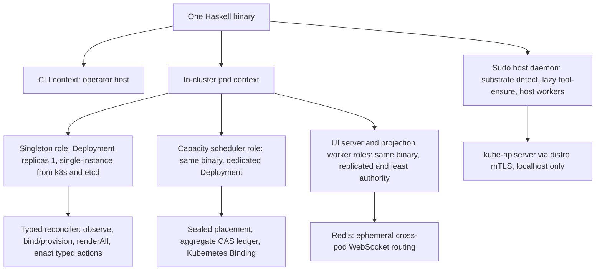

# Amoebius Overview

**Status**: Authoritative source
**Supersedes**: N/A
**Referenced by**: DEVELOPMENT_PLAN/README.md, DEVELOPMENT_PLAN/development_plan_standards.md, DEVELOPMENT_PLAN/later_phases.md, DEVELOPMENT_PLAN/phase_00_documentation_suite.md, DEVELOPMENT_PLAN/phase_01_toolchain_spike.md, DEVELOPMENT_PLAN/phase_02_formal_model_kernel.md, DEVELOPMENT_PLAN/phase_03_gateway_migration_model.md, DEVELOPMENT_PLAN/phase_04_dhall_gate1_schema.md, DEVELOPMENT_PLAN/phase_05_gadt_decoder_gate2.md, DEVELOPMENT_PLAN/phase_06_illegal_state_corpus.md, DEVELOPMENT_PLAN/phase_07_capacity_core_folds.md, DEVELOPMENT_PLAN/phase_08_storage_geometry_folds.md, DEVELOPMENT_PLAN/phase_09_execution_accelerator_folds.md, DEVELOPMENT_PLAN/phase_10_capability_bind.md, DEVELOPMENT_PLAN/phase_11_provision_seal.md, DEVELOPMENT_PLAN/phase_12_inference_accelerator_provision.md, DEVELOPMENT_PLAN/phase_13_render_manifest_goldens.md, DEVELOPMENT_PLAN/phase_14_chain_kernel_boundary.md, DEVELOPMENT_PLAN/phase_15_deterministic_sim_substrate.md, DEVELOPMENT_PLAN/phase_24_midwife_bootstrap_kind.md, DEVELOPMENT_PLAN/phase_25_base_image_registry.md, DEVELOPMENT_PLAN/phase_26_object_reconciler.md, DEVELOPMENT_PLAN/phase_27_capacity_scheduler.md, DEVELOPMENT_PLAN/phase_28_retained_storage.md, DEVELOPMENT_PLAN/phase_29_vault_pki.md, DEVELOPMENT_PLAN/phase_30_platform_backbone.md, DEVELOPMENT_PLAN/phase_31_platform_services_2.md, DEVELOPMENT_PLAN/phase_32_keycloak_ingress.md, DEVELOPMENT_PLAN/phase_33_live_dsl_singleton.md, DEVELOPMENT_PLAN/phase_35_pulsar_client.md, DEVELOPMENT_PLAN/phase_37_content_store_workflow.md, DEVELOPMENT_PLAN/phase_39_release_lifecycle.md, DEVELOPMENT_PLAN/phase_41_network_fabric_wireguard.md, DEVELOPMENT_PLAN/phase_42_multicluster_spawn_georepl.md, DEVELOPMENT_PLAN/phase_43_gateway_migration_drills.md, DEVELOPMENT_PLAN/phase_44_provider_deploy_checkpoint.md, DEVELOPMENT_PLAN/phase_45_provider_child_bringup.md, DEVELOPMENT_PLAN/phase_46_provider_ebs_credential.md, DEVELOPMENT_PLAN/phase_47_provider_dynamic_nodes.md, DEVELOPMENT_PLAN/phase_48_determinism_jitcache.md, DEVELOPMENT_PLAN/phase_53_apple_metal_host_daemon.md, DEVELOPMENT_PLAN/phase_54_test_topology_dsl.md, DEVELOPMENT_PLAN/system_components.md
**Generated sections**: none

> **Purpose**: The target-architecture / vision / current-baseline narrative — the "why and what" companion
> to [README.md](README.md)'s "where and when" — for the everything-orchestrator amoebius is becoming.

This document explains *what amoebius is and why it is shaped that way*. It does not track status, order, or
remaining work — that is [README.md](README.md)'s job, and per
[development_plan_standards.md §K](development_plan_standards.md#k-honesty-proven--tested--assumed) status lives **only** in the plan tracker.
The doctrine under [`../documents/engineering/`](../documents/engineering/README.md) owns the normative
detail of each subsystem; this overview summarizes and links, and **never restates** doctrine content
([documentation_standards.md §5](../documents/documentation_standards.md#5-duplication-rules)). This document is the target-architecture companion to that grand, non-binding
vision; the plan is its binding, executable decomposition.

> **Greenfield, read this first.** Nothing is implemented. Only the Phase 0 documentation suite exists; there
> is no `src/` yet. Every phase and sprint is 📋 Planned and **every prescriptive sentence below is design
> intent, not a tested result.** Where this overview leans on the sibling `prodbox` project, that is cited as
> *evidence* that a shape works — never as amoebius proof.

---

## 1. The everything-orchestrator shape: one runtime binary, three contexts

amoebius has one Haskell runtime binary that runs in three contexts from the same build artifact. The Python
`pb` midwife/admin client is a separate thin operator frontend and is outside this runtime-role count:

1. a one-shot **Haskell command mode** on the operator's host, normally entered by `pb` during bootstrap,
2. a **sudo-capable host daemon** that owns substrate detection, lazy tool-ensure, and host-level worker
   subprocesses, and
3. an **in-cluster pod/process context** in which the executable runs as the control-plane singleton, the
   capacity scheduler, or an unelected worker. The singleton is one Kubernetes Deployment `replicas=1` with
   cluster/secret authority and a mandatory Kubernetes `Lease`; UI webservers and projection workers are
   separate horizontally scalable worker Deployments.

There is no second Haskell runtime executable, no runtime sidecar fleet, and no shell-glue control plane:
context is a runtime fact, and *role* (control plane vs. worker) is orthogonal to context. This is the doctrine of
[`daemon_topology_doctrine.md` §1 — one runtime binary, three contexts](../documents/engineering/daemon_topology_doctrine.md#1-one-binary-three-contexts).
The cluster authority is one Deployment-`replicas=1` pod, reconciled with the common HA-capable topology rule
(one replica has restart semantics, not replica redundancy), per
[`daemon_topology_doctrine.md` §3 — The control-plane singleton](../documents/engineering/daemon_topology_doctrine.md#3-the-control-plane-singleton):
"one desired pod" is a Deployment property, while the mandatory k8s/etcd `Lease` supplies at-most-one-writer
authority across termination/replacement overlap; this is **not** an amoebius election. The pod is stateless —
no PVC; its durable state is the Vault-enveloped MinIO bucket. A distinct `amoebius-capacity` scheduler
Deployment runs the same Haskell binary in its scheduler role, consumes only its named Pending Pods, performs
the sealed placement/root-ledger CAS/Binding protocol, and holds no singleton or secret authority.
The low-code UI server is another closed **worker responsibility** of that executable, paired with a generic
PureScript browser interpreter and an owner-scoped projection worker; it is not another privileged binary or
application-specific server build. Browser interaction uses authenticated same-origin WebSockets; the
replicated UI-server workers use the platform's ephemeral Redis coordination service to route connections and
fanout across pods, while Pulsar/projection/provider state remains authoritative
([`ui_realtime_coordination_doctrine.md`](../documents/engineering/ui_realtime_coordination_doctrine.md)).

```mermaid
flowchart TD
  src[One Haskell binary] --> cli[CLI context: operator host]
  src --> host[Sudo host daemon: substrate detect, lazy tool-ensure, host workers]
  src --> pod[In-cluster pod context]
  pod --> singleton[Singleton role: Deployment replicas 1, single-instance from k8s and etcd]
  pod --> sched[Capacity scheduler role: same binary, dedicated Deployment]
  pod --> ui[UI server and projection worker roles: same binary, replicated and least authority]
  host --> kube[kube-apiserver via distro mTLS, localhost only]
  singleton --> recon[Typed reconciler: observe, bind/provision, renderAll, enact typed actions]
  sched --> bind[Sealed placement, aggregate CAS ledger, Kubernetes Binding]
  ui --> redis[Redis: ephemeral cross-pod WebSocket routing]
```

The host daemon reaches the cluster only over localhost-restricted channels (kube-apiserver via the distro's
own mTLS, and Pulsar/MinIO over host-only NodePorts), never the public ingress path — see
[`host_cluster_comms_doctrine.md` §1 — The whole surface: two channels, both localhost-only](../documents/engineering/host_cluster_comms_doctrine.md#1-the-host-origin-surface-two-channels-both-localhost-only).

## 2. The constituent projects: libraries and behaviours unified under the DSL

The projects amoebius absorbs are **not separate products**. They become libraries and behaviours of the one
binary, tied together by the Dhall DSL so that an operator configures distro, replica count, and inference
substrate from a single `.dhall` with zero application change:

| Project | Becomes | Role under the DSL |
|---------|---------|--------------------|
| **prodbox** | root control-plane behaviour | the single-node root cluster: password-encrypted Vault unseal, PKI trust anchor, the human-gated init — see [`vault_pki_doctrine.md` §5 — The root cluster: single-node, password-encrypted unseal](../documents/engineering/vault_pki_doctrine.md#5-the-root-cluster-single-node-password-encrypted-unseal) |
| **infernix** + **jitML** | ML extension libraries | shared inference/training libraries whose hardware substrate is a *deployment rule*, not app code — [`app_vs_deployment_doctrine.md` §7 — infernix is a shared library; the inference substrate is a deployment rule](../documents/engineering/app_vs_deployment_doctrine.md#7-infernix-is-a-shared-library-the-inference-substrate-is-a-deployment-rule); jitML is the seed of the forward-looking Haskell extension DSL noted in [`dsl_doctrine.md` §8](../documents/engineering/dsl_doctrine.md#8-the-haskell-extension-dsl--the-constrained-surface-gate-3-admits) |
| **hostbootstrap** | bootstrap + DSL-`chain` core | the Python `pb` **midwife** CLI (ensure toolchain, build binary, hand off) plus the `dsl-step`/`chain` kernel — [`substrate_doctrine.md` §6 — The midwife contract](../documents/engineering/substrate_doctrine.md#6-the-midwife-contract-a-python-cli-ensures-a-toolchain-builds-the-binary-hands-off) |

Each of **infernix** and **jitML** additionally ships a handwritten demo single-page app in its sibling repo.
Those clients are evidence and migration fixtures, not the amoebius application model: their interaction flows
are re-expressed as bounded `UiSource`, bound to trusted Haskell workflow/artifact ports, and interpreted by the
generic client/server runtime. The program contains no arbitrary browser code, provider address, credential,
authorization decision, tenant claim, or deployment knob — see
[`app_vs_deployment_doctrine.md` §6 — The proof case: a low-code workflow UI as application-logic-only](../documents/engineering/app_vs_deployment_doctrine.md#6-the-proof-case-a-low-code-workflow-ui-as-application-logic-only).

Their shared execution path is fixed: a UI server admits a typed start under one scope-qualified `CommandId`;
the infernix/jitML adapter preserves it as the Phase-37 work-id through native-CBOR Pulsar commands, redelivery,
progress, and terminal events; the effect owner commits the artifact and Phase 38 folds the terminal event into
a durable owner/command-qualified receipt. Redis only wakes or routes to the replica owning the authenticated
WebSocket, and any replica repairs loss from the Pulsar-backed projection/receipt. For the initial offline
surface, only infernix workflow start and jitML training start may opt into a complete bounded queue contract;
progress is a cached cursor projection, and signals, cancellation, and model/artifact invocation are
online-only.

The unifying surface is the Dhall DSL: Dhall carries parameters, Haskell carries logic, and an app names
*capabilities* (ObjectStore, Sql, MessageBus, …) rather than products — see
[`service_capability_doctrine.md` §1 — Why capabilities, not products](../documents/engineering/service_capability_doctrine.md#1-why-capabilities-not-products)
and [`service_capability_doctrine.md` §2 — The capability set](../documents/engineering/service_capability_doctrine.md#2-the-capability-set).

**Convergence stance.** The sibling projects are **frozen typed evidence** that a shape works, not lockstep
peers to track: amoebius lifts each sibling's *role* onto its own seams and reimplements nothing
([`lift_and_compose_doctrine.md`](../documents/engineering/lift_and_compose_doctrine.md)), while what stops being
carried forward is the [`legacy_tracking_for_deletion.md`](legacy_tracking_for_deletion.md) ledger. infernix and
jitML join as the closed **workload-extension set** linked into trusted runtime variants — never a migration
through hostbootstrap first — with their engines jit-resolved into a bounded content-addressed cache rather than baked.
Low-code applications remain checked release data; only an optional reviewed server adapter joins the linked set
([`capability_extension_doctrine.md`](../documents/engineering/capability_extension_doctrine.md),
[`content_addressing_doctrine.md` §4.5](../documents/engineering/content_addressing_doctrine.md#45-the-ml-asset-lifecycle-one-bounded-content-addressed-cache-resolved-on-first-miss)).

## 3. The hard constraints (cross-cutting invariants)

These are the README "Cross-cutting invariants" — documented in Phase 0, upheld by every later phase. Each is
owned by exactly one doctrine SSoT; the overview only names and links them.

| Invariant | Owning doctrine (cited by name) |
|-----------|----------------------------------|
| **Host invocation takes no ambient configuration and never resolves tools through host `PATH`.** Host tools are discovered lazily via the substrate package manager and invoked by full path; a deliberately entered VM/container guest may use its own environment. | [`substrate_doctrine.md` §3 — The no-environment / no-`PATH` lazy tool-ensure contract](../documents/engineering/substrate_doctrine.md#3-the-no-environment--no-path-lazy-tool-ensure-contract) |
| **Illegal/unsafe state is foreclosed before effects at its honest layer** — closed illegal shapes are unrepresentable at Gate 1/Gate 2; constructible value and target failures are rejected by total decode/provision checks; only opaque `ProvisionedSpec` can reach `renderAll`. | [`dsl_doctrine.md` §5 — The illegal-state-unrepresentable contract](../documents/engineering/dsl_doctrine.md#5-the-illegal-state-unrepresentable-contract); the enumerated catalog in [`illegal_state_catalog.md` §1 — Illegal states fail to type-check](../documents/illegal_state/illegal_state_catalog.md#1-illegal-states-fail-to-type-check) |
| **Every resource provision is explicit in the pure model, and an unprovisionable pairing has no deployable representation** — CPU/memory; pod/CNI/CSI slots; mapped/API/etcd state; logical+physical pod/image/cache storage; durable/object/database/migration storage; controller/gateway/build/Pulumi/copy/schema execution; provider quotas; and accelerator devices/net VRAM are checked before render. CUDA-on-CPU-only, one-short admission/executor, or raw-VRAM-fits/net-fails cannot produce the opaque `ProvisionedSpec` required by apply. | [`resource_capacity_doctrine.md`](../documents/engineering/resource_capacity_doctrine.md); catalog [`§3.17`](../documents/illegal_state/illegal_state_capacity.md#317-an-over-committed-deploy-or-workload-host--vm--cluster-capacity-exceeded), [`§3.27`](../documents/illegal_state/illegal_state_capacity.md#327-a-deployment-that-fits-in-aggregate-but-has-no-resource-capable-placement), and [`§3.30`](../documents/illegal_state/illegal_state_capacity.md#330-an-accelerator-memory-envelope-that-cannot-fit-the-selected-devices-or-unified-memory-pool) |
| **No unbounded storage** — host-bounded or cloud-quota-bounded; kubelet/mapped/API/etcd, OCI, build/engine/fabric, registry/Pulumi/release/control-state, ZooKeeper/Patroni/Vault/TSDB, and MinIO/Pulsar transition/recovery/in-flight/orphan peaks have structural typed sources, attached budgets, and finite owners; every topic has bounded retention + size-triggered offload. | [`resource_capacity_doctrine.md`](../documents/engineering/resource_capacity_doctrine.md); [`storage_lifecycle_doctrine.md` §5.2](../documents/engineering/storage_lifecycle_doctrine.md#52-the-storage-backing-is-bounded--the-closed-storagebacking-union); [`pulsar_client_doctrine.md` §6.1](../documents/engineering/pulsar_client_doctrine.md#61-topic-storage-lifecycle-bounded-tiered-retained--and-the-hot-tier-never-overflows) |
| **Compute engine matches its substrate; topology matches its hosts** — rke2/kind need a Linux host (a VM on apple/windows), multi-node kind is one host, multi-node rke2 is one Linux host per node, EKS is first-class; multi-substrate clusters are allowed. | [`cluster_topology_doctrine.md`](../documents/engineering/cluster_topology_doctrine.md); catalog [`§3.13`–`§3.16`](../documents/illegal_state/illegal_state_catalog.md#3-the-catalog--states-a-valid-spec-cannot-represent) |
| **Dynamic provisioning is amoebius-owned and typed** — capacity grows only through a quota-capped `ScalingPolicy` (capacity-based + instance price-shopping), never a bare "unbounded." | [`resource_capacity_doctrine.md`](../documents/engineering/resource_capacity_doctrine.md); [`cluster_lifecycle_doctrine.md` §8](../documents/engineering/cluster_lifecycle_doctrine.md#8-dynamic-node-provisioning) |
| **Pulsar payloads are exclusively CBOR** (canonical where content-addressed) — a typed codec; a non-CBOR application body (JSON/base64/protobuf/raw) is unrepresentable; protocol framing stays protobuf. | [`pulsar_client_doctrine.md` §3.1](../documents/engineering/pulsar_client_doctrine.md#31-payloads-are-exclusively-cbor); catalog [`§3.23`](../documents/illegal_state/illegal_state_catalog.md#3-the-catalog--states-a-valid-spec-cannot-represent) |
| **Application logic and deployment rules are separate DSL surfaces** — write the app once; HA, chaos, geo-replication, and failover are an orthogonal layer. | [`app_vs_deployment_doctrine.md` §1 — Two surfaces, one app written once](../documents/engineering/app_vs_deployment_doctrine.md#1-two-surfaces-one-app-written-once) |
| **A low-code UI is bounded checked data, never arbitrary browser/server code.** One `BoundUiProgram` projects into a public `ClientPlan` and private `UiServerPlan`; every effect binds to a typed server port, current authorization, mandatory tenant/owner scope, and an abstract capability. | [`low_code_ui_runtime_doctrine.md` §3 — One checked value, two runtime plans](../documents/engineering/low_code_ui_runtime_doctrine.md#3-one-checked-value-two-runtime-plans) and [§§8–9](../documents/engineering/low_code_ui_runtime_doctrine.md#8-effects-are-typed-ports-not-network-operations) |
| **A browser is never an authority source.** The UI server derives identity/scope from the authenticated edge, reauthorizes every action, issues only opaque scoped handles, and exposes no direct SQL/MinIO/Pulsar/Vault/inference path or credential. | [`low_code_ui_runtime_doctrine.md` §9 — routes, identity, authorization, and the edge](../documents/engineering/low_code_ui_runtime_doctrine.md#9-routes-identity-authorization-and-the-edge) |
| **Replicated UI servers use one authenticated same-origin WebSocket and cross-pod Redis routing without sticky-session correctness.** Redis is ephemeral presence/fanout only; Pulsar/projections/providers own durable cursors, receipts, outcomes, and repair. | [`ui_realtime_coordination_doctrine.md`](../documents/engineering/ui_realtime_coordination_doctrine.md) |
| **Offline continuity is explicit, bounded, encrypted, and server-authoritative on replay.** `UiSource` declares offline projections/queueable ports/local blobs; the generic runtime owns browser APIs, and queued intent never carries execution authority. | [`browser_offline_runtime_doctrine.md`](../documents/engineering/browser_offline_runtime_doctrine.md) |
| **Secrets never live in Dhall — only names.** Parents inject secrets directly into a child's Vault. | [`dsl_doctrine.md` §6 — Secrets are names, never values](../documents/engineering/dsl_doctrine.md#6-secrets-are-names-never-values); [`vault_pki_doctrine.md` §3 — The SecretRef contract: a name, never a value](../documents/engineering/vault_pki_doctrine.md#3-the-secretref-contract-a-name-never-a-value) |
| **One HA-capable topology across replica counts; one replica is not HA.** Topology parity prevents a dev/prod fork, while an HA claim requires redundant admitted failure domains and an externally observed live fault. | [`platform_services_doctrine.md` §2 — HA always, including `replicas=1`](../documents/engineering/platform_services_doctrine.md#2-ha-always--including-replicas1) |
| **Only `no-provisioner` retained PVs** (`<ns>/<sts>/pv_<n>`, sized, host/EBS-bound); cluster infrastructure is replaceable rather than TTL-bound, while durable backing has an independent lifetime. | [`cluster_lifecycle_doctrine.md` §4](../documents/engineering/cluster_lifecycle_doctrine.md#4-the-root-inforcespec-is-the-persistent-contract) and [`§7`](../documents/engineering/cluster_lifecycle_doctrine.md#7-ephemeral-spin-updown-with-deterministic-rebind); [`storage_lifecycle_doctrine.md` §1](../documents/engineering/storage_lifecycle_doctrine.md#1-cluster-and-storage-have-independent-lifetimes) and [`§2`](../documents/engineering/storage_lifecycle_doctrine.md#2-one-storage-class-and-it-provisions-nothing) |
| **Every execution unit declares its complete resource envelope.** Every rendered container, controller child, webhook/gateway, build/Pulumi/copy/schema/ACME Job, host worker, and static engine process has explicit CPU/memory and relevant storage/rollout bounds; pod cache/scratch/mapped files are nested in ephemeral or memory accounting, while durable/native-cache/accelerator provisions remain separately owned. | [`platform_services_doctrine.md` §10](../documents/engineering/platform_services_doctrine.md#10-every-execution-unit-declares-its-complete-resource-envelope); [`resource_capacity_doctrine.md` §3](../documents/engineering/resource_capacity_doctrine.md#3-the-types-quantity-capacity-demand-budget) |
| **Keycloak owns all wild ingress** via the LB + Gateway API; the sole exception is host-origin, localhost-only traffic. | [`platform_services_doctrine.md` §9 — The LoadBalancer and the single wild-ingress path](../documents/engineering/platform_services_doctrine.md#9-the-loadbalancer-and-the-single-wild-ingress-path); the host-only carve-out in [`host_cluster_comms_doctrine.md` §1](../documents/engineering/host_cluster_comms_doctrine.md#1-the-host-origin-surface-two-channels-both-localhost-only) |
| **No Helm, no third-party charts** — every k8s object comes from the sole public whole-deployment `renderAll :: ProvisionedSpec -> [K8sObject]`; private service/global projections first seal one identity-keyed source set, and live mutation proceeds through activation-gated typed actions. | [`manifest_generation_doctrine.md` §1 — Why this doctrine exists: types render manifests, Helm does not](../documents/engineering/manifest_generation_doctrine.md#1-why-this-doctrine-exists-types-render-manifests-helm-does-not) |
| **Baked service binaries + the `distribution` registry** — every third-party *service* binary, explicitly including `redis-server`/Sentinel mode and `redis-cli` on both architectures, is baked into the multi-arch base container (in-cluster pulls only); the ML **engine payloads** are the exception — jit-resolved into a `CacheBudget`-bounded cache, never baked or URL-fetched. | [`image_build_doctrine.md` §2](../documents/engineering/image_build_doctrine.md#2-the-single-distribution-rule-bake-the-binaries-build-the-amoebius-image-pull-only-in-cluster); [`content_addressing_doctrine.md` §4.5](../documents/engineering/content_addressing_doctrine.md#45-the-ml-asset-lifecycle-one-bounded-content-addressed-cache-resolved-on-first-miss) |
| **Production generated artifacts are never committed** — manifests, the emitted `.tla`/`.cfg`, the reflected Dhall schema, and PureScript contracts are rendered from Haskell source and not committed; independently authored test oracles and run-evidence ledgers are the versioned non-production classes. | [`generated_artifacts_doctrine.md`](../documents/engineering/generated_artifacts_doctrine.md) |
| **The one formal obligation is the cross-cluster gateway migration** (both `Planned` and `Failover` branches), modelled as data, **safety + liveness-under-fairness** proven (TLC) and simulated (io-sim) once; its runtime fidelity is bridged by deterministic simulation + trace validation before live; intra-cluster consensus is delegated, not re-proven. | [`gateway_migration_model_doctrine.md`](../documents/engineering/gateway_migration_model_doctrine.md); [`formal_model_doctrine.md`](../documents/engineering/formal_model_doctrine.md); [`deterministic_simulation_doctrine.md`](../documents/engineering/deterministic_simulation_doctrine.md) |
| **A test generates the enumeration, authors the expectation** — the spec generates the *enumeration* of surfaces requiring coverage; the operator authors the *expectations* asserted against them; an uncovered surface emits an UNVERIFIED `coverage` ledger row, never a silent pass. | [`testing_doctrine.md` §9 — Derivation: generated enumeration, authored expectation](../documents/engineering/testing_doctrine.md#9-derivation-generated-enumeration-authored-expectation); [`chaos_failover_doctrine.md` §11.2](../documents/engineering/chaos_failover_doctrine.md#112-the-typed-expectation-surface-expectation) |
| **An effectful gate cannot pass on a replay or self-report.** A post-start challenge must appear in an authenticated observation outside the subject; security gates pair authority-minted own-scope success with foreign-scope denial, zero forbidden effect, and direct-bypass probes. | [`testing_doctrine.md` §12 — spoof-resistant evidence](../documents/engineering/testing_doctrine.md#12-spoof-resistant-evidence-a-gate-observes-an-unforgeable-fresh-effect) |
| **Backups are write-only for amoebius; deletion/retention is out of band** — a backup names a bounded medium in a distinct failure domain, is written under a put-only credential (no delete/expire/lifecycle action is representable), is append-only/WORM where declared, and its restore **seeds a fresh coordinate, never overwrites** live bytes; a `ColdSeedFromBackup` down-primary secondary takes the gateway only after proven freshness — consistency over availability. | [`backup_recovery_doctrine.md`](../documents/engineering/backup_recovery_doctrine.md); [`storage_lifecycle_doctrine.md` §7](../documents/engineering/storage_lifecycle_doctrine.md#7-deleting-durable-data-is-forbidden-under-normal-operation); [`consistency_pacelc_doctrine.md` §3.7](../documents/engineering/consistency_pacelc_doctrine.md#37-the-cold-dr-seed-recovery-source) |

The standard service set behind these capabilities — Registry (`distribution`) · MinIO · Vault · Pulsar ·
Redis/Sentinel · Prometheus/Grafana · Percona/Patroni Postgres + pgAdmin · Envoy/Gateway-API · Keycloak · LoadBalancer — is
inventoried in [system_components.md](system_components.md) and owned by
[`platform_services_doctrine.md`](../documents/engineering/platform_services_doctrine.md).

## 4. The phase index (one line per phase)

Each phase ends in a single, checkable acceptance gate on **at most one** substrate (the one-substrate
discipline, [development_plan_standards.md §L](development_plan_standards.md#l-one-substrate-discipline)). The **gate text is
owned solely by [README.md](README.md)** and is deliberately not restated here — duplicating it is what let the
two copies drift ([documentation_standards.md §5](../documents/documentation_standards.md#5-duplication-rules)).
The lines below name each phase and its substrate and link its document; read the gate in the tracker row.
Pre-implementation, Phase 0 is 🔄 Active and every later phase is 📋 Planned (greenfield); the tracker is
authoritative.

The DSL is validated and **simulated per phase**, never as a monolithic pre-implementation: each pre-cluster
phase discharges an in-process Register-1/2 gate and each live-band phase a Register-3 gate before the next
opens, while the **Register-2.5 deterministic-simulation runs as a pre-cluster *activity*, never a phase gate**
([development_plan_standards.md §K](development_plan_standards.md#k-honesty-proven--tested--assumed)) ahead of the concurrency-bearing live
phases' Register-3 gates. Front-loading a *design* proof ahead of the phase that
builds the runtime it corresponds to is legitimate under the ledger discipline that marks correspondence and
runtime fidelity UNVERIFIED until that phase discharges them
([development_plan_standards.md §K](development_plan_standards.md#k-honesty-proven--tested--assumed),
[`deterministic_simulation_doctrine.md`](../documents/engineering/deterministic_simulation_doctrine.md)).

*Pre-cluster band (substrate `none`, Registers 1–2):*
- **Phase 0 — Documentation suite (whole DSL)** (`none`, no validation register — the `—` exception) → [phase_00](phase_00_documentation_suite.md).
- **Phase 1 — Toolchain spike** (`none`) → [phase_01](phase_01_toolchain_spike.md).
- **Phase 2 — Formal-model EDSL (`Model`/`interpret`/`emitTLA`)** (`none`) → [phase_02](phase_02_formal_model_kernel.md).
- **Phase 3 — Gateway-migration model (both branches)** (`none`) → [phase_03](phase_03_gateway_migration_model.md).
- **Phase 4 — Dhall Gate-1 schema + smart-constructor prelude** (`none`) → [phase_04](phase_04_dhall_gate1_schema.md).
- **Phase 5 — GADT-indexed IR + total decoder (Gate 2)** (`none`) → [phase_05](phase_05_gadt_decoder_gate2.md).
- **Phase 6 — Illegal-state corpus + validation-locus ledger** (`none`) → [phase_06](phase_06_illegal_state_corpus.md).
- **Phase 7 — Capacity core fold + topology relation** (`none`) → [phase_07](phase_07_capacity_core_folds.md).
- **Phase 8 — Logical→physical storage geometry folds** (`none`) → [phase_08](phase_08_storage_geometry_folds.md).
- **Phase 9 — Execution-epoch + scheduler + accelerator + provider-root folds** (`none`) → [phase_09](phase_09_execution_accelerator_folds.md).
- **Phase 10 — Capability union + representational bind** (`none`) → [phase_10](phase_10_capability_bind.md).
- **Phase 11 — Whole-deployment provision seal + expansion** (`none`) → [phase_11](phase_11_provision_seal.md).
- **Phase 12 — InferenceEngine capability + accelerator provision** (`none`) → [phase_12](phase_12_inference_accelerator_provision.md).
- **Phase 13 — Pure `renderAll` + rendered-output goldens** (`none`) → [phase_13](phase_13_render_manifest_goldens.md).
- **Phase 14 — chain/Step kernel + `--dry-run` + boundary fake-tool harness** (`none`) → [phase_14](phase_14_chain_kernel_boundary.md).
- **Phase 15 — Deterministic-simulation substrate** (`none`) → [phase_15](phase_15_deterministic_sim_substrate.md).
- **Phase 16 — Bounded UI-program schema** (`none`) → [phase_16](phase_16_ui_program_schema.md).
- **Phase 17 — Scoped identity kernel** (`none`) → [phase_17](phase_17_scoped_identity_kernel.md).
- **Phase 18 — UI authorization kernel** (`none`) → [phase_18](phase_18_ui_authorization_kernel.md).
- **Phase 19 — UI effect binding** (`none`) → [phase_19](phase_19_ui_effect_binding.md).
- **Phase 20 — UI plan compiler** (`none`) → [phase_20](phase_20_ui_plan_compiler.md).
- **Phase 21 — Generic browser interpreter** (`none`) → [phase_21](phase_21_ui_browser_interpreter.md).
- **Phase 22 — UI-server boundary** (`none`) → [phase_22](phase_22_ui_server_boundary.md).
- **Phase 23 — Local UI composition** (`none`) → [phase_23](phase_23_ui_local_composition.md).

*Live band (Register 3), substrate-ordered:*
- **Phase 24 — Python midwife + substrate detect + single kind cluster** (`linux-cpu`) → [phase_24](phase_24_midwife_bootstrap_kind.md).
- **Phase 25 — Multi-arch base image + jit-build resolver + distribution registry** (`linux-cpu`) → [phase_25](phase_25_base_image_registry.md).
- **Phase 26 — Typed renderer + object reconciler** (`linux-cpu`) → [phase_26](phase_26_object_reconciler.md).
- **Phase 27 — amoebius-capacity scheduler + bootstrap cutover** (`linux-cpu`) → [phase_27](phase_27_capacity_scheduler.md).
- **Phase 28 — No-provisioner retained storage + lossless rebind** (`linux-cpu`) → [phase_28](phase_28_retained_storage.md).
- **Phase 29 — Root Vault + PKI + built-in Haskell Vault client** (`linux-cpu`) → [phase_29](phase_29_vault_pki.md).
- **Phase 30 — Platform backbone (MetalLB + MinIO + Pulsar HA)** (`linux-cpu`) → [phase_30](phase_30_platform_backbone.md).
- **Phase 31 — Platform services-2 (Redis/Sentinel + Percona/Patroni + observability + readiness-DAG)** (`linux-cpu`) → [phase_31](phase_31_platform_services_2.md).
- **Phase 32 — Keycloak-owned ingress** (`linux-cpu`) → [phase_32](phase_32_keycloak_ingress.md).
- **Phase 33 — Live DSL deploy via the replicas=1 singleton** (`linux-cpu`) → [phase_33](phase_33_live_dsl_singleton.md).
- **Phase 34 — Tenant/provider provisioning** (`linux-cpu`) → [phase_34](phase_34_app_tenancy.md).
- **Phase 35 — Native Pulsar client (CBOR)** (`linux-cpu`) → [phase_35](phase_35_pulsar_client.md).
- **Phase 36 — Live subject/tenant isolation** (`linux-cpu`) → [phase_36](phase_36_user_tenant_isolation_live.md).
- **Phase 37 — Content store + workflow runtime (Pulsar-Failover single-writer)** (`linux-cpu`) → [phase_37](phase_37_content_store_workflow.md).
- **Phase 38 — Owner-scoped UI projection runtime** (`linux-cpu`) → [phase_38](phase_38_ui_projection_runtime.md).
- **Phase 39 — Release lifecycle** (`linux-cpu`) → [phase_39](phase_39_release_lifecycle.md).
- **Phase 40 — Atomic immutable UI-program release** (`linux-cpu`) → [phase_40](phase_40_ui_program_release.md).
- **Phase 41 — WireGuard network fabric** (`linux-cpu`) → [phase_41](phase_41_network_fabric_wireguard.md).
- **Phase 42 — Multi-cluster spawn + geo-replication** (`linux-cpu`) → [phase_42](phase_42_multicluster_spawn_georepl.md).
- **Phase 43 — Gateway-migration drills + model-correspondence** (`linux-cpu`) → [phase_43](phase_43_gateway_migration_drills.md).
- **Phase 44 — Provider Pulumi deploy-from-inside + enveloped checkpoint** (`linux-cpu → provider`) → [phase_44](phase_44_provider_deploy_checkpoint.md).
- **Phase 45 — Hostless provider child + convergence + Lease handoff** (`linux-cpu → provider`) → [phase_45](phase_45_provider_child_bringup.md).
- **Phase 46 — Per-PV EBS decoupling + create-vs-delete credential** (`linux-cpu → provider`) → [phase_46](phase_46_provider_ebs_credential.md).
- **Phase 47 — Dynamic node provisioning by signal + leak-free provider gate** (`linux-cpu → provider`) → [phase_47](phase_47_provider_dynamic_nodes.md).
- **Phase 48 — Determinism kernel + jit-build CacheBudget cache** (`linux-cpu`) → [phase_48](phase_48_determinism_jitcache.md).
- **Phase 49 — infernix core artifact lift** (`linux-cpu`) → [phase_49](phase_49_infernix_lift.md).
- **Phase 50 — infernix UI lift** (`linux-cpu`) → [phase_50](phase_50_infernix_ui_lift.md).
- **Phase 51 — Core jitML CUDA artifact lift** (`linux-cuda`) → [phase_51](phase_51_jitml_lift_cuda.md).
- **Phase 52 — jitML UI lift** (`linux-cuda`) → [phase_52](phase_52_jitml_ui_lift.md).
- **Phase 53 — Apple-Metal host compute daemon** (`apple`) → [phase_53](phase_53_apple_metal_host_daemon.md).
- **Phase 54 — Test-topology DSL + suggest-test + elevated harness** (`per generated test`) → [phase_54](phase_54_test_topology_dsl.md).
- **Phase 55 — Single-tenant low-code UI live path** (`linux-cpu`) → [phase_55](phase_55_ui_single_tenant_live.md).
- **Phase 56 — Multi-tenant low-code UI isolation** (`linux-cpu`) → [phase_56](phase_56_ui_multi_tenant_live.md).
- **Phase 57 — UI rollout, projection catch-up, and reconnect** (`linux-cpu`) → [phase_57](phase_57_ui_rollout_reconnect.md).
- **Phase 58 — Initial online UI multi-zone high availability** (`linux-cpu → provider`) → [phase_58](phase_58_ui_ha_multizone.md).

*Offline-continuity extension:*
- **Phase 59 — Offline language and paired-plan projection** (`none`) → [phase_59](phase_59_offline_language_plan.md).
- **Phase 60 — Encrypted browser offline runtime** (`none`) → [phase_60](phase_60_encrypted_browser_runtime.md).
- **Phase 61 — Authoritative offline replay and durable receipts** (`linux-cpu`) → [phase_61](phase_61_offline_replay_receipts.md).
- **Phase 62 — Offline blobs and tenant isolation** (`linux-cpu`) → [phase_62](phase_62_offline_blobs_isolation.md).
- **Phase 63 — Offline release evolution** (`linux-cpu`) → [phase_63](phase_63_offline_release_evolution.md).
- **Phase 64 — Offline multi-zone continuity** (`linux-cpu → provider`) → [phase_64](phase_64_offline_multizone_continuity.md).
- **Phases 65+ — Later phases** (`varies`) → [later_phases.md](later_phases.md).

The substrate per gate is registered authoritatively in [substrates.md](substrates.md); the per-phase gate
ideally *is* an `InForceSpec` topology that spins resources up, runs a workflow, and tears them down — the
self-tearing-down test topology of [`testing_doctrine.md`](../documents/engineering/testing_doctrine.md).

## 5. Current baseline — GREENFIELD

- **Implemented:** nothing. There is no `src/` tree; the planned module layout lives only in
  [system_components.md](system_components.md) as intended paths, not built code.
- **Authored:** the Phase 0 documentation suite — the full DSL specification and every doctrine indexed in
  [`../documents/engineering/README.md`](../documents/engineering/README.md), plus this
  `DEVELOPMENT_PLAN/` tracker. Phase 0's gate (documentation lint) is the only gate currently in play.
- **Status posture:** pre-implementation — Phase 0 (this documentation suite) is 🔄 Active and every later
  phase is 📋 Planned; nothing is ✅ Done or 🧪 Live-proof-pending. Authoritative per-phase status lives **only**
  in the [README.md tracker](README.md); this narrative defers to it rather than restating a status ledger.
  Per [development_plan_standards.md §K](development_plan_standards.md#k-honesty-proven--tested--assumed), a
  sprint is never marked Done on "it compiles," and a gate is passed only when its acceptance test actually
  ran on its substrate.
- **Toolchain pin:** GHC **9.12.4**, Cabal 3.16.1.0, one permanent shared pin across all packages.
- **Evidence vs. proof:** the sibling `prodbox` project is cited throughout the doctrine as a working
  precedent for the root control-plane behaviour, the AWS/Pulumi reality, the ZeroSSL/route53 path, and the
  chaos-hardening ledger. Those are *evidence the shape works*, never amoebius results — amoebius has run
  none of it yet.

---

## Related Documents
- [README.md](README.md) — the live tracker: phase order, status, gates, and remaining work (the "where/when" to this "why/what")
- [development_plan_standards.md](development_plan_standards.md) — the rulebook this document obeys ([§A](development_plan_standards.md#a-header-metadata-same-block-as-the-doctrine-suite) header, [§H](development_plan_standards.md#h-the-doctrine-citation-rule-cite-by-name) citation rule, [§K](development_plan_standards.md#k-honesty-proven--tested--assumed) honesty, [§L](development_plan_standards.md#l-one-substrate-discipline) one-substrate)
- [system_components.md](system_components.md) — the target component inventory: surface → owning doctrine → planned module path
- [substrates.md](substrates.md) — the substrate registry and per-phase substrate map
- [legacy_tracking_for_deletion.md](legacy_tracking_for_deletion.md) — the migration-removal ledger as prodbox/infernix/jitML converge
- [later_phases.md](later_phases.md) — the in-scope, high-numbered phases not yet given their own document
- [Engineering Doctrine Index](../documents/engineering/README.md) — the doctrine SSoTs this overview summarizes and links
- [Documentation Standards](../documents/documentation_standards.md) — the header/link mechanics this inherits
