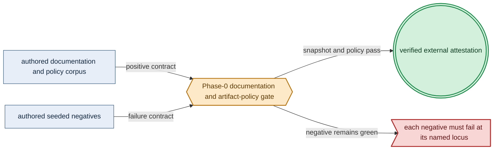
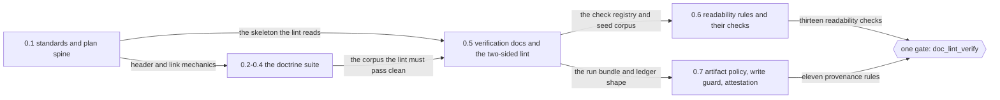

# Phase 0: Documentation suite (whole DSL)

> **Purpose**: Govern the complete amoebius DSL specification and engineering doctrine, with one Phase-0 gate
> over documentation, artifact provenance, repository hygiene, and the link graph.
> **Read this if**: phase 0 is next in the queue, or a later phase depends on what its gate establishes.

Phase 0 delivers the documentation suite (whole DSL); its design is owned by [dsl_doctrine.md](../documents/engineering/dsl_doctrine.md), [low_code_ui_runtime_doctrine.md](../documents/engineering/low_code_ui_runtime_doctrine.md), [ui_realtime_coordination_doctrine.md](../documents/engineering/ui_realtime_coordination_doctrine.md), and the plan for reaching it is owned here.
No register: the gate is the documentation lint.
The pre-amendment two-sided checker passed on 2026-08-08; that seal is invalidated, and the current progress
and remaining implementation are stated below.

> **Historical result (invalidated).** Any pass, seal, validation, ledger, receipt, or implementation observation
> in the orientation text above is diagnostic only. The Phase Status section and [tracker](README.md) own current state; the
> target contract below remains normative.

Link-graph metadata

**Status**: Authoritative source
**Supersedes**: N/A
**Referenced by**: DEVELOPMENT_PLAN/README.md, DEVELOPMENT_PLAN/development_plan_standards.md, DEVELOPMENT_PLAN/overview.md, DEVELOPMENT_PLAN/phase_06_illegal_state_corpus.md, DEVELOPMENT_PLAN/system_components.md, documents/documentation_standards.md
**Generated sections**: none

## Contents
- [Phase Status](#phase-status)
- [Phase Summary](#phase-summary)
- [Gate integrity](#gate-integrity)
- [Doctrine adopted](#doctrine-adopted)
- [Sprints](#sprints)
- [Sprint 0.1: Documentation standards + plan-suite spine ✅](#sprint-01-documentation-standards--plan-suite-spine-)
- [Sprint 0.2: DSL core + cross-cutting method doctrine ✅](#sprint-02-dsl-core--cross-cutting-method-doctrine-)
- [Sprint 0.3: Platform, cluster, storage, substrate & image doctrine ✅](#sprint-03-platform-cluster-storage-substrate--image-doctrine-)
- [Sprint 0.4: Secrets/IaC + runtime/transport/determinism doctrine ✅](#sprint-04-secretsiac--runtimetransportdeterminism-doctrine-)
- [Sprint 0.5: Verification, formal-model doctrine & the documentation-lint gate ✅](#sprint-05-verification-formal-model-doctrine--the-documentation-lint-gate-)
- [Sprint 0.6: Readability discipline — document shape, the two diagram registers, and the routing artifacts ✅](#sprint-06-readability-discipline--document-shape-the-two-diagram-registers-and-the-routing-artifacts-)
- [Sprint 0.7: Artifact provenance, ignore coverage, and external evidence ✅](#sprint-07-artifact-provenance-ignore-coverage-and-external-evidence-)
- [Sprint 0.8: The authored negative corpora as one declared set ✅](#sprint-08-the-authored-negative-corpora-as-one-declared-set-)
- [Documentation Requirements](#documentation-requirements)
- [Related Documents](#related-documents)

---

## Phase Status

🔄 Active — reopened 2026-08-14 by the final-layout amendment. The prior seal stands as the record of the run
it describes; what it does not cover is the obligation this phase has just acquired, so the gate is widened
and rerun rather than treated as already satisfied.

**Why it reopened.** [§U](development_plan_standards.md#u-the-final-repository-layout) makes the target
repository tree normative and gives it to this phase, alongside the doctrine suite, the two ignore contracts,
and the artifact-policy machinery this phase already owns. The tree in
[`repository_layout_doctrine.md` §2](../documents/engineering/repository_layout_doctrine.md#2-complete-repository-structure)
previously enumerated thirty-one roots and declared itself exhaustive, but nothing compared it to the tree, so
its rule that a new root needs an amendment first had never decided anything. [§2](../documents/engineering/repository_layout_doctrine.md#2-complete-repository-structure) is now the **target final
layout** — fourteen roots, each justified by what its contents are — and this phase owns the check that the
worktree matches it.

**What the reopened gate must add.** Three checks, and one repair to an instrument that would otherwise fail
to observe them. The checks: every tracked path lies in the target tree; every ignore rule names a path the
tree contains; no authored path outside `DEVELOPMENT_PLAN/` carries a phase ordinal
([§U](development_plan_standards.md#u-the-final-repository-layout) clause 3). Each attributes its findings to
the owning phase through `tools/migration_allowlist.tsv`, on the shrink-only terms
[§S clause 5](development_plan_standards.md#s-universal-artifact-hygiene-gate) already sets — without that,
this phase could not close until the last one did, which inverts the numeric order the plan is built on. The
repair: `AUTHORED_ROOTS` currently skips a listed root that is not a directory instead of reporting it, so a
rename silently removes that tree from the write guard; it must fail closed, with a seeded negative, before
any repository-wide rename runs.

**What is already closed, 2026-08-14.** The doctrine half landed with the amendment: [§2](../documents/engineering/repository_layout_doctrine.md#2-complete-repository-structure) states the target
tree, [§2.1](../documents/engineering/repository_layout_doctrine.md#21-when-a-unit-warrants-its-own-build-package) states the criterion for when a unit warrants its own build package, [§2.2](../documents/engineering/repository_layout_doctrine.md#22-present-day-roots-and-their-required-destination) assigns every present-day
root a destination and an owner, and [§6](../documents/engineering/repository_layout_doctrine.md#6-gitignore-contract)/[§7](../documents/engineering/repository_layout_doctrine.md#7-dockerignore-contract) are now exhaustive in both directions and reconcile exactly with
`.gitignore` and `.dockerignore` — closing a hole that had let thirty-one patterns exist in the two files that
no doctrine declared. Every divergence the amendment exposed is recorded in
[`legacy_tracking_for_deletion.md`](legacy_tracking_for_deletion.md#layout-and-naming-divergence-snapshot--2026-08-14)
with an owner and a closure condition.

**The prior seal — 2026-08-13.** All nine sides of `python3 tools/doc_lint_verify.py` passed and the run
published a verified external attestation bound to its source-snapshot digest. That result is not retracted;
it is superseded as *closure* because the gate it describes did not include the target-tree postcondition.

**Reopened and closed on 2026-08-13.** Commit `0526152` first tracked this phase's own machinery —
`artifact_policy.py`, `artifact_policy_selftest.py`, `attestation.py`, `gate_common.py`,
`phase1_negative_corpus.py`, and the registry/allowlist tables. The scan keyed on the tracked tree, so it had
never seen its own **seeded negative corpora**; once it did, the `policy` side reported seven findings against
synthetic inputs whose only purpose is to make each rule fire. That is a finding Phase 0 owns, and
[§S clause 5](development_plan_standards.md#s-universal-artifact-hygiene-gate) allows a finding to be deferred
*to* its owning phase and never *out of* it, so it closed before this phase resealed.

**What closed it.** [`repository_layout_doctrine.md` §3.6](../documents/engineering/repository_layout_doctrine.md#36-authored-negative-corpora-and-their-audit-scope)
now declares the authored negative corpora as **one set**, each row naming the rules that corpus deliberately
seeds. The audit parses that table, suppresses exactly those pairings, and reports at the new twelfth rule any
row that names an unknown rule, a path that no longer exists, or a rule it has stopped seeding — so an
exemption cannot widen or outlive its reason. Sprint 0.8 records the two structural consequences: the
attestation refusal corpus moved into its own module so the adapter itself stays fully scanned, and every rule
that asks what a build or gate reads and writes now keys on the source snapshot rather than the tracked tree.

**Superseded seal — historical record:** ✅ Done — sealed 2026-08-12. All nine sides of `python3 tools/doc_lint_verify.py` passed, including a snapshot
side that copies every non-ignored file into a scratch tree and lints the governed corpus there, so no ignored
worktree file can be an input. The run publishes a verified external attestation bound to the snapshot digest. The seeded negatives materialize under `gen/test-corpora/doc_lint/` instead of being
committed, the run-time surface enumeration joins completely to an authored expectation, the ledger is emitted
into `gen/runs/phase_00/<run-id>/`, the artifact-policy rules each turn red on their own seeded
negative, and the write guard observes no authored path change.

**2026-08-12 amendment.** The gate precondition changed shape in the same change that closed the phase. The
earlier contract demanded a pristine committed worktree and treated any other run as diagnostic, which made
every phase closure wait on an unrelated human act. It is withdrawn: a result now binds to the **source
snapshot** — every non-ignored file as the run saw it — and commit timing is the operator's alone
([development_plan_standards.md §S](development_plan_standards.md#s-commit-timing)). Check `t` fails any
governed document that reasserts the old rule, so the two cannot drift apart again.

**Observed progress:** **Policy-conformant.** The 2026-08-11 audit recorded 410 tracked reproducible negative
copies, a verifier that could not run without ignored inputs, and an artifact checker with no semantic
provenance, write guard, effective Docker context, history disposition, or attestation. Each is implemented
and exercised two-sided; the dispositions are in
[legacy_tracking_for_deletion.md](legacy_tracking_for_deletion.md#phase-0-closure-disposition--2026-08-12).

**Invalidated historical record:**

Historical result (invalidated): on 2026-08-08, `python3 tools/doc_lint_verify.py` passed on substrate `none`: the governed tree and
41 seeded documentation negatives passed two-sided; the ledger checker accepted its positive and rejected all
six malformed cases; and the manifest audit resolved 199 independent oracle/mutant artifacts across 18 future
gate owners. That run's generated evidence does not belong in this plan. Every prescriptive statement in
the authored doctrine remains design intent, never a tested amoebius runtime result; this phase stood up no
cluster and ran no workflow.

## Phase Summary

This phase owns the **entire documentation suite** — the DSL specification and every doctrine in the
[engineering doctrine index](../documents/engineering/README.md), plus the plan suite that sequences the
implementation phases. It is the one phase whose deliverable *is* prose: the orchestration Dhall DSL and its
illegal-state-unrepresentable contract; service capabilities and the capability→provider→shape binder; typed
manifest generation and the SSA reconciler; the standard platform services; storage lifecycle; substrate,
cluster-topology, and resource-capacity models; Vault/PKI and Pulumi-from-inside; the daemon-topology grid;
host↔cluster comms; the native Pulsar client; content-addressing and determinism; tenancy; the verification
layer; the bounded low-code UI language and generic browser/server runtime; authenticated cross-pod
WebSocket coordination; explicit encrypted browser-offline continuity and authoritative replay; and the cross-cutting method
doctrines. It also authors the plan spine — the rulebook, the live
tracker, and the target architecture/inventory/substrate documents — so every later phase cites doctrine by
name when it schedules adoption work.

The suite is written to the reversed intent that governs the whole plan. The control-plane singleton is a
Kubernetes Deployment with `replicas=1` whose single-writer authority is **delegated to k8s/etcd through the mandatory reconciler `Lease`** — there is no bespoke election and no standby pod, and its durable state is the
Vault-enveloped MinIO bucket, not a PVC. ML engines, models, and kernels are **named catalog identities**
jit-resolved on first miss into a `CacheBudget`-bounded content-addressed cache — never baked, never
URL-fetched. amoebius's one formal proof obligation is the **cross-cluster gateway migration**, both the
`Planned` and `Failover` branches, modelled once as data. Generated artifacts (k8s manifests, the emitted
`.tla`/`.cfg`, the reflected Dhall schema, the PureScript contracts) are emitted from a Haskell source of truth
and never committed. Validation runs in three phase-gate registers (1 pure/golden · 2 boundary-with-fakes ·
3 live) plus the Register-2.5 deterministic-simulation activity; rendering a plan or `--dry-run` never requires
live infrastructure. The suite's naming and header mechanics adapt conventions proven in the sibling
**prodbox** project — that is sibling evidence, not an amoebius result.

This phase runs in **no amoebius validation register (Register —)**: documentation tooling executes, but no
register-1/2/3 amoebius harness or product behavior is exercised. The cross-cutting invariants the whole plan upholds are
first written down here and then adopted, phase by phase, by the pre-cluster and live bands that follow.

**Session scope:** Complete the one documentation/link-graph re-baseline and run
`python3 tools/doc_lint_verify.py`; split before continuing if the work introduces implementation code, a new
runtime surface, or an acceptance command other than the two-sided documentation gate.

**Substrate:** none ([§L](development_plan_standards.md#l-one-substrate-discipline)) — the gate is a pure documentation lint over text and the link graph; it touches no
`apple`, `linux-cpu`, `linux-cuda`, or `windows` host and stands up no resources.

**Register:** — (no register: the documentation-lint gate validates text and the link graph, not amoebius behaviour, [§K](development_plan_standards.md#k-honesty-proven--tested--assumed)).

**Gate:** against its source snapshot, `python3 tools/doc_lint_verify.py` passes the documentation, semantic
artifact-provenance, target-tree, ignore/context, authored-root-write, source-closure, dynamic-resolution,
reachable-history, external-attestation, terminology, and seeded-mutant checks without creating an unignored
or tracked generated file.

## Gate integrity

The gate verifies all governed headers, contents blocks, anchors, bidirectional links, status equality, phase
numbering, gate ownership, illegal-state coverage, and documentation negative cases. It additionally verifies:

- the generator registry covers every output class in repository-layout doctrine;
- `.gitignore` and `.dockerignore` cover the normative patterns exactly or more strictly;
- tracked files contain no generated output, lock/freeze file, package checksum database, hard-coded
  library/package SHA, generated evidence, bytecode, or developer-home path;
- every authored input referenced by a build or gate exists in the source snapshot, including reviewed patches;
- semantic classification rejects generated copies beneath otherwise authored roots;
- Python commands use ordinary bytecode caching, and every resulting cache is excluded from Git and Docker;
- generated Markdown is absent from governed roots;
- a synthetic generator cannot write beneath an authored root;
- a synthetic run bundle validates and uploads to the external-attestation test backend;
- a case-insensitive repository scan finds no retired predecessor terminology for the Bootstrap Coordinator;
- reachable history is audited for secrets, generated files, and obsolete names, with the required disposition
  recorded separately from unreachable local objects;
- every authored negative corpus is declared in doctrine with the rules it seeds, and a declared row that
  names an unknown rule, a missing path, or a rule it no longer seeds is reported as a stale exemption;
- every seeded negative for these rules turns the gate red at its expected locus.

The independent oracle is the authored positive seed, mutation definition, and expected diagnostic for every
check. Materialized negatives, scan results, enumeration, logs, and ledgers remain under
`gen/runs/phase_00/`, `gen/test-corpora/`, or temporary storage and are externally attested. They are never
copied into the plan or another authored root.

*Design intent. The redesigned Phase-0 gate joins authored policy with two-sided failure cases and retains only an external attestation.*

## Doctrine adopted

This phase *authors* every document in the suite; the citations below point at the flagship section each doc
owns and state what Phase 0 commits to writing. Each is cited by relative link and by the section's human
name.

- [`documentation_standards.md §3`](../documents/documentation_standards.md#3-required-header-metadata) — the
  *Required header metadata* block, with the SSoT-first philosophy and the bidirectional cross-referencing rule:
  the three mechanics the gate's lint checks.
- [`dsl_doctrine.md §5`](../documents/engineering/dsl_doctrine.md#5-the-illegal-state-unrepresentable-contract) —
  *The illegal-state-unrepresentable contract*: the typed spec gates (the Dhall typechecker and the Haskell typed
  decoder) that make illegal cluster state fail to type-check.
- [`low_code_ui_runtime_doctrine.md §3`](../documents/engineering/low_code_ui_runtime_doctrine.md#3-one-checked-value-two-runtime-plans) —
  *One checked value, two runtime plans*: bounded `UiSource` is checked and bound once, then projected into a
  public client plan and private server plan with no raw-code or provider escape.
- [`ui_realtime_coordination_doctrine.md §5`](../documents/engineering/ui_realtime_coordination_doctrine.md#5-redis-is-ephemeral-platform-internal-coordination) —
  *Redis is ephemeral platform-internal coordination*: replicated UI-server workers route authenticated
  browser WebSockets across pods without sticky-session correctness, while durable cursors and receipts stay
  in Pulsar, projections, or the effect-owning provider.
- [`browser_offline_runtime_doctrine.md §3`](../documents/engineering/browser_offline_runtime_doctrine.md#3-the-authored-continuity-surface) —
  *The authored continuity surface*: a checked `OnlineOnly | Offline OfflineSource` choice
  compiles to bounded public persistence and private replay plans without exposing browser or Redis products
  to authored applications.
- [`conformance_harness_doctrine.md §2`](../documents/engineering/conformance_harness_doctrine.md#2-the-registers-as-amoebius-uses-them-for-pre-cluster-validation) —
  *The registers*: the three named validation registers (Register 1 pure/golden, Register 2 boundary-with-fakes,
  Register 3 live) — and
  [`§3`](../documents/engineering/conformance_harness_doctrine.md#3-the-load-bearing-invariant-rendering-never-touches-live-infrastructure),
  *rendering never touches live infrastructure*.
- [`formal_model_doctrine.md §3`](../documents/engineering/formal_model_doctrine.md#3-two-total-renderings) —
  *Two total renderings*, and
  [`§4`](../documents/engineering/formal_model_doctrine.md#4-single-source-correspondence),
  *Single-source correspondence*: one reifiable Haskell `Model` renders both the runtime `interpret` function
  and the generated, never-committed `.tla` via `emitTLA`.
- [`gateway_migration_model_doctrine.md §1`](../documents/engineering/gateway_migration_model_doctrine.md#1-the-one-obligation) —
  *The one obligation*: the cross-cluster gateway migration, both `Planned` and `Failover` branches, is
  amoebius's single simulation/proof obligation — reduced to every `InForceSpec` by a decode-time structural-fit
  fold, never a per-spec model-check. There is no First-Axis / singleton-election obligation.
- [`generated_artifacts_doctrine.md §3`](../documents/engineering/generated_artifacts_doctrine.md#3-the-rule) —
  *The rule*: every reproducible projection and every run-evidence artifact is generated and never committed;
  only independently authored source, policy, fixtures, oracles, and reviewed external immutable inputs belong
  in version control.
- [`daemon_topology_doctrine.md §3`](../documents/engineering/daemon_topology_doctrine.md#3-the-control-plane-singleton) —
  *The control-plane singleton*: a Deployment `replicas=1`, stateless (no PVC), single-instance delegated to
  k8s/etcd through the mandatory reconciler Lease ([§3.1](../documents/illegal_state/illegal_state_storage.md#31-bad--illegal-durable-storage), no bespoke election), durable state the
  Vault-enveloped MinIO bucket; [§3.3](../documents/illegal_state/illegal_state_security.md#33-misconfigured-gateway) separately owns the same-binary capacity-scheduler role with no singleton
  or secret authority.
- [`content_addressing_doctrine.md §4.5`](../documents/engineering/content_addressing_doctrine.md#45-the-ml-asset-lifecycle-one-bounded-content-addressed-cache-resolved-on-first-miss) —
  *The ML-asset lifecycle*: each engine/model/kernel is a named catalog identity the shared `jit-build` resolver
  materializes on first miss into a `CacheBudget`-bounded content-addressed cache — never baked, never
  URL-fetched.
- [`lift_and_compose_doctrine.md §1`](../documents/engineering/lift_and_compose_doctrine.md#1-why-this-doctrine-exists) —
  *Why this doctrine exists*: amoebius lifts and re-homes the proven primitives of prodbox/hostbootstrap/
  infernix/jitML rather than reimplementing them; their handwritten PureScript demo clients are migration
  evidence whose interaction requirements are recast as bounded `UiSource`, not amoebius application code.
- [`tenancy_doctrine.md §1`](../documents/engineering/tenancy_doctrine.md#1-why-this-doctrine-exists) —
  *Why this doctrine exists*: the first-class `TenantId` orthogonal to the cluster axis, so a valid `InForceSpec`
  cannot name a foreign tenant's resource.
- [`chaos_failover_doctrine.md §12`](../documents/engineering/chaos_failover_doctrine.md#12-the-moral-core--proven-tested-assumed) —
  *The moral core — proven, tested, assumed*: the honesty ledger the documentation standard and this whole plan
  inherit.
- [`testing_doctrine.md §1`](../documents/engineering/testing_doctrine.md#1-a-test-is-an-amoebius-spec) —
  *A test is an amoebius spec*: test-as-`InForceSpec` (spin up → run → always tear down), `suggest-test`, and the
  per-run ledger artifact — and
  [`§9`](../documents/engineering/testing_doctrine.md#9-derivation-generated-enumeration-authored-expectation),
  *Derivation: generated enumeration, authored expectation*: the enumeration/expectation split and the coverage
  obligation whose catalog-side half this phase's lint check (g) enforces.
- [`testing_doctrine.md §12`](../documents/engineering/testing_doctrine.md#12-spoof-resistant-evidence-a-gate-observes-an-unforgeable-fresh-effect) —
  *Spoof-resistant evidence*: effectful gates prove a post-start challenge through an authenticated observer
  outside the system under test.
- [`illegal_state_catalog.md`](../documents/illegal_state/illegal_state_catalog.md) — the *illegal-state catalog*
  index and its themed sub-catalogs: the numbered entry set, each carrying a `**Validation-locus:**`, that
  check (g) validates as a well-formed enumeration before any fixture exists to join against.
- [`tla_modelling_assumptions.md`](../documents/engineering/tla_modelling_assumptions.md#why-this-doc-is-deprecated) —
  authored as a **deprecated redirect stub**: its content is re-homed to `formal_model_doctrine.md` and
  `gateway_migration_model_doctrine.md`, and its header carries `Status: Deprecated` so the lint accepts the
  redirect rather than flagging an orphan.

## Sprints

> Note: the per-sprint **Independent Validation** blocks below describe what the Sprint 0.5 documentation lint
> checks over each sprint's docs; they are realized once that lint lands. There is no in-sequence, tool-present
> validation at each sprint's own point in the order — the phase gate is a single end-of-phase two-sided run,
> so "validated in isolation" names the per-doc-group scope of the check, not the moment it can first execute.

*Design intent. Each sprint hands the next the artifact it checks: the spine fixes the shape, the doctrine supplies the corpus, the lint supplies the registry, and the last two sprints add the checks the single gate runs. The seam rule is owned by [development_plan_standards.md §O](development_plan_standards.md#o-sprint-sized-seams-and-bounded-phase-gates).*

## Sprint 0.1: Documentation standards + plan-suite spine ✅

**Status**: Done
**Implementation**: `documents/documentation_standards.md`,
`DEVELOPMENT_PLAN/development_plan_standards.md`, `DEVELOPMENT_PLAN/README.md`,
`DEVELOPMENT_PLAN/overview.md`, `DEVELOPMENT_PLAN/system_components.md`, `DEVELOPMENT_PLAN/substrates.md`,
`DEVELOPMENT_PLAN/legacy_tracking_for_deletion.md`, `DEVELOPMENT_PLAN/later_phases.md`, and the
`phase_00`…`phase_64` phase docs (authored; artifact audit remains)
**Blocked by**: none
**Independent Validation**: lint the spine files in isolation — each carries a valid header block, the status vocabulary
and per-phase/per-sprint skeletons are defined, the 65-phase overview table is internally consistent, and
every intra-plan link resolves.
**Docs to update**: the spine files above and
`documents/engineering/README.md`

### Objective

Adopt [`documentation_standards.md §3`](../documents/documentation_standards.md#3-required-header-metadata) —
*Required header metadata* — with the SSoT-first philosophy and bidirectional cross-referencing: establish the
header/link mechanics and the plan-suite structure every other document and phase obeys. The naming and header
conventions adapt the sibling prodbox project's documentation discipline (sibling evidence, then specialized for
amoebius's snake_case rule), and the tracker is rebuilt for 65 contiguous single-gate phases.

### Deliverables

- The documentation standard (header block, naming, SSoT/no-duplication, bidirectional links, honesty, tone,
  diagram rules).
- The plan rulebook (`development_plan_standards.md`): the [§A](development_plan_standards.md#a-header-metadata-same-block-as-the-doctrine-suite)–[§M](development_plan_standards.md#m-gate-integrity-a-gate-cannot-be-passed-by-a-stub) disciplines (header, snake_case layout, status vocabulary, per-phase skeleton, one-phase model, sprint block format, Documentation Requirements, doctrine-citation rule, generated markers, cross-ref path rules, honesty, one-substrate, gate integrity).
- The live tracker (`README.md`): the Document Index, the 65-phase Overview table with its one-line gates and
  substrate/register columns, the status vocabulary, the phase discipline, and the cross-cutting invariants.
- `overview.md`, `system_components.md`, `substrates.md`, `legacy_tracking_for_deletion.md`, `later_phases.md`,
  and the per-phase docs' spine.

### Validation

1. Run the documentation lint (Sprint 0.5 tool) over the spine files: all headers valid, no orphan links, no
   duplicated normative content.
2. Every doctrine doc and every phase doc can cite the standard's section anchors by name (the doctrine-citation
   rule resolves).

### Remaining Work

None.

## Sprint 0.2: DSL core + cross-cutting method doctrine ✅

**Status**: Done
**Implementation**: `documents/engineering/dsl_doctrine.md`,
`app_vs_deployment_doctrine.md`, `illegal_state_catalog.md` (the pure index) and its eight themed
sub-catalogs (`illegal_state_storage.md`, `illegal_state_topology.md`, `illegal_state_capacity.md`,
`illegal_state_security.md`, `illegal_state_capability_messaging.md`, `illegal_state_ml_asset.md`,
`illegal_state_multicluster.md`, `illegal_state_lifecycle.md`) and the `illegal_state_techniques.md`
coverage matrix, `service_capability_doctrine.md`, `tenancy_doctrine.md`, `lift_and_compose_doctrine.md`,
`generated_artifacts_doctrine.md`, `conformance_harness_doctrine.md`, `low_code_ui_runtime_doctrine.md`,
`ui_realtime_coordination_doctrine.md`, `browser_offline_runtime_doctrine.md` (authored; artifact audit
remains)
**Blocked by**: Sprint 0.1
**Independent Validation**: lint the DSL-core and method docs together —
the illegal-state catalog links to the DSL contract rather than restating it; the register model and the
generated-never-committed rule are each owned by exactly one doc and referenced elsewhere.
**Docs to update**: the docs above and `documents/engineering/README.md`

### Objective

Adopt [`dsl_doctrine.md §5`](../documents/engineering/dsl_doctrine.md#5-the-illegal-state-unrepresentable-contract) —
*The illegal-state-unrepresentable contract*,
[`conformance_harness_doctrine.md §2`](../documents/engineering/conformance_harness_doctrine.md#2-the-registers-as-amoebius-uses-them-for-pre-cluster-validation) —
*The registers*,
[`generated_artifacts_doctrine.md §3`](../documents/engineering/generated_artifacts_doctrine.md#3-the-rule) —
*The rule*,
[`lift_and_compose_doctrine.md §1`](../documents/engineering/lift_and_compose_doctrine.md#1-why-this-doctrine-exists),
and [`tenancy_doctrine.md §1`](../documents/engineering/tenancy_doctrine.md#1-why-this-doctrine-exists): write the
DSL core (the orchestration surface, the typed spec gates, the app-logic/deployment split, the illegal-state
catalog with honest foreclosure layers, the capability binder, the tenant axis) and the cross-cutting method
doctrines (the three validation registers, the generated-never-committed rule, and lift-and-compose).

### Deliverables

- `dsl_doctrine.md`, `app_vs_deployment_doctrine.md`, `illegal_state_catalog.md` (the pure index) with its
  eight themed sub-catalogs (`illegal_state_storage.md`, `illegal_state_topology.md`,
  `illegal_state_capacity.md`, `illegal_state_security.md`, `illegal_state_capability_messaging.md`,
  `illegal_state_ml_asset.md`, `illegal_state_multicluster.md`, `illegal_state_lifecycle.md`) and the
  `illegal_state_techniques.md` coverage matrix that check (g) validates,
  `service_capability_doctrine.md`, `tenancy_doctrine.md`, `low_code_ui_runtime_doctrine.md`,
  `ui_realtime_coordination_doctrine.md`, `browser_offline_runtime_doctrine.md`.
- `conformance_harness_doctrine.md`: the registers and the rendering-never-touches-live invariant.
- `generated_artifacts_doctrine.md`: the emit-from-source, never-commit rule for manifests, the `.tla`/`.cfg`,
  the reflected Dhall schema, and the PureScript contracts.
- `lift_and_compose_doctrine.md`: the reuse map and migration of sibling demo flows into bounded UI modules.

### Validation

1. Lint resolves every cross-link among the DSL-core and cross-cutting docs and to the spine.
2. The catalog's foreclosure layers are stated honestly (proven-by-typecheck vs enforced-at-runtime), with no
   "it compiles ⇒ the cluster enforces it" overclaim.

### Remaining Work

None.

## Sprint 0.3: Platform, cluster, storage, substrate & image doctrine ✅

**Status**: Done
**Implementation**: `documents/engineering/platform_services_doctrine.md`,
`storage_lifecycle_doctrine.md`, `cluster_lifecycle_doctrine.md`, `gateway_migration_doctrine.md`,
`readiness_ordering_doctrine.md`, `single_logical_data_plane_doctrine.md`, `cluster_topology_doctrine.md`,
`resource_capacity_doctrine.md`, `substrate_doctrine.md`, `apple_metal_headless_builds.md`,
`image_build_doctrine.md`, `manifest_generation_doctrine.md` (authored; lint remediation remains)
**Blocked by**: Sprint 0.1
**Independent Validation**: lint the platform/cluster docs together — manifest generation
owns the render/reconcile model, platform-services owns the standard-service inventory, resource-capacity
owns the placement fold, and no doc restates another's normative content.
**Docs to update**: the twelve
docs above and `documents/engineering/README.md`

### Objective

Adopt [`generated_artifacts_doctrine.md §3`](../documents/engineering/generated_artifacts_doctrine.md#3-the-rule)
for the rendered manifests, and write the platform/cluster layer: the standard services (HA-always,
Keycloak-owns-all-ingress), no-Helm typed manifest generation plus the SSA reconciler, `no-provisioner` retained
storage, the cluster lifecycle and typed gateway-migration taxonomy, event-driven readiness ordering, the single
logical data plane, the declared compute-engine/substrate topology, the capacity placement fold, substrate
detection with the no-env/no-`PATH` lazy tool-ensure contract, and baked-binary multi-arch image build with the
`distribution` registry.

### Deliverables

- `platform_services_doctrine.md`, `storage_lifecycle_doctrine.md`, `cluster_lifecycle_doctrine.md`,
  `gateway_migration_doctrine.md`, `readiness_ordering_doctrine.md`, `single_logical_data_plane_doctrine.md`.
- `cluster_topology_doctrine.md`, `resource_capacity_doctrine.md`, `substrate_doctrine.md`,
  `apple_metal_headless_builds.md`.
- `image_build_doctrine.md` (service binaries + the `distribution` registry; the ML engine payloads are the
  deliberate not-baked exception) and `manifest_generation_doctrine.md`.

### Validation

1. Lint resolves all intra-group and spine links; the no-Helm and no-public-pull rules are stated once and
   referenced elsewhere.
2. The substrate doc's no-env/no-`PATH` invariant matches the cross-cutting invariant recorded in `README.md`.

### Remaining Work

None.

## Sprint 0.4: Secrets/IaC + runtime/transport/determinism doctrine ✅

**Status**: Done
**Implementation**: `documents/engineering/vault_pki_doctrine.md`,
`pulumi_iac_doctrine.md`, `daemon_topology_doctrine.md`, `host_cluster_comms_doctrine.md`,
`bootstrap_sequence_doctrine.md`, `network_fabric_doctrine.md`, `pulsar_client_doctrine.md`,
`content_addressing_doctrine.md`, `monitoring_doctrine.md`, `release_lifecycle_doctrine.md` (authored; lint
remediation remains)
**Blocked by**: Sprint 0.1, Sprint 0.2
**Independent Validation**: lint the ten docs
together — Vault owns secrets-root semantics, daemon-topology owns the `replicas=1` singleton model, and
content-addressing owns the jit-resolved ML-asset cache; host-comms and bootstrap reference (not restate)
the capability and Pulsar surfaces from Sprint 0.2.
**Docs to update**: the ten docs above and
`documents/engineering/README.md`

### Objective

Adopt [`daemon_topology_doctrine.md §3`](../documents/engineering/daemon_topology_doctrine.md#3-the-control-plane-singleton) —
*The control-plane singleton* (Deployment `replicas=1`, mandatory Lease, no bespoke election, no PVC) — plus
[§3.3](../documents/illegal_state/illegal_state_security.md#33-misconfigured-gateway)'s separate same-binary capacity-scheduler role — and
[`content_addressing_doctrine.md §4.5`](../documents/engineering/content_addressing_doctrine.md#45-the-ml-asset-lifecycle-one-bounded-content-addressed-cache-resolved-on-first-miss) —
*The ML-asset lifecycle*: write the secrets/IaC and runtime/transport/determinism layers. The bootstrap doctrine
records that the pre-binary **bootstrap coordinator is a Python `pb` CLI** (two modes: bootstrap coordinator and admin-REST client), not a
shell script; the daemon-topology and content-addressing docs carry the reversed control-plane and
jit-resolved-cache intent.

### Deliverables

- `vault_pki_doctrine.md`, `pulumi_iac_doctrine.md` (in-cluster-only Pulumi, MinIO+Vault-envelope backend).
- `daemon_topology_doctrine.md` (the three contexts; the `replicas=1` singleton under its mandatory Lease, no
  bespoke election; separate capacity-scheduler and worker roles), `host_cluster_comms_doctrine.md`, `bootstrap_sequence_doctrine.md` (the `pb`
  bootstrap coordinator + admin-REST client), `network_fabric_doctrine.md`.
- `pulsar_client_doctrine.md` (native protocol, CBOR-only payloads), `content_addressing_doctrine.md`
  (three-tier store, `experimentHash`, the jit-resolved `CacheBudget`-bounded engine cache),
  `monitoring_doctrine.md`, `release_lifecycle_doctrine.md`.

### Validation

1. Lint resolves every cross-link, including the back-references from host-comms/bootstrap to the
   capability/Pulsar docs authored in Sprint 0.2.
2. The daemon-topology doc states honestly that single-instance safety is a k8s/etcd property, not an amoebius
   election, and carries no standby-pod or ranked-failover language.

### Remaining Work

None.

## Sprint 0.5: Verification, formal-model doctrine & the documentation-lint gate ✅

**Status**: Done — the two-sided run is green against the source snapshot; the negatives materialize under
`gen/test-corpora/doc_lint/` and no verifier input is an ignored worktree file
**Implementation**: `documents/engineering/chaos_failover_doctrine.md`,
`testing_doctrine.md`, `test_derivation_analysis.md`, `formal_model_doctrine.md`,
`gateway_migration_model_doctrine.md`, `tla_modelling_assumptions.md` (deprecated stub),
`tools/doc_lint.py`, `tools/doc_lint_verify.py` (the two-sided gate runner),
`tools/doc_lint_corpus/_positive/` and `_build.py`,
`test/golden/phase_{16..23,36,38,40,50,52,55..58}_*` with the matching
`test/mutants/phase_{16..23,36,38,40,50,52,55..58}_*`, `test/formal/mutants/emitTLA-mut-0{1..4}`, the
`ToyModel` hand-derived reachable-distinct-state table, the expected `INVARIANT`/`PROPERTY` name set, and
`tools/ledger_lint.py`.
**Blocked by**: Sprint 0.1, Sprint 0.2, Sprint 0.3, Sprint 0.4
**Independent Validation**: run the lint **two-sided** over the source snapshot — clean across the governed
`documents/` and `DEVELOPMENT_PLAN/` trees, **and** non-zero on every case materialized from the authored
positive seeds and mutation definitions. Validation 2 below names the mutation each check is proven red by.
**Docs to update**: the five
verification docs above, `DEVELOPMENT_PLAN/README.md` (record the gate command),
`documents/engineering/README.md`

### Objective

Adopt [`chaos_failover_doctrine.md §12`](../documents/engineering/chaos_failover_doctrine.md#12-the-moral-core--proven-tested-assumed) —
*The moral core — proven, tested, assumed*,
[`testing_doctrine.md §1`](../documents/engineering/testing_doctrine.md#1-a-test-is-an-amoebius-spec) —
*A test is an amoebius spec*,
[`formal_model_doctrine.md §4`](../documents/engineering/formal_model_doctrine.md#4-single-source-correspondence) —
*Single-source correspondence*, and
[`gateway_migration_model_doctrine.md §1`](../documents/engineering/gateway_migration_model_doctrine.md#1-the-one-obligation) —
*The one obligation*: write the verification layer — the proven/tested/assumed ledger, test-as-`InForceSpec`,
the model-as-data pattern, and amoebius's single gateway-migration proof obligation — and build the standalone
checker that *is* the Phase 0 gate.

### Deliverables

- `chaos_failover_doctrine.md` (the Extract→Model→Inject moves, the proven/tested/assumed ledger, the Second
  Axis of async cross-cluster failover) and `testing_doctrine.md`, together with
  `test_derivation_analysis.md`, the analysis record behind the derivation boundary.
- `formal_model_doctrine.md` (one reifiable `Model`, two total renderings, single-source correspondence) and
  `gateway_migration_model_doctrine.md` (the one obligation, both `Planned` and `Failover` branches, reduced by
  a decode-time structural-fit fold).
- `tla_modelling_assumptions.md`: a `Deprecated` redirect stub pointing at the two docs above.
- The UI-gate fixture set named by Phases 16–23, 36, 38, 40, 50, 52, and 55–58 — the
  `test/golden/phase_*` regression fixtures and the correspondingly named `test/mutants/phase_*` seeded
  mutants, which are what the provenance review below runs on. Each candidate expectation is
  classified by history and independent review. Same-commit additions remain regression fixtures until
  reviewed or replaced. A generated run-local registry maps retained source to its owner and reject locus.
- The convention-independent Phase-2 formal-model oracles, pinned here before `Interpret.hs`/`EmitTLA.hs`
  exist ([`phase_02`](phase_02_formal_model_kernel.md)): `test/formal/mutants/emitTLA-mut-0{1..4}`, the
  `ToyModel` hand-derived reachable-distinct-state table, and the expected `INVARIANT`/`PROPERTY` name set.
  The byte-exact `test/formal/golden/ToyModel.{tla,cfg}.golden` is **not** pinned here: under
  [`development_plan_standards.md §M`](development_plan_standards.md#m-gate-integrity-a-gate-cannot-be-passed-by-a-stub)
  a byte-exact golden is pinned no earlier than the sprint fixing its rendering convention, which is
  Phase 2's.
- `tools/doc_lint.py`: a pure text/link checker (no amoebius-binary dependency), run **two-sided** — it must
  pass clean on the suite **and** fail on every case generated from the authored lint seeds and mutation
  definitions. It checks,
  mechanically: (a) valid header metadata — decomposed per the documentation standard's five facets: a `Status`
drawn from the enum with vague values banned, a `Supersedes` field, a `Referenced by` field, `Generated
sections` keys that match the real in-body markers, and a one-sentence `Purpose` — each an independently
seeded sub-check; (b) every anchored relative link resolves under the [§4](../documents/documentation_standards.md#4-cross-referencing) slug rule,
and **no bare `§N` section reference** appears outside a Markdown link label, heading, fenced/Mermaid block,
`§M.N` clause-shorthand, or external-project reference — a section citation must be an anchor link, never bare
`§N` prose (the lint flags any `§`-plus-digit occurring in prose that is not one of those forms);
  (c) every `Referenced by` header reconciled in both directions from the true link graph; (d) **near-duplicate normative content** by a named method — sentence-shingle overlap above a stated threshold between two governed
  docs outside quoted/exempt blocks (semantic SSoT *ownership* is a documented hand review, not a lint verdict);
  (e) **status-consistency** — each README Phase-Overview marker equals that phase doc's `## Phase Status`
  marker; (f) **gate-integrity** ([`development_plan_standards.md §M`](development_plan_standards.md#m-gate-integrity-a-gate-cannot-be-passed-by-a-stub)) —
  every phase Gate names its committed fixtures/goldens, ≥1 committed mutant, and an independent oracle;
  an effectful gate also names a post-start fresh challenge and outside observer, and a security gate names
  authority-minted credentials, an own/foreign-scope pair, a zero-forbidden-effect observation, and bypass
  probes —
  **following one anchor hop** from the `**Gate:**` line into the phase's `## Gate integrity` section where the
  gate delegates to it ([§M](development_plan_standards.md#m-gate-integrity-a-gate-cannot-be-passed-by-a-stub) Gate → Gate-integrity delegation), so a gate whose apparatus lives one hop away is not flagged —
  and a
  ✅ Done row carries a recorded gate command + date + substrate + ledger hash. The gate command is recorded in
  the tracker; and (g) **illegal-state catalog integrity** — every `### 3.N` entry across the eight themed
  sub-catalogs (`illegal_state_storage.md`, `_topology.md`, `_capacity.md`, `_security.md`,
  `_capability_messaging.md`, `_ml_asset.md`, `_multicluster.md`, `_lifecycle.md` — **not**
  [`illegal_state_catalog.md`](../documents/illegal_state/illegal_state_catalog.md), which is the pure index
  and holds no `### 3.N` entries) carries a `**Validation-locus:**` field, entry numbering is contiguous with
  no gaps or duplicates, every [`illegal_state_catalog.md`](../documents/illegal_state/illegal_state_catalog.md)
  index bullet's anchor resolves to a real heading, and every entry carries a row in the
  [`illegal_state_techniques.md`](../documents/illegal_state/illegal_state_techniques.md) coverage matrix; and
  (h) **plan back-link** — every doctrine doc under `documents/engineering/` contains a link back to
  `DEVELOPMENT_PLAN/README.md`, guarding the documentation standard's back-link rule against future rot.
  Check (g) is the **catalog-side** half of the coverage obligation of
  [`testing_doctrine.md §9`](../documents/engineering/testing_doctrine.md#9-derivation-generated-enumeration-authored-expectation) —
  it validates the enumeration the fixture join will later consume. The *fixture* half (an entry with no
  committed witness yields an UNVERIFIED row) is **not** in Phase 0: it requires the
  `Delivery-owner:`/`Case-family:` enrichment and the `locus_registry.tsv` that
  [`phase_06`](phase_06_illegal_state_corpus.md) Sprint 6.1 owns, and no fixture exists to join against
  until then. An explicit `<a id="...">` is a valid anchor target for (b) and (g): the suite uses it to keep
  inbound links alive across a heading rename.
- `tools/doc_lint_corpus/_positive/`, `_build.py`, and an authored expected-diagnostic table: **at least one
  mutation per check (a)–(f) and (h), with (a) decomposed into one mutation per header facet, and one per
  sub-check of (g)**. `_build.py` creates each minimal single-defect copy beneath `gen/test-corpora/` from a
  conforming positive seed. The lint must detect the seeded defect by check identity, not the generated path,
  so a stub that keys on fixture identity cannot pass both sides. Materialized copies are never committed. The
  malformed-ledger negative is **not** in this corpus; it lives in `ledger_lint`'s own corpus below.
- `tools/ledger_lint.py`: a schema checker for the proven/tested/assumed ledger
  ([`testing_doctrine.md §4`](../documents/engineering/testing_doctrine.md#4-no-skips-fail-fast-and-the-per-run-ledger-artifact)) —
  the `{phase, gate_command, register, substrate, date, layers, coverage, ledger_hash}` shape, `register`/`substrate`
  equal to the tracker row, every out-of-register correctness layer a mandatory UNVERIFIED `layers` row, and
  every `coverage` row's `surface` resolving against the run's regenerated enumeration (an unresolvable
  `surface` fails the lint) — with its own committed malformed-ledger negatives, including a `coverage` row
  naming a non-existent surface.
- Both checkers are standalone scripts that do not depend on the amoebius binary, which first appears in the
  pre-cluster implementation band from Phase 2 onward, and both are **Python** — matching the pre-binary `pb`
  bootstrap coordinator ([README.md](README.md#toolchain)) and the recorded decision against bash logic
  ([`dsl_doctrine.md §2`](../documents/engineering/dsl_doctrine.md#2-two-languages-one-system-dhall-carries-params-haskell-carries-logic)).
  A shell script is not admitted.

### Validation

1. From the source snapshot, the lint generates its negative cases under `gen/test-corpora/`, passes the governed
   suite, and exits non-zero with an actionable message for every generated case.
2. The authored mutation set covers each check — a broken header (a), a dangling anchor and a bare `§N`
   prose reference (b), a one-way
   bidirectional link (c), a near-duplicate normative paragraph (d), a drifted status marker (e), a gate line
   missing its committed mutant/oracle (f), and — for catalog integrity (g) — a catalog entry missing its
   `**Validation-locus:**`, non-contiguous catalog numbering, a catalog index bullet with a dangling anchor,
   and a catalog entry with no technique-matrix row — plus a doctrine doc missing its
   `DEVELOPMENT_PLAN/README.md` back-link (h) — each causing a
   non-zero exit with a message naming the offending file and check; `ledger_lint` likewise fails on its
   malformed-ledger negatives.
3. The formal-model docs unambiguously separate what a green model-check proves (the protocol, in the abstract)
   from the model↔code correspondence and runtime fidelity discharged in the later implementation phases.
4. Every candidate UI oracle is classified through Git chronology and recorded independent review. A fixture
   introduced with its subject remains a regression fixture, and every effect/security gate declares all
   applicable spoof-resistant evidence fields.

### Remaining Work

None for the negative corpus, the ignored-input dependency, or the fresh-clone run. `_build.py` materializes
all 41 negatives under `gen/test-corpora/doc_lint/`, the 410 reproducible copies are deleted, the run enumerates
its own surfaces into `gen/test-surfaces/phase_00.json` and emits its ledger into the run bundle, and both hard
check families (`b1`, `c`) are clear because no authored document links into an ignored generated root any
longer. The fixture-provenance review of the Phase-16–23 UI oracles is carried as an open obligation on those
phases rather than here, recorded in
[legacy_tracking_for_deletion.md](legacy_tracking_for_deletion.md#generated-artifact-and-terminology-migration--2026-08-11).

## Sprint 0.6: Readability discipline — document shape, the two diagram registers, and the routing artifacts ✅

**Status**: Done — every hard readability diagnostic is cleared; `p3`, `p5`, and `p6` stay advisory
**Implementation**: `documents/documentation_standards.md`,
`DEVELOPMENT_PLAN/development_plan_standards.md`, the retitled
`documents/engineering/diagram_conventions.md`, the new `documents/glossary.md` and
`documents/reading_order.md`, the `resource_capacity_*` and `chaos_failover_*` families, and checks
`o1`–`o5`, `q1`–`q5`, and `p1`–`p4` in `tools/doc_lint.py`.
**Blocked by**: Sprint 0.5, after Sprint 0.1 supplied the header and link mechanics these rules extend.
**Independent Validation**: the two-sided lint. Each of the thirteen checks has an authored mutation and
expected diagnostic; its generated case turns the gate red naming that check and no other.
**Docs to update**:
`documents/documentation_standards.md`, `development_plan_standards.md`,
`documents/engineering/diagram_conventions.md`, `documents/README.md`, `README.md`.

### Objective

Make a governed document navigable and self-orienting before it is read, and make that property enforced
rather than conventional.

### Deliverables

- The document-shape rules of [documentation_standards.md §10](../documents/documentation_standards.md#10-document-shape).
- The orientation block of [§11](../documents/documentation_standards.md#11-the-orientation-block), applied to every governed document.
- The term and acronym routing of [§12](../documents/documentation_standards.md#12-naming-what-the-reader-does-not-know), and the glossary it governs.
- The sentence and paragraph budget of [§13](../documents/documentation_standards.md#13-sentence-and-paragraph-budget).
- The canonical section names of [§14](../documents/documentation_standards.md#14-navigation-and-canonical-section-names).
- The family-split rule of [§15](../documents/documentation_standards.md#15-splitting-a-document-into-a-family), instantiated twice.
- The two diagram registers, replacing the repealed syntactic bans in [§7](../documents/documentation_standards.md#7-diagrams).
- The labelled four-part motivation shape of [§9](../documents/documentation_standards.md#9-motivating-a-design-choice), which is what makes it reviewable.
- The plan-suite half of the same discipline, appended to `DEVELOPMENT_PLAN/development_plan_standards.md`:
  the plan-document shape of [§P](development_plan_standards.md#p-plan-document-shape), the two sanctioned
  phase diagrams of [§Q](development_plan_standards.md#q-the-two-phase-diagrams), and the invariant-ownership
  rule of [§R](development_plan_standards.md#r-where-the-cross-cutting-invariants-live).
- Checks `o1`–`o5`, `q1`–`q5` and `p1`–`p4`, each with a seeded negative. The authored lint seeds, mutation
  definitions, and expected diagnostics for them remain source; only their materialized negative copies move
  beneath `gen/test-corpora/`.
- The **`p3` sentence backlog**, carried openly rather than closed. `p3` is registered in the check table and
  reported by every run, but sits in `doc_lint.py`'s `ADVISORY` set until the corpus meets the rule. The
  2026-08-11 committed-baseline run reports 118 `p3` diagnostics. Clearing them is editorial work requiring
  per-passage review; bulk transformation of dense normative prose is prohibited. The current count remains
  diagnostic until the source-closed verifier in Sprint 0.5 passes.

      python3 tools/doc_lint.py --only p3 | tail -1      # the current backlog

### Validation

Against the source snapshot, `python3 tools/doc_lint_verify.py` passes the governed tree and all generated cases for the
thirteen readability checks.

### Remaining Work

The hard results are cleared: every `b1` and `c` diagnostic came from an authored document linking into
`DEVELOPMENT_PLAN/ledgers/**` or `DEVELOPMENT_PLAN/evidence/**`, and from `Referenced by` headers naming those
generated files. Both link forms are removed, the code spans are retained as historical prose, and the lint no
longer collects generated Markdown from inside the plan tree. The `p3`/`p5`/`p6` backlog — 117, 43, and 117 —
remains open and advisory under the policy above; it is authored editorial work, not a mechanical pass, and it
does not gate the phase.

## Sprint 0.7: Artifact provenance, ignore coverage, and external evidence ✅

**Status**: Done — the artifact-policy rules, each proven red by its own seeded negative
**Implementation**: `tools/doc_lint_verify.py`, planned artifact-policy lint and generator registry,
`.gitignore`, `.dockerignore`, and the external-attestation test adapter
**Blocked by**: Sprint 0.5, Sprint 0.6
**Independent Validation**: the positive corpus passes; one negative per provenance, ignore, write-boundary,
dynamic-resolution, terminology, and attestation rule fails at its expected locus.
**Docs to update**: `README.md`, `documents/engineering/repository_layout_doctrine.md`,
`documents/engineering/generated_artifacts_doctrine.md`, `documents/engineering/testing_doctrine.md`,
and the complete `DEVELOPMENT_PLAN/` suite

### Objective

Implement the repository-wide distinction between authored inputs and generated output, including external run
evidence, dynamic dependency resolution, exact ignore/context coverage, and the renamed bootstrap coordinator.

### Deliverables

- A generator registry and tracked-path provenance classifier.
- An authored-root write guard used by every later phase gate.
- A fresh-clone source-closure check covering build, test, patch, and gate inputs.
- A reachable-history audit with secret handling and explicit retain-or-rewrite disposition; unreachable local
  objects are reported separately.
- `.gitignore` and `.dockerignore` coverage matching repository-layout doctrine.
- Lints rejecting locks/freezes, generated evidence, package integrity pins, developer-home paths, and obsolete
  terminology.
- A synthetic external-attestation positive and negative corpus.
- Reconciled phase status showing Phase 0 Active and phases 1–64 Blocked.

### Validation

1. Run the redesigned Phase-0 command against the source snapshot with ordinary Python bytecode caching enabled.
2. Confirm every positive policy and documentation check passes.
3. Confirm every seeded negative fails at its named locus.
4. Confirm the gate creates output only beneath ignored `gen/runs/phase_00/`.
5. Confirm the semantic tracked-tree and effective Docker-context scans satisfy the normative contract.
6. Confirm every referenced authored input exists in the clone and no ignored worktree file is required.
7. Audit reachable history and record its secret/non-secret disposition separately from unreachable local state.
8. Verify the external test attestation.

### Remaining Work

The rules of `tools/artifact_policy.py` are implemented, each with a seeded negative in
`tools/artifact_policy_selftest.py` that the gate proves red. `tools/attestation.py` supplies the write-once
content-addressed backend and `tools/attestation_negative_corpus.py` the bundles it must refuse. Every green
run publishes its attestation, bound to the source snapshot it observed rather than to a revision.

One decision is recorded rather than assumed. Read literally, [§S](development_plan_standards.md#s-universal-artifact-hygiene-gate)
clause 5 would keep Phase 0 open until every later phase had migrated its own tables, inverting the numeric
order; [repository_layout_doctrine.md §3.5](../documents/engineering/repository_layout_doctrine.md#35-tsv-inventory-and-provenance)
instead gives Phase 0 the shared corpora and each later phase its domain tables.
`tools/migration_allowlist.tsv` implements that reading: every deferred finding is still reported, attributed
to the phase whose gate must clear it, and cross-checked against the legacy register, and a row matching
nothing fails the gate — so the list can only shrink.

## Sprint 0.8: The authored negative corpora as one declared set ✅

**Status**: Done — the corpus declaration is authored in doctrine and its stale-row rule is proven red
**Implementation**: `documents/engineering/repository_layout_doctrine.md`, `tools/artifact_policy.py`,
`tools/artifact_policy_selftest.py`, `tools/attestation.py`, `tools/attestation_negative_corpus.py`
**Blocked by**: Sprint 0.7
**Independent Validation**: a corpus row that names an unknown rule, a path that does not exist, or a rule it
no longer seeds is reported, while a row that suppresses its own seed stays silent.
**Docs to update**: `documents/engineering/repository_layout_doctrine.md`,
`DEVELOPMENT_PLAN/legacy_tracking_for_deletion.md`, `DEVELOPMENT_PLAN/README.md`

### Objective

Stop the audit from reporting its own seeded fixtures, without letting the mechanism that achieves it become a
place where a real defect can hide.

### Deliverables

- A doctrine-authored table naming every negative corpus and the rules that corpus deliberately seeds.
- A parser and a central suppression pass that narrows a finding only at a declared pairing.
- A twelfth rule reporting a corpus row that names an unknown rule, a missing path, or a rule it no longer
  seeds, with its own seeded negative and a positive control.
- The attestation refusal corpus relocated into its own module, leaving the adapter fully scanned.
- Every read-and-write rule keyed on the source snapshot rather than the tracked tree.

### Validation

1. Run the phase command and confirm the `policy` side reports no finding against an authored corpus.
2. Confirm the twelfth rule turns red on each of its three decay shapes and stays silent on the control.
3. Confirm the surface enumeration joins the new rule to an authored expectation row.
4. Confirm a file that is not yet committed is scanned by the read-and-write rules.

### Remaining Work

None. The declaration is minimal by construction: a row survives only while it suppresses a real finding, so
the exemption set can shrink but not silently widen.

## Documentation Requirements

**Engineering docs to update (when the gate runs, flip the honest layer, never before):**
- `documents/documentation_standards.md` — authored/finalized as the header/link/SSoT mechanics the gate
  enforces (Sprint 0.1).
- `documents/engineering/README.md` — the doctrine index flips each doc's authoring marker as Sprints 0.2–0.5
  land, records `tla_modelling_assumptions.md` as the deprecated redirect stub, and links back to this phase.
- The DSL-core and cross-cutting method docs — authored in Sprint 0.2.
- The platform/cluster/storage/substrate/image docs — authored in Sprint 0.3.
- The secrets/IaC and runtime/transport/determinism docs — authored in Sprint 0.4.
- `chaos_failover_doctrine.md`, `testing_doctrine.md`, `formal_model_doctrine.md`,
  `gateway_migration_model_doctrine.md`, `tla_modelling_assumptions.md` — authored in Sprint 0.5.

**Cross-references to add:**
- `DEVELOPMENT_PLAN/README.md` Phase Overview links its Phase 0 row to this document.
- `development_plan_standards.md` lists this document among the phase docs it governs (already in its
  `Referenced by`).
- Each authored doctrine doc's `Referenced by` is reconciled to include the phase docs that cite it by name.

## Related Documents

- [README.md](README.md) — the live tracker; its Phase 0 row is the source for this phase's objective and gate.
- [development_plan_standards.md](development_plan_standards.md) — the rulebook this document obeys.
- [overview.md](overview.md) — target architecture/vision (authored in Sprint 0.1).
- [system_components.md](system_components.md) — surface → owning doctrine → planned module path (authored in Sprint 0.1).
- [substrates.md](substrates.md) — the substrate registry and per-phase map (authored in Sprint 0.1).
- [Documentation Standards](../documents/documentation_standards.md) — the header/link/SSoT mechanics the gate
  enforces.
- [Engineering Doctrine Index](../documents/engineering/README.md) — the doctrine suite this phase authors.
- [`conformance_harness_doctrine.md`](../documents/engineering/conformance_harness_doctrine.md) — the three
  validation registers this plan's gates are stated in.
- [`generated_artifacts_doctrine.md`](../documents/engineering/generated_artifacts_doctrine.md) — the
  emit-from-source, never-commit rule.
- [`repository_layout_doctrine.md`](../documents/engineering/repository_layout_doctrine.md) — the exhaustive
  authored/generated tree, dynamic-resolution rule, and future ignore/context contract.
- [`gateway_migration_model_doctrine.md`](../documents/engineering/gateway_migration_model_doctrine.md) —
  amoebius's one simulation/proof obligation.
