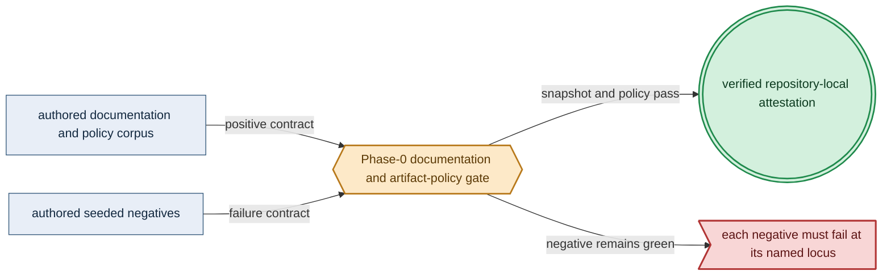
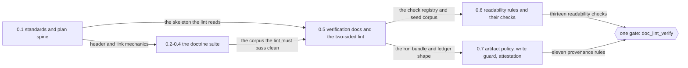

# Phase 0: Documentation suite (whole DSL)

> **Purpose**: Govern the complete amoebius DSL specification and engineering doctrine, with one Phase-0 gate
> over documentation, artifact provenance, repository hygiene, and the link graph.
> **Read this if**: phase 0 is next in the queue, or a later phase depends on what its gate establishes.

Phase 0 delivers the documentation suite (whole DSL); its design is owned by [dsl_doctrine.md](../documents/engineering/dsl_doctrine.md), [low_code_ui_runtime_doctrine.md](../documents/engineering/low_code_ui_runtime_doctrine.md), [ui_realtime_coordination_doctrine.md](../documents/engineering/ui_realtime_coordination_doctrine.md), and the plan for reaching it is owned here.
No register: the gate is the documentation lint.
The pre-amendment two-sided checker passed on 2026-08-08; that seal is invalidated, and the current progress
and remaining implementation are stated below.

> **Historical result (invalidated).** Any pass, seal, validation, ledger, receipt, or implementation observation
> in the orientation text above is diagnostic only. The Phase Status section and [tracker](README.md) own current state; the
> target contract below remains normative.

Link-graph metadata

**Status**: Authoritative source
**Supersedes**: N/A
**Referenced by**: DEVELOPMENT_PLAN/README.md, DEVELOPMENT_PLAN/development_plan_standards.md, DEVELOPMENT_PLAN/overview.md, DEVELOPMENT_PLAN/phase_01_toolchain_spike.md, DEVELOPMENT_PLAN/phase_27_illegal_state_covering.md, DEVELOPMENT_PLAN/system_components.md, documents/documentation_standards.md
**Generated sections**: none

## Contents
- [Phase Status](#phase-status)
- [Phase Summary](#phase-summary)
- [Gate integrity](#gate-integrity)
- [Doctrine adopted](#doctrine-adopted)
- [Sprints](#sprints)
- [Sprint 0.1: Documentation standards + plan-suite spine 📋](#sprint-01-documentation-standards--plan-suite-spine-)
- [Sprint 0.2: DSL core + cross-cutting method doctrine 📋](#sprint-02-dsl-core--cross-cutting-method-doctrine-)
- [Sprint 0.3: Platform, cluster, storage, substrate & image doctrine 📋](#sprint-03-platform-cluster-storage-substrate--image-doctrine-)
- [Sprint 0.4: Secrets/IaC + runtime/transport/determinism doctrine 📋](#sprint-04-secretsiac--runtimetransportdeterminism-doctrine-)
- [Sprint 0.5: Verification, formal-model doctrine & the documentation-lint gate 📋](#sprint-05-verification-formal-model-doctrine--the-documentation-lint-gate-)
- [Sprint 0.6: Readability discipline — document shape, the two diagram registers, and the routing artifacts 📋](#sprint-06-readability-discipline--document-shape-the-two-diagram-registers-and-the-routing-artifacts-)
- [Sprint 0.7: Artifact provenance, ignore coverage, and repository-local evidence 📋](#sprint-07-artifact-provenance-ignore-coverage-and-repository-local-evidence-)
- [Sprint 0.8: The authored negative corpora as one declared set 📋](#sprint-08-the-authored-negative-corpora-as-one-declared-set-)
- [Sprint 0.9: The target tree as a partition the gate decides 📋](#sprint-09-the-target-tree-as-a-partition-the-gate-decides-)
- [Sprint 0.10: Repository-contained state contract 📋](#sprint-010-repository-contained-state-contract-)
- [Sprint 0.11: The natural-architecture postcondition 📋](#sprint-011-the-natural-architecture-postcondition-)
- [Sprint 0.12: The per-substrate floor, and a vocabulary the lint reads 📋](#sprint-012-the-per-substrate-floor-and-a-vocabulary-the-lint-reads-)
- [Sprint 0.13: One binary, many roles 📋](#sprint-013-one-binary-many-roles-)
- [Sprint 0.14: The ordering re-baseline 📋](#sprint-014-the-ordering-re-baseline-)
- [Sprint 0.15: The re-baseline review pass 📋](#sprint-015-the-re-baseline-review-pass-)
- [Sprint 0.16: The covering as a measurement ✅](#sprint-016-the-covering-as-a-measurement-)
- [Documentation Requirements](#documentation-requirements)
- [Related Documents](#related-documents)

---

## Phase Status

✅ Done — resealed 2026-08-20 against the generative re-baseline's three added obligations. All thirteen sides
of `python3 tools/doc_lint_verify.py` pass on natural `arm64`, untranslated: 50 seeded documentation negatives
each redden their own check, 49 surfaces join completely to 90 implemented checks, 17 artifact-policy rules are
clean with all 314 remaining findings attributed to an owning phase, and attestation
`sha256:a2bdd9d5704eee36e4317d1fb894d965fbccb056b8b68e9d6a4595da23c0da71` binds to a 2,055-file source snapshot. The
covering resolves its 252 cells with none owing a reason. As with every seal here, the attestation names the
run that passed; the tree records it afterwards, so a later run's digest differs by exactly that record.

**What closed the reopening.** Three obligations landed with the re-baseline and each is now a check with a
seeded negative rather than a sentence. The contract half of every phase document is read by
`tools/phase_contract_lint.py` (`d1`–`d8`). Clause 13's extension-conformance discharge is `d6`, and every one
of the 96 contracts either discharges it or marks it not applicable. Clause 16's illegal-state covering is
`c1`–`c4`, delivered by [Sprint 0.16](#sprint-016-the-covering-as-a-measurement-), which replaced a
product-credited estimate of occupancy with the pairing each entry now authors — and in doing so found six
defects the estimate had concealed.

**One repair outside the covering.** `tools/phase_contract_lint.py` wrote its scratch tree to the host default
temporary directory, which `state_escapes_checkout` reports and which the containment contract forbids; its
scratch state now lives under `.build/tmp/`.

**Resealed a sixth time on 2026-08-17** against the documentation Phase 1's host-ensure closure
touched: [`substrate_doctrine.md` §3.1](../documents/engineering/substrate_doctrine.md#31-the-per-substrate-floor-what-only-the-operator-can-supply)
now records that the floor tables are authored data evaluated before resolution, and
[`repository_layout_doctrine.md` §4](../documents/engineering/repository_layout_doctrine.md#4-dependency-and-toolchain-resolution)
records the one `<os>-<arch>` platform vocabulary. All eleven sides pass, attestation
`sha256:23cba0b04414bd05b11f8f71f82ba7e3b7378ab255a374a55ae2f58c0e98f826`; no rule regressed and the deferral
total is unchanged.

**Reopened and resealed five times on 2026-08-17** before that; the fifth ([Sprint 0.15](#sprint-015-the-re-baseline-review-pass-)) repaired three defect classes the re-baseline introduced that every green gate had missed, and added the checks that decide them; the fourth ([Sprint 0.14](#sprint-014-the-ordering-re-baseline-)) re-baselined the plan to 69 phases so that every phase is validatable at its own ordinal and the DSL is fully validated before any live behaviour, recorded in [`legacy_tracking_for_deletion.md`](legacy_tracking_for_deletion.md#phase-re-baseline--2026-08-17); the third
([Sprint 0.13](#sprint-013-one-binary-many-roles-)) because the role a running copy holds was documented as a
property of *which executable ran*, and the union naming those roles was written three times with no two
agreeing — a Single-Source-of-Truth defect ([documentation_standards.md §5](../documents/documentation_standards.md#5-duplication-rules)) inside the doctrine that owns it. All eleven sides pass, attestation `sha256:d6bef210810e23020e480f5c6e05ad501ed02648f99401e8c66204f16c9a21ee`. The second is
[§N](development_plan_phase_model.md#n-reopening-and-amending-a-phase) work this phase owns: the `Requires`
vocabulary of [§F](development_plan_standards.md#f-the-sprint-block-format) named six binaries as things a
developer must supply, two of which the resolver was already acquiring, and the doctrine suite had never
written down what a host must supply instead.
[Sprint 0.12](#sprint-012-the-per-substrate-floor-and-a-vocabulary-the-lint-reads-) authors that floor and
makes the vocabulary a parsed table rather than a set restated in code.

**The first reseal — natural architecture, 2026-08-17.** All eleven sides of
`python3 tools/doc_lint_verify.py` pass: 43 seeded documentation negatives each redden their own check, 35
surfaces join completely to 74 implemented checks, 17 artifact-policy rules are clean with every remaining
finding attributed to an owning phase, and the run records the substrate, lane, and natural architecture it
executed on.

**What the reseal added, 2026-08-17.** Clause 15 of
[§S](development_plan_gate_integrity.md#s-universal-artifact-hygiene-gate) — a run records the detected
substrate, the selected lane, and the natural architecture it proved, and executes no artifact of another —
became a check in four places rather than a sentence: the `Lane:` field of
[§D](development_plan_standards.md#d-the-per-phase-document-skeleton) is decided against the tracker and
[substrates.md](substrates.md) the way the substrate already was, the run ledger and the stored attestation
both carry the lane and the architecture, and a gate that declares no lane is refused at construction.
[Sprint 0.11](#sprint-011-the-natural-architecture-postcondition-) records the delivery and the re-baseline's
mechanical consequences it closed.

**What Phase 0 owns here and what it does not.** The re-baseline renumbered every phase at or above old 26,
and this phase renumbered the owner columns of the two tables its own gate reads. It did **not** rename the
354 ordinal-bearing paths under `test/` and `mutants/`: those belong to their owning phases, which rename them
for the capability rather than for the new ordinal, so a pin the plan cites at its post-amendment ordinal is
resolved through the audit map and reported as a deferral until then
([`legacy_tracking_for_deletion_archive.md`](legacy_tracking_for_deletion_archive.md#natural-architecture-rebaseline--2026-08-16)).

**Pre-natural-architecture status record (invalidated where it claims completion):**

Done (invalidated) — resealed 2026-08-15, before clause 15 existed. The nine-sided gate passed against a source snapshot the run recorded, but named no architecture, so it stands as history rather than as a current result.

**Superseded red observation — 2026-08-15.** The first containment run was red with 66 policy findings because
the verifier still parsed and wrote legacy roots; Sprint 0.10 removed them before this seal, never as an exception.

**Pre-containment status records (invalidated).** Four earlier seals — 2026-08-14 after the final-layout
amendment, and 2026-08-13 before and after commit `0526152` first tracked this phase's own machinery —
each passed the gate as it then stood and each was invalidated by a later amendment. None claims a current
result. What they found, what closed, and what was deferred are recorded in
[`legacy_tracking_for_deletion_archive.md`](legacy_tracking_for_deletion_archive.md#phase-0-closure-disposition--2026-08-12),
which is where a superseded finding belongs once its seal no longer stands.

## Phase Summary

This phase owns the **entire documentation suite** — the DSL specification and every doctrine in the
[engineering doctrine index](../documents/engineering/README.md), plus the plan suite that sequences the
implementation phases. It is the one phase whose deliverable *is* prose: the orchestration Dhall DSL and its
illegal-state-unrepresentable contract; service capabilities and the capability→provider→shape binder; typed
manifest generation and the SSA reconciler; the standard platform services; storage lifecycle; substrate,
cluster-topology, and resource-capacity models; Vault/PKI and Pulumi-from-inside; the daemon-topology grid;
host↔cluster comms; the native Pulsar client; content-addressing and determinism; tenancy; the verification
layer; the bounded low-code UI language and generic browser/server runtime; authenticated cross-pod
WebSocket coordination; explicit encrypted browser-offline continuity and authoritative replay; and the cross-cutting method
doctrines. It also authors the plan spine — the rulebook, the live
tracker, and the target architecture/inventory/substrate documents — so every later phase cites doctrine by
name when it schedules adoption work.

The suite is written to the reversed intent that governs the whole plan. The control-plane daemon is a
Kubernetes Deployment with `replicas=1` whose single-writer authority is **delegated to k8s/etcd through the mandatory reconciler `Lease`** — there is no bespoke election and no standby pod, and its durable state is the
Vault-enveloped MinIO bucket, not a PVC. ML engines, models, and kernels are **named catalog identities**
jit-resolved on first miss into a `CacheBudget`-bounded content-addressed cache — never baked, never
URL-fetched. amoebius's one formal proof obligation is the **cross-cluster gateway migration**, both the
`Planned` and `Failover` branches, modelled once as data. Generated artifacts (k8s manifests, the emitted
`.tla`/`.cfg`, the reflected Dhall schema, the PureScript contracts) are emitted from a Haskell source of truth
and never committed. Validation runs in three phase-gate registers (1 pure/golden · 2 boundary-with-fakes ·
3 live) plus the Register-2.5 deterministic-simulation activity; rendering a plan or `--dry-run` never requires
live infrastructure. The suite's naming and header mechanics adapt conventions proven in the sibling
**prodbox** project — that is sibling evidence, not an amoebius result.

This phase runs in **no amoebius validation register (Register —)**: documentation tooling executes, but no
register-1/2/3 amoebius harness or product behavior is exercised. The cross-cutting invariants the whole plan upholds are
first written down here and then adopted, phase by phase, by the pre-cluster and live bands that follow.

**Session scope:** Complete the one documentation/link-graph re-baseline and run
`python3 tools/doc_lint_verify.py`; split before continuing if the work introduces implementation code, a new
runtime surface, or an acceptance command other than the two-sided documentation gate.

**Phase scope:** one cohesive claim — *the whole authored corpus says one thing, and every check that
can decide whether it still does is running*. The sprint seams are the doctrine suite, the plan spine,
and one seam per lint obligation. The acceptance command is the documentation verifier. The split
trigger is a lint obligation that needs its own corpus to state, which becomes its own sprint.

**Substrate:** none ([§L](development_plan_standards.md#l-one-substrate-discipline)) — the gate is a pure documentation lint over text and the link graph; it touches no
`apple`, `linux-cpu`, `linux-cuda`, or `windows` host and stands up no resources.

**Lane:** none ([§L](development_plan_standards.md#l-one-substrate-discipline))

**Register:** — (no register: the documentation-lint gate validates text and the link graph, not amoebius behaviour, [§K](development_plan_standards.md#k-honesty-proven--tested--assumed)).

**Depends on:** none.

This phase opens the sequence, and the corpus it governs is the only input it reads.

**Gate:** `python3 tools/doc_lint_verify.py` passes every documentation, containment and seeded-mutant check
named in [Gate integrity](#gate-integrity) against its source snapshot, creating no tracked or unignored
generated file. Phase 1 does not open unless the ledger records that corpus green.

## Gate integrity

The gate verifies all governed headers, contents blocks, anchors, bidirectional links, status equality, phase
numbering, gate ownership, illegal-state coverage, and documentation negative cases. It additionally verifies:

**Three obligations were added by the 2026-08-19 generative re-baseline, and all three are discharged.**
Each is a check with its own seeded negative, and each exists because a rule was normative and unread:

- **The contract half of every phase document** — the section-D skeleton, the six required Phase Summary
  fields, the mutant ids a gate names, and the agreement between what a contract promises and what its gate
  script declares. `tools/phase_contract_lint.py` carries these as `d1`–`d4`; before it existed, `Phase scope`
  was absent from sixty-four contracts and `Register` had no check at all.
- **The illegal-state covering** of [§S](development_plan_gate_integrity.md#s-universal-artifact-hygiene-gate)
  clause 16: every cell of the declared taxonomy holds an entry, is inadmissible under the authored
  layer-to-locus relation, or carries a one-line justification, and an unjustified empty cell fails. Occupancy
  is what each entry's `Cells:` line asserts rather than the product of the tags its prose mentions, which is
  what makes the count a measurement; `c1`–`c4` decide it and six seeded defects give it teeth.
- **The extension-conformance discharge** of
  [§M](development_plan_gate_integrity.md#m-gate-integrity-a-gate-cannot-be-passed-by-a-stub) clause 13, as a
  documentation obligation: a contract delivering an extension names its law discharges and its compile-fail
  fixtures, or the gate reports it under-specified.

- the generator registry covers every output class in repository-layout doctrine;
- `.gitignore` and `.dockerignore` cover the normative patterns exactly or more strictly;
- tracked files contain no generated output, lock/freeze file, package checksum database, hard-coded
  library/package SHA, generated evidence, bytecode, or developer-home path;
- every authored input referenced by a build or gate exists in the source snapshot, including reviewed patches;
- semantic classification rejects generated copies beneath otherwise authored roots;
- Python commands use ordinary bytecode caching, and every resulting cache is excluded from Git and Docker;
- generated Markdown is absent from governed roots;
- a synthetic generator cannot write beneath an authored root;
- a synthetic run bundle validates and persists to the project-contained attestation backend;
- a case-insensitive repository scan finds no retired predecessor terminology for the Bootstrap Coordinator;
- reachable history is audited for secrets, generated files, and obsolete names, with the required disposition
  recorded separately from unreachable local objects;
- every authored negative corpus is declared in doctrine with the rules it seeds, and a declared row that
  names an unknown rule, a missing path, or a rule it no longer seeds is reported as a stale exemption;
- every source-snapshot path lies in the target tree, judged at the prefix that must move;
- every ignore rule names a path that tree contains, in both pattern syntaxes;
- no path, build flag, build-component name, or ignore rule outside the plan suite carries a phase ordinal;
- every declared authored root is a directory, so a rename cannot shrink the write guard in silence;
- the target tree admits exactly `.build/**`, `.data/**`, `.test_data/**`, and root
  `test-secrets.dhall` for project-owned untracked state, with no system-temp, system-data, user-home, or
  host-global container-engine fallback;
- a seeded escaped-path/escaped-Docker-resource negative is caught by a before/after host inventory;
- production rejects `test-secrets.dhall`, and a seeded test-to-`.data/**` alias fails before mutation;
- every phase gate names one lane from the closed vocabulary, natural to its substrate and equal in the phase
  document, the tracker, and the substrate map;
- the run records the architecture it executed on, refuses a translated process, and both the ledger and the
  stored attestation carry that architecture and the lane that named it;
- the closed `Requires` vocabulary is parsed from the rulebook's own table rather than restated in the lint,
  and joins to the declaring phases in both directions;
- every seeded negative for these rules turns the gate red at its expected locus.

The independent oracle is the authored positive seed, mutation definition, and expected diagnostic for every
check. Materialized negatives, scan results, enumeration, logs, and ledgers remain under
`.build/runs/phase_0/`, `.build/test-corpora/`, or `.build/tmp/` and are attested beneath
`.build/evidence-store/`. They are never
copied into the plan or another authored root.

*Design intent. The redesigned Phase-0 gate joins authored policy with two-sided failure cases and retains only a repository-local attestation.*
- **Extension conformance (§M.13).** Not applicable: this gate delivers no extension.

## Doctrine adopted

This phase *authors* every document in the suite; the citations below point at the flagship section each doc
owns and state what Phase 0 commits to writing. Each is cited by relative link and by the section's human
name.

- [`documentation_standards.md §3`](../documents/documentation_standards.md#3-required-header-metadata) — the
  *Required header metadata* block, with the SSoT-first philosophy and the bidirectional cross-referencing rule:
  the three mechanics the gate's lint checks.
- [`dsl_doctrine.md §5`](../documents/engineering/dsl_doctrine.md#5-the-illegal-state-unrepresentable-contract) —
  *The illegal-state-unrepresentable contract*: the typed spec gates (the Dhall typechecker and the Haskell typed
  decoder) that make illegal cluster state fail to type-check.
- [`low_code_ui_runtime_doctrine.md §3`](../documents/engineering/low_code_ui_runtime_doctrine.md#3-one-checked-value-two-runtime-plans) —
  *One checked value, two runtime plans*: bounded `UiSource` is checked and bound once, then projected into a
  public client plan and private server plan with no raw-code or provider escape.
- [`ui_realtime_coordination_doctrine.md §5`](../documents/engineering/ui_realtime_coordination_doctrine.md#5-redis-is-ephemeral-platform-internal-coordination) —
  *Redis is ephemeral platform-internal coordination*: replicated UI-server workers route authenticated
  browser WebSockets across pods without sticky-session correctness, while durable cursors and receipts stay
  in Pulsar, projections, or the effect-owning provider.
- [`browser_offline_runtime_doctrine.md §3`](../documents/engineering/browser_offline_runtime_doctrine.md#3-the-authored-continuity-surface) —
  *The authored continuity surface*: a checked `OnlineOnly | Offline OfflineSource` choice
  compiles to bounded public persistence and private replay plans without exposing browser or Redis products
  to authored applications.
- [`conformance_harness_doctrine.md §2`](../documents/engineering/conformance_harness_doctrine.md#2-the-registers-as-amoebius-uses-them-for-pre-cluster-validation) —
  *The registers*: the three named validation registers (Register 1 pure/golden, Register 2 boundary-with-fakes,
  Register 3 live) — and
  [`§3`](../documents/engineering/conformance_harness_doctrine.md#3-the-load-bearing-invariant-rendering-never-touches-live-infrastructure),
  *rendering never touches live infrastructure*.
- [`formal_model_doctrine.md §3`](../documents/engineering/formal_model_doctrine.md#3-two-total-renderings) —
  *Two total renderings*, and
  [`§4`](../documents/engineering/formal_model_doctrine.md#4-single-source-correspondence),
  *Single-source correspondence*: one reifiable Haskell `Model` renders both the runtime `interpret` function
  and the generated, never-committed `.tla` via `emitTLA`.
- [`gateway_migration_model_doctrine.md §1`](../documents/engineering/gateway_migration_model_doctrine.md#1-the-one-obligation) —
  *The one obligation*: the cross-cluster gateway migration, both `Planned` and `Failover` branches, is
  amoebius's single simulation/proof obligation — reduced to every `InForceSpec` by a decode-time structural-fit
  fold, never a per-spec model-check. There is no First-Axis / control-plane-election obligation.
- [`generated_artifacts_doctrine.md §3`](../documents/engineering/generated_artifacts_doctrine.md#3-the-rule) —
  *The rule*: every reproducible projection and every run-evidence artifact is generated and never committed;
  only independently authored source, policy, fixtures, oracles, and reviewed external immutable inputs belong
  in version control.
- [`daemon_topology_doctrine.md §3`](../documents/engineering/daemon_topology_doctrine.md#3-the-control-plane-daemon) —
  *The control-plane daemon*: a Deployment `replicas=1`, stateless (no PVC), single-instance delegated to
  k8s/etcd through the mandatory reconciler Lease ([§3.1](../documents/illegal_state/illegal_state_storage.md#31-bad--illegal-durable-storage), no bespoke election), durable state the
  Vault-enveloped MinIO bucket; [§3.3](../documents/illegal_state/illegal_state_security.md#33-misconfigured-gateway) separately owns the same-binary capacity-scheduler role with no control-plane daemon
  or secret authority.
- [`content_addressing_determinism.md §4.5`](../documents/engineering/content_addressing_determinism.md#45-the-ml-asset-lifecycle-one-bounded-content-addressed-cache-resolved-on-first-miss) —
  *The ML-asset lifecycle*: each engine/model/kernel is a named catalog identity the shared `jit-build` resolver
  materializes on first miss into a `CacheBudget`-bounded content-addressed cache — never baked, never
  URL-fetched.
- [`lift_and_compose_doctrine.md §1`](../documents/engineering/lift_and_compose_doctrine.md#1-why-this-doctrine-exists) —
  *Why this doctrine exists*: amoebius lifts and re-homes the proven primitives of prodbox/hostbootstrap/
  infernix/jitML rather than reimplementing them; their handwritten PureScript demo clients are migration
  evidence whose interaction requirements are recast as bounded `UiSource`, not amoebius application code.
- [`tenancy_doctrine.md §1`](../documents/engineering/tenancy_doctrine.md#1-why-this-doctrine-exists) —
  *Why this doctrine exists*: the first-class `TenantId` orthogonal to the cluster axis, so a valid `InForceSpec`
  cannot name a foreign tenant's resource.
- [`chaos_failover_doctrine.md §12`](../documents/engineering/chaos_failover_doctrine.md#12-the-moral-core--proven-tested-assumed) —
  *The moral core — proven, tested, assumed*: the honesty ledger the documentation standard and this whole plan
  inherit.
- [`testing_doctrine.md §1`](../documents/engineering/testing_doctrine.md#1-a-test-is-an-amoebius-spec) —
  *A test is an amoebius spec*: test-as-`InForceSpec` (spin up → run → always tear down), `suggest-test`, and the
  per-run ledger artifact — and
  [`§9`](../documents/engineering/testing_doctrine.md#9-derivation-generated-enumeration-authored-expectation),
  *Derivation: generated enumeration, authored expectation*: the enumeration/expectation split and the coverage
  obligation whose catalog-side half this phase's lint check (g) enforces.
- [`testing_spoof_resistance.md §12`](../documents/engineering/testing_spoof_resistance.md#12-spoof-resistant-evidence-a-gate-observes-an-unforgeable-fresh-effect) —
  *Spoof-resistant evidence*: effectful gates prove a post-start challenge through an authenticated observer
  outside the system under test.
- [`illegal_state_catalog.md`](../documents/illegal_state/illegal_state_catalog.md) — the *illegal-state catalog*
  index and its themed sub-catalogs: the numbered entry set, each carrying a `**Validation-locus:**`, that
  check (g) validates as a well-formed enumeration before any fixture exists to join against.
- [`tla_modelling_assumptions.md`](../documents/engineering/tla_modelling_assumptions.md#why-this-doc-is-deprecated) —
  authored as a **deprecated redirect stub**: its content is re-homed to `formal_model_doctrine.md` and
  `gateway_migration_model_doctrine.md`, and its header carries `Status: Deprecated` so the lint accepts the
  redirect rather than flagging an orphan.

## Sprints

> Note: the per-sprint **Independent Validation** blocks below describe what the Sprint 0.5 documentation lint
> checks over each sprint's docs; they are realized once that lint lands. There is no in-sequence, tool-present
> validation at each sprint's own point in the order — the phase gate is a single end-of-phase two-sided run,
> so "validated in isolation" names the per-doc-group scope of the check, not the moment it can first execute.

*Design intent. Each sprint hands the next the artifact it checks: the spine fixes the shape, the doctrine supplies the corpus, the lint supplies the registry, and the last two sprints add the checks the single gate runs. The seam rule is owned by [development_plan_standards.md §O](development_plan_standards.md#o-sprint-sized-seams-and-bounded-phase-gates).*

## Sprint 0.1: Documentation standards + plan-suite spine 📋
**Status**: Planned
**Implementation**: `documents/documentation_standards.md`,
`DEVELOPMENT_PLAN/development_plan_standards.md`, `DEVELOPMENT_PLAN/README.md`,
`DEVELOPMENT_PLAN/overview.md`, `DEVELOPMENT_PLAN/system_components.md`, `DEVELOPMENT_PLAN/substrates.md`,
`DEVELOPMENT_PLAN/legacy_tracking_for_deletion.md`, `DEVELOPMENT_PLAN/later_phases.md`, and the
`phase_0`…`phase_82` phase docs (authored; artifact audit remains)
**Blocked by**: none
**Independent Validation**: lint the spine files in isolation — each carries a valid header block, the status vocabulary
and per-phase/per-sprint skeletons are defined, the 66-phase overview table is internally consistent, and
every intra-plan link resolves.
**Docs to update**: the spine files above and
`documents/engineering/README.md`

### Objective

Adopt [`documentation_standards.md §3`](../documents/documentation_standards.md#3-required-header-metadata) —
*Required header metadata* — with the SSoT-first philosophy and bidirectional cross-referencing: establish the
header/link mechanics and the plan-suite structure every other document and phase obeys. The naming and header
conventions adapt the sibling prodbox project's documentation discipline (sibling evidence, then specialized for
amoebius's snake_case rule), and the tracker is rebuilt for 65 contiguous single-gate phases.

### Deliverables

- The documentation standard (header block, naming, SSoT/no-duplication, bidirectional links, honesty, tone,
  diagram rules).
- The plan rulebook (`development_plan_standards.md`): the [§A](development_plan_standards.md#a-header-metadata-same-block-as-the-doctrine-suite)–[§M](development_plan_standards.md#m-gate-integrity-a-gate-cannot-be-passed-by-a-stub) disciplines (header, snake_case layout, status vocabulary, per-phase skeleton, one-phase model, sprint block format, Documentation Requirements, doctrine-citation rule, generated markers, cross-ref path rules, honesty, one-substrate, gate integrity).
- The live tracker (`README.md`): the Document Index, the 66-phase Overview table with its one-line gates and
  substrate/register columns, the status vocabulary, the phase discipline, and the cross-cutting invariants.
- `overview.md`, `system_components.md`, `substrates.md`, `legacy_tracking_for_deletion.md`, `later_phases.md`,
  and the per-phase docs' spine.

### Validation

1. Run the documentation lint (Sprint 0.5 tool) over the spine files: all headers valid, no orphan links, no
   duplicated normative content.
2. Every doctrine doc and every phase doc can cite the standard's section anchors by name (the doctrine-citation
   rule resolves).

### Remaining Work

None.

## Sprint 0.2: DSL core + cross-cutting method doctrine 📋
**Status**: Planned
**Implementation**: `documents/engineering/dsl_doctrine.md`,
`app_vs_deployment_doctrine.md`, `illegal_state_catalog.md` (the pure index) and its eight themed
sub-catalogs (`illegal_state_storage.md`, `illegal_state_topology.md`, `illegal_state_capacity.md`,
`illegal_state_security.md`, `illegal_state_capability_messaging.md`, `illegal_state_ml_asset.md`,
`illegal_state_multicluster.md`, `illegal_state_lifecycle.md`) and the `illegal_state_techniques.md`
coverage matrix, `service_capability_doctrine.md`, `tenancy_doctrine.md`, `lift_and_compose_doctrine.md`,
`generated_artifacts_doctrine.md`, `conformance_harness_doctrine.md`, `low_code_ui_runtime_doctrine.md`,
`ui_realtime_coordination_doctrine.md`, `browser_offline_runtime_doctrine.md` (authored; artifact audit
remains)
**Blocked by**: Sprint 0.1
**Independent Validation**: lint the DSL-core and method docs together —
the illegal-state catalog links to the DSL contract rather than restating it; the register model and the
generated-never-committed rule are each owned by exactly one doc and referenced elsewhere.
**Docs to update**: the docs above and `documents/engineering/README.md`

### Objective

Adopt [`dsl_doctrine.md §5`](../documents/engineering/dsl_doctrine.md#5-the-illegal-state-unrepresentable-contract) —
*The illegal-state-unrepresentable contract*,
[`conformance_harness_doctrine.md §2`](../documents/engineering/conformance_harness_doctrine.md#2-the-registers-as-amoebius-uses-them-for-pre-cluster-validation) —
*The registers*,
[`generated_artifacts_doctrine.md §3`](../documents/engineering/generated_artifacts_doctrine.md#3-the-rule) —
*The rule*,
[`lift_and_compose_doctrine.md §1`](../documents/engineering/lift_and_compose_doctrine.md#1-why-this-doctrine-exists),
and [`tenancy_doctrine.md §1`](../documents/engineering/tenancy_doctrine.md#1-why-this-doctrine-exists): write the
DSL core (the orchestration surface, the typed spec gates, the app-logic/deployment split, the illegal-state
catalog with honest foreclosure layers, the capability binder, the tenant axis) and the cross-cutting method
doctrines (the three validation registers, the generated-never-committed rule, and lift-and-compose).

### Deliverables

- `dsl_doctrine.md`, `app_vs_deployment_doctrine.md`, `illegal_state_catalog.md` (the pure index) with its
  eight themed sub-catalogs (`illegal_state_storage.md`, `illegal_state_topology.md`,
  `illegal_state_capacity.md`, `illegal_state_security.md`, `illegal_state_capability_messaging.md`,
  `illegal_state_ml_asset.md`, `illegal_state_multicluster.md`, `illegal_state_lifecycle.md`) and the
  `illegal_state_techniques.md` coverage matrix that check (g) validates,
  `service_capability_doctrine.md`, `tenancy_doctrine.md`, `low_code_ui_runtime_doctrine.md`,
  `ui_realtime_coordination_doctrine.md`, `browser_offline_runtime_doctrine.md`.
- `conformance_harness_doctrine.md`: the registers and the rendering-never-touches-live invariant.
- `generated_artifacts_doctrine.md`: the emit-from-source, never-commit rule for manifests, the `.tla`/`.cfg`,
  the reflected Dhall schema, and the PureScript contracts.
- `lift_and_compose_doctrine.md`: the reuse map and migration of sibling demo flows into bounded UI modules.

### Validation

1. Lint resolves every cross-link among the DSL-core and cross-cutting docs and to the spine.
2. The catalog's foreclosure layers are stated honestly (proven-by-typecheck vs enforced-at-runtime), with no
   "it compiles ⇒ the cluster enforces it" overclaim.

### Remaining Work

None.

## Sprint 0.3: Platform, cluster, storage, substrate & image doctrine 📋
**Status**: Planned
**Implementation**: `documents/engineering/platform_services_doctrine.md`,
`storage_lifecycle_doctrine.md`, `cluster_lifecycle_doctrine.md`, `gateway_migration_doctrine.md`,
`readiness_ordering_doctrine.md`, `single_logical_data_plane_doctrine.md`, `cluster_topology_doctrine.md`,
`resource_capacity_doctrine.md`, `substrate_doctrine.md`, `apple_metal_headless_builds.md`,
`image_build_doctrine.md`, `manifest_generation_doctrine.md` (authored; lint remediation remains)
**Blocked by**: Sprint 0.1
**Independent Validation**: lint the platform/cluster docs together — manifest generation
owns the render/reconcile model, platform-services owns the standard-service inventory, resource-capacity
owns the placement fold, and no doc restates another's normative content.
**Docs to update**: the twelve
docs above and `documents/engineering/README.md`

### Objective

Adopt [`generated_artifacts_doctrine.md §3`](../documents/engineering/generated_artifacts_doctrine.md#3-the-rule)
for the rendered manifests, and write the platform/cluster layer: the standard services (HA-always,
Keycloak-owns-all-ingress), no-Helm typed manifest generation plus the SSA reconciler, `no-provisioner` retained
storage, the cluster lifecycle and typed gateway-migration taxonomy, event-driven readiness ordering, the single
logical data plane, the declared compute-engine/substrate topology, the capacity placement fold, substrate
detection with the no-env/no-`PATH` lazy tool-ensure contract, and baked-binary per-architecture image build with the
`distribution` registry.

### Deliverables

- `platform_services_doctrine.md`, `storage_lifecycle_doctrine.md`, `cluster_lifecycle_doctrine.md`,
  `gateway_migration_doctrine.md`, `readiness_ordering_doctrine.md`, `single_logical_data_plane_doctrine.md`.
- `cluster_topology_doctrine.md`, `resource_capacity_doctrine.md`, `substrate_doctrine.md`,
  `apple_metal_headless_builds.md`.
- `image_build_doctrine.md` (service binaries + the `distribution` registry; the ML engine payloads are the
  deliberate not-baked exception) and `manifest_generation_doctrine.md`.

### Validation

1. Lint resolves all intra-group and spine links; the no-Helm and no-public-pull rules are stated once and
   referenced elsewhere.
2. The substrate doc's no-env/no-`PATH` invariant matches the cross-cutting invariant recorded in `README.md`.

### Remaining Work

None.

## Sprint 0.4: Secrets/IaC + runtime/transport/determinism doctrine 📋
**Status**: Planned
**Implementation**: `documents/engineering/vault_pki_doctrine.md`,
`pulumi_iac_doctrine.md`, `daemon_topology_doctrine.md`, `host_cluster_comms_doctrine.md`,
`bootstrap_sequence_doctrine.md`, `network_fabric_doctrine.md`, `pulsar_client_doctrine.md`,
`content_addressing_doctrine.md`, `monitoring_doctrine.md`, `release_lifecycle_doctrine.md` (authored; lint
remediation remains)
**Blocked by**: Sprint 0.1, Sprint 0.2
**Independent Validation**: lint the ten docs
together — Vault owns secrets-root semantics, daemon-topology owns the `replicas=1` control-plane daemon model, and
content-addressing owns the jit-resolved ML-asset cache; host-comms and bootstrap reference (not restate)
the capability and Pulsar surfaces from Sprint 0.2.
**Docs to update**: the ten docs above and
`documents/engineering/README.md`

### Objective

Adopt [`daemon_topology_doctrine.md §3`](../documents/engineering/daemon_topology_doctrine.md#3-the-control-plane-daemon) —
*The control-plane daemon* (Deployment `replicas=1`, mandatory Lease, no bespoke election, no PVC) — plus
[§3.3](../documents/illegal_state/illegal_state_security.md#33-misconfigured-gateway)'s separate same-binary capacity-scheduler role — and
[`content_addressing_determinism.md §4.5`](../documents/engineering/content_addressing_determinism.md#45-the-ml-asset-lifecycle-one-bounded-content-addressed-cache-resolved-on-first-miss) —
*The ML-asset lifecycle*: write the secrets/IaC and runtime/transport/determinism layers. The bootstrap doctrine
records that the pre-binary **bootstrap coordinator is a Python `pb` CLI** (two modes: bootstrap coordinator and admin-REST client), not a
shell script; the daemon-topology and content-addressing docs carry the reversed control-plane and
jit-resolved-cache intent.

### Deliverables

- `vault_pki_doctrine.md`, `pulumi_iac_doctrine.md` (in-cluster-only Pulumi, MinIO+Vault-envelope backend).
- `daemon_topology_doctrine.md` (the three contexts; the `replicas=1` control-plane daemon under its mandatory Lease, no
  bespoke election; separate capacity-scheduler and worker roles), `host_cluster_comms_doctrine.md`, `bootstrap_sequence_doctrine.md` (the `pb`
  bootstrap coordinator + admin-REST client), `network_fabric_doctrine.md`.
- `pulsar_client_doctrine.md` (native protocol, CBOR-only payloads), `content_addressing_doctrine.md`
  (three-tier store, `experimentHash`, the jit-resolved `CacheBudget`-bounded engine cache),
  `monitoring_doctrine.md`, `release_lifecycle_doctrine.md`.

### Validation

1. Lint resolves every cross-link, including the back-references from host-comms/bootstrap to the
   capability/Pulsar docs authored in Sprint 0.2.
2. The daemon-topology doc states honestly that single-instance safety is a k8s/etcd property, not an amoebius
   election, and carries no standby-pod or ranked-failover language.

### Remaining Work

None.

## Sprint 0.5: Verification, formal-model doctrine & the documentation-lint gate 📋
**Status**: Planned
`.build/test-corpora/doc_lint/` and no verifier input is an ignored worktree file
**Implementation**: `documents/engineering/chaos_failover_doctrine.md`,
`testing_doctrine.md`, `test_derivation_analysis.md`, `formal_model_doctrine.md`,
`gateway_migration_model_doctrine.md`, `tla_modelling_assumptions.md` (deprecated stub),
`tools/doc_lint.py`, `tools/doc_lint_verify.py` (the two-sided gate runner),
`tools/doc_lint_corpus/_positive/` and `_build.py`,
`test/golden/phase_{16..23,36,38,40,50,52,55..58}_*` with the matching
`test/mutant/phase_{16..23,36,38,40,50,52,55..58}_*`, `test/mutant/formal/emitTLA-mut-0{1..4}`, the
`ToyModel` hand-derived reachable-distinct-state table, the expected `INVARIANT`/`PROPERTY` name set, and
`tools/ledger_lint.py`.
**Blocked by**: Sprint 0.1, Sprint 0.2, Sprint 0.3, Sprint 0.4
**Independent Validation**: run the lint **two-sided** over the source snapshot — clean across the governed
`documents/` and `DEVELOPMENT_PLAN/` trees, **and** non-zero on every case materialized from the authored
positive seeds and mutation definitions. Validation 2 below names the mutation each check is proven red by.
**Docs to update**: the five
verification docs above, `DEVELOPMENT_PLAN/README.md` (record the gate command),
`documents/engineering/README.md`

### Objective

Adopt [`chaos_failover_doctrine.md §12`](../documents/engineering/chaos_failover_doctrine.md#12-the-moral-core--proven-tested-assumed) —
*The moral core — proven, tested, assumed*,
[`testing_doctrine.md §1`](../documents/engineering/testing_doctrine.md#1-a-test-is-an-amoebius-spec) —
*A test is an amoebius spec*,
[`formal_model_doctrine.md §4`](../documents/engineering/formal_model_doctrine.md#4-single-source-correspondence) —
*Single-source correspondence*, and
[`gateway_migration_model_doctrine.md §1`](../documents/engineering/gateway_migration_model_doctrine.md#1-the-one-obligation) —
*The one obligation*: write the verification layer — the proven/tested/assumed ledger, test-as-`InForceSpec`,
the model-as-data pattern, and amoebius's single gateway-migration proof obligation — and build the standalone
checker that *is* the Phase 0 gate.

### Deliverables

- `chaos_failover_doctrine.md` (the Extract→Model→Inject moves, the proven/tested/assumed ledger, the Second
  Axis of async cross-cluster failover) and `testing_doctrine.md`, together with
  `test_derivation_analysis.md`, the analysis record behind the derivation boundary.
- `formal_model_doctrine.md` (one reifiable `Model`, two total renderings, single-source correspondence) and
  `gateway_migration_model_doctrine.md` (the one obligation, both `Planned` and `Failover` branches, reduced by
  a decode-time structural-fit fold).
- `tla_modelling_assumptions.md`: a `Deprecated` redirect stub pointing at the two docs above.
- The UI-gate fixture set named by Phases 25–33, 43, 45, 47, 57, 59, and 62–65 — the
  `test/golden/phase_*` regression fixtures and the correspondingly named `test/mutant/phase_*` seeded
  mutants, which are what the provenance review below runs on. Each candidate expectation is
  classified by history and independent review. Same-commit additions remain regression fixtures until
  reviewed or replaced. A generated run-local registry maps retained source to its owner and reject locus.
- The convention-independent Phase-11 formal-model oracles, pinned here before `Interpret.hs`/`EmitTLA.hs`
  exist ([`phase_11`](phase_11_formal_model_kernel.md)): `test/mutant/formal/emitTLA-mut-0{1..4}`, the
  `ToyModel` hand-derived reachable-distinct-state table, and the expected `INVARIANT`/`PROPERTY` name set.
  The byte-exact `test/golden/formal/ToyModel.{tla,cfg}.golden` is **not** pinned here: under
  [`development_plan_standards.md §M`](development_plan_standards.md#m-gate-integrity-a-gate-cannot-be-passed-by-a-stub)
  a byte-exact golden is pinned no earlier than the sprint fixing its rendering convention, which is
  Phase 11's.
- `tools/doc_lint.py`: a pure text/link checker (no amoebius-binary dependency), run **two-sided** — it must
  pass clean on the suite **and** fail on every case generated from the authored lint seeds and mutation
  definitions. It checks,
  mechanically: (a) valid header metadata — decomposed per the documentation standard's five facets: a `Status`
drawn from the enum with vague values banned, a `Supersedes` field, a `Referenced by` field, `Generated
sections` keys that match the real in-body markers, and a one-sentence `Purpose` — each an independently
seeded sub-check; (b) every anchored relative link resolves under the [§4](../documents/documentation_standards.md#4-cross-referencing) slug rule,
and **no bare `§N` section reference** appears outside a Markdown link label, heading, fenced/Mermaid block,
`§M.N` clause-shorthand, or external-project reference — a section citation must be an anchor link, never bare
`§N` prose (the lint flags any `§`-plus-digit occurring in prose that is not one of those forms);
  (c) every `Referenced by` header reconciled in both directions from the true link graph; (d) **near-duplicate normative content** by a named method — sentence-shingle overlap above a stated threshold between two governed
  docs outside quoted/exempt blocks (semantic SSoT *ownership* is a documented hand review, not a lint verdict);
  (e) **status-consistency** — each README Phase-Overview marker equals that phase doc's `## Phase Status`
  marker; (f) **gate-integrity** ([`development_plan_standards.md §M`](development_plan_standards.md#m-gate-integrity-a-gate-cannot-be-passed-by-a-stub)) —
  every phase Gate names its committed fixtures/goldens, ≥1 committed mutant, and an independent oracle;
  an effectful gate also names a post-start fresh challenge and outside observer, and a security gate names
  authority-minted credentials, an own/foreign-scope pair, a zero-forbidden-effect observation, and bypass
  probes —
  **following one anchor hop** from the `**Gate:**` line into the phase's `## Gate integrity` section where the
  gate delegates to it ([§M](development_plan_standards.md#m-gate-integrity-a-gate-cannot-be-passed-by-a-stub) Gate → Gate-integrity delegation), so a gate whose apparatus lives one hop away is not flagged —
  and a
  ✅ Done row carries a recorded gate command + date + substrate + ledger hash. The gate command is recorded in
  the tracker; and (g) **illegal-state catalog integrity** — every `### 3.N` entry across the eight themed
  sub-catalogs (`illegal_state_storage.md`, `_topology.md`, `_capacity.md`, `_security.md`,
  `_capability_messaging.md`, `_ml_asset.md`, `_multicluster.md`, `_lifecycle.md` — **not**
  [`illegal_state_catalog.md`](../documents/illegal_state/illegal_state_catalog.md), which is the pure index
  and holds no `### 3.N` entries) carries a `**Validation-locus:**` field, entry numbering is contiguous with
  no gaps or duplicates, every [`illegal_state_catalog.md`](../documents/illegal_state/illegal_state_catalog.md)
  index bullet's anchor resolves to a real heading, and every entry carries a row in the
  [`illegal_state_techniques.md`](../documents/illegal_state/illegal_state_techniques.md) coverage matrix; and
  (h) **plan back-link** — every doctrine doc under `documents/engineering/` contains a link back to
  `DEVELOPMENT_PLAN/README.md`, guarding the documentation standard's back-link rule against future rot.
  Check (g) is the **catalog-side** half of the coverage obligation of
  [`testing_doctrine.md §9`](../documents/engineering/testing_doctrine.md#9-derivation-generated-enumeration-authored-expectation) —
  it validates the enumeration the fixture join will later consume. The *fixture* half (an entry with no
  committed witness yields an UNVERIFIED row) is **not** in Phase 0: it requires the
  `Delivery-owner:`/`Case-family:` enrichment and the `locus_registry.tsv` that
  [`phase_27`](phase_27_illegal_state_covering.md) Sprint 27.1 owns, and no fixture exists to join against
  until then. An explicit `<a id="...">` is a valid anchor target for (b) and (g): the suite uses it to keep
  inbound links alive across a heading rename.
- `tools/doc_lint_corpus/_positive/`, `_build.py`, and an authored expected-diagnostic table: **at least one
  mutation per check (a)–(f) and (h), with (a) decomposed into one mutation per header facet, and one per
  sub-check of (g)**. `_build.py` creates each minimal single-defect copy beneath `.build/test-corpora/` from a
  conforming positive seed. The lint must detect the seeded defect by check identity, not the generated path,
  so a stub that keys on fixture identity cannot pass both sides. Materialized copies are never committed. The
  malformed-ledger negative is **not** in this corpus; it lives in `ledger_lint`'s own corpus below.
- `tools/ledger_lint.py`: a schema checker for the proven/tested/assumed ledger
  ([`testing_doctrine.md §4`](../documents/engineering/testing_doctrine.md#4-no-skips-fail-fast-and-the-per-run-ledger-artifact)) —
  the `{phase, gate_command, register, substrate, date, layers, coverage, ledger_hash}` shape, `register`/`substrate`
  equal to the tracker row, every out-of-register correctness layer a mandatory UNVERIFIED `layers` row, and
  every `coverage` row's `surface` resolving against the run's regenerated enumeration (an unresolvable
  `surface` fails the lint) — with its own committed malformed-ledger negatives, including a `coverage` row
  naming a non-existent surface.
- Both checkers are standalone scripts that do not depend on the amoebius binary, which first appears in the
  pre-cluster implementation band from Phase 11 onward, and both are **Python** — matching the pre-binary `pb`
  bootstrap coordinator ([README.md](README.md#toolchain)) and the recorded decision against bash logic
  ([`dsl_doctrine.md §2`](../documents/engineering/dsl_doctrine.md#2-two-languages-one-system-dhall-carries-params-haskell-carries-logic)).
  A shell script is not admitted.

### Validation

1. From the source snapshot, the lint generates its negative cases under `.build/test-corpora/`, passes the governed
   suite, and exits non-zero with an actionable message for every generated case.
2. The authored mutation set covers each check — a broken header (a), a dangling anchor and a bare `§N`
   prose reference (b), a one-way
   bidirectional link (c), a near-duplicate normative paragraph (d), a drifted status marker (e), a gate line
   missing its committed mutant/oracle (f), and — for catalog integrity (g) — a catalog entry missing its
   `**Validation-locus:**`, non-contiguous catalog numbering, a catalog index bullet with a dangling anchor,
   and a catalog entry with no technique-matrix row — plus a doctrine doc missing its
   `DEVELOPMENT_PLAN/README.md` back-link (h) — each causing a
   non-zero exit with a message naming the offending file and check; `ledger_lint` likewise fails on its
   malformed-ledger negatives.
3. The formal-model docs unambiguously separate what a green model-check proves (the protocol, in the abstract)
   from the model↔code correspondence and runtime fidelity discharged in the later implementation phases.
4. Every candidate UI oracle is classified through Git chronology and recorded independent review. A fixture
   introduced with its subject remains a regression fixture, and every effect/security gate declares all
   applicable spoof-resistant evidence fields.

### Remaining Work

None for the negative corpus, the ignored-input dependency, or the fresh-clone run. `_build.py` materializes
all 41 negatives under `.build/test-corpora/doc_lint/`, the 410 reproducible copies are deleted, the run enumerates
its own surfaces into `.build/test-surfaces/phase_0.json` and emits its ledger into the run bundle, and both hard
check families (`b1`, `c`) are clear because no authored document links into an ignored generated root any
longer. The fixture-provenance review of the Phase-25–33 UI oracles is carried as an open obligation on those
phases rather than here, recorded in
[legacy_tracking_for_deletion_archive.md](legacy_tracking_for_deletion_archive.md#generated-artifact-and-terminology-migration--2026-08-11).

## Sprint 0.6: Readability discipline — document shape, the two diagram registers, and the routing artifacts 📋
**Status**: Planned
**Implementation**: `documents/documentation_standards.md`,
`DEVELOPMENT_PLAN/development_plan_standards.md`, the retitled
`documents/engineering/diagram_conventions.md`, the new `documents/glossary.md` and
`documents/reading_order.md`, the `resource_capacity_*` and `chaos_failover_*` families, and checks
`o1`–`o5`, `q1`–`q5`, and `p1`–`p4` in `tools/doc_lint.py`.
**Blocked by**: Sprint 0.5, after Sprint 0.1 supplied the header and link mechanics these rules extend.
**Independent Validation**: the two-sided lint. Each of the thirteen checks has an authored mutation and
expected diagnostic; its generated case turns the gate red naming that check and no other.
**Docs to update**:
`documents/documentation_standards.md`, `development_plan_standards.md`,
`documents/engineering/diagram_conventions.md`, `documents/README.md`, `README.md`.

### Objective

Make a governed document navigable and self-orienting before it is read, and make that property enforced
rather than conventional.

### Deliverables

- The document-shape rules of [documentation_standards.md §10](../documents/documentation_standards.md#10-document-shape).
- The orientation block of [§11](../documents/documentation_standards.md#11-the-orientation-block), applied to every governed document.
- The term and acronym routing of [§12](../documents/documentation_standards.md#12-naming-what-the-reader-does-not-know), and the glossary it governs.
- The sentence and paragraph budget of [§13](../documents/documentation_standards.md#13-sentence-and-paragraph-budget).
- The canonical section names of [§14](../documents/documentation_standards.md#14-navigation-and-canonical-section-names).
- The family-split rule of [§15](../documents/documentation_standards.md#15-splitting-a-document-into-a-family), instantiated twice.
- The two diagram registers, replacing the repealed syntactic bans in [§7](../documents/documentation_standards.md#7-diagrams).
- The labelled four-part motivation shape of [§9](../documents/documentation_standards.md#9-motivating-a-design-choice), which is what makes it reviewable.
- The plan-suite half of the same discipline, appended to `DEVELOPMENT_PLAN/development_plan_standards.md`:
  the plan-document shape of [§P](development_plan_standards.md#p-plan-document-shape), the two sanctioned
  phase diagrams of [§Q](development_plan_standards.md#q-the-two-phase-diagrams), and the invariant-ownership
  rule of [§R](development_plan_standards.md#r-where-the-cross-cutting-invariants-live).
- Checks `o1`–`o5`, `q1`–`q5` and `p1`–`p4`, each with a seeded negative. The authored lint seeds, mutation
  definitions, and expected diagnostics for them remain source; only their materialized negative copies move
  beneath `.build/test-corpora/`.
- The **`p3` sentence backlog**, carried openly rather than closed. `p3` is registered in the check table and
  reported by every run, but sits in `doc_lint.py`'s `ADVISORY` set until the corpus meets the rule. The
  2026-08-11 committed-baseline run reports 118 `p3` diagnostics. Clearing them is editorial work requiring
  per-passage review; bulk transformation of dense normative prose is prohibited. The current count remains
  diagnostic until the source-closed verifier in Sprint 0.5 passes.

      python3 tools/doc_lint.py --only p3 | tail -1      # the current backlog

### Validation

Against the source snapshot, `python3 tools/doc_lint_verify.py` passes the governed tree and all generated cases for the
thirteen readability checks.

### Remaining Work

The hard results are cleared: every `b1` and `c` diagnostic came from an authored document linking into
`DEVELOPMENT_PLAN/ledgers/**` or `DEVELOPMENT_PLAN/evidence/**`, and from `Referenced by` headers naming those
generated files. Both link forms are removed, the code spans are retained as historical prose, and the lint no
longer collects generated Markdown from inside the plan tree. The `p3`/`p5`/`p6` backlog — 117, 43, and 117 —
remains open and advisory under the policy above; it is authored editorial work, not a mechanical pass, and it
does not gate the phase.

## Sprint 0.7: Artifact provenance, ignore coverage, and repository-local evidence 📋
**Status**: Planned
**Implementation**: `tools/doc_lint_verify.py`, planned artifact-policy lint and generator registry,
`.gitignore`, `.dockerignore`, and the external-attestation test adapter
**Blocked by**: Sprint 0.5, Sprint 0.6
**Independent Validation**: the positive corpus passes; one negative per provenance, ignore, write-boundary,
dynamic-resolution, terminology, and attestation rule fails at its expected locus.
**Docs to update**: `README.md`, `documents/engineering/repository_layout_doctrine.md`,
`documents/engineering/generated_artifacts_doctrine.md`, `documents/engineering/testing_doctrine.md`,
and the complete `DEVELOPMENT_PLAN/` suite

### Objective

Implement the repository-wide distinction between authored inputs and generated output, including local run
evidence, dynamic dependency resolution, exact ignore/context coverage, and the renamed bootstrap coordinator.

### Deliverables

- A generator registry and tracked-path provenance classifier.
- An authored-root write guard used by every later phase gate.
- A fresh-clone source-closure check covering build, test, patch, and gate inputs.
- A reachable-history audit with secret handling and explicit retain-or-rewrite disposition; unreachable local
  objects are reported separately.
- `.gitignore` and `.dockerignore` coverage matching repository-layout doctrine.
- Lints rejecting locks/freezes, generated evidence, package integrity pins, developer-home paths, and obsolete
  terminology.
- A synthetic external-attestation positive and negative corpus.
- Reconciled phase status showing Phase 0 Active and phases 1–95 Blocked.

### Validation

1. Run the redesigned Phase-0 command against the source snapshot with ordinary Python bytecode caching enabled.
2. Confirm every positive policy and documentation check passes.
3. Confirm every seeded negative fails at its named locus.
4. Confirm the gate creates output only beneath ignored `.build/runs/phase_0/`.
5. Confirm the semantic tracked-tree and effective Docker-context scans satisfy the normative contract.
6. Confirm every referenced authored input exists in the clone and no ignored worktree file is required.
7. Audit reachable history and record its secret/non-secret disposition separately from unreachable local state.
8. Verify the external test attestation.

### Remaining Work

The rules of `tools/artifact_policy.py` are implemented, each with a seeded negative in
`tools/artifact_policy_selftest.py` that the gate proves red. `tools/attestation.py` supplies the write-once
content-addressed backend and `tools/attestation_negative_corpus.py` the bundles it must refuse. Every green
run publishes its attestation, bound to the source snapshot it observed rather than to a revision.

One decision is recorded rather than assumed. Read literally, [§S](development_plan_standards.md#s-universal-artifact-hygiene-gate)
clause 5 would keep Phase 0 open until every later phase had migrated its own tables, inverting the numeric
order; [repository_layout_doctrine.md §3.5](../documents/engineering/repository_layout_doctrine.md#35-tsv-inventory-and-provenance)
instead gives Phase 0 the shared corpora and each later phase its domain tables.
`tools/migration_allowlist.tsv` implements that reading: every deferred finding is still reported, attributed
to the phase whose gate must clear it, and cross-checked against the legacy register, and a row matching
nothing fails the gate — so the list can only shrink.

## Sprint 0.8: The authored negative corpora as one declared set 📋
**Status**: Planned
**Implementation**: `documents/engineering/repository_layout_doctrine.md`, `tools/artifact_policy.py`,
`tools/artifact_policy_selftest.py`, `tools/attestation.py`, `tools/attestation_negative_corpus.py`
**Blocked by**: Sprint 0.7
**Independent Validation**: a corpus row that names an unknown rule, a path that does not exist, or a rule it
no longer seeds is reported, while a row that suppresses its own seed stays silent.
**Docs to update**: `documents/engineering/repository_layout_doctrine.md`,
`DEVELOPMENT_PLAN/legacy_tracking_for_deletion.md`, `DEVELOPMENT_PLAN/README.md`

### Objective

Stop the audit from reporting its own seeded fixtures, without letting the mechanism that achieves it become a
place where a real defect can hide.

### Deliverables

- A doctrine-authored table naming every negative corpus and the rules that corpus deliberately seeds.
- A parser and a central suppression pass that narrows a finding only at a declared pairing.
- A twelfth rule reporting a corpus row that names an unknown rule, a missing path, or a rule it no longer
  seeds, with its own seeded negative and a positive control.
- The attestation refusal corpus relocated into its own module, leaving the adapter fully scanned.
- Every read-and-write rule keyed on the source snapshot rather than the tracked tree.

### Validation

1. Run the phase command and confirm the `policy` side reports no finding against an authored corpus.
2. Confirm the twelfth rule turns red on each of its three decay shapes and stays silent on the control.
3. Confirm the surface enumeration joins the new rule to an authored expectation row.
4. Confirm a file that is not yet committed is scanned by the read-and-write rules.

### Remaining Work

None. The declaration is minimal by construction: a row survives only while it suppresses a real finding, so
the exemption set can shrink but not silently widen.

## Sprint 0.9: The target tree as a partition the gate decides 📋
**Status**: Planned — reopened 2026-08-19 by the generative re-baseline. The prior run established that the
three partition checks are implemented, each proven red by its own seeded negative, and the write guard
fails closed on a root that is no longer a directory; that stands as history and no longer presents
completion evidence.
**Implementation**: `tools/artifact_policy.py`, `tools/artifact_policy_selftest.py`,
`tools/artifact_manifest_lint.py`, `documents/engineering/repository_layout_doctrine.md`,
`tools/migration_allowlist.tsv`, `.gitignore`, `.dockerignore`
**Blocked by**: Sprint 0.8
**Independent Validation**: a path outside the section-2 tree, an ignore rule for a path that tree does not
contain, and a phase ordinal in a path, build flag, suite name, or ignore rule are each reported at their own
rule; a declared authored root that is not a directory is reported rather than skipped.
**Docs to update**: `documents/engineering/repository_layout_doctrine.md`,
`DEVELOPMENT_PLAN/legacy_tracking_for_deletion.md`, `DEVELOPMENT_PLAN/README.md`

### Objective

Adopt [`repository_layout_doctrine.md` §2 — the complete repository structure](../documents/engineering/repository_layout_doctrine.md#2-complete-repository-structure)
as a decidable membership test rather than a description, so
[§U](development_plan_standards.md#u-the-final-repository-layout)'s rule that no phase creates a path outside
the target tree is enforced by the gate instead of asserted by a document.

### Deliverables

- A parser that reads the target tree, its three ignorable roots, and its two fixed second levels from
  doctrine, so the audit and a reviewer read the same words.
- A thirteenth rule reporting every source-snapshot path the tree does not admit, at the prefix that must
  move rather than once per file beneath it.
- A fourteenth rule reporting every ignore rule that names a path beneath an authored root or a root the tree
  does not have, in both the `.gitignore` and `.dockerignore` pattern syntaxes.
- A fifteenth rule reporting a phase ordinal in a path, a build flag, a build-component name, or an ignore
  rule, with the sanctioned plan-document and `.build/**` exceptions.
- The write guard failing closed on a declared authored root that is not a directory, with a negative that
  renames a root on a synthetic tree.
- The two ignore contracts derived from their doctrine blocks in both directions, replacing the restated copy.
- Phase 0's own findings cleared: three ordinal-bearing paths renamed to capability names, the duplicated
  root-level agent policy reduced to a link, and every ignore rule for a path nothing generates deleted.

### Validation

1. Run the phase command and confirm all nine sides pass with fifteen rules clean.
2. Confirm each of the three new rules turns red on its own seeded negative and on no other rule.
3. Confirm the renamed-root negative reddens the write guard, which previously skipped it in silence.
4. Confirm every remaining partition finding is deferred to an owning phase with a register row, and that no
   deferral names Phase 0.

### Remaining Work

None. What the checks report is 876 deferred findings across the tree, each attributed to the phase whose
closure retires it — the migration itself is those phases' work, in numeric order, and
[`legacy_tracking_for_deletion_archive.md`](legacy_tracking_for_deletion_archive.md#layout-and-naming-divergence-snapshot--2026-08-14)
carries each owner and closure condition.

## Sprint 0.10: Repository-contained state contract 📋
**Status**: Planned
**Implementation**: `documents/engineering/repository_layout_doctrine.md`, `.gitignore`, `.dockerignore`,
`tools/artifact_policy.py`, `tools/artifact_policy_selftest.py`, and the Phase-0 verification command
**Blocked by**: nothing; this is the lowest open work
**Independent Validation**: seeded output-to-system-temp, production-to-user-home, test-to-`.data/**`,
host-global-Docker, and production-reads-`test-secrets.dhall` mutants each fail before effects, while one
contained positive writes only beneath the closed roots and leaves the host inventory unchanged
**Docs to update**: `README.md`, `documents/`, `DEVELOPMENT_PLAN/README.md`, standards, phase contracts, and
`legacy_tracking_for_deletion.md`

### Objective

Turn the hostbootstrap storage philosophy into a decidable amoebius invariant: every project-owned byte is
inside the physical checkout, with lifecycle and deletion authority fixed by `.build/**`, `.data/**`,
`.test_data/**`, and root `test-secrets.dhall`.

### Deliverables

- Root resolution independent of the caller's current directory and a closed path classifier used by every
  gate and subprocess launcher.
- Redirected temp, cache, build, toolchain, package-store, kubeconfig, virtual-disk, service, and
  project-scoped container-engine state.
- A host-inventory pre/post observer covering filesystem paths, mounts, loop devices, containers, volumes,
  build caches, and daemon roots.
- Marker-owned `.test_data/runs/<run-id>/**` creation and exact-path deletion, including production-state and
  changed-marker refusal cases.
- Production rejection and no-copy validation for `test-secrets.dhall`.

### Validation

1. Run the Phase-0 command and confirm the positive stays entirely beneath the closed roots.
2. Confirm each escape, root-alias, global-engine, and production-secret mutant fails at its named locus.
3. Confirm `.gitignore` and `.dockerignore` contain the three state roots and the test-secrets seam, while
   legacy ignore patterns remain explicitly migration-only.
4. Confirm the host inventory is byte-for-byte/resource-for-resource equal outside the checkout after the run.

### Remaining Work

None. `tools/containment.py` resolves paths from the physical checkout, rejects state-class aliases and
host-global resources before effects, provides marker-proven exact test-run cleanup, and closes the production
test-secrets boundary. The Phase-0 runner brackets all work with the host observer; the whole-tree scanner
attributes legacy callers to their owning numerical phases through the shrink-only migration allowlist.

## Sprint 0.11: The natural-architecture postcondition 📋
**Status**: Planned — reopened 2026-08-19 by the generative re-baseline. The prior run established that the
lane and architecture checks are implemented, each proven red by its own seeded negative, and the
eleven-sided run passed 2026-08-17; that stands as history and no longer presents completion evidence.
**Implementation**: `tools/doc_lint.py`, `tools/ledger_lint.py`, `tools/gate_common.py`,
`tools/attestation.py`, `tools/doc_lint_verify.py`, `tools/artifact_manifest_lint.py`,
`tools/migration_allowlist.tsv`, `test/oracle/documentation_suite_surfaces.tsv`
**Blocked by**: Sprint 0.10
**Independent Validation**: a phase doc whose lane its substrate cannot run natively, a ledger whose
architecture is not the one its lane names, and a run bundle naming no architecture are each reported at their
own check, while the run's own architecture observation reddens against the complement.
**Docs to update**: `DEVELOPMENT_PLAN/README.md`, `DEVELOPMENT_PLAN/substrates.md`,
`DEVELOPMENT_PLAN/legacy_tracking_for_deletion.md`,
`documents/engineering/repository_layout_doctrine.md`

### Objective

Adopt [`substrate_doctrine.md` §1.1 — the natural-architecture rule](../documents/engineering/substrate_doctrine.md#11-the-natural-architecture-rule)
as clause 15 of the universal gate: a run records the substrate it detected, the lane it selected, and the
architecture that lane ran on, and executes no artifact of another. A lane without an architecture is what
lets one host claim both and prove neither.

### Deliverables

- A lane check over the plan suite: one lane from the closed vocabulary, natural to the phase's substrate, and
  equal in the phase document, the tracker, and the substrate map.
- The two phase-keyed tables read by their header names rather than by cell position, so a new column cannot
  silently shift a reader onto the wrong one.
- The run ledger carrying `lane` and `architecture`, with the architecture a lane names checked against the
  one the run recorded.
- The stored attestation carrying the same pair, at a raised schema version, with a bundle naming no
  architecture refused.
- A shared observation of the executing architecture that refuses a translated process, offered to every phase
  gate once, with the complement comparison as its mutant.
- The re-baseline's mechanical consequences closed: owner columns renumbered, the pre-amendment pin
  translation authored in the audit map and reported as a deferral, and the migrated `docker/` root dropped
  from the write guard's declaration.

### Validation

1. Run the phase command and confirm all eleven sides pass, the architecture side naming the host's own.
2. Confirm the seeded lane negative reddens `s3` and the seeded architecture negatives redden the ledger
   checker and the attestation store, each at its own locus.
3. Confirm the run ledger and the stored attestation both name the lane and the architecture.
4. Confirm every pin resolved through the pre-amendment ordinal is reported and attributed, and that the
   translation stops the moment the register row does.

### Remaining Work

None for Phase 0. Every later phase's gate now declares the lane it runs, and a gate that does not is refused
at construction rather than sealing without one; each phase adopts that line at its own rerun, which is the
single difference the amendment asks of it.

## Sprint 0.12: The per-substrate floor, and a vocabulary the lint reads 📋
**Status**: Planned — reopened 2026-08-19 by the generative re-baseline. The prior run established that the
floor is authored in doctrine, the `Requires` vocabulary is parsed from the rulebook rather than restated in
code, and the two-way join is proven red by its own seeded negative; that stands as history and no longer
presents completion evidence.
**Implementation**: `documents/engineering/substrate_doctrine.md`,
`documents/engineering/repository_layout_doctrine.md`, `documents/engineering/image_build_doctrine.md`,
`documents/engineering/apple_metal_headless_builds.md`, `documents/glossary.md`,
`DEVELOPMENT_PLAN/development_plan_standards.md`, `tools/doc_lint.py`, `tools/doc_lint_corpus/_build.py`
**Blocked by**: Sprint 0.11
**Independent Validation**: a phase declaring a token the rulebook's table does not list, and a table row
naming a phase that does not declare it back, are each reported at their own locus; the governed suite is
clean in both directions.
**Docs to update**: `documents/engineering/substrate_doctrine.md`,
`documents/engineering/repository_layout_doctrine.md`, `documents/engineering/image_build_doctrine.md`,
`documents/engineering/apple_metal_headless_builds.md`, `documents/glossary.md`,
`DEVELOPMENT_PLAN/legacy_tracking_for_deletion.md`

### Objective

Adopt [`substrate_doctrine.md` §3 — the no-environment / no-`PATH` lazy tool-ensure contract](../documents/engineering/substrate_doctrine.md#3-the-no-environment--no-path-lazy-tool-ensure-contract)
from the other side: write down what a host must already supply, so that everything else is ensured rather
than required. The suite was exhaustive about what amoebius installs and silent about what it stands on.

### Deliverables

- A per-substrate floor in doctrine, in the typed prerequisite shape the Apple worker already used, naming
  the package-manager root, the Xcode Command Line Tools, `/dev/kvm`, the NVIDIA kernel driver, firmware
  virtualization, elevation, and the reboot outcome.
- The refusal stated as a value carrying its remedy, so a floor is decidable for a substrate the running host
  is not.
- The acquisition trust boundary: the package manager for the floor's root, the publisher's own release and
  checksum for everything else.
- `ensure incus` written down, the one provider reconciler the doctrine named for Lima and WSL2 but not for
  Linux, and the accelerator device plugin moved to the reconciler that renders every other operator install.
- A `Requires` vocabulary parsed from [§F](development_plan_standards.md#f-the-sprint-block-format)'s table
  instead of restated in the lint, joined to the declaring phases in both directions.
- The retired `host-toolchain` and `accelerator-device-plugin` tokens, replaced by `host-floor`.

### Validation

1. Run the phase command and confirm all eleven sides pass with the vocabulary check clean.
2. Confirm both seeded section-F negatives redden `s2` at their own locus and no other check.
3. Confirm the join finds what a hand-maintained set could not: it reported two phases the table listed but
   which declared nothing, and one that declared a token its row omitted.

### Remaining Work

None for Phase 0. The floor's *enforcement* — a run that checks it before resolving — is Phase 1's, and the
Haskell half is Phase 55's; both are recorded in
[`legacy_tracking_for_deletion_archive.md`](legacy_tracking_for_deletion_archive.md#host-ensure-amendment--2026-08-17).

## Sprint 0.13: One binary, many roles 📋
**Status**: Planned — reopened 2026-08-19 by the generative re-baseline. The prior run established that the
role vocabulary has one owner and one shape, the target tree shows one executable, and the two states the
shape forecloses are catalogued; that stands as history and no longer presents completion evidence.
**Implementation**: `documents/engineering/daemon_topology_doctrine.md`,
`documents/engineering/repository_layout_doctrine.md`,
`documents/engineering/resource_capacity_schema.md`, `documents/engineering/image_build_doctrine.md`,
`documents/engineering/namespace_layout_doctrine.md`, `documents/illegal_state/*.md`,
`documents/glossary.md`, `dhall/examples/locus_registry.tsv`, `tools/illegal_state_corpus_gate.py`
**Blocked by**: Sprint 0.12
**Independent Validation**: the catalog, the technique matrix, the locus registry, and the corpus gate's own
counters are four separately authored surfaces; `g1`–`g5` join them and the gate measures the counts at run
time, so a claim of two new entries is red until all four agree.
**Docs to update**: `documents/engineering/daemon_topology_doctrine.md`,
`documents/engineering/repository_layout_doctrine.md`, `documents/glossary.md`,
`DEVELOPMENT_PLAN/legacy_tracking_for_deletion.md`

### Objective

Make the role a running copy holds a **decoded value** in the documentation, as
[daemon_topology_doctrine.md §1](../documents/engineering/daemon_topology_doctrine.md#1-one-binary-three-contexts)
already claims it is, and give the union naming those roles exactly one owner. The suite said "one binary"
in a dozen places and then drew four of them in the target tree; it gave the union three different shapes;
and it left the context × role grid as prose, so the grid's empty cells — a one-shot command run holding a
daemon role, a container running the host daemon — were foreclosed by nothing.

### Deliverables

- The `Process` union stated once, in the doctrine that owns roles: the context × role grid as a type, with
  `HostCommand` carrying no role payload, `HostDaemon` carrying a `HostRole`, and `InCluster` carrying an
  `InClusterRole`. Every arm answers the same question, so the supervised host-level worker has an arm;
  `WorkerKind` is written once and reused by both arms that need it.
- The schema module that will carry it named — `dhall/amoebius/Role.dhall` — so the arms become pinnable;
  today's union is anonymous and inline, which is why `arm_inventory.csv` pins none of them.
- A target tree with one `app/` second-level name, and a stated criterion in
  [§2.1](../documents/engineering/repository_layout_doctrine.md#21-when-a-unit-warrants-its-own-build-package)
  for when a unit warrants its own executable: a runtime role never does.
- Catalog entries **3.89** and **3.90** — a one-shot command run holding a daemon role, and a role whose
  cardinality contradicts it — each reconciled across the catalog index, the technique matrix, and the locus
  registry, and each owner-pinned to the phase that will discharge it rather than to this one.
- Eleven prose restatements of the union collapsed to citations, and three citations repointed from the
  family hub to the slice that declares the type.
- The wiring diagram redrawn as a decode over the union rather than three arrows into a shared box.
- `SameAmoebiusHaskellBinarySchedulerRole` retired: a type name that asserted by convention what the union now
  asserts by construction, used at two field sites and **declared nowhere**. The field takes `InClusterRole`,
  and the pin to the one legal arm is gadt-decode's, because Dhall cannot express a one-arm refinement.

### Validation

1. Run the phase command and confirm all eleven sides pass.
2. Confirm the corpus gate's measured counters reach 90 catalog entries and 106 registry subcases, and that
   `discharged-subcases` is unchanged at 33 — the new entries are owner-pinned beyond Phase 27, so they defer
   rather than demanding a fixture this phase cannot author.
3. Confirm `d` reports no near-duplicate for the union, and `m` reports exactly one fenced declaration of
   each of `Process`, `InClusterRole`, and `WorkerKind`.
4. Confirm `artifact_policy.py` still parses the collapsed `app/` block: a tree edit that leaves the fixed
   second level unparseable admits every path beneath it, which is a silent failure rather than a loud one.

### Remaining Work

None for Phase 0. Every consequence in code is owner-pinned in
[`legacy_tracking_for_deletion_archive.md`](legacy_tracking_for_deletion_archive.md#one-binary-many-roles--2026-08-17): the
schema module and its arm rows are Phase 25's, the decoder and its closedness negatives Phase 26's, the
`FrameConfig` that carries the role Phase 55's, and the collapse of the second executable Phase 65's.

## Sprint 0.14: The ordering re-baseline 📋
**Status**: Planned — reopened 2026-08-19 by the generative re-baseline. The prior run established that the
plan runs 0–68 in an order every phase can actually be validated in, and two new checks decide the rule that
previously held by convention alone; that stands as history and no longer presents completion evidence.
**Implementation**: `DEVELOPMENT_PLAN/**`, `documents/engineering/{formal_model,gateway_migration_model,cluster_lifecycle}_doctrine.md`,
`tools/doc_lint.py`, `tools/doc_lint_corpus/_build.py`, `tools/migration_allowlist.tsv`,
`tools/artifact_manifest_lint.py`, `test/oracle/{documentation_suite_surfaces,preimplementation_artifacts}.tsv`
**Blocked by**: Sprint 0.13
**Independent Validation**: the re-baseline is checked by `f5` (which reddened on eleven stale ordinals before
the change and is green after) and by `f4`, neither of which this sprint's author wrote the plan text to
satisfy; the audit map is exhaustive over all 69 phases, so a missing row is visible by counting.
**Docs to update**: `DEVELOPMENT_PLAN/legacy_tracking_for_deletion.md`,
`documents/engineering/formal_model_doctrine.md`,
`documents/engineering/gateway_migration_model_doctrine.md`,
`documents/engineering/cluster_lifecycle_doctrine.md`

### Objective

The plan asserted that numeric-order developability is decidable
([§F](development_plan_standards.md#f-the-sprint-block-format)) and decided it nowhere. The phase *contracts*
were clean — an exhaustive scan of all 199 `Blocked by` fields, all `Requires` fields, and every Deliverables,
Validation, and Gate-integrity section found no gate contingent on a later phase. One layer down, in the
artifact tree that only tools read, the order was inverted.

### Deliverables

- **Three phases inserted.** Phase 2 owns the whole-tree layout predicate that four register rows stated and
  no distributed owner could satisfy. Phases 18 and 19 point the model kernel and the simulation substrate at
  the DSL itself, so the DSL is fully validated — modelled, unit-tested, and simulated — before any live
  behaviour is implemented.
- **The band boundary made exact at 28/29.** Two Register-1/2 phases that sat behind 36 Register-3 phases move
  into the DSL-validation band, and the rulebook clause that excused them is withdrawn rather than reworded.
- **The specialized-hardware islands moved to the tail**, so a developer with one `linux-cpu` machine reaches
  Phase 88 instead of halting at old 25 for want of a second machine.
- **An exhaustive 69-row audit map**, because the previous re-baseline recorded only its changed ranges and
  eleven stale ordinals survived it.
- **`f4` and `f5`**, with a seeded negative each, so the two failure modes this sprint repaired are now
  decided rather than reviewed.
- **`Depends on` declared in [§F](development_plan_standards.md#f-the-sprint-block-format)** and the
  undeclared `Dependency` and `Prerequisites satisfied` fields folded into the declared vocabulary.

### Validation

1. Run the phase command and confirm all eleven sides pass.
2. Confirm `f5` reddens on its seeded negative and confirm it found — before this sprint — a self-referential
   ordinal in two phase documents, a link whose label and target disagreed, and a dependency cell naming one
   phase twice. None of those was visible to any check that existed before.
3. Confirm `f4` reddens on a `Blocked by` naming a later phase.
4. Confirm the audit map has one row per phase 0–95 and that every row names an old id or the word `new`.

### Remaining Work

None for Phase 0. The tree itself does not move here: that is Phase 2's gate, and it follows this change
because a re-baseline is documentation-only once no path names a phase. Until Phase 2 runs, every phase
document naming an ordinal-bearing authored path is a divergence the audit map owns.

## Sprint 0.15: The re-baseline review pass 📋
**Status**: Planned — reopened 2026-08-19 by the generative re-baseline. The prior run established that the
re-baseline was reviewed against the tree rather than against its own gates, and the three defect classes it
introduced are repaired and now decided by checks; that stands as history and no longer presents completion
evidence.
**Implementation**: `tools/doc_lint.py`, `tools/doc_lint_corpus/_build.py`,
`tools/artifact_manifest_lint.py`, `tools/ledger_lint_corpus/**`, `tools/*.py` (gate scripts),
`test/oracle/documentation_suite_surfaces.tsv`, `documents/engineering/daemon_topology_doctrine.md`,
`documents/illegal_state/illegal_state_lifecycle.md`, `DEVELOPMENT_PLAN/**`
**Blocked by**: Sprint 0.14
**Independent Validation**: `u3` and the widened `f5` were written to red on the defects already present and
were confirmed red before the repair; each carries a seeded negative that reds it and no other check.
**Docs to update**: `documents/engineering/daemon_topology_doctrine.md`,
`documents/illegal_state/illegal_state_lifecycle.md`, `DEVELOPMENT_PLAN/legacy_tracking_for_deletion.md`

### Objective

Every gate was green after Sprint 0.14, and the re-baseline was still wrong in three ways. Each gate whose
contract is a blocked phase cannot run, so the largest class of damage was invisible to the tooling that
passed. Reviewing the diff directly rather than the gates found it.

### Deliverables

- **The token-local rewrite repaired.** The re-baseline mapped only the ordinal adjacent to a `Phase` keyword,
  so a pair reading `Phases 51 and 35` came out naming 5 twice: 46 self-contradictory pairs where the tree had one, plus 150
  half-mapped multi-ordinal expressions across 46 files. Each was re-derived from its pre-change form by
  mapping **every** number in the expression.
- **Tree paths restored.** The rewrite moved ordinals inside string literals that name the filesystem, in 68
  gate scripts, contradicting this re-baseline's own record that the tree does not move. Restored positionally.
- **Stale ordinals no longer map to garbage.** Five gate contracts named documents that do not exist — one
  pointing at an unrelated phase — because a *stale* input mapped through a correct map yields a confidently
  wrong output. Repaired by resolving through the slug, which is the injective key.
- **`u3`**, the check that decides the above: a `phase_NN_<slug>` reference must name the ordinal that slug
  carries. **`f5` widened** to catch a self-equal pair and to bound `later_phases.md`'s claimed ids, and moved
  onto stripped lines so it no longer reads fenced examples.
- **The `Process` union re-factored** so every arm answers the same question, restoring an arm for the
  host-level worker — a *legal* state the first draft made unrepresentable — and deleting a payload that was
  a second, unwitnessed source of truth for a substrate-derived fact.

### Validation

1. Run the phase command and confirm all eleven sides pass.
2. Confirm zero self-equal ordinal pairs, zero dangling `phase_NN_<slug>` references, and no tree-path literal
   in `git diff tools/`.
3. Confirm `u3`, `f4` and `f5` each red on their own seeded negative and no other check.

### Remaining Work

None for Phase 0. What the review found in later phases' contracts — Phase 18's differential-versus-refinement
framing, Phase 19's property attribution, and Phase 2's counts — was corrected in place; the code those
contracts describe remains unbuilt and owned by those phases.

## Sprint 0.16: The covering as a measurement ✅
**Status**: Done — 2026-08-20.
**Implementation**: `documents/illegal_state/README.md`,
`documents/illegal_state/illegal_state_techniques.md`,
`documents/illegal_state/illegal_state_*.md` (the nine slices),
`dhall/examples/locus_registry.tsv`, `tools/covering_grid.py`, `tools/locus_registry_lint.py`,
`tools/doc_lint_verify.py`, `tools/phase_contract_lint.py`, `tools/illegal_state_corpus_gate.py`,
`test/oracle/documentation_suite_surfaces.tsv`, `test/spec/dsl/ValidationLocusLedger.hs`
**Blocked by**: Sprint 0.15
**Independent Validation**: six seeded defects — a removed `Cells:` line, an inadmissible pairing, an unknown
layer, a pairing the entry never states, a deleted justification row, and a widened family axis — each turn
the covering red in a scratch copy and are confirmed green on the unmutated one first.
**Docs to update**: `documents/illegal_state/README.md`,
`documents/illegal_state/illegal_state_techniques.md`, the nine slices

### Objective

Close [§S](development_plan_gate_integrity.md#s-universal-artifact-hygiene-gate) clause 16 honestly. The
covering was green everywhere except eleven cells, and those eleven could not be justified as written: the
generator credited an entry with the **product** of every foreclosure layer its prose named and every locus
its prose named, so an empty cell might be genuinely empty or merely unpaired, and nobody could tell which.
The count was an upper bound on occupancy and a floor on the defect, which is the wrong direction for a gate
to be wrong in.

### Deliverables

- **Every entry pairs each foreclosure to the locus that observes it**, on an authored `Cells:` line. The
  product estimate becomes a measurement: 143 credited cells resolve to the 64 the entries actually assert.
- **The admissibility relation between the two axes**, authored in the catalog router and read by the
  generator. Only seven of the eighteen layer×locus pairs are inhabitable, because a locus downstream of the
  check that forecloses a state never sees it and a locus upstream of an effect cannot settle a residue about
  it. The 154 cells that relation forecloses are reported as `inadmissible` rather than owed a sentence
  apiece, and the two "contradictory by definition" justification rows fold into it.
- **Six defects the product-credited grid had concealed.** Five entries claimed a foreclosure layer at no
  locus at all, and one recorded an image state as having no runtime residue where the entry plainly claims
  one; a seventh, a justification asserting that no `image` state is observed live, was false and is deleted.
  Twenty-eight entries stated a layer for one part of their claim and left the others' unnamed.
- **The layer is a column of the locus registry**, so the Phase-27 fixture ledger and the covering agree by
  construction: a row naming a cell its entry does not declare is refused, and two new registry mutants prove
  both halves of that join.
- **Four checks (`c1`–`c4`) joined to the Phase-0 surface enumeration**, and the covering side of the gate
  runs its own seeded defects rather than reporting a clean number nothing could have dirtied.

### Validation

1. Run the phase command and confirm all thirteen sides pass, the covering among them.
2. Confirm the covering reports 252 cells as 64 occupied, 154 inadmissible, 34 justified, 0 unjustified.
3. Confirm each of the six seeded covering defects turns it red and the unmutated copy is clean.

### Remaining Work

None. What remains beyond this phase is the Phase-27 obligation the pairing now keys: that each entry's
foreclosure actually rejects a fixture at the locus its cell names. The covering says the claims are complete
and consistent; it does not say they are true, and that distinction is stated in the router rather than left
for a reader to infer.

## Documentation Requirements

**Engineering docs to update (when the gate runs, flip the honest layer, never before):**
- `documents/documentation_standards.md` — authored/finalized as the header/link/SSoT mechanics the gate
  enforces (Sprint 0.1).
- `documents/engineering/README.md` — the doctrine index flips each doc's authoring marker as Sprints 0.2–0.5
  land, records `tla_modelling_assumptions.md` as the deprecated redirect stub, and links back to this phase.
- The DSL-core and cross-cutting method docs — authored in Sprint 0.2.
- The platform/cluster/storage/substrate/image docs — authored in Sprint 0.3.
- The secrets/IaC and runtime/transport/determinism docs — authored in Sprint 0.4.
- `chaos_failover_doctrine.md`, `testing_doctrine.md`, `formal_model_doctrine.md`,
  `gateway_migration_model_doctrine.md`, `tla_modelling_assumptions.md` — authored in Sprint 0.5.
- `repository_layout_doctrine.md` — the migrated `docker/**` row records that the root is gone and only its
  rendering half is still owed (Sprint 0.11).
- `substrate_doctrine.md` — the per-substrate floor, `ensure incus`, the Windows optional features the WSL2
  reconciler enables, and the accelerator device plugin as a rendered DaemonSet (Sprint 0.12).
- `repository_layout_doctrine.md` — §4 states that resolution acquires rather than requires, and where an
  acquired tool lands (Sprint 0.12).
- `image_build_doctrine.md` — §8 records that the container engine is ensured inside the Linux frame
  (Sprint 0.12).
- `apple_metal_headless_builds.md` — the prerequisite table names the Command Line Tools it depends on
  (Sprint 0.12).
- `glossary.md` — `ensure`, the floor, and a refusal (Sprint 0.12).
- `daemon_topology_doctrine.md` — the `Process` union, the schema module that carries it, and the layout the
  one-binary rule implies (Sprint 0.13).
- `repository_layout_doctrine.md` — §2's `app/` block collapsed to one executable, `Role.dhall` added, and
  §2.1's criterion for when a unit warrants its own executable (Sprint 0.13).
- `resource_capacity_schema.md`, `image_build_doctrine.md`, `namespace_layout_doctrine.md`,
  `low_code_ui_runtime_doctrine.md`, `substrate_doctrine.md`, `cluster_lifecycle_doctrine.md` — each
  restatement of the union becomes a citation (Sprint 0.13).
- `illegal_state_lifecycle.md`, `illegal_state_catalog.md`, `illegal_state_techniques.md` — 3.75 amended,
  3.89 and 3.90 added, with their matrix rows and index bullets (Sprint 0.13).
- `glossary.md` — `in-cluster role`, `worker kind`, and `frame config`, the last separating the two Dhall
  authority surfaces (Sprint 0.13).

**Cross-references to add:**
- `DEVELOPMENT_PLAN/README.md` Phase Overview links its Phase 0 row to this document.
- `development_plan_standards.md` lists this document among the phase docs it governs (already in its
  `Referenced by`).
- Each authored doctrine doc's `Referenced by` is reconciled to include the phase docs that cite it by name.

## Related Documents

- [README.md](README.md) — the live tracker; its Phase 0 row is the source for this phase's objective and gate.
- [development_plan_standards.md](development_plan_standards.md) — the rulebook this document obeys.
- [overview.md](overview.md) — target architecture/vision (authored in Sprint 0.1).
- [system_components.md](system_components.md) — surface → owning doctrine → planned module path (authored in Sprint 0.1).
- [substrates.md](substrates.md) — the substrate registry and per-phase map (authored in Sprint 0.1).
- [Documentation Standards](../documents/documentation_standards.md) — the header/link/SSoT mechanics the gate
  enforces.
- [Engineering Doctrine Index](../documents/engineering/README.md) — the doctrine suite this phase authors.
- [`conformance_harness_doctrine.md`](../documents/engineering/conformance_harness_doctrine.md) — the three
  validation registers this plan's gates are stated in.
- [`generated_artifacts_doctrine.md`](../documents/engineering/generated_artifacts_doctrine.md) — the
  emit-from-source, never-commit rule.
- [`repository_layout_doctrine.md`](../documents/engineering/repository_layout_doctrine.md) — the exhaustive
  authored/generated tree, dynamic-resolution rule, and future ignore/context contract.
- [`gateway_migration_model_doctrine.md`](../documents/engineering/gateway_migration_model_doctrine.md) —
  amoebius's one simulation/proof obligation.
