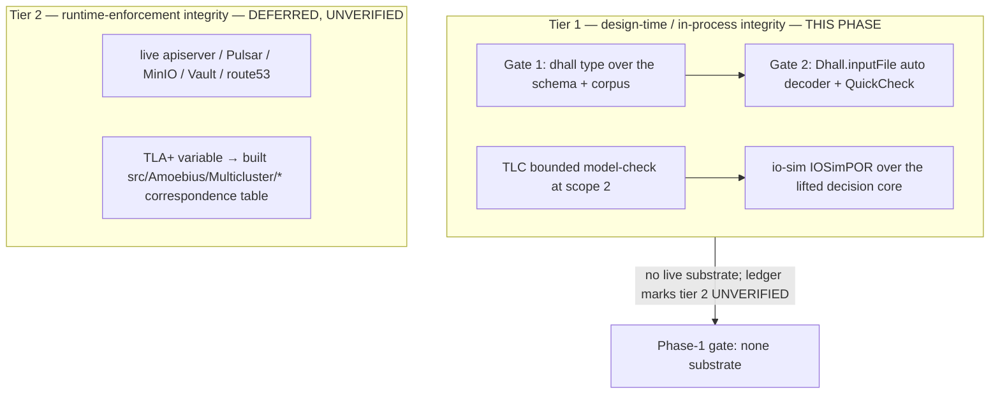

# Phase 1: Formal-first DSL & protocol integrity

**Status**: Authoritative source
**Supersedes**: N/A
**Referenced by**: README.md, overview.md, substrates.md, system_components.md, development_plan_standards.md, ../documents/engineering/dsl_doctrine.md, ../documents/engineering/illegal_state_catalog.md, ../documents/engineering/chaos_failover_doctrine.md, ../documents/engineering/tla_modelling_assumptions.md, ../documents/engineering/testing_doctrine.md
**Generated sections**: none

> **Purpose**: Validate — in-process, before any real-world resource is provisioned — everything about the
> DSL and the cross-cluster failover protocol that is provable **without a live substrate**: the
> illegal-state-unrepresentable type discipline (Dhall Gate 1 + Haskell decoder Gate 2 + property tests) and
> the failover-protocol design invariants (TLA+/TLC + io-sim). This is the **formal-first** inversion: only
> the correspondence-to-built-code and runtime-enforcement residue stays deferred to its later phase.

---

## Phase Status

📋 Planned. Specified before implementation; every sprint below is 📋 Planned and every prescriptive
statement is design intent, never a tested amoebius result. This phase opens after the Phase 0 documentation
lint passes and runs on **no substrate** (`none`) — it stands up no host and no cluster.

## Phase Summary

Amoebius's methodology used to defer *all* formal validation until a runtime existed to correspond to
(the DSL to Phase 4, the failover model to Phase 9). That deferral conflated two separable obligations:
**(a)** modelling the protocol and validating the type discipline — which is design-first and needs no
runtime — and **(b)** the variable-to-implementation *correspondence*, which genuinely cannot precede the
code. Only (b) needs code. This phase discharges (a) up front, in-process, so the DSL and the failover
protocol are proven sound in the abstract **before amoebius provisions a single real resource** — the
motivation recorded in [`chaos_failover_doctrine.md`](../documents/engineering/chaos_failover_doctrine.md)
and [`tla_modelling_assumptions.md §0`](../documents/engineering/tla_modelling_assumptions.md).

It front-loads exactly the **design-proof halves** of two later phases — the DSL type discipline (Phase 4)
and the cross-cluster failover model (Phase 9) — and nothing that needs a live apiserver, real
Pulsar/MinIO/Vault/Patroni/route53, real replication lag, or a built control-plane daemon. Those stay in
their phases as **Tier-2 runtime residue atop an already-proven-in-process spec**.

**Two distinct artifacts, two distinct questions (scope guard).** This phase validates *two* independent
things whose green lights must **never** be quoted for one another:

- **DSL representational integrity** (Sprints 1.1–1.3) — "if it decodes, it is deployable" *at the spec/code
  layer*: SSoT [`dsl_doctrine.md §5`](../documents/engineering/dsl_doctrine.md#5-the-illegal-state-unrepresentable-contract),
  [`illegal_state_catalog.md`](../documents/engineering/illegal_state_catalog.md). Truth-makers: the Dhall
  typechecker, a total Haskell decoder, QuickCheck. This surface includes **SPA composition
  (representational)**: that a single-page app composed from a multi-service app spec + an ML-workflow
  demo-web-app fragment (infernix/jitML — shared-library use is application logic,
  [`app_vs_deployment_doctrine.md §8`](../documents/engineering/app_vs_deployment_doctrine.md#8-shared-library-use-is-application-logic))
  is a well-typed, totally-composable Dhall value that decodes (Gate 1 + Gate 2 + a composition property),
  proven here at the spec/code layer — the front-loaded representational half of Phase 12, whose **live** SPA
  deploy stays [Phase 12](phase_12_spa_composition.md).
- **Cross-cluster failover protocol** (Sprints 1.4–1.5) — the async gateway-failover design is sound in the
  abstract: SSoT [`chaos_failover_doctrine.md`](../documents/engineering/chaos_failover_doctrine.md), artifact
  home [`tla_modelling_assumptions.md`](../documents/engineering/tla_modelling_assumptions.md). Truth-makers:
  TLA+/TLC bounded model-checking, io-sim's deterministic scheduler.

A green failover model is **not** DSL validation, and a green decoder is **not** a proven protocol.

**Substrate:** `none` — no host, no cluster. The gate is an in-process check battery, analogous to the
Phase-0 documentation lint.

**Gate:** `dhall type` over the schema + corpus is green (positives decode, Gate-1 negatives fail
type-check); `cabal test dsl-spec` is green (Gate-2 negatives return a structured `Left`, GADT-index
compile-fail goldens fail to compile, QuickCheck passes); the **SPA composition (representational)** corpus
composes end to end — positive app + ML-workflow demo-web-app fragment fixtures decode through Gate 1 + Gate 2
and `prop_spaCompositionDecodes` passes, while ill-composed SPA fixtures fail `dhall type` or decode-reject;
both `tlc` runs (`CrossClusterFailover`,
`SingletonElection`) reach every declared invariant at scope 2 with no counterexample; optionally
`cabal test formal-iosim` finds no violation. The run emits a **Tier-1-only** proven/tested/assumed ledger
led by a **Tier-2-UNVERIFIED banner** ([`testing_doctrine.md §4`](../documents/engineering/testing_doctrine.md)):
model↔code correspondence, runtime enforcement, and the real-time premises R8/R9 are marked UNVERIFIED, and
this ledger is **structurally insufficient to advance a production `PromotionGate`**
([`release_lifecycle_doctrine.md §4`](../documents/engineering/release_lifecycle_doctrine.md)).

**Honest front-loading asymmetry (state plainly, do not overstate "now"):** only Sprint 1.4 (JVM-standalone
TLA+/TLC) front-loads with **zero** amoebius dependency — like the Phase-0 `tools/doc_lint.sh`, it needs no
amoebius binary. Sprint 1.1's Gate-1 corpus needs only the `dhall` CLI. Sprints 1.2 / 1.3 / 1.5 need the
minimal cabal skeleton (Sprint 1.0) — "front-loaded" here means "as early as the skeleton exists," not
"buildable with no code at all." The **SPA composition (representational)** check rides the same split: its
Gate-1 typecheck needs only the `dhall` CLI (Sprint 1.1), its Gate-2 decode + composition property need the
skeleton (Sprint 1.3); none of it sits on the zero-dependency TLC side.

## Doctrine adopted

- [`dsl_doctrine.md §5 — The illegal-state-unrepresentable contract`](../documents/engineering/dsl_doctrine.md#5-the-illegal-state-unrepresentable-contract):
  the **two typed gates** — Gate 1 (Dhall typechecker) and Gate 2 (in-process `Dhall.inputFile auto` decoder)
  — are stood up here as an in-process proof, decoupled from the live deploy that stays in Phase 4.
- [`illegal_state_catalog.md §1/§2/§6`](../documents/engineering/illegal_state_catalog.md):
  build the GADT-indexed types, smart constructors, phantom tenant tags, and ownership indices that make the
  catalog's entries uninhabitable or decode-rejected, **at the honest foreclosure layer** — layers 1–2
  (type-/decode-foreclosed) are Tier-1 and discharged here; layer 3 (runtime-checked) is Tier-2 and stays
  deferred. Honors §2 verbatim: *a type-check proves the spec composes, not that the cluster enforces it.*
- [`chaos_failover_doctrine.md §4/§10/§12`](../documents/engineering/chaos_failover_doctrine.md):
  adopt the **Model** move (TLA+/TLC bounded model-check of the failover protocol) and the in-process
  **Simulate** move (io-sim over the lifted pure decision core against hand-built peer stubs) as design-first
  checks, emitting a proven-for-the-model / tested-for-design ledger — never a runtime claim.
- [`tla_modelling_assumptions.md §0/§1/§4`](../documents/engineering/tla_modelling_assumptions.md):
  author the abstract design-model tier (system model, invariant catalog, modelling bounds, verification
  status). The **variable-to-implementation correspondence table stays empty/UNVERIFIED** here — that empty
  state *is* the inversion; it is filled in Phase 9 against the built `src/Amoebius/Multicluster/*` modules.

## Sprints

## Sprint 1.0: Toolchain spike (blocking prerequisite) 📋

**Status**: Planned
**Implementation**: `cabal.project`, a throwaway probe target — target paths, not yet built.
**Blocked by**: Phase 0 gate.
**Independent Validation**: a probe package depending on `dhall`, `io-sim`, and `io-classes` builds and runs
under **GHC 9.12.4 / Cabal 3.16.1.0**; the exact `allow-newer` set, source-patch, or fork/pin required is
recorded, or the failure is recorded.
**Docs to update**: `DEVELOPMENT_PLAN/README.md` (Toolchain — the `allow-newer`/pin set), this document.

### Objective
Prove the Haskell in-process surface is buildable on the pinned toolchain **before** any later sprint or
doctrine promises an executable Gate-2. `dhall` historically lags new GHC releases (it pulls
`template-haskell`, `aeson`, `megaparsec`, `prettyprinter`); `allow-newer` alone may be insufficient and a
source patch or fork may be required. Gate 2 — the decoder and the entire "if it decodes, it is deployable"
claim — is impossible without this. TLA+/TLC (`tla2tools.jar`, pure JVM, version-stable) is unaffected, so
Sprint 1.4 proceeds regardless.

### Deliverables
- A recorded resolution: the concrete `allow-newer`/patch/fork/pin that makes `dhall` + `io-sim` +
  `io-classes` build on GHC 9.12.4, **or** a recorded blocker.

### Validation
1. `cabal build` of the probe succeeds on GHC 9.12.4 / Cabal 3.16.1.0, or the exact remediation is recorded.

### Remaining Work
The whole sprint (📋 Planned). **If it fails:** Sprints 1.2/1.3/1.5 slip and the blocker is recorded here;
Sprints 1.1 (Gate-1, `dhall` CLI only) and 1.4 (JVM TLC) still ship.

## Sprint 1.1: Dhall DSL schema + smart constructors (Gate 1) 📋

**Status**: Planned
**Implementation**: `dhall/amoebius/{prelude,Cluster,App,Deployment,Capability,Topology,Capacity,Storage,Retention}.dhall`
(typed surfaces + smart constructors) — target paths, not yet built.
**Blocked by**: Phase 0 gate (needs only the `dhall` CLI, not the Sprint-1.0 Haskell skeleton).
**Independent Validation**: `dhall type` / `dhall lint` accept the worked-example cluster / app / deployment
specs; a schema-mismatched fixture is rejected at authoring time with no binary run.
**Docs to update**: `documents/engineering/dsl_doctrine.md` (Phase-1 status backlink),
`DEVELOPMENT_PLAN/system_components.md` (DSL schema inventory).

### Objective
Adopt [`dsl_doctrine.md §2/§5`](../documents/engineering/dsl_doctrine.md#5-the-illegal-state-unrepresentable-contract):
stand up the three typed Dhall surfaces (cluster, app-spec, deployment-rules) as *data* that carries
parameters not logic, and Gate 1 — the Dhall typechecker — as an authoring-time boundary that fires before
any binary runs.

### Deliverables
- A Dhall prelude + record/union types exposing only *smart constructors* (a vocabulary with no illegal
  words): the 8-arm no-product `Capability` union (catalog §3.12); no-unbounded-arm `StorageBacking` /
  `Growable` (§3.18/§3.21); odd-quorum `Rke2Servers = ⟨Single|Ha3|Ha5⟩` (§3.24); mandatory size-triggered
  `RetentionPolicy` (§3.20) — all encoded as closed unions / required fields / no-arm.
- An in-file **honesty caveat**: because Dhall has no opaque types, binding/phantom-index foreclosures
  (catalog §4.1–§4.3) are only *partially* Gate-1-foreclosed (smart-constructor convention) and get real
  teeth at the Haskell GADT in Sprint 1.2 (Gate 2).

### Validation
1. `dhall type` over each positive fixture succeeds; the Gate-1-class negative fixtures fail `dhall type` at
   authoring time, no binary run.

### Remaining Work
The whole sprint (📋 Planned).

## Sprint 1.2: GADT-indexed IR + total decoder (Gate 2) 📋

**Status**: Planned
**Implementation**: minimal cabal skeleton (`amoebius.cabal`, `cabal.project`, a `dsl-spec` test-suite — **not**
the full bootstrap kernel); `src/Amoebius/Dsl/{Types,Decode,SmartConstructors,Topology}.hs`,
`src/Amoebius/Capacity/{Types,Fold,Growable}.hs`, `src/Amoebius/Capability/Binding.hs` — target paths, not
yet built.
**Blocked by**: Sprint 1.0, Sprint 1.1.
**Independent Validation**: a unit suite decodes each positive fixture through `Dhall.inputFile auto` to its
Haskell IR and asserts a structured-error `Left` on a well-typed-but-illegal fixture (no exception, no partial
effect).
**Docs to update**: `documents/engineering/dsl_doctrine.md`, `documents/engineering/illegal_state_catalog.md`
(per-entry layer reconciliation), `DEVELOPMENT_PLAN/system_components.md`.

### Objective
Adopt [`dsl_doctrine.md §5 — Gate 2`](../documents/engineering/dsl_doctrine.md#5-the-illegal-state-unrepresentable-contract):
build the GADT-indexed Haskell IR and the total, fail-fast `Dhall.inputFile auto` decoder that rejects a
well-typed Dhall value that is not a legal amoebius world — the pure decode + illegal-state discipline, with
**no** chain/reconcile/singleton (those stay in Phases 2/4).

### Deliverables
- `decodeCluster :: FilePath -> IO (Either DecodeError ClusterIR)` = `Dhall.inputFile auto`, total/fail-fast.
- GADT-indexed types + smart constructors + phantom tenant `Ref tenant a` + ownership folds that make the
  catalog's decode-foreclosed entries (overcommit, distinctness, storage/topic ceilings, engine/substrate
  match) return a structured `Left`, each tagged with its catalog entry and honest foreclosure layer.

### Validation
1. Each positive fixture decodes to its IR; each Gate-2 negative fixture returns a structured `Left` with the
   expected error tag; no runtime-checked claim is made.

### Remaining Work
The whole sprint (📋 Planned).

## Sprint 1.3: Negative/positive corpus + property tests 📋

**Status**: Planned
**Implementation**: `dhall/examples/{legal_*,illegal_*}.dhall`; `test/dsl/IllegalSpecSpec.hs` (per-case
exhaustive), `test/dsl/DecisionPropSpec.hs` (QuickCheck); a pinned `ghc -fno-code` expect-fail harness for
compile-fail goldens — target paths, not yet built.
**Blocked by**: Sprint 1.1, Sprint 1.2.
**Independent Validation**: the corpus is **split by foreclosure layer** — Gate-1 negatives must fail
`dhall type`; Gate-2 negatives must pass `dhall type` and then be rejected at decode; GADT-index negatives
must fail to compile under the pinned `ghc -fno-code` harness; positives decode. A coverage check maps every
fixture to a catalog entry and its layer.
**Docs to update**: `documents/engineering/illegal_state_catalog.md` (per-entry layer + gate-case backlink),
`documents/engineering/testing_doctrine.md` (the in-process Tier-1 ledger variant),
`DEVELOPMENT_PLAN/phase_12_spa_composition.md` (backlink: the representational SPA composition is proven
here; only the live deploy stays Phase 12).

### Objective
Adopt [`illegal_state_catalog.md §1/§2/§6`](../documents/engineering/illegal_state_catalog.md): assemble the
corpus that exercises the type discipline, honestly split by the gate that rejects each fixture, and the
QuickCheck properties that establish closure / round-trip / fold-totality / composition-preservation. This
corpus also exercises **SPA composition (representational)** — composing a multi-service app spec with an
ML-workflow demo-web-app fragment (infernix/jitML) as typed Dhall fragments, proven here at the spec/code
layer per [`app_vs_deployment_doctrine.md §8`](../documents/engineering/app_vs_deployment_doctrine.md#8-shared-library-use-is-application-logic)
(shared-library use is application logic; a demo web app is *not* an extension). This is the front-loaded
representational half of [Phase 12](phase_12_spa_composition.md); the live SPA deploy stays there.

### Deliverables
- Positive fixtures (`legal_multisubstrate_cluster`, `legal_managed_eks`, `trivial_app`) that decode.
- Gate-1 negatives (must fail `dhall type`): product-in-app-logic, open ingress, unbounded storage /
  un-tiered topic, rke2-on-bare-apple, multinode-kind-two-hosts, even/zero-server rke2, …
- Gate-2 negatives (must pass `dhall type`, then decode-reject): overcommit (host/vm/cluster),
  store-over-backing, hot-tier-over-bookie, engine/substrate mismatch, untolerated/hand-authored toleration,
  rke2-nodes>hosts / reused-host, …
- SPA-composition fixtures — positive (`legal_spa_compose_*`): a multi-service app spec with a nested
  infernix/jitML ML-workflow demo-web-app fragment composes into one well-typed Dhall value that decodes
  through Gate 1 + Gate 2; negative (`illegal_spa_compose_*`): an ill-composed SPA — e.g. a fragment whose
  capability needs do not compose, or a product literal smuggled onto the app surface — fails `dhall type`
  (Gate 1) or decode-rejects (Gate 2).
- QuickCheck `prop_smartCtorClosure`, `prop_decodeRoundTrip`, `prop_foldTotal`,
  `prop_compositionPreservesWellFormedness`, `prop_spaCompositionDecodes` (an app spec + an ML-workflow
  demo-web-app fragment always composes to a decoding SPA value) — labeled **TESTED (sampled)**, upgraded to
  PROVEN only for exhausted finite domains (e.g. the three `Rke2Servers` arms).

### Validation
1. Every negative fixture is rejected at the layer it is tagged with (Gate 1 / Gate 2 / compile-fail); the
   suite is red if any illegal fixture decodes; QuickCheck is green.
2. The positive SPA-composition fixtures compose and decode (Gate 1 + Gate 2 green); each ill-composed SPA
   fixture fails at its tagged gate; `prop_spaCompositionDecodes` is green — **SPA composition
   (representational)** proven at the spec/code layer, with the live SPA deploy left to Phase 12.

### Remaining Work
The whole sprint (📋 Planned).

## Sprint 1.4: Abstract TLA+/TLC failover & election model 📋

**Status**: Planned
**Implementation**: `spec/tla/CrossClusterFailover.tla` + `.cfg`, `spec/tla/SingletonElection.tla` + `.cfg` —
target paths, not yet built. **Zero amoebius dependency** (pure JVM `tla2tools.jar`); not blocked by the
Sprint-1.0 spike.
**Blocked by**: Phase 0 gate.
**Independent Validation**: `tlc` reaches every declared invariant at bounded scope (2 clusters / 3
candidates) with no counterexample; a `CONSTRAINT` bounds the state space.
**Docs to update**: `documents/engineering/tla_modelling_assumptions.md` (design-model tier authored, TLC
status), `documents/engineering/chaos_failover_doctrine.md` (§12 Model row → proven-for-the-model),
`DEVELOPMENT_PLAN/system_components.md` (spec/tla rows).

### Objective
Adopt [`chaos_failover_doctrine.md §4 — Model`](../documents/engineering/chaos_failover_doctrine.md) and
[`tla_modelling_assumptions.md §0/§1/§4`](../documents/engineering/tla_modelling_assumptions.md): author the
abstract design-model of the async cross-cluster gateway `Failover` boundary and the First-Axis singleton
election, and model-check them **before** the runtime exists to correspond to.

### Deliverables
- `CrossClusterFailover.tla` — vocabulary from `chaos_failover_doctrine.md` Appendix A/B; invariants
  `UniqueOwner`, `NoTugOfWar`, `ExactlyOnce` (R3), `MergeConverges` (R7), `NoWriteAfterStaleFailover`, temporal
  `SingletonTakeover` (weak fairness); `CONSTRAINT Len(log[c]) ≤ MaxOffset` bounds state at scope 2.
- `SingletonElection.tla` — the First-Axis "no two active singletons" property at 3 candidates.
- The `tla_modelling_assumptions.md` design-model tier authored; the **correspondence table left empty and
  marked UNVERIFIED** (filled in Phase 9 against built modules).

### Validation
1. Both `tlc` runs reach all declared invariants at scope 2 with no counterexample — **proven for the model
   at scope 2**; the modelling-bounds section states what scope 2 does *not* prove.

### Remaining Work
The whole sprint (📋 Planned).

## Sprint 1.5: io-sim schedule check over the lifted decision core (optional) 📋

**Status**: Planned
**Implementation**: `test/iosim/CrossClusterFailover.hs`, `src/Amoebius/Multicluster/GatewayDecision.hs` (the
pure decision function only) over `io-classes` / `IOSimPOR` — target paths, not yet built.
**Blocked by**: Sprint 1.0, Sprint 1.2.
**Independent Validation**: `IOSimPOR` + QuickCheck assert the *same* safety predicates as the Sprint-1.4 TLA+
invariants over explored schedules, against hand-built peer stubs.
**Docs to update**: `documents/engineering/chaos_failover_doctrine.md` (§10 Simulate — adopted early for the
pure-decision design check), `DEVELOPMENT_PLAN/system_components.md`.

### Objective
Adopt [`chaos_failover_doctrine.md §10 — Simulate`](../documents/engineering/chaos_failover_doctrine.md):
run the lifted pure decision core against an adversarial deterministic scheduler as a design-schedule check.

### Deliverables
- A `GatewayDecision` pure function and an `IOSimPOR` harness asserting the TLA+-mirrored safety predicates on
  explored traces — labeled **TESTED (sampled schedules)**.

### Validation
1. `IOSimPOR` finds no violation of the mirrored safety predicates in explored schedules.

> **Honesty.** This is a **skeleton** with low marginal value now: real amoebius daemons share no in-process
> state — they coordinate cross-process through Pulsar + MinIO + the commit log — so an `IOSim` run rests on
> hand-built peer stubs and **cannot reach the catastrophic cross-actor invariant**, which is served by
> Sprint 1.4's TLA+ model and, later, by live chaos injection. Keep it a skeleton; it must not consume the
> phase's budget.

### Remaining Work
The whole sprint (📋 Planned).

## Documentation Requirements

**Engineering docs to update (when the gate runs, flip the honest layer, never before):**
- `documents/engineering/dsl_doctrine.md` — backlink §5's two gates to the in-process Phase-1 proof; keep
  runtime enforcement as Tier-2 residue owned by Phase 4.
- `documents/engineering/illegal_state_catalog.md` — annotate each entry exercised here with its realized
  foreclosure layer (type-/decode-foreclosed → Tier 1); keep runtime-checked entries (layer 3) deferred.
- `documents/engineering/chaos_failover_doctrine.md` — §12 Model row → **proven for the model** at TLC-green;
  §10 Simulate → tested-for-design; correspondence / Inject / R8 / R9 stay UNVERIFIED/assumed.
- `documents/engineering/tla_modelling_assumptions.md` — replace the design-model tier's stub with the
  authored model + TLC status; keep the correspondence tier UNVERIFIED.
- `documents/engineering/testing_doctrine.md` — the Tier-1-only in-process ledger variant this gate emits.

**Cross-references to add:**
- `DEVELOPMENT_PLAN/README.md` — flip the Phase 1 status when the gate passes; link this document.
- `DEVELOPMENT_PLAN/substrates.md` — the Phase-1 `none` gate row.
- `DEVELOPMENT_PLAN/system_components.md` — register `dhall/amoebius/`, `src/Amoebius/Dsl/`,
  `src/Amoebius/Capacity/`, `src/Amoebius/Capability/`, `src/Amoebius/Multicluster/GatewayDecision.hs`, and
  `spec/tla/` as Phase-1 design-first rows.

## Related Documents
- [README.md](README.md) — the live tracker and phase order this document serves
- [development_plan_standards.md](development_plan_standards.md) — the rulebook this document obeys (the
  design-proof acceptance token: *spec-composition proven / proven-for-the-model*, never *runtime proven*)
- [overview.md](overview.md) — target architecture and the DSL vision
- [DSL Doctrine](../documents/engineering/dsl_doctrine.md) — the two typed gates and the illegal-state contract
- [Illegal State Catalog](../documents/engineering/illegal_state_catalog.md) — the catalog, the typing
  techniques, and the honest foreclosure-layer split
- [Chaos & Failover Doctrine](../documents/engineering/chaos_failover_doctrine.md) — the Extract→Model→Inject
  methodology and the proven/tested/assumed ledger
- [TLA+ Modelling Assumptions](../documents/engineering/tla_modelling_assumptions.md) — the design-model
  artifact this phase authors (correspondence tier deferred to Phase 9)
- [phase_04](phase_04_dsl_control_plane_singleton.md) — the DSL's Tier-2 runtime half (live deploy + singleton)
- [phase_09](phase_09_multicluster_spawn_georeplication.md) — where the failover correspondence table is filled
- [phase_12](phase_12_spa_composition.md) — the live SPA deploy; its representational composition is front-loaded here
