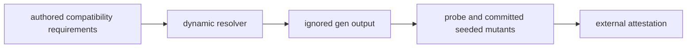

# Phase 1: Toolchain spike

> **Purpose**: Resolve the current compatible pre-cluster toolchain dynamically and prove that the decoder,
> simulator, resolver, browser, and protocol-codegen probes build without committing solver output, package
> integrity pins, or host-specific paths.
> **Read this if**: phase 1 is next in the queue, or a later phase depends on what its gate establishes.

Phase 1 delivers the toolchain spike; its design is owned by [conformance_harness_doctrine.md](../documents/engineering/conformance_harness_doctrine.md), [testing_doctrine.md](../documents/engineering/testing_doctrine.md), [dsl_doctrine.md](../documents/engineering/dsl_doctrine.md), and the plan for reaching it is owned here.
Register 1: an in-process battery, no cluster.
The gate passed on 2026-08-08; runtime, cluster, and Gate-2 semantic fidelity remain UNVERIFIED.

> **Historical result (invalidated).** Any pass, seal, validation, ledger, receipt, or implementation observation
> in the orientation text above is diagnostic only. The Phase Status section and [tracker](README.md) own current state; the
> target contract below remains normative.

Link-graph metadata

**Status**: Authoritative source
**Supersedes**: N/A
**Referenced by**: DEVELOPMENT_PLAN/README.md, DEVELOPMENT_PLAN/overview.md, DEVELOPMENT_PLAN/phase_02_formal_model_kernel.md, DEVELOPMENT_PLAN/phase_14_chain_kernel_boundary.md, DEVELOPMENT_PLAN/phase_33_live_dsl_singleton.md, DEVELOPMENT_PLAN/system_components.md, documents/engineering/content_addressing_doctrine.md, documents/engineering/dsl_doctrine.md
**Generated sections**: none

## Contents
- [Phase Status](#phase-status)
- [Phase Summary](#phase-summary)
- [Gate integrity](#gate-integrity)
- [Doctrine adopted](#doctrine-adopted)
- [Sprints](#sprints)
- [Sprint 1.1: Historical shared-resolution spike ⏸️](#sprint-11-historical-shared-resolution-spike-)
- [Sprint 1.2: `dhall` in-process decoder build probe (Gate-2 dependency) ⏸️](#sprint-12-dhall-in-process-decoder-build-probe-gate-2-dependency-)
- [Sprint 1.3: `io-sim` + `io-classes` simulation build probe ⏸️](#sprint-13-io-sim--io-classes-simulation-build-probe-)
- [Sprint 1.4: jit-build resolver deps + `purescript-bridge` + consolidated probe gate ⏸️](#sprint-14-jit-build-resolver-deps--purescript-bridge--consolidated-probe-gate-)
- [Sprint 1.5: `supernova` fork + `proto-lens` codegen build probe ⏸️](#sprint-15-supernova-fork--proto-lens-codegen-build-probe-)
- [Sprint 1.6: Dynamic resolution and generated-output migration ⏸️](#sprint-16-dynamic-resolution-and-generated-output-migration-)
- [Documentation Requirements](#documentation-requirements)
- [Related Documents](#related-documents)

---

## Phase Status

⏸️ Blocked by the reopened numeric sequence. Reopened 2026-08-11: the prior seal did not include the universal artifact-hygiene
postcondition. This phase returns to numeric order only after Phase 0 closes, then must rerun its capability
gate from a clean committed tree and publish external evidence without changing an authored path.

**Invalidated historical record:**

✅ Done. The consolidated clean-store gate passed on 2026-08-08 with
`python3 tools/phase1_gate.py`, emitting ledger
`dynamically-resolved`. This is a tested buildability result,
not a runtime or Gate-2-semantics result. This phase opened after the Phase 0 documentation lint passed and ran on **no substrate**
(`none`): it stands up no host and no cluster, resolving and building only Hackage packages on the developer
toolchain. It is a de-risking pre-flight for the whole pre-cluster band after this phase (Phases 2–16), whose
in-process integrity checks all rest on the dependencies probed here.

## Phase Summary

This phase settles buildability without freezing a dependency graph into Git. The authored project files state
package names, source channels, and compatibility requirements. A clean gate resolves the current compatible
compiler, libraries, browser tools, protocol generator, and transitive graph into `gen/toolchain/` and
`gen/locks/`.

The probe covers the in-process Dhall decoder, `io-sim`/`io-classes`, jit-build resolver dependencies,
PureScript contract generation, and the native Pulsar client's protocol code generation. Resolved versions,
source identities, compatibility adjustments, observed checksums, executable paths, and transcripts are run
evidence. They are externally attested and never copied into Markdown or a tracked manifest.

**Substrate:** `none` — no host, no cluster; the gate resolves and compiles Hackage packages on the developer
toolchain only.

**Register:** 1 — pure/build, in-process, no cluster ([§K](development_plan_standards.md#k-honesty-proven--tested--assumed)).

**Gate:** `python3 tools/phase1_gate.py` dynamically resolves a clean compatible graph, builds and
runs every named probe and mutant, writes only ignored run output, leaves authored paths unchanged, and
publishes a verified external attestation.

## Gate integrity

The representative set is `dhall`, `io-sim`, `io-classes`, the jit-build resolver dependencies,
`purescript-bridge`, PureScript/Spago/browser tooling, the native Pulsar client, `supernova`, `proto-lens`,
and `protoc`. The authored Dhall positive/negative pair, independent simulation expectation, schedule mutant,
dependency-resolution mutant, and protocol round-trip fixture remain the oracle side.

The gate starts with empty package/build caches for the probed graph. It generates solver results, bindings,
transcripts, enumerations, and ledgers beneath `gen/`. The external attestation records actual versions,
sources, integrity observations, compatibility changes, and tool paths. A hard blocker is a red gate with
external diagnostics, never a prose substitute for success.

*Design intent. Phase 1 resolves a current compatible graph per run and retains only external evidence, as owned by [repository-layout doctrine §4](../documents/engineering/repository_layout_doctrine.md#4-dependency-and-toolchain-resolution).*

## Doctrine adopted

- [`conformance_harness_doctrine.md §2 — the registers`](../documents/engineering/conformance_harness_doctrine.md#2-the-registers-as-amoebius-uses-them-for-pre-cluster-validation)
  and its [§3](../documents/engineering/conformance_harness_doctrine.md#3-the-load-bearing-invariant-rendering-never-touches-live-infrastructure) load-bearing invariant that **rendering never touches live infrastructure**: this phase is a pure
  Register-1 check ([register definitions](../documents/engineering/testing_doctrine.md#2-the-registers-of-amoebius-testing)),
  building and running in-process with no cluster, no credentials, and no broker.
- [`dsl_doctrine.md §9 — Toolchain note`](../documents/engineering/dsl_doctrine.md#9-toolchain-note), read
  with [§5's Gate 2](../documents/engineering/dsl_doctrine.md#5-the-illegal-state-unrepresentable-contract):
  the in-process `dhall` decoder — the Gate-2 structural leg of the later
  `decode → bind/expand → plan/resolve infrastructure → provision → ProvisionedSpec → renderAll` contract — needs `allow-newer` against the
  pinned GHC; this phase is where that exact set is proven or the blocker recorded, before any later phase
  promises an executable Gate 2.
- [`gateway_migration_model_doctrine.md §4 — Simulate and prove`](../documents/engineering/gateway_migration_model_doctrine.md#4-simulate-and-prove):
  amoebius's **one** formal obligation drives the gateway-migration `Model` (both `Planned` and `Failover`
  branches) against `io-classes`/`IOSimPOR`'s deterministic scheduler; this phase de-risks that build
  dependency, while the version-stable JVM TLC half stays unaffected by the GHC pin.
- [`formal_model_doctrine.md §7 — Prototype validation`](../documents/engineering/formal_model_doctrine.md#7-prototype-validation):
  the reifiable-`Model` mechanism — one value rendering both `interpret` (runtime) and `emitTLA` (a generated,
  never-committed `.tla`) — was prototyped in a throwaway spike; that is **sibling evidence, not an amoebius result**, and its Haskell side must build on the pin before Phase 2 authors it.
- [`content_addressing_doctrine.md §4.5 — the ML-asset lifecycle`](../documents/engineering/content_addressing_doctrine.md#45-the-ml-asset-lifecycle-one-bounded-content-addressed-cache-resolved-on-first-miss):
  ML engines/models/kernels are never baked or URL-fetched — the shared `jit-build` resolver materializes each
  **named catalog identity** on first miss into a `CacheBudget`-bounded content-addressed cache; the resolver's
  own Haskell dependencies are folded into this probe.

## Sprints

> **Current revalidation rule.** Every sprint is blocked by the reopened numeric sequence. Historical dates,
> pass/seal claims, repository-resident evidence paths, and `Remaining Work: None` statements below describe
> the pre-amendment capability record only; they do not override current status. Functional and validation
> outcomes remain target requirements. Any instruction to commit generated output, freeze dependency resolution,
> retain a resolved version, path, or integrity hash, or consume repository-resident evidence, ledgers, or
> enumerations is superseded by the current generated-artifact and dynamic-resolution doctrine. Closure requires
> the current phase gate plus universal artifact hygiene.

**Historical result (invalidated).** Sprints 1.1–1.5 preserve the pre-amendment resolution experiment and
its former repository-resident evidence paths for diagnosis only. Sprint 1.6 is the current replacement:
it removes fixed resolution and generated evidence from authored roots before the phase gate can pass.

## Sprint 1.1: Historical shared-resolution spike ⏸️

**Status**: Blocked by the reopened numeric sequence; prior capability footprint retained for migration
**Implementation**: `cabal.project`, `cabal.project.freeze`, and `toolchain/pins.json` — the **pin
manifest**: the resolved absolute paths of `ghc`/`cabal`/`dhall` (invoked by absolute path from
[Phase 5](phase_05_gadt_decoder_gate2.md) on) and of `spago`/`purs` + Chromium (the browser toolchain the UI
phases from [Phase 21](phase_21_ui_browser_interpreter.md) on drive) — implemented and version-checked by the gate.
**Blocked by**: reopened numeric predecessor gates.
**Requires**: `host-toolchain` — the pinned binaries present on the developer host. This sprint records
**where they resolve to**; it does not install them.
**Independent Validation**: `cabal build` of a trivial library succeeds
on **GHC 9.12.4 / Cabal 3.16.1.0** from a clean store (`rm -rf dist-newstyle` first), with the retained
transcript echoing `ghc --version` and `cabal --version` in-band and showing the shell-observed exit 0; the
compiler and a frozen Hackage `index-state` are captured in one shared committed project file.
**Docs to update**: `DEVELOPMENT_PLAN/README.md` (Toolchain — the shared pin),
`DEVELOPMENT_PLAN/system_components.md`.

### Objective
Adopt the shared-pin discipline recorded in the tracker's Toolchain note — one **GHC 9.12.4 / Cabal 3.16.1.0**
pin across every package, and a single `index-state` that fixes the Hackage snapshot — so every later sprint in
this phase resolves against one dependency universe rather than a drifting one.

### Deliverables
- A `cabal.project` naming the compiler and freezing an `index-state`, plus a trivial library that compiles
  clean against a stock package set — the baseline, with **no** `allow-newer` yet.

### Validation
1. `cabal build` is green on the pin with a stock package set, run from a clean `dist-newstyle`; the retained
   transcript echoes `ghc --version`/`cabal --version` and the exit-0 status observed by the shell, and the
   `index-state` is committed as the shared snapshot.

### Remaining Work
None. Validated by the consolidated Phase-1 gate on 2026-08-08.

## Sprint 1.2: `dhall` in-process decoder build probe (Gate-2 dependency) ⏸️

**Status**: Blocked by the reopened numeric sequence; prior capability footprint retained for migration
**Implementation**: `probe/probe.cabal` (a `dhall` build-depends), `probe/app/Decode.hs`
(decode a trivial `.dhall` in-process) — implemented as the retained gate harness.
**Blocked by**: reopened numeric predecessor gates.
**Independent Validation**: a probe depending on `dhall` builds under the pin from a clean store, and `cabal
run probe:decode` decodes the oracle-pinned `probe/fixtures/ok.dhall` into its committed expected
Haskell value and exits 0 (a green `cabal build` alone does **not** satisfy this — an executed, exit-checked
run is required); paired with it, `probe/fixtures/bad-type.dhall` — a positive/negative pair differing only
in one mistyped field — makes `cabal run probe:decode` fail with its committed `dhall` type-error tag (§M.8:
the failure is asserted by its specific tag, not by "fails"). The exact `allow-newer`/source-patch/fork
required by `dhall`'s transitive deps (`template-haskell`, `aeson`, `megaparsec`, `prettyprinter`) is
recorded **together with** the green transcript produced with exactly that set (branch-1 evidentiary rule
above); or the blocker is recorded with the verbatim failing output and one failing transcript per
remediation class.
**Docs to update**: `DEVELOPMENT_PLAN/README.md` (the `allow-newer` set),
`documents/engineering/dsl_doctrine.md` (§9 backlink).

### Objective
Adopt [`dsl_doctrine.md §9 — Toolchain note`](../documents/engineering/dsl_doctrine.md#9-toolchain-note) with
its [§5 Gate 2](../documents/engineering/dsl_doctrine.md#5-the-illegal-state-unrepresentable-contract): prove
the in-process `dhall` decoder — the structural Gate-2 leg that must precede Phase-10/11 bind/provision — is
buildable on the pin before Phase 5 promises an executable decoder. `dhall` historically lags new GHC releases, so
`allow-newer` alone may be insufficient and a source patch or fork may be required.

### Deliverables
- A recorded resolution: the concrete `allow-newer`/patch/fork/pin that makes `dhall` build on GHC 9.12.4, with
  the retained green `cabal build` + `cabal run probe:decode` transcripts produced under exactly that set,
  **or** a recorded blocker carrying the verbatim failing output and one failing transcript per remediation
  class (bare `allow-newer`, source patch, fork/pin).
- The committed Phase-0 fixtures `probe/fixtures/ok.dhall` (+ its expected decoded value) and
  `probe/fixtures/bad-type.dhall` (+ its expected `dhall` type-error tag).

### Validation
1. `cabal run probe:decode` decodes `probe/fixtures/ok.dhall` into its committed expected value and exits 0,
   and the same binary on `probe/fixtures/bad-type.dhall` fails with the committed `dhall` type-error tag; the
   exit-checked transcripts are retained. **The "or recorded" branch is evidentiary** per the Gate line — a
   remediation set counts only with its matching green transcript; a blocker counts only with verbatim failing
   output per remediation class. Prose alone never passes.

### Remaining Work
None. The positive decode matched byte-for-byte and the negative failed at `DHALL_TYPE_ERROR` in the retained
2026-08-08 gate evidence.

## Sprint 1.3: `io-sim` + `io-classes` simulation build probe ⏸️

**Status**: Blocked by the reopened numeric sequence; prior capability footprint retained for migration
**Implementation**: extend `probe/probe.cabal` (`io-sim`, `io-classes` build-depends),
`probe/app/Sim.hs` (a trivial `IOSimPOR` run that **emits the terminal state it reaches on stdout** in the
committed serialization), the external harness `probe/oracle/check-sim-terminal`, the Phase-0 oracle
`probe/fixtures/sim-terminal.expected`, and the seeded mutant `probe/mutants/perturb-sim-schedule` — implemented
as the retained gate harness.
**Blocked by**: reopened numeric predecessor gates.
**Independent Validation**: a probe depending on
`io-sim`/`io-classes` builds under the pin from a clean store, and `cabal run probe:sim` runs the
Phase-0-named `IOSimPOR` schedule and **emits the terminal state it reaches on stdout**, which the external
harness `probe/oracle/check-sim-terminal` byte-diffs against the oracle-pinned oracle
`probe/fixtures/sim-terminal.expected` — the leg greens **only** on a byte-exact match, **not** on the
probe's self-reported exit 0 (a `main = exitSuccess` stub emits no terminal state and fails the diff);
paired with it, the seeded mutant `probe/mutants/perturb-sim-schedule` (the schedule's step ordering
perturbed / one fairness step dropped) MUST turn `probe:sim` **red at a terminal-state mismatch** against
the same oracle (§M.2: the mutant is named by path + operator and paired with the terminal-state positive it
breaks); the exact `allow-newer`/pin is recorded together with the green transcript produced under it
(branch-1 rule), or the blocker is recorded with verbatim failing output per remediation class.
**Docs to update**: `DEVELOPMENT_PLAN/README.md`, `documents/engineering/gateway_migration_model_doctrine.md` (§4
backlink), `DEVELOPMENT_PLAN/system_components.md`.

### Objective
Adopt [`gateway_migration_model_doctrine.md §4 — Simulate and prove`](../documents/engineering/gateway_migration_model_doctrine.md#4-simulate-and-prove):
amoebius's one formal obligation drives the gateway-migration `Model` against `io-classes`/`IOSimPOR`'s
deterministic, partial-order-reduced scheduler. Prove that toolchain builds on the pin before Phase 3 authors
the simulation. TLC (`tla2tools.jar`) is pure JVM and version-stable, so the Phase-2/3 TLC path is **not** gated
by this probe.

### Deliverables
- A recorded resolution for `io-sim` + `io-classes` on the pin with its retained green build + `cabal run
  probe:sim` transcripts, **or** a recorded blocker with verbatim failing output per remediation class.
- The oracle-pinned `IOSimPOR` schedule name and its expected terminal state serialized as
  `probe/fixtures/sim-terminal.expected`, the external comparison harness `probe/oracle/check-sim-terminal`, and
  the seeded sim-path mutant `probe/mutants/perturb-sim-schedule`.

### Validation
1. `cabal run probe:sim` emits its reached terminal state and the external `check-sim-terminal` harness confirms
   a byte-exact match against the committed `probe/fixtures/sim-terminal.expected` oracle (never the probe's
   self-exit); the seeded mutant `probe/mutants/perturb-sim-schedule` is re-run and MUST turn `probe:sim` red at
   a terminal-state mismatch; transcript retained, **or** the exact remediation/blocker is recorded evidentiarily
   per the Gate line (matching green transcript, or verbatim failing output per remediation class — prose alone
   never passes).

### Remaining Work
None. The external terminal-state oracle passed and the schedule perturbation mutant was killed on 2026-08-08.

## Sprint 1.4: jit-build resolver deps + `purescript-bridge` + consolidated probe gate ⏸️

**Status**: Blocked by the reopened numeric sequence; prior capability footprint retained for migration
**Implementation**: extend `probe/probe.cabal` (the `jit-build` resolver's Haskell deps
— content-hashing, download-or-build, process control — **plus** the build-only `purescript-bridge` contract
generator, **plus** the `supernova` fork + `proto-lens` codegen whose recorded resolution Sprint 1.5 lands)
and a single `probe` executable whose `build-depends` enumerates the **entire** Representative set — `dhall`
+ `io-sim` + `io-classes` + the eight resolver packages + `purescript-bridge` + `supernova`/`proto-lens`;
the recorded-resolution ledger in `DEVELOPMENT_PLAN/README.md` — implemented and retained as gate evidence.
**Blocked by**: reopened numeric predecessor gates.
**Independent Validation**: one probe package whose `build-depends` matches the
"Representative set" list exactly — `dhall`, `io-sim`, `io-classes`, the eight enumerated resolver packages
`cryptohash-sha256`, `http-client`, `http-client-tls`, `typed-process`, `tar`, `zlib`, `directory`,
`filepath`, **the build-only `purescript-bridge` contract generator, and the `supernova` fork + `proto-lens` codegen** (all five clauses (i)–(v) of the Representative set; a category description or a set already in
the stock closure does not satisfy this) — builds and links under GHC 9.12.4 / Cabal 3.16.1.0 from a clean
store; `cabal run probe:decode` exits 0 on its committed fixture; and `cabal run probe:sim` emits its
reached terminal state, which the external `check-sim-terminal` harness confirms byte-exact against the
committed `probe/fixtures/sim-terminal.expected` oracle (never the probe's self-exit). **Both** seeded
mutants are re-run: `probe/mutants/drop-allow-newer` MUST turn `cabal build` red at a
version-mismatch/compile-fail locus, and `probe/mutants/perturb-sim-schedule` MUST turn `probe:sim` red at a
terminal-state mismatch (together proving the gate detects both an unbuildable config and a
wrong-terminal-state sim, not just rubber-stamps a green one). The consolidated `allow-newer`/patch/fork set
is recorded with its matching green transcripts (branch-1), or the exact blocker with verbatim
per-remediation-class failing output (branch-2), in the tracker's Toolchain section.
**Docs to update**:
`DEVELOPMENT_PLAN/README.md` (Toolchain — the consolidated pin/`allow-newer` set),
`documents/engineering/content_addressing_doctrine.md` (§4.5 resolver-deps backlink),
`DEVELOPMENT_PLAN/system_components.md`.

### Objective
Adopt [`content_addressing_doctrine.md §4.5 — the ML-asset lifecycle`](../documents/engineering/content_addressing_doctrine.md#45-the-ml-asset-lifecycle-one-bounded-content-addressed-cache-resolved-on-first-miss):
the shared `jit-build` resolver that materializes named catalog identities into the `CacheBudget`-bounded
content-addressed cache carries its own Haskell dependencies. Fold them into one probe that also links `dhall`
+ `io-sim` + `io-classes`, so the whole pre-cluster in-process surface is proven buildable as **one**
dependency universe — the phase gate.

### Deliverables
- The consolidated throwaway probe executable whose `build-depends` matches the Representative-set list
  exactly — all five clauses (i)–(v): `dhall` + `io-sim` + `io-classes` + the eight resolver packages +
  `purescript-bridge` + `supernova`/`proto-lens` (the last folded in from Sprint 1.5).
- The recorded-resolution ledger (the `allow-newer`/patch/fork set with its matching green transcripts, or the
  hard blocker with verbatim per-remediation-class failing output) in the tracker's Toolchain section.
- The retained `cabal.project` + freeze file, all `cabal build`/`cabal run` transcripts, the external
  `probe/oracle/check-sim-terminal` harness with its `probe/fixtures/sim-terminal.expected` oracle, and **both**
  seeded mutants `probe/mutants/drop-allow-newer` and `probe/mutants/perturb-sim-schedule`, under
  `DEVELOPMENT_PLAN/evidence/phase_01/` (or CI-archived and linked), kept until Phase 5 supersedes them.
- A first-class proven/tested/assumed ledger artifact ([§K](development_plan_standards.md#k-honesty-proven--tested--assumed)) — naming **Register 1**, recording the green build +
  executed-fixture results as *tested*, and marking every runtime, cluster, and Gate-2-semantics layer
  **UNVERIFIED** — retained even though the probe package itself is deleted after resolution.

### Validation
1. The consolidated probe's `build-depends` matches the Representative-set list exactly (all five clauses
   (i)–(v)); `cabal build` is green on the pin from a clean store; `cabal run probe:decode` exits 0 on its
   committed fixture; `cabal run probe:sim`'s reported terminal state passes the external `check-sim-terminal`
   diff against the committed oracle; and **both** mutants turn the gate red — `probe/mutants/drop-allow-newer`
   at a compile-fail locus and `probe/mutants/perturb-sim-schedule` at a terminal-state mismatch — **or** the
   exact remediation/blocker is recorded evidentiarily per the Gate line. All transcripts are retained and the
   proven/tested/assumed ledger is emitted — the Phase-1 acceptance condition. Prose in the tracker without
   matching retained transcripts never passes.

### Remaining Work
None. The probe remains only as a re-runnable gate harness; it is not a durable amoebius runtime module.

## Sprint 1.5: `supernova` fork + `proto-lens` codegen build probe ⏸️

**Status**: Blocked by the reopened numeric sequence; prior capability footprint retained for migration
**Implementation**: extend `probe/probe.cabal` (the native Pulsar client's `supernova`
fork + its `proto-lens` codegen, build-only), plus the generated protobuf modules the `proto-lens` codegen
emits — implemented and retained as gate evidence.
**Blocked by**: reopened numeric predecessor gates.
**Independent Validation**: the `supernova`
fork and its `proto-lens` codegen resolve and compile under the pin from a clean store — the hardest single
leg, a source **fork** plus a codegen step, not a stock Hackage pull — with the retained green `cabal build`
transcript echoing `ghc --version`/`cabal --version` in-band and showing the shell-observed exit 0; the
exact fork ref + `allow-newer`/patch/pin is recorded **together with** that green transcript (branch-1
evidentiary rule), **or** the blocker is recorded with the verbatim failing `cabal build` output **plus one failing transcript per remediation class** (bare `allow-newer`, source patch, fork/pin), each naming the
failing package and the compile-fail locus. The consolidated gate's seeded mutant
`probe/mutants/drop-allow-newer` (a §M.2 dependency-resolution operator) covers this leg too: with the fork
ref/patch removed, `cabal build` MUST turn red at the `supernova`/`proto-lens` resolution locus — the
committed mutant this build-only leg is paired against.
**Docs to update**: `DEVELOPMENT_PLAN/README.md`
(the `supernova` fork ref + codegen `allow-newer`/patch set),
`documents/engineering/content_addressing_doctrine.md` (the Pulsar-client dependency backlink),
`DEVELOPMENT_PLAN/system_components.md`.

### Objective
De-risk the native Pulsar client's `supernova` fork plus its `proto-lens` codegen — clause (v) of the
Representative set, the Pulsar-client band's load-bearing build dependency — on the shared pin **here**, before
the Pulsar-client phase promises it, rather than discovering mid-implementation that a forked client or its
generated protobuf modules will not compile on GHC 9.12.4. This is the riskiest single leg (a fork plus a
codegen step), so it is isolated as its own recorded resolution-or-blocker and then folded into the Sprint 1.4
consolidated gate.

### Deliverables
- A recorded resolution: the concrete `supernova` fork ref + `proto-lens` `allow-newer`/patch/pin that makes the
  fork and its codegen build on GHC 9.12.4, with the retained green `cabal build` transcript produced under
  exactly that set, **or** a recorded blocker carrying the verbatim failing output and one failing transcript
  per remediation class (bare `allow-newer`, source patch, fork/pin).
- The generated `proto-lens` protobuf module committed as the codegen's build-only deliverable, plus the
  retained transcript, under `DEVELOPMENT_PLAN/evidence/phase_01/`.

### Validation
1. The `supernova` fork + `proto-lens` codegen build green under the pin from a clean store, transcript retained;
   and the consolidated `probe/mutants/drop-allow-newer`, re-run with the fork ref/patch removed, turns
   `cabal build` red at the `supernova`/`proto-lens` locus — **or** the exact remediation/blocker is recorded
   evidentiarily per the Gate line (matching green transcript, or verbatim failing output per remediation class —
   prose alone never passes).

### Remaining Work
None. The exact fork commit, compatibility patch, codegen pins, clean-store transcript, and both generated
protobuf modules are retained under `DEVELOPMENT_PLAN/evidence/phase_01/`.

## Sprint 1.6: Dynamic resolution and generated-output migration ⏸️

**Status**: Blocked by the reopened numeric sequence; prior capability footprint retained for migration
**Implementation**: `cabal.project`, authored tool requirements, `tools/phase1_gate.py`, and generated
`gen/{toolchain,locks,proto,runs}/**`
**Blocked by**: reopened numeric predecessor gates.
**Independent Validation**: a clean run resolves twice, builds and executes every probe, produces equivalent
admissible graphs, changes no authored file, and passes tracked-path and Docker-context scans.
**Docs to update**: `DEVELOPMENT_PLAN/README.md`,
`DEVELOPMENT_PLAN/system_components.md`, and
`documents/engineering/repository_layout_doctrine.md`

### Objective

Replace permanent pins, lock/freeze files, hard-coded package/library SHA values, developer-home paths, and
committed generated evidence with dynamic run-local resolution and external attestation.

### Deliverables

- Authored compatibility requirements containing no resolved path, package checksum, or solver graph.
- A resolver that writes the selected graph and tools only beneath `gen/`.
- Generated protocol bindings and checksums only beneath `gen/proto/` or the build tree.
- A clean-tree write guard and external attestation covering every probe and mutant.
- Tracked-path and container-context checks that reject every legacy generated class.

### Validation

1. Begin from a clean human-committed tree and empty probe caches.
2. Resolve, build, and execute the complete representative set twice.
3. Confirm that all generated output is ignored and every authored path is unchanged.
4. Confirm that no lock/freeze file, package integrity pin, or developer-home path is tracked.
5. Verify the external attestation and all positive, negative, and mutant outcomes.

### Remaining Work

The entire sprint remains. The earlier buildability result is historical and cannot close this redesigned gate.

## Documentation Requirements

**Engineering docs to update (when the gate runs, flip the honest layer, never before):**
- `documents/engineering/dsl_doctrine.md` — §9's Toolchain note gets a backlink to the recorded `dhall`
  `allow-newer`/patch set once Sprint 1.2/1.4 lands.
- `documents/engineering/gateway_migration_model_doctrine.md` — §4's io-sim instrument gets a backlink to the
  proven `io-sim`/`io-classes` build.
- `documents/engineering/content_addressing_doctrine.md` — §4.5's `jit-build` resolver gets a backlink to the
  proven resolver-deps build.

**Cross-references to add:**
- `DEVELOPMENT_PLAN/README.md` — the Toolchain section records the consolidated `allow-newer`/patch/fork set
  (or the blocker); flip the Phase 1 status when the gate passes.
- `DEVELOPMENT_PLAN/substrates.md` — the Phase-1 `none` gate row.
- `DEVELOPMENT_PLAN/system_components.md` — register `cabal.project` and the throwaway `probe/` package as
  Phase-1 pre-flight rows, marked deleted-after-resolution.

## Related Documents
- [README.md](README.md) — the live tracker and phase order this document serves; the sole home of the
  current phase status. Resolved tool and dependency observations live only in each generated run bundle.
- [development_plan_standards.md](development_plan_standards.md) — the rulebook this document obeys (the Register-1 honesty token: a green build is a buildability result, never a runtime claim).
- [overview.md](overview.md) — target architecture and the dynamically resolved toolchain policy.
- [Conformance Harness Doctrine](../documents/engineering/conformance_harness_doctrine.md) — the Register-1
  pre-cluster spine and the rendering-never-touches-live-infrastructure invariant.
- [DSL Doctrine](../documents/engineering/dsl_doctrine.md) — the in-process `dhall` decoder (Gate 2) and the
  Toolchain note this probe de-risks.
- [Gateway Migration Model Doctrine](../documents/engineering/gateway_migration_model_doctrine.md) — the one
  formal obligation whose io-sim simulation depends on this build.
- [Formal Model Doctrine](../documents/engineering/formal_model_doctrine.md) — the `Model`→{`interpret`,
  `emitTLA`} mechanism whose spike is sibling evidence, not an amoebius result.
- [Content Addressing Doctrine](../documents/engineering/content_addressing_doctrine.md) — the `jit-build`
  resolver and the `CacheBudget`-bounded cache whose deps this probe includes.
- [Repository Layout and Artifact Provenance](../documents/engineering/repository_layout_doctrine.md) — the
  authored requirements, generated resolution, external evidence, and ignore/context contract that Sprint 1.6
  implements.
