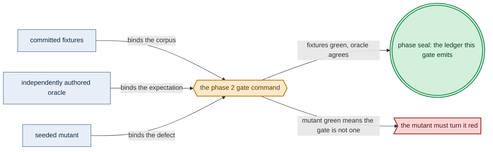

# Phase 2: Formal-model EDSL (`Model`/`interpret`/`emitTLA`)

> **Purpose**: Build the reusable formal-model kernel — the reifiable Haskell `Model` fragment and its two total renderings, the in-process `interpret` explorer and the `emitTLA` TLA+ emitter — and prove them on one small model whose generated `.tla` is TLC-checkable and never committed.
> **Read this if**: phase 2 is next in the queue, or a later phase depends on what its gate establishes.

Phase 2 delivers the formal-model EDSL (`Model`/`interpret`/`emitTLA`); its design is owned by [formal_model_doctrine.md](../documents/engineering/formal_model_doctrine.md), [generated_artifacts_doctrine.md](../documents/engineering/generated_artifacts_doctrine.md), [conformance_harness_doctrine.md](../documents/engineering/conformance_harness_doctrine.md), and the plan for reaching it is owned here.
Register 1: an in-process battery, no cluster.
No gate has run.

Link-graph metadata

**Status**: Authoritative source
**Supersedes**: N/A
**Referenced by**: DEVELOPMENT_PLAN/README.md, DEVELOPMENT_PLAN/overview.md, DEVELOPMENT_PLAN/phase_00_documentation_suite.md, DEVELOPMENT_PLAN/phase_03_gateway_migration_model.md, DEVELOPMENT_PLAN/system_components.md, documents/engineering/formal_model_doctrine.md, documents/engineering/testing_doctrine.md
**Generated sections**: none

## Contents
- [Phase Status](#phase-status)
- [Phase Summary](#phase-summary)
- [Doctrine adopted](#doctrine-adopted)
- [Sprints](#sprints)
- [Sprint 2.1: The `Model` fragment EDSL (the reifiable value) 📋](#sprint-21-the-model-fragment-edsl-the-reifiable-value-)
- [Sprint 2.2: `interpret` + the in-process reachability explorer 📋](#sprint-22-interpret--the-in-process-reachability-explorer-)
- [Sprint 2.3: `emitTLA` renderer + never-committed emission 📋](#sprint-23-emittla-renderer--never-committed-emission-)
- [Sprint 2.4: Round-trip + single-source correspondence on `ToyModel` 📋](#sprint-24-round-trip--single-source-correspondence-on-toymodel-)
- [Documentation Requirements](#documentation-requirements)
- [Related Documents](#related-documents)

---

## Phase Status

📋 Planned. Specified before implementation; every sprint below is 📋 Planned and every prescriptive
statement here is design intent, never a tested amoebius result. This phase opens after the Phase 1
toolchain spike records a green (or remediated) build of the pinned Haskell surface, and runs on **no substrate** (`none`) — it stands up no host and no cluster and touches no live infrastructure. The
round-trip mechanism it builds was demonstrated once in a throwaway spike over a small transition system
([`formal_model_doctrine.md §7`](../documents/engineering/formal_model_doctrine.md#7-prototype-validation) — the prototype-validation note); that is **spike evidence that the mechanism works, not a built amoebius result**, and the implementation is what this phase delivers.

## Phase Summary

This phase delivers the **formal-model kernel** amoebius's one proof obligation will later be expressed in:
a single reifiable Haskell `Model` value from which both the runtime decision core and the TLA+ specification
are total functions, so the model↔code correspondence is differentially checked. It stands up three things and
nothing more. First, the `Model` fragment itself — a deliberately small, first-order, side-effect-free
transition-system EDSL (named state variables, an initial assignment, guarded parameterized actions, named
boolean *safety* invariants, per-action *fairness* annotations, named *liveness* (temporal) properties, and
an optional bounding constraint). Second, the two total renderings of that value:
`interpret :: Model -> Event -> State -> Maybe State`, the pure decision core, paired with an in-process
bounded-reachability explorer that walks reachable states the same way TLC does; and
`emitTLA :: Model -> (Tla, Cfg)`, a structural walk of the fragment that emits a TLA+ module and its `.cfg`.
Third, the never-committed discipline: the `.tla`/`.cfg` are build artifacts emitted fresh by an `amoebius`
subcommand, stamped generated, and produced only at check time.

The one concrete protocol amoebius proves itself — the cross-cluster gateway migration, both branches — is
**not** authored here; that is [Phase 3](phase_03_gateway_migration_model.md). This phase proves the *kernel*
on the **reference model** — a small, throwaway bounded two-process mutual-exclusion model, `ToyModel` — so the
machinery is trustworthy before a load-bearing model rides on it. The obligation a reference model discharges,
and why its rendering is byte-locked, are doctrine
([`formal_model_doctrine.md §4.1`](../documents/engineering/formal_model_doctrine.md#41-the-reference-model-and-why-its-rendering-is-byte-locked));
this phase names the concrete model, its fixtures, and its mutants. Validation is entirely in-process
([`conformance_harness_doctrine.md`](../documents/engineering/conformance_harness_doctrine.md#2-the-registers-as-amoebius-uses-them-for-pre-cluster-validation) [§2](../documents/engineering/conformance_harness_doctrine.md#2-the-registers-as-amoebius-uses-them-for-pre-cluster-validation) — the registers, and [§3](../documents/engineering/conformance_harness_doctrine.md#3-the-load-bearing-invariant-rendering-never-touches-live-infrastructure) — rendering never touches live infrastructure): the explorer is a `cabal test`, and TLC
runs on the emitted spec through the version-stable JVM `tla2tools` toolchain. This is a **Register 1**
(pure/golden, in-process, no cluster) design-proof phase.

**Substrate:** none
**Register:** 1 — pure/golden, in-process, no cluster ([§K](development_plan_standards.md#k-honesty-proven--tested--assumed)).

**Gate:** The reifiable `Model` explorer (`interpret` plus the in-process bounded-reachability checker) and
the `emitTLA` renderer round-trip a single small transition-system model — the in-process explorer and TLC
(run through the standard `tla2tools` toolchain over the freshly emitted `.tla`/`.cfg`) reach the *identical*
safety verdict on the correct model. The **normative safety-equality convention** is fixed and shared by both
sides: equality is over the set of **canonical fingerprints of *distinct reachable* states** (TLC's *distinct
states*, not its *states generated* counter), with `CHECK_DEADLOCK` set explicitly on both sides and with a
state satisfying the model's `CONSTRAINT` boundary **checked-but-not-expanded** on both sides (a boundary state
is counted and invariant-checked, its successors are not enumerated) — so the two implementations cannot count
under incompatible conventions. Every mutant of a mechanical mutation-operator set over the *model* fragment
(guard negation/weakening, effect swap, dropped effect entry/`UNCHANGED`, quantifier flip, fairness drop,
invariant-clause delete) is caught rather than one hand-picked strawman, partitioned by detection mechanism:
the **safety mutants** (guard negation/weakening, effect swap, dropped effect entry/`UNCHANGED`, quantifier
flip) redden **both readings** — the in-process explorer and TLC reach the same safety counterexample; the
**fairness-drop/liveness mutant** reddens TLC's liveness `PROPERTY` only (the safety-only in-process explorer
cannot see it); and the **spec-weakening mutants** that drop an obligation rather than introduce a reachable
violation (invariant-clause delete, and the fairness annotation the fairness-drop removes) are caught by the
emitted `INVARIANT`/`PROPERTY` set diverging from the Phase-0-pinned expected invariant/property set and byte
golden, not by a red reachability verdict. TLC proves the model's liveness `PROPERTY` under weak fairness and
reports it red with fairness removed. The gate's **representative set** is named explicitly: the single committed
`ToyModel` (the bounded two-process mutual-exclusion model of Sprint 2.1) plus the QuickCheck fragment
generator described below; no other model is in scope for Phase 2. A QuickCheck generator over the fragment
finds no explorer/TLC disagreement (identical verdict and identical canonical distinct-state fingerprint sets,
safety-scoped) across **at least 200 non-degenerate generated models** — each carrying >=1 enabled action and
>=2 reachable states, with `maxDiscardRatio` bounded (<=10) so precondition discards cannot silently gut the
effective sample and with a floor on `maxSuccess` (>=200 passing cases, not the QuickCheck default of 100) — and
QuickCheck `checkCoverage` **asserts every fragment constructor fires**: each of `Expr`'s booleans, arithmetic
comparison, finite-set membership, finite quantifier, and function literal/update/application, and each of
`WeakFair`/`StrongFair` and `Always`/`Eventually`/`LeadsTo`, appears in at least 20% of generated models — so a
generator restricted to the easy boolean two-variable subset fails the coverage obligation instead of passing
vacuously. A `cover`/`classify` floor additionally requires a minimum fraction of the generated models to be
**safety-violating** (a reachable counterexample exists) and to reach a `CONSTRAINT` boundary state, so
explorer↔TLC agreement on the red/boundary branch — not only the both-green branch — is exercised by the
generated distribution itself, not solely by the `ToyModel` mutation set. The differential suite is itself
proven to have teeth by **two committed seeded renderer mutants**
in `emitTLA` — `emitTLA-mut-01` (a dropped `UNCHANGED` conjunct on an action's non-effected variables) and
`emitTLA-mut-02` (a finite quantifier mistranslated `\A`↔`\E`) — each of which the differential generator
**must expose** as an explorer/TLC divergence, symmetric to the model-mutation check, so a renderer that is
correct only on the constructors `ToyModel` happens to exercise cannot pass. Because that differential check is
legitimately **safety-scoped**, the three liveness/fairness constructors it cannot see — `StrongFair`
(`SF_vars`), `Always` (`[]`), and `Eventually` (`<>`) — are pinned instead by the byte-for-byte `emitTLA`
golden itself, **not** by any in-process liveness checker: the Sprint 2.1 structural assertion forces
`ToyModel` to carry all five liveness/fairness constructors, so the Phase-0-committed golden fixes the rendered
bytes of every one (`WF_vars`/`SF_vars` conjuncts, `[]`/`<>`/`~>` operators), and **two further committed liveness-path renderer mutants** — `emitTLA-mut-03` (`StrongFair` rendered as `WF_vars`) and `emitTLA-mut-04`
(`Always` rendered as `<>`), committed under `test/formal/mutants/` — which the golden **must turn red**, close
the gap that a renderer swapping `StrongFair`→`WeakFair` or `[]`↔`<>` would otherwise slip through. The oracles this gate checks against — the hand-derived `ToyModel` reachable-distinct-state count and safety verdict, the `emitTLA ToyModel` byte-for-byte golden **under the canonical TLA+ rendering convention fixed in Sprint 2.3**, the **expected `INVARIANT`/`PROPERTY` name set** the emitted `.cfg` must equal exactly (the oracle the spec-weakening mutants above are caught by), and the mutation-operator/renderer-mutant catalog with their
expected red outcomes — are
**authored and committed before `interpret`/`emitTLA` exist** (§M.1) — the convention-independent oracles in
Phase 0, and the byte-for-byte golden in Sprint 2.3 itself, authored from the canonical rendering convention
that sprint fixes as its first deliverable and before its renderer is written; a golden regenerated from the
renderer's own output does not satisfy the gate. The emitted `.tla`/`.cfg` are rendered fresh from the
committed `Model` source and are **never committed** to the repository. The run emits a **committed, schema-checked Register-1 ledger** ([§K](development_plan_standards.md#k-honesty-proven--tested--assumed)): its rows — safety proven-for-the-model at the declared bound *with the recorded
distinct-state count*; liveness proven under the named fairness *with the recorded fairness-sensitivity
outcome*; the differential-test case count and per-constructor coverage percentages; and model-correspondence-to-
Phase-3-code and runtime fidelity marked **UNVERIFIED** — are each **machine-derived from the corresponding recorded test outcome**, and a harness assertion fails the gate if the emitted ledger does not equal the
suite's recorded results (a hardcoded or print-statement ledger cannot pass). It establishes that the two
renderings agree, not that any cluster enforces anything.

*Design intent. Phase 2's gate apparatus; [§M](development_plan_standards.md#m-gate-integrity-a-gate-cannot-be-passed-by-a-stub) owns its clauses.*

## Doctrine adopted

- [`formal_model_doctrine.md §2`](../documents/engineering/formal_model_doctrine.md#2-the-model-is-data) — the
  **`Model` is data**: a bounded transition system in a closed first-order fragment (booleans, arithmetic
  comparison, finite sets, finite quantifiers, function literals/update/application) whose transition relation
  is *reified* so it can be walked structurally rather than run as an opaque Haskell function.
- [`formal_model_doctrine.md §3`](../documents/engineering/formal_model_doctrine.md#3-two-total-renderings) —
  **two total renderings**: `interpret` as the runtime decision core and `emitTLA` as the structural emitter,
  the only two consumers of the fragment, each intended to denote every constructor identically and checked by
  the differential suite.
- [`formal_model_doctrine.md §4`](../documents/engineering/formal_model_doctrine.md#4-single-source-correspondence)
  — **single-source correspondence**: a validated model is one where the in-process explorer and TLC agree
  on the correct model *and* both go red under the same seeded mutation — agreement plus shared fault
  sensitivity, in place of a hand-maintained variable→code correspondence table.
- [`formal_model_doctrine.md §5`](../documents/engineering/formal_model_doctrine.md#5-the-tlacfg-are-generated-never-committed)
  — the **`.tla`/`.cfg` are generated, never committed**: emitted by an `amoebius` subcommand, stamped
  generated, regenerated from the current `Model` at every check.
- [`formal_model_doctrine.md §6`](../documents/engineering/formal_model_doctrine.md#6-what-a-green-model-check-proves-and-what-it-does-not)
  — **what a green model-check proves, and what it does not**: proven-for-the-model at the declared bound, not
  a general-scope proof and not a proof the model is the right one; the honest ledger token this phase emits.
- [`generated_artifacts_doctrine.md §2`](../documents/engineering/generated_artifacts_doctrine.md#2-what-is-generated-and-from-what)
  and [`§3`](../documents/engineering/generated_artifacts_doctrine.md#3-the-rule) — **what is generated and the rule**: the `emitTLA` row of the generated-artifacts table, stamped generated and emitted by a subcommand,
  with a golden test pinning the *renderer's* behaviour rather than committing the artifact.
- [`conformance_harness_doctrine.md §2`](../documents/engineering/conformance_harness_doctrine.md#2-the-registers-as-amoebius-uses-them-for-pre-cluster-validation)
  and [`§3`](../documents/engineering/conformance_harness_doctrine.md#3-the-load-bearing-invariant-rendering-never-touches-live-infrastructure)
  — the **registers and the no-live-infrastructure invariant**: this phase's Register-1 in-process explorer +
  TLC pairing is an instance of "rendering never touches live infrastructure" — validation runs entirely
  in-process over golden/emitted artifacts and stands up no host and no cluster.

## Sprints

## Sprint 2.1: The `Model` fragment EDSL (the reifiable value) 📋

**Status**: Planned
**Implementation**: `src/Amoebius/Formal/Model.hs` (the `Model`/`Action`/`Expr` fragment
types), a `formal-model` cabal library + `formal-spec` test-suite stanza — target paths, not yet built.
**Blocked by**: Phase 1 gate (the toolchain spike records the pinned GHC/Cabal build).
**Independent Validation**: the fragment types compile under the pinned GHC 9.12.4 / Cabal 3.16.1.0; a hand-authored small
model (`ToyModel`) is expressible entirely inside the fragment with no opaque Haskell function in its
transition relation.
**Docs to update**: `documents/engineering/formal_model_doctrine.md` (Phase-2 status
backlink), `DEVELOPMENT_PLAN/system_components.md` (register `src/Amoebius/Formal/Model.hs`).

### Objective
Adopt [`formal_model_doctrine.md §2 — the Model is data`](../documents/engineering/formal_model_doctrine.md#2-the-model-is-data):
define the closed, first-order, side-effect-free EDSL — `Model` (name, constants, vars, init, actions,
invariants, optional constraint), `Action` (guarded, parameterized, primed-effect), and the `Expr` fragment —
so that a modelled protocol is a *value that can be walked structurally*, which is the precondition for
emitting faithful TLA+ rather than hand-writing it.

### Deliverables
- `data Model`, `data Action`, and the `Expr` fragment carrying only booleans, arithmetic comparison, finite
  sets, quantifiers over finite sets, and function literal/update/application — and no more; plus the closed
  liveness pieces `data Fairness = WeakFair | StrongFair` and `data Temporal = Always Expr | Eventually Expr |
  LeadsTo Expr Expr`, carried by the `modelFairness`/`modelProperties` fields
  ([`formal_model_doctrine.md §2`](../documents/engineering/formal_model_doctrine.md#2-the-model-is-data)).
- The reference model (`ToyModel` — the bounded two-process mutual exclusion named in the Gate) authored
  purely inside the
  fragment, carrying at least one named safety invariant, a bounding constraint, and — so the Phase-0 byte
  golden can pin the rendered bytes of **all five** liveness/fairness constructors — both a `WeakFair` and a
  `StrongFair` action annotation and at least one each of an `Always`, an `Eventually`, and a `LeadsTo`
  temporal property (e.g. *each process eventually enters its critical section* as the `LeadsTo`/`Eventually`
  witnesses, with the `StrongFair` annotation on an action a fair scheduler must not starve).

### Validation
1. The fragment types and `ToyModel` compile on the pinned toolchain; `ToyModel`'s transition relation is
   fully reified (a value in the fragment, not an opaque function) — checked by construction.
2. `ToyModel` is not a boolean-only strawman: it **exercises the harder fragment constructors** the round-trip
   must render faithfully — at least one finite quantifier over a finite set and at least one function
   literal/update/application in a guard or effect, **both** a `WeakFair` and a `StrongFair` action annotation,
   and at least one each of an `Always`, an `Eventually`, and a `LeadsTo` temporal property — so the Sprint 2.4
   round-trip and mutation checks cannot pass while quantifier/function/fairness translation stays stubbed, and
   so the Sprint 2.3 byte golden pins the rendered bytes of **all five** liveness/fairness constructors
   (`WF_vars`/`SF_vars` conjuncts, `[]`/`<>`/`~>` operators), not just the `WeakFair`+`LeadsTo` pair. This
   closes a faithfulness gap the **safety-scoped** differential test ([§M](development_plan_standards.md#m-gate-integrity-a-gate-cannot-be-passed-by-a-stub)) cannot: because that round-trip
   oracle is safety-only, a renderer that emits `StrongFair` as `WF_vars` or swaps `[]`↔`<>` is invisible to it and is caught **only** by the byte golden over a `ToyModel` that actually carries those constructors. This is a committed structural assertion over the `ToyModel` value (a test that walks its `Expr`/`Action`/`Temporal` nodes and fails if any of these constructor classes — including `StrongFair`, `Always`, and `Eventually` — is absent), pinned in Phase 0.

### Remaining Work
The whole sprint (📋 Planned).

## Sprint 2.2: `interpret` + the in-process reachability explorer 📋

**Status**: Planned
**Implementation**: `src/Amoebius/Formal/Interpret.hs` (`interpret`),
`src/Amoebius/Formal/Explore.hs` (the bounded breadth-first reachability checker),
`test/formal/ExploreSpec.hs` — target paths, not yet built.
**Blocked by**: Sprint 2.1.
**Independent Validation**: `interpret` computes the next state for a hand-checked (event, state) pair; the explorer
visits exactly the reachable-state set of `ToyModel` under its constraint and reports every invariant on
every reachable state — a `cabal test`, no cluster. The `(event, state) → state` transition table and the
`ToyModel` reachable-**distinct**-state count and safety verdict this sprint checks against are a
**committed Phase-0 hand table authored before `Interpret.hs`/`Explore.hs` exist** (§M.1, §M.3) — carrying a
note recording that its provenance is hand-derivation from the model definition, **not** transcription from
the explorer's own first output; the harness reads the reference side from this committed table, never from
the code under test. TLC's independent re-derivation of the same count in Sprint 2.4 corroborates but does
not replace this Phase-0 pin (so this sprint's reference is not self-referential).
**Docs to update**:
`documents/engineering/formal_model_doctrine.md` (§3/§4 backlink), `DEVELOPMENT_PLAN/system_components.md`.

### Objective
Adopt [`formal_model_doctrine.md §3 — two total renderings`](../documents/engineering/formal_model_doctrine.md#3-two-total-renderings):
build `interpret :: Model -> Event -> State -> Maybe State`, the pure runtime decision core, and the in-process
bounded-reachability explorer that mirrors TLC — breadth-first over reachable states, pruned by the model's
constraint, checking every invariant on every reachable state.

### Deliverables
- `interpret`, a total function from a `Model` to an `Event -> State -> State` step, unit-tested against
  hand-computed transitions.
- A bounded reachability explorer that returns the reachable-state count and the first invariant violation (if
  any), matching in shape the whole-state-space search TLC applies to the emitted spec.

### Validation
1. `interpret` reproduces the transitions of the committed Phase-0 hand table; the explorer's reachable-
   **distinct**-state count (under the normative CONSTRAINT/`CHECK_DEADLOCK` convention fixed in the Gate) and
   green/red verdict on `ToyModel` equal the **Phase-0-committed hand-derived expectation** (not a value
   transcribed from the explorer's first run) — **proven for the model** at the declared bound.

### Remaining Work
The whole sprint (📋 Planned).

## Sprint 2.3: `emitTLA` renderer + never-committed emission 📋

**Status**: Planned
**Implementation**: `src/Amoebius/Formal/EmitTLA.hs` (`emitTLA`),
`src/Amoebius/Cli/Formal.hs` (the `amoebius dev model emit`/`check` subcommand),
`test/formal/EmitGoldenSpec.hs`, and the two committed liveness-path renderer mutants
`emitTLA-mut-03`/`emitTLA-mut-04` under `test/formal/mutants/`; emitted output lands in the git-ignored
`gen/tla/` tree — target paths, not yet built.
**Blocked by**: Sprint 2.1.
**Independent Validation**:
`emitTLA ToyModel` renders a `.tla` + `.cfg`; the renderer is byte-for-byte golden-locked against a
**Phase-0-committed golden authored before `EmitTLA.hs` exists** (§M.1 — a golden regenerated from the
renderer's own output is not a test), under the **canonical TLA+ rendering convention** fixed below —
without which a byte-exact golden cannot be hand-authored at all; the emitted artifact carries a `--
GENERATED … do not edit by hand` stamp and is written only to an ignored build path. The never-committed
scan and the golden-fixture layout follow the normative conventions owned by
[`generated_artifacts_doctrine.md §3`](../documents/engineering/generated_artifacts_doctrine.md#3-the-rule)
(one emitted path, one `.golden` suffix, one scan), instantiated here: the committed golden fixtures live at
`test/formal/golden/ToyModel.tla.golden` and `test/formal/golden/ToyModel.cfg.golden` — *"independent
expected-output fixtures are authored test inputs, not captured generated artifacts"* — while the emitted
artifacts land under `gen/tla/` and the scan (`git ls-files -- 'gen/*' '*.tla' '*.cfg'`) returns empty. A
`.golden`-suffixed fixture matches neither pattern by construction; an actual emitted
`ToyModel.tla`/`ToyModel.cfg` under version control fails it.
**Docs to update**:
`documents/engineering/formal_model_doctrine.md` (§5 backlink),
`documents/engineering/generated_artifacts_doctrine.md` (the `emitTLA` row → built by Phase 2),
`DEVELOPMENT_PLAN/system_components.md`.

### Objective
Adopt [`formal_model_doctrine.md §3`](../documents/engineering/formal_model_doctrine.md#3-two-total-renderings)
and [`§5 — generated, never committed`](../documents/engineering/formal_model_doctrine.md#5-the-tlacfg-are-generated-never-committed),
with [`generated_artifacts_doctrine.md §3 — the rule`](../documents/engineering/generated_artifacts_doctrine.md#3-the-rule):
build `emitTLA :: Model -> (Tla, Cfg)` as a structural walk of the fragment — state variables become
`VARIABLES`, the initial assignment becomes `Init`, each action an operator, their disjunction `Next`,
invariants named operators listed as `INVARIANT`s in the `.cfg`, the constraint a `CONSTRAINT`, each
`modelFairness` entry a `WF_vars`/`SF_vars` conjunct on the temporal `Spec`, and each `modelProperties` entry a
named temporal operator listed as a `PROPERTY` — emitted by an `amoebius` subcommand, stamped generated, and
never committed.

### Deliverables
- **The canonical TLA+ rendering convention**, pinned in Phase 0 before the golden is authored — the analogue
  of the canonical Aeson encoding [`phase_13`](phase_13_render_manifest_goldens.md) pins for `renderAll`, and
  the precondition that makes "drifts by a single byte" unambiguous. It fixes: the module header and
  `EXTENDS` line; declaration order (`CONSTANTS`, `VARIABLES`, `vars` tuple, `Init`, one operator per action in
  `modelActions` order, `Next`, invariant operators in `modelInvariants` order, `Spec`, property operators in
  `modelProperties` order); two-space continuation indent with each conjunct/disjunct on its own line under a
  leading `/\`/`\/`; one space either side of every binary operator; **fully parenthesized** nested
  expressions, so no precedence rule is load-bearing on the reader or the renderer; ASCII operator spellings
  (`\A`, `\E`, `[]`, `<>`, `~>`, `\in`, `#`); LF endings and exactly one trailing LF; and a `.cfg` whose
  `CONSTANT`/`INVARIANT`/`PROPERTY`/`CONSTRAINT`/`CHECK_DEADLOCK` stanzas appear in that fixed order.
  The generated-by stamp is **content-stable**: a fixed string naming the tool and the source `Model`, with
  **no timestamp, host, path, user, or version field** — a stamp that varied per run would make the byte
  golden unauthorable and self-defeating
  ([`generated_artifacts_doctrine.md §3`](../documents/engineering/generated_artifacts_doctrine.md#3-the-rule)).
- **The Phase-0-committed expected `INVARIANT`/`PROPERTY` name set** for `ToyModel`, which the emitted `.cfg`
  must equal exactly (set equality, not containment). This is the oracle that catches the spec-weakening
  mutants named in the Gate — an invariant-clause delete or a dropped fairness annotation removes an
  *obligation* rather than introducing a reachable violation, so no red reachability verdict would fire.
- `emitTLA`, a total renderer, with the structural mapping above — safety (`INVARIANT`), the fairness-annotated
  `Spec`, and liveness (`PROPERTY`).
- An `amoebius dev model` subcommand that emits the `.tla`/`.cfg` fresh into an ignored build directory with a
  generated-by header; no `.tla`/`.cfg` is added to version control.
- A Register-1 golden test pinning the *renderer's* byte-for-byte output against the Phase-0-committed
  `test/formal/golden/ToyModel.{tla,cfg}.golden` fixtures (authored before `EmitTLA.hs`) — the golden is a
  fixture of the renderer, not a committed spec, and is not regenerated from the renderer's own output.
- Because the Sprint 2.1 structural assertion forces `ToyModel` to carry **all five** liveness/fairness
  constructors, this same byte golden is the **only** oracle that pins liveness/fairness *rendering*
  faithfulness (the Sprint 2.4 differential test is legitimately safety-scoped and cannot see a
  `SF_vars`→`WF_vars` or `[]`↔`<>` swap): it fixes the `WF_vars`/`SF_vars` conjuncts and the `[]`/`<>`/`~>` operators byte-for-byte. **Two committed liveness-path renderer mutants** prove that oracle has teeth — `emitTLA-mut-03` (`StrongFair` rendered as `WF_vars`, breaking the golden's `SF_vars` conjunct) and
  `emitTLA-mut-04` (`Always` rendered as `<>`, breaking the golden's `[]` operator), committed under
  `test/formal/mutants/`, each paired with the positive it breaks (§M.2 — the correct golden byte is the
  positive, the mutant that flips it the negative) and each of which the byte golden **must turn red**; a
  surviving liveness-path renderer mutant fails the gate.

### Validation
1. `emitTLA ToyModel` is byte-for-byte golden-locked against the Phase-0-committed
   `test/formal/golden/ToyModel.{tla,cfg}.golden` fixtures; the emitted files appear only under the ignored
   build path and carry the generated stamp; the `git ls-files -- 'gen/*' '*.tla' '*.cfg'` scan returns empty (the
   `.golden`-suffixed fixtures do not match it).
2. The byte golden pins the rendered bytes of **all five** liveness/fairness constructors carried by `ToyModel`
   (`WF_vars`/`SF_vars` conjuncts, `[]`/`<>`/`~>` operators), and the two committed liveness-path renderer
   mutants `emitTLA-mut-03` (`StrongFair`→`WF_vars`) and `emitTLA-mut-04` (`Always`→`<>`) each turn the golden
   **red** — so a renderer that mistranslates a fairness or temporal constructor cannot pass, even though the
   Sprint 2.4 differential oracle stays legitimately safety-scoped.

### Remaining Work
The whole sprint (📋 Planned).

## Sprint 2.4: Round-trip + single-source correspondence on `ToyModel` 📋

**Status**: Planned
**Implementation**: `test/formal/RoundTripSpec.hs` (drives the explorer and TLC over the
same `Model`), a `tla2tools` invocation wrapper, the committed mechanical model-mutation catalog, and the
two committed seeded renderer mutants `emitTLA-mut-01`/`emitTLA-mut-02` under `test/formal/mutants/` —
target paths, not yet built.
**Blocked by**: Sprint 2.2, Sprint 2.3.
**Independent Validation**: on the
correct `ToyModel` the in-process explorer and TLC (over the freshly emitted spec, via the version-stable
JVM `tla2tools` toolchain) reach the identical **safety** verdict (same canonical state-fingerprint sets, no
counterexample); **every** mutant of a mechanical mutation-operator set over the fragment (guard
negation/weakening, effect swap, dropped effect entry/`UNCHANGED`, quantifier flip, fairness drop,
invariant-clause delete) is caught — each safety mutant red in both the explorer and TLC, each
fairness-drop/liveness mutant red in TLC's `PROPERTY`; TLC proves the `ToyModel` liveness `PROPERTY` under
weak fairness and that same property goes **red** with the fairness annotation removed (the
fairness-sensitivity check). The differential suite proves its own teeth: the **two committed seeded renderer mutants** in `emitTLA` — `emitTLA-mut-01` (dropped `UNCHANGED` conjunct) and `emitTLA-mut-02`
(finite quantifier `\A`↔`\E` mistranslation) — must each be exposed by the generator as an explorer/TLC
divergence (a surviving renderer mutant fails the gate). The QuickCheck generator over the `Model` fragment
finds no generated model on which the explorer and TLC disagree — identical verdict and identical
**canonical distinct-state fingerprint sets** (the explorer mirroring TLC's `CONSTRAINT` boundary semantics
— boundary states checked-but-not-expanded — with `CHECK_DEADLOCK` set explicitly on both) — run over
**>=200 non-degenerate models** (>=1 enabled action, >=2 reachable states; `maxSuccess>=200`,
`maxDiscardRatio<=10`) with `checkCoverage` asserting each `Expr`/`Temporal`/`Fairness` constructor listed
in the Gate appears in >=20% of generated models; this is the **safety-scoped** differential faithfulness
test (liveness/fairness rendering is not covered by it).
**Docs to update**:
`documents/engineering/formal_model_doctrine.md` (§4/§6 — the correspondence + honesty ledger this gate
emits), `documents/engineering/conformance_harness_doctrine.md` (§2/§3 — the Register-1 in-process explorer
+ TLC pairing as a no-live-infrastructure instance). The Phase-2 status flip in `DEVELOPMENT_PLAN/README.md`
and the `none` gate row in `DEVELOPMENT_PLAN/substrates.md` are carried in this phase's Documentation
Requirements (Cross-references to add), not here.

### Objective
Adopt [`formal_model_doctrine.md §4 — single-source correspondence`](../documents/engineering/formal_model_doctrine.md#4-single-source-correspondence)
and [`§6 — what a green model-check proves`](../documents/engineering/formal_model_doctrine.md#6-what-a-green-model-check-proves-and-what-it-does-not):
validate the kernel by running *both* readings of the same `Model` — the in-process explorer and TLC on the
emitted spec — and require agreement on the correct model plus shared sensitivity to one seeded fault, the
operational form of "the two renderings mean the same thing."

### Deliverables
- **The `tla2tools` pin.** [`README.md`](README.md) and [`phase_01`](phase_01_toolchain_spike.md) both delegate
  this acquisition path to Phase 2, so this sprint records the **exact `tla2tools.jar` release** the harness
  resolves and the **JRE floor** (≥ 17, a floor rather than a pin) it runs under, together with the checksum
  the wrapper verifies before invoking it. The recorded values are then carried into
  [`README.md`](README.md)'s Toolchain section, which remains their status home. A TLC verdict produced by an
  unrecorded toolchain is not a pinned independent oracle — the harness refuses to run.
- A round-trip harness that: emits `ToyModel` to `.tla`/`.cfg`, runs TLC through the pinned `tla2tools`, runs
  the in-process explorer, and asserts identical safety verdicts; and drives TLC on the liveness `PROPERTY`
  under fairness (green) and with fairness removed (red).
- A **mechanical mutation set** over the fragment, not one hand-picked strawman: a mutation-operator family
  (guard negation/weakening, effect swap, dropped effect entry/`UNCHANGED`, quantifier flip, fairness drop,
  invariant-clause delete) applied exhaustively to `ToyModel`, with **every** generated mutant required to be
  caught — each safety mutant red in both the explorer and TLC, each fairness-drop/liveness mutant (a
  stall/livelock safety misses) red in TLC's `PROPERTY` — so a single surviving mutant fails the gate, showing
  liveness adds fault-detection safety alone lacks.
- A **differential faithfulness** property test with a non-vacuous generator: a QuickCheck generator over the
  `Model` fragment runs the explorer and TLC on **>=200 non-degenerate generated models** (each >=1 enabled
  action and >=2 reachable states; `maxSuccess>=200`, `maxDiscardRatio<=10` so discards cannot gut the sample)
  under a pinned convention — the explorer mirroring TLC's `CONSTRAINT` semantics (boundary states
  counted/checked but not expanded), `CHECK_DEADLOCK` set explicitly on both sides — and asserts identical
  verdicts and identical **canonical distinct-state fingerprint sets** (not just equal cardinality), shrinking
  any divergence to a minimal offending model. It carries `checkCoverage` obligations that **fail the test unless every fragment constructor fires**: each `Expr` constructor (booleans, arithmetic comparison,
  finite-set membership, finite quantifier, function literal/update/application), each `Fairness`
  (`WeakFair`/`StrongFair`), and each `Temporal` (`Always`/`Eventually`/`LeadsTo`) appears in >=20% of
  generated models — so a generator drawing only the easy boolean subset fails rather than passing vacuously.
  The obligations also include a `cover`/`classify` floor on the **safety-violating** branch (a minimum
  fraction of generated models carry a reachable counterexample) and on `CONSTRAINT`-boundary states, so the
  red/boundary path of the explorer↔TLC differential is exercised by the generated distribution, not only by
  the `ToyModel` mutation set. The claim is **scoped to the safety sub-fragment** (the liveness/fairness
  rendering is not covered by it — the `Fairness`/`Temporal` coverage floor exists only to keep the *safety*
  differential robust when liveness annotations are present; liveness rendering faithfulness is validated on
  `ToyModel` alone — round-trip, fairness-sensitivity, and the fairness-drop mutants — not across the generated
  distribution)
  ([`formal_model_doctrine.md §4`](../documents/engineering/formal_model_doctrine.md#4-single-source-correspondence)).
- **Two committed seeded renderer mutants** proving the differential suite has teeth against `emitTLA` bugs (not
  only model bugs): `emitTLA-mut-01` (a deliberately dropped `UNCHANGED` conjunct) and `emitTLA-mut-02` (a
  finite quantifier `\A`↔`\E` mistranslation), committed under `test/formal/mutants/`, each of which the
  differential generator must expose as an explorer/TLC divergence — a surviving renderer mutant fails the gate.
- The **committed, schema-checked Register-1 ledger** ([§K](development_plan_standards.md#k-honesty-proven--tested--assumed); its schema, linter, and commit status owned by `testing_doctrine.md` and Phase 0), whose Phase-2 rows are:
  (a) safety proven-for-the-model at the declared bound with the recorded reachable-distinct-state count; (b)
  liveness proven under the named fairness with the recorded fairness-sensitivity outcome; (c) the
  differential-test case count and per-constructor coverage percentages; (d) model-correspondence-to-Phase-3-code
  and runtime fidelity marked **UNVERIFIED**. Each row is **machine-derived from the corresponding recorded test outcome** (not a print statement), and a harness assertion fails the gate if the emitted ledger does not equal
  the suite's recorded results — carrying the honest caveats of [§6](../documents/engineering/formal_model_doctrine.md#6-what-a-green-model-check-proves-and-what-it-does-not) (bounded scope; not a general-scope proof; not a proof the model is the right model; liveness proven only under the assumed fairness).

### Validation
1. Explorer and TLC agree (same verdict and identical canonical distinct-state fingerprint sets under the
   normative CONSTRAINT/`CHECK_DEADLOCK` convention, no counterexample) on the correct `ToyModel`; **every**
   mutant of the mechanical model-mutation set is caught (safety mutants red in both, fairness-drop/liveness
   mutants red in TLC's `PROPERTY`); **both committed renderer mutants** `emitTLA-mut-01`/`emitTLA-mut-02` are
   exposed by the differential generator as explorer/TLC divergences; TLC proves the liveness `PROPERTY` under
   fairness and reports it red with fairness removed; the safety-scoped differential generator finds no
   explorer/TLC disagreement over **>=200 non-degenerate models** with `checkCoverage` satisfied (each fragment
   constructor >=20%); and the emitted committed Register-1 ledger equals the suite's recorded results (harness
   assertion) — the round-trip closes and the kernel is validated for the model at scope.

### Remaining Work
The whole sprint (📋 Planned). This sprint carries the phase gate.

## Documentation Requirements

**Engineering docs to update (when the gate runs, flip the honest layer, never before):**
- `documents/engineering/formal_model_doctrine.md` — backlink §2/§3/§4/§5/§6 to the Phase-2 kernel that
  realizes them; the round-trip claim moves from spike evidence (§7) to a built, Register-1-validated
  amoebius result on `ToyModel` when the gate runs.
- `documents/engineering/generated_artifacts_doctrine.md` — mark the `emitTLA` row's renderer as built by
  Phase 2 and note the golden-locked, never-committed emission.
- `documents/engineering/conformance_harness_doctrine.md` — record the Register-1 in-process explorer + TLC
  pairing as an instance of the "rendering never touches live infrastructure" invariant.

**Cross-references to add:**
- `DEVELOPMENT_PLAN/README.md` — flip the Phase-2 status when the gate passes; link this document.
- `DEVELOPMENT_PLAN/substrates.md` — the Phase-2 `none` gate row.
- `DEVELOPMENT_PLAN/system_components.md` — register `src/Amoebius/Formal/{Model,Interpret,Explore,EmitTLA}.hs`
  and `src/Amoebius/Cli/Formal.hs` as Phase-2 design-first rows.
- `DEVELOPMENT_PLAN/phase_03_gateway_migration_model.md` — backlink: the gateway-migration `Model` is authored
  on this kernel; only the kernel and its `ToyModel` round-trip are proven here.

## Related Documents
- [README.md](README.md) — the live tracker and phase order this document serves
- [development_plan_standards.md](development_plan_standards.md) — the rulebook this document obeys (the design-proof acceptance token: *proven for the model*, never *runtime proven*)
- [overview.md](overview.md) — target architecture and the one-formal-obligation constraint
- [Formal Model Doctrine](../documents/engineering/formal_model_doctrine.md) — the one reifiable `Model` and
  its two total renderings (`interpret`, `emitTLA`); the doctrine this phase builds
- [Generated Artifacts Doctrine](../documents/engineering/generated_artifacts_doctrine.md) — why the emitted
  `.tla`/`.cfg` are rendered fresh and never committed
- [Gateway Migration Model Doctrine](../documents/engineering/gateway_migration_model_doctrine.md) — the one
  concrete `Model` that rides this kernel, authored in Phase 3
- [Conformance Harness Doctrine](../documents/engineering/conformance_harness_doctrine.md) — the Register-1
  in-process explorer that mirrors TLC, and the no-live-infrastructure invariant
- [phase_01](phase_01_toolchain_spike.md) — the toolchain spike this phase is blocked by
- [phase_03](phase_03_gateway_migration_model.md) — the gateway-migration model built on this kernel
