# Phase 2: Repository layout conformance and de-phased naming

> **Purpose**: Specify the target Haskell capability to enforce the repository layout and compiler-backed
> semantic source graph: behavioral source is `.hs` only outside `pb/**`, every declared and observed
> source/module/import/call/effect/consumer relation reconciles, and generated foreign products are absent
> from Git.
> **Read this if**: phase 2 is next in the queue, or a later phase depends on what its gate establishes.

This document specifies a target capability only. Any pre-reset implementation result, pass, seal, receipt,
command transcript, or evidence reference retained below is historical inventory only: it is permanently
non-operative, cannot satisfy any current contract, and cannot satisfy a gate through a status edit. Current
status is owned by [the tracker](README.md) and the Phase Status block below.

Link-graph metadata

**Status**: Authoritative source
**Supersedes**: N/A
**Referenced by**: DEVELOPMENT_PLAN/README.md, DEVELOPMENT_PLAN/overview.md, DEVELOPMENT_PLAN/phase_00_documentation_suite.md, DEVELOPMENT_PLAN/phase_03_artifact_calculus.md
**Generated sections**: none

## Contents

- [Phase Status](#phase-status)
- [Phase Summary](#phase-summary)
- [Gate integrity](#gate-integrity)
- [Doctrine adopted](#doctrine-adopted)
- [Sprints](#sprints)
- [Sprint 2.1: `test/`'s second level collapses to the seven role nouns](#sprint-21-tests-second-level-collapses-to-the-seven-role-nouns-)
- [Sprint 2.2: The package-only roots become cabal stanzas](#sprint-22-the-package-only-roots-become-cabal-stanzas-)
- [Sprint 2.3: Tracked UI roots enter typed deletion ownership](#sprint-23-tracked-ui-roots-enter-typed-deletion-ownership-)
- [Sprint 2.4: Every authored name loses its phase ordinal](#sprint-24-every-authored-name-loses-its-phase-ordinal-)
- [Sprint 2.5: One mutant record format, one registry](#sprint-25-one-mutant-record-format-one-registry-)
- [Sprint 2.6: Compiler-backed source graph and typed legacy reconciliation](#sprint-26-compiler-backed-source-graph-and-typed-legacy-reconciliation-)
- [Documentation Requirements](#documentation-requirements)
- [Related Documents](#related-documents)

## Phase Status

✅ Done.

The [2026-09-08 reset](README.md#reopened-numeric-sequence) withdraws prior certification. Existing
implementation is an Observed footprint / Known partial. Retained requirements remain obligations; only this
phase's complete qualified gate under the replacement acceptance baseline can authorize Done.

Gate execution remains blocked by the qualified Phase-1 predecessor and its compatible evidence chain.

## Phase Summary

This phase specifies a Haskell target capability; it does not report a current implementation or
result. It consumes the authenticated/reproducible Phase-1 toolchain and closes the compiler-backed semantic
source graph: Cabal declarations, source roots, modules, imports, parsing, renaming, typechecking, resolved calls
and control flow, potential effects, provenance, dynamic loading, behavior sinks, and consumers reconcile in
both directions. Behavioral source is `.hs` only outside `pb/**`, consumers resolve at canonical Haskell module
and package paths, and generated foreign products are absent from Git.

The production subject, behavioral controls, independent oracle, fixtures, and mutants must be authored as
`.hs`. Except for the `pb/**` bootstrap, no non-`.hs` behavioral source, fixture, oracle, or mutant may be
tracked. Any foreign representation, rendered specification, compiler transcript, suite manifest, generated
code, or other derived product must be created lazily beneath `.build/**` and remain run-scoped evidence only.
`pb` may only make the minimal platform distinction, establish the contained toolchain, build the source-bound binary, and exec that exact Haskell verdict binary with argv unchanged; that entry point and its independent
evidence contract remain UNRESOLVED and block validation.

This phase precedes Phase 49 and is confined to pure, build, compiler, or model-level Register-1
behavior only. It cannot use host, hardware, live-service, or cluster observations to make its claim pass.

**Phase scope:** Target capability only — enforce the repository layout and compiler-backed semantic source
graph: behavioral source is `.hs` only outside `pb/**`; every Cabal/source/module/import/call/effect/provenance/
sink/consumer relation resolves; and generated foreign products are absent from Git.
NOT VALIDATED.

**Substrate:** `none` — pre-Phase-49; no host, hardware, live service, or cluster observation.

**Lane:** `none`.

**Register:** 1 — Haskell-only pure/build/model target. NOT VALIDATED.

**Depends on:** [Phase 1](phase_01_toolchain_spike.md)
**Gate:** `pb validate phase 02`; see [Gate integrity](#gate-integrity).

## Gate integrity

**Contract check**: BOUND — the replacement certification generation, protected accepted baseline,
authenticated phase receipt, and current compatibility closure are Haskell-owned inputs. Execution evidence
remains phase-local and cannot be supplied by this prose.

| Key | Contract |
|---|---|
| `Claim` | Every tracked path is reconciled with the canonical repository layout; the authenticated compiler build, source closure, bounded `pb` grammar, and layout predicates all pass for the same source snapshot. Later-owned non-Haskell migrations remain exact typed debt through the Phase-49 zero-source barrier. |
| `Subject` | The package-hidden `Amoebius.Validation.RepositoryLayoutRun.Internal` acquired supervisor composes `RepositoryLayoutRun`, `SourceClosure`, `PbBootstrapGrammar`, and the compiler-built independent component. |
| `Command` | Future public spelling is `pb validate phase 02`; before `BOOTSTRAP_HANDOFF`, the exact absolute source-bound Haskell executable runs directly. Its Cabal child is absolute, offline, serial (`--jobs=1`), and bound to authenticated GHC and Cabal inputs. |
| `Oracle` | `test/validation-kernel/RepositoryLayoutRunOracle.hs` is separately authored and executes from the independently compiled `validation-compiler-source-graph-acquired-component`. |
| `Positive controls` | The clean repository snapshot, bounded canonical `pb` grammar, source-closure result, compiler build, and independently compiled oracle are all exact green controls. |
| `Paired negatives` | Minimally different stale-ignore and runtime-phase-ordinal subjects produce their exact single refusal codes; a validation phase label is the unaffected scope control. |
| `Mutants` | The qualification corpus applies the retired-ignore-root and runtime-ordinal changes to the production checker and requires their exact red outcomes while clean and validation-label controls stay green. |
| `Discovery` | The captured Git snapshot is reconciled by source closure, `pb` inventory grammar, layout discovery, Cabal component selection, and successful compiler construction in both the subject and independent component. |
| `Challenge` | The fixed changed-subject layout corpus executes after acquisition and must distinguish the two negative dimensions without rejecting the validation-label control. |
| `Observer` | The supervisor records absolute executable, exact argv, exit status, and transcript digest for archive extraction, compiler build, oracle discovery, and independent oracle execution. |
| `Authority/bypass` | Network, `pb`, hardware, live effects, PATH-selected compiler substitution, and compiler concurrency above one are forbidden. Compiler argv is checked for literal `--offline` and `--jobs=1`. |
| `Freshness` | Each candidate creates a fresh run/build root after its opening source capture; the dispatcher independently requires the closing source identity to match. |
| `Qualification` | The independently authored oracle and fixed clean/negative/control corpus must both pass from freshly compiled Haskell. |
| `Cleanroom` | Generated project, extracted tool, build output, and transcripts are contained beneath `.build/runs/phase-02/**`; no generated material becomes authored source. |
| `Legacy closure` | `LTD-SRC-000`, `LTD-SRC-008`, `LTD-META-001`, and `LTD-NAME-001` are zero only when compiler build, bounded `pb` grammar, layout predicates, and every non-circular gate prerequisite pass for the same source. |
| `Predecessor` | Authenticated `ImmediatePredecessorPass` for Phase 1 in the admitted certification generation, plus the accepted verifier's current compatibility decision under [§M.6](development_plan_gate_integrity.md#m6-candidate-evidence-and-gate-pass). Missing, forged, revoked, incompatible, or wrong-phase evidence refuses before any phase effect. Historical source identity remains recorded; reuse requires unchanged relevant dependency and acceptance closures. |
| `Residue` | Only explicitly typed later-owned source migrations and later hardware/live claims remain; no Phase-2 evidence row is residue. |
| `Pass criterion` | `qualified-gate-pass`: all eighteen rows must be execution-derived green in one candidate for one stable source, with exact predecessor receipt and empty mandatory residue. |

## Doctrine adopted

- [`jit_artifact_doctrine.md` §2 — The rule, and the closed exception list](../documents/engineering/jit_artifact_doctrine.md#2-the-rule-and-the-closed-exception-list) — every foreign or generated
  product must be derived lazily beneath `.build/**`, never tracked as authored behavioral source.
- [`repository_layout_doctrine.md` §2 — Complete repository structure](../documents/engineering/repository_layout_doctrine.md#2-complete-repository-structure):
  the target tree, its fixed second levels, and the seven singular `test/` role nouns.
- [`repository_layout_doctrine.md` §2.1 — When a unit warrants its own build package](../documents/engineering/repository_layout_doctrine.md#21-when-a-unit-warrants-its-own-build-package):
  the criterion a package-only root fails.
- [`repository_layout_doctrine.md` §2.2 — Present-day roots and their required destination](../documents/engineering/repository_layout_doctrine.md#22-present-day-roots-and-their-required-destination):
  the per-root destination the target Haskell conformance capability must enforce.
- [`generated_artifacts_doctrine.md` §3 — The rule](../documents/engineering/generated_artifacts_doctrine.md#3-the-rule): the rule that
  separates a relocation from a deletion — a generated destination cannot hold bytes until its generator runs.

## Sprints

The sprint requirements below remain part of the target acceptance scope. Each owner must bind them in
Haskell and qualify the mechanism that first admits their result; component observations cannot close a sprint.

```mermaid
flowchart LR
  %% register: orientation
  s1["2.1 seven role nouns"]
  s2["2.2 one package"]
  s3["2.3 UI roots assigned for deletion"]
  s4["2.4 no phase ordinal"]
  s5["2.5 one mutant registry"]
  s6["2.6 compiler source graph + typed closures"]
  gate["repository conformance gate"]
  s1 -->|"a Haskell-only test tree"| s2
  s2 -->|"one Haskell package"| s3
  s2 -->|"the flag set 2.4 de-phases"| s4
  s3 -->|"no UI source root retained"| s4
  s4 -->|"final paths, so no registry row is stale"| s5
  s5 -->|"every mutation Haskell-declared"| s6
  s6 -->|"zero typed closure findings"| gate
```

*Orientation. Which sprint produces what the next consumes, ending at the gate; the seam rules are owned by [development_plan_standards.md §F](development_plan_standards.md#f-the-sprint-block-format). The de-phasing precedes the registry because a registry authored first would name a hundred paths the same phase then renames.*

## Sprint 2.1: `test/`'s second level collapses to the seven role nouns ✅

**Status**: Done
**Implementation**: `src/validation-kernel/Amoebius/Validation/SourceClosure/Internal.hs` — behavioural-language classification (`UnregisteredBehavioralSource` → `SRC-UNREGISTERED` :4086–4092; `SourceTest` → `LTD-SRC-006` :4228) and the portable-name predicates `SOURCE-CLOSURE-PORTABLE-CASE-COLLISION` :2102 / `…-PREFIX-CONFLICT` :2104 — bound into this gate as `sourceClosureCheckAcquired` (`RepositoryLayoutRun/Internal.hs:129`). No module decides that `test/`'s second level equals the seven role nouns; the tree satisfies it but nothing enforces it, so that predicate remains UNRESOLVED and blocks validation.
**Blocked by**: [Phase 1](phase_01_toolchain_spike.md) gate pass
**Independent Validation**: `test/validation-kernel/SourceClosureOracle.hs` supplies the independently authored cases and selector registry (`test/validation-kernel/source-closure-selector/Main.hs:15–22`). The two mutants this sprint names, `target-tree-clean` and `collision-free-tree`, do not exist under those names in any `.hs` or `.cabal`, and remain UNRESOLVED and blocking.
**Oracle**: `test/validation-kernel/SourceClosureOracle.hs`, compiled into `validation-source-closure-selector-component` (`amoebius.cabal:7173`) and executed by the **Phase-49** DSL-barrier selector suite (`src/validation-kernel/Amoebius/Validation/DslBarrierRun/Internal.hs:176`, `:190`). This gate binds only the production `sourceClosureCheckAcquired` (`RepositoryLayoutRun/Internal.hs:129`); executing a separately authored oracle for this sprint inside its own gate remains UNRESOLVED.
**Legacy IDs**: `None` — the test-tree family `LTD-SRC-006` is owned by Phase 47 (`src/validation-kernel/Amoebius/Validation/PhaseSemanticContract.hs:3067`); this phase's closure set is `LTD-SRC-000, LTD-SRC-008, LTD-META-001, LTD-NAME-001` (`Evidence/Internal.hs:1041`).
**Docs to update**: the phase-level owner set in [Documentation Requirements](#documentation-requirements) (`DEVELOPMENT_PLAN/phase_02_repository_layout_conformance.md:404`); this sprint declares no owner of its own.

### Objective

Fold the historical test prefixes into Haskell module namespaces for specifications, cases, independent
oracles, negatives, mutation operators, and harnesses. Serialized fixture, golden, and materialized-mutant
directories are not target roots; any such transport artifact is rendered lazily beneath
`.build/test-corpora/**`.

### Deliverables

- A Haskell case-collision check and checked Haskell mutation operator, run before any move.
- Every behavioral file retained under `test/**` is `.hs`; roles are represented by Haskell module hierarchy,
  while serialized cases, expectations, and applied mutants live only beneath `.build/test-corpora/**`.
- Every Haskell consumer of a moved module is updated in the same edit.

### Validation

1. Every behavioral file beneath `test/**` is `.hs`, every serialized transport product is contained beneath
   `.build/**`, and a whole-tree Haskell reference scan finds no dangling consumer.
2. Two changed-subject mutants — one weakening the test-tree source-language predicate, one weakening the
   case-collision predicate — redden exactly `target-tree-clean` and `collision-free-tree` respectively, each
   at its own locus, and no other check. UNRESOLVED — blocks validation: neither mutant is bound to an exact
   Haskell selector identity, production locus, or assigned oracle case.

### Remaining Work

The pre-reset record said `None`; that statement and its test-tree count  cannot support a gate pass. Current remaining work includes every `UNRESOLVED`/`MISSING` contract row, predecessor gate pass,
owned legacy closure, and a Haskell-only test tree with lazy transport material beneath `.build/**`.

## Sprint 2.2: The package-only roots become cabal stanzas ✅

**Status**: Done
**Implementation**: `src/validation-kernel/Amoebius/Validation/CompilerSubjectRegistry/Internal.hs`, which joins every tracked source path to its owning Cabal component and refuses at `SRC-COMPILER-SUBJECT-REGISTRY` (:351); it is compiled into this gate's oracle component (`amoebius.cabal:6976`). `src/validation-kernel/Amoebius/Validation/CompilerComponentPlan/Internal.hs` parses the stanza fields including `hs-source-dirs:` (:2515–2518) but is **not** in this gate — it is declared only in `library validation-kernel` and no import edge reaches the phase-02 binary. Binding the stanza parser to this gate remains UNRESOLVED and blocks validation.
**Blocked by**: Sprint 2.1
**Independent Validation**: `test/validation-kernel/CompilerSubjectRegistryOracle.hs`, executed in-gate (`test/validation-kernel/compiler-source-graph-acquired/Main.hs:21`). The stanza-rename-without-source-directory mutant is not bound: the only stanza-scan mutant is the cpp macro `VALIDATION_COMPILER_PLAN_SCAN_HS_SOURCE_DIRS_PREFIX_DROP_MUTANT` (`CompilerComponentPlan/Internal.hs:2515`), in a module this gate does not compile. That leg remains UNRESOLVED and blocks validation.
**Oracle**: `test/validation-kernel/CompilerSubjectRegistryOracle.hs` (`amoebius.cabal:6971`), executed by this gate at `test/validation-kernel/compiler-source-graph-acquired/Main.hs:21`. `test/validation-kernel/CompilerComponentPlanOracle.hs` exists but lives in `validation-compiler-component-plan-component` (`amoebius.cabal:7008`), which no phase runner builds — it is named only in the Phase-0 selector inventory (`src/validation-kernel/Amoebius/Validation/MutationCoverage.hs:85`), and `PhaseZeroRun/Internal.hs` executes no build. That half remains UNRESOLVED.
**Legacy IDs**: UNRESOLVED — blocks validation: this sprint has not been joined to exact typed Haskell legacy-inventory IDs.
**Docs to update**: the phase-level owner set in [Documentation Requirements](#documentation-requirements) (`DEVELOPMENT_PLAN/phase_02_repository_layout_conformance.md:404`); this sprint declares no owner of its own.

### Objective

Fourteen roots carried a package declaration and little else. Each becomes a stanza in the one authored
package, against the criterion [§2.1](../documents/engineering/repository_layout_doctrine.md#21-when-a-unit-warrants-its-own-build-package)
already states; the two out-of-tree `hs-source-dirs` become `source-repository-package` entries.

### Deliverables

- Authored Haskell sources under `src/**` and `test/**`. Proto and Dhall inputs or bindings are generated from
  Haskell only beneath `.build/proto/**` and `.build/dhall/**`.
- No `hs-source-dirs` reaching outside the repository.
- One `amoebius` package carrying thirteen further sub-libraries and thirty-four further Haskell suites.
  Maintained vendor behavior is `.hs` beneath `src/vendor/**`; acquisition and generated probes stay beneath
  `.build/**`.

### Validation

1. Resolution and dry-run test discovery both succeed at the new names.
2. A changed-subject mutant that renames a Cabal stanza without its source directory reddens the
   stanza-to-source-directory agreement check at that stanza and no other check. UNRESOLVED — blocks
   validation: the mutant is not bound to an exact Haskell selector identity, production locus, or assigned
   oracle case.

### Remaining Work

The pre-reset record said `None`; that statement and its package/root disposition  cannot support a gate pass. Current remaining work includes every `UNRESOLVED`/`MISSING` contract row, predecessor gate pass,
owned legacy closure, exact Haskell package/module discovery, and clean-source consumer resolution.

**What this sprint could not carry, and who owns it.** `amoebius-pulsar` was `build-type: Custom`, and its
`Setup.hs` generated the Pulsar protobuf bindings. A root `Setup.hs` is not in the section 2 tree and
[§2.1](../documents/engineering/repository_layout_doctrine.md#21-when-a-unit-warrants-its-own-build-package)
admits no ground for a package that exists only to carry one, so the generator retired with the split. The
condemned tracked Proto schema remains migration debt, and Phase 26 — its owner in the compiled inventory — re-establishes both schema projection and
binding generation from checked Haskell declarations beneath `.build/proto/**`. Its typed legacy binding is
explained in the reader-facing register.

## Sprint 2.3: Tracked UI roots enter typed deletion ownership ✅

**Status**: Done
**Implementation**: `src/validation-kernel/Amoebius/Validation/SourceClosure/Internal.hs:4226` (`SourceUi → LTD-SRC-004`) joined to the typed binding in `src/validation-kernel/Amoebius/Validation/Legacy/Internal.hs` — `AnalyzeSourceUi` :154, `ObserveSourceUi` :185, `CloseSourceUi` :216, `"LTD-SRC-004"` :663.
**Blocked by**: Sprint 2.2
**Independent Validation**: binding-integrity scenarios `("owner-missing", …)` / `("owner-mismatch", …)` at `src/validation-kernel/Amoebius/Validation/Legacy/Internal.hs:3316–3317`, and the changed-subject mutant `VALIDATION_LEGACY_JOIN_SOURCE_UI_TARGET_MUTANT` at :7179, checked against `test/validation-kernel/LegacyOracle.hs` under the Phase-49 selector suite (`test/validation-kernel/legacy-selector/Main.hs:15–22`).
**Oracle**: `test/validation-kernel/LegacyOracle.hs`, compiled into `validation-legacy-selector-component` (`amoebius.cabal:7144`) and executed by the **Phase-49** DSL-barrier selector suite (`DslBarrierRun/Internal.hs:175`, `:189`). This gate does not execute it; that binding remains UNRESOLVED.
**Legacy IDs**: `LTD-SRC-004`, owned by Phase 46 (`src/validation-kernel/Amoebius/Validation/PhaseSemanticContract.hs:3065`); it is not in this phase's closure set (`Evidence/Internal.hs:1041`).
**Docs to update**: the phase-level owner set in [Documentation Requirements](#documentation-requirements) (`DEVELOPMENT_PLAN/phase_02_repository_layout_conformance.md:404`); this sprint declares no owner of its own.

### Objective

Account for the current tracked UI roots as migration debt without treating PureScript as an admitted source
language or adding to those roots.

### Deliverables

- One typed Haskell legacy binding assigning removal of all tracked UI/package inputs to Phase 46, plus its
  reader-facing explanation in the single register.
- No new tracked UI source; every generated UI output is contained beneath `.build/ui/**`.

### Validation

1. Every present tracked UI/PureScript/package input is discovered and joined exactly once to the typed
   Haskell binding; the explanatory Markdown row is not an operand.
2. A generated UI tree is required to live beneath `.build/**`; a tracked or source-adjacent reintroduction is
   rejected.

### Remaining Work

Phase 46 must replace the tracked UI/package inputs with Haskell declarations and lazy `.build/ui/**`
materialization. Until that owner reaches zero findings, this is only accounted debt and remains NOT VALIDATED.

## Sprint 2.4: Every authored name loses its phase ordinal ✅

**Status**: Done
**Implementation**: `src/validation-kernel/Amoebius/Validation/RepositoryLayoutRun.hs` — `phaseOrdinalLiterals` :142–143, `runtimeIdentitySourcePath` :158–159, refusal `REPOSITORY-LAYOUT-PHASE-ORDINAL-IN-SOURCE` :95, joined at :81–82 — bound into this gate as `repositoryLayoutRunCheck` (`RepositoryLayoutRun/Internal.hs:128`).
**Blocked by**: Sprint 2.3
**Independent Validation**: the fixed corpus `repositoryLayoutQualificationDiagnostic` (`RepositoryLayoutRun.hs:104–115`) carries the mutant case `runtime-phase-ordinal` (:113) and the near-miss control `validation-phase-label` (:114), compared against the independently authored expectation at `test/validation-kernel/RepositoryLayoutRunOracle.hs:62–68` and re-checked in-gate at `RepositoryLayoutRun/Internal.hs:180–186`.
**Oracle**: `test/validation-kernel/RepositoryLayoutRunOracle.hs`, compiled into `validation-compiler-source-graph-acquired-component` (`amoebius.cabal:6972`) and **executed by this gate** — built at `src/validation-kernel/Amoebius/Validation/RepositoryLayoutRun/Internal.hs:118`, located at :123, run at :126, entered at `test/validation-kernel/compiler-source-graph-acquired/Main.hs:23`.
**Legacy IDs**: `LTD-NAME-001` (`src/validation-kernel/Amoebius/Validation/Evidence/Internal.hs:1041`).
**Docs to update**: the phase-level owner set in [Documentation Requirements](#documentation-requirements) (`DEVELOPMENT_PLAN/phase_02_repository_layout_conformance.md:404`); this sprint declares no owner of its own.

### Objective

Strip the ordinal from every product/runtime identity, authored product path, build component, and product
diagnostic filename, replacing it with a capability name derived from the owning phase's slug. Phase-labelled
validation contracts and evidence remain phase-labelled and are forbidden from serving as runtime identities. This is what
makes [§U](development_plan_gate_integrity.md#u-the-final-repository-layout) clause 3 true, and therefore what
makes every future re-baseline documentation-only.

### Deliverables

- Capability-derived names for every ordinal-bearing product/runtime path.
- Every phase document's Haskell implementation/oracle/mutation path and lazy `.build/**` materialization
  destination naming the new capability-derived path.

### Validation

1. The Haskell ordinal-bearing-name analyzer reports zero findings over every product/runtime identity locus, and consumes no
   Markdown row or count. UNRESOLVED — blocks validation: the analyzer is not bound to an exact Haskell module
   and entry point; `LTD-NAME-001` is a reader-facing reference, not the check.
2. A changed-subject mutant that reintroduces an ordinal-bearing tool name reddens that analyzer at the
   reintroduced path and no other check. UNRESOLVED — blocks validation: the mutant is not bound to an exact
   Haskell selector identity, production locus, or assigned oracle case.

### Remaining Work

The pre-reset record said `None`; that statement and its path-translation account  cannot support a gate pass. Current remaining work includes every `UNRESOLVED`/`MISSING` contract row, predecessor gate pass,
owned legacy closure, and a checked Haskell old-name→capability join. The condemned serialized allowlist and
Python gates are non-operative debt and may not be copied into the replacement.

**The `-DPHASE31_*` preprocessor symbols are deliberately untouched.** A cpp macro is not a name that becomes
a path, so [§U](development_plan_gate_integrity.md#u-the-final-repository-layout) clause 3 does not reach it
and the ordinal-bearing-name analyzer does not scan it; the tree's own precedent — `PHASE26_*` beside `object-reconciler-*` — leaves it to
the phase that owns the module. Renaming two hundred macros across the Haskell sources would be a behavioural
edit this phase's scope excludes.

## Sprint 2.5: One mutant record format, one registry ✅

**Status**: Done
**Implementation**: `src/validation-kernel/Amoebius/Validation/MutationCoverage.hs` — `DrivenSuite` :37–47, `drivenSuites` :77–98, `mutationCoverageCheck` :108 — consumed by the **Phase-0** runner (`src/validation-kernel/Amoebius/Validation/PhaseZeroRun/Internal.hs:204`), not by this one (`RepositoryLayoutRun/Internal.hs` imports no `MutationCoverage`); plus one selector record and CLI per suite at `test/validation-kernel/SelectorCli.hs`. The closed mutation-record registry carrying operator, production locus, changed-subject witness and application mode is not bound: mutations are still cabal-flag/cpp (e.g. `SourceClosure/Internal.hs:313`, `Legacy/Internal.hs:7179`, `CompilerComponentPlan/Internal.hs:2515`), which is the condition this sprint exists to replace. It remains UNRESOLVED and blocks validation.
**Blocked by**: Sprint 2.4
**Independent Validation**: `test/validation-kernel/MutationCoverageOracle.hs` covers inventory well-formedness only (`MutationCoverage.hs:78–84` documents the deliberate absence of a corpus total). The registry's two-way applied-mutant resolution is not bound and remains UNRESOLVED.
**Oracle**: `test/validation-kernel/MutationCoverageOracle.hs`, compiled only into `validation-kernel-component` (`amoebius.cabal:6467`), which no phase runner builds — `grep -rn "validation-kernel-component" --include=*.hs src/` returns nothing. No gate executes this oracle; that binding remains UNRESOLVED and blocks validation.
**Legacy IDs**: `None` — this phase's closure set is `LTD-SRC-000, LTD-SRC-008, LTD-META-001, LTD-NAME-001` (`Evidence/Internal.hs:1041`), none owned by this sprint.
**Docs to update**: the phase-level owner set in [Documentation Requirements](#documentation-requirements) (`DEVELOPMENT_PLAN/phase_02_repository_layout_conformance.md:404`); this sprint declares no owner of its own.

### Objective

Replace the historical materialized-mutant roots and build-flag-only mutations with one checked Haskell
mutation registry. Applied source copies and any serialized registry projection are generated lazily beneath
`.build/mutants/**`.

### Deliverables

- One Haskell registry module with a closed mutation record type.
- Each former build-flag mutation expressed as a checked Haskell value naming its operator and production
  locus; no materialized mutant is tracked.

### Validation

1. The Haskell registry enumerates every declared mutation, and every run-local applied mutant resolves through
   it in both directions.
2. A mutation reachable only by a build flag fails the gate unless that flag's resulting compiled
   production locus and changed binary are both observed. That observation is the sole admission
   [§M.3](development_plan_gate_integrity.md#m3-mutants-must-prove-that-they-changed-the-subject)
   grants a build flag, so an unobserved flag mutation is refused at its own locus while an observed
   one remains admissible until the Haskell registry above replaces it.
3. The registry carries no disposition that admits a mutation lacking an operator or a production locus, and
   admission reads no tracker status. A negative that reintroduces either — an operator-less row, or a read of
   a phase's Done marker — is refused at its own locus.

### Remaining Work

The pre-reset record said `None`; that statement cannot support a gate pass. Current remaining work
includes every `UNRESOLVED`/`MISSING` contract row, predecessor gate pass, owned legacy closure, and
phase-specific obligation in the redesigned gate. The target mutation registry is a Haskell value carrying
capability, id, operator, expected locus, changed-subject witness, and application mode. Any TSV projection or
executable helper is generated beneath `.build/**`; no tracked table or Python parser is authority.

**Why the registry, and not a body file per flag.** A hundred and six mutations existed only as a cabal flag,
and inventing a body for each would have fabricated an operator and a locus nobody authored. The registry
records what is known and stops there. There is no `unstated` disposition, and admission never reads the
tracker. Both were one mechanism, and it had no first tooth: at a phase's own gate that phase is by definition
not Done, so the condition admitted every one of its own mutants, and under the reset — where nothing is
Done — it was universally true. Reading the marker was independently inadmissible, because
[§M.6](development_plan_gate_integrity.md#m6-candidate-evidence-and-gate-pass) forbids reader-facing Markdown
from converting a refusal into a satisfied state. A flag with no authored operator and locus is therefore not
a registry row at all: it is deleted, or it is authored into a real mutant. Until then it is reported as
unwired coverage against the capability that owns closing it, and is never counted.

## Sprint 2.6: Compiler-backed source graph and typed legacy reconciliation ✅

**Status**: Done
**Implementation**: the acquired composition is `src/validation-kernel/Amoebius/Validation/RepositoryLayoutRun/Internal.hs:110–152` — layout (:128), source closure (:129), pb-grammar (:130), a contained `cabal build` of `exe:amoebius` and the oracle suite (:118–121), and the executed oracle (:126) — folded into eighteen rows (:153–171). `CompilerSourceGraph.Internal`, `CompilerSubjectRegistry.Internal`, `CompilerExpectationAuthority.Internal`, `SourceClosure.Internal` and `SourceConsumerGraph.Internal` reach this gate through that compiled test component (`amoebius.cabal:6974–6983`), not through the runner's imports. `CompilerComponentPlan.Internal` is not in the component and does not reach this gate; that leg remains UNRESOLVED and blocks validation.
**Blocked by**: Sprint 2.5
**Independent Validation**: From the exact Phase-1 toolchain receipt and captured source, run the complete `VALIDATION_PB_GRAMMAR` selector corpus and reconcile the Cabal plan and every source/module/import/parse/rename/typecheck/call/control-flow/effect/provenance/dynamic-load/sink/consumer edge in both directions. Missing, extra, stale, disguised, unresolved, dynamically bypassed, or wrong-consumer edges are paired exact negatives; each applied changed-subject selector must red only its assigned row.
**Oracle**: the oracle this gate executes is `test/validation-kernel/CompilerSourceGraphAcquiredOracle.hs` together with `CompilerSubjectRegistryOracle.hs`, `RepositoryLayoutRunOracle.hs` and `ToolchainSpikeRunOracle.hs`, linked as one binary (`amoebius.cabal:6970–6973`; `test/validation-kernel/compiler-source-graph-acquired/Main.hs:21–31`) and run at `RepositoryLayoutRun/Internal.hs:126`. `test/validation-kernel/RepositoryCompilerGraphOracle.hs` does not exist and is withdrawn from this field. `test/validation-kernel/PbBootstrapGrammarOracle.hs` exists but lives in `validation-pb-bootstrap-grammar-component` (`amoebius.cabal:7049`), which no phase runner builds; only the production `pbBootstrapGrammarCandidate` (`RepositoryLayoutRun/Internal.hs:130`) is bound, so the `VALIDATION_PB_GRAMMAR` expectation surface remains UNRESOLVED.
**Legacy IDs**: `LTD-SRC-000`, `LTD-SRC-008`, `LTD-META-001`, `LTD-NAME-001`
**Docs to update**: `documents/engineering/repository_layout_doctrine.md`, `DEVELOPMENT_PLAN/development_plan_gate_integrity.md`, `DEVELOPMENT_PLAN/legacy_tracking_for_deletion.md`

### Objective

Close the compiler-backed semantic source graph and the four typed Haskell legacy bindings this phase owns,
`LTD-SRC-000`, `LTD-SRC-008`, `LTD-META-001`, and `LTD-NAME-001`; re-own each remaining binding under the checked Haskell audit
map and narrow the bindings whose residue is behavioral rather than positional. Reader-facing rows explain the
values but are never operands.

### Deliverables

- Complete `VALIDATION_PB_GRAMMAR` selector/oracle qualification plus two-way Cabal/source/module/compiler
  semantic graph with exact acquired-toolchain provenance.
- Zero Haskell findings for the `LTD-SRC-000`, `LTD-SRC-008`, `LTD-META-001`, and `LTD-NAME-001` bindings;
  the `LTD-SRC-008` result includes its owner-level reintroduction proof rather than reusing Phase 0's scoped observation.
- Each residual Haskell binding narrowed to the behavioral half its subject-matter phase owns.

### Validation

1. The compiler-backed source audit reports every declared and observed semantic edge exactly once and rejects
   each missing, extra, unresolved, stale, dynamically loaded, effect-bypassing, or wrong-consumer paired case.
2. The Haskell artifact audit reports zero `LTD-SRC-000`, `LTD-SRC-008`, `LTD-META-001`, and `LTD-NAME-001` findings under their compiled
   closure predicates, and cannot consume a Markdown row or count. UNRESOLVED — blocks validation: the owning
   analyzers and their independently authored reintroduction negatives are not bound to exact Haskell modules.
3. The typed deferral inventory contains only the declared deletion class and rejects an unbound residue.

### Remaining Work

Implement the acquired Phase-1 compiler/toolchain binding and independent oracle, qualify the phase-owned
selector partition, close all four due legacy analyzers and negatives, and retain them in the complete Phase-2
gate. The pre-reset row-count result cannot support that pass.

## Documentation Requirements

**Engineering docs to update (after the complete gate passes):**

- `repository_layout_doctrine.md` — §2.2's destination cells become history once realised (Sprint 2.6); §6 and
  §7's normative ignore patterns name the paths the move produced.
- `substrate_doctrine.md` — the Pulsar code-generation paragraph names the retired `Setup.hs` as retired, and
  the phase that re-establishes the invariant it enforced.

**Cross-references to add:**

- `DEVELOPMENT_PLAN/README.md` Phase Overview links its Phase 2 row to this document.
- Each moved path's owning phase document names the new path (Sprint 2.4).

## Related Documents

- [README.md](README.md) — the live tracker; its Phase 2 row is the source for this phase's objective and gate.
- [development_plan_standards.md](development_plan_standards.md) — the rulebook this document obeys.
- [legacy_tracking_for_deletion.md](legacy_tracking_for_deletion.md) — the reader-facing explanation of the
  typed whole-tree bindings this phase exists to close.
- [`repository_layout_doctrine.md`](../documents/engineering/repository_layout_doctrine.md) — the target tree
  this phase realises.
- [`generated_artifacts_doctrine.md`](../documents/engineering/generated_artifacts_doctrine.md) — the
  emit-from-source, never-commit rule that separates a relocation from a deletion.
