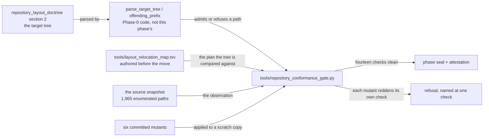

# Phase 2: Repository layout conformance and de-phased naming

> **Purpose**: Move the authored tree to the target layout [repository_layout_doctrine.md §2](../documents/engineering/repository_layout_doctrine.md#2-complete-repository-structure)
> declares, collapse `test/`'s second level to its seven role nouns, and strip the phase ordinal from every
> authored name outside this plan suite — so that every later phase is written against the tree it will
> actually run on, and a re-baseline stays documentation-only.
> **Read this if**: phase 2 is next in the queue, or a later phase depends on what its gate establishes.

Phase 2 delivers repository layout conformance; its design is owned by [repository_layout_doctrine.md](../documents/engineering/repository_layout_doctrine.md), [generated_artifacts_doctrine.md](../documents/engineering/generated_artifacts_doctrine.md), and the plan for reaching it is owned here.
Register 1: a pure tree-and-resolution gate, no host and no cluster.

Link-graph metadata

**Status**: Authoritative source
**Supersedes**: N/A
**Referenced by**: DEVELOPMENT_PLAN/README.md, DEVELOPMENT_PLAN/legacy_tracking_for_deletion.md, DEVELOPMENT_PLAN/overview.md, DEVELOPMENT_PLAN/phase_03_artifact_calculus.md, DEVELOPMENT_PLAN/phase_50_host_assert_cli.md, DEVELOPMENT_PLAN/system_components.md
**Generated sections**: none

## Contents
- [Phase Status](#phase-status)
- [Phase Summary](#phase-summary)
- [Gate integrity](#gate-integrity)
- [Doctrine adopted](#doctrine-adopted)
- [Sprints](#sprints)
- [Sprint 2.1: `test/`'s second level collapses to the seven role nouns 📋](#sprint-21-tests-second-level-collapses-to-the-seven-role-nouns-)
- [Sprint 2.2: The package-only roots become cabal stanzas 📋](#sprint-22-the-package-only-roots-become-cabal-stanzas-)
- [Sprint 2.3: `ui-runtime/` merges into `ui/` 📋](#sprint-23-ui-runtime-merges-into-ui-)
- [Sprint 2.4: Every authored name loses its phase ordinal 📋](#sprint-24-every-authored-name-loses-its-phase-ordinal-)
- [Sprint 2.5: One mutant record format, one registry 📋](#sprint-25-one-mutant-record-format-one-registry-)
- [Sprint 2.6: The allowlist and the register reconcile 📋](#sprint-26-the-allowlist-and-the-register-reconcile-)
- [Documentation Requirements](#documentation-requirements)
- [Related Documents](#related-documents)

---

## Phase Status

⏸️ Blocked pending Phase-1 revalidation. Reopened 2026-08-19 by the generative re-baseline: the artifact, budget, lift, workflow and evidence calculi change what this phase's gate must cover, so any earlier seal is history and no longer presents completion evidence.

**Corrected again 2026-08-18: a root can be retired and still be there.** Deleting the three CPP `#include`
shims and the eighteen folded `mutants.tsv` files left six directory skeletons behind — `jitml/`, `jitml-ui/`,
`infernix-ui/`, and three under `test/mutant/`. Git cannot track an empty directory, so none of them could
reach a clone and none was visible to a single rule in this gate: every one enumerates *files*, and these had
none. They survived a run that passed on fourteen sides. The gate gains a `no-empty-authored-directory` check
and mutant **m7**, because a skeleton misleads a reader about what roots the tree has and a later move into
one silently resurrects a root this phase retired.

**Corrected twice more 2026-08-17, after the seal, by the phases downstream of it.** Phase 16's rerun showed
the registry had flattened eight schemas into two columns: the eighteen `mutants.tsv` files it folded used
`operator`, `variant`, `target`, `locus`, or `surface` for their second column and `expected_locus`,
`expected_red_locus`, `expected`, `fixture`, or `token` for their third, so five capabilities' records had come
to claim something they did not say, and one capability's single mutation had become three rows — one per file
in its directory. **One record format is not one schema.** The registry's fixed columns are now the four facts
every mutation genuinely shares — capability, id, body, flag — and each phase's own fields travel beside them
as named `detail` that `tools/mutant_registry.py` merges back into the row, so a gate reads the field names it
authored. A directory carrying a prose record is one mutation whose body is every file in it. Six gates and
two suites that enumerate items from the registry were reading its first column, which used to be the mutant
id and is now the capability; each asks for its own capability's mutants instead. Phases 14 through 22 were
re-run against the rebuilt registry and are green.

**Corrected 2026-08-17, after the seal, by Phase 9's rerun.** The first mutant-registry build carried a
mutation only when a committed body file or a build flag held it, and silently dropped 101 `mutants.tsv` rows
across six capabilities whose mutation the owning gate materializes from its own code — a field-deletion sweep
over an authored inventory has no file to point at. Phase 9's gate failed on its own missing manifest, which
is the registry doing its job one phase later than it should have. The record format now names that third
carrier explicitly (`gate:<path>`), so a mutation nothing can reach is still refused while one the gate
applies itself is not mistaken for one. The build had also normalized every mutant id to lowercase-underscore,
breaking the lookup a gate does by the id it authored; the registry carries the authored id and normalizes
only to join a body to a flag. The Phase-2 gate is green on the repaired registry, which now carries 514 rows.

**Amended 2026-08-17, during the phase, in two places.** The sprint order changed so that the mutant registry
is authored *after* the de-phasing rather than before it: a registry written first would have named a hundred
paths the same phase then renamed, which is the drift a single registry exists to prevent. The two sprints
swapped places and the ones between them renumbered; nothing was added or dropped, and no sprint's
`Blocked by` names a later one. Separately, the `test/host/*.py` destination in the observation below moved
from `harness/` to `spec/host/`, because the conforming half of the tree already places a Python host spec
there and a second home for one role is the defect this phase exists to remove.

**Opened 2026-08-17** when Phase 1 sealed on the host-ensure contract; created the same day by the
one-binary/ordering re-baseline recorded in
[`legacy_tracking_for_deletion.md`](legacy_tracking_for_deletion.md).

**Observed 2026-08-17, before any move.** `test/`'s second level carried **27 names over 1,056 tracked files**
where [§2](../documents/engineering/repository_layout_doctrine.md#2-complete-repository-structure) declares
seven. The inventory below is what [Sprint 2.1](#sprint-21-tests-second-level-collapses-to-the-seven-role-nouns-)
authored its relocation map from; it is a dated observation, not a plan, and the map is what the gate compares
the tree against.

| Present second level | Files | Destination | Licensed by |
|---|---|---|---|
| `spec`, `fixture`, `golden`, `negative`, `oracle`, `mutant`, `harness` | 586 | unchanged | already conforming |
| `fixtures`, `goldens`, `negatives` | 183 | their singular siblings | [§2.2](../documents/engineering/repository_layout_doctrine.md#22-present-day-roots-and-their-required-destination) |
| `mutants`, and the root `mutants/` | 154 + 14 | `mutant/`, one record format | [§2.2](../documents/engineering/repository_layout_doctrine.md#22-present-day-roots-and-their-required-destination) |
| `Ui` beside `ui` | 17 | one `spec/ui/` — the case pair a case-insensitive filesystem cannot hold apart | [§2.2](../documents/engineering/repository_layout_doctrine.md#22-present-day-roots-and-their-required-destination) and the seven-noun rule |
| `live`, `integration`, `kernel`, `platform`, `topology`, `Amoebius`, `browser`, `host` | 67 | module hierarchy below `spec/`, with their goldens to `golden/` | the seven-noun rule |
| `dhall`, `accept` | 29 | `fixture/` | the seven-noun rule |
| `compile-fail`, `reject` | 11 | `negative/` | the seven-noun rule |
| `fake` | 1 | `harness/` | the seven-noun rule |
| `inject` | 8 | split three ways by role: spec, fixture, mutant | the seven-noun rule |

**The seven-noun rule licenses more moves than the §2.2 table lists, and that is not a gap.**
[§2.2](../documents/engineering/repository_layout_doctrine.md#22-present-day-roots-and-their-required-destination)
enumerates the roots whose destination needed *deciding* — a plural sibling could plausibly have been kept, so
doctrine says it is not. A name like `test/kernel/` needs no such decision: it is an eighth role, which
[§2](../documents/engineering/repository_layout_doctrine.md#2-complete-repository-structure) calls
non-conforming on sight. The relocation map's third column therefore cites whichever of the two licenses the
row, and a row citing neither is the defect the `map-license-cited` check refuses.

## Phase Summary

This phase makes the authored tree **be** the target tree. It was not, and the gap was not a backlog of
small divergences: `test/`'s second level carried twenty-seven names where
[§2](../documents/engineering/repository_layout_doctrine.md#2-complete-repository-structure) declares seven,
with singular and plural living side by side as separate directories; fourteen roots carried a package
declaration and little else — four of them held nothing but it; and 468 authored paths carried a phase
ordinal, which [§U](development_plan_gate_integrity.md#u-the-final-repository-layout) clause 3 forbids
precisely so that a re-baseline stays documentation-only.

**Why this is a phase and not a sprint of Phase 0.** Four rows of the legacy register state a closure
predicate quantified over the *whole tree* — no plural sibling anywhere under `test/`, no package-only root,
no ordinal-bearing authored path — and assign it to a *distributed* owner ("each owning phase, at its rerun").
[§S](development_plan_gate_integrity.md#s-universal-artifact-hygiene-gate) clause 5 forbids deferring a
finding out of the phase that owns it, and [§N](development_plan_phase_model.md#n-reopening-and-amending-a-phase)
names the owner as the phase whose gate must clear it, never a later one. A whole-tree predicate has exactly
one legitimate owner: a phase whose scope is the whole tree. This is that phase.

**A relocation is not a deletion.** The migration allowlist attributes a shared-surface finding to the phase
whose closure retires it, which for a *deletion* is genuinely the last consumer — a root cannot be deleted
while a phase still builds from it. A **relocation** is a rename plus its reference update performed as one
edit, so no consumer ever reads the old path and there is no last consumer to wait for. Conflating the two is
what scheduled `git mv test/fixtures` behind forty-four phases. This phase took the relocations; the
deletions stay with their last consumer.

**Three things the phase found that a positional move alone could not fix, and did not defer.** Two libraries
exposed the same module name from two packages, which the package split had hidden and the merge turned into
a collision; the module Phase 76's contract spec consumes is now
`Amoebius.Pulumi.Backend.CheckpointEnvelope`, which is what it was always about. Three files under the lift
roots were CPP `#include` shims of a module that already lived in `src/` — a package-split artifact with no
destination, so they were deleted rather than relocated. And `test/inject/mutants/` held two capabilities'
mutants under one name, so it split where the build flags said it should. Each takes a row in
[`legacy_tracking_for_deletion.md`](legacy_tracking_for_deletion.md).

**Phase scope:** one cohesive claim — *the authored tree is the target tree, and every consumer resolves at
it* — across six seams, one acceptance command, and no behavioural change to any module. A second claim (that
a moved module still *does* what it did) is not this phase's; the phases that own those modules re-establish
it when they rerun.

**Substrate:** `none` — no host, no cluster, no engine ([§L](development_plan_standards.md#l-one-substrate-discipline)).

**Lane:** none ([§L](development_plan_standards.md#l-one-substrate-discipline)).

**Register:** 1 — pure/golden, in-process, no cluster ([§K](development_plan_standards.md#k-honesty-proven--tested--assumed)).

**Depends on:** [Phase 1](phase_01_toolchain_spike.md)

**Requires**: `host-floor`

**Gate:** `python3 tools/repository_conformance_gate.py` passes every check named in
[Gate integrity](#gate-integrity). Phase 3 does not open unless the ledger records Register 1 green, the
artifact audit reports zero `r13` and `r15` findings, and the seeded mutants are red.

## Gate integrity

The gate's independent oracle is **not this phase's code**: it is `parse_target_tree` / `offending_prefix` in
`tools/artifact_policy.py`, which read the target tree out of
[repository_layout_doctrine.md §2](../documents/engineering/repository_layout_doctrine.md#2-complete-repository-structure)
— a document Phase 0 owns and whose section 2 this phase does not edit
([§M](development_plan_gate_integrity.md#m-gate-integrity-a-gate-cannot-be-passed-by-a-stub) clause 3). The
authored fixture is `tools/layout_relocation_map.tsv`, one row per moved prefix carrying its old prefix, its
new prefix, and the [§2.2](../documents/engineering/repository_layout_doctrine.md#22-present-day-roots-and-their-required-destination) destination cell that licenses the move; it was authored **before** the move, so
the gate compares the tree against a plan rather than against itself.

Seven committed mutants under `test/mutant/repository_conformance/`, each of which must redden its own named
check and no other:

- **m1** reintroduces a `test/fixtures/` path — `target-tree-clean`, which is rule `r13`.
- **m2** reintroduces a `tools/phase31_gate.py`-shaped name — `de-phased-naming`, which is rule `r15`.
- **m3** adds a relocation-map row whose destination the target tree does not admit —
  `map-destination-admitted`. The map is checked against
  [§2](../documents/engineering/repository_layout_doctrine.md#2-complete-repository-structure), so a map that
  lies is caught before the tree is touched.
- **m4** leaves one tracked consumer naming a path the relocation moved away from — `no-dangling-reference`.
- **m5** renames a cabal stanza's home but leaves its `hs-source-dirs` behind — `source-dirs-resolve`, which
  is resolution, not text.
- **m6** restores a case-collision pair (`test/spec/Live/` beside `test/spec/live/`).
- **m7** leaves behind the directory skeleton of a retired root — `no-empty-authored-directory`.

**Two precedences make each mutant attributable, and they are the gate's design rather than a convenience.** A
prefix the target-tree rule already names is a target-tree defect, so `relocation-complete` stays silent about
it; and a destination the map check already rejected says nothing further by being empty. Without them m1 and
m3 each reddened two checks, and a mutant that reddens two checks proves neither.

**m6 is not decoration.** Two of the four substrates reach the tree case-insensitively, so a plural/singular
pair that differs only in case cannot be resolved by a bulk move — one side silently overwrites the other. The
collision check ran **before** any relocation sprint, and its mutant proves it can fail. The mutation is
applied to the *enumeration* rather than to the disk, because a case-insensitive filesystem cannot hold the
pair to begin with — which is the defect, not an obstacle to seeding it.

*Orientation. Design intent. The oracle and the fixture both come from outside this phase's code: the tree is read out of [`repository_layout_doctrine.md`](../documents/engineering/repository_layout_doctrine.md), a document Phase 0 owns, and the map was written before the move it plans. A mutant that reddened no check, or reddened two, is visible here as a missing or a doubled edge.*
- **Extension conformance (§M.13).** Not applicable: this gate delivers no extension.

## Doctrine adopted

- [`jit_artifact_doctrine.md`](../documents/engineering/jit_artifact_doctrine.md) — every artifact repository layout conformance and de-phased naming emits is a recipe over a content address, never an authored file.
- [repository_layout_doctrine.md §2 — complete repository structure](../documents/engineering/repository_layout_doctrine.md#2-complete-repository-structure):
  the target tree, its fixed second levels, and the seven singular `test/` role nouns.
- [repository_layout_doctrine.md §2.1 — when a unit warrants its own build package](../documents/engineering/repository_layout_doctrine.md#21-when-a-unit-warrants-its-own-build-package):
  the criterion a package-only root fails.
- [repository_layout_doctrine.md §2.2 — present-day roots and their required destination](../documents/engineering/repository_layout_doctrine.md#22-present-day-roots-and-their-required-destination):
  the per-root destination this phase realises.
- [generated_artifacts_doctrine.md](../documents/engineering/generated_artifacts_doctrine.md): the rule that
  separates a relocation from a deletion — a generated destination cannot hold bytes until its generator runs.

## Sprints

```mermaid
flowchart LR
  %% register: orientation
  s1["2.1 seven role nouns"]
  s2["2.2 one package"]
  s3["2.3 one spago project"]
  s4["2.4 no phase ordinal"]
  s5["2.5 one mutant registry"]
  s6["2.6 allowlist + register"]
  gate["repository conformance gate"]
  s1 -->|"a conforming test/ to move sources into"| s2
  s2 -->|"one package whose flags 2.4 renames"| s3
  s2 -->|"the flag set 2.4 de-phases"| s4
  s3 -->|"no root left outside the tree"| s4
  s4 -->|"final paths, so no registry row is stale"| s5
  s5 -->|"every mutation reachable through one record"| s6
  s6 -->|"zero r13/r15 rows left to defer"| gate
```

*Orientation. Which sprint produces what the next consumes, ending at the gate; the seam rules are owned by [development_plan_standards.md §F](development_plan_standards.md#f-the-sprint-block-format). The de-phasing precedes the registry because a registry authored first would name a hundred paths the same phase then renames.*

## Sprint 2.1: `test/`'s second level collapses to the seven role nouns 📋
**Status**: Planned
**Implementation**: `test/**`, `tools/layout_relocation_map.tsv`
**Blocked by**: none within the phase.
**Independent Validation**: `git ls-files test/ | cut -d/ -f2 | sort -u` equals exactly the seven nouns [§2](../documents/engineering/repository_layout_doctrine.md#2-complete-repository-structure)
declares; m1 and m6 each redden their own check.
**Docs to update**: `DEVELOPMENT_PLAN/legacy_tracking_for_deletion.md`

### Objective

Fold twenty prefixes into `spec`, `fixture`, `golden`, `negative`, `oracle`, `mutant`, and `harness`, closing
the singular/plural pairs first because they are the ones a case-insensitive filesystem cannot hold apart.

### Deliverables
- The case-collision check and its mutant, run before any move.
- Every `test/` second-level name one of the seven, with module hierarchy below `test/spec/`, never at the
  second level.
- Every tracked consumer of a moved path updated in the same edit.

### Validation
1. The seven-noun assertion above, plus a dangling-reference scan over the whole tree.
2. m1 and m6 redden `target-tree-clean` and `collision-free-tree` respectively, and no other check.

### Remaining Work
None. `test/`'s second level is `fixture`, `golden`, `harness`, `mutant`, `negative`, `oracle`, `spec` over
1,084 files. The pair the index held as `test/ui/` and `test/Ui/` — one directory on this host's
case-insensitive filesystem — is one `test/spec/ui/`.

## Sprint 2.2: The package-only roots become cabal stanzas 📋
**Status**: Planned
**Implementation**: `amoebius.cabal`, `cabal.project`, `src/**`, `proto/**`, `test/**`
**Blocked by**: Sprint 2.1
**Independent Validation**: `cabal build all --dry-run` and `cabal test all --dry-run` resolve; no root outside
the target tree holds a package declaration.
**Docs to update**: `DEVELOPMENT_PLAN/legacy_tracking_for_deletion.md`, `DEVELOPMENT_PLAN/system_components.md`

### Objective

Fourteen roots carried a package declaration and little else. Each becomes a stanza in the one authored
package, against the criterion [§2.1](../documents/engineering/repository_layout_doctrine.md#21-when-a-unit-warrants-its-own-build-package)
already states; the two out-of-tree `hs-source-dirs` become `source-repository-package` entries.

### Deliverables
- Sources under `src/**`, `test/**`, `proto/**`, `dhall/**` as [§2](../documents/engineering/repository_layout_doctrine.md#2-complete-repository-structure) places them.
- No `hs-source-dirs` reaching outside the repository.
- One `amoebius` package carrying thirteen further sub-libraries and thirty-four further suites; `probe/` and
  `vendor/dual/` stay apart on the two grounds §2.1 admits.

### Validation
1. Resolution and dry-run test discovery both succeed at the new names.
2. m5 reddens: a stanza renamed without its source directory fails.

### Remaining Work
None. `cabal.project` lists three packages where it listed sixteen, and the sibling `infernix` and `jitML`
checkouts are `source-repository-package` entries rather than a `../../` path into the developer's home. Every
retired root is gone from the worktree, skeleton included — which the gate now checks rather than assumes. The
second executable is gone: `app/singleton/Main.hs` is an `amoebius control-plane` verb over
`app/amoebius/Amoebius/Entry/ControlPlane.hs`, which is where the one binary's other entry-point-only
module already lives and for the same reason — `hs-source-dirs` is a search path, not a module filter.

**What this sprint could not carry, and who owns it.** `amoebius-pulsar` was `build-type: Custom`, and its
`Setup.hs` generated the Pulsar protobuf bindings. A root `Setup.hs` is not in the section 2 tree and
[§2.1](../documents/engineering/repository_layout_doctrine.md#21-when-a-unit-warrants-its-own-build-package)
admits no ground for a package that exists only to carry one, so the generator retired with the split. The
`.proto` schema is at `proto/**` where the target tree puts it, and Phase 67 re-establishes binding generation
against `.build/proto/**` — which is where the same tree line already sends the rendered bindings. The row is
in the register.

## Sprint 2.3: `ui-runtime/` merges into `ui/` 📋
**Status**: Planned
**Implementation**: `ui/**`
**Blocked by**: Sprint 2.2
**Independent Validation**: one spago project; every authored PureScript module is reachable from it.
**Docs to update**: `DEVELOPMENT_PLAN/legacy_tracking_for_deletion.md`

### Objective

One PureScript root, and no authored module outside a build.

### Deliverables
- A single `ui/**` root under one spago project.
- The ignore contract naming no departed root.

### Validation
1. Every authored PureScript module is reachable from the one project.
2. No ignore rule names a root the tree no longer has.

### Remaining Work
None. `ui/spago.yaml` is the one project and `ui/src/**` the one source root. The three ignore rules that
named `ui-runtime/`'s spago output moved with it, in both contracts and in
[§6](../documents/engineering/repository_layout_doctrine.md#6-gitignore-contract) and
[§7](../documents/engineering/repository_layout_doctrine.md#7-dockerignore-contract). That the output home is
still beneath an authored root is a **behavioural** residue rather than a positional one: retargeting spago's
output into `.build/**` belongs to the phase that owns the UI build, and the `r14` row is narrowed to it.

## Sprint 2.4: Every authored name loses its phase ordinal 📋
**Status**: Planned
**Implementation**: `tools/**`, `test/**`, `src/**`, `amoebius.cabal`, `.gitignore`, `.dockerignore`
**Blocked by**: Sprint 2.2
**Independent Validation**: the `r15` audit reports zero findings; the only ordinal-bearing names left are
this plan suite's own `phase_NN_*.md` and the doc-lint corpus that tests them.
**Docs to update**: every phase document whose `Implementation` names a renamed path

### Objective

Strip the ordinal from every authored path, build flag, suite name, and ignore rule outside
`DEVELOPMENT_PLAN/`, replacing it with a capability name derived from the owning phase's slug. This is what
makes [§U](development_plan_gate_integrity.md#u-the-final-repository-layout) clause 3 true, and therefore what
makes every future re-baseline documentation-only.

### Deliverables
- Capability-derived names for every ordinal-bearing authored path.
- Every phase document's `Implementation`, oracle, mutant, golden, and gate command naming the new path.

### Validation
1. `r15` reports zero findings.
2. m2 reddens: a reintroduced ordinal-bearing tool name fails.

### Remaining Work
None. **The ordinal a tree name carried was the *pre*-amendment one**, so the capability came from the same
join `tools/migration_allowlist.tsv` already recorded between a `tools/phaseNN_*` glob and the phase that now
owns it — `tools/phase31_gate.py` is `tools/platform_services_2_gate.py`, not Phase 58's anything. A data file
grouped under its capability directory (`test/mutant/content_store_workflow/lease_election.mutant`), matching
the already-conforming half of the tree; a Haskell suite main kept its descriptive half
(a `PhaseNNServicesLiveSpec.hs` became `ServicesLiveSpec.hs`) except where that half was not distinctive on its
own, and those fourteen took the capability instead.

**The `-DPHASE31_*` preprocessor symbols are deliberately untouched.** A cpp macro is not a name that becomes
a path, so [§U](development_plan_gate_integrity.md#u-the-final-repository-layout) clause 3 does not reach it
and `r15` does not scan it; the tree's own precedent — `PHASE26_*` beside `object-reconciler-*` — leaves it to
the phase that owns the module. Renaming two hundred macros across the Haskell sources would be a behavioural
edit this phase's scope excludes.

## Sprint 2.5: One mutant record format, one registry 📋
**Status**: Planned
**Implementation**: `test/mutant/**`, `tools/mutant_registry.py`
**Blocked by**: Sprint 2.4
**Independent Validation**: every mutation is a registry row; no mutation is carried by a build flag alone.
**Docs to update**: `DEVELOPMENT_PLAN/legacy_tracking_for_deletion.md`

### Objective

`mutants/`, `test/mutants/`, `test/kernel/mutants/`, and `test/inject/mutants/` become one `test/mutant/**`
with one record format, and the mutations carried as build flags become registry rows.

### Deliverables
- One mutant root, one record format, one registry.
- Each former build-flag mutation expressed as a registry row.

### Validation
1. The registry enumerates every mutation, and every mutant resolves through it.
2. A mutation reachable only by a build flag fails the gate.

### Remaining Work
None. `test/mutant/registry.tsv` carries six fields per mutation — capability, id, operator, expected locus,
committed body, and build flag — and `tools/mutant_registry.py` is the one parser, read by seventeen gates and
two suites. The ten per-capability `mutants.tsv` files are gone; their operator and locus columns are now two
of the registry's six.

**Why the registry, and not a body file per flag.** A hundred and six mutations existed only as a cabal flag,
and inventing a body for each would have fabricated an operator and a locus nobody authored. The registry
records what is known and marks the rest `unstated` — and the gate admits `unstated` only for a capability
whose phase the tracker does not mark Done, so the first phase to seal against a mutation must state its
operator and locus to get past its own gate. That is a ratchet, not a blank.

## Sprint 2.6: The allowlist and the register reconcile 📋
**Status**: Planned
**Implementation**: `tools/migration_allowlist.tsv`, `DEVELOPMENT_PLAN/legacy_tracking_for_deletion.md`
**Blocked by**: Sprint 2.5
**Independent Validation**: the allowlist is shrink-only, so a deleted row *is* the closure evidence; the
audit refuses to run with a row matching nothing.
**Docs to update**: `DEVELOPMENT_PLAN/legacy_tracking_for_deletion.md`, `documents/engineering/repository_layout_doctrine.md`

### Objective

Delete every `r13` and `r15` row, re-own each remaining row under the re-baseline's audit map, and narrow the
rows whose residue is behavioural rather than positional.

### Deliverables
- Zero `r13` and `r15` rows.
- Each residue row narrowed to the behavioural half its subject-matter phase owns.

### Validation
1. The artifact audit reports zero `r13`/`r15` findings and refuses no row.
2. The deferral total falls to the deletion class alone.

### Remaining Work
None. Seventy `r13`/`r15` rows are deleted, and every surviving row's path glob was translated through the
same map the tree moved by — so a row that now matches nothing is a closure the audit reports rather than a
silence. What remains deferred is the deletion class: generated output still written beneath an authored root,
host state still escaping the checkout, and expectation tables whose provenance their owning phase must
establish.

## Documentation Requirements

**Engineering docs to update (when the gate runs, flip the honest layer, never before):**
- `repository_layout_doctrine.md` — §2.2's destination cells become history once realised (Sprint 2.6); §6 and
  §7's normative ignore patterns name the paths the move produced.
- `substrate_doctrine.md` — the Pulsar code-generation paragraph names the retired `Setup.hs` as retired, and
  the phase that re-establishes the invariant it enforced.

**Cross-references to add:**
- `DEVELOPMENT_PLAN/README.md` Phase Overview links its Phase 2 row to this document.
- Each moved path's owning phase document names the new path (Sprint 2.4).

## Related Documents

- [README.md](README.md) — the live tracker; its Phase 2 row is the source for this phase's objective and gate.
- [development_plan_standards.md](development_plan_standards.md) — the rulebook this document obeys.
- [legacy_tracking_for_deletion.md](legacy_tracking_for_deletion.md) — the register whose whole-tree rows this
  phase exists to make satisfiable.
- [`repository_layout_doctrine.md`](../documents/engineering/repository_layout_doctrine.md) — the target tree
  this phase realises.
- [`generated_artifacts_doctrine.md`](../documents/engineering/generated_artifacts_doctrine.md) — the
  emit-from-source, never-commit rule that separates a relocation from a deletion.
