# Phase 2: Repository layout conformance and de-phased naming

> **Purpose**: Specify the target Haskell capability to enforce the target repository layout,
> including the tracked-source boundary: behavioral source is `.hs` only outside `pb/**`, consumers
> resolve at canonical Haskell module and package paths, and generated foreign products are absent
> from Git.
> **Read this if**: phase 2 is next in the queue, or a later phase depends on what its gate establishes.

This document specifies a target capability only. Any pre-reset implementation result, pass, seal, receipt,
command transcript, or evidence reference retained below is historical inventory only: it is permanently
non-operative, cannot satisfy any current contract, and cannot regain authority through a status edit. Current
status is owned by [the tracker](README.md) and the Phase Status block below.

Link-graph metadata

**Status**: Authoritative source
**Supersedes**: N/A
**Referenced by**: DEVELOPMENT_PLAN/README.md, DEVELOPMENT_PLAN/overview.md, DEVELOPMENT_PLAN/phase_03_artifact_calculus.md
**Generated sections**: none

## Contents

- [Phase Status](#phase-status)
- [Phase Summary](#phase-summary)
- [Gate integrity](#gate-integrity)
- [Doctrine adopted](#doctrine-adopted)
- [Sprints](#sprints)
- [Sprint 2.1: `test/`'s second level collapses to the seven role nouns ⏸️](#sprint-21-tests-second-level-collapses-to-the-seven-role-nouns-)
- [Sprint 2.2: The package-only roots become cabal stanzas ⏸️](#sprint-22-the-package-only-roots-become-cabal-stanzas-)
- [Sprint 2.3: `ui-runtime/` merges into `ui/` ⏸️](#sprint-23-ui-runtime-merges-into-ui-)
- [Sprint 2.4: Every authored name loses its phase ordinal ⏸️](#sprint-24-every-authored-name-loses-its-phase-ordinal-)
- [Sprint 2.5: One mutant record format, one registry ⏸️](#sprint-25-one-mutant-record-format-one-registry-)
- [Sprint 2.6: The allowlist and the register reconcile ⏸️](#sprint-26-the-allowlist-and-the-register-reconcile-)
- [Documentation Requirements](#documentation-requirements)
- [Related Documents](#related-documents)

---

## Phase Status

⏸️ Blocked — NOT VALIDATED.

Blocked by redesigned Phase 1, its independent validation, and human promotion; every earlier
promotion barrier must also be satisfied in numerical order. Every prior pass, seal, receipt, attestation,
completion claim, and implementation result in this document is invalidated as validation evidence, even
where historical prose has not yet been rewritten. Existing implementation is an **Observed footprint /
Known partial** only.

> **Reset contract interpretation.** The phase-specific gate review below is REJECTED — NOT VALIDATED. Until Phase 0 Sprint 0.7 replaces every unresolved row and a human independently reviews it, the summary and work breakdown are a capability inventory, not executable authority. Any wording that prescribes tracked non-`.hs` behavioural source, a Python/shell verdict, a checked-in generated fixture/oracle/mutant, `pb` behavior outside its minimal-platform-discrimination/contained-toolchain-establishment/source-bound-build/opaque-exec grammar, or host/hardware validation before the Phase-49 barrier is invalidated and non-operative.

## Phase Summary

This phase specifies a Haskell target capability; it does not report a current implementation or
result. The target is to enforce the target repository layout, including the tracked-source
boundary: behavioral source is `.hs` only outside `pb/**`, consumers resolve at canonical Haskell
module and package paths, and generated foreign products are absent from Git.

The production subject, behavioral controls, independent oracle, fixtures, and mutants must be authored as
`.hs`. Except for the `pb/**` bootstrap, no non-`.hs` behavioral source, fixture, oracle, or mutant may be
tracked. Any foreign representation, rendered specification, compiler transcript, suite manifest, generated
code, or other derived product must be created lazily beneath `.build/**` and remain run-scoped evidence only.
`pb` may only make the minimal platform distinction, establish the contained toolchain, build the source-bound binary, and exec that exact Haskell verdict binary with argv unchanged; that entry point and its independent
evidence contract remain UNRESOLVED and block validation.

This phase precedes Phase 49 and is confined to pure, build, compiler, or model-level Register-1
behavior only. It cannot use host, hardware, live-service, or cluster observations to validate or
promote its claim.

**Phase scope:** Target capability only — enforce the target repository layout, including the
tracked-source boundary: behavioral source is `.hs` only outside `pb/**`, consumers resolve at
canonical Haskell module and package paths, and generated foreign products are absent from Git.
NOT VALIDATED.

**Substrate:** `none` — pre-Phase-49; no host, hardware, live service, or cluster observation.

**Lane:** `none`.

**Register:** 1 — Haskell-only pure/build/model target. NOT VALIDATED.

**Depends on:** [Phase 1](phase_01_toolchain_spike.md) — exact current human approval; the numeric chain includes every earlier phase
**Gate:** `pb validate phase 02`; see [Gate integrity](#gate-integrity). NOT VALIDATED.

## Gate integrity

**Contract review**: REJECTED — NOT VALIDATED.

| Key | Contract |
|---|---|
| `Claim` | Target capability only — enforce the target repository layout, including the tracked-source boundary: behavioral source is `.hs` only outside `pb/**`, consumers resolve at canonical Haskell module and package paths, and generated foreign products are absent from Git. NOT VALIDATED. Explicit exclusions: every layer named in `Residue` remains UNVERIFIED. |
| `Subject` | UNRESOLVED — blocks validation: no production `.hs` module and entry point have been independently established for this reset contract. |
| `Command` | `pb validate phase 02` is the target command only; `pb` may only make the minimal platform distinction, establish the contained toolchain, build the source-bound binary, and exec it with argv unchanged, while the Haskell verdict entry point remains UNRESOLVED and blocks validation. |
| `Oracle` | UNRESOLVED — blocks validation: no separately authored `.hs` oracle, independence boundary, provenance, and independent human reviewer have been accepted. |
| `Positive controls` | UNRESOLVED — blocks validation: no closed named Haskell corpus and exact per-member observations have been accepted. |
| `Paired negatives` | UNRESOLVED — blocks validation: minimally different pairs, exact rejection loci, and exact reasons have not been accepted for every foreclosed dimension. |
| `Mutants` | UNRESOLVED — blocks validation: operators, production loci, applied-change witnesses, expected red observations, and unaffected controls have not been accepted. |
| `Discovery` | UNRESOLVED — blocks validation: expected and runtime-discovered surfaces, two-way equality, and empty-discovery refusal have not been accepted. |
| `Challenge` | UNRESOLVED — blocks validation: neither a post-start challenge nor a reviewed pure-claim independent predicate has been accepted. |
| `Observer` | UNRESOLVED — blocks validation: no outside observer, raw observation, authenticity check, and fail-closed rule have been accepted. |
| `Authority/bypass` | UNRESOLVED — blocks validation: least-privilege/foreign-scope pairs, bypass probes, or reviewed non-applicability have not been accepted. |
| `Freshness` | UNRESOLVED — blocks validation: stale state, cached output, prior evidence, and replayed responses have not been made unable to pass. |
| `Qualification` | UNRESOLVED — blocks validation: the fixed sabotage corpus has not qualified a Haskell harness independently of a clean candidate run. |
| `Cleanroom` | UNRESOLVED — blocks validation: no run has derived all products lazily with generated and condemned legacy copies absent. |
| `Legacy closure` | UNRESOLVED — blocks validation: stable owned legacy IDs and their exact zero-finding check have not been reconciled. |
| `Predecessor` | MISSING — blocks validation: the current Phase 01 human approval receipt does not exist. |
| `Residue` | UNVERIFIED — the entire phase claim and all semantic, effect, runtime, hardware, and cleanup layers remain unvalidated; no empty residue is asserted. |
| `Human authority` | `human-only` — no agent, gate, CI job, digest, receipt-shaped file, or generated assertion may promote status. |

## Doctrine adopted

- [`jit_artifact_doctrine.md` §2 — The rule, and the closed exception list](../documents/engineering/jit_artifact_doctrine.md#2-the-rule-and-the-closed-exception-list) — every foreign or generated
  product must be derived lazily beneath `.build/**`, never tracked as authored behavioral source.
- [`repository_layout_doctrine.md` §2 — Complete repository structure](../documents/engineering/repository_layout_doctrine.md#2-complete-repository-structure):
  the target tree, its fixed second levels, and the seven singular `test/` role nouns.
- [`repository_layout_doctrine.md` §2.1 — When a unit warrants its own build package](../documents/engineering/repository_layout_doctrine.md#21-when-a-unit-warrants-its-own-build-package):
  the criterion a package-only root fails.
- [`repository_layout_doctrine.md` §2.2 — Present-day roots and their required destination](../documents/engineering/repository_layout_doctrine.md#22-present-day-roots-and-their-required-destination):
  the per-root destination the target Haskell conformance capability must enforce.
- [`generated_artifacts_doctrine.md` §3 — The rule](../documents/engineering/generated_artifacts_doctrine.md#3-the-rule): the rule that
  separates a relocation from a deletion — a generated destination cannot hold bytes until its generator runs.

## Sprints

```mermaid
flowchart LR
  %% register: orientation
  s1["2.1 seven role nouns"]
  s2["2.2 one package"]
  s3["2.3 one spago project"]
  s4["2.4 no phase ordinal"]
  s5["2.5 one mutant registry"]
  s6["2.6 allowlist + register"]
  gate["repository conformance gate"]
  s1 -->|"a conforming test/ to move sources into"| s2
  s2 -->|"one package whose flags 2.4 renames"| s3
  s2 -->|"the flag set 2.4 de-phases"| s4
  s3 -->|"no root left outside the tree"| s4
  s4 -->|"final paths, so no registry row is stale"| s5
  s5 -->|"every mutation reachable through one record"| s6
  s6 -->|"zero r13/r15 rows left to defer"| gate
```

> **Reset validation review.** Every pre-reset `Independent Validation` and `### Validation` below is rejected as a current criterion and MUST NOT be executed or cited. It is retained only to inventory the capability while the fixed Haskell subject/oracle/reviewer/mutant/legacy contract is rewritten.

*Orientation. Which sprint produces what the next consumes, ending at the gate; the seam rules are owned by [development_plan_standards.md §F](development_plan_standards.md#f-the-sprint-block-format). The de-phasing precedes the registry because a registry authored first would name a hundred paths the same phase then renames.*

## Sprint 2.1: `test/`'s second level collapses to the seven role nouns ⏸️

**Status**: Blocked — NOT VALIDATED

### Objective

Fold twenty prefixes into `spec`, `fixture`, `golden`, `negative`, `oracle`, `mutant`, and `harness`, closing
the singular/plural pairs first because they are the ones a case-insensitive filesystem cannot hold apart.

### Deliverables

- The case-collision check and its mutant, run before any move.
- Every `test/` second-level name one of the seven, with module hierarchy below `test/spec/`, never at the
  second level.
- Every tracked consumer of a moved path updated in the same edit.

### Validation

1. The seven-noun assertion above, plus a dangling-reference scan over the whole tree.
2. m1 and m6 redden `target-tree-clean` and `collision-free-tree` respectively, and no other check.

### Remaining Work

The pre-reset record said `None`; that statement is permanently invalid for promotion. Current remaining work includes every `UNRESOLVED`/`MISSING` contract row, predecessor approval, owned legacy closure, and phase-specific obligation in the redesigned gate. `test/`'s second level is `fixture`, `golden`, `harness`, `mutant`, `negative`, `oracle`, `spec` over
1,084 files. The pair the index held as `test/ui/` and `test/Ui/` — one directory on this host's
case-insensitive filesystem — is one `test/spec/ui/`.

## Sprint 2.2: The package-only roots become cabal stanzas ⏸️

**Status**: Blocked — NOT VALIDATED

### Objective

Fourteen roots carried a package declaration and little else. Each becomes a stanza in the one authored
package, against the criterion [§2.1](../documents/engineering/repository_layout_doctrine.md#21-when-a-unit-warrants-its-own-build-package)
already states; the two out-of-tree `hs-source-dirs` become `source-repository-package` entries.

### Deliverables

- Sources under `src/**`, `test/**`, `proto/**`, `dhall/**` as [§2](../documents/engineering/repository_layout_doctrine.md#2-complete-repository-structure) places them.
- No `hs-source-dirs` reaching outside the repository.
- One `amoebius` package carrying thirteen further sub-libraries and thirty-four further suites; `probe/` and
  `vendor/dual/` stay apart on the two grounds §2.1 admits.

### Validation

1. Resolution and dry-run test discovery both succeed at the new names.
2. m5 reddens: a stanza renamed without its source directory fails.

### Remaining Work

The pre-reset record said `None`; that statement is permanently invalid for promotion. Current remaining work includes every `UNRESOLVED`/`MISSING` contract row, predecessor approval, owned legacy closure, and phase-specific obligation in the redesigned gate. `cabal.project` lists three packages where it listed sixteen, and the sibling `infernix` and `jitML`
checkouts are `source-repository-package` entries rather than a `../../` path into the developer's home. Every
retired root is gone from the worktree, skeleton included — which the gate now checks rather than assumes. The
second executable is gone: `app/singleton/Main.hs` is an `amoebius control-plane` verb over
`app/amoebius/Amoebius/Entry/ControlPlane.hs`, which is where the one binary's other entry-point-only
module already lives and for the same reason — `hs-source-dirs` is a search path, not a module filter.

**What this sprint could not carry, and who owns it.** `amoebius-pulsar` was `build-type: Custom`, and its
`Setup.hs` generated the Pulsar protobuf bindings. A root `Setup.hs` is not in the section 2 tree and
[§2.1](../documents/engineering/repository_layout_doctrine.md#21-when-a-unit-warrants-its-own-build-package)
admits no ground for a package that exists only to carry one, so the generator retired with the split. The
`.proto` schema is at `proto/**` where the target tree puts it, and Phase 67 re-establishes binding generation
against `.build/proto/**` — which is where the same tree line already sends the rendered bindings. The row is
in the register.

## Sprint 2.3: `ui-runtime/` merges into `ui/` ⏸️

**Status**: Blocked — NOT VALIDATED

### Objective

Account for the current tracked UI roots as migration debt without treating PureScript as an admitted source
language or adding to those roots.

### Deliverables

- One active legacy row assigning removal of all tracked UI/package inputs to Phase 46.
- No new tracked UI source and no generated UI output beside authored source.

### Validation

1. Every present tracked UI/PureScript/package input is discovered and mapped exactly once to its active row.
2. A generated UI tree is required to live beneath `.build/**`; a tracked or source-adjacent reintroduction is
   rejected.

### Remaining Work

Phase 46 must replace the tracked UI/package inputs with Haskell declarations and lazy `.build/ui/**`
materialization. Until that owner reaches zero findings, this is only accounted debt and remains NOT VALIDATED.

## Sprint 2.4: Every authored name loses its phase ordinal ⏸️

**Status**: Blocked — NOT VALIDATED

### Objective

Strip the ordinal from every authored path, build flag, suite name, and ignore rule outside
`DEVELOPMENT_PLAN/`, replacing it with a capability name derived from the owning phase's slug. This is what
makes [§U](development_plan_gate_integrity.md#u-the-final-repository-layout) clause 3 true, and therefore what
makes every future re-baseline documentation-only.

### Deliverables

- Capability-derived names for every ordinal-bearing authored path.
- Every phase document's `Implementation`, oracle, mutant, golden, and gate command naming the new path.

### Validation

1. `r15` reports zero findings.
2. m2 reddens: a reintroduced ordinal-bearing tool name fails.

### Remaining Work

The pre-reset record said `None`; that statement is permanently invalid for promotion. Current remaining work includes every `UNRESOLVED`/`MISSING` contract row, predecessor approval, owned legacy closure, and phase-specific obligation in the redesigned gate. **The ordinal a tree name carried was the *pre*-amendment one**, so the capability came from the same
join `tools/migration_allowlist.tsv` already recorded between a `tools/phaseNN_*` glob and the phase that now
owns it — `tools/phase31_gate.py` is `tools/platform_services_2_gate.py`, not Phase 58's anything. A data file
grouped under its capability directory (`test/mutant/content_store_workflow/lease_election.mutant`), matching
the already-conforming half of the tree; a Haskell suite main kept its descriptive half
(a `PhaseNNServicesLiveSpec.hs` became `ServicesLiveSpec.hs`) except where that half was not distinctive on its
own, and those fourteen took the capability instead.

**The `-DPHASE31_*` preprocessor symbols are deliberately untouched.** A cpp macro is not a name that becomes
a path, so [§U](development_plan_gate_integrity.md#u-the-final-repository-layout) clause 3 does not reach it
and `r15` does not scan it; the tree's own precedent — `PHASE26_*` beside `object-reconciler-*` — leaves it to
the phase that owns the module. Renaming two hundred macros across the Haskell sources would be a behavioural
edit this phase's scope excludes.

## Sprint 2.5: One mutant record format, one registry ⏸️

**Status**: Blocked — NOT VALIDATED

### Objective

`mutants/`, `test/mutants/`, `test/kernel/mutants/`, and `test/inject/mutants/` become one `test/mutant/**`
with one record format, and the mutations carried as build flags become registry rows.

### Deliverables

- One mutant root, one record format, one registry.
- Each former build-flag mutation expressed as a registry row.

### Validation

1. The registry enumerates every mutation, and every mutant resolves through it.
2. A mutation reachable only by a build flag fails the gate.

### Remaining Work

The pre-reset record said `None`; that statement is permanently invalid for promotion. Current remaining work
includes every `UNRESOLVED`/`MISSING` contract row, predecessor approval, owned legacy closure, and
phase-specific obligation in the redesigned gate. The target mutation registry is a Haskell value carrying
capability, id, operator, expected locus, changed-subject witness, and application mode. Any TSV projection or
executable helper is generated beneath `.build/**`; no tracked table or Python parser is authority.

**Why the registry, and not a body file per flag.** A hundred and six mutations existed only as a cabal flag,
and inventing a body for each would have fabricated an operator and a locus nobody authored. The registry
records what is known and marks the rest `unstated` — and the gate admits `unstated` only for a capability
whose phase the tracker does not mark Done, so the first phase to seal against a mutation must state its
operator and locus to get past its own gate. That is a ratchet, not a blank.

## Sprint 2.6: The allowlist and the register reconcile ⏸️

**Status**: Blocked — NOT VALIDATED

### Objective

Delete every `r13` and `r15` row, re-own each remaining row under the re-baseline's audit map, and narrow the
rows whose residue is behavioural rather than positional.

### Deliverables

- Zero `r13` and `r15` rows.
- Each residue row narrowed to the behavioural half its subject-matter phase owns.

### Validation

1. The artifact audit reports zero `r13`/`r15` findings and refuses no row.
2. The deferral total falls to the deletion class alone.

### Remaining Work

The pre-reset record said `None`; that statement is permanently invalid for promotion. Current remaining work includes every `UNRESOLVED`/`MISSING` contract row, predecessor approval, owned legacy closure, and phase-specific obligation in the redesigned gate. Seventy `r13`/`r15` rows are deleted, and every surviving row's path glob was translated through the
same map the tree moved by — so a row that now matches nothing is a closure the audit reports rather than a
silence. What remains deferred is the deletion class: generated output still written beneath an authored root,
host state still escaping the checkout, and expectation tables whose provenance their owning phase must
establish.

## Documentation Requirements

**Engineering docs to update (when the human promotes the gate, never before):**

- `repository_layout_doctrine.md` — §2.2's destination cells become history once realised (Sprint 2.6); §6 and
  §7's normative ignore patterns name the paths the move produced.
- `substrate_doctrine.md` — the Pulsar code-generation paragraph names the retired `Setup.hs` as retired, and
  the phase that re-establishes the invariant it enforced.

**Cross-references to add:**

- `DEVELOPMENT_PLAN/README.md` Phase Overview links its Phase 2 row to this document.
- Each moved path's owning phase document names the new path (Sprint 2.4).

## Related Documents

- [README.md](README.md) — the live tracker; its Phase 2 row is the source for this phase's objective and gate.
- [development_plan_standards.md](development_plan_standards.md) — the rulebook this document obeys.
- [legacy_tracking_for_deletion.md](legacy_tracking_for_deletion.md) — the register whose whole-tree rows this
  phase exists to make satisfiable.
- [`repository_layout_doctrine.md`](../documents/engineering/repository_layout_doctrine.md) — the target tree
  this phase realises.
- [`generated_artifacts_doctrine.md`](../documents/engineering/generated_artifacts_doctrine.md) — the
  emit-from-source, never-commit rule that separates a relocation from a deletion.
