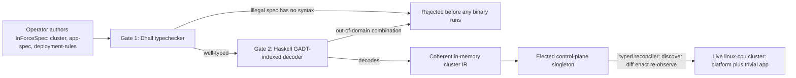

# Phase 3: Orchestration Dhall DSL + control-plane singleton

**Status**: Authoritative source
**Supersedes**: N/A
**Referenced by**: README.md, legacy_tracking_for_deletion.md, overview.md, system_components.md
**Generated sections**: none

> **Purpose**: Turn the documented Dhall orchestration surface into running types — the cluster / app-spec /
> deployment-rules DSL behind its two typed gates, the service-capability binding, the
> illegal-state-unrepresentable type discipline, and the elected in-cluster control-plane singleton that
> decodes one spec and drives the cluster toward it.

---

## Phase Status

📋 Planned. Specified before implementation; every sprint below is 📋 Planned and every prescriptive
statement is design intent, never a tested amoebius result. The phase opens only after the Phase 2 gate
(platform services + the typed reconciler + root Vault/PKI) has passed on linux-cpu.

## Phase Summary

This phase makes the DSL real. Phases 1–2 stood up the substrate kernel and the platform — a single kind
cluster, the standard services rendered as typed Kubernetes manifests, the typed reconciler, retained
storage, and root Vault/PKI. Phase 3 adds the **orchestration surface** that those mechanics serve: a typed
Dhall DSL with three composable surfaces (a cluster spec, an app spec, a deployment-rules spec), the
**service-capability** indirection by which application logic names abstract capabilities and deployment
rules bind a provider and a per-cluster shape, the **type discipline** that makes the catalogued illegal and
unsafe cluster states fail to type-check, and the in-cluster **control-plane singleton** — exactly one
elected daemon with total cluster + secret authority — that decodes the spec and runs the reconcile loop
that drives the cluster toward it. Atop that surface, a trivial app gets its own namespace, `ObjectStore`
buckets named `<app>/<bucket>`, and an in-namespace `Sql` database, deployed from one `.dhall`.

Scope owned here: the Dhall prelude (types + smart constructors), the GADT-indexed Haskell IR and its
`Dhall.inputFile auto` decoder (the two typed gates), the capability→provider→shape binding, the
smart-constructor / phantom-tag / GADT-index discipline that forecloses the illegal-state catalog (including
the capacity-accounting fold, the compute-engine/topology relation, and the bounded-storage / topic-retention
/ scaling type discipline of catalog §3.13–§3.22 / §4.6 / §4.7), the
control-plane singleton role wrapping the Phase 2 typed reconciler, and the app-tenancy projection
(namespace + `ObjectStore` + `Sql`). Out of scope (deferred, by design): the *runtime* enforcement and the
*election correctness* proof — those are reconcile/runtime facts owned by the chaos/failover surface and
proven in later phases, never asserted by a type-check here.

**Substrate:** linux-cpu (§L) — the single kind cluster from Phases 1–2; no second substrate is exercised by
this phase's gate.

**Gate:** a `.dhall` deploys the platform + a trivial app (its own namespace, an `ObjectStore` bucket
`<app>/<bucket>`, and an in-namespace `Sql` database) on the linux-cpu cluster; a battery of
deliberately-illegal `.dhall` files — a bad PVC↔PV pairing, an open (Keycloak-bypassing) ingress, a product
named in application logic, **and** the capacity/topology/bounded-storage set (rke2-on-bare-apple, an
engine/substrate mismatch, a multi-node kind on two hosts, rke2 with more nodes than hosts, host/VM/cluster
overcommit, an unbounded storage backing, an over-backing store, a time-only or retention-less topic, and
policy-less growth) — each **fails to type-check or decode**; and the positive `legal_multisubstrate_cluster`
and `legal_managed_eks` fixtures **decode**. All three halves run before the next phase opens.

## Doctrine adopted

- [`dsl_doctrine.md` §5 — The illegal-state-unrepresentable contract](../documents/engineering/dsl_doctrine.md#5-the-illegal-state-unrepresentable-contract):
  this phase implements the contract's **two typed gates** — Gate 1, the Dhall typechecker that rejects what
  is not even well-typed Dhall at authoring time, and Gate 2, the in-process Haskell decoder
  (`Dhall.inputFile auto`) that rejects a well-typed Dhall value that is not a legal amoebius world — so that
  "if it decodes, it is deployable" holds for the cluster / app-spec / deployment-rules surfaces, including
  the recursive `ChildInForceSpec` projection (named here only; its handoff and at-rest encryption are later
  phases).
- [`service_capability_doctrine.md` §4 — Capability → provider → shape: the binding](../documents/engineering/service_capability_doctrine.md#4-capability--provider--shape-the-binding):
  this phase implements the three-part binding — application logic declares a **capability** need (never a
  product, per [§1 — Why capabilities, not products](../documents/engineering/service_capability_doctrine.md#1-why-capabilities-not-products)),
  and deployment rules bind the canonical **provider** (default) plus a per-cluster **shape**
  ([§5 — Per-cluster structural shapes](../documents/engineering/service_capability_doctrine.md#5-per-cluster-structural-shapes--beyond-values)),
  so one app spec is byte-identical across clusters while the realization varies.
- [`illegal_state_catalog.md` §1 — Illegal states fail to type-check](../documents/engineering/illegal_state_catalog.md#1-illegal-states-fail-to-type-check):
  this phase builds the GADT-indexed Haskell types, smart constructors, phantom tenant tags, and ownership
  indices that make the catalog's entries uninhabitable or decode-rejected — honoring the load-bearing limit
  ([§2](../documents/engineering/illegal_state_catalog.md#2-the-load-bearing-limit-a-type-check-proves-the-spec-composes-not-that-the-cluster-enforces-it))
  and the three foreclosure layers
  ([§6](../documents/engineering/illegal_state_catalog.md#6-three-layers-of-foreclosure-and-the-honesty-they-force))
  that a type-check proves the *spec composes*, not that the *running cluster enforces it*.
- [`resource_capacity_doctrine.md` — the capacity model + §4.6 total fold](../documents/engineering/resource_capacity_doctrine.md)
  and [`cluster_topology_doctrine.md` — the compute-engine/topology relation + §4.7](../documents/engineering/cluster_topology_doctrine.md):
  this phase (Sprint 3.6) builds the `Capacity`/`Demand`/`Budget` fold (`fits`/`carve`/`place`), the
  `ComputeEngine`/`LinuxHost`-witness/`Topology` types and the elementwise compatible-pair fold, the closed
  `StorageBacking`/`Growable` unions, and the mandatory `RetentionPolicy` + two-ceiling Pulsar fold — honoring
  the honest layer split ([`illegal_state_catalog.md` §6](../documents/engineering/illegal_state_catalog.md#6-three-layers-of-foreclosure-and-the-honesty-they-force))
  that every capacity **sum** is decode-foreclosed, never type-foreclosed.
- [`illegal_state_catalog.md` §3.13–§3.22 — the capacity / topology / bounded-storage block](../documents/engineering/illegal_state_catalog.md#3-the-catalog--states-a-valid-spec-cannot-represent)
  and its two techniques [`§4.6` (capacity fold)](../documents/engineering/illegal_state_catalog.md#4-the-typing-techniques)
  and [`§4.7` (topology relation)](../documents/engineering/illegal_state_catalog.md#4-the-typing-techniques):
  Sprint 3.6 makes each of §3.13–§3.22 uninhabitable or total-decode-rejected, and the strengthened
  [`§3.5`](../documents/engineering/illegal_state_catalog.md#3-the-catalog--states-a-valid-spec-cannot-represent)
  covers taints/tolerations (derived, never hand-authored) as well as affinity.
- [`daemon_topology_doctrine.md` §3 — The control-plane singleton — exactly one, elected](../documents/engineering/daemon_topology_doctrine.md#3-the-control-plane-singleton--exactly-one-elected):
  this phase delivers the in-cluster **control-plane singleton role** — total cluster + secret authority
  fused into one elected daemon that runs the reconcile loop — including the degenerate single-rank
  self-election of the linux-cpu single-node case (§3.1). The **election-correctness proof** (no two active
  singletons) is *not* claimed here; it is owned by the chaos/failover surface
  ([§5](../documents/engineering/daemon_topology_doctrine.md#5-leadership-election--the-mechanism-the-proof-lives-elsewhere))
  and gated in a later phase.
- [`monitoring_doctrine.md` §2 — The three mandatory obligations](../documents/engineering/monitoring_doctrine.md#2-the-three-mandatory-obligations):
  the DSL type families (Sprint 3.1), the illegal-state discipline (Sprint 3.3), and the
  topology/validation fold (Sprint 3.6) add the mandatory `monitor` / `liveness` / `extMonitoring` fields to the
  `Workflow` / `RouteEntry` / `ExtensionSpec` types and extend `validateTopology` to fold them
  (`MonitoringInfeasible`, `UnroutedMonitor`) with the honest type/decode/runtime layer split
  ([§8](../documents/engineering/monitoring_doctrine.md#8-the-three-foreclosure-layers)); the elected singleton
  produces the `workflow-health` projection
  ([§3](../documents/engineering/monitoring_doctrine.md#3-derivation-and-the-operator-read-model)).

## Sprints

## Sprint 3.1: The Dhall DSL type families + the two typed gates 📋

**Status**: Planned
**Implementation**: `dhall/amoebius/{Cluster,App,Deployment,prelude}.dhall` (typed surfaces + smart
constructors); `src/Amoebius/Dsl/Types.hs` (GADT-indexed IR); `src/Amoebius/Dsl/Decode.hs`
(`Dhall.inputFile auto`, structured `Either` decode) — target paths, not yet built.
**Blocked by**: Phase 1 `dsl-step` / `chain` kernel (the pure `chain :: cfg -> [Step]` algebra seeded from
hostbootstrap, external earlier-phase prerequisite)
**Independent Validation**: `dhall type` accepts the worked-example cluster / app / deployment specs; a
unit suite decodes each fixture through `Dhall.inputFile auto` to its Haskell IR and asserts a
structured-error `Left` on a malformed fixture (no exception, no partial effect).
**Docs to update**: `documents/engineering/dsl_doctrine.md` (Phase-3 status backlink, honesty note),
`DEVELOPMENT_PLAN/system_components.md` (DSL module inventory)

### Objective
Adopt [`dsl_doctrine.md` §5 — The illegal-state-unrepresentable contract](../documents/engineering/dsl_doctrine.md#5-the-illegal-state-unrepresentable-contract)
and [§2 — Two languages, one system](../documents/engineering/dsl_doctrine.md#2-two-languages-one-system-dhall-carries-params-haskell-carries-logic):
stand up the three typed Dhall surfaces (cluster, app-spec, deployment-rules) as *data* that carries
parameters not logic, and the two typed gates in front of any effect — the Dhall typechecker (Gate 1) and
the in-process Haskell decoder (Gate 2).

### Deliverables
- A Dhall prelude defining the cluster / app-spec / deployment-rules record and union types, exposing only
  *smart constructors* (a vocabulary with no illegal words), with no embedded control flow, subprocess
  strings, or environment lookups.
- A GADT-indexed Haskell IR (`src/Amoebius/Dsl/Types.hs`) and a total, fail-fast decoder
  (`src/Amoebius/Dsl/Decode.hs`) using the exact `Dhall.inputFile auto` pattern, returning
  `Either DecodeError ClusterIR` rather than throwing into a half-applied effect.
- Worked-example `.dhall` fixtures (a one-node cluster + a trivial app) that type-check and decode end to
  end into the IR the chain consumes.

### Validation
1. `dhall type` over each fixture succeeds; a schema-mismatched fixture is rejected at authoring time
   (Gate 1) with no binary run.
2. A unit test decodes each fixture to its IR and asserts a structured `Left` for a well-typed-but-illegal
   fixture (Gate 2), proving "if it decodes, it is deployable" is enforced by the decoder, not by a later
   lint.

### Remaining Work
The whole sprint (📋 Planned).

## Sprint 3.2: Service-capability binding — capability → provider → shape 📋

**Status**: Planned
**Implementation**: `dhall/amoebius/Capability.dhall` (the closed capability union + binding records);
`src/Amoebius/Capability/Binding.hs` (capability need → provider+shape binding → IR) — target paths, not
yet built.
**Blocked by**: Sprint 3.1
**Independent Validation**: a unit suite binds the same app `ObjectStore`/`Sql` need under a single-node
shape and a distributed shape and asserts the app surface is byte-identical while the bound IR differs in
its provider object graph; a binding to an unbuilt provider arm fails to decode.
**Docs to update**: `documents/engineering/service_capability_doctrine.md` (Phase-3 status backlink),
`DEVELOPMENT_PLAN/system_components.md` (capability module inventory)

### Objective
Adopt [`service_capability_doctrine.md` §4 — Capability → provider → shape: the binding](../documents/engineering/service_capability_doctrine.md#4-capability--provider--shape-the-binding),
[§1 — Why capabilities, not products](../documents/engineering/service_capability_doctrine.md#1-why-capabilities-not-products),
and [§5 — Per-cluster structural shapes](../documents/engineering/service_capability_doctrine.md#5-per-cluster-structural-shapes--beyond-values):
make application logic name a capability from the fixed eight-arm union — never a product — and let
deployment rules bind the canonical provider plus a per-cluster shape that selects *which* manifest graph
to render.

### Deliverables
- The closed capability union (`ObjectStore`, `SecretStore`, `MessageBus`, `Sql`, `Identity`,
  `Observability`, `Registry`, `Edge`) on the app surface, with **no product arm** — `minio` has no syntax.
- A `CapabilityBinding` type whose `provider` is a one-arm-today union with headroom for alternates and whose
  `shape` is a typed choice (`SingleNode` vs `Distributed { nodes }`), bound only on the deployment-rules
  surface and defaulting to the §3 canonical provider.
- A pure binding function `bind :: CapabilityNeed -> CapabilityBinding -> CapabilityIR` that selects the
  provider's manifest graph for the chosen shape, handed to the Phase 2 typed reconciler.

### Validation
1. The same app `CapabilityNeed` value, bound under two different shapes, produces two structurally
   different IRs (not a `replicas: 1 → 3` edit on one graph) while the app surface bytes are identical.
2. A deployment-rules spec naming a provider arm amoebius has not built fails to decode (Gate 2); an app
   spec attempting to name `minio` fails to type-check (Gate 1).

### Remaining Work
The whole sprint (📋 Planned).

## Sprint 3.3: Illegal-state type discipline + negative type-check suite 📋

**Status**: Planned
**Implementation**: `src/Amoebius/Dsl/SmartConstructors.hs` (`BoundVolume`, tenant-tagged `Ref`,
`ExposeToWild` capability, GADT endpoint indices, ownership-fold); `test/dsl/IllegalSpecSpec.hs` (negative
fixtures) — target paths, not yet built.
**Blocked by**: Sprint 3.1, Sprint 3.2
**Independent Validation**: a negative-test suite holds one fixture per catalogued illegal state and asserts
each is a compile-time / decode-time rejection; a coverage check maps every asserted fixture back to a
catalog entry and its foreclosure layer.
**Docs to update**: `documents/engineering/illegal_state_catalog.md` (Phase-3 status backlink, per-entry
layer reconciliation), `documents/engineering/dsl_doctrine.md` (contract honesty note)

### Objective
Adopt [`illegal_state_catalog.md` §1 — Illegal states fail to type-check](../documents/engineering/illegal_state_catalog.md#1-illegal-states-fail-to-type-check),
[§2 — The load-bearing limit](../documents/engineering/illegal_state_catalog.md#2-the-load-bearing-limit-a-type-check-proves-the-spec-composes-not-that-the-cluster-enforces-it),
and [§6 — Three layers of foreclosure](../documents/engineering/illegal_state_catalog.md#6-three-layers-of-foreclosure-and-the-honesty-they-force):
build the smart constructors, phantom tenant tags, GADT-indexed state machines, and ownership indices that
make the catalog's entries uninhabitable or total-decode-rejected, and label each foreclosure with its
honest layer.

### Deliverables
- A single `BoundVolume` smart constructor that emits the matched StatefulSet claim **and** its exact
  `no-provisioner` PV (catalog §3.1–§3.2), with **no** constructor for a bare PVC or a free-floating PV.
- Tenant-tagged `Ref tenant a` with no `Ref t1 a -> Ref t2 a` function and an `ExposeToWild` capability held
  only by the Keycloak edge (catalog §3.7–§3.8); GADT endpoint indices (`WildIngress` vs `HostLocalPeer`)
  that do not interconvert.
- A total decode-time ownership fold that rejects double- or zero-owner resources, plus the closed
  capability union from Sprint 3.2 that makes "an app names a product" (catalog §3.12) a Gate-1 failure.
- A negative-test suite asserting each of the gate's three cases — bad PVC↔PV pairing
  ([catalog §3.2](../documents/engineering/illegal_state_catalog.md#3-the-catalog--states-a-valid-spec-cannot-represent)),
  open ingress (§3.7), product-in-app-logic (§3.12) — fails to type-check / decode, each tagged type-foreclosed
  uninhabitable or decode-foreclosed decode-rejected.

### Validation
1. Every negative fixture is rejected at the spec/code layer (Gate 1 or Gate 2); the suite is red if any
   illegal fixture decodes.
2. Each assertion is annotated with its catalog entry and foreclosure layer (type- or decode-foreclosed), and the suite makes **no**
   runtime-checked claim — runtime enforcement is explicitly deferred to the chaos/failover and testing
   phases.

### Remaining Work
The whole sprint (📋 Planned).

## Sprint 3.4: The control-plane singleton running the typed reconciler 📋

**Status**: Planned
**Implementation**: `src/Amoebius/ControlPlane/Singleton.hs` (the elected in-cluster role + daemon spine);
`src/Amoebius/ControlPlane/Reconcile.hs` (wraps the Phase 2 typed reconciler in the singleton's
`discover → diff → enact → re-observe` loop); the singleton's own generated manifest via the typed
reconciler — target paths, not yet built.
**Blocked by**: Sprint 3.1, Phase 2 gate (the typed reconciler + root Vault/PKI, external earlier-phase
prerequisite)
**Independent Validation**: on the single-node linux-cpu cluster, the sole candidate self-elects (degenerate
single-rank), decodes the `InForceSpec` in-process, runs one idempotent reconcile pass to convergence, and a
re-run is a no-op; `/healthz`, `/readyz`, `/metrics` are served.
**Docs to update**: `documents/engineering/daemon_topology_doctrine.md` (Phase-3 status backlink),
`documents/engineering/manifest_generation_doctrine.md` (who runs the reconcile loop),
`DEVELOPMENT_PLAN/system_components.md` (control-plane module inventory)

### Objective
Adopt [`daemon_topology_doctrine.md` §3 — The control-plane singleton — exactly one, elected](../documents/engineering/daemon_topology_doctrine.md#3-the-control-plane-singleton--exactly-one-elected):
deliver the in-cluster role that holds total cluster + secret authority and runs the reconcile loop driving
the live cluster toward the decoded `.dhall`, including the single-rank self-election degenerate case for
the linux-cpu single-node cluster.

### Deliverables
- A control-plane singleton role deployed as a generated typed manifest (no Helm) by the Phase 2 reconciler,
  running the shared daemon spine (`load → prereq → acquire → ready → serve → drain → exit`, no `forkIO`,
  structured JSON logs, no env/`PATH`).
- The `discover → diff → enact → re-observe` reconcile loop that decodes the `InForceSpec` in-process
  (Sprint 3.1 decoder), binds capabilities (Sprint 3.2), and applies the resulting manifests through the
  Phase 2 typed reconciler — idempotently.
- Secret authority fused to the elected role (operates root Vault; no second writer), with the single-node
  population self-electing as the degenerate single-rank instance.

### Validation
1. On the linux-cpu cluster the singleton self-elects, reconciles the platform to convergence from one
   decoded spec, and a second invocation is a no-op.
2. `/healthz` / `/readyz` / `/metrics` report ready; the loop is driven only by observed cluster state, with
   no filesystem readiness markers or `threadDelay` "wait long enough" probes.

> **Honesty.** This sprint delivers the singleton *role* and reconcile *loop*. The election-*correctness*
> property (never two simultaneous active singletons) is **not** proven here — it is the chaos/failover
> obligation ([daemon_topology_doctrine.md §5](../documents/engineering/daemon_topology_doctrine.md#5-leadership-election--the-mechanism-the-proof-lives-elsewhere)),
> proven in prodbox's TLA+ model as *evidence from a sibling system*, gated in the failover phase.

### Remaining Work
The whole sprint (📋 Planned).

## Sprint 3.5: App tenancy — namespace + ObjectStore buckets + in-namespace Sql 📋

**Status**: Planned
**Implementation**: `src/Amoebius/App/Tenancy.hs` (per-app namespace + tenant-tagged resource projection;
`<app>/<bucket>` ObjectStore resources; one in-namespace Patroni `Sql` instance) — target paths, not yet
built.
**Blocked by**: Sprint 3.2, Sprint 3.4
**Independent Validation**: decoding a trivial app spec yields a namespace, the declared `ObjectStore`
buckets named `<app>/<bucket>`, and a one-member Patroni `Sql` cluster in that namespace; the singleton
reconciles them and a re-run is a no-op.
**Docs to update**: `documents/engineering/service_capability_doctrine.md` (capability-resource backlink),
`documents/engineering/app_vs_deployment_doctrine.md` (app-surface resources),
`DEVELOPMENT_PLAN/system_components.md` (app-tenancy module inventory)

### Objective
Adopt [`service_capability_doctrine.md` §2 — The capability set](../documents/engineering/service_capability_doctrine.md#2-the-capability-set)
and [`dsl_doctrine.md` §4 — Total composability](../documents/engineering/dsl_doctrine.md#4-total-composability):
realize an app's capability resources — its own namespace, `ObjectStore` buckets `<app>/<bucket>`, and an
in-namespace `Sql` database — as a tenant-tagged projection of the app spec nested inside the cluster spec.

### Deliverables
- A per-app namespace and a tenant-tagged resource projection (Sprint 3.3 `Ref tenant a`) so an app cannot
  name another tenant's resources.
- `ObjectStore` bucket resources rendered as `<app>/<bucket>` against the canonical MinIO provider at its
  bound shape; an in-namespace `Sql` database as a one-member Patroni cluster (the honest single-node shape,
  never a bare `postgres` Pod).
- Provider credentials carried as typed `SecretRef` names (never literals), resolved in-cluster via Vault
  Kubernetes auth (mechanism owned by the Vault/PKI doctrine).

### Validation
1. A trivial app `.dhall` decodes and the singleton reconciles its namespace, `ObjectStore` bucket, and
   `Sql` database to ready on the linux-cpu cluster; a re-run is a no-op.
2. The app surface bytes are unchanged when the bound shape changes (single-node vs distributed), confirming
   the app travels and only the binding varies.

### Remaining Work
The whole sprint (📋 Planned).

## Sprint 3.6: Capacity / topology / compute-engine / storage-backing / retention / scaling / placement type discipline 📋

**Status**: Planned
**Implementation**: `dhall/amoebius/{Topology,Capacity,Storage,Retention}.dhall` (typed surfaces + smart
constructors); `src/Amoebius/Dsl/Topology.hs` (`ComputeEngine` / `LinuxHost` witness / `Topology`);
`src/Amoebius/Capacity/{Types,Fold,Growable}.hs` (`Capacity`/`Demand`/`Budget`, the §4.6 fold,
`Growable`/`ScalingPolicy`); `src/Amoebius/Dsl/SmartConstructors.hs` (extend: compatible-pair `Node` ctor,
`StorageBacking` union, mandatory `RetentionPolicy`, derived `Toleration`) — target paths, not yet built.
**Blocked by**: Sprint 3.1, Sprint 3.2, Sprint 3.3
**Independent Validation**: a unit suite decodes each new fixture through `Dhall.inputFile auto`; the negative
fixtures return a structured `Left` (Gate 2) or fail `dhall type` (Gate 1), each annotated with its catalog
entry (§3.13–§3.22) and honest layer (type- or decode-foreclosed); the positive multi-substrate and managed-EKS fixtures decode; no
runtime-checked claim is made.
**Docs to update**: `documents/engineering/resource_capacity_doctrine.md`,
`documents/engineering/cluster_topology_doctrine.md`, `documents/engineering/illegal_state_catalog.md`
(per-entry layer reconciliation), `documents/engineering/storage_lifecycle_doctrine.md` (§5.2),
`documents/engineering/pulsar_client_doctrine.md` (§6.1), `documents/engineering/platform_services_doctrine.md`
(§9 derived toleration, §10 aggregate deferral), `documents/engineering/substrate_doctrine.md` (§8 node
inventory), `DEVELOPMENT_PLAN/system_components.md`

### Objective
Adopt [`illegal_state_catalog.md` §3.13–§3.22 — the capacity / topology / bounded-storage block](../documents/engineering/illegal_state_catalog.md#3-the-catalog--states-a-valid-spec-cannot-represent)
and its two new techniques [`§4.6` — the capacity-accounting total fold](../documents/engineering/illegal_state_catalog.md#4-the-typing-techniques)
and [`§4.7` — compatibility/topology relations over a collection](../documents/engineering/illegal_state_catalog.md#4-the-typing-techniques),
grounded in [`resource_capacity_doctrine.md`](../documents/engineering/resource_capacity_doctrine.md) and
[`cluster_topology_doctrine.md`](../documents/engineering/cluster_topology_doctrine.md): make an
over-committed, substrate-incompatible, badly-topologized, unbounded-storage, un-tiered-topic, or
policy-less-growth spec fail to type-check or decode, at the honest layer the catalog records (every capacity
**sum** is decode-foreclosed, never type-foreclosed).

### Deliverables
- A `ComputeEngine` union (`Kind { host, replicas }` / `Rke2 (NonEmpty LinuxHost)` / `Managed Eks`) with a
  substrate-indexed `LinuxHost` witness whose only apple/windows constructor is `limaHost`/`wsl2Host`, and a
  `Topology` fold over `NonEmpty Node` — so §3.14 (rke2 on bare apple), §3.15 (multi-node kind), and §3.16
  (rke2 nodes>hosts / host reused) have no inhabitant / decode-reject.
- An engine↔substrate **compatible-pair** smart constructor and an **elementwise** compatibility fold
  (multi-substrate clusters stay legal) — §3.13; EKS is the first-class `Managed` arm (§3.13/I13).
- A §4.6 **capacity fold** (`fits`/`carve`/`place`) over the `resourceEnvelope`, nesting host → VM → workload,
  reading the per-host `Capacity` from the substrate node inventory — so §3.17 (host/VM/cluster overcommit)
  decode-rejects.
- A closed `StorageBacking` union (no unbounded arm) + the aggregate `Σ(sizes) ≤ backing` fold — §3.18/§3.19;
  a mandatory non-optional `RetentionPolicy` + mandatory size-triggered offload + the two-ceiling Pulsar fold
  (hot-tier vs BookKeeper + total vs offload target) — §3.20; a `Growable = Bounded | Autoscaled ScalingPolicy`
  union with no unbounded arm — §3.21.
- A **derived** `Toleration` constructor (no exported bare constructor; projected from a declared node taint)
  and the placeable-node existence fold — §3.5-strengthened / §3.22 — extending Sprint 3.3's
  `test/dsl/IllegalSpecSpec.hs` negative suite with one fixture per new catalog entry.

### Validation
1. Every new negative fixture is rejected at the spec/code layer (Gate 1 or Gate 2); the suite is red if any
   illegal fixture decodes; the positive `legal_multisubstrate_cluster` and `legal_managed_eks` fixtures
   decode.
2. Each assertion is annotated with its catalog entry (§3.13–§3.22) and type- or decode-foreclosed, and the suite makes
   **no** runtime-checked claim — VM boot, pod schedule, S3 offload, and autoscaler growth are deferred to
   Phases 4/7/9/10.

### Remaining Work
The whole sprint (📋 Planned).

## Sprint 3.7: Phase gate harness — deploy-a-trivial-app + reject-the-illegal-spec 📋

**Status**: Planned
**Implementation**: `dhall/examples/{trivial_app,illegal_pvc,illegal_open_ingress,illegal_product,
illegal_rke2_on_bare_apple,illegal_engine_substrate_mismatch,illegal_multinode_kind_two_hosts,
illegal_rke2_nodes_gt_hosts,illegal_rke2_reused_host,illegal_overcommit_host,illegal_overcommit_vm,
illegal_overcommit_cluster,illegal_untolerated_taint,illegal_handauthored_toleration,illegal_unbounded_storage,
illegal_store_over_backing,illegal_topic_no_retention,illegal_topic_time_only_offload,illegal_hot_tier_over_bookie,
illegal_unbounded_without_policy,legal_multisubstrate_cluster,legal_managed_eks}.dhall` (gate fixtures);
`test/integration/Phase3Gate.hs` (linux-cpu spin-up / reconcile / teardown + negative type-check assertions)
— target paths, not yet built.
**Blocked by**: Sprint 3.3, Sprint 3.4, Sprint 3.5, Sprint 3.6
**Independent Validation**: the harness deploys the platform + trivial app from one `.dhall` on linux-cpu and
tears down leak-free, then asserts each deliberately-illegal fixture (the original three plus the §3.13–§3.22
capacity/topology/bounded-storage set) fails to type-check or decode, and each positive fixture
(`legal_multisubstrate_cluster`, `legal_managed_eks`) decodes; the run emits a proven/tested/assumed ledger
artifact.
**Docs to update**: `DEVELOPMENT_PLAN/substrates.md` (Phase-3 linux-cpu gate row),
`documents/engineering/illegal_state_catalog.md` (gate-case backlink),
`documents/engineering/testing_doctrine.md` (the test-as-`InForceSpec` gate)

### Objective
Adopt [`dsl_doctrine.md` §5 — The illegal-state-unrepresentable contract](../documents/engineering/dsl_doctrine.md#5-the-illegal-state-unrepresentable-contract)
and [`illegal_state_catalog.md` §3 — The catalog](../documents/engineering/illegal_state_catalog.md#3-the-catalog--states-a-valid-spec-cannot-represent):
assemble the phase's single acceptance gate — one `.dhall` deploys the platform + a trivial app on
linux-cpu, the deliberately-illegal `.dhall` files (the original three plus the §3.13–§3.22 set) each fail to
type-check or decode, and the positive multi-substrate / managed-EKS fixtures decode.
### Deliverables
- A positive gate `.dhall` composing the platform spec + the trivial app (Sprint 3.5) that the singleton
  (Sprint 3.4) reconciles to ready and then tears down leak-free, as a test-topology `.dhall` with a
  teardown obligation.
- Negative gate fixtures — the original three (a bad PVC↔PV pairing, an open Keycloak-bypassing ingress, a
  product named in application logic, Sprint 3.3) **plus** the capacity/topology/bounded-storage set (Sprint
  3.6): `illegal_rke2_on_bare_apple` (§3.14), `illegal_engine_substrate_mismatch` (§3.13),
  `illegal_multinode_kind_two_hosts` (§3.15), `illegal_rke2_nodes_gt_hosts` + `illegal_rke2_reused_host`
  (§3.16), `illegal_overcommit_{host,vm,cluster}` (§3.17), `illegal_untolerated_taint` +
  `illegal_handauthored_toleration` (§3.5/§3.22), `illegal_unbounded_storage` (§3.18),
  `illegal_store_over_backing` (§3.19), `illegal_topic_no_retention` + `illegal_topic_time_only_offload` +
  `illegal_hot_tier_over_bookie` (§3.20), `illegal_unbounded_without_policy` (§3.21) — each asserted to fail
  at Gate 1 or Gate 2, annotated with its layer.
- Positive gate fixtures — `legal_multisubstrate_cluster` (a heterogeneous multi-substrate cluster decodes,
  the §3.13 carve-out) and `legal_managed_eks` (EKS is first-class, I13) — each asserted to decode.
- A proven/tested/assumed ledger artifact emitted by the run, recording the Decision-layer (type-check)
  result and explicitly marking runtime/election layers (VM boot, pod schedule, S3 offload, autoscaler
  growth) as deferred to Phases 4/7/9/10.

### Validation
1. The positive `.dhall` brings the platform + trivial app up on the linux-cpu cluster, the app's
   `ObjectStore` + `Sql` resources are reachable, and teardown leaves no leaked resources.
2. Every illegal `.dhall` fixture (the original three plus the §3.13–§3.22 set) is rejected before any binary
   acts, and the positive multi-substrate / managed-EKS fixtures decode; the ledger artifact is present and
   honestly classifies each foreclosure (no runtime-checked claim is reported as proven).

### Remaining Work
The whole sprint (📋 Planned).

## Documentation Requirements

**Engineering docs to update:**
- `documents/engineering/dsl_doctrine.md` — reconcile the §5 contract and §2/§4 surfaces with the
  as-built type families; replace Phase-3 "design intent" honesty notes with proven/tested status only once
  the gate runs.
- `documents/engineering/service_capability_doctrine.md` — backlink the §1/§4/§5 binding to the implemented
  `CapabilityBinding`; confirm the alternate-admitting provider union stayed one-arm.
- `documents/engineering/illegal_state_catalog.md` — annotate each catalog entry exercised by Sprint 3.3 and
  Sprint 3.6 (§3.13–§3.22) with its realized foreclosure layer (type- or decode-foreclosed), keeping runtime-checked claims deferred.
- `documents/engineering/resource_capacity_doctrine.md` — backlink the §4.6 fold + `StorageBudget`/`Growable`
  types to the implemented `Amoebius.Capacity.*`; confirm every capacity sum stayed decode-foreclosed.
- `documents/engineering/cluster_topology_doctrine.md` — backlink `ComputeEngine`/`LinuxHost`/`Topology` and
  the §4.7 compatible-pair fold to the implemented `Amoebius.Dsl.Topology`.
- `documents/engineering/storage_lifecycle_doctrine.md` (§5.2), `documents/engineering/pulsar_client_doctrine.md`
  (§6.1), `documents/engineering/platform_services_doctrine.md` (§9 derived toleration, §10 aggregate deferral),
  `documents/engineering/substrate_doctrine.md` (§8 node inventory) — reconcile each with the as-built types.
- `documents/engineering/daemon_topology_doctrine.md` — backlink §3 to the implemented singleton role; keep
  the §5 election-correctness obligation owned by the chaos/failover surface.
- `documents/engineering/manifest_generation_doctrine.md` — record that the control-plane singleton is the
  role that runs the typed reconciler's loop.

**Cross-references to add:**
- `DEVELOPMENT_PLAN/README.md` — flip the Phase 3 status when the gate passes; link this document.
- `DEVELOPMENT_PLAN/substrates.md` — add the Phase-3 linux-cpu gate row.
- `DEVELOPMENT_PLAN/system_components.md` — register the `dhall/amoebius/`, `src/Amoebius/Dsl/`,
  `src/Amoebius/Capability/`, `src/Amoebius/ControlPlane/`, and `src/Amoebius/App/` modules.

## Related Documents
- [README.md](README.md) — the live tracker and phase order this document serves
- [development_plan_standards.md](development_plan_standards.md) — the rulebook this document obeys
- [overview.md](overview.md) — target architecture and the DSL vision
- [system_components.md](system_components.md) — the target module inventory the Implementation fields name
- [substrates.md](substrates.md) — the substrate registry and per-phase map (linux-cpu gate row)
- [DSL Doctrine](../documents/engineering/dsl_doctrine.md) — the two typed gates and the illegal-state contract
- [Service Capability Doctrine](../documents/engineering/service_capability_doctrine.md) — capabilities, not products; the provider+shape binding
- [Illegal State Catalog](../documents/engineering/illegal_state_catalog.md) — the catalog and the typing techniques (and the honest limit)
- [Resource Capacity Doctrine](../documents/engineering/resource_capacity_doctrine.md) — the §4.6 capacity fold + `StorageBudget`/`Growable` (Sprint 3.6)
- [Cluster Topology Doctrine](../documents/engineering/cluster_topology_doctrine.md) — the `ComputeEngine`/`Topology` types + §4.7 relation (Sprint 3.6)
- [Daemon Topology Doctrine](../documents/engineering/daemon_topology_doctrine.md) — the elected control-plane singleton that runs the reconciler
