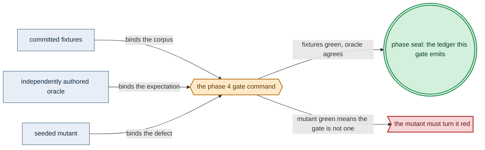

# Phase 4: Gateway-migration model (both branches)

> **Purpose**: Author amoebius's one formal proof obligation — the cross-cluster gateway migration, both the
> `Planned` and `Failover` branches — as a single reifiable `Model`, and discharge it in-process by rendering
> it with `emitTLA`, proving it with TLC, agreeing with io-sim, and reducing it to every `InForceSpec` by a
> decode-time structural-fit fold.
> **Read this if**: phase 4 is next in the queue, or a later phase depends on what its gate establishes.

Phase 4 delivers the gateway-migration model (both branches); its design is owned by [gateway_migration_model_doctrine.md](../documents/engineering/gateway_migration_model_doctrine.md), [backup_recovery_doctrine.md](../documents/engineering/backup_recovery_doctrine.md), [formal_model_doctrine.md](../documents/engineering/formal_model_doctrine.md), and the plan for reaching it is owned here.
Register 1: an in-process battery, no cluster.
The gate passed on 2026-08-09; live daemon/forest correspondence remains UNVERIFIED.

> **Historical result (invalidated).** Any pass, seal, validation, ledger, receipt, or implementation observation
> in the orientation text above is diagnostic only. The Phase Status section and [tracker](README.md) own current state; the
> target contract below remains normative.

Link-graph metadata

**Status**: Authoritative source
**Supersedes**: N/A
**Referenced by**: DEVELOPMENT_PLAN/README.md, DEVELOPMENT_PLAN/overview.md, DEVELOPMENT_PLAN/phase_03_formal_model_kernel.md, DEVELOPMENT_PLAN/phase_47_multicluster_spawn_georepl.md, DEVELOPMENT_PLAN/phase_48_gateway_migration_drills.md, DEVELOPMENT_PLAN/system_components.md, documents/engineering/gateway_migration_model_doctrine.md
**Generated sections**: none

## Contents
- [Phase Status](#phase-status)
- [Phase Summary](#phase-summary)
- [Gate integrity](#gate-integrity)
- [Doctrine adopted](#doctrine-adopted)
- [Sprints](#sprints)
- [Sprint 4.1: Author the `GatewayMigration` `Model` — both branches ✅](#sprint-41-author-the-gatewaymigration-model--both-branches-)
- [Sprint 4.2: `emitTLA` render + TLC exhaustive proof (both branches) ✅](#sprint-42-emittla-render--tlc-exhaustive-proof-both-branches-)
- [Sprint 4.3: io-sim agreement + seeded-mutation catch ✅](#sprint-43-io-sim-agreement--seeded-mutation-catch-)
- [Sprint 4.4: Scope-2 pairwise cutoff + decode-time structural-fit fold ✅](#sprint-44-scope-2-pairwise-cutoff--decode-time-structural-fit-fold-)
- [Documentation Requirements](#documentation-requirements)
- [Related Documents](#related-documents)

---

## Phase Status

⏸️ Blocked pending Phase-3 revalidation — **reopened 2026-08-16 by the natural-architecture amendment.**
[§S](development_plan_gate_integrity.md#s-universal-artifact-hygiene-gate) clause 15 requires a run to record
the natural architecture it proved and to execute no artifact of another. This phase's last gate recorded no
architecture, so its seal is invalidated as a current result and stands only as history; the rerun differs from
it by naming the lane and architecture the run actually used. A sprint marker below records what that sprint achieved before the amendment; under
[§N](development_plan_phase_model.md#n-reopening-and-amending-a-phase) it is a diagnostic, not surviving closure.

**Pre-natural-architecture status record (invalidated where it claims completion):**

Done (invalidated) — resealed 2026-08-15. `python3 tools/gateway_migration_model_gate.py` passed all nine sides: all 12
authored results match, every per-invariant, mechanical, fairness, cutoff, and shared-resource mutant reddens,
34 emitted `.tla`/`.cfg` files remain beneath `.build/**`, 15 surfaces join to 17 run-time items, and the
outside-host inventory and authored roots are unchanged. The project-contained attestation is
`sha256:25c7f79b9a5007e6ee9cf0a0a45886242884a6359f92cf37eae4e610051bd7dd`, bound to source snapshot
`sha256:ab0f84be5f1d3562…`; Phase 4 owns no remaining migration deferral.

**Pre-containment status record (invalidated where it claims completion):**

Done (invalidated) — sealed 2026-08-12. The migrated gate passed against source snapshot `sha256:fa98d6036518a43e…`
(1928 non-ignored files) and published a verified pre-containment external attestation
`sha256:f640ce89ff0bd972746f1b155446e7b54266c946cf4b6b8f3f925073fd74f189`.

**Observed progress — 2026-08-12:** **Policy-conformant.** The capability result is unchanged and re-run: the
explorer and TLC agree on 53 distinct reachable states with identical canonical fingerprints, five safety
invariants hold, three liveness properties hold under the declared fairness and redden without it, and the
per-invariant, mechanical, cutoff-clause, and shared-resource mutant families all turn the gate red. The JVM
and `tla2tools` now resolve from `tools/toolchain_requirements.json`, the twelve recorded metrics are checked
against the authored expectation read off this contract, the ledger is derived from those metrics into
`.build/runs/phase_04/<run-id>/`, and 15 surfaces join to 17 run-time enumerated items.

Two ledger rows that the pre-amendment gate marked `tested` with no recorded metric behind them now name their
evidence: `vacuity-action-antecedent` is decided by the per-invariant mutants reddening **exactly** — which a
vacuously-true invariant cannot do — and `structural-fit-cutoff` by the eight cutoff-clause deletions. The
`decomposition-lemma` row stays UNVERIFIED, because its recorded value is `OPEN` and reporting it otherwise
would be the dishonest reading.

**Invalidated historical record:**

Done (invalidated). The Register-1 gate passed on 2026-08-09 with
`python3 tools/gateway_migration_model_gate.py`, emitting ledger
`dynamically-resolved`. The explorer and pinned TLC
agree on all 53 reachable states and all five safety invariants; TLC proves all three liveness properties under
weak fairness, and each property goes red when fairness is removed. IOSimPOR explored 13 schedules within the
committed bound of 20, all per-invariant and mechanical mutants were caught, the independently authored
StructuralFit reference/corpus passed, all eight clause-delete mutants went red, and the scope-3 shared-resource
stress caught its seeded mutant. This is proven-for-the-model/tested design evidence on substrate `none`; live
daemon/forest correspondence remains **UNVERIFIED**, and the decomposition lemma remains **OPEN**.

## Phase Summary

This phase writes the *one* protocol amoebius proves about itself and checks it every way the design band
allows, before a single real resource exists. amoebius delegates almost every consensus problem to a system
that already discharges it — intra-cluster replicated state to MinIO / Pulsar-BookKeeper / Percona-Patroni,
and single-instance of the control-plane singleton to k8s/etcd (the singleton is a Deployment `replicas=1`
with **no bespoke election**, [`daemon_topology_doctrine.md §3`](../documents/engineering/daemon_topology_doctrine.md#3-the-control-plane-singleton)).
The single residue that no delegated system can cover — because it spans clusters — is the **asynchronous cross-cluster gateway migration**: moving the wild-ingress gateway between clusters and repointing DNS across
geo-replication lag without stranding a live session or admitting two owners. There is **no** First-Axis /
singleton-election obligation; this is the only boundary amoebius model-checks.

Both branches are in scope. The `Planned` coordinated handover (target RPO = 0) and the `Failover`
availability-first emergency takeover (bounded rebind, named-and-capped divergence) are authored as **one**
reifiable Haskell `Model` value — state variables, the guarded `Planned` and `Failover` transitions, and the
five named invariants — from which the Phase-3 `interpret` (the runtime decision core) and `emitTLA` (the
generated, never-committed `.tla`/`.cfg`) are total renderings, so the model↔code correspondence holds by
construction rather than by a hand-maintained table. TLC proves it, io-sim agrees over the same value, and a
decode-time structural-fit fold reduces every accepted spec to the proven scope-2 envelope — TLC is never on
the spec-decode path.

**Substrate:** `none` — no host, no cluster. The gate is an in-process check battery (TLC + io-sim +
explorer), analogous to the Phase-0 documentation lint and the Phase-3 kernel round-trip.

**Lane:** none ([§L](development_plan_standards.md#l-one-substrate-discipline))

**Register:** 1 — pure/golden, in-process, no cluster ([§K](development_plan_standards.md#k-honesty-proven--tested--assumed)).

**Gate:** `cabal test gateway-migration-model-spec` is green: over the one reifiable `GatewayMigration`
model, TLC proves every named safety invariant and every liveness property at scope 2 for both branches,
io-sim agrees on safety, and no seeded mutant survives. Its apparatus is [Gate integrity](#gate-integrity).

## Gate integrity

This section pins the apparatus the Phase-4 gate closes over, in the slot
[§D](development_plan_standards.md#d-the-per-phase-document-skeleton) reserves for it. The gate line above
states the one acceptance condition and delegates here by anchor, which
[§M](development_plan_standards.md#m-gate-integrity-a-gate-cannot-be-passed-by-a-stub) admits and whose
clauses every paragraph below discharges.

### What the gate command runs

`emitTLA` renders the concrete `GatewayMigration` `Model` to a generated, never-committed `.tla`/`.cfg` on
which TLC reaches every named **safety** invariant — `UniqueGatewayOwner`, `SessionAlwaysRebindable`,
`PlannedIsLossless`, `NoWriteAfterStaleFailover`, `NoTakeWithoutProvenFreshness` — with no counterexample,
**and** proves the **liveness** `PROPERTY`s `MergeConverges` / `SessionEventuallyRebinds` /
`PlannedMigrationTerminates` under the declared weak fairness, at bounded scope for **both** the `Planned`
and `Failover` branches. The in-process io-sim / reachability explorer reads the same `Model`'s `interpret`
and agrees on the **safety** predicates; liveness is TLC-only. io-sim explores schedules **exhaustively
within a committed IOSimPOR depth/interleaving bound recorded in the harness and ledger**, not N random
seeds, and the result is labeled **TESTED (bounded-exhaustive schedules)**.

### Vacuity, defined (§M.4)

The run passes its vacuity check only as the conjunction of two committed sub-checks. (a)
*Antecedent-reachability*: every implication-form invariant has its antecedent reached on some enumerated
state — a data-aware `PlannedIsLossless` whose promoted-log clause is exercised, an over-budget path that
reaches `NoWriteAfterStaleFailover`'s guard, and a cold-seed path that reaches
`NoTakeWithoutProvenFreshness`'s `FreshnessWitness` guard. (b) *No dead action*: every declared action,
**including the environment actions `client-write`, `replication-tick`, `active-crash`, and `cold-seed`**
authored in Sprint 4.1, is enabled on some reachable state. An invariant whose antecedent is unreachable, or
whose falsifying mutant below does not exist, fails vacuity. A separate **fairness-sensitivity** check
requires each liveness `PROPERTY` to go red once its fairness annotation is removed.

### The scope-2 pairwise cutoff

The decode-time structural-fit fold's *accepts ⟺ pairwise ∧ independent ∧ acyclic ∧ in-parameter-envelope*
equivalence holds under QuickCheck, the parameter-envelope conjunct co-equal with the graph-shape conjuncts
per doctrine [§5](../documents/engineering/gateway_migration_model_doctrine.md#5-one-and-done-plus-a-per-inforcespec-structural-fit):
each edge's `Failover` data-loss budget ≤ the proven cap, its `dnsRecord` TTL within the modelled TTL regime,
every `ColdSeedFromBackup` edge's `freshnessBound` within the modelled freshness regime the
`NoTakeWithoutProvenFreshness` guard was proven over, and its clusters' offset/log domains within the model
`CONSTANTS`. The predicate deciding **both** axes is **independently authored** (§M.3) and shares no code
with `StructuralFit.hs`, so the equivalence cannot be a tautology. Committed `cover`/`checkCoverage`
thresholds (§M.4) fire each graph violation class, each parameter-out-of-envelope class (over-budget /
TTL-out-of-regime / freshnessBound-out-of-regime / offset-domain-over-`CONSTANTS`), and each over-scope-2
shape at a stated minimum rate. **All eight clause-delete fold-mutants — four graph and four
parameter-envelope — go red** (§M.2). A shared-resource-modeled over-scope stress run has non-dead
shared-resource actions and turns red on its committed seeded shared-resource mutant, and the decomposition
lemma is recorded as an open obligation.

### The mutant catalogue (§M.2)

**Every operator in the mechanical model-mutation family fixed by
[Phase 3](phase_03_formal_model_kernel.md#phase-summary)** is caught on this concrete model. A **committed
per-invariant mutant catalogue** names, for each of the five safety invariants, at least one seeded mutant
violating exactly that invariant and red in all safety instruments — specifically a
`verify-caught-up`-passes-while-offsets-lag mutant caught by the data-aware `PlannedIsLossless`, an
over-budget-divergence mutant caught by `NoWriteAfterStaleFailover`, and a take-without-witness mutant caught
by `NoTakeWithoutProvenFreshness`. Each safety mutant — a transition that drops the fence or decommissions
before `drain-complete` — is red in all instruments; each fairness-drop/liveness mutant, a stall that never
reconverges, is red only in TLC's `PROPERTY`. A single surviving mutant, or any safety invariant with no
committed falsifying mutant, fails the gate.

**Oracle-pinning (§M.1).** The oracles this gate checks against — the `emitTLA GatewayMigration`
byte-for-byte `.tla`/`.cfg` golden (a committed test fixture under `test/golden/formal/`, distinct from the
never-committed emitted `.build/tla/` output), the hand-derived expected reachable-distinct-state fingerprint
set the explorer/TLC run is compared to, and the per-invariant expected-outcome catalogue (which invariant
each seeded mutant must violate) — are **authored and committed in this phase's oracle-pinning sprint,
before the migration model they check exists**, on the same terms
[`phase_03`](phase_03_formal_model_kernel.md#phase-summary) §M.1 pins the `ToyModel`
oracles; a golden regenerated from `emitTLA`'s own output is not a test. Register 1, in-process, substrate
`none`.

*Design intent. Phase 4's gate apparatus; [§M](development_plan_standards.md#m-gate-integrity-a-gate-cannot-be-passed-by-a-stub) owns its clauses.*

## Doctrine adopted

- [`gateway_migration_model_doctrine.md §1`](../documents/engineering/gateway_migration_model_doctrine.md#1-the-one-obligation)
  — *the one obligation*: the cross-cluster gateway migration is the single place a per-system proof
  concentrates on amoebius itself; every intra-cluster consensus and the singleton's single-instance are
  delegated and **not** re-proven, and there is no singleton-election model.
- [`gateway_migration_model_doctrine.md §2` and §3](../documents/engineering/gateway_migration_model_doctrine.md#3-the-model)
  — *the two branches* and *the `Model`*: `GatewayMigration = <Planned | Failover>` is one reifiable value
  whose state variables, guarded transitions, and five named invariants (`UniqueGatewayOwner`,
  `SessionAlwaysRebindable`, `PlannedIsLossless`, `NoWriteAfterStaleFailover`, `NoTakeWithoutProvenFreshness`)
  this phase authors in full.
- [`backup_recovery_doctrine.md §8`](../documents/engineering/backup_recovery_doctrine.md#8-the-gateway-dovetail-seed-from-backup-under-consistency-over-availability)
  — *the gateway dovetail — seed from backup under consistency-over-availability*: the fifth invariant
  `NoTakeWithoutProvenFreshness` generalizes the `Planned` `verify-caught-up` precondition into a
  `FreshnessWitness` guard on the promote / gateway-take transition that a cold backup-seeded standby also
  discharges within its declared `freshnessBound`.
- [`gateway_migration_model_doctrine.md §4`](../documents/engineering/gateway_migration_model_doctrine.md#4-simulate-and-prove)
  — *simulate and prove*: both instruments read the same `Model` — io-sim's `IOSimPOR` scheduler over the
  lifted decision core, and TLC over the `emitTLA`-rendered spec — and a validated model is green in both and
  red in both under a seeded fault.
- [`gateway_migration_model_doctrine.md §5`](../documents/engineering/gateway_migration_model_doctrine.md#5-one-and-done-plus-a-per-inforcespec-structural-fit)
  — *one-and-done, plus a per-`InForceSpec` structural fit*: the protocol is proven once at design time; what
  runs per-spec is a total decode-time structural-fit fold whose **graph** envelope (pairwise / independent /
  acyclic) **and co-equal parameter envelope** (data-loss budget ≤ proven cap, `dnsRecord` TTL in the modelled
  regime, `ColdSeedFromBackup` `freshnessBound` in the modelled freshness regime, offset/log domains within the
  model `CONSTANTS`) together make scope 2 a genuine cutoff, with [§6](../documents/engineering/gateway_migration_model_doctrine.md#6-modelling-bounds-and-honesty) (*modelling bounds and honesty*) supplying
  the one over-scope stress run.
- [`formal_model_doctrine.md §4 — single-source correspondence`](../documents/engineering/formal_model_doctrine.md#4-single-source-correspondence)
  and [`§6 — what a green model-check proves`](../documents/engineering/formal_model_doctrine.md#6-what-a-green-model-check-proves-and-what-it-does-not):
  because `interpret` and `emitTLA` render one value, there is no variable→module table to maintain; a green
  TLC run is *proven-for-the-model at the bound*, generalized only by the stated [§5](../documents/engineering/formal_model_doctrine.md#5-the-tlacfg-are-generated-never-committed) cutoff.
- [`generated_artifacts_doctrine.md §3`](../documents/engineering/generated_artifacts_doctrine.md#3-the-rule) and
  [`conformance_harness_doctrine.md §2 — the registers`](../documents/engineering/conformance_harness_doctrine.md#2-the-registers-as-amoebius-uses-them-for-pre-cluster-validation):
  the emitted `.tla`/`.cfg` are build artifacts, **never committed**, and every check here is Register 1,
  in-process, needing no cluster.

## Sprints

> **Current validation record.** Every sprint is covered by the 2026-08-15 reseal. Historical dates,
> pass/seal claims, repository-resident evidence paths, and `Remaining Work: None` statements below describe
> the pre-amendment capability record only; they do not override current status. Functional and validation
> outcomes remain target requirements. Any instruction to commit generated output, freeze dependency resolution,
> retain a resolved version, path, or integrity hash, or consume repository-resident evidence, ledgers, or
> enumerations is superseded by the current generated-artifact and dynamic-resolution doctrine. Closure requires
> the current phase gate plus universal artifact hygiene.

## Sprint 4.1: Author the `GatewayMigration` `Model` — both branches ✅

**Status**: Done — the capability is re-established by the migrated gate; the sprint's committed-ledger, pinned-toolchain, and repository-resident evidence mechanics are superseded
**Implementation**: `src/Amoebius/Formal/GatewayMigration.hs` (the concrete `Model`
value + its five named invariants), atop the Phase-3
`src/Amoebius/Formal/{Model,Interpret,EmitTLA,Explore}.hs` kernel — built and exercised by the phase gate.
**Blocked by**: none within the phase.
**Independent Validation**: the value typechecks against the Phase-3 `Model` EDSL, and the reachability
explorer enumerates a bounded, non-empty state space visiting both a `Planned` and a `Failover` transition,
with every environment action firing and every implication-form invariant's antecedent materially exercised.
The `### Validation` item below names them.
**Docs to update**: `documents/engineering/gateway_migration_model_doctrine.md`
(Phase-4 status backlink), `documents/engineering/backup_recovery_doctrine.md` (§8 — the `FreshnessWitness`
/ `NoTakeWithoutProvenFreshness` proof at model scope), `DEVELOPMENT_PLAN/system_components.md` (the single
formal `GatewayMigration` `Model` row).

### Objective
Adopt [`gateway_migration_model_doctrine.md §1–§3`](../documents/engineering/gateway_migration_model_doctrine.md#3-the-model):
express the migration as one reifiable value — state variables (per-cluster replication offset/log, gateway
owner, DNS record, migration phase, active branch), the ordered `Planned` guarded actions
(`stand-up-replica → quiesce → drain / verify-caught-up → promote → repoint-DNS → unfreeze → drain-monitor →
decommission`) and the `Failover` guarded actions (promote-survivor → repoint-DNS → bounded-rebind), and the
five named invariants — the fifth, `NoTakeWithoutProvenFreshness`, generalizes the `Planned` `verify-caught-up`
precondition into a `FreshnessWitness` guard on the promote / gateway-take transition that a cold secondary
seeded from backup within its `freshnessBound` also discharges
([`gateway_migration_model_doctrine.md §3`](../documents/engineering/gateway_migration_model_doctrine.md#3-the-model), [`backup_recovery_doctrine.md §8`](../documents/engineering/backup_recovery_doctrine.md#8-the-gateway-dovetail-seed-from-backup-under-consistency-over-availability))
— with **no** singleton-election variable anywhere.

### Deliverables
- The `GatewayMigration` `Model` value in the Phase-3 first-order fragment, both branches expressed as guarded
  parameterized actions, **plus the environment actions `client-write` (accrues a committed write on the active
  owner's log), `replication-tick` (advances a standby's replication offset toward the active's), and
  `active-crash` (the fault that triggers `Failover`)** — so the replication offset/log variables are driven by
  live transitions and neither `PlannedIsLossless` nor `NoWriteAfterStaleFailover` can hold vacuously; all
  actions (control-plane and environment) enter the no-dead-action vacuity check.
- The **safety** invariants encoded as boolean `Expr` (`modelInvariants`): `UniqueGatewayOwner`,
  `SessionAlwaysRebindable`, `PlannedIsLossless` — **data-aware**: the promoted log contains every write
  committed before cutover (cutover reachable only after `verify-caught-up` **and** the promoted offset covers
  every committed write), so a `verify-caught-up`-passes-while-offsets-lag transition violates it —
  `NoWriteAfterStaleFailover` (accrued divergence stays within the declared budget; an over-budget write
  violates it) — and `NoTakeWithoutProvenFreshness` (no cluster takes the wild-ingress role from a data plane
  whose freshness is unproven): the promote / gateway-take action is guarded by a `FreshnessWitness`
  dischargeable by a warm caught-up replica **or** a cold backup-seeded standby proven within `freshnessBound`,
  and a `cold-seed` environment action (populates a standby's log from a backup watermark, never past the
  active's committed offset) drives the seed dynamics so the invariant cannot hold vacuously; a take-without-
  witness transition violates it.
- The **liveness** properties encoded as `Temporal` under a named weak-fairness annotation (`modelFairness` +
  `modelProperties`): `MergeConverges` (`ownerCount ~> ownerCount = 1` after heal), `SessionEventuallyRebinds`,
  and `PlannedMigrationTerminates` (a started `Planned` migration reaches decommission-or-stand-down, so a
  quiesced `ownerCount = 0` stall is not a resting state)
  — the properties a safety invariant cannot express, per
  [`gateway_migration_model_doctrine.md §3`](../documents/engineering/gateway_migration_model_doctrine.md#3-the-model).
- A `modelConstraint` bounding exploration at scope 2 (two clusters, one DNS record).

### Validation
1. The value typechecks against the Phase-3 `Model` EDSL; the explorer visits both branches and enumerates a
   constraint-bounded, non-empty state space; every invariant is well-formed over the declared variables and
   none references an undeclared one; the environment actions `client-write`, `replication-tick`,
   `active-crash`, and `cold-seed` each fire on some reachable state, so the replication-offset/log variables
   carry live dynamics rather than sitting inert; and the `PlannedIsLossless` promoted-log clause, the
   `NoWriteAfterStaleFailover` divergence budget, and the `NoTakeWithoutProvenFreshness` `FreshnessWitness`
   guard are each materially exercised on some reachable state (no inert data variable, no vacuous
   antecedent).

### Remaining Work
None. Both branches, all 20 actions, all five invariants, and all three liveness properties are reachable and
structurally well formed; the correct explorer state space contains 53 states with no safety violation.

## Sprint 4.2: `emitTLA` render + TLC exhaustive proof (both branches) ✅

**Status**: Done — the capability is re-established by the migrated gate; the sprint's committed-ledger, pinned-toolchain, and repository-resident evidence mechanics are superseded
**Implementation**: `test/spec/formal/gateway/GatewayMigrationSpec.hs` (the TLC harness) rendering to
`.build/tla/gateway-migration-model-spec/` (emitted, git-ignored, never committed) and running pinned `tla2tools`
against the byte-locked fixtures in `test/golden/formal/gateway/` — built.
**Blocked by**: none within the phase.
**Independent Validation**: TLC reaches every named safety invariant with no counterexample at scope 2 for
both branches and proves each liveness `PROPERTY` under the declared weak fairness, with the vacuity and
fairness-sensitivity checks passing and no emitted spec under version control.
[Gate integrity](#gate-integrity) defines vacuity; the `### Validation` item below names the observers.
**Docs to update**: `documents/engineering/gateway_migration_model_doctrine.md` (§4 prove row →
proven-for-the-model when green), `documents/engineering/generated_artifacts_doctrine.md` (the emitted
`.tla`/`.cfg` registered as generated).

### Objective
Adopt [`gateway_migration_model_doctrine.md §4`](../documents/engineering/gateway_migration_model_doctrine.md#4-simulate-and-prove)
and [`formal_model_doctrine.md §4`](../documents/engineering/formal_model_doctrine.md#4-single-source-correspondence):
render the one `Model` to a spec via `emitTLA` — a structural walk, never a hand-written `.tla` — and
exhaustively model-check it at the bounded scope, proving both branches reach every invariant.

### Deliverables
- The TLC harness invoking `emitTLA` → git-ignored `.build/tla/GatewayMigration.{tla,cfg}` → `tla2tools`, run
  over both the `Planned` and `Failover` branch scenarios, checking the `INVARIANT`s (safety) and the
  `PROPERTY`s (liveness, under the emitted `WF_`/`SF_` fairness).
- A vacuity assertion — (a) antecedent-reachability of every implication-form invariant (the `PlannedIsLossless`
  promoted-log clause, the `NoWriteAfterStaleFailover` over-budget path, and the `NoTakeWithoutProvenFreshness`
  cold-seed antecedent each reached) and (b) no dead action
  across control-plane **and** environment actions (`client-write`, `replication-tick`, `active-crash`,
  `cold-seed`) — a
  **fairness-sensitivity** assertion (each liveness `PROPERTY` fails with fairness removed), and the
  scope-bound `CONSTRAINT` carried through from the `Model` on the **safety** runs only — the **liveness**
  `PROPERTY` runs instead finitize the model via `CONSTANTS` and finite, saturating variable domains and run
  **`CONSTRAINT`-free**, since a state `CONSTRAINT` truncates the behaviour graph and distorts `WF`/`SF`
  enabledness, admitting a spurious green liveness within the bound
  ([`formal_model_doctrine.md §6`](../documents/engineering/formal_model_doctrine.md#6-what-a-green-model-check-proves-and-what-it-does-not)).
- A committed-artifact scan proving no emitted `.tla`/`.cfg` under `.build/` is versioned (the committed Phase-0
  golden fixture under `test/golden/formal/` is exempt).

### Validation
1. TLC is green — every safety invariant and every liveness `PROPERTY` (`MergeConverges`,
   `SessionEventuallyRebinds`, `PlannedMigrationTerminates`), both branches, no counterexample at scope 2 —
   with the vacuity check confirming each invariant non-trivially satisfied and no action dead, and the
   fairness-sensitivity check confirming each liveness `PROPERTY` goes red when its fairness annotation is
   removed, so none was vacuously true. The emitted `.tla`/`.cfg` under `.build/tla/` are absent from version
   control, which a `.gitignore` entry and a committed-artifact scan of `.build/` together confirm.

### Remaining Work
None. TLC and the explorer agree on the exact 53-state fingerprint set; safety and liveness are green, every
action/antecedent vacuity obligation is reachable, and all three fairness-removal checks are red.

## Sprint 4.3: io-sim agreement + seeded-mutation catch ✅

**Status**: Done — the capability is re-established by the migrated gate; the sprint's committed-ledger, pinned-toolchain, and repository-resident evidence mechanics are superseded
**Implementation**: `test/spec/formal/gateway/GatewayMigrationSpec.hs` (the `IOSimPOR` harness over
the lifted `interpret`) and its committed model-mutant catalogue under `test/oracle/formal/gateway/` — built.
**Blocked by**: none within the phase.
**Independent Validation**: `IOSimPOR` and the in-process reachability explorer, both reading the *same*
`Model`'s `interpret`, find no safety violation on the correct model over bounded-exhaustive schedules, and
every mechanical mutant and every entry of the committed per-invariant catalogue is caught. The
`### Validation` item below names the instruments each must redden.
**Docs to update**:
`documents/engineering/gateway_migration_model_doctrine.md` (§4 simulate row → tested-for-design),
`documents/engineering/conformance_harness_doctrine.md` (the Register-1 explorer + io-sim ledger variant).

### Objective
Adopt [`gateway_migration_model_doctrine.md §4`](../documents/engineering/gateway_migration_model_doctrine.md#4-simulate-and-prove)
and [`formal_model_doctrine.md §4`](../documents/engineering/formal_model_doctrine.md#4-single-source-correspondence):
drive the lifted pure decision core against `io-classes`/`IOSimPOR`'s deterministic, partial-order-reduced
scheduler over adversarial interleavings, and demonstrate that both readings of the one value agree — and share
sensitivity to one seeded fault — the operational form of single-source correspondence.

### Deliverables
- The `IOSimPOR` harness asserting the TLC-mirrored **safety** predicates on schedules explored
  **bounded-exhaustively within a committed depth/interleaving bound named in the harness and ledger** (not N
  random seeds) for both branches, labeled **TESTED (bounded-exhaustive schedules)** — io-sim and the explorer
  cover safety only; liveness is a TLC-only verdict ([`formal_model_doctrine.md §3`](../documents/engineering/formal_model_doctrine.md#3-two-total-renderings)).
- A **mechanical mutation set** over the `GatewayMigration` fragment, not two hand-picked strawmen: the
  operator family (guard negation/weakening, effect swap, dropped effect entry/`UNCHANGED`, quantifier flip,
  fairness drop, invariant-clause delete) is applied exhaustively, and **every** generated mutant must be
  caught — each **safety** mutant (e.g. drop the fence / decommission before `drain-complete`, reaching the
  illegal state) red in TLC, io-sim, and the explorer; each **fairness-drop/liveness** mutant (e.g. a
  stall/livelock that reaches no illegal state but never reconverges) red only in TLC's `PROPERTY` — a single
  surviving mutant fails the gate, demonstrating the liveness check catches faults the safety instruments miss.
- A **committed per-invariant mutant catalogue** (§M.2), pinned before the correct `Model` is finalized: for
  **each** of the five safety invariants (`UniqueGatewayOwner`, `SessionAlwaysRebindable`, `PlannedIsLossless`,
  `NoWriteAfterStaleFailover`, `NoTakeWithoutProvenFreshness`) at least one named committed mutant that violates
  **exactly** that invariant and
  is red in TLC, io-sim, and the explorer — including the `verify-caught-up`-passes-while-offsets-lag mutant
  (must go red under the data-aware `PlannedIsLossless`), the over-budget-divergence mutant (must go red
  under `NoWriteAfterStaleFailover`), and the take-without-witness mutant (must go red under
  `NoTakeWithoutProvenFreshness`); a safety invariant with no committed falsifying mutant fails the gate, so
  no guarantee can pass vacuously.
- An assertion that the correct model is green in all instruments; each safety mutant (generic and
  per-invariant) is red in all three; the liveness mutant is red in TLC and (correctly) not flagged by the
  safety-only instruments.

### Validation
1. io-sim and the explorer assert the same safety predicates the TLC invariants name and find no violation on
   the correct model (schedules explored bounded-exhaustively within the
   committed IOSimPOR depth/interleaving bound named in the harness and ledger, not N random seeds);
   **every** mutant of the mechanical mutation set **and every entry of the committed per-invariant mutant catalogue** is caught — each safety mutant red in TLC + io-sim +
   explorer, each fairness-drop/liveness mutant red in TLC's `PROPERTY` (and not spuriously flagged by the
   safety-only instruments); a safety invariant with no committed falsifying mutant fails the gate, so no
   safety invariant can be inert.

### Remaining Work
None. IOSimPOR explored 13 partial-order-reduced schedules within the committed schedule bound of 20; the five
per-invariant mutants violate exactly their named invariant, all five mechanical safety operators are red in
the explorer and TLC, and invariant deletion is caught by the obligation/golden oracle.

## Sprint 4.4: Scope-2 pairwise cutoff + decode-time structural-fit fold ✅

**Status**: Done — the capability is re-established by the migrated gate; the sprint's committed-ledger, pinned-toolchain, and repository-resident evidence mechanics are superseded
**Implementation**: `src/Amoebius/Multicluster/StructuralFit.hs` (the total decode-time fold over an
`InForceSpec` migration graph) and `test/spec/formal/gateway/GatewayMigrationSpec.hs` (the independent envelope
predicate/corpus + over-scope stress run) — built.
**Blocked by**: none within the phase.
**Independent Validation**: a QuickCheck generator over random migration graphs shows the fold **accepts ⟺
pairwise ∧ independent ∧ acyclic ∧ in-parameter-envelope** against an independently authored reference
predicate, under committed coverage thresholds, with all eight clause-delete mutants red, the fold total, and
one shared-resource-modeled over-scope run catching its seeded mutant. The `### Validation` item below
carries the classes and paths.
**Docs to update**: `documents/engineering/gateway_migration_model_doctrine.md` (§5/§6 — the cutoff and the
over-scope stress row), `documents/engineering/formal_model_doctrine.md` (§6 backlink — what scope 2 proves
here).

### Objective
Adopt [`gateway_migration_model_doctrine.md §5`](../documents/engineering/gateway_migration_model_doctrine.md#5-one-and-done-plus-a-per-inforcespec-structural-fit)
and [`formal_model_doctrine.md §6`](../documents/engineering/formal_model_doctrine.md#6-what-a-green-model-check-proves-and-what-it-does-not):
buy the scope-2 cutoff with the DSL shape — the decoder's pairwise / independence / acyclicity guarantee
reduces an N-cluster forest to a set of independent 2-cluster instances — and enforce it per-spec with a fast
total fold, never a per-`InForceSpec` TLC.

### Deliverables
- The structural-fit fold rejecting any spec whose migration graph falls outside the proven envelope, tagged
  with the illegal-state entry it forecloses. **`independent` is defined** (per
  [`gateway_migration_model_doctrine.md §5`](../documents/engineering/gateway_migration_model_doctrine.md#5-one-and-done-plus-a-per-inforcespec-structural-fit))
  as **both** graph-independence (no shared edge/cycle structure across pairs) **and resource-independence** (no
  cluster/survivor reused as active or standby across two DNS records); the fold **rejects cluster-reuse-across- records**, not only edge/cycle structure. Beyond graph shape the fold enforces a **co-equal parameter envelope** ([`gateway_migration_model_doctrine.md §5`](../documents/engineering/gateway_migration_model_doctrine.md#5-one-and-done-plus-a-per-inforcespec-structural-fit)):
  it rejects any edge whose `Failover` data-loss budget exceeds the proven cap, whose `dnsRecord` TTL falls
  outside the modelled TTL regime, whose `ColdSeedFromBackup` `freshnessBound` falls outside the modelled
  freshness regime, or whose clusters' offset/log domains fall outside the model's `CONSTANTS` — so a
  parameter-out-of-envelope spec the scope-2 proof does not cover cannot slip through on graph shape alone. The owning doctrine states the same strict reading and records the
  excluded shared-survivor topology as a deferred obligation gated on the decomposition lemma
  ([`gateway_migration_model_doctrine.md §6`](../documents/engineering/gateway_migration_model_doctrine.md#6-modelling-bounds-and-honesty)).
- A QuickCheck property over random migration graphs asserting **accepts ⟺ pairwise ∧ independent ∧ acyclic ∧ in-parameter-envelope** (equivalence) — the *in-parameter-envelope* conjunct co-equal with the
  graph-shape conjuncts per [`gateway_migration_model_doctrine.md §5`](../documents/engineering/gateway_migration_model_doctrine.md#5-one-and-done-plus-a-per-inforcespec-structural-fit)
  (data-loss budget ≤ proven cap; `dnsRecord` TTL in the modelled TTL regime; every `ColdSeedFromBackup`
  edge's `freshnessBound` in the modelled freshness regime; offset/log domains within the model's
  `CONSTANTS` — the four regime bounds being the Sprint-3.1 model `CONSTANTS`, oracle-pinned in the §M.1
  oracle **and hard-coded in the reference predicate**, never read back from `StructuralFit.hs`) — decided
  for **both** axes against an **independently-authored naive reference predicate** (§M.3) living in
  `test/spec/formal/CutoffSpec.hs`, sharing no code with `src/Amoebius/Multicluster/StructuralFit.hs` or its
  helpers, so the equivalence cannot be a tautology; with committed `cover`/`checkCoverage` thresholds
  forcing each graph violation
  class (multi-active, cyclic, shared-DNS, **cluster-reuse-across-records**), each
  **parameter-out-of-envelope** class (**over-budget, TTL-out-of-regime, freshnessBound-out-of-regime, offset-domain-over-`CONSTANTS`**), and each over-scope-2 graph at a stated minimum rate, so every reject and
  boundary branch actually fires;
  - **Eight** fold-mutation checks (delete pairwise / graph-independence / resource-independence /
    acyclicity clause, **and** delete the budget-≤-cap / TTL-in-regime / `freshnessBound`-in-regime /
    offset-domain-within-`CONSTANTS` clause → each of the eight turns the equivalence red, every parameter
    mutant paired with the graph-identical positive it now wrongly accepts). The resource-independence
    mutant earns its own place because a fold implementing graph-independence alone would otherwise survive
    every other mutant while admitting the shared survivor ([`illegal_state_multicluster.md §3.52`](../documents/illegal_state/illegal_state_multicluster.md#352-a-gateway-failover-graph-reusing-one-cluster-across-two-dns-records));
  - A **committed oracle-pinned corpus** of in-envelope (accepted) and out-of-envelope fixtures, each
    rejected fixture asserting **which** clause it violates — multi-active, cyclic, shared-DNS,
    cluster-reuse-across-records, **and one graph-valid reject per parameter dimension (over-budget, TTL-out-of-regime, freshnessBound-out-of-regime, offset-domain-over-`CONSTANTS`)** — each paired with an
    accepted positive differing only in that one dimension, the four parameter fixtures **graph-identical**
    to their positive so only the parameter clause can be the cause of the reject (§M.8);
  - A committed no-exception totality property forcing the fold to normal form over arbitrary
    (malformed/oversized) graphs (§M.4).
- One over-scope (3-cluster, chained) TLC run that **models the shared resources in** — a survivor reused
  across records, one route53 zone, one Vault — with live contention
  semantics (rate-limited zone-repoint, shared survivor / shared commit log), recorded as the [§6](../documents/engineering/gateway_migration_model_doctrine.md#6-modelling-bounds-and-honesty) stress check,
  with its shared-resource interaction actions each non-dead and one committed seeded shared-resource mutant
  (shared survivor holding two active roles, or the rate-limited zone dropping a repoint) that the run catches
  red — proving the stress model can detect a cutoff violation, not merely fail to express one; the abstracted
  premises (real-time / clock-skew; the MinIO/Pulsar/Patroni lossless delegation; shared-resource independence)
  named as assumptions.
- The **decomposition lemma** recorded as a named, still-open obligation — that the N-instance product refines
  the 2-instance model under the fold's independence predicate — to be discharged by a machine-checked proof
  (TLAPS/Lean) or a shared-resource-modeled scope-3–4 run; until then the cutoff is logged **argued/tested**,
  never *proven* ([`gateway_migration_model_doctrine.md §5`](../documents/engineering/gateway_migration_model_doctrine.md#5-one-and-done-plus-a-per-inforcespec-structural-fit)).

### Validation
1. The fold's **accepts ⟺ pairwise ∧ independent ∧ acyclic ∧ in-parameter-envelope** equivalence holds under
   QuickCheck against the independently-authored
   reference predicate in `test/spec/formal/CutoffSpec.hs` (no code shared with `StructuralFit.hs`), with the coverage thresholds met for **both**
   the graph violation classes and the four parameter-out-of-envelope classes (over-budget, TTL-out-of-regime,
   freshnessBound-out-of-regime, offset-domain-over-`CONSTANTS`) and each of
   the **eight** fold-mutation checks (pairwise / graph-independence / resource-independence / acyclicity clause
   deleted, **and** the budget-≤-cap / TTL-in-regime / `freshnessBound`-in-regime /
   offset-domain-within-`CONSTANTS` clause deleted) turning the equivalence
   red; the committed corpus passes with each rejected fixture — including the four graph-valid parameter
   rejects, each graph-identical to its accepted positive — asserting its specific violated clause; the fold
   is total (no-exception property to normal form over arbitrary graphs); the shared-resource-modeled over-scope
   run has non-dead interaction actions and catches its committed seeded shared-resource mutant red while finding
   no counterexample on the correct model; the decomposition lemma is recorded as an open obligation and the
   cutoff is labelled argued/tested; TLC is never invoked on the per-spec decode path.

### Remaining Work
None for the phase gate. The 1,600-case coverage run and totality property pass; all eight clause-delete
mutants are red under diagnostic equivalence, and the correct scope-3 shared-resource model is green while its
dual-owner mutant is red. The decomposition lemma intentionally remains an open later obligation, so the
cutoff is argued/tested rather than claimed proven.

## Documentation Requirements

**Engineering docs to update (when the gate runs, flip the honest layer, never before):**
- `documents/engineering/gateway_migration_model_doctrine.md` — flip the §4 Model/Simulate rows to
  **proven-for-the-model** (TLC) / **tested-for-design** (io-sim) at green, for both branches; keep the §6
  Register-3 chaos injection against a running forest deferred to the multi-cluster phase.
- `documents/engineering/formal_model_doctrine.md` — record the concrete `GatewayMigration` `Model` as
  authored and validated, with single-source correspondence checked for this model and across the generated
  fragment corpus.
- `documents/engineering/backup_recovery_doctrine.md` — the §8 gateway dovetail: at green, the
  `FreshnessWitness` / `NoTakeWithoutProvenFreshness` proof flips to proven-for-the-model at model scope.
- `documents/engineering/generated_artifacts_doctrine.md` — register the emitted `GatewayMigration.{tla,cfg}`
  as generated, never committed.
- `documents/engineering/chaos_failover_doctrine.md` — the Model → proven-for-the-model, Simulate →
  tested-for-design; Inject stays a Register-3 residue.
- `documents/engineering/conformance_harness_doctrine.md` — the Register-1 explorer + io-sim ledger this gate
  emits (no cluster).

**Cross-references to add:**
- `DEVELOPMENT_PLAN/README.md` — flip the Phase 4 status when the gate passes; link this document.
- `DEVELOPMENT_PLAN/substrates.md` — the Phase-4 `none` gate row.
- `DEVELOPMENT_PLAN/system_components.md` — register `src/Amoebius/Formal/GatewayMigration.hs`, the
  `test/spec/formal/*` TLC + io-sim harnesses, and `src/Amoebius/Multicluster/StructuralFit.hs` as one
  `GatewayMigration` `Model` row; retire any stale separate `CrossClusterFailover`/`SingletonElection` spec
  rows (there is one obligation, both branches, and no election model).
- `DEVELOPMENT_PLAN/phase_47_multicluster_spawn_georepl.md` — backlink: this design-model is the artifact
  whose Register-3 correspondence against the built `Multicluster/*` forest is discharged there, never here.

## Related Documents
- [README.md](README.md) — the live tracker and phase order this document serves
- [development_plan_standards.md](development_plan_standards.md) — the rulebook this document obeys (the design-proof acceptance token: *proven for the model*, never *runtime proven*)
- [overview.md](overview.md) — target architecture and the one-formal-obligation constraint
- [Gateway Migration Model Doctrine](../documents/engineering/gateway_migration_model_doctrine.md) — the one
  obligation, both branches, the `Model`, the cutoff, and the per-`InForceSpec` structural fit
- [Formal Model Doctrine](../documents/engineering/formal_model_doctrine.md) — the one `Model` →
  {`interpret`, `emitTLA`} pattern and single-source correspondence
- [Chaos & Failover Doctrine](../documents/engineering/chaos_failover_doctrine.md) — the Extract→Model→Inject
  methodology and the proven/tested/assumed ledger
- [Conformance Harness Doctrine](../documents/engineering/conformance_harness_doctrine.md) — the Register-1
  in-process explorer + io-sim, no cluster
- [Generated Artifacts Doctrine](../documents/engineering/generated_artifacts_doctrine.md) — why the emitted
  `.tla`/`.cfg` are never committed
- [Daemon Topology Doctrine](../documents/engineering/daemon_topology_doctrine.md#3-the-control-plane-singleton)
  — the singleton is a Deployment `replicas=1`, single-instance delegated to k8s/etcd, no election
