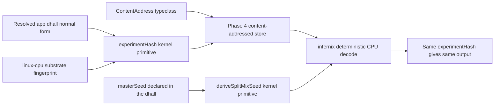

# Phase 5: Determinism kernel + infernix migration

**Status**: Authoritative source
**Supersedes**: N/A
**Referenced by**: README.md, legacy_tracking_for_deletion.md, overview.md, system_components.md
**Generated sections**: none

> **Purpose**: Land the determinism kernel primitives — the `ContentAddress` typeclass,
> `experimentHash = sha256(resolved-dhall ‖ substrate-fingerprint)`, and SplitMix seed derivation —
> then migrate `infernix` onto the amoebius runtime one reversible subsystem at a time and make its
> CPU inference reproducible by construction.

---

## Phase Status

📋 Planned. Determinism kernel primitives + the infernix migration are specified, not started; every
sprint below is design intent and every prescriptive statement is a target shape, not a tested
amoebius result.

## Phase Summary

This phase turns the content-addressed runtime delivered in Phase 4 into a **determinism kernel** and
proves it against a real workload. It does three things, in order:

1. Adds the kernel-level determinism primitives — a `ContentAddress` typeclass that makes an
   artifact's name a total function of its bytes, the `experimentHash` run identity that folds
   *what was asked for* and *where it ran* into one digest, and the SplitMix seed derivation that is
   independent of worker count, scheduling, and assignment.
2. Migrates the sibling `infernix` LLM-inference library onto `amoebius-pulsar`, the content-addressed
   store, and the topology algebra — **one subsystem at a time behind reversible adapter seams**, so
   each cutover can be rolled back independently without a flag-day rewrite.
3. Makes infernix inference **deterministic by construction**: a pinned content-addressed model, a
   pure decode stage, and a request-carried seed, with the substrate folded into identity so that
   same-substrate reproducibility is the honest contract and cross-substrate bit-equality is never
   asserted.

The kernel primitives consume Phase 4's three-tier store (pointers → manifests → blobs), Phase 4's
native Pulsar client, and Phase 4's topology algebra; this phase does not re-implement them. infernix
is treated as evidence that the design is realizable — its working artifact store and `.ready`
staging are a sibling result, not an amoebius proof.

**Substrate:** linux-cpu (§L) — the gate runs an infernix CPU-inference workflow on a single
linux-cpu substrate; no accelerator is in scope here, so cross-substrate behaviour is explicitly out
of contract for this phase.

**Gate:** an infernix CPU-inference workflow is reproducible — running it twice with the same
`experimentHash` on linux-cpu produces byte-identical output, and a deliberately-changed input
(model, request seed, or the resolved `.dhall`) yields a different `experimentHash` and is allowed to
differ. The run emits a proven/tested/assumed ledger artifact recording that same-substrate
reproduction was *tested*, not that cross-substrate equality was claimed.

## Doctrine adopted

- [`content_addressing_doctrine.md` §4 — Determinism by construction: pinned inputs + pure stages + derived seed](../documents/engineering/content_addressing_doctrine.md#4-determinism-by-construction-pinned-inputs--pure-stages--derived-seed),
  with [§3 — `experimentHash`: identity is *what was requested* ‖ *where it ran*](../documents/engineering/content_addressing_doctrine.md#3-experimenthash-identity-is-what-was-requested--where-it-ran),
  [§2 — The three-tier store](../documents/engineering/content_addressing_doctrine.md#2-the-three-tier-store-blobs--manifests--pointers),
  [§4.5 — The three-tier ML-asset lifecycle: engine baked, model staged, kernel JIT'd](../documents/engineering/content_addressing_doctrine.md#45-the-three-tier-ml-asset-lifecycle-engine-baked-model-staged-kernel-jitd),
  and the honest ceiling in [§6 — types make the bookkeeping total, not the physics deterministic](../documents/engineering/content_addressing_doctrine.md#6-the-honest-ceiling-types-make-the-bookkeeping-total-not-the-physics-deterministic):
  this phase implements the three legs (pinned content-addressed inputs, pure stages, derived seed)
  as kernel primitives and instantiates them for infernix decoding, while keeping the contract at
  same-substrate reproducibility and refusing to assert cross-substrate bit-equality.
- [`app_vs_deployment_doctrine.md` §7 — infernix is a shared library; the inference substrate is a deployment rule](../documents/engineering/app_vs_deployment_doctrine.md#7-infernix-is-a-shared-library-the-inference-substrate-is-a-deployment-rule),
  with [§8 — Shared-library use is application logic](../documents/engineering/app_vs_deployment_doctrine.md#8-shared-library-use-is-application-logic):
  this phase realizes infernix as a shared library unified under the DSL (the call graph is app
  logic; *where* inference runs is a deployment rule), migrating it onto the amoebius runtime behind
  reversible adapter seams rather than as a parallel system.
- **Producer→precondition and the training-run topology (doctrine this round introduces; forward design
  intent, not a Phase-5 gate claim).** This round's doctrine adds a **provenance-witness gate** to a serveable
  `ModelArtifact` ([`content_addressing_doctrine.md` §4.5 — The three-tier ML-asset lifecycle: engine baked, model staged, kernel JIT'd](../documents/engineering/content_addressing_doctrine.md#45-the-three-tier-ml-asset-lifecycle-engine-baked-model-staged-kernel-jitd)):
  infernix may serve a model only once it witnesses a **committed producing checkpoint** — the jitML checkpoint
  produced in [Phase 6](phase_06_jitml_ha_coordinator.md) — or a pinned content-addressed import, so a Phase-6
  jitML checkpoint is a **producer→precondition** for the infernix serve path, not merely a shared store entry.
  The same round introduces the **training-run topology** — fine-tune chains and continuous/online feeds
  ([§4.6 — The training-run topology: fine-tune chains and continuous feeds without an unbounded arm](../documents/engineering/content_addressing_doctrine.md#46-the-training-run-topology-fine-tune-chains-and-continuous-feeds-without-an-unbounded-arm));
  infernix consumes the serve gate here (its CPU-inference determinism is unchanged), never the trainer. This is
  doctrine this round introduces, tracked here as a forward cross-reference, not a tested amoebius result of the
  Phase-5 gate.

## Sprints

## Sprint 5.1: ContentAddress typeclass kernel primitive 📋

**Status**: Planned
**Implementation**: `src/Amoebius/Kernel/ContentAddress.hs` (target path; not yet built)
**Blocked by**: Phase 1 (the `dsl-step`/`chain` kernel); Phase 4 (the three-tier content-addressed store)
**Independent Validation**: a property test shows that the typeclass admits no constructor producing a name from a free string — every `ContentAddress` value is reachable only by hashing real bytes — and that two equal payloads derive the identical key.
**Docs to update**: `documents/engineering/content_addressing_doctrine.md`

### Objective

Adopt [`content_addressing_doctrine.md` §2 — The three-tier store](../documents/engineering/content_addressing_doctrine.md#2-the-three-tier-store-blobs--manifests--pointers)
and its totality argument in [§4 — Determinism by construction](../documents/engineering/content_addressing_doctrine.md#4-determinism-by-construction-pinned-inputs--pure-stages--derived-seed):
lift Phase 4's concrete blob/manifest key renderers into a kernel-level `ContentAddress` typeclass so
that the rule that a content-derived name cannot be forged is a single reusable primitive shared by both infernix
and (later) jitML, not a per-store copy.

### Deliverables

- A `ContentAddress a` typeclass whose only key-producing operation is `sha256(canonical-bytes a)`,
  with a canonical encoder requirement so equal logical content yields byte-identical keys.
- Newtyped `BlobSha` / `ManifestSha` carriers with no public constructor from a free `Text`.
- Adapters binding the typeclass to Phase 4's `blobs/<sha256>` and `manifests/<sha256>` writers
  (the `If-None-Match: *`, `412 = success` protocol stays owned by the store).

### Validation

1. Type-level: there is no exported function `BlobSha -> ... ` that fabricates a SHA from an arbitrary
   string; the only path is `contentAddress`.
2. Property: `contentAddress x == contentAddress y` whenever `x` and `y` are logically equal, across a
   randomized canonical-encoding fuzz.

### Remaining Work

The whole sprint.

## Sprint 5.2: experimentHash identity + SplitMix seed derivation 📋

**Status**: Planned
**Implementation**: `src/Amoebius/Kernel/ExperimentHash.hs`, `src/Amoebius/Kernel/Rng.hs` (target paths; not yet built)
**Blocked by**: Sprint 5.1; Phase 1 (substrate detection / substrate fingerprint); Phase 3 (the resolved-`.dhall` normal form)
**Independent Validation**: unit tests prove `experimentHash` is a pure function of `(resolved-dhall, substrate-fingerprint)` and that `deriveSplitMixSeed` returns the same stream seed for a given `(masterSeed, streamIndex)` regardless of how many workers or in what order they are simulated.
**Docs to update**: `documents/engineering/content_addressing_doctrine.md`, `documents/engineering/substrate_doctrine.md`

### Objective

Adopt [`content_addressing_doctrine.md` §3 — `experimentHash`: identity is *what was requested* ‖ *where it ran*](../documents/engineering/content_addressing_doctrine.md#3-experimenthash-identity-is-what-was-requested--where-it-ran)
and the derived-seed leg of [§4 — Determinism by construction](../documents/engineering/content_addressing_doctrine.md#4-determinism-by-construction-pinned-inputs--pure-stages--derived-seed):
implement the two remaining determinism legs as kernel primitives — the run identity that folds the
resolved program and the substrate fingerprint into one digest, and the SplitMix seed derivation that
is independent of worker count, scheduling, and assignment.

### Deliverables

- `deriveExperimentHash :: ResolvedDhall -> SubstrateFingerprint -> ExperimentHash` =
  `sha256(resolved-dhall ‖ substrate-fingerprint)`, consuming the normal form from Phase 3 and the
  fingerprint gathered by full-path subprocess probes (never env/`PATH`), per the substrate doctrine.
- `deriveSplitMixSeed :: SplitMixSeed -> Word64 -> SplitMixSeed` with SplitMix64 mixing and the
  golden-ratio gamma, exposing a per-stream seed reachable only through this total function.
- The store namespace key `<experimentHash>/…` wired so two genuinely different runs (including a
  flipped metric direction or a different substrate) cannot collide.

### Validation

1. `experimentHash` changes when any of: the resolved `.dhall`, the substrate fingerprint, or a metric
   direction changes; it is stable across re-evaluation of the same inputs.
2. A simulated 1-worker vs 100-worker dispatch in arbitrary order seeds stream `37` identically every
   time; no seed reads wall-clock, a worker id, or ambient entropy.

### Remaining Work

The whole sprint.

## Sprint 5.3: infernix as a shared library + reversible store adapter seam 📋

**Status**: Planned
**Implementation**: `infernix/src/Infernix/Adapter/Store.hs`, `infernix/infernix.cabal` (library target; not yet built)
**Blocked by**: Sprint 5.1; Phase 4 (content-addressed store)
**Independent Validation**: with the seam in "amoebius" mode, infernix model staging writes blobs/manifests to the amoebius store and the `.ready` sentinel is written **last**; flipping the seam back to "legacy" mode restores the prior store with no infernix source change, proving reversibility.
**Docs to update**: `documents/engineering/app_vs_deployment_doctrine.md`, `documents/engineering/content_addressing_doctrine.md`

### Objective

Adopt [`app_vs_deployment_doctrine.md` §7 — infernix is a shared library; the inference substrate is a deployment rule](../documents/engineering/app_vs_deployment_doctrine.md#7-infernix-is-a-shared-library-the-inference-substrate-is-a-deployment-rule):
package infernix as a shared Haskell library unified under the DSL (its `.dhall` nests inside the
amoebius `.dhall`), and cut its model store over to the amoebius content-addressed store behind a
**reversible adapter seam** — the first of the one-subsystem-at-a-time migration moves.

### Deliverables

- An `Infernix.Adapter.Store` seam with two interchangeable backends (legacy infernix store ↔ the
  amoebius three-tier store), selectable without editing infernix call sites.
- infernix model staging routed through the seam: weights → `blobs/<sha256>`, a content-addressed
  manifest, and the `.ready` sentinel written last so an `ArtifactRef` is obtainable only from a
  completed staging.
- The infernix library exposing its config as a Dhall record that composes into the amoebius spec
  (shared-library use modeled as application logic).

### Validation

1. End-to-end stage-then-serve in "amoebius" mode: a half-downloaded model has no serveable
   reference; a completed one does.
2. Reversibility: switching the seam to "legacy" and back changes no infernix `.hs` source and leaves
   both stores functional.

### Remaining Work

The whole sprint.

## Sprint 5.4: infernix Pulsar + topology adapter seams 📋

**Status**: Planned
**Implementation**: `infernix/src/Infernix/Adapter/Pulsar.hs`, `infernix/src/Infernix/Adapter/Topology.hs` (target paths; not yet built)
**Blocked by**: Sprint 5.3; Phase 4 (native Pulsar client + topology algebra)
**Independent Validation**: an infernix inference request/response round-trips over `amoebius-pulsar` (native TCP binary protocol, no WebSockets) through the seam, and the topology seam expresses infernix's topics via the amoebius topology algebra; each seam reverts independently to its legacy backend with no infernix source change.
**Docs to update**: `documents/engineering/app_vs_deployment_doctrine.md`

### Objective

Adopt [`app_vs_deployment_doctrine.md` §8 — Shared-library use is application logic](../documents/engineering/app_vs_deployment_doctrine.md#8-shared-library-use-is-application-logic):
complete the migration by cutting infernix's transport and topic lifecycles over to `amoebius-pulsar`
and the topology algebra — again **one subsystem at a time behind reversible seams** — so infernix's
call graph (app logic) rides amoebius's runtime while its placement stays a deployment-rules decision.

### Deliverables

- An `Infernix.Adapter.Pulsar` seam carrying infernix inference events over the native Pulsar client,
  preserving at-least-once + dedup semantics (determinism applies to the durable body only; broker
  ids/timestamps are never hashed).
- An `Infernix.Adapter.Topology` seam expressing infernix's topics in the amoebius topology algebra.
- A documented cutover order (store → pulsar → topology) where each seam is independently reversible,
  so a regression in one subsystem does not force rolling back the others.

### Validation

1. A request/response inference round-trip completes over `amoebius-pulsar` with no WebSocket path.
2. Each seam, toggled to its legacy backend and back, leaves infernix source unchanged and the system
   functional — the reversibility invariant holds per subsystem.

### Remaining Work

The whole sprint.

## Sprint 5.5: deterministic-by-construction CPU inference + reproducibility gate 📋

**Status**: Planned
**Implementation**: `infernix/src/Infernix/Inference/Deterministic.hs`, `test/dhall/phase_05_infernix_repro.dhall` (target paths; not yet built)
**Blocked by**: Sprint 5.2; Sprint 5.3; Sprint 5.4
**Independent Validation**: a `.dhall` workflow runs the same infernix CPU inference twice on linux-cpu and asserts byte-identical output for an unchanged `experimentHash`, asserts divergent `experimentHash` for any changed input, and emits a proven/tested/assumed ledger artifact.
**Docs to update**: `documents/engineering/content_addressing_doctrine.md`

### Objective

Adopt [`content_addressing_doctrine.md` §4.5 — The three-tier ML-asset lifecycle: engine baked, model staged, kernel JIT'd](../documents/engineering/content_addressing_doctrine.md#45-the-three-tier-ml-asset-lifecycle-engine-baked-model-staged-kernel-jitd)
and the honest ceiling in [§6 — types make the bookkeeping total, not the physics deterministic](../documents/engineering/content_addressing_doctrine.md#6-the-honest-ceiling-types-make-the-bookkeeping-total-not-the-physics-deterministic):
wire the three determinism legs through an infernix CPU decode — a pinned content-addressed model, a
pure decode stage, and a request-carried seed (greedy or seeded sampling, never ambient entropy) —
and prove same-substrate reproducibility as the phase gate without overclaiming cross-substrate
equality.

### Deliverables

- A pure infernix CPU decode stage taking a content-addressed model, a request, and a derived seed,
  with all I/O at the interpreter boundary.
- The gate `.dhall` (`test/dhall/phase_05_infernix_repro.dhall`) that spins up the workflow, runs the
  inference twice, tears down, and compares outputs by `experimentHash`.
- A ledger artifact recording: identity/seed totality as **proven-in-types**, same-substrate
  reproduction as **tested on linux-cpu**, and cross-substrate bit-equality as **explicitly not
  asserted** — matching the doctrine's proven/tested/assumed table.

### Validation

1. Two runs with the same `experimentHash` on linux-cpu produce byte-identical output.
2. Changing the model, the request seed, or the resolved `.dhall` produces a different
   `experimentHash`; the run is allowed to differ and does not collide in the store namespace.
3. The ledger artifact is emitted and marks no cross-substrate claim green.

### Remaining Work

The whole sprint.

## Documentation Requirements

**Engineering docs to update:**
- `documents/engineering/content_addressing_doctrine.md` — when the kernel primitives ship, the §6
  proven/tested/assumed table gains an amoebius-tested linux-cpu reproducibility datapoint alongside
  the existing sibling-evidence rows (status is recorded here in the plan, never as doctrine status);
  add the kernel module paths to its "what this doctrine does not own / owners" cross-reference set.
- `documents/engineering/app_vs_deployment_doctrine.md` — §7/§8 gain a concrete amoebius reference:
  infernix's adapter-seam module paths as the realized "shared library unified under the DSL"
  classification.
- `documents/engineering/substrate_doctrine.md` — record that the linux-cpu substrate fingerprint
  consumed by `experimentHash` is exercised here, gathered by full-path probes with no env/`PATH`.

**Cross-references to add:**
- README.md — link the Phase 5 row to this document and mark the gate status as it progresses.
- system_components.md — add the kernel determinism modules
  (`ContentAddress`/`ExperimentHash`/`Rng`) and the infernix adapter seams to the component
  inventory.
- substrates.md — add the Phase 5 → linux-cpu row to the per-phase substrate map.

## Related Documents

- [README.md](README.md) — the live tracker; Phase 5 objective, gate, and substrate
- [development_plan_standards.md](development_plan_standards.md) — the rulebook this document obeys
- [overview.md](overview.md) — target architecture and constraints
- [system_components.md](system_components.md) — target component inventory (kernel + infernix module paths)
- [substrates.md](substrates.md) — substrate registry and per-phase map
- [Content Addressing & Determinism Doctrine](../documents/engineering/content_addressing_doctrine.md) — the determinism mechanism this phase implements
- [Application Logic vs Deployment Rules Doctrine](../documents/engineering/app_vs_deployment_doctrine.md) — infernix as a shared library; inference substrate as a deployment rule
- Earlier phase: Phase 4 — Native Pulsar client + content-addressed store + workflow-runtime (the store/transport/topology this phase consumes)
- Next phase: Phase 6 — jitML migration + HA coordinator (the second shared library onto the same kernel)
