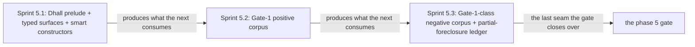

# Phase 5: Dhall Gate-1 schema + smart-constructor prelude

> **Purpose**: Stand up the typed Dhall DSL surfaces and their smart-constructor prelude so that Gate 1 — the
> Dhall typechecker — accepts every positive fixture and rejects every Gate-1-class illegal spec at authoring
> time, before any amoebius binary exists.
> **Read this if**: phase 5 is next in the queue, or a later phase depends on what its gate establishes.

Phase 5 delivers the Dhall Gate-1 schema + smart-constructor prelude; its design is owned by [dsl_doctrine.md](../documents/engineering/dsl_doctrine.md), [resource_capacity_doctrine.md](../documents/engineering/resource_capacity_doctrine.md), and the plan for reaching it is owned here.
Register 1: an in-process battery, no cluster.
The complete Gate-1 gate passed on 2026-08-09; Gate-2 semantics and runtime fidelity remain UNVERIFIED.

> **Historical result (invalidated).** Any pass, seal, validation, ledger, receipt, or implementation observation
> in the orientation text above is diagnostic only. The Phase Status section and [tracker](README.md) own current state; the
> target contract below remains normative.

Link-graph metadata

**Status**: Authoritative source
**Supersedes**: N/A
**Referenced by**: DEVELOPMENT_PLAN/README.md, DEVELOPMENT_PLAN/overview.md, DEVELOPMENT_PLAN/phase_06_gadt_decoder_gate2.md, DEVELOPMENT_PLAN/phase_07_illegal_state_corpus.md, DEVELOPMENT_PLAN/system_components.md
**Generated sections**: none

## Contents
- [Phase Status](#phase-status)
- [Phase Summary](#phase-summary)
- [Gate integrity](#gate-integrity)
- [Doctrine adopted](#doctrine-adopted)
- [Sprints](#sprints)
- [Sprint 5.1: Dhall prelude + typed surfaces + smart constructors ✅](#sprint-51-dhall-prelude--typed-surfaces--smart-constructors-)
- [Sprint 5.2: Gate-1 positive corpus ✅](#sprint-52-gate-1-positive-corpus-)
- [Sprint 5.3: Gate-1-class negative corpus + partial-foreclosure ledger ✅](#sprint-53-gate-1-class-negative-corpus--partial-foreclosure-ledger-)
- [Sprint 5.4: The shared `SecretRef` union and the plaintext-secret negative ✅](#sprint-54-the-shared-secretref-union-and-the-plaintext-secret-negative-)
- [Documentation Requirements](#documentation-requirements)
- [Related Documents](#related-documents)

---

## Phase Status

✅ Done — resealed 2026-08-17 on the amended contract. `python3 tools/dhall_gate1_schema_gate.py` passes all
ten sides on substrate `none`, lane `none`, natural `arm64`, untranslated: the whole Gate-1 battery is green,
all 18 authored metrics equal their expected values after canonical Dhall normalization, every
field-deletion, type-substitution, special-resource, and custom-arm mutant reddens, generated results stay
beneath `.build/**`, and 18 surfaces join completely to 21 enumerated items. The run left no authored path
created, changed, or removed, and published attestation
`sha256:33e2d6750c7ad3d71c8c1902480e2f736253de8892f3c3acac94e2ff89564ed5`.

**The rerun found a defect the previous seal could not have caught.** `tools/dhall_gate1.py` read its oracle
from `tests/oracle/gate1/` — a directory this repository has never had under that name. Every oracle-backed
check therefore died at the first `FileNotFoundError` rather than comparing anything, and the battery's exit
status was the only thing standing between that and a green board. The root is now
`test/oracle/dhall_gate1_schema/`, which is where the eighteen authored oracle files actually live, and the
eighteen metrics are compared rather than skipped.

**Opened 2026-08-17** when the preceding phase resealed; **reopened 2026-08-16 by the natural-architecture amendment.**
[§S](development_plan_gate_integrity.md#s-universal-artifact-hygiene-gate) clause 15 requires a run to record
the natural architecture it proved and to execute no artifact of another. This phase's last gate recorded no
architecture, so its seal is invalidated as a current result and stands only as history; the rerun differs from
it by naming the lane and architecture the run actually used. A sprint marker below records what that sprint achieved before the amendment; under
[§N](development_plan_phase_model.md#n-reopening-and-amending-a-phase) it is a diagnostic, not surviving closure.

**Pre-natural-architecture status record (invalidated where it claims completion):**

Done (invalidated) — resealed 2026-08-15. `python3 tools/dhall_gate1_schema_gate.py` passed all nine sides after canonical
Dhall normalization: all 18 authored metrics match, every field-deletion, type-substitution, special-resource,
and custom-arm mutant reddens, 18 surfaces join to 21 run-time items, and generated results, host inventory,
and authored roots remain contained and unchanged. The project-contained attestation is
`sha256:4a315c09a5250c2c35e9461cee0a3390fbfa4e0afa969333c4c483c931c0eb85`, bound to source snapshot
`sha256:1cd60cf72d7ad324…`; Phase 5 owns no remaining migration deferral.

**Pre-containment status record (invalidated where it claims completion):**

Done (invalidated) — resealed 2026-08-13 after the secrets amendment, attestation
`sha256:e08489a637b107c5da2770a1b7265d526705963bcd321f8c93b330311c6469e9`.

**What the reseal added.** `dhall/amoebius/SecretRef.dhall` is the shared three-arm union — `Vault`,
`TransitKey`, `Prompt`, and no inline-value arm — with a `Sensitive` record giving a sensitive field its type.
Its arms are pinned in the independent arm-inventory oracle, so an escape arm is caught by a table authored
away from the schema. A new secret-policy negative differs from its paired positive in exactly one place, a
literal where a reference belongs, and fails `dhall type` against a committed golden. The oracle moved from 17
schema modules to 18 with its reviewed inventory extended beside it, and the enumeration carries a
`secret-reference-policy` surface joined to that negative's metric.

**Reopened 2026-08-13.** This phase was Done (invalidated), sealed 2026-08-12 against source snapshot
`sha256:81c596c46e9c8772…` with attestation
`sha256:00bfda42ed8e2ddc333713e05262a92f41d9bc76b2dad1219202e12099a9c019`. That seal is invalidated by a
scope amendment, not by a defect in the run: Gate 1 must now admit a `SecretRef` and give a `Text` in a
sensitive field no inhabitant
([vault_pki_doctrine.md §3](../documents/engineering/vault_pki_doctrine.md#3-the-secretref-contract-a-name-never-a-value)).
That adds an authored module to the Gate-1 corpus, which moves this phase's `schema-modules` oracle and its
reviewed module inventory — the gate's own count changes, so the gate changes
([§N](development_plan_standards.md#n-reopening-and-amending-a-phase)). The
[one-binary-many-roles amendment](README.md#the-2026-08-17-one-binary-many-roles-amendment) moves it a second
time, for `dhall/amoebius/Role.dhall`: the role union lives inline and **anonymous** in `Image.dhall` today,
and `union_arms` resolves types by their `let` binding, so `arm_inventory.csv` pins none of its arms — a fifth
could be added and no gate would notice. Extracting the module is what makes them pinnable. `schema-modules`
becomes 19, the sorted inventory string gains the module, and `arm_inventory.csv` gains the rows for
`Process`, `InClusterRole`, and `WorkerKind`. The `Image,ContainerProcess,AmoebiusRole|BakedService` row is
**unchanged** — the top-level union keeps its two arms; what changes is what the `AmoebiusRole` arm carries.
A union-only module adds no fields, so `resource_fields.csv`, `surface_fields.csv`, and the mutant counts are
untouched.

**This gate cannot run today, for an unrelated reason.** `tools/dhall_gate1.py:21` resolves its oracle to
`tests/oracle/gate1`; the tree has `test/oracle/dhall_gate1_schema/`. Both halves of the path are wrong, and
they are read at run time, so the gate fails before its first check — which also means the seal above was
recorded against a path that has since moved. Fixing the constant is this phase's, and is tracked in
[`legacy_tracking_for_deletion.md`](legacy_tracking_for_deletion.md#one-binary-many-roles--2026-08-17).

**Why the type lands here and not in Phase 33.** Phase 34 builds Vault; Gate 1 is *this* phase's boundary.
"A production config cannot express a secret value" is a statement about the typechecker, and putting it in
the phase that happens to need it first would leave Phases 5 and 6 claiming a complete Gate-1/Gate-2
admission boundary that a later phase quietly completes — the forward dependency
[§E](development_plan_standards.md#e-one-canonical-phase-model) forbids. Reopening is the cheaper honesty:
this is a pure Register-1 gate.

**Remaining work.** None. Sprint 5.4 discharged the amendment and the gate is green on all eight sides.

**Invalidated seal — historical record:**

**Observed progress — 2026-08-12:** **Policy-conformant.** The Gate-1 capability result is unchanged and
re-run: four positive fixtures typecheck, eight catalog, three image/process, and two import-policy negatives
each fail at their own specific error, the arm, surface-field, and resource-field inventories match their
authored expectations exactly, and the 525 field-deletion, 176 type-substitution, four special-resource, and
one custom-arm mutants all turn the battery red. `dhall` now resolves from `tools/toolchain_requirements.json`, the
run bundle replaces the plan-tree evidence directory, the ledger is derived into that bundle, and 17 surfaces
join to 20 run-time enumerated items. The battery no longer reads back a generated Markdown ledger from the
plan tree to confirm its own honesty caveat — that reasoning is authored prose and lives in this contract,
while the machine-checkable half is the `gate2-residue` metric — and its hard-coded `dhall` fallback path is
replaced by a hard failure when the resolver has not supplied one.

**Two authored inputs were corrected, both from intent rather than from a failing run.**
`dhall/amoebius/SanctionedApi.dhall` and `dhall/amoebius/UiOffline.dhall` were not `dhall lint` clean, which
this phase has always required; both are now normalized, and the change is pure formatting — list collapsing
and record punning. Separately, the `schema-modules` oracle read 14 while the tree holds 17, because Phase 19
added `SanctionedApi`, Phase 30 added `BakeCatalog`, and Phase 28 added `UiOffline`. A bare count is a weak
oracle that drifts silently as later phases grow the schema, so it is amended to 17 **and** paired with a new
`schema-module-inventory` metric carrying the reviewed module list — a module added without review now breaks
the inventory instead of sliding past a number
([§M.1 amendment](development_plan_standards.md#m-gate-integrity-a-gate-cannot-be-passed-by-a-stub)).

**Invalidated historical record:**

Done (invalidated). The Register-1 gate passed on 2026-08-09 with `python3 tools/dhall_gate1_schema_gate.py`, emitting ledger
`dynamically-resolved`. Fourteen schema modules are
`dhall type`/`dhall lint` clean; all four representative positives type-check; all eight catalog negatives
and three image/process negatives fail for their byte-locked normalized structural reason. Both import-policy
negatives and twelve constructor-misuse fixtures are red. Independent oracles pin 57 closed unions, 525
required fields, and 176 critical nested type bindings; all field-deletion/type-substitution mutants, four
special resource/transition mutants, and the extra-`Custom` arm mutant are red. This proves the recorded
Gate-1 spec-composition shapes only. Gate-2 refinements, binding/index equality, capacity arithmetic, and
runtime fidelity remain **UNVERIFIED**. The former generated projection is
`ledgers/phase_05_gate1.md`; it is migration input, not current evidence.

## Phase Summary

This phase delivers the first of the DSL's typed spec gates as an in-process, authoring-time proof. It stands
up the Dhall prelude and the typed record/union surfaces — the cluster spec, the app spec, and the
deployment-rules surface — as *data that carries parameters, not logic*, and exposes them only through a
**smart-constructor vocabulary**: a lexicon with no illegal words, in which a whole class of illegal cluster
states has no syntax an author could write. Gate 1 is the Dhall typechecker itself: an expression that does
not match its declared schema simply does not type-check, and the check fires entirely before the amoebius
binary runs — in the operator's editor, in `dhall type`, in CI. The phase assembles the positive corpus that
type-checks and the Gate-1-class negative corpus that fails `dhall type`, and records the honest limit that
binding- and index-shaped foreclosures get only *partial* teeth here (smart-constructor convention) and their
real teeth at the Haskell GADT decoder in Phase 6. This is a **Register 1** (pure/golden, in-process, no
cluster) gate, analogous to the Phase 0 documentation lint: it exercises the `dhall` typechecker over a text
corpus and touches no infrastructure.

**Substrate:** none — no host, no cluster; the gate is an in-process `dhall type` battery over the fixture
corpus.

**Lane:** none ([§L](development_plan_standards.md#l-one-substrate-discipline))

**Register:** 1 — pure/golden, in-process, no cluster ([§K](development_plan_standards.md#k-honesty-proven--tested--assumed)).

**Gate:** `dhall type` over the Gate-1 corpus is green — every positive fixture type-checks and every
Gate-1-class negative fails at its committed error golden, with no amoebius binary run. The apparatus is
[Gate integrity](#gate-integrity); a bare nonzero exit is not sufficient.

*Orientation. The seams phase 5 builds, in order; [§M](development_plan_standards.md#m-gate-integrity-a-gate-cannot-be-passed-by-a-stub) owns the apparatus. Not run.*

## Gate integrity

The apparatus phase 5's gate closes over, in the slot
[§D](development_plan_standards.md#d-the-per-phase-document-skeleton) reserves for it. Every clause it
discharges is owned by
[§M](development_plan_standards.md#m-gate-integrity-a-gate-cannot-be-passed-by-a-stub).

### Representative set (explicit, §M.7)

The Gate-1-class negative corpus is EXACTLY these eight catalog
entries, one committed `dhall/examples/illegal_*.dhall` fixture each: product-named capability ([§3.12](../documents/illegal_state/illegal_state_capability_messaging.md#312-an-app-that-names-a-product-instead-of-a-capability)),
insecure/backdoor ingress arm ([§3.7](../documents/illegal_state/illegal_state_security.md#37-accidental-insecure--backdoor-ingress)), a workload missing its complete resource envelope ([§3.11](../documents/illegal_state/illegal_state_security.md#311-an-unsafe-workload-no-resource-limits-no-hardened-securitycontext)), unbounded
storage backing ([§3.18](../documents/illegal_state/illegal_state_storage.md#318-unbounded-storage-anywhere)), un-tiered / no-retention topic ([§3.20](../documents/illegal_state/illegal_state_storage.md#320-a-pulsar-topic-without-a-bounded--tiered--retained-lifecycle)), capacity-growth-without-scaling-policy
([§3.21](../documents/illegal_state/illegal_state_storage.md#321-capacity-growth-without-an-amoebius-owned-scaling-policy)), even/zero-server rke2 control plane ([§3.24](../documents/illegal_state/illegal_state_topology.md#324-an-evenzero-server-rke2-control-plane-no-etcd-quorum--split-brain)), and a substrate/topology arm the union does not offer
([§3.14](../documents/illegal_state/illegal_state_topology.md#314-rke2kind-on-a-host-with-no-linux-node-applewindows-without-an-interposed-linux-vm)/[§3.15](../documents/illegal_state/illegal_state_topology.md#315-a-multi-node-kind-cluster-not-on-a-single-linux-host)). The malformed-received-body subcase of the non-CBOR payload entry ([§3.23](../documents/illegal_state/illegal_state_capability_messaging.md#323-a-non-cbor-pulsar-payload)) is a layer-2
decode foreclosure, recorded in the partial-foreclosure ledger as deferred to
[Phase 6](phase_06_gadt_decoder_gate2.md)'s Gate 2; its separate produce-side no-constructor subcase is left
to Phase 7's exhaustive registry-driven corpus. Neither [§3.23](../documents/illegal_state/illegal_state_capability_messaging.md#323-a-non-cbor-pulsar-payload) subcase is counted toward this representative
gate's green. This eight-entry set is the single canonical Gate-1-class membership and supersedes any
shorter parenthetical elsewhere in this doc.

**Import-policy negatives (not counted toward the eight).** Two further committed fixtures,
`dhall/examples/illegal_import_env.dhall` and `dhall/examples/illegal_import_remote.dhall`, pin the
`env:`/remote-import ban of [`dsl_doctrine.md §4`](../documents/engineering/dsl_doctrine.md#4-total-composability)
at this gate: each must fail resolution with a `ForbiddenImport` reason, and each carries the §M.8 paired
positive — the same spec with the import replaced by a frozen local one — which must type-check. They are
policy negatives rather than illegal-state catalog entries, so they are recorded here and excluded from the
representative set's green; the enforcing resolve-and-freeze stage is owned by
[Phase 6](phase_06_gadt_decoder_gate2.md).

**Secret-policy negative (not counted toward the eight).** One further committed fixture,
`dhall/examples/illegal_plaintext_secret.dhall`, pins the typed half of the `SecretRef` contract of
[`vault_pki_doctrine.md §3`](../documents/engineering/vault_pki_doctrine.md#3-the-secretref-contract-a-name-never-a-value):
a sensitive field holding a literal instead of a reference must have no inhabitant. Its §M.8 paired positive
is `dhall/examples/legal_secret_reference.dhall`, which differs in exactly one place and type-checks, and its
golden pins the observed `dhall type` error. Rejecting a literal *value* at decode is Gate-2 surface and
belongs to [Phase 6](phase_06_gadt_decoder_gate2.md); whether the named secret exists is a live question
neither gate can answer, and is owned by
[Phase 34](phase_34_vault_pki.md).

### Paired positive per negative (§M.8 / §M.3)

Each `illegal_*.dhall` is a MINIMAL one-construct mutation of a named committed green positive (its
`legal_*.dhall` sibling): reverting only the single tagged illegal construct yields a fixture that
type-checks. `tools/dhall_gate1_negatives.sh` asserts BOTH directions per fixture — the negative fails
`dhall type` AND its reverted paired positive type-checks — and is red if either direction is violated.

### Specific-reason error goldens (§M.8 / §M.1)

For each negative, a golden `dhall type` error transcript is authored and COMMITTED IN THIS PHASE'S ORACLE-PINNING SPRINT
(`test/oracle/dhall_gate1_schema/<entry>.err`), pinning the failure to name the targeted union/arm/field/record; the
harness is red if the observed `dhall type` stderr does not match its committed golden (a negative that
fails for an unrelated typo/import/field error mismatches and goes red).

### Arm-inventory oracle, independent of the schema (§M.3)

A committed hand-authored catalog table (`test/oracle/dhall_gate1_schema/arm_inventory.csv`, authored in this phase's oracle-pinning sprint from
`illegal_state_catalog`
[§3.12](../documents/illegal_state/illegal_state_capability_messaging.md#312-an-app-that-names-a-product-instead-of-a-capability)/[§3.24](../documents/illegal_state/illegal_state_topology.md#324-an-evenzero-server-rke2-control-plane-no-etcd-quorum--split-brain)/[§3.7](../documents/illegal_state/illegal_state_security.md#37-accidental-insecure--backdoor-ingress),
NOT derived from the schema modules) pins each union's exact arm set; the harness normalizes each shipped
schema module and compares its arm inventory byte-exactly against this table, red on any extra (e.g. a
`Custom : Text` / `Raw : Text` escape arm) or missing arm.

**Canonical CSV rendering convention (§M.1).** `arm_inventory.csv`, `surface_fields.csv`, and
`resource_fields.csv` are authored and compared under one pinned convention, without which a byte-exact
fixture is not writable: UTF-8 without BOM; Unix `LF` line endings with a trailing `LF` on the final row;
one header row naming the columns; rows sorted lexicographically by their full key path under the C locale
(byte order, not locale collation); arms within a row emitted in the union's declaration order; `,`
separator with no surrounding whitespace and no quoting unless a field contains `,`, `"`, or a newline
(then RFC-4180 double-quoting); and **no generated-by stamp, timestamp, path, or run-varying field of any
kind**. "Normalizes" above means exactly this rendering applied to the shipped module's extracted
inventory — no other transformation.

### Resource-shape oracle, independent of the schema (§M.3)

A committed hand-authored `test/oracle/dhall_gate1_schema/resource_fields.csv` pins the recursive field/arm inventory
for `PodResourceVec`, `Resources`, lifecycle-tagged `ContainerEnvelope`, `PodLocalStorageDemand`,
`PodRuntimeMetadataSource`, raw `ExecutionUnitIntent { id, revision, controller, resource }`, with the
closed controller inventory:
- `Deployment { Once|Replicated, Recreate|RollingUpdate{maxSurge,maxUnavailable} }`
- `StatefulSet { Once|Replicated, OnDelete|RollingUpdate NativeSerialPartitionZero }`
- `DaemonSet { selector, OnDelete|RollingUpdate(Surge|Unavailable) }`
- `Job { completions, parallelism, backoffLimit, podRestartPolicy=Never, podReplacementPolicy=Failed,
  terminalRetention }`
- or `HostProcess { Once|PerNode, replacement }`.

The same sprint declares the capacity vocabulary those envelopes are checked against, grouped by what each
group measures:

- **Envelopes** — the closed pod/host-worker `KubeletMappedFileDemand` source/model operands and the closed
  pod/host-worker `ResourceEnvelope` arms.
- **Node and host supply** — `NodeCapacity` including pod slots and driver attach slots,
  `PhysicalHostCapacity`, and `PhysicalDiskPartition { backing, allocatableRawBytes, systemReserve, vmDisks,
  directNodePools, retainedPools, hostCachePools, hostStoragePools }`.
- **Disks and carves** — `DiskParentExtent`; the parent-indexed `NamedDiskCarve parent` arms
  `ExactParentExtent { id, parentBytes } | PresentedUsableExtent { id, requiredUsableBytes, presentation,
  allocation }`; raw `VmDiskCarve { id, presentation : FilesystemPresentation, allocation, guestSystem,
  kubelet }`; `NodeLocalStorageCapacity` including `kubeletMetadataModel`; `NodeFilesystemBacking`; and the
  closed `KubeletFilesystemLayout`.
- **Images** — `ImageArtifact` and `ImageLayer`.
- **Provider templates and quotas** — `ProviderNodeCapacityTemplate`, `ProviderQuota`,
  `NodeRootStorageQuota`, `DurableQuota`, `PerInstanceDiskTemplate`, `ProviderUsableDiskCarveTemplate`,
  `ProviderNodeRootVolumePolicy`, `PerInstanceNodeLocalStorageTemplate`, and the closed
  `PerInstanceKubeletFilesystemLayout`.
- **Accelerator supply** — `PerInstanceAcceleratorOffering` and its template links, concrete
  `CudaDeviceOffering` and links, and `VramShard`/`ShardingPlan`.
- **Build-time demand** — `DeclaredVolumeDemand`, `BuildStageDemand`, and `BuildExecutionEnvelope`.
- **Transition intents** — `PriorProvisionRefSource { deployment, generation, resource = Execution | Volume |
  Registry }`; the required whole-deployment `ExecutionTransitionIntent = FirstDeployment | UpdateFrom
  PriorProvisionRefSource`; and the `StorageMigrationPolicy`/`StorageMigrationIntent`,
  `SchemaMigrationPolicy`/`SchemaMigrationIntent` and
  `RegistryBackendMigrationPolicy`/`RegistryBackendMigrationIntent` pairs.
- **kind and control-plane engines** — `KindEngineDemand`/`KindHostEngineReserve`,
  `KindHostRuntimeStorageDemand`, `EngineSystemReserve`, `EngineProcessEnvelope`, `EngineStorageDemand`,
  `ControlPlaneStorageDemand`, `EtcdLogicalDemand`/`EtcdChurnBudget`, and `WorkerEngineStorageDemand`.
- **Presentation and backing** — `FilesystemPresentation`, `VolumePresentation`, and
  `StorageBacking`/`BackingAllocationPolicy`.
- **Caches and materialized assets** — `InClusterCacheDemand`, `HostCacheDemand`, `CachePopulationDemand`,
  `AssetMaterializationDemand`, and `RegistryStorageIntent` with exact image-digest identities.
- **Vault** — `VaultPersistedObjectDemand`, `VaultAuditDemand`, and `VaultStorageDemand`.
- **Message-bus metadata** — `BookKeeperGeometry` and its fault policy, `BookKeeperLogicalDemand`,
  `ZooKeeperMetadataStoreDemand` with its member/znode/churn operands, and the closed
  `PulsarMetadataStoreDemand = ZooKeeper`.
- **SQL** — `PatroniSqlIntent`, `PatroniLogicalStorageIntent`, and `SqlMutationIntent`.
- **Object store** — `MinioErasureGeometry` and its fault policy, `ObjectStoreBucketNeed`,
  `ObjectStoreDemand`, exact `ObjectStoreObjectId` residents, `ObjectStoreRetentionBudget`,
  `ObjectStoreWriteBudget`, `ObjectStoreMutationAdmission`, the six-arm `ObjectStoreProducerIntent`
  including `ControlPlaneStateObjectDemand` and its closed five entry kinds, `ObjectStoreGatewayIntent`, and
  `ContentStoreLogicalDemand`.
- **Budgets** — the closed `StorageBudget` arms, each with a `StorageBudgetId` and a single owner.
- **Provisioning** — `PulumiExecutionDemand` with its exact deploy/plugin/concurrency/workspace source, and
  `StatefulSetClaimSlot`.
- **Accelerator demand** — `AcceleratorWorkloadSource`, `AcceleratorResidencyDemand`,
  `AcceleratorCoexistencePolicy`, identity-keyed `CudaOwnerDemand`/`MetalOwnerDemand`, the distinct pod and
  host accelerator demand/offering unions, and the closed substrate-indexed `HostRuntimeEnforcement =
  LinuxCgroupV2 | WindowsJobObject | AppleSupervisor` policy.

The authored transition surfaces are the required whole-deployment `FirstDeployment | UpdateFrom` execution
arm (whose ref must carry the `Execution` resource arm), `StorageMigrationIntent { identity, old :
PriorProvisionRefSource, replacement, policy }`, `RegistryBackendMigrationIntent { identity, source :
PriorProvisionRefSource, replacement, policy }`, and `SchemaMigrationIntent`.
`RegistryBackendMigrationIntent.replacement` is a `RegistryStorageIntent`. `PatroniSqlIntent` contains
database/budget/logical-storage/declared-volume/mutation inputs but no `ControllerChildEnvelope`;
`ObjectStoreGatewayIntent` contains only gateway identity and execution-model selection, while binding later
merges producer writer policies. Binder-output `StorageMigrationDemand`, `RegistryStorageDemand`,
`RegistryBackendMigrationDemand`, `SchemaMigrationDemand`, `PatroniSqlDemand`, `ObjectStoreProducerDemand`,
and `ObjectStoreAdmissionGatewayDemand` are absent from Gate 1. No Dhall source field has a `Provisioned*`
type. It requires CPU, memory, per-container runtime-memory and the closed `ReadOnlyRootfs | WritableRootfs
{ allowance }` plus log allowance, explicit bounded disk-backed volumes and access-/persistence-indexed
memory-backed volumes; platform-indexed OCI index, child-manifest, config, and compressed-layer
digest/stored-byte metadata plus snapshot-chain/unpacked-byte metadata and pull/import workspace; and
`NodeLocalStorageCapacity { podEphemeralAllocatable, filesystems, imageStorageModel, imagePullConcurrency,
kubeletMetadataModel }`; every pod carries structural network-attachment and exact container→volume mount
identities in `PodRuntimeMetadataSource`, never a metadata-byte scalar; node capacity also carries positive
allocatable pod slots and driver-scoped attachment slots, while `ProviderNodeCapacityTemplate` carries the
exact `podSlots : ProviderPodSlotPolicy` and `attachableVolumes : Map CsiDriverId ProviderAttachSlotPolicy`
catalog/CNI/CSI-derived fields. The `Managed Eks` surface is exactly `{ account : CloudAccountId,
nodeClasses, quota }`, so provider instance identity and account quota have an authored join key. The
filesystem layout is exactly `Unified | SplitRuntime | SplitImage`, with its required `nodefs`/`imagefs`
carve references and no authorable third pool. Every supported operator/CR arm also requires its versioned
controller descriptor's exact replica/rollout operands, complete child pod resource templates, and child
durable-volume logical/geometry/presentation/backing operands. There is no generic `childPeak`,
resource-free CR, or authorable `ControllerChildEnvelope`; the binder alone expands those source fields into
the private identity-keyed child envelope and webhook execution demand. Globally scoped
`PhysicalDiskBackingId` / `DiskCarveId` fields, VM-disk layout subcarve relationships, and materialized-node
filesystem references preserve the physical debit; the `SplitImage` node/provider arms additionally require
their runtime witness/requirement field; and the exactly-once
`BackingId`/`CacheBackingId`/`HostStorageBackingId` → retained/cache/role-tagged-host-pool → physical-carve
path (including `BuildScratch`); plus class-local disk/carve and accelerator-slot names for reusable
per-instance provider templates, including required `podSlots`, CNI/IP `cniSlots`, and driver-indexed
`attachableVolumes` policies, and `PerInstanceDiskTemplate { id, backing, systemReserve :
ProviderUsableDiskCarveTemplate, carves : NonEmpty ProviderUsableDiskCarveTemplate }`, where every usable
carve template is exactly `{ id, requiredUsableBytes }` and `backing` is `InstanceStore { skuDevice,
provisionedRawBytes, presentation : FilesystemPresentation } | EphemeralRootEbs { policy :
ProviderNodeRootVolumePolicy { volumeType, presentation : FilesystemPresentation, allocation :
BackingAllocationPolicy } }`. `PerInstanceNodeLocalStorageTemplate` independently carries the per-instance
filesystem layout. `provisionedRawBytes` is fixed SKU raw supply; system reserve and layout carves are
mounted-filesystem usable demand and cannot inhabit the same sum. The provider root EBS size is deliberately
absent from Gate 1: provisioning later derives a private rounded request from system plus unique-carve
demand. A private `ProvisionedPerInstanceDiskTemplate` then converts either the instance-store raw supply or
that rounded root request through the pinned presentation to `mountedUsableBytes` before proving the nested
usable-carve fit; neither private field is authorable here. Durable/cache/registry/Vault storage requires
`Block | Filesystem { fsType, overheadModel }` volume presentation, backing allocation positive
`minimumBytes`/`quantumBytes`. VM disks and provider node roots require `FilesystemPresentation`
directly—`Block` is not an arm of either root shape—while raw VM disk carves have no authorable aggregate
bytes and only private checked construction derives their required-usable/provisioned high-water. Exact
catalog-asset cache populations with finite first-miss concurrency, exact registry OCI object sets with
finite upload/failure/GC operands, and bounded Vault persisted-object versions/live leases plus pinned
Raft/audit operands. BookKeeper ensemble/write/ack quorum and journal/index fields plus required positive
`retainedHotBytes`, `openLedgerHeadroom`, `inFlightOffloadBytes`, and `deletionLagBytes` quantities (zero,
omission, and `Optional` forbidden); MinIO data/parity/block/metadata/healing fields; committed object
extents, bounded concurrent/failed write sets, finite positive orphan-GC horizon; the fault-policy bounds
from which complete failure subsets are derived; claim-template slot identity from which provisioning later
derives the uniform max-ordinal debit; accelerator family/profile and CUDA wholesale whole-device count;
exact identity-keyed served-model, training-job, JIT, and library-work sources; equal-keyed structural
residency demands; finite class-based residency/concurrency policy; unsharded/replicated-per-device/sharded
bytes and interconnect; concrete/ template link endpoints and link kind; plus the pod owner `ContainerId`,
CUDA device `rawVram`/mandatory `driverRuntimeReserve`/net `allocatableVram` on both concrete devices and
provider slots, and Apple Metal profile/unified-memory demand to remain distinct. The oracle also requires
every build's non-empty stage graph, per-stage platform/dependencies/runtime CPU/memory reservation+ceiling,
intermediate-byte peak and cache-write delta, named `BuildScratch` backing, named `CacheBudget`/backing, and
separate finite architecture and stage concurrency policies. Every self-managed engine reserve requires its
`KindControlPlane | KindWorker | Rke2Server | Rke2Agent` role, exact role-indexed named process set,
per-process CPU/memory reservation+ceiling, a named system carve, and the corresponding closed storage arm.
Kind and rke2-server control planes require a non-optional `ControlPlaneStorageDemand`: `staticEngineBytes`,
`etcd { backendQuotaBytes, maxWalFiles, retainedSnapshots, maintenance = SerializedSnapshotAndDefrag,
storageModel : EtcdStorageModelVersion, logical : EtcdLogicalDemand { desiredObjects, churn, model } }`,
where `churn` is the sole Event authority and requires `maxEventsPerWindow`, `eventWindow`, `maxEventBytes`,
and `eventRetention`, `audit { maxBytesPerFile, maxBackups, retention }`, and `kubeletRuntimeLogs {
maxBytesPerFile, maxBackups, retention }`, plus `historyRequirement : FiniteDuration`; its
`EngineSystemReserve.storage` also requires the named `DiskCarveId` and that demand. An rke2 agent instead
requires `WorkerEngineStorageDemand { staticEngineBytes, kubeletRuntimeLogs }`; it has no editable empty
control-plane placeholder. `KindEngineDemand` additionally requires non-empty ordinal-indexed kind
node-container runtime + full `NodeCapacity` + in-node reserve, and a distinct host-only engine reserve.
Every durable `DeclaredVolumeDemand` requires its StatefulSet claim slot, `BackingId`, logical bytes, closed
direct/BookKeeper/MinIO geometry owner, and `VolumePresentation`; every volume-producing host/provider
backing arm requires `allocation : { minimumBytes : Quantity Bytes, quantumBytes : Quantity Bytes }`, while
the provider-object `CloudQuota` arm retains its independently bounded object-count plus model-indexed
`Logical | Billed` byte quota. No authorable rounded physical-byte shortcut exists for durable or root
EBS/VM creation; the sole fixed provider-template raw operand is the SKU-pinned
`InstanceStore.provisionedRawBytes`. The gate is red if a field is dropped, merged into an untyped
scalar/map, or supplied by a schema default instead of being required.

### Committed seeded mutant (§M.2)

At least one committed seeded mutant MUST turn the harness red and is
re-run every gate: `test/mutant/dhall_gate1_schema/gate1_capability_custom_arm.dhall` adds a `Custom : Text` arm to `Capability`
(union-arm-addition operator). The gate is invalid if that mutant type-checks the product-named negative or
passes the arm-inventory oracle.

### Resource-field deletion mutants (§M.2)

Committed mutants separately delete `podEphemeralAllocatable`, the filesystem layout, `imageStorageModel`,
`imagePullConcurrency`, `kubeletMetadataModel`, one `PodRuntimeMetadataSource` network/mount identity, one
execution id/revision/ cardinality/replicated-count/per-node-selector/rollout field (including either raw
rolling-progress operand), one accelerator source/workload/residency/coexistence field, mismatch either
coexistence-map domain from the exact source classes, or make sharded totals/ids/count disagree, provider
`podSlots`, provider `cniSlots` and `attachableVolumes`, the `Managed Eks.account : CloudAccountId` join
key, one of `ProviderQuota.maxInstances`/`maxVcpu`/`acceleratorCaps`/`nodeRootStorage`/`durable`, one OCI
index/manifest/config/compressed-layer stored-byte field, one snapshot-chain/unpacked-byte field, provider
root `backing`/presentation, `InstanceStore.provisionedRawBytes`, a
`ProviderUsableDiskCarveTemplate.requiredUsableBytes`, or EBS policy/allocation, a present
`ComputeHeadroomDemand`'s `reason` or `pad` (either alone, since a pad without a justification and a
justification without a pad are both foreclosed), or the `VerticalGrowth` arm's `horizon`,
`PhysicalDiskPartition.allocatableRawBytes`, a `NamedDiskCarve` parent index/arm/geometry field, raw-VM
presentation/allocation/layout, the node-root-storage quota arm, `VolumePresentation`,
`MonitoringWorkBudget.volume.presentation`, backing allocation minimum/quantum, cache population, registry
upload, the required whole-deployment `FirstDeployment | UpdateFrom PriorProvisionRefSource` arm, one
prior-ref deployment/generation/resource field (including the `Execution` arm), any
`StorageMigrationIntent`/`RegistryBackendMigrationIntent`/`SchemaMigrationIntent`/`PatroniSqlIntent`/
`ObjectStoreProducerIntent`/`ObjectStoreGatewayIntent` source field, any of the four
`EtcdLogicalDemand.churn` Event fields, or Vault Raft/audit operands. A committed field-type substitution
mutant replaces a prior ref with a `Provisioned*` record; an implicit/latest-generation execution transition
or an optional transition field is likewise a failure. A duplicate-Event-authority mutant adds a sibling
`events` record; all MUST fail the independent `resource_fields.csv` comparison; an `Optional` or defaulted
replacement is also a failure.

### Oracle-pinning (§M.1)

All goldens, the arm/resource-inventory tables, and the seeded mutant above are
committed in this phase's oracle-pinning sprint before any schema module exists; none is regenerated from the shipped schema's own
output.

This gate is Register 1 (pure/golden, in-process, no cluster). It still emits the [§K](development_plan_standards.md#k-honesty-proven--tested--assumed)
proven/tested/assumed ledger (below), marks binding/index (layer-2/3) foreclosures UNVERIFIED here, and
carries the acceptance token *spec-composition proven*, never *runtime proven*.

## Doctrine adopted

- [`dsl_doctrine.md §2 — Dhall carries params, Haskell carries logic`](../documents/engineering/dsl_doctrine.md#2-two-languages-one-system-dhall-carries-params-haskell-carries-logic):
  the hard split between the two languages. This phase authors the **Dhall data** half — typed, total,
  side-effect-free surfaces that carry the desired world's parameters — deliberately holding back the Haskell
  chain/Step logic that acts on them (that decode-and-act half is Phase 6 and later). The Dhall never "runs";
  it is authored, type-checked, and (from Phase 6 on) decoded.
- [`dsl_doctrine.md §5 — the illegal-state-unrepresentable contract`](../documents/engineering/dsl_doctrine.md#5-the-illegal-state-unrepresentable-contract):
  specifically **Gate 1 — the Dhall typechecker**, stood up here as the authoring-time structural boundary
  of the later `decode → bind/expand → plan/resolve infrastructure → provision → ProvisionedSpec → renderAll` contract. A union with no arm
  for insecure ingress gives no syntax to request it; a record that requires a reference gives no way to
  omit it. Gate 2 (the in-process typed decoder) is deferred to [Phase 6](phase_06_gadt_decoder_gate2.md);
  whole-deployment feasibility and the opaque deployable seal are Phase 12.
- [`illegal_state_catalog.md §1 — Illegal states fail to type-check`](../documents/illegal_state/illegal_state_catalog.md#1-illegal-states-fail-to-type-check),
  [`§2 — the load-bearing limit`](../documents/illegal_state/illegal_state_catalog.md#2-the-load-bearing-limit-a-type-check-proves-the-spec-composes-not-that-the-cluster-enforces-it),
  [`§3 — the catalog`](../documents/illegal_state/illegal_state_catalog.md#3-the-catalog--states-a-valid-spec-cannot-represent),
  and [`§4 — planning ownership`](../documents/illegal_state/illegal_state_catalog.md#4-planning-ownership): the catalog of
  illegal states and the typing techniques that foreclose each, adopted **at the honest foreclosure layer**.
  The layer-1 type-foreclosed entries — closed unions, required fields, no-arm — are discharged at Gate 1
  here; decoder-local checked rejections defer to Phase 6, whole-deployment resource/target checks defer to
  Phase 12's `provision-seal`, and runtime-checked entries defer to the live band. The catalog's [§2](../documents/illegal_state/illegal_state_catalog.md#2-the-load-bearing-limit-a-type-check-proves-the-spec-composes-not-that-the-cluster-enforces-it) limit is
  honored verbatim: *a type-check proves the spec composes, not that the
  cluster enforces it.*
- [`resource_capacity_doctrine.md §3`](../documents/engineering/resource_capacity_doctrine.md#3-the-types-quantity-capacity-demand-budget):
  the one pure resource vocabulary. Gate 1 owns the **presence and closed shape** of every
  `ResourceEnvelope`/`Capacity` declaration; Phases 6, 8, and 9 own normalization, arithmetic feasibility, and
  post-bind provisioning respectively. Explicit declarations here are not a claim that the target has enough
  real capacity. This doctrine carries no Documentation-Requirements doc-sync line here because its honest
  verification layer flips at Phase 8 (capacity arithmetic), not at Gate 1; its absence from the doc-update
  block is therefore intentional.

## Sprints

> **Current validation record.** Every sprint is covered by the 2026-08-15 reseal. Historical dates,
> pass/seal claims, repository-resident evidence paths, and `Remaining Work: None` statements below describe
> the pre-amendment capability record only; they do not override current status. Functional and validation
> outcomes remain target requirements. Any instruction to commit generated output, freeze dependency resolution,
> retain a resolved version, path, or integrity hash, or consume repository-resident evidence, ledgers, or
> enumerations is superseded by the current generated-artifact and dynamic-resolution doctrine. Closure requires
> the current phase gate plus universal artifact hygiene.

## Sprint 5.1: Dhall prelude + typed surfaces + smart constructors ✅

**Status**: Done — the capability is re-established by the migrated gate; the sprint's committed-ledger, pinned-toolchain, and repository-resident evidence mechanics are superseded
**Implementation**:
`dhall/amoebius/{prelude,Cluster,App,Deployment,Capability,Topology,Capacity,Resources,Storage,Retention,Image,Extension,Consistency,Backup}.dhall`
— the typed surfaces and their smart constructors.
**Blocked by**: none within the phase.
**Requires**: `host-floor` — nothing beyond it; the `dhall` this sprint runs is acquired by Phase 1, and
no Haskell skeleton is needed (that arrives with the Gate-2 decoder in Phase 6).
**Independent Validation**: every schema module stands on its own under `dhall type` / `dhall lint`, and its
shipped arm and required-field inventories match the committed oracle tables byte-exactly, so no freeform
escape arm, missing foreclosing field, or collapsed resource axis passes. The numbered `### Validation` list
below names the fixtures and the tables.
**Docs to update**: `documents/engineering/dsl_doctrine.md` (Gate-1 status backlink),
`DEVELOPMENT_PLAN/system_components.md` (DSL schema inventory).

### Objective
Adopt [`dsl_doctrine.md §2/§5`](../documents/engineering/dsl_doctrine.md#5-the-illegal-state-unrepresentable-contract):
stand up the three typed Dhall surfaces (cluster, app-spec, deployment-rules) as *data* carrying parameters
not logic, and expose them only through smart constructors so that Gate 1 — the Dhall typechecker — becomes
an authoring-time boundary that fires before any binary runs.

### Deliverables
- The last three schema modules close doctrine surfaces that no phase previously owned, so each is delivered
  here rather than left absent:
  - `Extension.dhall` carries `ExtensionSpec` with its **mandatory, non-optional**
    `extMonitoring : NonEmpty MonitoringSurface` and the closed `MonitoringSurface` union
    ([`dsl_doctrine.md §8`](../documents/engineering/dsl_doctrine.md#8-the-haskell-extension-dsl--the-constrained-surface-gate-3-admits)),
    so an extension declaring no monitoring has no inhabitant.
  - `Consistency.dhall` carries the PACELC surface
    ([`consistency_pacelc_doctrine.md`](../documents/engineering/consistency_pacelc_doctrine.md)) that
    [Phase 48](phase_48_gateway_migration_drills.md) consumes.
  - `Backup.dhall` carries the closed `BackupPolicy`
    ([`backup_recovery_doctrine.md`](../documents/engineering/backup_recovery_doctrine.md)), cross-cutting
    invariant #23. Phases 0–64 own the *declarable* policy; its live enactment — the put-only credential and
    the copy/verify `Job` — is the named candidate phase in [`later_phases.md`](later_phases.md), so the
    surface is owned rather than merely absent.
- A Dhall prelude and record/union types exposing only *smart constructors* — a vocabulary with no illegal
  words: the **9-arm** no-product `Capability` union (catalog [§3.12](../documents/illegal_state/illegal_state_capability_messaging.md#312-an-app-that-names-a-product-instead-of-a-capability)) — `ObjectStore`, `SecretStore`,
  `MessageBus`, `Sql`, `Identity`, `Observability`, `Registry`, `Edge`, and `InferenceEngine`, the ninth arm
  ([`service_capability_doctrine.md` §4.1](../documents/engineering/service_capability_doctrine.md#41-the-inferenceengine-capability--the-engine-is-target-offering-selected-and-jit-resolved-never-authored));
  eight of the nine are cluster-invariant, `InferenceEngine` is offered where an ML extension provides it, and
  the arm-inventory oracle pins all nine so Phase 11 binds and Phase 13 provisions the same union;
  no-unbounded-arm `StorageBacking` /
  `Growable` (catalog [§3.18](../documents/illegal_state/illegal_state_storage.md#318-unbounded-storage-anywhere)/[§3.21](../documents/illegal_state/illegal_state_storage.md#321-capacity-growth-without-an-amoebius-owned-scaling-policy)); the odd-quorum `Rke2Servers = ⟨Single|Ha3|Ha5⟩` (catalog [§3.24](../documents/illegal_state/illegal_state_topology.md#324-an-evenzero-server-rke2-control-plane-no-etcd-quorum--split-brain)); the
  explicit `Rke2AgentPool = ⟨Fixed|Autoscaled { floor, policy }⟩` and derived
  `NodeSupply = ⟨Fixed (NonEmpty Node)|Elastic { floor, candidates, quota }⟩`;
  mandatory size-triggered `RetentionPolicy` (catalog [§3.20](../documents/illegal_state/illegal_state_storage.md#320-a-pulsar-topic-without-a-bounded--tiered--retained-lifecycle)); and a `Ingress`/route surface with **no**
  insecure/backdoor arm (catalog [§3.7](../documents/illegal_state/illegal_state_security.md#37-accidental-insecure--backdoor-ingress)) — each encoded as a closed union, a required field, or a no-arm shape.
- The **build/image closures** of `dhall/amoebius/Image.dhall`, the same shape applied to the artifact an app
  ships as rather than the spec it is described by: the three-arm `ImageIdentity`
  (`KindNode | Base | Runtime { linked }`) with **no foreign, free-digest, or `Url` arm** (catalog
  [§3.74](../documents/illegal_state/illegal_state_lifecycle.md#374-a-container-image-amoebius-did-not-generate)); the
  `BakeStep` content union with **no `RunShell : Text` arm** (catalog
  [§3.76](../documents/illegal_state/illegal_state_lifecycle.md#376-a-build-stage-whose-content-is-unmodeled)); and the
  required `ContainerProcess` naming what a container executes (catalog
  [§3.75](../documents/illegal_state/illegal_state_lifecycle.md#375-a-container-whose-process-is-unnamed)). Their
  negatives — a spec naming a foreign image, an authored shell fragment, a container with no `process` — must
  each fail `dhall type` at the committed expected error.
- The pure resource declarations of
  [`resource_capacity_doctrine.md §3`](../documents/engineering/resource_capacity_doctrine.md#3-the-types-quantity-capacity-demand-budget):
  unit-tagged quantity fields; `PodResourceVec = { cpu, memory, ephemeralStorage }`; `Resources = {
  requests, limits }`; the optional declared compute headroom `ComputeHeadroomDemand = { reason, pad }` on
  `PodResourceEnvelope` and its `HostComputeHeadroomDemand` mirror on `HostResources`, whose `reason` is the
  closed `⟨VerticalGrowth {horizon}|BurstAbsorption|NeighbourIsolation|DefragmentationReserve⟩` and whose
  `pad` is a `Residualized` vector — required and non-defaultable when the headroom is present, so a pad has
  a stated justification or no constructor at all, exactly as an rke2 agent has no editable empty
  control-plane placeholder.
  - Gate 1 offers **no reserved/padded-total field anywhere**: `requests`, `limits`, and the pad are
    authorable, the reservation they sum to is not, mirroring the deliberately absent authorable rounded
    physical-byte shortcut for durable and root-EBS creation.
  - The `requests + pad ≤ limits` bound and the all-`Zero` pad rejection are cross-field and arithmetic, so
    Gate 1 proves only presence and closed shape and [Phase 6](phase_06_gadt_decoder_gate2.md) refines both;
    raw `ExecutionUnitIntent` with stable id/revision and one kind-specific controller arm; the structural
    `NodeEligibilitySelector = { allOf : Set NodeEligibilityConstraint }`, where the constraint is the
    closed union `EngineRole | ProviderClass | Site | AcceleratorProfile | CarriesTaint` over typed
    inventory handles and has no free-text label-selector/toleration arm.
  - Deployment/StatefulSet carry only `Once | Replicated { desiredReplicas : PositiveNatural }`;
  - DaemonSet carries the selector directly;
  - Job carries positive completions/parallelism, finite backoff, `podRestartPolicy=Never`, a finite
    amoebius terminal-cleanup horizon/model, and `podReplacementPolicy=Failed`;
  - HostProcess carries `Once | PerNode`.
  - Policies are kind-specific as pinned by the field oracle.
  - Dhall preserves Deployment's two `Natural` rolling operands but cannot express their cross-field
    progress invariant;
  - Gate 2 rejects both zero.
  - DaemonSet RollingUpdate is structurally `Surge PositiveNatural | Unavailable PositiveNatural`, and
    StatefulSet uses only native serial partition zero; every deployment rules value carries exactly one
    `ExecutionTransitionIntent = FirstDeployment | UpdateFrom PriorProvisionRefSource`, and the update ref
    retains exact deployment/generation plus the `Execution` resource arm—never `Optional`, implicit
    `latest`, or a prior `Provisioned*` value; `PodRuntimeMetadataSource` with exact network/mount
    identities; the closed accelerator owner family/profile/device-count, exact source/workload maps,
    residency-placement and finite coexistence-policy shapes; the closed `CpuOvercommitPolicy =
    ⟨NoCpuOvercommit|BoundedCpuOvercommit RatioAtLeastOne⟩`; typed durable-volume and cache
    demands/backings; mandatory BookKeeper quorum/fault geometry and `BookKeeperLogicalDemand` whose four
    byte fields are required and positive;
  - MinIO erasure/fault geometry, content-store concurrent/failed-write bounds plus finite positive
    orphan-GC horizon, and StatefulSet claim-slot records from which the private uniform plan is later
    derived; content-digested `ImageArtifact` values carrying OCI index bytes and, per platform,
    child-manifest/config stored bytes, compressed layer bytes, snapshot chain/unpacked bytes, and
    pull/import workspace; `NodeLocalStorageCapacity` carrying logical `podEphemeralAllocatable`, a closed
    `Unified | SplitRuntime | SplitImage` physical-filesystem layout, `NodeImageStorageModelVersion`, finite
    pull concurrency, and `KubeletRuntimeMetadataModelVersion`; `PhysicalHostCapacity` with a non-empty
    physical-partition graph, globally scoped `PhysicalDiskBackingId` / `DiskCarveId` fields, parent-indexed
    `NamedDiskCarve` and nested layout-shaped `VmDiskCarve` relationships whose nodefs/imagefs aliases are
    forced by the chosen arm; a distinct reusable `ProviderNodeCapacityTemplate` whose per-instance
    disk/carve and accelerator-slot names cannot be mistaken for already-materialized global ids; canonical
    exact cache-population, registry publication/rehome intents, six-arm object-producer and gateway
    intents, ZooKeeper metadata, Patroni SQL source intent, volume/schema-transition intents, and Vault
    persisted-object/Raft/audit demands; `VolumePresentation` and backing allocation minimum/quantum; and
    the complete `ResourceEnvelope`; the non-optional `BuildExecutionEnvelope`; and the kind/rke2-node →
    role-indexed `EngineSystemReserve` → `ControlPlane | Worker` storage nesting, including every named
    static process envelope, system-carve reference, and applicable finite history requirement.
  - Gate 1 proves those fields and closed arms are present.
  - Phase 6 refines/normalizes the quantities and preserves the identity graph in opaque, unit-tagged
    values;
  - Phase 8 checks global backing/carve uniqueness, exactly-once reference resolution, `requests ≤ limits`,
    and capacity arithmetic.
  - Kubernetes resource maps, uniform claim-template PVC sizes, cache volumes, and accelerator extended
    resources are later rendered projections of these pure values, never authorable parallel fields.
- An in-file **honesty caveat**: because Dhall has no opaque types, binding- and phantom-index foreclosures
  (catalog [§4.1](../documents/illegal_state/illegal_state_techniques.md#41-pvcpv-binding-by-construction)–[§4.3](../documents/illegal_state/illegal_state_techniques.md#43-gadt-indexed-state-machines--only-legal-transitions-are-typed)) are only *partially* Gate-1-foreclosed by smart-constructor convention and get real
  teeth at the Haskell GADT decoder in [Phase 6](phase_06_gadt_decoder_gate2.md) (Gate 2).

#### Wired surfaces (forecloses detached-ornament stubs)

The three surface records carry the foreclosing types as REQUIRED fields, not as standalone unreferenced
modules:
- `App` demands `caps : List Capability` and storage via `StorageBacking` + `RetentionPolicy`
- every execution-unit record reachable from `App` or `Deployment` is an `ExecutionUnitIntent` requiring
  id/revision, one kind-specific controller/cardinality/ policy arm, and a complete `ResourceEnvelope`, with
  every pod arm carrying a non-empty container list whose every app/sidecar/init/restartable-init member has
  `Resources`, private memory/ephemeral allowances with a closed root-filesystem arm, and a platform-indexed
  digested `ImageArtifact`, a required structural `PodRuntimeMetadataSource`, plus a required
  `PodLocalStorageDemand` whose memory volumes name access modes and stage-local/pod-lifetime persistence
  (from which provisioning derives one reservation carrier per lifecycle epoch), and every in-cluster cache
  referencing one of its disk-backed volume ids, while the host-worker arm carries host CPU/memory
  reservation+ceiling, named local/cache backing, and only host-valid accelerator demand
- every build definition reachable from the deployment/cluster surfaces carries a non-optional
  `BuildExecutionEnvelope` with a non-empty `BuildStageDemand` graph (stage id, target platform, dependency
  ids, `runtime : HostResources`, intermediate-byte peak, and cache-write delta), a named `BuildScratch`
  `HostStorageBackingId`, `cache : HostCacheDemand` (named backing plus `CacheBudget`), and separate `Serial
  | BoundedParallel PositiveNatural` architecture and stage concurrency policies
- no caller-authored terminating-count promise exists
- a raw rolling policy retains both finite operands even when both are zero, and the validation-locus ledger
  assigns that cross-field case to Gate 2 rather than falsely claiming Dhall arithmetic forecloses it
- and `Cluster` demands `Rke2Servers` plus an explicit fixed/autoscaled `Rke2AgentPool` for an rke2 engine,
  `Ingress` for every route, and a node/host inventory whose `Capacity` explicitly declares CPU, memory, and
  `NodeLocalStorageCapacity`: logical pod-ephemeral allocatable remains separate from the physical `Unified
  | SplitRuntime | SplitImage` nodefs/imagefs layout, while the image storage-model version, finite
  pull-concurrency policy, and kubelet/runtime-metadata model are required
- `SplitImage` additionally requires its typed runtime-support field.

Durable/native-host-cache/role-tagged-host-storage backing pools remain disjoint. Its kind engine arm
requires `KindEngineDemand` with non-empty ordinal-indexed node-container runtime, full `NodeCapacity`, and
in-node `KindControlPlane | KindWorker` reserve plus a distinct host-only Docker/containerd/kind-supervisor
reserve. Every rke2 server and fixed/floor agent carries a `Rke2Server` or `Rke2Agent` reserve respectively.
Each reserve has `processes : NonEmpty EngineProcessEnvelope` with the role's required `EngineProcessId`
entries, each with `runtime : HostResources`, plus non-optional `storage.carve : DiskCarveId`.
Kind/rke2-server storage uses `ControlPlaneStorageDemand`, including `staticEngineBytes` and
`historyRequirement : FiniteDuration`; rke2-agent storage uses `WorkerEngineStorageDemand`, including
bounded kubelet/runtime logs. Every autoscaled rke2 candidate carries the template-local equivalent (exact
agent processes, worker-storage demand, per-instance raw host `cpu`/`memory`/disk supply, and system-carve
reference), while a managed- provider candidate carries the distinct no-invented-reserve arm plus a
mandatory `ProviderSkuRef { provider, region, machineType, catalogVersion }`. Every physical host carries a
non-empty partition inventory: each partition has a globally scoped `PhysicalDiskBackingId`,
`allocatableRawBytes` after unmanaged-host reserve but before all amoebius child carves (including its named
system carve), and raw VM-disk carves with presentation/allocation policy, named guest-system, and
layout-shaped kubelet filesystem carves but no editable aggregate byte field; the private provisioner
derives their usable/provisioned high-water. `NamedDiskCarve PhysicalRawExtent` and `NamedDiskCarve
VmGuestUsableExtent` are distinct parent-indexed values; an exact-parent arm supplies bytes already in that
parent's unit, while a presented-usable arm supplies usable intent plus presentation/allocation geometry for
deriving its private parent debit. Direct-node filesystem carves sit beside retained, host-cache, and
purpose-tagged host-storage pools. Only `Unified` aliases nodefs/imagefs; `SplitRuntime` and `SplitImage`
require distinct nodefs/imagefs references, and containerfs is derived from the arm rather than authored as
a third capacity. Those pools carry the typed logical ids consumed by durable/cache/ host-worker/build
demands and their physical `NamedDiskCarve`; build scratch has its own required purpose tag. The globally
scoped ids and all parent/reference edges are required schema fields; their value-level uniqueness,
one-parent ownership, and arithmetic are the Phase-8 fold rather than a dishonest Dhall type claim. The
inventory also carries a closed accelerator offering: CUDA family/wholesale whole-device count, Apple Metal
profile with unified memory charged to host memory, or `None`; every non-None owner demand carries exact
equal-keyed source/workload maps plus structural residency and finite class-based coexistence policy. The
source classes exactly equal both coexistence-map domains; no missing class defaults to zero/serial and no
extra class is accepted. Residency bytes mean total bytes for `Unsharded`/`Sharded` and per-device bytes for
`ReplicatedPerDevice`; sharded bytes sum exactly to the residency bytes, shard ids are unique, and shard
count cannot exceed owner devices. Each CUDA device supply requires stable identity/profile, raw VRAM, a
mandatory driver/runtime reserve, and net allocatable VRAM, and every node capacity also carries the closed
finite CPU-overcommit policy. In-cluster cache is a typed nested consumer of pod ephemeral, never a second
backing pool. Its `CachePopulationDemand` carries exact selected assets, content digests, resident bytes,
temporary bytes, and finite first-miss concurrency. Registry storage similarly carries exact OCI object
kinds/digests/stored bytes plus bounded upload failure/GC operands; Vault carries bounded persisted-object
versions/live leases, its Raft model/claim set, and a rotated audit demand with a named backing. The
`Managed Eks` arm is exactly `{ account : CloudAccountId, nodeClasses : NonEmpty ProviderNodeClass, quota :
ProviderQuota }`. Its `ProviderNodeCapacityTemplate` is exactly `{ allocatableCpu, allocatableMemory,
podSlots, cniSlots, attachableVolumes, localDisks, cpuOvercommit, localStorage, accelerator }`, where
`podSlots` is a `ProviderPodSlotPolicy`, `cniSlots` is a driver-keyed map of `ProviderCniSlotPolicy`,
`attachableVolumes` is a driver-keyed map of `ProviderAttachSlotPolicy`, and `localStorage` is exactly `{
podEphemeralAllocatable, filesystems, imageStorageModel, imagePullConcurrency, kubeletMetadataModel }`. The
non-empty per-instance `localDisks` retain class-local carve references and the closed `accelerator` retains
per-instance accelerator slots/links. Each disk template has exactly one node-root backing: `InstanceStore {
skuDevice, provisionedRawBytes, presentation : FilesystemPresentation }` or `EphemeralRootEbs { policy :
ProviderNodeRootVolumePolicy { volumeType, presentation : FilesystemPresentation, allocation :
BackingAllocationPolicy } }`. It also has `systemReserve : ProviderUsableDiskCarveTemplate` and `carves :
NonEmpty ProviderUsableDiskCarveTemplate`, whose exact shape is `{ id, requiredUsableBytes }`; these bytes
are usable filesystem demand, never raw supply. No raw spec field supplies a root-EBS byte request because
provisioning derives and rounds that private request from system reserve plus the unique carve set. Later
checked construction privately produces one `ProvisionedPerInstanceDiskTemplate`, derives
`mountedUsableBytes` through the instance-store or root-EBS presentation, and only then proves system
reserve plus unique carves fit; Gate 1 contains neither that private conversion result nor a
raw-versus-usable comparison. Each class carries the exact fields `name`, catalog-pinned `sku`,
`allocatable`, `quotaVcpu`, `zones`, `price`, `baseCount`, and `maxCount`. The outer account-bound quota is
exactly `ProviderQuota { maxInstances, maxVcpu, acceleratorCaps, nodeRootStorage, durable }`, where
`nodeRootStorage = NoNodeRootEbs | BoundedNodeRootEbs { bytes, volumeCount }`, `durable = NoDurable |
Bounded { bytes, volumeCount }`, and `acceleratorCaps` is a canonical profile-keyed map (no duplicate rows);
“hostless control plane” is not a capability-less worker pool, and `NoDurable` means zero durable supply
rather than omitted/unbounded capacity. `NoNodeRootEbs` permits only instance-store roots; it is not
durable-volume quota and cannot be debited as one. A class never embeds one concrete global `DiskCarveId` or
`AcceleratorDeviceId` for all future instances: a globally scoped `ProviderInstanceId { account, cluster,
class, ordinal }`, whose `account` is copied unchanged from `Managed Eks.account`, plus the complete
disk/carve/accelerator-slot template path derives distinct promised slots, and provider backing/device ids
attach only when each node materializes. That same `CloudAccountId` exact-joins the
`SharedSupplyLedger.accounts` entry; credentials or provider output cannot invent it. Required fields expose
the later constructor checks: class-local template-id uniqueness, filesystem references and layout aliases,
role bytes within their carve, conversion of instance-store raw supply or the derived ephemeral-root-EBS
request to mounted usable capacity before fitting system reserve plus unique usable carves, and reserved
plus allocatable VRAM within raw VRAM. Their value arithmetic is Phase 8, not a Dhall type claim. Every
`Observability` deployment binding also requires a non-optional finite `MonitoringWorkBudget { maxWorkflows,
maxRules, maxSeries, maxScrapeSamplesPerSecond, evaluationInterval, evaluationCpu, evaluationMemory,
retention, query : QueryWorkBudget { maxConcurrentQueries, maxSeriesPerQuery, maxSamplesPerQuery, maxRange,
timeout, costModel }, volume : { claim : StatefulSetClaimSlot, backing : BackingId, presentation :
VolumePresentation }, tsdbCostModel }`, with positive counts/rate, finite intervals/retention/query bounds,
typed CPU/memory, and an exact StatefulSet claim/backing/presentation; no default, omitted field, scalar
query-temp, or descriptor-independent fixed Prometheus provision is an alternate arm. Non-applicable
resource arms use their closed `None`/empty form; omission of the envelope or capacity declaration itself is
impossible. A committed schema-shape oracle (`test/oracle/dhall_gate1_schema/surface_fields.csv`, hand-authored in Phase
0) pins these required field-name→type bindings; Sprint 5.1 validation compares the shipped record types
against it byte-exactly. The companion `resource_fields.csv` recursively pins every nested resource field
and closed arm, so an envelope containing only CPU/memory, a bucket name without its structural
retention/write demand, a free-standing pair of pod/image byte pools, an image reference without complete
stored-object/snapshot/workspace metadata, a backing without presentation/minimum/quantum, or scalar-only
cache/registry/Vault storage cannot pass.

### Validation
1. `dhall type` and `dhall lint` accept each schema module on its own, every surface type is well-formed, and
   each shipped union's arm inventory matches the committed `test/oracle/dhall_gate1_schema/arm_inventory.csv`
   byte-exactly, so no freeform escape arm survives. Every smart constructor elaborates to a value of its
   declared type, and a smart constructor cannot be applied to an out-of-schema argument
   without a type error — discharged by a named committed fixture set `test/fixture/dhall_gate1_schema/ctor_reject/*.dhall`
   (≥1 expect-fail application fixture per smart constructor, enumerated in the harness manifest), each of
   which MUST fail `dhall type`; this is not discharged by appeal to Dhall function typing alone.
2. The shipped record types match the committed `surface_fields.csv` and `resource_fields.csv` oracles
   byte-exactly (the wiring above), red on any missing required foreclosing field or any dropped/collapsed
   CPU, memory, logical pod-ephemeral/root-filesystem arm, node filesystem layout/model/object/snapshot
   metadata, physical-backing/carve/logical-pool identity, provider account identity, provider
   `podSlots`/CNI-IP `cniSlots`/driver-indexed `attachableVolumes`, all five `ProviderQuota` fields and both storage quota unions,
   provider node-root backing policy, `InstanceStore.provisionedRawBytes`, and
   `ProviderUsableDiskCarveTemplate.requiredUsableBytes`,
   `DeclaredVolumeDemand`/presentation/backing-allocation policy, durable/cache/registry/Vault storage,
   `PhysicalDiskPartition.allocatableRawBytes`, the `NamedDiskCarve` parent index and closed extent arms,
   execution identity/revision/controller-kind-specific
   cardinality/policy operands and the required first-deploy/update-from transition source with exact prior deployment,
   generation, and `Execution` arm,
   `PodRuntimeMetadataSource` or `kubeletMetadataModel`, accelerator source/workload/coexistence domains and
   residency placement, accelerator-count, raw/reserved/net/shard/link VRAM,
   provider-node-class/per-instance-template, per-stage `BuildExecutionEnvelope`, role-indexed named engine-
   process/engine-storage demand, or any `MonitoringWorkBudget` provision including
   `volume.presentation`. The oracle is also red if any Gate-1 field is a `Provisioned*` record, if a
   binder-output migration/SQL/object-gateway demand replaces its source intent, or if Event operands appear
   anywhere except `ControlPlaneStorageDemand.etcd.logical.churn`.

### Remaining Work
None. The schema modules and independently authored union, required-field, and nested-type inventories agree;
525 field deletions, 176 required-type substitutions, and the special resource mutants all turn the gate red.

## Sprint 5.2: Gate-1 positive corpus ✅

**Status**: Done — the capability is re-established by the migrated gate; the sprint's committed-ledger, pinned-toolchain, and repository-resident evidence mechanics are superseded
**Implementation**: `dhall/examples/legal_*.dhall` (worked-example cluster / app /
deployment specs); `tools/dhall_gate1.sh` (a `dhall type` corpus harness) — built.
**Blocked by**: none within the phase.
**Independent Validation**: every positive fixture type-checks under `dhall
type` against the Sprint-4.1 schema; the harness exit code is a single green/red over the whole positive
set.
**Docs to update**: `DEVELOPMENT_PLAN/system_components.md` (positive corpus inventory),
`documents/engineering/dsl_doctrine.md` (Gate-1 corpus backlink).

### Objective
Adopt [`illegal_state_catalog.md §1 — Illegal states fail to type-check`](../documents/illegal_state/illegal_state_catalog.md#1-illegal-states-fail-to-type-check): assemble the
positive fixtures that a legal amoebius world is authored from and prove they pass the Gate-1 typechecker —
the authoring-time demonstration that the schema *admits* every intended world.

### Deliverables
- Positive fixtures — the explicit representative set `legal_multisubstrate_cluster`, `legal_managed_eks`,
  `trivial_app`, and `legal_deployment_rules` — each a well-typed Dhall value built entirely through the
  Sprint-4.1 smart constructors, and each populating every REQUIRED foreclosing field of its surface record
  (a `Cluster` carrying `Rke2Servers` + `Ingress`; an `App` carrying `List Capability` + `StorageBacking` +
  `RetentionPolicy`; every execution unit carrying `ResourceEnvelope`; every target inventory carrying the
  complete `Capacity` shape; every build carrying `BuildExecutionEnvelope`; the kind engine carrying its
  node-container demand and role-indexed named-process/system-carve-backed control-plane reserve; and each
  rke2 server/agent carrying its applicable role reserve). `legal_deployment_rules` specifically contains an `Observability` binding
  with nontrivial, pairwise-distinguishable values for all required `MonitoringWorkBudget` fields, including
  `volume.claim`, `volume.backing`, and `volume.presentation`, so its presence
  and later decode preservation cannot pass vacuously. A positive that routes through none of the foreclosing
  types does not satisfy this set. Across `legal_multisubstrate_cluster` and `legal_managed_eks`, the positives
  exercise distinguishable `Unified` and `SplitRuntime` layouts, complete OCI object/snapshot/model metadata,
  raw VM presentation/allocation without aggregate bytes, both instance-store and ephemeral-root-EBS backing
  policies, distinguishable SKU raw `provisionedRawBytes` and system/layout-carve
  `requiredUsableBytes` operands, the authored `CloudAccountId`, nontrivial `podSlots` and two distinguishable driver-indexed
  `attachableVolumes` policies, every exact `ProviderNodeClass` field, all five `ProviderQuota` fields, the
  separate root-EBS/durable quota arms, volume presentation/allocation rounding inputs, and exact cache,
  registry, and Vault demand structures. `SplitImage` remains a well-shaped union arm but has no v1
  containerd positive because its runtime witness cannot be constructed.
- Each of the eight Gate-1 negatives of Sprint 5.3 names one of these positives as its paired sibling (the
  fixture it is a one-construct mutation of); this set is the source of those paired positives.
- A corpus harness that runs `dhall type` over the positive set and reports one aggregate result.

### Validation
1. Every positive fixture type-checks; the harness is red if any positive fixture fails `dhall type`.
2. Each positive fixture's surface record instantiates every required foreclosing field named in
   `surface_fields.csv` and every nested resource field named in `resource_fields.csv` (checked by the harness
   against the committed oracles), so the positives exercise the Sprint-4.1 foreclosures rather than a toy
   `{ name : Text }` skeleton or a CPU/memory-only envelope.

### Remaining Work
None. All four positives type-check after wiring the non-empty nested capacity, image, cache, registry, Vault,
engine, transition, accelerator, and monitoring structures required above.

## Sprint 5.3: Gate-1-class negative corpus + partial-foreclosure ledger ✅

**Status**: Done — the capability is re-established by the migrated gate; the sprint's committed-ledger, pinned-toolchain, and repository-resident evidence mechanics are superseded
**Implementation**: `dhall/examples/illegal_*.dhall` (the Gate-1 subset);
`tools/dhall_gate1_negatives.sh` (an expect-fail `dhall type` harness) — built.
**Blocked by**: none within the phase.
**Independent Validation**: each of the eight canonical Gate-1-class negatives fails `dhall type` for its
pinned reason while its reverted paired positive type-checks, the committed seeded mutant goes red, and the
partial-foreclosure ledger accounts for every entry. The numbered `### Validation` list below carries the
goldens, the mutant, and the deferred-row obligation.
**Docs to update**:
`documents/illegal_state/illegal_state_catalog.md` (per-entry Gate-1 foreclosure-layer annotation),
`DEVELOPMENT_PLAN/phase_06_gadt_decoder_gate2.md` (backlink: the decode-foreclosed residue lands there).

### Objective
Adopt [`illegal_state_catalog.md §2 — the load-bearing limit`](../documents/illegal_state/illegal_state_catalog.md#2-the-load-bearing-limit-a-type-check-proves-the-spec-composes-not-that-the-cluster-enforces-it),
[`§3 — the catalog`](../documents/illegal_state/illegal_state_catalog.md#3-the-catalog--states-a-valid-spec-cannot-represent),
and [`§4 — planning ownership`](../documents/illegal_state/illegal_state_catalog.md#4-planning-ownership): assemble the
Gate-1-class negative corpus — the fixtures the schema makes unspellable — and prove each fails `dhall type`,
honestly recording which foreclosures are complete at Gate 1 and which are only conventional here and finished
at Gate 2.

### Deliverables
- The eight canonical Gate-1 negatives named in the **Gate** representative set, one committed
  `illegal_*.dhall` each, MUST fail `dhall type`: product-named capability ([§3.12](../documents/illegal_state/illegal_state_capability_messaging.md#312-an-app-that-names-a-product-instead-of-a-capability)), insecure/backdoor ingress
  arm ([§3.7](../documents/illegal_state/illegal_state_security.md#37-accidental-insecure--backdoor-ingress)), a missing complete resource envelope on an execution unit ([§3.11](../documents/illegal_state/illegal_state_security.md#311-an-unsafe-workload-no-resource-limits-no-hardened-securitycontext)), unbounded storage backing
  ([§3.18](../documents/illegal_state/illegal_state_storage.md#318-unbounded-storage-anywhere)), un-tiered / no-retention topic ([§3.20](../documents/illegal_state/illegal_state_storage.md#320-a-pulsar-topic-without-a-bounded--tiered--retained-lifecycle)), capacity-growth-without-scaling-policy ([§3.21](../documents/illegal_state/illegal_state_storage.md#321-capacity-growth-without-an-amoebius-owned-scaling-policy)),
  even/zero-server rke2 control plane ([§3.24](../documents/illegal_state/illegal_state_topology.md#324-an-evenzero-server-rke2-control-plane-no-etcd-quorum--split-brain)), and an un-offered substrate/topology arm ([§3.14](../documents/illegal_state/illegal_state_topology.md#314-rke2kind-on-a-host-with-no-linux-node-applewindows-without-an-interposed-linux-vm)/[§3.15](../documents/illegal_state/illegal_state_topology.md#315-a-multi-node-kind-cluster-not-on-a-single-linux-host)). The
  [§3.11](../documents/illegal_state/illegal_state_security.md#311-an-unsafe-workload-no-resource-limits-no-hardened-securitycontext) fixture is `illegal_missing_resource_envelope.dhall`: it deletes only the required envelope field
  from a legal workload, and its pinned error names that missing field. Each is a MINIMAL one-construct mutation of its named `legal_*.dhall`
  paired positive, and each embeds its illegal construct inside a full positive-derived cluster/app spec —
  NOT a detached import of an ornamental type — so the illegal state is exercised in a wired surface.
- The malformed-received-body subcase of the non-CBOR payload entry ([§3.23](../documents/illegal_state/illegal_state_capability_messaging.md#323-a-non-cbor-pulsar-payload)) is explicitly NOT authored as a
  Gate-1 fixture: it is layer-2 decode-foreclosed and appears in the ledger as a deferred row owned by
  [Phase 6](phase_06_gadt_decoder_gate2.md)'s Gate 2. The separate produce-side no-constructor subcase is
  outside this representative set and lands in Phase 7's exhaustive registry-driven corpus.
- A committed per-negative golden `dhall type` error transcript (`test/oracle/dhall_gate1_schema/<entry>.err`, authored
  in Phase 0) pinning each failure's targeted union/arm/field.
- The committed seeded mutant `test/mutant/dhall_gate1_schema/gate1_capability_custom_arm.dhall` (union-arm-addition operator) that
  the harness re-runs and MUST report red.
- The **partial-foreclosure ledger** is the [§K](development_plan_standards.md#k-honesty-proven--tested--assumed) proven/tested/assumed artifact this phase emits under `.build/runs/`,
  with schema and external retention per `testing_doctrine.md`. It names Register 1,
  carries the acceptance token *spec-composition proven*, maps each of the eight negatives to its catalog
  entry and foreclosure layer (fully no-arm/required-field vs. conventional binding/index residue), marks
  layer-2/3 residue UNVERIFIED, and routes that residue to [Phase 6](phase_06_gadt_decoder_gate2.md). This
  ledger is the single [§K](development_plan_standards.md#k-honesty-proven--tested--assumed) artifact the Definition of Done requires; there is no separate coverage note.

### Validation
1. Every one of the eight canonical Gate-1-class negatives fails `dhall type` at authoring time with no
   binary run; `tools/dhall_gate1_negatives.sh` is red if any tagged negative type-checks.
2. Per negative, the harness asserts the paired positive (the fixture with only the tagged illegal construct
   reverted) type-checks (§M.8/§M.3), AND the observed `dhall type` stderr matches the committed per-entry
   `<entry>.err` golden naming the targeted type/arm/field (§M.8); red if either the paired positive fails or
   the error text diverges from its golden.
3. The harness re-runs the committed seeded mutant `test/mutant/dhall_gate1_schema/gate1_capability_custom_arm.dhall` and is red
   unless the mutant is caught — i.e. the arm-inventory oracle goes red on the extra `Custom : Text` arm. If
   instead the mutant passes the arm-inventory oracle or lets the product-named negative type-check, the
   mutant has escaped and the seeded-mutant gate is invalid (§M.2).
4. The run-local partial-foreclosure ledger maps all eight negatives to a catalog entry and foreclosure layer
   — fully no-arm/required-field, versus the residue owned by Phase 6's Gate 2 — records the
   malformed-received-body
   [§3.23](../documents/illegal_state/illegal_state_capability_messaging.md#323-a-non-cbor-pulsar-payload)
   subcase as deferred rather than counted green, passes its schema, and is externally attested; the gate is
   incomplete without it.

### Remaining Work
Eight paired catalog negatives and two import-policy negatives must be red for their authored reasons, the
capability-arm mutant must be caught, and the run-local ledger must record every deferred Gate-2/runtime
residue as UNVERIFIED. The historical repository-resident ledger must not be consumed.

## Sprint 5.4: The shared `SecretRef` union and the plaintext-secret negative ✅

**Status**: Done — the union is Gate-1 surface, its arms are pinned, and the literal is uninhabitable
**Implementation**: `dhall/amoebius/SecretRef.dhall`, `dhall/examples/legal_secret_reference.dhall`,
`dhall/examples/illegal_plaintext_secret.dhall`, `tools/dhall_gate1.py`, `tools/dhall_gate1_schema_gate.py`
**Blocked by**: Sprint 5.3
**Requires**: `host-floor` — the `dhall` this sprint runs is acquired, not assumed.
**Independent Validation**: the arm-inventory table authored away from the schema pins the three arms, so an
added inline-value arm is red; the paired positive type-checks and its one-place mutation does not.
**Docs to update**: `documents/engineering/vault_pki_doctrine.md` (Gate-1 backlink),
`DEVELOPMENT_PLAN/legacy_tracking_for_deletion.md`, `DEVELOPMENT_PLAN/README.md`

### Objective

Adopt [`vault_pki_doctrine.md §3`](../documents/engineering/vault_pki_doctrine.md#3-the-secretref-contract-a-name-never-a-value)
at the boundary that owns it: give a sensitive field a type whose only inhabitants are references, so a
production config cannot express a secret value.

### Deliverables

- `dhall/amoebius/SecretRef.dhall`: the closed union with `Vault`, `TransitKey`, and `Prompt` arms, no
  inline-value arm, smart constructors, and the `Sensitive` record that types a sensitive field.
- A row in the arm-inventory oracle pinning those three arms, and one in the surface-field oracle pinning
  `Sensitive`.
- A paired positive and its one-place negative, with a committed error golden and a recorded metric.
- The `schema-modules` oracle amended from intent to 18 with its reviewed inventory extended.

### Validation

1. The schema module is `dhall type` and `dhall lint` clean and joins the module inventory.
2. The positive fixture type-checks with all three arms exercised.
3. The negative fails `dhall type`, names the sensitive field, and matches its golden byte-exactly.
4. The `secret-reference-policy` surface joins to the recorded metric.

### Remaining Work

None at this register. Gate 1 decides shape; the decoder's rejection of a literal is
[Phase 6](phase_06_gadt_decoder_gate2.md)'s and the live presence proof is
[Phase 34](phase_34_vault_pki.md)'s.

## Documentation Requirements

**Engineering docs to update (when the gate runs, flip the honest layer, never before):**
- `documents/engineering/dsl_doctrine.md` — backlink §5's Gate 1 to this in-process Phase-5 proof; keep Gate 2
  (the typed decoder) as the companion boundary owned by Phase 6, and runtime enforcement as the deferred
  live-band residue.
- `documents/illegal_state/illegal_state_catalog.md` — annotate each entry exercised here with its realized
  Gate-1 foreclosure layer (type-foreclosed → layer 1); keep decode-foreclosed (layer 2) and runtime-checked
  (layer 3) entries deferred.

**Cross-references to add:**
- `DEVELOPMENT_PLAN/README.md` — flip the Phase 5 status when the gate passes; link this document.
- `DEVELOPMENT_PLAN/substrates.md` — the Phase-5 `none` gate row.
- `DEVELOPMENT_PLAN/system_components.md` — register `dhall/amoebius/` and `dhall/examples/` as Phase-5
  design-first rows.

## Related Documents
- [README.md](README.md) — the live tracker and phase order this document serves
- [development_plan_standards.md](development_plan_standards.md) — the rulebook this document obeys (the design-proof acceptance token: *spec-composition proven*, never *runtime proven*)
- [overview.md](overview.md) — target architecture and the DSL vision
- [DSL Doctrine](../documents/engineering/dsl_doctrine.md) — [§2](../documents/engineering/dsl_doctrine.md#2-two-languages-one-system-dhall-carries-params-haskell-carries-logic) the two languages, [§5](../documents/engineering/dsl_doctrine.md#5-the-illegal-state-unrepresentable-contract) the typed spec gates and
  the illegal-state contract
- [Illegal State Catalog](../documents/illegal_state/illegal_state_catalog.md) — the catalog, the typing
  techniques, and the honest foreclosure-layer split
- [phase_06](phase_06_gadt_decoder_gate2.md) — Gate 2, the GADT-indexed IR and total decoder, the companion boundary
