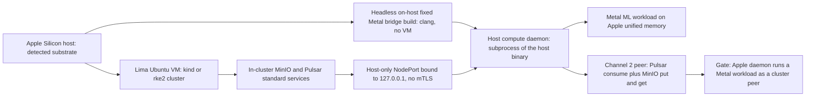

# Phase 7: Host compute daemons (Apple Metal / Windows CUDA)

**Status**: Authoritative source
**Supersedes**: N/A
**Referenced by**: README.md, overview.md, system_components.md, ../documents/engineering/apple_metal_headless_builds.md
**Generated sections**: none

> **Purpose**: Stand up a long-running host compute daemon — the non-containerizable Apple-Metal (and
> Windows-CUDA) ML worker — as a plain Pulsar + MinIO peer over host-only loopback NodePorts with no mTLS,
> managed as a subprocess of the host binary on the apple substrate via Lima and brew-rooted lazy
> tool-ensure, with the native Apple-Metal worker built **headless, directly on the host — no VM (no Tart)**
> via the fixed Metal bridge ([apple_metal_headless_builds.md](../documents/engineering/apple_metal_headless_builds.md)).

---

## Phase Status

📋 Planned. Nothing in this phase is implemented; every sprint below is design intent and every prescriptive
statement is a target shape, not a tested amoebius result. The Lima/WSL2 VM providers, the brew lazy-tool
ensure, and the loopback-NodePort peering pattern are inherited as *evidence* from the sibling `hostbootstrap`
seed and the sibling prodbox project (where in-cluster Harbor is reached at `127.0.0.1:30080` over a
loopback-bound NodePort) — evidence of feasibility from other systems, never an amoebius proof. The Apple
worker is built **headless on the host with no VM (no Tart)** via a fixed Metal bridge — a shape **proven in
the sibling jitML project** and adopted after the sibling `infernix` library *removed* its own legacy Tart
path; that is sibling evidence, not an amoebius result, and there is no amoebius Tart code, now or planned
([apple_metal_headless_builds.md](../documents/engineering/apple_metal_headless_builds.md)). Status
transitions are recorded reverse-chronologically here once work begins.

## Phase Summary

This phase delivers the one class of amoebius compute that lives **outside a cluster pod**: a **host worker
node** — a long-running host subprocess that reaches hardware which refuses to be performantly contained
(Apple-Metal needs Apple Silicon unified memory; Windows-CUDA does not run performantly under WSL2). The gate
is exercised on the **apple** substrate; the windows-CUDA case is the same shape on a different substrate and
is named throughout but is not the single-substrate gate (§L).

The phase does four things, in order:

1. **Manages the apple substrate.** It synthesizes the Linux host the cluster actually wants via **Lima**
   (an Ubuntu-24.04 VM), rooting all host tooling in **brew** through the no-environment / no-`PATH` lazy
   tool-ensure contract — probe, install-if-absent, resolve the absolute path from the package manager,
   invoke by full path.
2. **Exposes channel 2 host-only.** It binds the in-cluster MinIO and Pulsar services to a **loopback
   NodePort** reachable only from the host (`127.0.0.1:<nodeport>`), with no LoadBalancer, no Envoy route,
   and no path from LAN/WAN — the sanctioned localhost carve-out from Keycloak-owns-all-wild-ingress.
3. **Builds and runs the native host worker.** It builds the native Apple-Metal worker **headless, directly
   on the host — no VM (no Tart)** — via a fixed Objective-C/C Metal bridge source-built with `/usr/bin/clang`
   by absolute path (with generated MSL compiled at runtime through the OS Metal framework), then runs that
   worker as a managed subprocess of the host binary with a defined Load → Prereq → Acquire → Ready → Serve →
   Drain → Exit lifecycle and a guaranteed drain.
4. **Wires the daemon as a peer.** The worker joins the cluster as an **ordinary Pulsar + MinIO peer over the
   host-only NodePort, with no mTLS**: commands arrive as Pulsar messages, results and artifacts land in the
   content-addressed MinIO store, and there is **no bespoke binary↔daemon RPC** — coordination *is*
   Pulsar/MinIO. Security comes from the network restriction, not from transport crypto.

This phase is where the **`LinuxHost` witness** of the topology type discipline (Phase 3, Sprint 3.6) meets
reality: the Lima Ubuntu VM *is* the only `LinuxHost` an apple host can produce, so "an rke2/kind cluster on a
bare Apple host" — unrepresentable at decode ([`illegal_state_catalog.md`](../documents/engineering/illegal_state_catalog.md)
§3.14, [`cluster_topology_doctrine.md`](../documents/engineering/cluster_topology_doctrine.md) §3) — is
realized by *actually interposing* the VM here (the runtime-checked "the VM boots" residue). The Lima VM's carved
capacity budget is likewise the runtime cross-check for the host/VM capacity fold
([`resource_capacity_doctrine.md`](../documents/engineering/resource_capacity_doctrine.md) §8,
[`illegal_state_catalog.md`](../documents/engineering/illegal_state_catalog.md) §3.17): a spec whose VM/guest
`Demand` exceeds the host is decode-rejected in Phase 3, and this phase refuses if the real Apple host is
smaller than its declared `Capacity`.

**Compute-half delivery cross-ref (doctrine this round introduces; delivery this phase carries).** This round
closes the gap that host-worker compute was entirely absent from the capacity fold. A host-level accelerator
worker now declares its own foldable cpu/mem `Demand` and folds against a **physical-host `Capacity`** distinct
from the Lima/WSL2 VM's kube-allocatable — a new **host→host-worker** arm alongside the host→VM→guest fold
([`resource_capacity_doctrine.md`](../documents/engineering/resource_capacity_doctrine.md) §4/§8; host-worker
`Demand` owner [`platform_services_doctrine.md`](../documents/engineering/platform_services_doctrine.md) §10) —
so a VM-carve + host-worker over-commit is a decode-foreclosed `Left Overcommit` at decode (§D). The accelerator worker owns
its node's accelerators **wholesale** ([`daemon_topology_doctrine.md`](../documents/engineering/daemon_topology_doctrine.md)
§4; `resource_capacity_doctrine.md` §4.1), with accelerator memory modeled as a **VRAM sub-budget** the worker
carves among served models (a `worker → served-model` Σ; the per-host `vram` and the unified-vs-discrete memory
shape declared by [`substrate_doctrine.md`](../documents/engineering/substrate_doctrine.md) §8), not a per-pod
request axis (§C/§E). And **Windows-CUDA is elevated to a first-class host worker alongside Apple-Metal** — role
parity, not evidence parity (`substrate_doctrine.md` §5, `daemon_topology_doctrine.md` §4): the same host-worker
shell and wire this phase builds, on a different substrate (§B). All of this is doctrine this round introduces and
delivery this phase carries; the single-substrate gate stays `apple`, and none of it is a tested amoebius result
yet.

The same host-worker peering this phase builds is also the fabric substrate the stretched-cluster doctrine (§L)
rides. A **K1 stretched host worker** is exactly this phase's Apple-Metal / Windows-CUDA peer reaching its home
cluster's MinIO/Pulsar + Vault over a declared `Gateway | Vpn` networking capability instead of host-only loopback
— a non-member data-plane client on **any** control plane, including `Managed Eks`
([`single_logical_data_plane_doctrine.md`](../documents/engineering/single_logical_data_plane_doctrine.md) §3/§4,
[`network_fabric_doctrine.md`](../documents/engineering/network_fabric_doctrine.md) §5) — and the **K2 full-node
control-plane-over-fabric listener** (self-managed rke2's kubelet↔apiserver span) rides the same Phase-7 fabric
work ([`cluster_topology_doctrine.md`](../documents/engineering/cluster_topology_doctrine.md) §4.1). A stretched
cluster stays one boundary — this is a networking generalization of the host-worker wire, not a new cross-cluster
obligation, and (like the compute half above) is delivery this phase carries, not a Phase-7 gate claim.

This phase consumes earlier phases rather than re-implementing them: Phase 1's substrate detection, the
`bootstrap` contract, and the lazy-tool-ensure kernel; Phase 2's MinIO and Pulsar standard services; and
Phase 4's native Pulsar client, content-addressed store, topology algebra, and worker-daemon scaffolding. The
Metal ML workload itself reuses the determinism kernel and the shared-library inference path landed in
Phases 4–5; this phase contributes the *host worker* shell and *wire*, not a new inference algorithm.

**Substrate:** apple (§L) — the whole gate runs on an Apple-Silicon host whose Lima-synthesized Linux VM
carries a single-node cluster; no linux-cpu, linux-cuda, or windows substrate is touched by the gate. The
windows-CUDA host worker is the structurally identical case on the windows substrate and is named here as
target shape, but it is **not** part of this phase's single-substrate acceptance test.

**Gate:** an Apple-Silicon host daemon runs a Metal ML workload as a cluster Pulsar/MinIO peer — driven by a
single `InForceSpec` that brings up the apple-substrate cluster, exposes MinIO and Pulsar on a host-only
loopback NodePort, builds the native worker **headless on-host via the fixed Metal bridge (no VM)**, starts the daemon as a managed subprocess, dispatches a
Metal inference job over Pulsar, lands its output in the content-addressed MinIO store, and tears the worker
and cluster down. The run emits a proven/tested/assumed ledger artifact recording that host-only reachability
was *tested* (the NodePort is reachable from `127.0.0.1` and unreachable from the LAN) and that no mTLS or
bespoke RPC was introduced on channel 2.

## Doctrine adopted

This phase is the first implementation of three doctrines. Each bullet names the sections this phase realizes;
individual sprints cite the same sections where they adopt them.

- [`host_cluster_comms_doctrine.md` §2 — The decision that was open, and is now resolved](../documents/engineering/host_cluster_comms_doctrine.md#2-the-decision-that-was-open-and-is-now-resolved):
  Phase 7 builds the resolved channel-2 design — a host compute daemon as a plain Pulsar + MinIO peer over
  host-only NodePorts with **no mTLS** — taking the two localhost-only host-origin channels of
  [§1 — The whole surface: two channels, both localhost-only](../documents/engineering/host_cluster_comms_doctrine.md#1-the-whole-surface-two-channels-both-localhost-only),
  the no-bespoke-control-channel rule of
  [§3 — coordination *is* Pulsar + MinIO](../documents/engineering/host_cluster_comms_doctrine.md#3-there-is-no-bespoke-control-channel--coordination-is-pulsar--minio),
  the network-restriction threat model of
  [§5 — why no mTLS is safe here](../documents/engineering/host_cluster_comms_doctrine.md#5-why-no-mtls-is-safe-here-the-network-restriction-is-the-security-boundary),
  the loopback-NodePort realization (and prodbox precedent) of
  [§6 — the host-only restriction in practice](../documents/engineering/host_cluster_comms_doctrine.md#6-the-host-only-restriction-in-practice-and-its-sibling-precedent),
  and the type-excluded illegal states of
  [§7 — what the DSL makes unrepresentable here](../documents/engineering/host_cluster_comms_doctrine.md#7-what-the-dsl-makes-unrepresentable-here):
  the daemon's only inbound coordination is Pulsar/MinIO peering, its only wire is the host-only loopback
  NodePort, and a wild-exposed variant is unrepresentable.
- [`substrate_doctrine.md` §5 — Host worker nodes: substrate-specific hardware that refuses to be contained](../documents/engineering/substrate_doctrine.md#5-host-worker-nodes-substrate-specific-hardware-that-refuses-to-be-contained):
  Phase 7 implements the apple host worker (Apple-Metal on unified memory) — and names the windows-CUDA case
  — as a managed subprocess of the host binary with the Load → Prereq → Acquire → Ready → Serve → Drain →
  Exit role lifecycle, built via the virtualized-substrate provider of
  [§4 — Virtualized substrates](../documents/engineering/substrate_doctrine.md#4-virtualized-substrates-synthesizing-a-linux-host-where-the-host-is-not-linux)
  ([§4.1 — Lima on Apple](../documents/engineering/substrate_doctrine.md#41-lima-on-apple) for the Linux VM),
  all under the
  [§3 — no-environment / no-`PATH` lazy tool-ensure contract](../documents/engineering/substrate_doctrine.md#3-the-no-environment--no-path-lazy-tool-ensure-contract)
  rooted in brew by the
  [§6 — `bootstrap.sh` contract](../documents/engineering/substrate_doctrine.md#6-the-bootstrapsh-contract-ensure-a-toolchain-build-the-binary-hand-off).
- [`apple_metal_headless_builds.md` §1 — The commitment: headless, on-host, no VM](../documents/engineering/apple_metal_headless_builds.md#1-the-commitment-headless-on-host-no-vm),
  with [§3 — Architecture (the fixed host Metal bridge)](../documents/engineering/apple_metal_headless_builds.md#3-architecture),
  [§4 — Build and prerequisite model](../documents/engineering/apple_metal_headless_builds.md#4-build-and-prerequisite-model),
  and [§6 — Why Tart is not viable (the no-VM rationale)](../documents/engineering/apple_metal_headless_builds.md#6-why-tart-is-not-viable-the-no-vm-rationale):
  Phase 7 builds the Apple-Metal worker **headless on the host — no Tart, no macOS VM** — source-building the
  fixed Objective-C/C Metal bridge with `/usr/bin/clang` by absolute path and compiling generated MSL at
  runtime through the OS Metal framework, so a cache miss never starts a VM, invokes SwiftPM, or depends on a
  login keychain.

## Sprints

## Sprint 7.1: Apple substrate management — Lima Linux VM + brew lazy tool-ensure 📋

**Status**: Planned
**Implementation**: `src/Amoebius/Substrate/Apple.hs`, `src/Amoebius/Substrate/Lima.hs`, `src/Amoebius/Substrate/Brew.hs` (target paths; not yet built)
**Blocked by**: Phase 1 gate (external prereq — substrate detection, the `bootstrap --distro` contract, and the closed-enum lazy-tool-ensure kernel that invokes by absolute path)
**Independent Validation**: on a detected apple substrate, `ensure lima` is `brew install lima` when `limactl` is absent and a verified no-op otherwise; a named, project-budget-sized Ubuntu-24.04 VM starts and carries a single-node cluster; every host tool used is resolved to an absolute path via the package manager and **no bare command name and no environment variable (including `PATH`) is ever read** on the host surface.
**Docs to update**: `documents/engineering/substrate_doctrine.md`

### Objective

Adopt [`substrate_doctrine.md` §4.1 — Lima on Apple](../documents/engineering/substrate_doctrine.md#41-lima-on-apple)
and [§3 — the no-environment / no-`PATH` lazy tool-ensure contract](../documents/engineering/substrate_doctrine.md#3-the-no-environment--no-path-lazy-tool-ensure-contract),
rooted in [§6 — the `bootstrap.sh` contract](../documents/engineering/substrate_doctrine.md#6-the-bootstrapsh-contract-ensure-a-toolchain-build-the-binary-hand-off):
synthesize the Linux host the apple substrate's cluster runs on via Lima, with every host tool ensured and
invoked by absolute path through brew — the substrate foundation every later Phase 7 sprint stands on.

### Deliverables

- An apple-substrate manager that drives Lima (`limactl`) to start a named, budget-sized Ubuntu-24.04 VM and
  re-invokes amoebius subcommands inside it via `limactl shell <vm> -- <amoebius> <subcmd>` (the composition
  lift; the lift mechanism itself is owned by the daemon-topology doctrine and only consumed here).
- A brew-rooted lazy-tool-ensure binding: probe → install-if-absent → resolve the absolute path from the
  package manager (`brew --prefix`) → invoke by full path; the install *plan* is a pure value so the
  substrate branching is unit-tested without invoking brew, and only the driver is `IO`.
- A substrate-applicability guard so the apple reconcilers fail fast — before any side effect — when run on a
  non-apple substrate, with a one-line diagnostic.

### Validation

1. With `limactl` absent, the reconciler installs it via brew, re-resolves it to an absolute path, and
   starts the VM; with it present, the same call is a verified no-op (idempotent).
2. A unit test exercises the pure install plan for apple without invoking brew.
3. Static/audit check: no host invocation passes a bare command name; no code path reads an environment
   variable or `PATH` on the host surface.

### Remaining Work

The whole sprint.

## Sprint 7.2: Host-only loopback NodePort exposure of MinIO + Pulsar 📋

**Status**: Planned
**Implementation**: `src/Amoebius/HostComms/NodePort.hs`, `src/Amoebius/HostComms/Loopback.hs` (target paths; not yet built)
**Blocked by**: Sprint 7.1 (the Lima VM provides the node network whose NodePorts must be bound to the host's loopback); Phase 2 (external prereq — the in-cluster MinIO and Pulsar standard services to expose)
**Independent Validation**: after bring-up, MinIO and Pulsar are reachable from the host at `127.0.0.1:<nodeport>` and **unreachable** from another machine on the LAN and from the WAN; there is no `LoadBalancer`-typed Service, no Envoy route, and no wild listener for either port; the loopback binding holds even though the Lima VM's node network does not bind NodePorts to loopback by default.
**Docs to update**: `documents/engineering/host_cluster_comms_doctrine.md`, `documents/engineering/substrate_doctrine.md`

### Objective

Adopt [`host_cluster_comms_doctrine.md` §6 — the host-only restriction in practice](../documents/engineering/host_cluster_comms_doctrine.md#6-the-host-only-restriction-in-practice-and-its-sibling-precedent)
and [§1 — two channels, both localhost-only](../documents/engineering/host_cluster_comms_doctrine.md#1-the-whole-surface-two-channels-both-localhost-only):
realize channel 2's transport — a NodePort bound to the host's loopback so the daemon connects to
`127.0.0.1:<nodeport>` with no path from LAN/WAN — generalizing the prodbox `127.0.0.1:30080` Harbor
precedent (evidence, not amoebius proof) onto the Lima-backed apple substrate.

### Deliverables

- Rendered host-only NodePort Services for MinIO and Pulsar whose reachability is restricted to host-origin
  traffic, plus the substrate-layer loopback binding / host-only firewalling that makes the
  `127.0.0.1:<nodeport>` shape hold on the Lima VM **without relaxing the restriction** (never by publishing
  the port wider).
- An assertion seam proving the negative: no `LoadBalancer` Service, no Gateway/HTTPRoute, and no wild
  listener references either port — these are the only channel-2 endpoints and they are localhost-only.
- A reusable check that the same loopback shape is what the windows substrate's WSL2 case would target,
  recorded as target shape (not exercised by the apple gate).

### Validation

1. Connect to MinIO and Pulsar from the host at `127.0.0.1:<nodeport>` and succeed; attempt the same from a
   second host on the LAN and fail (connection refused / no route).
2. Assert there is no `LoadBalancer`-typed Service and no Envoy route fronting either port.
3. Tear the cluster down and back up; the loopback binding is re-established idempotently.

### Remaining Work

The whole sprint.

## Sprint 7.3: Headless host-native Metal bridge + native worker build (no Tart) 📋

**Status**: Planned
**Implementation**: `src/Amoebius/HostWorker/MetalBridge.hs` (fixed ObjC/C bridge install + probe + runtime MSL dispatch), `src/Amoebius/HostWorker/AppleMetalBuild.hs` (target paths; not yet built)
**Blocked by**: Sprint 7.1 (the apple substrate manager + brew lazy tool-ensure that resolves `/usr/bin/clang` and the OS Metal runtime by absolute path)
**Independent Validation**: the fixed Objective-C/C Metal bridge dylib is source-built on the host with `/usr/bin/clang` (absolute path, no env/`PATH`), `dlopen`'d, and verified by its probe symbol; generated MSL compiles at runtime via `MTLDevice.makeLibrary(source:options:)` and dispatches on the host GPU; **no VM is ever started, no SwiftPM/`swift build` runs on a cache miss, and no login-keychain unlock is required**; the source-metadata cache artifact is content-addressed and reproducible from the same inputs.
**Docs to update**: `documents/engineering/apple_metal_headless_builds.md`, `documents/engineering/substrate_doctrine.md`

### Objective

Adopt [`apple_metal_headless_builds.md` §1 — The commitment: headless, on-host, no VM](../documents/engineering/apple_metal_headless_builds.md#1-the-commitment-headless-on-host-no-vm),
[§3 — Architecture](../documents/engineering/apple_metal_headless_builds.md#3-architecture),
[§4 — Build and prerequisite model](../documents/engineering/apple_metal_headless_builds.md#4-build-and-prerequisite-model),
and [§6 — Why Tart is not viable](../documents/engineering/apple_metal_headless_builds.md#6-why-tart-is-not-viable-the-no-vm-rationale),
with the host-worker build rule of [`substrate_doctrine.md` §5 — host worker nodes](../documents/engineering/substrate_doctrine.md#5-host-worker-nodes-substrate-specific-hardware-that-refuses-to-be-contained):
build the Apple-Metal worker **headless, directly on the host — with no macOS VM (no Tart)** — so build
provenance is host-controlled without inheriting VM lifecycle, keychain, or SwiftPM surfaces. The headless
fixed-bridge shape is **proven in the sibling jitML project** (sibling evidence, not amoebius proof); this
sprint realizes it in amoebius for the first time.

### Deliverables

- A fixed Objective-C/C Metal bridge, source-built once on the host by invoking `/usr/bin/clang` **by
  absolute path** (linking macOS `Foundation`/`Metal`), then `dlopen`'d and verified by resolving an exported
  probe symbol before the worker subscribes to work — no env, no `PATH`, no VM.
- Runtime MSL compilation: the host binary renders Metal Shading Language, writes a content-addressed
  source-metadata cache record, and dispatches through the bridge's `MTLDevice.makeLibrary(source:options:)`
  with fast-math **off** (the determinism contract), reusing an in-process pipeline cache across calls.
- The native Apple-Metal worker built on-host (targeting Apple Silicon unified memory) as a host worker
  binary, **not** a container image; the optional Homebrew-`swiftc` + explicit-`SDKROOT` lane is available
  for any non-core Swift parts but is never the cache-miss path and never a VM.

### Validation

1. Build the fixed bridge with `/usr/bin/clang`, `dlopen` it, and pass its probe; assert no VM was started
   and no keychain unlock was needed.
2. Compile generated MSL at runtime through the bridge and dispatch a kernel; assert bit-stable output under
   the fast-math-off determinism contract, and that the source-metadata cache record is content-addressed and
   reproducible from identical inputs.
3. Static/audit check: the build/dispatch path invokes only absolute-path tools, reads no environment
   variable or `PATH`, and contains no `tart`, `swift build`, or offline `metal` invocation on the core path.

### Remaining Work

The whole sprint.

## Sprint 7.4: Host compute daemon lifecycle as a managed subprocess 📋

**Status**: Planned
**Implementation**: `src/Amoebius/HostWorker/Lifecycle.hs`, `src/Amoebius/HostWorker/Supervise.hs` (target paths; not yet built)
**Blocked by**: Sprint 7.3 (the built native worker binary is what the lifecycle manages); Sprint 7.1 (the apple substrate context the subprocess runs in)
**Independent Validation**: the worker runs as a subprocess of the host binary with a defined Load → Prereq → Acquire → Ready → Serve → Drain → Exit lifecycle; a `Drain` runs **even if serving throws**; a missing prerequisite fails fast before `Serve`; killing the host binary tears the worker down with it (no unmanaged orphan process).
**Docs to update**: `documents/engineering/substrate_doctrine.md`

### Objective

Adopt [`substrate_doctrine.md` §5 — host worker nodes: substrate-specific hardware that refuses to be contained](../documents/engineering/substrate_doctrine.md#5-host-worker-nodes-substrate-specific-hardware-that-refuses-to-be-contained):
run the Apple-Metal worker as a **managed subprocess of the host binary** — the one place amoebius compute
lives outside a cluster pod — with the stateless-role lifecycle and a guaranteed drain, so the worker has a
defined startup and a clean shutdown rather than an unmanaged background process.

### Deliverables

- A supervised host-worker lifecycle implementing Load → Prereq → Acquire → Ready → Serve → Drain → Exit,
  with the drain guaranteed via bracket-style resource handling even when `Serve` raises.
- Prerequisite gating that fails fast — before `Serve` — when the Metal worker binary, the host-only
  NodePort endpoints, or the worker's MinIO/Pulsar credential names are not available, with a one-line
  diagnostic.
- Subprocess ownership tying the worker's lifetime to the host binary: a host-binary exit (clean or signal)
  drains and reaps the worker; no orphaned process survives.

### Validation

1. Start the worker, force `Serve` to throw, and assert `Drain` still runs and resources are released.
2. Remove a prerequisite and assert a fast, pre-`Serve` failure with an actionable message.
3. Kill the host binary mid-`Serve` and assert the worker subprocess is drained and gone.

### Remaining Work

The whole sprint.

## Sprint 7.5: Channel-2 peer — Pulsar + MinIO over the host-only NodePort, no mTLS 📋

**Status**: Planned
**Implementation**: `src/Amoebius/HostWorker/Peer.hs`, `src/Amoebius/HostWorker/Auth.hs` (target paths; not yet built)
**Blocked by**: Sprint 7.2 (the host-only loopback NodePorts the peer dials); Sprint 7.4 (the daemon lifecycle whose `Serve` step does the peering); Phase 4 (external prereq — the native Pulsar client, the content-addressed store, and the topology algebra); Phase 2 (external prereq — MinIO and Pulsar)
**Independent Validation**: the worker subscribes to its work topic over the native Pulsar TCP binary protocol (no WebSockets), does the work, and writes outputs to the content-addressed MinIO store — all over `127.0.0.1:<nodeport>` with **no mTLS and no bespoke binary↔daemon RPC**; client auth resolves through Vault by secret-name, never via a host environment variable or `PATH`.
**Docs to update**: `documents/engineering/host_cluster_comms_doctrine.md`

### Objective

Adopt [`host_cluster_comms_doctrine.md` §3 — there is no bespoke control channel; coordination *is* Pulsar + MinIO](../documents/engineering/host_cluster_comms_doctrine.md#3-there-is-no-bespoke-control-channel--coordination-is-pulsar--minio)
with the resolution of [§2 — the decision now resolved](../documents/engineering/host_cluster_comms_doctrine.md#2-the-decision-that-was-open-and-is-now-resolved)
and the threat model of [§5 — why no mTLS is safe here](../documents/engineering/host_cluster_comms_doctrine.md#5-why-no-mtls-is-safe-here-the-network-restriction-is-the-security-boundary):
make the host worker an ordinary Pulsar/MinIO client over the host-only NodePort — commands as Pulsar
messages, artifacts to the content-addressed store — with security from the network restriction, not from
transport crypto, and no custom RPC anywhere.

### Deliverables

- A channel-2 peer that consumes its work topic via the shared `amoebius-pulsar` native-protocol client
  (at-least-once + dedup preserved; broker ids/timestamps are never part of any content address) and writes
  results to `blobs/<sha256>` + a content-addressed manifest in the MinIO store — the same coordination shape
  an in-cluster worker Pod uses.
- A plain-socket transport on `127.0.0.1:<nodeport>` with **no mTLS layer added**, keeping a real socket per
  stream (full TCP parallelism) rather than a single bottlenecking Unix socket — the bandwidth half of the
  resolution.
- Secrets-by-name client auth: Dhall holds only the credential name and Vault holds the value (resolved via
  Vault Kubernetes auth, the model owned by the Vault/PKI doctrine and only consumed here) — no host
  environment variable, no `PATH` lookup, no bespoke RPC to the binary.

### Validation

1. Dispatch a job on the work topic; assert the worker consumes it over native Pulsar (no WebSocket frames on
   the wire) and lands a content-addressed output object in MinIO.
2. Packet/trace inspection: channel-2 traffic is plain (no TLS handshake), and the only endpoint is
   `127.0.0.1:<nodeport>`.
3. Auth resolves the worker's MinIO/Pulsar credentials by name through Vault; assert no env/`PATH` read and no
   side-channel control connection to the host binary.

### Remaining Work

The whole sprint.

## Sprint 7.6: Wild-exposure unrepresentable + the Apple-Metal peer gate 📋

**Status**: Planned
**Implementation**: `src/Amoebius/HostComms/Illegal.hs`, `test/dhall/phase_07_apple_metal_peer.dhall` (target paths; not yet built)
**Blocked by**: Sprint 7.5 (the working channel-2 peer the gate dispatches to); Sprint 7.2 (the host-only NodePort the gate asserts is localhost-only)
**Independent Validation**: a `.dhall` that tries to give a host-origin NodePort a `LoadBalancer` Service, an Envoy route, or any wild listener — or that gives the host daemon its own wild ingress — **fails to type-check**; the gate `.dhall` runs the full Apple-Metal peer workflow end-to-end and tears down, emitting a proven/tested/assumed ledger artifact.
**Docs to update**: `documents/engineering/host_cluster_comms_doctrine.md`

### Objective

Adopt [`host_cluster_comms_doctrine.md` §7 — what the DSL makes unrepresentable here](../documents/engineering/host_cluster_comms_doctrine.md#7-what-the-dsl-makes-unrepresentable-here),
closing the carve-out so its boundaries cannot be drawn wrong, and prove the phase gate from
[§1 — two channels, both localhost-only](../documents/engineering/host_cluster_comms_doctrine.md#1-the-whole-surface-two-channels-both-localhost-only):
an Apple-Silicon host daemon runs a Metal ML workload as a cluster Pulsar/MinIO peer, with a host-origin
NodePort that is type-excluded from being WAN/LAN-exposed and a daemon that cannot publish its own wild
ingress.

### Deliverables

- Type-level exclusions (the typing techniques are owned by the illegal-state catalog and only instantiated
  here): a host-origin NodePort cannot be expressed as `LoadBalancer`-typed, Envoy-routed, or wild-listening,
  and a host compute daemon cannot publish wild ingress — its only inbound coordination is Pulsar/MinIO
  peering and its only privileged control path is the binary's channel 1.
- The gate `.dhall` (`test/dhall/phase_07_apple_metal_peer.dhall`): bring up the apple cluster on Lima,
  expose MinIO/Pulsar on the host-only loopback NodePort, build the worker **headless on-host via the fixed
  Metal bridge (no VM)**, start the daemon as a managed subprocess, dispatch a Metal inference job over
  Pulsar, land its output in the content-addressed store, then tear the worker and cluster down.
- A ledger artifact recording: NodePort-is-localhost-only as **tested on apple** (reachable from
  `127.0.0.1`, unreachable from the LAN), no-mTLS / no-bespoke-RPC as **tested**, and Apple-Metal physics as
  **assumed** (host-only feasibility evidenced by prodbox's loopback-Harbor precedent, not proven in
  amoebius).

### Validation

1. A deliberately wild-exposing host-comms `.dhall` (NodePort as `LoadBalancer`, an Envoy route on it, or a
   daemon wild ingress) fails to type-check.
2. The gate `.dhall` runs the full Apple-Metal peer workflow and tears down leak-free; the Metal output is
   retrievable from MinIO by its content address.
3. The ledger artifact is emitted and marks the Apple-Metal physics row as assumed, not green.

### Remaining Work

The whole sprint.

## Documentation Requirements

**Engineering docs to update:**
- `documents/engineering/host_cluster_comms_doctrine.md` — when this phase lands, its §9 planning-ownership
  pointer resolves to delivered Phase 7 sprints, and the §2/§5/§6 honesty notes flip from "resolved design
  decision / sibling evidence" to a delivered, apple-tested channel-2 peer (status recorded here in the plan,
  never as doctrine status); add the `Amoebius.HostComms.*` and `Amoebius.HostWorker.*` module paths to its
  cross-reference set.
- `documents/engineering/apple_metal_headless_builds.md` — its §1/§3/§4/§6 honesty notes flip from "jitML
  sibling evidence / design intent" to a delivered, apple-tested amoebius fixed-Metal-bridge build (status
  recorded here in the plan, never as doctrine status).
- `documents/engineering/substrate_doctrine.md` — its §8 planning-ownership pointer resolves to delivered
  Phase 7 sprints; the §4.3 "no macOS build VM" note and the §5 host-worker description gain their first
  amoebius datapoint on apple; record that the Lima provider, the headless on-host Metal-bridge build, and the
  brew lazy-tool-ensure were exercised by full-path subprocess with no env/`PATH`.

**Cross-references to add:**
- [README.md](README.md) Phase index — flip the Phase 7 row from "not started" to its delivered status and
  link this document.
- [substrates.md](substrates.md) — record Phase 7's gate substrate (apple) in the per-phase substrate map,
  and note the windows-CUDA host worker as the structurally identical non-gate case.
- [system_components.md](system_components.md) — add the host-worker and host-comms modules
  (`Substrate/Apple`, `Substrate/Lima`, `HostWorker/MetalBridge`, `HostComms/NodePort`, `HostWorker/Lifecycle`,
  `HostWorker/Peer`) to the component inventory once they become concrete.

## Related Documents

- [README.md](README.md) — the live tracker; Phase 7 objective, gate, and substrate
- [development_plan_standards.md](development_plan_standards.md) — the rulebook this document obeys
- [overview.md](overview.md) — the target architecture and cross-cutting invariants
- [system_components.md](system_components.md) — the target component inventory for the module paths above
- [substrates.md](substrates.md) — the substrate registry and per-phase substrate map
- [Host ↔ Cluster Comms Doctrine](../documents/engineering/host_cluster_comms_doctrine.md) — the host-only NodePort, no-mTLS channel-2 design this phase implements
- [Apple Metal Headless Builds](../documents/engineering/apple_metal_headless_builds.md) — the headless, on-host, no-Tart fixed-Metal-bridge build/run shape this phase implements
- [Substrate Doctrine](../documents/engineering/substrate_doctrine.md) — the apple/windows host worker nodes and the Lima/WSL2 providers this phase implements
- [Daemon Topology Doctrine](../documents/engineering/daemon_topology_doctrine.md) — the worker-role taxonomy, the control-plane singleton, and the composition lift (cross-reference, not adopted in Phase 7)
- [Pulsar Client Doctrine](../documents/engineering/pulsar_client_doctrine.md) — the native-protocol client, no-WebSockets, and topology algebra the peer rides on (cross-reference, not adopted in Phase 7)
- [Vault / PKI Doctrine](../documents/engineering/vault_pki_doctrine.md) — the secrets-by-name client auth the channel-2 peer resolves through (cross-reference, not adopted in Phase 7)
- Earlier phase: Phase 4 — Native Pulsar client + content-addressed store + workflow-runtime (the transport, store, and worker scaffolding this phase consumes)
- Earlier phase: Phase 6 — jitML migration + HA coordinator (the prior host-adjacent ML workload; the CUDA-in-container contrast case)
- [Engineering Doctrine Index](../documents/engineering/README.md) — the doctrine suite these phases adopt
