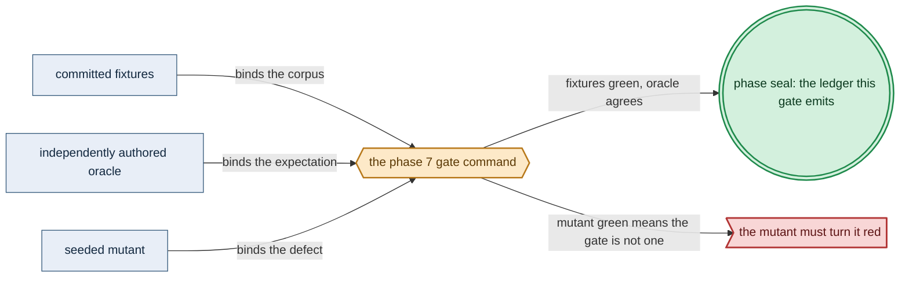

# Phase 7: Illegal-state corpus + validation-locus ledger

> **Purpose**: Assemble the exhaustive illegal-state corpus — every negative fixture split by the locus that
> rejects it — plus the QuickCheck property suite and the per-entry validation-locus ledger, in-process,
> before any real resource exists.
> **Read this if**: phase 7 is next in the queue, or a later phase depends on what its gate establishes.

Phase 7 delivers the illegal-state corpus + validation-locus ledger; its design is owned by [dsl_doctrine.md](../documents/engineering/dsl_doctrine.md), [resource_capacity_doctrine.md](../documents/engineering/resource_capacity_doctrine.md), [testing_doctrine.md](../documents/engineering/testing_doctrine.md), and the plan for reaching it is owned here.
Register 1: an in-process battery, no cluster.
Gate passed 2026-08-09; ledger `external-run-reference`.

> **Historical result (invalidated).** Any pass, seal, validation, ledger, receipt, or implementation observation
> in the orientation text above is diagnostic only. The Phase Status section and [tracker](README.md) own current state; the
> target contract below remains normative.

Link-graph metadata

**Status**: Authoritative source
**Supersedes**: N/A
**Referenced by**: DEVELOPMENT_PLAN/README.md, DEVELOPMENT_PLAN/development_plan_standards.md, DEVELOPMENT_PLAN/overview.md, DEVELOPMENT_PLAN/phase_00_documentation_suite.md, DEVELOPMENT_PLAN/phase_06_gadt_decoder_gate2.md, DEVELOPMENT_PLAN/phase_08_capacity_core_folds.md, DEVELOPMENT_PLAN/phase_10_execution_accelerator_folds.md, DEVELOPMENT_PLAN/phase_11_capability_bind.md, DEVELOPMENT_PLAN/system_components.md
**Generated sections**: none

## Contents
- [Phase Status](#phase-status)
- [Phase Summary](#phase-summary)
- [Gate integrity](#gate-integrity)
- [Doctrine adopted](#doctrine-adopted)
- [Sprints](#sprints)
- [Sprint 7.1: Exhaustive negative/positive corpus split by foreclosure locus ✅](#sprint-71-exhaustive-negativepositive-corpus-split-by-foreclosure-locus-)
- [Sprint 7.2: GADT-index compile-fail goldens (type-foreclosed layer) ✅](#sprint-72-gadt-index-compile-fail-goldens-type-foreclosed-layer-)
- [Sprint 7.3: QuickCheck property suite ✅](#sprint-73-quickcheck-property-suite-)
- [Sprint 7.4: The per-entry validation-locus ledger — the gate ✅](#sprint-74-the-per-entry-validation-locus-ledger--the-gate-)
- [Documentation Requirements](#documentation-requirements)
- [Related Documents](#related-documents)

---

## Phase Status

⏸️ Blocked pending Phase-6 revalidation — **reopened 2026-08-16 by the natural-architecture amendment.**
[§S](development_plan_gate_integrity.md#s-universal-artifact-hygiene-gate) clause 15 requires a run to record
the natural architecture it proved and to execute no artifact of another. This phase's last gate recorded no
architecture, so its seal is invalidated as a current result and stands only as history; the rerun differs from
it by naming the lane and architecture the run actually used. A sprint marker below records what that sprint achieved before the amendment; under
[§N](development_plan_phase_model.md#n-reopening-and-amending-a-phase) it is a diagnostic, not surviving closure.

**Pre-natural-architecture status record (invalidated where it claims completion):**

Done (invalidated) — resealed 2026-08-15. `python3 tools/illegal_state_corpus_gate.py` passed all eleven sides: all 19
metrics match, 88 catalog entries and 104 subcases reconcile, every registry/domain/index/decision mutant
reddens, the corpus and honesty-bannered ledger pass, 24 surfaces join to 27 run-time items, and host state is
unchanged. The project-contained attestation is
`sha256:a0b75311f33ab71f39ee18b5813d271f0dc93239e553b16aa5af1afb153bdc3f`, bound to source snapshot
`sha256:a086f6a584a75dcd…`; Phase 7 owns no remaining migration deferral.

**Pre-containment status record (invalidated where it claims completion):**

Done (invalidated) — sealed 2026-08-12. The migrated gate passed against source snapshot `sha256:a1e246296ecadb42…`
(1931 non-ignored files) and published a verified pre-containment external attestation
`sha256:2a18c8372d20736e226b93994c8fcd7e133af9e55bc799889551a653269a8b05`.

**Observed progress — 2026-08-12:** **Policy-conformant.** The corpus result is unchanged and re-run: 88
catalog entries reconcile to 104 registry subcases, 14 Gate-1 and 13 Gate-2 negatives fail at their own loci
beside green twins, 12 positives decode, five compile-fail pairs separate legal from illegal, four QuickCheck
properties hold under `checkCoverage`, the RKE2 server arms are exhausted, and 33 subcases are discharged
against 71 owner-pinned deferrals. All four registry-reconciliation mutants plus the union-arm, resource
normalization, GADT-index-weakening, and broken-decision mutants turn the battery red at their own loci. 24
surfaces join to 27 run-time enumerated items.

**Three corrections.** The results table was written rather than measured; the catalog, registry, corpus, and
locus-ledger counts, the reddened-property set, and the surviving-mutant count are now all parsed from what the
run observed. `test/spec/dsl/CorpusSpec.hs` hard-coded one developer's `dhall` path and now resolves it per run,
failing closed when unset. And `.build/dsl/**` — written by nineteen phases — was never declared in the canonical
generated-output inventory; the eighteen deferrals covering it were not a migration backlog but a missing
inventory row, so the class is now declared and all eighteen rows are retired.

**Invalidated historical record:**

Done (invalidated). `python3 tools/illegal_state_corpus_gate.py` passed on 2026-08-09 with ledger
`dynamically-resolved`. The gate ran on **no
substrate** (`none`) in **Register 1** — it stood up no host and no cluster, only an in-process corpus battery
over the `dhall` typechecker, the Phase-6 decoder, a pinned `ghc -fno-code` expect-fail harness, and
QuickCheck. It discharged 33 Phase-5/6/7-owned registry subcases and recorded the remaining 71 subcases as
deferred to their exact owners. Runtime enforcement, capacity/provisioning, and rendered-output fidelity
remain UNVERIFIED.

## Phase Summary

This phase turns the typed spec gates stood up in Phases 5 and 6 into an *exhaustive*, honestly-classified
proof. Phase 5 proved Gate 1 rejects a representative Gate-1-class negative set; Phase 6 proved the total
decoder rejects a representative Gate-2-class negative set. This phase assembles the **whole** illegal-state
corpus — one negative fixture per catalog entry that Register 1 can settle — and requires each to be rejected
at exactly the locus its catalog classification names: a Gate-1 negative must fail `dhall type`, a Gate-2
negative must pass `dhall type` and then decode to a structured `Left`, and a GADT-index (type-foreclosed)
negative must fail to compile under a pinned `ghc -fno-code` expect-fail golden. It adds the QuickCheck
property suite that establishes closure, round-trip, fold-totality, and composition-preservation over the
smart-constructor vocabulary, sampled where the domain is infinite and exhausted where it is finite (the three
`Rke2Servers` arms). It then emits the **per-entry validation-locus ledger**: a map from every catalog entry
to the one truth-maker locus that settles it — `Gate-1-editor`, `Gate-2-decoder`, `provision-seal`,
`rendered-output-golden`, or `live-effect` — asserting that the Gate-1/Gate-2 loci owned here carry rejecting fixtures
and recording later loci as deferred to their owning phase. Deferred ownership is an orthogonal registry
field; `provision-seal` is the distinct post-bind Phase-12 locus where whole-deployment capacity, topology,
storage, and target compatibility return `ProvisionError`. Phase 8 builds/proves those pure folds and Phase 12
invokes them after capability/provider expansion. What is *not* here: those
capacity/topology/provisioning folds and their negatives (Phases 8–13), the rendered-output goldens the
`rendered-output-golden` locus points at (Phase 14),
the representational SPA-composition corpus (Phase 19), and every `live-effect` residue (the live band).

**Substrate:** `none` — no host, no cluster; the gate is an in-process `cabal test` + `dhall type` +
`ghc -fno-code` corpus battery analogous to the Phase-0 documentation lint.

**Lane:** none ([§L](development_plan_standards.md#l-one-substrate-discipline))

**Register:** 1 — pure/golden, in-process, no cluster ([§K](development_plan_standards.md#k-honesty-proven--tested--assumed)).

**Gate:** `python3 tools/illegal_state_corpus_gate.py` passes every fixture, expected-error golden, coverage floor, seeded
mutant, and registry reconciliation named in [Gate integrity](#gate-integrity). Phase 8 does not open unless
the ledger records Register 1 green and runtime, provisioning, and rendered-output fidelity UNVERIFIED.

## Gate integrity

This gate satisfies the eight [§M](development_plan_standards.md#m-gate-integrity-a-gate-cannot-be-passed-by-a-stub) clauses through the following committed apparatus.
The fixture/error oracles are oracle-pinned; the owner/family catalog enrichment was hand-authored before
the corpus/ledger implementation that consumes it (§M.1 oracle-pinning):

*Implemented Phase-7 gate apparatus; [§M](development_plan_standards.md#m-gate-integrity-a-gate-cannot-be-passed-by-a-stub) owns its clauses.*

**What the gate command accepts.** Every negative fixture is rejected at its tagged locus and nowhere else.
A Gate-1-class negative fails `dhall type` at authoring time with an error equal to its oracle-pinned
error-locus golden naming the foreclosing union/field (§M.8 specific-reason). A Gate-2-class negative passes
`dhall type` and then decodes to a structured `Left DecodeError` whose tag equals its oracle-pinned
expected-`DecodeError`-tag golden. A GADT-index negative fails to compile under the pinned `ghc -fno-code`
expect-fail harness with a GHC **type** error — a scope or parse error does not satisfy it — pinned to a
committed expected-error-locus golden. The suite is red if any illegal fixture is admitted at or past its
locus. QuickCheck is green under `checkCoverage` across closure, round-trip, fold-totality, and
composition-preservation, with the Sprint 7.3 coverage minima met. The per-entry validation-locus ledger
(`Gate-1-editor` / `Gate-2-decoder` / `Gate-3-astcheck` / `provision-seal` / `rendered-output-golden` /
`live-effect`) is emitted with every catalog entry mapped to its truth-maker locus and a separate
`owner_phase` / `case_family` disposition, both reconciled against the catalog-reconciled committed
`locus_registry.tsv` — the independent oracle of §M.3 — and red on any divergence. The whole run is
**Register 1** and in-process: it stands up no substrate.

> **Realized registry note:** all 90 catalog entries carry `**Validation-locus:**`, `**Delivery-owner:**`, and
> `**Case-family:**` tags. The documentation lint reconciles those tags against the committed 106-subcase
> `dhall/examples/locus_registry.tsv` before the ledger emitter runs.

> **Subcase-identity resolution.** The registry carries an explicit, non-empty `subcase` key beside each
> catalog entry. Entries that owe more than one fixture or locus
> ([`§3.16`](../documents/illegal_state/illegal_state_topology.md) fixed-node cardinality and host
> distinctness; [`§3.23`](../documents/illegal_state/illegal_state_capability_messaging.md) produce-side and
> malformed-received-body)
> are represented by multiple named registry rows, so no entry reads as covered when only its first subcase
> lands.

**The coverage obligation this registry serves.** The registry is **not** the enumeration half of
[`testing_doctrine.md §9`](../documents/engineering/testing_doctrine.md#9-derivation-generated-enumeration-authored-expectation)
— that half is regenerated at gate time and never committed. `locus_registry.tsv` is the committed,
independently-authored **oracle** (§M.3) that the gate-time-regenerated enumeration is checked against; the
committed fixtures are the *expectation* half. Joining the regenerated enumeration to the committed fixtures,
with the registry as the oracle, yields the coverage obligation, whose semantics are:

- A registry row whose `owner_phase` is **this phase or an earlier one** (Phase 5/6/7) and which has **no committed fixture** turns the Phase-7 gate **red** — the fixture the reached owner phase was obliged to
  commit is missing. This is the same red-on-unmapped rule as the acceptance conditions above and the
  Sprint 7.4 validation below.
- A registry row whose `owner_phase` is a **later** phase is correctly deferred: it is **mapped as deferred**
  to that phase and emits **no UNVERIFIED row** — deferral is not absence. When that later phase's gate runs
  and finds the fixture still missing, *its* run records the entry **UNVERIFIED** in the ledger's `coverage`
  array. This is what the `Delivery-owner:` enrichment exists to distinguish, and why the join cannot be
  built before it.

The **catalog-side** half of this obligation — that every entry carries a locus, that numbering is
contiguous, that index anchors resolve, and that every entry has a technique-matrix row — is not deferred to
this phase: it is Phase-0 documentation-lint check (g)
([`phase_00`](phase_00_documentation_suite.md)), which validates the enumeration is well-formed over text
alone, before any fixture exists to join against.

- **Oracle-pinning (§M.1) + specific-reason negatives (§M.8).** Each negative fixture ships a committed expected-failure
  golden authored by hand, not regenerated from the implementation: `dhall/examples/goldens/<name>.typeerr`
  (the `dhall type` error, naming the offending union/field) for each `illegal_gate1_*`;
  `test/golden/dsl/<name>.tag` (the expected `DecodeError` constructor tag) for each `illegal_decode_*`;
  `test/spec/dsl/compilefail/<name>.expected` (the expected GHC type-error class + locus) for each compile-fail golden.
  The suite asserts the observed failure **equals** its golden, not merely that some failure occurred.
- **Independent reference predicate (§M.3).** The validation-locus reference side is the catalog's committed
  per-entry `**Validation-locus:**`, `**Delivery-owner:**`, and `**Case-family:**` tags in
  `documents/illegal_state/illegal_state_*.md` once this phase adds the latter two, reconciled by the
  Phase-0 documentation lint (extended here) into
  `dhall/examples/locus_registry.tsv`. Those catalog tags are authored independently of
  `ValidationLocusLedger.hs`; the coverage assertion reads that registry, never the emitter's own
  classification or a hard-coded section-number range.
- **Committed mutation quota (§M.2).** Four committed seeded mutants (from the [§M](development_plan_standards.md#m-gate-integrity-a-gate-cannot-be-passed-by-a-stub) operator set) MUST turn the gate
  red, re-run each gate run: (a) a **union-arm-addition** schema mutant admitting a product-named capability →
  `CorpusSpec` red; (b) a **dropped-resource-normalization guard** decoder mutant that admits a zero/incomplete
  resource declaration or discards one normalized resource field → the corresponding Gate-2 negative or
  positive-field traversal turns `CorpusSpec` red; (c) a **guard-weakening** GADT-index mutant widening one
  index → a compile-fail golden compiles → `compile_fail.sh` red; (d) a **broken-smart-constructor / partialized-fold** mutant → each of the four QuickCheck properties red. Phase-8/11 fold mutants remain owned
  by those phases; Phase 7 cannot execute a fold that has not landed. The gate is itself red if any mutant
  survives.
- **Generator coverage (§M.4).** Sprint 7.3's `checkCoverage` minima (below) force the nontrivial reject/boundary
  arms to fire.
- **Concrete corpus (§M.7).** The representative set is enumerated explicitly in the Sprint 7.1/6.2 Deliverables
  and the committed `locus_registry.tsv`, not left to "representative".

## Doctrine adopted

- [`illegal_state_techniques.md §6 — Three layers of foreclosure (and the honesty they force)`](../documents/illegal_state/illegal_state_techniques.md#6-three-layers-of-foreclosure-and-the-honesty-they-force):
  the three foreclosure layers (`type-foreclosed` / `decode-foreclosed` / `runtime-checked`) and the
  **Gate-1-vs-Gate-2 caveat** — Dhall has no opaque types, so the corpus must **split** its negatives into
  *Gate-1-must-fail-`dhall type`* and *Gate-2-must-fail-decode*, and never bill a Gate-2-only foreclosure as a
  Gate-1 type-check failure. This phase reifies that split as fixtures.
- [`illegal_state_techniques.md §5 — Coverage matrix`](../documents/illegal_state/illegal_state_techniques.md#5-coverage-matrix--which-technique-forecloses-which-illegal-state)
  and [`§2 — the load-bearing limit`](../documents/illegal_state/illegal_state_catalog.md#2-the-load-bearing-limit-a-type-check-proves-the-spec-composes-not-that-the-cluster-enforces-it):
  the coverage matrix is the checklist the corpus must exhaust — one fixture per Register-1-settleable entry —
  and [§2](../documents/illegal_state/illegal_state_catalog.md#2-the-load-bearing-limit-a-type-check-proves-the-spec-composes-not-that-the-cluster-enforces-it)'s limit is honored verbatim: *a type-check proves the spec composes, not that the cluster enforces
  it.* Entries whose truth-maker is the running cluster are ledgered `live-effect`, never claimed here.
- [`dsl_doctrine.md §5 — the illegal-state-unrepresentable contract`](../documents/engineering/dsl_doctrine.md#5-the-illegal-state-unrepresentable-contract):
  the **typed spec gates** — Gate 1 (the Dhall typechecker) and Gate 2 (the in-process `Dhall.inputFile auto`
  decoder). This phase exercises both against the exhaustive negative corpus and pins the type-foreclosed
  residue with the compile-fail golden that gives the GADT indices their teeth.
- [`resource_capacity_doctrine.md §3 — The types: Quantity, Capacity, Demand, Budget`](../documents/engineering/resource_capacity_doctrine.md#3-the-types-quantity-capacity-demand-budget)
  and [`§4 — The total fold: fits, carve, place, and the nesting`](../documents/engineering/resource_capacity_doctrine.md#4-the-total-fold-fits-carve-place-and-the-nesting):
  the complete resource envelope and opaque post-bind checked boundary. This phase exhausts the resource
  **shape/normalization** cases its predecessors own (including the missing-envelope [§3.11](../documents/illegal_state/illegal_state_security.md#311-an-unsafe-workload-no-resource-limits-no-hardened-securitycontext) negative) and
  derives every later capacity, storage, accelerator, VRAM, and missing-capability deferral from registry
  ownership tags; it never claims those Phase-8/11 folds have run early.
- [`testing_doctrine.md §2 — the registers`](../documents/engineering/testing_doctrine.md#2-the-registers-of-amoebius-testing) — **Register 1**
  (pure/golden, in-process, no cluster): the register this phase's gate reaches; and
  [`§4 — the per-run ledger`](../documents/engineering/testing_doctrine.md#4-no-skips-fail-fast-and-the-per-run-ledger-artifact) — the proven/tested/assumed ledger
  the battery emits, the validation-locus ledger being its per-catalog-entry specialization with model↔runtime
  correspondence marked UNVERIFIED.
- [`conformance_harness_doctrine.md §2 — the registers`](../documents/engineering/conformance_harness_doctrine.md#2-the-registers-as-amoebius-uses-them-for-pre-cluster-validation)
  and [`§5 — honesty`](../documents/engineering/conformance_harness_doctrine.md#5-honesty-what-the-harness-does-and-does-not-establish): Register 1 is the pure/golden
  no-cluster band, and a green Register-1 corpus establishes the spec composes and the foreclosures fire —
  **nothing** about whether the physical effects converge, which is the deferred `live-effect` locus.

## Sprints

> **Current validation record.** Every sprint is covered by the 2026-08-15 reseal. Historical dates,
> pass/seal claims, repository-resident evidence paths, and `Remaining Work: None` statements below describe
> the pre-amendment capability record only; they do not override current status. Functional and validation
> outcomes remain target requirements. Any instruction to commit generated output, freeze dependency resolution,
> retain a resolved version, path, or integrity hash, or consume repository-resident evidence, ledgers, or
> enumerations is superseded by the current generated-artifact and dynamic-resolution doctrine. Closure requires
> the current phase gate plus universal artifact hygiene.

## Sprint 7.1: Exhaustive negative/positive corpus split by foreclosure locus ✅

**Status**: Done — the capability is re-established by the migrated gate; the sprint's committed-ledger, pinned-toolchain, and repository-resident evidence mechanics are superseded
**Implementation**: `dhall/examples/{legal_*,illegal_gate1_*,illegal_decode_*}.dhall`
(extending the Phase-5 positive + Gate-1 corpus and the Phase-6 Gate-2 set to one fixture per
Register-1-settleable catalog entry); `test/spec/dsl/CorpusSpec.hs`; `test/oracle/illegal_state_corpus/{gate1_cases,gate2_cases}.tsv`;
`dhall/examples/locus_registry.tsv`; `tools/locus_registry_lint.py`.
**Blocked by**: Phase 6 supplied the total decoder + GADT-indexed IR; Phase 5 supplied the
Gate-1 schema + positive corpus; Phase 1 supplied the `dhall` CLI and package pin. The catalog-tag/registry
oracle was authored before `CorpusSpec.hs`.
**Independent Validation**: the corpus battery rejects every Phase-5/6/7-owned negative at its own tagged
locus against that fixture's committed expected-error golden, admits every legal twin and positive,
reconciles its coverage note against `locus_registry.tsv`, and turns red under the two seeded mutants. The
numbered Validation list below states each condition.
**Docs to update**:
`documents/illegal_state/illegal_state_*.md` (add per-entry `Delivery-owner` / `Case-family` tags and
gate-case backlinks), `DEVELOPMENT_PLAN/system_components.md` (corpus inventory), this document.

### Objective
Adopt [`illegal_state_techniques.md §5/§6`](../documents/illegal_state/illegal_state_techniques.md#5-coverage-matrix--which-technique-forecloses-which-illegal-state):
assemble the corpus that exercises the type discipline exhaustively over the coverage matrix, **honestly split by the locus that rejects each fixture** — Gate-1 negatives that must fail `dhall type`, Gate-2 negatives that
must pass `dhall type` and decode-reject — never billing a Gate-2-only foreclosure as a Gate-1 failure.

### Deliverables
- A one-time catalog enrichment across every `documents/illegal_state/illegal_state_*.md` entry: retain the
  existing `**Validation-locus:**` tag and add required `**Delivery-owner:**` and `**Case-family:**` tags. The
  documentation lint is extended to reject a missing/duplicate/unknown **`Delivery-owner:` or `Case-family:`**
  tag (the `Validation-locus:` presence check is owned by Phase-0 check (g), not re-owned here) and to
  reconcile `locus_registry.tsv`. The registry is the committed oracle consumed by the fixture harness and
  ledger emitter.
- Positive fixtures (`legal_multisubstrate_cluster`, `legal_managed_eks`, `trivial_app`, a deployment-rules
  fixture) that decode with complete normalized resource envelopes and target capacities, carried forward
  from Phase 5/6.
- Gate-1 negatives (`illegal_gate1_*`, must fail `dhall type`) are **exactly** the rows enumerated by
  `locus_registry.tsv` with `validation_locus = Gate-1-editor` and
  `owner_phase ∈ { Phase-5, Phase-6, Phase-7 }`. Required members
  include product-named capability ([§3.12](../documents/illegal_state/illegal_state_capability_messaging.md#312-an-app-that-names-a-product-instead-of-a-capability)), insecure/backdoor ingress ([§3.7](../documents/illegal_state/illegal_state_security.md#37-accidental-insecure--backdoor-ingress)), a workload missing its complete
  `ResourceEnvelope` ([§3.11](../documents/illegal_state/illegal_state_security.md#311-an-unsafe-workload-no-resource-limits-no-hardened-securitycontext); the Phase-5 `illegal_missing_resource_envelope` case), unbounded storage /
  un-tiered topic ([§3.18](../documents/illegal_state/illegal_state_storage.md#318-unbounded-storage-anywhere)/[§3.20](../documents/illegal_state/illegal_state_storage.md#320-a-pulsar-topic-without-a-bounded--tiered--retained-lifecycle)), growth with no scaling policy ([§3.21](../documents/illegal_state/illegal_state_storage.md#321-capacity-growth-without-an-amoebius-owned-scaling-policy)), even/zero-server rke2 control plane
  ([§3.24](../documents/illegal_state/illegal_state_topology.md#324-an-evenzero-server-rke2-control-plane-no-etcd-quorum--split-brain)), a substrate/topology arm the union does not offer
  ([§3.14](../documents/illegal_state/illegal_state_topology.md#314-rke2kind-on-a-host-with-no-linux-node-applewindows-without-an-interposed-linux-vm)/[§3.15](../documents/illegal_state/illegal_state_topology.md#315-a-multi-node-kind-cluster-not-on-a-single-linux-host)), and the controller fields Dhall intentionally omits:
  DaemonSet both-positive rollout, StatefulSet unsupported feature/nonzero partition, and Job missing terminal
  retention. The registry, not this prose list, is the exact enumeration.
- Gate-2 negatives (`illegal_decode_*`, must pass `dhall type`, then decode-reject) are **exactly** registry
  rows with `validation_locus = Gate-2-decoder` whose
  `owner_phase ∈ { Phase-5, Phase-6, Phase-7 }`; these exercise the Phase-6
  structural decoder, normalized resource/capacity representation, ownership indices, and compile-fail
  boundary already available to this phase. Required execution-normalization cases cover every
  controller-kind/cardinality/policy/resource mismatch, including raw Deployment
  `RollingUpdate { maxSurge = 0, maxUnavailable = 0 }` returning the pinned
  `UnspellableCombination` tag, paired with independently exercised `{ 1, 0 }` and `{ 0, 1 }` positives.
  The representable Gate-2 controller cases cover controller/cardinality/resource mismatches, CUDA rolling,
  Metal-on-Deployment, and reused rke2 hosts, each with a minimally differing legal twin. The received-side
  malformed CBOR body is also rejected here. Produce-side non-CBOR is stronger: the typed payload codec has
  no such inhabitant and is pinned by the fifth compile-fail pair in Sprint 7.2.
  The declared-compute-headroom cases belong here rather than to the deferred set below, because both are
  cross-field checks the Phase-6 smart constructor owns: `illegal_decode_headroom_over_limit`, whose pad
  breaches `requests + pad ≤ limits` on one axis, and `illegal_decode_headroom_all_zero`, whose pad is `Zero`
  on every axis and so has no `PositiveHeadroomAxisWitness`. Each mutates a single construct of a legal twin
  that declares lawful headroom, so the pinned tag proves the pad rule fired rather than an unrelated shape
  error.
- **Provisioning-deferred negatives are selected by tags, never section-number ranges.** A registry row with
  `validation_locus = provision-seal`, an `owner_phase` of `Phase-8` or `Phase-12`, and a `case_family` of
  `topology`, `capacity`, `storage`, `cache`, `accelerator`, or `capability-provision` carries no rejecting
  fixture in Phase 7 and is ledgered with that owner. The generated selection must include every current
  aggregate and atomic fit case: engine/substrate incompatibility and host reuse; host/VM/cluster and
  elastic-quota overcommit; pod ephemeral-storage and finite-limit/physical-peak overflow; a padded
  reservation that fits on required requests alone but overcommits allocatable once declared headroom is
  charged;
  durable/native-cache-pool and
  in-cluster-cache-nesting violations; Pulsar two-ceiling overflow; affinity/taint unplaceability; CUDA
  requested on a CPU-only target;
  whole-device-count shortage; accelerator source/workload or policy-domain mismatch; invalid residency/shard
  structure; a policy-permitted coexistence epoch whose co-resident per-device aggregate exceeds net
  allocatable VRAM; and provider-expanded resource demand. Phase 8 owns the pure folds and Phase 12 owns the end-to-end post-bind
  `ProvisionContext → Topology → BoundDeployment → Either ProvisionError ProvisionedSpec` boundary. Adding a new catalog row with
  those tags automatically adds it to the deferred set; no phase-doc range edit is required.
- **Near-miss twinning (forecloses wrong-reason negatives, §M.8).** Each Gate-1 negative is a **single-construct mutation** of a named committed legal fixture (its `legal_*` twin, differing only in the one foreclosed
  dimension), and that twin MUST pass `dhall type`; the negative's `dhall type` error MUST equal the committed
  `<name>.typeerr` golden that names the foreclosing union/field, so a fixture that fails for an unrelated
  reason (typo, missing field, syntax error) does not pass. Each `illegal_decode_*` negative is likewise a
  single-field mutation of a legal twin that decodes, and asserts its committed expected `DecodeError` tag.
- **Per-Register-1-locus fixtures (disambiguation).** A catalog entry carrying more than one Register-1 locus
  (e.g. [§3.16](../documents/illegal_state/illegal_state_topology.md#316-a-multi-node-rke2-cluster-with-fewer-linux-hosts-than-nodes-or-a-host-reused) = `Gate-1-editor` cardinality sub-part + `Gate-2-decoder` distinctness fold) owes **one fixture row per Register-1 locus it carries**, each rejected at its own locus — not one row total. The ledger's
  single "truth-maker locus" per entry is the earliest-sufficient among the loci it carries (§M.8 tie-break:
  `Gate-1-editor` < `Gate-2-decoder`), but delivery follows each row's owner: Phase 7 supplies only rows owned
  by Phases 5–7, while Phase-8/11-owned subcases remain visibly deferred to those phases.

### Validation
1. Every Phase-5/6/7-owned Gate-1 negative fails `dhall type` with its observed error matching the committed
   `<name>.typeerr` golden that names the foreclosing union/field, and its legal near-miss twin passes
   `dhall type`.
2. Every Phase-5/6/7-owned Gate-2 negative passes `dhall type` and then decodes to a `Left DecodeError` whose
   tag equals its committed `<name>.tag` golden, its legal twin decodes, and every positive fixture decodes.
3. `CorpusSpec` is red if any illegal fixture is admitted at or past its tagged locus, if any twin fails, or
   if any observed error diverges from its golden.
4. The coverage note maps each fixture to its catalog entry and foreclosure layer and is reconciled against
   the committed `locus_registry.tsv`, and every Phase-8/11-owned provisioning row is present in the derived
   deferred set with the exact owner.
5. The committed union-arm-addition schema mutant (a) and resource-normalization decoder mutant (b) each turn
   `CorpusSpec` red when re-applied.

### Remaining Work
None for Sprint 7.1.

## Sprint 7.2: GADT-index compile-fail goldens (type-foreclosed layer) ✅

**Status**: Done — the capability is re-established by the migrated gate; the sprint's committed-ledger, pinned-toolchain, and repository-resident evidence mechanics are superseded
**Implementation**: `test/spec/dsl/compilefail/*.hs` (each a minimal module that spells an
illegal combination) + `test/oracle/illegal_state_corpus/compile_fail.tsv` + `tools/{compile_fail.py,compile_fail.sh}`
(a pinned `ghc -fno-code` expect-fail harness).
**Blocked by**: none within the phase.
**Independent Validation**: the pinned `ghc -fno-code` harness shows every compile-fail golden has no
inhabitant — it fails on a GHC **type** error matching that golden's committed `.expected` file while its
one-token legal twin compiles — and turns red under the seeded index-weakening mutant. The numbered
Validation list below states each condition.
**Docs to update**: `documents/illegal_state/illegal_state_catalog.md` (per-entry type-foreclosed annotation for
the entries pinned here), `DEVELOPMENT_PLAN/system_components.md`.

### Objective
Adopt the [`illegal_state_techniques.md §6`](../documents/illegal_state/illegal_state_techniques.md#6-three-layers-of-foreclosure-and-the-honesty-they-force)
`type-foreclosed` layer at its strongest: give the GADT indices their teeth by proving the illegal value has
**no inhabitant** — it does not merely decode to a `Left`, it does not compile at all. This is the residue the
Phase-5 honesty caveat routed here, since Dhall has no opaque types.

### Deliverables
- Compile-fail goldens for the type-foreclosed entries the IR indices foreclose: a cross-tenant `Ref`
  ([§3.8](../documents/illegal_state/illegal_state_security.md#38-cross-tenant-references-and-literal-secrets)/[§3.10](../documents/illegal_state/illegal_state_security.md#310-a-child-spec-that-reaches-beyond-its-own-subtree)), a PVC with no matching PV ([§3.2](../documents/illegal_state/illegal_state_storage.md#32-pvcs-that-dont-bind-pvs)), an endpoint-kind interconversion ([§3.7](../documents/illegal_state/illegal_state_security.md#37-accidental-insecure--backdoor-ingress)), and a route built
  from no live service handle ([§3.3](../documents/illegal_state/illegal_state_security.md#33-misconfigured-gateway)), plus a non-CBOR Pulsar produce payload
  ([§3.23](../documents/illegal_state/illegal_state_capability_messaging.md#323-a-non-cbor-pulsar-payload)) — each an expect-fail module that must not compile.
- A pinned `ghc -fno-code` expect-fail harness reporting one aggregate green/red over the golden set, plus a
  positive control module that compiles. Each golden ships a committed `test/spec/dsl/compilefail/<name>.expected`
  golden (expected GHC error class = type-error, plus locus) authored in this phase's oracle-pinning sprint, and a one-token legal twin.
- The committed guard-weakening GADT-index mutant (c) — used to prove the harness actually rejects.

### Validation
1. Every compile-fail golden imports only the real exported vocabulary, is scope-clean and parse-clean, and
   fails to compile under the pinned `ghc -fno-code` harness with a GHC **type** error whose class and locus
   match its committed `test/spec/dsl/compilefail/<name>.expected` golden.
2. The error class is asserted, not merely "fails": it is read from structured diagnostics —
   `-fdiagnostics-as-json`, or a pinned `--json`-derived tag — so a scope, parse, or name error does not
   satisfy a golden.
3. Each golden's one-token legal twin, differing only in the single foreclosed index, compiles, as does the
   companion positive control module carrying the legal vocabulary.
4. The harness is red if any golden compiles, if any golden fails for a non-type reason, or if any observed
   diagnostic diverges from its `.expected` golden.
5. The committed guard-weakening GADT-index mutant (c) makes at least one golden compile and thereby turns
   the harness red.

### Remaining Work
None for Sprint 7.2.

## Sprint 7.3: QuickCheck property suite ✅

**Status**: Done — the capability is re-established by the migrated gate; the sprint's committed-ledger, pinned-toolchain, and repository-resident evidence mechanics are superseded
**Implementation**: `test/spec/dsl/DecisionPropSpec.hs` (`prop_smartCtorClosure`,
`prop_decodeRoundTrip`, `prop_foldTotal`, `prop_compositionPreservesWellFormedness`) and
`test/spec/dsl/DecisionPropMain.hs`.
**Blocked by**: none within the phase.
**Independent Validation**: `cabal test` runs the four properties green **under `checkCoverage`** with every
declared minimum met and each result labelled TESTED or PROVEN, and the committed broken-constructor mutant
turns all four red. The numbered Validation list below states each condition.
**Docs to update**: `documents/engineering/testing_doctrine.md` (the
sampled-vs-exhausted label discipline), `DEVELOPMENT_PLAN/system_components.md`.

### Objective
Adopt [`illegal_state_techniques.md §6`](../documents/illegal_state/illegal_state_techniques.md#6-three-layers-of-foreclosure-and-the-honesty-they-force)
and [`testing_doctrine.md §4`](../documents/engineering/testing_doctrine.md#4-no-skips-fail-fast-and-the-per-run-ledger-artifact): establish the
closure / round-trip / fold-totality / composition-preservation properties of the type discipline, labelled
honestly — **TESTED (sampled)** for infinite domains, upgraded to **PROVEN** only where a finite domain is
exhausted (the three `Rke2Servers` arms).

### Deliverables
- `prop_smartCtorClosure` (a smart constructor never yields an illegal value), `prop_decodeRoundTrip`
  (encode∘decode is identity on well-formed IR), `prop_foldTotal` (every decode-time fold terminates on
  generated input without partiality), and `prop_compositionPreservesWellFormedness` (composing two
  well-formed fragments yields a well-formed value).
- A per-property label: TESTED (sampled) by default; PROVEN for the exhausted `Rke2Servers` finite domain.
- **Declared coverage minima (forecloses vacuous generators, §M.4).** Each property runs under `checkCoverage`
  with explicit `cover` obligations forcing its nontrivial arms: `prop_smartCtorClosure` covers each
  smart-constructor family (≥ 15% each, ≥ 3 distinct families); `prop_decodeRoundTrip` covers non-empty
  multi-substrate and multi-service IR (≥ 20% multi-substrate, ≥ 20% ≥2-service); `prop_foldTotal` covers each
  distinct fold with a boundary/near-illegal-but-legal input (≥ 10% per fold); `prop_compositionPreservesWell-
  formedness` covers non-identity compositions of two distinct non-trivial fragments (≥ 25%). Generators that
  emit a single trivial value fail the coverage check and the suite is red.
- The committed broken-smart-constructor / partialized-fold seeded mutant (d) that must turn each property red.

### Validation
1. `cabal test` runs the property suite green under `checkCoverage`: closure holds over the smart-constructor
   vocabulary, decode round-trips, every fold is total on generated input, and composition preserves
   well-formedness.
2. Each property declares its `cover`/`classify` obligations, and the run fails if a declared minimum is not
   met, so a generator emitting one trivial value cannot pass.
3. The exhausted-domain properties are marked PROVEN and the sampled ones TESTED — no sampled property is
   billed as a proof.
4. The committed broken-smart-constructor / partialized-fold mutant (d) turns each of the four properties
   red, and the suite is red if that mutant survives any property.

### Remaining Work
None for Sprint 7.3.

## Sprint 7.4: The per-entry validation-locus ledger — the gate ✅

**Status**: Done — the capability is re-established by the migrated gate; the sprint's committed-ledger, pinned-toolchain, and repository-resident evidence mechanics are superseded
**Implementation**: `test/spec/dsl/ValidationLocusLedger.hs` (the coverage-projection emitter + assertion, run as
part of `dsl-spec`), `tools/illegal_state_corpus_gate.py`, and independently authored expectations under `test/oracles/`.
**Blocked by**: none within the phase.
**Independent Validation**: the emitter's per-entry locus and disposition are reconciled against the
committed `dhall/examples/locus_registry.tsv`, which is lint-derived from catalog tags authored before the
emitter, so the assertion goes red on any locus, owner, or family divergence and on any Phase-5/6/7-owned row
without a passing fixture. The numbered Validation list below states each condition.
**Docs to update**:
`documents/illegal_state/illegal_state_catalog.md` (per-entry realized-locus annotation),
`documents/engineering/testing_doctrine.md` (the validation-locus ledger variant),
`DEVELOPMENT_PLAN/README.md` (flip the Phase-7 status when the gate passes).

### Objective
Adopt [`testing_doctrine.md §4`](../documents/engineering/testing_doctrine.md#4-no-skips-fail-fast-and-the-per-run-ledger-artifact) and
[`illegal_state_techniques.md §6`](../documents/illegal_state/illegal_state_techniques.md#6-three-layers-of-foreclosure-and-the-honesty-they-force):
emit the per-entry validation-locus ledger — the honest map from every catalog entry to the one locus that
settles it — and gate on it, so no entry is silently unvalidated and no deferred entry is silently claimed.
The truth-maker locus and delivery ownership stay separate: Register-1 rows owned by Phases 5–7 are discharged
here; whole-deployment fold/provision rows carry the distinct `provision-seal` locus and are deferred to
Phase 8 or 8; `rendered-output-golden` is owned by
[Phase 14](phase_14_render_manifest_goldens.md), and `live-effect` by the live band.

The gate discovers surfaces into `.build/test-surfaces/` and emits its run ledger under `.build/runs/`. The emitted
validation-locus artifact is a **coverage projection** of the catalog and the modules under test, so by the
source-based rule of [`generated_artifacts_doctrine.md §3`](../documents/engineering/generated_artifacts_doctrine.md#3-the-rule)
it is a **generated** Register-1 output and is **never committed**. It is *not* the run-evidence ledger
[§K](development_plan_standards.md#k-honesty-proven--tested--assumed) requires every gate to emit and
externally attest: that is a separate artifact recording what this gate established and by what means, and
its schema, linter, and path are centrally owned rather than re-derived here.

### Deliverables
- Consumption of the Sprint-6.1-committed catalog enrichment and `locus_registry.tsv`; Sprint 7.4 does not
  regenerate or reinterpret their owner/family classification from the emitter.
- A ledger emitter that classifies each catalog entry into its earliest-sufficient truth-maker locus:
  `Gate-1-editor` (fails `dhall type`, authoring-time), `Gate-2-decoder` (compile-fail golden or decode
  `Left`), `provision-seal` (post-bind `ProvisionError` before `ProvisionedSpec`), `rendered-output-golden`
  (settled on emitted bytes in Phase 14), `live-effect` (settled only by a
  running cluster, deferred to Register 3). A separate disposition records `discharged-here` or
  `deferred : owner_phase`; ownership never changes the recorded locus. Tie-break for a multi-locus entry:
  the earliest-sufficient Register-1 locus
  (`Gate-1-editor` < `Gate-2-decoder` < `provision-seal` < `rendered-output-golden`), while each sub-case retains
  its own registry row so one entry can owe fixtures at more than one locus or phase.
- The committed independent oracle: `dhall/examples/locus_registry.tsv`, reconciled by the Phase-0 lint from
  the catalog's per-entry `**Validation-locus:**` plus the Phase-7-added `**Delivery-owner:**` and
  `**Case-family:**` tags, with columns at minimum `entry`, `subcase`, `validation_locus`, `owner_phase`, and
  `case_family`. The
  provisioning-deferred set is a query over those committed rows (`owner_phase ∈ {Phase-8, Phase-12}` plus the
  provisioning case families), not a duplicated literal section-number list.
- A coverage assertion that **reconciles the emitter's locus for every entry against the registry** and goes
  red on any locus/owner/family divergence, then requires every Phase-5/6/7-owned `Gate-1-editor` /
  `Gate-2-decoder` row to have its rejecting fixture present and passing here, and every later-owned row to be
  marked deferred with its exact owner. The emitted ledger leads with a Register-1-only,
  Tier-2-UNVERIFIED banner.

### Validation
1. The ledger emits with every catalog entry mapped to exactly one truth-maker locus (`Gate-1-editor` /
   `Gate-2-decoder` / `provision-seal` / `rendered-output-golden` / `live-effect`) and one disposition
   (`discharged-here` or `deferred : owner_phase`), that map reconciled against the committed
   `locus_registry.tsv` and red on any locus, owner, or family divergence.
2. The enriched catalog and its lint-derived registry are committed before `ValidationLocusLedger.hs` and
   remain independent of it, so the emitter cannot decide which class owes a fixture.
3. The coverage assertion is green: every Phase-5/6/7-owned `Gate-1-editor` or `Gate-2-decoder` row carries a
   passing rejecting fixture here, and every deferred row names its registry owner — `provision-seal`
   topology/capacity/storage/cache/accelerator/capability-provision rows → Phase 8 or Phase 12,
   `rendered-output-golden` → Phase 14, `live-effect` → the live band — without being reclassified.
4. The suite is red if any entry or subcase is unmapped, misclassified relative to the registry, selected by
   a stale hard-coded range, or claimed settled before its owner phase.

### Remaining Work
Migrate enumeration and run-ledger output to `.build/`, join it to independently authored expectations, remove
all repository-resident generated inputs, and pass the current externally attested gate after Phase 0.

## Documentation Requirements

**Engineering docs updated with the gate result:**
- `documents/illegal_state/illegal_state_*.md` — annotate every themed entry with committed
  `**Delivery-owner:**` and `**Case-family:**` tags alongside its existing validation locus
  (`Gate-1-editor` / `Gate-2-decoder` / `provision-seal` →
  Register 1, discharged here only when `owner_phase ∈ {Phase-5, Phase-6, Phase-7}`; Phase-8/11
  `provision-seal` rows
  remain deferred; `rendered-output-golden` → Phase 14; `live-effect` → the live band), and confirm the §5
  coverage matrix is exhausted for the Register-1 rows this phase owns.
- `documents/engineering/dsl_doctrine.md` — backlink §5's two gates to the exhaustive Phase-7 corpus and the
  compile-fail golden that pins the type-foreclosed layer.
- `documents/engineering/testing_doctrine.md` — record the validation-locus ledger variant and the
  sampled-vs-exhausted QuickCheck label discipline this gate emits (correspondence and runtime fidelity
  UNVERIFIED).

**Cross-references added:**
- `DEVELOPMENT_PLAN/README.md` — flip the Phase-7 status when the gate passes; link this document.
- `DEVELOPMENT_PLAN/substrates.md` — the Phase-7 `none` gate row.
- `DEVELOPMENT_PLAN/system_components.md` — register `dhall/examples/illegal_*`, `test/spec/dsl/CorpusSpec.hs`,
  `test/spec/dsl/compilefail/`, `test/spec/dsl/DecisionPropSpec.hs`, and `test/spec/dsl/ValidationLocusLedger.hs` as Phase-7
  design-first rows.

## Related Documents
- [README.md](README.md) — the live tracker and phase order this document serves
- Phase 7 illegal-state ledger — the authored proven/tested/unverified account of this gate
- [development_plan_standards.md](development_plan_standards.md) — the rulebook this document obeys (the design-proof acceptance token: *spec-composition proven*, never *runtime proven*)
- [overview.md](overview.md) — target architecture and the DSL vision
- [Illegal State Catalog](../documents/illegal_state/illegal_state_catalog.md) — the catalog index and its [§2](../documents/illegal_state/illegal_state_catalog.md#2-the-load-bearing-limit-a-type-check-proves-the-spec-composes-not-that-the-cluster-enforces-it)
  load-bearing limit; the [§5](../documents/illegal_state/illegal_state_techniques.md#5-coverage-matrix--which-technique-forecloses-which-illegal-state) coverage matrix this corpus exhausts and the [§6](../documents/illegal_state/illegal_state_techniques.md#6-three-layers-of-foreclosure-and-the-honesty-they-force) three foreclosure layers with the
  honest Gate-1-vs-Gate-2 split live in `illegal_state_techniques.md`
- [DSL Doctrine](../documents/engineering/dsl_doctrine.md) — [§5](../documents/engineering/dsl_doctrine.md#5-the-illegal-state-unrepresentable-contract) the typed spec gates exercised against the corpus
- [Testing Doctrine](../documents/engineering/testing_doctrine.md) — [§2](../documents/engineering/testing_doctrine.md#2-the-registers-of-amoebius-testing) Register 1, [§4](../documents/engineering/testing_doctrine.md#4-no-skips-fail-fast-and-the-per-run-ledger-artifact) the per-run ledger the
  validation-locus ledger specializes
- [Conformance Harness Doctrine](../documents/engineering/conformance_harness_doctrine.md) — [§2](../documents/engineering/conformance_harness_doctrine.md#2-the-registers-as-amoebius-uses-them-for-pre-cluster-validation) the registers,
  [§5](../documents/engineering/conformance_harness_doctrine.md#5-honesty-what-the-harness-does-and-does-not-establish) the honesty limit (a green Register-1 corpus is not a live-effect claim)
- [phase_05](phase_05_dhall_gate1_schema.md) — Gate 1, the Dhall schema + positive corpus this phase extends
- [phase_06](phase_06_gadt_decoder_gate2.md) — Gate 2, the GADT-indexed IR + decoder this corpus rides atop
- [phase_08](phase_08_capacity_core_folds.md) — the pure capacity/topology/storage fold negatives selected
  from the registry as deferred from here
- [phase_11](phase_11_capability_bind.md) — the post-bind provisioning/capability negatives selected from the
  registry as deferred from here
- [phase_14](phase_14_render_manifest_goldens.md) — the `rendered-output-golden` locus this ledger points at
- [phase_38](phase_38_live_dsl_singleton.md) — the live band where the `live-effect` locus is discharged
