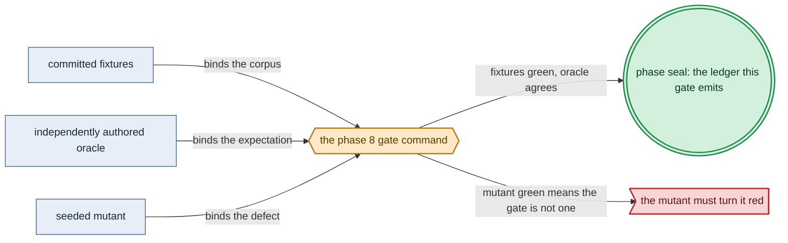
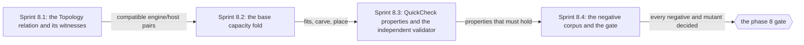

# Phase 8: Capacity core fold + topology relation

> **Purpose**: Build the pure **base** capacity-accounting fold (`fits`/`podFits`/`carve`/`place` over CPU,
> memory, pod/CNI/CSI slots, and logical pod-ephemeral storage) and the compute-engine/topology relation as
> total, in-process Haskell, and prove under QuickCheck that they hold on the positive corpus and reject every
> base capacity/topology negative directly, on hand-authored demand/capacity fixtures — before any host,
> cluster, storage geometry, execution epoch, or accelerator exists.
> **Read this if**: phase 8 is next in the queue, or a later phase depends on what its gate establishes.

Phase 8 delivers the capacity core fold + topology relation; its design is owned by [resource_capacity_doctrine.md](../documents/engineering/resource_capacity_doctrine.md), [resource_capacity_folds.md](../documents/engineering/resource_capacity_folds.md), [cluster_topology_doctrine.md](../documents/engineering/cluster_topology_doctrine.md), and the plan for reaching it is owned here.
Register 1: an in-process battery, no cluster.
Gate passed on 2026-08-09 with seal
`dynamically-resolved`.

> **Historical result (invalidated).** Any pass, seal, validation, ledger, receipt, or implementation observation
> in the orientation text above is diagnostic only. The Phase Status section and [tracker](README.md) own current state; the
> target contract below remains normative.

Link-graph metadata

**Status**: Authoritative source
**Supersedes**: N/A
**Referenced by**: DEVELOPMENT_PLAN/README.md, DEVELOPMENT_PLAN/overview.md, DEVELOPMENT_PLAN/phase_06_gadt_decoder_gate2.md, DEVELOPMENT_PLAN/phase_07_illegal_state_corpus.md, DEVELOPMENT_PLAN/phase_09_storage_geometry_folds.md, DEVELOPMENT_PLAN/phase_10_execution_accelerator_folds.md, DEVELOPMENT_PLAN/phase_12_provision_seal.md, DEVELOPMENT_PLAN/phase_32_capacity_scheduler.md, DEVELOPMENT_PLAN/phase_52_provider_dynamic_nodes.md, DEVELOPMENT_PLAN/phase_53_determinism_jitcache.md, DEVELOPMENT_PLAN/system_components.md, documents/engineering/cluster_topology_doctrine.md, documents/engineering/resource_capacity_doctrine.md, documents/engineering/resource_capacity_folds.md, documents/engineering/substrate_doctrine.md, documents/engineering/testing_doctrine.md, documents/illegal_state/illegal_state_catalog.md
**Generated sections**: none

## Contents
- [Phase Status](#phase-status)
- [Phase Summary](#phase-summary)
- [Gate integrity](#gate-integrity)
- [Doctrine adopted](#doctrine-adopted)
- [Sprints](#sprints)
- [Sprint 8.1: The `Topology` relation — `ComputeEngine` / `LinuxHost` witness / elementwise compatibility fold ✅](#sprint-81-the-topology-relation--computeengine--linuxhost-witness--elementwise-compatibility-fold-)
- [Sprint 8.2: The base capacity fold — `fits` / `podFits` / `carve` / `place` ✅](#sprint-82-the-base-capacity-fold--fits--podfits--carve--place-)
- [Sprint 8.3: QuickCheck properties — soundness, totality, elementwise compatibility + the independent witness validator ✅](#sprint-83-quickcheck-properties--soundness-totality-elementwise-compatibility--the-independent-witness-validator-)
- [Sprint 8.4: The base capacity/topology fold-negative corpus + the gate ✅](#sprint-84-the-base-capacitytopology-fold-negative-corpus--the-gate-)
- [Documentation Requirements](#documentation-requirements)
- [Related Documents](#related-documents)

---

## Phase Status

✅ Done — resealed 2026-08-17 on the amended contract. `python3 tools/capacity_topology_gate.py` passes all
eleven sides on substrate `none`, lane `none`, natural `arm64`, untranslated: every authored oracle holds its
declared shape, the suite is green, all nineteen mutants redden at their own loci, every recorded result is
derived from an observation, and 25 surfaces join completely to 25 enumerated items. Attestation
`sha256:ead83f157bb7a69b8d039a29a92179073e03f87d8b24eb9c3d53c46a3596819b`.

**The rerun found Phase 2's mutant registry had dropped this phase's nineteen rows**, and ninety-nine more
across five other capabilities. The first registry build carried a mutation only when a committed body file or
a build flag held it, and these are carried by neither: the gate materializes each from its own code, sweeping
an authored inventory. The registry now records that third carrier explicitly as `gate:<path>`, so a mutation
nothing can reach is still refused while one the gate applies itself is not mistaken for one. The build had
also normalized every mutant id to lowercase-underscore, which broke the lookup a gate does by the id it
authored; the registry carries the authored id and normalizes only to join.

**Opened 2026-08-17** when the preceding phase resealed.
[§S](development_plan_gate_integrity.md#s-universal-artifact-hygiene-gate) clause 15 requires a run to record
the natural architecture it proved and to execute no artifact of another. This phase's last gate recorded no
architecture, so its seal is invalidated as a current result and stands only as history; the rerun differs from
it by naming the lane and architecture the run actually used. A sprint marker below records what that sprint achieved before the amendment; under
[§N](development_plan_phase_model.md#n-reopening-and-amending-a-phase) it is a diagnostic, not surviving closure.

**Pre-natural-architecture status record (invalidated where it claims completion):**

Done (invalidated) — resealed 2026-08-15. `python3 tools/capacity_topology_gate.py` passed all ten sides: every fold,
twin, compile pair, compatibility row, property, and all 19 mutants pass; 25 surfaces join exactly; the
normalized test role tree and all generated output are contained; and host state is unchanged. The
project-contained attestation is `sha256:90c1297a9e16a7d316daf6d1bdecb1df4f6b65378519c18db64b05e4bac7eaf6`,
bound to source snapshot `sha256:6eecf9051956a260…`; Phase 8 owns no remaining migration deferral.

**Pre-containment status record (invalidated where it claims completion):**

Done (invalidated) — sealed 2026-08-12. The migrated gate passed against source snapshot `sha256:7e1cd07170ddc0f6…`
(1932 non-ignored files) and published a verified pre-containment external attestation
`sha256:61ba75bf3bb6b53846b17ac13903918ec00a1dd14604fbf92c8bb747fc2dd445`.

**Observed progress — 2026-08-12:** **Policy-conformant.** Every capability check is unchanged and re-run: the
fold, compile-fail, Gate-1, compatibility, and mutant oracles carry their authored shapes, the three Gate-1
negatives fail at their exact loci beside green twins, the suite reaches its acceptance token with QuickCheck
coverage in both directions, and all nineteen seeded mutants redden at their own loci. Evidence and the ledger
move into `.build/runs/phase_08/<run-id>/`, 25 surfaces join to 25 run-time enumerated items, and the run
publishes a snapshot-bound attestation.

**Two corrections.** `test/spec/dsl/CapacityTopologyGate.hs` hard-coded one developer's `dhall` path and now
resolves it per run, failing closed when unset — a PATH fallback would have defeated the Phase-6 absolute-argv
observer. And no cabal invocation in this gate passed `--with-compiler`, so on a host carrying a newer GHC the
solver rejected `base` and the gate failed for a reason unrelated to capacity or topology; the resolved
compiler is now threaded into every cabal call, and `--offline` is dropped so a clean host can resolve at all.

**Invalidated historical record:**

Done (invalidated). `python3 tools/capacity_topology_gate.py` passed on 2026-08-09 in
**Register 1** on **no substrate** (`none`) with seal
`dynamically-resolved`.
The gate exercised an in-process fold + property battery over the base capacity vocabulary and topology
relation; it stood up no host or cluster. It is the first of the three sub-phases that the old
capacity/topology phase was split into: this phase owns the **base capacity fold and the topology relation**;
[phase_09_storage_geometry_folds.md](phase_09_storage_geometry_folds.md) owns the logical→physical storage
geometry (BookKeeper/MinIO/Vault/ZooKeeper/Patroni/registry/schema/object-store six-arm, the two-ceiling
Pulsar fold, and `StorageBudget`/`Growable`/scaling), and
[phase_10_execution_accelerator_folds.md](phase_10_execution_accelerator_folds.md) owns the execution-epoch
expansion, scheduler-reservation algebra, kubelet/CRI runtime metadata, accelerator residency/VRAM, and the
provider-root VM/EBS arithmetic (including the composed full-resource-vector place-witness gate). Those
sibling-phase capabilities, along with live scheduling, storage geometry, accelerator residency, capability
binding, provisioning, and runtime enforcement, remain **UNVERIFIED** here. Where a shape
below is exercised in a sibling system (prodbox's `Prodbox/CLI/Rke2.hs` single-node rke2 base and the
teardown push-back soundness it proves), that is **sibling evidence, not an amoebius result**.

## Phase Summary

This phase makes amoebius's *"resource demand never exceeds capacity"* and *"the compute engine matches its
substrate, and topology matches its hosts"* invariants executable as **pure base provisioning folds**, and
proves their implementation/properties under QuickCheck in-process. It delivers the base capacity model — the
refined unit-tagged `Quantity`, the zero-capable `Residual`/`AvailableCapacity` subtraction result, the
`PodResourceVec` and the closed pod/host-worker `ResourceEnvelope` spanning CPU, memory, pod/CNI/CSI slots,
and **logical pod-ephemeral** storage (bounded disk-backed `emptyDir` volumes, writable-rootfs/log allowances,
and the `requests ≤ limits` discipline), the `NodeCapacity` with its pod-slot/CSI-attach capacity, its
mandatory `NoCpuOvercommit | BoundedCpuOvercommit RatioAtLeastOne` CPU-limit policy, and its role-indexed
CPU/memory reserve — and the four total functions `fits` / `podFits` / `carve` / `place` that nest
host → VM → workload and branch `place` on a fixed node set (a concrete pod→node **witness** bin-pack, by
first-fit-decreasing) versus an elastic one (a capability-aware candidate/instance-quota growth envelope). It
delivers the topology relation — the closed `ComputeEngine` union with `Managed Eks` as a first-class arm, the
substrate-indexed `LinuxHost` witness (whose only apple/windows constructor is `limaHost`/`wsl2Host`), the
explicit fixed/elastic `NodeSupply`, the `mkRke2` distinctness fold over `servers ∪ agentFloor`, and the
**total elementwise** compatible-pair relation over fixed/floor nodes and elastic candidate classes that keeps
heterogeneous multi-substrate clusters legal while rejecting an incompatible pairing. In the catalog's
historical layer taxonomy these are **decode-foreclosed** total checks over constructible values, never
type-inhabitance claims; their concrete validation locus is `provision-seal`. The phase proves the base folds
are total, sound (they never admit an over-committed or incompatible spec), and structurally rejecting on the
base capacity/topology negatives.

What is *not* here — and is **partitioned out** to the two sibling sub-phases along the seam, not duplicated
into this doc: the logical→physical storage geometry, the `StorageBudget`/`Growable`/`planStorageScaling`
representation, and the two-ceiling Pulsar fold ([phase_09_storage_geometry_folds.md](phase_09_storage_geometry_folds.md));
the execution-epoch expansion, the scheduler-reservation algebra, the kubelet/CRI runtime-metadata fold, the
accelerator residency/VRAM arithmetic, the provider-root VM/root-EBS geometry, and the composed
full-resource-vector place-witness gate ([phase_10_execution_accelerator_folds.md](phase_10_execution_accelerator_folds.md)).
Also not here: the live re-run of any fixture against a real cluster, VM boot, pod schedule, or autoscaler
growth (the runtime-checked residue, deferred to the live band); the capability → provider → shape binder
([phase_11_capability_bind.md](phase_11_capability_bind.md)); and the whole-deployment provision seal
([phase_12_provision_seal.md](phase_12_provision_seal.md)) that re-exercises these same base folds after full
bind/expansion. Phase 8 does not move the folds into `Dhall.inputFile`.

**Substrate:** none — no host, no cluster; the gate is an in-process `cabal test` fold + QuickCheck battery,
analogous to the Phase 6 decode battery and the Phase 7 property suite.

**Lane:** none ([§L](development_plan_standards.md#l-one-substrate-discipline))

**Register:** 1 — pure/golden, in-process, no cluster ([§K](development_plan_standards.md#k-honesty-proven--tested--assumed)).

**Gate:** `cabal test dsl-spec` is green on the base slice: the capacity fold and topology relation are
provably total and sound, every committed negative refuses at its own locus, and every seeded mutant reddens
the suite, each term fixed by [Gate integrity](#gate-integrity).

## Gate integrity

This section pins the concrete interpretations the [§M](development_plan_standards.md#m-gate-integrity-a-gate-cannot-be-passed-by-a-stub)
clauses require for Phase 8; it strengthens, never weakens, the Gate and sprint Validations above. The source
capacity/topology phase committed a forty-one-fixture corpus (thirty-eight negatives + three positives) in Phase 0;
this sub-phase **partitions** that corpus along its seam and keys its gate to **only its base slice**. The
storage-geometry fixtures are exercised by [phase_09_storage_geometry_folds.md](phase_09_storage_geometry_folds.md)
and the execution/accelerator/provider-root fixtures by
[phase_10_execution_accelerator_folds.md](phase_10_execution_accelerator_folds.md); the full corpus is not
re-checked here.

The Gate's one acceptance condition is the conjunction of six checks, and each of its four load-bearing words
is defined below. The `fits`/`podFits`/`carve`/`place` capacity fold and the `ComputeEngine`/`Topology`
relation are **provably total** and **sound** — every generated positive input yields a sound
headroom/placement/compatibility result, and no over-committed or incompatible spec is admitted. Each of the
**fifteen base capacity/topology negative fixtures** returns the base fold's specific committed structured
`ProvisionError`/`Left` on its isolated insufficient axis, when invoked **directly on the hand-authored
demand/capacity fixture**: no `bind` or `provision` call enters this gate, because
[phase_12_provision_seal.md](phase_12_provision_seal.md) re-exercises these same folds through its post-bind
provision seal. The seven expect-fail compile goldens fail with their committed expected type errors, the two
positives place feasibly, the **implementation-independent witness validator** (§M.3) accepts every returned
placement, and the **committed per-fold seeded-mutant battery** (§M.2) turns the suite red one mutant at a
time. Every fixture, golden, and expected `Left`-tag the gate checks against is **authored and committed in
this phase's oracle-pinning sprint before the implementation exists** (§M.1).

*Implemented Phase 8 gate apparatus; [§M](development_plan_standards.md#m-gate-integrity-a-gate-cannot-be-passed-by-a-stub) owns its clauses.*

### Representative set (§M.7)

This sub-phase's fold-negative corpus is *exactly* the fifteen named base
fixtures — `illegal_engine_substrate_mismatch`, `illegal_rke2_reused_host`,
`illegal_overcommit_host`, `illegal_overcommit_vm`, `illegal_overcommit_cluster`,
`illegal_cpu_limit_over_policy`, `illegal_pod_ephemeral_overcommit`,
`illegal_padded_reservation_overcommit`,
`illegal_elastic_pod_exceeds_largest_candidate`, `illegal_elastic_class_max_exhausted`,
`illegal_elastic_per_node_overhead_unplaceable`, `illegal_elastic_worst_case_instances_over_quota`,
`illegal_untolerated_taint`, `illegal_memory_backed_underreserved`, and
`illegal_tmpfs_init_persistence_underreserved` — plus
seven `ghc -fno-code` expect-fail compile goldens (the three original host/quorum barriers plus four
registry-index barriers, §M.8); the positive set is exactly `legal_multisubstrate_cluster` (the [§3.13](../documents/illegal_state/illegal_state_topology.md#313-a-compute-engine-incompatible-with-its-substrates-managed-providers-first-class) heterogeneous carve-out,
exercising the compatibility fold and the fixed-topology first-fit-decreasing witness) and `legal_managed_eks`
(EKS first-class, whose cover requires at least two nodes materialized from one candidate class, exercising
the elastic growth-envelope branch). The fifteen cover, in that order, engine↔substrate mismatch, a reused
rke2 host, host/VM/cluster overcommit, a CPU-limit-policy breach, pod-ephemeral overcommit, a
padded-reservation overcommit that fits on requests alone, the four elastic failures (largest-candidate,
per-class-maximum, per-node-overhead, and outer-quota), an untolerated taint, a memory-backed volume
under-reservation, and a tmpfs init-persistence under-reservation. For `illegal_overcommit_host` this sub-phase inherits only the base
CPU/memory/pod-slot/CSI-attach/logical-ephemeral overcommit axis; its `PhysicalDiskPartition` disk-parent
variant is owned by [phase_10_execution_accelerator_folds.md](phase_10_execution_accelerator_folds.md). The
remaining twenty-three source negatives (`illegal_store_over_backing`, `illegal_topic_time_only_offload`,
`illegal_hot_tier_over_bookie`, `illegal_cache_over_local_pool`, `illegal_incluster_cache_bound_mismatch`,
`illegal_node_local_storage_over_backing`,
`illegal_disk_backing_alias_double_spend`, `illegal_filesystem_layout_alias`,
`illegal_filesystem_layout_swapped`, `illegal_image_content_join_missing`,
`illegal_image_snapshot_join_missing`, `illegal_image_storage_model_missing`, `illegal_split_image_unsupported`,
`illegal_control_plane_storage_transition_overrun`,
`illegal_hard_ceiling_overcommit`, `illegal_provider_instance_store_root_underprovisioned`,
`illegal_provider_node_root_ebs_over_quota`, `illegal_cuda_on_cpu_target`,
`illegal_accelerator_count_shortage`, `illegal_accelerator_vram_fragmentation`,
`illegal_accelerator_vram_reserve_boundary`, `illegal_apple_metal_profile_mismatch`,
`illegal_shared_accelerator_double_owner`) and the positive
`legal_tmpfs_two_concurrent_writers_single_debit` are routed to phases 9 and 10 and are **not** in this gate's
representative set. All forty-one fixtures are committed in this phase's oracle-pinning sprint (§M.1); each is exercised by exactly one
sub-phase.

The emitted `.build/dsl/phase7/validation-locus-ledger.tsv` also reconciles all **11** registry subcases whose
declared `owner_phase` is `Phase-8`; every row has evidence at its registered Gate-1, GADT-index, or
`provision-seal` locus. Later-owner storage, execution, accelerator, bind, render, and live rows are not
claimed by this seal.

### Committed per-fold seeded-mutant battery (§M.2)

One committed mutant per base fold, each individually required to turn the suite red, drawn from the
operator set: `fits` (drop the `memory` axis), `carve` (skip a subtraction), fixed `place` (admit a per-node
aggregate overcommit), elastic `place` (return `Right` unconditionally), elementwise compatibility (admit an
incompatible pair), `mkRke2` distinctness (accept a duplicate `HostId`), pod placement (drop
`ephemeralStorage`), CPU-limit policy (ignore the finite overcommit ratio), elastic class maximum (ignore
`maxCount`), elastic per-node expansion (fail to subtract a required per-node DaemonSet/cache/accelerator
owner from every selected candidate — the base fold subtracts the *count and CPU/memory/slot cost* of the
per-node owner even though the owner's storage and accelerator detail are sibling deliverables), taint
eligibility (admit a workload onto a node bearing an untolerated taint, or drop a `NodeEligibilitySelector`
taint constraint), memory-backed volume nesting (ignore the volume's access/persistence, assign zero or two
reservation carriers in one concurrency epoch, or miss the init→app persistence carry-over), and tmpfs
init→app persistence (drop the init-container persistence carry-over so the app container's reservation is
undercounted). The per-axis and per-eligibility validator mutants of Sprint 8.3 (drop CPU, memory, ephemeral
storage, pod-slot/CSI-attach fit and unique-PVC dedup, and the CPU-limit policy) are additional and
separately required. The storage-geometry, cache, execution-epoch, runtime-metadata, accelerator, and
provider-root mutants of the source battery are the property of phases 9 and 10 and are not named here.

### Provably total ([§M](development_plan_standards.md#m-gate-integrity-a-gate-cannot-be-passed-by-a-stub) totality honesty)

Discharged by *both* a compile-time gate (`-Werror=incomplete-patterns` / `-Werror=incomplete-uni-patterns`
on every base fold module, no `error`, no partial `head`/`fromJust`) **and** the sampled QuickCheck no-crash
run; a green sample alone does not satisfy the gate.

### Independent witness validator (§M.3)

Defined in Sprint 8.3 Deliverables; it never calls `podFits` or
`place`, computing residuals directly from the generated fixture's declared allocatables.

### Expect-fail compile goldens (§M.8)

The `bareAppleHost` / `bareWindowsHost` / even-server-quorum no-inhabitant claims and the single-topology,
control-plane-reach, host-worker-reach, and same-site-quorum index claims are machine-gated by seven
committed `ghc -fno-code` expect-fail compile goldens — source
snippets wired into `dsl-spec` that must fail to compile with the **specific committed expected type error**
(e.g. "No instance / no constructor for `bareAppleHost`", the even-quorum refinement rejection), re-checked
on every run, never an informal typed-hole probe. The seven goldens and their expected error text are
committed in `test/oracle/capacity_topology/compile_fail.tsv` and exercised by `tools/capacity_topology_compile_fail.py` (§M.1).

## Doctrine adopted

- [`resource_capacity_doctrine.md §4`](../documents/engineering/resource_capacity_doctrine.md#4-the-total-fold-fits-carve-place-and-the-nesting)
  — the total fold `fits`/`carve`/`place` and the nesting: this phase implements the four total functions and
  the host → VM → workload nesting as pure Haskell, with `place` branching per
  [§4.1](../documents/engineering/resource_capacity_folds.md#41-place-branches-static-proves-a-placement-dynamic-proves-a-growth-envelope)
  (a fixed node set proves a placement witness; an elastic one proves a growth envelope), reading the declared
  `Capacity`/`Demand`/`Budget` types of [§3](../documents/engineering/resource_capacity_doctrine.md#3-the-types-quantity-capacity-demand-budget)
  over the base CPU/memory/pod-slot/CSI-attach/logical-ephemeral axes. The storage arithmetic of [§5](../documents/engineering/resource_capacity_doctrine.md#5-storagebudget-bounded-by-construction-single-owner-ceiling-per-arm)/[§6](../documents/engineering/resource_capacity_doctrine.md#6-growable--scalingpolicy-the-quota-bounded-dynamic-provisioning-arm)/[§7](../documents/engineering/resource_capacity_doctrine.md#7-pulsar-has-two-ceilings-the-hot-tier-and-the-durable-total) is
  adopted by [phase_09_storage_geometry_folds.md](phase_09_storage_geometry_folds.md); the accelerator and
  provider-root arithmetic by [phase_10_execution_accelerator_folds.md](phase_10_execution_accelerator_folds.md).
- [`resource_capacity_doctrine.md §2`](../documents/engineering/resource_capacity_doctrine.md#2-the-load-bearing-honesty-limit-a-capacity-sum-is-a-decode-foreclosed-check-never-type-foreclosed)
  — the load-bearing honesty limit: a capacity check is a checked rejection (**decode-foreclosed** in the
  historical layer taxonomy), never type-foreclosed; its concrete locus is the post-bind `provision-seal`, and
  the compute placement is **sound, not complete** (first-fit-decreasing may reject a packable spec but never
  admits an unplaceable one). The QuickCheck properties assert soundness only for `place`; completeness is
  deliberately not claimed.
- [`cluster_topology_doctrine.md §2`](../documents/engineering/cluster_topology_doctrine.md#2-computeengine-a-closed-union-eks-a-first-class-arm),
  [`§3`](../documents/engineering/cluster_topology_doctrine.md#3-the-linuxhost-witness-rke2kind-on-a-host-with-no-linux-node-is-uninhabitable),
  and [`§4`](../documents/engineering/cluster_topology_doctrine.md#4-topology-a-cluster-is-a-fold-over-its-nodes-and-cardinality-is-by-construction)
  — the compute-engine axis: the closed `ComputeEngine` union with `Managed Eks` as a first-class arm, the
  substrate-indexed `LinuxHost` witness (whose only apple/windows constructor is `limaHost`/`wsl2Host`), and
  the `Topology` with a derived `NodeSupply = Fixed (NonEmpty Node) | Elastic { floor, candidates, quota }` in
  which cardinality/supply is explicit — this phase realizes the distinctness-over-`servers ∪ agentFloor`
  provisioning fold and the base placement fold over that `Topology`.
- [`cluster_topology_doctrine.md §5`](../documents/engineering/cluster_topology_doctrine.md#5-the-compatibility-relation-technique-47-only-compatible-pairs-have-a-constructor)
  — the compatibility relation (catalog technique [§4.7](../documents/illegal_state/illegal_state_techniques.md#47-compatibility--topology-relations-by-construction-over-a-collection)): the compatible-pair smart constructor at the element
  level and the **total elementwise fold** over fixed/floor nodes plus elastic candidate classes at the
  collection level, returning the full list of incompatible entries so heterogeneous multi-substrate stays
  legal by construction.
- [`illegal_state_catalog.md §4.6`](../documents/illegal_state/illegal_state_techniques.md#46-capacity-accounting--placement-witness-compute-and-summed-demand-within-capacity-storage-checked)
  and [`§4.7`](../documents/illegal_state/illegal_state_techniques.md#47-compatibility--topology-relations-by-construction-over-a-collection)
  — the two typing techniques this phase discharges (capacity-accounting placement + compatibility/topology
  relations over a collection), covering the base capacity/topology entries [§3.13](../documents/illegal_state/illegal_state_topology.md#313-a-compute-engine-incompatible-with-its-substrates-managed-providers-first-class)–[§3.17](../documents/illegal_state/illegal_state_capacity.md#317-an-over-committed-deploy-or-workload-host--vm--cluster-capacity-exceeded) at the honest layer
  ([`§6`](../documents/illegal_state/illegal_state_techniques.md#6-three-layers-of-foreclosure-and-the-honesty-they-force)):
  every capacity **sum** is checked at `provision-seal` and never type-foreclosed, honoring the load-bearing
  limit of [`§2`](../documents/illegal_state/illegal_state_catalog.md#2-the-load-bearing-limit-a-type-check-proves-the-spec-composes-not-that-the-cluster-enforces-it).
  The storage/accelerator entries [§3.19](../documents/illegal_state/illegal_state_storage.md#319-an-application-consuming-more-storage-than-its-backing-minio-and-pulsar)–[§3.22](../documents/illegal_state/illegal_state_capacity.md#322-a-hand-authored-un-derived-toleration)/[§3.27](../documents/illegal_state/illegal_state_capacity.md#327-a-deployment-that-fits-in-aggregate-but-has-no-resource-capable-placement)–[§3.30](../documents/illegal_state/illegal_state_capacity.md#330-an-accelerator-memory-envelope-that-cannot-fit-the-selected-devices-or-unified-memory-pool) are discharged at this honest layer by phases 9 and 10.
- [`testing_doctrine.md`](../documents/engineering/testing_doctrine.md#2-the-registers-of-amoebius-testing) [§2](../documents/engineering/testing_doctrine.md#2-the-registers-of-amoebius-testing) (**Register 1** — pure/golden, in-process, no cluster) and [§4](../documents/engineering/testing_doctrine.md#4-no-skips-fail-fast-and-the-per-run-ledger-artifact) (the per-run proven/tested/assumed ledger): the register this gate reaches and
  the ledger it emits, with model↔runtime correspondence and runtime fidelity marked UNVERIFIED (owned by the
  live band).

## Sprints

*Orientation. The sprint-seam map [§Q](development_plan_standards.md#q-the-two-phase-diagrams) sanctions: each sprint produces what the next consumes, ending at the phase gate.*

> **Current validation record.** Every sprint is covered by the 2026-08-15 reseal. Historical dates,
> pass/seal claims, repository-resident evidence paths, and `Remaining Work: None` statements below describe
> the pre-amendment capability record only; they do not override current status. Functional and validation
> outcomes remain target requirements. Any instruction to commit generated output, freeze dependency resolution,
> retain a resolved version, path, or integrity hash, or consume repository-resident evidence, ledgers, or
> enumerations is superseded by the current generated-artifact and dynamic-resolution doctrine. Closure requires
> the current phase gate plus universal artifact hygiene.

## Sprint 8.1: The `Topology` relation — `ComputeEngine` / `LinuxHost` witness / elementwise compatibility fold ✅

**Status**: Done — the capability is re-established by the migrated gate; the sprint's committed-ledger, pinned-toolchain, and repository-resident evidence mechanics are superseded
**Implementation**: `src/Amoebius/Dsl/Topology.hs` (`ComputeEngine`, the substrate-indexed `LinuxHost`
  witness, opaque `Topology = { engine, supply : NodeSupply }` with the supply derived from the engine, the
  compatible-pair smart constructor, the total elementwise compatibility fold, and the `mkRke2` distinctness
  fold over `servers ∪ agentFloor`); `dhall/amoebius/Topology.dhall` supplies the closed networking and
  managed-attachment arms. Both are built and covered by `test/spec/dsl/CapacityTopologyGate.hs`.
**Blocked by**: Phase 6 gate (the GADT-indexed IR + total decoder); Phase 7 gate
(the property/corpus framework + validation-locus ledger).
**Independent Validation**: a unit + property suite decodes both positive topologies, returns a structured
`Left` naming every incompatible node for a mismatched pair and a duplicate `HostId` for a reused host, and
machine-gates the no-inhabitant claims rather than arguing them. The numbered Validation list below states
each check.
**Docs to update**: `documents/engineering/cluster_topology_doctrine.md` (Phase-8 status backlink),
`documents/engineering/substrate_doctrine.md` (§8 node inventory read-side),
`documents/illegal_state/illegal_state_catalog.md` (§3.13–§3.16 per-entry layer reconciliation),
`DEVELOPMENT_PLAN/system_components.md`.

### Objective
Adopt [`cluster_topology_doctrine.md §2/§3/§4`](../documents/engineering/cluster_topology_doctrine.md#2-computeengine-a-closed-union-eks-a-first-class-arm)
and the compatibility relation of [`§5`](../documents/engineering/cluster_topology_doctrine.md#5-the-compatibility-relation-technique-47-only-compatible-pairs-have-a-constructor):
build the declared compute-engine axis as pure Haskell so that a cluster is a `Topology` fold over its nodes,
cardinality is by construction, and the element/collection compatibility relation admits every legal
heterogeneous cluster while rejecting an incompatible pairing at the pure bind/plan-or-resolve/materialization
boundary.

### Deliverables
- The closed `ComputeEngine` union (`Kind { host, replicas, demand : KindEngineDemand }` /
  `Rke2 { servers : Rke2Servers, agents : Fixed [Rke2AgentNode] | Autoscaled { floor, policy } }` / `Managed Eks { account : CloudAccountId, nodeClasses : NonEmpty ProviderNodeClass, quota : ProviderQuota, workers : ProviderWorkerPool }`) and the substrate-indexed `LinuxHost` witness — kind's single `host` field
  *is* the cardinality bound; the only apple/windows `LinuxHost` constructor is `limaHost`/`wsl2Host`.
- The derived closed `NodeSupply = Fixed (NonEmpty Node) | Elastic { floor : [Node],
  candidates : NonEmpty CandidateNodeClass, quota : GrowthQuota }`, so fixed placement has real nodes while
  elastic placement has a non-empty compatible candidate supply and bounded quota, never fictitious current
  nodes. Provider candidate `baseCount`s derive the stable hostless floor slots and must be at most their
  `maxCount`, with the aggregate base supply inside quota; `NoDurable` means zero provider durable supply, not
  an absent ceiling. Each candidate class carries its declared per-instance CPU/memory/pod-slot/CSI-attach
  capacity for the elastic `place` cover. (A candidate's per-instance disk-carve and accelerator-slot
  **templates**, the fresh instance-scoped symbolic-id qualification, and the root-EBS/instance-store arithmetic
  are the deliverable of [phase_10_execution_accelerator_folds.md](phase_10_execution_accelerator_folds.md);
  Phase 8 consumes only the CPU/memory/slot capacity of each class.)
- Each fixed/floor rke2 node carries its exact `NodeCapacity` plus role-indexed CPU/memory reserve; checked
  construction proves node allocatable + reserve fits raw host supply before cover. Managed-provider candidates
  use the no-invented-reserve arm.
- The compatible-pair smart constructor for `Node` and candidate classes, and the **total elementwise**
  compatibility fold over fixed/floor nodes plus elastic candidates, returning the complete list of
  incompatible entries (not just the first) so heterogeneous multi-substrate is legal element by element.
- The `mkRke2` distinctness fold over `servers ∪ agentFloor` rejecting a duplicate `HostId` — the checked
  `provision-seal` floor Dhall cannot express as a type — with an in-file note that the odd-quorum shape and
  "more nodes than hosts" are already type-foreclosed upstream (Phase 5/6).

### Validation
1. Each positive `Topology` — the heterogeneous multi-substrate cluster and the managed EKS one — decodes; a
   mismatched pair returns a structured `Left` listing every incompatible node; a reused host returns a
   duplicate-`HostId` `Left`.
2. The `bareAppleHost` / `bareWindowsHost` / even-server-quorum constructors have no inhabitant, proven the
   Phase-7 way: seven committed `ghc -fno-code` expect-fail compile goldens ([Gate integrity](#gate-integrity),
   §M.8), each a source snippet that attempts the construction, wired into `dsl-spec`, that must fail to
   compile with its **specific committed expected type error**, re-checked on every run — not an informal
   typed-hole probe. The goldens and their expected text are pinned by
   `test/oracle/capacity_topology/compile_fail.tsv` (§M.1).

### Remaining Work
None.

## Sprint 8.2: The base capacity fold — `fits` / `podFits` / `carve` / `place` ✅

**Status**: Done — the capability is re-established by the migrated gate; the sprint's committed-ledger, pinned-toolchain, and repository-resident evidence mechanics are superseded
**Implementation**: `src/Amoebius/Capacity/Types.hs` (its **base subset**) and
`src/Amoebius/Capacity/Fold.hs`, built and exposed by `dsl-core`. The Deliverables below name what each
carries; the storage, execution, and accelerator members of `Types.hs`, and the sibling
`Amoebius/Capacity/*.hs` modules, are added by phases 9 and 10.
**Blocked by**: Sprint 8.1 (the `Topology` `place` folds over); Phase 6 gate (the IR + decoder).
**Independent Validation**: a unit + property suite runs `fits`/`carve`/`place` over generated envelopes — a
feasible workload set yields a placement witness or a growth envelope proved sound against the fixture's own
declared candidates and quota, an over-committed one returns the `Left` naming the offending axis, and the
folds never throw. The numbered Validation list below fixes "sound" concretely.
**Docs to update**:
`documents/engineering/resource_capacity_doctrine.md` (Phase-8 status backlink for §3/§4),
`documents/illegal_state/illegal_state_catalog.md` (§3.17 layer reconciliation),
`DEVELOPMENT_PLAN/system_components.md`.

### Objective
Adopt [`resource_capacity_doctrine.md §3/§4/§4.1`](../documents/engineering/resource_capacity_doctrine.md#4-the-total-fold-fits-carve-place-and-the-nesting):
implement the total base capacity functions as pure, checked provision-seal operations — a concrete
CPU/memory/slot/logical-ephemeral pod→node witness for a fixed node set, a capability-aware growth envelope for
an elastic one, genuine subtractions for the single-owner carves, and the host → VM → workload nesting —
reading declared numbers only (the substrate node inventory and PV sizes are owned elsewhere).

### Deliverables
- `Quantity` (refined non-zero, unit-tagged) for declarations plus `Residual = Zero | Remaining Quantity` /
  `AvailableCapacity` for subtraction results, `PodResourceVec = { cpu, memory, ephemeralStorage }`, and the
  full pod/host-worker `ResourceEnvelope` — including non-empty lifecycle-tagged per-container resources, pod
  overhead, per-container runtime-memory working sets, a closed `ReadOnlyRootfs | WritableRootfs { allowance }`
  plus log allowance, and explicit `PodLocalStorageDemand` over bounded disk-backed volumes. Every private
  allowance must fit its own container ephemeral request/limit; disk-volume bounds plus the lifecycle-effective
  private allowance fit the pod request/limit; each effective pod envelope is charged once.
  `Capacity`/`Demand`/`Budget` keep `requests ≤ limits`, the closed substrate-indexed
  `HostRuntimeEnforcement` records what the host itself enforces, and where a pod or host worker declares
  compute headroom they keep the strengthened `requests + pad ≤ limits` (`reservation + pad ≤ ceiling` on the host arm)
  that [Phase 6](phase_06_gadt_decoder_gate2.md) refines. The pad enters the effective demand once, after the
  init-versus-app maximum resolves, beside pod overhead; the reserved total it produces is minted here and has
  no authorable source. Every `NodeCapacity` carries the required
  `NoCpuOvercommit | BoundedCpuOvercommit RatioAtLeastOne` policy and its role-indexed CPU/memory reserve, so
  allocatable = raw − reserve. (The in-cluster cache nesting, durable
  `DeclaredVolumeDemand` geometry, OCI/image accounting, and kubelet/CRI runtime metadata are refinements owned
  by phases 9 and 10; the base `PodLocalStorageDemand` is the disk-backed `emptyDir` + writable-rootfs/log
  allowance the pod's `ephemeralStorage` request must cover.)
- `fits`/`podFits`/`carve`/`place`, the [§4.6](../documents/illegal_state/illegal_state_techniques.md#46-capacity-accounting--placement-witness-compute-and-summed-demand-within-capacity-storage-checked)
  static/elastic branch — fixed topology → first-fit-decreasing witness; elastic topology → floor
  witness + per-class effective capacity after topology-expanded per-node units + a sound candidate-class count
  cover within each `maxCount` + selected cover within the outer instance/vCPU quota. Both branches spend one
  pod slot per simultaneously live pod and driver-scoped unique-PVC attach slots. The returned witness proves
  both reserved reservation and finite-limit fit, including memory/ephemeral limits and storage locality/pools,
  and nests host → VM → workload. The reservation fit sums **effective reserved** — required requests plus
  declared pad — so a pad genuinely consumes bin-pack space and a workload set that fits on requests alone but
  not on reserved is `Left Overcommit`. The CPU-limit fit consumes the node's `NoCpuOvercommit |
  BoundedCpuOvercommit RatioAtLeastOne` policy: `Σ effective CPU limits ≤ the finite policy-derived CPU-limit
  budget`. Because `reserved ≤ limits` holds by construction, reservation fit is implied on memory and
  ephemeral storage by the finite-limit fit and stays independently load-bearing on CPU alone; the fold
  nonetheless states all three, since the implication is a consequence of the bound rather than a shortcut the
  implementation may take.
- An in-file honesty note: every capacity **sum** here is a total checked provision-seal operation,
  sound-not-complete for the compute bin-pack; the base fold is idempotent under re-invocation, so a later
  `Growable` growth re-run ([phase_09_storage_geometry_folds.md](phase_09_storage_geometry_folds.md)) never
  silently invalidates the base placement. Accelerator device/VRAM fit, execution-epoch peaks,
  durable/object-store geometry, and provider-root arithmetic are appended to this same fold by phases 9 and
  10; here it is the base CPU/memory/slot/logical-ephemeral witness.

### Validation
1. A feasible input yields a placement witness or a growth envelope, and that envelope is judged sound
   against the fixture's declared candidate set and quota rather than by the mere return of a `Right`: every
   pod fits at least one declared candidate on capability and on finite CPU/memory/ephemeral limits, the
   worst-case instance count forced by atomic pods and anti-affinity stays within the outer instance/vCPU
   quota, every selected class stays within its `maxCount`, and the
   [§4.1](../documents/illegal_state/illegal_state_techniques.md#41-pvcpv-binding-by-construction) floor
   witness holds over topology-expanded effective candidate capacity.
2. An over-committed host/VM/cluster or a CPU-limit-over-policy node returns `Left Overcommit` / `Left
   Unschedulable` naming the offending axis; exact-fit `fits`/`carve` returns `Right Zero`, a second debit
   from that residual rejects, and the folds never throw. Both branches spend one pod slot per simultaneously
   live pod and driver-scoped unique-PVC CSI attach slots.

### Remaining Work
None.

## Sprint 8.3: QuickCheck properties — soundness, totality, elementwise compatibility + the independent witness validator ✅

**Status**: Done — the capability is re-established by the migrated gate; the sprint's committed-ledger, pinned-toolchain, and repository-resident evidence mechanics are superseded
**Implementation**: `test/spec/dsl/CapacityTopologyProps.hs` (QuickCheck generators for
`Topology` / base envelope / workload sets + the base property battery and the implementation-independent
witness validator), `test/spec/dsl/CapacityTopologyMutants.hs`, and `test/mutant/capacity_topology/mutants.tsv`, reusing
the Phase-7 property harness. (The
runtime-metadata and provider-root property modules are the deliverable of phases 9 and 10.)
**Blocked by**: Sprint 8.1, Sprint 8.2.
**Independent Validation**: `cabal test dsl-spec` runs the base property battery green, every property meets
its committed coverage minimum, and the committed per-fold seeded-mutant battery of
[Gate integrity](#gate-integrity) turns the suite red one mutant at a time rather than on one hand-picked
strawman. The numbered Validation list below names the properties and the mutants.
**Docs to update**: `documents/engineering/resource_capacity_doctrine.md`,
`documents/engineering/cluster_topology_doctrine.md`, `documents/engineering/testing_doctrine.md` (the
Register-1 property register), `DEVELOPMENT_PLAN/system_components.md`.

### Objective
Adopt [`testing_doctrine.md`](../documents/engineering/testing_doctrine.md#2-the-registers-of-amoebius-testing) [§2](../documents/engineering/testing_doctrine.md#2-the-registers-of-amoebius-testing) (Register 1) and the honesty
limit of [`resource_capacity_doctrine.md §2`](../documents/engineering/resource_capacity_doctrine.md#2-the-load-bearing-honesty-limit-a-capacity-sum-is-a-decode-foreclosed-check-never-type-foreclosed):
express the base capacity fold and the topology relation as QuickCheck properties. For the check that is
decidable in **both** directions — the elementwise-compatibility relation — assert the stronger
**accept ⟺ in-envelope equivalence** (the fold accepts *exactly* the compatible inputs) over generated corpora,
not merely soundness. Reserve **soundness-only** (the fold never admits an over-committed spec, but may reject a
packable one) for the single sound-not-complete check, compute `place`, and never claim completeness there.

### Deliverables
- Capacity properties: `fits d c = Right h ⟹` `d + h` reconstructs `c` per axis with no underflow; `carve`
  is total subtraction over zero-capable residuals, including a generated exact-fit case that returns `Zero`
  and refuses a one-unit second debit; a returned `place` witness is judged sound by an
  **implementation-independent witness validator** (§M.3) that reads the generated fixture's declared
  allocatables directly and **never calls `podFits` or `place`**: for every node in the returned
  `Placement`, it recomputes effective app/sidecar/ordinary-init/restartable-init-sidecar requests and
  limits under the pinned Kubernetes semantics plus pod overhead, then **re-derives each pod's declared headroom pad from the fixture's own authored `ComputeHeadroomDemand`** — never reading it off the returned
  placement or the reservation witness, which would make the check circular in exactly the way §M.3 forbids
  — and adds it once to obtain effective reserved; asserts **Σ reserved ≤ allocatable** for
  CPU/memory/ephemeral storage; asserts **`requests + pad ≤ limits`** per axis for every padded pod; asserts
  **Σ effective CPU limits ≤ the node's finite policy-derived CPU-limit budget**; asserts **Σ effective memory/ephemeral limits ≤ allocatable**; spends one pod slot per simultaneously live pod and driver-scoped
  unique-PVC CSI attach slots (same-PVC dedups, different PVCs add); proves the pod's ephemeral request
  covers all disk-backed volume bounds plus lifecycle-effective private allowances, proves each
  `ReadOnlyRootfs` renders/charges no writable layer while `WritableRootfs` has an explicit allowance,
  proves each private allowance fits its own container request/limit, and proves that envelope was charged
  exactly once to node ephemeral.
  - For the elastic branch it independently derives the floor witness, proves every remaining pod fits an
    effective candidate after per-node-unit subtraction, checks the class-count cover stays within every
    `maxCount`, and proves its independently computed instance/vCPU totals stay within the outer quota.
  - Thus two 3-CPU pods on one 4-CPU node is rejected independently of `place`. `place` may return `Left` on
    a packable spec but never a witness the independent validator rejects (the one-directional soundness
    caveat).
  - This validator carries **one seeded mutant per base resource/capability axis** (drop CPU, memory,
    ephemeral storage, pod-slot/CSI-attach fit and unique-PVC dedup, CPU-limit policy, elastic class
    maximum, elastic per-node expansion, and **drop the pad** — reserve only the required requests, which
    must turn the suite red on the padded fixtures or the headroom is decoration the fold never charges
    for), each individually required to turn the suite red (§M.2, [Gate integrity](#gate-integrity)).
- Equivalence (both-directions) properties for the elementwise-compatibility relation: it accepts a
  heterogeneous multi-substrate fixed/elastic `NodeSupply` **iff** every fixed/floor node and candidate class is
  compatible, and returns the exact incompatible entry set otherwise. The reference side of this
  `accepts ⟺ in-envelope` property is a **committed hand-authored compatibility predicate authored in this phase's oracle-pinning sprint, distinct from the fold under test** (§M.1, §M.3), never the fold's own comparison. Each equivalence and
  soundness property carries QuickCheck `cover` / `checkCoverage` obligations forcing **≥30% rejecting
  (out-of-envelope) and ≥30% accepting (in-envelope) generated inputs per fold, the suite failing when the
  coverage minimum is unmet** (§M.4) — so a generator that emits near-constant in-envelope inputs cannot
  vacuously pass the reject direction.
- Topology properties: `mkRke2` rejects a duplicate floor `HostId`; kind cardinality is fixed at one host
  regardless of `replicas`; an elastic supply with no candidate or no finite quota has no constructor. A
  two-instance cover from one candidate class produces two distinct compatible node placements, each spending
  one instance/vCPU slot against the quota; a mutant that ignores `maxCount` or fails to subtract a required
  per-node owner from every selected candidate is rejected by the independent ledger.
- A totality guard discharged **both ways** (ambiguity resolved): (a) a compile-time exhaustiveness gate —
  every `Amoebius.Capacity.{Types,Fold}` / `Amoebius.Dsl.Topology` base fold module compiles under
  `-Werror=incomplete-patterns` / `-Werror=incomplete-uni-patterns` with no `error` and no partial
  `head`/`fromJust`; **and** (b) the sampled QuickCheck run in which every property generator exercises the fold
  on arbitrary constructible inputs and no input yields an exception, `error`, or partial match. A green sample
  alone does not satisfy this guard.

### Validation
1. The fold/relation soundness, totality, headroom-non-negativity, carve-subtraction, and
   elementwise-compatibility properties hold over generated inputs, each meeting its committed
   `cover`/`checkCoverage` minimum of ≥30% rejecting and ≥30% accepting inputs per fold (§M.4).
2. **Each committed mutant in the per-fold seeded-mutant battery ([Gate integrity](#gate-integrity)) —
   `fits`, `carve`, fixed `place`, elastic `place`, elementwise compatibility, `mkRke2` distinctness, and the
   per-axis and per-eligibility validator mutants — makes a property red when re-run individually** — the
   properties have teeth on every base fold, not two.

### Remaining Work
None.

## Sprint 8.4: The base capacity/topology fold-negative corpus + the gate ✅

**Status**: Done — the capability is re-established by the migrated gate; the sprint's committed-ledger, pinned-toolchain, and repository-resident evidence mechanics are superseded
**Implementation**: `test/spec/dsl/CapacityTopologyFixtures.hs`, `test/spec/dsl/compilefail7/`,
`test/spec/dsl/CapacityTopologyGate.hs`, `test/spec/dsl/CapacityTopologySpec.hs`, and `tools/capacity_topology_gate.py`, pinned by
`test/oracle/capacity_topology/fold_cases.tsv`, `test/oracle/capacity_topology/gate1_cases.tsv`, and
`test/oracle/capacity_topology/compile_fail.tsv`.
**Blocked by**: Sprint 8.1, Sprint 8.2, Sprint 8.3; Phase 5 gate (the positive Gate-1 corpus).
**Independent Validation**: the gate applies the base folds directly to each hand-authored demand/capacity
fixture, with no `bind` or `provision` call in the path, so every positive yields a sound feasible result and
every negative returns its specific committed tag, not merely "some `Left`". The numbered Validation list
below gives the fixture-to-tag mapping.
**Docs to update**: `documents/illegal_state/illegal_state_catalog.md` (the
resource/topology §3.13–§3.17 checked-rejection / `provision-seal` entries → layer-2 Register-1),
`documents/engineering/testing_doctrine.md`, `DEVELOPMENT_PLAN/README.md` (flip the Phase-8 status when the
gate passes), `DEVELOPMENT_PLAN/substrates.md` (the Phase-8 `none` gate row).

### Objective
Adopt [`illegal_state_catalog.md §4.6/§4.7`](../documents/illegal_state/illegal_state_techniques.md#46-capacity-accounting--placement-witness-compute-and-summed-demand-within-capacity-storage-checked)
and [`§3`](../documents/illegal_state/illegal_state_catalog.md#3-the-catalog--states-a-valid-spec-cannot-represent):
assemble the base sub-phase's single Register-1 gate — the base folds reject each base capacity/topology
negative while the positive multi-substrate / managed-EKS fixtures place feasibly — and emit the per-entry
validation-locus ledger that names the honest foreclosure layer of each.

### Deliverables
- The base fold-negative fixtures: `illegal_engine_substrate_mismatch` ([§3.13](../documents/illegal_state/illegal_state_topology.md#313-a-compute-engine-incompatible-with-its-substrates-managed-providers-first-class)), `illegal_rke2_reused_host`
  ([§3.16](../documents/illegal_state/illegal_state_topology.md#316-a-multi-node-rke2-cluster-with-fewer-linux-hosts-than-nodes-or-a-host-reused) distinctness), `illegal_overcommit_{host,vm,cluster}` ([§3.17](../documents/illegal_state/illegal_state_capacity.md#317-an-over-committed-deploy-or-workload-host--vm--cluster-capacity-exceeded), on the base CPU/memory/pod-slot/ CSI-attach/logical-ephemeral axis — the `PhysicalDiskPartition` disk-parent variant of `illegal_overcommit_host` is owned by [phase_10_execution_accelerator_folds.md](phase_10_execution_accelerator_folds.md)),
  `illegal_cpu_limit_over_policy` ([§3.17](../documents/illegal_state/illegal_state_capacity.md#317-an-over-committed-deploy-or-workload-host--vm--cluster-capacity-exceeded) — effective CPU limits exceed the `NoCpuOvercommit | BoundedCpuOvercommit RatioAtLeastOne` budget), `illegal_pod_ephemeral_overcommit` ([§3.11](../documents/illegal_state/illegal_state_security.md#311-an-unsafe-workload-no-resource-limits-no-hardened-securitycontext)/[§3.17](../documents/illegal_state/illegal_state_capacity.md#317-an-over-committed-deploy-or-workload-host--vm--cluster-capacity-exceeded) — the pod's logical `ephemeralStorage` request cannot cover its disk-backed volume bounds plus lifecycle-effective private allowances), and the four **elastic-branch negatives**: `illegal_elastic_pod_exceeds_largest_candidate` (a single pod larger than the largest declared candidate node type → `Left Unschedulable`),
  `illegal_elastic_class_max_exhausted` (two pods fit only a class capped at one node even though the account
  quota is larger → `Left Overcommit`), `illegal_elastic_per_node_overhead_unplaceable` (a pod fits raw
  candidate allocatable but not the effective capacity after required per-node units → `Left Unschedulable`),
  and `illegal_elastic_worst_case_instances_over_quota` (atomic placement and anti-affinity force more candidate
  instances than the declared quota → `Left Overcommit`), which foreclose a stubbed elastic `place` that
  returns `Right` unconditionally — each asserted to return its **specific** tagged `Left` at the base fold and
  paired with a positive differing only in the foreclosed dimension, with the type-foreclosed neighbours
  ([§3.14](../documents/illegal_state/illegal_state_topology.md#314-rke2kind-on-a-host-with-no-linux-node-applewindows-without-an-interposed-linux-vm)/[§3.15](../documents/illegal_state/illegal_state_topology.md#315-a-multi-node-kind-cluster-not-on-a-single-linux-host)/[§3.18](../documents/illegal_state/illegal_state_storage.md#318-unbounded-storage-anywhere)) noted as already foreclosed upstream. Seven `ghc -fno-code` expect-fail compile
  goldens cover the original three host/quorum barriers and four additional registry-owned topology indices;
  all fail with their committed expected type error (§M.8).
- The positive fixtures `legal_multisubstrate_cluster` (the [§3.13](../documents/illegal_state/illegal_state_topology.md#313-a-compute-engine-incompatible-with-its-substrates-managed-providers-first-class) heterogeneous carve-out, exercising the elementwise compatibility fold and the fixed-topology first-fit-decreasing witness) and `legal_managed_eks`
  (EKS first-class, requiring two materialized instances from one candidate class, exercising the elastic
  growth-envelope branch), asserted to decode and `place` feasibly. (Their storage/execution/accelerator/
  provider-root case tables — Unified/SplitRuntime routing, root-EBS derivation, epoch metadata — are the
  concern of phases 9 and 10; this gate exercises only their compatibility/base-capacity aspects.
  `legal_tmpfs_two_concurrent_writers_single_debit` is routed to phases 9 and 10.)
- The committed corpus behind those fixtures: `test/spec/dsl/CapacityTopologyFixtures.hs` holds fifteen direct,
  hand-authored post-decode fold negatives and fifteen legal twins pinned by
  `test/oracle/capacity_topology/fold_cases.tsv`; the three Gate-1 Dhall foreclosure pairs are pinned by
  `test/oracle/capacity_topology/gate1_cases.tsv`; seven `ghc -fno-code` pairs live under `test/spec/dsl/compilefail7/` and
  are pinned by `test/oracle/capacity_topology/compile_fail.tsv`; and the actual Phase-6 `legal_multisubstrate_cluster`
  / `legal_managed_eks` Dhall positives are decoded and placed. These fixtures and their expected results and
  `Left` tags are independently authored (§M.1, [Gate integrity](#gate-integrity)); the remaining
  storage/execution/accelerator fixtures of the committed forty-one-fixture corpus are exercised by phases 9
  and 10, not here.
- The gate battery itself: `test/spec/dsl/CapacityTopologyGate.hs`, `test/spec/dsl/CapacityTopologySpec.hs`, and
  `tools/capacity_topology_gate.py`, which run the base battery and emit the validation-locus ledger.
- A Register-1 validation-locus ledger mapping every base entry to its catalog id, checked-rejection layer, and
  `provision-seal` locus, explicitly marking the runtime residue (VM boot, pod schedule, autoscaler growth)
  deferred to the live band — sibling evidence where the capacity arithmetic generalizes prodbox's teardown
  push-back soundness, not an amoebius result.

### Validation
1. `cabal test dsl-spec` is green — every one of the fifteen base fold negatives
   ([Gate integrity](#gate-integrity) representative set, including the four elastic negatives) returns its
   **specific committed** tagged `Left`, the seven expect-fail compile goldens fail with their committed
   expected type error, both positives place feasibly, the QuickCheck battery holds at its coverage minima, and
   the committed per-fold seeded-mutant battery ([Gate integrity](#gate-integrity)) turns the suite red
   individually; the suite is red if any base capacity/topology negative provisions to `Right` or to the wrong
   tag; the validation-locus ledger is present and honestly classifies each foreclosure, marking the runtime
   residue UNVERIFIED.
2. The gate applies `fits`/`podFits`/`carve`/`place` and the topology relation **directly to each
   hand-authored demand/capacity fixture** — no `bind`, `planInfrastructure`, `ProvisionContext`, or
   `provision` call, those being the deliverables of
   [phase_11_capability_bind.md](phase_11_capability_bind.md) and
   [phase_12_provision_seal.md](phase_12_provision_seal.md), whose gate re-exercises these same folds through
   its post-bind provision seal — so each positive fixture yields a sound feasible result and each negative
   fixture returns the fold's structured `ProvisionError`/`Left` on its isolated insufficient axis.
3. Each negative asserts its **specific expected tag**, paired with a positive differing only in the
   foreclosed dimension (§M.8): `illegal_engine_substrate_mismatch` → `Left (EngineSubstrateMismatch …)`;
   `illegal_rke2_reused_host` → `Left (DuplicateHostId …)`; `illegal_overcommit_{host,vm,cluster}` → `Left
   (Overcommit …)` naming the CPU/memory/pod-slot/CSI-attach/logical-ephemeral axis;
   `illegal_cpu_limit_over_policy` → `Left (CpuLimitPolicyExceeded …)`; `illegal_pod_ephemeral_overcommit` →
   `Left (Overcommit …)` on the ephemeral-storage axis; `illegal_elastic_pod_exceeds_largest_candidate` and
   `illegal_elastic_per_node_overhead_unplaceable` → `Left Unschedulable`; and
   `illegal_elastic_class_max_exhausted` and `illegal_elastic_worst_case_instances_over_quota` → `Left
   Overcommit`.
4. Each assertion is annotated with its catalog entry
   ([§3.13](../documents/illegal_state/illegal_state_topology.md#313-a-compute-engine-incompatible-with-its-substrates-managed-providers-first-class)–[§3.17](../documents/illegal_state/illegal_state_capacity.md#317-an-over-committed-deploy-or-workload-host--vm--cluster-capacity-exceeded))
   and its checked-rejection layer at the `provision-seal` locus, and the run emits a Register-1
   proven/tested/assumed ledger covering the base capacity folds and the topology relation.

### Remaining Work
None.

## Documentation Requirements

**Engineering docs updated at the gate seal:**
- `documents/engineering/resource_capacity_doctrine.md` — backlink §3's types and §4/§4.1's base fold to the
  implemented `Amoebius.Capacity.{Types,Fold}`; confirm every base capacity sum stayed a checked pre-effect
  rejection at the post-bind `provision-seal` and sound-not-complete for the compute bin-pack. (The §5/§6/§7
  storage arithmetic backlink is owned by [phase_09_storage_geometry_folds.md](phase_09_storage_geometry_folds.md).)
- `documents/engineering/cluster_topology_doctrine.md` — backlink §2/§3/§4 and the §5 compatible-pair fold to
  the implemented `Amoebius.Dsl.Topology`; keep the runtime (VM boot, node join) residue deferred.
- `documents/illegal_state/illegal_state_catalog.md` — annotate the applicable §3.13–§3.17 parts with their
  realized checked-rejection / `provision-seal` layer (technique §4.6/§4.7 → layer 2, Register-1); keep
  runtime-checked entries (layer 3) deferred, and leave §3.19–§3.22/§3.27–§3.30 to phases 9 and 10.
- `documents/engineering/substrate_doctrine.md` (§8 node inventory) — reconcile the node-inventory read-side
  with the as-built topology fold; it remains the single owner of its number.
- `documents/engineering/testing_doctrine.md` — record the Register-1 property + fold ledger this gate emits
  (correspondence and runtime fidelity UNVERIFIED).

**Cross-references added:**
- `DEVELOPMENT_PLAN/README.md` — flip the Phase-8 status when the gate passes; link this document.
- `DEVELOPMENT_PLAN/substrates.md` — the Phase-8 `none` gate row.
- `DEVELOPMENT_PLAN/system_components.md` — register `src/Amoebius/Dsl/Topology.hs`,
  `src/Amoebius/Capacity/{Types,Fold}.hs` (base subset), and the base capacity/topology property + gate suites
  as Phase-8 design-first rows.

## Related Documents
- [README.md](README.md) — the live tracker and phase order this document serves
- [development_plan_standards.md](development_plan_standards.md) — the rulebook this document obeys (the design-proof acceptance token: *spec-composition proven*, never *runtime proven*)
- [overview.md](overview.md) — target architecture and the capacity/topology invariants
- [Resource Capacity Doctrine](../documents/engineering/resource_capacity_doctrine.md) — the `fits`/`carve`/`place` fold and the `Quantity`/`Capacity`/`Demand`/`Budget` types
- [Cluster Topology Doctrine](../documents/engineering/cluster_topology_doctrine.md) — the `ComputeEngine`/`LinuxHost`/`Topology` types and the elementwise compatibility relation
- [Illegal State Catalog](../documents/illegal_state/illegal_state_catalog.md) — the base capacity/topology entries [§3.13](../documents/illegal_state/illegal_state_topology.md#313-a-compute-engine-incompatible-with-its-substrates-managed-providers-first-class)–[§3.17](../documents/illegal_state/illegal_state_capacity.md#317-an-over-committed-deploy-or-workload-host--vm--cluster-capacity-exceeded) and the [§4.6](../documents/illegal_state/illegal_state_techniques.md#46-capacity-accounting--placement-witness-compute-and-summed-demand-within-capacity-storage-checked)/[§4.7](../documents/illegal_state/illegal_state_techniques.md#47-compatibility--topology-relations-by-construction-over-a-collection) techniques, with [§2](../documents/illegal_state/illegal_state_catalog.md#2-the-load-bearing-limit-a-type-check-proves-the-spec-composes-not-that-the-cluster-enforces-it)/[§6](../documents/illegal_state/illegal_state_techniques.md#6-three-layers-of-foreclosure-and-the-honesty-they-force) the load-bearing limit and honest layer split
- [Testing Doctrine](../documents/engineering/testing_doctrine.md) — [§2](../documents/engineering/testing_doctrine.md#2-the-registers-of-amoebius-testing) Register 1, [§4](../documents/engineering/testing_doctrine.md#4-no-skips-fail-fast-and-the-per-run-ledger-artifact) the per-run ledger
- [phase_06](phase_06_gadt_decoder_gate2.md) — Gate 2, the IR + decoder these folds decode into
- [phase_07](phase_07_illegal_state_corpus.md) — the illegal-state corpus, properties, and validation-locus ledger this phase extends
- [phase_09_storage_geometry_folds.md](phase_09_storage_geometry_folds.md) — the logical→physical storage geometry, `StorageBudget`/`Growable`, and two-ceiling Pulsar fold built atop this base fold
- [phase_10_execution_accelerator_folds.md](phase_10_execution_accelerator_folds.md) — the execution-epoch expansion, scheduler-reservation algebra, accelerator/VRAM, and provider-root arithmetic that compose the full-resource-vector place witness on this base fold
- [phase_11_capability_bind.md](phase_11_capability_bind.md) — the capability → provider → shape binder built atop these folds
- [phase_12_provision_seal.md](phase_12_provision_seal.md) — the whole-deployment provision seal that re-exercises these base folds after bind
- Phase 8 capacity/topology ledger — the human-readable Register-1 proof/test/assumption boundary
