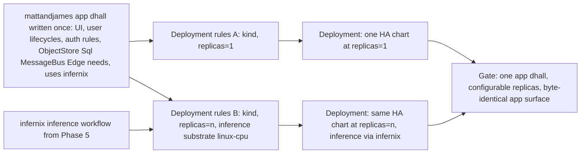

# Phase 8: mattandjames as application-logic-only

**Status**: Authoritative source
**Supersedes**: N/A
**Referenced by**: README.md, legacy_tracking_for_deletion.md, overview.md
**Generated sections**: none

> **Purpose**: Reduce `mattandjames` to application logic only — its UI, user lifecycles, durable data,
> and auth rules expressed as capability needs — so that one app `.dhall` deploys at a configurable
> replica count with inference delegated to an infernix workflow, with distro, replicas, and inference
> substrate all driven from an orthogonal deployment-rules layer.

---

## Phase Status

📋 Planned. The mattandjames reduction is specified, not started; every sprint below is design intent
and every prescriptive statement is a target shape, not a tested amoebius result. mattandjames's
*current* behaviour is observed sibling fact; the boiled-down target is the contract this phase intends
to satisfy.

## Phase Summary

This phase makes mattandjames the **proof case** for the application-logic-vs-deployment-rules split.
**Today** mattandjames welds deployment decisions into the application: it ships a naive **CPU-only
inference engine**, deploys itself **exclusively on kind** in a **mock 3-replica mode**, and simulates
HA by standing up *multiple kind clusters*. Scale, substrate, and HA strategy are all baked into the
app, so the "3" cannot change without editing the application and the inference engine cannot move off
CPU without a rewrite.

This phase boils mattandjames down to **application logic only** and proves the reduction, in order:

1. **Extract the application-logic surface.** Strip every deployment decision out of mattandjames,
   leaving exactly what the app *is* — its UI, user lifecycles, durable data, Pulsar topics, and
   Keycloak-backed auth rules. Everything that survives a move stays; everything about scale, placement,
   and robustness leaves.
2. **Re-express its service dependencies as capability needs.** The buckets become `ObjectStore`
   resources, the database becomes a `Sql` resource, the topics become `MessageBus` resources, the auth
   becomes `Identity`, the published UI becomes `Edge` — **named as capabilities, never as products**.
   The app spec gains no syntax for `minio`, `keycloak`, or `pulsar`.
3. **Author the deployment-rules layer that runs it.** The mock-3-replica pattern collapses to a
   `replicas=n` dial on an unchanged HA chart; the multi-kind-cluster HA simulation collapses to the
   standard HA stack at the chosen replica count; the distro (kind / rke2 / provider) becomes a
   deployment dial.
4. **Replace naive CPU inference with an infernix workflow.** The app declares *that* it uses infernix
   (application logic); *where* inference runs — linux-cpu here — is bound in the deployment-rules layer.
5. **Prove the reduction** on linux-cpu: one app `.dhall`, deployed at two different replica counts from
   **byte-identical app bytes**, with inference flowing through infernix.

This phase consumes Phase 2's HA-always charts and typed reconciler, Phase 3's two DSL surfaces and the
capability abstraction, and Phase 5's migrated, deterministic infernix CPU-inference workflow; it
re-implements none of them. mattandjames is treated as evidence the design is realizable — its current
welded-in behaviour is a sibling fact, not an amoebius proof, and the reduced shape is the target.

**Substrate:** linux-cpu (§L) — the gate deploys mattandjames on a single linux-cpu substrate and runs
inference on CPU; Apple Metal and CUDA placements are out of contract here, since the inference substrate
is exactly the deployment dial this phase keeps swappable without touching the app.

**Gate:** mattandjames deploys from **one app `.dhall`** at a configurable replica count, with inference
flowing through an infernix workflow. Concretely: the same app spec is composed with two deployment-rules
layers (e.g. `replicas=1` and `replicas=3`) on linux-cpu; both come up on the standard HA stack; the app
spec is **byte-identical** across the two deployments (the diff is entirely in the deployment-rules
layer); and an inference request is served by infernix, not by a hand-rolled CPU engine. The run emits a
proven/tested/assumed ledger artifact recording app-surface byte-invariance as *tested* and recording
that no cross-substrate inference claim was made.

## Doctrine adopted

- [`app_vs_deployment_doctrine.md` §6 — The proof case: mattandjames boiled to application-logic-only](../documents/engineering/app_vs_deployment_doctrine.md#6-the-proof-case-mattandjames-boiled-to-application-logic-only),
  resting on [§2 — The application-logic surface](../documents/engineering/app_vs_deployment_doctrine.md#2-the-application-logic-surface--what-an-app-is),
  [§3 — The deployment-rules surface](../documents/engineering/app_vs_deployment_doctrine.md#3-the-deployment-rules-surface--how-the-same-app-runs),
  and [§7 — infernix is a shared library; the inference substrate is a deployment rule](../documents/engineering/app_vs_deployment_doctrine.md#7-infernix-is-a-shared-library-the-inference-substrate-is-a-deployment-rule):
  this phase *is* the reduction §6 describes — it strips deployment decisions out of mattandjames so the
  app-spec surface (§2) holds only what the app is, the deployment-rules surface (§3) holds distro /
  replicas / inference substrate, and the naive CPU engine is replaced by an infernix workflow whose
  placement is a deployment rule (§7). It is the doctrine's named demonstration, carried from design
  intent to a tested linux-cpu reduction.
- [`service_capability_doctrine.md` §1 — Why capabilities, not products](../documents/engineering/service_capability_doctrine.md#1-why-capabilities-not-products),
  with [§2 — The capability set](../documents/engineering/service_capability_doctrine.md#2-the-capability-set)
  and the binding model in [§4 — Capability → provider → shape: the binding](../documents/engineering/service_capability_doctrine.md#4-capability--provider--shape-the-binding):
  this phase re-expresses mattandjames's durable data, messaging, identity, and edge dependencies as
  **capability needs** (`ObjectStore` / `Sql` / `MessageBus` / `Identity` / `Edge`) so the app names
  capabilities and never products — there is no syntax in the reduced spec for `minio` or `keycloak` —
  while the provider+shape binding lives in the deployment-rules layer.

## Sprints

## Sprint 8.1: Extract the mattandjames application-logic surface 📋

**Status**: Planned
**Implementation**: `mattandjames/src/MattAndJames/App.hs`, `mattandjames/dhall/app.dhall` (target paths; not yet built)
**Blocked by**: Phase 3 (the two DSL surfaces + the app-spec type family)
**Independent Validation**: a diff of the reduced mattandjames against its current source shows every deployment decision removed — no replica count, no distro selector, no multi-kind-cluster HA simulation, no inference-engine selection — and the app-spec `.dhall` type-checks against the Phase 3 app-spec type with zero deployment fields present (they have no place to be typed).
**Docs to update**: `documents/engineering/app_vs_deployment_doctrine.md`

### Objective

Adopt [`app_vs_deployment_doctrine.md` §2 — The application-logic surface](../documents/engineering/app_vs_deployment_doctrine.md#2-the-application-logic-surface--what-an-app-is)
and the reduction described in [§6 — The proof case](../documents/engineering/app_vs_deployment_doctrine.md#6-the-proof-case-mattandjames-boiled-to-application-logic-only):
strip mattandjames down to exactly what the app *is* — UI, user lifecycles, durable data, Pulsar topics,
Keycloak-backed auth rules — and remove every deployment decision currently welded into it.

### Deliverables

- A reduced `MattAndJames.App` library that contains only application logic: UI/user-lifecycle handlers,
  auth-rule definitions, and durable-data access — with the mock-3-replica wiring, the multi-kind-cluster
  HA simulation, and the distro selection deleted.
- An `app.dhall` skeleton typed against the Phase 3 app-spec type, carrying the app's name (unique per
  cluster, naming its own namespace) and its surface declarations, and **no** deployment vocabulary
  (no `replicas`, `distro`, `region`, `failover`, or `substrate` field — the type has nowhere to put
  them).
- A removal note in [legacy_tracking_for_deletion.md](legacy_tracking_for_deletion.md) recording the
  welded-in deployment code this sprint retires.

### Validation

1. The reduced library compiles with no reference to a replica count, a cluster count, or a distro.
2. `app.dhall` type-checks against the app-spec type; an attempt to add a `replicas` field fails to
   type-check (the field does not exist on the app surface).

### Remaining Work

The whole sprint.

## Sprint 8.2: Re-express mattandjames dependencies as capability needs 📋

**Status**: Planned
**Implementation**: `mattandjames/dhall/app.dhall` (capability-needs records; target path, not yet built)
**Blocked by**: Sprint 8.1; Phase 3 (the capability abstraction — capability needs + the alternate-admitting provider binding)
**Independent Validation**: the reduced `app.dhall` declares each service dependency against a capability arm (`ObjectStore` / `Sql` / `MessageBus` / `Identity` / `Edge`) and contains **no product literal** — a grep for `minio`, `keycloak`, `pulsar`, `patroni`, or `postgres` in the app surface returns nothing, and a spec that names a product fails Gate 1 (the Dhall typechecker) because the app surface has no product arm.
**Docs to update**: `documents/engineering/service_capability_doctrine.md`

### Objective

Adopt [`service_capability_doctrine.md` §1 — Why capabilities, not products](../documents/engineering/service_capability_doctrine.md#1-why-capabilities-not-products)
and [§2 — The capability set](../documents/engineering/service_capability_doctrine.md#2-the-capability-set):
read mattandjames's durable buckets, database, topics, auth, and published UI as **resources of a
capability**, so the app says "I keep these buckets" against `ObjectStore`, "I keep a database" against
`Sql`, "I own these topics" against `MessageBus`, "I gate these surfaces" against `Identity`, and "I
publish this UI" against `Edge` — never naming the product behind any of them.

### Deliverables

- `app.dhall` capability-need records: the mattandjames buckets as `ObjectStore` resources
  (`<app>/<bucket>`), its relational data as a `Sql` need, its event/workflow topics as `MessageBus`
  resources, its OIDC authorization rules as an `Identity` need, and its reachable UI as an `Edge`
  publish — each declared against the capability arm, with no provider or shape named.
- Secret references carried **by name only** (a typed `SecretRef`), never a literal — the credential
  binding is resolved in-cluster by Vault and is out of scope for the app surface.
- An `Edge` declaration that publishes *what* is reachable without opening a backdoor — wild ingress
  remains the Identity-owned door, so the spec publishes a route, not an unauthenticated one.

### Validation

1. Every service dependency in `app.dhall` resolves to a capability arm; no product name appears on the
   app surface.
2. A deliberately-illegal variant that names `minio` directly fails to type-check (no product arm
   exists), demonstrating the capability indirection is enforced, not merely advised.

### Remaining Work

The whole sprint.

## Sprint 8.3: Deployment-rules layer — distro, replicas, and the capability binding 📋

**Status**: Planned
**Implementation**: `mattandjames/dhall/deploy/linux_cpu.dhall`, `mattandjames/dhall/deploy/replicas3.dhall` (target paths; not yet built)
**Blocked by**: Sprint 8.1; Sprint 8.2; Phase 2 (the HA-always charts + typed reconciler)
**Independent Validation**: two deployment-rules layers referencing the same app by name — one `replicas=1`, one `replicas=3` — each compose with the byte-identical `app.dhall` and render to manifests on the standard HA stack; the app spec is unchanged across both, and the only diff is in the deployment-rules `.dhall`.
**Docs to update**: `documents/engineering/app_vs_deployment_doctrine.md`, `documents/engineering/service_capability_doctrine.md`

### Objective

Adopt [`app_vs_deployment_doctrine.md` §3 — The deployment-rules surface](../documents/engineering/app_vs_deployment_doctrine.md#3-the-deployment-rules-surface--how-the-same-app-runs)
and the binding model in [`service_capability_doctrine.md` §4 — Capability → provider → shape: the binding](../documents/engineering/service_capability_doctrine.md#4-capability--provider--shape-the-binding):
author the deployment-rules layer that runs mattandjames — collapsing the mock-3-replica pattern to a
`replicas=n` dial on an unchanged HA chart (HA even at `replicas=1`, per
[`platform_services_doctrine.md` §2 — HA always](../documents/engineering/platform_services_doctrine.md#2-ha-always--including-replicas1)),
collapsing the multi-kind-cluster HA simulation to the standard HA stack, and exposing distro
(kind / rke2 / provider) as a deployment dial.

### Deliverables

- A deployment-rules `.dhall` keyed by the mattandjames app name, declaring the distro, the replica
  count, and the capability provider+shape bindings (canonical providers by default; single-node shapes
  on a small cluster).
- Two concrete layers — `replicas=1` and `replicas=3` — that compose with the *same* `app.dhall` and
  render to the standard HA stack at the chosen replica count, with the mock-3-cluster simulation gone.
- A check that the replica value rides an unchanged chart: the rendered manifest graph is the same shape
  at `replicas=1` and `replicas=3`, differing only in the replica integer (the structural per-cluster
  *shape* choice — single-node vs distributed providers — is the deployment-rules dial, not an app
  edit).

### Validation

1. Both layers compose with the byte-identical `app.dhall`; the app spec hash is unchanged across them.
2. The `replicas=1` deployment is HA-structured (same chart shape), not a degraded single-pod
   special-case.

### Remaining Work

The whole sprint.

## Sprint 8.4: Inference as an infernix workflow; substrate as a deployment rule 📋

**Status**: Planned
**Implementation**: `mattandjames/src/MattAndJames/Inference.hs`, `mattandjames/dhall/app.dhall` (the `uses infernix` declaration), `mattandjames/dhall/deploy/linux_cpu.dhall` (the inference-substrate binding) (target paths; not yet built)
**Blocked by**: Sprint 8.1; Phase 5 (infernix migrated onto the amoebius runtime + deterministic CPU inference)
**Independent Validation**: the reduced mattandjames calls an infernix inference workflow rather than its naive CPU engine; the app spec declares *that* it uses infernix (a shared-library dependency) while the inference-substrate binding (linux-cpu here) lives in the deployment-rules layer — toggling that binding changes no mattandjames source.
**Docs to update**: `documents/engineering/app_vs_deployment_doctrine.md`, `documents/engineering/content_addressing_doctrine.md`

### Objective

Adopt [`app_vs_deployment_doctrine.md` §7 — infernix is a shared library; the inference substrate is a deployment rule](../documents/engineering/app_vs_deployment_doctrine.md#7-infernix-is-a-shared-library-the-inference-substrate-is-a-deployment-rule):
delete mattandjames's naive CPU inference engine and route inference through the Phase 5 infernix
workflow — declaring *that the app uses infernix* on the application-logic surface, while binding *where
inference runs* (linux-cpu) in the deployment-rules layer, with the infernix `.dhall` nested inside the
mattandjames spec rather than living as a parallel system.

### Deliverables

- `MattAndJames.Inference` rewritten to invoke the infernix inference workflow (the migrated, shared
  library from Phase 5) — the naive hand-rolled CPU decode removed.
- An `app.dhall` declaration that mattandjames *uses infernix* (a shared-library dependency = application
  logic), with infernix's own configuration composed (nested) into the mattandjames spec.
- An inference-substrate binding in the deployment-rules layer set to linux-cpu for this phase, written
  so the same app source would accept a different substrate binding (Apple Metal / CUDA) without an app
  edit — out of contract to *run* here, but the binding point is proven swappable.

### Validation

1. An inference request from mattandjames is served by the infernix workflow; no naive CPU engine remains
   in the source.
2. Changing the inference-substrate binding in the deployment-rules `.dhall` changes no mattandjames
   `.hs` or `app.dhall` source — the classification (dependency = app logic, placement = deployment rule)
   holds mechanically.

### Remaining Work

The whole sprint.

## Sprint 8.5: The reduction gate — one app `.dhall`, configurable replicas, infernix inference 📋

**Status**: Planned
**Implementation**: `test/dhall/phase_08_mattandjames.dhall` (target path; not yet built)
**Blocked by**: Sprint 8.3; Sprint 8.4
**Independent Validation**: a gate `.dhall` deploys mattandjames on linux-cpu from one app spec under two deployment-rules layers (`replicas=1`, `replicas=3`), asserts the app-spec bytes are identical across both, serves an inference request via infernix, tears the deployments down, and emits a proven/tested/assumed ledger artifact.
**Docs to update**: `documents/engineering/app_vs_deployment_doctrine.md`

### Objective

Adopt [`app_vs_deployment_doctrine.md` §6 — The proof case: mattandjames boiled to application-logic-only](../documents/engineering/app_vs_deployment_doctrine.md#6-the-proof-case-mattandjames-boiled-to-application-logic-only):
prove the whole reduction on linux-cpu — that mattandjames now deploys from **one app `.dhall`** at a
configurable replica count with inference via infernix, and that the app surface is byte-invariant across
two deployments whose only difference is the deployment-rules layer.

### Deliverables

- A gate `.dhall` (`test/dhall/phase_08_mattandjames.dhall`) that spins mattandjames up under
  `replicas=1` and again under `replicas=3` on linux-cpu, exercises an infernix inference request against
  the running app, and tears both down.
- An assertion that the resolved `app.dhall` normal form is byte-identical across the two deployments —
  the diff is entirely in the deployment-rules layer.
- A proven/tested/assumed ledger artifact recording: app-surface byte-invariance as **tested on
  linux-cpu**, the `replicas=n` collapse as **tested**, infernix inference as **tested**, and any
  cross-substrate inference claim as **explicitly not asserted** (the Apple Metal / CUDA placements are
  out of contract for this gate).

### Validation

1. Both replica counts come up on the standard HA stack and serve the mattandjames UI through the
   Identity-owned edge.
2. The app-spec normal form is byte-identical across the two deployments; inference is served by
   infernix; teardown leaves no residue.
3. The ledger artifact is emitted and marks no cross-substrate inference claim green.

### Remaining Work

The whole sprint.

## Documentation Requirements

**Engineering docs to update:**
- `documents/engineering/app_vs_deployment_doctrine.md` — when the reduction ships, §6 gains a concrete
  amoebius reference: the mattandjames module/`.dhall` paths as the realized "boiled to
  application-logic-only" demonstration, and §7 gains the inference-substrate binding point as a tested
  swap (status recorded here in the plan, never as doctrine status).
- `documents/engineering/service_capability_doctrine.md` — record mattandjames's `app.dhall` as a worked
  example of an app naming capability needs (`ObjectStore` / `Sql` / `MessageBus` / `Identity` / `Edge`)
  with no product literal on the app surface.
- `documents/engineering/content_addressing_doctrine.md` — note that the mattandjames inference path now
  rides the Phase 5 infernix workflow, inheriting its determinism contract rather than re-deriving one.

**Cross-references to add:**
- README.md — link the Phase 8 row to this document and mark the gate status as it progresses.
- system_components.md — add the reduced mattandjames modules (`MattAndJames.App`,
  `MattAndJames.Inference`) and its `app.dhall` / deployment-rules `.dhall` to the component inventory.
- substrates.md — add the Phase 8 → linux-cpu row to the per-phase substrate map.
- legacy_tracking_for_deletion.md — record the welded-in mock-3-replica / multi-kind-cluster /
  naive-CPU-engine code the reduction retires.

## Related Documents

- [README.md](README.md) — the live tracker; Phase 8 objective, gate, and substrate
- [development_plan_standards.md](development_plan_standards.md) — the rulebook this document obeys
- [overview.md](overview.md) — target architecture and constraints
- [system_components.md](system_components.md) — target component inventory (the reduced mattandjames modules)
- [substrates.md](substrates.md) — substrate registry and per-phase map
- [legacy_tracking_for_deletion.md](legacy_tracking_for_deletion.md) — the removal ledger for the welded-in deployment code
- [Application Logic vs Deployment Rules Doctrine](../documents/engineering/app_vs_deployment_doctrine.md) — the proof case this phase realizes
- [Service Capability Doctrine](../documents/engineering/service_capability_doctrine.md) — capabilities, never products, named on the app surface
- [Platform Services Doctrine](../documents/engineering/platform_services_doctrine.md) — HA-always charts the `replicas=n` dial rides
- Earlier phase: Phase 3 — Orchestration Dhall DSL + control-plane singleton (the two DSL surfaces + the capability abstraction this phase uses)
- Earlier phase: Phase 5 — Determinism kernel + infernix migration (the infernix inference workflow this phase delegates to)
- Next phase: Phase 9 — Multi-cluster: amoebic spawning + geo-replication + failover (the zero-app-change geo-replication case the same app surface enables)
