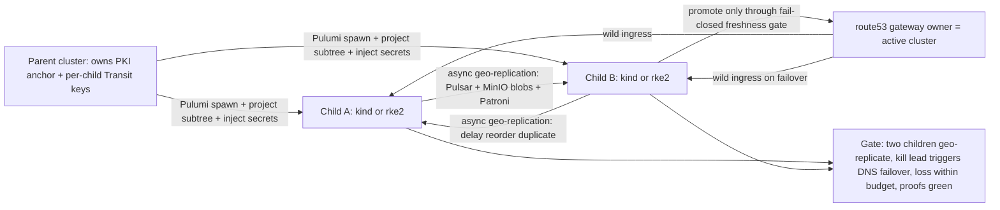

# Phase 9: Multi-cluster: amoebic spawning + geo-replication + failover

**Status**: Authoritative source
**Supersedes**: N/A
**Referenced by**: README.md, overview.md
**Generated sections**: none

> **Purpose**: Turn the single-cluster control plane into a recursive forest — a parent spawns child
> clusters, hands each only its own `project(subtree)` spec under a per-child Transit key, geo-replicates
> two siblings over Pulsar/MinIO/Postgres, and fails the wild-ingress gateway over with a route53 repoint —
> then discharge the one per-system proof obligation amoebius owns: the invariant-confluence async
> cross-cluster failover boundary, with green TLA+/io-sim artifacts and an honest proven/tested/assumed
> ledger.

---

## Phase Status

📋 Planned. Amoebic spawning, per-child unseal, geo-replication, gateway failover, teardown-vs-chaos
distinction, the unsatisfiable-`.dhall` push-back, and the cross-cluster failover proof are all specified
and unstarted; every sprint below is design intent and every prescriptive statement is a target shape, not
a tested amoebius result. Where this phase leans on the sibling prodbox project (the gateway single-writer
pattern, the transit-seal trust tree), that is **sibling evidence**, not amoebius proof.

## Phase Summary

This phase crosses the line the chaos/failover doctrine calls the **Second Axis**: the moment a parent
spawns a child and the two geo-replicate, the system stops being one strongly-consistent cluster and
becomes a forest with an **asynchronous** boundary between its clusters. It does five things, in order:

1. **Amoebic spawn** — a parent provisions a child cluster (`kind`/`rke2` via SSH-key Pulumi, run from
   inside the parent with a MinIO backend Vault-enveloped per the Pulumi IaC doctrine) and hands the child
   exactly its own subtree: the value the child receives is, by construction, `project(subtree)` — a typed
   `ChildInForceSpec` in which no sibling or ancestor-only branch can appear.
2. **Per-child unseal + secret injection** — the child Vault comes up in one of exactly two sanctioned
   modes (self-unseal from a k8s secret, or parent-held unlock), its subtree spec is enveloped under a
   **per-child Vault Transit key** so it cannot decrypt a sibling's subtree even under an unsealed parent,
   and the parent injects named secrets directly into the child's Vault.
3. **Geo-replication** — two sibling children replicate a realtime workflow over Pulsar (native binary
   protocol, no WebSockets), content-addressed write-once MinIO blobs, and Patroni Postgres. Per the
   invariant-confluence classifier, the bulk of this data plane is **confluent by construction** and crosses
   the boundary safely; only the gateway authority and any mutable "latest" pointer remain non-confluent
   singletons.
4. **Gateway failover** — the wild-ingress gateway (owned by Keycloak over the LB + Gateway API) is a
   single cross-cluster authority. On a chaos-failover the surviving sibling promotes **only through a
   fail-closed freshness gate**, repoints route53, and accepts a bounded data-loss suffix — distinguished
   sharply from a graceful teardown-with-cleanup that rides a synchronization event and is lossless by
   construction.
5. **The proof** — this phase carries the **TLA+/io-sim** artifact for the async cross-cluster failover
   boundary (intra-cluster consensus is delegated to MinIO/Pulsar/Postgres-Patroni, which run their own),
   plus the per-run proven/tested/assumed ledger the gate checks.

This phase is where the **cluster-topology types** (Phase 3, Sprint 3.6) are exercised live: a multi-node
`rke2` child spawns one node **per Linux host** (SSH-keyed), so "more nodes than hosts" or "a host reused"
— unrepresentable at decode ([`illegal_state_catalog.md`](../documents/engineering/illegal_state_catalog.md)
§3.16, [`cluster_topology_doctrine.md`](../documents/engineering/cluster_topology_doctrine.md) §4) — is
realized by actually standing up N nodes on N hosts, and a multi-node `kind` child stays on its single host
(§3.15). The type layer forbids the illegal topology; this phase proves the legal one converges (runtime-checked).

The phase consumes earlier phases and does not re-implement them: Phase 1's bootstrap of a `kind`/`rke2`
cluster, Phase 2's root Vault/PKI + retained-PV storage + platform services, Phase 3's Dhall DSL +
control-plane singleton, and Phase 4's native Pulsar client + content-addressed store. prodbox is treated
as evidence that the design is realizable — its gateway single-writer record and its transit-seal trust
tree are a sibling result, not an amoebius proof.

**Substrate:** linux-cpu (§L) — the gate spins up the parent and both child clusters as `kind`/`rke2`
clusters on a single linux-cpu host; no accelerator and no provider cluster is in scope (provider-managed
clusters are Phase 10). Partition tolerance is a capability the cross-cluster model **reserves for the
multi-cluster substrate**, exercised here by killing a sibling on the same host — not a property a single
root cluster exercises.

**A stretched cluster is not geo-replication (boundary distinction; §L cross-ref).** This phase's Second Axis is
*N* separate clusters, each its own etcd, related only by an **asynchronous** Pulsar/MinIO/Postgres link — that is
what owes the R9 data-loss budget and the cross-cluster failover proof. A **stretched cluster** (the §L design
this round introduces) is by contrast **one** cluster — one etcd, one boundary, one `Topology` whose nodes merely
span network `Site`s over a WAN fabric — so it owes **no** R9 budget and **no** Second-Axis obligation, and is
explicitly **out of scope for this phase**
([`single_logical_data_plane_doctrine.md`](../documents/engineering/single_logical_data_plane_doctrine.md) §1/§5,
[`cluster_topology_doctrine.md`](../documents/engineering/cluster_topology_doctrine.md) §4.1,
[`substrate_doctrine.md`](../documents/engineering/substrate_doctrine.md) §8). Do not conflate a stretched single
cluster with the geo-replicated forest this phase proves.

**Gate:** two children geo-replicate a workflow; killing the lead cluster mid-workflow triggers gateway
failover and a route53 repoint to the surviving sibling; the measured data loss is **≤ the declared
data-loss budget**; the TLA+ safety/liveness checks pass at scope 2 clusters and the io-sim drills pass; and
the run emits a proven/tested/assumed ledger artifact that records the recovery-time bound as *tested*
(drilled), the data-loss bound as *assumed* (monitored, not proven), and marks no assumed-and-monitored
result as proven.

## Doctrine adopted

- [`chaos_failover_doctrine.md` §16 — The Second Axis: when one cluster becomes a forest](../documents/engineering/chaos_failover_doctrine.md#16-the-second-axis--when-one-cluster-becomes-a-forest),
  resting on [§6 — The concentration principle: where the obligation lives](../documents/engineering/chaos_failover_doctrine.md#6-the-concentration-principle--where-the-obligation-lives),
  [§17 — The boundary and its classifier](../documents/engineering/chaos_failover_doctrine.md#17-the-boundary-and-its-classifier),
  [§18 — The rules scale to the boundary](../documents/engineering/chaos_failover_doctrine.md#18-the-rules-scale-to-the-boundary),
  and [§19 — The cross-boundary ledger and conformance rows](../documents/engineering/chaos_failover_doctrine.md#19-the-cross-boundary-ledger-and-conformance-rows):
  this phase **is** the Second Axis — the one place a per-system proof concentrates. It implements the
  invariant-confluence classification of every crossing mutable invariant (R1/§17), the fail-closed
  promotion-freshness gate and active-merge reconciliation (R7), the named-bounded-monitored replication lag
  (R8), and the two-dimensional failover budget — bounded permanent data loss and bounded recovery time
  (R9) — and keeps the cross-boundary ledger honest (§19). The doctrine works this exact shape through in
  its Appendix B worked example; this phase realizes it.
- [`vault_pki_doctrine.md` §6 — Parent/child unseal: two sanctioned modes](../documents/engineering/vault_pki_doctrine.md#6-parentchild-unseal-two-sanctioned-modes),
  with [§7 — Parent injects secrets into the child's Vault](../documents/engineering/vault_pki_doctrine.md#7-parent-injects-secrets-into-the-childs-vault):
  this phase implements the recursive parent/child spawn unseal — mode (a) self-unseal from a k8s secret or
  mode (b) parent-held unlock with the brick cascading down a sealed subtree — and the per-child Vault
  Transit key (`transit/amoebius-<child-id>-config`) that makes a sibling's subtree cryptographically
  undecryptable even under an unsealed parent, plus the parent-injects-named-secrets-into-the-child's-Vault
  path (Dhall names only; the parent materializes the bytes).
- [`cluster_lifecycle_doctrine.md` §3 — Amoebic spawning: the recursive forest](../documents/engineering/cluster_lifecycle_doctrine.md#3-amoebic-spawning--the-recursive-forest),
  with [§5 — Teardown-with-cleanup vs chaos-failover](../documents/engineering/cluster_lifecycle_doctrine.md#5-teardown-with-cleanup-vs-chaos-failover-the-central-distinction),
  [§6 — Push-back when teardown would break the root `InForceSpec`](../documents/engineering/cluster_lifecycle_doctrine.md#6-push-back-when-teardown-would-break-the-root-inforcespec),
  and [§9 — the reconciler, not a state machine](../documents/engineering/cluster_lifecycle_doctrine.md#9-how-bring-up-and-teardown-are-implemented-the-reconciler-not-a-state-machine):
  this phase implements the `project(subtree)` handoff (a child gets only its own subtree, structurally and
  cryptographically), the central distinction between a polite lossless teardown and a violent bounded-loss
  chaos-failover, and the declarative push-back that refuses a teardown which would make the root `InForceSpec`
  unsatisfiable — all enacted as `discover → diff → enact → re-observe` reconciles over a managed-resource
  registry, never a bespoke lifecycle state machine.
- [`tla_modelling_assumptions.md` §2 — The single proof obligation this model discharges](../documents/engineering/tla_modelling_assumptions.md#2-the-single-proof-obligation-this-model-discharges),
  with [§3 — The question the model must answer](../documents/engineering/tla_modelling_assumptions.md#3-the-question-the-model-must-answer)
  and [§4 — Planned structure (the skeleton, not the content)](../documents/engineering/tla_modelling_assumptions.md#4-planned-structure-the-skeleton-not-the-content):
  this phase authors the reserved TLA+ artifact — the abstract two-cluster system model, the
  variable-to-implementation correspondence, the modelling bounds, the invariant catalog, and the honest
  verification status — defining *and then proving* "well-defined behaviour" for a failover into a
  partially-synced cluster, tying the gate to the measurement *loss ≤ declared budget, proofs green*.
- [`monitoring_doctrine.md` §6 — The parent-monitoring posture](../documents/engineering/monitoring_doctrine.md#6-the-parent-monitoring-posture):
  peer-cluster monitoring rides the existing async geo-replication (Sprint 9.3) plus the exported R8 live-lag
  monitor and `DataLossBudget` this phase already ships; in-cluster parent→child telemetry is **foreclosed** by
  the `ChildInForceSpec` no-ancestor isolation (Sprint 9.1) rather than deferred, with a one-way out-of-forest
  sealed attestation channel left as an explicitly-open later question.

## Sprints

## Sprint 9.1: Amoebic spawn — parent provisions a child + `project(subtree)` handoff 📋

**Status**: Planned
**Implementation**: `src/Amoebius/Multicluster/Spawn.hs`, `src/Amoebius/Dsl/ChildInForceSpec.hs`, `pulumi/child-cluster/Pulumi.yaml` (target paths; not yet built)
**Blocked by**: Phase 1 (bootstrap a `kind`/`rke2` cluster idempotently); Phase 2 (root Vault/PKI trust anchor + retained-PV storage); Phase 3 (the Dhall DSL + control-plane singleton); Phase 4 (Pulumi-from-inside-the-cluster with a Vault-enveloped MinIO backend)
**Independent Validation**: a parent spawns one child `kind` cluster from inside itself; the child comes up empty and reconciles toward the spec; the child's received value is shown — at the type level — to be `project(subtree)` with no field carrying a sibling or ancestor-only branch, so handing a child anything beyond its own subtree fails to type-check.
**Docs to update**: `documents/engineering/cluster_lifecycle_doctrine.md`, `documents/engineering/pulumi_iac_doctrine.md`, `documents/engineering/dsl_doctrine.md`

### Objective

Adopt [`cluster_lifecycle_doctrine.md` §3 — Amoebic spawning: the recursive forest](../documents/engineering/cluster_lifecycle_doctrine.md#3-amoebic-spawning--the-recursive-forest):
implement the spawn as a Pulumi deploy run from inside an existing cluster (one rule:
[`pulumi_iac_doctrine.md` §1 — Pulumi runs only from inside an existing amoebius cluster](../documents/engineering/pulumi_iac_doctrine.md#1-pulumi-runs-only-from-inside-an-existing-amoebius-cluster)),
tracked in a MinIO backend encrypted via Vault Transit, and deliver the structural `project(subtree)`
projection so a child receives exactly its own subtree spec — including its own children's — and nothing
about siblings or any wider part of the forest.

### Deliverables

- A `ChildInForceSpec` Dhall/Haskell type that is, by construction, the projection of a parent spec onto one
  subtree — no field admits a sibling or ancestor-only branch, so a cross-subtree handoff is
  unrepresentable (the illegal-state discipline applied to the forest).
- A `spawnChild` action: SSH-key (`kind`/`rke2`) Pulumi deploy from inside the parent, tracked in a
  Vault-enveloped MinIO backend, registered as a typed managed resource (carrying its own `discover` and
  `destroy`).
- A grandchild path proven recursively: a spawned child can itself spawn, so the projection composes to
  arbitrary depth.

### Validation

1. End-to-end: `amoebius` on the parent brings up an empty child `kind` cluster on linux-cpu; re-running
   the spawn is a no-op (idempotent reconcile).
2. Type-level: there is no total function producing a `ChildInForceSpec` that contains a sibling's branch; the
   only constructor is the subtree projection.

### Remaining Work

The whole sprint.

## Sprint 9.2: Per-child Vault unseal + per-child Transit key + secret injection 📋

**Status**: Planned
**Implementation**: `src/Amoebius/Multicluster/ChildUnseal.hs`, `src/Amoebius/Vault/TransitChildKey.hs`, `src/Amoebius/Multicluster/SecretInjection.hs` (target paths; not yet built)
**Blocked by**: Sprint 9.1; Phase 2 (root Vault init + the PKI trust anchor)
**Independent Validation**: a spawned child unseals in each of the two sanctioned modes; the child's subtree ciphertext decrypts only under `transit/amoebius-<child-id>-config` and a sibling's key cannot decrypt it even with the parent's Vault unsealed; a named `SecretRef` resolves to bytes the parent injected into the child's Vault, never from a Dhall fragment or an environment variable.
**Docs to update**: `documents/engineering/vault_pki_doctrine.md`, `documents/engineering/cluster_lifecycle_doctrine.md`

### Objective

Adopt [`vault_pki_doctrine.md` §6 — Parent/child unseal: two sanctioned modes](../documents/engineering/vault_pki_doctrine.md#6-parentchild-unseal-two-sanctioned-modes)
and [§7 — Parent injects secrets into the child's Vault](../documents/engineering/vault_pki_doctrine.md#7-parent-injects-secrets-into-the-childs-vault):
implement the typed seal-mode field of the child `.dhall` — (a) self-unseal from a k8s secret or (b)
parent-held unlock — with the fail-closed brick cascading down a sealed subtree, the per-child Transit key
that enforces the horizontal need-to-know boundary cryptographically (not merely by which ciphertext was
handed down), and the parent→child secret-injection path that materializes named secrets directly into the
child's Vault over the spawn-time trust channel.

### Deliverables

- A `SealMode` type (`SelfUnseal` | `ParentHeldUnlock`) decoded from the child `.dhall`, with mode (b)
  configured as a Vault transit seal pointed at the parent and the child's recovery keys + initial root
  token custodied in the parent's Vault KV (prodbox's transit-seal tree as the evidence-backed realization
  of mode (b)).
- Per-child Transit key provisioning (`transit/amoebius-<child-id>-config`) with a per-child policy granting
  decrypt on that key alone, and a per-child-sharded id↔object index.
- A `injectSecret` action resolving a `SecretRef` from the parent's unsealed Vault and writing it into the
  child's Vault; in-cluster consumers read it via Vault Kubernetes auth.

### Validation

1. Mode (b): with the parent sealed/unreachable, the child cannot unseal (brick); with the parent unsealed,
   the child unseals. Mode (a): the child unseals from its own k8s secret with no parent dependency.
2. Cryptographic isolation: decrypting child A's subtree under child B's Transit key fails even with the
   parent's Vault unsealed.
3. A workload on the child reads an injected secret value via Vault k8s auth; no plaintext secret ever sits
   in a Dhall file or env var.

### Remaining Work

The whole sprint.

## Sprint 9.3: Geo-replication of two siblings + invariant-confluence classification 📋

**Status**: Planned
**Implementation**: `src/Amoebius/Multicluster/GeoReplication.hs`, `src/Amoebius/Multicluster/ConfluenceClass.hs` (target paths; not yet built)
**Blocked by**: Sprint 9.1; Phase 4 (native Pulsar client + three-tier content-addressed store); Phase 2 (MinIO + Patroni Postgres platform services)
**Independent Validation**: two sibling children replicate a `command → event* → result` workflow over Pulsar geo-replication, write-once content-addressed MinIO blobs, and Patroni Postgres; a duplicate cross-cluster write is shown idempotent; every crossing mutable multi-record invariant is sorted by the §17 classifier into confluent (crosses freely) or non-confluent (held by bounded authority), with an unclassified invariant defaulting to non-confluent.
**Docs to update**: `documents/engineering/chaos_failover_doctrine.md`, `documents/engineering/content_addressing_doctrine.md`, `documents/engineering/platform_services_doctrine.md`

### Objective

Adopt [`chaos_failover_doctrine.md` §17 — The boundary and its classifier](../documents/engineering/chaos_failover_doctrine.md#17-the-boundary-and-its-classifier),
realized over the confluent data plane of
[`content_addressing_doctrine.md` §5 — Confluence: content-addressed data crosses cluster boundaries safely](../documents/engineering/content_addressing_doctrine.md#5-confluence-content-addressed-data-crosses-cluster-boundaries-safely):
wire asynchronous geo-replication between two siblings and run the invariant-confluence test (R1) on every
mutable multi-record invariant that crosses the boundary *before* assigning a mechanism — so content-
addressed blobs and the Pulsar work-id-keyed log land in bucket (i) and cross freely, while the gateway
authority and any CAS "latest" pointer are correctly held in bucket (ii) for Sprint 9.4.

### Deliverables

- Pulsar geo-replication (native binary protocol, no WebSockets) between two sibling children, with the
  consumer decision a **pure fold keyed by a replication-surviving work-id** that absorbs duplication,
  reordering, and late-after-heal arrival (R3 cross-boundary).
- Content-addressed write-once MinIO blob replication (identical content ⇒ identical key, so a duplicate
  cross-cluster write is idempotent) and Patroni Postgres replication for relational state.
- A `ConfluenceClass` classifier value per crossing invariant: confluent (deterministic total merge) vs
  non-confluent (singleton claim/yield, escrow/reservation, or disjoint-namespace allocation), with the
  unclassified default = non-confluent.

### Validation

1. A workflow round-trips between the two siblings; replaying a duplicate or reordered batch produces the
   same fold result (exactly-once for replicated-or-recovered effects).
2. The classifier rejects an "active-active on a non-confluent invariant" wiring at the type/value level —
   such an invariant may cross only in R7's conditional bounded-authority forms.

### Remaining Work

The whole sprint.

## Sprint 9.4: Gateway authority singleton + fail-closed promotion gate + route53 failover 📋

**Status**: Planned
**Implementation**: `src/Amoebius/Multicluster/GatewayAuthority.hs`, `src/Amoebius/Multicluster/PromotionGate.hs`, `src/Amoebius/Multicluster/DnsRepoint.hs` (target paths; not yet built)
**Blocked by**: Sprint 9.3; Phase 2 (Keycloak-owned wild ingress via the LB + Gateway API)
**Independent Validation**: with both siblings geo-replicating, killing the lead cluster mid-workflow drives the surviving sibling to promote *only after* its freshness gate proves it is caught up to a known commit watermark (or holds a fence), then repoint route53; the un-replicated suffix lost at the instant of failover is accounted for **only** by the R9 data-loss budget, never silently resolved to "absent."
**Docs to update**: `documents/engineering/gateway_migration_doctrine.md`, `documents/engineering/chaos_failover_doctrine.md`, `documents/engineering/cluster_lifecycle_doctrine.md`, `documents/engineering/pulumi_iac_doctrine.md`

### Objective

Adopt [`chaos_failover_doctrine.md` §18 — The rules scale to the boundary](../documents/engineering/chaos_failover_doctrine.md#18-the-rules-scale-to-the-boundary)
(R7's fail-closed promotion gate, R8's named/bounded/monitored replication lag, R9's two-dimensional
failover budget), with the Extract discipline of
[§8 — Move I — Extract: make the decision a value](../documents/engineering/chaos_failover_doctrine.md#8-move-i--extract-make-the-decision-a-value)
and the central distinction in
[`cluster_lifecycle_doctrine.md` §5 — Teardown-with-cleanup vs chaos-failover](../documents/engineering/cluster_lifecycle_doctrine.md#5-teardown-with-cleanup-vs-chaos-failover-the-central-distinction):
make the gateway-ownership decision a pure value over an explicit freshness observation and fence — never a
coerced "I read it, therefore it holds" — so the surviving sibling withholds wild-ingress authority until it
proves freshness, then repoints route53. The cross-cluster authority is the
[`daemon_topology_doctrine.md` §3 control-plane singleton](../documents/engineering/daemon_topology_doctrine.md#3-the-control-plane-singleton--exactly-one-elected)
lifted to cluster scale.

### Deliverables

- A pure `GatewayDecision` value: `Serve` is a *liveness* coercion ("I have not seen entries past `X`, so I
  serve") that authorizes no effect and is licensed; a *durability* claim ("those effects never existed") is
  forbidden — the tail beyond `X` stays a typed `NotYetObserved`, reconciled on heal or charged to the R9
  budget.
- A fail-closed `PromotionGate`: the surviving cluster promotes only on a proven commit watermark or a held
  fence, trading recovery time (R9 RTO) for zero divergence beyond the already-lost suffix.
- A route53 repoint enacted via Pulumi-from-inside (DNS-failover owner per the Pulumi IaC doctrine), with a
  deterministic, total, timestamp-free merge of the non-confluent CAS "latest" pointer on failback.
- An exported live-lag monitor (R8) and a declared `DataLossBudget` = (data-loss window, recovery time).

### Validation

1. Kill the lead mid-workflow: the surviving sibling resumes through one authority with measured loss ≤ the
   data-loss window and authority transfer within the recovery-time bound; no replicated-or-recovered effect
   is double-applied.
2. Drive replication lag past the bound: the promotion-freshness gate refuses to promote a too-stale cluster
   and the lag monitor alarms before a breach.
3. A graceful teardown (Sprint 9.5) that *skips* cleanup is shown to silently downgrade to a chaos event and
   forfeit the lossless guarantee — the gate names which guarantee is in force.

### Remaining Work

The whole sprint.

## Sprint 9.5: Teardown-with-cleanup vs chaos-failover + unsatisfiable-`.dhall` push-back 📋

**Status**: Planned
**Implementation**: `src/Amoebius/Multicluster/Teardown.hs`, `src/Amoebius/Multicluster/Pushback.hs` (target paths; not yet built)
**Blocked by**: Sprint 9.1; Sprint 9.4 (clean gateway handoff is part of a graceful teardown)
**Independent Validation**: a graceful teardown of a child drains workloads, flushes Pulsar/MinIO/Postgres replication to a synchronization event, hands off the gateway, and releases compute while preserving retained PVs — losing nothing; a teardown that would make the root `InForceSpec` unsatisfiable pushes back, names what stops working and the declared failback, and proceeds only under an explicit override.
**Docs to update**: `documents/engineering/cluster_lifecycle_doctrine.md`, `documents/engineering/storage_lifecycle_doctrine.md`

### Objective

Adopt [`cluster_lifecycle_doctrine.md` §6 — Push-back when teardown would break the root `InForceSpec`](../documents/engineering/cluster_lifecycle_doctrine.md#6-push-back-when-teardown-would-break-the-root-inforcespec)
and the central distinction of
[§5 — Teardown-with-cleanup vs chaos-failover](../documents/engineering/cluster_lifecycle_doctrine.md#5-teardown-with-cleanup-vs-chaos-failover-the-central-distinction),
enacted as the reconciler of
[§9 — the reconciler, not a state machine](../documents/engineering/cluster_lifecycle_doctrine.md#9-how-bring-up-and-teardown-are-implemented-the-reconciler-not-a-state-machine):
implement a graceful teardown as a controlled handoff (drain → flush/checkpoint to a sync event →
deregister + hand off the gateway → release compute, never storage) that is lossless by construction, and
the declarative push-back that refuses — by default — a teardown which would leave the persistent global
`.dhall` unsatisfiable, with an explicit operator override the only escape.

### Deliverables

- A `gracefulTeardown` reconcile: idempotent drain/flush/handoff ordering timed to a Pulsar/MinIO/Postgres
  synchronization event, releasing compute and preserving retained `no-provisioner` PVs (so a later spin-up
  rebinds the same bytes).
- A `satisfiability` check over the root `InForceSpec`: using each container's declared CPU/RAM, decide whether
  the surviving forest can still satisfy the spec without cluster C; if not, push back naming the loss and
  the `.dhall` failback, and require an explicit override (same fail-closed `Unreachable → refuse` posture as
  the reconciler).
- A managed-resource registry entry per cluster/child/node/stack/PV so teardown is one `reconcileAbsent`
  loop with "cannot observe" never collapsed to "absent."

### Validation

1. A graceful child teardown loses nothing (rides a sync event, preserves PVs); a later spin-up rebinds the
   identical shape and bytes.
2. A teardown of a load-bearing cluster (e.g. the sole holder of a substrate the spec needs) pushes back and
   aborts by default; the explicit override proceeds and falls to the declared failback.
3. A graceful teardown and a chaos-failover are observably distinct outcomes — lossless-by-construction vs
   bounded-by-budget — and the code reports which guarantee held.

### Remaining Work

The whole sprint.

## Sprint 9.6: Cross-cluster failover proof — TLA+/io-sim artifacts + the gate `.dhall` + ledger 📋

**Status**: Planned
**Implementation**: `spec/tla/CrossClusterFailover.tla`, `test/iosim/CrossClusterFailover.hs`, `test/dhall/phase_09_failover.dhall`, `documents/engineering/tla_modelling_assumptions.md` (target paths; the TLA doc is authored here)
**Blocked by**: Sprint 9.3; Sprint 9.4; Sprint 9.5
**Independent Validation**: the TLA+ model checks at scope 2 clusters (exactly-one gateway authority once views converge; exactly-once for replicated-or-recovered effects; bounded mergeable divergence; no write after stale failover); the io-sim drills (cut replication, kill cluster mid-workflow, lag past bound, failback with late+duplicate arrivals) pass; and `test/dhall/phase_09_failover.dhall` spins the forest up, runs the failover, asserts measured loss ≤ the declared budget, tears down leak-free, and emits a proven/tested/assumed ledger artifact.
**Docs to update**: `documents/engineering/tla_modelling_assumptions.md`, `documents/engineering/chaos_failover_doctrine.md`, `documents/engineering/testing_doctrine.md`

### Objective

Adopt [`tla_modelling_assumptions.md` §2 — The single proof obligation this model discharges](../documents/engineering/tla_modelling_assumptions.md#2-the-single-proof-obligation-this-model-discharges),
[§3 — The question the model must answer](../documents/engineering/tla_modelling_assumptions.md#3-the-question-the-model-must-answer),
and [§4 — Planned structure (the skeleton, not the content)](../documents/engineering/tla_modelling_assumptions.md#4-planned-structure-the-skeleton-not-the-content),
discharged by the Model/Simulate/Inject moves of
[`chaos_failover_doctrine.md` §9 — Model](../documents/engineering/chaos_failover_doctrine.md#9-move-ii--model-prove-the-protocol-not-the-program),
[§10 — Simulate (io-sim)](../documents/engineering/chaos_failover_doctrine.md#10-simulate--the-pure-program-lifted-io-sim),
and [§11 — Inject](../documents/engineering/chaos_failover_doctrine.md#11-move-iii--inject-break-the-running-thing-on-purpose),
ledgered per [§12 — The moral core: proven, tested, assumed](../documents/engineering/chaos_failover_doctrine.md#12-the-moral-core--proven-tested-assumed)
and [§19](../documents/engineering/chaos_failover_doctrine.md#19-the-cross-boundary-ledger-and-conformance-rows):
author the reserved TLA+ artifact — *defining* "well-defined behaviour" for a failover into a
partially-synced cluster and *proving* the runtime always satisfies it within bounds — and tie the phase
gate to the measurement *loss ≤ declared budget, proofs green*, as the test-`.dhall` of
[`testing_doctrine.md` §3 — spin up → run → always tear down](../documents/engineering/testing_doctrine.md#3-the-test-topology-contract-spin-up--run--always-tear-down).

### Deliverables

- A TLA+ spec (`CrossClusterFailover.tla`) with the cross-boundary adversary first-class — a replication
  channel that delays/reorders/duplicates/cuts, the gateway meta-election, and actions
  *produce/replicate/consume/advance-pointer/fail-over/fail-back/partition/heal* — checked to exhaustion at
  scope 2 clusters, plus the authored `tla_modelling_assumptions.md` content (abstract model,
  variable-to-implementation correspondence with real file paths, modelling bounds, invariant catalog,
  verification status).
- An io-sim harness lifting the Haskell failover runtime under the same fault assumptions (Model's logical
  time handed off to Simulate), and an Inject drill set extended into the inter-cluster dimension.
- `test/dhall/phase_09_failover.dhall`: spin two children up, geo-replicate, kill the lead, assert measured
  loss ≤ the declared data-loss window and recovery ≤ the bound, reconcile divergent histories, and always
  tear down leak-free — emitting the per-run ledger artifact.

### Validation

1. TLC reaches the asserted safety/liveness invariants at scope 2 with no counterexample, within declared
   bounds; the bounds are recorded honestly (what they prove and what they do **not**).
2. The io-sim + Inject drills (partition, kill-mid-workflow, lag-past-bound, failback-idempotency) pass; the
   gate `.dhall` reports measured loss ≤ budget and tears down leak-free.
3. The ledger marks recovery time + reconciliation as **tested** (drilled), the data-loss/replication-lag
   bound as **assumed** (monitored, never proven), and the modeled safety/liveness as **proven for the model
   at scope 2** — and never reports an assumed-and-monitored result as proven.

### Remaining Work

The whole sprint.

## Documentation Requirements

**Engineering docs to update:**
- `documents/engineering/tla_modelling_assumptions.md` — when Sprint 9.6 lands, replace the scheduled stub
  with the authored cross-cluster failover model: the abstract two-cluster system model, the
  variable-to-implementation correspondence (TLA+ variables/actions → the `src/Amoebius/Multicluster/*`
  modules with real paths), the modelling bounds, the invariant catalog, and the honest verification status
  (status is recorded here in the plan, never as doctrine status).
- `documents/engineering/chaos_failover_doctrine.md` — the §19 cross-boundary ledger and the §15/§19
  conformance rows gain an amoebius-tested linux-cpu datapoint (recovery-time drilled, data-loss assumed),
  so the matrix stops resting on prodbox sibling-evidence alone; cross-reference the realized
  `Multicluster/*` module paths.
- `documents/engineering/cluster_lifecycle_doctrine.md` — §3/§5/§6/§9 gain the realized module paths for the
  spawn, the teardown-vs-chaos distinction, the push-back, and the reconciler/registry.
- `documents/engineering/vault_pki_doctrine.md` — §6/§7 gain the realized per-child Transit-key and
  secret-injection module paths as the amoebius realization of modes (a)/(b) (prodbox's transit-seal tree
  remains the evidence, not the proof).
- `documents/engineering/pulumi_iac_doctrine.md` — record the child-cluster spawn program and the route53
  failover repoint as realized DNS-failover/spawn owners.

**Cross-references to add:**
- README.md — link the Phase 9 row to this document and mark the gate status as it progresses.
- system_components.md — add the `src/Amoebius/Multicluster/*` modules, `src/Amoebius/Vault/TransitChildKey.hs`,
  `src/Amoebius/Dsl/ChildInForceSpec.hs`, and the `spec/tla/CrossClusterFailover.tla` artifact to the component
  inventory.
- substrates.md — add the Phase 9 → linux-cpu row to the per-phase substrate map.

## Related Documents

- [README.md](README.md) — the live tracker; Phase 9 objective, gate, and substrate
- [development_plan_standards.md](development_plan_standards.md) — the rulebook this document obeys
- [overview.md](overview.md) — target architecture and constraints
- [system_components.md](system_components.md) — target component inventory (the `Multicluster/*` + TLA module paths)
- [substrates.md](substrates.md) — substrate registry and per-phase map
- [Chaos & Failover Doctrine](../documents/engineering/chaos_failover_doctrine.md) — the invariant-confluence Second Axis this phase implements and proves
- [TLA+ Modelling Assumptions](../documents/engineering/tla_modelling_assumptions.md) — the cross-cluster failover model artifact this phase authors
- [Vault, PKI & Secret Injection Doctrine](../documents/engineering/vault_pki_doctrine.md) — parent/child unseal + per-child Transit keys + secret injection
- [Cluster Lifecycle Doctrine](../documents/engineering/cluster_lifecycle_doctrine.md) — amoebic spawning, teardown-vs-chaos, and push-back
- [Gateway Migration Doctrine](../documents/engineering/gateway_migration_doctrine.md) — the `GatewayMigration = <Planned | Failover>` taxonomy; Sprint 9.4 builds the `Failover` branch (fail-closed promotion + route53 repoint)
- Earlier phase: Phase 8 — mattandjames as application-logic-only (the app the forest geo-replicates)
- Next phase: Phase 10 — Provider-managed clusters + dynamic provisioning (the forest extended to provider substrates)
