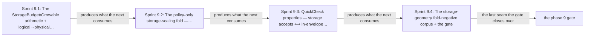

# Phase 9: Logical→physical storage geometry folds

> **Purpose**: Build the pure logical→physical storage-geometry fold — the closed `StorageBudget`/`Growable`
> arithmetic, the BookKeeper/MinIO/registry/ZooKeeper/Patroni/Vault/etcd geometry with complete
> recovery/healing/orphan scenarios, filesystem presentation + allocation rounding, uniform StatefulSet claims,
> schema/registry-backend migration storage, the six-arm object-store producer peak, and Pulsar's two ceilings —
> as total, in-process Haskell, and prove under QuickCheck that every producer's physical demand fits its
> single-owner backing and each storage-geometry negative decode-rejects directly on its isolated axis, on
> hand-authored logical-demand/backing fixtures, before any host or backing exists.
> **Read this if**: phase 9 is next in the queue, or a later phase depends on what its gate establishes.

Phase 9 delivers the logical→physical storage geometry folds; its design is owned by [resource_capacity_doctrine.md](../documents/engineering/resource_capacity_doctrine.md), [testing_doctrine.md](../documents/engineering/testing_doctrine.md), and the plan for reaching it is owned here.
Register 1: an in-process battery, no cluster.
Gate passed 2026-08-09; ledger `external-run-reference`.


> **Historical result (invalidated).** Any pass, seal, validation, ledger, receipt, or implementation observation
> in the orientation text above is diagnostic only. The Phase Status section and [tracker](README.md) own current state; the
> target contract below remains normative.

<details>
<summary>Link-graph metadata</summary>

**Status**: Authoritative source
**Supersedes**: N/A
**Referenced by**: DEVELOPMENT_PLAN/README.md, DEVELOPMENT_PLAN/overview.md, DEVELOPMENT_PLAN/phase_08_capacity_core_folds.md, DEVELOPMENT_PLAN/phase_10_execution_accelerator_folds.md, DEVELOPMENT_PLAN/phase_12_provision_seal.md, DEVELOPMENT_PLAN/phase_51_provider_ebs_credential.md, DEVELOPMENT_PLAN/phase_52_provider_dynamic_nodes.md, DEVELOPMENT_PLAN/system_components.md, documents/engineering/pulsar_client_doctrine.md, documents/engineering/resource_capacity_doctrine.md, documents/engineering/storage_lifecycle_doctrine.md, documents/engineering/testing_doctrine.md, documents/illegal_state/illegal_state_catalog.md
**Generated sections**: none

</details>

## Contents
- [Phase Status](#phase-status)
- [Phase Summary](#phase-summary)
- [Gate integrity](#gate-integrity)
- [Doctrine adopted](#doctrine-adopted)
- [Sprints](#sprints)
- [Sprint 9.1: The `StorageBudget`/`Growable` arithmetic + logical→physical geometry fold ✅](#sprint-91-the-storagebudgetgrowable-arithmetic--logicalphysical-geometry-fold-)
- [Sprint 9.2: The policy-only storage-scaling fold — `ProvisionedStorageScalingEnvelope` / `planStorageScaling` ✅](#sprint-92-the-policy-only-storage-scaling-fold--provisionedstoragescalingenvelope--planstoragescaling-)
- [Sprint 9.3: QuickCheck properties — storage `accepts ⟺ in-envelope`, Pulsar two-ceiling, uniform-claim ✅](#sprint-93-quickcheck-properties--storage-accepts--in-envelope-pulsar-two-ceiling-uniform-claim-)
- [Sprint 9.4: The storage-geometry fold-negative corpus + the gate ✅](#sprint-94-the-storage-geometry-fold-negative-corpus--the-gate-)
- [Documentation Requirements](#documentation-requirements)
- [Related Documents](#related-documents)

---

## Phase Status

⏸️ Blocked pending Phase-8 revalidation — **reopened 2026-08-16 by the natural-architecture amendment.**
[§S](development_plan_gate_integrity.md#s-universal-artifact-hygiene-gate) clause 15 requires a run to record
the natural architecture it proved and to execute no artifact of another. This phase's last gate recorded no
architecture, so its seal is invalidated as a current result and stands only as history; the rerun differs from
it by naming the lane and architecture the run actually used. A sprint marker below records what that sprint achieved before the amendment; under
[§N](development_plan_phase_model.md#n-reopening-and-amending-a-phase) it is a diagnostic, not surviving closure.

**Pre-natural-architecture status record (invalidated where it claims completion):**

Done (invalidated) — resealed 2026-08-15. `python3 tools/storage_geometry_gate.py` passed all ten sides: all 27 storage
variants and twins, both Gate-1 barriers, six properties, all 31 mutants, the honesty ledger, and all 13
authored metrics pass; 39 surfaces join to 44 run-time items; generated output and host state remain contained.
The project-contained attestation is `sha256:cea869188d4bb543b62a216ca00c7cc98feb47c7218f3744bae546828680a247`,
bound to source snapshot `sha256:6eb21174546f6510…`; Phase 9 owns no remaining migration deferral.

**Pre-containment status record (invalidated where it claims completion):**

Done (invalidated) — sealed 2026-08-12. The migrated gate passed against source snapshot `sha256:690d8f832a33de37…`
(1933 non-ignored files) and published a verified pre-containment external attestation
`sha256:2236282920d39585e287806cab364d279156460312aec61e480abdc812d9435c`.

**Observed progress — 2026-08-12:** **Policy-conformant.** Every capability check is unchanged and re-run: 27
storage variants redden at their specific tags beside 27 green twins, five named negatives and two Gate-1
training cases hold, two positives decode and fit, six QuickCheck properties hold with coverage in both
directions, and all 31 seeded mutants redden. Evidence and the ledger move into
`.build/runs/phase_09/<run-id>/`, and the run publishes a snapshot-bound attestation.

**The surface join found a real gap and it is recorded rather than papered over.** A first draft pointed twenty
of this phase's claim surfaces at the single acceptance-token metric; the join rejected it, correctly, because
one token is not independent evidence for twenty claims. The contract names 27 storage claims and the case
oracle carries 27 cases, so the join is now a one-to-one partition — but the two vocabularies were authored
separately and three pairs do not match by name. Those three associations are marked provisional in
`test/oracle/storage_geometry_surfaces.tsv` and recorded against Phase 9 in
[`legacy_tracking_for_deletion.md`](legacy_tracking_for_deletion.md) for the owner to confirm or correct.
`test/spec/dsl/StorageGeometryGate.hs` also stopped hard-coding a developer `dhall` path, and every cabal
invocation now carries the resolved compiler.

**Invalidated historical record:**

Done (invalidated). `python3 tools/storage_geometry_gate.py` passed on 2026-08-09 on
**no substrate** (`none`) in **Register 1**, with ledger
`dynamically-resolved`. It stood up no host,
cluster, or backing: the result is an in-process storage-geometry fold + QuickCheck battery layered on the
[Phase 8 gate](phase_08_capacity_core_folds.md). Live backing observation/mutation, execution/runtime storage,
accelerator/provider composition, capability binding, provisioning, render fidelity, and physical enforcement
remain **UNVERIFIED**. Where a shape below is exercised in a sibling system
(prodbox's platform-backbone BookKeeper/MinIO/ZooKeeper recovery accounting), that is **sibling evidence, not an amoebius result**.

## Phase Summary

This phase makes amoebius's *"no unbounded storage, anywhere; every producer's physical demand fits a
single-owner backing"* invariant executable as pure provisioning arithmetic, and proves its
implementation/properties under QuickCheck in-process. It owns the **logical→physical storage-geometry fold only** — the slice of the capacity model that turns a producer's declared *logical* demand into a *physical*
byte requirement against a named backing, and the closed storage-budget arithmetic over it:

- The **closed `StorageBudget` / `Growable` unions' arithmetic**: the single-owner ceiling-per-arm
  `StorageBudget` fold (no unbounded arm) and the `Growable`/`ScalingPolicy` quota-bounded escape valve (no
  bare-unbounded arm). The union *shapes* are type-foreclosed upstream (Phase 5/7); the *arithmetic* over them
  is the pure fold this phase adds.
- The **logical→physical geometry** for `bookKeeperPhysicalDemand` (write-quorum placement, journal/index
  reserve, and **every** failure/re-replication subset derived from its finite fault bound), `minioPhysicalDemand`
  (stripe padding, data+parity shards, metadata, healing workspace, and every per-set plus cross-set failure
  combination), the six-arm `provisionObjectStoreProducer` peak, `registryStoragePeak`,
  `provisionZooKeeperMetadataStore`, `provisionPatroniSql`, `vaultStoragePeak`, and the etcd/control-plane
  physical storage-transition expansion — each with its **complete recovery/healing/orphan** scenario product.
- **Filesystem presentation + allocation rounding**: each logical demand receives its `Block` or version-pinned
  filesystem overhead and rounds up to the backing's `BackingAllocationPolicy { minimumBytes, quantumBytes }`
  before its private `ProvisionedVolumeDemand.provisionedBytes` resolves exactly once.
- **Uniform StatefulSet claims**: `uniformStatefulSetClaims` groups each durable demand to a private member map
  plus one uniform size and `perBackingDebit[backing] = max ordinal provisioned demand × members on that backing`, so no aggregate can move spare bytes between backings. - **Schema / registry-backend migration storage**: `provisionSchemaMigration`, `provisionStorageMigration`, and `provisionRegistryBackendMigration` fit old+new+workspace/temp/WAL high-water plus the transition's executor demand before any create/copy/DDL, retaining every old/new partial commitment on failed verification. - The **six-arm object-store producer peak** (`app`/`content`/`registry`/`Pulsar-offload`/`Pulumi-checkpoint`/ `control-plane-state`): `mergeObjectStoreLogicalPeaks` enforces source↔producer inventory equality, rejects
  identity/size or admission conflicts, preserves every writer, and derives each per-writer admission witness
  and the merged `ObjectStoreAdmissionGatewayDemand`.
- The **two-ceiling Pulsar fold**: the physically expanded hot-tier ceiling (built on the `bookKeeperPhysicalDemand`
  witness) *and* the durable-total offload ceiling, so a time-only-offload or physically hot-tier-over-bookie
  topic decode-rejects.
- The **cache storage geometry**: the in-cluster cache-owner nesting
  `ProvisionedCacheDemand.derivedPeak ≤ CacheBudget ≤ emptyDir.sizeLimit` (catalog assets joined by
  identity/digest, residents deduplicated by digest, the largest finitely concurrent first-miss temporary peak
  derived) versus a native host-worker cache pool (`derivedPeak ≤ CacheBudget ≤ named host cache backing`).
- The **provider-root storage geometry**: the `ProvisionedNodeRootVolumeRequest` presentation/allocation-rounded
  derivation from either fixed `InstanceStore` bytes or a private `EphemeralRootEbs` request, debiting the
  distinct `nodeRootStorage` byte/volume-count ceiling — never durable quota.
- The **`ProvisionedStorageScalingEnvelope` / `planStorageScaling`** representation and observe-then-plan fold —
  **policy only, no live mutation**: the private envelope retains the exact budget/backing, finite backing-indexed
  policy, and desired demand projection; the total `planStorageScaling` consumes a complete fingerprinted
  `ObservedStorageScalingSnapshot` and returns only
  `NoChange | AllocateWithinRetainedCarve | CreateProviderCapacity | ShrinkByVerifiedMigration`, witnessing
  current allocation, residual/quota, and old+new migration high-water.

These storage checks consume constructible values and may reject them at `provision-seal`; in the catalog
vocabulary they are **decode-foreclosed**, not type-inhabitance claims. Because the storage
`Σ ≤ backing` sum is decidable in **both** directions (unlike the sound-not-complete compute `place`), this
phase proves the stronger **accept ⟺ in-envelope** equivalence for the geometry fold.

**What is *not* here.** The base `fits`/`carve`/`place` capacity fold, the `Topology`/`ComputeEngine`/
compatibility relation, and `mkRke2` distinctness ([Phase 8](phase_08_capacity_core_folds.md)); the
execution-epoch expansion, scheduler-reservation algebra, kubelet/CRI runtime-metadata fold, logical
pod-ephemeral/memory-backed-volume fold, accelerator residency/VRAM fold, the VM parent-disk
`PhysicalDiskPartition` two-equation arithmetic, and the **composed full-resource-vector place-witness** that
integrates these storage folds ([Phase 10](phase_10_execution_accelerator_folds.md)); the logical etcd
API-object/churn diff whose derived MVCC total this phase's control-plane physical formula *consumes* as a
declared input (owned by [Phase 10](phase_10_execution_accelerator_folds.md)); the capability → provider → shape
binder and the whole-deployment provision seal that re-exercises these folds
([Phase 11](phase_11_capability_bind.md)/[Phase 12](phase_12_provision_seal.md)); and any live snapshot
validation or mutation of a scaling transition — [Phase 31](phase_31_object_reconciler.md) owns the generic
snapshot-bound action/token/CAS plumbing, [Phase 33](phase_33_retained_storage.md) enacts the retained-carve
arms, and [Phase 52](phase_52_provider_dynamic_nodes.md) enacts the `CreateProviderCapacity` arm.

**Substrate:** none — no host, no cluster, no backing; the gate is an in-process `cabal test` storage-geometry
fold + QuickCheck battery, analogous to the Phase 6 decode battery and the Phase 7 property suite.

**Lane:** none ([§L](development_plan_standards.md#l-one-substrate-discipline))

**Register:** 1 — pure/golden, in-process, no cluster ([§K](development_plan_standards.md#k-honesty-proven--tested--assumed)).

**Gate:** `cabal test dsl-spec` is green: the logical→physical storage-geometry fold is provably total and
accepts exactly the in-envelope producers, each committed negative refuses on its own over-backing axis, and
every seeded mutant reddens the suite. [Gate integrity](#gate-integrity) fixes each term.

<a id="n-gate-integrity-refinements"></a>
## Gate integrity

This section pins the concrete interpretations the [§M](development_plan_standards.md#m-gate-integrity-a-gate-cannot-be-passed-by-a-stub)
clauses require for Phase 9; it strengthens, never weakens, the Gate and sprint Validations above. It carries
**this seam's slice** of the storage-geometry corpus committed for the old capacity/topology phase; the base
capacity/topology negatives are gated by [Phase 8](phase_08_capacity_core_folds.md) and the execution/
accelerator/VM-partition negatives by [Phase 10](phase_10_execution_accelerator_folds.md). This phase does **not**
duplicate that corpus — it partitions it along the storage seam.

The Gate's one acceptance condition is the conjunction of four checks. The logical→physical storage-geometry
fold holds under QuickCheck, so every generated in-envelope producer yields a physical demand that fits its
single-owner backing, and the fold is **provably total** in the sense the totality gate below fixes. The pure
folds return their structured `ProvisionError`/`Left` on each negative in the representative set below when
applied **directly to the hand-authored logical-demand/backing fixture that isolates its over-backing axis**:
no `bind` or `provision` call enters this gate, because [Phase 12](phase_12_provision_seal.md) re-exercises
these same folds through its post-bind provision seal. The storage-geometry variant rows of the two positive
fixtures fit feasibly. And the gate turns red under the **committed per-geometry seeded-mutant battery**
(§M.2), green only when the **implementation-independent storage-envelope reference predicate** (§M.3,
defined in Sprint 9.3) accepts a returned physical demand *iff* it is in-envelope.


*Implemented Phase 9 seams; [Gate integrity](#gate-integrity) owns the apparatus.*

### Representative set (§M.7)

The gate's storage-geometry fold-negative corpus is *exactly* the five named
fixtures inherited from the source corpus:
`illegal_store_over_backing`, `illegal_hot_tier_over_bookie`, `illegal_topic_time_only_offload`,
`illegal_cache_over_local_pool`, and `illegal_incluster_cache_bound_mismatch`; the
positive set is the storage-geometry variant rows of
`legal_multisubstrate_cluster` (a store-fits-backing row, BookKeeper/MinIO physical-fits, uniform-claim
exact-fit, presentation/quantum-rounding exact-fit, and ZooKeeper/Patroni/Vault recovery-fits plus a
control-plane-storage-steady-fits row) and `legal_managed_eks` (a fixed-`InstanceStore` root-fits row and a
derived-root-EBS-within-`nodeRootStorage`-quota row). All are committed in this phase's oracle-pinning sprint,
before the `Amoebius.Capacity.*` storage implementation exists (§M.1), as part of the
forty-one-fixture corpus; the compute/topology base-fold negatives (`illegal_engine_substrate_mismatch`,
`illegal_rke2_reused_host`, `illegal_overcommit_*`, the elastic-branch negatives,
`illegal_untolerated_taint`, `illegal_memory_backed_underreserved`,
`illegal_tmpfs_init_persistence_underreserved`, …) are owned by
[Phase 8](phase_08_capacity_core_folds.md) and the execution/accelerator/VM-partition and
provider-root/control-plane-storage fixtures
(`illegal_hard_ceiling_overcommit`, `illegal_node_local_storage_over_backing`,
`illegal_disk_backing_alias_double_spend`, `illegal_filesystem_layout_*`, `illegal_image_*`, the
accelerator/CUDA/Metal negatives, `illegal_provider_instance_store_root_underprovisioned`,
`illegal_provider_node_root_ebs_over_quota`, `illegal_control_plane_storage_transition_overrun`, and
`legal_tmpfs_two_concurrent_writers_single_debit`) by
[Phase 10](phase_10_execution_accelerator_folds.md).
`illegal_store_over_backing` is a stable fixture identifier with a **committed case table** for MinIO
parity/healing, finite-horizon failed-write/upload orphan exposure, filesystem overhead, backing
minimum/quantum rounding, uniform claims (a differing-backing ordinal short despite aggregate spare bytes
elsewhere), registry upload/failed-partial or filesystem→MinIO old+new copy workspace, one ZooKeeper member's
transaction-log/snapshot recovery, one Patroni data/WAL/failover ordinal, schema old+new/temp/WAL overlap, and
Vault Raft compaction/recovery plus audit rotation; the same fixture's producer cases omit each of the six
closed object-store arms (`app`/`content`/`registry`/`Pulsar-offload`/`Pulumi-checkpoint`/`control-plane-state`)
in turn. `illegal_hot_tier_over_bookie` has logical-fit/physical-overflow cases for BookKeeper
write-quorum/recovery placement. These are variants inside the named fixtures, not unnamed additions to the
exact corpus, and do not change the five-negative/two-positive representative count.

The committed case table contains **27** independently pinned variant rows and 27 legal twins under those
five stable negative-family names. It also covers the later registry additions for backup-medium fit,
disjoint capacity pools, and restore-target fit. Together with the two Gate-1 training-retention barriers,
the emitted `.build/dsl/phase8/validation-locus-ledger.tsv` supplies evidence for all **5** Phase-9-owned
registry subcases at their declared loci.

### Committed per-geometry seeded-mutant battery (§M.2)

One committed mutant per geometry obligation, each
individually required to turn the suite red, drawn from the operator set:
- **Storage `Σ` / backing comparison** — weaken the backing comparison (accept a physical demand one byte over
  its single-owner backing).
- **BookKeeper** — drop write-quorum placement or the recovery/re-replication scenario derivation from its
  finite fault bound.
- **MinIO** — drop stripe padding, data+parity shards, metadata, the healing workspace, or the complete
  per-set plus cross-set failure-scenario product.
- **Fault-scenario product** — collapse the complete derived fault-policy scenario product to a favourable
  subset.
- **Concurrent/orphan exposure** — drop the finite-horizon failed-write/upload orphan retention.
- **Filesystem overhead** — skip the `Block`/version-pinned filesystem-presentation overhead.
- **Backing minimum/quantum** — skip the `BackingAllocationPolicy` minimum/quantum rounding.
- **Uniform claim rounding** — replace `max ordinal × members` with an aggregate that moves spare bytes
  between backings.
- **Pulsar hot-tier ceiling** — drop the physically expanded hot-tier ceiling (accept a topic whose logical
  hot bytes fit but whose write-quorum/recovery placement exceeds one bookie).
- **Pulsar durable-total ceiling** — drop the durable-total offload ceiling (accept a time-only-offload topic
  with no size-triggered durable bound).
- **Native cache-pool accounting** — reuse the same cache bytes twice / exceed the named host cache backing.
- **In-cluster cache nesting** — drop the exact catalog asset join/digest dedup/first-miss temporary peak,
  drop `ProvisionedCacheDemand.derivedPeak ≤ CacheBudget ≤ emptyDir.sizeLimit`, or charge the same bytes twice.
- **Provider-root storage** — under-size a fixed `InstanceStore` root; omit the root policy/presentation/
  allocation; fail to derive and round the private `EphemeralRootEbs` request; or debit it from durable quota
  rather than the separate `nodeRootStorage` byte/volume-count ceiling. (The provider-root negatives
  `illegal_provider_instance_store_root_underprovisioned` and `illegal_provider_node_root_ebs_over_quota` are
  owned by [Phase 10](phase_10_execution_accelerator_folds.md); this mutant guards the shared geometry fold, not
  a Phase-9 gate fixture.)
- **Control-plane etcd physical transition** — omit WAL preallocation/overshoot, the snapshot-save temporary,
  the serialized defrag old+new overlap, or the `(maxBackups + 1) × maxBytesPerFile` audit rotation term.
  (The control-plane-storage negative `illegal_control_plane_storage_transition_overrun` is owned by
  [Phase 10](phase_10_execution_accelerator_folds.md); this mutant guards the shared geometry fold, not a
  Phase-9 gate fixture.)
- **Object-store producer** — omit a source-producer arm (any of the six, including the control-plane-state
  sixth arm); accept a physical-object identity/size conflict; accept a same-byte/different-object-count
  geometry; or drop a per-writer admission witness.
- **Registry** — drop the OCI object dedup, the bounded concurrent upload workspace, or the failed-partial
  extents retained for the GC horizon.
- **ZooKeeper** — drop a member's transaction-log/snapshot/failure-recovery overlap.
- **Patroni** — drop the data/WAL/checkpoint/failover peak or the SQL-mutation admission proxy derivation.
- **Vault** — drop the persisted-version/lease expansion, the Raft/WAL/snapshot model, the old+new compaction
  overlap, the recovery headroom, or the audit rotation term.
- **Migration** — drop the old+new+workspace/temp/WAL high-water or the executor demand of any of
  `provisionStorageMigration` / `provisionSchemaMigration` / `provisionRegistryBackendMigration`.
- **`planStorageScaling`** — return `AllocateWithinRetainedCarve` / `CreateProviderCapacity` /
  `ShrinkByVerifiedMigration` without witnessing the retained carve / residual quota / old+new migration
  high-water, or ignore the `ObservedStorageScalingSnapshot` fingerprint.

Field-deletion operators are explicit members of this battery: delete one OCI stored object, snapshot chain,
registry upload bound, root-backing policy/quota, or Vault Raft/audit operand and require a **structured rejection** rather than treating absence as zero or falling back to an aggregate.

### Totality gate ([§M](development_plan_standards.md#m-gate-integrity-a-gate-cannot-be-passed-by-a-stub))

Every storage fold module — `Amoebius.Capacity.{Storage,StorageGeometry,ServiceStorage,Growable,StorageScaling}`
— must compile with `-Werror=incomplete-patterns` and
`-Werror=incomplete-uni-patterns`, without `error`, partial `head`, or `fromJust`; the QuickCheck no-crash
sample is an additional check and cannot satisfy totality on its own.

### Independent reference predicate (§M.3)

Defined in Sprint 9.3 Deliverables; it never calls `bookKeeperPhysicalDemand`, `minioPhysicalDemand`,
`provisionObjectStoreProducer`, `registryStoragePeak`, `vaultStoragePeak`, `uniformStatefulSetClaims`, or
the Pulsar/cache/provider-root folds, deriving the complete fault-policy scenario product, presentation
overhead, allocation rounding, and per-backing residual **directly** from the generated fixture's declared
logical demands and backing rules, and asserting **accept ⟺ in-envelope**. It is a **Register-1** in-process
check that runs on no substrate.

## Doctrine adopted

- [`resource_capacity_doctrine.md §5`](../documents/engineering/resource_capacity_doctrine.md#5-storagebudget-bounded-by-construction-single-owner-ceiling-per-arm)
  — **`StorageBudget` bounded by construction, single-owner ceiling per arm**: this phase implements the closed
  `StorageBudget` fold (every producer's required `StorageBudgetId` resolves once to its selected backing/quota
  owner; no aggregate moves spare bytes between backings) and the logical→physical BookKeeper/MinIO placement
  plus the complete fault-scenario/orphan/uniform-claim/presentation-rounding fold as pure Haskell.
- [`resource_capacity_doctrine.md §6`](../documents/engineering/resource_capacity_doctrine.md#6-growable--scalingpolicy-the-quota-bounded-dynamic-provisioning-arm)
  — **`Growable` + `ScalingPolicy`, the quota-bounded dynamic provisioning arm**: this phase implements the
  closed `Growable`/`ScalingPolicy` escape valve (no bare-unbounded arm) and the private policy-only
  `ProvisionedStorageScalingEnvelope`, complete `ObservedStorageScalingSnapshot` input carrier, and total
  observe-then-plan `planStorageScaling`; it cannot validate or enact a live transition.
- [`resource_capacity_doctrine.md §7`](../documents/engineering/resource_capacity_doctrine.md#7-pulsar-has-two-ceilings-the-hot-tier-and-the-durable-total)
  — **Pulsar has two ceilings, the hot tier and the durable total**: this phase implements the two-ceiling
  Pulsar fold (physically expanded hot-tier fit built on the `bookKeeperPhysicalDemand` witness + durable-total
  offload fit), so a time-only or physically hot-tier-over-bookie topic decode-rejects.
- [`resource_capacity_doctrine.md §2`](../documents/engineering/resource_capacity_doctrine.md#2-the-load-bearing-honesty-limit-a-capacity-sum-is-a-decode-foreclosed-check-never-type-foreclosed)
  — **the load-bearing honesty limit**: a storage sum is a checked rejection (**decode-foreclosed** in the
  historical layer taxonomy), never type-foreclosed; its concrete locus is the post-bind `provision-seal`. The
  union *shapes* are type-foreclosed (Phase 5/7); the *arithmetic* over them is the pure fold this phase adds.
  Because the storage `Σ ≤ backing` sum is decidable both ways, this phase asserts the stronger
  **accept ⟺ in-envelope** equivalence, not merely soundness.
- [`illegal_state_catalog.md §4.6`](../documents/illegal_state/illegal_state_techniques.md#46-capacity-accounting--placement-witness-compute-and-summed-demand-within-capacity-storage-checked)
  — the capacity-accounting technique's **storage-checked** half (summed demand within capacity, storage
  checked), covering the storage/retention catalog entries [§3.11](../documents/illegal_state/illegal_state_security.md#311-an-unsafe-workload-no-resource-limits-no-hardened-securitycontext)/[§3.17](../documents/illegal_state/illegal_state_capacity.md#317-an-over-committed-deploy-or-workload-host--vm--cluster-capacity-exceeded)/[§3.19](../documents/illegal_state/illegal_state_storage.md#319-an-application-consuming-more-storage-than-its-backing-minio-and-pulsar)/[§3.20](../documents/illegal_state/illegal_state_storage.md#320-a-pulsar-topic-without-a-bounded--tiered--retained-lifecycle)/[§3.25](../documents/illegal_state/illegal_state_ml_asset.md#325-an-ml-asset-named-by-arbitrary-url-or-an-unready--unlanded-model) at the honest layer
  ([`§6`](../documents/illegal_state/illegal_state_techniques.md#6-three-layers-of-foreclosure-and-the-honesty-they-force)):
  every storage **sum** is checked at `provision-seal` and never type-foreclosed, honoring the load-bearing
  limit of [`§2`](../documents/illegal_state/illegal_state_catalog.md#2-the-load-bearing-limit-a-type-check-proves-the-spec-composes-not-that-the-cluster-enforces-it).
- [`testing_doctrine.md`](../documents/engineering/testing_doctrine.md#2-the-registers-of-amoebius-testing) [§2](../documents/engineering/testing_doctrine.md#2-the-registers-of-amoebius-testing) (**Register 1** — pure/golden, in-process, no cluster) and [§4](../documents/engineering/testing_doctrine.md#4-no-skips-fail-fast-and-the-per-run-ledger-artifact) (the per-run proven/tested/assumed ledger): the register this gate reaches and
  the ledger it emits, with model↔runtime correspondence and runtime fidelity marked UNVERIFIED (owned by the
  live band — [Phase 31](phase_31_object_reconciler.md)/[Phase 33](phase_33_retained_storage.md)/
  [Phase 35](phase_35_platform_backbone.md)/[Phase 52](phase_52_provider_dynamic_nodes.md)).

## Sprints

> **Current validation record.** Every sprint is covered by the 2026-08-15 reseal. Historical dates,
> pass/seal claims, repository-resident evidence paths, and `Remaining Work: None` statements below describe
> the pre-amendment capability record only; they do not override current status. Functional and validation
> outcomes remain target requirements. Any instruction to commit generated output, freeze dependency resolution,
> retain a resolved version, path, or integrity hash, or consume repository-resident evidence, ledgers, or
> enumerations is superseded by the current generated-artifact and dynamic-resolution doctrine. Closure requires
> the current phase gate plus universal artifact hygiene.

## Sprint 9.1: The `StorageBudget`/`Growable` arithmetic + logical→physical geometry fold ✅

**Status**: Done — the capability is re-established by the migrated gate; the sprint's committed-ledger, pinned-toolchain, and repository-resident evidence mechanics are superseded
**Implementation**: `src/Amoebius/Capacity/Storage.hs`, `src/Amoebius/Capacity/StorageGeometry.hs`,
`src/Amoebius/Capacity/ServiceStorage.hs`, and `src/Amoebius/Capacity/Growable.hs`, extending
`src/Amoebius/Capacity/Types.hs`. The Deliverables below inventory what each carries.
**Blocked by**: [Phase 8 gate](phase_08_capacity_core_folds.md) (the base capacity types and
subtraction folds); Phase 6 gate (the GADT-indexed IR + total decoder).
**Independent Validation**: a unit suite runs the geometry folds over hand-authored
logical-demand/backing inputs, so a feasible producer resolves its provisioned bytes once and fits its
single-owner backing, every over-backing axis returns the fold's tagged `Left` naming it, and dropping any
scenario, overhead, or rounding term makes the property red. The numbered Validation list below states each
check.
**Docs to update**: `documents/engineering/resource_capacity_doctrine.md` (Phase-9 status
backlink for §5/§6/§7), `documents/engineering/storage_lifecycle_doctrine.md` (§5.2 backing read-side),
`documents/engineering/pulsar_client_doctrine.md` (§6 two-ceiling read-side),
`documents/illegal_state/illegal_state_catalog.md` (§3.19–§3.20 layer reconciliation),
`DEVELOPMENT_PLAN/system_components.md`.

### Objective
Adopt [`resource_capacity_doctrine.md` §5 — StorageBudget bounded by construction, single-owner ceiling per arm](../documents/engineering/resource_capacity_doctrine.md#5-storagebudget-bounded-by-construction-single-owner-ceiling-per-arm)
and [`§7` — Pulsar's two ceilings, the hot tier and the durable total](../documents/engineering/resource_capacity_doctrine.md#7-pulsar-has-two-ceilings-the-hot-tier-and-the-durable-total):
implement the logical→physical storage-geometry fold as pure, checked provision-seal arithmetic — genuine
per-backing subtractions for the single-owner carves, complete fault-scenario derivation for the replicated/
erasure-coded producers, presentation/allocation rounding for every volume, and both Pulsar ceilings — reading
declared logical numbers only (the substrate backing inventory and PV sizes are owned elsewhere).

### Deliverables
- The closed `StorageBudget`/`Growable` unions (no unbounded / no bare-unbounded arm) and the aggregate backing
  fold: every producer's required `StorageBudgetId` resolves once to its selected backing/quota owner; the
  provider-object `CloudQuota` arm remains a distinct bounded object-count plus model-indexed `Logical | Billed`
  byte ceiling rather than inventing a filesystem allocation rule or accepting an implicit unit conversion. An
  in-file honesty note records that the union *shapes* are type-foreclosed (Phase 5/7) while every capacity/
  retention **sum** here is a total checked provision-seal operation.
- Every durable `DeclaredVolumeDemand` carries a `StatefulSetClaimSlot`, `BackingId`, logical bytes, a
  direct/BookKeeper/MinIO geometry owner, and a `VolumePresentation`; each volume-producing host/provider
  `StorageBacking` arm carries `allocation : BackingAllocationPolicy { minimumBytes, quantumBytes }`. The fold
  rederives geometry and filesystem overhead, rounds to backing rules, and alone constructs private
  `ProvisionedVolumeDemand.provisionedBytes`, which resolves exactly once and later renders unchanged.
- `bookKeeperPhysicalDemand` expands the required positive logical-hot/headroom fields through write-quorum
  placement, journal/index reserve, and **every** failure/re-replication subset derived from its finite fault
  bound. `minioPhysicalDemand` expands each object through stripe padding, data+parity shards, metadata, healing
  workspace, and every per-set plus cross-set failure combination derived from its finite fault bound. Each
  logical demand then receives its `Block` or version-pinned filesystem overhead and rounds up to the backing's
  allocation minimum/quantum before `uniformStatefulSetClaims` groups it to a private member map plus one
  uniform size and `perBackingDebit[backing] = max ordinal provisioned demand × members on that backing`; no aggregate can move spare bytes between backings. - `provisionObjectStoreProducer` covers the closed `app`/`content`/`registry`/`Pulsar-offload`/`Pulumi-checkpoint`/`control-plane-state` six-arm union: it retains exact physical resident ids, structural future/transient extents, per-writer admission witnesses, and complete producer-specific retention/rate/failure operands. Source↔producer inventory equality is mandatory; `mergeObjectStoreLogicalPeaks` rejects identity/size or admission conflicts and preserves every writer before `minioPhysicalDemand` runs, and derives the merged `ObjectStoreAdmissionGatewayDemand` (the gateway's compute pod-`place` witness composes downstream in [Phase 10](phase_10_execution_accelerator_folds.md)).
- `registryStoragePeak` exact-joins all selected OCI objects, deduplicates by digest, and adds structured
  bounded concurrent upload workspace plus failed-partial extents retained for the declared GC horizon; only its
  interim filesystem projection uses scalar `derivedPeak`. `vaultStoragePeak` exact-expands bounded persisted
  versions/live leases through the pinned Raft record/WAL/snapshot model and charges old+new compaction overlap,
  recovery headroom, and `(maxBackups + 1) × maxBytesPerFile` audit rotation to its named backing.
  `provisionZooKeeperMetadataStore` derives persistent/session paths, transaction logs, snapshots, and
  failure-recovery overlap per member and places every member's volume. `provisionPatroniSql` derives
  data/WAL/checkpoint/failover peaks, resolves the database `StorageBudgetId`, and derives the bounded
  SQL-mutation admission proxy from connection/transaction/WAL operands.
- The two-ceiling Pulsar fold uses the physical BookKeeper witness plus the durable-total offload target, so a
  time-only or physically hot-tier-over-bookie topic decode-rejects.
- Storage, registry-backend, and schema transitions (`provisionStorageMigration`,
  `provisionRegistryBackendMigration`, `provisionSchemaMigration`) each fit old+new+workspace/temp/WAL plus
  their transition executor demand before any create/copy/DDL; failed verification retains every old/new partial
  commitment.
- The cache storage geometry: `provisionCacheDemand` distinguishes an in-cluster cache-owner (the
  `CachePopulationDemand` joined by identity/digest, residents deduplicated by digest, the largest finitely
  concurrent first-miss temporaries deriving private `ProvisionedCacheDemand.derivedPeak`; then
  `derivedPeak ≤ CacheBudget ≤ emptyDir.sizeLimit`) from a native host-worker cache
  (`derivedPeak ≤ CacheBudget ≤ named host cache backing`). The in-cluster owner's `emptyDir` is already inside
  logical pod ephemeral (owned by [Phase 10](phase_10_execution_accelerator_folds.md)) and is not added again;
  this phase owns only the cache-peak derivation and the nesting inequality.
- The provider-root storage geometry: `provisionNodeRootVolume` requires `FilesystemPresentation` on every root
  policy; a fixed `InstanceStore` must cover system reserve plus all unique carves after presentation costs,
  while `EphemeralRootEbs` derives private
  `ProvisionedNodeRootVolumeRequest { volumeType, requiredUsableBytes, presentation, allocation, sizeGiB,
  provisionedBytes, witness }` from the same high-water and its catalog-cross-checked volume type/presentation/
  allocation rules; it debits the distinct `nodeRootStorage` byte/volume-count ceiling, never durable quota.
- The etcd/control-plane physical storage-transition peak: `provisionControlPlaneStorage` consumes the
  enforceable `etcd { backendQuotaBytes, maxWalFiles, retainedSnapshots, SerializedSnapshotAndDefrag,
  storageModel }` plus the declared MVCC logical total (derived upstream in
  [Phase 10](phase_10_execution_accelerator_folds.md)) and derives backend + WAL segment/overshoot/
  preallocated-next + retained snapshot/snapshot-save temporary + serialized defrag old/new peak (Events
  included once), plus `(maxBackups + 1) × maxBytesPerFile` audit/runtime logs; a missing headroom field is not
  a zero.

The five modules and the declarations each owns:

```
Storage.hs          identity-named disjoint local pools; the closed StorageBudget fold; native
                    host-worker cache-pool accounting; the two-ceiling Pulsar fold
StorageGeometry.hs  bookKeeperPhysicalDemand, contentStoreLogicalPeak, minioPhysicalDemand, volume
                    presentation/allocation rounding, uniformStatefulSetClaims,
                    provisionObjectStoreProducer, mergeObjectStoreLogicalPeaks,
                    provisionStorageMigration, provisionSchemaMigration,
                    provisionRegistryBackendMigration, provisionNodeRootVolume
ServiceStorage.hs   provisionCacheDemand (the exact cache nesting), registryStoragePeak,
                    provisionZooKeeperMetadataStore, provisionPatroniSql, vaultStoragePeak,
                    provisionControlPlaneStorage (the etcd/control-plane transition peak)
Growable.hs         Growable, ScalingPolicy
Types.hs (extended) StorageBudget, Growable, the durable-geometry DeclaredVolumeDemand fields,
                    StatefulSetClaimSlot, VolumePresentation, ProvisionedVolumeDemand,
                    CachePopulationDemand / ProvisionedCacheDemand, RegistryStorageDemand,
                    VaultStorageDemand, ZooKeeperMetadataStoreDemand /
                    ProvisionedZooKeeperMetadataStoreDemand, PatroniSqlDemand /
                    ProvisionedPatroniSql, ObjectStoreDemand, the six-arm
                    ObjectStoreProducerDemand / ProvisionedObjectStoreLogicalPeak,
                    ObjectStoreAdmissionGatewayDemand, StorageMigrationDemand /
                    ProvisionedStorageMigration, SchemaMigrationDemand /
                    ProvisionedSchemaMigration, RegistryBackendMigrationDemand /
                    ProvisionedRegistryBackendMigration, ControlPlaneStorageDemand, the
                    provider-root ProvisionedNodeRootVolumeRequest / InstanceStore /
                    EphemeralRootEbs / nodeRootStorage, and the storage-presentation
                    FilesystemPresentation / BackingAllocationPolicy / StorageBacking
```

Shared declarations live beside their owning folds rather than enlarging the Phase-8 base `Types.hs` module.
[Phase 8](phase_08_capacity_core_folds.md)'s base subset defers every storage member of `Types.hs` to this
phase; this sprint consumes that base and owns the storage declarations plus the geometry arithmetic.

### Validation
1. A feasible input yields a physical demand that fits its single-owner backing after deriving BookKeeper
   replication/recovery, MinIO erasure/healing/in-flight/orphan/presentation/rounding/uniform-claim peaks,
   registry upload/partial/rehome exposure, ZooKeeper log/snapshot/recovery, Patroni data/WAL/failover, schema
   old+new/temp/WAL, and Vault Raft/compaction/recovery/audit peaks. An over-backing or un-tiered topic returns
   its tagged `Left`; a cache over its named pool, an in-cluster cache nesting violation, an under-sized
   instance-store root, a root-EBS request outside its separate byte/volume-count quota, and a control-plane
   transition overrun each return their specific tag naming the offending backing/axis. Exact fit consumes the
   available residual exactly; attempting another debit then rejects without any exception. Each negative
   asserts **which tag and which axis** it fails on (§M.8), each paired with a store-fits row differing only in
   that one axis being in-backing.
2. Each producer's logical demand expands through its complete
   replication/erasure/metadata/recovery/healing/concurrent/orphan scenario product, receives its `Block` or
   version-pinned filesystem overhead, rounds up to the backing minimum/quantum, and resolves its
   `ProvisionedVolumeDemand.provisionedBytes` exactly once before the fit is judged; dropping any scenario,
   overhead, or rounding term makes the property red.

### Remaining Work
None.

## Sprint 9.2: The policy-only storage-scaling fold — `ProvisionedStorageScalingEnvelope` / `planStorageScaling` ✅

**Status**: Done — the capability is re-established by the migrated gate; the sprint's committed-ledger, pinned-toolchain, and repository-resident evidence mechanics are superseded
**Implementation**: `src/Amoebius/Capacity/StorageScaling.hs`
(`ProvisionedStorageScalingEnvelope`, `ObservedStorageScalingSnapshot`, `planStorageScaling`) — built and
exhaustively pattern-checked.
**Prerequisite satisfied**: Sprint 9.1 (the `StorageBudget` arithmetic + backing/quota types the envelope
retains and the plan witnesses).
**Blocked by**: none within the phase.
**Independent Validation**: a unit suite constructs a private envelope for each `Growable` producer, feeds a
complete fingerprinted snapshot, and asserts `planStorageScaling` resolves to exactly one witnessed arm and
that this phase has **no mutation capability** — it observes and plans only. The numbered Validation list
below states each check.
**Docs to update**:
`documents/engineering/resource_capacity_doctrine.md` (§6 `Growable`/`ScalingPolicy` policy backlink),
`documents/engineering/storage_lifecycle_doctrine.md`, `DEVELOPMENT_PLAN/system_components.md`.

### Objective
Adopt [`resource_capacity_doctrine.md` §6 — Growable + ScalingPolicy, the quota-bounded dynamic provisioning arm](../documents/engineering/resource_capacity_doctrine.md#6-growable--scalingpolicy-the-quota-bounded-dynamic-provisioning-arm):
implement the policy-only `ProvisionedStorageScalingEnvelope` representation and the total observe-then-plan
`planStorageScaling` fold, so a scaling *decision* is a pure function of the retained envelope and a complete
observed snapshot — never a live mutation, and never a check that requires a live backing.

### Deliverables
- A private `ProvisionedStorageScalingEnvelope` retaining the exact budget/backing, finite backing-indexed
  policy, and desired provisioned demand projection, but no observation or speculative transition.
- A complete `ObservedStorageScalingSnapshot` input carrier fingerprinting current allocation, residual/quota,
  and any old+new migration state.
- The total `planStorageScaling :: ProvisionedStorageScalingEnvelope -> ObservedStorageScalingSnapshot ->
  StorageScalingPlan`, returning only `NoChange | AllocateWithinRetainedCarve | CreateProviderCapacity |
  ShrinkByVerifiedMigration`, with current allocation, residual/quota, and old+new migration high-water
  witnessed on every non-`NoChange` arm.
- An in-file honesty note: Phase 9 has no mutation capability; the generic live action is validated by
  [Phase 31 (the object reconciler)](phase_31_object_reconciler.md), the retained
  `AllocateWithinRetainedCarve`/`ShrinkByVerifiedMigration` arms are enacted by
  [Phase 33 (retained storage)](phase_33_retained_storage.md), and `CreateProviderCapacity` by
  [Phase 52 (provider dynamic nodes)](phase_52_provider_dynamic_nodes.md).

### Validation
1. Each generated envelope+snapshot pair resolves to exactly one arm; the arm's witness (retained carve,
   residual quota, or old+new migration high-water) is present and derived from the snapshot, not authored; a
   mutant that emits `AllocateWithinRetainedCarve`/`CreateProviderCapacity`/`ShrinkByVerifiedMigration` without
   its witness, or that ignores the snapshot fingerprint, turns the property red. No arm mutates or requires a
   live backing.
2. The suite constructs a private `ProvisionedStorageScalingEnvelope` for each `Growable` producer, feeds it
   a complete fingerprinted `ObservedStorageScalingSnapshot`, and asserts `planStorageScaling` returns
   exactly one of `NoChange | AllocateWithinRetainedCarve | CreateProviderCapacity |
   ShrinkByVerifiedMigration` with current allocation, residual/quota, and old+new migration high-water
   witnessed.

### Remaining Work
None.

## Sprint 9.3: QuickCheck properties — storage `accepts ⟺ in-envelope`, Pulsar two-ceiling, uniform-claim ✅

**Status**: Done — the capability is re-established by the migrated gate; the sprint's committed-ledger, pinned-toolchain, and repository-resident evidence mechanics are superseded
**Implementation**: `test/spec/dsl/StorageGeometryProps.hs` (QuickCheck generators for
logical-demand/backing inputs + the property battery: BookKeeper/MinIO scenario derivation,
presentation/allocation rounding, uniform-claim grouping, the six-arm object-store merge, the two Pulsar
ceilings, cache nesting, provider-root storage, control-plane physical transition, migration transitions,
and the storage `Σ ≤ backing` equivalence), reusing the Phase-7 property harness; the independently selected
mutants live in `test/spec/dsl/StorageGeometryMutants.hs` and `test/mutant/storage_geometry/mutants.tsv`.
**Blocked by**: Sprint 9.1, Sprint 9.2.
**Independent Validation**: `cabal test dsl-spec` proves the storage folds accept exactly the in-backing
inputs, with each equivalence property clearing its committed coverage floor in both directions, and no
mutant in the per-geometry battery of [Gate integrity](#gate-integrity) survives. The Validation list below
enumerates the properties and the mutants.
**Docs to update**: `documents/engineering/resource_capacity_doctrine.md`,
`documents/engineering/storage_lifecycle_doctrine.md`, `documents/engineering/pulsar_client_doctrine.md`,
`documents/engineering/testing_doctrine.md` (the Register-1 property register),
`DEVELOPMENT_PLAN/system_components.md`.

### Objective
Adopt [`testing_doctrine.md`](../documents/engineering/testing_doctrine.md#2-the-registers-of-amoebius-testing) [§2](../documents/engineering/testing_doctrine.md#2-the-registers-of-amoebius-testing) (Register 1)
and the honesty limit of [`resource_capacity_doctrine.md §2`](../documents/engineering/resource_capacity_doctrine.md#2-the-load-bearing-honesty-limit-a-capacity-sum-is-a-decode-foreclosed-check-never-type-foreclosed):
express the storage-geometry fold as QuickCheck properties. Because the storage `Σ ≤ backing` sum is decidable
in **both** directions, assert the stronger **accept ⟺ in-envelope equivalence** (the fold accepts *exactly* the
in-backing inputs) over generated corpora, not merely soundness — the storage sum is not the sound-not-complete
compute `place`.

### Deliverables
- The **implementation-independent storage-envelope reference predicate** (§M.3): a committed, hand-authored
  envelope predicate authored in this phase's oracle-pinning sprint, distinct from the fold under test, that **never calls**
  `bookKeeperPhysicalDemand`, `minioPhysicalDemand`, `provisionObjectStoreProducer`, `mergeObjectStoreLogicalPeaks`,
  `registryStoragePeak`, `vaultStoragePeak`, `provisionZooKeeperMetadataStore`, `provisionPatroniSql`,
  `uniformStatefulSetClaims`, the Pulsar/cache/provider-root/control-plane folds, or the migration folds. It
  reads the generated fixture's declared logical demands and backing rules directly and independently derives:
  the complete fault-policy scenario product; replication/erasure/metadata/recovery/healing/concurrent/orphan
  peaks; presentation overhead; allocation minimum/quantum rounding; registry upload/partials/rehome; ZooKeeper
  and Patroni recovery; schema/storage/registry-backend transition old+new+workspace/temp/WAL high-water; Vault
  Raft/compaction/recovery/audit peaks; the uniform claim-template debit (`max ordinal × members` per backing);
  and asserts every resulting per-backing value is within capacity. It further asserts: provider-root
  construction accepts **iff** the derived VM/root usable and rounded provisioned high-water fits its fixed
  `InstanceStore` provision **or** the separate `nodeRootStorage` byte/volume-count quota; the Pulsar two-ceiling
  fold accepts **iff** both the physically expanded hot tier and the durable-total ceiling hold; the in-cluster
  cache accepts **iff** `derivedPeak ≤ CacheBudget ≤ emptyDir.sizeLimit` and the native cache **iff**
  `derivedPeak ≤ CacheBudget ≤ named host cache backing`; and the control-plane transition accepts **iff** the
  derived backend + WAL + snapshot-save + defrag old+new + audit peak fits its system carve.
- Equivalence (both-directions) properties for the complete checks: the storage/retention fold accepts **iff**
  the independent predicate derives the complete fault-policy scenario product and every resulting per-backing
  value is within capacity; each over generated corpora that reach both directions, not just a fixed fixture
  set. Each equivalence property carries QuickCheck `cover`/`checkCoverage` obligations forcing **≥30% rejecting
  (out-of-backing) and ≥30% accepting (in-backing) generated inputs per fold, the suite failing when the
  coverage minimum is unmet** (§M.4) — so a generator that emits near-constant in-backing inputs cannot
  vacuously pass the reject direction.
- The reference predicate carries **one seeded mutant per geometry obligation** ([Gate integrity](#gate-integrity) §M.2), each individually required to turn the suite red: the storage-`Σ` backing comparison; BookKeeper
  quorum/recovery and complete scenario derivation; MinIO stripe/parity/healing and complete cross-set
  scenarios; concurrent/orphan horizon; filesystem overhead; backing minimum/quantum; uniform claim rounding;
  each Pulsar ceiling; native cache-pool accounting; in-cluster cache nesting/single-charge; provider-root
  under-size/omit-policy/derive-round/quota-vs-durable; control-plane WAL/snapshot/defrag/audit; source-producer
  arm omission (including the control-plane-state sixth arm); physical-object identity/size conflict;
  same-byte/different-object-count geometry; per-writer admission omission; registry object/upload/partial
  exposure; ZooKeeper member/log/snapshot/recovery; Patroni data/WAL/failover; Vault persisted/Raft/compaction/
  recovery/audit; storage/registry-backend/schema migration old+new+workspace/temp/WAL/executor; and the
  `planStorageScaling` witness/fingerprint. Two 3-object erasure sets that fit logically but overflow after
  healing workspace, one MinIO object whose parity padding rounds over its backing, and a topic whose logical
  hot bytes fit but whose write-quorum placement exceeds one bookie are each rejected independently of the fold
  under test.
- A totality guard discharged **both ways** ([§M](development_plan_standards.md#m-gate-integrity-a-gate-cannot-be-passed-by-a-stub) totality honesty): (a) a compile-time exhaustiveness gate —
  every `Amoebius.Capacity.{Storage,StorageGeometry,ServiceStorage,Growable,StorageScaling}` module compiles
  under `-Werror=incomplete-patterns` / `-Werror=incomplete-uni-patterns` with no `error` and no partial
  `head`/`fromJust`; **and** (b) a QuickCheck sample that drives every generator through the fold and observes no
  partial match, explicit `error`, or exception. Sampling is corroborating evidence, not the totality proof.

### Validation
1. The geometry-fold `accepts ⟺ in-envelope` equivalence, presentation/rounding, uniform-claim, Pulsar
   two-ceiling, cache-nesting, provider-root, and control-plane-transition properties hold over generated
   inputs, each meeting its committed `cover`/`checkCoverage` minimum of ≥30% rejecting (out-of-backing) and
   ≥30% accepting (in-backing) inputs per fold (§M.4).
2. **Each committed mutant in the per-geometry seeded-mutant battery ([Gate integrity](#gate-integrity)) —
   including the storage `Σ`, both Pulsar ceilings, uniform-claim, cache-nesting, provider-root,
   control-plane, migration, and `planStorageScaling` mutants — makes a property red when re-run
   individually** — the properties have teeth on every geometry obligation, not two.

### Remaining Work
None.

## Sprint 9.4: The storage-geometry fold-negative corpus + the gate ✅

**Status**: Done — the capability is re-established by the migrated gate; the sprint's committed-ledger, pinned-toolchain, and repository-resident evidence mechanics are superseded
**Implementation**:
`test/spec/dsl/StorageGeometryFixtures.hs` holds the 27 direct post-decode geometry variants and twins pinned by
`test/oracle/storage_geometry/storage_cases.tsv`; two real Dhall Gate-1 pairs live under `dhall/examples/storage_geometry/` and
are pinned by `test/oracle/storage_geometry/gate1_cases.tsv`; the real
`legal_multisubstrate_cluster`/`legal_managed_eks` specs are decoded before their positive geometry rows run.
`test/spec/dsl/StorageGeometry{Props,Mutants,Gate,Spec}.hs` and `tools/storage_geometry_gate.py` provide the property,
31-mutant, registry-ledger, and sealing harnesses (§M.1, [Gate integrity](#gate-integrity)).
**Blocked by**: Sprint 9.1, Sprint 9.2, Sprint 9.3; Phase 5 gate.
**Independent Validation**: the gate applies the storage-geometry folds directly to each hand-authored
logical-demand/backing fixture, so every positive row fits its backing feasibly and every negative returns
its specific committed tag on its isolated over-backing axis, not merely "some `Left`". The numbered
Validation list below gives the fixture-to-tag mapping.
**Docs to update**: `documents/illegal_state/illegal_state_catalog.md` (the
storage §3.11/§3.17/§3.19/§3.20/§3.25 checked-rejection / `provision-seal` entries → layer-2 Register-1),
`documents/engineering/testing_doctrine.md`, `DEVELOPMENT_PLAN/README.md` (flip the Phase-9 status when the
gate passes), `DEVELOPMENT_PLAN/substrates.md` (the Phase-9 `none` gate row).

### Objective
Adopt [`illegal_state_catalog.md` §4.6 — capacity-accounting, storage checked](../documents/illegal_state/illegal_state_techniques.md#46-capacity-accounting--placement-witness-compute-and-summed-demand-within-capacity-storage-checked)
and [`§3`](../documents/illegal_state/illegal_state_catalog.md#3-the-catalog--states-a-valid-spec-cannot-represent):
assemble the phase's single Register-1 gate — the pure storage-geometry folds reject each over-backing negative
while the positive store-fits rows fit feasibly — and emit the per-entry validation-locus ledger that names the
honest foreclosure layer of each.

### Deliverables
- The fold-negative fixtures — `illegal_store_over_backing` ([§3.19](../documents/illegal_state/illegal_state_storage.md#319-an-application-consuming-more-storage-than-its-backing-minio-and-pulsar)),
  whose case table includes logical committed bytes fitting while erasure/healing, finite-horizon
  failed-write orphans, filesystem overhead, backing minimum/quantum, uniform-claim rounding, a
  differing-backing ordinal short despite aggregate spare bytes elsewhere, registry upload/failed partials
  or filesystem→MinIO old+new copy workspace, one ZooKeeper member's transaction-log/snapshot recovery, one
  Patroni data/WAL/failover ordinal, schema old+new/temp/WAL overlap, or Vault Raft
  compaction/recovery/audit rotation exceeds a physical backing, and whose producer cases omit each of the
  six closed object-store arms in turn;
  - `illegal_hot_tier_over_bookie` ([§3.20](../documents/illegal_state/illegal_state_storage.md#320-a-pulsar-topic-without-a-bounded--tiered--retained-lifecycle)),
    whose case table includes logical hot bytes fitting while write-quorum/recovery placement exceeds one
    bookie;
  - `illegal_topic_time_only_offload` ([§3.20](../documents/illegal_state/illegal_state_storage.md#320-a-pulsar-topic-without-a-bounded--tiered--retained-lifecycle)),
    a topic whose only retention is time-based and therefore has no size-triggered durable ceiling;
  - `illegal_cache_over_local_pool` ([§3.17](../documents/illegal_state/illegal_state_capacity.md#317-an-over-committed-deploy-or-workload-host--vm--cluster-capacity-exceeded)/[§3.25](../documents/illegal_state/illegal_state_ml_asset.md#325-an-ml-asset-named-by-arbitrary-url-or-an-unready--unlanded-model)),
    exact catalog residents plus bounded first-miss temporaries exceeding the named cache backing;
  - `illegal_incluster_cache_bound_mismatch` ([§3.11](../documents/illegal_state/illegal_state_security.md#311-an-unsafe-workload-no-resource-limits-no-hardened-securitycontext)/[§3.17](../documents/illegal_state/illegal_state_capacity.md#317-an-over-committed-deploy-or-workload-host--vm--cluster-capacity-exceeded)),
    a cache peak/budget/`emptyDir` nesting or double-charge violation — each returning its **specific**
    tagged `Left` at the fold and paired with a store-fits row differing only in the foreclosed dimension,
    with the type-foreclosed neighbours noted as already foreclosed upstream (Phase 5/7) and the base
    capacity/topology ([§3.13](../documents/illegal_state/illegal_state_topology.md#313-a-compute-engine-incompatible-with-its-substrates-managed-providers-first-class)–[§3.18](../documents/illegal_state/illegal_state_storage.md#318-unbounded-storage-anywhere)/[§3.22](../documents/illegal_state/illegal_state_capacity.md#322-a-hand-authored-un-derived-toleration))
    and execution/accelerator ([§3.21](../documents/illegal_state/illegal_state_storage.md#321-capacity-growth-without-an-amoebius-owned-scaling-policy)/[§3.27](../documents/illegal_state/illegal_state_capacity.md#327-a-deployment-that-fits-in-aggregate-but-has-no-resource-capable-placement)–[§3.30](../documents/illegal_state/illegal_state_capacity.md#330-an-accelerator-memory-envelope-that-cannot-fit-the-selected-devices-or-unified-memory-pool))
    negatives noted as owned by
    [Phase 8](phase_08_capacity_core_folds.md)/[Phase 10](phase_10_execution_accelerator_folds.md).
  - This fold additionally *implements* the provider-root and control-plane-storage byte-fit — the
    under-provisioned instance-store root
    ([§3.17](../documents/illegal_state/illegal_state_capacity.md#317-an-over-committed-deploy-or-workload-host--vm--cluster-capacity-exceeded)),
    the privately derived, rounded root-EBS request over its distinct `nodeRootStorage` byte/volume-count
    ceiling
    ([§3.17](../documents/illegal_state/illegal_state_capacity.md#317-an-over-committed-deploy-or-workload-host--vm--cluster-capacity-exceeded)),
    and the control-plane etcd max-WAL/preallocated-next/snapshot-save/serialized-defrag transition overrun
    ([§3.19](../documents/illegal_state/illegal_state_storage.md#319-an-application-consuming-more-storage-than-its-backing-minio-and-pulsar))
    — but their **committed gate negatives** (`illegal_provider_instance_store_root_underprovisioned` /
    `illegal_provider_node_root_ebs_over_quota` / `illegal_control_plane_storage_transition_overrun`) are
    owned by [Phase 10](phase_10_execution_accelerator_folds.md) per the §M.7 partition — fold mechanics
    here, gate oracle in Phase 10; the cache negatives `illegal_cache_over_local_pool` /
    `illegal_incluster_cache_bound_mismatch` are this phase's **own** committed gate negatives.
  - This phase's committed gate asserts exactly the five pure storage-geometry/cache negatives
    (`illegal_store_over_backing`, `illegal_hot_tier_over_bookie`, `illegal_topic_time_only_offload`,
    `illegal_cache_over_local_pool`, `illegal_incluster_cache_bound_mismatch`).
- The positive storage-geometry variant rows of `legal_multisubstrate_cluster` (a store-fits-backing row,
  BookKeeper/MinIO physical-fits, uniform-claim exact-fit, presentation/quantum-rounding exact-fit,
  ZooKeeper/Patroni/Vault recovery-fits, and a control-plane-storage-steady-fits row) and `legal_managed_eks` (a
  fixed-`InstanceStore` root-fits row and a derived-root-EBS-within-`nodeRootStorage`-quota row), asserted to
  fit feasibly; these are variants of the two named positives, not additions to the exact representative set.
- A Register-1 validation-locus ledger mapping every entry to its catalog id, checked-rejection layer, and
  `provision-seal` locus, explicitly marking the runtime residue (S3 offload, healing, autoscaler growth,
  live migration) deferred to the live band — sibling evidence where the storage arithmetic generalizes
  prodbox's platform-backbone recovery accounting, not an amoebius result.

### Validation
1. `cabal test dsl-spec` is green — every one of the five storage-geometry fold negatives
   ([Gate integrity](#gate-integrity) representative set) returns its **specific committed** tagged `Left`, both
   positive fixtures' storage-geometry rows fit feasibly, the QuickCheck battery holds at its coverage minima,
   and the committed per-geometry seeded-mutant battery ([Gate integrity](#gate-integrity)) turns the suite red
   individually. A negative that provisions successfully or returns the wrong tag is a failure; the ledger must
   keep live-only storage behavior explicitly UNVERIFIED.
2. The gate applies the Phase-9 storage-geometry folds directly to each hand-authored logical-demand/backing
   fixture, testing the lower fold boundary on purpose: binding and whole-deployment provisioning belong to
   [Phase 11](phase_11_capability_bind.md) and [Phase 12](phase_12_provision_seal.md), so each positive row
   fits its backing feasibly and each negative fixture returns the fold's structured `ProvisionError`/`Left`
   on its isolated over-backing axis.
3. Each negative asserts its **specific expected tag**, paired with a store-fits row differing only in the
   foreclosed dimension (§M.8): `illegal_store_over_backing` → `Left (StorageOverBacking …)`;
   `illegal_hot_tier_over_bookie` → `Left (StorageOverBacking …)` on the BookKeeper hot-tier backing;
   `illegal_topic_time_only_offload` → `Left (PulsarDurableCeilingUnbounded …)`;
   `illegal_cache_over_local_pool` → `Left (StorageOverBacking …)` on the named cache backing; and
   `illegal_incluster_cache_bound_mismatch` → `Left (CacheBudgetNestingViolation …)`.
4. Each assertion is annotated with its catalog entry
   ([§3.11](../documents/illegal_state/illegal_state_security.md#311-an-unsafe-workload-no-resource-limits-no-hardened-securitycontext)/[§3.17](../documents/illegal_state/illegal_state_capacity.md#317-an-over-committed-deploy-or-workload-host--vm--cluster-capacity-exceeded)/[§3.19](../documents/illegal_state/illegal_state_storage.md#319-an-application-consuming-more-storage-than-its-backing-minio-and-pulsar)/[§3.20](../documents/illegal_state/illegal_state_storage.md#320-a-pulsar-topic-without-a-bounded--tiered--retained-lifecycle)/[§3.25](../documents/illegal_state/illegal_state_ml_asset.md#325-an-ml-asset-named-by-arbitrary-url-or-an-unready--unlanded-model))
   and its checked-rejection layer at the `provision-seal` locus, and the storage-geometry run emits its own
   Register-1 proven/tested/assumed ledger over the logical-to-physical obligations above.

### Remaining Work
None.

## Documentation Requirements

**Engineering docs updated at the gate seal:**
- `documents/engineering/resource_capacity_doctrine.md` — backlink §5/§6/§7 storage arithmetic to the
  implemented `Amoebius.Capacity.{Storage,StorageGeometry,ServiceStorage,Growable,StorageScaling}`; confirm
  every storage/retention sum stayed a checked pre-effect rejection at the post-bind `provision-seal`, and that
  the storage `Σ ≤ backing` check is asserted as the stronger `accepts ⟺ in-envelope` equivalence.
- `documents/engineering/storage_lifecycle_doctrine.md` (§5.2) — reconcile the backing read-side with the
  as-built geometry fold; it remains the single owner of its number.
- `documents/engineering/pulsar_client_doctrine.md` (§6) — reconcile the two-ceiling read-side with the as-built
  hot-tier + durable-total fold.
- `documents/illegal_state/illegal_state_catalog.md` — annotate the applicable §3.11/§3.17/§3.19/§3.20/§3.25
  storage parts with their realized checked-rejection / `provision-seal` layer (technique §4.6 storage-checked →
  layer 2, Register-1); keep runtime-checked entries (layer 3 — S3 offload, healing, live migration) deferred.
- `documents/engineering/testing_doctrine.md` — record the Register-1 storage-geometry property + fold ledger
  this gate emits (correspondence and runtime fidelity UNVERIFIED).

**Cross-references added:**
- `DEVELOPMENT_PLAN/README.md` — flip the Phase-9 status when the gate passes; link this document.
- `DEVELOPMENT_PLAN/substrates.md` — the Phase-9 `none` gate row.
- `DEVELOPMENT_PLAN/system_components.md` — register
  `src/Amoebius/Capacity/{Storage,StorageGeometry,ServiceStorage,Growable,StorageScaling}.hs` and the
  storage-geometry property + gate suites as Phase-9 design-first rows.
- `DEVELOPMENT_PLAN/phase_08_capacity_core_folds.md` and `DEVELOPMENT_PLAN/phase_10_execution_accelerator_folds.md`
  — the sibling sub-phases whose base fold and composed place-witness bracket this seam.

## Related Documents
- [README.md](README.md) — the live tracker and phase order this document serves
- [development_plan_standards.md](development_plan_standards.md) — the rulebook this document obeys (the design-proof acceptance token: *spec-composition proven*, never *runtime proven*)
- [overview.md](overview.md) — target architecture and the no-unbounded-storage invariant
- [Resource Capacity Doctrine](../documents/engineering/resource_capacity_doctrine.md) — [§5](../documents/engineering/resource_capacity_doctrine.md#5-storagebudget-bounded-by-construction-single-owner-ceiling-per-arm)/[§6](../documents/engineering/resource_capacity_doctrine.md#6-growable--scalingpolicy-the-quota-bounded-dynamic-provisioning-arm)/[§7](../documents/engineering/resource_capacity_doctrine.md#7-pulsar-has-two-ceilings-the-hot-tier-and-the-durable-total): the
  `StorageBudget`/`Growable` arithmetic and the two-ceiling Pulsar fold
- [Storage Lifecycle Doctrine](../documents/engineering/storage_lifecycle_doctrine.md) — the backing read-side
  this fold reconciles with
- [Pulsar Client Doctrine](../documents/engineering/pulsar_client_doctrine.md) — [§6](../documents/engineering/pulsar_client_doctrine.md#6-the-declarative-topology-algebra) the two-ceiling read-side
- [Illegal State Catalog](../documents/illegal_state/illegal_state_catalog.md) — the storage entries and the
  [§4.6](../documents/illegal_state/illegal_state_techniques.md#46-capacity-accounting--placement-witness-compute-and-summed-demand-within-capacity-storage-checked) storage-checked technique, with [§2](../documents/illegal_state/illegal_state_catalog.md#2-the-load-bearing-limit-a-type-check-proves-the-spec-composes-not-that-the-cluster-enforces-it)/[§6](../documents/illegal_state/illegal_state_techniques.md#6-three-layers-of-foreclosure-and-the-honesty-they-force) the load-bearing limit and honest layer split
- [Testing Doctrine](../documents/engineering/testing_doctrine.md) — [§2](../documents/engineering/testing_doctrine.md#2-the-registers-of-amoebius-testing) Register 1, [§4](../documents/engineering/testing_doctrine.md#4-no-skips-fail-fast-and-the-per-run-ledger-artifact) the per-run ledger
- [phase_08](phase_08_capacity_core_folds.md) — the base `fits`/`carve`/`place` fold and the shared capacity
  types this geometry fold layers on
- [phase_10](phase_10_execution_accelerator_folds.md) — the execution-epoch/accelerator folds and the composed
  full-resource-vector place-witness that integrates this storage geometry
- [phase_12](phase_12_provision_seal.md) — the whole-deployment provision seal that re-exercises these storage
  folds post-bind
- Phase 9 storage-geometry ledger — the human-readable Register-1 proof/test/assumption boundary
