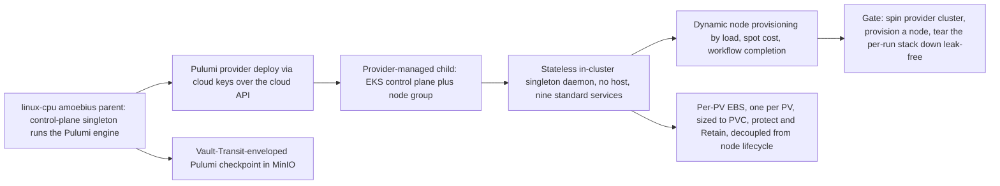

# Phase 10: Provider-managed clusters + dynamic provisioning

**Status**: Authoritative source
**Supersedes**: N/A
**Referenced by**: README.md, overview.md, system_components.md
**Generated sections**: none

> **Purpose**: Provision provider-managed clusters (EKS — prodbox's reality) via Pulumi
> issued from inside an amoebius parent, land the stateless in-cluster singleton daemon (no host),
> provision nodes dynamically by logic, decouple per-PV EBS from the EC2/node lifecycle under the
> create-vs-delete credential model, and gate on spinning a provider cluster, dynamically provisioning a
> node, and tearing down leak-free.

---

## Phase Status

📋 Planned. Nothing in this phase is implemented; every sprint below is design intent and every
prescriptive statement is a target shape, not a tested amoebius result. The provider-cluster-via-Pulumi
shape, the encrypted-MinIO Pulumi backend, the EKS deploy, and the credential-class split are all
**generalized from the sibling prodbox project** (its `aws-eks` Pulumi stack, `Prodbox.Pulumi.EncryptedBackend`,
and the operational-vs-elevated credential model) — that is *sibling evidence, never amoebius proof*
(honesty rule, [development_plan_standards.md §K](development_plan_standards.md)).

## Phase Summary

This phase extends amoebius's reach from self-managed `kind`/`rke2` children (Phase 9) to
**provider-managed clusters**, where there is no host binary and the cloud provider owns the control
plane. It owns four deliverables, all driven from a single linux-cpu parent:

1. **Provider-cluster Pulumi deploy from inside a parent.** A provider cluster (EKS) is
   provisioned via cloud keys over the cloud API, by a `pulumi up` that runs **only from inside an
   already-running amoebius cluster**, under the elected control-plane singleton, with the checkpoint
   held as a Vault-Transit-enveloped object in MinIO. There is no laptop `pulumi up`, no plaintext state,
   and no `PULUMI_*`/`AWS_*` env side-channel — the `pulumi` binary and the cloud plugin are discovered
   lazily by full path.
2. **The stateless in-cluster daemon (no host).** A provider-managed child has **no host access** and
   therefore **no host worker daemons** (no Apple-Metal substrate); it runs only the in-cluster singleton
   daemon, converging the same nine fungible standard services from typed manifests — not a different,
   thinner cluster.
3. **Dynamic node provisioning by logic.** A cluster's node set is itself declarative and reactive: it
   grows and shrinks by load, spot-instance cost, and workflow completion, enacted as *just another
   reconcile* over the desired node set in the `.dhall`.
4. **Per-PV EBS decoupled from the node lifecycle under the create-vs-delete model.** Each PV's EBS volume
   is sized 1:1 to its PVC and carried in its **own durable Pulumi state**, flagged `protect`/`Retain` so a
   normal teardown of the per-run cluster stack never includes it; the operational credential can *create*
   EBS but is *denied* `ec2:DeleteVolume`, so accidental durable-data destruction is unauthorized at the
   cloud API, not merely discouraged.

This phase realizes the **first-class managed-provider arm** of the compute-engine axis: EKS is the
`Managed Eks` constructor of the `ComputeEngine` union ([`cluster_topology_doctrine.md`](../documents/engineering/cluster_topology_doctrine.md)
§2, [`illegal_state_catalog.md`](../documents/engineering/illegal_state_catalog.md) §3.13 / I13), a hostless
arm carrying no `LinuxHost` witness — the type shape lands in Phase 3 (Sprint 3.6), and this phase provisions
it. The dynamic-provisioning deliverable is the runtime enaction of a typed `ScalingPolicy`
([`resource_capacity_doctrine.md`](../documents/engineering/resource_capacity_doctrine.md) §6, catalog §3.21)
whose cloud quota is the outer ceiling on the `CloudQuota` storage/compute backing.

This phase consumes — and does not re-implement — the Phase 2 platform/storage/Vault substrate, the
Phase 3 control-plane singleton + typed reconciler, and the Phase 9 amoebic-spawn machinery (SSH-key
self-managed spawn, the encrypted MinIO backend, per-child Vault-envelope encryption). Provider-cluster
spawn is the *cloud-keyed* sibling of Phase 9's *SSH-keyed* spawn over the same backend and the same
lifecycle vocabulary.

**Substrate:** linux-cpu → provider (§L). Per [development_plan_standards.md §L](development_plan_standards.md),
the acceptance gate runs on **exactly one hardware substrate — `linux-cpu`** — the parent amoebius cluster
(a kind cluster on `linux-cpu`) from inside which the Pulumi engine issues the deploy, per the one-rule
([pulumi_iac_doctrine.md §1](../documents/engineering/pulumi_iac_doctrine.md#1-the-one-rule-pulumi-runs-only-from-inside-an-existing-amoebius-cluster)).
"`→ provider`" names the *deploy target class* — a cloud-managed Kubernetes cluster (EKS) reached over the
cloud API — not a fifth hardware substrate: the provider child has no host and no Apple/CUDA substrate of
its own ([cluster_lifecycle_doctrine.md §1](../documents/engineering/cluster_lifecycle_doctrine.md#1-two-cluster-kinds-one-lifecycle-shape)).
The gate therefore stays single-substrate (`linux-cpu`) while exercising a provider target.

**Gate:** an `amoebius.dhall` that, from a `linux-cpu` parent, **spins up a provider-managed cluster**
(EKS, via the encrypted-MinIO-backed Pulumi deploy under the singleton), brings up its stateless
in-cluster daemon, **dynamically provisions an extra node** by a declared rule and observes it join, then
**tears the per-run cluster stack down leak-free** — VPC, control plane, node group, and the dynamically
provisioned node all destroyed with no orphans, idempotently on re-run, with any durable per-PV EBS
correctly **retained** (a retained durable volume is *not* a leak — it is its class behaving correctly).
The run emits a proven/tested/assumed ledger artifact. (The elevated-harness reclamation of durable
test-flagged EBS that makes a *full* leak-free test *cycle* possible is Phase 11 work, deferred and noted
below — never depended on here.)

## Doctrine adopted

- **[`pulumi_iac_doctrine.md` §1 — The one rule: Pulumi runs only from inside an existing amoebius cluster](../documents/engineering/pulumi_iac_doctrine.md#1-the-one-rule-pulumi-runs-only-from-inside-an-existing-amoebius-cluster),
  with [§4 — What Pulumi provisions (the resource catalog)](../documents/engineering/pulumi_iac_doctrine.md#4-what-pulumi-provisions-the-resource-catalog),
  [§6 — The EBS create-vs-delete credential model](../documents/engineering/pulumi_iac_doctrine.md#6-the-ebs-create-vs-delete-credential-model),
  [§3 — State lifetime matches resource lifetime, per class](../documents/engineering/pulumi_iac_doctrine.md#3-state-lifetime-matches-resource-lifetime-per-class),
  and [§8 — How deploys are enacted: the reconciler, referenced not restated](../documents/engineering/pulumi_iac_doctrine.md#8-how-deploys-are-enacted-the-reconciler-referenced-not-restated):**
  this phase realizes the doctrine's provider-cluster, dynamic-node, and per-PV-EBS catalog entries (§4) as
  Pulumi deploys that obey the one rule (§1) — engine under the in-cluster singleton, no env vars, no
  `PATH`, checkpoint as a Vault-enveloped MinIO object — each classified by lifetime so the per-run cluster
  stack dies with its run while durable EBS does not (§3), and each EBS volume guarded by the
  create-but-never-delete operational credential (§6). It enacts all of this through the §8 reconciler
  shape (no global Pulumi state machine), not as a bespoke flow.
- **[`cluster_lifecycle_doctrine.md` §1 — Two cluster kinds, one lifecycle shape](../documents/engineering/cluster_lifecycle_doctrine.md#1-two-cluster-kinds-one-lifecycle-shape),
  with [§8 — Dynamic node provisioning](../documents/engineering/cluster_lifecycle_doctrine.md#8-dynamic-node-provisioning),
  [§3 — Amoebic spawning — the recursive forest](../documents/engineering/cluster_lifecycle_doctrine.md#3-amoebic-spawning--the-recursive-forest),
  and [§9 — How bring-up and teardown are implemented: the reconciler, not a state machine](../documents/engineering/cluster_lifecycle_doctrine.md#9-how-bring-up-and-teardown-are-implemented-the-reconciler-not-a-state-machine):**
  this phase delivers the *provider-managed* column of the two-cluster-kinds table (§1) — no host binary,
  no host worker daemons, only the in-cluster singleton — as a cloud-keyed amoebic spawn (§3) sharing
  Phase 9's *bring-up → init → reconcile → teardown* vocabulary, and makes the node set declarative and
  reactive (§8) so provisioning a node is one more pass of the §9 reconciler (`discover → diff → enact →
  re-observe`, three-valued, `Unreachable → refuse`).

## Sprints

## Sprint 10.1: Provider-cluster Pulumi deploy from inside an amoebius parent 📋

**Status**: Planned
**Implementation**: `amoebius-pulumi/src/Amoebius/Pulumi/Engine.hs` (the in-cluster engine seam under the singleton),
`amoebius-pulumi/src/Amoebius/Pulumi/Backend/EncryptedMinio.hs` (Vault-Transit-enveloped MinIO checkpoint),
`amoebius-pulumi/src/Amoebius/Pulumi/Provider/Eks.hs` (the EKS provider program) (target layout from
[system_components.md](system_components.md); not yet built)
**Blocked by**: Phase 9 — amoebic spawning via Pulumi with the MinIO backend + per-child Vault-envelope encryption (external earlier-phase prerequisite); Phase 3 — control-plane singleton (runs the Pulumi engine); Phase 2 — MinIO + root Vault (the encrypted backend's substrate)
**Independent Validation**: from a `linux-cpu` parent, a `pulumi up` issued by the in-cluster singleton brings up a provider (EKS) control plane + node group; the checkpoint lands in MinIO as an opaque Vault-enveloped object and is unreadable without an unsealed Vault; a deploy attempted with a sealed Vault **refuses before any cloud mutation**; the `pulumi` binary and cloud plugin are invoked by full path with no `PULUMI_*`/`AWS_*`/`PATH` in the process environment
**Docs to update**: `documents/engineering/pulumi_iac_doctrine.md` (§1, §2, §4), `documents/engineering/cluster_lifecycle_doctrine.md` (§3), `documents/engineering/substrate_doctrine.md` (the no-env/no-`PATH` lazy discovery of `pulumi` + the cloud plugin)

### Objective

Adopt [`pulumi_iac_doctrine.md` §1 — The one rule: Pulumi runs only from inside an existing amoebius cluster](../documents/engineering/pulumi_iac_doctrine.md#1-the-one-rule-pulumi-runs-only-from-inside-an-existing-amoebius-cluster)
and the provider-cluster catalog entry in [§4 — What Pulumi provisions](../documents/engineering/pulumi_iac_doctrine.md#4-what-pulumi-provisions-the-resource-catalog):
make "spin up a provider-managed cluster" something the *cluster does* under its elected singleton — never
something a laptop shell does behind the cluster's back — with state held as a Vault-enveloped MinIO object,
generalizing Phase 9's SSH-keyed self-managed spawn to a cloud-keyed provider spawn.

### Deliverables

- An `Amoebius.Pulumi.Engine` seam that runs the Pulumi engine **only** under the in-cluster control-plane
  singleton (Phase 3); there is no host-shell entrypoint that can `pulumi up` a provider cluster.
- An `Amoebius.Pulumi.Backend.EncryptedMinio` backend: the checkpoint is one opaque object in the
  cluster's MinIO, sealed with a Vault-Transit envelope; the plaintext data key never lands on disk, and a
  sealed/unreachable Vault **fails the deploy closed** (no unencrypted or un-checkpointed fallback).
- An `Amoebius.Pulumi.Provider.Eks` program that provisions the EKS control plane + a base managed node
  group via cloud keys resolved from the cluster's Vault (secrets are *names* in the `.dhall`, bytes
  injected by the parent), landing the cluster ready for its in-cluster daemon (Sprint 10.2).
- Lazy, full-path discovery of the `pulumi` binary and the cloud-provider plugin through the substrate
  package manager; **no** `PULUMI_*`, `AWS_*`, `PULUMI_CONFIG_PASSPHRASE`, or `PATH` is exported into any
  child process.

### Validation

1. The singleton issues a provider deploy that reaches a ready EKS control plane + node group; an attempt
   to run the same deploy from outside the cluster (a bare host shell) has no supported entrypoint.
2. The checkpoint object in MinIO is opaque ciphertext; reading/writing it requires an unsealed Vault, and
   a deploy with a sealed Vault refuses *before* any cloud-side create.
3. Process-environment assertion: the deploy subprocess is spawned with an empty/whitelisted environment
   (no `PULUMI_*`/`AWS_*`/`PATH`), and the `pulumi`/plugin paths are absolute.

> **Honesty.** The encrypted-MinIO Pulumi backend and a working EKS deploy are **proven in prodbox**
> (`Prodbox.Pulumi.EncryptedBackend`; the `aws-eks` stack), with a Vault gate on every apply/destroy. That
> is *sibling evidence, not an amoebius result*; this sprint re-realizes the shape under the amoebius
> singleton and the per-child envelope for the first time.

### Remaining Work

The whole sprint.

## Sprint 10.2: The stateless in-cluster daemon for a provider child (no host) 📋

**Status**: Planned
**Implementation**: `amoebius-runtime/src/Amoebius/Daemon/InClusterSingleton.hs` (provider-child singleton wiring),
`amoebius-runtime/src/Amoebius/Cluster/ProviderBringUp.hs` (init-follows-readiness for a provider child) (target paths; not yet built)
**Blocked by**: Sprint 10.1; Phase 2 — platform services rendered as typed manifests + the typed reconciler (external earlier-phase prerequisite); Phase 3 — control-plane singleton + leadership election
**Independent Validation**: a freshly provisioned EKS child converges the same nine standard services from typed manifests (no Helm, no public-registry pulls), reachable and HA, with ingress only via Keycloak; the cluster runs **no** host worker daemon and exposes **no** host substrate; re-running bring-up is a no-op
**Docs to update**: `documents/engineering/cluster_lifecycle_doctrine.md` (§1, §2), `documents/engineering/daemon_topology_doctrine.md` (the in-cluster singleton as the only daemon on a provider child), `documents/engineering/platform_services_doctrine.md` (fungible standard-service convergence on a provider substrate)

### Objective

Adopt the provider-managed column of [`cluster_lifecycle_doctrine.md` §1 — Two cluster kinds, one lifecycle shape](../documents/engineering/cluster_lifecycle_doctrine.md#1-two-cluster-kinds-one-lifecycle-shape)
and the init-follows-readiness ordering in [§2 — Bring-up and bootstrap](../documents/engineering/cluster_lifecycle_doctrine.md#2-bring-up-and-bootstrap):
bring a provider child to the **same fungible shape** as a self-managed cluster using **only** the
in-cluster singleton daemon — no host binary, no host worker daemons, no Apple/CUDA host substrate — so a
provider child is the same machine as any other cluster from the reconciler's point of view.

### Deliverables

- Provider-child bring-up that, once the EKS API is reachable, initializes Vault, hands the child its own
  projected `.dhall`, and converges the nine standard services (registry, MinIO, Vault, Pulsar,
  Prometheus/Grafana, Postgres, Envoy/Gateway API, Keycloak, cloud LoadBalancer) from typed manifests via
  the Phase 2 reconciler — *not* a thinner or different service set.
- A daemon wiring that runs **exactly one** in-cluster singleton role and *no* host worker-daemon role on
  a provider child; the host-only NodePort comms path and host worker daemons are structurally absent
  (there is no host).
- Substrate-shape honesty in the spec: a provider child cannot declare host-substrate workloads (Apple
  Metal / Windows CUDA) — those belong to host-bearing clusters only — so an illegal "host workload on a
  hostless provider child" spec is refused. This is the runtime face of the `Managed Eks` arm carrying **no**
  `LinuxHost` / host-worker index ([`cluster_topology_doctrine.md`](../documents/engineering/cluster_topology_doctrine.md)
  §2, [`illegal_state_catalog.md`](../documents/engineering/illegal_state_catalog.md) §3.13/§3.14): the type
  makes it unrepresentable in Phase 3; this sprint confirms the provider child advertises no host substrate.

### Validation

1. A provisioned EKS child reaches the same nine-service fungible shape, HA and reachable, ingress only
   via Keycloak, with all images served in-cluster (no public-registry pulls).
2. The child runs a single in-cluster singleton and zero host daemons; there is no host NodePort peer and
   no host substrate advertised.
3. Re-running provider bring-up converges as a no-op (the §9 idempotent reconcile shape).

> **Honesty.** "No host access on a provider cluster" is the design position the doctrine records
> ([cluster_lifecycle_doctrine.md §1](../documents/engineering/cluster_lifecycle_doctrine.md#1-two-cluster-kinds-one-lifecycle-shape));
> prodbox runs EKS but does not yet drive it as a hostless amoebius child, so this is *new amoebius design*,
> validated here, not inherited proof.

### Remaining Work

The whole sprint.

## Sprint 10.3: Per-PV EBS decoupled from node lifecycle + create-vs-delete credential model 📋

**Status**: Planned
**Implementation**: `amoebius-pulumi/src/Amoebius/Pulumi/Ebs.hs` (per-PV durable EBS program, own state, `protect`/`Retain`),
`amoebius-pulumi/src/Amoebius/Pulumi/Credential.hs` (operational create-only vs elevated delete IAM policy split) (target paths; not yet built)
**Blocked by**: Sprint 10.1; Phase 2 — `no-provisioner` retained PVs + storage-lifecycle substrate (external earlier-phase prerequisite)
**Independent Validation**: a per-PV EBS volume is created sized 1:1 to its PVC in **separate** durable state from the ephemeral cluster stack; a `pulumi destroy` of the cluster stack leaves the EBS **intact** (`protect`/`Retain`); a simulated `ec2:DeleteVolume` under the operational credential is **denied** at the policy layer; the next bring-up re-attaches the same volume to the same claim
**Docs to update**: `documents/engineering/pulumi_iac_doctrine.md` (§6, §3), `documents/engineering/storage_lifecycle_doctrine.md` (per-PV EBS sizing 1:1 + node-vs-storage decoupling)

### Objective

Adopt [`pulumi_iac_doctrine.md` §6 — The EBS create-vs-delete credential model](../documents/engineering/pulumi_iac_doctrine.md#6-the-ebs-create-vs-delete-credential-model)
and the per-class state/credential pinning in [§3 — State lifetime matches resource lifetime, per class](../documents/engineering/pulumi_iac_doctrine.md#3-state-lifetime-matches-resource-lifetime-per-class):
make durable storage **structurally** outside the ephemeral destroy set and the authority to delete it
**structurally** withheld from normal operation, so "ephemeral cluster, durable data" cannot collapse on a
routine teardown and accidental durable-data destruction is *unauthorized at the cloud API*, not merely
discouraged.

### Deliverables

- An `Amoebius.Pulumi.Ebs` program placing each PV's EBS volume in its **own durable-class state**
  (separate checkpoint object, §3), sized 1:1 to its PVC, flagged `protect`/`Retain`, and **never** in the
  per-run cluster stack — so a normal `pulumi destroy` of the cluster never includes it.
- Node-vs-storage decoupling: a destroyed/replaced EC2 node detaches its EBS and the volume survives; the
  next bring-up re-attaches the same volume to the same `<namespace>/<statefulset>/pv_<integer>` claim.
- An `Amoebius.Pulumi.Credential` split: the operational credential is granted `ec2:CreateVolume` (plus the
  per-run cluster create/delete it needs) but **denied `ec2:DeleteVolume`** on durable retained volumes;
  the delete authority lives only with the elevated test credential, exercised in Phase 11 — referenced,
  not invoked here.

### Validation

1. Create a per-PV EBS, then `pulumi destroy` the cluster stack; assert the EBS survives (it is in
   separate, `protect`ed durable state) and re-attaches on the next bring-up with identical bytes.
2. Policy test: a simulated `ec2:DeleteVolume` under the operational credential is denied; the operational
   credential *can* create.
3. Assert EBS size equals its PVC request exactly (1:1), and that the volume's state object is distinct
   from the ephemeral cluster stack's checkpoint.

> **Honesty.** The create-vs-delete credential split is a **design resolution of an explicitly open
> question**; the operational-vs-elevated *credential class* is proven in prodbox,
> but EBS-in-prodbox is CSI-driver-created, **not** Pulumi-tracked — so amoebius's Pulumi-tracked durable-EBS
> model is *new design, not inherited proof*. The leak-free *reclamation* of durable test-flagged EBS by
> the elevated harness is Phase 11; this sprint builds only the create-only guard and the `protect`/`Retain`
> separation.

### Remaining Work

The whole sprint.

## Sprint 10.4: Dynamic node provisioning by logic 📋

**Status**: Planned
**Implementation**: `amoebius-runtime/src/Amoebius/Cluster/NodeProvisioner.hs` (declarative node set reconcile),
`amoebius-pulumi/src/Amoebius/Pulumi/NodeGroup.hs` (Pulumi add/drain of EC2/managed nodes) (target paths; not yet built)
**Blocked by**: Sprint 10.1; Phase 3 — control-plane singleton + the typed reconciler (external earlier-phase prerequisite)
**Independent Validation**: a `.dhall`-declared node rule (load / spot-cost / workflow-completion) drives the live node set toward its desired shape; raising the declared target provisions an EC2/managed node that joins the cluster; lowering it drains and releases the node; re-running converges as a no-op; `Unreachable` node observation **refuses** rather than charging ahead
**Docs to update**: `documents/engineering/cluster_lifecycle_doctrine.md` (§8), `documents/engineering/pulumi_iac_doctrine.md` (§4 — the dynamic-node catalog entry), `documents/engineering/app_vs_deployment_doctrine.md` (node elasticity as a deployment rule, never app logic)

### Objective

Adopt [`cluster_lifecycle_doctrine.md` §8 — Dynamic node provisioning](../documents/engineering/cluster_lifecycle_doctrine.md#8-dynamic-node-provisioning)
and the dynamic-node catalog entry in [`pulumi_iac_doctrine.md` §4 — What Pulumi provisions](../documents/engineering/pulumi_iac_doctrine.md#4-what-pulumi-provisions-the-resource-catalog):
make the cluster's node set **declarative and reactive** — grown and shrunk by logic, not by hand — so
provisioning a node is *just another reconcile* (§9) over the desired node set in the global `.dhall`,
living on the deployment-rules surface and never inside an app's logic.

### Deliverables

- An `Amoebius.Cluster.NodeProvisioner` that reads the declared elastic-node rule — a typed `ScalingPolicy`
  ([`resource_capacity_doctrine.md`](../documents/engineering/resource_capacity_doctrine.md) §6, catalog
  §3.21) driven by **load**, **spot-instance cost** (instance price-shopping), and **workflow completion** —
  and computes the desired node set, then drives the live set toward it through the §9 reconciler — no bespoke
  node state machine. Each provisioning step **re-runs the §4.6 capacity fold** against the grown bound, and
  the cloud quota is the outer ceiling, so a bounded budget grows only through this policy and never to
  "unbounded."
- An `Amoebius.Pulumi.NodeGroup` enaction that adds an EC2/managed node (Pulumi, under the singleton,
  encrypted backend) and drains+releases one when demand or the workflow recedes; node lifetime is the
  per-run/ephemeral class (its EBS, if any, is the durable class from Sprint 10.3).
- Three-valued, fail-closed node observation: a node that cannot be observed (`Unreachable`) refuses the
  teardown step rather than being silently treated as gone — no stranded EC2.
- The elasticity rule expressed **only** on the deployment-rules DSL surface; an app never asks for nodes.

### Validation

1. Raise a declared node target (e.g. a workflow-completion or load rule) and assert a new node is
   provisioned and joins; lower it and assert the node is drained and released.
2. Re-run the reconcile at a stable target and assert a no-op (idempotence).
3. Inject an `Unreachable` node observation during release and assert the reconciler refuses rather than
   pruning a node it cannot confirm absent.

> **Honesty.** Dynamic provisioning driven by spot-cost/load/workflow signals is *design intent*; no
> amoebius node-provisioner has been built or measured. The reconcile-not-state-machine shape is *proven in
> prodbox* for AWS resources, which is sibling evidence, not an amoebius result.

> **Stretched-node cross-ref (§L, this round; delivery-tracked, not built here).** The dynamic node
> provisioning this sprint enacts is also how a **K2 full stretched node** on a **self-managed rke2** control
> plane grows: its cloud (or metal) agents are ordinary `agents : List LinuxHost` provisioned via Pulumi under
> the singleton, each carrying a `ReachesControlPlane` witness over the WireGuard fabric
> ([`cluster_topology_doctrine.md`](../documents/engineering/cluster_topology_doctrine.md) §4.1,
> [`network_fabric_doctrine.md`](../documents/engineering/network_fabric_doctrine.md) §5). A full stretched
> **member** node on a **`Managed Eks`** control plane is a different matter: it is representable **only** as a
> provider-native capability — **EKS Hybrid Nodes** — which the hostless `Managed` arm would *surface* over the
> cloud API, never an amoebius-built second control-plane fabric; **absent that provider-native arm it is
> grade-1 uninhabitable, and is DEFERRED** (`cluster_topology_doctrine.md` §2,
> [`pulumi_iac_doctrine.md`](../documents/engineering/pulumi_iac_doctrine.md) §0/§4,
> [`cluster_lifecycle_doctrine.md`](../documents/engineering/cluster_lifecycle_doctrine.md) §1). This phase
> provisions provider **clusters** and self-managed rke2 agents; it does **not** introduce EKS Hybrid Nodes.

### Remaining Work

The whole sprint.

## Sprint 10.5: Phase gate — spin a provider cluster, provision a node, tear down leak-free 📋

**Status**: Planned
**Implementation**: `test/dhall/phase_10_provider_provision.dhall` (the gate topology),
`amoebius-pulumi/src/Amoebius/Pulumi/Teardown.hs` (per-run `reconcileAbsent` over the ephemeral cluster + node subset) (target paths; not yet built)
**Blocked by**: Sprint 10.1, Sprint 10.2, Sprint 10.3, Sprint 10.4
**Independent Validation**: the gate `amoebius.dhall` spins up a provider (EKS) cluster from a `linux-cpu` parent, brings up its stateless in-cluster daemon, dynamically provisions an extra node and observes it join, then tears the per-run cluster stack down leak-free (VPC + control plane + node group + provisioned node all destroyed, no orphans), idempotently on re-run, with any durable per-PV EBS correctly retained; each run emits a proven/tested/assumed ledger artifact
**Docs to update**: `documents/engineering/pulumi_iac_doctrine.md` (§3, §8), `documents/engineering/cluster_lifecycle_doctrine.md` (§9), `documents/engineering/testing_doctrine.md` (the per-run ledger; durable-EBS reclamation deferred to Phase 11)

### Objective

Adopt [`pulumi_iac_doctrine.md` §3 — State lifetime matches resource lifetime, per class](../documents/engineering/pulumi_iac_doctrine.md#3-state-lifetime-matches-resource-lifetime-per-class)
and [§8 — How deploys are enacted: the reconciler, referenced not restated](../documents/engineering/pulumi_iac_doctrine.md#8-how-deploys-are-enacted-the-reconciler-referenced-not-restated),
with [`cluster_lifecycle_doctrine.md` §9 — How bring-up and teardown are implemented: the reconciler, not a state machine](../documents/engineering/cluster_lifecycle_doctrine.md#9-how-bring-up-and-teardown-are-implemented-the-reconciler-not-a-state-machine):
assemble the phase gate — a single `.dhall` that brings a provider cluster up, provisions a node, and
tears the **per-run/ephemeral class** down leak-free via one `reconcileAbsent` over the owned subset, with
`Unreachable → refuse` and a tag-sweep backstop, while the durable EBS class is correctly left retained.

### Deliverables

- The gate `test/dhall/phase_10_provider_provision.dhall`: spin up the EKS provider cluster (Sprint 10.1),
  converge its stateless daemon (Sprint 10.2), provision an extra node by a declared rule and observe it
  join (Sprint 10.4), then always tear down the per-run cluster + node.
- An `Amoebius.Pulumi.Teardown` step: one `reconcileAbsent` over the **ephemeral** registry subset (VPC,
  EKS control plane, node group, dynamically provisioned node) — *Present → destroy → re-observe; Absent →
  skip; Unreachable → refuse* — leaving the durable EBS class (Sprint 10.3) untouched and retained.
- A per-run proven/tested/assumed ledger artifact recording: provider bring-up + node join as **tested on
  the EKS provider target from a linux-cpu parent**; per-run teardown leak-freedom as **tested**; durable
  EBS retention as **correct-by-class**; and the elevated-harness durable-EBS *reclamation* as
  **explicitly deferred to Phase 11, not asserted here**.

### Validation

1. Run the gate end-to-end: assert the provider cluster comes up, the in-cluster daemon converges, the
   extra node is provisioned and joins, and then the per-run stack tears down with **no orphaned** VPC,
   control plane, node group, or node.
2. Re-run the gate and assert idempotent bring-up and leak-free teardown; assert any durable EBS is
   retained (not destroyed) and re-attaches on a subsequent bring-up.
3. Assert the run emits a proven/tested/assumed ledger artifact per
   [`chaos_failover_doctrine.md` §12 — The moral core: proven, tested, assumed](../documents/engineering/chaos_failover_doctrine.md#12-the-moral-core--proven-tested-assumed);
   skipping an applicable teardown-observation move marks that layer UNVERIFIED, never green.

> **Honesty.** This gate proves the **per-run / ephemeral** teardown leak-free; the full leak-free *test
> cycle* — reclaiming durable, test-flagged EBS under the elevated credential — is Phase 11 and is **not**
> a dependency of this phase. Live AWS spend (EKS, EC2, EBS, NAT/ELB) is the *expected* outcome of asking
> the harness to provision a provider cluster, exactly as in the prodbox sibling; it is not a separate gate.
> The EKS reality is proven in prodbox; the amoebius provider-child lifecycle is validated here for the
> first time.

### Remaining Work

The whole sprint.

## Documentation Requirements

**Engineering docs to update:**
- `documents/engineering/pulumi_iac_doctrine.md` — record that §1 (the one rule), §3 (per-class state
  lifetime), §4 (provider-cluster + dynamic-node catalog entries), §6 (the EBS create-vs-delete model), and
  §8 (the reconciler enaction) are realized in `amoebius-pulumi`; flip the relevant sibling-evidence
  honesty notes to live-proof status once the gate runs (status itself stays in this plan, never in
  doctrine).
- `documents/engineering/cluster_lifecycle_doctrine.md` — record that §1's provider-managed column (no
  host, in-cluster singleton only), §3 (cloud-keyed amoebic spawn), §8 (dynamic node provisioning), and §9
  (reconciler teardown) gain an amoebius EKS reference; note the per-run-vs-durable teardown split this
  phase exercises.
- `documents/engineering/storage_lifecycle_doctrine.md` — record the per-PV EBS sizing (1:1) and
  node-vs-storage decoupling realized in `Amoebius.Pulumi.Ebs`, with durable-EBS reclamation deferred to
  Phase 11.
- `documents/engineering/substrate_doctrine.md` — record that the `pulumi` binary and cloud plugin conform
  to the no-env/no-`PATH` lazy-tool-ensure contract on the linux-cpu parent.
- `documents/engineering/testing_doctrine.md` — record the Phase 10 per-run ledger artifact and the
  explicit deferral of elevated durable-EBS reclamation to Phase 11.

**Cross-references to add:**
- From [system_components.md](system_components.md): the `amoebius-pulumi` package (Engine, EncryptedMinio
  backend, Provider/Eks, Ebs, Credential, NodeGroup, Teardown) and the `amoebius-runtime` provider-child
  daemon + NodeProvisioner modules, each mapped to its owning doctrine.
- From [substrates.md](substrates.md): the Phase 10 → `linux-cpu` (parent) row with the `provider` (EKS)
  deploy target annotated as a target class, not a fifth hardware substrate.
- From [README.md](README.md): mark the Phase 10 row's status from this plan once the gate passes.

## Related Documents

- [README.md](README.md) — the live tracker; Phase 10 objective, gate, and substrate
- [development_plan_standards.md](development_plan_standards.md) — the rulebook this doc obeys (§D skeleton,
  §F sprint format, §H citation rule, §K honesty, §L one-substrate discipline)
- [system_components.md](system_components.md) — the target component inventory (the Implementation paths
  above are its intended layout, not yet built)
- [substrates.md](substrates.md) — the substrate registry and per-phase map (`linux-cpu` parent → `provider`
  target)
- [Pulumi IaC Doctrine](../documents/engineering/pulumi_iac_doctrine.md) — the one rule, the encrypted MinIO
  backend, the resource catalog, and the EBS create-vs-delete credential model this phase implements
- [Cluster Lifecycle Doctrine](../documents/engineering/cluster_lifecycle_doctrine.md) — the two-cluster-kinds
  shape, dynamic node provisioning, and the reconciler teardown this phase implements
- [Storage Lifecycle Doctrine](../documents/engineering/storage_lifecycle_doctrine.md) — per-PV EBS sizing and
  node-vs-storage decoupling
- [Daemon Topology Doctrine](../documents/engineering/daemon_topology_doctrine.md) — the in-cluster singleton
  that runs the Pulumi engine on a hostless provider child
- [Vault / PKI Doctrine](../documents/engineering/vault_pki_doctrine.md) — the Transit envelope + per-child key
  the Pulumi checkpoint rides on
- [Testing Doctrine](../documents/engineering/testing_doctrine.md) — the per-run ledger and the deferred
  elevated durable-EBS reclamation
- Earlier phase: Phase 9 — Multi-cluster amoebic spawning + geo-replication + failover (the SSH-keyed spawn,
  encrypted MinIO backend, and per-child envelope this phase generalizes to a cloud-keyed provider spawn)
- Next phase: Phase 11 — Test-topology DSL + suggest-test + storage-lifecycle safety (the elevated-harness
  durable-EBS reclamation that completes the §6 model's leak-free test cycle)
