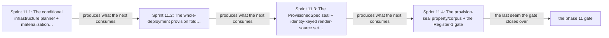

# Phase 11: Whole-deployment provision seal + expansion

> **Purpose**: Take the fully expanded `BoundDeployment` produced by [Phase 10](phase_10_capability_bind.md),
> run it through the conditional infrastructure planner/materialization boundary and then the Phase-7/8/9
> capacity folds, and either prove the declared target materialized — sealing one opaque whole-deployment
> `ProvisionedSpec` carrying a single identity-keyed `ProvisionedRenderSourceSet` with per-field ownership and
> four-stage activation — or return exactly one structured `ProvisionError` at the `provision-seal` locus.
> **Read this if**: phase 11 is next in the queue, or a later phase depends on what its gate establishes.

Phase 11 delivers the whole-deployment provision seal + expansion; its design is owned by [resource_capacity_doctrine.md](../documents/engineering/resource_capacity_doctrine.md), [resource_capacity_sources.md](../documents/engineering/resource_capacity_sources.md), [service_capability_doctrine.md](../documents/engineering/service_capability_doctrine.md), and the plan for reaching it is owned here.
Register 1: an in-process battery, no cluster.
The Register-1 gate passed on 2026-08-09 with ledger
`dynamically-resolved`.

> **Historical result (invalidated).** Any pass, seal, validation, ledger, receipt, or implementation observation
> in the orientation text above is diagnostic only. The Phase Status section and [tracker](README.md) own current state; the
> target contract below remains normative.

Link-graph metadata

**Status**: Authoritative source
**Supersedes**: N/A
**Referenced by**: DEVELOPMENT_PLAN/README.md, DEVELOPMENT_PLAN/overview.md, DEVELOPMENT_PLAN/phase_05_gadt_decoder_gate2.md, DEVELOPMENT_PLAN/phase_07_capacity_core_folds.md, DEVELOPMENT_PLAN/phase_08_storage_geometry_folds.md, DEVELOPMENT_PLAN/phase_09_execution_accelerator_folds.md, DEVELOPMENT_PLAN/phase_10_capability_bind.md, DEVELOPMENT_PLAN/phase_12_inference_accelerator_provision.md, DEVELOPMENT_PLAN/phase_14_chain_kernel_boundary.md, DEVELOPMENT_PLAN/phase_48_provider_dynamic_nodes.md, DEVELOPMENT_PLAN/phase_49_determinism_jitcache.md, DEVELOPMENT_PLAN/system_components.md
**Generated sections**: none

## Contents
- [Phase Status](#phase-status)
- [Phase Summary](#phase-summary)
- [Gate integrity](#gate-integrity)
- [Doctrine adopted](#doctrine-adopted)
- [Sprints](#sprints)
- [Sprint 11.1: The conditional infrastructure planner + materialization boundary (`planInfrastructure`) ✅](#sprint-111-the-conditional-infrastructure-planner--materialization-boundary-planinfrastructure-)
- [Sprint 11.2: The whole-deployment `provision` fold + execution/runtime-storage/object/observability/migration/scheduler expansion ✅](#sprint-112-the-whole-deployment-provision-fold--executionruntime-storageobjectobservabilitymigrationscheduler-expansion-)
- [Sprint 11.3: The `ProvisionedSpec` seal + identity-keyed render-source set + four-stage activation ✅](#sprint-113-the-provisionedspec-seal--identity-keyed-render-source-set--four-stage-activation-)
- [Sprint 11.4: The provision-seal property/corpus + the Register-1 gate ✅](#sprint-114-the-provision-seal-propertycorpus--the-register-1-gate-)
- [Documentation Requirements](#documentation-requirements)
- [Related Documents](#related-documents)

---

## Phase Status

⏸️ Blocked pending Phase-10 revalidation — **reopened 2026-08-16 by the natural-architecture amendment.**
[§S](development_plan_gate_integrity.md#s-universal-artifact-hygiene-gate) clause 15 requires a run to record
the natural architecture it proved and to execute no artifact of another. This phase's last gate recorded no
architecture, so its seal is invalidated as a current result and stands only as history; the rerun differs from
it by naming the lane and architecture the run actually used. A sprint marker below records what that sprint achieved before the amendment; under
[§N](development_plan_phase_model.md#n-reopening-and-amending-a-phase) it is a diagnostic, not surviving closure.

**Pre-natural-architecture status record (invalidated where it claims completion):**

Done (invalidated) — resealed 2026-08-15. `python3 tools/provision_seal_gate.py` passed all ten sides: 26 activation,
planner, provision, and mutant items, all ten mutants, all twelve metrics, and the honesty ledger pass; 34
surfaces join to 42 enumerated items. The project-contained attestation is
`sha256:308b526838567e092e59afdff70e48337acd988bb39f67f857e95357f7fc21b5`, bound to source snapshot
`sha256:450cd22ff1ff6667…`; Phase 11 owns no remaining migration deferral.

**Pre-containment status record (invalidated where it claims completion):**

Done (invalidated) — sealed 2026-08-12. The migrated gate passed against source snapshot `sha256:78503b2cb8dc1a0a…`
(1936 non-ignored files) and published a verified pre-containment external attestation
`sha256:46f666a4abf03ac312c5f90f695e87670dbe1855f8d068e1152f3e5b991d1cb8`.

**Observed progress — 2026-08-12:** **Policy-conformant.** Every capability check is unchanged and re-run: 18
inherited capability positives provision, both infrastructure-planner paths hold, the creation plan validates
under CAS and enacts against its readback, the render source set is one equal-keyed map across four activation
stages, ten specific negatives redden at their tags, both property boundaries hold exact-versus-one-short, and
all ten seeded mutants redden. Evidence and the ledger move into `.build/runs/phase_11/<run-id>/`, and 26
run-time items — four activation witnesses, two planner cases, ten provision cases, and ten mutant names —
partition one-to-one across the claim surfaces.

**Six contract surfaces carry no id and are now honestly UNVERIFIED**: `creation-provider-action-batch`,
`plan-token-replay-rejection`, `action-token-replay-rejection`, `receipt-bound-materialization-readback`,
`promised-identity-rejection`, and `phase11-validation-locus-ledger`. None has an oracle case, a mutant, or a
metric of its own; the pre-amendment ledger reported them tested by naming them in a hand-maintained set. The
gap is recorded against Phase 11 in [`legacy_tracking_for_deletion.md`](legacy_tracking_for_deletion.md).

**Invalidated historical record:**

Done (invalidated). The pure planner, provision fold, opaque seal, corpus, properties, and mutant battery passed on
2026-08-09. The retained evidence is in `evidence/phase_11/` and the exact claim boundary
is recorded in `ledgers/phase_11_provision_seal.md`. This phase opened after the [Phase 10](phase_10_capability_bind.md)
gate (the capability union + representational `bind` + object-node-multiset shape oracle, which produces the
wholly-unprovisioned `BoundDeployment` this phase consumes) and the [Phase 9](phase_09_execution_accelerator_folds.md)
gate (the execution-epoch/scheduler-reservation/runtime-metadata/accelerator folds and the composed
full-resource-vector place-witness gate this phase *invokes*), and runs on **no substrate** (`none`) in
**Register 1** — it stands up no host, no cluster, and no provider, only the pure `planInfrastructure` boundary,
the total `provision` fold, and the render-source seal, plus their property/corpus battery. This sub-phase owns
**the seal and the expansion that drives the folds**, never the folds' own soundness (that is the earlier-phase
gate) and never the `bind` that produced its input.

## Phase Summary

This phase makes amoebius's *"every resource provision is explicit, pure first, and impossible targets have no
deployable value"* invariant executable as the **post-bind provision seal**. It owns exactly two total
functions and the private artifact they seal:

`planInfrastructure :: ProvisionTargetSupply -> BoundDeployment -> Either ProvisionError InfrastructurePlanningResult`
— the **conditional infrastructure planner / materialization boundary**. It derives the exact infrastructure
demand *internally* from the fully expanded `BoundDeployment` (never accepting a caller-authored demand vector),
and either proves the declared target already materialized (`NoInfrastructureRequired`) or returns exactly one
non-renderable `InfrastructureRequired` plan owning one batch-scoped Pulumi
graph/checkpoint/dependency/concurrency/quota partition and a fresh plan token. `StandaloneRoot` supplies the
complete declared node/host/account/backing/API-etcd inventory; `ForestMember` supplies the exact opaque
`ClusterBudget`. Only fresh validation and receipt-bound provider/host readback
(`ObservedInfrastructureMaterialization`) construct `ProvisionContext`; replay, missing readback, or promised
identities reject.

`provision :: ProvisionContext -> Topology -> BoundDeployment -> Either ProvisionError ProvisionedSpec`
— the **whole-deployment provision fold**. It is the *sole constructor* of every `Provisioned*` projection. It
resolves each opaque `PriorExecutionProvisionRef | PriorVolumeProvisionRef | PriorRegistryProvisionRef` against
`ProvisionContext`, expands each desired `BoundExecutionUnit` through its kind-indexed controller body into
`MaterializedExecutionInstance`s and empty-capable `ExecutionEpoch`s, drives the Phase-7 capacity fold, the
Phase-8 storage-geometry fold, and the Phase-9 execution-epoch / runtime-metadata / scheduler-reservation /
accelerator-residency folds over the *full* expanded resource vector, and constructs the private witnesses —
`ProvisionedExecutionEpochs`, `ProvisionedNodeRuntimeStorageAccounting`, the finite monitoring-work Prometheus
envelope, the six-arm object-producer/storage-budget/admission-gateway witnesses, the
old+new volume/registry/schema migration witnesses, the ZooKeeper/Patroni database witnesses, the
`PulumiExecutionDemand`, the mandatory reconciler `Lease`, and exactly one deployment-global
`ProvisionedCapacitySchedulerSystem`. On success it seals the opaque **`ProvisionedSpec`** and, via
`provisionRenderSources :: ProvisionedDeploymentParts -> Either ProvisionError ProvisionedRenderSourceSet`, one
**equal-keyed identity render-source set** — one `ProvisionedRenderSource` per `K8sObjectIdentity`
(alias `KubernetesObjectId`), each map key equal to its embedded source identity, its provisioned-part witness
fixing owner, fields, reconcile mode, and one of the four
`RenderActivation = Immediate | BootstrapSchedulerStage | AfterBootstrapAddonCutover | AfterManagedCapacityReady`
stages. On any insufficiency — post-bind expansion overcommit, monitoring-work over budget, VRAM overcommit, or
a CUDA-requiring workload on a non-CUDA topology — it returns the exact structured `ProvisionError` at the
`provision-seal` locus and never constructs `ProvisionedSpec`.

What is **not** here:
- the capability union, the `CapabilityBinding`, the total `bind`, the object-node-multiset shape oracle,
  and the Gate-1/Gate-2 negatives ([Phase 10](phase_10_capability_bind.md))
- the *representational* `InferenceEngine`/`EngineRuntime` union and the identity-complete accelerator
  source/workload/residency/ coexistence provision corpus
  ([Phase 12](phase_12_inference_accelerator_provision.md))
- the *soundness* of the `fits`/`carve`/`place` folds and the composed full-resource-vector place-witness
  gate this phase merely invokes ([Phase 7](phase_07_capacity_core_folds.md), [Phase 8](phase_08_storage_geometry_folds.md), [Phase 9](phase_09_execution_accelerator_folds.md))
- the pure `renderAll :: ProvisionedSpec -> [K8sObject]` that consumes the sealed set ([Phase 13](phase_13_render_manifest_goldens.md))
- the live `amoebius-capacity` scheduler runtime ([Phase 28](phase_28_capacity_scheduler.md))
- and the live realization of any provider or the actual jit-resolve of an engine
  ([Phase 49](phase_49_determinism_jitcache.md), the live band).

**Substrate:** none — no host, no cluster, no provider; the gate is an in-process `cabal test` over
`planInfrastructure` + `provision` + `provisionRenderSources`, analogous to the Phase-9 fold battery it invokes.

**Lane:** none ([§L](development_plan_standards.md#l-one-substrate-discipline))

**Register:** 1 — pure/golden, in-process, no cluster. The emitted ledger's acceptance token reads
*binding-composition proven* / *proven for the model*, never *runtime proven*: a green seal establishes that the
expanded deployment composes and fits its declared target, not that any provider came up. The live realization
of every provider and the jit-resolve of every engine are marked **UNVERIFIED**, owned by the live band.

**Gate:** `python3 tools/provision_seal_gate.py` passed on no substrate, Register 1.
It covers both planner paths, 18 provision positives, ten specific negatives, two boundary properties, and ten
mutants. The complete apparatus is named in [`## Gate integrity`](#gate-integrity).

## Gate integrity

This section carries this sub-phase's **slice** of the source capability-binder gate apparatus, partitioned
along the provision-seal seam (per [`development_plan_standards.md` §M](development_plan_standards.md#m-gate-integrity-a-gate-cannot-be-passed-by-a-stub)).
The `bind`/shape-oracle apparatus (`golden_servicespec_<arm>_<shape>`, `mutant_copy_shape_tag`,
`mutant_catchall_arm`, `mutant_shared_app_import`, the Gate-1/Gate-2 negatives) stays in
[Phase 10](phase_10_capability_bind.md); the identity-complete accelerator source/workload/residency/coexistence
apparatus (`illegal_accelerator_count_shortage`, `illegal_accelerator_source_workload_mismatch`,
`illegal_accelerator_policy_domain_mismatch`, `illegal_accelerator_residency_placement`,
`illegal_accelerator_coexistence_overcommit`, `illegal_engine_family_unavailable_on_lane`,
`illegal_engine_by_url`, and the five `mutant_*_accelerator_*` / `mutant_skip_accelerator_shard_validation`
mutants) stays in [Phase 12](phase_12_inference_accelerator_provision.md). This phase inherits only the
seal-locus slice below.

*Orientation. The seams Phase 11 built in order; [Gate integrity](#gate-integrity) owns the passing apparatus.*

**Oracle-pinning (§M.1).** Every fixture, expected `ProvisionError` tag, and reference table this gate checks
against is authored and **committed in this phase's oracle-pinning sprint**, before `planInfrastructure`/`provision` exist — no oracle is
regenerated from the implementation's own output, and the opaque `ProvisionedSpec` has *no* golden (a golden
value would defeat its opacity; its correctness is checked only through the independent reference predicates
below):

### Inherited positive corpus

(authored in this phase's oracle-pinning sprint, provisioned here): the nine per-arm positive fixtures
`dhall/examples/legal_<arm>_{singlenode,distributed}.dhall` for all nine capability arms — each already
`bind`-checked against its `golden_servicespec_<arm>_<shape>` in Phase 10 — are provisioned against their
declared target topologies. Two oracle-pinned `ProvisionTargetSupply` fixtures drive the planner boundary:
a **pre-existing** fixture that must yield `NoInfrastructureRequired`, and a **creation** fixture that must
return one `InfrastructureRequired` plan, validate/CAS-enact its `ProvisionedProviderActionBatch` into a
`ValidatedInfrastructureActionBatch`, and feed a receipt-bound `ObservedInfrastructureMaterialization` into
`ProvisionContext`.

### Seal-locus negative corpus

Each fixture asserts **its specific `ProvisionError` reason (§M.8)**, and each is paired with a positive
differing only in the foreclosed dimension:
- `dhall/examples/illegal_post_bind_expansion_overcommit.dhall` (an app skeleton that fits alone but whose
  case table makes the selected provider's kind-indexed desired replica, surge instance, retained old
  revision, live terminating instance, sidecars, standard-platform graph, model-derived kubelet/CRI runtime
  metadata, or one physical partition's unique child-carve sum exceed its exact boundary by one — each case
  returns its exact structured `Left`, proving the seal runs the fold *after* identity-keyed epoch expansion
  and component→role→layout-backing derivation, not over the raw app)
- `illegal_monitoring_work_over_budget.dhall` (the expanded `Observability` descriptor exceeds one mandatory
  finite `MonitoringWorkBudget` workflow/rule/series/evaluation-work bound by one → `Left
  MonitoringBudgetExceeded`, its paired positive differing only in that bound)
- `illegal_accelerator_vram_shortage.dhall` (a residency epoch that fits raw device `memory.total` but
  exceeds net `allocatableVram` → `ProvisionError VramOvercommit`)
- `illegal_cuda_on_cpu_target.dhall` (a CUDA-requiring workload on a non-CUDA topology → `ProvisionError
  MissingCapability Cuda`)
- `illegal_controller_child_unbounded.dhall` (`Left UnknownCommitment`: a CR arm with no finite child
  pod/PVC/rollout envelope)
- `illegal_elastic_per_node_expansion_overcommit.dhall` (a workload that fits raw candidate allocatable but
  not after multiplying/subtracting required per-node execution units)
- and `illegal_prior_provision_ref_{missing,stale,wrong_generation,wrong_arm}.dhall` (the corresponding
  structured `ProvisionError` raised **before** any transition execution, allocation, or copy).

**Committed mutation quota (§M.2).** This phase inherits **ten** of the source's committed seeded mutants —
the ones that break the seal or its expansion — committed and re-run (not run once); the gate MUST turn each
red when substituted:

- `mutant_fixed_prometheus_requests` — bypass the versioned monitoring cost fold with a fixed Prometheus
  envelope (effect swap; caught by the `Observability` budget property and the `illegal_monitoring_work_over_budget`
  negative);
- `mutant_provisioned_value_in_bound_deployment` — inject a `Provisioned*` result into the boundary before
  `provision` runs (union-arm addition; caught by the structural inventory that proves `BoundDeployment`
  contains no `Provisioned*` field and that `provision` is the sole constructor);
- `mutant_unchecked_prior_ref` — accept a missing, stale, wrong-generation, or wrong-arm prior provision
  reference without resolving it from `ProvisionContext` (dropped check; caught by the
  `illegal_prior_provision_ref_*` corpus);
- `mutant_drop_execution_replica`, `mutant_drop_execution_surge`, `mutant_drop_execution_old_revision` — omit
  one kind-indexed identity from its required steady/rollout/live epoch (dropped effect; caught by the
  independent instance/epoch enumeration and the one-unit-short pairs);
- `mutant_wrong_execution_revision_join` — join a `MaterializedExecutionInstance` to the wrong source revision
  (effect swap; caught by the `(sourceUnit, revision, ordinal, resource)` exact-join predicate);
- `mutant_double_debit_controller_child` — charge the explanatory controller witness after the lowered
  kind-indexed unit already paid (dropped `UNCHANGED`; caught by the no-second-debit inventory);
- `mutant_drop_largest_kubelet_metadata` — omit the largest simultaneous Pod runtime-metadata row from the node
  aggregate (dropped effect; caught by the runtime-storage ownership predicate);
- `mutant_missing_kubelet_metadata_model` — accept a missing/changed target model or scalar byte fallback,
  drop/swap a component role, resolve a role to the wrong backing, mismatch a planned/observed domain, overlap
  or leak qualified Pod/image ownership, or double-debit an alias group (guard weakening; caught by the
  runtime-storage domain/role/ownership predicate).

**Independent reference predicates (§M.3).** Every equivalence check defines its reference side **independently of `provision`'s own fold**, never by reusing it:

1. an **independently enumerated** kind-indexed `(sourceUnit, revision, ordinal, resource) →
   MaterializedExecutionInstance` instance/epoch map (a distinct enumeration over the expanded runnable-source
   inventory, not `provision`'s fold) is checked exact-equal to the provision result for the steady map
   (including a Job-completed empty control) and every empty-capable rollout step; a separate pure property
   feeds normalized observed identities to the same shared fold and exact-fits the live
   desired ∪ referenced-old ∪ terminating ∪ scheduler-reservation union, including confirmed-bound
   `BindingRecovery`, and rejects its one-unit-short terminating pair, copied-new-as-old input, wrong
   generation, invented first-deploy old row, and two-candidate stale-residual race;
2. the **runtime-storage** predicate derives each metadata component's `KubeletNodefs | CriRuntimeRoot` role,
   resolves it through `Unified | SplitRuntime | SplitImage`, and independently asserts the largest simultaneous
   epoch/snapshot node aggregate has the exact assigned domain, disjoint-and-exhaustive qualified Pod/image
   ownership, and one grouped debit per physical carve; SplitRuntime nodefs and imagefs/containerfs one-byte-short
   cases and role/domain/ownership/alias mutants reject, and for an elastic target it asserts the class carries
   `PerInstanceKubeletFilesystemLayout` with only elastic `(instance, disk, carve)` refs (never a fabricated
   concrete `DiskCarveId`), each materialized one-for-one by an `ObservedNodeTargetBinding`;
3. an independent **four-stage activation classifier** enumerates every source in `ProvisionedDeploymentParts`,
   classifies it into `Immediate | BootstrapSchedulerStage | AfterBootstrapAddonCutover |
   AfterManagedCapacityReady` from an oracle-pinned reference table, and rejects a missing/extra stage, a
   managed-node taint/admission source placed in an early stage, a duplicate/omitted source-domain candidate, a
   map key unequal to its embedded identity, or a source whose activation disagrees with its provisioned owner —
   proving the seal produces exactly one equal-keyed `ProvisionedRenderSource` per `K8sObjectIdentity` with one
   global owner for shared Namespace/quota/scheduler/admission/RBAC/`Lease`/CRD sources.

**Concrete corpus (§M.7).** The "representative set" is named explicitly above: the nine per-arm positives under
both shapes, the two `ProvisionTargetSupply` boundary fixtures, and the ten named seal-locus negatives. The
QuickCheck totality property carries `checkCoverage` obligations so the reject/boundary branch fires a stated
minimum fraction; exact-fit execution-epoch / runtime-storage-backing / accelerator-VRAM boundaries accept while
each one-resource-or-one-byte-short minimally-differing pair rejects, exercising both boundary directions.

## Doctrine adopted

- [`resource_capacity_doctrine.md §3`](../documents/engineering/resource_capacity_doctrine.md#3-the-types-quantity-capacity-demand-budget)
  and [`§4`](../documents/engineering/resource_capacity_doctrine.md#4-the-total-fold-fits-carve-place-and-the-nesting)
  — **the complete resource envelope and the opaque post-fold `ProvisionedSpec` boundary.** This phase owns the
  ordering's tail: after Phase 10 expands every provider/shape into a `BoundDeployment`, the seal runs the
  Phase-7/8/9 folds and hands only the checked opaque result to Phase 13. A capacity check over a pre-bind
  skeleton is insufficient; the seal folds the *fully expanded* vector — kind-indexed desired/old/surge/
  terminating epochs, sidecars, controller children, the standard platform graph, and
  component→role→layout-backed runtime metadata — and returns `Left` on any one-axis overcommit.
- [`resource_capacity_sources.md §9.2`](../documents/engineering/resource_capacity_sources.md#92-monitoring-cost-folds-through-the-standard-machinery-and-the-forest-has-no-parent-rollup-budget)
  and [`§10`](../documents/engineering/resource_capacity_doctrine.md#10-planning-ownership)
  — **monitoring cost folds through the standard machinery**, and **planning ownership.** The seal runs the
  named, version-pinned conservative cost models that derive the Prometheus/proxy compute envelope and the
  rounded TSDB/query storage from the expanded `Observability` descriptor's cardinality — no
  descriptor-independent fixed request, tiny PVC, or optional-budget path — and `MonitoringBudgetExceeded` is a
  checked rejection, not a default. `planInfrastructure`/`provision` are the sole planning owners of the
  post-bind boundary.
- [`service_capability_doctrine.md §4`](../documents/engineering/service_capability_doctrine.md#4-capability--provider--shape-the-binding)
  — **Capability → provider → shape: the binding**, its provisioning tail. The provider/shape are chosen by
  deployment rules and expanded by `bind` (Phase 10); this phase provisions that fully expanded graph against
  the cluster's topology before anything can render, so a byte-identical app that binds to a structurally
  different graph per cluster provisions — or is refused — per cluster.
- [`service_capability_doctrine.md §4.1`](../documents/engineering/service_capability_doctrine.md#41-the-inferenceengine-capability--the-engine-is-target-offering-selected-and-jit-resolved-never-authored)
  — the `InferenceEngine` capability, its **enforcement half only**: a served model whose engine family is
  unavailable on the serving lane, or a CUDA-requiring workload on a non-CUDA topology, is a post-bind
  **`provision-seal` `Left`**. This phase implements that seal-locus rejection over the accelerator folds it
  invokes; the *representational* `EngineRuntime` union and the identity-complete residency/coexistence corpus
  are [Phase 12](phase_12_inference_accelerator_provision.md).
- [`illegal_state_catalog.md §3`](../documents/illegal_state/illegal_state_catalog.md#3-the-catalog--states-a-valid-spec-cannot-represent)
  with [`§2` the load-bearing limit](../documents/illegal_state/illegal_state_catalog.md#2-the-load-bearing-limit-a-type-check-proves-the-spec-composes-not-that-the-cluster-enforces-it)
  — the seal proves the *binding composes and its target has capacity*, not that the *running provider* came up.
  Every insufficiency is a structured `ProvisionError` at the `provision-seal` locus, and the runtime residue
  (the provider actually up, the engine actually resolved) stays UNVERIFIED, deferred to the live band.
- [`manifest_generation_doctrine.md §2`](../documents/engineering/manifest_generation_doctrine.md#2-the-typed-manifest-model-renderall-is-the-sole-public-pure-function-to-objects)
  — **`renderAll` is the sole public pure function to objects.** The provision seal is what *produces* the
  unique identity-keyed `ProvisionedRenderSourceSet` under the opaque `ProvisionedSpec` that Phase 13's
  `renderAll` privately maps; no service projection can invoke render on its own, and the seal's per-source
  field ownership and activation stage are what the later typed diff/enactor must honor.
- [`testing_doctrine.md` §2](../documents/engineering/testing_doctrine.md#2-the-registers-of-amoebius-testing)
  (**Register 1** — pure/golden, in-process, no cluster) and [§4](../documents/engineering/testing_doctrine.md#4-no-skips-fail-fast-and-the-per-run-ledger-artifact) (the per-run proven/tested/assumed ledger): the
  register this gate reaches and the ledger it emits, with the live realization of any provider (and the
  jit-resolve of any engine) marked UNVERIFIED, owned by the live band.

## Sprints

> **Current validation record.** Every sprint is covered by the 2026-08-15 reseal. Historical dates,
> pass/seal claims, repository-resident evidence paths, and `Remaining Work: None` statements below describe
> the pre-amendment capability record only; they do not override current status. Functional and validation
> outcomes remain target requirements. Any instruction to commit generated output, freeze dependency resolution,
> retain a resolved version, path, or integrity hash, or consume repository-resident evidence, ledgers, or
> enumerations is superseded by the current generated-artifact and dynamic-resolution doctrine. Closure was
> established by the current phase gate plus universal artifact hygiene.

## Sprint 11.1: The conditional infrastructure planner + materialization boundary (`planInfrastructure`) ✅

**Status**: Done — the capability is re-established by the migrated gate; the sprint's committed-ledger, pinned-toolchain, and repository-resident evidence mechanics are superseded
**Implementation**: `src/Amoebius/Capacity/Provision.hs` implements the planner, supply/result types, internal
demand derivation, validation/enaction, observed readback, and receipt-bound context. It imports no renderer.
**Blocked by**: None.
**Independent Validation**: pre-existing standalone and forest supplies return `NoInfrastructureRequired`.
Creation returns one exact action batch; fresh snapshot validation and exact readback construct the context.
Replay, stale snapshots, missing identities, and promised identities reject. QuickCheck compares internally
derived exact capacity with a one-unit-short supply.
**Docs to update**: `documents/engineering/resource_capacity_doctrine.md` (§10
planning-ownership backlink), `documents/engineering/manifest_generation_doctrine.md` (§9 the planning
boundary), `DEVELOPMENT_PLAN/system_components.md`.

### Objective
Adopt [`resource_capacity_doctrine.md §10 — Planning ownership`](../documents/engineering/resource_capacity_doctrine.md#10-planning-ownership):
implement the conditional infrastructure planner as a pure total function that derives — never accepts — the
matching infrastructure demand from the fully expanded `BoundDeployment` and either proves the declared target
already materialized or returns exactly one non-renderable plan owning the closed provider-action batch.

### Deliverables
- `planInfrastructure :: ProvisionTargetSupply -> BoundDeployment -> Either ProvisionError
  InfrastructurePlanningResult`, run after every capability/provider graph and standard-platform expansion.
  `StandaloneRoot` supplies the complete declared node/host/account/backing/API-etcd inventory; `ForestMember`
  supplies the exact opaque `ClusterBudget`. Demand is derived internally from `BoundDeployment`.
- `InfrastructureRequired` contains one batch-owned Pulumi graph/checkpoint/dependency/concurrency/quota
  partition and a fresh plan token; child-create payloads contain bound intent and budget, never a circular
  child `ProvisionedSpec`. A required plan owns one Pulumi action batch and cannot render.
- The materialization boundary: receipt-bound materialized nodes/root volumes/provider volumes
  (`ObservedInfrastructureMaterialization`) construct `ProvisionContext`; a `NoInfrastructureRequired` result
  supplies the already-materialized arm directly. Replay, missing readback, or promised identities reject.
- An in-file honesty note: `planInfrastructure` produces a *plan value*, not a live provider action; the live
  validation/CAS-enaction of any batch is the live band ([Phase 45](phase_45_provider_deploy_checkpoint.md)).

### Validation
1. The pre-existing fixture yields `NoInfrastructureRequired`; the creation fixture returns exactly one
   `InfrastructureRequired` plan with a fresh token and one action batch; the derived demand equals an
   independent enumeration over the expanded `BoundDeployment`; only receipt-bound readback constructs
   `ProvisionContext`, and replay / missing-readback / promised-identity inputs reject.

### Remaining Work
The whole sprint (✅ Done).

## Sprint 11.2: The whole-deployment `provision` fold + execution/runtime-storage/object/observability/migration/scheduler expansion ✅

**Status**: Done — the capability is re-established by the migrated gate; the sprint's committed-ledger, pinned-toolchain, and repository-resident evidence mechanics are superseded
**Implementation**: `src/Amoebius/Capacity/Provision.hs` implements `provision` and the opaque seal.
`src/Amoebius/Capacity/RuntimeStorage.hs` supplies scope-indexed metadata and node runtime/image accounting.
**Blocked by**: None.
**Independent Validation**: all nine arms under both shapes retain independently counted desired instances,
runtime rows, provider objects, and intents. Exact runtime backing accepts and one byte short rejects.
Monitoring, accelerator, controller-child, elastic, and four prior-reference failures return distinct tags.
The ten provision mutants each turn red.
**Docs to update**:
`documents/engineering/resource_capacity_doctrine.md` (§3/§4/§9.2 backlink),
`documents/engineering/service_capability_doctrine.md` (§4 the provisioning tail),
`documents/illegal_state/illegal_state_catalog.md` (the post-bind provision-seal locus),
`DEVELOPMENT_PLAN/system_components.md`.

### Objective
Adopt [`resource_capacity_doctrine.md §4 — the total fold`](../documents/engineering/resource_capacity_doctrine.md#4-the-total-fold-fits-carve-place-and-the-nesting)
and [`§9.2 — monitoring cost folds through the standard machinery`](../documents/engineering/resource_capacity_sources.md#92-monitoring-cost-folds-through-the-standard-machinery-and-the-forest-has-no-parent-rollup-budget):
provision the fully expanded `BoundDeployment` against its topology by driving the Phase-7/8/9 folds over the
complete resource vector, so the only deployable representation is the opaque whole-deployment `ProvisionedSpec`
and an impossible target has no deployable value.

### Deliverables
- `provision :: ProvisionContext -> Topology -> BoundDeployment -> Either ProvisionError ProvisionedSpec`, run
  after every capability/provider graph and the standard platform set have been expanded. Its private
  constructor — never a caller scalar — stores compute placement, `ProvisionedExecutionEpochs`, per-class/
  per-node expansion, pod-ephemeral/cache-population nesting, pod-slot and unique-driver-PVC attachment
  placement, mapped-file physical routing, per-slot `ProvisionedKubeletRuntimeMetadataDemand`, scope-indexed
  `ProvisionedNodeRuntimeStorageAccounting`, etcd logical quota fit, selected-platform OCI-content/snapshot
  placement by filesystem layout, durable presentation/allocation/native-host-cache backing, old+new
  volume/registry/schema migration execution, ZooKeeper metadata and Patroni database witnesses,
  controller-child transition/webhook bounds, the six-arm object-producer/storage-budget/admission-gateway
  witnesses, `PulumiExecutionDemand`, the mandatory reconciler `Lease`, and — as invoked from
  [Phase 12](phase_12_inference_accelerator_provision.md) — the `ProvisionedCudaOwnerDemand` /
  `ProvisionedMetalOwnerDemand` epoch witnesses.
- Before any placement subtraction, `provision` resolves the whole deployment's exact prior steady execution
  projection, then expands each desired `BoundExecutionUnit` through its kind-indexed controller body into
  `MaterializedExecutionInstance`s and complete, empty-capable `ExecutionEpoch`s. Desired and prior instance
  ids exact-join their own `(ExecutionUnitId, revision, ordinal, resource)` sources; the steady map contains
  the exact desired live service/daemon/host slot domain and may be empty for completed Job-only deployments,
  while planned rollout maps enumerate policy-reachable new/surge/old/zero-live steps. Unchanged identities
  dedup, changed revisions keep distinct old/new envelopes, added units have no old twin, removed prior-only
  units remain through apply-before-prune, and terminating instances are exact-joined to the referenced prior
  generation — never guessed from a raw bound. Controller-derived children pass through this exact mechanism;
  their private controller witness is checked for source equality and is not a second provision or debit.
- Placement evaluates the **full** resource vector in every epoch — CPU, memory, pod/CNI/CSI slots, logical Pod
  ephemeral, component/role/layout-routed runtime and image storage, durable volumes/cache, and accelerator
  device/residency epochs — by driving the Phase-7/8/9 folds, and retains the componentwise transition witness.
  A `ReplicaCardinality.Once` yields one planned slot; a `NodeEligibilitySelector` exact-joins the eligible set;
  Deployment/StatefulSet replicas and Job waves yield exact finite slot sets, a DaemonSet derives exactly one
  slot per selected node, and a HostProcess derives its exact host→slot map; a missing constraint target or
  missing/extra/ineligible slot rejects.
- The runtime-storage fold (`src/Amoebius/Capacity/RuntimeStorage.hs`) derives every metadata component's bytes
  and `KubeletNodefs | CriRuntimeRoot` role, proves the role sums, resolves roles through `Unified |
  SplitRuntime | SplitImage`, groups aliases by physical carve once, and builds one
  `ProvisionedNodeRuntimeStorageAccounting` per node and planned-epoch fingerprint with disjoint-and-exhaustive
  qualified Pod/image ownership combined with the `ProvisionedNodeImageStorageDemand`; SplitRuntime charges
  kubelet components to nodefs and CRI components to imagefs/containerfs, while Unified and SplitImage sum their
  forced aliases before one backing check. None of these physical bytes is repeated as logical Pod ephemeral
  demand. The same shared fold, invoked later by live preflight, instead builds the observed-inventory-fingerprint
  form keyed by authenticated `PodUid`; Phase 11 tests only the pure planned/normalized forms.
- The monitoring-work provision: `provision` runs the named, version-pinned conservative cost models over the
  expanded `Observability` descriptor's derived workflow/rule/series/sample-rate cardinality to derive the
  Prometheus CPU/memory requests and limits (baseline + evaluation overlapping maximum concurrent query work),
  the query-admission proxy's complete pod envelope, and the rounded TSDB/query `ProvisionedVolumeDemand` from
  the structural query operands (resident blocks + WAL/head + compaction overlap + query/temp peak), then
  applies the declared presentation/overhead and backing quantum. A count/rate over budget or a derived
  Prometheus/proxy envelope over the declared ceilings returns `Left MonitoringBudgetExceeded`; there is no
  descriptor-independent fixed-request/tiny-PVC/scalar-query-temp override and no optional-budget path.
- The transition resolution: using the Gate-2-validated branded refs, `provision` resolves
  `StorageMigrationDemand { old : PriorVolumeProvisionRef, ... }`, `RegistryStorageDemand`,
  `RegistryBackendMigrationDemand { source : PriorRegistryProvisionRef, ... }`, and `SchemaMigrationDemand`
  against `ProvisionContext` — constructing every private migration witness (old+new rounded volumes, digest
  copy maps, workspace/WAL/per-backing peaks) only after resolving the opaque ref; the binder-derived
  copy/transfer/schema executor envelopes it inherits enter the same kind-indexed epoch provisioner. It also
  resolves the six-arm `ObjectStoreProducerDemand` / `ObjectStoreAdmissionGatewayDemand` and `PatroniSqlDemand`
  into their private storage-geometry witnesses (Phase-8 fold), and stores exactly one deployment-global
  `ProvisionedCapacitySchedulerSystem`: complete default-scheduled bootstrap reservation, `pods=1` quota,
  prior+desired controller-child reservation config, managed-node taint/admission/Binding RBAC, aggregate
  root-ledger schema/byte/churn bound, readiness requirement, and unique global render owner.
- `BoundDeployment` contains no `Provisioned*` record: its only links to old successful generations are
  `PriorExecutionProvisionRef`, `PriorVolumeProvisionRef`, and `PriorRegistryProvisionRef`. `provision`
  exact-matches deployment/generation/resource arm in `ProvisionContext`; missing, stale, wrong-generation,
  wrong-arm, source-unit/revision/ordinal/resource, and identity/live-snapshot mismatches reject before any
  allocation or copy. `FirstDeployment` resolves to the exact empty prior execution inventory. These
  materialized/provisioned results occur only inside `provision` and its opaque output, so direct multiplicity
  fields never weaken the wholly-unprovisioned `BoundDeployment` boundary.
- An in-file honesty note: `provision` produces a value, not a live provider; the same pure identity/revision
  epoch algebra is later reused by live admission ([Phase 28](phase_28_capacity_scheduler.md)), which performs
  the real read this phase does not.

### Validation
1. Each of the nine per-arm positives provisions to an opaque `ProvisionedSpec` on both shapes; the independent
   instance/epoch enumeration exact-equals the provision result for steady (incl. Job-completed empty) and every
   rollout step, and each one-unit-short desired-replica/surge/old-revision case rejects. The
   normalized-observation property exact-fits the live desired ∪ referenced-old ∪ terminating ∪
   scheduler-reservation union (incl. `BindingRecovery`) and rejects its one-unit-short terminating pair,
   copied-new-as-old, wrong generation, invented first-deploy old row, and two-candidate stale-residual race.
   The runtime-storage fold exact-fits the grouped node backings and rejects the SplitRuntime one-byte-short,
   missing/mismatched-model, dropped/swapped-role, planned/observed-domain-mismatch, ownership-hole/overlap,
   alias-double-debit, or dropped-largest-row cases. `illegal_monitoring_work_over_budget` returns
   `Left MonitoringBudgetExceeded` without retaining fixed Prometheus requests, and each
   `illegal_prior_provision_ref_*` returns its structured `ProvisionError` before any transition execution. The
   suite goes **red** under each of the ten inherited seeded mutants.

### Remaining Work
The whole sprint (✅ Done).

## Sprint 11.3: The `ProvisionedSpec` seal + identity-keyed render-source set + four-stage activation ✅

**Status**: Done — the capability is re-established by the migrated gate; the sprint's committed-ledger, pinned-toolchain, and repository-resident evidence mechanics are superseded
**Implementation**: `src/Amoebius/Capacity/RenderSource.hs` implements opaque, identity-keyed sources,
their four activation stages, and the checked source-set constructor without importing a renderer.
**Blocked by**: None.
**Independent Validation**: the source domain equals provider objects plus four globals. Keys equal embedded
identities, witnesses independently fix owners, and all four activation stages appear. Duplicate, omitted,
key-mismatched, owner-mismatched, activation-mismatched, and missing-stage candidates reject.
**Docs to update**: `documents/engineering/manifest_generation_doctrine.md` (§2 who seals the whole-deployment
render-source set), `DEVELOPMENT_PLAN/system_components.md`.

### Objective
Adopt [`manifest_generation_doctrine.md §2 — `renderAll` is the sole public pure function to objects`](../documents/engineering/manifest_generation_doctrine.md#2-the-typed-manifest-model-renderall-is-the-sole-public-pure-function-to-objects):
seal the checked provision result into one opaque whole-deployment `ProvisionedSpec` carrying a single
identity-keyed render-source set with per-field ownership and a four-stage activation order, so Phase 13's
`renderAll` privately maps a unique set and no service projection can render on its own.

### Deliverables
- `K8sObjectIdentity` (and its compatibility alias `KubernetesObjectId`), the closed private
  `ProvisionedRenderSource identity`, and the closed
  `RenderActivation = Immediate | BootstrapSchedulerStage | AfterBootstrapAddonCutover |
  AfterManagedCapacityReady`.
- `provisionRenderSources :: ProvisionedDeploymentParts -> Either ProvisionError ProvisionedRenderSourceSet`,
  the sole constructor of the deployment-global render-source set. It seals one source per Kubernetes object
  identity; shared Namespace/quota/scheduler/admission/RBAC/`Lease`/CRD sources have one global owner; each map
  key equals its embedded source identity; and each source's provisioned-part witness fixes its owner, fields,
  reconcile mode, and activation stage. Duplicate/omitted source-domain candidates reject before
  `ProvisionedSpec`.
- The activation discipline: a later typed diff/enactor must honor activation, so a managed-node
  taint/admission object cannot be swept into the first generic apply; `renderAll` still lists the complete
  desired set. Phase 13 privately maps the unique source set and exposes only whole-deployment `renderAll`.
- An in-file honesty note: this seal produces the *input* to `renderAll`, not manifests; the byte-for-byte
  golden-locked render is [Phase 13](phase_13_render_manifest_goldens.md), and the live diff/enact honoring
  activation is the live band.

### Validation
1. The full `ProvisionedDeploymentParts` domain contributes exactly one equal-keyed `ProvisionedRenderSource`
   per object identity; duplicate/omitted/key-mismatched/owner-mismatched candidates reject; the independent
   activation classifier assigns each source its stage from the committed reference table and rejects a
   missing/extra stage, an early-staged managed taint/admission source, or an owner-disagreeing activation.

### Remaining Work
The whole sprint (✅ Done).

## Sprint 11.4: The provision-seal property/corpus + the Register-1 gate ✅

**Status**: Done — the capability is re-established by the migrated gate; the sprint's committed-ledger, pinned-toolchain, and repository-resident evidence mechanics are superseded
**Implementation**: `test/spec/capability/{ProvisionProps,RuntimeStorageBindingProps,ProvisionSealGate}.hs`,
`test/oracle/provision_seal/`, `test/mutant/provision_seal/`, the paired Dhall corpus, and `tools/provision_seal_gate.py`.
The 18 per-arm/shape fixtures remain inherited from [Phase 10](phase_10_capability_bind.md).
**Blocked by**: None.
**Independent Validation**: `cabal test provision-seal-spec` covers 18 positives, two planner paths, ten exact
negative tags, four activation stages, and two boundary properties. The phase gate runs all ten mutants
individually, checks complete locus coverage, emits retained evidence, and validates the hashed ledger.
**Docs to update**: `documents/engineering/resource_capacity_doctrine.md`,
`documents/engineering/service_capability_doctrine.md` (§4.1 the seal-locus family/CUDA rejection),
`documents/illegal_state/illegal_state_catalog.md` (§2 the load-bearing limit at the provision-seal locus),
`documents/engineering/testing_doctrine.md`, `DEVELOPMENT_PLAN/README.md` (flip the Phase-11 status when the
gate passes), `DEVELOPMENT_PLAN/substrates.md` (the Phase-11 `none` gate row).

### Objective
Adopt [`testing_doctrine.md` §2/§4](../documents/engineering/testing_doctrine.md#2-the-registers-of-amoebius-testing)
and [`illegal_state_catalog.md §2 — the load-bearing limit`](../documents/illegal_state/illegal_state_catalog.md#2-the-load-bearing-limit-a-type-check-proves-the-spec-composes-not-that-the-cluster-enforces-it):
assemble the sub-phase's single Register-1 gate — every positive need provisions to a checked opaque deployment
while every insufficient target returns its specific `ProvisionError` at the `provision-seal` locus without
constructing `ProvisionedSpec` — and emit the per-entry validation-locus ledger that marks the runtime residue
UNVERIFIED.

### Deliverables
- The **concrete provision corpus** (§M.7): the nine per-arm positives (both shapes, inherited) provisioned
  against their declared targets, the pre-existing and creation `ProvisionTargetSupply` boundary fixtures, and
  the ten named seal-locus negatives. A committed exhaustiveness unit check asserts every positive provisions
  and every negative returns a `Left`.
- The property battery (`test/spec/capability/ProvisionProps.hs`,
  `test/spec/capability/RuntimeStorageBindingProps.hs`): `provision` is total and its successful values pass an
  implementation-independent check that every private `ProvisionedServiceSpec` projection carries placement,
  pod/CSI-slot, mapped/API-object, execution/admission, storage/migration/cache/database/metadata, and (for the
  Phase-12-provided accelerator arms) accelerator witnesses; the structural inventory proves `BoundDeployment`
  contains no `Provisioned*` field; the independent instance/epoch enumeration, the runtime-storage
  ownership/grouping predicate, and the four-stage activation classifier hold; and exact-fit boundaries accept
  while one-resource/one-byte-short pairs reject.
- The seal-locus negative corpus — `illegal_post_bind_expansion_overcommit` (the exact one-short axis per
  case), `illegal_monitoring_work_over_budget` (`Left MonitoringBudgetExceeded`),
  `illegal_accelerator_vram_shortage` (`ProvisionError VramOvercommit`), `illegal_cuda_on_cpu_target`
  (`ProvisionError MissingCapability Cuda`), `illegal_controller_child_unbounded` (`Left UnknownCommitment`),
  `illegal_elastic_per_node_expansion_overcommit`, and `illegal_prior_provision_ref_{missing,stale,
  wrong_generation,wrong_arm}` — each asserting its specific post-bind `ProvisionError` tag (§M.8) and each
  paired with a positive differing only in the foreclosed dimension. The CUDA-on-CPU, VRAM, and overcommit
  negatives fail after binding but **before** `renderAll` with zero provisioned values.
- **Committed seeded mutants (§M.2)** — the ten inherited deliberately-broken implementations, committed and
  re-run (not run once), that the gate MUST turn red: `mutant_fixed_prometheus_requests`,
  `mutant_provisioned_value_in_bound_deployment`, `mutant_unchecked_prior_ref`, `mutant_drop_execution_replica`,
  `mutant_drop_execution_surge`, `mutant_drop_execution_old_revision`, `mutant_wrong_execution_revision_join`,
  `mutant_double_debit_controller_child`, `mutant_drop_largest_kubelet_metadata`, and
  `mutant_missing_kubelet_metadata_model`. The gate re-runs each and asserts red.
- Its Register-1 ledger is generated from this sprint's executed cases. Coverage assertions require every corpus
  entry, negative reason, and seeded mutant above to contribute a row naming its catalog id and foreclosure
  layer; provider bring-up and bounded-cache resolution remain explicitly deferred live residues, never proof
  claims.

### Validation
1. `cabal test provision-seal-spec` is green — each of the nine per-arm positives provisions (both shapes) to
   an opaque `ProvisionedSpec` on its positive topology satisfying the three independent reference predicates;
   the two boundary fixtures exercise both planner arms; each seal-locus negative returns its specifically-tagged
   `Left` before `renderAll`, each paired with a minimally-differing positive; exact-fit boundaries accept and
   one-resource/one-byte-short pairs reject; and every committed mutant is red.
2. The validation-locus ledger's coverage assertion turns the suite **red** if any named fixture,
   negative reason, or mutant is missing — so *"honestly classifies"* is a machine oracle, not a hand-written
   attestation.

### Remaining Work
The whole sprint (✅ Done).

## Documentation Requirements

**Engineering docs to update (when the gate runs, flip the honest layer, never before):**
- `documents/engineering/resource_capacity_doctrine.md` — backlink §3/§4 (the complete envelope and the opaque
  post-fold `ProvisionedSpec` boundary), §9.2 (monitoring cost folds through the standard machinery), and §10
  (planning ownership) to the implemented `Amoebius.Capacity.{Provision,RuntimeStorage,RenderSource}`; confirm
  the seal derives — never accepts — its demand and returns `ProvisionError` on any one-axis overcommit.
- `documents/engineering/manifest_generation_doctrine.md` — record that the binder/provision boundary seals the
  identity-keyed `ProvisionedRenderSourceSet` under the opaque whole-deployment `ProvisionedSpec` that §2's
  `renderAll` privately maps, with per-source field ownership and four-stage activation.
- `documents/engineering/service_capability_doctrine.md` — backlink §4 (the provisioning tail of the binding)
  and §4.1 (the family-unavailable-on-lane / CUDA-on-non-CUDA state realized as a checked rejection at the
  post-bind `provision-seal` locus).
- `documents/illegal_state/illegal_state_catalog.md` — annotate §2 (the load-bearing limit) and the post-bind
  provision-seal locus: a checked `ProvisionError` proves the binding composes and the target has capacity,
  never that the running provider came up; keep the runtime-checked residue deferred.
- `documents/engineering/testing_doctrine.md` — record the Register-1 property + corpus ledger this gate emits
  (live realization and engine-resolve fidelity UNVERIFIED).

**Cross-references to add:**
- `DEVELOPMENT_PLAN/README.md` — flip the Phase-11 status when the gate passes; link this document.
- `DEVELOPMENT_PLAN/substrates.md` — the Phase-11 `none` gate row.
- `DEVELOPMENT_PLAN/system_components.md` — register the `planInfrastructure`/`provision`/`provisionRenderSources`
  additions to `src/Amoebius/Capacity/{Provision,RuntimeStorage,RenderSource}.hs` and the provision-seal
  property + gate suites as Phase-11 design-first rows.

## Related Documents
- [README.md](README.md) — the live tracker and phase order this document serves
- [development_plan_standards.md](development_plan_standards.md) — the rulebook this document obeys (the design-proof acceptance token: *binding-composition proven*, never *runtime proven*)
- [overview.md](overview.md) — target architecture and the explicit-provision / opaque-`ProvisionedSpec`
  invariant
- [Resource Capacity Doctrine](../documents/engineering/resource_capacity_doctrine.md) — [§3](../documents/engineering/resource_capacity_doctrine.md#3-the-types-quantity-capacity-demand-budget)/[§4](../documents/engineering/resource_capacity_doctrine.md#4-the-total-fold-fits-carve-place-and-the-nesting) the envelope and
  the total fold, [§9.2](../documents/engineering/resource_capacity_sources.md#92-monitoring-cost-folds-through-the-standard-machinery-and-the-forest-has-no-parent-rollup-budget) monitoring cost folds, [§10](../documents/engineering/resource_capacity_doctrine.md#10-planning-ownership) planning ownership
- [Service Capability Doctrine](../documents/engineering/service_capability_doctrine.md) — [§4](../documents/engineering/service_capability_doctrine.md#4-capability--provider--shape-the-binding) the binding's
  provisioning tail, [§4.7](../documents/illegal_state/illegal_state_techniques.md#47-compatibility--topology-relations-by-construction-over-a-collection) the seal-locus family/CUDA rejection
- [Manifest Generation Doctrine](../documents/engineering/manifest_generation_doctrine.md) — [§2](../documents/engineering/manifest_generation_doctrine.md#2-the-typed-manifest-model-renderall-is-the-sole-public-pure-function-to-objects) `renderAll` is
  the sole public pure function; this seal produces its unique input
- [Illegal State Catalog](../documents/illegal_state/illegal_state_catalog.md) — [§2](../documents/illegal_state/illegal_state_catalog.md#2-the-load-bearing-limit-a-type-check-proves-the-spec-composes-not-that-the-cluster-enforces-it) the load-bearing limit at
  the provision-seal locus
- [Testing Doctrine](../documents/engineering/testing_doctrine.md) — [§2](../documents/engineering/testing_doctrine.md#2-the-registers-of-amoebius-testing) Register 1, [§4](../documents/engineering/testing_doctrine.md#4-no-skips-fail-fast-and-the-per-run-ledger-artifact) the per-run ledger
- [phase_10](phase_10_capability_bind.md) — the capability union + total `bind` + shape oracle that produces
  the wholly-unprovisioned `BoundDeployment` this phase seals
- [phase_09](phase_09_execution_accelerator_folds.md) — the execution-epoch / scheduler-reservation /
  runtime-metadata / accelerator folds and the composed full-resource-vector place-witness gate this seal
  invokes
- [phase_08](phase_08_storage_geometry_folds.md) — the logical→physical storage-geometry fold this seal invokes
- [phase_07](phase_07_capacity_core_folds.md) — the base `fits`/`carve`/`place` capacity fold this seal invokes
- [phase_12](phase_12_inference_accelerator_provision.md) — the representational `InferenceEngine`/`EngineRuntime`
  union and the identity-complete accelerator source/workload/residency/coexistence provision that layers on
  this seal
- [phase_13](phase_13_render_manifest_goldens.md) — the pure deployment-global
  `renderAll :: ProvisionedSpec -> [K8sObject]` that consumes the identity-keyed render-source set this phase seals - [phase_28](phase_28_capacity_scheduler.md) — the live `amoebius-capacity` scheduler that reuses this seal's
  pure identity/revision epoch algebra
- [phase_49](phase_49_determinism_jitcache.md) — the live jit-build engine resolver + `CacheBudget` cache that
  materializes the named `EngineRuntime` identity this seal only decodes
