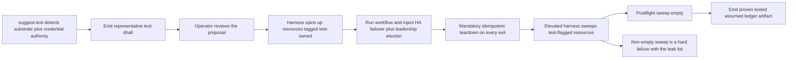

# Phase 11: Test-topology DSL + suggest-test + storage-lifecycle safety

**Status**: Authoritative source
**Supersedes**: N/A
**Referenced by**: README.md, overview.md
**Generated sections**: none

> **Purpose**: Deliver amoebius testing as a self-tearing-down `.dhall` topology — the always-teardown
> test type, the `suggest-test` generator, flagged test credentials, the elevated harness as the sole
> deleter of durable storage, verified-shrink safety, and the per-run proven/tested/assumed ledger —
> gated by a generated failover/election test that runs and tears down leak-free.

---

## Phase Status

📋 Planned. Nothing in this phase is implemented; every sprint below is design intent and every
prescriptive statement is a target shape, not a tested amoebius result. The mechanisms generalize patterns
*proven in the sibling prodbox project* (the Pulumi-orchestrated infrastructure-test rules, the
`aws_admin_for_test_simulation` flagged-credential pattern, and the postflight tag-sweep assertion); that is
*sibling evidence*, never amoebius proof (honesty rule,
[development_plan_standards.md §K](development_plan_standards.md)).

## Phase Summary

This phase makes testing a *first-class amoebius deployment* rather than a framework bolted on the side: a
test is an `.dhall` value of a topology type that spins resources up, runs a workflow, and **always** tears
them down. It owns six deliverables, building on the runtime, DSL, and storage model of earlier phases:

1. **The test-topology type** — a deployment-rules layer that wraps an app spec (or the platform itself)
   with a chaos/failover schedule *and* a mandatory teardown, so the always-tear-down guarantee is a
   property of the *type*, not of operator diligence. Teardown runs on success, failure, and Ctrl-C;
   destroy is idempotent; a cleanup failure is itself a run failure.
2. **`suggest-test`** — a generator that detects the current substrate (compute / memory / storage) and
   inspects what SSH + AWS credentials can actually do, then writes a representative test `.dhall` sized to
   the detected capacity and authority that simulates HA failover and host-daemon leadership elections. Its
   output is a *proposal* the operator reviews, never a self-certifying pass.
3. **Flagged test credentials** — the elevated authority a harness uses is a distinct, marked identity
   (the prodbox `aws_admin_for_test_simulation` pattern), separate from the normal-operation credential a
   running cluster holds; every resource a topology allocates is tagged test-owned at creation.
4. **The elevated harness as sole storage deleter** — only the flagged harness may destroy durable
   storage, and only storage flagged test-owned, via a flag-then-sweep cycle whose non-empty postflight
   sweep is a hard failure. Normal operation cannot delete a retained PV or its bytes at all.
5. **Verified-shrink safety** — storage can shrink without ever representing data destruction: a shrink is
   `create-new → verified-migrate → retire-old`, and the retire-old reclaim is gated to the same elevated
   path, so no `.dhall` value can ever denote "discard these bytes."
6. **The per-run ledger artifact** — every run emits a proven/tested/assumed record of which correctness
   layers it actually reached; a move that *applies* but is not performed marks its layer **UNVERIFIED**,
   never green.

This phase consumes — and does not re-implement — the DSL and control-plane singleton (Phase 3), the native
Pulsar client + worker Failover scaffolding (Phase 4), the retained `no-provisioner` PV model (Phase 2),
substrate detection (Phase 1), and Vault secret-by-name injection (Phase 2). The leadership-election and
HA-failover *mechanics* the topologies exercise are intra-cluster facilities delivered by those earlier
phases; this phase only *schedules* them into a test topology and tears the result down.

**Substrate:** per generated test (§L). Phase 11 is the one phase whose deliverable *is* the test machinery,
so it picks no single global substrate; instead **each generated test `.dhall` is substrate-locked to
exactly one** of `apple` | `linux-cuda` | `linux-cpu` | `windows`, carries no substrate-conditional
branching, and fails fast (never silently retargets) when its substrate's real inputs are absent — which is
precisely the at-most-one-substrate-per-validation rule applied per run
([testing_doctrine.md §8 — One substrate per validation](../documents/engineering/testing_doctrine.md#8-one-substrate-per-validation)).
The canonical gate run below is exercised on `linux-cpu` (an intra-cluster failover/election simulation
needs no accelerator), but the harness itself is substrate-parametric.

**Gate:** a generated test `.dhall` — produced by `suggest-test` and reviewed — runs a **failover/election
simulation** on its single named substrate (an elected control-plane singleton or a worker Failover
subscription is killed and a standby takes over), then **tears down leak-free**: the elevated harness's
postflight sweep of test-flagged resources is empty, and the run emits a proven/tested/assumed ledger that
records the Runtime-layer (Inject) move as *tested on that substrate* and marks any applicable-but-unperformed
move UNVERIFIED.

## Doctrine adopted

- [`testing_doctrine.md` §1 — The one idea: a test is an amoebius spec](../documents/engineering/testing_doctrine.md#1-the-one-idea-a-test-is-an-amoebius-spec):
  this phase realizes "a test *is* an amoebius deployment" — a test is written in the same Dhall DSL,
  inherits the same illegal-state-unrepresentable contract, and runs the real platform, differing from a
  production deployment only by a chaos schedule and the always-teardown contract.
- [`testing_doctrine.md` §3 — The test-topology contract: spin up → run → always tear down](../documents/engineering/testing_doctrine.md#3-the-test-topology-contract-spin-up--run--always-tear-down):
  Sprint 11.1 implements the four-clause contract — explicit visible resource ownership, teardown on every
  exit (success / failure / Ctrl-C), idempotent destroy, and "a cleanup failure is a real failure" — as
  a property of the topology *type*.
- [`testing_doctrine.md` §5 — `suggest-test`: detect the world, emit a representative test `.dhall`](../documents/engineering/testing_doctrine.md#5-suggest-test-detect-the-world-emit-a-representative-test-dhall):
  Sprint 11.2 builds the generator that detects substrate + inspects credential authority/quotas and emits a
  representative, capacity-sized test `.dhall` simulating HA failover + leadership election — a proposal,
  not an oracle, that references credentials by name only.
- [`testing_doctrine.md` §6 — Flagged test credentials](../documents/engineering/testing_doctrine.md#6-flagged-test-credentials):
  Sprint 11.3 establishes the distinct flagged test-simulation identity (the prodbox
  `aws_admin_for_test_simulation` pattern, generalized) and the test-owned tagging of every allocated
  resource, with the credential's material still a secret-by-name in Vault.
- [`testing_doctrine.md` §7 — The elevated harness is the sole deleter of durable storage; leak-free cycles](../documents/engineering/testing_doctrine.md#7-the-elevated-harness-is-the-sole-deleter-of-durable-storage-leak-free-cycles):
  Sprint 11.4 implements one-deleter/one-credential, flag-then-sweep, and the non-empty-postflight-sweep
  hard failure — the single sanctioned exception to the no-normal-operation-deletion rule.
- [`testing_doctrine.md` §4 — No skips, fail fast, and the per-run ledger artifact](../documents/engineering/testing_doctrine.md#4-no-skips-fail-fast-and-the-per-run-ledger-artifact):
  Sprint 11.6 emits the per-run proven/tested/assumed ledger as a first-class output beside pass/fail,
  fails fast on missing prerequisites (never skips), and records an applicable-but-unperformed move as
  UNVERIFIED. The proven/tested/assumed *methodology* itself is owned by the chaos doctrine and is not
  restated here.
- [`testing_doctrine.md` §8 — One substrate per validation](../documents/engineering/testing_doctrine.md#8-one-substrate-per-validation):
  every sprint's validation, and the phase gate, target exactly one substrate, named up front, with no
  silent fallback and no fixture standing in for a missing real input — the "per generated test" substrate
  posture of this phase.

This phase additionally adopts the storage-side exception it is the named owner of:
[`storage_lifecycle_doctrine.md` §8 — Shrinking storage without representing data destruction](../documents/engineering/storage_lifecycle_doctrine.md#8-shrinking-storage-without-representing-data-destruction)
and [`storage_lifecycle_doctrine.md` §7.1 — The single exception: the elevated test harness](../documents/engineering/storage_lifecycle_doctrine.md#71-the-single-exception-the-elevated-test-harness),
which delegate the verified-shrink reclaim and the durable-storage delete capability to the elevated harness
this phase delivers (Sprints 11.4 and 11.5).

## Sprints

## Sprint 11.1: The test-topology type — a deployment-rules layer that always tears down 📋

**Status**: Planned
**Implementation**: `src/Amoebius/Test/Topology.hs`, `dhall/test/Topology.dhall` (the `TestTopology` Dhall
type + its Haskell decoder), `src/Amoebius/Test/Runner.hs` (the structured-cleanup runner) (target paths
from [system_components.md](system_components.md); not yet built)
**Blocked by**: Phase 3 — the orchestration DSL + control-plane singleton (the production types a test
composes over); Phase 4 — orchestrator/worker daemon scaffolding (the intra-cluster failover the schedule
injects)
**Independent Validation**: a topology whose workflow deliberately fails, and a topology aborted with
SIGINT mid-run, both still execute teardown and converge the resource set to empty; re-running a teardown
after a simulated half-run errors on nothing already-gone; a topology that mis-binds a PVC to no PV fails to
type-check before it runs.
**Docs to update**: `documents/engineering/testing_doctrine.md`, `documents/engineering/app_vs_deployment_doctrine.md`

### Objective
Adopt [`testing_doctrine.md` §3 — The test-topology contract: spin up → run → always tear down](../documents/engineering/testing_doctrine.md#3-the-test-topology-contract-spin-up--run--always-tear-down)
and the framing of [`testing_doctrine.md` §1 — a test is an amoebius spec](../documents/engineering/testing_doctrine.md#1-the-one-idea-a-test-is-an-amoebius-spec):
define a `TestTopology` Dhall type that is an ordinary deployment-rules layer over a production app/platform
spec, adding exactly two things production omits — a chaos/failover schedule and a mandatory teardown — and
a Haskell runner whose structured `bracket`/`finally` cleanup makes "always tears down" a property of the
type, not of operator diligence. The chaos injection lives on the deployment-rules surface so the app under
test is none the wiser, per
[`app_vs_deployment_doctrine.md` §3 — the deployment-rules surface](../documents/engineering/app_vs_deployment_doctrine.md#3-the-deployment-rules-surface--how-the-same-app-runs).

### Deliverables
- A `TestTopology` Dhall type wrapping any app/platform spec with a `chaosSchedule` and a non-optional
  `teardown`, reusing the production DSL so an illegal cluster (bad PVC↔PV, open ingress, mis-substrated
  workload) is unrepresentable in a test exactly as in production.
- A `runTestTopology` interpreter that spins up, runs the workflow + injects the scheduled faults, and tears
  down inside structured cleanup so a crash or Ctrl-C still reclaims what it built.
- Idempotent destroy (re-running converges to "nothing left", never errors on already-gone resources) and a
  cleanup-failure-is-a-real-failure result type: a passed workflow with a leaked teardown reports failure,
  with the workflow failure surfaced first when both fail.

### Validation
1. Forced-failure and SIGINT-abort runs both reach teardown; the allocated-resource set is empty afterward.
2. A second teardown over an already-half-torn-down world is a clean no-op (idempotence).
3. A deliberately-illegal test `.dhall` fails to type-check before any resource is allocated.

### Remaining Work
The whole sprint.

## Sprint 11.2: `suggest-test` — detect substrate + credential authority, emit a representative test `.dhall` 📋

**Status**: Planned
**Implementation**: `src/Amoebius/Test/SuggestTest.hs`, `app/Amoebius/Command/SuggestTest.hs` (the
`amoebius suggest-test` subcommand) (target paths; not yet built)
**Blocked by**: Sprint 11.1 (the `TestTopology` type it emits values of); Phase 1 — substrate detection (the
pure host classification)
**Independent Validation**: against a fixed fake host classification + a fake credential-probe result,
`suggest-test` emits a deterministic test `.dhall` that (a) type-checks as a `TestTopology`, (b) is sized to
the detected compute/memory/storage and the probed quota, (c) contains an HA-failover + leadership-election
schedule, and (d) references every credential by name only — an inlined credential is unrepresentable.
**Docs to update**: `documents/engineering/testing_doctrine.md`, `documents/engineering/substrate_doctrine.md`

### Objective
Adopt [`testing_doctrine.md` §5 — `suggest-test`: detect the world, emit a representative test `.dhall`](../documents/engineering/testing_doctrine.md#5-suggest-test-detect-the-world-emit-a-representative-test-dhall):
turn amoebius's existing introspection into a starting-point test topology. `suggest-test` reads the
substrate via the same pure classification owned by
[`substrate_doctrine.md` §2 — Detection: a pure classification over three reads](../documents/engineering/substrate_doctrine.md#2-detection-a-pure-classification-over-three-reads),
probes what SSH + AWS credentials may do (can they create EBS? a hosted zone? how much?), and writes a
representative test `.dhall` scaled to that capacity and authority — a proposal the operator reviews, never
a self-certifying run.

### Deliverables
- A `suggest-test` generator consuming `(SubstrateClassification, CredentialAuthority)` and producing a
  `TestTopology` value scaled to detected compute/memory/storage and the probed permission/quota envelope.
- A credential-probe step that *reads* SSH/AWS authority but writes only `SecretRef`-by-name into the output
  — the secrets-never-in-Dhall contract owned by
  [`vault_pki_doctrine.md` §3 — The SecretRef contract: a name, never a value](../documents/engineering/vault_pki_doctrine.md#3-the-secretref-contract-a-name-never-a-value).
- An emitted chaos schedule simulating HA failover + host-daemon leadership election appropriate to the
  detected substrate, attached on the deployment-rules surface (the app under test is unaware).

### Validation
1. The emitted `.dhall` type-checks as a `TestTopology` and obeys the §3 teardown contract unconditionally.
2. Doubling the probed storage quota in the fake input doubles the representative volume sizing; halving the
   permission set drops the resources the credential cannot create.
3. No emitted output contains credential material; every credential is a name.

### Remaining Work
The whole sprint.

## Sprint 11.3: Flagged test credentials + test-owned resource tagging 📋

**Status**: Planned
**Implementation**: `src/Amoebius/Test/Credentials.hs`, `dhall/test/TestCredential.dhall` (the flagged
test-simulation identity type + the test-owned tag) (target paths; not yet built)
**Blocked by**: Sprint 11.1 (the topology whose allocations get tagged); Phase 2 — root Vault + secret-by-name
injection
**Independent Validation**: a topology run under the flagged identity tags every allocated resource
test-owned at creation; a topology that attempts to run a workload under the everyday (non-flagged)
credential, or to allocate a resource without the test-owned tag, is rejected; the flagged credential's
material is resolvable only as a Vault `SecretRef`, never inlined.
**Docs to update**: `documents/engineering/testing_doctrine.md`, `documents/engineering/pulumi_iac_doctrine.md`

### Objective
Adopt [`testing_doctrine.md` §6 — Flagged test credentials](../documents/engineering/testing_doctrine.md#6-flagged-test-credentials):
generalize the prodbox `aws_admin_for_test_simulation` pattern into a distinct, marked test-simulation
identity that holds the elevated authority a test needs and a running cluster must never hold, and tag every
resource a topology allocates test-owned at creation so the harness can later find *exactly* what it created.
The destroy authority itself is withheld from normal operation and granted only to this flagged identity —
the testing-side requirement of the create-vs-delete model owned by
[`pulumi_iac_doctrine.md` §6 — The EBS create-vs-delete credential model](../documents/engineering/pulumi_iac_doctrine.md#6-the-ebs-create-vs-delete-credential-model).

### Deliverables
- A `TestCredential` type marking an identity as test-simulation, distinct in the type system from the
  normal-operation credential; normal operation cannot acquire it and the harness never runs workloads under
  the everyday credential.
- A test-owned tag applied to every allocated resource (cluster, PV, Pulumi stack, workload) at creation,
  forming the basis of the leak-free sweep.
- The flagged credential resolved by name only through Vault — flagging changes *which* credential and *what
  it may do*, not *where the secret lives*.

### Validation
1. The flagged and normal identities are non-interchangeable at the type level; a workload-under-everyday
   attempt is rejected.
2. Every resource a sample topology allocates carries the test-owned tag; an untagged allocation is rejected.
3. The credential material never appears in any `.dhall`; it is a Vault `SecretRef`.

### Remaining Work
The whole sprint.

## Sprint 11.4: The elevated harness as sole storage deleter + leak-free sweep 📋

**Status**: Planned
**Implementation**: `src/Amoebius/Test/Harness.hs`, `src/Amoebius/Test/Sweep.hs` (the elevated harness +
the test-flag postflight sweep) (target paths; not yet built)
**Blocked by**: Sprint 11.1 (the teardown the sweep follows); Sprint 11.3 (the test-owned flag the sweep is
scoped by); Phase 2 — the retained `no-provisioner` PV model the rule protects
**Independent Validation**: only the elevated harness, holding the flagged delete-capable credential, can
destroy durable storage, and only storage flagged test-owned; a no-normal-operation-deletion attempt against
a retained PV is unauthorized; a postflight sweep that finds a leftover test-flagged resource fails the run
with the leak list; a retained-by-design resource is *not* reported as a leak.
**Docs to update**: `documents/engineering/testing_doctrine.md`, `documents/engineering/storage_lifecycle_doctrine.md`

### Objective
Adopt [`testing_doctrine.md` §7 — The elevated harness is the sole deleter of durable storage; leak-free cycles](../documents/engineering/testing_doctrine.md#7-the-elevated-harness-is-the-sole-deleter-of-durable-storage-leak-free-cycles),
the named exception delegated by
[`storage_lifecycle_doctrine.md` §7.1 — The single exception: the elevated test harness](../documents/engineering/storage_lifecycle_doctrine.md#71-the-single-exception-the-elevated-test-harness):
make the elevated harness the *one* actor that may destroy durable storage — and only storage flagged
test-owned — via a flag-then-sweep cycle. The DSL surface exposes no "delete this durable volume" primitive
at all; deletion is an act of the harness, not a value in a `.dhall`. A non-empty postflight sweep is a hard
failure, generalizing the prodbox postflight tag-sweep assertion.

### Deliverables
- A delete path reachable only by the elevated harness under the flagged credential of Sprint 11.3, scoped
  to test-owned resources, with no normal-operation or non-harness test code path able to delete a retained
  PV or its backing bytes.
- A postflight sweep that, after teardown, asserts the test-flagged resource set is empty and surfaces a
  leftover as a leak (with the leak list in the record) — while correctly *not* flagging a retained,
  by-design resource as a leak.
- A structural guarantee that the sweep is scoped by the test-owned flag, so it can never reach a production
  volume.

### Validation
1. A normal-operation attempt to delete a retained PV is denied; the same delete under the elevated harness
   on a test-flagged volume succeeds.
2. A run that intentionally strands a test-flagged resource fails on the non-empty sweep; a clean run's
   sweep is empty.
3. A retained-by-design (unflagged) volume present after a run is not reported as a leak.

### Remaining Work
The whole sprint.

## Sprint 11.5: Verified-shrink safety — create-new → migrate → retire-old, no representable destruction 📋

**Status**: Planned
**Implementation**: `src/Amoebius/Storage/Shrink.hs` (the verified-migration reconciler) (target path; not
yet built)
**Blocked by**: Sprint 11.4 (the elevated reclaim path the retire-old step is gated to); Phase 2 — the
retained PV model + deterministic rebind
**Independent Validation**: increasing a PVC's requested size is an in-place, data-preserving change; a
shrink provisions a new correctly-sized retained volume, copies the live bytes, verifies the copy, and only
then retires the old volume via the elevated path; a shrink whose copy fails to verify leaves *both* volumes
intact and fails loud; no `.dhall` value can denote "discard these bytes."
**Docs to update**: `documents/engineering/storage_lifecycle_doctrine.md`, `documents/engineering/testing_doctrine.md`

### Objective
Adopt [`storage_lifecycle_doctrine.md` §8 — Shrinking storage without representing data destruction](../documents/engineering/storage_lifecycle_doctrine.md#8-shrinking-storage-without-representing-data-destruction):
realize a shrink as `create-new → verified-migrate → retire-old`, never as an in-place truncation. The
`.dhall` value an operator writes denotes the *target smaller size*; the reconciler provisions a new retained
volume, copies and **verifies**, then retires the old — and the retire-old reclaim is itself a durable-data
deletion, so it inherits Sprint 11.4 and is performed only by the elevated harness path. Destruction stays
unrepresentable even while the effective size goes down.

### Deliverables
- An in-place grow path (resize EBS / grow filesystem) that strictly contains the old bytes.
- A shrink reconciler that provisions a new correctly-sized retained volume, copies the live bytes, verifies
  the copy, and retires the old volume only after verification — with retire-old gated to the elevated
  reclaim path of Sprint 11.4.
- A fail-loud abort: a copy that cannot verify leaves both the old and new volumes intact and reports
  failure, never trading old bytes for an unverified new home; no DSL surface for "destroy these bytes."

### Validation
1. A grow preserves every original byte and requires no migration.
2. A shrink round-trips data into a smaller verified volume; the old volume is reclaimed only by the
   elevated path.
3. A deliberately-corrupted copy fails verification; both volumes survive and the run fails loudly.

### Remaining Work
The whole sprint.

## Sprint 11.6: The per-run ledger artifact + the failover/election gate topology 📋

**Status**: Planned
**Implementation**: `src/Amoebius/Test/Ledger.hs` (the proven/tested/assumed artifact emitter),
`test/dhall/phase_11_failover_election.dhall` (the gate topology) (target paths; not yet built)
**Blocked by**: Sprint 11.1 (the topology runner); Sprint 11.2 (`suggest-test` produces the gate topology);
Sprint 11.4 (the leak-free sweep the gate asserts empty)
**Independent Validation**: a generated test `.dhall` runs a single-substrate failover/election simulation
(kill an elected control-plane singleton or an active worker Failover subscription; observe standby takeover),
tears down with an empty postflight sweep, and emits a proven/tested/assumed ledger that records the
Runtime-layer move as *tested on that substrate*; a run that omits an applicable move marks that layer
UNVERIFIED, never green; a missing prerequisite fails fast with a naming error rather than a silent skip.
**Docs to update**: `documents/engineering/testing_doctrine.md`, `documents/engineering/chaos_failover_doctrine.md`

### Objective
Adopt [`testing_doctrine.md` §4 — No skips, fail fast, and the per-run ledger artifact](../documents/engineering/testing_doctrine.md#4-no-skips-fail-fast-and-the-per-run-ledger-artifact)
and [`testing_doctrine.md` §8 — One substrate per validation](../documents/engineering/testing_doctrine.md#8-one-substrate-per-validation):
make every topology run emit a first-class proven/tested/assumed ledger beside its pass/fail, fail fast on
missing prerequisites, and record an applicable-but-unperformed move as UNVERIFIED. The ledger's *grammar*
— the Extract → Model → Inject moves and the proven/tested/assumed strengths — is owned by
[`chaos_failover_doctrine.md` §12 — The moral core — proven, tested, assumed](../documents/engineering/chaos_failover_doctrine.md#12-the-moral-core--proven-tested-assumed)
and the live-fault Inject move by
[`chaos_failover_doctrine.md` §11 — Move III — Inject: break the running thing on purpose](../documents/engineering/chaos_failover_doctrine.md#11-move-iii--inject-break-the-running-thing-on-purpose);
this sprint owns only the *per-run artifact contract* and the gate topology that exercises it.

### Deliverables
- A `Ledger` emitter producing, per run, a record of which correctness layers were reached and at what
  strength (proven / tested / assumed / UNVERIFIED), as a first-class output beside pass/fail.
- A fail-fast prerequisite check: a missing substrate input, credential, or tool fails the run with a
  message naming what is missing — never a pass-with-skip.
- The gate topology `test/dhall/phase_11_failover_election.dhall` (emitted by `suggest-test`, reviewed) that
  injects an intra-cluster failover/election fault on one named substrate, tears down leak-free, and emits
  the ledger marking the Runtime-layer move tested-on-that-substrate.

### Validation
1. The gate topology runs the failover/election simulation, the standby takes over, and teardown leaves an
   empty postflight sweep.
2. The run emits a ledger; an applicable move that the run omits is recorded UNVERIFIED, not green; the
   cardinal rule "never report tested or assumed as proven" holds.
3. A run with a deliberately-absent prerequisite fails fast with a naming error, with no silent skip.

### Remaining Work
The whole sprint.

## Documentation Requirements

**Engineering docs to update:**
- `documents/engineering/testing_doctrine.md` — when this phase lands, its §3 / §4 / §5 / §6 / §7 / §8
  designs gain concrete amoebius module paths (the `TestTopology` type, `suggest-test`, the flagged
  credential, the elevated harness + sweep, the ledger emitter); status of those realizations is recorded
  here in the plan, never as doctrine status.
- `documents/engineering/storage_lifecycle_doctrine.md` — §7.1 and §8 gain the realized elevated-reclaim and
  verified-shrink module paths (`src/Amoebius/Storage/Shrink.hs`, `src/Amoebius/Test/Sweep.hs`) as the
  concrete owners of the delegated exception.
- `documents/engineering/pulumi_iac_doctrine.md` — §6's create-vs-delete credential model gains the testing-side
  realization: the flagged test-simulation identity is the sole holder of the durable-storage destroy
  authority.

**Cross-references to add:**
- README.md — link the Phase 11 row to this document and mark the gate status as it progresses.
- system_components.md — add the `Amoebius/Test/*` modules (`Topology`, `Runner`, `SuggestTest`,
  `Credentials`, `Harness`, `Sweep`, `Ledger`) and `Amoebius/Storage/Shrink` to the component inventory.
- substrates.md — record the Phase 11 "per generated test" substrate posture (each generated test
  substrate-locked; the canonical gate run on `linux-cpu`) in the per-phase substrate map.

## Related Documents

- [README.md](README.md) — the live tracker; Phase 11 objective, gate, and substrate
- [development_plan_standards.md](development_plan_standards.md) — the rulebook this document obeys
- [overview.md](overview.md) — target architecture and constraints
- [system_components.md](system_components.md) — target component inventory (the `Amoebius/Test/*` modules)
- [substrates.md](substrates.md) — substrate registry and per-phase map
- [Testing Doctrine](../documents/engineering/testing_doctrine.md) — the test-as-a-`.dhall` topology, `suggest-test`, flagged credentials, the elevated harness, and the ledger this phase implements
- [Storage Lifecycle Doctrine](../documents/engineering/storage_lifecycle_doctrine.md) — the retained PV model, the no-normal-operation-deletion rule, and the verified-shrink exception this phase realizes
- [Chaos / Failover Doctrine](../documents/engineering/chaos_failover_doctrine.md) — the proven/tested/assumed methodology the per-run ledger records against
- [Pulumi IaC Doctrine](../documents/engineering/pulumi_iac_doctrine.md) — the create-vs-delete credential model the flagged identity satisfies
- Earlier phase: Phase 9 — Multi-cluster spawning + geo-replication + failover (carries the cross-cluster failover proof; this phase's intra-cluster failover/election simulation is distinct)
- Earlier phase: Phase 10 — Provider-managed clusters + dynamic provisioning (the leak-free provider teardown this harness extends to test cycles)
- Next phase: Phase 12 — SPA composition (the first application phase whose deployments these test topologies cover)
