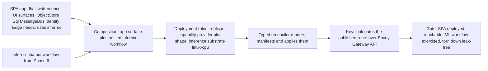

# Phase 12: SPA composition

**Status**: Authoritative source
**Supersedes**: N/A
**Referenced by**: README.md, overview.md
**Generated sections**: none

> **Purpose**: Deliver spec-driven single-page apps that compose any combination of platform services as
> **capabilities** plus arbitrary ML workflows (a chatbot via infernix, an RL-gaming platform via jitML),
> written once as application logic and deployed reachable behind Keycloak/Envoy on linux-cpu.

---

## Phase Status

📋 Planned. The SPA-composition surface is specified, not started; every sprint below is design intent and
every prescriptive statement is a target shape, not a tested amoebius result. The representational/type-level
SPA composition already proven in-process in Phase 1 (Tier 1), the capability abstraction (Phase 4), the
infernix inference workflow and its demo web app (Phase 6), and the jitML migration and its demo web app
(Phase 7) are the earlier work this phase composes — the infernix/jitML demo web apps being the
application-logic-only demonstration this phase now deploys live — none of them is re-implemented here, and
where this phase leans on the sibling **prodbox** project it is cited as evidence, never as amoebius proof.

## Phase Summary

This phase makes the SPA the **composition apex** of the whole doctrine suite: a single `.dhall` that
declares a multi-service single-page app *and* folds in one or more ML-workflow demo web apps, all as
application logic, with the platform realizing each dependency as a capability and the edge gated by
Keycloak. The SPA's representational/type-level validity — composing a multi-service app plus an ML-workflow
demo web app as typed Dhall fragments — was **already proven in-process in Phase 1 (Tier 1)**; this phase is
the **Tier-2 live deploy**, where the SPA `.dhall` composes the **infernix and jitML demo web apps** into a
running, reachable SPA on linux-cpu. It does not add a new capability, a new provider, or a new reconciler —
it proves that the established surfaces compose live, end to end.

The phase delivers, in order:

1. **The SPA app-spec type.** A multi-service single-page-app surface whose service dependencies are
   declared as **capability needs** (`ObjectStore` / `Sql` / `MessageBus` / `Identity` / `Edge`), never as
   products. The SPA is one app: a unique name per cluster, its own namespace, secrets by name only.
2. **ML-workflow composition as shared-library use.** The SPA composes arbitrary ML workflows by naming
   *that* it uses infernix (a chatbot) or jitML (an RL-gaming platform) — a shared-library dependency, which
   is application logic — with the infernix/jitML `.dhall` nested inside the SPA spec and the
   inference/training substrate left as a deployment rule.
3. **The SPA behind Keycloak/Envoy.** The SPA's published surfaces are rendered as Envoy/Gateway-API routes
   gated by the Identity-owned (Keycloak) wild-ingress door; the SPA declares *what to publish* and has no
   syntax to publish an unauthenticated backdoor.
4. **The deployment-rules layer that runs it.** Replica counts on an unchanged HA chart, the capability
   provider+shape bindings, and the inference substrate (linux-cpu for this gate) — all keyed by the SPA app
   name, none of it touching the SPA app surface.
5. **The composition gate** on linux-cpu: one SPA `.dhall` composes a multi-service app plus an ML-workflow
   demo web app (the infernix/jitML demo web apps), deploys via the typed reconciler, is reachable through
   Keycloak/Envoy, exercises the ML workflow, and tears down leak-free.

**Substrate:** linux-cpu (§L) — the gate composes and deploys the SPA on a single linux-cpu substrate and
exercises a CPU-bound infernix inference round-trip; the jitML RL-gaming demo web app is built and type-checks as a
second worked composition, but running an ML workflow on a CUDA/Apple-Metal substrate is out of contract
here, since the inference/training substrate is exactly the deployment dial this phase keeps swappable
without touching the SPA.

**Gate:** an SPA `.dhall` composes a **multi-service app + an ML-workflow demo web app**, deployed and reachable.
Concretely: a single SPA spec declares a multi-service UI surface against capability needs (`ObjectStore` /
`Sql` / `MessageBus` / `Identity` / `Edge`) and composes the infernix chatbot demo web app's ML workflow; composed with a
linux-cpu deployment-rules layer it deploys on the standard HA stack, the SPA UI is reachable through the
Keycloak/Envoy edge, an inference request round-trips through the composed infernix workflow, the deployment
tears down leak-free, and the run emits a proven/tested/assumed ledger artifact recording the composition as
*tested on linux-cpu* and recording that no GPU/Apple-Metal ML-workflow claim and no geo-replication claim
was made.

## Doctrine adopted

- [`service_capability_doctrine.md` §2 — The capability set](../documents/engineering/service_capability_doctrine.md#2-the-capability-set)
  and [§7 — Expressing a capability in the DSL](../documents/engineering/service_capability_doctrine.md#7-expressing-a-capability-in-the-dsl),
  with the fungibility reconciliation in [§6 — Fungibility, reconciled: app surface invariant, shape deployment-ruled](../documents/engineering/service_capability_doctrine.md#6-fungibility-reconciled-app-surface-invariant-shape-deployment-ruled):
  this phase composes an SPA's service dependencies as **capability needs** drawn from the fixed eight-arm
  vocabulary (§2) — `ObjectStore`, `Sql`, `MessageBus`, `Identity`, `Edge` — never as products; the SPA's
  `Edge` declaration publishes its reachable surfaces while the Identity-owned (Keycloak) wild-ingress door
  still gates them, and east-west reachability is derived from the SPA's declared capability dependency
  graph (§7). Because the SPA names capabilities, its surface is byte-invariant across clusters while the
  provider+shape binding varies (§6).
- [`app_vs_deployment_doctrine.md` §2 — The application-logic surface](../documents/engineering/app_vs_deployment_doctrine.md#2-the-application-logic-surface--what-an-app-is)
  and [§8 — Shared-library use is application logic](../documents/engineering/app_vs_deployment_doctrine.md#8-shared-library-use-is-application-logic),
  with [§7 — infernix is a shared library; the inference substrate is a deployment rule](../documents/engineering/app_vs_deployment_doctrine.md#7-infernix-is-a-shared-library-the-inference-substrate-is-a-deployment-rule):
  the SPA spec is a write-once application-logic artifact (UI/LB surfaces, auth rules, durable storage,
  topics — §2), and its composition of arbitrary ML workflows (a chatbot via infernix, an RL-gaming
  platform via jitML) is **shared-library use, which is application logic** (§8). The SPA declares *that* it
  uses a workflow; *where* that workflow runs — linux-cpu for this gate — stays a deployment rule (§7), so
  the same SPA bytes compose with any deployment-rules layer.

## Sprints

## Sprint 12.1: The SPA app-spec type — a multi-service surface of capability needs 📋

**Status**: Planned
**Implementation**: `src/Amoebius/Spa/Spec.hs`, `dhall/amoebius/Spa.dhall`, `dhall/examples/spa_chatbot.dhall` (target paths; not yet built)
**Blocked by**: Phase 4 (the two DSL surfaces, the app-spec type family, and the capability abstraction); Phase 3 (the HA-always platform services the capabilities bind to)
**Independent Validation**: the example SPA `.dhall` (`dhall/examples/spa_chatbot.dhall`) type-checks against the SPA app-spec type, declaring a multi-service UI surface plus capability needs (`ObjectStore` / `Sql` / `MessageBus` / `Identity` / `Edge`) and **no product literal** — a grep for `minio`, `keycloak`, `pulsar`, `patroni`, or `postgres` on the SPA surface returns nothing, and a variant that names a product fails Gate 1 (the Dhall typechecker) because the app surface has no product arm.
**Docs to update**: `documents/engineering/service_capability_doctrine.md`, `documents/engineering/app_vs_deployment_doctrine.md`

### Objective

Adopt [`service_capability_doctrine.md` §2 — The capability set](../documents/engineering/service_capability_doctrine.md#2-the-capability-set)
and [§7 — Expressing a capability in the DSL](../documents/engineering/service_capability_doctrine.md#7-expressing-a-capability-in-the-dsl),
with [`app_vs_deployment_doctrine.md` §2 — The application-logic surface](../documents/engineering/app_vs_deployment_doctrine.md#2-the-application-logic-surface--what-an-app-is):
define the SPA app-spec type as an application-logic artifact whose multi-service surface composes
capability needs — buckets against `ObjectStore`, a database against `Sql`, topics against `MessageBus`,
auth rules against `Identity`, published UI against `Edge` — and never names a product.

### Deliverables

- An `Amoebius.Spa.Spec` library defining the SPA app-spec type: a set of named UI/service surfaces and the
  capability-need records each surface depends on, carrying the SPA's name (unique per cluster, naming its
  own namespace) and **no** deployment vocabulary (no `replicas`, `region`, `failover`, `chaos`, or
  `substrate` field — the type has nowhere to put them).
- A `dhall/amoebius/Spa.dhall` type the example SPAs decode against, composing the Phase 4 capability-need
  arms into a single multi-service surface.
- A worked `dhall/examples/spa_chatbot.dhall` skeleton: a multi-service single-page app declaring an
  `ObjectStore` bucket set (`<app>/<bucket>`), a `Sql` need, `MessageBus` topics, an `Identity` auth rule,
  and an `Edge` publish — each against the capability arm, with secrets referenced by name only (a typed
  `SecretRef`), no provider or shape named.

### Validation

1. The example SPA `.dhall` type-checks against the SPA app-spec type; every service dependency resolves to
   a capability arm and no product name appears on the SPA surface.
2. A deliberately-illegal variant that names `minio` directly fails to type-check (no product arm exists),
   and a variant that adds a `replicas` field fails to type-check (the SPA surface has no such field).

### Remaining Work

The whole sprint.

## Sprint 12.2: Compose an ML workflow into the SPA as shared-library use 📋

**Status**: Planned
**Implementation**: `src/Amoebius/Spa/Workflow.hs`, `dhall/amoebius/Spa.dhall` (the workflow-composition field), `dhall/examples/spa_chatbot.dhall` (uses infernix), `dhall/examples/spa_rl_gaming.dhall` (uses jitML) (target paths; not yet built)
**Blocked by**: Sprint 12.1; Phase 1 (the representational SPA composition already proven in-process — the typed-Dhall composition this deploys live); Phase 6 (infernix migrated onto the runtime + deterministic CPU inference, shipping the infernix demo web app — the application-logic-only demonstration this generalizes); Phase 7 (jitML migrated onto the runtime, shipping the jitML demo web app)
**Independent Validation**: the chatbot SPA declares *that* it uses infernix and the RL-gaming SPA declares *that* it uses jitML — a shared-library dependency on the application-logic surface — with the infernix/jitML `.dhall` nested inside the SPA spec; neither SPA names an inference/training substrate on its surface, and toggling the substrate binding in the deployment-rules layer (Sprint 12.4) changes no SPA `.dhall` or `.hs` source.
**Docs to update**: `documents/engineering/app_vs_deployment_doctrine.md`, `documents/engineering/content_addressing_doctrine.md`

### Objective

Adopt [`app_vs_deployment_doctrine.md` §8 — Shared-library use is application logic](../documents/engineering/app_vs_deployment_doctrine.md#8-shared-library-use-is-application-logic)
with [§7 — infernix is a shared library; the inference substrate is a deployment rule](../documents/engineering/app_vs_deployment_doctrine.md#7-infernix-is-a-shared-library-the-inference-substrate-is-a-deployment-rule):
compose arbitrary ML workflows into the SPA as shared-library dependencies — a chatbot via infernix, an
RL-gaming platform via jitML — declaring *that* the SPA uses them on the application-logic surface while
*where* the workflow runs stays a deployment rule, with the library's own `.dhall` nested inside the SPA
spec rather than living as a parallel system.

### Deliverables

- An `Amoebius.Spa.Workflow` library and a workflow-composition field on the SPA spec type that names a
  shared library (infernix or jitML) and the workflow it composes (the library call graph = application
  logic), with the library's configuration `.dhall` nested into the SPA spec.
- The worked `dhall/examples/spa_chatbot.dhall` composing the **infernix** demo web app's inference workflow
  (the migrated, deterministic library from Phase 6) and a worked `dhall/examples/spa_rl_gaming.dhall`
  composing the **jitML** demo web app's workflow (the migrated library from Phase 7) — each naming *that* it
  uses the library, neither naming a substrate.
- No inference/training-substrate vocabulary on either SPA surface: the substrate is bound only later, in
  the deployment-rules layer.

### Validation

1. The chatbot SPA composes an infernix workflow and the RL-gaming SPA composes a jitML workflow; each
   decodes with the library `.dhall` nested inside the SPA spec.
2. A grep of either SPA surface for a substrate selector (`cuda`, `metal`, `linux-cpu`) returns nothing —
   the placement of the ML workflow is structurally absent from application logic.

### Remaining Work

The whole sprint.

## Sprint 12.3: The SPA behind Keycloak/Envoy — Edge publishes, Identity gates 📋

**Status**: Planned
**Implementation**: `src/Amoebius/Spa/Edge.hs`, `dhall/examples/spa_chatbot.dhall` (the `Edge` + `Identity` declarations) (target paths; not yet built); consumes `src/Amoebius/Platform/Keycloak.hs` + `src/Amoebius/Platform/Edge.hs` (Phase 3) and `src/Amoebius/Capability/Binding.hs` (Phase 4), re-implementing neither
**Blocked by**: Sprint 12.1; Phase 3 (Keycloak owns all wild ingress via Envoy/Gateway API); Phase 4 (the `Edge` + `Identity` capability binding and derived east-west connectivity)
**Independent Validation**: the SPA's published UI surface renders an Envoy/Gateway-API route gated by Keycloak; an SPA that attempts to publish an unauthenticated edge route fails to type-check (there is no syntax to bypass the Identity-owned door); each capability the SPA consumes appears in the derived east-west connectivity graph, and a surface that consumes a capability it never declared cannot reach it.
**Docs to update**: `documents/engineering/service_capability_doctrine.md`, `documents/engineering/platform_services_doctrine.md`

### Objective

Adopt [`service_capability_doctrine.md` §7 — Expressing a capability in the DSL](../documents/engineering/service_capability_doctrine.md#7-expressing-a-capability-in-the-dsl):
the `Edge` capability publishes a route but cannot open a backdoor, and connectivity is derived from the
declared capability dependencies. Wire the SPA's published surfaces through the Identity-owned (Keycloak)
wild-ingress door over Envoy/Gateway API — adopting, in supporting prose, the single ingress path of
[`platform_services_doctrine.md` §9 — The LoadBalancer and the single wild-ingress path](../documents/engineering/platform_services_doctrine.md#9-the-loadbalancer-and-the-single-wild-ingress-path).

### Deliverables

- An `Amoebius.Spa.Edge` rendering that turns the SPA's `Edge` publish declaration into an Envoy/Gateway-API
  route fronted by Keycloak (consuming the Phase 3 `Platform.Keycloak` / `Platform.Edge` plumbing), with the
  `Identity` auth rule bound to that route — the SPA declares *what to publish*, never *whether* wild traffic
  reaches it.
- Derivation of the SPA's east-west reachability from its declared capability dependencies, so the SPA can
  reach exactly the providers it declared consuming and nothing else.
- A structural guarantee that no SPA surface can express an unauthenticated published route: the only edge
  the type admits is one behind the Identity-owned door.

### Validation

1. The chatbot SPA's published surface renders an HTTPRoute gated by Keycloak; a request without a valid
   session is refused at the edge.
2. A variant attempting an unauthenticated/open edge route fails Gate 1 (no syntax for a backdoor), and a
   surface consuming an undeclared capability has no derived connectivity to it.

### Remaining Work

The whole sprint.

## Sprint 12.4: The SPA deployment-rules layer — replicas, capability shape, inference substrate 📋

**Status**: Planned
**Implementation**: `src/Amoebius/Spa/Deploy.hs`, `dhall/examples/spa_chatbot_deploy_linux_cpu.dhall` (target paths; not yet built)
**Blocked by**: Sprint 12.1; Sprint 12.2; Phase 4 (the deployment-rules surface and the capability provider/shape binding); Phase 3 (the HA-always charts + typed reconciler the bindings render onto)
**Independent Validation**: a deployment-rules `.dhall` keyed by the SPA app name binds replica counts, capability provider+shape (canonical providers by default; single-node shapes on a small cluster), and the inference substrate (linux-cpu) — and composes with the byte-identical SPA spec from Sprints 12.1–12.2; a second layer at a different replica count composes with the *same* SPA spec, the diff entirely in the deployment-rules layer.
**Docs to update**: `documents/engineering/app_vs_deployment_doctrine.md`, `documents/engineering/service_capability_doctrine.md`

### Objective

Adopt [`app_vs_deployment_doctrine.md` §3 — The deployment-rules surface](../documents/engineering/app_vs_deployment_doctrine.md#3-the-deployment-rules-surface--how-the-same-app-runs)
with the binding model in [`service_capability_doctrine.md` §4 — Capability → provider → shape: the binding](../documents/engineering/service_capability_doctrine.md#4-capability--provider--shape-the-binding):
author the deployment-rules layer that runs the SPA — replica counts on an unchanged HA chart (HA even at
`replicas=1`, per [`platform_services_doctrine.md` §2 — HA always](../documents/engineering/platform_services_doctrine.md#2-ha-always--including-replicas1)),
the capability provider+shape bindings, and the inference substrate (linux-cpu here) — none of it touching
the SPA app surface.

### Deliverables

- An `Amoebius.Spa.Deploy` model and a `spa_chatbot_deploy_linux_cpu.dhall` keyed by the SPA app name,
  declaring the replica count, the capability provider+shape bindings (canonical providers; single-node
  shapes on a small cluster), and the inference-substrate binding set to linux-cpu.
- A demonstration that two deployment-rules layers at different replica counts compose with the
  byte-identical SPA spec, the SPA app-spec normal form unchanged across both.
- A binding point for the inference substrate written so the same SPA source would accept a different
  substrate binding (Apple Metal / CUDA) without an app edit — out of contract to *run* here, but proven
  swappable.

### Validation

1. The deployment-rules `.dhall` composes with the SPA spec and renders to the standard HA stack at the
   chosen replica count, the inference substrate bound to linux-cpu.
2. Changing the replica count or the inference-substrate binding changes no SPA `.dhall` or `.hs` source —
   the SPA app-spec hash is unchanged across the variations.

### Remaining Work

The whole sprint.

## Sprint 12.5: The SPA composition gate — deployed, reachable, ML workflow exercised 📋

**Status**: Planned
**Implementation**: `test/dhall/phase_12_spa.dhall` (target path; not yet built)
**Blocked by**: Sprint 12.3; Sprint 12.4
**Independent Validation**: a gate `.dhall` composes the multi-service SPA + the infernix demo web app's ML workflow on linux-cpu, deploys via the typed reconciler, reaches the SPA UI through the Keycloak/Envoy edge, exercises an inference round-trip through the composed infernix workflow, tears the deployment down leak-free, and emits a proven/tested/assumed ledger artifact.
**Docs to update**: `documents/engineering/app_vs_deployment_doctrine.md`, `documents/engineering/service_capability_doctrine.md`, `documents/engineering/testing_doctrine.md`

### Objective

Adopt [`app_vs_deployment_doctrine.md` §2 — The application-logic surface](../documents/engineering/app_vs_deployment_doctrine.md#2-the-application-logic-surface--what-an-app-is)
and [`service_capability_doctrine.md` §7 — Expressing a capability in the DSL](../documents/engineering/service_capability_doctrine.md#7-expressing-a-capability-in-the-dsl):
prove the whole composition on linux-cpu — one SPA `.dhall` composing a multi-service app + an ML workflow,
deployed and reachable behind Keycloak/Envoy, with the ML workflow exercised end to end.

### Deliverables

- A gate `.dhall` (`test/dhall/phase_12_spa.dhall`) that spins up the SPA composing the infernix chatbot demo
  web app from one app spec composed with the linux-cpu deployment-rules layer, deploys it via the typed
  reconciler, reaches the SPA UI through the Keycloak/Envoy edge, exercises an infernix inference round-trip,
  and tears the deployment down.
- A check that the jitML RL-gaming demo web app SPA also composes and type-checks (the "any combination"
  claim), with an explicit note that *running* its workflow on a GPU/Apple-Metal substrate is out of contract
  for this single-substrate gate.
- A proven/tested/assumed ledger artifact recording: the multi-service + ML-workflow composition as
  **tested on linux-cpu**, the SPA app-surface byte-invariance across the deployment-rules variations as
  **tested**, edge reachability behind Keycloak as **tested**, and any GPU/Apple-Metal ML-workflow claim and
  any geo-replication claim as **explicitly not asserted**.

### Validation

1. The SPA deploys on the standard HA stack and its UI is reachable through the Identity-owned edge; an
   inference request is served by the composed infernix workflow.
2. The RL-gaming SPA composes and type-checks; teardown leaves no residue.
3. The ledger artifact is emitted and marks no GPU-substrate or geo-replication claim green.

### Remaining Work

The whole sprint.

## Documentation Requirements

**Engineering docs to update:**
- `documents/engineering/service_capability_doctrine.md` — when the SPA ships, §2/§7 gain a concrete
  amoebius reference: the SPA `.dhall` as a worked multi-service surface composing capability needs
  (`ObjectStore` / `Sql` / `MessageBus` / `Identity` / `Edge`) with no product literal, and the `Edge`
  publish-behind-Keycloak rendering as a realized example (status recorded here in the plan, never as
  doctrine status).
- `documents/engineering/app_vs_deployment_doctrine.md` — record the SPA as the composition apex of §2/§8:
  an application-logic artifact composing ML workflows as shared-library use, with the inference substrate
  bound only in the deployment-rules layer (§7).
- `documents/engineering/platform_services_doctrine.md` — note the SPA's published surfaces as a consumer of
  the §9 single wild-ingress path (Keycloak over Envoy/Gateway API).
- `documents/engineering/testing_doctrine.md` — record the Phase 12 gate `.dhall` as a worked
  spin-up/run-workflow/tear-down composition test emitting a proven/tested/assumed ledger artifact.

**Cross-references to add:**
- README.md — link the Phase 12 row to this document and mark the gate status as it progresses.
- system_components.md — add the SPA modules (`Amoebius.Spa.Spec`, `Amoebius.Spa.Workflow`,
  `Amoebius.Spa.Edge`, `Amoebius.Spa.Deploy`) and the `dhall/amoebius/Spa.dhall` type to the component
  inventory.
- substrates.md — add the Phase 12 → linux-cpu row to the per-phase substrate map.

## Related Documents

- [README.md](README.md) — the live tracker; Phase 12 objective, gate, and substrate
- [development_plan_standards.md](development_plan_standards.md) — the rulebook this document obeys
- [overview.md](overview.md) — target architecture and constraints
- [system_components.md](system_components.md) — target component inventory (the SPA modules and the `Spa.dhall` type)
- [substrates.md](substrates.md) — substrate registry and per-phase map
- [Service Capability Doctrine](../documents/engineering/service_capability_doctrine.md) — capabilities the SPA composes, never products, and the Edge-behind-Identity door
- [Application Logic vs Deployment Rules Doctrine](../documents/engineering/app_vs_deployment_doctrine.md) — the SPA as application logic; ML-workflow composition as shared-library use; the inference substrate as a deployment rule
- [Platform Services Doctrine](../documents/engineering/platform_services_doctrine.md) — the HA-always charts and the single wild-ingress path the SPA edge rides
- Earlier phase: Phase 1 — Formal-first DSL & protocol integrity (the representational SPA composition proven in-process, front-loaded to Tier 1, that this phase deploys live)
- Earlier phase: Phase 4 — Orchestration Dhall DSL + control-plane singleton (the two DSL surfaces + the capability abstraction this phase composes)
- Earlier phase: Phase 6 — Determinism kernel + infernix migration (the infernix demo web app + chatbot workflow this SPA composes — the application-logic-only demonstration this phase generalizes)
- Earlier phase: Phase 7 — jitML migration + HA coordinator (the jitML demo web app + RL-gaming workflow this SPA composes)
