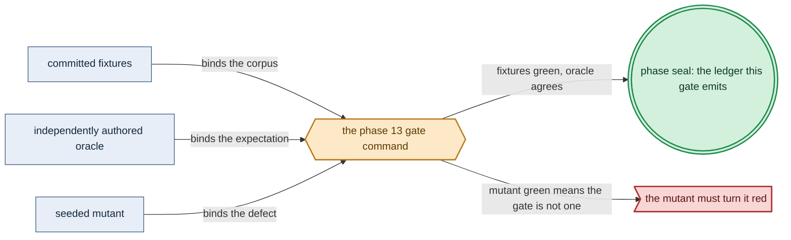

# Phase 13: InferenceEngine capability + accelerator provision

> **Purpose**: Fill the ninth (`InferenceEngine`) capability arm as a representational union and relation — the
> closed `EngineRuntime` lane union with no `Url`/`Download` arm, the target-offering→lane quotient, the partial
> family×lane availability relation, and identity-complete `CudaOwnerDemand`/`MetalOwnerDemand` shapes — then
> pair a served model to a concrete CUDA/Metal target so that every policy-permitted residency/coexistence epoch
> folds against per-device net allocatable VRAM at the post-bind provision seal, proving before render that a
> CUDA-requiring workload on a CPU-only target has no deployable value.
> **Read this if**: phase 13 is next in the queue, or a later phase depends on what its gate establishes.

Phase 13 delivers the InferenceEngine capability + accelerator provision; its design is owned by [service_capability_doctrine.md](../documents/engineering/service_capability_doctrine.md), [content_addressing_doctrine.md](../documents/engineering/content_addressing_doctrine.md), [resource_capacity_doctrine.md](../documents/engineering/resource_capacity_doctrine.md), and the plan for reaching it is owned here.
Register 1: an in-process battery, no cluster.
The Register-1 gate passed on 2026-08-09 with ledger
`dynamically-resolved`.

> **Historical result (invalidated).** Any pass, seal, validation, ledger, receipt, or implementation observation
> in the orientation text above is diagnostic only. The Phase Status section and [tracker](README.md) own current state; the
> target contract below remains normative.

Link-graph metadata

**Status**: Authoritative source
**Supersedes**: N/A
**Referenced by**: DEVELOPMENT_PLAN/README.md, DEVELOPMENT_PLAN/overview.md, DEVELOPMENT_PLAN/phase_10_execution_accelerator_folds.md, DEVELOPMENT_PLAN/phase_11_capability_bind.md, DEVELOPMENT_PLAN/phase_12_provision_seal.md, DEVELOPMENT_PLAN/phase_53_determinism_jitcache.md
**Generated sections**: none

## Contents
- [Phase Status](#phase-status)
- [Phase Summary](#phase-summary)
- [Gate integrity](#gate-integrity)
- [Doctrine adopted](#doctrine-adopted)
- [Sprints](#sprints)
- [Sprint 13.1: The `InferenceEngine` capability — target-offering-selected runtime + accelerator provision ✅](#sprint-131-the-inferenceengine-capability--target-offering-selected-runtime--accelerator-provision-)
- [Sprint 13.2: The accelerator-provision corpus + the Register-1 gate ✅](#sprint-132-the-accelerator-provision-corpus--the-register-1-gate-)
- [Documentation Requirements](#documentation-requirements)
- [Related Documents](#related-documents)

---

## Phase Status

✅ Done — resealed 2026-08-17 on the amended contract. `python3 tools/inference_accelerator_gate.py` passes
all eleven sides on substrate `none`, lane `none`, natural `arm64`, untranslated: every authored oracle holds
its declared shape, the suite is green, every seeded mutant reddens at its own locus, each recorded result is
derived from an observation, and 28 surfaces join completely to 39 enumerated items.
Attestation `sha256:d66d1dff3fcd123a58c2a4f333c81c6fd9b806ba1a9f27ee8e28354dba1a9b0a`. The rerun differs from its predecessor by naming the lane and the architecture the run
actually used, and by reading its mutant manifest and its item enumeration from the one registry.

**Opened 2026-08-17** when the preceding phase resealed.
[§S](development_plan_gate_integrity.md#s-universal-artifact-hygiene-gate) clause 15 requires a run to record
the natural architecture it proved and to execute no artifact of another. This phase's last gate recorded no
architecture, so its seal is invalidated as a current result and stands only as history; the rerun differs from
it by naming the lane and architecture the run actually used. A sprint marker below records what that sprint achieved before the amendment; under
[§N](development_plan_phase_model.md#n-reopening-and-amending-a-phase) it is a diagnostic, not surviving closure.

**Pre-natural-architecture status record (invalidated where it claims completion):**

Done (invalidated) — resealed 2026-08-15. `python3 tools/inference_accelerator_gate.py` passed all ten sides: 23
coexistence, family/lane, offering, provision, and mutant items, all five mutants, all twelve metrics, and the
honesty ledger pass; 28 surfaces join to 39 enumerated items. The project-contained attestation is
`sha256:656509c77d5b6239bcbb1df1a3d327f6e889aaff87893c093faf5867a45e01d6`, bound to source snapshot
`sha256:2a81c1595be8d2b2…`; Phase 13 owns no remaining migration deferral.

**Pre-containment status record (invalidated where it claims completion):**

Done (invalidated) — sealed 2026-08-12. The migrated gate passed against source snapshot `sha256:32e80b8d1d0ae545…`
(1937 non-ignored files) and published a verified pre-containment external attestation
`sha256:eba86a80c57d10c9629d25cd74199104d3df181cb1adbb2f223492d1d3b3a89f`.

**Observed progress — 2026-08-12:** **Policy-conformant.** Every capability check is unchanged and re-run:
three inference positives provision, the target-offering quotient is exact across four lanes, the family/lane
relation is exact across twelve pairs, the hand-authored coexistence aggregation matches, the URL Gate-1
negative reddens at its specific locus, eight provision negatives redden at their tags, the eight-branch
QuickCheck coverage floor holds, and all five seeded mutants redden. Evidence and the ledger move into
`.build/runs/phase_13/<run-id>/`, and 23 run-time items — one coexistence epoch, four engine families, four
target lanes, nine provision cases, and five mutant names — partition one-to-one across the claim surfaces.

**Two contract surfaces carry no id and are now honestly UNVERIFIED**:
`opaque-provisioned-engine-accelerator` and `phase12-validation-locus-ledger`. The gap is recorded against
Phase 13 in [`legacy_tracking_for_deletion.md`](legacy_tracking_for_deletion.md).

**Invalidated historical record:**

Done (invalidated). The target-offering quotient, family relation, identity-complete owner checks, provision corpus,
properties, and mutant battery passed on 2026-08-09. Evidence is retained under
`evidence/phase_12/`, with the claim boundary in
`ledgers/phase_13_inference_accelerator_provision.md`.
This phase opened after the Phase 12 gate (the whole-deployment
provision seal, from which the accelerator epoch witnesses are constructed) and the Phase 10 gate (the
identity-complete accelerator-residency/coexistence epoch fold these owner demands feed), and runs on **no substrate** (`none`) in **Register 1** — it stands up no CUDA device, no Metal host, and no cluster, only the
representational `EngineRuntime` union, the family×lane relation, the owner-demand records, and the
accelerator-provision fold plus its property/corpus battery. Where this shape is exercised in a sibling system
(infernix's `Infernix/Runtime/Worker.hs` selecting its engine by `adapterType` and **never fetching it**), that
is **sibling evidence, not an amoebius result** — and the sibling still *fetches* engine payloads and *names*
them, the exact coupling the substrate-selected, jit-resolved `EngineRuntime` identity dissolves.

## Phase Summary

This phase makes amoebius's *"an ML engine is a named catalog identity the substrate selects and the shared
jit-build resolver materializes on first miss — never authored, never baked, never URL-fetched"* invariant
executable as the strictest instance of the capability→provider→shape binding. It **fills the ninth capability arm** whose reserved head [Phase 11](phase_11_capability_bind.md) delivers: the `InferenceEngine` capability and
its closed `EngineRuntime` lane union (`AppleMetal` · `Cuda` · `LinuxCpu`) with **no arbitrary-`Url`/`Download` arm**, the closed engine-family union, the target-offering→lane **quotient** projection
(`apple → AppleMetal`, `linux-cpu → LinuxCpu`, `{ linux-cuda, windows } → Cuda`, `Cuda` OS-agnostic with no
Linux-vs-Windows constructor), and the **partial** family×lane availability relation. It delivers the
identity-complete `CudaOwnerDemand`/`MetalOwnerDemand` values: an exact source inventory and equal-keyed
workload map for served models, training jobs, JIT compilations, and library work; structural
weights/KV/activation/optimizer/JIT/library residency components; and a finite class-complete coexistence
policy. CUDA residency uses `Unsharded`, `ReplicatedPerDevice`, or explicit `Sharded` placement (bytes total for
Unsharded/Sharded, per device for ReplicatedPerDevice; shard ids unique, shard bytes summing to the residency
total, shard count ≤ owner devices); Metal derives the identical epochs into shared unified host memory rather
than a separate VRAM scalar.

The pairing is the **accelerator-provision seam of the post-bind provision boundary**: after bind expands the
`InferenceEngine` provider's graph, `provision` selects the **matching eligible target offering** (whose lane is
projected from that concrete node/host or elastic candidate's detected substrate, never an ambiguous cluster-wide
substrate). It constructs the private `ProvisionedCudaOwnerDemand`/`ProvisionedMetalOwnerDemand` epoch witnesses by
handing the owner demands to the [Phase 10](phase_10_execution_accelerator_folds.md) accelerator-residency fold,
and rejects — with a structured `ProvisionError` at the `provision-seal` locus, before any `ProvisionedSpec` is
constructed — a served model whose family is unavailable on the serving lane, a CUDA requirement paired with a
non-CUDA target, too few devices, a malformed Unsharded/ReplicatedPerDevice/Sharded placement, unequal
source/workload keys, an incomplete coexistence-policy class domain, or any policy-permitted co-resident epoch
whose per-device aggregate exceeds net allocatable VRAM (raw `memory.total` minus the mandatory driver/runtime
reserve).

What this sub-phase does **not** own:
- the reserved `InferenceEngine` head and the eight-arm closed union around it, the representational `bind`,
  and the object-node-multiset shape oracle ([Phase 11](phase_11_capability_bind.md))
- the `provision` constructor, execution-epoch/runtime-storage/
  object-store/observability/migration/scheduler-reservation expansion, and the opaque whole-deployment
  `ProvisionedSpec` seal it plugs into ([Phase 12](phase_12_provision_seal.md))
- the primitive `fits`/`carve`/`place` accelerator-device / net-allocatable-VRAM / identity-complete
  residency-coexistence epoch fold ([Phase 10](phase_10_execution_accelerator_folds.md))
- the render of a provisioned deployment into `[K8sObject]` (the pure `renderAll` phase)
- and the **live** jit-build resolve of the named `EngineRuntime` identity into its `CacheBudget`-bounded
  content-addressed cache plus the runtime-checked cross-lane weight-load residue — the live band
  ([Phase 53](phase_53_determinism_jitcache.md)).

This phase builds the *representational* union + relation and the pure accelerator-provision fold only; it
performs no live device read and claims no runtime proof.

**Substrate:** none — no CUDA device, no Metal host, no cluster; the gate is an in-process `cabal test` bind +
accelerator-provision fold + property/corpus battery, analogous to the Phase-10 accelerator fold and the
Phase-12 provision seal.

**Lane:** none ([§L](development_plan_standards.md#l-one-substrate-discipline))

**Register:** 1 — pure/golden, in-process, no cluster ([§K](development_plan_standards.md#k-honesty-proven--tested--assumed)).

**Gate:** `python3 tools/inference_accelerator_gate.py` passed on no substrate, Register 1.
It covers three positives, all quotient/relation cells, nine negatives, one covered property, and five mutants.
The complete apparatus is named in [Gate integrity](#gate-integrity).

## Gate integrity

This section pins the concrete interpretations the [§M](development_plan_standards.md#m-gate-integrity-a-gate-cannot-be-passed-by-a-stub)
clauses require for Phase 13; it is the InferenceEngine/accelerator-provision **slice** of the source
capability-binder gate corpus, partitioned to this seam (the shape-oracle, execution-epoch, runtime-storage,
object-store, observability, and migration slices live with [Phase 11](phase_11_capability_bind.md) /
[Phase 12](phase_12_provision_seal.md); the primitive accelerator/VRAM fold and its internal seeded mutant live
with [Phase 10](phase_10_execution_accelerator_folds.md)). It strengthens, never weakens, the Gate and sprint
Validations above.

*Design intent. Phase 13's gate apparatus; [§M](development_plan_standards.md#m-gate-integrity-a-gate-cannot-be-passed-by-a-stub) owns its clauses.*

### Representative positive set (§M.7, §M.1)

The gate's positive corpus is *exactly* the three oracle-pinned fixtures
`dhall/examples/legal_inference_singlenode.dhall`, `dhall/examples/legal_inference_distributed.dhall` (the
`InferenceEngine` arm bound under `SingleNode` and `Distributed { nodes = n }`, n ≥ 2, satisfying the
[Phase-11](phase_11_capability_bind.md) object-node-multiset shape oracle against the reviewer-authored
goldens `test/golden/capability/golden_servicespec_inference_singlenode.golden` and
`golden_servicespec_inference_distributed.golden`), and `dhall/examples/legal_inference_cuda.dhall` (the
CUDA accelerator positive that binds and provisions by selecting the matching CUDA target offering with its
residency/coexistence epochs inside net allocatable VRAM). All three fixtures, both goldens, and every
expected error/locus tag below are **authored and committed in this phase's oracle-pinning sprint before the `Amoebius.Capability.Engine` implementation exists** (§M.1); a golden regenerated from `bind`'s own output
is not a test. An `Immediate` provision path applies — the `InferenceEngine` owner needs no bootstrap-staged
render activation.

### Representative negative set (§M.7, §M.8)

The gate's engine/accelerator negative corpus is *exactly* the
nine oracle-pinned fixtures, each asserting **its specific failure reason** and **paired with a positive differing only in the foreclosed dimension**:
- `illegal_engine_by_url` — an engine named by URL — **fails Gate 1** (`dhall type`) at an
  *unknown-constructor / no-such-alternative* type error on the `EngineRuntime` union (the union has no
  `Url`/`Download` arm), paired with `legal_inference_cuda` differing only in that the engine is a named
  catalog identity ([§3.25](../documents/illegal_state/illegal_state_ml_asset.md#325-an-ml-asset-named-by-arbitrary-url-or-an-unready--unlanded-model)).
- `illegal_engine_family_unavailable_on_lane` — a served model whose engine family is unavailable on the
  serving lane — returns its committed family-unavailable-on-lane `ProvisionError` at the `provision-seal`
  locus, paired with a positive whose family *is* available on that lane.
- `illegal_cuda_on_cpu_target` — a CUDA-requiring workload paired with a CPU-only target — returns
  `ProvisionError MissingCapability Cuda` at the `provision-seal` locus with **zero provisioned values**,
  paired with `legal_inference_cuda` differing only in the target offering's lane.
- `illegal_accelerator_count_shortage` — returns `ProvisionError AcceleratorCountShortage`.
- `illegal_accelerator_vram_shortage` — a case that fits raw device `memory.total` but exceeds
  `allocatableVram` — returns `ProvisionError VramOvercommit`.
- `illegal_accelerator_source_workload_mismatch` — unequal `keys(sources)` / `keys(workloads)` — returns its
  exact source/workload-key inequality `Left`.
- `illegal_accelerator_policy_domain_mismatch` — a missing or extra represented workload class in
  `domains(maxResidentByClass)` / `domains(maxRunningByClass)` / `classes(sources)` — returns its exact
  policy-class-domain `Left`.
- `illegal_accelerator_residency_placement` — an invalid Unsharded/ReplicatedPerDevice/Sharded assignment
  (non-unique shard ids, wrong shard sum, or more shards than owner devices) — returns its exact
  residency-placement `Left`.
- `illegal_accelerator_coexistence_overcommit` — steady components fit separately but a policy-permitted
  co-resident epoch is one byte over one device — returns its exact coexistence-overcommit `Left`, paired with
  a positive whose largest co-resident epoch fits by exactly that byte.

The three accelerator net-fit negatives (`illegal_cuda_on_cpu_target`, `illegal_accelerator_count_shortage`,
`illegal_accelerator_vram_shortage`) fail **after binding but before `renderAll`, with zero provisioned values**; each of the nine negatives is annotated in the validation-locus ledger with its catalog id
([§3.25](../documents/illegal_state/illegal_state_ml_asset.md#325-an-ml-asset-named-by-arbitrary-url-or-an-unready--unlanded-model) for the engine-by-url state) and its honest foreclosure layer (Gate 1 for `illegal_engine_by_url`; the post-bind `provision-seal` locus for the rest).

### Committed accelerator-provision seeded-mutant battery (§M.2)

The gate turns **red** on each of the five
committed, re-run (never run-once) seeded mutants, drawn from the defined operator set and each independently
required to turn the suite red:
- `mutant_drop_accelerator_work_item` (dropped effect: remove one source/workload identity from the owner
  fold — caught by the `keys(sources) = keys(workloads)` reference predicate and
  `illegal_accelerator_source_workload_mismatch`).
- `mutant_accept_accelerator_domain_mismatch` (guard weakening: default a missing coexistence-policy class to
  zero/serial — caught by the `domains(maxResidentByClass) = domains(maxRunningByClass) = classes(sources)`
  predicate and `illegal_accelerator_policy_domain_mismatch`).
- `mutant_select_favorable_accelerator_epoch` (guard weakening: check only a caller-friendly non-overlap epoch
  rather than *every* policy-permitted co-resident epoch — caught by `illegal_accelerator_coexistence_overcommit`).
- `mutant_drop_accelerator_overlap_debit` (dropped effect: omit one co-resident component from its per-device
  aggregate — caught by the independent per-device co-resident aggregation predicate and
  `illegal_accelerator_coexistence_overcommit`).
- `mutant_skip_accelerator_shard_validation` (invariant-clause delete: accept duplicate shard ids, a wrong
  shard sum, or more shards than owner devices — caught by `illegal_accelerator_residency_placement`).

These five are this seam's slice of the source eighteen-mutant capability-binder battery; the shape-oracle,
execution-epoch, runtime-storage, prometheus-envelope, and prior-ref mutants are exercised by
[Phase 11](phase_11_capability_bind.md) / [Phase 12](phase_12_provision_seal.md).

### Independent reference predicate (§M.3)

The equivalence side is defined **independently of the code under test** (`Amoebius.Capability.Engine` and the Phase-10 fold): (a) a committed **hand-authored per-device co-resident memory aggregation table** — for each policy-permitted coexistence epoch of each owner-demand
fixture, the expected per-device sum of every co-resident weights/KV/activation/optimizer/JIT/library
component and the expected `allocatableVram = memory.total − mandatoryReserve` — such that
`accepts ⟺ every epoch's per-device aggregate ≤ allocatableVram`, never by reusing the fold's own
accumulator; (b) a committed **hand-authored family×lane availability relation** and the
**target-offering→lane quotient table** (`apple → AppleMetal`, `linux-cpu → LinuxCpu`,
`{ linux-cuda, windows } → Cuda`), against which the projection is checked total and the OS-vs-`Cuda` split is
checked to have no inhabitant (there is no constructor to author a lane free of a selected offering, and no
Linux-vs-Windows `Cuda` constructor). Product labels and raw `memory.total` totals are **never** the supply.

### Generator coverage (§M.4)

The QuickCheck accelerator-provision property carries `cover`/`classify`
obligations forcing the reject branches — CUDA-on-non-CUDA lane, device-count shortage, raw-fits/net-fails
VRAM, malformed shard assignment, and coexistence overcommit — each to fire a stated minimum fraction under
`checkCoverage`, so a generator emitting only a near-constant favorable epoch fails coverage rather than
vacuously passing.

### Boundary directions ([§M](development_plan_standards.md#m-gate-integrity-a-gate-cannot-be-passed-by-a-stub))

Exact-fit accelerator-epoch boundaries **accept** (the largest policy-permitted
co-resident epoch equals net allocatable VRAM to the byte; the shard sum equals the residency total; the
device count equals the owner requirement) and each minimally-differing one-device/one-byte-short pair
**rejects**, exercising both directions of every boundary.

## Doctrine adopted

- [`service_capability_doctrine.md §4.1`](../documents/engineering/service_capability_doctrine.md#41-the-inferenceengine-capability--the-engine-is-target-offering-selected-and-jit-resolved-never-authored)
  — **the `InferenceEngine` capability: the engine is target-offering-selected and jit-resolved, never authored.** This phase builds the ninth capability's provider as a closed union of substrate-tagged
  `EngineRuntime` identities with **no arbitrary-`Url`/`Download` arm**, the target-offering→lane quotient, and
  the family×lane availability relation — the *representational* union and relation; the actual resolve is the
  live band.
- [`content_addressing_doctrine.md §4.5`](../documents/engineering/content_addressing_doctrine.md#45-the-ml-asset-lifecycle-one-bounded-content-addressed-cache-resolved-on-first-miss)
  — **the ML-asset lifecycle: one bounded content-addressed cache resolved on first miss.** The `InferenceEngine`
  provider is the Tier-1 read-side of this lifecycle: an ML engine is a **named catalog identity** the shared
  jit-build resolver materializes on first miss into a `CacheBudget`-bounded content-addressed cache — never
  baked, never fetched by URL. This phase decodes that named identity; the resolve is
  [Phase 53](phase_53_determinism_jitcache.md).
- [`service_capability_doctrine.md §4`](../documents/engineering/service_capability_doctrine.md#4-capability--provider--shape-the-binding)
  and [`§3`](../documents/engineering/service_capability_doctrine.md#3-one-canonical-provider-the-type-admits-alternates)
  — **Capability → provider → shape: the binding**, and **one canonical provider (the type admits alternates).**
  The `InferenceEngine` arm is the strictest instance of the three-part binding: its provider is selected from a
  **concrete eligible target offering** — the node/host or elastic candidate whose detected substrate projects
  the lane — not from an ambiguous cluster-wide substrate.
- [`illegal_state_techniques.md §4.7`](../documents/illegal_state/illegal_state_techniques.md#47-compatibility--topology-relations-by-construction-over-a-collection)
  — **compatibility / topology relations by construction over a collection.** The **partial** family×lane
  availability relation makes a served model whose family is unavailable on the serving lane a post-bind
  `provision-seal` `Left`, realized as a relation-over-a-collection rather than a per-pair type.
- [`service_capability_doctrine.md §8`](../documents/engineering/service_capability_doctrine.md#8-capabilities-and-the-illegal-state-contract)
  — **capabilities and the illegal-state contract:** an engine cannot be named by URL (no `Url`/`Download` arm —
  Gate 1), and a CUDA-requiring workload on a non-CUDA target cannot be left half-bound (a structured
  `ProvisionError` at the `provision-seal` locus, never a runtime surprise).
- [`illegal_state_catalog.md §3.25`](../documents/illegal_state/illegal_state_ml_asset.md#325-an-ml-asset-named-by-arbitrary-url-or-an-unready--unlanded-model)
  — **an ML asset named by arbitrary URL or an unready / unlanded model** — the state this phase forecloses at
  Gate 1, honoring the load-bearing limit
  ([`§2`](../documents/illegal_state/illegal_state_catalog.md#2-the-load-bearing-limit-a-type-check-proves-the-spec-composes-not-that-the-cluster-enforces-it)):
  a type-check proves the *binding composes*, not that the *running engine* resolved.
- [`resource_capacity_doctrine.md §3`](../documents/engineering/resource_capacity_doctrine.md#3-the-types-quantity-capacity-demand-budget)
  and [`§4`](../documents/engineering/resource_capacity_doctrine.md#4-the-total-fold-fits-carve-place-and-the-nesting)
  — the accelerator slice of the complete resource envelope and the opaque post-fold `ProvisionedSpec`
  boundary. This phase owns the ordering for its arm: expand the `InferenceEngine` provider first, select the
  matching offering, then run the Phase-10 accelerator-residency/coexistence fold, then hand only the checked
  result to the render phase. A device/VRAM check over a pre-bind skeleton is insufficient.
- [`dsl_doctrine.md §5`](../documents/engineering/dsl_doctrine.md#5-the-illegal-state-unrepresentable-contract)
  — **the illegal-state-unrepresentable contract's typed spec gates** (Gate 1 the Dhall typechecker, Gate 2 the
  in-process decoder): the `EngineRuntime` union is guarded at Gate 1 (an engine-by-URL has no syntax), and the
  family-on-lane / device / VRAM insufficiencies are the post-bind `provision-seal` layer beneath both gates.
- [`testing_doctrine.md`](../documents/engineering/testing_doctrine.md#2-the-registers-of-amoebius-testing)
  [§2](../documents/engineering/testing_doctrine.md#2-the-registers-of-amoebius-testing) (**Register 1** — pure/golden, in-process, no cluster) and [§4](../documents/engineering/testing_doctrine.md#4-no-skips-fail-fast-and-the-per-run-ledger-artifact) (the per-run proven/tested/assumed ledger):
  the register this gate reaches and the ledger it emits, with the live jit-resolve of any engine and the
  runtime-checked cross-lane weight-load residue marked UNVERIFIED, owned by the live band.

## Sprints

> **Current validation record.** Every sprint is covered by the 2026-08-15 reseal. Historical dates,
> pass/seal claims, repository-resident evidence paths, and `Remaining Work: None` statements below describe
> the pre-amendment capability record only; they do not override current status. Functional and validation
> outcomes remain target requirements. Any instruction to commit generated output, freeze dependency resolution,
> retain a resolved version, path, or integrity hash, or consume repository-resident evidence, ledgers, or
> enumerations is superseded by the current generated-artifact and dynamic-resolution doctrine. Closure was
> established by the current phase gate plus universal artifact hygiene.

## Sprint 13.1: The `InferenceEngine` capability — target-offering-selected runtime + accelerator provision ✅

**Status**: Done — the capability is re-established by the migrated gate; the sprint's committed-ledger, pinned-toolchain, and repository-resident evidence mechanics are superseded
**Implementation**: `dhall/amoebius/Capability.dhall` carries the URL-free runtime and family unions.
`src/Amoebius/Capability/Engine.hs` owns offerings, the lane quotient, family relation, owner demands, policies,
and the opaque checked accelerator. `src/Amoebius/Capacity/Provision.hs` incorporates it into the seal.
**Blocked by**: None.
**Independent Validation**: four offerings match the pinned quotient and all twelve family/lane cells match
the relation oracle. Owner keys and policy domains are exact; all allowed epochs and shard rules are checked.
The hand-authored per-device aggregation table catches overlap omissions. URL, count, lane, VRAM, domain,
placement, and coexistence failures retain distinct tags.
**Docs to update**:
`documents/engineering/service_capability_doctrine.md` (§4.1 backlink),
`documents/engineering/content_addressing_doctrine.md` (§4.5 Tier-1 engine read-side),
`documents/illegal_state/illegal_state_catalog.md` (§3.25 layer reconciliation),
`DEVELOPMENT_PLAN/system_components.md`.

### Objective
Adopt [`service_capability_doctrine.md §4.1`](../documents/engineering/service_capability_doctrine.md#41-the-inferenceengine-capability--the-engine-is-target-offering-selected-and-jit-resolved-never-authored)
and [`content_addressing_doctrine.md §4.5`](../documents/engineering/content_addressing_doctrine.md#45-the-ml-asset-lifecycle-one-bounded-content-addressed-cache-resolved-on-first-miss):
build the ninth capability as the strictest instance of the
[`§4`](../documents/engineering/service_capability_doctrine.md#4-capability--provider--shape-the-binding)
binding — a provider selected from a **concrete eligible target offering** (whose lane is projected from that
node/host or candidate's detected substrate) and materialized on first miss, with no arm to author a download —
as a representational union and relation, then pair it to a CUDA/Metal target through the provision seal, no live
resolve.

### Deliverables
- The `InferenceEngine` capability and its closed `EngineRuntime` lane union (`AppleMetal` · `Cuda` ·
  `LinuxCpu`) with **no arbitrary-`Url`/`Download` arm** — an ML engine is a **named catalog identity**, never
  baked and never fetched by URL, so "name the engine by URL" has no syntax and fails Gate 1.
- The target-offering→lane **quotient** projection (`apple → AppleMetal`, `linux-cpu → LinuxCpu`,
  `{ linux-cuda, windows } → Cuda`, `Cuda` OS-agnostic with no Linux-vs-Windows constructor) — selected from a
  concrete eligible node/host or elastic candidate, not from an ambiguous cluster-wide substrate — and the
  closed engine-family union.
- The **partial** family×lane availability relation making a served model whose family is unavailable on the
  serving lane a post-bind **`provision-seal` `Left`** (the
  [`illegal_state_techniques.md §4.7`](../documents/illegal_state/illegal_state_techniques.md#47-compatibility--topology-relations-by-construction-over-a-collection)
  relation-over-a-collection technique), plus identity-complete `CudaOwnerDemand`/`MetalOwnerDemand` values: an
  exact source inventory and equal-keyed workload map for served models, training jobs, JIT compilations, and
  library work; structural weights/KV/activation/optimizer/JIT/library residency components; and a finite
  class-complete coexistence policy. CUDA residency uses `Unsharded`, `ReplicatedPerDevice`, or explicit
  `Sharded` placement. Bytes are total for Unsharded/Sharded and per device for ReplicatedPerDevice; shard ids
  are unique, shard bytes sum to the residency total, and shard count cannot exceed owner devices. The
  [Phase-10](phase_10_execution_accelerator_folds.md) fold derives all policy-permitted epochs and sums every
  co-resident component by device; Metal derives the identical epochs into shared unified host memory rather
  than a separate VRAM scalar.
- The accelerator-provision pairing at the provision seal: after bind expands the `InferenceEngine` provider's
  graph, `provision` selects the **matching eligible target offering**, constructs the private
  `ProvisionedCudaOwnerDemand`/`ProvisionedMetalOwnerDemand` epoch witnesses via the Phase-10 fold, and fits each
  derived epoch against per-device **net allocatable VRAM** (raw `memory.total` minus the mandatory
  driver/runtime reserve). A cluster without the required accelerator family or sufficient VRAM cannot produce
  `ProvisionedSpec`: a CUDA requirement on a non-CUDA target returns `ProvisionError MissingCapability Cuda`, a
  device shortage returns `ProvisionError AcceleratorCountShortage`, and a raw-fits/net-fails case returns
  `ProvisionError VramOvercommit` — each at the `provision-seal` locus with **zero provisioned values**, before
  `renderAll`.
- An in-file honesty note: this is the representational union + relation and the pure accelerator-provision fold
  only; the actual jit-build resolve into the `CacheBudget`-bounded content-addressed cache, and the
  runtime-checked cross-lane weight-load residue, are the live band ([Phase 53](phase_53_determinism_jitcache.md))
  — sibling evidence where infernix's `Worker.hs` selects (never fetches) its engine, not an amoebius result.

### Validation
1. An engine named by URL fails Gate 1 at its asserted `dhall type` no-such-alternative locus; an unavailable
   family-on-lane, CUDA-on-CPU target, insufficient device count, unequal source/workload keys, unequal
   policy-class domains, invalid shard ids/sum/count, unplaceable residency, raw-fits/net-fails epoch, omitted
   co-resident work item, or favorable-epoch shortcut returns its exact structured `Left` at the `provision-seal`
   locus; the target-offering→lane quotient is total and the OS-vs-`Cuda` split has no inhabitant; the
   `legal_inference_cuda` positive provisions to an opaque `ProvisionedSpec` by selecting the matching CUDA
   offering. Every equivalence is checked against the independent hand-authored per-device aggregation table and
   family×lane relation (§M.3), never the fold's own accumulator.

### Remaining Work
The whole sprint (✅ Done).

## Sprint 13.2: The accelerator-provision corpus + the Register-1 gate ✅

**Status**: Done — the capability is re-established by the migrated gate; the sprint's committed-ledger, pinned-toolchain, and repository-resident evidence mechanics are superseded
**Implementation**: `test/spec/capability/EngineAccelerator{Fixtures,Props,Gate,Mutants,Spec}.hs`, the paired Dhall
corpus, `test/oracle/inference_accelerator/`, `test/mutant/inference_accelerator/`, and `tools/inference_accelerator_gate.py`.
**Blocked by**: None.
**Independent Validation**: `cabal test capability-spec` covers three positives, the quotient, the relation,
one Gate-1 and eight provision negatives, and eight QuickCheck branches. The phase gate runs five mutants,
checks exact locus coverage, retains evidence, and validates the hashed Register-1 ledger.
**Docs to update**:
`documents/engineering/service_capability_doctrine.md` (§4.1),
`documents/illegal_state/illegal_state_catalog.md` (§3.25 → realized layer),
`documents/engineering/content_addressing_doctrine.md` (§4.5 Tier-1 engine read-side),
`documents/engineering/testing_doctrine.md`, `DEVELOPMENT_PLAN/README.md` (flip the Phase-13 status when the
gate passes), `DEVELOPMENT_PLAN/substrates.md` (the Phase-13 `none` gate row).

### Objective
Adopt [`service_capability_doctrine.md §8`](../documents/engineering/service_capability_doctrine.md#8-capabilities-and-the-illegal-state-contract)
and [`testing_doctrine.md`](../documents/engineering/testing_doctrine.md#2-the-registers-of-amoebius-testing)
[§2](../documents/engineering/testing_doctrine.md#2-the-registers-of-amoebius-testing)/[§4](../documents/engineering/testing_doctrine.md#4-no-skips-fail-fast-and-the-per-run-ledger-artifact): assemble this seam's single Register-1 gate — the `InferenceEngine` positives bind and provision by
selecting the matching target offering while every URL-named engine has no syntax and every insufficient
accelerator target returns its specific `ProvisionError` without constructing `ProvisionedSpec` — and emit the
per-entry validation-locus ledger that names the honest foreclosure layer of each.

### Deliverables
- The concrete corpus named in [Gate integrity](#gate-integrity): the three positive fixtures
  (`legal_inference_{singlenode,distributed}`, `legal_inference_cuda`) with their two reviewer-authored goldens,
  and the nine engine/accelerator negatives, each paired with a positive differing only in the foreclosed
  dimension and each asserting its specific `dhall type` error locus or `provision-seal` `ProvisionError` tag.
- The property battery: the offering→lane quotient totality property (and the no-inhabitant OS-vs-`Cuda`
  split); the family×lane availability property; the `keys(sources) = keys(workloads)` and
  `domains(maxResidentByClass) = domains(maxRunningByClass) = classes(sources)` equalities; the shard-validation
  property (unique ids, sum-to-total, count ≤ devices); and the coexistence-epoch property that folds **every**
  policy-permitted co-resident epoch against per-device net allocatable VRAM — all checked against the
  independent hand-authored aggregation table / family×lane relation (§M.3), with `cover`/`classify` +
  `checkCoverage` forcing each reject branch (§M.4).
- The five committed accelerator-provision seeded mutants (§M.2), committed and re-run (not run once), each
  individually required to turn the suite red: `mutant_drop_accelerator_work_item`,
  `mutant_accept_accelerator_domain_mismatch`, `mutant_select_favorable_accelerator_epoch`,
  `mutant_drop_accelerator_overlap_debit`, `mutant_skip_accelerator_shard_validation`.
- A Register-1 validation-locus ledger mapping every entry to its catalog id ([§3.25](../documents/illegal_state/illegal_state_ml_asset.md#325-an-ml-asset-named-by-arbitrary-url-or-an-unready--unlanded-model) for the engine-by-URL state)
  and honest layer (Gate 1 for `illegal_engine_by_url`; the post-bind `provision-seal` locus for the rest),
  backed by Phase-7-style coverage-assertion machinery (the ledger goes **red** if any corpus entry, negative
  reason, or seeded mutant named above is absent), explicitly marking the runtime residue (the engine actually
  resolving into its bounded cache, the cross-lane weight-load residue) deferred to the live band — never
  reported as proven.

### Validation
1. `cabal test capability-spec` is green over the InferenceEngine/accelerator slice — `legal_inference_cuda`
   provisions by selecting the matching CUDA offering; the `legal_inference_{singlenode,distributed}` pair is
   byte-invariant and structurally different by the object-node-multiset oracle against its committed golden;
   `illegal_engine_by_url` fails `dhall type` at its asserted locus; each provision negative returns its
   specifically-tagged `Left`; the coverage obligations meet `checkCoverage`; exact-fit boundaries accept and
   each one-device/one-byte-short pair rejects; and the suite is red under each of the five committed seeded
   mutants. The validation-locus ledger is present and its coverage-assertion machinery (Phase-7 precedent)
   turns the suite **red** if any named fixture, negative reason, or mutant is missing.

### Remaining Work
The whole sprint (✅ Done).

## Documentation Requirements

**Engineering docs to update (when the gate runs, flip the honest layer, never before):**
- `documents/engineering/service_capability_doctrine.md` — backlink §4.1 (the `InferenceEngine` engine union),
  §4/§3 (the provider selected from a concrete eligible target offering), and §8 (the illegal-state instances) to
  the implemented `Amoebius.Capability.Engine`; confirm the `EngineRuntime` union stayed URL-free and the
  offering→lane quotient stayed total.
- `documents/engineering/content_addressing_doctrine.md` — reconcile §4.5's Tier-1 engine as the
  `InferenceEngine` provider whose named catalog identity this binder decodes; keep the jit-resolve into the
  bounded cache as the live-band residue.
- `documents/illegal_state/illegal_state_catalog.md` — annotate §3.25 (engine by URL) with its realized layer
  (type-foreclosed, Gate 1) and the family-unavailable-on-lane state as a checked rejection at the post-bind
  `provision-seal` locus; keep the runtime-checked residue (engine resolved) deferred.
- `documents/engineering/resource_capacity_doctrine.md` — record that the accelerator arm of the post-fold
  boundary (§3/§4) is exercised through the `InferenceEngine` binding and the Phase-10 residency/coexistence fold
  at this provision seal.
- `documents/engineering/dsl_doctrine.md` — the capability-model instance of the two-gate contract for the
  `EngineRuntime` union (Gate 1) and the accelerator provision seal beneath it.
- `documents/engineering/testing_doctrine.md` — record the Register-1 property + corpus ledger this gate emits
  (engine-resolve fidelity and cross-lane weight-load residue UNVERIFIED).

**Cross-references to add:**
- `DEVELOPMENT_PLAN/README.md` — flip the Phase-13 status when the gate passes; link this document.
- `DEVELOPMENT_PLAN/substrates.md` — the Phase-13 `none` gate row.
- `DEVELOPMENT_PLAN/system_components.md` — register the `InferenceEngine` fill of `dhall/amoebius/Capability.dhall`,
  `src/Amoebius/Capability/Engine.hs`, and the engine/accelerator property + gate suites as Phase-13 design-first
  rows.

## Related Documents
- [README.md](README.md) — the live tracker and phase order this document serves
- [development_plan_standards.md](development_plan_standards.md) — the rulebook this document obeys (the design-proof acceptance token: *binding-composition proven*, never *runtime proven*)
- [overview.md](overview.md) — target architecture and the accelerator/net-allocatable-VRAM invariant
- [Service Capability Doctrine](../documents/engineering/service_capability_doctrine.md) — [§4.1](../documents/engineering/service_capability_doctrine.md#41-the-inferenceengine-capability--the-engine-is-target-offering-selected-and-jit-resolved-never-authored) the
  substrate-selected `InferenceEngine`, [§3](../documents/engineering/service_capability_doctrine.md#3-one-canonical-provider-the-type-admits-alternates)/[§4](../documents/engineering/service_capability_doctrine.md#4-capability--provider--shape-the-binding) the provider+shape binding, [§8](../documents/engineering/service_capability_doctrine.md#8-capabilities-and-the-illegal-state-contract) the illegal-state instances
- [Illegal State Catalog](../documents/illegal_state/illegal_state_catalog.md) — [§3.25](../documents/illegal_state/illegal_state_ml_asset.md#325-an-ml-asset-named-by-arbitrary-url-or-an-unready--unlanded-model) (engine by URL), with [§2](../documents/illegal_state/illegal_state_catalog.md#2-the-load-bearing-limit-a-type-check-proves-the-spec-composes-not-that-the-cluster-enforces-it)
  the load-bearing limit
- [Illegal State Techniques](../documents/illegal_state/illegal_state_techniques.md) — [§4.7](../documents/illegal_state/illegal_state_techniques.md#47-compatibility--topology-relations-by-construction-over-a-collection) compatibility/topology
  relations by construction over a collection (the family×lane relation)
- [Content Addressing Doctrine](../documents/engineering/content_addressing_doctrine.md) — [§4.5](../documents/engineering/content_addressing_doctrine.md#45-the-ml-asset-lifecycle-one-bounded-content-addressed-cache-resolved-on-first-miss) the ML-asset
  lifecycle whose Tier-1 jit-resolved engine is the `InferenceEngine` provider
- [DSL Doctrine](../documents/engineering/dsl_doctrine.md) — [§5](../documents/engineering/dsl_doctrine.md#5-the-illegal-state-unrepresentable-contract) the typed spec gates a capability binding decodes through
- [Testing Doctrine](../documents/engineering/testing_doctrine.md) — [§2](../documents/engineering/testing_doctrine.md#2-the-registers-of-amoebius-testing) Register 1, [§4](../documents/engineering/testing_doctrine.md#4-no-skips-fail-fast-and-the-per-run-ledger-artifact) the per-run ledger
- [phase_10](phase_10_execution_accelerator_folds.md) — the identity-complete accelerator-device / net-allocatable-VRAM
  / residency-coexistence epoch fold these owner demands feed
- [phase_11](phase_11_capability_bind.md) — the closed nine-arm capability union (whose reserved `InferenceEngine` head this phase fills), the representational `bind`, and the object-node-multiset shape oracle
- [phase_12](phase_12_provision_seal.md) — the whole-deployment provision seal that constructs the accelerator
  epoch witnesses and returns the `provision-seal` `Left`s this phase exercises
- [phase_53](phase_53_determinism_jitcache.md) — the live jit-build engine resolver + `CacheBudget` cache that
  materializes the named `EngineRuntime` identity this phase only decodes
