# Phase 14: chain/Step kernel + `--dry-run` + boundary fake-tool harness + Gate-3 AST checker

> **Purpose**: Seed the pure chain/Step reconcile kernel and its `--dry-run` plan render — `chain :: cfg ->
> [Step]` as a pure value whose byte-for-byte preview is produced with no effects and whose descent is > golden-locked (Register 1) — then run the real amoebius binary over that same pure `[Step]` plan against fake > `kubectl`/`docker`/`pulumi` invoked by absolute path, asserting the exact argv stream and applied bytes > (Register 2), the two-register boundary that closes the pre-cluster conformance spine in-process, before any
> cluster or effectful interpreter exists.
> **Read this if**: phase 14 is next in the queue, or a later phase depends on what its gate establishes.

Phase 14 delivers the chain/Step kernel + `--dry-run` + boundary fake-tool harness; its design is owned by [dsl_doctrine.md](../documents/engineering/dsl_doctrine.md), [conformance_harness_doctrine.md](../documents/engineering/conformance_harness_doctrine.md), [generated_artifacts_doctrine.md](../documents/engineering/generated_artifacts_doctrine.md), and the plan for reaching it is owned here.
Register 1: an in-process battery, no cluster.
The composite Register-1/2 gate passed on 2026-08-09. Live tools, apiserver apply, and runtime behavior remain UNVERIFIED.

> **Historical result (invalidated).** Any pass, seal, validation, ledger, receipt, or implementation observation
> in the orientation text above is diagnostic only. The Phase Status section and [tracker](README.md) own current state; the
> target contract below remains normative.

Link-graph metadata

**Status**: Authoritative source
**Supersedes**: N/A
**Referenced by**: DEVELOPMENT_PLAN/README.md, DEVELOPMENT_PLAN/later_phases.md, DEVELOPMENT_PLAN/overview.md, DEVELOPMENT_PLAN/phase_13_render_manifest_goldens.md, DEVELOPMENT_PLAN/phase_15_deterministic_sim_substrate.md, DEVELOPMENT_PLAN/phase_27_object_reconciler.md, DEVELOPMENT_PLAN/phase_28_capacity_scheduler.md, DEVELOPMENT_PLAN/phase_49_determinism_jitcache.md, DEVELOPMENT_PLAN/system_components.md
**Generated sections**: none

## Contents
- [Phase Status](#phase-status)
- [Phase Summary](#phase-summary)
- [Gate integrity](#gate-integrity)
- [Doctrine adopted](#doctrine-adopted)
- [Sprints](#sprints)
- [Sprint 14.1: The `Step` algebra + `chain :: cfg -> \[Step\]` builder ✅](#sprint-141-the-step-algebra--chain--cfg---step-builder-)
- [Sprint 14.2: The pure descent — `nextFrameAfter` / `foldLift` (golden-locked) ✅](#sprint-142-the-pure-descent--nextframeafter--foldlift-golden-locked-)
- [Sprint 14.3: `renderChainPlan` / `--dry-run` byte-for-byte render (no live infra) ✅](#sprint-143-renderchainplan----dry-run-byte-for-byte-render-no-live-infra-)
- [Sprint 14.4: The plan-render golden battery (`chain-spec`) — the Part-A gate ✅](#sprint-144-the-plan-render-golden-battery-chain-spec--the-part-a-gate-)
- [Sprint 14.5: The single typed subprocess seam + `boundary-spec` skeleton ✅](#sprint-145-the-single-typed-subprocess-seam--boundary-spec-skeleton-)
- [Sprint 14.6: The fake `kubectl`/`helm`/`docker`/`pulumi` recorders ✅](#sprint-146-the-fake-kubectlhelmdockerpulumi-recorders-)
- [Sprint 14.7: The boundary battery — exact commands + applied bytes + no-`PATH` — the Part-B gate ✅](#sprint-147-the-boundary-battery--exact-commands--applied-bytes--no-path--the-part-b-gate-)
- [Sprint 14.8: The sanctioned-API surface — what extension source may reach ✅](#sprint-148-the-sanctioned-api-surface--what-extension-source-may-reach-)
- [Sprint 14.9: Gate 3 — the extension AST checker and the link seal ✅](#sprint-149-gate-3--the-extension-ast-checker-and-the-link-seal-)
- [Documentation Requirements](#documentation-requirements)
- [Related Documents](#related-documents)

---

## Phase Status

⏸️ Blocked pending Phase-13 revalidation — **reopened 2026-08-16 by the natural-architecture amendment.**
[§S](development_plan_gate_integrity.md#s-universal-artifact-hygiene-gate) clause 15 requires a run to record
the natural architecture it proved and to execute no artifact of another. This phase's last gate recorded no
architecture, so its seal is invalidated as a current result and stands only as history; the rerun differs from
it by naming the lane and architecture the run actually used. A sprint marker below records what that sprint achieved before the amendment; under
[§N](development_plan_phase_model.md#n-reopening-and-amending-a-phase) it is a diagnostic, not surviving closure.

**Pre-natural-architecture status record (invalidated where it claims completion):**

Done (invalidated) — resealed 2026-08-15. `python3 tools/chain_boundary_gate.py` passed all twelve sides: the chain,
boundary, AST, compile-fail, and network-isolation suites, all seven mutants, and all eleven metrics pass; 40
surfaces join to 40 enumerated items. The project-contained attestation is
`sha256:a3ab699be5f004bd68fd7b3ea0ecbc15bac74328d4b39924d44cd35f61f5dade`, bound to source snapshot
`sha256:d3d92e8c10c59625…`; Phase 14 owns no remaining migration deferral.

**Pre-containment status record (invalidated where it claims completion):**

Done (invalidated) — sealed 2026-08-12. The migrated gate passed against source snapshot `sha256:d79a808594ad51a9…`
(1939 non-ignored files) and published a verified pre-containment external attestation
`sha256:95a34d33ad9a72a75072bfd1e905a7f9c811a6871a0ecbbde0b67b9613064eb5`.

**Observed progress — 2026-08-12:** **Policy-conformant.** This phase's two-register claim is unchanged and
re-run. Register 1: two cfg/plan/descent fixtures are byte-locked, the render path performs zero actions with
its canary observed, and the checked-source compile-fail seal rejects the illegal construction at its authored
locus. Register 2: three boundary tools are invoked with Helm at zero, four argv-and-byte transcripts are
exact, Gate-3 accepts two positives and rejects all six violation reasons, and all seven seeded mutants redden.
The network-isolated render observer is asserted to be one of the two the contract sanctions and recorded
normalized, so a host reaching the same conclusion by the other route still passes rather than being pinned to
one implementation.

**Six surfaces gained the source checks that always decided them** — the raw `Step` constructor export scan,
the dry-run import closure, the subprocess primitive-site inventory, the partial-token scan, the independent
step-set oracle, and the fake-tool executability check are now named check ids the ledger can cite.
**Thirteen have no recorded observation at all** and are carried UNVERIFIED.

**The subprocess-site inventory had drifted.** `Image/Build.hs`, `Image/BuildRuntime.hs`, and
`Image/Publish.hs` reach the process primitive and were not in the declared set. This is a whole-tree
invariant, so its list must name every legitimate site including later phases'; the three are added with the
reason recorded beside them and the check stays exact, so any site not named still fails. Both findings are
recorded in [`legacy_tracking_for_deletion.md`](legacy_tracking_for_deletion.md).

**Invalidated historical record:**

Done (invalidated). Validated on 2026-08-09 with `python3 tools/chain_boundary_gate.py` on
substrate `none` across Registers 1 and 2. Part A covers the pure chain/descent/render boundary, two cfg
fixtures, two plan goldens, two descent goldens, zero action executions, and a positive canary. Part B drives
the real binary through the one absolute-path subprocess seam and checks four exact transcripts across three
invoked tools while Helm records zero calls. Gate 3 covers all six violation arms and the opaque checked-source
link seal. All seven mutants turn red. The ledger is
`dynamically-resolved`.
The Phase-14 ledger records the exact tested and UNVERIFIED
boundary.

## Phase Summary

This phase seeds, from hostbootstrap, the pure reconcile kernel every later apply rides on and proves that its
plan is *data* (Part A), then closes the pre-cluster conformance spine by running the real binary over that plan
against fakes and asserting the exact commands and bytes (Part B) — both without any live infrastructure.

**Part A (Register 1) — the pure kernel and its no-effect render.** It delivers the `Step` algebra (a label, the
frame it runs in, a `StepKind`, and an effectful `stepRun` action that is *declared but never invoked here*), the
`chain :: cfg -> [Step]` builder whose amoebius instantiation receives a checked plan config containing the whole `ProvisionedSpec`, the pure descent (`nextFrameAfter`/`foldLift`) that computes which steps belong to which frame
without running a single action, and the `renderChainPlan` / `--dry-run` renderer that emits the exact plan a
live apply would execute. The load-bearing claim is
[conformance_harness_doctrine §3](../documents/engineering/conformance_harness_doctrine.md#3-the-load-bearing-invariant-rendering-never-touches-live-infrastructure)'s
invariant: **rendering a plan never touches live infrastructure** — the render path is a pure function of
committed source and completes with no apiserver, no credentials, no broker, no Vault. Because `[Step]` is a pure value, the `--dry-run` preview is byte-for-byte what a live apply would submit; both consume the same rendered value. `renderAll` contributes the complete desired object set, while Step construction retains each source's `RenderActivation`; the dry-run therefore shows later-stage objects and their readiness-gated action stage without implying they are eligible for the first generic apply. The effectful `runChainFromFrame` seam is *declared* here but its live invocation is out of scope — there is **no election, no standby, and no singleton runtime** in this phase.

**Part B (Register 2) — the boundary that executes the plan against fakes.** It delivers the single, thin IO seam
through which the amoebius binary invokes every external tool (`src/Amoebius/Exec/Tool.hs`, the boundary
facade that runs a resolved tool **by absolute path**, never a `PATH` lookup), the four fake tool
recorders (`kubectl`, `helm`, `docker`, `pulumi`) that capture argv and applied-manifest bytes and return canned
success, and the `boundary-spec` test-suite that drives the *real* binary over the Part-A `[Step]` plan against those fakes and asserts the exact command stream and applied bytes. Nothing here contacts live infrastructure: the plan and the manifest bytes the fakes receive are the same pure rendered value Part A already golden-locked, so the applied bytes a fake records are byte-for-byte what a live apply would submit — the identity owned by [`generated_artifacts_doctrine.md`](../documents/engineering/generated_artifacts_doctrine.md). The mocking
posture is strict: mocking happens **only** at the subprocess boundary; the planning and rendering code under
test stays pure and untouched. The harness also proves the cross-cutting no-`PATH` invariant at the boundary —
the binary invokes each fake by the exact absolute path it was handed and never resolves a tool against the
host's `PATH` — with the `helm` fake present only as a **negative control that must record zero invocations**
(amoebius renders and applies its own typed manifests and never shells to Helm).

What is *not* here: the effectful interpreter's *invocation* against a **real** cluster with **real** tools — the
live SSA reconciler that replaces the fakes ([phase_27_object_reconciler.md](phase_27_object_reconciler.md)), and
the runtime-enforcement claim that a cluster admits what the fakes accepted, exercised against the live
Deployment-`replicas=1` singleton ([phase_34_live_dsl_singleton.md](phase_34_live_dsl_singleton.md)) — the
Tier-2 residue this two-register gate leaves UNVERIFIED by construction. The deterministic-simulation activity
that this boundary harness unblocks lives in [phase_15_deterministic_sim_substrate.md](phase_15_deterministic_sim_substrate.md).

**Substrate:** none — no host, no cluster, no live effectful interpreter; the gate is an in-process
`cabal test chain-spec` plan-render battery (Part A, analogous to the Phase-13 rendered-output goldens) plus an
in-process `cabal test boundary-spec` battery driving the real binary against fake tool binaries in a controlled
directory (Part B).

**Lane:** none ([§L](development_plan_standards.md#l-one-substrate-discipline))

**Register:** 1/2 — a two-register gate: **Part A is Register 1** (pure/golden, in-process, no cluster) and
**Part B is Register 2** (boundary integration with fake tools, no cluster), both in-process, no cluster ([§K](development_plan_standards.md#k-honesty-proven--tested--assumed)).

**Gate:** `python3 tools/chain_boundary_gate.py` passes the Part-A, Part-B, Gate-3,
compile-fail, network-observer, mutant, and ledger checks. The committed
Phase-14 ledger records the exact commands, oracle coverage,
and live-runtime residue.

## Gate integrity

This section fixes the one shared interpretation of the gate's representative corpora, oracle pins, and seeded
mutants, so two engineers implement the same gate ([§M](development_plan_standards.md#m-gate-integrity-a-gate-cannot-be-passed-by-a-stub) clauses 1–8); it strengthens, never weakens, the Gate and sprint Validations above. Because this phase **merges**
two former phases, it keeps **both** sources' committed fixtures, mutants, and oracles, **partitioned** into the
two parts along the register seam: Part A owns the pure plan-render corpus under `test/kernel/`, Part B owns the
boundary corpus under `test/spec/boundary/`. All artifacts named here are authored and committed in this phase's oracle-pinning sprint before
`Amoebius.Kernel.*` and `Amoebius.Exec.*` exist (the one exception is the executor-argv transcript of Part B,
pinned at the start of Phase 14 before the executor — the §M.1 named exception).

```mermaid
flowchart LR
  %% register: orientation
  s0["Sprint 14.1: The Step algebra + chain :: cfg -> [Step] builder"]
  s1["Sprint 14.2: The pure descent — nextFrameAfter / foldLift (golden-locked)"]
  s2["Sprint 14.3: renderChainPlan / --dry-run byte-for-byte render (no live infra)"]
  s3["Sprint 14.4: The plan-render golden battery (chain-spec) — the Part-A gate"]
  s4["Sprint 14.5: The single typed subprocess seam + boundary-spec skeleton"]
  s5["Sprint 14.6: The fake kubectl/helm/docker/pulumi recorders"]
  s6["Sprint 14.7: The boundary battery — exact commands + applied bytes…"]
  s7["Sprint 14.8: The sanctioned-API surface — what extension source may reach"]
  s8["Sprint 14.9: Gate 3 — the extension AST checker and the link seal"]
  gate["the phase 14 gate"]
  s0 -->|"produces what the next consumes"| s1
  s1 -->|"produces what the next consumes"| s2
  s2 -->|"produces what the next consumes"| s3
  s3 -->|"produces what the next consumes"| s4
  s4 -->|"produces what the next consumes"| s5
  s5 -->|"produces what the next consumes"| s6
  s6 -->|"produces what the next consumes"| s7
  s7 -->|"produces what the next consumes"| s8
  s8 -->|"the last seam the gate closes over"| gate
```

*Orientation. The seams phase 14 builds, in order; [Gate integrity](#gate-integrity) owns the apparatus. Not run.*

### Part A (Register 1) — the pure plan-render corpus (`test/kernel/`)

- **Representative set (§M.7, concrete corpus).** Exactly two oracle-pinned raw cfg fixtures at
  `test/kernel/fixtures/cfg/`, each passed through the real
  decode→bind/expand→plan/resolve-infrastructure→provision path before `chain`: `multi.cfg.json` (≥ 2 frames,
  ≥ 3 declared services, with one service whose step is **out-of-frame** so its `stepRun` must never be reached)
  and `minimal.cfg.json` (one frame, one service). "Fixture chain" everywhere in this phase means `chain` applied
  to the resulting checked config containing its opaque `ProvisionedSpec` — the builder exercised end-to-end —
  never a hand-authored opaque witness or `[Step]` literal. A provision failure produces no plan. - **Oracle-pinning (§M.1).** The `--dry-run` plan goldens
  (`test/kernel/fixtures/plan/{multi,minimal}.plan.golden`) and the descent goldens
  (`test/kernel/fixtures/descent/{multi,minimal}.descent.golden`) are hand-authored and **committed in this phase's oracle-pinning sprint before `renderChainPlan` exists**; a golden regenerated from the renderer is not a test.
- **Independent step-set reference (§M.3).** The step-set reference is a hand-authored table
  `test/kernel/fixtures/plan/expected_steps.json` (one entry per declared service/frame per cfg), authored from
  the cfg by hand — **not** from `chain`'s output; the plan is asserted to contain exactly that step set
  structurally against the table, never read back off the plan golden.
- **Cross-golden render identity (§M.3, independent oracle).** `chain` produces a pure `[Step]` value whose
  manifest-bearing steps are identity-selected subsets of the one **Phase-13** `renderAll` golden for the
  fixture's whole `ProvisionedSpec`; their disjoint identity union equals that complete object set byte-for-byte,
  and no Step invokes a per-service renderer. Both cfg fixtures are the same oracle-pinned fixtures Phase 13
  golden-locked, so a corresponding whole-deployment `renderAll` golden exists for each fixture's
  `ProvisionedSpec`. The reference side is Phase 13's independently committed output, not the kernel's own.
- **Committed mutants (§M.2), re-run every gate run.** `cabal test chain-spec` turns **red** on each of two
  committed seeded mutants under `test/kernel/mutants/`: **m1** (`m1_cfg_drop_service`, cfg mutant removing one
  service from `multi.cfg.json` — plan and descent goldens must diverge) and **m2** (`m2_descent_inframe`,
  descent mutant weakening `nextFrameAfter` so the out-of-frame step is placed in-frame — the
  `descent/multi.descent.golden` byte-diverges; the zero-`stepRun` counter is invariant under m2, since no
  `stepRun` runs during render). Each mutant is committed and re-run, not run once.
- **Zero-`stepRun` via a canaried counter (§M.5, OS-boundary observer).** Every `Step` is constructible **only**
  through the counting smart constructor (the raw constructor is not exported), and the counter increments **when the `stepRun` IO action is executed** (not when the field thunk is forced; `stepRun` is excluded from the
  `NFData` instance so `deepseq`-ing the plan cannot execute an action). The battery asserts the counter reads
  **zero** over the whole render, and a committed **canary** control case that deliberately executes one
  `stepRun` asserts the counter reads nonzero — proving the counter can detect an invocation and that the
  zero-assertion is falsifiable. The gate first attempts `unshare -n`; where the sandbox denies namespace
  creation, `strace` injects `EPERM` into every socket call and requires an empty network-syscall trace. Thus any
  apiserver/broker/Vault/socket contact on the render path fails the run at the OS boundary. A committed static
  assertion additionally checks the transitive import closure of `Amoebius.Kernel.Plan` and the `--dry-run` CLI
  path excludes network/process/credential modules (e.g. `Network.*`, `System.Process`, socket/HTTP/Vault
  clients).

### Part B (Register 2) — the boundary corpus (`test/spec/boundary/`)

- **Representative plan corpus (§M.7, concrete corpus).** A committed `[Step]` fixture containing **at least one step routed to each tool amoebius actually invokes** — `kubectl` apply, `docker` build/push, `pulumi` up — over
  the Part-A cfg fixtures, so every real boundary surface is driven, not just `kubectl`. The `helm` fake is
  present **only as a negative control asserted to record zero invocations** (amoebius never shells to Helm). An
  invoked tool the binary never routed through leaves an empty transcript and the suite is red, foreclosing a
  `kubectl`-only executor.
- **Oracle-pinning — the expected-argv transcript (§M.1 named exception, §M.3 independent oracle).** The
  expected-argv transcripts are a separate committed hand-authored oracle (`test/golden/chain_boundary/argv/`), pinned
  at the **start of Phase 14 before the executor implementation** (the §M.1 named exception), authored at
  fixture-authoring time from the spec — **never** by the executor's own `Step→argv` fold or any function
  reachable from it. A source gate rejects any import of executor argv-building code into the oracle; a check
  whose oracle is the subject under test is a tautology.
- **Applied-manifest bytes (§M.3, cross-golden).** The applied-manifest bytes the fakes capture equal the
  **Phase-13** `renderAll` goldens and the **Part-A** plan goldens byte-for-byte — the same rendered value the
  `--dry-run` preview emits (both consume the one rendered source, per
  [`generated_artifacts_doctrine.md`](../documents/engineering/generated_artifacts_doctrine.md)). Neither is
  committed as a runtime artifact.
- **Committed mutants (§M.2), re-run every gate run.** `cabal test boundary-spec` turns **red** on each of three
  committed seeded mutants under `test/mutant/chain_boundary/boundary/`: **mB1** (`mB1_argv`, an executor argv mutant — drop a
  flag / reorder two argv elements / swap a subcommand), **mB2** (`mB2_byte`, a byte mutant — one flipped byte in
  a Phase-13 `renderAll` golden), and **mB3** (`mB3_path_resolve`, a `PATH`-resolution mutant — the seam
  resolving the tool by bare name instead of by absolute path). The suite failing on each is a demonstrated
  negative control, not merely assertion logic; each is committed and re-run.
- **No-`PATH` invariant via an external-observer trace (§M.5, OS-boundary observer).** The no-`PATH` invariant is
  detected by the hostile **decoy-`PATH` arrangement**: the run executes with the fakes' parent directory
  **absent** from `PATH` and a decoy directory holding same-named sabotage executables (each writing a distinct
  sabotage-marker) placed **first** on `PATH`; the suite is red if any sabotage-marker is observed (a `PATH`
  lookup would have executed the decoy, not the handed absolute path) or if any fake's transcript `argv[0]`
  differs from the handed absolute path. The trace is read from an observer at the OS boundary
  (the fakes' argv/byte transcript at the process boundary and the decoy markers), never from a self-emitted
  compliance note. A committed source gate additionally proves there is exactly one subprocess-invocation
  site over all of `src/`: Phase 14 initially placed it in `src/Amoebius/Exec/Tool.hs`; Phase 24 moved the raw
  primitive behind the opaque `AbsExe` boundary in `src/Amoebius/Host/Ensure.hs`, with `Exec.Tool` retained as
  the compatibility facade. The gate is red if any subprocess-spawning primitive appears outside that one
  implementation — the enumerated token set is `System.Process`
  (`createProcess`/`readProcess`/`callProcess`/`spawnProcess`/`readCreateProcess`/`callCommand`),
  `typed-process` (`runProcess`/`readProcess`/`startProcess`/`withProcessWait`), `System.Posix.Process`
  (`executeFile`/`forkProcess`/`createSession`), and any raw FFI `c_exec*`/`system` import — and red if the
  enumerated set is empty (guarding against a vacuous scope).
- **Lossless recorder round-trip (§M.3).** `test/spec/boundary/Fakes.hs` carries a unit check proving the transcript
  ADT captures argv order and applied-manifest bytes **losslessly** (round-trips the recorded bytes with no
  re-encoding); it is red if any byte or argv element is dropped or re-encoded.

## Doctrine adopted

- [`dsl_doctrine.md §2 — two languages, one system: Dhall carries params, Haskell carries logic`](../documents/engineering/dsl_doctrine.md#2-two-languages-one-system-dhall-carries-params-haskell-carries-logic)
  (Part A): the **chain/Step algebra** and its load-bearing consequence, *"the plan is the data."* A project's
  deploy is a pure function `chain :: cfg -> [Step]`. Each `Step` pairs a pure renderable shape with its
  reconcile action. Therefore `--dry-run` renders the exact plan without executing an action. Pure descent
  selects actions by frame; `runChainFromFrame` remains the thin effectful seam.
- [`conformance_harness_doctrine.md §3 — rendering never touches live infrastructure`](../documents/engineering/conformance_harness_doctrine.md#3-the-load-bearing-invariant-rendering-never-touches-live-infrastructure)
  (Parts A and B): the load-bearing invariant — a render is a pure function of committed source, the `--dry-run`
  preview is byte-for-byte what a live apply would submit, and the plan and manifest bytes the fakes receive in
  Part B were rendered in Part A with no cluster (the fake-apply adds no infrastructure dependency); prerequisite
  checks (is a cluster reachable, are credentials present) belong on the *apply* path
  ([phase_27_object_reconciler.md](phase_27_object_reconciler.md)), never the render or boundary path.
- [`conformance_harness_doctrine.md §2 — the registers as amoebius uses them for pre-cluster validation`](../documents/engineering/conformance_harness_doctrine.md#2-the-registers-as-amoebius-uses-them-for-pre-cluster-validation)
  (Register 1 — pure/golden, in-process, Part A; **and** Register 2 — boundary integration with fakes, no
  cluster, Part B: the real binary run with fake `helm`/`kubectl`/`docker`/`pulumi` that record their argv and
  applied bytes) and
  [`§4 — the spine`](../documents/engineering/conformance_harness_doctrine.md#4-the-spine-decode--bindexpand--planresolve-infrastructure--provision--renderall--plan--dry-run)
  (the **Plan** step — *"`chain` produces the `[Step]` value; `--dry-run` renders it; a golden test pins the plan"* — for Part A, and the **fake apply** step — the binary runs the plan against fake tools and the recorded commands and applied bytes are asserted — for Part B, closing the pre-cluster spine).
- [`conformance_harness_doctrine.md §5 — honesty: what the harness does and does not establish`](../documents/engineering/conformance_harness_doctrine.md#5-honesty-what-the-harness-does-and-does-not-establish)
  (Part B): a green boundary run is quoted as *"the binary emits the exact commands and applied bytes,"* never as
  *"the cluster is correct."*
- [`generated_artifacts_doctrine.md §3 — The rule`](../documents/engineering/generated_artifacts_doctrine.md#3-the-rule)
  (Parts A and B): the rendered plan is emitted from the Haskell source of truth and **never committed** — the
  `--dry-run` preview is a golden fixture of the renderer, not a committed runtime artifact — and the
  applied-manifest bytes the fakes capture in Part B are byte-for-byte the same rendered value as the `--dry-run`
  preview (both consume the one rendered source); regeneration is deterministic and reproducible.
- [`testing_doctrine.md §2 — the registers of amoebius testing`](../documents/engineering/testing_doctrine.md#2-the-registers-of-amoebius-testing)
  (Register 1 for Part A and **Register 2, boundary integration with fakes** for Part B). Pure code never
  touches a mock; fakes live at the subprocess boundary while planning and rendering stay pure. See also
  [`§4 — no skips, fail-fast, and the per-run ledger artifact`](../documents/engineering/testing_doctrine.md#4-no-skips-fail-fast-and-the-per-run-ledger-artifact):
  the composite gate emits a per-run proven/tested/assumed ledger led by a Tier-2-UNVERIFIED banner, marking
  model↔runtime correspondence and runtime fidelity UNVERIFIED (owned by
  [phase_27_object_reconciler.md](phase_27_object_reconciler.md) and
  [phase_34_live_dsl_singleton.md](phase_34_live_dsl_singleton.md)); fail-fast, no skips — a missing fake or a
  missing golden fails with an actionable error, never a pass-with-a-skip.

## Sprints

> **Current validation record.** Every sprint is covered by the 2026-08-15 reseal. Historical dates,
> pass/seal claims, repository-resident evidence paths, and `Remaining Work: None` statements below describe
> the pre-amendment capability record only; they do not override current status. Functional and validation
> outcomes remain target requirements. Any instruction to commit generated output, freeze dependency resolution,
> retain a resolved version, path, or integrity hash, or consume repository-resident evidence, ledgers, or
> enumerations is superseded by the current generated-artifact and dynamic-resolution doctrine. Closure was
> established by the current phase gate plus universal artifact hygiene.

## Sprint 14.1: The `Step` algebra + `chain :: cfg -> [Step]` builder ✅

**Status**: Done — the capability is re-established by the migrated gate; the sprint's committed-ledger, pinned-toolchain, and repository-resident evidence mechanics are superseded
**Implementation**: `src/Amoebius/Kernel/Step.hs` (the `Step` type, `StepKind`, and the
`stepRun` action field), `src/Amoebius/Kernel/Chain.hs` (the `chain :: cfg -> [Step]` builder) — built and
validated.
**Blocked by**: None.
**Independent Validation**: both fixtures pass the real path through provision and `chain`. Their plans force
to normal form while the counted actions remain at zero. Each Step contains an identity-selected subset of one
whole-deployment `renderAll` result; the disjoint union equals the Phase-13 golden byte-for-byte.
**Docs to update**:
`documents/engineering/dsl_doctrine.md` (§2 chain/Step-kernel status backlink).

### Objective
Adopt [`dsl_doctrine.md §2 — Dhall carries params, Haskell carries logic`](../documents/engineering/dsl_doctrine.md#2-two-languages-one-system-dhall-carries-params-haskell-carries-logic):
seed hostbootstrap's chain/Step algebra as the amoebius reconcile kernel — `chain :: cfg -> [Step]`, instantiated with a checked plan config containing the whole `ProvisionedSpec`, each `Step` being a pure renderable shape (label, frame, `StepKind`, the `[K8sObject]` it would apply) plus an effectful `stepRun` action — with the chain being the system and the checked config supplying `cfg`.

### Deliverables
- A `Step` type = label + frame + `StepKind` + `stepRun :: cfg -> IO ()`, and a generic `chain :: cfg -> [Step]`;
  the amoebius `cfg` exposes only the opaque whole-deployment `ProvisionedSpec` to the manifest-plan builder,
  never raw `ClusterIR`/`BoundDeployment` or an independently renderable service projection. `chain` calls only
  public `renderAll`; manifest-bearing steps select typed identity subsets from that one result and preserve the
  sources' four-arm activation partition. The builder and its resulting list are pure values; the `stepRun` field
  is carried but never executed in this phase. `Step` is constructible **only** through a counting smart
  constructor (the raw constructor is not exported), so no step's action can be executed without incrementing the
  battery's instrumentation counter, and the `NFData` instance excludes the `stepRun` field so forcing the plan
  cannot execute an action.
- Each `Step`'s renderable shape embeds its identity-selected projection of the Phase-13 whole-deployment
  `renderAll` output, so the plan is derivable from the step value alone without a second render boundary.

### Validation
1. The real provision path followed by `chain` on each fixture cfg (`multi.cfg.json`, `minimal.cfg.json`)
   produces a pure `[Step]` whose renderable shape is fully inspectable without executing any `stepRun`; the evaluation is partiality-free in the sense above (`deepseq` to normal form succeeds; `stepRun` excluded from `NFData`).
2. The identity-disjoint union of all manifest-bearing Step projections equals the Phase-13 committed `renderAll`
   golden for the fixture's whole `ProvisionedSpec` byte-for-byte (independent cross-golden oracle, not the
   kernel's own output); every projected object is byte-identical to the same identity in that golden and no
   public per-service renderer is reachable.
3. The `[Step]` step set equals the hand-authored `expected_steps.json` table for the cfg (one entry per declared service/frame), asserted structurally against the table.

### Remaining Work
Done. Live execution remains UNVERIFIED.

## Sprint 14.2: The pure descent — `nextFrameAfter` / `foldLift` (golden-locked) ✅

**Status**: Done — the capability is re-established by the migrated gate; the sprint's committed-ledger, pinned-toolchain, and repository-resident evidence mechanics are superseded
**Implementation**: `src/Amoebius/Kernel/Descent.hs` (`nextFrameAfter`, `foldLift`),
plus the effectful seam `runChainFromFrame` in `src/Amoebius/Kernel/Chain.hs` — built and validated.
**Blocked by**: None.
**Independent Validation**: both functions remain pure and the multi fixture matches its descent golden. The
fold-derived plan forces to normal form with a zero action count. Mutant m2 weakens the frame guard and turns
the golden check red.
**Docs to update**: `documents/engineering/dsl_doctrine.md` (§2 descent/seam status
backlink).

### Objective
Adopt [`dsl_doctrine.md §2`](../documents/engineering/dsl_doctrine.md#2-two-languages-one-system-dhall-carries-params-haskell-carries-logic)'s
recursive-descent claim: the interpreter *"runs a step's action only when the binary is in that step's frame; the
descent logic itself is pure and unit-tested, and `runChainFromFrame` is the thin effectful seam."* This sprint
builds and golden-locks the **pure** half — `nextFrameAfter` (which frame follows a step) and `foldLift` (folding
the chain into the lift/plan structure) — and only *declares* the effectful seam, whose invocation is deferred to
Part B (Register 2) and Register 3.

### Deliverables
- Pure `nextFrameAfter :: Frame -> [Step] -> Maybe Frame` and `foldLift :: cfg -> [Step] -> Plan`, neither carrying `IO`, computing the frame/step assignment and the fold-derived plan with no action run. - The effectful `runChainFromFrame` **declared** as the single IO seam, with an in-file honesty note that its *invocation* is out of scope in Part A — Part B exercises it against fake tools (Sprints 14.5–14.7) and Register 3 against the live Deployment-`replicas=1` singleton ([phase_34_live_dsl_singleton.md](phase_34_live_dsl_singleton.md)); there is no election or standby anywhere in
  the kernel.

### Validation
1. A descent over the fixture chain (`chain` applied to `multi.cfg.json`) reproduces the committed golden
   frame/step assignment byte-for-byte; the out-of-frame step appears in the fold but its `stepRun` is
   unreachable (`deepseq`-to-NF of the plan with the constructor counter reading zero confirms no action
   executed).
2. The committed descent mutant (m2, `nextFrameAfter` guard weakened so the out-of-frame step is placed in-frame)
   turns this validation **red** — committed and re-run, not run once.

### Remaining Work
Done. Live execution remains UNVERIFIED.

## Sprint 14.3: `renderChainPlan` / `--dry-run` byte-for-byte render (no live infra) ✅

**Status**: Done — the capability is re-established by the migrated gate; the sprint's committed-ledger, pinned-toolchain, and repository-resident evidence mechanics are superseded
**Implementation**: `src/Amoebius/Kernel/Plan.hs` (`renderChainPlan` / `renderChain`),
`src/Amoebius/Cli.hs` (the `--dry-run` **render** path, kept structurally separate from any apply path) — built
and validated.
**Blocked by**: None.
**Independent Validation**:
`renderChainPlan` of the fixture chain (`chain` applied after the fixture has successfully constructed its
`ProvisionedSpec`) is a pure `Text`/bytes value; the `--dry-run` code path has no branch that opens a
socket, reads a credential, or resolves a cluster. This is enforced by two committed mechanisms that are
**part of the gate command**, not a one-off manual check: (a) an automated static assertion (a `cabal test
chain-spec` case) that the transitive module-import closure of `Amoebius.Kernel.Plan` and the `--dry-run`
CLI code path **excludes** any network/process/credential module. The gate also scrubs credentials and
observes the suite with socket calls denied. It uses a network namespace when permitted and a `strace`
socket-`EPERM` fallback in this sandbox.
**Docs to update**:
`documents/engineering/conformance_harness_doctrine.md` (§3 render-never-touches-infra backlink),
`documents/engineering/generated_artifacts_doctrine.md` (the plan is emitted, never committed).

### Objective
Adopt [`conformance_harness_doctrine.md §3 — rendering never touches live infrastructure`](../documents/engineering/conformance_harness_doctrine.md#3-the-load-bearing-invariant-rendering-never-touches-live-infrastructure):
implement the pure `renderChainPlan` that produces the exact plan a live apply would execute, wired to a
`--dry-run` command surface whose render path is a pure function of committed source — no apiserver, no
credentials, no broker, no Vault — so the preview is byte-for-byte what would run and prerequisite checks live
only on the (here-absent) apply path.

### Deliverables
- A pure `renderChainPlan` / `renderChain :: [Step] -> PlanText` that serializes the fold-derived plan deterministically (stable ordering, no ambient clock/host reads).
- A `--dry-run` render command that emits the plan and returns, structurally incapable of reaching the effectful
  seam; the emitted plan is a *generated artifact* — rendered from source, never committed
  ([generated_artifacts_doctrine.md](../documents/engineering/generated_artifacts_doctrine.md)).

### Validation
1. `renderChainPlan` is a pure value and `--dry-run` produces it with credentials scrubbed and socket calls
   blocked and observed (part of the `chain-spec` gate invocation). The committed
   import-closure static assertion confirms `Amoebius.Kernel.Plan` and the `--dry-run` path reach no
   network/process/credential module. Both mechanisms run on every gate execution, not once.

### Remaining Work
Done. Live execution remains UNVERIFIED.

## Sprint 14.4: The plan-render golden battery (`chain-spec`) — the Part-A gate ✅

**Status**: Done — the capability is re-established by the migrated gate; the sprint's committed-ledger, pinned-toolchain, and repository-resident evidence mechanics are superseded
**Implementation**: `test/kernel/PlanSpec.hs`, the oracle-pinned fixtures under
`test/kernel/fixtures/cfg/` (`multi.cfg.json`, `minimal.cfg.json`),
`test/kernel/fixtures/plan/{multi,minimal}.plan.golden`,
`test/kernel/fixtures/descent/{multi,minimal}.descent.golden`, the hand-authored step-set table
`test/kernel/fixtures/plan/expected_steps.json`, and the committed mutants under `test/kernel/mutants/`
(`m1_cfg_drop_service`, `m2_descent_inframe`) — built and validated against the independently authored
goldens and tables.
**Blocked by**: None.
**Independent Validation**: `chain-spec` passes with credentials scrubbed and socket calls blocked and
observed. Both plans and descent assignments match their goldens; Step projections union to the Phase-13
objects; the expected step set and zero-action canary hold. Both mutants turn the suite red.
**Docs to update**:
`documents/engineering/conformance_harness_doctrine.md` (§4 the Plan spine step is golden-locked here),
`documents/engineering/testing_doctrine.md` (the Register-1 plan-render ledger variant).

### Objective
Adopt [`conformance_harness_doctrine.md §4`](../documents/engineering/conformance_harness_doctrine.md#4-the-spine-decode--bindexpand--planresolve-infrastructure--provision--renderall--plan--dry-run)'s
spine **Plan** step (*"`chain` produces the `[Step]` value; `--dry-run` renders it; a golden test pins the plan"*) and [`§2`](../documents/engineering/conformance_harness_doctrine.md#2-the-registers-as-amoebius-uses-them-for-pre-cluster-validation)'s
**Register 1**: assemble the in-process battery that pins the `--dry-run` plan and the descent byte-for-byte and
proves no action runs during render, emitting a Register-1 proven/tested/assumed ledger with model↔runtime
correspondence and runtime fidelity marked UNVERIFIED (owned by Part B and Register 3).

### Deliverables
- The oracle-pinned corpus: `test/kernel/fixtures/cfg/{multi,minimal}.cfg.json` (the representative set —
  `multi` has ≥ 2 frames, ≥ 3 services, one out-of-frame step; `minimal` has one frame/one service), the plan
  goldens, the descent goldens, and the hand-authored `expected_steps.json` step-set table — all authored and
  committed **before** the renderer exists (a golden regenerated from the implementation is not a test).
- `test/kernel/PlanSpec.hs` asserting, for each fixture cfg: the `--dry-run` render of `chain cfg` equals its
  committed plan golden byte-for-byte; the manifest-bearing steps are identity-disjoint projections of one
  `renderAll` call and their union is byte-identical to the **Phase-13 committed whole-deployment golden** for the
  fixture `ProvisionedSpec` (independent cross-golden oracle); the `[Step]` step set equals `expected_steps.json`
  (structural, not read off the golden); the `nextFrameAfter`/`foldLift` descent goldens hold.
- A **canaried** instrumentation counter: `Step` values are constructible **only** via the counting smart
  constructor, and the counter increments when a `stepRun` IO action is *executed*. The battery asserts zero
  executions over the render, and a committed **canary control case** deliberately executes one `stepRun` and
  asserts the counter reads nonzero (proving the counter can detect an invocation and the zero-assertion is
  falsifiable). "Zero `stepRun` invocations" means the IO action is never executed — forcing/`deepseq`-ing the
  plan value (with `stepRun` excluded from `NFData`) is permitted and does not increment the counter.
- The two committed seeded mutants: `test/kernel/mutants/m1_cfg_drop_service` (removes a service from
  `multi.cfg.json` — plan and descent goldens must diverge) and `test/kernel/mutants/m2_descent_inframe` (weakens
  `nextFrameAfter` so the out-of-frame step is placed in-frame — the descent golden must byte-diverge; the
  zero-`stepRun` counter is invariant under m2, since no `stepRun` runs during render). The gate re-runs both;
  each MUST turn the suite red.
- The gate command runs `chain-spec` with credential variables scrubbed and socket calls blocked and observed,
  plus the committed static import-closure assertion that `Amoebius.Kernel.Plan` and the
  `--dry-run` path reach no network/process/credential module.
- A Register-1 ledger led by a Tier-2-UNVERIFIED banner: the plan is proven pure and exact in-process, but no
  runtime-enforcement or effectful-fidelity claim is made — that residue is Part B (fake-tool, Sprints 14.5–14.7)
  and [phase_34_live_dsl_singleton.md](phase_34_live_dsl_singleton.md) (live singleton).

### Validation
1. `cabal test chain-spec`, run with credentials scrubbed and socket calls blocked and observed, is green. For each
   fixture cfg the plan and descent goldens match byte-for-byte, the manifest-bearing Step projections are
   identity-disjoint and union to the Phase-13 committed whole-deployment `renderAll` golden, the step set matches
   `expected_steps.json`, and the canaried zero-`stepRun`-execution assertion holds (with the canary case proving
   nonzero detection); the suite is red if the render drifts from its golden or if any action is executed during
   render.
2. Both committed mutants turn the suite red: m1 (cfg service-drop) diverges the plan and descent goldens; m2
   (descent guard-weaken) byte-diverges the descent golden (the zero-`stepRun` counter is invariant under m2,
   since no `stepRun` runs during render). Both are committed and re-run every gate.
3. The committed import-closure static assertion passes: `Amoebius.Kernel.Plan` and the `--dry-run` path reach no
   network/process/credential module. This is the **Part-A (Register 1)** half of the phase gate.

### Remaining Work
Done. Live execution remains UNVERIFIED.

## Sprint 14.5: The single typed subprocess seam + `boundary-spec` skeleton ✅

**Status**: Done — the capability is re-established by the migrated gate; the sprint's committed-ledger, pinned-toolchain, and repository-resident evidence mechanics are superseded
implementation behind `AbsExe` without widening the seam.
**Implementation**: `src/Amoebius/Exec/Tool.hs` (the Phase-14 boundary facade that invokes a tool by absolute
path over the `[Step]`/effect data) and, after Phase 24, `src/Amoebius/Host/Ensure.hs` (the sole raw
`typed-process` implementation), a `boundary-spec` test-suite stanza in
`amoebius.cabal`, and `test/spec/boundary/` — built and validated.
**Blocked by**: None.
**Independent Validation**: the build and boundary suite pass on the pinned toolchain. A non-vacuous source
gate scans all of `src/` and confirms `Host/Ensure.hs` is the sole subprocess-primitive site while the
Phase-14 boundary cases continue to pass through `Exec/Tool.hs`.
**Docs to update**: `DEVELOPMENT_PLAN/system_components.md` (register the exec seam + `boundary-spec` suite), this
document.

### Objective
Adopt [`conformance_harness_doctrine.md §2`](../documents/engineering/conformance_harness_doctrine.md#2-the-registers-as-amoebius-uses-them-for-pre-cluster-validation)
and [`testing_doctrine.md §2`](../documents/engineering/testing_doctrine.md#2-the-registers-of-amoebius-testing):
stand up the **single thin IO seam** through which every external tool invocation flows, so the boundary suite
can substitute fakes at exactly one substitutable point while the planning/rendering code stays pure — the
prodbox single-IO-seam shape as *sibling evidence, not an amoebius result*.

### Deliverables
- `src/Amoebius/Exec/Tool.hs`: the boundary facade that runs a resolved tool **by absolute path** (never a
  `PATH` lookup), threading argv and stdin bytes from the `[Step]`/effect data and returning exit + captured
  streams. Phase 24 preserves this contract while delegating its sole raw process call to the opaque-`AbsExe`
  implementation in `src/Amoebius/Host/Ensure.hs`.
- The `boundary-spec` test-suite stanza and an empty `test/spec/boundary/` tree wired to the seam.

### Validation
1. `cabal build` and the zero-test `boundary-spec` suite are green on the Phase-1 pin; the source gate reports the
   seam is the only subprocess call site.

### Remaining Work
Done. Live tool fidelity remains UNVERIFIED.

## Sprint 14.6: The fake `kubectl`/`helm`/`docker`/`pulumi` recorders ✅

**Status**: Done — the capability is re-established by the migrated gate; the sprint's committed-ledger, pinned-toolchain, and repository-resident evidence mechanics are superseded
**Implementation**: `test/harness/chain_boundary/fakes/{kubectl,helm,docker,pulumi}` (the four fake
executables that append argv + stdin bytes to a transcript and exit with a canned response) and
`test/spec/boundary/Fakes.hs` (the transcript ADT + the canned-response table) — built and validated.
**Blocked by**: None.
**Independent Validation**: each fake, invoked directly, appends its full argv
(in order) and its complete stdin bytes to the run transcript and returns its canned exit; a unit check
proves the transcript captures argv order and applied-manifest bytes **losslessly** (round-trips the
recorded bytes with no re-encoding).
**Docs to update**: `documents/engineering/testing_doctrine.md` (the
Register-2 fake-tool recorder shape), `documents/engineering/conformance_harness_doctrine.md` (the §2/§4
fake-apply recorder), `DEVELOPMENT_PLAN/system_components.md`.

### Objective
Adopt [`conformance_harness_doctrine.md §2/§4`](../documents/engineering/conformance_harness_doctrine.md#2-the-registers-as-amoebius-uses-them-for-pre-cluster-validation):
build the four **subprocess-boundary fixtures** — fake tools that record argv and applied bytes and return canned
success — that stand in for the real `kubectl`/`helm`/`docker`/`pulumi`. These are *fixtures*: they fake a
boundary and are reusable, and (per the testing doctrine) a fixture never silences a missing real-substrate
prerequisite — that distinction is what keeps Register 2 honestly separate from Register 3.

### Deliverables
- Four fake tool executables that transcribe argv + stdin (the applied-manifest bytes) and return a canned exit,
  placed at controlled absolute paths for the seam to invoke.
- `test/spec/boundary/Fakes.hs`: the transcript ADT (an ordered command/argv/bytes log) and the canned-response table,
  with a lossless round-trip check over recorded bytes.

### Validation
1. Each fake transcribes argv order and applied-manifest bytes losslessly and returns its canned exit; the
   round-trip check is red if any byte or argv element is dropped or re-encoded.

### Remaining Work
Done. Live tool fidelity remains UNVERIFIED.

## Sprint 14.7: The boundary battery — exact commands + applied bytes + no-`PATH` — the Part-B gate ✅

**Status**: Done — the capability is re-established by the migrated gate; the sprint's committed-ledger, pinned-toolchain, and repository-resident evidence mechanics are superseded
**Implementation**: `test/spec/boundary/BoundarySpec.hs`; the applied-manifest bytes reuse
the Phase-13 `renderAll` goldens; the **expected-argv transcripts are a separate committed hand-authored oracle** (`test/golden/chain_boundary/argv/`), NOT derived from the Part-A plan golden by any executor-reachable
function; the committed mutants under `test/mutant/chain_boundary/boundary/` (`mB1_argv`, `mB2_byte`, `mB3_path_resolve`)
— built and validated.
**Blocked by**: None.
**Independent Validation**: `boundary-spec` drives the real binary through all three invoked tools and keeps
Helm as a zero-call control. Exact hand-authored argv and manifest-byte transcripts match. Absolute paths
defeat hostile `PATH` decoys, and all three committed mutants turn the suite red.
**Docs to update**: `DEVELOPMENT_PLAN/README.md` (flip the Phase-14 status when the gate passes),
`documents/engineering/testing_doctrine.md`, `documents/engineering/conformance_harness_doctrine.md`.

### Objective
Adopt [`testing_doctrine.md §2 — Register 2`](../documents/engineering/testing_doctrine.md#2-the-registers-of-amoebius-testing),
[`conformance_harness_doctrine.md §4`](../documents/engineering/conformance_harness_doctrine.md#4-the-spine-decode--bindexpand--planresolve-infrastructure--provision--renderall--plan--dry-run)
(the fake-apply step),
[`§5`](../documents/engineering/conformance_harness_doctrine.md#5-honesty-what-the-harness-does-and-does-not-establish)
(honesty), and
[`testing_doctrine.md §4`](../documents/engineering/testing_doctrine.md#4-no-skips-fail-fast-and-the-per-run-ledger-artifact)
(the per-run ledger): drive the real amoebius binary over the Part-A plan against the fakes and assert the exact
commands and applied bytes, and prove at the boundary that every tool was invoked by absolute path (the
cross-cutting no-`PATH` invariant, [README.md](README.md)) — then emit the composite Register-1/2
proven/tested/assumed ledger led by a Tier-2-UNVERIFIED banner (no cluster admitted anything; runtime enforcement
is owned by [phase_34_live_dsl_singleton.md](phase_34_live_dsl_singleton.md) and the live apply by
[phase_27_object_reconciler.md](phase_27_object_reconciler.md)).

### Deliverables
- The committed **representative plan corpus** — a `[Step]` fixture with at least one step per tool — and the committed **hand-authored expected-argv transcripts** (`test/golden/chain_boundary/argv/`, pinned at the start of Phase 14 before the executor implementation (the §M.1 named exception), authored independently of the executor
  per §M.3).
- The committed **seeded mutants** named in the Gate (`mB1_argv`, `mB2_byte`, `mB3_path_resolve`) with a harness
  that re-runs each and asserts `boundary-spec` red (§M.2).
- `test/spec/boundary/BoundarySpec.hs` asserting: the recorded argv stream equals the committed hand-authored
  expected-argv transcript; the applied-manifest bytes equal the Phase-13/Part-A goldens byte-for-byte (the same
  rendered value the `--dry-run` previews, per
  [`generated_artifacts_doctrine.md`](../documents/engineering/generated_artifacts_doctrine.md)); each of the
  three invoked tool transcripts (`kubectl`/`docker`/`pulumi`) is non-empty and the `helm` transcript is empty;
  and each fake was invoked by its exact absolute path under the hostile decoy-`PATH` arrangement with no decoy
  sabotage-marker observed.
- A composite Register-1/2 ledger led by a Tier-2-UNVERIFIED banner: the binary emits the exact commands and
  applied bytes, but no runtime-enforcement claim is made — a skipped-but-applicable Runtime move stays
  UNVERIFIED, never green.

### Validation
1. `cabal test boundary-spec` is green — commands match the committed hand-authored argv transcript, applied
   bytes match the Phase-13/Part-A goldens exactly, the three invoked tool transcripts (`kubectl`/`docker`/`pulumi`)
   are non-empty and the `helm` transcript is empty, and invocation is by absolute path under the hostile
   decoy-`PATH` arrangement. This is the **Part-B (Register 2)** half of the phase gate; together with Sprint 14.4
   (Part A) it constitutes the two-part Phase-14 gate.
2. Demonstrated negative controls (§M.2): each committed seeded mutant — mB1 (argv), mB2 (byte), mB3
   (`PATH`-resolution) — is re-run and turns `boundary-spec` red. A green run against any mutant fails the gate.

### Remaining Work
Done. Live apiserver application remains UNVERIFIED.

## Sprint 14.8: The sanctioned-API surface — what extension source may reach ✅

**Status**: Done — the capability is re-established by the migrated gate; the sprint's committed-ledger, pinned-toolchain, and repository-resident evidence mechanics are superseded
**Implementation**: `src/Amoebius/Dsl/SanctionedApi.hs`,
`dhall/amoebius/SanctionedApi.dhall`, and the oracle-pinned oracle
`test/fixture/chain_boundary/sanctioned_api_expected.dhall` (the hand-authored module and effect allowlist,
authored **independently** of `SanctionedApi.hs` per §M.3) — built and validated.
**Blocked by**: None.
**Independent Validation**: the committed allowlist and the implementation's `SanctionedApi` value agree exactly,
reconciled automatically against the Phase-0 fixture and never against the implementer's own value; every
entry names a module that exists in the pinned dependency closure; the surface contains **no** arm admitting
raw `IO`, and a grep for `unsafePerformIO`/`unsafeCoerce`/`foreign import` over the allowlisted surface
returns nothing.
**Docs to update**: `documents/engineering/dsl_doctrine.md`

### Objective
Adopt [`dsl_doctrine.md` §5 — Gate 3](../documents/engineering/dsl_doctrine.md#5-the-illegal-state-unrepresentable-contract)
and [§8](../documents/engineering/dsl_doctrine.md#8-the-haskell-extension-dsl--the-constrained-surface-gate-3-admits):
fix the closed set of amoebius library entry points and effect constructors extension source may reference,
so that widening it is a reviewed amendment rather than something an extension author grants themselves.

### Deliverables
- A `SanctionedApi` value: the `NonEmptySet ModuleName` an extension may import and the
  `NonEmptySet SanctionedEffect` through which it may perform effects. There is no unrestricted-`IO`
  constructor; every effect an extension can reach is a named arm.
- The oracle-pinned independent allowlist oracle and its reconciliation check.

### Validation
1. The implementation surface equals the committed oracle; a module absent from the oracle but present in the
   implementation (and the converse) fails.
2. No sanctioned effect arm exposes raw `IO`, FFI, or an `unsafe*` operation.

### Remaining Work
Done. Checked-source runtime behavior remains UNVERIFIED.

## Sprint 14.9: Gate 3 — the extension AST checker and the link seal ✅

**Status**: Done — the capability is re-established by the migrated gate; the sprint's committed-ledger, pinned-toolchain, and repository-resident evidence mechanics are superseded
**Implementation**: `src/Amoebius/Dsl/AstCheck.hs`, `test/spec/dsl/AstCheckSpec.hs`, and
`test/fixture/chain_boundary/astcheck/`. The corpus contains positives and one exact-span negative for each of the
six `AstViolationReason` arms. The checker and its opaque `CheckedExtensionSource` are built and validated.
**Blocked by**: None.
**Independent Validation**: positives are accepted; each negative matches its exact tagged reason and source
span. A compile-fail golden proves the checked-source constructor remains opaque. The raw-IO and exported-
constructor mutants both turn their checks red.
**Docs to update**: `documents/engineering/dsl_doctrine.md`,
`documents/illegal_state/illegal_state_lifecycle.md`, `DEVELOPMENT_PLAN/system_components.md`

### Objective
Deliver Gate 3: admit extension source against the Sprint-14.8 surface, and make unchecked source
**unlinkable** rather than merely discouraged — closing
[`illegal_state_lifecycle.md` §3.78](../documents/illegal_state/illegal_state_lifecycle.md#378-extension-source-that-reaches-outside-the-sanctioned-api).

### Deliverables
- The checker: `ExtensionSourceVerdict`, returning `Rejected` with a `NonEmpty AstViolation` carrying module
  path, source span, and reason, or `Accepted` with an opaque `CheckedExtensionSource`.
- The link seal: `CheckedExtensionSource`'s constructor is private and the checker is its only producer, so
  the link step has no way to consume unchecked source.
- A `--why` diagnostic rendering a rejection as located facts rather than a bare refusal.

### Validation
1. Positives accept; each negative rejects at its oracle-pinned reason **and** span.
2. The compile-fail golden proves the seal: constructing `CheckedExtensionSource` outside the checker does not
   compile.
3. Both seeded mutants turn the suite red.
4. The run emits a proven/tested/assumed ledger recording Gate 3 as **link-time foreclosed** and recording
   explicitly that *behaviour* of checked source — termination, budget adherence, correct serving — is
   **UNVERIFIED**; the checker bounds what code may reach, never what it computes.

### Remaining Work
Done. Checked-source runtime behavior remains UNVERIFIED.

## Documentation Requirements

**Engineering docs to update (when the gate runs, flip the honest layer, never before):**
- `documents/engineering/dsl_doctrine.md` — backlink §2's chain/Step kernel and its pure `renderChainPlan` to
  this in-process Phase-14 seed; keep the effectful `runChainFromFrame` live invocation as the deferred Register-3
  residue.
- `documents/engineering/conformance_harness_doctrine.md` — record that §3's rendering-never-touches-infra
  invariant and §4's Plan spine step are golden-locked in Phase 14 for the `[Step]` plan (Part A), and that §2/§4's
  fake-apply step is exercised by the in-process Phase-14 boundary harness (Part B); keep Register 3 (live apply)
  as the residue owned by the live band.
- `documents/engineering/generated_artifacts_doctrine.md` — record that the `--dry-run` plan is a rendered,
  uncommitted artifact whose golden fixture pins the renderer's output, and annotate that the applied bytes the
  fakes capture are byte-for-byte the same rendered value as the `--dry-run` preview (both consume the one
  rendered source).
- `documents/engineering/testing_doctrine.md` — record the Register-1 plan-render ledger variant (Part A) and the
  Register-2 fake-tool recorder + per-run ledger variant (Part B) this composite gate emits (Tier-2
  runtime/correspondence UNVERIFIED).

**Cross-references to add:**
- `DEVELOPMENT_PLAN/README.md` — flip the Phase-14 status when the gate passes; link this document.
- `DEVELOPMENT_PLAN/substrates.md` — the Phase-14 `none` gate row.
- `DEVELOPMENT_PLAN/system_components.md` — register `src/Amoebius/Kernel/{Step,Chain,Descent,Plan}.hs`, the
  `--dry-run` render path in `src/Amoebius/Cli.hs`, the `chain-spec` test-suite, `src/Amoebius/Exec/Tool.hs`,
  `test/spec/boundary/` (the fakes + `Fakes.hs` + `BoundarySpec.hs`), and the `boundary-spec` test-suite as Phase-14
  design-first rows. Phase 24 separately registers `src/Amoebius/Host/Ensure.hs` as the strengthened raw
  process implementation.

## Related Documents
- [README.md](README.md) — the live tracker and phase order this document serves
- [development_plan_standards.md](development_plan_standards.md) — the rulebook this document obeys (the design-proof acceptance token: *spec-composition proven*, never *runtime proven*)
- [overview.md](overview.md) — target architecture and the DSL / pre-cluster conformance vision
- [substrates.md](substrates.md) — substrate registry and per-phase map
- [system_components.md](system_components.md) — target component inventory (the kernel modules, the exec seam, and the `chain-spec`/`boundary-spec` suites)
- [DSL Doctrine](../documents/engineering/dsl_doctrine.md) — [§2](../documents/engineering/dsl_doctrine.md#2-two-languages-one-system-dhall-carries-params-haskell-carries-logic) the chain/Step algebra and *"the plan is the data"*
- [Conformance Harness Doctrine](../documents/engineering/conformance_harness_doctrine.md) — [§2](../documents/engineering/conformance_harness_doctrine.md#2-the-registers-as-amoebius-uses-them-for-pre-cluster-validation) the registers for
  pre-cluster validation (Registers 1 and 2), [§3](../documents/engineering/conformance_harness_doctrine.md#3-the-load-bearing-invariant-rendering-never-touches-live-infrastructure) rendering never touches live infrastructure, [§4](../documents/engineering/conformance_harness_doctrine.md#4-the-spine-decode--bindexpand--planresolve-infrastructure--provision--renderall--plan--dry-run) the
  decode→bind/expand→`planInfrastructure`→(infrastructure-plan golden | authenticated-materialization
  fixture→provision→`renderAll`)→plan→dry-run→fake-apply spine, [§5](../documents/engineering/conformance_harness_doctrine.md#5-honesty-what-the-harness-does-and-does-not-establish) the honesty limit
- [Generated Artifacts Doctrine](../documents/engineering/generated_artifacts_doctrine.md) — the rendered plan is
  emitted from source and never committed, and the applied bytes equal the `--dry-run` bytes
- [Testing Doctrine](../documents/engineering/testing_doctrine.md) — [§2](../documents/engineering/testing_doctrine.md#2-the-registers-of-amoebius-testing) the registers (Register 1 for Part A, Register 2 for Part B), [§4](../documents/engineering/testing_doctrine.md#4-no-skips-fail-fast-and-the-per-run-ledger-artifact) the per-run proven/tested/assumed ledger
- [phase_11](phase_11_provision_seal.md) — the whole-deployment provision seal that constructs the opaque
  `ProvisionedSpec` the plan config carries
- [phase_13](phase_13_render_manifest_goldens.md) — the pure `renderAll` output from which a step selects its
  renderable shape and the applied bytes asserted at the boundary
- [phase_01](phase_01_toolchain_spike.md) — dynamically resolves the build and boundary-tool prerequisites
- [phase_05](phase_05_gadt_decoder_gate2.md) — supplies the typed decoder consumed before planning
- [phase_15](phase_15_deterministic_sim_substrate.md) — the deterministic-simulation substrate this boundary
  harness unblocks
- [phase_16](phase_16_ui_program_schema.md) — the bounded UI source/checker phase that consumes the same
  pre-cluster Gate-1/Gate-2 discipline without adding a second boundary-runtime claim
- [phase_27](phase_27_object_reconciler.md) — the live SSA reconciler that replaces the fakes with real tools
- [phase_34](phase_34_live_dsl_singleton.md) — Register 3 runs the chain via the Deployment-`replicas=1` singleton
  (no election); the Tier-2 runtime-enforcement half this two-register gate leaves UNVERIFIED
