# Phase 16: Execution-epoch + scheduler + accelerator + provider-root folds

> **Purpose**: Build the kind-indexed execution-epoch expansion, the scheduler-reservation algebra, the
> kubelet/CRI runtime-metadata and node-local OCI/image accounting, the accelerator residency/net-allocatable-VRAM
> fold, and the provider-root disk-template arithmetic as total in-process Haskell, then **compose** them with the
> Phase 14 base capacity fold and the Phase 15 storage geometry into the full-resource-vector `place` witness that
> proves every axis on the positive corpus and rejects every execution/accelerator/provider-root/runtime-metadata
> negative directly on its isolated insufficient axis — before any host or cluster exists.
> **Read this if**: phase 16 is next in the queue, or a later phase depends on what its gate establishes.

Phase 16 delivers the execution-epoch + scheduler + accelerator + provider-root folds; its design is owned by [resource_capacity_doctrine.md](../documents/engineering/resource_capacity_doctrine.md), [resource_capacity_folds.md](../documents/engineering/resource_capacity_folds.md), [testing_doctrine.md](../documents/engineering/testing_doctrine.md), and the plan for reaching it is owned here.
Register 1: an in-process battery, no cluster.
Gate passed 2026-08-09; ledger `external-run-reference`.

> **Historical result (invalidated).** Any pass, seal, validation, ledger, receipt, or implementation observation
> in the orientation text above is diagnostic only. The Phase Status section and [tracker](README.md) own current state; the
> target contract below remains normative.

Link-graph metadata

**Status**: Authoritative source
**Supersedes**: N/A
**Referenced by**: DEVELOPMENT_PLAN/README.md, DEVELOPMENT_PLAN/overview.md, DEVELOPMENT_PLAN/phase_14_capacity_core_folds.md, DEVELOPMENT_PLAN/phase_15_storage_geometry_folds.md, DEVELOPMENT_PLAN/phase_17_capability_bind.md, DEVELOPMENT_PLAN/phase_18_provision_seal.md, DEVELOPMENT_PLAN/phase_19_inference_accelerator_provision.md, DEVELOPMENT_PLAN/phase_58_provider_dynamic_nodes.md, DEVELOPMENT_PLAN/system_components.md, documents/engineering/daemon_topology_doctrine.md, documents/engineering/monitoring_doctrine.md, documents/engineering/resource_capacity_doctrine.md, documents/engineering/storage_lifecycle_doctrine.md, documents/engineering/substrate_doctrine.md, documents/engineering/testing_doctrine.md, documents/illegal_state/illegal_state_catalog.md
**Generated sections**: none

## Contents
- [Phase Status](#phase-status)
- [Phase Summary](#phase-summary)
- [Gate integrity](#gate-integrity)
- [Doctrine adopted](#doctrine-adopted)
- [Sprints](#sprints)
- [Sprint 16.1: Execution-epoch expansion + scheduler-reservation algebra ✅](#sprint-161-execution-epoch-expansion--scheduler-reservation-algebra-)
- [Sprint 16.2: kubelet/CRI runtime-metadata + node-local OCI content/snapshot/image + physical-disk parent accounting ✅](#sprint-162-kubeletcri-runtime-metadata--node-local-oci-contentsnapshotimage--physical-disk-parent-accounting-)
- [Sprint 16.3: Accelerator residency/net-allocatable-VRAM + provider-root disk template + engine/build/etcd/monitoring compute ✅](#sprint-163-accelerator-residencynet-allocatable-vram--provider-root-disk-template--enginebuildetcdmonitoring-compute-)
- [Sprint 16.4: The composed full-resource-vector place-witness — properties + independent validator + per-axis mutants ✅](#sprint-164-the-composed-full-resource-vector-place-witness--properties--independent-validator--per-axis-mutants-)
- [Sprint 16.5: The execution/accelerator/provider-root fold-negative corpus + the composed gate ✅](#sprint-165-the-executionacceleratorprovider-root-fold-negative-corpus--the-composed-gate-)
- [Documentation Requirements](#documentation-requirements)
- [Related Documents](#related-documents)

---

## Phase Status

✅ Done — resealed 2026-08-17 on the amended contract. `python3 tools/execution_accelerator_gate.py` passes
all eleven sides on substrate `none`, lane `none`, natural `arm64`, untranslated: every authored oracle holds
its declared shape, the suite is green, all forty-five mutants redden at their own loci, every recorded result
is derived from an observation, and 56 surfaces join completely to 94 enumerated items. Attestation
`sha256:42369748d2225285354a4e039c2a65a79f8bada077021905ddce52fd5e7aa7fc`. The rerun differs from the
2026-08-15 seal by naming the lane and the architecture the run actually used, and by reading its mutant
manifest from the one registry.

**Opened 2026-08-17** when the preceding phase resealed.
[§S](development_plan_gate_integrity.md#s-universal-artifact-hygiene-gate) clause 15 requires a run to record
the natural architecture it proved and to execute no artifact of another. This phase's last gate recorded no
architecture, so its seal is invalidated as a current result and stands only as history; the rerun differs from
it by naming the lane and architecture the run actually used. A sprint marker below records what that sprint achieved before the amendment; under
[§N](development_plan_phase_model.md#n-reopening-and-amending-a-phase) it is a diagnostic, not surviving closure.

**Pre-natural-architecture status record (invalidated where it claims completion):**

Done (invalidated) — resealed 2026-08-15. `python3 tools/execution_accelerator_gate.py` passed all ten sides: 32 variants
and twins across eighteen negative families, one dhall-typecheck barrier, seven properties, all 45 mutants, all 13
authored metrics, and the honesty ledger pass; 56 surfaces join to 94 run-time items. The project-contained
attestation is `sha256:c7215afa4852c49dbc4eb9320c41430eef84afeb1ca60b06236a74e354bfa9a8`,
bound to source snapshot `sha256:374fe1168768d0fe…`; Phase 16 owns no remaining migration deferral.

**Pre-containment status record (invalidated where it claims completion):**

Done (invalidated) — sealed 2026-08-12. The migrated gate passed against source snapshot `sha256:5d183b9ec0877167…`
(1934 non-ignored files) and published a verified pre-containment external attestation
`sha256:305cadfdf77170e64269d4842fdc9e8a7fea370b991056a7f465db7009c4bd0b`.

**Observed progress — 2026-08-12:** **Policy-conformant.** Every capability check is unchanged and re-run: 18
named negative families across 32 variant rows redden at their specific tags beside 32 green twins, two
positives decode and place the full resource vector, the single dhall-typecheck accelerator-owner negative fails at its
exact locus beside a green twin, seven QuickCheck properties hold with coverage on the decision folds, and all
45 seeded mutants redden at their own loci. Evidence and the ledger move into
`.build/runs/phase_10/<run-id>/`.

**The surface join partitions 77 run-time items across 37 claim surfaces, and found five surfaces with nothing
behind them.** The 32 oracle variants and 45 mutants are claimed exactly once each, so an item nobody claims or
one claimed twice fails the gate. What that exercise exposed is that `accelerator-interconnect`,
`build-execution-envelope`, `engine-system-reserve`, `monitoring-work-budget`, and
`pulumi-execution-envelope` have no oracle case, no mutant, and no metric of their own — the pre-amendment
ledger reported all five `tested` by naming them in a hand-maintained set, which is an assertion, not
evidence. The ledger now carries them UNVERIFIED alongside the five live surfaces this register cannot reach,
and the gap is recorded against Phase 16 in
[`legacy_tracking_for_deletion.md`](legacy_tracking_for_deletion.md).

**Invalidated historical record:**

Done (invalidated). `python3 tools/execution_accelerator_gate.py` passed on 2026-08-09 on **no substrate**
(`none`) in **Register 1**, with ledger
`dynamically-resolved`. The gate stood up no host or
cluster: it exercised the pure execution, scheduler, runtime/image-storage, accelerator, provider-root, and
host-only compute folds plus their composed placement witness. Live scheduler Binding, runtime inventory,
device attachment, provider materialization, and model-to-runtime correspondence remain **UNVERIFIED**.
Where a shape below is exercised in a sibling system (prodbox's
`Prodbox/CLI/Rke2.hs` single-node rke2 base and its teardown push-back soundness), that is **sibling evidence, not an amoebius result**.

## Phase Summary

This phase makes amoebius's *"every resource provision is explicit and impossible targets have no deployable
value"* invariant executable along its **execution, accelerator, and provider-root axes**, and composes those
axes with the Phase-14 base fold and the Phase-15 storage geometry into the single whole-deployment place-witness.
Phase 18's post-bind provision seal invokes the same folds only after full bind/expansion; Phase 16 does not move
them into `Dhall.inputFile`.

It owns the private kind-indexed `BoundExecutionBody` and its expansion:

- The `FirstDeployment | UpdateFrom PriorExecutionProvisionRef` `ExecutionTransitionSource`, the
  `PriorExecutionProvision` steady projection, and the desired `BoundExecutionSet` carried by
  `BoundExecutionInventory`; the closed controller bodies — Deployment `ReplicaCardinality` +
  `DeploymentRolloutPolicy`, native serial `StatefulSetRolloutPolicy`, `NodeEligibilitySelector` +
  `DaemonSetRolloutPolicy`, finite Job completions/parallelism/backoff/terminal retention, and supervised
  `HostProcessCardinality` + replacement policy — and the expansion into identity-keyed
  `MaterializedExecutionInstance`s, complete empty-capable `ExecutionEpoch`s, and `ProvisionedExecutionEpochs`.
- The scheduler-reservation algebra: `CompleteResourceReservation` — whose `PodComputeReservationAxes` carries
  the three declared-headroom pad scalars beside the request and limit debits, so the required and reserved
  components of a row stay separable and its `ResourceEnvelopeReservationProjectionWitness` proves the
  reservation is the envelope's required projection composed with its declared pad rather than an
  independently authored vector — the zero-capable release partitions, which partition all nine compute
  scalars exactly so a released row returns its pad rather than leaking it, the
  aggregate scheduler/host reservation ledger, `ProvisionedExecutionSchedulingGuard`, the Reserved →
  BindingInFlight → Bound states around Kubernetes Binding, the aggregate root-ledger CAS, the
  `LedgerOnlyAbsentRecovery` state-selected debit for a Pod whose ledger row lingers, and the private
  `ControllerChildEnvelope`/`ProvisionedControllerChildren` that lower to the same units and epochs.
- The kubelet/CRI runtime-metadata fold: `PodRuntimeMetadataSource`, `KubeletRuntimeMetadataShape`,
  planned-slot/observed-Pod-UID `KubeletRuntimeMetadataDemand`, `ProvisionedKubeletRuntimeMetadataDemand`,
  `PodRuntimeRole` (`KubeletNodefs | CriRuntimeRoot`), `KubeletMappedFileDemand`, and their resolution through
  the substrate-indexed `HostRuntimeEnforcement`/`KubeletFilesystemLayout` in the closed
  `Unified | SplitRuntime | SplitImage` routing.
- The node-local OCI content/snapshot/image accounting: `ImageStorageRole`, `NodeImageStorageModelVersion`,
  `ProvisionedNodeImageStorageDemand`, `ImageArtifact` index/manifest/config/layer joins, snapshot chains, and
  the scope-indexed `ProvisionedNodeRuntimeStorageAccounting` grouping combined metadata + image bytes by
  physical carve exactly once.
- The accelerator residency/net-allocatable-VRAM fold: the closed accelerator demand/offering types, the
  `Unsharded | ReplicatedPerDevice | Sharded` residency placement over every policy-permitted coexistence
  epoch, per-device aggregation, shard-id uniqueness/count/byte-sum, the required peer/NVLink graph, and the
  `driverRuntimeReserve + allocatableVram ≤ rawVram` net allocatable invariant.
- The provider-root arithmetic: the `ProvisionedPerInstanceDiskTemplate`, `InstanceStore.provisionedRawBytes`
  and `EphemeralRootEbs`→`ProvisionedNodeRootVolumeRequest` derivation, the distinct `nodeRootStorage`
  byte/volume-count quota, and the `PhysicalDiskPartition` two-equation parent accounting over
  `NamedDiskCarve (PhysicalRawExtent | VmGuestUsableExtent)` and `ProvisionedVmDiskCarve`.
- The compute-derivation envelopes feeding the vector: `BuildExecutionEnvelope`, role-indexed
  `EngineSystemReserve` (`ControlPlane | Worker` storage), `EtcdLogicalDemand`/`ProvisionedEtcdLogicalDemand`,
  the mandatory `MonitoringWorkBudget`, and `PulumiExecutionDemand`/`ProvisionedPulumiExecutionDemand`.

Above them it owns the **composed** `place`: the full-resource-vector pod→node witness that, for a fixed node
set, proves CPU/memory, pod-CNI and CSI slots, logical and physical node storage, OCI content/snapshots/workspace,
durable/cache demand (Phase 15), accelerator devices plus every identity-complete owner residency epoch, and every
execution/admission envelope all fit simultaneously — the componentwise peak, never a CPU-only or steady-only
multiplier — and, for an elastic node set, the capability-aware growth envelope over the same vector. In the
catalog's vocabulary, every check here is a total, **decode-foreclosed** decision over a constructible input at
`provision-seal`, not a type-inhabitance claim. Soundness means every accepted result satisfies the combined
resource envelope; each named execution, accelerator, provider-root, and runtime-metadata negative must instead
produce its structured rejection.

What is *not* here: the base `fits`/`carve`/`place`, `Quantity`/`Capacity`/`Demand`/`Budget`, the
CPU-limit/pod-ephemeral/tmpfs/memory-volume negatives, and the topology relation
([phase_14_capacity_core_folds.md](phase_14_capacity_core_folds.md)); the logical→physical
BookKeeper/MinIO/Vault/ZooKeeper/Patroni/registry/schema/object-store/Pulsar geometry, the native +
in-cluster cache-storage geometry, and `StorageBudget`/`Growable`/`planStorageScaling`
([phase_15_storage_geometry_folds.md](phase_15_storage_geometry_folds.md)); the capability→provider→shape
binder ([phase_17_capability_bind.md](phase_17_capability_bind.md)) and the whole-deployment provision seal
([phase_18_provision_seal.md](phase_18_provision_seal.md)) that re-exercise these folds post-bind; the
`InferenceEngine` capability + accelerator coexistence provision
([phase_19_inference_accelerator_provision.md](phase_19_inference_accelerator_provision.md)); and the live
residue — the same-binary scheduler role's Reserved→BindingInFlight→Bound around real Kubernetes Binding
([phase_38_capacity_scheduler.md](phase_38_capacity_scheduler.md)), the snapshot-bound live preflight and
action/token/CAS plumbing ([phase_37_object_reconciler.md](phase_37_object_reconciler.md)), retained-carve
allocation ([phase_39_retained_storage.md](phase_39_retained_storage.md)), provider-capacity creation
([phase_55_provider_deploy_checkpoint.md](phase_55_provider_deploy_checkpoint.md), [phase_58_provider_dynamic_nodes.md](phase_58_provider_dynamic_nodes.md)), and live CUDA/Metal enaction
([phase_71_jitml_lift_cuda.md](phase_71_jitml_lift_cuda.md), [phase_74_apple_metal_host_daemon.md](phase_74_apple_metal_host_daemon.md)). Phase 16 owns the pure
representation and fold only; it cannot validate or enact a live transition.

**Substrate:** none — no host, no cluster; the gate is an in-process `cabal test` fold + QuickCheck battery,
analogous to the Phase 12 decode battery, the Phase 13 property suite, and the sibling Phase 14/15 fold gates.

**Lane:** none ([§L](development_plan_standards.md#l-one-substrate-discipline))

**Register:** 1 — pure/golden, in-process, no cluster ([§K](development_plan_standards.md#k-honesty-proven--tested--assumed)).

**Gate:** `cabal test dsl-spec` passes the composed positives, the eighteen fold negatives with their specific
committed tags, the coverage floors, the totality scan, and the seeded mutants of
[Gate integrity](#gate-integrity). The ledger must record Register 1 green and the live residue UNVERIFIED.

## Gate integrity

This section pins the concrete interpretations the [§M](development_plan_standards.md#m-gate-integrity-a-gate-cannot-be-passed-by-a-stub)
clauses require for Phase 16; it strengthens, never weakens, the Gate and sprint Validations above. It is this
phase's **partition** of the forty-one fixtures / per-fold mutant battery of the original capacity/topology corpus
— the base-fold and topology slice is owned by [phase_14_capacity_core_folds.md](phase_14_capacity_core_folds.md)
and the storage-geometry slice by [phase_15_storage_geometry_folds.md](phase_15_storage_geometry_folds.md); all
forty-one fixtures and their expected `Left`-tags are committed once in Phase 0 (§M.1), and each sub-phase asserts
only its seam's slice.

```mermaid
flowchart LR
  %% register: orientation
  s0["Sprint 16.1: Execution-epoch expansion + scheduler-reservation algebra"]
  s1["Sprint 16.2: kubelet/CRI runtime-metadata + node-local OCI…"]
  s2["Sprint 16.3: Accelerator residency/net-allocatable-VRAM + provider-root…"]
  s3["Sprint 16.4: The composed full-resource-vector place-witness —…"]
  s4["Sprint 16.5: The execution/accelerator/provider-root fold-negative…"]
  gate["the phase 16 gate"]
  s0 -->|"produces what the next consumes"| s1
  s1 -->|"produces what the next consumes"| s2
  s2 -->|"produces what the next consumes"| s3
  s3 -->|"produces what the next consumes"| s4
  s4 -->|"the last seam the gate closes over"| gate
```

*Orientation. The seams Phase 16 built and sealed in order; [Gate integrity](#gate-integrity) owns the validated apparatus.*

The single acceptance run is `cabal test dsl-spec`, and it has four legs. Its positive leg places
`legal_multisubstrate_cluster` and `legal_managed_eks` feasibly across CPU/memory, pod-CNI and CSI slots,
logical and physical node storage, OCI content/snapshots/workspace, durable/cache demand, accelerator devices
plus every owner residency epoch, every execution/admission envelope, and provider-root VM/root-EBS; the
returned witness must additionally be accepted by the independent composed witness validator below (§M.3).
Its negative leg applies the folds directly to the hand-authored demand/capacity fixture that isolates each
negative's insufficient axis, and requires that fixture's own committed tag rather than merely some `Left`;
the bind, infrastructure-plan, context, and provision path around those folds belongs to Phase 18 and is no
part of this condition. The remaining two legs are the totality scan and the seeded-mutant battery, both
stated below. Every fixture, golden, and expected `Left`-tag the run checks against is pinned in this phase's
oracle-pinning sprint, ahead of the folds that consume them (§M.1), and the whole run is Register 1 and in
process: it stands up no host and no cluster.

The coverage floor every property in that run must meet is its committed `cover`/`checkCoverage` minimum of
30% rejecting and 30% accepting per fold (§M.4). A property that holds only because its generator never
produced a rejecting case has not been exercised.

### Representative set (§M.7)

This phase's fold-negative corpus is *exactly* the eighteen named fixtures on
the execution/accelerator/provider-root/runtime-metadata seam:
`illegal_hard_ceiling_overcommit`, `illegal_node_local_storage_over_backing`,
`illegal_disk_backing_alias_double_spend`, `illegal_filesystem_layout_alias`,
`illegal_filesystem_layout_swapped`, `illegal_image_content_join_missing`,
`illegal_image_snapshot_join_missing`, `illegal_image_storage_model_missing`,
`illegal_split_image_unsupported`, `illegal_provider_instance_store_root_underprovisioned`,
`illegal_provider_node_root_ebs_over_quota`, `illegal_control_plane_storage_transition_overrun`,
`illegal_cuda_on_cpu_target`, `illegal_accelerator_count_shortage`,
`illegal_accelerator_vram_fragmentation`, `illegal_accelerator_vram_reserve_boundary`,
`illegal_apple_metal_profile_mismatch`, and `illegal_shared_accelerator_double_owner`; the composed positive
set is exactly `legal_multisubstrate_cluster` and `legal_managed_eks` (whose cover requires at least two
nodes materialized from one candidate class). `legal_tmpfs_two_concurrent_writers_single_debit` is
owned by [phase_14_capacity_core_folds.md](phase_14_capacity_core_folds.md) but is re-exercised through the
composed witness here (it places feasibly on the composed vector). The base-fold negatives
(`illegal_engine_substrate_mismatch`, `illegal_rke2_reused_host`, `illegal_overcommit_{host,vm,cluster}`,
`illegal_untolerated_taint`, `illegal_pod_ephemeral_overcommit`, `illegal_cpu_limit_over_policy`,
`illegal_memory_backed_underreserved`, `illegal_tmpfs_init_persistence_underreserved`, and the four
`illegal_elastic_*`) belong to Phase 14; the storage-geometry negatives (`illegal_store_over_backing`,
`illegal_topic_time_only_offload`, `illegal_hot_tier_over_bookie`, `illegal_cache_over_local_pool`,
`illegal_incluster_cache_bound_mismatch`) belong to Phase 15. This phase does not
re-assert them.
- `illegal_hard_ceiling_overcommit` is a stable fixture identifier; **its kind-indexed execution controller/rollout/live-epoch cases are variants of it** — separately making only a controller webhook,
  object-write/query/registry gateway, Pulumi executor, storage/registry/schema migration executor, or
  ZooKeeper/Patroni child one CPU/memory/ephemeral unit or pod slot short, and separately making a
  kind-indexed desired replica, DaemonSet-selected slot, surge instance, exact prior old/removed revision, or
  live terminating instance one unit short; other variants copy the new envelope into a deliberately
  larger/different old source, invent a predecessor under `FirstDeployment`, resolve the wrong/latest
  generation, omit the reachable empty recreate step, or admit a replacement while an observed terminator
  holds the last provisioned unit. Its ephemeral cases validate the finite limit plus routed physical peak;
  they do not assert Kubernetes provides a synchronous per-container filesystem quota. This phase directly
  exercises legal Deployment `{ maxSurge = 1, maxUnavailable = 0 }` and `{ 0, 1 }` epoch controls and an
  internal guard-weakening mutant that attempts to inject `{ 0, 0 }`; the Phase-12
  `illegal_decode_unspellable` zero-progress rolling case remains an inherited gadt-decode precondition.
- `illegal_node_local_storage_over_backing` has a committed case table: logical pod ephemeral fits, but the
  layout-routed union of OCI content, snapshots, writable layers, concurrent pull/import workspace, and
  model-derived per-Pod kubelet/CRI runtime metadata exceeds a physical backing. **Kubelet-runtime-metadata cases are variants of it** — dropping the largest simultaneous metadata row, removing/changing the pinned
  model, dropping/swapping a component `KubeletNodefs | CriRuntimeRoot` role, mismatching planned/observed
  domains, overlapping or leaking qualified Pod/image ownership, double-debiting an alias group, and making
  either `SplitRuntime` nodefs or imagefs/containerfs exactly one byte short.
- `illegal_disk_backing_alias_double_spend` has a committed case table covering same-host duplicate-carve,
  cross-host duplicate-backing, the `PhysicalDiskPartition` VM-usable-for-raw substitution, an underived
  presented usable carve, an omitted `systemReserve`, and a child debit repeated through an alias; its
  partition cases include an `allocatableRawBytes` one byte short of the derived
  `systemReserve raw parent debit + Σ unique VM provisionedBytes + Σ unique other raw parent debits` and a
  VM `requiredUsableBytes` one byte short of its nested usable debits.
- The named per-fold tags this phase asserts (§M.8): `illegal_filesystem_layout_swapped` →
  `Left FilesystemLayoutMismatch`; `illegal_image_content_join_missing` (and the snapshot/model join
  variants) → `Left ImageMetadataMissing`; `illegal_provider_node_root_ebs_over_quota` →
  `Left ProviderNodeRootQuotaExceeded`; `illegal_control_plane_storage_transition_overrun` →
  `Left EngineStorageOvercommit`; the kind-indexed hard-ceiling and provider-instance-store cases →
  `Left Overcommit`/`Left Unschedulable` naming the offending axis; the accelerator negatives → their
  specific committed accelerator tag (family-absent for `illegal_cuda_on_cpu_target`, device-count for
  `illegal_accelerator_count_shortage`, residency-fit for `illegal_accelerator_vram_fragmentation`,
  net-allocatable-reserve for `illegal_accelerator_vram_reserve_boundary`, profile for
  `illegal_apple_metal_profile_mismatch`, and shared-device for `illegal_shared_accelerator_double_owner`).
  Each negative is asserted to return its **specific** committed tag, **not merely "some `Left`"**, and each
  is paired with a positive differing only in the foreclosed dimension.

### Committed per-fold seeded-mutant battery (§M.2)

Every listed execution/accelerator mutation is an
independently required red case from the operator set:
- **kind-indexed execution expansion** (admit a zero-progress `{ 0, 0 }` Deployment rolling policy or a policy
  field from the wrong controller kind; copy the desired envelope/revision into a prior row; drop a
  removed-prior unit, desired replica, selector-matched DaemonSet/host slot, surge instance, or retained
  old/terminating revision; invent an old row for `FirstDeployment`; resolve implicit latest instead of the
  exact prior generation; lose either prior or desired source-unit/revision/ordinal join; omit the reachable
  empty recreate/initial step; or charge only the steady epoch) — with the named members
  `mutant_copy_new_execution_as_old`, `mutant_drop_removed_execution`, `mutant_invent_first_deploy_old`,
  `mutant_resolve_latest_execution`, `mutant_drop_execution_replica`, `mutant_drop_execution_surge`, and
  `mutant_drop_execution_old_revision`;
- **scheduler reservation algebra** (drop the aggregate-root CAS for per-record CAS; release a reservation on
  timeout; credit a crash/lost-response as release from `BindingInFlight`; bypass via direct-nodeName or a
  post-bind delta; fail to invalidate the token on a post-validation terminating/pending/resident/config set
  change; drop a Pod-disappeared row as an orphan rather than selecting the state-specific
  `LedgerOnlyAbsentRecovery` debit; or admit a replacement while an observed terminator consumes the last
  provisioned unit);
- **controller-child lowering** (a second controller-child resource debit, a dropped controller source
  witness, or a free validating-webhook execution);
- **kubelet/CRI runtime metadata** (drop the largest simultaneous Pod, accept a missing/changed model, omit a
  structural component, drop or swap its `KubeletNodefs | CriRuntimeRoot` role, resolve a role to the wrong
  layout backing, admit a planned-slot/observed-UID domain mismatch, overlap or leave a hole in the qualified
  Pod/image component ownership, or charge an aliased backing twice) — with the named members
  `mutant_drop_largest_kubelet_metadata` and `mutant_missing_kubelet_metadata_model`;
- **node-local filesystem/image accounting** (ignore logical pod-ephemeral allocatable, target platform, OCI
  index/manifest/config/compressed content, snapshot chain/unpacked bytes, model version, pull
  concurrency/workspace, or layout routing; assume unpinned residents are free; fail to deduplicate object
  digests/chain ids; accept a missing join, a forbidden alias, swapped nodefs/imagefs roles, or unsupported
  `SplitImage`);
- **disk identity** (accept duplicate physical backing/carve ids);
- **physical-disk parent accounting** (mix a `VmGuestUsableExtent` debit into the physical-raw sum, use a VM's
  `requiredUsableBytes` instead of its derived `provisionedBytes`, fail to derive a presented usable carve's
  private raw parent debit, omit `systemReserve`, or debit one child twice) — with the named members
  `mutant_partition_mixes_vm_usable_bytes`, `mutant_partition_drops_system_reserve`, and
  `mutant_partition_double_debits_child`;
- **shared supply allocation** (assign one physical accelerator id to two cluster budgets);
- **accelerator capability** (treat `None` as CUDA or ignore a Metal-profile mismatch);
- **accelerator residency placement** (drop a source/workload item, accept unequal source/workload or
  policy-class domains, choose a favorable rather than every policy-permitted coexistence epoch, split one
  `Unsharded` residency across devices, fail to charge `ReplicatedPerDevice` bytes on every owner device,
  accept non-unique or wrong-sum/over-count `Sharded` assignments, or spend raw VRAM without subtracting the
  mandatory `driverRuntimeReserve`);
- **provider-template instantiation** (reuse one class-local disk/accelerator template id as the concrete
  physical id on two materialized nodes; accept duplicate/unresolved/layout-invalid template roles; author a
  raw VM or root-EBS byte aggregate; skip VM filesystem overhead/rounding; under-size an instance-store root;
  omit the root policy/presentation/allocation; fail to derive and round the private root-EBS request; or
  debit it from durable quota rather than the separate `nodeRootStorage` byte/volume-count ceiling);
- **host-only compute derivation** (drop a build stage, scratch/cache-write/concurrency term, or observed
  cache resident from `BuildExecutionEnvelope`; collapse an `EngineSystemReserve` engine-process map to an
  aggregate; double-charge Events outside `EtcdLogicalDemand`; omit WAL preallocation/overshoot, snapshot-save,
  or defrag overlap; omit one control-plane/worker storage/retention term; drop kind-host OCI content,
  per-ordinal active snapshots/writable layers, pull workspace, or data-root identity; bypass
  `MonitoringWorkBudget` evaluation+query/proxy compute or TSDB presentation derivation; or drop the Pulumi
  deploy/plugin/concurrency executor envelope).

Field-deletion operators are explicit members: delete one OCI stored object, snapshot chain, model version,
filesystem-layout reference, root-backing policy/quota, presentation/allocation rule, or etcd WAL/defrag
operand and require a structured rejection rather than treating absence as zero or falling back to an
aggregate. The per-axis/per-capability validator mutants of Sprint 16.4 are additional and separately required.

### Totality gate ([§M](development_plan_standards.md#m-gate-integrity-a-gate-cannot-be-passed-by-a-stub))

Compile every `Amoebius.Capacity.*` execution, accelerator, and provider-root fold module under
`-Werror=incomplete-patterns` and `-Werror=incomplete-uni-patterns`, and reject `error`, partial `head`, and
`fromJust`. The sampled QuickCheck no-crash run supplements that compile-time exhaustiveness result; the gate
requires both, and neither substitutes for the other.

### Independent witness validator (§M.3)

Defined in Sprint 16.4 Deliverables; the composed validator never
calls `podFits` or `place`, computing residuals directly from the generated fixture's declared allocatables
across every axis — CPU/memory, pod-CNI/CSI slots, logical+physical node storage, OCI/snapshot/workspace,
durable/cache (Phase 15), accelerator net-allocatable VRAM, execution/admission envelopes, and provider-root.

## Doctrine adopted

- [`resource_capacity_construction.md — checked construction`](../documents/engineering/resource_capacity_construction.md#checked-construction)
  — the identity and derivation obligations checked construction adds beyond a record's fields. This phase's
  execution/accelerator/provider-root smart constructors discharge them: every demand it declares is derived
  through its stated operands rather than authored, and its identity keys (planned slot, observed Pod UID,
  per-device residency epoch) are checked at construction, not asserted downstream.
- [`resource_capacity_doctrine.md §4`](../documents/engineering/resource_capacity_doctrine.md#4-the-total-fold-fits-carve-place-and-the-nesting)
  — the total fold `fits`/`carve`/`place` and the nesting: this phase composes the four total functions and the
  host → VM → workload nesting over the full resource vector, with `place` branching per
  [§4.1](../documents/engineering/resource_capacity_folds.md#41-place-branches-static-proves-a-placement-dynamic-proves-a-growth-envelope)
  (a fixed node set proves a placement witness; an elastic one proves a growth envelope), reading the declared
  `Capacity`/`Demand`/`Budget` types of [§3](../documents/engineering/resource_capacity_doctrine.md#3-the-types-quantity-capacity-demand-budget)
  and the execution/accelerator/provider-root demands this phase adds atop the Phase-14 base fold.
- [`resource_capacity_doctrine.md §2`](../documents/engineering/resource_capacity_doctrine.md#2-the-load-bearing-honesty-limit-a-capacity-sum-is-a-decode-foreclosed-check-never-type-foreclosed)
  — the load-bearing honesty limit: a capacity/accelerator/execution sum is a checked rejection
  (**decode-foreclosed** in the historical layer taxonomy), never type-foreclosed; its concrete locus is the
  post-bind `provision-seal`, and the composed compute placement is **sound, not complete** (first-fit-decreasing
  may reject a packable spec but never admits an unplaceable one). The QuickCheck properties assert soundness
  only for `place`; completeness is deliberately not claimed.
- [`illegal_state_catalog.md §4.6`](../documents/illegal_state/illegal_state_techniques.md#46-capacity-accounting--placement-witness-compute-and-summed-demand-within-capacity-storage-checked)
  — the capacity-accounting placement-witness technique this phase discharges along its seam, covering the
  execution/runtime-metadata/provider-root entries [§3.11](../documents/illegal_state/illegal_state_security.md#311-an-unsafe-workload-no-resource-limits-no-hardened-securitycontext)/[§3.17](../documents/illegal_state/illegal_state_capacity.md#317-an-over-committed-deploy-or-workload-host--vm--cluster-capacity-exceeded)/[§3.19](../documents/illegal_state/illegal_state_storage.md#319-an-application-consuming-more-storage-than-its-backing-minio-and-pulsar) and the accelerator entries [§3.27](../documents/illegal_state/illegal_state_capacity.md#327-a-deployment-that-fits-in-aggregate-but-has-no-resource-capable-placement)–[§3.30](../documents/illegal_state/illegal_state_capacity.md#330-an-accelerator-memory-envelope-that-cannot-fit-the-selected-devices-or-unified-memory-pool) at
  the honest layer
  ([`§6`](../documents/illegal_state/illegal_state_techniques.md#6-three-layers-of-foreclosure-and-the-honesty-they-force)):
  every capacity/accelerator **sum** is checked at `provision-seal` and never type-foreclosed, honoring the
  load-bearing limit of
  [`§2`](../documents/illegal_state/illegal_state_catalog.md#2-the-load-bearing-limit-a-type-check-proves-the-spec-composes-not-that-the-cluster-enforces-it).
  (The [§4.7](../documents/illegal_state/illegal_state_techniques.md#47-compatibility--topology-relations-by-construction-over-a-collection) compatibility/topology technique and the [§3.13](../documents/illegal_state/illegal_state_topology.md#313-a-compute-engine-incompatible-with-its-substrates-managed-providers-first-class)–[§3.16](../documents/illegal_state/illegal_state_topology.md#316-a-multi-node-rke2-cluster-with-fewer-linux-hosts-than-nodes-or-a-host-reused) topology entries are discharged by [phase_14_capacity_core_folds.md](phase_14_capacity_core_folds.md); the durable/object/Pulsar [§3.19](../documents/illegal_state/illegal_state_storage.md#319-an-application-consuming-more-storage-than-its-backing-minio-and-pulsar)–[§3.21](../documents/illegal_state/illegal_state_storage.md#321-capacity-growth-without-an-amoebius-owned-scaling-policy) storage-geometry entries by [phase_15_storage_geometry_folds.md](phase_15_storage_geometry_folds.md).)
- [`testing_doctrine.md`](../documents/engineering/testing_doctrine.md#2-the-registers-of-amoebius-testing) [§2](../documents/engineering/testing_doctrine.md#2-the-registers-of-amoebius-testing)
  (**Register 1** — pure/golden, in-process, no cluster) and [§4](../documents/engineering/testing_doctrine.md#4-no-skips-fail-fast-and-the-per-run-ledger-artifact) (the per-run proven/tested/assumed ledger): the
  register this gate reaches and the ledger it emits, with model↔runtime correspondence and runtime fidelity
  marked UNVERIFIED (owned by the live band).

## Sprints

> **Current validation record.** Every sprint is covered by the 2026-08-15 reseal. Historical dates,
> pass/seal claims, repository-resident evidence paths, and `Remaining Work: None` statements below describe
> the pre-amendment capability record only; they do not override current status. Functional and validation
> outcomes remain target requirements. Any instruction to commit generated output, freeze dependency resolution,
> retain a resolved version, path, or integrity hash, or consume repository-resident evidence, ledgers, or
> enumerations is superseded by the current generated-artifact and dynamic-resolution doctrine. Closure was
> established by the current phase gate plus universal artifact hygiene.

## Sprint 16.1: Execution-epoch expansion + scheduler-reservation algebra ✅

**Status**: Done — the capability is re-established by the migrated gate; the sprint's committed-ledger, pinned-toolchain, and repository-resident evidence mechanics are superseded
**Implementation**: `src/Amoebius/Capacity/Execution.hs` owns the closed controller bodies, exact prior
reference, identity-keyed materialization, empty-capable epochs, and componentwise peak;
`src/Amoebius/Capacity/Scheduler.hs` owns reservation projection, aggregate snapshot/root-version guard,
content/CSI/device unions, absent-Pod recovery debits, and Reserved→BindingInFlight→Bound transitions;
`src/Amoebius/Capacity/HostReservation.hs` owns the zero-capable compute and retained physical-artifact release
partitions. These declarations live beside their owner folds rather than enlarging the Phase-14 base
`Types.hs`/`Fold.hs` pair.
**Blocked by**: None.
**Independent Validation**: a unit + property suite independently expands the deployment-level transition
source into identity-keyed steady, rollout, and live epochs and exercises the reservation algebra over them;
the numbered Validation list below carries the cases, the controls, and the mutants it must redden.
**Docs to update**:
`documents/engineering/resource_capacity_doctrine.md` (Phase-16 status backlink),
`documents/engineering/daemon_topology_doctrine.md` (§3 control-plane daemon reservation read-side),
`documents/illegal_state/illegal_state_catalog.md` (§3.17 execution/scheduler layer reconciliation),
`DEVELOPMENT_PLAN/system_components.md`.

### Objective
Adopt [`resource_capacity_doctrine.md §4/§4.1`](../documents/engineering/resource_capacity_doctrine.md#4-the-total-fold-fits-carve-place-and-the-nesting)
and the honesty limit of [`§2`](../documents/engineering/resource_capacity_doctrine.md#2-the-load-bearing-honesty-limit-a-capacity-sum-is-a-decode-foreclosed-check-never-type-foreclosed):
build the kind-indexed `BoundExecutionBody` expansion into `MaterializedExecutionInstance`s and complete
`ExecutionEpoch`s, and the scheduler-reservation algebra (Reserved→BindingInFlight→Bound, the aggregate
root-ledger CAS, and `LedgerOnlyAbsentRecovery`), as pure, checked `provision-seal` operations reading declared
numbers only — the pure expansion fold Phase 18's `provision` seal later invokes.

### Deliverables
- `BoundExecutionInventory` carries exactly one `FirstDeployment | UpdateFrom PriorExecutionProvisionRef`
  transition source and the desired `BoundExecutionSet`. `FirstDeployment` resolves to an exact empty prior map;
  an update resolves the exact digest-keyed prior steady projection from `ProvisionContext`, including
  prior-only removed units. No bound value carries a prior `Provisioned*` record or an implicit latest
  generation. Every `BoundExecutionUnit` carries one private kind/resource-compatible `BoundExecutionBody`:
  Deployment with `ReplicaCardinality` plus `DeploymentRolloutPolicy`; StatefulSet with its native serial
  `StatefulSetRolloutPolicy`; DaemonSet with `NodeEligibilitySelector` plus `DaemonSetRolloutPolicy`; Job with
  completions/parallelism/backoff/finite terminal retention; or supervised HostProcess with
  `HostProcessCardinality` plus its replacement policy. Each kind has only its renderable fields; the CUDA Pod
  arm is structurally a DaemonSet with serial `OnDelete`, while CUDA/Metal host arms carry only their
  corresponding release/drain lifecycle. `NodeEligibilitySelector` is the canonical closed conjunction of typed
  engine-role, provider-class, site, accelerator-profile, and inventory-taint constraints; it contains no
  free-text selector or toleration. No caller may replace any arm with a scalar peak.
- The pure expansion fold: it exact-joins every constraint, derives the eligible set, expands
  Deployment/StatefulSet replicas and Job active waves, derives one DaemonSet slot for every selected fixed
  `NodeId` or bounded elastic `ProviderInstanceId`/class slot, and resolves each HostProcess host→slot map; a
  planned elastic target retains its `PerInstanceKubeletFilesystemLayout` and `Elastic { instance, disk, carve }`
  runtime-storage backing references — never an invented concrete `DiskCarveId` — and is joined to an attested
  observed `NodeId`/backing/device materialization only at live readiness. A missing constraint target or
  missing, extra, or ineligible slot rejects. Every instance id derives from and exact-joins one planned
  `(ExecutionUnitId, revision, ordinal, kind)` slot key; duplicate, orphan, wrong-revision, dropped, or swapped
  instances reject. The steady map contains every desired live service/daemon/host slot but may be empty after a
  Job-only deployment completes; empty-capable rollout maps enumerate every reachable old/new/surge step,
  including the first-deploy/recreate zero-live gap. Old rows come only from the resolved prior projection with
  their own revision and full resource envelope; unchanged rows dedup, changed rows follow the new policy, added
  rows have no old twin, and removed rows persist through apply-before-prune. The same fold's live input
  exact-joins observed surviving/terminating identities to the referenced prior generation and unions them with
  desired instances, with equal ids deduplicated once and no reclamation credit before observed deletion. Each
  epoch is provisioned over the full resource vector, then the componentwise peak is selected; a CPU-only or
  steady-only multiplier is not a witness.
- The pure scheduler model seals prior+desired, controller-child-indexed candidate templates and one aggregate
  root-ledger transaction: static/bootstrap, foreign, resident, all active entries, and the candidate re-fold
  together. Additive CPU/memory/logical-ephemeral/Pod-CNI rows are Pod-qualified; CSI attachments union by
  `(node, driver, VolumeIdentity)`; OCI/snapshot identities union once per physical allocation domain; pull
  workspace is the policy top-n; distinct CUDA owners cannot share a device. Because terminating population is
  not a trustworthy author scalar, the fold derives `ProvisionedExecutionSchedulingGuard` quota, source/revision
  admission, and the exact scheduler-reservation projection. A ledger row whose Pod has disappeared selects the
  exact full or retained `LedgerOnlyAbsentRecovery` debit until state-specific release/cleanup CAS; changed
  observed/root/config/capacity state invalidates the token. The live same-binary role (implemented in
  [phase_38_capacity_scheduler.md](phase_38_capacity_scheduler.md)) performs Reserved→BindingInFlight→Bound
  around Kubernetes Binding, keeping unknown outcomes charged; Ordinary/CUDA/Job release partitions credit only
  separately observed axes, and physical artifacts stay in the root resident baseline until deletion/GC.
- A private `ControllerChildEnvelope` remains the descriptor/source-expansion explanation: its children lower to
  these same kind-indexed units and epochs, and its witness must exact-join them but is never a second resource
  debit.

### Validation
1. Generated kind-indexed execution-unit cases independently exact-fit and miss by one on each full
   steady/rollout/live epoch; the suite rejects a copied-new-as-old envelope, dropped
   removed/desired/surge/old/terminating instance, invented first-deploy predecessor, implicit-latest lookup, any
   broken prior/desired source-unit/revision/ordinal/resource join, any omitted reachable empty epoch, and any
   internal attempt to construct rolling `{ maxSurge = 0, maxUnavailable = 0 }`; both legal one-sided rolling
   controls reach epoch construction. A terminating-old-at-capacity case proves the derived scheduler guard
   leaves a replacement Pending until observed disappearance, and a post-validation terminating-set change
   invalidates the token. Reservation-algebra controls prove same-node/same-digest content unions once,
   two-node/same-digest content debits twice, equal bootstrap/workload image extents share once, distinct
   Pod-UID components add, same-PVC CSI dedups while different PVCs add, conflicting extent
   bytes/backing/model reject, device-owner intersection rejects, and terminal one-slot partition releases
   exactly one slot while retaining zero-slot physical bytes. `mutant_copy_new_execution_as_old`,
   `mutant_drop_removed_execution`, `mutant_invent_first_deploy_old`, `mutant_resolve_latest_execution`,
   `mutant_drop_execution_replica`, `mutant_drop_execution_surge`, and `mutant_drop_execution_old_revision` each
   turn the suite red, as do a non-aggregate/per-record CAS, timeout-based reservation release,
   crash/lost-response release from `BindingInFlight`, direct-nodeName/post-bind-delta bypass, and a second
   controller-child debit.
2. Every normalized controller policy is proved kind-valid before epoch construction, so the suite covers
   DaemonSet's exclusive Surge/Unavailable arms, the native serial `StatefulSetRolloutPolicy`, finite Job
   waves with terminal retention, and supervised host replacement beside the two legal Deployment one-sided
   pairs `{ 1, 0 }` and `{ 0, 1 }`; every zero-progress and every wrong-kind policy field turns it red. An
   update resolves the exact prior steady inventory from `ProvisionContext` before the suite expands the
   desired units, so added, new, changed, and removed semantics are each observed, every prior and desired
   materialized instance exact-joins its own source unit, revision, ordinal, and full resource envelope, and
   the reachable empty initial and recreate transition maps are exercised rather than skipped. The same epoch
   provisioner runs over controller-derived child units, where a second child debit or a free validating
   webhook turns the suite red.
3. The reservation algebra runs over that same expansion. Two concurrent candidates that each read the
   identical pre-reservation residual turn a property red, as does any orphan-drop of a ledger row whose Pod
   has disappeared: its Reserved, BindingInFlight, Bound, Terminating, or TerminalRetained state selects the
   exact full or retained `LedgerOnlyAbsentRecovery` debit instead.

### Remaining Work
None.

## Sprint 16.2: kubelet/CRI runtime-metadata + node-local OCI content/snapshot/image + physical-disk parent accounting ✅

**Status**: Done — the capability is re-established by the migrated gate; the sprint's committed-ledger, pinned-toolchain, and repository-resident evidence mechanics are superseded
**Implementation**: `src/Amoebius/Capacity/NodeLocalStorage.hs`, `src/Amoebius/Capacity/RuntimeStorage.hs`,
and the runtime-metadata / node-local / physical-disk extensions to `src/Amoebius/Capacity/Types.hs`.
**Blocked by**: None.
**Independent Validation**: a reference fold rebuilds the runtime-metadata shape and the two physical-disk
parent equations from the fixture's own structural counts, never from the fold under test; the numbered
Validation list below carries the exact-fit cases, the one-byte-short pairs, and the named mutants.
**Docs to update**:
`documents/engineering/resource_capacity_doctrine.md` (Phase-16 status backlink),
`documents/engineering/storage_lifecycle_doctrine.md` (§5.2 node-local backing read-side),
`documents/engineering/substrate_doctrine.md` (§8 node inventory / kubelet layout read-side),
`documents/illegal_state/illegal_state_catalog.md` (§3.17–§3.18 node-local/runtime-metadata layer
reconciliation), `DEVELOPMENT_PLAN/system_components.md`.

### Objective
Adopt [`resource_capacity_doctrine.md §4`](../documents/engineering/resource_capacity_doctrine.md#4-the-total-fold-fits-carve-place-and-the-nesting)
and the capacity-accounting technique of
[`illegal_state_catalog.md §4.6`](../documents/illegal_state/illegal_state_techniques.md#46-capacity-accounting--placement-witness-compute-and-summed-demand-within-capacity-storage-checked):
derive per-Pod kubelet/CRI runtime-metadata components and node-local OCI content/snapshot/image demand from Pod
structure, route them through `KubeletNodefs | CriRuntimeRoot` and the selected
`Unified | SplitRuntime | SplitImage` layout, group aliased physical-carve debits once, and prove the two
`PhysicalDiskPartition` parent equations — all as pure, checked `provision-seal` operations invoked by Phase 18's
`provision` seal.

### Deliverables
- Each `NodeCapacity.localStorage` carries logical pod-ephemeral allocatable separately from physical
  `KubeletFilesystemLayout`, a pinned `NodeImageStorageModelVersion`, a pinned
  `kubeletMetadataModel : KubeletRuntimeMetadataModelVersion`, and enforced `Serial | BoundedParallel n` pull
  policy. Each platform-selected `ImageArtifact` exactly joins its OCI index, child manifest, config, and
  compressed layers by digest/stored bytes and its snapshot chain by id/unpacked bytes. Per node, the fold
  unions persistent content by object digest and snapshots by chain id, applies the pinned snapshotter
  metadata/active-snapshot model, and adds the largest `n` missing-image pull/import workspaces. Every Pod
  `ResourceEnvelope` carries a byte-free `PodRuntimeMetadataSource` containing its exact non-empty
  network-attachment ids and container→volume mount references. After execution-instance expansion, the fold
  combines that source with the Pod's container/volume inventories to derive one `KubeletRuntimeMetadataShape`;
  planned accounting wraps it with `PlannedExecutionSlotId`, live accounting with authenticated `PodUid` plus
  `ObservedExecutionSourceWitness`. Planned capacity identities are never reused as live Pod identities.
- The private `ProvisionedKubeletRuntimeMetadataDemand` applies that model to derive a non-empty component map,
  assigns every component exactly one `PodRuntimeRole`, proves the per-role sums, resolves each role through the
  selected layout, and proves the grouped physical-carve debits. Aliased roles are summed before their backing
  is checked once; they are never repeated as logical Pod ephemeral storage. For every planned epoch fingerprint,
  the fold builds one `ProvisionedNodeRuntimeStorageAccounting` per node; the same fold, invoked by
  snapshot-bound live preflight, builds the observed-inventory-fingerprint form. Its exact accounting-id domain
  equals the assigned planned slots or eligible observed Pod UIDs; its qualified `(accounting id, component id)`
  keys are disjoint from and exhaustive with the node image-model component keys; and its final backing map
  groups the combined metadata and `ProvisionedNodeImageStorageDemand` by physical carve exactly once. A
  component hole, overlap, role swap, scope/domain mismatch, or alias double debit has no provisioned
  representation. `PendingUnscheduled` is API-only and creates no node row; `Reserved` and an unbound/unknown
  `BindingInFlight` spend the planned placed vector; a confirmed Bound Pod whose ledger still says
  `BindingInFlight` enters the typed `BindingRecovery` arm and instantiates an observed-UID row immediately, as
  do `Bound`/`Terminating` and terminal-retained axes. A bound UID exact-joins its reservation so the same
  components are never debited as both planned and observed.
- Logical pod ephemeral always proves disk `emptyDir` + logs + writable layers + mapped files within the
  rendered pod/node values. Physical operands are then grouped exactly once by layout: `Unified` routes all
  Pod/image/snapshot/workspace bytes to nodefs; `SplitRuntime` routes disk volumes/logs/mapped files to nodefs
  and writable layers/images/snapshots/workspace to imagefs/containerfs; `SplitImage` routes complete logical
  Pod ephemeral to nodefs/containerfs and image content/snapshots/workspace to imagefs. Only aliases forced by
  the arm are legal, nodefs/imagefs swaps reject, and v1 containerd cannot construct the `SplitImage` support
  witness.
- The physical-disk parent accounting: raw `VmDiskCarve` has
  `{ id, presentation : FilesystemPresentation, allocation, guestSystem, kubelet }` and no editable aggregate
  bytes; `Block` cannot represent a guest root. On Lima/WSL2 the fold derives required usable bytes from guest OS
  reserve plus the unique layout-routed kubelet filesystem peaks, applies presentation overhead and allocation
  minimum/quantum, constructs private `ProvisionedVmDiskCarve`, and charges its provisioned high-water once
  beside retained/native-cache/role-tagged-host-storage pools to the physical disk. A `PhysicalDiskPartition`
  exposes `allocatableRawBytes`, the finite raw physical boundary after unmanaged-host reserve but before every
  amoebius child carve, including `systemReserve`. A parent-indexed `NamedDiskCarve PhysicalRawExtent` either
  supplies exact raw `parentBytes` or presented usable intent whose presentation/allocation geometry privately
  derives `ProvisionedNamedDiskCarve.parentDebitBytes`; a `NamedDiskCarve VmGuestUsableExtent` debits only the
  usable-byte budget inside its already provisioned VM. The fold therefore proves two separate equations:
  `guest OS/system parent debit + Σ unique layout usable parent debits ≤ requiredUsableBytes` for each VM, then
  `systemReserve raw parent debit + Σ unique VM provisionedBytes + Σ unique direct-node/retained/cache/host-storage
  raw parent debits ≤ allocatableRawBytes` for the physical partition. The parent index prevents either unit
  entering the other sum; each identity is charged once; `systemReserve` is not subtracted to manufacture the
  boundary and is not repeated in the child sum; and two aliases of one carve cannot spend it twice. Physical
  backing/carve ids are unique, every node/backing reference resolves exactly once, every logical
  `BackingId`/`CacheBackingId`/`HostStorageBackingId` maps injectively to the correct role carve, and an
  alias/orphan/role mismatch rejects.
- The declarations these two folds exchange live beside them rather than in the Phase-14 base
  `src/Amoebius/Capacity/Types.hs`. `src/Amoebius/Capacity/NodeLocalStorage.hs` owns the logical
  pod-ephemeral fold, the derived mapped-file/AtomicWriter demand, the closed layout routing, the exact OCI
  content/snapshot joins, and the model-versioned image peak;
  `src/Amoebius/Capacity/RuntimeStorage.hs` derives metadata components from the structural Pod graph, groups
  them by `KubeletNodefs | CriRuntimeRoot`, resolves role→layout-backing totally, builds the planned-epoch
  and observed-snapshot node aggregates, qualifies Pod/image component ownership, and groups aliased
  backings. `Types.hs` gains only the shared vocabulary: `KubeletMappedFileDemand`,
  `PodRuntimeMetadataSource`, `KubeletRuntimeMetadataShape`, the planned-slot/observed-Pod-UID
  `KubeletRuntimeMetadataDemand`, `ProvisionedKubeletRuntimeMetadataDemand`, `PodRuntimeRole`,
  `ImageStorageRole`, `NodeImageStorageModelVersion`, `KubeletRuntimeMetadataModelVersion`,
  `ProvisionedNodeImageStorageDemand`, the scope-indexed `ProvisionedNodeRuntimeStorageAccounting`,
  `NodeLocalStorageCapacity` with its filesystem layouts and image artifacts, `PhysicalDiskPartition`,
  `NamedDiskCarve`, and `ProvisionedVmDiskCarve`.

### Validation
1. Runtime-metadata cases exact-fit every grouped backing, fail with SplitRuntime nodefs one byte short for a
   kubelet component or imagefs/containerfs one byte short for a CRI component, and reject a missing/mismatched
   model, a dropped/swapped role, a planned/observed domain mismatch, a Pod/image ownership hole/overlap, an
   alias double debit, or a fold that omits the largest simultaneous epoch's metadata; `Unified` and `SplitImage`
   alias controls accept only when the grouped carve is charged once. The node-local fold returns its specific
   structured rejection for a missing OCI content/snapshot/model join, a physical overrun, a forbidden alias, a
   swapped layout, or unsupported `SplitImage`. A partition case satisfies
   `systemReserve raw parent debit + Σ unique VM provisionedBytes + Σ unique other raw parent debits ==
   allocatableRawBytes` while each VM separately exact-fits its nested usable-byte equation; either parent's
   one-byte-short pair rejects, and the no-double-debit property catches an alias, VM high-water, or
   `systemReserve` charged twice.
2. The reference side is built without the fold under test. For every planned Pod slot in each epoch it
   rebuilds `KubeletRuntimeMetadataShape` from the structural sandbox, Pod-directory, runtime, CNI, volume,
   and mount counts under `NodeCapacity.localStorage.kubeletMetadataModel`, and its live variant rebuilds the
   same shape from authenticated Pod UIDs and source witnesses. It resolves every component's role through
   the selected layout — `Unified` resolving both roles to nodefs, `SplitRuntime` resolving kubelet-owned
   components to nodefs and CRI-owned components to imagefs/containerfs, and `SplitImage` resolving both
   Pod-runtime roles to nodefs/containerfs — and starts each `PhysicalDiskPartition` from
   `allocatableRawBytes` after the unmanaged-host reserve, deriving every presented usable physical carve to
   a raw `parentDebitBytes` before it compares. `mutant_drop_largest_kubelet_metadata`,
   `mutant_missing_kubelet_metadata_model`, `mutant_partition_mixes_vm_usable_bytes`,
   `mutant_partition_drops_system_reserve`, and `mutant_partition_double_debits_child` each turn it red, as
   do a role drop or swap, a backing swap, a scope/domain mismatch, an ownership hole or overlap, and an
   alias double debit.

### Remaining Work
None.

## Sprint 16.3: Accelerator residency/net-allocatable-VRAM + provider-root disk template + engine/build/etcd/monitoring compute ✅

**Status**: Done — the capability is re-established by the migrated gate; the sprint's committed-ledger, pinned-toolchain, and repository-resident evidence mechanics are superseded
**Implementation**: `src/Amoebius/Capacity/Accelerator.hs` (family/profile/device ownership, complete
coexistence epochs, unsharded/replicated/sharded placement, interconnect, and net VRAM);
`src/Amoebius/Capacity/ProviderRoot.hs` (private VM/root-EBS
high-water derivation and node-root quota); `src/Amoebius/Capacity/Etcd.hs` (exact desired/live API-object
transition and churn quota fit before physical WAL/snapshot/defrag expansion);
`src/Amoebius/Capacity/PulumiExecution.hs` (deploy/plugin join and concurrent executor/workspace peak);
the modules retain their demand, provisioned, and structured-error types beside their folds.
**Blocked by**: None.
**Independent Validation**: a unit + property suite rederives the accelerator, provider-root, and host-only
compute numbers from the fixture's declared devices, disks, and stage graph rather than from the folds under
test; the numbered Validation list below carries the cases and the per-term drops it must redden.
**Docs to update**:
`documents/engineering/resource_capacity_doctrine.md` (Phase-16 status backlink),
`documents/engineering/substrate_doctrine.md` (accelerator profile / provider-root read-side),
`documents/engineering/monitoring_doctrine.md` (the `MonitoringWorkBudget` compute read-side),
`documents/illegal_state/illegal_state_catalog.md` (§3.27–§3.30 accelerator + §3.19 provider-root layer
reconciliation), `DEVELOPMENT_PLAN/system_components.md`.

### Objective
Adopt [`resource_capacity_doctrine.md §4`](../documents/engineering/resource_capacity_doctrine.md#4-the-total-fold-fits-carve-place-and-the-nesting)
and the capacity-accounting technique of
[`illegal_state_catalog.md §4.6`](../documents/illegal_state/illegal_state_techniques.md#46-capacity-accounting--placement-witness-compute-and-summed-demand-within-capacity-storage-checked):
implement the accelerator residency/net-allocatable-VRAM fold, the provider-root
`ProvisionedPerInstanceDiskTemplate` VM/root-EBS arithmetic, and the host `BuildExecutionEnvelope` /
`EngineSystemReserve` / `EtcdLogicalDemand` / `MonitoringWorkBudget` / `PulumiExecutionDemand` compute
derivations as pure, checked `provision-seal` operations that feed the composed resource vector.

### Deliverables
- Closed pod/host accelerator demand and offering types, and the accelerator residency placement: the returned
  witness proves exact whole accelerator devices, identity-complete residency demand, every policy-permitted
  coexistence epoch's per-device assignment/aggregate, explicit shard-byte assignment, and required peer/NVLink
  graph. Each derived epoch fits against per-device **net allocatable VRAM** (raw minus the mandatory
  `driverRuntimeReserve`, so `driverRuntimeReserve + allocatableVram ≤ rawVram`) plus freshly observed free
  memory. Wholesale accelerator ownership remains, but its one linux-cuda owner pod's exactly-once named owner
  container still receives a derived extended-resource allocation while the pod receives the required affinity;
  different Pod owners cannot share the device. The accelerator capability arm treats `None` as neither CUDA nor
  Metal, and a host Metal demand must exact-join a compatible offering profile.
- The provider-root arithmetic: provider root policies require `FilesystemPresentation`; fixed `InstanceStore`
  bytes must cover system reserve plus all unique carves after presentation costs, while `EphemeralRootEbs`
  derives private
  `ProvisionedNodeRootVolumeRequest { volumeType, requiredUsableBytes, presentation, allocation, sizeGiB,
  provisionedBytes, witness }` from the same high-water and its catalog-cross-checked volume
  type/presentation/allocation rules; it debits `nodeRootStorage`, never durable quota. The private
  `ProvisionedPerInstanceDiskTemplate` derives `mountedUsableBytes` through the pinned filesystem presentation
  from either `InstanceStore.provisionedRawBytes` or the privately derived, presentation/quantum-rounded
  ephemeral-root-EBS request before proving
  `systemReserve.requiredUsableBytes + Σ unique carves.requiredUsableBytes ≤ mountedUsableBytes`; both root arms
  preserve presentation. Generated symbolic identity is qualified by `ClusterId/ClassId/coverSlot/full template
  path`, never a class-local label alone; a two-instance cover from one candidate template produces two disjoint
  concrete disk/carve/device identity sets.
- `BuildExecutionEnvelope` with a closed acyclic per-platform stage graph, per-stage host/engine-VM CPU/memory
  reservation+ceiling, intermediate and cache-write peaks, named `BuildScratch`/cache backings, and separate
  finite architecture/stage concurrency; observed cache residents plus the derived concurrent write delta fit the
  cache budget/backing. `EngineSystemReserve` is the exact role-indexed non-empty named static-process CPU/memory
  set plus a `ControlPlane | Worker` storage demand; kind expands every ordinal node-container and every rke2
  server/agent proves its own reserve. `EtcdLogicalDemand` first exact-joins serialized desired/live
  old/new/apply Kubernetes objects plus bounded revision/Lease/Event churn and proves the derived MVCC peak fits
  `backendQuotaBytes`; its separate physical formula consumes enforceable
  `etcd { backendQuotaBytes, maxWalFiles, retainedSnapshots, SerializedSnapshotAndDefrag, storageModel }` and
  derives backend + WAL segment/overshoot/preallocated-next + retained snapshot/snapshot-save temporary +
  serialized defrag old/new peak (Events included once), plus `(maxBackups + 1) × maxBytesPerFile` audit/runtime
  logs. A missing process/headroom field is not a zero.
- `MonitoringWorkBudget` with finite workflow/rule/series/sample-rate/interval/CPU/memory/retention, structural
  query concurrency/series/samples/range/timeout bounds, claim/backing/presentation, and pure version-indexed
  evaluation/TSDB/query cost primitives; derived Prometheus compute and presentation-rounded volume demand
  cannot bypass `place`/storage provisioning. `PulumiExecutionDemand` derives the deploy/plugin join and the
  concurrent executor/workspace peak as an executor envelope; its checkpoint storage remains the Phase-15
  object-store arm.

### Validation
1. A CUDA-family-absent topology, a device-count shortage, an `Unsharded` residency that fits no device, a
   `ReplicatedPerDevice` residency not chargeable on every owner device, an explicit shard/per-device epoch
   assignment that does not fit, a demand fitting raw `memory.total` but exceeding `allocatableVram` after the
   mandatory reserve, a host Metal profile with no compatible offering, and two cluster budgets claiming one
   physical device id each return the specific accelerator tag. An under-sized instance-store root, a
   root-EBS request outside its separate byte/volume-count quota, a raw authored VM/root-EBS aggregate, a skipped
   presentation/allocation rounding, and a root EBS debited from durable quota each reject; the two-instance
   cover produces disjoint concrete identity sets. Every host-only compute term (a build stage,
   scratch/cache-write/concurrency term, an observed cache resident, an engine-process map entry, a WAL
   preallocation/overshoot/snapshot-save/defrag operand, a control-plane/worker storage/retention term, a
   monitoring evaluation+query/proxy compute or TSDB presentation derivation, or a Pulumi
   deploy/plugin/concurrency executor envelope) is individually required: dropping it turns a property red.
2. The reference side is derived without the folds under test. It checks accelerator family, whole device
   count, exact source/workload and policy-class domains, every derived coexistence epoch, residency
   placement, per-device aggregation, shard-id uniqueness/count/byte-sum, and the required interconnect
   against each device's net allocatable VRAM after the mandatory `driverRuntimeReserve` rather than its raw
   total, so a single unshardable 40-GiB model on 2×24-GiB devices is rejected. For every
   `PhysicalDiskPartition` and provider node it recomputes the post-unmanaged-host `allocatableRawBytes`
   boundary, rederives the raw VM and ephemeral-root-EBS usable and provisioned high-water through the
   presentation and allocation rules, checks an instance store against its fixed bytes, and charges root-EBS
   bytes plus volume count only to `nodeRootStorage`. Generated host-only cases derive the per-stage build
   concurrency/scratch/cache-write peak, the role-indexed named engine-process totals, the rotated
   control-plane/worker storage and history fit, the monitoring CPU/memory cost, and the Pulumi
   deploy/plugin/concurrent-executor/workspace peak the same way.

### Remaining Work
None.

## Sprint 16.4: The composed full-resource-vector place-witness — properties + independent validator + per-axis mutants ✅

**Status**: Done — the capability is re-established by the migrated gate; the sprint's committed-ledger, pinned-toolchain, and repository-resident evidence mechanics are superseded
**Implementation**: `src/Amoebius/Capacity/Composed.hs` retains the Phase-14 placement, Phase-15 storage, and
Phase-16 execution/runtime/accelerator/provider-root witnesses; `test/spec/dsl/ExecutionAcceleratorProps.hs`
contains seven sampled properties and the implementation-independent composed witness validator;
`test/spec/dsl/ExecutionAcceleratorFixtures.hs` carries deterministic controller, scheduler-state, observed-UID,
host-only compute, replicated-residency/interconnect, and cover-slot identity checks.
**Blocked by**: None.
**Independent Validation**: `cabal test dsl-spec` runs the composed-placement soundness, totality,
execution-epoch equality, runtime-metadata grouping, accelerator-residency, and provider-root properties
green over generated inputs at their committed coverage floors, and the seeded-mutant battery of
[Gate integrity](#gate-integrity) reddens the suite one mutant at a time (§M.2).
**Docs to update**: `documents/engineering/resource_capacity_doctrine.md`,
`documents/engineering/testing_doctrine.md` (the Register-1 property register),
`DEVELOPMENT_PLAN/system_components.md`.

### Objective
Adopt [`testing_doctrine.md`](../documents/engineering/testing_doctrine.md#2-the-registers-of-amoebius-testing) [§2](../documents/engineering/testing_doctrine.md#2-the-registers-of-amoebius-testing) (Register 1) and the honesty
limit of [`resource_capacity_doctrine.md §2`](../documents/engineering/resource_capacity_doctrine.md#2-the-load-bearing-honesty-limit-a-capacity-sum-is-a-decode-foreclosed-check-never-type-foreclosed):
express the composed full-resource-vector `place` witness as QuickCheck properties. For the checks that are
decidable in **both** directions on this seam — runtime-metadata role grouping, execution-epoch source-unit
equality, and provider-root arithmetic — assert `accepts ⟺ in-envelope` equivalence against a committed
hand-authored reference. Reserve **soundness-only** (the witness never admits an over-committed spec, but `place`
may reject a packable one) for the composed compute `place`, and never claim completeness there.

### Deliverables
- The **implementation-independent composed witness validator** (§M.3): a reference predicate that reads the
  generated fixture's declared allocatables directly and **never calls `podFits` or `place`**.
  - For every node in the returned `Placement` it recomputes effective
    app/sidecar/ordinary-init/restartable-init-sidecar requests and limits under the pinned Kubernetes
    semantics plus pod overhead;
    - asserts **Σ requests ≤ allocatable** for CPU/memory/ephemeral storage;
    - asserts **Σ effective CPU limits ≤ the node's finite policy-derived CPU-limit budget** and **Σ effective memory/ephemeral limits ≤ allocatable**;
    - validates durable/native-cache pool identity and residual bytes (deferring the durable geometry itself
      to the Phase-15 reference);
    - resolves the whole-deployment `FirstDeployment | UpdateFrom` source to an exact empty or digest-keyed
      prior steady map, then independently expands every desired `BoundExecutionUnit` by `revision` plus its
      kind-indexed controller body and rederives exact prior and desired `(sourceUnit, revision, ordinal,
      resource) → MaterializedExecutionInstance` equality over steady, empty-capable rollout, and
      normalized-live epochs;
    - derives the quota/admission/CAS-before-Binding scheduler guard;
    - lowers every private `ControllerChildEnvelope` to that same mechanism and places child Pod/PVC demands
      plus validating-webhook execution exactly once;
    - independently rebuilds `KubeletRuntimeMetadataShape` per planned slot or authenticated observed Pod
      UID, derives component→Pod-runtime-role maps, resolves roles through the selected layout, exact-joins
      the planned/observed node domain, combines qualified Pod components with the disjoint image-model
      component domain, and groups each physical carve once;
    - validates accelerator family, whole device count, exact source/workload and policy-class domains, all
      derived coexistence epochs, residency placement, per-device aggregation, shard-id
      uniqueness/count/byte-sum, and required interconnect against each device's net allocatable VRAM;
    - resolves the correct OCI index and platform child manifest/config/compressed layers for each assigned
      node OS/arch, exact-joins snapshot chain/unpacked costs, unions content by digest and snapshots by
      chain id, applies the pinned model, adds the largest `n` new-image workspaces, and routes logical pod
      + image operands under `Unified | SplitRuntime | SplitImage`;
    - For every `PhysicalDiskPartition`/provider node recomputes the post-unmanaged-host
      `allocatableRawBytes` boundary, derives every presented carve's private raw parent debit, proves
      `systemReserve raw parent debit + Σ unique VM provisionedBytes + Σ unique other raw parent debits ≤
      allocatableRawBytes` with no cross-unit or duplicate identity debit, separately exact-fits each VM's
      nested usable equation, and charges root EBS bytes plus volume count only to `nodeRootStorage`.
  - Thus two 3-CPU pods on one 4-CPU node, a disk-cache overflow, or one unshardable 40-GiB model on
    2×24-GiB devices is rejected independently of `place`. `place` may return `Left` on a packable spec but
    never a witness the independent validator rejects (the one-directional soundness caveat).
- Composed-placement properties: a feasible whole-deployment input yields a witness the validator accepts or a
  sound growth envelope; an over-committed one returns `Left Overcommit`/`Left Unschedulable`/the specific
  execution/accelerator/provider-root tag naming the offending axis. Generated execution cases exact-fit the
  largest epoch on every resource with a minimally differing one-unit-short case; runtime-metadata cases exact-fit
  SplitRuntime nodefs and imagefs/containerfs independently; accelerator cases exact-fit each coexistence epoch
  against net allocatable VRAM; provider-root cases exact-fit both parent equations.
- The per-axis/per-capability seeded-mutant battery: **one seeded mutant per resource/capability axis** — drop
  CPU-limit-policy or finite-limit/physical-peak fit; kind-indexed execution controller/rollout/live-epoch
  expansion and source/revision/ordinal equality; controller child lowering/source witness/single debit;
  runtime-metadata shape/component/role derivation, planned-slot/observed-Pod-UID domain equality,
  role→layout-backing resolution, qualified Pod/image ownership, and alias-aware node backing grouping;
  node-local mapped-file/OCI-object/snapshot/model/layout accounting; etcd logical API-object/churn quota fit and
  root-filesystem arm projection; accelerator family/count, source/workload/policy-domain equality, complete
  coexistence-epoch derivation, residency/per-device aggregation, shard/link topology, the
  raw→reserve→allocatable boundary; the physical-partition post-unmanaged-reserve→`allocatableRawBytes`
  boundary, parent-unit separation, and unique-child debit; any candidate-template
  uniqueness/reference/layout/root-backing/root-quota arithmetic check; the Pulumi deploy/plugin/concurrency
  executor envelope; and each eligibility clause (affinity, and the DaemonSet selector expansion) — each
  individually required to turn the suite red (§M.2), plus the host-only compute mutants of Sprint 16.3.
- A totality guard discharged **both ways**: (a) a compile-time exhaustiveness gate — every
  execution/accelerator/provider-root fold module compiles under `-Werror=incomplete-patterns` /
  `-Werror=incomplete-uni-patterns` with no `error` and no partial `head`/`fromJust`; **and** (b) the sampled
  QuickCheck run in which every property generator exercises the fold on arbitrary constructible inputs and no
  input yields an exception, `error`, or partial match. A green sample alone does not satisfy this guard.

### Validation
1. Every fold reaches its declared property-coverage floor. Re-run the complete seeded battery from
   [Gate integrity](#gate-integrity) — including the kind-indexed execution,
   scheduler-CAS, runtime-metadata, node-local, physical-partition, accelerator-residency, and
   provider-template mutants, not one hand-picked strawman — makes a property red when re-run individually. The
   validator carries the reference side of every `accepts ⟺ in-envelope` property as a **committed hand-authored predicate authored in this phase's oracle-pinning sprint, distinct from the fold under test** (§M.1, §M.3), never the
   fold's own comparison.

### Remaining Work
None.

## Sprint 16.5: The execution/accelerator/provider-root fold-negative corpus + the composed gate ✅

**Status**: Done — the capability is re-established by the migrated gate; the sprint's committed-ledger, pinned-toolchain, and repository-resident evidence mechanics are superseded
**Implementation**: `test/oracle/execution_accelerator/execution_accelerator_cases.tsv` pins 32 direct fold variants across
the exact eighteen named families and a distinct legal twin for each; `test/oracle/execution_accelerator/dhall_typecheck_cases.tsv`
and `dhall/examples/execution_accelerator/*` pin the accelerator-owner editor barrier;
`test/spec/dsl/ExecutionAccelerator{Fixtures,Props,Gate,Mutants,Spec}.hs` implements the dedicated and integrated
battery; `test/mutant/execution_accelerator/mutants.tsv` pins 45 individually selected mutants; and
`tools/execution_accelerator_gate.py` seals the suite, ownership ledger, totality scan, evidence, and result ledger.
**Blocked by**: None.
**Independent Validation**: the gate applies the Phase-16 folds (the execution expansion, scheduler-reservation algebra,
runtime-metadata/node-local, accelerator-residency, provider-root, and engine/etcd/build/monitoring helper
folds, composed with the Phase-14 base `fits`/`podFits`/`carve`/`place` and the Phase-15 storage folds)
**directly to each hand-authored demand/capacity fixture**. The higher-level bind, infrastructure-plan,
context, and provision path is outside this phase and covered by phases 17–18. The composed positives place
feasibly across every axis and each negative returns the fold's structured `ProvisionError`/`Left` on its
isolated insufficient axis — **each negative asserting its specific expected tag** (e.g.
`illegal_filesystem_layout_swapped` → `Left FilesystemLayoutMismatch`, `illegal_image_content_join_missing`
→ `Left ImageMetadataMissing`, `illegal_provider_node_root_ebs_over_quota` → `Left
ProviderNodeRootQuotaExceeded`, `illegal_control_plane_storage_transition_overrun` → `Left
EngineStorageOvercommit`, and the accelerator negatives their specific committed accelerator tag), **not merely "some `Left`", and each paired with a positive differing only in the foreclosed dimension** (§M.8) —
each assertion annotated with its catalog entry
([§3.11](../documents/illegal_state/illegal_state_security.md#311-an-unsafe-workload-no-resource-limits-no-hardened-securitycontext)/[§3.17](../documents/illegal_state/illegal_state_capacity.md#317-an-over-committed-deploy-or-workload-host--vm--cluster-capacity-exceeded)–[§3.19](../documents/illegal_state/illegal_state_storage.md#319-an-application-consuming-more-storage-than-its-backing-minio-and-pulsar)/[§3.27](../documents/illegal_state/illegal_state_capacity.md#327-a-deployment-that-fits-in-aggregate-but-has-no-resource-capable-placement)–[§3.30](../documents/illegal_state/illegal_state_capacity.md#330-an-accelerator-memory-envelope-that-cannot-fit-the-selected-devices-or-unified-memory-pool))
and its checked-rejection layer at the `provision-seal` locus. The execution and accelerator run emits its
own Register-1 proven/tested/assumed ledger over the epoch, accelerator and provider-root folds.
**Docs to update**: `documents/illegal_state/illegal_state_catalog.md` (the
resource/capability §3.11/§3.17–§3.19/§3.27–§3.30 checked-rejection / `provision-seal` entries → layer-2
Register-1), `documents/engineering/testing_doctrine.md`, `DEVELOPMENT_PLAN/README.md` (flip the Phase-16
status when the gate passes), `DEVELOPMENT_PLAN/substrates.md` (the Phase-16 `none` gate row).

### Objective
Adopt [`illegal_state_catalog.md §4.6`](../documents/illegal_state/illegal_state_techniques.md#46-capacity-accounting--placement-witness-compute-and-summed-demand-within-capacity-storage-checked)
and [`§3`](../documents/illegal_state/illegal_state_catalog.md#3-the-catalog--states-a-valid-spec-cannot-represent):
assemble the phase's single Register-1 gate — the composed folds place the whole-deployment positives feasibly
across every axis and reject each execution/accelerator/provider-root/runtime-metadata negative on its isolated
axis — and emit the per-entry validation-locus ledger that names the honest foreclosure layer of each.

### Deliverables
- The fold-negative fixtures on this seam — `illegal_hard_ceiling_overcommit` ([§3.17](../documents/illegal_state/illegal_state_capacity.md#317-an-over-committed-deploy-or-workload-host--vm--cluster-capacity-exceeded)),
  whose case table separately makes only a controller webhook, object-write/query/registry gateway, Pulumi
  executor, storage/registry/schema migration executor, or ZooKeeper/Patroni child one CPU/memory/ephemeral
  unit or pod slot short, and separately makes a kind-indexed desired replica, DaemonSet-selected slot,
  surge instance, exact prior old/removed revision, or live terminating instance one unit short; other
  variants copy the new envelope into a deliberately larger/different old source, invent a predecessor under
  `FirstDeployment`, resolve the wrong/latest generation, omit the empty recreate step, or admit a
  replacement while an observed terminator holds the last provisioned unit;
  - `illegal_node_local_storage_over_backing` ([§3.17](../documents/illegal_state/illegal_state_capacity.md#317-an-over-committed-deploy-or-workload-host--vm--cluster-capacity-exceeded)/[§3.18](../documents/illegal_state/illegal_state_storage.md#318-unbounded-storage-anywhere), logical pod ephemeral fits but the layout-routed union of OCI content, snapshots, writable layers, concurrent pull/import workspace, and model-derived per-Pod kubelet/CRI runtime metadata exceeds a physical backing; its case table drops the largest simultaneous metadata row, removes/changes the pinned model, drops/swaps a component role, mismatches planned/observed domains, overlaps or leaks qualified Pod/image ownership, double-debits an alias group, and makes either SplitRuntime nodefs or imagefs/containerfs exactly one byte short);
  - `illegal_disk_backing_alias_double_spend` ([§3.17](../documents/illegal_state/illegal_state_capacity.md#317-an-over-committed-deploy-or-workload-host--vm--cluster-capacity-exceeded), duplicate backing/carve identity exposes one physical byte pool twice; its case table covers same-host duplicate-carve, cross-host duplicate-backing, the `PhysicalDiskPartition` VM-usable-for-raw substitution, an underived presented usable carve, an omitted `systemReserve`, and a child debit repeated through an alias);
  - `illegal_filesystem_layout_alias` (a split arm aliases nodefs/imagefs) and
    `illegal_filesystem_layout_swapped` (observed/declared nodefs and imagefs roles are reversed) → `Left
    FilesystemLayoutMismatch`;
  - `illegal_image_content_join_missing` (one required index/manifest/config/compressed-layer object has no
    exact catalog entry), `illegal_image_snapshot_join_missing` (one chain id has no
    unpacked/active-snapshot cost), and `illegal_image_storage_model_missing` (the pinned model has no
    supported catalog entry) → `Left ImageMetadataMissing`;
  - `illegal_split_image_unsupported` (v1 containerd cannot construct the required support witness), each
    returning its specific image/layout tag rather than an aggregate disk error;
  - `illegal_provider_instance_store_root_underprovisioned` (system reserve plus unique,
    presentation-adjusted carves exceed fixed instance-store bytes) and
    `illegal_provider_node_root_ebs_over_quota` (the privately derived, rounded root request exceeds the
    distinct root-EBS bytes or volume-count ceiling even while durable quota fits) → `Left
    ProviderNodeRootQuotaExceeded`;
  - `illegal_control_plane_storage_transition_overrun` (steady backend fits but the pinned
    max-WAL/preallocated-next, snapshot-save temporary, or serialized defrag old+new transition exceeds its
    system carve) → `Left EngineStorageOvercommit`;
  - `illegal_cuda_on_cpu_target` + `illegal_accelerator_count_shortage` ([§3.27](../documents/illegal_state/illegal_state_capacity.md#327-a-deployment-that-fits-in-aggregate-but-has-no-resource-capable-placement)/[§3.28](../documents/illegal_state/illegal_state_capacity.md#328-two-accelerator-owners-on-one-node-or-a-fractional-accelerator-claim));
  - `illegal_accelerator_vram_fragmentation` ([§3.30](../documents/illegal_state/illegal_state_capacity.md#330-an-accelerator-memory-envelope-that-cannot-fit-the-selected-devices-or-unified-memory-pool) — aggregate residency bytes fit but one `Unsharded` residency fits no device, a `ReplicatedPerDevice` residency is not chargeable on every owner device, or an explicit shard/per-device epoch assignment does not fit);
  - `illegal_accelerator_vram_reserve_boundary` ([§3.30](../documents/illegal_state/illegal_state_capacity.md#330-an-accelerator-memory-envelope-that-cannot-fit-the-selected-devices-or-unified-memory-pool) — the demand fits raw `memory.total` but exceeds `allocatableVram` after the mandatory driver/runtime reserve);
  - `illegal_apple_metal_profile_mismatch` (host Metal demand has no compatible offering); and
    `illegal_shared_accelerator_double_owner` (two cluster budgets claim one physical device id).
  - Every case asserts its **specific** tagged `Left` and has a control that changes only the rejected axis.
  - Compile-time-foreclosed neighbours
    ([§3.14](../documents/illegal_state/illegal_state_topology.md#314-rke2kind-on-a-host-with-no-linux-node-applewindows-without-an-interposed-linux-vm)/[§3.15](../documents/illegal_state/illegal_state_topology.md#315-a-multi-node-kind-cluster-not-on-a-single-linux-host)/[§3.18](../documents/illegal_state/illegal_state_storage.md#318-unbounded-storage-anywhere)/[§3.21](../documents/illegal_state/illegal_state_storage.md#321-capacity-growth-without-an-amoebius-owned-scaling-policy)/[§3.24](../documents/illegal_state/illegal_state_topology.md#324-an-evenzero-server-rke2-control-plane-no-etcd-quorum--split-brain))
    noted as already foreclosed upstream and the base-fold/storage-geometry neighbours cross-referenced to
    [phase_14_capacity_core_folds.md](phase_14_capacity_core_folds.md) and
    [phase_15_storage_geometry_folds.md](phase_15_storage_geometry_folds.md).
- The composed positive fixtures `legal_multisubstrate_cluster` (the [§3.13](../documents/illegal_state/illegal_state_topology.md#313-a-compute-engine-incompatible-with-its-substrates-managed-providers-first-class) heterogeneous carve-out, exercising distinguishable `Unified` and `SplitRuntime` routing plus a presentation-adjusted VM/instance-store fit; its case table includes exact-fit physical-raw and nested-VM-usable parent equations, including `systemReserve raw parent debit + Σ unique VM provisionedBytes + Σ unique other raw parent debits == allocatableRawBytes`, exact-empty `FirstDeployment`, a recreate zero-live step, an update with different old/new full execution envelopes plus added/removed units, and an exact component→role→layout-backing metadata accounting with one debit per grouped carve) and `legal_managed_eks` (EKS first-class, requiring two materialized instances from one candidate class, deriving each root-EBS request from its class-local system/carve high-water, debiting the distinct root quota, and proving instantiated backing/carve/device identities are disjoint), each asserted to decode and `place` feasibly across the whole resource vector. Their
  case tables include kind-valid Deployment, StatefulSet, DaemonSet, Job, and HostProcess bodies whose exact
  steady, rollout, and supplied live old+terminating epochs fit at equality, including distinct Deployment
  `{ maxSurge = 1, maxUnavailable = 0 }` and `{ 0, 1 }` rolling controls; these are variants of the two named
  composed positives, not additions to the exact representative set. `legal_tmpfs_two_concurrent_writers_single_debit`
  is owned by [phase_14_capacity_core_folds.md](phase_14_capacity_core_folds.md) but also places feasibly through
  the composed witness here.
- The Register-1 ledger gives each exercised entry its catalog identity, rejection layer, and `provision-seal`
  locus. It separately marks the runtime residue (VM boot, pod schedule, node join, accelerator
  device attach, S3 offload, autoscaler growth) deferred to the live band — sibling evidence where the capacity
  arithmetic generalizes prodbox's teardown push-back soundness, not an amoebius result.

### Validation
1. `cabal test dsl-spec` is green — every one of the eighteen execution/accelerator/provider-root/runtime-metadata
   fold negatives ([Gate integrity](#gate-integrity) representative set) returns its **specific committed** tagged
   `Left`, both composed positives place feasibly across every axis, the QuickCheck battery holds at its coverage
   minima, and the committed per-fold seeded-mutant battery ([Gate integrity](#gate-integrity)) turns the suite
   red individually. Any negative that produces `Right` or the wrong tag fails the suite. The emitted ledger must
   retain an UNVERIFIED row for every effect that only a runtime observation can settle.

### Remaining Work
None.

## Documentation Requirements

**Engineering docs updated at the gate seal:**
- `documents/engineering/resource_capacity_doctrine.md` — backlink §4's fold + §4.1 static/elastic branch to the
  implemented `Amoebius.Capacity.*` execution/accelerator/provider-root modules; confirm every
  capacity/accelerator sum stayed a checked pre-effect rejection at the post-bind `provision-seal` and
  sound-not-complete for the composed compute bin-pack.
- `documents/engineering/daemon_topology_doctrine.md` — reconcile §3's control-plane daemon reservation /
  five-kind control-plane-state producer read-side with the as-built scheduler-reservation and
  `EtcdLogicalDemand` folds; keep the live scheduler role residue deferred to
  [phase_38_capacity_scheduler.md](phase_38_capacity_scheduler.md).
- `documents/engineering/monitoring_doctrine.md` — reconcile the `MonitoringWorkBudget` compute read-side with
  the as-built fold; it remains the single owner of its number.
- `documents/engineering/substrate_doctrine.md` — reconcile the §8 node inventory / kubelet layout / accelerator
  profile / provider-root read-sides with the as-built folds; keep the runtime (VM boot, node join, device
  attach) residue deferred.
- `documents/illegal_state/illegal_state_catalog.md` — annotate the applicable §3.11/§3.17–§3.19/§3.27–§3.30
  parts with their realized checked-rejection / `provision-seal` layer (technique §4.6 → layer 2, Register-1);
  keep runtime-checked entries (layer 3) deferred.
- `documents/engineering/storage_lifecycle_doctrine.md` (§5.2 node-local backing) — reconcile the read-side with
  the as-built node-local/runtime-metadata fold; it remains the single owner of its number.
- `documents/engineering/testing_doctrine.md` — record the Register-1 property + composed-fold ledger this gate
  emits (correspondence and runtime fidelity UNVERIFIED).

**Cross-references added:**
- `DEVELOPMENT_PLAN/README.md` — flip the Phase-16 status when the gate passes; link this document.
- `DEVELOPMENT_PLAN/substrates.md` — the Phase-16 `none` gate row.
- `DEVELOPMENT_PLAN/system_components.md` — register `src/Amoebius/Capacity/{Scheduler,HostReservation,
  NodeLocalStorage,RuntimeStorage,ProviderRoot,Etcd,PulumiExecution}.hs`, the execution/accelerator/provider-root
  branches of `Types.hs`/`Fold.hs`, and the composed placement property + gate suites as Phase-16 design-first
  rows.
- `DEVELOPMENT_PLAN/phase_14_capacity_core_folds.md` / `DEVELOPMENT_PLAN/phase_15_storage_geometry_folds.md` —
  the base-fold and storage-geometry slices this phase composes into the full-resource-vector witness.
- `DEVELOPMENT_PLAN/phase_18_provision_seal.md` — the post-bind provision seal that re-exercises these folds.

## Related Documents
- [README.md](README.md) — the live tracker and phase order this document serves
- [development_plan_standards.md](development_plan_standards.md) — the rulebook this document obeys (the design-proof acceptance token: *spec-composition proven*, never *runtime proven*)
- [overview.md](overview.md) — target architecture and the capacity/execution/accelerator invariants
- [Resource Capacity Doctrine](../documents/engineering/resource_capacity_doctrine.md) — the `fits`/`carve`/`place`
  fold, the [§4.6](../documents/illegal_state/illegal_state_techniques.md#46-capacity-accounting--placement-witness-compute-and-summed-demand-within-capacity-storage-checked) static/elastic branch, and the [§2](../documents/illegal_state/illegal_state_catalog.md#2-the-load-bearing-limit-a-type-check-proves-the-spec-composes-not-that-the-cluster-enforces-it) sound-not-complete honesty limit
- [Illegal State Catalog](../documents/illegal_state/illegal_state_catalog.md) — the execution/accelerator/
  provider-root entries and the [§4.6](../documents/illegal_state/illegal_state_techniques.md#46-capacity-accounting--placement-witness-compute-and-summed-demand-within-capacity-storage-checked) capacity-accounting technique, with [§2](../documents/illegal_state/illegal_state_catalog.md#2-the-load-bearing-limit-a-type-check-proves-the-spec-composes-not-that-the-cluster-enforces-it)/[§6](../documents/illegal_state/illegal_state_techniques.md#6-three-layers-of-foreclosure-and-the-honesty-they-force) the load-bearing limit and honest
  layer split
- [Testing Doctrine](../documents/engineering/testing_doctrine.md) — [§2](../documents/engineering/testing_doctrine.md#2-the-registers-of-amoebius-testing) Register 1, [§4](../documents/engineering/testing_doctrine.md#4-no-skips-fail-fast-and-the-per-run-ledger-artifact) the per-run ledger
- [phase_12](phase_12_gadt_decode_ir.md) — gadt-decode, the IR + decoder these folds decode into
- [phase_13](phase_13_illegal_state_corpus.md) — the illegal-state corpus, properties, and validation-locus
  ledger this phase extends
- [phase_14_capacity_core_folds.md](phase_14_capacity_core_folds.md) — the base `fits`/`carve`/`place` fold and
  the `ComputeEngine`/`LinuxHost`/`Topology` relation this phase composes over
- [phase_15_storage_geometry_folds.md](phase_15_storage_geometry_folds.md) — the logical→physical storage
  geometry this phase composes into the full-resource vector
- [phase_17_capability_bind.md](phase_17_capability_bind.md) — the capability → provider → shape binder built
  atop these folds
- [phase_18_provision_seal.md](phase_18_provision_seal.md) — the whole-deployment provision seal that re-exercises
  these folds post-bind
- [phase_19_inference_accelerator_provision.md](phase_19_inference_accelerator_provision.md) — the
  `InferenceEngine` capability + accelerator residency/coexistence provision built atop the accelerator fold
- [phase_38_capacity_scheduler.md](phase_38_capacity_scheduler.md) — the live same-binary scheduler role that
  enacts Reserved→BindingInFlight→Bound around Kubernetes Binding
- Phase 16 execution/accelerator ledger — the human-readable
  Register-1 proof/test/assumption boundary
