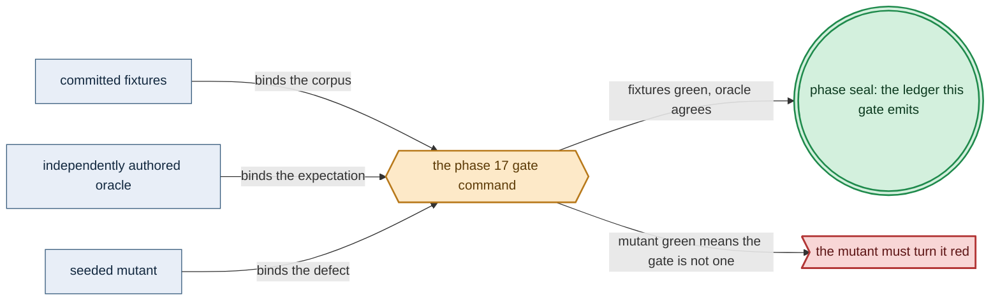

# Phase 17: Capability union + representational bind

> **Purpose**: Build the pure capability union and the total representational `bind` — source-expanding every
> runnable member into `BoundExecutionUnit`s and assembling one `BoundServiceSpec`/`BoundDeployment` — so that
> the *app-surface bytes are identical* across two shapes while the bound object graph differs *structurally*,
> a product-named or URL-named or shape-in-app app has no syntax (dhall-typecheck), and a binding to an unbuilt provider
> arm fails gadt-decode, all with no provision, no fold, and no render.
> **Read this if**: phase 17 is next in the queue, or a later phase depends on what its gate establishes.

Phase 17 delivers the capability union + representational bind; its design is owned by [service_capability_doctrine.md](../documents/engineering/service_capability_doctrine.md), [content_addressing_doctrine.md](../documents/engineering/content_addressing_doctrine.md), [capability_extension_doctrine.md](../documents/engineering/capability_extension_doctrine.md), and the plan for reaching it is owned here.
Register 1: an in-process battery, no cluster. The gate passed on 2026-08-09 with ledger
`dynamically-resolved`.
The human-readable boundary is recorded in the
Phase-17 capability-bind ledger.

> **Historical result (invalidated).** Any pass, seal, validation, ledger, receipt, or implementation observation
> in the orientation text above is diagnostic only. The Phase Status section and [tracker](README.md) own current state; the
> target contract below remains normative.

Link-graph metadata

**Status**: Authoritative source
**Supersedes**: N/A
**Referenced by**: DEVELOPMENT_PLAN/README.md, DEVELOPMENT_PLAN/overview.md, DEVELOPMENT_PLAN/phase_13_illegal_state_corpus.md, DEVELOPMENT_PLAN/phase_14_capacity_core_folds.md, DEVELOPMENT_PLAN/phase_15_storage_geometry_folds.md, DEVELOPMENT_PLAN/phase_16_execution_accelerator_folds.md, DEVELOPMENT_PLAN/phase_18_provision_seal.md, DEVELOPMENT_PLAN/phase_19_inference_accelerator_provision.md, DEVELOPMENT_PLAN/phase_20_render_manifest_goldens.md, DEVELOPMENT_PLAN/system_components.md, documents/engineering/app_vs_deployment_doctrine.md, documents/engineering/capability_extension_doctrine.md, documents/engineering/content_addressing_determinism.md, documents/engineering/dsl_doctrine.md, documents/engineering/service_capability_doctrine.md, documents/engineering/testing_doctrine.md
**Generated sections**: none

## Contents
- [Phase Status](#phase-status)
- [Phase Summary](#phase-summary)
- [Gate integrity](#gate-integrity)
- [Doctrine adopted](#doctrine-adopted)
- [Sprints](#sprints)
- [Sprint 17.1: The closed capability union + the no-product-arm dhall-typecheck foreclosure ✅](#sprint-171-the-closed-capability-union--the-no-product-arm-dhall-typecheck-foreclosure-)
- [Sprint 17.2: The `CapabilityBinding` + total representational `bind` ✅](#sprint-172-the-capabilitybinding--total-representational-bind-)
- [Sprint 17.3: The bind property/corpus + the Register-1 gate ✅](#sprint-173-the-bind-propertycorpus--the-register-1-gate-)
- [Documentation Requirements](#documentation-requirements)
- [Related Documents](#related-documents)

---

## Phase Status

✅ Done — resealed 2026-08-17 on the amended contract. `python3 tools/capability_bind_gate.py` passes all
eleven sides on substrate `none`, lane `none`, natural `arm64`, untranslated: every authored oracle holds its
declared shape, the suite is green, every seeded mutant reddens at its own locus, each recorded result is
derived from an observation, and 29 surfaces join completely to 36 enumerated items. Attestation
`sha256:dde36776da998475241825343eac9a7e32fde32aa73596f799a2dada5e0e2a6a`. The rerun differs from its
predecessor by naming the lane and the architecture the run actually used, and by reading its mutant manifest
from the one registry.

**Opened 2026-08-17** when the preceding phase resealed.
[§S](development_plan_gate_integrity.md#s-universal-artifact-hygiene-gate) clause 15 requires a run to record
the natural architecture it proved and to execute no artifact of another. This phase's last gate recorded no
architecture, so its seal is invalidated as a current result and stands only as history; the rerun differs from
it by naming the lane and architecture the run actually used. A sprint marker below records what that sprint achieved before the amendment; under
[§N](development_plan_phase_model.md#n-reopening-and-amending-a-phase) it is a diagnostic, not surviving closure.

**Pre-natural-architecture status record (invalidated where it claims completion):**

Done (invalidated) — resealed 2026-08-15. `python3 tools/capability_bind_gate.py` passed all ten sides: nine capability
arms in both shapes, eighteen exact goldens, three dhall-typecheck and four gadt-decode negatives, the covered property, all
four mutants, all twelve metrics, and the honesty ledger pass; 29 surfaces join to 36 enumerated items. The
project-contained attestation is `sha256:2e71dade980d2205a70538ac3db3d20b5f04cc81b52a2a345ea237529e2ba30b`,
bound to source snapshot `sha256:f11ac11d30e778b9…`; Phase 17 owns no remaining migration deferral.

**Pre-containment status record (invalidated where it claims completion):**

Done (invalidated) — sealed 2026-08-12. The migrated gate passed against source snapshot `sha256:a14933f8e034d4ba…`
(1935 non-ignored files) and published a verified pre-containment external attestation
`sha256:af29f3726a6b4464436530958b476925360aec3a82a7005ade12fda31a0ad6b6`.

**Observed progress — 2026-08-12:** **Policy-conformant.** Every capability check is unchanged and re-run: all
nine capability arms bind in both shapes against 18 exact shape goldens, nine distinct composed app files share
one normal form while their object-node multisets differ, three dhall-typecheck and four gadt-decode negatives fail at their
specific loci and tags, the nine-arm QuickCheck coverage floor holds, and all four seeded mutants redden.
Evidence and the ledger move into `.build/runs/phase_11/<run-id>/`, and 20 run-time items — the nine arm slugs,
seven dhall-typecheck/gadt-decode case names, and four mutant names — partition one-to-one across the claim surfaces.

**Two corrections.** `test/spec/capability/BindGate.hs` hard-coded one developer's `dhall` path and now resolves
per run, failing closed when unset. And, as in Phases 16 and 17's siblings, the join found five contract
surfaces with no case, mutant, or metric of their own — `controller-child-source-expansion`,
`unresolved-transition-references`, `registry-storage-bound-intent`, `extension-totality`, and
`phase10-validation-locus-ledger`. The ledger carries them UNVERIFIED rather than asserting a result the run
did not produce, and the gap is recorded against Phase 17 in
[`legacy_tracking_for_deletion.md`](legacy_tracking_for_deletion.md).

**Invalidated historical record:**

Done (invalidated). Validated 2026-08-09 on **no substrate** (`none`) in **Register 1** with
`python3 tools/capability_bind_gate.py`; ledger
`dynamically-resolved`. It stood up
no host, no cluster, and no provider, only the pure capability union, the app-surface
`CapabilityNeed` records, the `CapabilityBinding`, the total `bind` producing a `BoundServiceSpec`/`BoundDeployment`,
and the object-node-multiset structural oracle plus its property/corpus battery. It opened after the
[Phase 13](phase_13_illegal_state_corpus.md) gate (the illegal-state corpus + validation-locus ledger machinery this gate reuses) and the [Phase 16](phase_16_execution_accelerator_folds.md) gate (the execution-epoch / runtime-storage / accelerator folds whose kind-indexed vocabulary `bind`'s output must be compatible with, and which the *later* provision seal — [Phase 18](phase_18_provision_seal.md) — invokes; **`bind` itself calls no fold and no provision here**). Where a shape below is exercised in a sibling system (prodbox's `Prodbox/Lib/ChartPlatform.hs` planner/dependency/values orchestration the binding generalizes, and infernix's `Infernix/Runtime/Worker.hs` selecting its engine by `adapterType` and never fetching it), that is **sibling evidence, not an amoebius result** — and both siblings still *name products* and *fetch* engine payloads, the
exact couplings this phase's abstraction dissolves.

## Phase Summary

This sub-phase owns the **capability layer and the representational bind only**. It makes amoebius's
*"application logic names a capability, never a product"* invariant executable as a pure decode-and-bind path,
and stops at the wholly unprovisioned `BoundDeployment` boundary — the whole-deployment provision seal, the
capacity/storage folds, the accelerator/inference availability relation, and the render all live in later
phases.

It delivers the **capability model** as data:
- the closed **nine-arm** capability union — the eight ordinary capabilities (`ObjectStore`, `SecretStore`,
  `MessageBus`, `Sql`, `Identity`, `Observability`, `Registry`, `Edge`) plus a distinct ninth
  `InferenceEngine` arm — on the app surface with **no product arm** (`minio` has no syntax) and **no generic "some other service" escape arm**
- the `InferenceEngine` head carries a closed `EngineRuntime` lane union with **no arbitrary-`Url`/`Download` arm** (an engine named by URL has no syntax, dhall-typecheck) — this phase owns that
  union's *representational shape*
- its family×lane availability *relation* and its `CudaOwnerDemand`/`MetalOwnerDemand` accelerator provision
  are [Phase 19](phase_19_inference_accelerator_provision.md).

It delivers the **three-part binding**: the `CapabilityNeed` an app writes once and carries everywhere; the
`CapabilityBinding` (a one-arm-today provider union defaulting to the canonical provider, plus a typed `shape`
that selects *which* manifest graph to render, bound only on the deployment-rules surface); and the total
function `bind :: CapabilityNeed -> CapabilityBinding -> BoundServiceSpec`. `bind` selects and fully expands the
provider's manifest graph for the chosen shape, and source-expands every runnable member into a complete
unprovisioned `BoundExecutionUnit` with one private controller/resource-compatible body — Deployment,
StatefulSet, DaemonSet, Job, or HostProcess — lowering controller-created children into that same kind-indexed
vocabulary while retaining each child's private source-expansion witness. The enclosing
`BoundExecutionInventory` retains exactly one deployment-level `FirstDeployment | UpdateFrom
PriorExecutionProvisionRef` source **without resolving it**, and the assembled `BoundDeployment` retains only
these unprovisioned units, the opaque source ref, and controller explanations — **no resolved prior inventory, materialized instance, epoch placement, or `Provisioned*` value**.

The load-bearing property is that the *app-surface bytes are identical* across shapes while the bound
`BoundServiceSpec` differs *structurally* (a different object graph, not a `replicas: 1 → 3` edit) — the
capability survives a move, the binding does not have to. Every foreclosure here is honest about its layer: an
app that names a product, an engine named by URL, or a shape/provider authored on the app surface is
**type-foreclosed** (no syntax, fails dhall-typecheck); a binding to an unbuilt provider arm and an unbound or cyclic /
shadowing extension graph are rejected by the genuine gadt-decode decoder. What is **not** here: the whole-deployment
provision seal — `planInfrastructure`/`provision`/`ProvisionedSpec` and the capacity/storage/runtime-storage/
object-store/observability/migration/scheduler-reservation demand derivation and folds
([Phase 18](phase_18_provision_seal.md)); the `InferenceEngine` family×lane availability relation, the
target-offering→lane quotient, and the accelerator residency/coexistence provision
([Phase 19](phase_19_inference_accelerator_provision.md)); the pure
`renderAll :: ProvisionedSpec -> [K8sObject]` ([Phase 20](phase_20_render_manifest_goldens.md)); and the live
jit-resolve of an engine into its `CacheBudget`-bounded cache ([Phase 59](phase_59_determinism_jitcache.md)).

**Substrate:** none — no host, no cluster, no provider; the gate is an in-process `cabal test` bind + property +
corpus battery, analogous to the Phase-12 decode battery.

**Lane:** none ([§L](development_plan_standards.md#l-one-substrate-discipline))

**Register:** 1 — pure/golden, in-process, no cluster.

**Gate:** `cabal test capability-bind-spec` passes the nine-arm two-shape corpus, its reviewer-authored
goldens, the object-node-multiset and app-surface-byte oracles, the seven specific-reason negatives, and the
four seeded mutants of [Gate integrity](#gate-integrity). Provision, the folds, and accelerator/inference
availability stay UNVERIFIED here; they are Phases 18 and 19.

## Gate integrity

This section is the [§M](development_plan_standards.md#m-gate-integrity-a-gate-cannot-be-passed-by-a-stub) apparatus for the Phase-17 gate — the **bind-core slice** of the source corpus, partitioned
along this seam. It does not duplicate the provision-seal or accelerator corpora, which are owned by
[Phase 18](phase_18_provision_seal.md) and [Phase 19](phase_19_inference_accelerator_provision.md) respectively.

*Design intent. Phase 17's gate apparatus; [§M](development_plan_standards.md#m-gate-integrity-a-gate-cannot-be-passed-by-a-stub) owns its clauses.*

**Oracle-pinning (§M.1).** Authored and committed in **Phase 0** before `bind` exists:

- The **per-arm goldens** `test/golden/capability/golden_servicespec_<arm>_<shape>.golden` — one reviewer-authored
  `BoundServiceSpec` golden for each of the nine arms under each of `SingleNode` and `Distributed`. Authored
  before `bind` exists, so a golden **cannot be regenerated from `bind`'s output**; a golden regenerated from the
  implementation passes for any output, a stub's included, and is therefore forbidden.
- The **nine-arm positive corpus** `dhall/examples/legal_<arm>_{singlenode,distributed}.dhall` for all nine arms
  (including the specifically-named `legal_objectstore_{singlenode,distributed}` and `legal_inference_cuda`), each
  a full `CapabilityNeed` fixture — the corpus is **not** scope-shrunk to the three named fixtures.
- The **oracle-pinned hand-authored arm list** enumerating exactly the nine capability arms, **independent of the union's own definition** — the exhaustiveness check keys against it, not against `bind`'s case analysis.
- The **expected error/locus tags** for every negative in `dhall/examples/`: the asserted `dhall type` error
  locus (dhall-typecheck) or the specific `DecodeError` tag (gadt-decode) for each of `illegal_product_in_app`,
  `illegal_engine_by_url`, `illegal_shape_in_app`, `illegal_unbuilt_provider`, `illegal_unbound_capability`,
  `illegal_cyclic_extension`, and `illegal_shadowing_extension`.

**Committed mutation quota (§M.2).** Four committed seeded mutants under `test/mutant/capability_bind/` — committed
and re-run (not run once), drawn from the defined operator set — that the gate **must** turn red when
substituted:

- `mutant_copy_shape_tag` *(effect swap)* — `bind` copies the shape tag into a `providerGraph` field instead of
  selecting a manifest graph. It defeats a plain `/=`-only diff but is caught by the object-node-multiset oracle
  (the two shapes now differ only in a copied tag, not in member multiplicity). **This is the primary shape-oracle mutant the gate names.**
- `mutant_catchall_arm` *(union-arm addition)* — a catch-all `bind` arm returns a degenerate `BoundServiceSpec`
  for the six capabilities lacking an explicit positive shape; caught by the per-arm golden + the nine-arm
  exhaustiveness check.
- `mutant_shared_app_import` *(dropped distinctness)* — the two composed fixtures share one app-surface import,
  making byte-equality a file-compared-to-itself tautology; caught by the distinct-composed-file requirement of
  the app-surface byte check.
- `mutant_provisioned_value_in_bound_deployment` *(effect swap)* — inject a `Provisioned*` result into
  `BoundDeployment` before any provision; caught by the structural inventory that asserts `BoundDeployment`
  carries no `Provisioned*` field.

**Independent reference predicates (§M.3).** Every equivalence/exact-match check defines its reference side
independently of the code under test:

- The **object-node-multiset oracle** is a deep structural diff (per
  [`service_capability_doctrine.md §5`](../documents/engineering/service_capability_doctrine.md#5-per-cluster-structural-shapes--beyond-values))
  that counts the provider object graph's member elements (`Distributed { nodes = n }` → n member elements,
  `SingleNode` → 1) — **not** `bind`'s own fold or case analysis; it **fails on a plain `/=`, a scalar-only edit, or a copied shape tag**.
- The **app-surface byte equality** is the equality of the **beta-normalized Dhall expressions** of the
  app-surface slices extracted from **two distinct composed spec files** (never a shared import compared to
  itself); the oracle is the Dhall normalizer, not `bind`.
- The **exhaustiveness check** enumerates coverage against the oracle-pinned hand-authored arm list, not the
  union's own definition.

**Generator coverage (§M.4).** The QuickCheck totality property carries `label`/`classify` + `checkCoverage`
obligations forcing each of the **nine** need constructors to fire ≥ 8% — a generator that emits only the three
covered constructors fails coverage, so a scope-shrunk corpus cannot pass.

**Concrete corpus (§M.7).** The representative set is named explicitly: one positive `CapabilityNeed` fixture
per each of the nine arms, each bound under both a `SingleNode` and a `Distributed { nodes = n }` (n ≥ 2)
shape, and each required to decode, `bind` to a well-typed `BoundServiceSpec`, and assemble into a
`BoundDeployment` in process — enumerated above, not an undefined "representative set."

**Specific-reason negatives (§M.8).** Each negative asserts **why** it fails (its `dhall type` error locus or its
`DecodeError` tag) and is **paired with a positive differing only in the foreclosed dimension** — so a negative
cannot pass for an unrelated reason (a typo, a missing field) while the illegal state it targets stays
representable.

A Register-1 validation-locus ledger maps every corpus entry, negative reason, and seeded mutant to its catalog
id and honest foreclosure layer, backed by **Phase-13-style coverage-assertion machinery**: the suite goes **red**
if any named fixture, negative reason, or mutant is absent from the ledger — 'honestly classifies' is a machine
oracle, not a hand-written attestation. The ledger marks the runtime residue (the provider actually coming up,
the engine actually resolving into its bounded cache) deferred to the live band, never reported as proven.

## Doctrine adopted

- [`service_capability_doctrine.md §1`](../documents/engineering/service_capability_doctrine.md#1-why-capabilities-not-products)
  and [`§2`](../documents/engineering/service_capability_doctrine.md#2-the-capability-set)
  — **why capabilities, not products**, and **the capability set.** The nine-arm closed union is the whole
  vocabulary an app has for "a service I depend on"; there is no arm for "some other service" and no arm that
  names a product, so an app that needs object storage selects `ObjectStore` and has no syntax with which to
  select `minio`.
- [`service_capability_doctrine.md §4`](../documents/engineering/service_capability_doctrine.md#4-capability--provider--shape-the-binding)
  — **Capability → provider → shape: the binding.** This phase implements the three-part binding as pure
  Haskell: the capability is chosen by application logic (written once, travels), and the provider (default the
  [§3](../documents/engineering/service_capability_doctrine.md#3-one-canonical-provider-the-type-admits-alternates)
  canonical) and shape are chosen by deployment rules — realized as the total `bind`, not restated as prose.
- [`service_capability_doctrine.md §3`](../documents/engineering/service_capability_doctrine.md#3-one-canonical-provider-the-type-admits-alternates)
  and [`§5`](../documents/engineering/service_capability_doctrine.md#5-per-cluster-structural-shapes--beyond-values)
  — **one canonical provider (the type admits alternates)** and **per-cluster structural shapes.** The provider
  slot is a typed union with one arm today and headroom for alternates; the shape is a typed choice
  (`SingleNode` vs `Distributed`) that selects *which manifest graph* to render — the structural generalization
  of the replica dial — and amoebius builds no alternate provider arm it does not yet need (headroom in the
  type, not shipped code).
- [`service_capability_doctrine.md §4.1`](../documents/engineering/service_capability_doctrine.md#41-the-inferenceengine-capability--the-engine-is-target-offering-selected-and-jit-resolved-never-authored)
  — the `InferenceEngine` capability: the engine is a **named catalog identity**, never authored by URL —
  grounded in [`content_addressing_determinism.md §4.5`](../documents/engineering/content_addressing_determinism.md#45-the-ml-asset-lifecycle-one-bounded-content-addressed-cache-resolved-on-first-miss).
  **This phase adopts only the union's representational shape** — the closed `EngineRuntime` lane union with **no arbitrary-`Url`/`Download` arm**, so "name the engine by URL" has no syntax and fails dhall-typecheck. The family×lane
  availability relation, the target-offering→lane quotient, the accelerator owner demands, and the actual
  jit-resolve are **not** here (Phases 19 / 45).
- [`service_capability_doctrine.md §8`](../documents/engineering/service_capability_doctrine.md#8-capabilities-and-the-illegal-state-contract)
  — **capabilities and the illegal-state contract:** an app cannot name a product (no arm — dhall-typecheck), a
  capability cannot bind to a provider with no inhabitant (an unbuilt alternate does not decode — gadt-decode), and a
  capability cannot be left unbound (an undecodable record, never a runtime `Pending`).
- [`capability_extension_doctrine.md §3`](../documents/engineering/capability_extension_doctrine.md#3-the-provide-and-require-contract)
  — **the extension provide/require capability graph.** The binder validates the `extRequires` provide/require
  graph is total and acyclic and rejects an anti-shadow (shadowing) merge or a provide-and-require self-loop; a
  cyclic or shadowing extension fixture fails gadt-decode at its committed locus (the closed v1 extension set
  `{infernix, jitML}`).
- [`illegal_state_catalog.md §3`](../documents/illegal_state/illegal_state_catalog.md#3-the-catalog--states-a-valid-spec-cannot-represent)
  ([§3.12](../documents/illegal_state/illegal_state_capability_messaging.md#312-an-app-that-names-a-product-instead-of-a-capability) — a product named in application logic) and
  [`§3.25`](../documents/illegal_state/illegal_state_ml_asset.md#325-an-ml-asset-named-by-arbitrary-url-or-an-unready--unlanded-model)
  (an ML asset named by arbitrary URL) — the two states this phase forecloses at dhall-typecheck, honoring the
  load-bearing limit ([`§2`](../documents/illegal_state/illegal_state_catalog.md#2-the-load-bearing-limit-a-type-check-proves-the-spec-composes-not-that-the-cluster-enforces-it)):
  a type-check proves the *binding composes*, not that the *running provider* came up.
- [`dsl_doctrine.md §5`](../documents/engineering/dsl_doctrine.md#5-the-illegal-state-unrepresentable-contract)
  — **the illegal-state-unrepresentable contract's typed spec gates** (dhall-typecheck the Dhall typechecker, gadt-decode the
  in-process decoder): the capability union is guarded at dhall-typecheck, the binding decodes through gadt-decode — this
  phase adds the capability-model instance of that contract, no live half.
- [`testing_doctrine.md`](../documents/engineering/testing_doctrine.md#2-the-registers-of-amoebius-testing) [§2](../documents/engineering/testing_doctrine.md#2-the-registers-of-amoebius-testing)
  (**Register 1** — pure/golden, in-process, no cluster) and [§4](../documents/engineering/testing_doctrine.md#4-no-skips-fail-fast-and-the-per-run-ledger-artifact) (the per-run proven/tested/assumed ledger): the
  register this gate reaches and the ledger it emits, with the live realization of any provider (and the
  jit-resolve of any engine) marked UNVERIFIED, owned by the live band.

The provision/fold ordering — expand every provider/shape first, then run the capacity folds, then hand only the
checked result to render
([`resource_capacity_doctrine.md §3`](../documents/engineering/resource_capacity_doctrine.md#3-the-types-quantity-capacity-demand-budget)/[`§4`](../documents/engineering/resource_capacity_doctrine.md#4-the-total-fold-fits-carve-place-and-the-nesting))
— is deliberately **not** adopted here; it is owned by [Phase 18](phase_18_provision_seal.md). This phase stops
at the wholly unprovisioned `BoundDeployment`.

## Sprints

> **Current validation record.** Every sprint is covered by the 2026-08-15 reseal. Historical dates,
> pass/seal claims, repository-resident evidence paths, and `Remaining Work: None` statements below describe
> the pre-amendment capability record only; they do not override current status. Functional and validation
> outcomes remain target requirements. Any instruction to commit generated output, freeze dependency resolution,
> retain a resolved version, path, or integrity hash, or consume repository-resident evidence, ledgers, or
> enumerations is superseded by the current generated-artifact and dynamic-resolution doctrine. Closure was
> established by the current phase gate plus universal artifact hygiene.

## Sprint 17.1: The closed capability union + the no-product-arm dhall-typecheck foreclosure ✅

**Status**: Done — the capability is re-established by the migrated gate; the sprint's committed-ledger, pinned-toolchain, and repository-resident evidence mechanics are superseded
**Implementation**: `dhall/amoebius/Capability.dhall` carries the closed union and the app-surface
`CapabilityNeed` records; `src/Amoebius/Capability/Types.hs` carries their Haskell counterparts and the
`BoundServiceSpec` skeleton the binder targets.
**Blocked by**: None.
**Independent Validation**: `dhall type` accepts every positive `CapabilityNeed` fixture and rejects the
product-named and URL-named ones at their asserted loci, each paired with a minimally differing positive; a
unit check counts the union's arms against the oracle-pinned hand-authored arm list rather than against the
union's own definition. The Validation list below names the fixtures and the loci.
**Docs to update**:
`documents/engineering/service_capability_doctrine.md` (Phase-17 status backlink for §1/§2 and the §4.1
no-URL union shape), `documents/engineering/app_vs_deployment_doctrine.md` (the app-surface
capability-resource read-side), `DEVELOPMENT_PLAN/system_components.md`.

### Objective
Adopt [`service_capability_doctrine.md §1`](../documents/engineering/service_capability_doctrine.md#1-why-capabilities-not-products)
and [`§2`](../documents/engineering/service_capability_doctrine.md#2-the-capability-set):
build the closed capability union as the whole vocabulary an app has for a dependency, so that naming a
capability is the only move available and naming a product — or an engine by URL — is not a word the grammar
contains.

### Deliverables
- The closed nine-arm capability union — the eight ordinary capabilities (`ObjectStore`, `SecretStore`,
  `MessageBus`, `Sql`, `Identity`, `Observability`, `Registry`, `Edge`) plus the ninth `InferenceEngine` head —
  on the app surface, with **no product arm** and no generic "some other service" arm: `minio` has no syntax.
- The `InferenceEngine` head's closed `EngineRuntime` lane union (`AppleMetal` · `Cuda` · `LinuxCpu`) with **no arbitrary-`Url`/`Download` arm** — an ML engine is a **named catalog identity**, so "name the engine by URL"
  has no syntax and fails dhall-typecheck. This sprint delivers the *representational shape* of that union only; its
  family×lane availability relation, target-offering→lane quotient, and `CudaOwnerDemand`/`MetalOwnerDemand`
  owner demands are [Phase 19](phase_19_inference_accelerator_provision.md).
- The app-surface `CapabilityNeed` records read as *resources of a capability* — buckets against `ObjectStore`,
  a database against `Sql`, topic lifecycles against `MessageBus`, OIDC rules against `Identity`, published
  routes against `Edge`, and so on — and the `BoundServiceSpec` skeleton the binder projects into.
- An in-file honesty note that this union is the app-facing *what*; the provider/shape *how* is Sprint 17.2, the
  provision seal is [Phase 18](phase_18_provision_seal.md), and the capability set is invariant across every
  cluster (a different capability *set* per cluster stays refused).

### Validation
1. `dhall type` accepts each positive `CapabilityNeed` and rejects both a product-named app and a URL-named
   engine at authoring time (dhall-typecheck), each at its asserted error locus; the union has exactly nine arms, no
   product arm, and no escape arm, checked against the oracle-pinned hand-authored arm list.
2. Each dhall-typecheck negative fails at a named locus rather than merely somewhere. `illegal_product_in_app`, which
   names `minio` at authoring time, raises an unknown-constructor / no-such-alternative type error on the
   capability union; `illegal_engine_by_url`, which names an engine by URL, raises the same error on the
   `EngineRuntime` lane union. Each is paired with its positive — `legal_objectstore_singlenode` and
   `legal_inference_cuda` respectively — differing only in that the product name or the URL is replaced by a
   capability or a named engine identity, so neither negative can pass for an unrelated reason such as a typo
   or a missing field.

### Remaining Work
None. The closed union, need records, and dhall-typecheck corpus are sealed by the Phase-17 gate.

## Sprint 17.2: The `CapabilityBinding` + total representational `bind` ✅

**Status**: Done — the capability is re-established by the migrated gate; the sprint's committed-ledger, pinned-toolchain, and repository-resident evidence mechanics are superseded
**Implementation**: `dhall/amoebius/Capability.dhall`, extended with the `CapabilityBinding` records, and
`src/Amoebius/Capability/Binding.hs`, which carries the total `bind`, the kind-indexed execution vocabulary,
and the `BoundDeployment` assembly.
**Blocked by**: None.
**Independent Validation**: a unit + property suite binds one `ObjectStore` and one `Sql` need under both the
single-node and the distributed shape and compares each result against the independently authored oracles and
the reviewer-authored goldens rather than against `bind`; the numbered Validation list below carries the
assertions, the loci, and the mutants.
**Docs to update**:
`documents/engineering/service_capability_doctrine.md` (§3/§4/§5 binding backlink),
`documents/engineering/app_vs_deployment_doctrine.md` (the deployment-rules shape/provider surface),
`DEVELOPMENT_PLAN/system_components.md`.

### Objective
Adopt [`service_capability_doctrine.md §4`](../documents/engineering/service_capability_doctrine.md#4-capability--provider--shape-the-binding),
[`§3`](../documents/engineering/service_capability_doctrine.md#3-one-canonical-provider-the-type-admits-alternates),
and [`§5`](../documents/engineering/service_capability_doctrine.md#5-per-cluster-structural-shapes--beyond-values):
implement the three-part binding as a pure total function so that one byte-identical app spec binds to a
structurally different `BoundServiceSpec` per cluster — a different object graph, not a scalar `replicas` edit —
stopping at the wholly unprovisioned `BoundDeployment`.

### Deliverables
- A `CapabilityBinding` whose `provider` is a **one-arm-today** typed union defaulting to the
  [§3](../documents/engineering/service_capability_doctrine.md#3-one-canonical-provider-the-type-admits-alternates)
  canonical provider (headroom for an alternate, but no adapter amoebius does not yet need), and whose `shape`
  is a typed choice (`SingleNode` vs `Distributed { nodes }`), bound only on the deployment-rules surface.
- `bind :: CapabilityNeed -> CapabilityBinding -> BoundServiceSpec`, pure and total, selecting the provider's
  **manifest graph for the chosen shape** — a structurally different object graph, not a scalar `replicas` edit.
  Every runnable becomes a complete unprovisioned `BoundExecutionUnit` with one private
  controller/resource-compatible body. Deployment carries `ReplicaCardinality` and only
  `DeploymentRolloutPolicy`; StatefulSet carries its native replica count and serial `StatefulSetRolloutPolicy`;
  DaemonSet carries `NodeEligibilitySelector` and only `OnDelete | RollingUpdate (Surge | Unavailable)`; Job
  carries completions/parallelism/backoff, `restartPolicy=Never`, replacement-on-Failed, and finite terminal
  retention; HostProcess carries `HostProcessCardinality` plus supervisor replacement policy. A CUDA Pod is
  structurally a DaemonSet with serial `OnDelete`; CUDA host and Metal host arms structurally force their
  release/drain lifecycle. There is **no** unit-level replica scalar, caller terminating bound, generic strategy
  record, controller/resource cross-product, or unsupported StatefulSet feature field. `NodeEligibilitySelector`
  is the canonical closed conjunction of typed engine-role, provider-class, site, accelerator-profile, and
  inventory-taint constraints, with no free-text selector/toleration — these arms are **structural inputs to provision**, constructed here and resolved to host→slot maps and eligible sets only by
  [Phase 18](phase_18_provision_seal.md), never an authored or bound peak here.
- Controller-child lowering: for every operator/CR arm a version-pinned expander joins the descriptor's exact
  kind-indexed controller policy, complete child pod-resource-template, and child durable-volume operands, then
  alone constructs a private identity-keyed `ControllerChildEnvelope`. Each child is lowered into the same
  kind-indexed `BoundExecutionUnit` vocabulary; the controller witness *explains and exact-joins* the
  descriptor→child expansion but is retained as an explanation only (its capacity debit is
  [Phase 18](phase_18_provision_seal.md)'s, not a second unit here). A caller cannot author a scalar child peak,
  a generic child list, or a resource-free CR.
- The canonical identity-keyed `BoundExecutionSet`: every domain composite is exhaustively flattened into it;
  equality with the expanded runnable-source inventory rejects an omitted worker/controller/gateway/Job, and
  every unit has exactly one compatible controller body. The enclosing `BoundExecutionInventory` retains exactly
  one `FirstDeployment | UpdateFrom PriorExecutionProvisionRef` source for the entire deployment **without resolving it**, so removed prior-only units remain resolvable even though they have no current unit.
- `BoundDeployment` retains **only** these unprovisioned units, the opaque source ref, and controller
  explanations — **no** resolved prior inventory, materialized instance, epoch placement, or `Provisioned*`
  value. Its only links to old successful generations are the opaque `PriorExecutionProvisionRef` (and the sibling
  `PriorVolumeProvisionRef` / `PriorRegistryProvisionRef` carried but unresolved); resolving them against a
  `ProvisionContext` is [Phase 18](phase_18_provision_seal.md)'s work, not `bind`'s. `bind` carries the typed
  provider intents (`ObjectStoreProducerIntent`, `ObjectStoreGatewayIntent`, `StorageMigrationIntent`,
  `RegistryStorageIntent`, `SchemaMigrationIntent`, `PatroniSqlIntent`, and the `Observability` descriptor with
  its `MonitoringWorkBudget`) inside the bound graph **unresolved**; their derivation into demand records is the
  provision seal's, not here.
- An in-file honesty note: a single-node shape is the canonical provider deployed honestly at small scale (a
  one-member Patroni `Sql`, never a bare `postgres` Pod); `bind` produces a **value**, not a live provider, and
  not a provisioned deployment — the provision seal is [Phase 18](phase_18_provision_seal.md) and the live
  realization is the live band. The source inventory this sprint authors imports none of that: not the
  [Phase 18](phase_18_provision_seal.md) `provision`/`ProvisionedSpec` machinery, not the
  [Phase 16](phase_16_execution_accelerator_folds.md) execution-epoch fold, and not the
  [Phase 20](phase_20_render_manifest_goldens.md) `K8sObject`/Aeson renderer.

### Validation
1. The same `CapabilityNeed`, bound under two shapes, produces two `BoundServiceSpec`s that are **structurally different by the object-node-multiset oracle** (deep structural diff per [§5](../documents/engineering/service_capability_doctrine.md#5-per-cluster-structural-shapes--beyond-values), red on a scalar-only or copied-shape-tag difference; each equal to its oracle-pinned golden), while the **app-surface bytes**
   (beta-normalized app-surface slices from two distinct composed spec files) are identical; a binding to an
   unbuilt provider arm returns a structured `Left` tagged (gadt-decode); a shape/provider authored on the app
   surface fails `dhall type` at its asserted locus; `bind` never throws. A structural inventory proves
   `BoundDeployment` contains no `Provisioned*` field, and the canonical `BoundExecutionSet` equals the expanded
   runnable-source inventory with every controller-lowered child present exactly once and no second debit. This
   validation must go **red** on the committed `mutant_copy_shape_tag` seeded mutant (Sprint 17.3) — which makes
   `bind` copy the shape tag into a `providerGraph` field instead of selecting a manifest graph, passing a plain
   `/=` but failing the multiset oracle — and on `mutant_provisioned_value_in_bound_deployment` (a `Provisioned*`
   value injected into `BoundDeployment`).
2. Each negative names its locus rather than merely failing. `illegal_shape_in_app` fails `dhall type`
   because the app-surface record has no `shape` or `provider` field, and its paired positive differs only in
   that the shape moves to the deployment-rules surface — which is what makes the app-surface byte invariant
   above worth asserting at all. A binding that names a provider arm amoebius has not built returns its
   specific unbuilt-provider-arm `DecodeError`, never a bare `Left`.

### Remaining Work
None. The total binder, explicit object graphs, exact execution inventory, and unprovisioned deployment boundary are sealed.

## Sprint 17.3: The bind property/corpus + the Register-1 gate ✅

**Status**: Done — the capability is re-established by the migrated gate; the sprint's committed-ledger, pinned-toolchain, and repository-resident evidence mechanics are superseded
**Implementation**: `test/spec/capability/BindProps.hs`, `test/spec/capability/ShapeOracle.hs`, and
`test/spec/capability/BindGate.hs`, over the corpus in `dhall/examples/`, the goldens in
`test/golden/capability/`, and the seeded mutants in `test/mutant/capability_bind/`.
**Blocked by**: None.
**Independent Validation**: `cabal
test capability-bind-spec` is green — see below.
**Docs to update**:
`documents/engineering/service_capability_doctrine.md`,
`documents/engineering/capability_extension_doctrine.md` (§3 provide/require graph — the `extRequires`
acyclicity / no-shadow foreclosure this gate's cyclic/shadowing negatives exercise),
`documents/illegal_state/illegal_state_catalog.md` (§3.12/§3.25 → realized layer),
`documents/engineering/testing_doctrine.md`, `DEVELOPMENT_PLAN/README.md` (flip the Phase-17 status when the
gate passes), `DEVELOPMENT_PLAN/substrates.md` (the Phase-17 `none` gate row).

### Objective
Adopt [`service_capability_doctrine.md §8`](../documents/engineering/service_capability_doctrine.md#8-capabilities-and-the-illegal-state-contract),
[`capability_extension_doctrine.md §3`](../documents/engineering/capability_extension_doctrine.md#3-the-provide-and-require-contract),
and [`testing_doctrine.md`](../documents/engineering/testing_doctrine.md#2-the-registers-of-amoebius-testing)
[§2](../documents/engineering/testing_doctrine.md#2-the-registers-of-amoebius-testing)/[§4](../documents/engineering/testing_doctrine.md#4-no-skips-fail-fast-and-the-per-run-ledger-artifact): assemble the phase's single Register-1 gate — every positive need binds to a checked `BoundServiceSpec`
while every product- or URL-named or shape-in-app app has no syntax and every unbuilt/unbound/cyclic/shadowing
binding returns its specific `DecodeError` — and emit the per-entry validation-locus ledger that names the
honest foreclosure layer of each.

### Deliverables
- Three test modules with disjoint jobs: `test/spec/capability/BindProps.hs` holds the property battery,
  `test/spec/capability/ShapeOracle.hs` holds the object-node-multiset structural diff — authored separately from
  `bind`, so the oracle is never `bind`'s own fold — and `test/spec/capability/BindGate.hs` holds the gate and the
  validation-locus ledger with its coverage-assertion machinery.
- The **concrete positive corpus** — **one fixture per each of the nine capability arms** (`ObjectStore`,
  `SecretStore`, `MessageBus`, `Sql`, `Identity`, `Observability`, `Registry`, `Edge`, `InferenceEngine`), each
  bound under **both** a `SingleNode` and a `Distributed { nodes = n }` (n ≥ 2) shape — so the corpus is not
  scope-shrunk to the three named `legal_objectstore_{singlenode,distributed}` / `legal_inference_cuda` fixtures.
  A committed **exhaustiveness unit check** asserts the fixture→capability-arm map covers the full nine-arm union
  (red if any arm has no positive fixture), enumerated against the **oracle-pinned hand-authored arm list**
  (Sprint 17.1), independent of `bind`'s own case analysis.
- The property battery: the same `CapabilityNeed` bound under two shapes yields two `BoundServiceSpec`s
  **structurally different by the object-node-multiset oracle** (red on scalar-only / copied-shape-tag) with
  byte-identical app bytes (beta-normalized app-surface slices from distinct composed files); **every declared need binds totally (no partial `bind`) across all nine arms**, with QuickCheck `label`/`classify` +
  `checkCoverage` obligations forcing each of the **nine need constructors** to fire ≥ 8% (so a generator
  emitting only the three covered constructors fails coverage); an unbound capability is an undecodable record,
  not a runtime `Pending`; and a structural inventory proves `BoundDeployment` contains no `Provisioned*` field,
  that the Registry arm crosses `ObjectStoreProducerIntent.Registry : RegistryStorageIntent` on the *bound* side
  (its derivation into `RegistryStorageDemand` is the provision seal's), and that the canonical
  `BoundExecutionSet` enumerates every kind-indexed unit — including controller-lowered units — exactly once.
- The negative corpus — `illegal_product_in_app` ([§3.12](../documents/illegal_state/illegal_state_capability_messaging.md#312-an-app-that-names-a-product-instead-of-a-capability), dhall-typecheck), `illegal_engine_by_url` ([§3.25](../documents/illegal_state/illegal_state_ml_asset.md#325-an-ml-asset-named-by-arbitrary-url-or-an-unready--unlanded-model), dhall-typecheck),
  `illegal_shape_in_app` (shape/provider on the app surface, dhall-typecheck), `illegal_unbuilt_provider` (gadt-decode),
  `illegal_unbound_capability` (undecodable, gadt-decode), `illegal_cyclic_extension` (a provide-and-require
  self-loop, gadt-decode at the `extRequires` locus), and `illegal_shadowing_extension` (an anti-shadow merge, gadt-decode
  at the `extRequires` locus) — each asserting **its specific failure reason** (its expected `dhall type` error
  locus or `DecodeError` tag) and each **paired with a positive differing only in the foreclosed dimension**,
  alongside the positive nine-arm corpus above. The two extension negatives pair with a minimal legal
  `{infernix, jitML}` positive, the closed v1 extension set. The accelerator/provision-seal negatives
  (`illegal_cuda_on_cpu_target`, `illegal_accelerator_*`, `illegal_engine_family_unavailable_on_lane`,
  `illegal_monitoring_work_over_budget`, `illegal_post_bind_expansion_overcommit`,
  `illegal_prior_provision_ref_*`, …) are **not** in this gate — they belong to
  [Phase 18](phase_18_provision_seal.md) and [Phase 19](phase_19_inference_accelerator_provision.md).
- **Committed seeded mutants (§M.2)** — a defined operator set of **four** deliberately broken implementations,
  committed and re-run (not run once), that the gate MUST turn red: `mutant_copy_shape_tag` (effect swap: `bind`
  copies the shape tag into a `providerGraph` field instead of selecting a manifest graph — defeats a `/=`-only
  diff, caught by the multiset oracle); `mutant_catchall_arm` (union-arm addition: a catch-all `bind` arm returns
  a degenerate `BoundServiceSpec` for the six uncovered capabilities — caught by the per-arm golden +
  exhaustiveness check); `mutant_shared_app_import` (the two composed fixtures share one app-surface import —
  makes byte-equality vacuous — caught by the distinct-composed-file requirement in (a)); and
  `mutant_provisioned_value_in_bound_deployment` (inject a `Provisioned*` result into `BoundDeployment` before
  any provision — caught by the structural inventory). The gate re-runs each mutant and asserts red.
- A Register-1 validation-locus ledger mapping every entry to its catalog id and layer, backed by
  **Phase-13-style coverage-assertion machinery** (the ledger is not a static hand-written file: the suite goes
  **red** if any corpus entry, negative reason, or seeded mutant named above is absent from the ledger),
  explicitly marking the runtime residue (the provider actually coming up, the engine actually resolving into
  its bounded cache) deferred to the live band — never reported as proven.

### Validation
1. `cabal test capability-bind-spec` is green — each of the **nine per-arm** positives binds byte-invariant
   (beta-normalized app-surface slices from distinct composed files) under both shapes and structurally
   different by the object-node-multiset oracle (red on scalar-only / copied-shape-tag) against its
   oracle-pinned golden; the exhaustiveness check covers all nine arms and the totality property meets
   `checkCoverage` (each constructor ≥ 8%); each dhall-typecheck negative (`illegal_product_in_app`,
   `illegal_engine_by_url`, `illegal_shape_in_app`) fails `dhall type` at its asserted locus, and each gadt-decode
   negative (`illegal_unbuilt_provider`, `illegal_unbound_capability`, `illegal_cyclic_extension`,
   `illegal_shadowing_extension`) returns its specifically-tagged `Left`, each paired with a minimally-differing
   positive; the suite is red if any product-named, URL-named, or shape-in-app fixture decodes, and red under
   each of the four committed seeded mutants (`mutant_copy_shape_tag`, `mutant_catchall_arm`,
   `mutant_shared_app_import`, `mutant_provisioned_value_in_bound_deployment`). The validation-locus ledger is
   present and its coverage-assertion machinery (Phase-13 precedent) turns the suite **red** if any named fixture,
   negative reason, or mutant is missing — 'honestly classifies' is thus a machine oracle, not a hand-written
   attestation. Provision, the capacity/storage folds, and the accelerator/inference availability relation are
   out of scope here and validated by Phases 18/19.

### Remaining Work
None. The 18 goldens, three dhall-typecheck negatives, four gadt-decode negatives, coverage property, validation ledger, and four mutants are sealed.

## Documentation Requirements

**Engineering docs to update (when the gate runs, flip the honest layer, never before):**
- `documents/engineering/service_capability_doctrine.md` — backlink §1/§2 (the capability set), §3/§4/§5 (the
  provider+shape binding), and §4.1 (the `InferenceEngine` engine union's no-URL representational shape) to the
  implemented `Amoebius.Capability.{Types,Binding}`; confirm the alternate-admitting provider union stayed
  one-arm and the `EngineRuntime` union stayed URL-free. (The §4.1 availability relation stays owned by
  [Phase 19](phase_19_inference_accelerator_provision.md).)
- `documents/engineering/capability_extension_doctrine.md` — backlink §3 (the provide/require contract) to the
  implemented `extRequires` acyclicity/no-shadow check whose `illegal_cyclic_extension` /
  `illegal_shadowing_extension` negatives this gate exercises.
- `documents/illegal_state/illegal_state_catalog.md` — annotate §3.12 (product in app logic) and §3.25 (engine
  by URL) with their realized layer (type-foreclosed, dhall-typecheck); keep the runtime-checked residue (provider up,
  engine resolved) deferred.
- `documents/engineering/content_addressing_doctrine.md` — reconcile §4.5's Tier-1 engine as the
  `InferenceEngine` provider whose named identity this binder decodes; keep the jit-resolve into the bounded
  cache as the live-band residue ([Phase 59](phase_59_determinism_jitcache.md)).
- `documents/engineering/app_vs_deployment_doctrine.md` — the app-surface capability resources vs the
  deployment-rules shape/provider surface; `documents/engineering/dsl_doctrine.md` — the capability-model
  instance of the two-gate contract.
- `documents/engineering/testing_doctrine.md` — record the Register-1 property + corpus ledger this gate emits
  (live realization and engine-resolve fidelity UNVERIFIED).

**Cross-references to add:**
- `DEVELOPMENT_PLAN/README.md` — flip the Phase-17 status when the gate passes; link this document.
- `DEVELOPMENT_PLAN/substrates.md` — the Phase-17 `none` gate row.
- `DEVELOPMENT_PLAN/system_components.md` — register `dhall/amoebius/Capability.dhall`,
  `src/Amoebius/Capability/{Types,Binding}.hs`, and the capability bind property + gate suites as Phase-17
  design-first rows.

## Related Documents
- [README.md](README.md) — the live tracker and phase order this document serves
- [development_plan_standards.md](development_plan_standards.md) — the rulebook this document obeys (the design-proof acceptance token: *binding-composition proven*, never *runtime proven*)
- [overview.md](overview.md) — target architecture and the capability-not-product invariant
- [Service Capability Doctrine](../documents/engineering/service_capability_doctrine.md) — [§1](../documents/engineering/service_capability_doctrine.md#1-why-capabilities-not-products)/[§2](../documents/engineering/service_capability_doctrine.md#2-the-capability-set) the capability
  set, [§3](../documents/engineering/service_capability_doctrine.md#3-one-canonical-provider-the-type-admits-alternates)/[§4](../documents/illegal_state/illegal_state_techniques.md#4-the-typing-techniques)/[§5](../documents/illegal_state/illegal_state_techniques.md#5-coverage-matrix--which-technique-forecloses-which-illegal-state) the provider+shape binding, [§4.1](../documents/illegal_state/illegal_state_techniques.md#41-pvcpv-binding-by-construction) the `InferenceEngine` union's no-URL shape, [§8](../documents/engineering/service_capability_doctrine.md#8-capabilities-and-the-illegal-state-contract) the illegal-state
  instances
- [Capability Extension Doctrine](../documents/engineering/capability_extension_doctrine.md) — [§3](../documents/engineering/capability_extension_doctrine.md#3-the-provide-and-require-contract) the
  provide/require `extRequires` contract whose acyclicity/no-shadow this gate's extension negatives exercise
- [Illegal State Catalog](../documents/illegal_state/illegal_state_catalog.md) — [§3.12](../documents/illegal_state/illegal_state_capability_messaging.md#312-an-app-that-names-a-product-instead-of-a-capability) (product in app logic),
  [§3.25](../documents/illegal_state/illegal_state_ml_asset.md#325-an-ml-asset-named-by-arbitrary-url-or-an-unready--unlanded-model) (engine by URL), with [§2](../documents/illegal_state/illegal_state_ml_asset.md#2-the-ml-asset--training-illegal-states) the load-bearing limit
- [DSL Doctrine](../documents/engineering/dsl_doctrine.md) — [§5](../documents/engineering/dsl_doctrine.md#5-the-illegal-state-unrepresentable-contract) the typed spec gates a capability binding decodes
  through
- [Content Addressing Doctrine](../documents/engineering/content_addressing_doctrine.md) — [§4.5](../documents/engineering/content_addressing_determinism.md#45-the-ml-asset-lifecycle-one-bounded-content-addressed-cache-resolved-on-first-miss) the ML-asset
  lifecycle whose Tier-1 named engine identity is the `InferenceEngine` provider
- [Testing Doctrine](../documents/engineering/testing_doctrine.md) — [§2](../documents/engineering/testing_doctrine.md#2-the-registers-of-amoebius-testing) Register 1, [§4](../documents/engineering/testing_doctrine.md#4-no-skips-fail-fast-and-the-per-run-ledger-artifact) the per-run ledger
- [phase_12](phase_12_gadt_decode_ir.md) — gadt-decode, the IR + decoder the bound specs project from
- [phase_13](phase_13_illegal_state_corpus.md) — the illegal-state corpus + validation-locus ledger machinery
  this gate reuses
- [phase_16](phase_16_execution_accelerator_folds.md) — the execution-epoch / runtime-storage / accelerator
  folds whose kind-indexed vocabulary `bind`'s `BoundExecutionUnit`s are fold-compatible with
- [phase_18](phase_18_provision_seal.md) — the whole-deployment provision seal that layers `planInfrastructure`/
  `provision`/`ProvisionedSpec` and the capacity/storage/observability/migration demand derivation on this
  phase's `BoundDeployment`
- [phase_19](phase_19_inference_accelerator_provision.md) — the `InferenceEngine` family×lane availability
  relation and the accelerator residency/coexistence provision layered on this phase's capability union
- [phase_20](phase_20_render_manifest_goldens.md) — the pure deployment-global
  `renderAll :: ProvisionedSpec -> [K8sObject]` downstream of the provision seal - [phase_59](phase_59_determinism_jitcache.md) — the live jit-build engine resolver + `CacheBudget` cache that
  materializes the named `EngineRuntime` identity this phase only decodes
