# Phase 23: Content store + workflow runtime (Pulsar-Failover single-writer)

**Status**: Authoritative source
**Supersedes**: N/A
**Referenced by**: README.md, overview.md, phase_22_pulsar_client.md, phase_24_determinism_kernel.md, phase_27_jitml_lift_cuda.md, phase_31_test_topology_dsl.md, system_components.md
**Generated sections**: none

> **Purpose**: Stand up amoebius's durable-artifact substrate — the three-tier content-addressed MinIO store —
> and the orchestrator/worker workflow runtime on top of the Phase-22 native Pulsar client, gated live on
> linux-cpu by a store/fetch-by-manifest-SHA round-trip whose active worker fails over to a Pulsar
> Exclusive/Failover standby with no bespoke election and a leak-free teardown.

---

## Phase Status

📋 Planned. Nothing in this phase is implemented; every sprint below is 📋 Planned and every prescriptive
statement is design intent, never a tested amoebius result. The phase runs on the **linux-cpu** substrate in
**Register 3** (live infrastructure) — a single-node `kind` cluster brought up by the Phase 13 midwife with
Pulsar and MinIO already standing as HA platform services (Phase 18) on retained storage (Phase 16), and it
opens only after the Phase 22 gate (the native-protocol Pulsar client, CBOR codec, four subscription types,
and broker-side dedup) closes, because the workflow runtime consumes that client rather than reimplementing a
transport. The three-tier store shape is proven in the sibling `jitML` checkpoint format
(`jitML/src/JitML/Checkpoint/Format.hs`) and the Failover-subscription worker path in the sibling `infernix`
ML-workflow runtime; read both as **sibling evidence, not an amoebius result** — amoebius has built neither
the store nor the workflow runtime. Status transitions are recorded reverse-chronologically here once work
begins.

## Phase Summary

This phase delivers the durable-artifact and workflow core that every later ML-workflow phase consumes, in two
composed pieces on one substrate. First, the **three-tier content-addressed MinIO store** — write-once
self-naming `blobs/<sha256>` and canonical-CBOR `manifests/<sha256>` under `If-None-Match: *` (with `412
Precondition Failed` treated as success), and the only mutable objects, `pointers/*`, advanced by an
`If-Match` compare-and-swap that is the single atomic commit point — keyed under a caller-supplied
`experiment-hash` namespace within an app's Phase-21 ObjectStore bucket. Second, an **orchestrator/worker
workflow runtime** on top of the Phase-22 client: an orchestrator worker produces a workflow `command` on a
derived topic; worker daemons attached over a Pulsar **Exclusive/Failover** subscription have one active
consumer and the rest as name-ordered hot standbys; the active worker writes a content-addressed artifact and
produces an `event` carrying the manifest SHA the orchestrator fetches back by that SHA.

The load-bearing property this phase proves live is that **standby takeover is delegated to Pulsar, not
elected by amoebius**. Killing the active worker triggers the subscription's own ranked failover to the
name-ordered standby, with the Phase-22 at-least-once contract redelivering the un-acked command; the store's
ETag-CAS single atomic commit point plus the typed `AdvancePredicate` keep the mutable pointer race-free, and
content-addressed confluence makes the standby's re-fetch of the artifact by manifest SHA safe without any
distributed lock. There is no bespoke ranked-failover election, no signed-commit-log kernel, and no
warm-standby singleton: the workflow itself is deployed by the Deployment-`replicas=1` control-plane singleton
whose single-instance is a k8s/etcd property, and the workers are unelected. The scope deliberately consumes
the `experiment-hash` namespace as an opaque pinned string; `deriveExperimentHash`, the `ContentAddress`
typeclass, and SplitMix seed derivation are the Phase 24 determinism kernel, not this phase.

**Substrate:** linux-cpu — the whole gate runs on a single-node `kind` cluster on a linux-cpu host, in
Register 3 (live infrastructure); no apple, linux-cuda, or windows substrate is touched, and the store's CAS
protocol and worker failover are substrate-agnostic in design but validated only here.

**Gate:** an `InForceSpec` test topology on the linux-cpu kind cluster **stores and fetches a content-addressed
artifact by its manifest SHA** — a worker writes the artifact into the three-tier MinIO store and the
orchestrator reads it back by the manifest SHA carried in the workflow event — then **kills the active worker
and observes a name-ordered standby take over the Pulsar Exclusive/Failover subscription** (single-writer
delegated to Pulsar, never a bespoke amoebius election) with at-least-once redelivery of the un-acked command,
and the whole topology spins up, runs, and **tears down leak-free**, idempotently on re-run, emitting a per-run
proven/tested/assumed ledger artifact.

```mermaid
flowchart LR
  dhall[InForceSpec test topology] --> up[Bring up on linux-cpu kind: Pulsar plus MinIO already HA]
  up --> produce[Orchestrator worker produces workflow command on the derived topic]
  produce --> worker[Active worker consumes via Exclusive/Failover subscription]
  worker --> store[Worker writes content-addressed artifact to the three-tier MinIO store]
  store --> event[Worker produces workflow event carrying the manifest SHA]
  event --> fetch[Orchestrator fetches artifact by manifest SHA]
  fetch --> kill[Kill the active worker]
  kill --> failover[Pulsar promotes the name-ordered standby: no amoebius election]
  failover --> teardown[Idempotent leak-free teardown plus per-run ledger]
```

## Doctrine adopted

This phase is the first live amoebius realization of the content store and the delegated-single-writer workflow
runtime. Each bullet names the section it adopts; individual sprints cite the same sections where they build on
them.

- [`content_addressing_doctrine.md §2`](../documents/engineering/content_addressing_doctrine.md#2-the-three-tier-store-blobs--manifests--pointers)
  — *the three-tier store: blobs ← manifests ← pointers*: the three object classes and two write protocols
  ([`§2.1`](../documents/engineering/content_addressing_doctrine.md#21-three-object-classes-two-write-protocols)
  three classes / two protocols; [`§2.2`](../documents/engineering/content_addressing_doctrine.md#22-why-this-shape-removes-the-races)
  why the shape removes the write/write and write/read hazards), keyed under the
  [`§3 experimentHash`](../documents/engineering/content_addressing_doctrine.md#3-experimenthash-identity-is-what-was-requested--where-it-ran)
  namespace consumed here as an opaque pinned prefix.
- [`content_addressing_doctrine.md §5`](../documents/engineering/content_addressing_doctrine.md#5-confluence-content-addressed-data-crosses-cluster-boundaries-safely)
  — *confluence*: content-addressed data is a join-semilattice, which is what makes the standby's re-fetch by
  manifest SHA and the at-least-once redelivery idempotent without a distributed lock.
- [`content_addressing_doctrine.md §6`](../documents/engineering/content_addressing_doctrine.md#6-the-honest-ceiling-types-make-the-bookkeeping-total-not-the-physics-deterministic)
  — *the honest ceiling*: store bookkeeping totality (immutability + a commutative/associative/idempotent
  pointer join) is a proven-in-types argument; this phase validates the CAS protocol's runtime behaviour, and
  claims neither compute determinism nor cross-cluster replication.
- [`daemon_topology_doctrine.md §5`](../documents/engineering/daemon_topology_doctrine.md#5-single-instance-and-coordination--delegated-not-elected)
  and [`§5.2`](../documents/engineering/daemon_topology_doctrine.md#52-the-coordination-plane-is-for-worker-events-and-audit-not-leadership)
  — *single-instance and coordination — delegated, not elected*: worker single-consumer semantics come from a
  Pulsar `Exclusive`/`Failover` subscription, never a bespoke election; Pulsar + MinIO are the workflow event
  stream and audit trail, not an election substrate.
- [`daemon_topology_doctrine.md §4`](../documents/engineering/daemon_topology_doctrine.md#4-worker-daemons--n-unelected)
  and [`§4.3`](../documents/engineering/daemon_topology_doctrine.md#43-the-feed-sourced-continuous-trainer-single-writer-delegated)
  — *worker daemons, N, unelected* / *single-writer delegated*: the orchestrator and workers are unelected
  worker daemons; liveness (at most one active per subscription) is the Pulsar subscription and safety
  (race-free `latest`) is the store's ETag-CAS commit point plus the typed `AdvancePredicate`.
- [`daemon_topology_doctrine.md §3.1`](../documents/engineering/daemon_topology_doctrine.md#31-exactly-one-pod-is-a-k8setcd-property-not-an-amoebius-election)
  — *exactly one pod is a k8s/etcd property*: the workflow is deployed by the Deployment-`replicas=1`
  control-plane singleton (Phase 20), whose single-instance is delegated to k8s/etcd, so nothing in this phase
  runs an election of any kind.
- [`pulsar_client_doctrine.md §5`](../documents/engineering/pulsar_client_doctrine.md#5-the-capability-surface-lookup--produce--consume--subscribe--seek)
  and [`§7`](../documents/engineering/pulsar_client_doctrine.md#7-delivery-at-least-once-with-broker-side-dedup-the-robust-default)
  — *the capability surface (the Failover subscription)* / *at-least-once with broker-side dedup*: the Phase-22
  subscription surface this phase consumes for standby takeover and the redelivery/dedup contract that keeps a
  retried produce or a redelivered consume idempotent.
- [`chaos_failover_doctrine.md §12`](../documents/engineering/chaos_failover_doctrine.md#12-the-moral-core--proven-tested-assumed)
  (cross-reference) — *proven, tested, assumed*: each gate run emits a proven/tested/assumed ledger; skipping
  an applicable failover-injection move marks that layer UNVERIFIED, never green. The asynchronous
  **cross-cluster** failover boundary and its formal model are owned by
  [`§16`](../documents/engineering/chaos_failover_doctrine.md#16-the-second-axis--when-one-cluster-becomes-a-forest)
  and scheduled for Phase 29, not here — this phase exercises the intra-cluster subscription only.

## Sprints

## Sprint 23.1: Three-tier content-addressed MinIO store 📋

**Status**: Planned
**Implementation**: `amoebius-store/src/Amoebius/Store/ContentAddress.hs`,
`amoebius-store/src/Amoebius/Store/Manifest.hs`, `amoebius-store/src/Amoebius/Store/Pointer.hs` (target paths;
not yet built)
**Blocked by**: Phase 18 gate (MinIO reachable as a standard HA platform service) and Phase 16 gate (the
`no-provisioner` retained PV the MinIO bytes land on); Phase 21 gate (the `<app>/<bucket>` ObjectStore the
store keys under) — all external earlier-phase prerequisites.
**Independent Validation**: a blob PUT under `If-None-Match: *` returns success on first write and treats the
second write's `412` as success; a canonical-CBOR manifest encodes byte-identically from two writers with equal
logical content (same key); a `pointers/latest` `If-Match` CAS commits the winner and returns `412` to the
loser, who re-reads and reapplies the typed advance predicate; a reader always observes a 32-byte SHA naming an
immutable manifest, never torn state.
**Docs to update**: `documents/engineering/content_addressing_doctrine.md` (§2),
`documents/engineering/storage_lifecycle_doctrine.md` (the retained-PV MinIO the bytes land on),
`DEVELOPMENT_PLAN/system_components.md`, this document.

### Objective
Adopt [`content_addressing_doctrine.md §2 — the three-tier store: blobs ← manifests ← pointers`](../documents/engineering/content_addressing_doctrine.md#2-the-three-tier-store-blobs--manifests--pointers),
namespaced under [`§3 experimentHash`](../documents/engineering/content_addressing_doctrine.md#3-experimenthash-identity-is-what-was-requested--where-it-ran)
as an opaque pinned prefix: build the three object classes and two write protocols so the only race in the whole
store is a single one-object atomic pointer flip.

### Deliverables
- `blobs/<sha256>` — write-once content-addressed payloads keyed by `sha256(bytes)`, PUT with
  `If-None-Match: *`, `412` treated as success (the bytes already exist by definition).
- `manifests/<sha256>` — write-once **canonical-CBOR** manifests keyed by `sha256(canonical-cbor(manifest))`,
  naming their constituent blob SHAs; the canonical encoder sorts components deterministically so two writers
  with equal logical content emit the same key. The manifest SHA is the artifact id used in the workflow events
  of Sprint 23.2.
- `pointers/*` (`latest`, `best/<metric>`, `trial/<id>/…`) — the only mutable objects; each body is a 32-byte
  manifest SHA, updated by `If-Match: <etag>` compare-and-swap as the single atomic commit point; the pure CAS
  decision (`PointerWritten` vs `PointerConflict`) and a typed `AdvancePredicate` resolve a lost CAS.
- Store keys taken under a caller-supplied `experiment-hash` namespace string within the app's ObjectStore
  bucket; this sprint does **not** build `deriveExperimentHash`, the `ContentAddress` typeclass, or SplitMix
  seed derivation (Phase 24 kernel work).

### Validation
1. Write the same blob twice and assert first-write success, second-write `412` treated as a no-op success.
2. Encode the same logical manifest from two independent writers and assert byte-identical CBOR and an
   identical key.
3. Race two `pointers/latest` updates; assert one commits, the loser gets `412`, re-reads, and the advance
   predicate converges both to the same HEAD; assert no reader ever sees a torn pointer body.

> **Honesty.** Blob/manifest conflict-freedom and pointer lattice-convergence are *proven-in-types* arguments
> (immutability + a commutative/associative/idempotent join) per
> [`content_addressing_doctrine.md §6`](../documents/engineering/content_addressing_doctrine.md#6-the-honest-ceiling-types-make-the-bookkeeping-total-not-the-physics-deterministic);
> the CAS protocol's runtime behaviour is validated here, but cross-cluster replication (§5 confluence) is not
> exercised in this phase. This generalizes the sibling `jitML` checkpoint format — sibling evidence, not an
> amoebius result.

### Remaining Work
The whole sprint (📋 Planned).

## Sprint 23.2: Orchestrator/worker workflow runtime + store/fetch by manifest SHA 📋

**Status**: Planned
**Implementation**: `amoebius-runtime/src/Amoebius/Workflow/Runtime.hs`,
`amoebius-runtime/src/Amoebius/Workflow/Orchestrator.hs`,
`amoebius-runtime/src/Amoebius/Workflow/Worker.hs` (target paths; not yet built)
**Blocked by**: Sprint 23.1 (the content store the worker writes and the orchestrator fetches); Phase 22 gate
(the native Pulsar client — the capability surface, CBOR codec, and broker-side dedup); Phase 20 gate (the live
DSL deploy via the Deployment-`replicas=1` singleton that schedules the workflow).
**Independent Validation**: the orchestrator produces a workflow `command` on the topic derived from the
Phase-22 topology algebra and consumes the corresponding `event`; the active worker writes a content-addressed
artifact to the store and emits an `event` carrying its manifest SHA; the orchestrator fetches the artifact by
that SHA and it matches byte-for-byte; a retried produce or a redelivered consume is observed once downstream
(Phase-22 dedup).
**Docs to update**: `documents/engineering/daemon_topology_doctrine.md` (§4, §5),
`documents/engineering/content_addressing_doctrine.md` (§5), `DEVELOPMENT_PLAN/system_components.md`.

### Objective
Adopt [`daemon_topology_doctrine.md §4 — worker daemons, N, unelected`](../documents/engineering/daemon_topology_doctrine.md#4-worker-daemons--n-unelected)
and [`content_addressing_doctrine.md §5 — confluence`](../documents/engineering/content_addressing_doctrine.md#5-confluence-content-addressed-data-crosses-cluster-boundaries-safely):
wire the Phase-22 client, its topology algebra, and the Sprint-23.1 store into an orchestrator/worker runtime
whose command → artifact → event round-trip is idempotent by construction — the workers unelected, the
artifact reference a content address.

### Deliverables
- An orchestrator daemon that, using the Phase-22 topology algebra, produces a workflow `command` on the
  derived topic and consumes the corresponding `event`; it is an unelected worker daemon, not a leader.
- Worker daemons that consume the command, write a content-addressed artifact to the store (Sprint 23.1), and
  produce an `event` carrying the manifest SHA — CBOR payloads throughout (Phase 22), a large artifact carried
  by its manifest SHA reference and never inline.
- The orchestrator's fetch-by-manifest-SHA read path over the store, exercising §5 confluence: re-fetching the
  same immutable manifest/blob is a no-op, which is exactly what the at-least-once contract needs.
- The runtime is scheduled under the Deployment-`replicas=1` singleton (Phase 20); no orchestrator/worker role
  runs a bespoke election, and the singleton's single-instance stays a k8s/etcd property.

### Validation
1. Run the command → event round-trip and assert the artifact the worker wrote is fetched by the orchestrator
   by its manifest SHA and matches byte-for-byte.
2. Assert a retried produce and a redelivered consume are collapsed by the Phase-22 broker-side dedup so
   downstream idempotent state observes each exactly once.
3. Assert no orchestrator/worker code path performs a leadership election or holds cluster-wide authority.

### Remaining Work
The whole sprint (📋 Planned).

## Sprint 23.3: Pulsar Exclusive/Failover standby takeover + leak-free teardown (gate) 📋

**Status**: Planned
**Implementation**: `amoebius-runtime/dhall/test/round_trip_failover.dhall` (the gate topology),
`amoebius-runtime/test/live/FailoverSpec.hs` (target paths; not yet built)
**Blocked by**: Sprint 23.2 (the orchestrator/worker round-trip the injection acts on); Phase 22 gate (the
`Exclusive`/`Failover` subscription type and the at-least-once redelivery); Phase 16 / Phase 13 gates (the
cluster-lifecycle teardown the InForceSpec drives).
**Independent Validation**: the gate `InForceSpec` stores and fetches a content-addressed artifact by manifest
SHA, kills the active worker, and observes a name-ordered standby take over the subscription with the un-acked
command redelivered and no command lost; the topology tears down leak-free and re-runs idempotently; each run
emits a proven/tested/assumed ledger artifact.
**Docs to update**: `documents/engineering/pulsar_client_doctrine.md` (§5, §7),
`documents/engineering/daemon_topology_doctrine.md` (§5, §5.2),
`documents/engineering/chaos_failover_doctrine.md` (§12), `DEVELOPMENT_PLAN/README.md`.

### Objective
Adopt [`pulsar_client_doctrine.md §5 — the capability surface (the Failover subscription)`](../documents/engineering/pulsar_client_doctrine.md#5-the-capability-surface-lookup--produce--consume--subscribe--seek),
[`§7 — at-least-once with broker-side dedup`](../documents/engineering/pulsar_client_doctrine.md#7-delivery-at-least-once-with-broker-side-dedup-the-robust-default),
and [`daemon_topology_doctrine.md §5 / §5.2 — single-instance and coordination, delegated not elected`](../documents/engineering/daemon_topology_doctrine.md#5-single-instance-and-coordination--delegated-not-elected):
prove that killing the active worker yields standby takeover through Pulsar's own ranked failover — not a
bespoke amoebius election — and assemble the phase gate.

### Deliverables
- Worker daemons attached over a Pulsar **Exclusive/Failover** subscription (Phase 22): one active, the rest
  name-ordered hot standbys; single-writer liveness is the subscription, safety is the store's ETag-CAS commit
  point plus the typed `AdvancePredicate` (Sprint 23.1), so even a bounded failover overlap cannot regress
  HEAD.
- The kill-injection path: kill the active worker and let Pulsar promote the name-ordered standby, with the
  Phase-22 at-least-once contract redelivering the un-acked command; §5 confluence makes the standby's re-fetch
  of the artifact by manifest SHA safe without a distributed lock.
- The gate `round_trip_failover.dhall` test topology and its `FailoverSpec`: spin up against the standing
  Pulsar + MinIO, run the store/fetch-by-manifest-SHA round-trip, inject the worker kill, observe standby
  takeover, and always tear down — emitting a per-run ledger artifact.

### Validation
1. Run the gate topology end-to-end on the linux-cpu kind cluster and assert the artifact is fetched by
   manifest SHA and matches, and that killing the active worker triggers standby takeover with no lost command.
2. Re-run the topology and assert idempotent setup and leak-free teardown (the postflight sweep observes no
   orphaned resource).
3. Assert the run emits a proven/tested/assumed ledger per
   [`chaos_failover_doctrine.md §12`](../documents/engineering/chaos_failover_doctrine.md#12-the-moral-core--proven-tested-assumed);
   skipping the applicable failover-injection move marks that layer UNVERIFIED, never green.

> **Honesty.** This sprint exercises the **intra-cluster** Exclusive/Failover subscription only; the
> asynchronous cross-cluster failover boundary and its formal gateway-migration model are owned by
> [`chaos_failover_doctrine.md §16`](../documents/engineering/chaos_failover_doctrine.md#16-the-second-axis--when-one-cluster-becomes-a-forest)
> and scheduled for Phase 29, not here. Pulsar's own broker/bookie consensus is delegated, not re-proven. The
> Failover-subscription worker shape is proven over WebSockets in the sibling `infernix` — sibling evidence,
> not an amoebius result; this sprint proves it over the native protocol for the first time. The eventual
> reclaim of test-flagged durable bytes is the elevated harness's prerogative (Phase 31), kept out of the
> normal teardown path.

### Remaining Work
The whole sprint (📋 Planned).

## Documentation Requirements

**Engineering docs to update (when the gate runs, flip the honest layer, never before):**
- `documents/engineering/content_addressing_doctrine.md` — record that §2 (the three-tier store + the two write
  protocols) is realized in `amoebius-store`, namespaced under an opaque `experiment-hash` prefix, with the §3
  `experimentHash` derivation and seed kernel explicitly deferred to Phase 24; note §5 confluence is consumed
  (idempotent re-fetch/redelivery) but cross-cluster replication remains unexercised.
- `documents/engineering/daemon_topology_doctrine.md` — record the orchestrator/worker scaffolding and that
  standby takeover is the §5/§5.2 delegated Pulsar `Exclusive`/`Failover` subscription, with no bespoke
  election anywhere in the runtime.
- `documents/engineering/pulsar_client_doctrine.md` — flip the §5 Failover-subscription and §7
  at-least-once/dedup sibling-evidence honesty notes to live-proof status once the gate runs (status itself
  stays in this plan).
- `documents/engineering/chaos_failover_doctrine.md` — record the §12 per-run proven/tested/assumed ledger for
  the intra-cluster failover injection, and that the §16 cross-cluster boundary stays deferred to Phase 29.

**Cross-references to add:**
- `DEVELOPMENT_PLAN/README.md` — flip the Phase-23 status when the gate passes; link this document.
- `DEVELOPMENT_PLAN/substrates.md` — record Phase 23's gate substrate (linux-cpu) in the per-phase substrate map.
- `DEVELOPMENT_PLAN/system_components.md` — register the `amoebius-store` and `amoebius-runtime` packages and
  their target module paths, mapped to the owning content-addressing and daemon-topology doctrines, as
  Phase-23 design-first rows.

## Related Documents
- [README.md](README.md) — the live tracker; Phase 23 objective, gate, and substrate
- [development_plan_standards.md](development_plan_standards.md) — the rulebook this document obeys (skeleton,
  sprint format, the doctrine-citation rule, the three-register + honesty + one-substrate disciplines)
- [overview.md](overview.md) — the target architecture and cross-cutting invariants (no bespoke election;
  single-instance delegated to k8s/etcd; the content-addressed store)
- [system_components.md](system_components.md) — the target component inventory for the module paths above
- [Content Addressing & Determinism Doctrine](../documents/engineering/content_addressing_doctrine.md) — the
  three-tier store, the two write protocols, confluence, and the honest ceiling adopted here
- [Daemon Topology Doctrine](../documents/engineering/daemon_topology_doctrine.md) — unelected worker daemons
  and single-instance/coordination delegated to Pulsar and k8s/etcd, never a bespoke election
- [Native Pulsar Client Doctrine](../documents/engineering/pulsar_client_doctrine.md) — the Phase-22 capability
  surface (the Failover subscription) and the at-least-once/dedup contract this phase consumes
- [Chaos / Failover Doctrine](../documents/engineering/chaos_failover_doctrine.md) — the proven/tested/assumed
  ledger and the deferred cross-cluster (Second Axis) boundary
- [Testing Doctrine](../documents/engineering/testing_doctrine.md) — Register 3 (live), the spin-up → run →
  always-tear-down contract, and the elevated harness as the sole deleter of test-flagged durable storage
- [phase_22](phase_22_pulsar_client.md) — the native Pulsar client this workflow runtime is built on
- [phase_24](phase_24_determinism_kernel.md) — the `experimentHash` derivation + SplitMix seed kernel deferred
  from this phase's store namespace
- [Engineering Doctrine Index](../documents/engineering/README.md) — the doctrine suite these phases adopt
