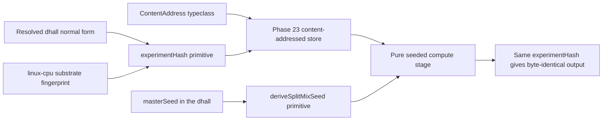

# Phase 24: Determinism kernel

**Status**: Authoritative source
**Supersedes**: N/A
**Referenced by**: DEVELOPMENT_PLAN/README.md, DEVELOPMENT_PLAN/overview.md, DEVELOPMENT_PLAN/phase_23_content_store_workflow.md, DEVELOPMENT_PLAN/phase_25_jitbuild_engine_cache.md, DEVELOPMENT_PLAN/phase_26_infernix_lift.md, DEVELOPMENT_PLAN/phase_27_jitml_lift_cuda.md, DEVELOPMENT_PLAN/system_components.md
**Generated sections**: none

> **Purpose**: Land the three determinism-kernel primitives — the `ContentAddress` typeclass, the
> `experimentHash = sha256(resolved-dhall ‖ substrate-fingerprint)` run identity, and the SplitMix seed
> derivation — and prove on live linux-cpu that a self-contained seeded workload reproduces byte-identical
> output under one `experimentHash` while any changed input changes the hash.

---

## Phase Status

📋 Planned. Nothing in this phase is implemented; every sprint below is 📋 Planned and every prescriptive
statement is design intent, never a tested amoebius result. The phase runs on the **linux-cpu** substrate in
**Register 3** (live infrastructure): a single-node `kind` cluster brought up by the Phase 13 midwife, using
the content-addressed store and workflow runtime landed in Phase 23. The `experimentHash` and SplitMix shapes
are already exercised in the sibling `jitML` project (`jitML/src/JitML/Checkpoint/Format.hs`,
`jitML/src/JitML/Engines/Rng.hs`); read that as **sibling evidence, not an amoebius result** — amoebius has
not yet built the kernel layer. Status transitions are recorded reverse-chronologically here once work begins.

## Phase Summary

This phase turns the content-addressed store delivered in Phase 23 into a reusable **determinism kernel** and
proves it against a minimal, self-contained workload. It does three things and stops there. First, it lifts
Phase 23's concrete blob/manifest key renderers into a kernel-level `ContentAddress` typeclass, so the rule
that *a content-derived name cannot be forged* is one reusable primitive rather than a per-store copy. Second,
it implements the `experimentHash` run identity — a total function of the resolved `.dhall` normal form and the
live linux-cpu substrate fingerprint — so two runs share a store namespace only when they are genuinely the
same experiment on the same substrate. Third, it implements the SplitMix seed derivation that gives every
stream a seed that is a pure function of `(masterSeed, streamIndex)` alone, independent of worker count,
scheduling, and assignment.

The scope deliberately stops at the kernel primitives and one live reproducibility proof. The gate workload is
a small seeded compute stage — a pinned content-addressed input, a pure stage, and a request-carried derived
seed — deliberately **not** an infernix inference run (that lift is Phase 26) and **not** a jit-resolved ML
engine (the `CacheBudget`-bounded engine cache is Phase 25); the kernel must be proven before either extension
rides it. The substrate fingerprint is gathered by full-path subprocess probes on the live host, never from
`PATH` or environment variables, and the substrate is folded into identity precisely because cross-substrate
bit-equality is not guaranteed — this phase asserts same-substrate reproducibility and refuses to claim
cross-substrate byte-equality. The kernel primitives are pure; the store bytes they name live in the
Vault-enveloped MinIO bucket that is the stateless `replicas=1` control-plane singleton's only durable state.

**Substrate:** linux-cpu — the whole gate runs on a single-node `kind` cluster on a linux-cpu host in
Register 3 (live infrastructure); no apple, linux-cuda, or windows substrate is touched, and cross-substrate
behaviour is explicitly out of contract, while nothing about deriving `experimentHash` or a SplitMix seed
requires live infrastructure (those stay pure, Registers 1–2).

**Register:** 3 — live infrastructure (§K).

**Gate:** `experimentHash = sha256(resolved-dhall ‖ substrate-fingerprint)` together with SplitMix seed
derivation reproduce **byte-identical output on the same linux-cpu substrate** — the gate workload runs twice
under an unchanged `experimentHash` and produces byte-for-byte equal output, while a deliberately changed input
(the resolved `.dhall`, the substrate fingerprint, or a flipped metric direction) yields a **different**
`experimentHash`, occupies a different store namespace, and is allowed to differ; the run emits a
proven/tested/assumed ledger recording that same-substrate reproduction was *tested* and cross-substrate
equality was *not asserted*.

## Doctrine adopted

This phase is the first live amoebius realization of the content-addressing/determinism contract. Each bullet
names the section it implements; individual sprints cite the same sections where they adopt them.

- [`content_addressing_doctrine.md §2`](../documents/engineering/content_addressing_doctrine.md#2-the-three-tier-store-blobs--manifests--pointers)
  — *the three-tier store (blobs ← manifests ← pointers)*: the `ContentAddress` typeclass lifts Phase 23's
  `blobs/<sha256>` / `manifests/<sha256>` key renderers into a kernel primitive, keeping the
  `If-None-Match: *` / `412 = success` write protocol owned by the store.
- [`content_addressing_doctrine.md §3`](../documents/engineering/content_addressing_doctrine.md#3-experimenthash-identity-is-what-was-requested--where-it-ran)
  — *`experimentHash`: identity is what was requested ‖ where it ran*: the run identity folds the resolved
  `.dhall` normal form and the substrate fingerprint into one digest, so a flipped metric direction or a
  different substrate is a different experiment in a different namespace.
- [`content_addressing_doctrine.md §4`](../documents/engineering/content_addressing_doctrine.md#4-determinism-by-construction-pinned-inputs--pure-stages--derived-seed)
  — *determinism by construction: pinned inputs + pure stages + derived seed*, with its pinned-input leg
  ([§4.1](../documents/engineering/content_addressing_doctrine.md#41-leg-one--pinned-content-addressed-inputs)),
  its derived-seed leg (§4.3), and the totality argument
  ([§4.4](../documents/engineering/content_addressing_doctrine.md#44-what-the-types-make-these-total-cashes-out-to)):
  this phase implements the three legs as kernel primitives and wires them through one live workload.
- [`content_addressing_doctrine.md §6`](../documents/engineering/content_addressing_doctrine.md#6-the-honest-ceiling-types-make-the-bookkeeping-total-not-the-physics-deterministic)
  — *the honest ceiling: types make the bookkeeping total, not the physics deterministic*: the contract stays
  at same-substrate reproducibility; cross-substrate bit-equality is deliberately not asserted and the ledger
  never marks it green.
- [`substrate_doctrine.md`](../documents/engineering/substrate_doctrine.md) §L — *the no-env / no-`PATH`,
  full-path-probe substrate contract*: the linux-cpu substrate fingerprint consumed by `experimentHash` is
  gathered by absolute-path subprocess probes only, never from `PATH` or environment variables.
- [`illegal_state_catalog.md`](../documents/illegal_state/illegal_state_catalog.md) §4.5 — *the totality
  technique*: there is no constructor for a store key from a free string and no inhabitant of "a seed read from
  ambient entropy"; these are states that cannot be written down, not states fixed at runtime.

## Sprints

## Sprint 24.1: `ContentAddress` typeclass kernel primitive 📋

**Status**: Planned
**Implementation**: `src/Amoebius/Kernel/ContentAddress.hs` (target path; not yet built)
**Blocked by**: Phase 23 gate (the three-tier content-addressed store whose blob/manifest key renderers this
typeclass lifts); Phase 10 gate (the `chain`/`Step` kernel the primitive plugs into)
**Independent Validation**: a property test (pure, in-process, no cluster) shows the typeclass admits no
constructor that produces a key from a free string — every `ContentAddress` value is reachable only by hashing
real bytes — and that two logically-equal payloads derive the identical key across a canonical-encoding fuzz.
**Docs to update**: `documents/engineering/content_addressing_doctrine.md`, `DEVELOPMENT_PLAN/system_components.md`, this document.

### Objective
Adopt [`content_addressing_doctrine.md §2 — the three-tier store`](../documents/engineering/content_addressing_doctrine.md#2-the-three-tier-store-blobs--manifests--pointers)
and the totality argument in [`§4.4`](../documents/engineering/content_addressing_doctrine.md#44-what-the-types-make-these-total-cashes-out-to):
lift Phase 23's concrete blob/manifest key renderers into a kernel-level `ContentAddress` typeclass so that
"a content-derived name cannot be forged" is a single reusable primitive shared later by both infernix
(Phase 26) and jitML (Phase 27), not a per-store copy.

### Deliverables
- A `ContentAddress a` typeclass whose only key-producing operation is `sha256(canonical-bytes a)`, with a
  canonical-encoder requirement so equal logical content yields byte-identical keys.
- Newtyped `BlobSha` / `ManifestSha` carriers with no public constructor from a free `Text`.
- Adapters binding the typeclass to Phase 23's `blobs/<sha256>` and `manifests/<sha256>` writers — the
  `If-None-Match: *`, `412 = success` protocol stays owned by the store.

### Validation
1. Type-level: there is no exported function that fabricates a SHA from an arbitrary string; the only path to a
   `BlobSha` / `ManifestSha` is `contentAddress`.
2. Property: `contentAddress x == contentAddress y` whenever `x` and `y` are logically equal, across a
   randomized canonical-encoding fuzz.

### Remaining Work
The whole sprint (📋 Planned).

## Sprint 24.2: `experimentHash` identity over the live substrate fingerprint 📋

**Status**: Planned
**Implementation**: `src/Amoebius/Kernel/ExperimentHash.hs` (target path; not yet built)
**Blocked by**: Sprint 24.1; Phase 13 gate (substrate detection — the linux-cpu substrate fingerprint gathered
by full-path probes); Phase 4 gate (the resolved-`.dhall` normal form)
**Independent Validation**: unit tests prove `experimentHash` is a pure function of `(resolved-dhall,
substrate-fingerprint)` and re-derives identically across re-evaluation; a live full-path probe gathers the
linux-cpu fingerprint with no env/`PATH` read and folds to a stable digest.
**Docs to update**: `documents/engineering/content_addressing_doctrine.md`, `documents/engineering/substrate_doctrine.md`, `DEVELOPMENT_PLAN/system_components.md`.

### Objective
Adopt [`content_addressing_doctrine.md §3 — experimentHash: identity is what was requested ‖ where it ran`](../documents/engineering/content_addressing_doctrine.md#3-experimenthash-identity-is-what-was-requested--where-it-ran):
implement the run identity that folds the resolved program and the substrate fingerprint into one digest,
consuming the Phase-4 normal form and the Phase-13 full-path substrate probe, per the substrate doctrine's
no-env/no-`PATH` contract.

### Deliverables
- `deriveExperimentHash :: ResolvedDhall -> SubstrateFingerprint -> ExperimentHash` =
  `sha256(resolved-dhall ‖ substrate-fingerprint)`, with the fingerprint gathered by full-path subprocess
  probes, never from environment or `PATH`.
- The store namespace key `<experimentHash>/…` wired so two genuinely different runs — including a flipped
  metric direction or a different substrate fingerprint — cannot collide.

### Validation
1. `experimentHash` changes when any of the resolved `.dhall`, the substrate fingerprint, or a metric direction
   changes; it is stable across re-evaluation of the same inputs.
2. The linux-cpu fingerprint is gathered only by absolute-path probes; no probe reads `PATH` or an environment
   variable, and two probes of the same host fold to the same digest.

### Remaining Work
The whole sprint (📋 Planned).

## Sprint 24.3: SplitMix seed derivation, worker-count-independent 📋

**Status**: Planned
**Implementation**: `src/Amoebius/Kernel/Rng.hs` (target path; not yet built)
**Blocked by**: Phase 10 gate (the `chain`/`Step` kernel this primitive is called from); Phase 1 gate (the
pinned toolchain that carries the `splitmix` dependency)
**Independent Validation**: unit tests prove `deriveSplitMixSeed` returns the same stream seed for a given
`(masterSeed, streamIndex)` regardless of how many workers or in what order they are simulated, and that no seed
reads wall-clock, a worker id, or ambient entropy (pure, in-process, no cluster).
**Docs to update**: `documents/engineering/content_addressing_doctrine.md`, `DEVELOPMENT_PLAN/system_components.md`.

### Objective
Adopt the derived-seed leg of [`content_addressing_doctrine.md §4 — determinism by construction`](../documents/engineering/content_addressing_doctrine.md#4-determinism-by-construction-pinned-inputs--pure-stages--derived-seed)
(§4.3) and its totality argument in [`§4.4`](../documents/engineering/content_addressing_doctrine.md#44-what-the-types-make-these-total-cashes-out-to):
implement the SplitMix seed derivation that is independent of worker count, scheduling, and assignment, with a
per-stream seed reachable only through one total function.

### Deliverables
- `deriveSplitMixSeed :: SplitMixSeed -> Word64 -> SplitMixSeed` with SplitMix64 mixing and the golden-ratio
  gamma (`0x9E3779B97F4A7C15`), exposing a per-stream seed reachable only through this total function.
- A type discipline in which "a stream with no seed" and "a seed read from ambient entropy" have no inhabitant
  — a seed is reachable only from a typed `(SplitMixSeed, Word64)`.

### Validation
1. A simulated 1-worker vs 100-worker dispatch in arbitrary order seeds stream `37` identically every time.
2. No seed reads wall-clock, a worker id, or `/dev/urandom`; the derivation is a pure function of
   `(masterSeed, streamIndex)` alone.

### Remaining Work
The whole sprint (📋 Planned).

## Sprint 24.4: The live same-substrate reproducibility gate 📋

**Status**: Planned
**Implementation**: `src/Amoebius/Kernel/Determinism.hs`, `test/dhall/phase_24_determinism_repro.dhall`, `test/live/DeterminismReproSpec.hs` (target paths; not yet built)
**Blocked by**: Sprint 24.1; Sprint 24.2; Sprint 24.3; Phase 23 gate (the content store + workflow runtime the
gate workload runs on); Phase 13 gate (the live single-node `kind` cluster and the substrate fingerprint)
**Independent Validation**: a `.dhall` workflow runs a minimal seeded compute stage twice on linux-cpu, stores
its output as a content-addressed blob, asserts byte-identical output under an unchanged `experimentHash`,
asserts a divergent `experimentHash` and a distinct store namespace for any changed input, and emits a
proven/tested/assumed ledger artifact.
**Docs to update**: `documents/engineering/content_addressing_doctrine.md`, `DEVELOPMENT_PLAN/README.md`, `DEVELOPMENT_PLAN/substrates.md`.

### Objective
Adopt [`content_addressing_doctrine.md §4 — determinism by construction`](../documents/engineering/content_addressing_doctrine.md#4-determinism-by-construction-pinned-inputs--pure-stages--derived-seed)
end-to-end and hold the honest ceiling in [`§6`](../documents/engineering/content_addressing_doctrine.md#6-the-honest-ceiling-types-make-the-bookkeeping-total-not-the-physics-deterministic):
wire the three legs — a pinned content-addressed input
([`§4.1`](../documents/engineering/content_addressing_doctrine.md#41-leg-one--pinned-content-addressed-inputs)),
a pure stage, and a request-carried derived seed — through one self-contained seeded workload, deliberately
without an infernix inference run (Phase 26) or a jit-resolved engine (Phase 25), and prove same-substrate
reproducibility as the phase gate without overclaiming cross-substrate equality.

### Deliverables
- A pure seeded compute stage (`Determinism.hs`) taking a content-addressed input, a request, and a derived
  SplitMix seed, with all I/O at the interpreter boundary.
- The gate `.dhall` (`test/dhall/phase_24_determinism_repro.dhall`) that spins up the Phase-23 workflow, runs
  the stage twice, stores each output as a content-addressed blob under its `experimentHash` namespace, tears
  down, and compares outputs.
- A ledger artifact recording: identity/seed totality as **proven-in-types**, same-substrate reproduction as
  **tested on linux-cpu**, and cross-substrate bit-equality as **explicitly not asserted**, matching the
  doctrine's proven/tested/assumed table.

### Validation
1. Two runs with the same `experimentHash` on linux-cpu produce byte-identical output.
2. Changing the resolved `.dhall`, the substrate fingerprint, or a metric direction produces a different
   `experimentHash`; the run is allowed to differ and does not collide in the store namespace.
3. The ledger artifact is emitted and marks no cross-substrate claim green.

### Remaining Work
The whole sprint (📋 Planned).

## Documentation Requirements

**Engineering docs to update (when the gate runs, flip the honest layer, never before):**
- `documents/engineering/content_addressing_doctrine.md` — the §6 proven/tested/assumed table gains an
  amoebius-tested linux-cpu same-substrate reproducibility datapoint alongside the existing sibling-evidence
  rows (status is recorded here in the plan, never as doctrine status); add the kernel module paths
  (`ContentAddress`/`ExperimentHash`/`Rng`/`Determinism`) to the doctrine's cross-reference set.
- `documents/engineering/substrate_doctrine.md` — record that the linux-cpu substrate fingerprint consumed by
  `experimentHash` is first exercised here, gathered by full-path probes with no env/`PATH` read.

**Cross-references to add:**
- `DEVELOPMENT_PLAN/README.md` — flip the Phase-24 status when the gate passes; link this document.
- `DEVELOPMENT_PLAN/substrates.md` — record Phase 24's gate substrate (linux-cpu) in the per-phase substrate map.
- `DEVELOPMENT_PLAN/system_components.md` — register `src/Amoebius/Kernel/ContentAddress.hs`,
  `src/Amoebius/Kernel/ExperimentHash.hs`, `src/Amoebius/Kernel/Rng.hs`, `src/Amoebius/Kernel/Determinism.hs`,
  and the `DeterminismReproSpec` live suite as Phase-24 design-first rows.

## Related Documents
- [README.md](README.md) — the live tracker and phase ordering this document sits under
- [development_plan_standards.md](development_plan_standards.md) — the rulebook this document obeys
- [overview.md](overview.md) — the target architecture and cross-cutting invariants (content-addressed names,
  the substrate folded into identity, the honest reproducibility ceiling)
- [system_components.md](system_components.md) — the target component inventory for the kernel module paths above
- [Content Addressing & Determinism Doctrine](../documents/engineering/content_addressing_doctrine.md) — the
  three-tier store, the `experimentHash` identity, the three determinism legs, and the honest ceiling adopted here
- [Substrate Doctrine](../documents/engineering/substrate_doctrine.md) — the no-env/no-`PATH`, full-path-probe
  substrate fingerprint that `experimentHash` consumes
- [Illegal-State Catalog](../documents/illegal_state/illegal_state_catalog.md) — the totality technique that makes
  a forged content name and an ambient-entropy seed unrepresentable
- [phase_23](phase_23_content_store_workflow.md) — the content store + workflow runtime this phase lifts and runs on
- [phase_25](phase_25_jitbuild_engine_cache.md) — the jit-build engine resolver + `CacheBudget` cache that rides this kernel next
- [phase_26](phase_26_infernix_lift.md) — the infernix lift whose CPU-inference reproducibility reuses this kernel
- [Engineering Doctrine Index](../documents/engineering/README.md) — the doctrine suite these phases adopt
