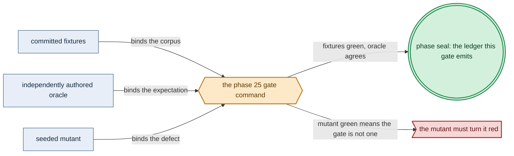
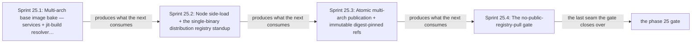

# Phase 25: Typed bake catalog + multi-arch base image + jit-build resolver + distribution registry

> **Purpose**: Build the multi-arch amoebius base image — every third-party service binary plus the shared
> jit-build resolver and its toolchain, but no ML engine payloads — and publish it atomically into the
> in-cluster single-binary `distribution` registry so the live cluster pulls only from itself.
> **Read this if**: phase 25 is next in the queue, or a later phase depends on what its gate establishes.

Phase 25 delivers the multi-arch base image + jit-build resolver + distribution registry; its design is owned by [image_build_doctrine.md](../documents/engineering/image_build_doctrine.md), [resource_capacity_types.md](../documents/engineering/resource_capacity_types.md), [platform_services_doctrine.md](../documents/engineering/platform_services_doctrine.md), and the plan for reaching it is owned here.
Register 3, live, on the `linux-cpu` substrate.
All four sprints and the complete Phase-25 Register-3 gate are sealed.

> **Historical result (invalidated).** Any pass, seal, validation, ledger, receipt, or implementation observation
> in the orientation text above is diagnostic only. The Phase Status section and [tracker](README.md) own current state; the
> target contract below remains normative.

Link-graph metadata

**Status**: Authoritative source
**Supersedes**: N/A
**Referenced by**: DEVELOPMENT_PLAN/README.md, DEVELOPMENT_PLAN/later_phases.md, DEVELOPMENT_PLAN/legacy_tracking_for_deletion.md, DEVELOPMENT_PLAN/overview.md, DEVELOPMENT_PLAN/phase_26_object_reconciler.md, DEVELOPMENT_PLAN/phase_27_capacity_scheduler.md, DEVELOPMENT_PLAN/phase_30_platform_backbone.md, DEVELOPMENT_PLAN/phase_40_ui_program_release.md, DEVELOPMENT_PLAN/phase_46_provider_ebs_credential.md, DEVELOPMENT_PLAN/phase_48_determinism_jitcache.md, DEVELOPMENT_PLAN/system_components.md, documents/engineering/testing_doctrine.md
**Generated sections**: none

## Contents
- [Phase Status](#phase-status)
- [Phase Summary](#phase-summary)
- [Gate integrity](#gate-integrity)
- [Doctrine adopted](#doctrine-adopted)
- [Sprints](#sprints)
- [Sprint 25.1: Multi-arch base image bake — services + jit-build resolver/toolchain, not engine payloads ⏸️](#sprint-251-multi-arch-base-image-bake--services--jit-build-resolvertoolchain-not-engine-payloads-)
- [Sprint 25.2: Node side-load + the single-binary `distribution` registry standup ⏸️](#sprint-252-node-side-load--the-single-binary-distribution-registry-standup-)
- [Sprint 25.3: Atomic multi-arch publication + immutable digest-pinned refs ⏸️](#sprint-253-atomic-multi-arch-publication--immutable-digest-pinned-refs-)
- [Sprint 25.4: The no-public-registry-pull gate ⏸️](#sprint-254-the-no-public-registry-pull-gate-)
- [Documentation Requirements](#documentation-requirements)
- [Related Documents](#related-documents)

---

## Phase Status

⏸️ Blocked by the reopened numeric sequence. Reopened 2026-08-11: the prior seal did not include the universal artifact-hygiene
postcondition. This phase returns to numeric order only after Phase 0 closes, then must rerun its capability
gate against its source snapshot and publish external evidence without changing an authored path.

**Invalidated historical record:**

✅ Complete. Validated 2026-08-09 on substrate `linux-cpu` in Register 3 with
`python3 tools/phase25_gate.py`; ledger
`dynamically-resolved`.
This phase follows the completed Phase 24 gate (the Python `pb` bootstrap coordinator + substrate detect + an empty
single-node `kind` cluster) and runs on the **linux-cpu** substrate in **Register 3** — a live gate on real
infrastructure. Where a later, still-unvalidated shape below is already exercised in a
sibling system — prodbox's `local_registry_pipeline.md` (mirror-into-registry, deterministic tags, retry-then-fail-loud
publication), hostbootstrap's baked-binary asset map (Go/helm/mc/pulumi installed by absolute path), and
jitML's engine resolver — that is **sibling evidence, not an amoebius result**; infernix's per-engine
Poetry-venv + `curl`-tar-at-build is the shape this phase deliberately **replaces**, not inherits. Status
transitions are recorded reverse-chronologically here once work begins.

- **2026-08-09 — Phase 25 and Sprint 25.4 complete.** An enforcing node-level IP/CIDR firewall resolved all
  eight committed public-registry endpoint names into 35 observed IPv4 addresses and installed 70
  OUTPUT/FORWARD drop rules. Under that boundary, an exact digest-pinned pull from the in-cluster registry
  completed and executed while the paired `docker.io/library/busybox:1.36.1` `PullAlways` canary reached
  `ErrImagePull`/`ImagePullBackOff` at a containerd connection timeout. The firewall recorded 34 dropped
  packets; the packet observer recorded zero established public connections; prior standup/publication
  captures also recorded zero, and publication's second run remained zero writes. A vanilla kindnet
  `NetworkPolicy` negative control allowed the public pull and therefore turned the committed no-op-policy
  mutant red. Receipt: `sprint-25.4-receipt.json`, fingerprint
  `external-run-reference`. The phase ledger keeps the
  Phase-26 reconciler correspondence and Phase-30 MinIO storage rehome `UNVERIFIED`.
- **2026-08-09 — Sprint 25.3 complete.** The exclusive proxy admitted only the snapshot-bound capability,
  exact repository, 139 digest/size pairs, two-upload limit, and one immutable source/content tag. A
  registry-boundary fault interrupted an arm64 blob after 1 MiB: the tag API omitted the tag, manifest GET
  returned 404, and 1,048,812 residue bytes remained charged. Retry reused 71 resident objects, published the
  exact audited 649-byte index in one final advertisement, and resolved both architectures under digest
  `sha256:99aad…ecf54`; the second run made zero mutating registry requests. A node-scoped packet capture of
  1,121,911 packets plus containerd logs observed zero public-registry access, and the committed
  record-before-push mutant went red. The implementation stages the already-audited OCI archive directly and
  makes its byte-exact raw index PUT the atomic commit point; rebuilding it merely to spell `buildx --push`
  would create a second artifact and cannot prove publication of the Sprint-25.1 bytes. The typed Buildx
  command shape and ephemeral `docker --config`/empty-environment boundary remain independently tested.
  Receipt: `sprint-25.3-receipt.json`, fingerprint
  `dynamically-resolved`.
- **2026-08-09 — Sprint 25.2 complete.** A read-only snapshot admitted the selected `linux/amd64` OCI
  content/snapshots/import workspace and the complete registry/proxy CPU, memory, ephemeral, pod-slot, and
  digest-keyed storage transition against one finite unified node backing. The exact image index was streamed
  into node containerd without a registry pull; the fixed six-object bootstrap domain then ran three
  containers with `PullNever` from that digest. Live readback proved registry GET 200, direct mutation 405,
  unauthorized proxy mutation 403, publication deferred to Sprint 25.3 with 409, and zero public-registry
  connections in containerd logs and a node-scoped packet capture. Both committed Sprint-25.2 mutants turned
  red. The first storage-oracle arithmetic, backing-alias observation, direct-backend read-only assumption,
  and loopback readiness probe each went red and were corrected rather than waived. Receipt:
  `sprint-25.2-receipt.json`, fingerprint
  `dynamically-resolved`.
- **2026-08-09 — Sprint 25.1 complete.** The bounded `linux/amd64` + `linux/arm64` build produced one audited
  OCI image index, executed all 46 architecture-specific official files, emitted 46 deterministic SPDX
  records, proved CPU/RSS/scratch/cache enforcement, and turned eight seeded mutants red. The live validation
  first rejected the undersized 48 GiB scratch declaration; the corrected catalog declares a 96 GiB scratch
  provision and 32 GiB cache-write peak. Receipt:
  `sprint-25.1-receipt.json`, image index
  `dynamically-resolved`.

## Phase Summary

This phase turns the empty `kind` cluster delivered by Phase 24 into a cluster that pulls only from itself. It
delivers the **multi-arch base image** — every third-party platform-service binary (the `distribution`
registry, MinIO, Vault, Pulsar, **Redis (`redis-server`/Sentinel mode plus `redis-cli`)**, Keycloak,
Prometheus/Grafana, Patroni/Percona Postgres, Envoy, MetalLB, and
the rest) baked in by the supply-chain preference ladder (apt → official binary/tarball → build-from-source,
including a multi-arch Temurin JRE for the JVM services), **plus the shared jit-build resolver and its build toolchain** (`nvcc`, `g++`, the pinned compilers, and any linux cross-tooling — **not** the Apple-Metal bridge,
which is a headless on-host Mach-O dylib produced only on the **apple** substrate at
[Phase 53](phase_53_apple_metal_host_daemon.md), never a linux ELF here). The ML **engine payloads**
(`llama.cpp`, `whisper.cpp`, the ONNX runtime, Audiveris, the adapters) are the deliberate exception: each is a
**named catalog identity** the shared jit-build resolver materializes on first miss into the
`CacheBudget`-bounded content-addressed cache — none is baked and none is authored by URL. The image is built
as **one `buildx` OCI manifest list** covering `linux/amd64` and `linux/arm64`, side-loaded onto the node, and
**published atomically** into the in-cluster single-binary `distribution` registry (which replaces Harbor), the
sole in-cluster pull source.

The host-side `buildx`/BuildKit execution is itself provisioned. A pure `BuildExecutionEnvelope` declares an
acyclic platform/stage graph with per-stage CPU/memory reservation+ceiling, intermediate bytes, and cache-write
delta, named scratch/cache backings, and separate finite architecture/stage concurrency. A read-only, snapshot-bound host
preflight proves the expanded multi-arch build peak fits current residual supply before the first builder
process; the resulting `ImageArtifact` is a separate logical node-storage provision and cannot substitute for
this execution envelope.

The scope deliberately stops at *baking the image and publishing it fail-closed with no public pull*. The typed
SSA reconciler that will eventually own the registry is a Phase 26 concern; `no-provisioner` retained storage
is Phase 28 and MinIO is Phase 30. Phase 25 is an explicit bootstrap cycle-break, not a resource or render
exception. `provisionBootstrapRegistry` binds the complete registry/proxy execution, storage, and node-image
import demand against the Phase-24 topology and returns an opaque `ProvisionedBootstrapRegistry`. A fresh
read-only snapshot may then mint exactly one `BootstrapRegistryAction`: side-load the image and initialize
only the registry/proxy Kubernetes objects from that provision's identity-keyed sources. The action uses the
same package-private Phase-13 source serializer, but neither constructs a minimal `ProvisionedServiceSpec` nor
exposes public per-service render/apply; public manifest generation remains only
`renderAll :: ProvisionedSpec -> [K8sObject]`.

The bootstrap object's source/field digest is retained as
`BootstrapRegistryWholeDeploymentHandoffIdentityDigest`. When Phase 26 first constructs the complete
whole-deployment `ProvisionedSpec`, it may adopt those exact identities only after live readback proves source
and owned-field equality; a typed one-time ownership handoff then moves them into normal whole-deployment
reconciliation without two writers or an implicit delete/recreate. The interim node-local filesystem blob
store is a bounded disk-backed `emptyDir`, and the side-loaded base image is admitted against the physical
backing selected by the node's declared filesystem layout—shared with nodefs under `Unified`, imagefs under
`SplitRuntime`.
The MinIO-backed S3 driver and reconciler-owned apply are later-phase targets, honestly,
not built here. Vault does not yet exist
(Phase 29), so host-only **read** access is credential-free on the node. Mutation is already exclusive: the
registry backend listens on a proxy-private socket, and the sole mutating proxy accepts only the
snapshot-bound publisher capability plus the provisioned digest/size/concurrency set. Direct or unexpected
`POST`/`PATCH`/`PUT` requests are denied before storage mutation; the later Vault credential hardens identity
transport but is not the capacity boundary. The proxy is an ordinary resource-bearing execution unit: its
admission cost model derives a complete image/CPU/memory/ephemeral/log/writable/replica/rollout
`PodResourceEnvelope`, which must place alongside the registry before the private socket is exposed.

Registry storage is not an unexplained blob allowance. The built manifest list has a canonical
`RegistryStoredArtifact` description keyed by registry digest: compressed/stored layer bytes, config bytes,
child-manifest bytes, and manifest-list bytes are all explicit objects. A `RegistryStorageDemand` combines
those desired objects with finite upload concurrency, a versioned model that derives upload workspace, and a
finite failed-upload rate window/GC exposure plus the closed mutation-admission model. Provisioning unions the
desired digests with the independently observed resident digest map,
rejects conflicting byte metadata for one digest, keeps every observed resident charged until deletion is
observed, derives the stored-object plus transient upload/partial extent set, and returns the private
`ProvisionedRegistryStorageDemand` and admission witness used for the interim filesystem volume/proxy.
There is no caller-authored aggregate or registry-budget shortcut.

**Substrate:** linux-cpu ([§L](development_plan_standards.md#l-one-substrate-discipline)) — the whole gate runs
on a single-node `kind` cluster in the CPU-only Linux lane. **Every detected hardware substrate can supply
this lane**: native Linux (or Incus when a pristine Linux host is required), Lima on Apple, and WSL2 on
Windows. An accelerator-bearing host does not expose its accelerator to this gate. Thus Phase 25 exercises
no specialized Apple-Metal or CUDA lane; `linux-cpu` does not constrain the physical host to CPU-only native
Linux. This is a **Register 3** (live-infrastructure) gate.

**Register:** 3 — live infrastructure ([§K](development_plan_standards.md#k-honesty-proven--tested--assumed)).

**Gate:** on the single-node linux-cpu `kind` cluster, the multi-arch base image — carrying every third-party
service binary and the jit-build resolver + its toolchain, but **no** ML engine payload — is built as one
`buildx` OCI manifest list covering `linux/amd64` and `linux/arm64`, side-loaded onto the node, and **published atomically** (all-or-nothing; a partial-arch push leaves the tag un-advertised) into the in-cluster
single-binary `distribution` registry, with a deny-all egress test to `docker.io`/`quay.io`/`ghcr.io` proving
**zero public-registry pulls** during registry standup or publication and both arches resolving under the one
digest-pinned tag.

The required service inventory explicitly includes Redis. Both architectures must execute
`/usr/bin/redis-server --version` and `/usr/bin/redis-cli --version` at the independently pinned version; the
SBOM/file-digest inventory must contain both paths, and a rendered Redis or Sentinel pod may reference only
this published base-image digest, never an upstream Redis image.

The gate's oracles are pinned and committed in **Phase 0**, before any implementation exists (§M.1), and are
listed in [Gate integrity](#gate-integrity) below; every equivalence check names an
independent reference side (§M.3) and every negative asserts its specific failure reason (§M.8). The gate is
not passed unless, in addition to the above:
- **Builder execution admitted, not assumed:** before the first `buildx`/BuildKit process, an independent
  host/engine-VM observer validates the pure `BuildExecutionEnvelope` against residual CPU, memory, named
  scratch and cache backings, observed cache residents + derived concurrent cache-write delta, and both
  `archConcurrency` and `stageConcurrency` peaks. The
  token is fingerprint-bound and single-use; CPU, memory, scratch, cache, concurrency, unknown-commitment, and
  changed-snapshot negatives execute zero builder processes and perform zero build-cache/scratch writes.
- **Bootstrap cycle-break is typed and narrow:** Phase 25 constructs no minimal `ProvisionedServiceSpec` and
  calls no public service renderer. The snapshot-bound `BootstrapRegistryAction` may side-load one provisioned
  image and initialize only the exact registry/proxy identity domain with its declared initialized fields.
  An independent export/domain oracle proves `renderAll` is the only public manifest renderer, proves the
  action's serialized identities equal its `ProvisionedBootstrapRegistry` keys, and proves a later
  whole-deployment adoption succeeds only after equal identity/source/owned-field digest readback and only
  once. A domain expansion, digest mismatch, stale snapshot, or second handoff performs zero imports and zero
  apiserver writes.
- **Inventory reconciled, not self-authored (§M.1/§M.3/§M.7):** the "every third-party service binary" set is
  the oracle-pinned **canonical standard-platform-services inventory** — the `DEVELOPMENT_PLAN/README.md`
  standard-platform-services list as ratified in
  [`platform_services_doctrine.md`](../documents/engineering/platform_services_doctrine.md), copied verbatim
  into the committed fixture `test/fixtures/phase25/bake_inventory_expected.dhall` — and the bake-inventory
  lint reconciles the image's contents against **that** committed table automatically, never against the
  implementer's own `BakeInventory` value.
- **Per-arch execution, not presence (§M.5):** each baked service binary and each **linux-runnable** toolchain
  binary (`nvcc`/`g++`/pinned compilers + any linux cross-tooling) is executed **on each arch** — natively for
  the host arch and under `binfmt`/QEMU for the non-native arch — by **absolute path** with its independently
  pinned harmless probe. A native version endpoint must print the oracle-pinned version; where an upstream
  executable has no version endpoint (currently MetalLB controller/speaker and the Percona operator), the
  probe executes its real diagnostic path and the release identity is independently joined through the pinned
  OCI index digest and measured file/SBOM digest. Each arch's layer also passes an ELF `e_machine` check
  proving its binaries are genuinely that arch's (not amd64 bytes copied into the arm64 layer). The Apple-Metal
  bridge is **excluded** from this linux per-arch/ELF check — it is a headless on-host Mach-O dylib produced
  only on the **apple** substrate at [Phase 53](phase_53_apple_metal_host_daemon.md) (never a linux ELF in phases 0..18; a Mach-O dylib can never satisfy a linux `e_machine` check), where its `/usr/bin/clang`
  source-build + `dlopen` probe is validated; Phase 25 owns no such sub-clause and carries **no forward dependency** on Phase 53 ([§L](development_plan_standards.md#l-one-substrate-discipline), one-substrate).
- **Enforcement proven by negative control (§M.8):** under the *same* egress policy, a canary pod referencing
  `docker.io/library/busybox` **FAILS `ImagePull`** (its committed expected failure reason: `ErrImagePull` /
  `ImagePullBackOff` from a connection-timeout to the public endpoint), paired with the positive that the
  in-cluster `distribution` pull of the same shape succeeds — foreclosing the unenforced-`NetworkPolicy`
  no-op by forcing an enforcing CNI or node-level host firewall into the harness.
- **OS-boundary observation (§M.5):** "zero public-registry pulls" is read from an **observer at the OS boundary** — the `kind` node's `containerd` logs plus a node-level packet capture (`tcpdump`/eBPF) spanning
  the entire standup-and-publish window — asserting **zero** TCP connections to the resolved endpoints of
  `docker.io`/`quay.io`/`ghcr.io` (the concrete set in [Gate integrity](#gate-integrity)); never a
  compliance trace the publisher emits about itself. The denial scope covers in-cluster registry standup,
  publication, and pull; the **host-side `buildx` build legitimately reaches upstream** ([§2](../documents/engineering/image_build_doctrine.md#2-the-single-distribution-rule-bake-the-binaries-build-the-amoebius-image-pull-only-in-cluster)/[§9](../documents/engineering/image_build_doctrine.md#9-bring-up-ordering--the-registry-chicken-and-egg-dissolves)) and is
  explicitly outside the denied boundary.
- **Atomicity observed at the registry boundary (§M.3/§M.8):** the partial-arch failure is induced by a
  **fault-injecting proxy** in front of the registry that fails one arch's blob/manifest upload **mid-push**
  (never an exception thrown inside amoebius's own publisher), and "un-advertised" is asserted via the
  registry HTTP API — `GET /v2/<repo>/tags/list` **omits** the tag and the manifest-list `GET` returns
  **404** — not by inspecting amoebius's own published-set record.
- **Registry bytes admitted from provenance, not a scalar allowance:** the oracle-pinned stored-artifact
  metadata independently enumerates every compressed layer, config, child manifest, and manifest-list object
  by digest and exact stored bytes. Snapshot admission derives the digest-deduplicated
  `resident ∪ new` extent, the largest bounded set of simultaneous upload workspaces, and all partial
  upload residue that can overlap before finite GC. A digest/size conflict or a volume one byte below that
  derived transition returns a tagged rejection before the publisher makes any registry request.
- **Idempotence as zero writes (§M.6):** "re-run is a no-op" is defined as **zero mutating requests**
  (`PUT`/`POST`/`PATCH`) in the registry access log during the second run — not merely exit-0-twice or a
  permitted full rebuild-and-re-push.
- **Committed seeded mutants (§M.2):** the mutants named in [Gate integrity](#gate-integrity) are committed and
  re-run each gate pass and **must go red**.

## Gate integrity

Per [`development_plan_standards.md` §M](development_plan_standards.md#m-gate-integrity-a-gate-cannot-be-passed-by-a-stub),
the oracles below are authored and **committed in this phase's oracle-pinning sprint** — before the Phase 25 implementation exists — and
their reference sides are defined independently of the code under test. This section is the phase doc's explicit
"representative set" (§M.7).

*Design intent. Phase 25's gate apparatus; [§M](development_plan_standards.md#m-gate-integrity-a-gate-cannot-be-passed-by-a-stub) owns its clauses.*

**Pinned oracles (oracle-pinned):**
- `test/fixtures/phase25/bake_inventory_expected.dhall` — the canonical standard-platform-services inventory
  (a verbatim copy of the `DEVELOPMENT_PLAN/README.md` standard-platform-services list as ratified in
  [`platform_services_doctrine.md`](../documents/engineering/platform_services_doctrine.md)) with each
  per-arch absolute-path probe and pinned release identity; authored independently of `BakeInventory` (§M.3). The
  pinned set covers the **linux-runnable** jit-build toolchain (`nvcc`/`g++`/pinned compilers + any linux
  cross-tooling) as well as the service binaries, and deliberately **omits** the Apple-Metal bridge — an
  apple-substrate Mach-O dylib pinned and probed at Phase 53, never a linux ELF here.
- `test/fixtures/phase25/build_execution_envelope.dhall` — the per-stage host/engine-VM CPU, memory,
  intermediate/cache-write operands, scratch/build-cache backings, and architecture/stage-concurrency bounds
  plus the independently calculated transition peak and
  expected per-axis rejection tags. It is authored before `BuildExecutionEnvelope`/BuildKit admission code.
- `test/fixtures/phase25/image_artifact_bounds.json` — independent finite upper bounds for OCI index,
  child-manifest, config, compressed-layer, unpacked-layer, and import-workspace bytes. The measurement gate
  hashes and sizes the produced layout before admitting it against these bounds.
- `test/fixtures/phase25/registry_storage_demand.dhall` — the independently authored
  `RegistryStoredArtifact` table (compressed layer blobs, configs, child manifests, and manifest-list object),
  observed-resident overlap, upload concurrency/model-derived workspace, failed-upload residue/GC horizon, exact-fit and
  one-byte-under expected verdicts, plus the expected digest-size-conflict tag. It is authored before the
  registry admission/publisher code and is reused unchanged by Phase 30's MinIO rehome.
- `test/fixtures/phase25/bootstrap_registry_domain.dhall` — the independently authored registry/proxy
  Kubernetes identity set, initialized-field ownership partition, canonical source/field digest, and expected
  one-time whole-deployment handoff verdicts (equal, one-field mismatch, stale snapshot, repeated transfer).
  It is authored before `ProvisionedBootstrapRegistry` or `BootstrapRegistryAction` exists.
- `test/fixtures/phase25/public_registry_endpoints.txt` — the concrete public-registry endpoint set the
  OS-boundary observer asserts zero connections to: `registry-1.docker.io`, `auth.docker.io`,
  `production.cloudflare.docker.com`, `quay.io`, `cdn.quay.io`, `ghcr.io`, `pkg-containers.githubusercontent.com`
  (and their resolved IP CIDRs at gate time).
- `test/fixtures/phase25/expected_pull_failure.txt` — the negative-control canary's expected reason
  (`ErrImagePull`/`ImagePullBackOff`, connection-timeout to the public endpoint), paired with the positive
  in-cluster pull that must succeed (§M.8).

**Committed seeded mutants (each MUST go red at the named gate, §M.2):**
- `mutant/phase25/stub-arm64-binary` — a zero-byte binary at a baked path; red at Sprint 25.1 (execution +
  ELF check).
- `mutant/phase25/wrong-arch-layer` — amd64 bytes placed in the arm64 layer; red at Sprint 25.1 (`e_machine`
  check).
- `mutant/phase25/gxx-version-skew` — the baked `g++` shimmed (path: `/usr/bin/g++`; operator:
  `--version`-string patch-decrement) to report a version one patch below its oracle-pinned
  `bake_inventory_expected.dhall` entry; red at Sprint 25.1's per-arch `<bin> --version` match, paired with the
  positive that the pinned `g++ --version` matches on both arches (§M.2). This gives the linux-runnable
  toolchain set (`nvcc`/`g++`/pinned compilers) its version-match teeth; the Apple-Metal bridge is not a linux
  binary and is exercised only at Phase 53 (apple).
- `mutant/phase25/drop-build-scratch-accounting` — omits intermediate-layer workspace from host build
  admission; red at Sprint 25.1's zero-builder-process overdraw fixture.
- `mutant/phase25/bootstrap-domain-expansion` — lets the bootstrap action initialize an object outside its
  provisioned registry/proxy domain; red at Sprint 25.2's exact-domain/zero-write assertion.
- `mutant/phase25/handoff-without-equality` — adopts bootstrap objects into the later whole deployment without
  equal identity/source/owned-field digest readback; red at Sprint 25.2's ownership-handoff assertion.
- `mutant/phase25/record-before-push` — records the tag as published before the manifest list lands; red at
  Sprint 25.3 (registry-API un-advertised assertion).
- `mutant/phase25/noop-egress-policy` — a vanilla unenforced `kindnetd` `NetworkPolicy` substituted for the
  enforcing firewall; red at Sprint 25.4 (negative-control canary must fail `ImagePull`).

## Doctrine adopted

- [`image_build_doctrine.md` §7 — what amoebius bakes vs builds: the base container is the supply chain](../documents/engineering/image_build_doctrine.md#7-what-amoebius-bakes-vs-builds--the-base-container-is-the-supply-chain):
  the central adoption — the base image bakes every third-party **service binary** and the **jit-build resolver + toolchain**, while the ML **engine payloads** are jit-resolved on first miss and never baked; the
  amoebius runtime image (GHC 9.12.4) is the one image amoebius *builds* — **this phase bakes and publishes the amoebius binary alone**; infernix and jitML are linked into the runtime image only when their lifts land (the
  image is rebuilt and republished at [Phase 49](phase_49_infernix_lift.md) /
  [Phase 51](phase_51_jitml_lift_cuda.md), never here), so Phase 25 carries no forward dependency on the
  extension lifts. The amoebius binary's own UI-server surface travels with it: the compiled generic
  PureScript client bundle from [Phase 21](phase_21_ui_browser_interpreter.md) is a **baked asset of this
  image**, not a second image — the UI server is a worker responsibility of the same executable, and a UI
  release is release *data* ([Phase 40](phase_40_ui_program_release.md)), never an image build. That is
  inside "the amoebius binary alone": it is product surface, not an ML engine payload.
- [`image_build_doctrine.md` §2 — the single distribution rule: bake the binaries, build the amoebius image, pull only in-cluster](../documents/engineering/image_build_doctrine.md#2-the-single-distribution-rule-bake-the-binaries-build-the-amoebius-image-pull-only-in-cluster):
  the in-cluster `distribution` registry (replacing Harbor) is the sole pull source, and no workload ever pulls
  from a public registry.
- [`image_build_doctrine.md` §3 — buildx multi-arch: `amd64` and `arm64`, one manifest list](../documents/engineering/image_build_doctrine.md#3-buildx-multi-arch--amd64-and-arm64-one-manifest-list):
  one `docker buildx` invocation builds both arches as a single OCI manifest list under one tag.
- [`image_build_doctrine.md` §4 — atomic publication: a partial multi-arch upload is a failed upload](../documents/engineering/image_build_doctrine.md#4-atomic-publication--a-partial-multi-arch-upload-is-a-failed-upload):
  fail-closed atomic publication — the single `--push` lands the complete manifest list or the tag stays
  un-advertised, and re-run is idempotent.
- [`image_build_doctrine.md` §5 — versioning vs `:latest`](../documents/engineering/image_build_doctrine.md#5-versioning-vs-latest--development_plan-decision-recommended-default-immutable-never-latest)
  and [`§8` — build mechanics under the no-env / no-`PATH` contract](../documents/engineering/image_build_doctrine.md#8-build-mechanics-under-the-no-env--no-path-contract):
  immutable, digest-pinned refs (never `:latest` as a deployment reference) and the ephemeral
  `docker --config` build mechanics with no environment variable and no `docker login`.
- [`resource_capacity_types.md` §3.1 — the systematic provision matrix](../documents/engineering/resource_capacity_types.md#31-the-systematic-provision-matrix):
  host build execution is a first-class `BuildExecutionEnvelope` whose snapshot-bound CPU/memory/scratch/
  cache/concurrency admission is separate from the resulting `ImageArtifact`'s node image-store fit.
- [`image_build_doctrine.md` §9 — bring-up ordering: the registry chicken-and-egg dissolves](../documents/engineering/image_build_doctrine.md#9-bring-up-ordering--the-registry-chicken-and-egg-dissolves):
  the registry is itself a baked binary, so the base image is loaded before the cluster serves and there is no
  pre-registry public-pull window to bootstrap.
- [`platform_services_doctrine.md` §3 — the registry, the single image source](../documents/engineering/platform_services_doctrine.md#3-the-registry--the-single-image-source):
  the `distribution` registry as a standard service, reached at the host-only registry endpoint.
- [`content_addressing_doctrine.md` §4.5 — the ML asset lifecycle: one bounded content-addressed cache, resolved on first miss](../documents/engineering/content_addressing_doctrine.md#45-the-ml-asset-lifecycle-one-bounded-content-addressed-cache-resolved-on-first-miss):
  the reversal this phase upholds — engine payloads are named catalog identities resolved into a
  `CacheBudget`-bounded content-addressed cache, with no arbitrary-`Url` arm, never OCI-baked.
- [`testing_doctrine.md` §2 — the registers of amoebius testing](../documents/engineering/testing_doctrine.md#2-the-registers-of-amoebius-testing):
  this phase's gate reaches **Register 3** (live infrastructure) and emits a proven/tested/assumed ledger
  naming that register.

## Sprints

> **Current revalidation rule.** Every sprint is blocked by the reopened numeric sequence. Historical dates,
> pass/seal claims, repository-resident evidence paths, and `Remaining Work: None` statements below describe
> the pre-amendment capability record only; they do not override current status. Functional and validation
> outcomes remain target requirements. Any instruction to commit generated output, freeze dependency resolution,
> retain a resolved version, path, or integrity hash, or consume repository-resident evidence, ledgers, or
> enumerations is superseded by the current generated-artifact and dynamic-resolution doctrine. Closure requires
> the current phase gate plus universal artifact hygiene.

*Orientation. The seams Phase 25 builds, in order; [Gate integrity](#gate-integrity) owns the apparatus. Sprint 25.1 is sealed; the registry/bootstrap/publication seams have not run.*

## Sprint 25.1: Multi-arch base image bake — services + jit-build resolver/toolchain, not engine payloads ⏸️

**Status**: Blocked by the reopened numeric sequence; prior capability footprint retained for migration
`python3 tools/phase25_sprint25_1_gate.py`; 10 checks passed with gate identity
`external-run-reference` and receipt
`sprint-25.1-receipt.json`.
**Implementation**: `dhall/amoebius/BakeCatalog.dhall` (the **typed source of truth** —
each stage's `NonEmpty BakeStep` with its per-arch pinned versions), `src/Amoebius/Image/BakeInventory.hs`
(decoding that catalog into the `BuildExecutionEnvelope`), `src/Amoebius/Image/RenderDockerfile.hs`
(`renderDockerfile :: BuildExecutionEnvelope -> Dockerfile`, pure and total), `src/Amoebius/Image/Build.hs`
plus `BuildAdmission.hs`, `BuildRuntime.hs`, `Artifact.hs`, and `Resolver.hs`; the consolidated gate and
independent OCI/SBOM/execution/cgroup/ENOSPC/mutation probes live under `tools/phase25_*.py` — built and
validated. **`docker/base/Dockerfile` is no longer committed**: it is a generated
artifact emitted from the catalog and stamped generated-by, per
[`generated_artifacts_doctrine.md` §2](../documents/engineering/generated_artifacts_doctrine.md#2-what-is-generated-and-from-what).
**Blocked by**: reopened numeric predecessor gates.
**Independent Validation**: `docker buildx imagetools inspect <tag>` lists both
`linux/amd64` and `linux/arm64` under one manifest list; a bake-inventory lint asserts the image contains
**every** service binary named in the oracle-pinned canonical inventory
`test/fixtures/phase25/bake_inventory_expected.dhall` (a verbatim copy of the `DEVELOPMENT_PLAN/README.md`
standard-platform-services list as ratified in `platform_services_doctrine.md`, reconciled **automatically**
against that committed table — never against the implementer's own `BakeInventory` value, §M.3) and the
jit-build resolver + its **linux-runnable** toolchain (`nvcc`/`g++`/pinned compilers + any linux
cross-tooling — the Apple-Metal bridge is **not** baked here; it is an apple-substrate Mach-O dylib built
and probed at [Phase 53](phase_53_apple_metal_host_daemon.md), never a linux ELF in phases 0..18) and
contains **no** ML engine payload (`llama.cpp`/`whisper.cpp`/ONNX/Audiveris absent). Presence alone is
insufficient (§M.5): for **each** arch — natively for the host arch and under `binfmt`/QEMU for the
non-native arch — every baked binary is executed by **absolute path** with the independently declared probe
in `bake_inventory_expected.dhall`; version-capable binaries match the pinned version and the documented
non-version diagnostics join execution to the pinned OCI/SBOM release identity. Each arch's layer passes an ELF `e_machine` check
confirming its binaries carry that arch's machine type (foreclosing zero-byte stubs and amd64 bytes copied
into the arm64 layer). The committed seeded mutants `mutant/phase25/stub-arm64-binary` (a zero-byte binary
at a baked path), `mutant/phase25/wrong-arch-layer` (amd64 bytes in the arm64 layer), and
`mutant/phase25/gxx-version-skew` (the baked `/usr/bin/g++` shimmed to report a `--version` one patch below
its pinned `bake_inventory_expected.dhall` entry) MUST turn this lint red (§M.2) — the last giving the
per-arch `<bin> --version` match its teeth, paired with the positive that the pinned `g++ --version` matches
on both arches. The same independent validation begins before `buildx`: a read-only host/engine-VM snapshot
validates the declared `BuildExecutionEnvelope` — the closed stage graph's per-stage CPU/memory,
intermediate scratch and cache-write operands, observed resident cache + derived concurrent write delta, and
independent `archConcurrency`/`stageConcurrency` — and returns a single-use token required to start
BuildKit. One-field overdraw and changed-snapshot fixtures start no builder and write no scratch/cache.
**Docs to update**: `documents/engineering/image_build_doctrine.md`,
`documents/engineering/content_addressing_doctrine.md`,
`documents/engineering/resource_capacity_doctrine.md`,
`documents/engineering/ui_realtime_coordination_doctrine.md`.

### Objective
Adopt [`image_build_doctrine.md` §7 — what amoebius bakes vs builds](../documents/engineering/image_build_doctrine.md#7-what-amoebius-bakes-vs-builds--the-base-container-is-the-supply-chain)
and [§3 — buildx multi-arch, one manifest list](../documents/engineering/image_build_doctrine.md#3-buildx-multi-arch--amd64-and-arm64-one-manifest-list):
bake every third-party service binary by the apt → official-binary → build-from-source ladder (including a
multi-arch Temurin JRE for the JVM services) **and** the shared jit-build resolver + its build toolchain, while
holding the ML engine payloads out of the image as named catalog identities resolved on first miss into the
`CacheBudget`-bounded cache ([`content_addressing_doctrine.md` §4.5](../documents/engineering/content_addressing_doctrine.md#45-the-ml-asset-lifecycle-one-bounded-content-addressed-cache-resolved-on-first-miss)) —
the shape jitML's resolver evidences and infernix's `curl`-tar-at-build is *sibling evidence being replaced*.

### Deliverables
- A multi-arch base `Dockerfile` baking each platform binary by the supply-chain preference order, plus the
  jit-build resolver and its toolchain layer; the amoebius runtime image built at GHC 9.12.4 shipping the
  amoebius binary alone (infernix and jitML are linked into the runtime image only when their lifts land, at
  [Phase 49](phase_49_infernix_lift.md) / [Phase 51](phase_51_jitml_lift_cuda.md), never here, so Phase 25
  carries no forward dependency on the extension lifts).
- A mandatory Redis bake entry with a pinned per-architecture package identity. It installs
  `/usr/bin/redis-server` (used for server and Sentinel modes) and `/usr/bin/redis-cli`, records their digests
  in the inventory/SBOM, and admits no startup download or public `redis` image fallback.
- A pure `BuildExecutionEnvelope` plus
  `observeBuildHost → deriveBuildTransition → validate → ValidatedBuildTarget` boundary. It includes
  a non-empty acyclic platform/stage graph with per-stage host/engine-VM CPU/memory reservation+ceiling,
  intermediate-layer and cache-write peaks, a named `BuildScratch` backing, a named bounded cache backing whose
  currently resident bytes plus derived concurrent writes remain charged until observed GC, and separate
  `Serial | BoundedParallel n` architecture and stage concurrency. `buildx`/BuildKit cannot start without
  consuming the unchanged-snapshot token.
- A `docker buildx --platform linux/amd64,linux/arm64` build producing **one** OCI manifest list per tag.
- A content-digested `ImageArtifact` for that list: exact index bytes; one child digest, child-manifest size,
  and config digest/size per OS/arch; each layer's blob digest, compressed bytes, snapshot chain id, and
  unpacked bytes; and peak import workspace. The build measures those values independently and must fit the
  Phase-0-declared upper bounds; a missing platform/object entry, digest-size conflict, or oversized result
  fails before node import/publication.
- The corresponding canonical `RegistryStoredArtifact`, derived exactly from that `ImageArtifact`: each
  compressed layer blob, config, child manifest, and index/manifest-list object is keyed by its registry digest,
  kind-tagged, and carries exact stored bytes. It is a distinct registry-storage projection from the same pure
  provenance, not a second caller-authored aggregate and not an estimate reconstructed from unpacked layers.
- The **typed bake catalog** `dhall/amoebius/BakeCatalog.dhall`: every stage's `content : NonEmpty BakeStep`
  with its per-arch pinned versions, decoded by `BakeInventory` into the `BuildExecutionEnvelope`. The union is
  closed with **no `RunShell : Text` arm and no `Url` arm**
  ([`image_build_doctrine.md` §6](../documents/engineering/image_build_doctrine.md#6-host-build-vs-in-pod-build--development_plan-decision-recommended-default-host-builder-for-v1)),
  so an interpolated shell fragment or an operator-supplied download address is unrepresentable rather than
  discouraged — closing [`illegal_state_lifecycle.md` §3.76](../documents/illegal_state/illegal_state_lifecycle.md#376-a-build-stage-whose-content-is-unmodeled).
- `renderDockerfile`, emitting the previously hand-authored `ARG`/`RUN … install` blocks from that catalog, plus
  a **byte-for-byte golden** pinning the emitted Dockerfile as a fixture of the *renderer's* behaviour. The
  Dockerfile is not committed as source; the catalog is.
- A bake-inventory lint proving the resolver/toolchain are present and every ML engine payload is **absent**.
- An architecture-native Redis probe on both image platforms: absolute-path `redis-server --version` and
  `redis-cli --version` match the independent catalog pin, and the committed `mutant/phase25/omit-redis`
  plus `mutant/phase25/redis-version-skew` each turn the gate red.
- The oracle-pinned oracle `test/fixtures/phase25/bake_inventory_expected.dhall` (the canonical
  standard-platform-services set + pinned per-arch versions) and the committed
  mutants `mutant/phase25/stub-arm64-binary`, `mutant/phase25/wrong-arch-layer`,
  `mutant/phase25/gxx-version-skew` (the pinned-`g++`-version-skew that bites the per-arch `<bin> --version`
  match), `mutant/phase25/drop-build-scratch-accounting`, and
  `mutant/phase25/dockerfile-handedit` (an edit to the *generated* Dockerfile that the catalog does not
  license) — which MUST turn the emitted-Dockerfile golden red.

  **The oracle stays independent after the promotion.** `BakeInventory` becomes a decode of the committed
  catalog rather than a hand-maintained Haskell asset map, so the §M.3 obligation — reconcile the image
  against the Phase-0 table, **never** against the implementer's own value — now requires that
  `bake_inventory_expected.dhall` remain a *separately authored* copy of the ratified
  standard-platform-services list, not an import of `BakeCatalog.dhall`. An oracle that imports the source it
  checks is not a test.

### Validation
1. Independently occupy or shrink one of build CPU, memory, intermediate scratch, or cache backing; make
   `observed cache residents + concurrent stage cache writes` exceed the budget/backing by one byte; exceed
   bounded architecture or stage concurrency; inject an unknown host commitment; and change the fingerprint after
   validation. Each case returns its exact error with zero `buildx`/BuildKit processes and zero scratch/cache
   writes. The fitting envelope produces one token. An independent BuildKit/cgroup/engine-VM configuration
   reader proves the exact CPU/RSS policy and scratch/cache roots match the provision witness; deliberate
   CPU, RSS, scratch, and cache-write overrun stages are throttled, terminated/OOM-killed, or receive bounded-
   filesystem `ENOSPC` within the declared provision, with no spill outside named backings. A mutant that
   launches an unbounded BuildKit worker must turn these OS-boundary assertions red.
2. `docker buildx imagetools inspect <tag>` lists both `linux/amd64` and `linux/arm64` under one manifest list.
3. Independently inspect and hash every OCI index, child manifest, config, compressed blob, and unpacked
   snapshot; require exact agreement with `ImageArtifact`. Re-derive `RegistryStoredArtifact` from that value
   and require the digest/kind/stored-byte map to equal the Phase-0 oracle; a missing object or conflicting
   size for one digest fails before import or publication.
4. The bake-inventory lint is green **against the committed `bake_inventory_expected.dhall`** (services +
   resolver + toolchain present, engine payloads absent), reconciled automatically — not against the SUT's own
   inventory.
5. For each arch (host arch native; non-native under `binfmt`/QEMU), every baked binary runs by absolute path
   with its pinned harmless probe; native version endpoints match the pinned version, documented non-version
   diagnostics join to the pinned OCI/SBOM identity, and each arch layer passes the ELF `e_machine` check.
6. The committed mutants `mutant/phase25/stub-arm64-binary`,
   `mutant/phase25/wrong-arch-layer`, `mutant/phase25/gxx-version-skew` (the pinned-`g++`-version-skew that
   makes Validation 5's `<bin> --version` match bite), and `mutant/phase25/drop-build-scratch-accounting` turn
   the validation red (§M.2).
7. Run both Redis binaries from each architecture by absolute path, verify their pinned versions and SBOM
   digests, and prove that the generated Redis/Sentinel workload image identity is the published
   monocontainer/base-image digest. The omit/version-skew/public-image mutants fail for their specific reasons.

### Remaining Work
None. Sprint 25.1 is sealed by
`sprint-25.1-receipt.json`; Sprint 25.2 consumes its audited OCI
artifact. The first live build's 48 GiB scratch admission proved too small and was cancelled before OCI
export; the corrected 96 GiB provision and 32 GiB cache-write peak passed the complete gate rather than
waiving the red result.

## Sprint 25.2: Node side-load + the single-binary `distribution` registry standup ⏸️

**Status**: Blocked by the reopened numeric sequence; prior capability footprint retained for migration
`sprint-25.2-receipt.json`.
**Implementation**: `src/Amoebius/Image/{NodeLoad,Registry,BootstrapRegistry}.hs` (pure
bootstrap provision, snapshot validation, and the typed side-load/object-initialize action); package-private
`src/Amoebius/Manifest/Render.hs` supplies the same source serializer Phase 13 uses; live admission/import/
standup and OS-boundary observation are implemented by `tools/phase25_{bootstrap_preflight,registry_standup}.py`.
**Blocked by**: reopened numeric predecessor gates.
**Independent Validation**: before import or object
initialization, a registry-specific read-only snapshot preflight re-observes CPU request/finite-limit-policy
residual, memory/logical-ephemeral request+ceiling residual, pod slots, blob-volume capacity and its
resident digest/byte map, the nodefs/imagefs/containerfs layout and capacities, all resident containerd OCI
content plus committed/active snapshots, the pinned node-image model, and the enforced pull policy.
`provisionBootstrapRegistry` first constructs the opaque resource-complete `ProvisionedBootstrapRegistry`;
validation then derives the layout-routed import+registry+mutation-proxy transition and returns a
snapshot-bound single-use `BootstrapRegistryAction` required by both containerd import and initialization of
the exact registry/proxy object domain. The registry side binds the canonical `RegistryStorageDemand` to the
snapshot: it unions observed residents with every desired compressed layer/config/manifest object by digest,
debits equal digests once, rejects unequal stored-byte metadata for one digest, adds the largest permitted
simultaneous upload workspaces, and retains the bounded partial-upload residue through the finite GC
horizon. One-field occupied-CPU, occupied-memory, registry/proxy pod-slot or resource shortage,
registry-volume/ephemeral-overdraw, digest-size-conflict, content/snapshot-byte-over, layout-alias, and
pull-policy-mismatch fixtures perform zero imports and zero apiserver writes. A
domain/identity/source-digest or initialized-field mismatch also mints no action. The admitted
`distribution` pod and sole mutation proxy then run **from the on-node image** with zero registry pull and
complete provisioned envelopes: per-container CPU/memory/ephemeral requests+limits and private allowances,
plus a disk-backed blob volume whose `sizeLimit` covers the derived peak recorded in the opaque
`ProvisionedRegistryStorageDemand`; shared volume + private allowance fit the pod ephemeral request/limit
and route to the selected physical filesystem. The host-only endpoint resolves through the per-distro
wiring; Phase 30 preserves this private demand's `objectSet`, `derivedPeak`, and upload/orphan witness while
migrating its backend to MinIO. "Zero registry pull" is read from an **OS-boundary observer** (§M.5) — the
node's containerd logs plus a node-level packet capture spanning the standup window — asserting no
image-layer fetch and no TCP connection to the resolved endpoints of `docker.io`/`quay.io`/`ghcr.io`
([Gate integrity](#gate-integrity)), never a self-emitted trace.
**Docs to update**:
`documents/engineering/image_build_doctrine.md`, `documents/engineering/platform_services_doctrine.md`.

### Objective
Adopt [`image_build_doctrine.md` §2 — the single distribution rule](../documents/engineering/image_build_doctrine.md#2-the-single-distribution-rule-bake-the-binaries-build-the-amoebius-image-pull-only-in-cluster),
[§9 — the registry chicken-and-egg dissolves](../documents/engineering/image_build_doctrine.md#9-bring-up-ordering--the-registry-chicken-and-egg-dissolves),
and [`platform_services_doctrine.md` §3 — the registry, the single image source](../documents/engineering/platform_services_doctrine.md#3-the-registry--the-single-image-source):
stand up the single-binary `distribution` registry as the sole in-cluster pull source. Because the SSA
reconciler (Phase 26), retained storage (Phase 28), and MinIO (Phase 30) do not yet exist, the registry comes up
through the resource-provisioned, snapshot-bound `ProvisionedBootstrapRegistry` → `BootstrapRegistryAction`
cycle-break against bounded interim node-local blob storage. The action initializes only the exact
registry/proxy object domain through Phase 13's package-private serializer; it is not a minimal
whole-deployment spec and creates no public service-render boundary.
[§9](../documents/engineering/platform_services_doctrine.md#9-the-loadbalancer-and-the-single-wild-ingress-path)'s dissolution holds — the registry is a baked binary, so there is no pre-registry public-pull window.

### Deliverables
- A registry-specific pure/live boundary:
  `provisionBootstrapRegistry → observeBootstrapRegistryInventory → validateBootstrapRegistryTarget →
  BootstrapRegistryAction → enactBootstrapRegistry → BootstrapRegistryEnactmentResult`. The action contains
  the exact `ValidatedBootstrapRegistryTarget`; the provision contains the exact image,
  pre-scheduler registry/proxy execution, registry storage, node import, identity-keyed sources, initialized-field
  ownership partition, and later-handoff digest. `ObservedBootstrapRegistryInventory` is the deliberately
  pre-scheduler snapshot—capacity, runtime roots/content/snapshots, residents, API versions, and sole-host
  bootstrap authority only; it cannot require the Phase-26 scheduler-ready/full managed inventory. The action
  is bound to those versions and carries a fingerprint-indexed fresh token. Import and object initialization
  are inaccessible without CAS-consuming it. Applied and ambiguous outcomes both return a consumed receipt;
  the latter exposes only re-observation. A changed snapshot replans, while any pre-CAS mismatch has zero
  effects.
- `ProvisionedBootstrapRegistryExecution` is a finite cycle-break, not ordinary
  `ProvisionedExecutionEpochs`: its registry and proxy controllers use the default scheduler only before
  managed admission exists, carry fixed-node affinity plus complete static reservations/quota, and are
  mandatory members of Phase 27's default→`amoebius-capacity` cutover. They cannot remain as a second
  default-scheduler writer domain after `ManagedCapacityReady`.
- A node side-load path that proves the selected-platform OCI content/snapshot/import peak plus every observed
  resident object/snapshot fits the layout-selected residual backing under the observed enforced pull policy,
  then imports the base image
  into the `kind` node's containerd (no public pull).
- A `ProvisionedBootstrapRegistry` whose `BootstrapRegistryAction` side-loads the selected image and initializes
  only the provisioned `distribution`/mutation-proxy object domain through the same private serializer used by
  Phase 13. There is no public `render :: ProvisionedServiceSpec -> …` or bootstrap `ProvisionedSpec`; public
  manifests still cross only `renderAll :: ProvisionedSpec -> [K8sObject]`. The registry is reachable at the host-only registry endpoint via the per-distro registry plumbing (owned by [`substrate_doctrine.md`](../documents/engineering/substrate_doctrine.md) §on host-node registry wiring — the `registries.yaml`/containerd-mirror rewrite), with explicit CPU/memory/ephemeral/private allowances and
  an interim filesystem-driver `emptyDir` whose `sizeLimit` covers the derived peak recorded in the private
  `ProvisionedRegistryStorageDemand` and whose volume/pod-request nesting is checked. The underlying
  `RegistryStorageDemand` contains canonical digest-keyed `RegistryStoredArtifact` metadata, finite upload
  concurrency, versioned model-derived upload workspace, finite failed-upload rate-window/GC exposure, and
  exclusive mutation admission; the private result retains exact resident objects plus structured transient
  extents for later MinIO geometry. Observed resident objects
  remain charged until an observer reports their deletion. The action retains a canonical identity/source/
  initialized-field digest. Phase 26 may adopt those exact objects into a later whole `ProvisionedSpec` only
  after equal live readback and a one-time typed ownership handoff; mismatch rejects without a second writer,
  apply, delete, or recreate. The backing is replaced by the MinIO S3 driver in Phase 30.
- A registry mutation-proxy demand derived from `RegistryMutationAdmission` concurrency/rate/metadata and its
  cost model. Its complete pod/image/CPU/memory/ephemeral/log/writable/replica transition envelope enters
  `BoundExecutionSet`; the registry backend has no mutating route or credential outside that proxy.

### Validation
1. Independently occupy CPU, memory, pod slot, pod ephemeral/blob volume, or image store, and mismatch the pull policy;
   each one-field negative must fail the snapshot preflight with zero containerd import and zero apiserver
   writes. Then admit the fitting selected-platform image, assert the `BootstrapRegistryAction` is single-use
   and contains exactly the provisioned registry/proxy identities, assert the `distribution` pod's serialized
   resource/blob-volume envelope and proxy envelope equal their provision witnesses, and assert the registry
   read endpoint plus proxy-private mutation path resolve. A case where the registry fits but the proxy is one
   CPU/memory/ephemeral unit or pod slot short rejects before either Deployment is applied.
   A fake later whole-deployment adoption with the equal handoff digest succeeds once without object
   recreation; a one-field identity/source/owned-field mismatch and a second transfer both reject with zero
   object writes.
2. Independently recompute the registry transition from the Phase-0 artifact table and an observed resident
   map. Cover a resident/new digest overlap (one debit), conflicting byte sizes for one digest, the maximum
   concurrent upload set, partial-upload residue just before its GC horizon, and a volume exactly one byte
   below the derived peak. Every conflict/overflow rejects before import, apply, or registry mutation; an
   object merely selected for deletion remains charged until a later snapshot observes it absent.
3. Assert no public-registry pull occurred during registry standup **from the OS-boundary observer** (node
   `containerd` logs + packet capture; zero TCP connections to the [Gate integrity](#gate-integrity) public
   endpoints), recorded for the Sprint 25.4 gate — never from a self-emitted compliance trace.

### Remaining Work
None. The corrected live gate is sealed by
`sprint-25.2-receipt.json`. Its red-before-correction records cover
the initially incorrect registry-union arithmetic, decorated bind-mount identity comparison, ineffective
backend read-only configuration, and unreachable loopback readiness probe. Atomic publication remains
exclusively Sprint 25.3 work; the admitted proxy therefore returns 409 for a valid publisher capability until
that next ordered sprint implements the mutation.

## Sprint 25.3: Atomic multi-arch publication + immutable digest-pinned refs ⏸️

**Status**: Blocked by the reopened numeric sequence; prior capability footprint retained for migration
`sprint-25.3-receipt.json`.
**Implementation**: `src/Amoebius/Image/Publish.hs`, `src/Amoebius/Image/Ref.hs` (the
snapshot-bound single-advertisement publisher + immutable, source/content-derived ref scheme), with the live
OCI protocol/fault/access-log harness in `tools/phase25_registry_publish.py`.
**Blocked by**: reopened numeric predecessor gates.
**Independent Validation**: one admitted publication stages digest-addressed objects and makes the byte-exact
raw manifest-list PUT its sole tag-advertisement commit point; the publisher
cannot begin without the unchanged-snapshot token carrying the private `ProvisionedRegistryStorageDemand`. A
digest-size conflict, retained partial-upload residue, or a backing exactly one byte below its
digest-deduplicated resident/new + workspace + failed-upload-GC peak returns the expected tagged rejection
with **zero mutating registry requests and no tag publication**. The fitting partial (one-arch) push is
induced by a **fault-injecting proxy** in front of the registry that fails one arch's blob/manifest upload
**mid-push** (§M.3 — a registry-boundary fault, never an exception thrown inside amoebius's own publisher),
and the tag is asserted **un-advertised at the registry HTTP API**: `GET /v2/<repo>/tags/list` omits the tag
and the manifest-list `GET` returns **404** (§M.8 — the observable is the registry's state, not amoebius's
own published-set record); the observed partial residue is charged in the next snapshot until GC is
observed. A re-run against a fully-published tag is a **no-op**, defined as **zero mutating requests**
(`PUT`/`POST`/`PATCH`) in the registry access log during the second run (§M.6 — not exit-0-twice, not a
permitted rebuild-and-re-push); refs are immutable digest-pinned (never `:latest` as a deployment
reference); the build uses an ephemeral `docker --config <dir>` with **no** environment variable and **no**
`docker login`. The committed mutant `mutant/phase25/record-before-push` (records the tag as published
before the manifest list lands) MUST turn the un-advertised assertion red (§M.2).
**Docs to update**:
`documents/engineering/image_build_doctrine.md`.

### Objective
Adopt [`image_build_doctrine.md` §4 — atomic publication](../documents/engineering/image_build_doctrine.md#4-atomic-publication--a-partial-multi-arch-upload-is-a-failed-upload),
[§5 — versioning vs `:latest`](../documents/engineering/image_build_doctrine.md#5-versioning-vs-latest--development_plan-decision-recommended-default-immutable-never-latest),
and [§8 — build mechanics under the no-env / no-`PATH` contract](../documents/engineering/image_build_doctrine.md#8-build-mechanics-under-the-no-env--no-path-contract):
publish the base-image manifest list into the registry as one indivisible artifact — fail-closed on a partial
arch, idempotent on re-run — under immutable digest-pinned refs, with the `buildx` binary full-path-invoked
against an ephemeral config directory. Vault does not yet exist (Phase 29), so host-only reads are
credential-free here; every mutation already traverses the sole proxy with the snapshot-bound publisher
capability and provisioned digest/size/concurrency policy. The Vault-sourced identity later hardens transport,
not capacity admission.

### Deliverables
- The publish path: a single `buildx … --push` of the manifest list that lands both arches or fails, recording
  the tag as published only when every target arch is present, and requiring the snapshot-bound registry
  provision token before its first mutating request.
- The immutable ref scheme: a deterministic source/content-derived tag consumed by digest; `:latest` is never a
  deployment reference.
- The no-env build mechanics: an ephemeral `docker --config <dir>` created per build and scrubbed afterward, the
  `docker`/`buildx` binary resolved to an absolute path via the substrate package manager (never `PATH`), no
  `docker login`; the ephemeral publisher capability is supplied over the private proxy channel, and the
  Vault `SecretRef` identity is flagged as the Phase-29+ transport-hardening target.
- The exclusive registry mutation proxy (the backend has no direct mutating route), with a fault-injecting
  mode that fails one arch's blob/manifest upload mid-push, and the committed mutant
  `mutant/phase25/record-before-push`, plus the registry access-log capture used for the zero-writes re-run
  assertion.

### Validation
1. A single push lands the complete manifest list; a **proxy-induced** one-arch mid-push failure leaves the tag
   un-advertised **at the registry HTTP API** (`tags/list` omits it; manifest-list `GET` 404s), and the next
   observed inventory reports the partial upload residue still charged before its finite GC horizon.
2. Give the preflight conflicting stored-byte metadata for one digest, the maximum failed-upload residue, and
   a backing one byte below the peak independently recorded in `ProvisionedRegistryStorageDemand`. Each
   returns its specific tagged rejection and the access log records zero `PUT`/`POST`/`PATCH` plus no tag;
   exact fit publishes.
   A direct backend mutation and a proxy mutation naming an unprovisioned digest/size are denied before
   storage changes; read-only host access remains available.
3. Re-run against a fully-published tag is a no-op, asserted as **zero `PUT`/`POST`/`PATCH` requests** in the
   registry access log during the second run; the ref is digest-pinned and never `:latest`.
4. The build uses the ephemeral config directory with no environment variable and no `docker login`.
5. The committed mutant `mutant/phase25/record-before-push` turns Validation 1 red (§M.2).

### Remaining Work
None. The complete pure/live/mutation gate is sealed by
`sprint-25.3-receipt.json`. Sprint 25.4 consumes its immutable
digest reference and the retained standup/publication OS-boundary captures; it still must install the
enforcing deny boundary and make the public-image canary fail while an in-cluster pull succeeds.

## Sprint 25.4: The no-public-registry-pull gate ⏸️

**Status**: Blocked by the reopened numeric sequence; prior capability footprint retained for migration
`python3 tools/phase25_sprint25_4_gate.py` on 2026-08-09;
receipt fingerprint `external-run-reference`.
**Implementation**: `src/Amoebius/Image/Gate.hs`, `tools/phase25_no_public_pull_gate.py`, and
`tools/phase25_sprint25_4_gate.py`.
**Blocked by**: reopened numeric predecessor gates.
**Independent Validation**:
the egress denial is realized as a **node-level host firewall / IP-CIDR blackhole** of the resolved
public-registry endpoints (or an enforcing-CNI FQDN policy) — **not** a vanilla `kindnetd` `NetworkPolicy`,
which `kindnetd` does not enforce and which cannot match FQDNs
([§M](development_plan_standards.md#m-gate-integrity-a-gate-cannot-be-passed-by-a-stub) ambiguity resolution). Its enforcement is proven by a **negative control** (§M.8): under the *same* policy, a canary
pod referencing `docker.io/library/busybox` **FAILS `ImagePull`** with the committed expected reason
(`ErrImagePull`/`ImagePullBackOff` from a connection-timeout to the public endpoint), paired with the
positive that an in-cluster `distribution` pull of the same shape succeeds. Under that enforced denial the
registry stands up and the base-image manifest list publishes and resolves with **zero** requests leaving
for a public registry, asserted from the **OS-boundary observer** (§M.5) — node `containerd` logs + a packet
capture spanning the entire standup-and-publish window, showing zero TCP connections to the resolved
endpoints of the [Gate integrity](#gate-integrity) public-registry set; never a self-emitted compliance
trace. The denial scope covers in-cluster standup/publication/pull; the **host-side `buildx` build is outside it** and legitimately reaches upstream
([§2](../documents/engineering/image_build_doctrine.md#2-the-single-distribution-rule-bake-the-binaries-build-the-amoebius-image-pull-only-in-cluster)/[§9](../documents/engineering/image_build_doctrine.md#9-bring-up-ordering--the-registry-chicken-and-egg-dissolves)).
Both `linux/amd64` and `linux/arm64` resolve under the one digest-pinned tag; a re-run of the whole build →
side-load → standup → publish flow is idempotent, defined as **zero mutating (`PUT`/`POST`/`PATCH`) requests** in the registry access log during the second run (§M.6 — not a permitted full
rebuild-and-re-push). The committed mutant `mutant/phase25/noop-egress-policy` (a vanilla unenforced
`NetworkPolicy` substituted for the enforcing firewall) MUST turn the negative-control assertion red (§M.2).
**Docs to update**: `documents/engineering/image_build_doctrine.md`,
`documents/engineering/testing_doctrine.md`.

### Objective
Adopt [`image_build_doctrine.md` §2](../documents/engineering/image_build_doctrine.md#2-the-single-distribution-rule-bake-the-binaries-build-the-amoebius-image-pull-only-in-cluster)
and [§4](../documents/engineering/image_build_doctrine.md#4-atomic-publication--a-partial-multi-arch-upload-is-a-failed-upload)
under [`testing_doctrine.md` §2 — Register 3](../documents/engineering/testing_doctrine.md#2-the-registers-of-amoebius-testing):
run the whole flow on the live `kind` cluster and prove no public-registry pull and atomic multi-arch
publication, then emit a Register-3 proven/tested/assumed ledger — the model↔runtime correspondence with the
later reconciler-owned rendering (Phase 26) and the MinIO-backed blob store (Phase 30) marked UNVERIFIED here.

### Deliverables
- The gate harness applying the **enforced** node-level egress denial (host firewall / IP-CIDR blackhole or
  enforcing-CNI FQDN policy), the `docker.io/library/busybox` negative-control canary, the OS-boundary observer
  (node `containerd` logs + packet capture), and the registry access-log capture; driving the build →
  side-load → standup → publish flow and asserting the negative-control `ImagePull` failure, zero public pulls
  from the observer, both-arch resolution, and zero-writes idempotent re-run.
- The committed oracle `test/fixtures/phase25/public_registry_endpoints.txt` (the concrete public-registry
  endpoint set the observer checks against) and the committed mutant `mutant/phase25/noop-egress-policy`.
- A Register-3 ledger naming the substrate (linux-cpu) and the register, attaching the OS-boundary observer
  evidence, with the interim-storage and reconciler-rehoming residue flagged UNVERIFIED, never green.

### Validation
1. The **enforced** egress denial breaks no registry standup, publication, or in-cluster pull, **while** the
   `docker.io/library/busybox` negative-control canary FAILS `ImagePull` (proving enforcement); zero public
   pulls are observed at the OS boundary (node `containerd` logs + packet capture) against the committed
   endpoint set.
2. Both `linux/amd64` and `linux/arm64` resolve under the one digest-pinned tag; the whole flow re-runs as a
   no-op, asserted as **zero mutating requests** in the registry access log during the second run.
3. The committed mutant `mutant/phase25/noop-egress-policy` (unenforced vanilla `NetworkPolicy`) turns
   Validation 1's negative-control assertion red (§M.2).

### Remaining Work
Migrate the pure/live/mutation receipt and acceptance ledger to `gen/runs/`, externally attest the bundle,
and rerun after Phase 24 closes. The later
reconciler-owned rendering correspondence and MinIO-backed registry storage correspondence remain
`UNVERIFIED` and are owned by Phases 26 and 30 respectively.

## Documentation Requirements

**Engineering docs to update (when the gate runs, flip the honest layer, never before):**
- `documents/engineering/image_build_doctrine.md` — the §2/§4 single-distribution and atomic-publication claims
  gain their first amoebius validation; the §5 (versioning) / §6 (host vs in-pod builder) decisions are recorded
  as taken; the §7 bake-vs-build split (services + resolver/toolchain baked, engine payloads not) is annotated
  as delivered on linux-cpu.
- `documents/engineering/ui_realtime_coordination_doctrine.md` — record that the Redis/Sentinel executables
  required by the later platform topology are present in both published architectures; no runtime HA claim is
  made by this build-only evidence.
- `documents/engineering/content_addressing_doctrine.md` — annotate §4.5 that the base image contributes the
  jit-build resolver + toolchain by OCI digest while the engine payloads remain content-addressed cache assets,
  resolved on first miss (the resolver's own live proof lands in Phase 48).
- `documents/engineering/resource_capacity_doctrine.md` — §3.1's host-build-as-first-class-provision claim
  gains its first validation: the `BuildExecutionEnvelope` snapshot admission runs on linux-cpu, separate from
  the resulting `ImageArtifact`'s node image-store fit.
- `documents/engineering/platform_services_doctrine.md` — the §3 registry-as-single-image-source note flips from
  design intent to a delivered `distribution` standup, with the MinIO-backed S3 driver still a Phase-30 target.
- `documents/engineering/testing_doctrine.md` — §2's register model records its first Register-3
  (live-infrastructure) gate reached on linux-cpu, with a proven/tested/assumed ledger naming that register.

**Cross-references to add:**
- `DEVELOPMENT_PLAN/README.md` — flip the Phase-25 row from Planned to its delivered status and link this document.
- `DEVELOPMENT_PLAN/substrates.md` — record Phase 25's gate substrate (linux-cpu) in the per-phase substrate map.
- `DEVELOPMENT_PLAN/system_components.md` — register `docker/base/Dockerfile`, `src/Amoebius/Image/*`, and the
  `distribution` registry standup as Phase-25 design-first rows, reconciled against the component inventory.

## Related Documents
- [README.md](README.md) — the live tracker and phase ordering this document sits under
- [development_plan_standards.md](development_plan_standards.md) — the rulebook this document obeys
- [substrates.md](substrates.md) — the substrate registry and per-phase substrate map
- [system_components.md](system_components.md) — the target component inventory for the module paths above
- [overview.md](overview.md) — the target architecture and cross-cutting invariants
- [Image Build & Registry](../documents/engineering/image_build_doctrine.md) — the baked-binary base container + `distribution` registry adopted here ([§2](../documents/engineering/image_build_doctrine.md#2-the-single-distribution-rule-bake-the-binaries-build-the-amoebius-image-pull-only-in-cluster), [§3](../documents/engineering/image_build_doctrine.md#3-buildx-multi-arch--amd64-and-arm64-one-manifest-list), [§4](../documents/engineering/image_build_doctrine.md#4-atomic-publication--a-partial-multi-arch-upload-is-a-failed-upload), [§5](../documents/engineering/image_build_doctrine.md#5-versioning-vs-latest--development_plan-decision-recommended-default-immutable-never-latest), [§7](../documents/engineering/image_build_doctrine.md#7-what-amoebius-bakes-vs-builds--the-base-container-is-the-supply-chain), [§8](../documents/engineering/image_build_doctrine.md#8-build-mechanics-under-the-no-env--no-path-contract), [§9](../documents/engineering/image_build_doctrine.md#9-bring-up-ordering--the-registry-chicken-and-egg-dissolves))
- [Content Addressing Doctrine](../documents/engineering/content_addressing_doctrine.md) — [§4.5](../documents/engineering/content_addressing_doctrine.md#45-the-ml-asset-lifecycle-one-bounded-content-addressed-cache-resolved-on-first-miss) the jit-resolved engine cache the base image does *not* bake
- [Platform Services Doctrine](../documents/engineering/platform_services_doctrine.md) — [§3](../documents/engineering/platform_services_doctrine.md#3-the-registry--the-single-image-source) the registry as the single in-cluster image source
- [UI Realtime Coordination](../documents/engineering/ui_realtime_coordination_doctrine.md) — the Redis/Sentinel
  runtime topology whose mandatory executables this phase bakes into the monocontainer
- [Substrate Doctrine](../documents/engineering/substrate_doctrine.md) — the per-distro registry plumbing and the lazy-tool-ensure contract the build obeys
- [Testing Doctrine](../documents/engineering/testing_doctrine.md) — [§2](../documents/engineering/testing_doctrine.md#2-the-registers-of-amoebius-testing) the registers (Register 3 reached here)
- [phase_24](phase_24_bootstrap_coordinator_kind.md) — the `pb` bootstrap coordinator + empty `kind` cluster this phase publishes into
- [phase_26](phase_26_object_reconciler.md) — the typed reconciler that adopts the equal-digest bootstrap
  objects into the first whole-deployment `ProvisionedSpec` through the one-time ownership handoff
- [phase_30](phase_30_platform_backbone.md) — the standard service stack whose MinIO backs the registry's S3-driver blob store
- [phase_48](phase_48_determinism_jitcache.md) — the live jit-build engine resolver + `CacheBudget` cache the toolchain here feeds
