# Phase 25: Content store + workflow runtime (Pulsar-Failover single-writer)

**Status**: Authoritative source
**Supersedes**: N/A
**Referenced by**: DEVELOPMENT_PLAN/README.md, DEVELOPMENT_PLAN/overview.md, DEVELOPMENT_PLAN/phase_24_pulsar_client.md, DEVELOPMENT_PLAN/phase_26_release_lifecycle.md, DEVELOPMENT_PLAN/phase_31_determinism_kernel.md, DEVELOPMENT_PLAN/phase_34_jitml_lift_cuda.md, DEVELOPMENT_PLAN/phase_36_test_topology_dsl.md, DEVELOPMENT_PLAN/system_components.md
**Generated sections**: none

> **Purpose**: Stand up amoebius's durable-artifact substrate — the three-tier content-addressed MinIO store —
> and the orchestrator/worker workflow runtime on top of the Phase-24 native Pulsar client, gated live on
> linux-cpu by a store/fetch-by-manifest-SHA round-trip whose active worker fails over to a Pulsar
> Failover standby with no bespoke election and a leak-free teardown.

---

## Phase Status

📋 Planned. Nothing in this phase is implemented; every sprint below is 📋 Planned and every prescriptive
statement is design intent, never a tested amoebius result. The phase runs on the **linux-cpu** substrate in
**Register 3** (live infrastructure) — a single-node `kind` cluster brought up by the Phase 14 midwife with
Pulsar and MinIO already standing as HA platform services (Phase 19) on retained storage (Phase 17), and it
opens only after the Phase 24 gate (the native-protocol Pulsar client, CBOR codec, four subscription types,
and broker-side dedup) closes, because the workflow runtime consumes that client rather than reimplementing a
transport. The three-tier store shape is proven in the sibling `jitML` checkpoint format
(`jitML/src/JitML/Checkpoint/Format.hs`) and the Failover-subscription worker path in the sibling `infernix`
ML-workflow runtime; read both as **sibling evidence, not an amoebius result** — amoebius has built neither
the store nor the workflow runtime. Status transitions are recorded reverse-chronologically here once work
begins.

## Phase Summary

This phase delivers the durable-artifact and workflow core that every later ML-workflow phase consumes, in two
composed pieces on one substrate. First, the **three-tier content-addressed MinIO store** — write-once
self-naming `blobs/<sha256>` and canonical-CBOR `manifests/<sha256>` under `If-None-Match: *` (with `412
Precondition Failed` treated as success), and the only mutable objects, `pointers/*`, advanced by an
`If-Match` compare-and-swap that is the single atomic commit point — keyed under a caller-supplied
`experiment-hash` namespace within an app's Phase-23 ObjectStore bucket. Every namespace also binds a finite
`ObjectStoreDemand`: exact store/tenant/bucket/full-key resident identities, structural additional-retention
object extents, bounded concurrent write sets, bounded failed writes, a positive finite orphan-GC horizon,
required `StorageBudgetId`, and exclusive writer admission. Blob/manifest bytes uploaded before a failed pointer CAS stay
charged until an observed GC deletion; the logical peak consumes Phase 19's MinIO erasure/healing and uniform
claim-plan witness rather than assuming logical bytes equal physical disk. Second, an **orchestrator/worker
workflow runtime** on top of the Phase-24 client: an orchestrator worker produces a workflow `command` on a
derived topic; worker daemons attached over a Pulsar **Failover** subscription have one active
consumer and the rest as name-ordered hot standbys; the active worker writes a content-addressed artifact and
produces an `event` carrying the manifest SHA the orchestrator fetches back by that SHA.

This phase also closes the Job-terminal live-proof boundary deliberately left open in Phase 16. Phase 16
builds and model-checks the closed success/failure completion state machine but has no MinIO or sole content
mutation gateway, so its live terminal Pod remains retained and charged. Here the already-provisioned
collector/verification Job is driven through the full live sequence: terminal outcome → exact
content-addressed `JobCompletion` write through the sole gateway → independent MinIO digest/outcome/revision
readback → cleanup deadline plus scheduler release partition → authenticated terminal-Pod cleanup. A failed or
ambiguous write retains the Pod and all modeled resident axes; an equal persisted completion yields
`CompletedJobNoOp` and cannot recreate the Job until a new execution revision.

The load-bearing property this phase proves live is that **standby takeover is delegated to Pulsar, not
elected by amoebius**. Killing the active worker triggers the subscription's own ranked failover to the
name-ordered standby, with the Phase-24 at-least-once contract redelivering the un-acked command; the store's
ETag-CAS single atomic commit point plus the typed `AdvancePredicate` keep the mutable pointer race-free, and
content-addressed confluence makes the standby's re-fetch of the artifact by manifest SHA safe without any
distributed lock. There is no bespoke ranked-failover election, no signed-commit-log kernel, and no
warm-standby singleton: the workflow itself is deployed by the Deployment-`replicas=1` control-plane singleton
whose single-instance is a k8s/etcd property, and the workers are unelected. The scope deliberately consumes
the `experiment-hash` namespace as an opaque pinned string; `deriveExperimentHash`, the `ContentAddress`
typeclass, and SplitMix seed derivation are the Phase 31 determinism kernel, not this phase.

**Substrate:** linux-cpu — the whole gate runs on a single-node `kind` cluster on a linux-cpu host, in
Register 3 (live infrastructure); no apple, linux-cuda, or windows substrate is touched, and the store's CAS
protocol and worker failover are substrate-agnostic in design but validated only here.

**Register:** 3 — live infrastructure (§K).

**Gate:** an `InForceSpec` test topology on the linux-cpu kind cluster **stores and fetches a content-addressed
artifact by its manifest SHA** — a worker writes the artifact into the three-tier MinIO store and the
orchestrator reads it back by the manifest SHA carried in the workflow event — then **kills the active worker
inside the critical window** (after the active worker's store write and *before* its `event` ack — the same
window Sprint 25.4 injects in simulation) and **observes the lexically next-in-name-order standby take over the
Pulsar Failover subscription** (single-writer delegated to Pulsar, never a bespoke amoebius election), reading
the identity of the promoted consumer from the Pulsar admin `subscription/{sub}/consumers` API (not a
self-emitted worker log), with at-least-once redelivery of the un-acked command. The gate asserts the
load-bearing safety story *live*: the promoted standby re-fetches the artifact by manifest SHA, the resulting
`pointers/latest` HEAD is **byte-identical to a committed no-fault reference run**, and an **external Pulsar
consumer** (attached at the OS boundary, not the runtime under test) observes the workflow command **exactly
once**. A separate failed-commit drill uploads the maximum blob/manifest write set and deliberately loses the
pointer CAS; an external MinIO inventory proves those orphan bytes remain resident and debited before the
positive finite GC horizon, an over-capacity follow-on write is refused with zero object mutation, and capacity
is credited only after the GC horizon has elapsed **and** a fresh inventory observes deletion. The independent
checker projects committed + concurrent + orphan logical extents through the Phase-19 per-drive
erasure/healing and uniform-claim witness. The collector/verification Job also exercises the first live
Phase-16 terminal protocol: its exact completion variant is gateway-written and independently read back before
deadline/release-authorized Pod deletion; a forced gateway-write failure proves retention, and a rerun proves
`CompletedJobNoOp`. The kill-window placement (store-write-done, event-unacked) is
recorded in the per-run ledger. The whole
topology spins up, runs, and **tears down leak-free** — the postflight sweep inventories every resource class
enumerated in Sprint 25.3 and fails hard on any non-empty remainder outside its explicitly named
retained-by-design set — and **re-runs idempotently under a
distinct `experiment-hash` namespace** (a cache-bypassing independent recompute, not a content-addressed
store-hit), emitting a per-run proven/tested/assumed ledger artifact. The gate is checked against the
Phase-0-committed fixtures named in Sprints 25.1/25.3 and MUST turn red on the committed seeded mutants named
there (e.g. the insertion-order-leaking CBOR encoder and the ack-before-store-write worker); the representative
service set is exactly the `round_trip_failover.dhall` topology's **one orchestrator + three workers** (one
active, two name-ordered standbys) over the standing single-node Pulsar + MinIO.

## Resource provision — the four-Pod runtime plus gateway/collector envelope

The representative runtime's provisioned steady epoch contains exactly four resource-bearing Pods: one
orchestrator and three workers. A pure `WorkflowRuntimeDemand` contains the exact identity-keyed runnable
sources; binding lowers each source to a `BoundExecutionUnit` whose `resource` contains one complete
`PodResourceEnvelope`, not a pre-expanded replica list or an envelope multiplied by an assumed scalar. Each
includes immutable image and OCI
image-store/import bytes; CPU, memory, and ephemeral-storage requests and limits; runtime working set;
writable-root, log, artifact staging, CBOR encode/decode, Pulsar frame/redelivery, and store upload/download
headroom; projected credentials/config/service-account-token bytes; local/durable/cache/accelerator arms;
exact byte-free `PodRuntimeMetadataSource` network-attachment identities and container-to-volume mount
identities; and pod slots. Each standing orchestrator/worker/gateway unit is structurally a Deployment body
with exactly one `ReplicaCardinality` (`Once | Replicated`) and one `DeploymentRolloutPolicy`: `Recreate` or
`RollingUpdate { maxSurge, maxUnavailable }`, with
`maxSurge + maxUnavailable > 0`; there is no separate Deployment replica or
strategy-plus-inapplicable-fields record. The finite verification/collector unit is structurally a Job body
with its own completions, parallelism, backoff, replacement, and terminal-retention policy—not a Deployment
rollout record. `provision` alone expands those symbolic units into
`MaterializedExecutionInstance`s and every reachable old/new/surge/terminating epoch. All three workers are
debited while two are hot standbys, and the transition peak includes the bounded old-active + promoted-worker
work overlap. Any artifact cache is a bounded `InClusterCacheDemand` (otherwise
`cache = None`), and linux-cpu binds `accelerator = None`.

For each planned orchestrator, worker, mutation-gateway, or collector/verification Pod slot, provision derives
one `KubeletRuntimeMetadataShape` from that exact source, its complete container/volume graph, and the selected
node's pinned `kubeletMetadataModel`; live normalization instead keys the observed form by authenticated
`PodUid` plus owner/source witness. The private fold derives each component's bytes and
`KubeletNodefs | CriRuntimeRoot` role, resolves it through the selected filesystem layout, and groups aliases
by physical carve once. SplitRuntime charges kubelet components to nodefs and CRI components to
imagefs/containerfs; Unified and SplitImage sum forced aliases before one backing check. These physical bytes
are not repeated as logical Pod ephemeral demand.

Pure provision gives each planned epoch, and live preflight each observed snapshot, one
`ProvisionedNodeRuntimeStorageAccounting` per node: exact planned-slot/observed-UID domain, a disjoint and
exhaustive partition between qualified Pod metadata keys and image-model component keys, and one combined
debit per physical carve. Missing/swapped roles, wrong layout backing, scope/domain mismatch, ownership
hole/overlap, or alias double debit are `UnknownCommitment`/preflight refusal, never free capacity.

The content writer is exactly the `Content` arm of the closed six-arm `ObjectStoreProducerDemand` union, never
an open producer list or a scalar "artifact bytes" field. Its `ContentStoreLogicalDemand`/`ObjectStoreDemand`
retains one `StorageBudgetId`; exact store/tenant/bucket/full-key identities for every blob, manifest, and
pointer; committed residents; future retained extents; concurrent write sets; multipart/upload workspace;
failed-write sets, CAS-loser orphans, and positive finite GC horizon; and `ObjectStoreMutationAdmission` for
the exclusive writer. The concurrency bound includes the declared active/failover overlap. Same digest under
different namespaces remains two objects unless the full physical object identity is equal.

The sole-routable content mutation gateway and the orphan collector/verification Job are also runnable units
with complete `PodResourceEnvelope`s. Their CPU/memory/ephemeral/image/log and scan/upload workspace enter the
same peak as the four runtime Pods; direct worker S3 PUT stays denied. Whole-deployment provision merges the
Content peak with every desired producer in the other five arms, MinIO geometry/healing, Pulsar hot/offload
demand, namespace quotas, Pod/CSI slots, storage models, and planned rollout/failover transition. Snapshot-bound
preflight then joins the live residual before it creates a Pod, topic, or object. Pure controller expansion
gives every desired/prior object a `KubernetesApiObjectDemand`; live preflight joins the observed old/new/apply map.
`EtcdLogicalDemand { desiredObjects, churn, model }` derives the private logical peak, which must fit
`ControlPlaneStorageDemand.etcd.backendQuotaBytes`, before the backend-at-quota plus
WAL/snapshot/serialized-defrag peak separately fits its physical backing. Render
accepts only opaque provisioned projections. External
Pod/controller/Pulsar/MinIO readback must normalize to those projections, and unknown children, consumers,
keys, multiparts, observed-UID runtime-metadata components/roles/backings, scope rows, or bytes are `UnknownCommitment`.

The collector's terminal record is the `JobCompletion` member of `ControlPlaneState`, not a content blob or an
unaccounted side table. Its exact execution-identity digest, outcome variant, revision, canonical byte bound,
retention/failure/orphan horizon, `StorageBudgetId`, and mutation admission join the global object-producer
inventory and MinIO physical fold before the collector Pod is created. The same sole gateway is the only
mutation route. Cleanup consumes a fresh external MinIO readback plus deadline and scheduler-release evidence;
neither a Job status condition nor a gateway acknowledgement alone is sufficient.

The committed boundary corpus makes each runnable source envelope, exact four-instance steady expansion,
gateway/collector, kind-indexed controller/rollout/failover
overlap, runtime-metadata shape/component/role/backing, topic cursor/backlog, object identity/count/size, concurrent/failure/orphan term, storage budget,
API-object revision/Event, and etcd term one unit short. Omission mutants dropping either standby, the gateway
or collector, the largest simultaneous runtime-metadata row, a role/domain/ownership/grouping witness, or pinned kubelet model, a failed CAS object, a declared pointer object, the `Content` producer arm, one desired API
object, the collector's `JobCompletion` identity/retention/failure extent, a churn operand, or the etcd model
refuse before any k8s/Pulsar/MinIO effect; exact-fit twins render
and match live readback.

```mermaid
flowchart LR
  dhall[InForceSpec test topology] --> up[Bring up on linux-cpu kind: Pulsar plus MinIO already HA]
  up --> produce[Orchestrator worker produces workflow command on the derived topic]
  produce --> worker[Active worker consumes via Failover subscription]
  worker --> store[Worker writes content-addressed artifact to the three-tier MinIO store]
  store --> event[Worker produces workflow event carrying the manifest SHA]
  event --> kill[Kill the active worker inside the critical window: store write done, event unacked]
  kill --> failover[Pulsar promotes the name-ordered standby: no amoebius election]
  failover --> fetch[Orchestrator fetches artifact by manifest SHA from the promoted standby]
  fetch --> teardown[Idempotent leak-free teardown plus per-run ledger]
```

## Doctrine adopted

This phase is the first live amoebius realization of the content store and the delegated-single-writer workflow
runtime. Each bullet names the section it adopts; individual sprints cite the same sections where they build on
them.

- [`content_addressing_doctrine.md §2`](../documents/engineering/content_addressing_doctrine.md#2-the-three-tier-store-blobs--manifests--pointers)
  — *the three-tier store: blobs ← manifests ← pointers*: the three object classes and two write protocols
  ([`§2.1`](../documents/engineering/content_addressing_doctrine.md#21-three-object-classes-two-write-protocols)
  three classes / two protocols; [`§2.2`](../documents/engineering/content_addressing_doctrine.md#22-why-this-shape-removes-the-races)
  why the shape removes the write/write and write/read hazards), keyed under the
  [`§3 experimentHash`](../documents/engineering/content_addressing_doctrine.md#3-experimenthash-identity-is-what-was-requested--where-it-ran)
  namespace consumed here as an opaque pinned prefix. The same §2.1 capacity contract and
  [`resource_capacity_doctrine.md §5.1`](../documents/engineering/resource_capacity_doctrine.md#51-durable-demand-is-logical-first-physical-only-after-geometry)
  require committed residents + bounded in-flight writes + every failed-write orphan through the finite
  positive GC horizon to remain charged through MinIO's physical and uniform-claim witness.
- [`content_addressing_doctrine.md §5`](../documents/engineering/content_addressing_doctrine.md#5-confluence-content-addressed-data-crosses-cluster-boundaries-safely)
  — *confluence*: content-addressed data is a join-semilattice, which is what makes the standby's re-fetch by
  manifest SHA and the at-least-once redelivery idempotent without a distributed lock.
- [`content_addressing_doctrine.md §6`](../documents/engineering/content_addressing_doctrine.md#6-the-honest-ceiling-types-make-the-bookkeeping-total-not-the-physics-deterministic)
  — *the honest ceiling*: store bookkeeping totality (immutability + a commutative/associative/idempotent
  pointer join) is a proven-in-types argument; this phase validates the CAS protocol's runtime behaviour, and
  claims neither compute determinism nor cross-cluster replication.
- [`daemon_topology_doctrine.md §5`](../documents/engineering/daemon_topology_doctrine.md#5-single-instance-and-coordination--delegated-not-elected)
  and [`§5.2`](../documents/engineering/daemon_topology_doctrine.md#52-the-coordination-plane-is-for-worker-events-and-audit-not-leadership)
  — *single-instance and coordination — delegated, not elected*: worker single-consumer semantics come from a
  Pulsar `Exclusive`/`Failover` subscription, never a bespoke election; Pulsar + MinIO are the workflow event
  stream and audit trail, not an election substrate.
- [`daemon_topology_doctrine.md §4`](../documents/engineering/daemon_topology_doctrine.md#4-worker-daemons--n-unelected)
  and [`§4.3`](../documents/engineering/daemon_topology_doctrine.md#43-the-feed-sourced-continuous-trainer-single-writer-delegated)
  — *worker daemons, N, unelected* / *single-writer delegated*: the orchestrator and workers are unelected
  worker daemons; liveness (at most one active per subscription) is the Pulsar subscription and safety
  (race-free `latest`) is the store's ETag-CAS commit point plus the typed `AdvancePredicate`.
- [`daemon_topology_doctrine.md §3.1`](../documents/engineering/daemon_topology_doctrine.md#31-exactly-one-pod-is-a-k8setcd-property-not-an-amoebius-election)
  — *exactly one pod is a k8s/etcd property*: the workflow is deployed by the Deployment-`replicas=1`
  control-plane singleton (Phase 22), whose single-instance is delegated to k8s/etcd, so nothing in this phase
  runs an election of any kind.
- [`pulsar_client_doctrine.md §5`](../documents/engineering/pulsar_client_doctrine.md#5-the-capability-surface-lookup--produce--consume--subscribe--seek)
  and [`§7`](../documents/engineering/pulsar_client_doctrine.md#7-delivery-at-least-once-with-broker-side-dedup-the-robust-default)
  — *the capability surface (the Failover subscription)* / *at-least-once with broker-side dedup*: the Phase-24
  subscription surface this phase consumes for standby takeover and the redelivery/dedup contract that keeps a
  retried produce or a redelivered consume idempotent.
- [`deterministic_simulation_doctrine.md §4`](../documents/engineering/deterministic_simulation_doctrine.md#4-register-25--where-deterministic-simulation-sits)
  — *Register 2.5 — where deterministic simulation sits*: Sprint 25.4 runs the real Sprint-25.2/25.3 workflow
  runtime under `IOSimPOR` against the Phase-12 modeled environment as a Register-2.5 lower-register cross-check
  of the same leak-free-takeover / no-double-application properties the Register-3 live gate asserts.
- [`chaos_failover_doctrine.md §12`](../documents/engineering/chaos_failover_doctrine.md#12-the-moral-core--proven-tested-assumed)
  (cross-reference) — *proven, tested, assumed*: each gate run emits a proven/tested/assumed ledger; skipping
  an applicable failover-injection move marks that layer UNVERIFIED, never green. The asynchronous
  **cross-cluster** failover boundary and its formal model are owned by
  [`§16`](../documents/engineering/chaos_failover_doctrine.md#16-the-second-axis--when-one-cluster-becomes-a-forest)
  and realized by Phase 28's geo-replication plus Phase 29's gateway-migration drills, not here — this phase
  exercises the intra-cluster subscription only.

## Sprints

## Sprint 25.1: Three-tier content-addressed MinIO store 📋

**Status**: Planned
**Implementation**: `amoebius-store/src/Amoebius/Store/ContentAddress.hs`,
`amoebius-store/src/Amoebius/Store/Manifest.hs`, `amoebius-store/src/Amoebius/Store/Pointer.hs`,
`amoebius-store/src/Amoebius/Store/ControlPlaneState.hs`, and
`amoebius-runtime/src/Amoebius/Execution/JobTerminalLive.hs` (target paths; not yet built)
**Blocked by**: Phase 16 gate (the modeled typed Job-terminal protocol), Phase 19 gate (MinIO reachable as a standard HA platform service) and Phase 17 gate (the
`no-provisioner` retained PV the MinIO bytes land on); Phase 23 gate (the `<app>/<bucket>` ObjectStore the
store keys under) — all external earlier-phase prerequisites.
**Independent Validation**: this suite runs in **Register 3** against the **live single-node kind-cluster MinIO**
(the standing Phase-19 HA service on the Phase-17 retained PV), never an in-process or local S3 fake — the
register is stated so its evidential weight is unambiguous. A gateway-admitted blob PUT under
`If-None-Match: *` returns success
on first write and treats the second write's `412` as success; a canonical-CBOR manifest encodes byte-identically
from **two writers that first construct the manifest with distinct component insertion orders/permutations**, and
both reproduce the **Phase-0-committed golden bytes and sha256 key** (cross-checked against an independent CBOR
canonicalizer); a `pointers/latest` `If-Match` CAS commits the winner and returns `412` to the loser, who
re-reads and reapplies the typed advance predicate; a reader always observes a 32-byte SHA naming an immutable
manifest, never torn state. A capacity drill fills the declared maximum write set, forces the pointer CAS to
lose after blob/manifest PUT success, and proves from an external MinIO inventory that the resulting orphan is
charged until the finite positive GC horizon; an otherwise admissible follow-on write that would exceed the
provision is refused before mutation, and deletion earns capacity credit only after a fresh observation.
The writer's direct MinIO PUT credential/route is denied. The same SHA under two experiment namespaces is
charged as two physical objects, an identical full object id deduplicates, and conflicting sizes reject.
The live collector Job persists its exact `JobCompletion` variant through that gateway; an independent MinIO
reader must match digest/outcome/revision before deadline/release-authorized terminal cleanup, while forced
write failure retains the Pod and immediate rerun after success yields `CompletedJobNoOp` with no new object or
Pod.
**Docs to update**: `documents/engineering/content_addressing_doctrine.md` (§2),
`documents/engineering/resource_capacity_doctrine.md` (§5.1 — the content-store logical peak this sprint provisions),
`documents/engineering/storage_lifecycle_doctrine.md` (the retained-PV MinIO the bytes land on),
`DEVELOPMENT_PLAN/system_components.md`, this document.

### Objective
Adopt [`content_addressing_doctrine.md §2 — the three-tier store: blobs ← manifests ← pointers`](../documents/engineering/content_addressing_doctrine.md#2-the-three-tier-store-blobs--manifests--pointers),
namespaced under [`§3 experimentHash`](../documents/engineering/content_addressing_doctrine.md#3-experimenthash-identity-is-what-was-requested--where-it-ran)
as an opaque pinned prefix: build the three object classes and two write protocols so the only race in the whole
store is a single one-object atomic pointer flip.

### Deliverables
- `blobs/<sha256>` — write-once content-addressed payloads keyed by `sha256(bytes)`, PUT with
  `If-None-Match: *`, `412` treated as success (the bytes already exist by definition).
- `manifests/<sha256>` — write-once **canonical-CBOR** manifests keyed by `sha256(canonical-cbor(manifest))`,
  naming their constituent blob SHAs; the canonical encoder sorts components deterministically so two writers
  with equal logical content emit the same key. The manifest SHA is the artifact id used in the workflow events
  of Sprint 25.2.
- `pointers/*` (`latest`, `best/<metric>`, `trial/<id>/…`) — the only mutable objects; each body is a 32-byte
  manifest SHA, updated by `If-Match: <etag>` compare-and-swap as the single atomic commit point; the pure CAS
  decision (`PointerWritten` vs `PointerConflict`) and a typed `AdvancePredicate` resolve a lost CAS.
- A mandatory `ObjectStoreDemand` per namespace: exact physical-id-keyed committed residents, structural
  maximum additional retained extents/retention, maximum concurrent write sets, maximum object extents per
  set, maximum failed write sets per finite window, a positive finite orphan-GC horizon, the bucket's required
  `StorageBudgetId`, and `ObjectStoreMutationAdmission`. Provisioning returns the private resident +
  future/transient extent peak, merges it with all Phase-19 producer arms, and feeds that structure—not a byte
  scalar—into MinIO geometry. The sole gateway enforces object identity/count/size/concurrency/retention;
  direct S3 writes are denied, and observed orphan/multipart bytes remain resident until post-GC inventory.
- The demand enters the closed producer inventory only through its `Content` arm. The resource-bearing write
  gateway and collector/verification Job have complete Pod envelopes, and content concurrency includes the
  active/promoted-worker overlap; there is no free admission or GC process.
- The collector/verification Job consumes the Phase-16 terminal state machine live for the first time. Its
  success and `FailedBackoffExhausted` variants lower to the `JobCompletion` control-plane-state kind with an
  exact content-addressed key. The sole gateway writes it, a distinct read-only MinIO client verifies canonical
  bytes/digest/outcome/revision, and only fresh cleanup-deadline plus scheduler-release evidence authorizes
  deletion. Failed/unknown write outcome keeps the terminal UID and all retained axes charged; equal readback
  constructs `CompletedJobNoOp` and a changed execution revision is required to run again.
- Store keys taken under a caller-supplied `experiment-hash` namespace string within the app's ObjectStore
  bucket; this sprint does **not** build `deriveExperimentHash`, the `ContentAddress` typeclass, or SplitMix
  seed derivation (Phase 31 kernel work).
- **Phase-0-pinned oracles (committed before the encoder exists):** a golden fixture
  `amoebius-store/test/golden/manifest_canonical.cbor` plus its expected key
  `manifest_canonical.sha256` — the canonical-CBOR byte string and sha256 for one fixed logical manifest,
  computed by an **independent CBOR canonicalizer** (not the amoebius encoder) and committed in Phase 0; and a
  **specific-reason negative** `manifest_noncanonical.cbor` (the *same* logical manifest serialized in a
  non-sorted component order) whose expected failure is a **byte mismatch at the first component-ordering
  offset** and a key differing from the golden — paired with the positive that differs only in component
  ordering. Committed seeded mutant (operator: dropped-normalization / effect swap):
  `mutant/insertion-order-encoder` — an encoder that emits map/component bytes in insertion order rather than
  sorted order; the gate MUST turn this mutant **red** against the golden vector. The independently authored
  `amoebius-store/test/golden/write_budget_boundaries.csv` pins committed/concurrent/failed/horizon inputs and
  expected logical peaks, including one-byte-under/over and a pre-horizon resident orphan. The committed
  mutants `mutant/orphan-free-on-pointer-conflict` (credits failed PUTs immediately) and
  `mutant/orphan-budget-omitted` (drops the full-horizon failure term) MUST turn that corpus red.

### Validation
1. Write the same blob twice and assert first-write success, second-write `412` treated as a no-op success.
2. Encode the same logical manifest from **two writers that each first construct it with a distinct component
   insertion order / permutation** (so byte-identity is not tautological single-encoder reuse), and assert both
   emit CBOR **byte-identical to the Phase-0-committed golden `manifest_canonical.cbor`** and a key equal to the
   committed `manifest_canonical.sha256` — the golden being authored by an independent CBOR canonicalizer, never
   regenerated from the amoebius encoder. Assert the specific-reason negative `manifest_noncanonical.cbor` fails
   with a **byte mismatch at the first component-ordering offset** (not merely "differs"), and that the
   committed `mutant/insertion-order-encoder` turns this validation **red**.
3. Race two `pointers/latest` updates; assert one commits, the loser gets `412`, re-reads, and the advance
   predicate converges both to the same HEAD; assert no reader ever sees a torn pointer body.
4. Run `write_budget_boundaries.csv`, then upload the maximum blob/manifest set and force its pointer CAS to
   lose. From an external MinIO inventory, assert the orphan is resident before the configured GC horizon and
   remains in residual capacity; a one-byte-over follow-on admission returns the specific capacity error with
   zero object mutation. After the horizon, run the collector but grant no capacity credit until a fresh
   inventory observes deletion. Assert `mutant/orphan-free-on-pointer-conflict` and
   `mutant/orphan-budget-omitted` each turns this validation red.
   Also reject direct MinIO PUT, too many same-total-byte objects, a missing/conflicting writer admission, and
   a dropped physical object id before backing usage changes.
5. Make the gateway or collector CPU, memory, ephemeral/image/log/workspace term one unit short, or omit the
   closed `Content` arm, one blob/manifest/pointer identity, one multipart, one CAS-loser orphan, or one
   `JobCompletion` identity/retained-version/failed-write extent. Assert each
   case rejects before object mutation; the exact-fit twin's full MinIO inventory and live gateway/Job
   envelope equal the private provisioned projection.
6. Drive the collector Job once to `Succeeded` and once to `FailedBackoffExhausted`. For each variant, use an
   apiserver watch plus an independent MinIO `HEAD`/`GET` reader to prove gateway write and exact
   digest/outcome/revision readback precede terminal-Pod deletion. Inject failed/ambiguous PUT, wrong digest,
   wrong outcome/revision, early deadline, and incomplete scheduler release: each retains and charges the exact
   terminal UID with no delete. After matching persistence and authorized cleanup, an immediate reconcile
   yields `CompletedJobNoOp`, creates no Pod, and changes no object version. Seeded cleanup-on-Job-status and
   trust-gateway-ack-without-readback mutants must turn red.

> **Honesty.** Blob/manifest conflict-freedom and pointer lattice-convergence are *proven-in-types* arguments
> (immutability + a commutative/associative/idempotent join) per
> [`content_addressing_doctrine.md §6`](../documents/engineering/content_addressing_doctrine.md#6-the-honest-ceiling-types-make-the-bookkeeping-total-not-the-physics-deterministic);
> the CAS protocol's runtime behaviour is validated here, but cross-cluster replication (§5 confluence) is not
> exercised in this phase. This generalizes the sibling `jitML` checkpoint format — sibling evidence, not an
> amoebius result.

### Remaining Work
The whole sprint (📋 Planned).

## Sprint 25.2: Orchestrator/worker workflow runtime + store/fetch by manifest SHA 📋

**Status**: Planned
**Implementation**: `amoebius-runtime/src/Amoebius/Workflow/Runtime.hs`,
`amoebius-runtime/src/Amoebius/Workflow/Orchestrator.hs`,
`amoebius-runtime/src/Amoebius/Workflow/Worker.hs`, and
`amoebius-runtime/src/Amoebius/Workflow/Resources.hs` (kind-indexed runnable sources and structural
runtime-metadata sources consumed by the shared capacity provisioner) (target paths; not yet built)
**Blocked by**: Sprint 25.1 (the content store the worker writes and the orchestrator fetches); Phase 24 gate
(the native Pulsar client — the capability surface, CBOR codec, and broker-side dedup); Phase 22 gate (the live
DSL deploy via the Deployment-`replicas=1` singleton that schedules the workflow).
**Independent Validation**: the orchestrator produces a workflow `command` on the topic derived from the
Phase-24 topology algebra and consumes the corresponding `event`; the active worker writes a content-addressed
artifact to the store and emits an `event` carrying its manifest SHA; the orchestrator fetches the artifact by
that SHA and it matches byte-for-byte; a retried produce or a redelivered consume is observed once downstream
(Phase-24 dedup).
**Docs to update**: `documents/engineering/daemon_topology_doctrine.md` (§4, §5),
`documents/engineering/content_addressing_doctrine.md` (§5), `DEVELOPMENT_PLAN/system_components.md`.

### Objective
Adopt [`daemon_topology_doctrine.md §4 — worker daemons, N, unelected`](../documents/engineering/daemon_topology_doctrine.md#4-worker-daemons--n-unelected)
and [`content_addressing_doctrine.md §5 — confluence`](../documents/engineering/content_addressing_doctrine.md#5-confluence-content-addressed-data-crosses-cluster-boundaries-safely):
wire the Phase-24 client, its topology algebra, and the Sprint-25.1 store into an orchestrator/worker runtime
whose command → artifact → event round-trip is idempotent by construction — the workers unelected, the
artifact reference a content address.

### Deliverables
- An orchestrator daemon that, using the Phase-24 topology algebra, produces a workflow `command` on the
  derived topic and consumes the corresponding `event`; it is an unelected worker daemon, not a leader.
- Worker daemons that consume the command, write a content-addressed artifact to the store (Sprint 25.1), and
  produce an `event` carrying the manifest SHA — CBOR payloads throughout (Phase 24), a large artifact carried
  by its manifest SHA reference and never inline.
- The orchestrator's fetch-by-manifest-SHA read path over the store, exercising §5 confluence: re-fetching the
  same immutable manifest/blob is a no-op, which is exactly what the at-least-once contract needs.
- The runtime is scheduled under the Deployment-`replicas=1` singleton (Phase 22); no orchestrator/worker role
  runs a bespoke election, and the singleton's single-instance stays a k8s/etcd property.
- A `WorkflowRuntimeDemand` whose one orchestrator and three worker sources lower to identity-keyed symbolic
  Deployment-indexed `BoundExecutionUnit`s with complete envelopes, `ReplicaCardinality`,
  `DeploymentRolloutPolicy`, client buffers and artifact workspace, Pod slots, and bounded failover overlap.
  The collector lowers separately to a finite Job body. Provision derives the exact
  four-instance all-running standby epoch before any command is produced.

### Validation
1. Run the command → event round-trip and assert the artifact the worker wrote is fetched by the orchestrator
   by its manifest SHA and matches byte-for-byte.
2. Assert a retried produce and a redelivered consume are collapsed by the Phase-24 broker-side dedup so
   downstream idempotent state observes each exactly once.
3. Assert no orchestrator/worker code path performs a leadership election or holds cluster-wide authority, by a
   **two-part mechanism** (not code review): (a) a **static dependency/import audit** of the
   `amoebius-runtime` build plan asserting no leader-election or distributed-lock dependency is linked
   (no `etcd`/Raft lease client, no k8s `Lease`/`coordination.k8s.io` client, no ZooKeeper/consensus library)
   — the reference list of forbidden packages committed as a Phase-0 hand table; and (b) an **OS-boundary
   runtime trace** (`strace`/network capture at the pod boundary, not a self-emitted compliance log) over a full
   round-trip asserting zero calls to a k8s `Lease`/`coordination.k8s.io` endpoint or any external lock API.
   Committed seeded mutant (operator: added-effect): `mutant/lease-election` — a worker that acquires a k8s
   `Lease` before consuming; both checks MUST turn it **red**.
4. Run one-short fixtures for each orchestrator/worker CPU, memory, ephemeral, image/log, projected-file,
   Pulsar-buffer, artifact-workspace, Pod slot, Deployment rollout/failover term, runtime component role, and
   grouped layout backing. A mutant that drops either standby
   from the provision fold must reject before Pod creation or command production; live readback must contain
   exactly the four provisioned identities and envelopes.

### Remaining Work
The whole sprint (📋 Planned).

## Sprint 25.3: Pulsar Failover standby takeover + leak-free teardown (gate) 📋

**Status**: Planned
**Implementation**: `amoebius-runtime/dhall/test/round_trip_failover.dhall` (the gate topology),
`amoebius-runtime/test/live/FailoverSpec.hs`, and
`amoebius-runtime/test/live/RuntimeStorageSpec.hs` (planned-slot→observed-Pod-UID equality, node
scope/domain/ownership/grouping, reservation/observed no-double-debit, SplitRuntime one-byte-short and alias
controls) (target paths; not yet built)
**Blocked by**: Sprint 25.2 (the orchestrator/worker round-trip the injection acts on); Phase 24 gate (the
`Exclusive`/`Failover` subscription type and the at-least-once redelivery); Phase 17 / Phase 14 gates (the
cluster-lifecycle teardown the InForceSpec drives).
**Independent Validation**: the gate `InForceSpec` stores and fetches a content-addressed artifact by manifest
SHA, then kills the active worker **inside the critical window (after its store write, before its `event` ack)**,
and observes that the **lexically next-in-name-order** standby — identified by reading the consumer list from the
Pulsar admin `subscription/{sub}/consumers` API and asserting the specific expected consumer name became active,
not merely "some standby" — takes over the subscription with the un-acked command redelivered and no command
lost; the promoted standby's re-fetch drives `pointers/latest` to a HEAD **byte-identical to the committed
no-fault reference run**, and an **external Pulsar consumer** observes the command exactly once. The topology
tears down leak-free (the postflight sweep's full inventory empty outside the named retained set) and re-runs
idempotently **under a distinct `experiment-hash` namespace** (independent recompute, cache-bypassed); each run
emits a proven/tested/assumed ledger artifact recording the kill-window placement and the sweep inventory.
**Docs to update**: `documents/engineering/pulsar_client_doctrine.md` (§5, §7),
`documents/engineering/daemon_topology_doctrine.md` (§5, §5.2),
`documents/engineering/chaos_failover_doctrine.md` (§12), `DEVELOPMENT_PLAN/README.md`.

### Objective
Adopt [`pulsar_client_doctrine.md §5 — the capability surface (the Failover subscription)`](../documents/engineering/pulsar_client_doctrine.md#5-the-capability-surface-lookup--produce--consume--subscribe--seek),
[`§7 — at-least-once with broker-side dedup`](../documents/engineering/pulsar_client_doctrine.md#7-delivery-at-least-once-with-broker-side-dedup-the-robust-default),
and [`daemon_topology_doctrine.md §5 / §5.2 — single-instance and coordination, delegated not elected`](../documents/engineering/daemon_topology_doctrine.md#5-single-instance-and-coordination--delegated-not-elected):
prove that killing the active worker yields standby takeover through Pulsar's own ranked failover — not a
bespoke amoebius election — and assemble the phase gate.

### Deliverables
- Worker daemons attached over a Pulsar **Failover** subscription (Phase 24): one active, the rest
  name-ordered hot standbys; single-writer liveness is the subscription, safety is the store's ETag-CAS commit
  point plus the typed `AdvancePredicate` (Sprint 25.1), so even a bounded failover overlap cannot regress
  HEAD.
- The **critical-window kill-injection path**: the kill lands **after the active worker has completed its store
  write and before it acks the `event`** (the same window Sprint 25.4 injects in simulation, restated for the
  live gate), so the load-bearing standby re-fetch + bounded failover overlap are actually exercised — not a kill
  against an idle, already-drained worker. Pulsar promotes the name-ordered standby, the Phase-24 at-least-once
  contract redelivers the un-acked command, and §5 confluence makes the standby's re-fetch of the artifact by
  manifest SHA safe without a distributed lock. The window placement is asserted from broker/consumer state
  (the store object exists; the `event` message is still unacked) and recorded in the per-run ledger.
- The **postflight sweep's explicit inventory contract**: the sweep MUST inventory, and the ledger MUST record,
  every one of these resource classes: (i) k8s objects the topology applied, enumerated by the run's **field
  manager / ApplySet**; (ii) **Pulsar topics, subscriptions, consumers, and producers** created for the run;
  (iii) **MinIO objects under the run's `experiment-hash` prefix** outside a **named retained-by-design set**
  (the durable test-flagged bytes reclaimed by Phase 36). The sweep emits its **full inventory list and the
  named retained set** into the per-run ledger; **any non-empty remainder outside the retained set is a hard
  gate failure**. (Durable-byte reclaim staying with Phase 36 is the *only* exemption, and only for the
  explicitly named retained set — not a blanket class exemption.)
- **Phase-0-pinned oracles and committed mutants (authored before the runtime exists):** the committed no-fault
  reference `pointers/latest` HEAD bytes `test/golden/head_nofault.bin`; the expected promoted-consumer name
  table `test/golden/failover_rank.txt` (independent of the runtime's own ranking); and committed seeded
  mutants the gate MUST turn **red** — `mutant/ack-before-store-write` (operator: effect reorder — worker acks
  the `event` before the store write completes, so a mid-window kill loses the command) and
  `mutant/sweep-skips-pulsar` (operator: invariant-clause delete — the sweep omits the Pulsar topic/subscription
  class and thus reports leak-free vacuously while topics leak).
- The gate `round_trip_failover.dhall` test topology — the named **representative service set: one orchestrator +
  three workers (one active, two name-ordered standbys)** over the standing Pulsar + MinIO — and its
  `FailoverSpec`: spin up, run the store/fetch-by-manifest-SHA round-trip, inject the critical-window worker
  kill, observe the specific name-ordered standby take over, and always tear down — emitting a per-run ledger
  artifact.
- The opaque whole-deployment provision witness for exactly those four runtime Pods plus gateway/collector,
  all topic/cursor/offload and closed `Content` object demands, and the active→standby/rollout transition peak;
  the live gate cannot start from a raw bound topology.

### Validation
1. Run the gate topology end-to-end on the linux-cpu kind cluster and assert the artifact is fetched by manifest
   SHA and matches. **Land the kill inside the critical window** — after the active worker's store write and
   before its `event` ack, the window verified from broker/consumer state — and assert live that (a) the
   **lexically next-in-name-order** standby (read from the Pulsar admin `subscription/{sub}/consumers` API and
   matched against the committed `failover_rank.txt`) is promoted; (b) the un-acked command is redelivered with
   **none lost and none double-applied** — an **external Pulsar consumer** (OS-boundary, not the runtime) sees
   it **exactly once**; and (c) the resulting `pointers/latest` HEAD is **byte-identical to the committed
   `head_nofault.bin` no-fault reference run**. Assert the committed `mutant/ack-before-store-write` turns this
   validation **red** (a mid-window kill loses its command).
2. **Idempotency and leak-free teardown, disambiguated.** "**Idempotent setup**" means a *second `apply` of the
   topology against the still-standing topology is a byte-stable no-op* (the Phase-16 sense — zero fields
   diverge). "**Re-runs idempotently**" (the gate line) means a *second full spin-up → run → teardown cycle from
   clean state passes green*, and that second cycle runs under a **distinct `experiment-hash` namespace** so the
   store/fetch path is an **independent recompute, cache-bypassed** (never served from a content-addressed
   store-hit of the first run) with the compute path asserted to have executed. Assert leak-free teardown: the
   postflight sweep emits its **full inventory across all three enumerated classes** (ApplySet k8s objects;
   Pulsar topics/subscriptions/consumers/producers; MinIO objects under the run's `experiment-hash` prefix) plus
   the **named retained set** into the ledger, and **any non-empty remainder outside the retained set fails the
   gate**. Assert the committed `mutant/sweep-skips-pulsar` turns this validation **red** (leaked Pulsar topics
   go undetected under a class-omitting sweep).
3. Assert the run emits a proven/tested/assumed ledger per
   [`chaos_failover_doctrine.md §12`](../documents/engineering/chaos_failover_doctrine.md#12-the-moral-core--proven-tested-assumed);
   skipping the applicable failover-injection move marks that layer UNVERIFIED, never green.
4. Assert every one-short/omission case in the phase resource corpus—including both SplitRuntime metadata
   backings, role resolution, planned/observed domains, qualified Pod/image ownership, and alias grouping—has zero apiserver, broker-admin, and
   MinIO mutations. For the exact-fit run, normalize the live four-Pod/controller set, gateway/collector,
   topics/subscriptions, and exact object/multipart inventory and compare it with the opaque provisioned value;
   `Ready` plus an unexplained resource is a gate failure.

> **Honesty.** This sprint exercises the **intra-cluster** Failover subscription only; the
> asynchronous cross-cluster failover boundary and its formal gateway-migration model are owned by
> [`chaos_failover_doctrine.md §16`](../documents/engineering/chaos_failover_doctrine.md#16-the-second-axis--when-one-cluster-becomes-a-forest)
> and realized by Phase 28's geo-replication plus Phase 29's gateway-migration drills, not here. Pulsar's own
> broker/bookie consensus is delegated, not re-proven. The
> Failover-subscription worker shape is proven over WebSockets in the sibling `infernix` — sibling evidence,
> not an amoebius result; this sprint proves it over the native protocol for the first time. The eventual
> reclaim of test-flagged durable bytes is the elevated harness's prerogative (Phase 36), kept out of the
> normal teardown path.

### Remaining Work
The whole sprint (📋 Planned).

## Sprint 25.4: Register-2.5 workflow failover takeover under simulated fault 📋

**Status**: Planned
**Implementation**: `amoebius-runtime/test/sim/WorkflowFailoverSimSpec.hs` (the `IOSimPOR` property harness),
`amoebius-runtime/test/sim/WorkflowSimScenario.hs` (the injected kill/redelivery/partition schedule) — the
*same* `Amoebius.Workflow.Runtime`/`Orchestrator`/`Worker` code from Sprints 25.2–25.3 run against the Phase-12
modeled environment (`src/Amoebius/Sim/Env.hs` + `src/Amoebius/Sim/Fakes/*`), nothing forked or re-implemented
(target paths; not yet built).
**Blocked by**: Sprint 25.2 (the orchestrator/worker runtime the schedule drives) and Sprint 25.3 (the
Failover-takeover + leak-free-teardown behaviour whose properties are replayed here); Phase 12 Sprint 12.2 (the
`Amoebius.Sim.Env` substrate and the fake Pulsar/MinIO the runtime binds against through `io-classes`).
**Independent Validation**: the real workflow runtime, bound to `io-classes` and executed under `IOSimPOR`,
takes the modeled fake Pulsar + fake MinIO with a `kill-worker-mid-workflow` fault injected inside the same
critical window the live gate uses — after the store write and before the `event` ack (store object exists,
`event` message still unacked) — un-acked-command **redelivery**, and a broker/consumer **partition**; over every
schedule `IOSimPOR` explores it asserts (a) the Pulsar-Failover subscription takeover is **leak-free** — no
orphaned consumer, producer, or in-flight artifact handle survives the promoted standby — and (b) there is **no
double-application** of any effect: the content-addressed store makes a re-fetch a no-op and the log-fold dedup
collapses the redelivered command, so the pointer HEAD and downstream state are byte-identical whether or not
the fault fired; each run emits a Register-2.5 ledger listing the explored-schedule count and the properties
discharged.
**Docs to update**: `documents/engineering/deterministic_simulation_doctrine.md` (the Register-2.5 workflow
failover simulation entry), `documents/engineering/chaos_failover_doctrine.md` (§12 — the Register-2.5 ledger
feeding the same proven/tested/assumed ledger as the live gate), `DEVELOPMENT_PLAN/system_components.md`, this
document.

### Objective
Adopt [`deterministic_simulation_doctrine.md §4 — Register 2.5 — where deterministic simulation sits`](../documents/engineering/deterministic_simulation_doctrine.md#4-register-25--where-deterministic-simulation-sits) at
**Register 2.5** on the **`none`** substrate: run the *real* Sprint-25.2/25.3 workflow runtime and its
Failover-takeover path — the daemon/workflow code written against `io-classes` — under `IOSimPOR` against the
Phase 12 Sprint 12.2 modeled fault-injectable environment, and assert the same load-bearing properties the Sprint 25.3
live gate asserts (leak-free standby takeover; no double-application), now **deterministically replayable** under
adversarial schedules instead of a single live wall-clock trace.

### Deliverables
- A `WorkflowFailoverSimSpec` that binds `Amoebius.Workflow.Runtime`/`Orchestrator`/`Worker` (Sprints 25.2–25.3)
  to the Phase 12 Sprint 12.2 `Amoebius.Sim.Env` substrate through `io-classes` and drives it under `IOSimPOR` — the
  production code path, not a simulation-only re-implementation.
- The injected fault schedule (`WorkflowSimScenario`): a `kill-worker-mid-workflow` inside the gate's critical
  window — after the store write and before the `event` ack — at-least-once **redelivery** of the un-acked
  command, and a broker/consumer
  **partition** — modeled by the fake Pulsar/MinIO of Phase 12 Sprint 12.2, not a live cluster.
- A property that, over *every* schedule `IOSimPOR` explores, asserts the Pulsar-Failover subscription takeover
  is **leak-free** (no orphaned consumer/producer/artifact handle survives the promotion) and that **no effect
  is double-applied** — content-addressed re-fetch is a no-op and log-fold dedup collapses the redelivery — so
  the committed pointer HEAD and downstream state are identical across all explored interleavings.
- A **Register-2.5 ledger** artifact per run, recording the explored-schedule count and the leak-free /
  no-double-application properties discharged, feeding the same proven/tested/assumed ledger
  ([`chaos_failover_doctrine.md §12`](../documents/engineering/chaos_failover_doctrine.md#12-the-moral-core--proven-tested-assumed))
  as the Sprint-25.3 live gate.
- **Committed seeded mutants the sim MUST turn red (authored before the harness exists):**
  `mutant/double-apply-on-redelivery` (operator: dropped dedup — the runtime applies the redelivered command a
  second time, so the pointer HEAD diverges on the fault-firing schedules) and
  `mutant/orphan-consumer-on-promotion` (operator: leaked effect — the old active worker's consumer handle
  survives the promotion), each of which some explored `IOSimPOR` schedule MUST falsify.

### Validation
1. Run `WorkflowFailoverSimSpec` under `IOSimPOR` and assert that, on every explored schedule with the
   `kill-worker-mid-workflow` fault, a name-ordered standby takes over the Failover subscription and the run is
   leak-free — no orphaned consumer, producer, or artifact handle outlives the promoted standby. Assert the
   committed `mutant/orphan-consumer-on-promotion` turns this validation red.
2. Assert **no double-application**: across all interleavings of redelivery and partition the content-addressed
   re-fetch is a no-op and the log-fold dedup collapses the redelivered command, so the pointer HEAD and
   downstream state are byte-identical whether or not the fault fired. Assert the committed
   `mutant/double-apply-on-redelivery` turns this validation red.
3. Assert the run emits a Register-2.5 ledger recording the explored-schedule count and the discharged
   properties, and that a failure replays deterministically from its seed and schedule.

> **Honesty.** This is a **Register 2.5** result on the **`none`** substrate: it proves the runtime's failover
> logic and dedup are correct under *every schedule the model explores*, not that the modeled fake Pulsar/MinIO
> match the live broker/bookie and object store. **Modeled-substrate fidelity is assumed** and is discharged
> only by this phase's **Register-3 live gate** (Sprint 25.3) on the linux-cpu kind cluster — the deterministic
> simulation is a fast, adversarial, replayable **lower-register cross-check**, never a substitute for it. The properties asserted
> here are exactly the ones the live gate asserts; the register is lower because the environment is modeled.

### Remaining Work
The whole sprint (📋 Planned).

## Documentation Requirements

**Engineering docs to update (when the gate runs, flip the honest layer, never before):**
- `documents/engineering/content_addressing_doctrine.md` — record that §2 (the three-tier store + the two write
  protocols) is realized in `amoebius-store`, namespaced under an opaque `experiment-hash` prefix, with the §3
  `experimentHash` derivation and seed kernel explicitly deferred to Phase 31; note §5 confluence is consumed
  (idempotent re-fetch/redelivery) but cross-cluster replication remains unexercised. Record the live
  failed-pointer-CAS drill: orphan bytes remain charged through the finite positive GC horizon and reclamation
  earns capacity only after an external inventory observes deletion.
- `documents/engineering/resource_capacity_doctrine.md` — record the content-store logical peak boundary
  corpus and its consumption of Phase 19's MinIO physical/uniform-claim witness.
- `documents/engineering/storage_lifecycle_doctrine.md` — record that the store's blob/manifest/pointer bytes
  land on the Phase-17 retained PV under the standing Phase-19 MinIO service, and that CAS-loser orphans stay
  charged through the finite positive GC horizon until an external inventory observes deletion.
- `documents/engineering/daemon_topology_doctrine.md` — record the orchestrator/worker scaffolding and that
  standby takeover is the §5/§5.2 delegated Pulsar `Exclusive`/`Failover` subscription, with no bespoke
  election anywhere in the runtime.
- `documents/engineering/pulsar_client_doctrine.md` — flip the §5 Failover-subscription and §7
  at-least-once/dedup sibling-evidence honesty notes to live-proof status once the gate runs (status itself
  stays in this plan).
- `documents/engineering/chaos_failover_doctrine.md` — record the §12 per-run proven/tested/assumed ledger for
  the intra-cluster failover injection, and that the §16 cross-cluster boundary stays deferred to Phase 28
  geo-replication plus Phase 29 gateway-migration drills.
- `documents/engineering/deterministic_simulation_doctrine.md` — record the §4 Register-2.5 `IOSimPOR`
  cross-check that replays the failover-takeover leak-free / no-double-application properties over adversarial
  schedules, feeding the same proven/tested/assumed ledger as the live gate.

**Cross-references to add:**
- `DEVELOPMENT_PLAN/README.md` — flip the Phase-25 status when the gate passes; link this document.
- `DEVELOPMENT_PLAN/substrates.md` — record Phase 25's gate substrate (linux-cpu) in the per-phase substrate map.
- `DEVELOPMENT_PLAN/system_components.md` — register the `amoebius-store` and `amoebius-runtime` packages and
  their target module paths, mapped to the owning content-addressing and daemon-topology doctrines, as
  Phase-25 design-first rows.

## Related Documents
- [README.md](README.md) — the live tracker; Phase 25 objective, gate, and substrate
- [development_plan_standards.md](development_plan_standards.md) — the rulebook this document obeys (skeleton,
  sprint format, the doctrine-citation rule, the three-register + honesty + one-substrate disciplines)
- [overview.md](overview.md) — the target architecture and cross-cutting invariants (no bespoke election;
  single-instance delegated to k8s/etcd; the content-addressed store)
- [system_components.md](system_components.md) — the target component inventory for the module paths above
- [Content Addressing & Determinism Doctrine](../documents/engineering/content_addressing_doctrine.md) — the
  three-tier store, the two write protocols, confluence, and the honest ceiling adopted here
- [Daemon Topology Doctrine](../documents/engineering/daemon_topology_doctrine.md) — unelected worker daemons
  and single-instance/coordination delegated to Pulsar and k8s/etcd, never a bespoke election
- [Native Pulsar Client Doctrine](../documents/engineering/pulsar_client_doctrine.md) — the Phase-24 capability
  surface (the Failover subscription) and the at-least-once/dedup contract this phase consumes
- [Chaos / Failover Doctrine](../documents/engineering/chaos_failover_doctrine.md) — the proven/tested/assumed
  ledger and the deferred cross-cluster (Second Axis) boundary
- [Deterministic Simulation Doctrine](../documents/engineering/deterministic_simulation_doctrine.md) — the
  Register-2.5 `IOSimPOR`-over-modeled-environment lower-register cross-check that replays the failover-takeover
  properties under adversarial schedules
- [Testing Doctrine](../documents/engineering/testing_doctrine.md) — Register 3 (live), the spin-up → run →
  always-tear-down contract, and the elevated harness as the sole deleter of test-flagged durable storage
- [phase_24](phase_24_pulsar_client.md) — the native Pulsar client this workflow runtime is built on
- [phase_31](phase_31_determinism_kernel.md) — the `experimentHash` derivation + SplitMix seed kernel deferred
  from this phase's store namespace
- [Engineering Doctrine Index](../documents/engineering/README.md) — the doctrine suite these phases adopt
