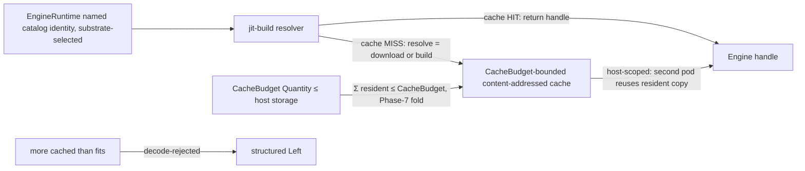

# Phase 25: jit-build engine resolver + CacheBudget cache

**Status**: Authoritative source
**Supersedes**: N/A
**Referenced by**: DEVELOPMENT_PLAN/README.md, DEVELOPMENT_PLAN/legacy_tracking_for_deletion.md, DEVELOPMENT_PLAN/overview.md, DEVELOPMENT_PLAN/phase_08_capability_binder.md, DEVELOPMENT_PLAN/phase_14_base_image_registry.md, DEVELOPMENT_PLAN/phase_24_determinism_kernel.md, DEVELOPMENT_PLAN/phase_26_infernix_lift.md, DEVELOPMENT_PLAN/phase_27_jitml_lift_cuda.md, DEVELOPMENT_PLAN/phase_28_apple_metal_host_daemon.md
**Generated sections**: none

> **Purpose**: Prove on live linux-cpu that the shared jit-build resolver materializes a named `EngineRuntime`
> catalog identity on first miss into the `CacheBudget`-bounded content-addressed cache, that a second pod on the
> same host reuses the cache-resident copy, and that "more cached than fits" is decode-rejected by the capacity
> fold — engines jit-resolved into a bounded cache, never baked and never fetched by URL.

---

## Phase Status

📋 Planned. Nothing in this phase is implemented; every sprint below is 📋 Planned and every prescriptive
statement is design intent, never a tested amoebius result. This phase opens after the Phase 24 gate (the
determinism kernel — the `ContentAddress` primitive and the content-addressed store the cache is keyed against)
and runs on the **linux-cpu** substrate in **Register 3** (live infrastructure): a single-node `kind` cluster
brought up by the Phase 13 midwife, whose base image (Phase 14) already bakes the shared **jit-build resolver
and its build toolchain** but **no** ML engine payload. Where a shape below is already exercised in a sibling
system — jitML's `Engines/Loader.hs` (the lazy per-kernel JIT: cache HIT → handle, MISS → compile-then-store)
is the shape this round generalizes to all three asset kinds, and infernix's `Runtime/Worker.hs` *selects* the
engine by `adapterType` and never fetches it — that is **sibling evidence, not an amoebius result**; infernix's
`docker/Dockerfile` `curl`-tar-at-image-build and its `model_cache.py` `minioadmin` fallback are the
baked/URL/second-secret-store anti-patterns this phase deliberately **replaces**, not inherits. Status
transitions are recorded reverse-chronologically here once work begins.

## Phase Summary

This phase delivers the first live amoebius realization of the ML-asset lifecycle's Tier 1 — the **engine** — as
one bounded, content-addressed, resolve-on-first-miss cache, and proves it against a minimal linux-cpu engine
identity. It does three things and stops there. First, it builds the **`CacheBudget`-bounded content-addressed
cache**: a bounded typed pool on the host, content-addressed by the resolved asset's SHA, carrying an explicit
`CacheBudget` (a `Quantity`) `≤` host storage, with pin-aware pruning — and the decode-time
`Σ(resident) ≤ CacheBudget` check is the *same* capacity fold Phase 7 built (`fits`/`carve`), so "more cached
than fits" is not a runtime disk-full but a decode rejection. Second, it builds the **jit-build resolver** —
`resolve = {download | build}` on first miss — that takes a named `EngineRuntime` catalog identity, returns a
handle on a cache HIT, and on a MISS downloads a prebuilt engine or builds it from source (using the Phase-14
baked toolchain) into the content-addressed cache; there is no arm to author a URL, because the identity is
drawn from the closed catalog, never authored. Third, it proves **host-level reuse**: the cache is host-scoped
and shared across pods, so a second pod on the same host that names the same identity hits the cache-resident
copy and pays no re-materialization — the first-miss cost is amortized across every later use.

The scope deliberately stops at the engine tier (Tier 1) and one live first-miss/reuse/over-budget proof. The
`ModelArtifact` staging tier (Tier 2) and the JIT kernel tier (Tier 3) are named as the same cache shape but are
not exercised here; the infernix CPU-inference lift that rides this resolver is [Phase 26](phase_26_infernix_lift.md),
and the CUDA/jitML lift is [Phase 27](phase_27_jitml_lift_cuda.md). The cache is **ephemeral and host-scoped** —
re-materializable on first miss, deliberately *not* the durable state of the stateless `replicas=1` control-plane
singleton (whose only durable state is the Vault-enveloped MinIO bucket); evicting the cache costs a
re-resolve, never data loss. The engine lane exercised here is `linux-cpu` only; the Apple-Metal and `Cuda`
lanes are out of contract for this gate.

**Substrate:** linux-cpu — the whole gate runs on a single-node `kind` cluster on a linux-cpu host in Register 3;
no apple, linux-cuda, or windows substrate is touched, while the `Σ(resident) ≤ CacheBudget` decode rejection is
a pure fold that needs no live infrastructure (it is the Phase-7 fold applied to `CacheBudget`).

**Register:** 3 — live infrastructure; the first-miss materialization and the second-pod reuse run against real
pods on the live cluster, and the run emits a proven/tested/assumed ledger naming that register.

**Gate:** on the single-node linux-cpu `kind` cluster, a named `EngineRuntime` catalog identity resolves on
**first miss** into the `CacheBudget`-bounded content-addressed cache (`resolve = {download | build}`, using the
Phase-14 baked resolver/toolchain, with **no** public-registry pull authored by URL); a **second pod on the same
host** that names the identity reuses the **cache-resident copy** with no re-materialization; and a cache spec
that would place **`Σ(resident) > CacheBudget`** ("more cached than fits") is **decode-rejected** by the Phase-7
capacity fold before any resolve runs — the run emitting a Register-3 proven/tested/assumed ledger that records
first-miss resolution and cross-pod reuse as *tested on linux-cpu* and the URL-foreclosure as *proven-in-types*.

## Doctrine adopted

- [`content_addressing_doctrine.md §4.5`](../documents/engineering/content_addressing_doctrine.md#45-the-ml-asset-lifecycle-one-bounded-content-addressed-cache-resolved-on-first-miss)
  — *the ML-asset lifecycle: one bounded content-addressed cache, resolved on first miss*: the central adoption —
  Tier 1's `EngineRuntime` is a **named, jit-resolved** identity (never baked, never URL-fetched), the cache is a
  bounded typed pool with an explicit `CacheBudget` and pin-aware pruning, and the trade is stated plainly (baking
  gave no-network-at-boot; the cache pays a first-miss materialization amortized across every later use).
- [`service_capability_doctrine.md` §4.1](../documents/engineering/service_capability_doctrine.md)
  — *the `InferenceEngine` capability — the engine is substrate-selected and jit-resolved, never authored*: the
  closed `EngineRuntime` union has **no arbitrary-`Url`/`Download` arm**; the `.dhall` *selects* an arm by the
  detected substrate and can never *author* a fetch, and the shared jit-build resolver materializes the named
  identity on first miss — the engine-as-a-capability side this phase realizes at runtime.
- [`resource_capacity_doctrine.md §3`](../documents/engineering/resource_capacity_doctrine.md#3-the-types-quantity-capacity-demand-budget)
  and [`§4`](../documents/engineering/resource_capacity_doctrine.md#4-the-total-fold-fits-carve-place-and-the-nesting)
  — *the `Quantity` types and the total `fits`/`carve` fold*: `CacheBudget` is a `Quantity` `≤` host storage, and
  the `Σ(resident) ≤ CacheBudget` bound is the **same** decode-foreclosed capacity fold Phase 7 built — "more
  cached than fits" is rejected by that fold, not discovered as a runtime disk-full.
- [`image_build_doctrine.md §7`](../documents/engineering/image_build_doctrine.md#7-what-amoebius-bakes-vs-builds--the-base-container-is-the-supply-chain)
  — *what amoebius bakes vs builds*: the base image bakes the jit-build **resolver + toolchain** (the
  build-from-source path this phase drives on a MISS) but holds the ML **engine payloads** out as named cache
  identities — the Phase-14 split this phase exercises live for the first time.
- [`illegal_state_catalog.md §3.25`](../documents/illegal_state/illegal_state_ml_asset.md#325-an-ml-asset-named-by-arbitrary-url-or-an-unready--unlanded-model)
  — *an ML asset named by arbitrary URL is unrepresentable*: the foreclosure shifted from the old "no `Download`
  arm (baked)" to **"no arbitrary-URL arm (a closed named catalog) + a `CacheBudget`-bounded cache"** — the engine
  identity has no URL syntax (type-foreclosed, Gate 1) and the over-budget cache is decode-foreclosed (Gate 2).
- [`content_addressing_doctrine.md §2`](../documents/engineering/content_addressing_doctrine.md#2-the-three-tier-store-blobs--manifests--pointers)
  — *the content-addressed store*: the cache keys resolved engine payloads by `sha256(bytes)` (the Phase-24
  `ContentAddress` primitive), so a MISS-then-store and a HIT are the write-once, self-naming discipline of the
  store, applied to the ephemeral host cache rather than the durable MinIO bucket.
- [`testing_doctrine.md` §2](../documents/engineering/testing_doctrine.md#2-three-registers-of-amoebius-testing)
  — *three registers of amoebius testing*: this phase's gate reaches **Register 3** (live infrastructure) and
  emits a proven/tested/assumed ledger naming that register, with the model/kernel tiers (26/27) marked deferred.

## Sprints

## Sprint 25.1: The `CacheBudget`-bounded content-addressed cache + the `Σ(resident) ≤ CacheBudget` decode fold 📋

**Status**: Planned
**Implementation**: `src/Amoebius/Jit/Cache.hs` (the bounded typed pool — content-addressed by resolved-asset
SHA, pin-aware pruning, HIT/MISS lookup) and `src/Amoebius/Jit/CacheBudget.hs` (the `CacheBudget` as a
`Quantity` `≤` host storage + the `Σ(resident) ≤ CacheBudget` decode fold reusing `Amoebius.Capacity.Fold`) —
target paths, not yet built.
**Blocked by**: Phase 7 gate (the `fits`/`carve` capacity fold this bound reuses); Phase 24 gate (the
`ContentAddress` primitive the cache keys against); Phase 23 gate (the content-addressed store shape).
**Independent Validation**: a property + boundary suite shows the cache admits no key from a free string (every
resident entry is reachable only by hashing real bytes), that a lookup is a total HIT/MISS, and that a cache
spec whose resident set sums over `CacheBudget` returns a structured `Left` at decode — the Phase-7 fold applied
to `CacheBudget`, no cluster required.
**Docs to update**: `documents/engineering/content_addressing_doctrine.md`,
`documents/engineering/resource_capacity_doctrine.md`, `DEVELOPMENT_PLAN/system_components.md`.

### Objective
Adopt [`content_addressing_doctrine.md §4.5`](../documents/engineering/content_addressing_doctrine.md#45-the-ml-asset-lifecycle-one-bounded-content-addressed-cache-resolved-on-first-miss)'s
bounded-typed-pool and [`resource_capacity_doctrine.md §3/§4`](../documents/engineering/resource_capacity_doctrine.md#3-the-types-quantity-capacity-demand-budget):
build the `CacheBudget`-bounded content-addressed cache so that "more cached than fits" is **unrepresentable** —
the same decode-foreclosed capacity fold that bounds every other budget rejects a `Σ(resident) > CacheBudget`
before the resolver ever materializes an asset.

### Deliverables
- `Amoebius.Jit.Cache` — a bounded typed pool keyed by `sha256(resolved-bytes)` (the Phase-24 `ContentAddress`),
  with a total HIT/MISS lookup and pin-aware pruning (a pinned resident is never evicted; unpinned residents are
  pruned to keep under budget).
- `CacheBudget` as a `Quantity` `≤` host storage, and the `Σ(resident) ≤ CacheBudget` decode fold delegating to
  `Amoebius.Capacity.Fold` — an over-budget cache spec returns the tagged `Left`, not a runtime disk-full.
- An in-file honesty note: the cache is **ephemeral and host-scoped**, not the singleton's durable state; the
  `CacheBudget ≤ host storage` shape is type/decode-foreclosed, while *actual* on-disk residency under
  concurrent resolves is the runtime residue deferred to the live gate.

### Validation
1. There is no exported path to a cache key from a free string; the only path to a resident entry is content
   addressing.
2. A resident set within budget decodes; a set summing over `CacheBudget` returns the tagged `Left` at the fold.

### Remaining Work
The whole sprint (📋 Planned).

## Sprint 25.2: The jit-build resolver — `resolve = {download | build}` on first miss, no URL arm 📋

**Status**: Planned
**Implementation**: `src/Amoebius/Jit/Resolver.hs` (the shared resolver: a named `EngineRuntime` catalog
identity → cache HIT → handle, or MISS → download-a-prebuilt-engine / build-from-source → store → handle) —
target path, not yet built.
**Blocked by**: Sprint 25.1 (the cache the resolver stores into); Phase 14 gate (the base image baking the
resolver + its build toolchain — `g++` / pinned compilers for the linux-cpu build path); Phase 8 gate (the
`InferenceEngine` binder + the closed, substrate-selected `EngineRuntime` union the resolver keys on).
**Independent Validation**: a boundary suite drives the resolver against a **fake** download/build backend: a
cold cache triggers exactly one `resolve` (download-or-build) then stores; a warm cache returns a handle with
**no** resolve; the resolver has no code path that accepts a free URL — the only input is a closed-catalog
identity — and every subprocess it spawns is absolute-path-resolved, never from `PATH`.
**Docs to update**: `documents/engineering/content_addressing_doctrine.md`,
`documents/engineering/service_capability_doctrine.md`, `documents/engineering/image_build_doctrine.md`,
`DEVELOPMENT_PLAN/system_components.md`.

### Objective
Adopt [`content_addressing_doctrine.md §4.5`](../documents/engineering/content_addressing_doctrine.md#45-the-ml-asset-lifecycle-one-bounded-content-addressed-cache-resolved-on-first-miss)'s
Tier-1 resolve-on-miss and [`service_capability_doctrine.md` §4.1](../documents/engineering/service_capability_doctrine.md):
implement the shared jit-build resolver so a named engine identity is materialized on first miss into the
bounded cache — downloaded prebuilt or built from source with the Phase-14 baked toolchain — with **no arm to
author a URL**, replacing infernix's `curl`-tar-at-image-build with the one shared resolve-on-miss path.

### Deliverables
- `Amoebius.Jit.Resolver` — `resolve :: EngineRuntime -> IO EngineHandle` that returns a handle on a cache HIT
  and, on a MISS, runs `download | build` (the recipe carried by the closed-catalog identity, never an authored
  URL), stores the result content-addressed into `Amoebius.Jit.Cache`, then returns the handle.
- The build-from-source path invoking the Phase-14 baked toolchain by absolute path (no `PATH`, no env), and the
  download path resolving a named prebuilt identity — neither exposing a free-URL or free-string constructor.
- An in-file honesty note: URL-foreclosure and identity-from-closed-catalog are **proven-in-types** (Gate 1); the
  first-miss materialization *succeeding* on real infrastructure is the live residue proven at the phase gate; the
  model (Tier 2) and kernel (Tier 3) tiers reuse this resolver but land in Phases 26/27.

### Validation
1. A cold cache triggers exactly one `resolve` and stores the result; a warm cache returns a handle with no
   resolve; there is no path that accepts a URL or free string.
2. Every subprocess the resolver spawns is invoked by absolute path, never resolved against `PATH`.

### Remaining Work
The whole sprint (📋 Planned).

## Sprint 25.3: Host-scoped cache-resident reuse across pods 📋

**Status**: Planned
**Implementation**: `src/Amoebius/Jit/HostCache.hs` (the host-scoped shared cache mount + the concurrency
discipline that makes a second pod's lookup a HIT against the first pod's resolved copy) — target path, not yet
built.
**Blocked by**: Sprint 25.1, Sprint 25.2; Phase 15 gate (the typed SSA reconciler that renders the pods sharing
the host cache); Phase 18 gate (the platform stack the pods schedule onto).
**Independent Validation**: on the live single-node `kind` cluster, two pods scheduled to the same host name the
same `EngineRuntime` identity; the **first** pod's `resolve` is a MISS that materializes into the shared host
cache, the **second** pod's lookup is a **HIT** that reuses the resident copy with no re-materialization; a
concurrent-first-miss race resolves to one stored copy (content addressing makes the write idempotent).
**Docs to update**: `documents/engineering/content_addressing_doctrine.md`,
`documents/engineering/daemon_topology_doctrine.md`, `DEVELOPMENT_PLAN/system_components.md`.

### Objective
Adopt [`content_addressing_doctrine.md §4.5`](../documents/engineering/content_addressing_doctrine.md#45-the-ml-asset-lifecycle-one-bounded-content-addressed-cache-resolved-on-first-miss)'s
"every later pod on that host reuses the cache-resident copy": make the bounded cache **host-scoped and shared**,
so the first-miss materialization cost is paid once per host per identity and amortized across every pod that
later names it — the amortization the whole resolve-on-miss trade is premised on.

### Deliverables
- `Amoebius.Jit.HostCache` — the host-scoped shared cache location and the read/write discipline that lets a
  second pod HIT the first pod's resident copy, with two concurrent first-misses converging to one stored,
  content-addressed copy (idempotent write-once, the store's confluence applied to the ephemeral cache).
- The pod wiring (rendered by the Phase-15 reconciler) that mounts the shared host cache into each engine pod
  and keeps the cache host-scoped, not per-pod.
- An in-file honesty note: cross-pod reuse and the idempotent concurrent-miss convergence are **tested on
  linux-cpu** at the gate; cross-host reuse is out of contract (the cache is host-scoped by design — a different
  host is a legitimate first miss).

### Validation
1. Pod A's first `resolve` is a MISS that materializes; Pod B on the same host HITs the resident copy with no
   re-materialization.
2. Two concurrent first-misses converge to exactly one stored copy; no torn or duplicate resident entry.

### Remaining Work
The whole sprint (📋 Planned).

## Sprint 25.4: The live first-miss / reuse / over-budget gate + Register-3 ledger 📋

**Status**: Planned
**Implementation**: `test/dhall/phase_25_engine_cache.dhall` (the gate workflow naming a linux-cpu engine
identity) and `test/live/EngineCacheGate.hs` (the Register-3 gate harness) — target paths, not yet built.
**Blocked by**: Sprint 25.1, Sprint 25.2, Sprint 25.3; Phase 13 gate (the live `kind` cluster + substrate
detect); Phase 14 gate (the baked resolver/toolchain and the in-cluster `distribution` registry proving no
public pull).
**Independent Validation**: the gate `.dhall` names one linux-cpu `EngineRuntime` identity; the harness asserts
the first pod's resolve is a first-miss materialization into the `CacheBudget`-bounded cache with **zero**
public-registry pull authored by URL, a second pod on the same host reuses the cache-resident copy, and an
over-budget cache spec is **decode-rejected** by the Phase-7 fold before any resolve — emitting a Register-3
proven/tested/assumed ledger.
**Docs to update**: `documents/engineering/content_addressing_doctrine.md`, `DEVELOPMENT_PLAN/README.md`
(flip the Phase-25 status when the gate passes), `DEVELOPMENT_PLAN/substrates.md`.

### Objective
Adopt [`content_addressing_doctrine.md §4.5`](../documents/engineering/content_addressing_doctrine.md#45-the-ml-asset-lifecycle-one-bounded-content-addressed-cache-resolved-on-first-miss)
end-to-end under [`testing_doctrine.md` §2 — Register 3](../documents/engineering/testing_doctrine.md#2-three-registers-of-amoebius-testing):
wire the resolver, the bounded cache, and host-scoped reuse through one live linux-cpu workload and prove the
three-clause gate — first-miss resolution, second-pod reuse, and the decode-rejected over-budget spec — without
overclaiming the model/kernel tiers (Phases 26/27).

### Deliverables
- The gate `.dhall` naming exactly one linux-cpu engine identity (a closed-catalog `EngineRuntime` arm, e.g. a
  CPU `llama.cpp`/`ONNX` family), driving a first pod, a second pod on the same host, and an over-budget
  `CacheBudget` fixture.
- The gate harness asserting: (i) first-miss materialization into the bounded cache with no URL-authored public
  pull; (ii) a second-pod cache HIT with no re-materialization; (iii) the over-budget spec's decode `Left` at the
  Phase-7 fold.
- A Register-3 ledger recording: URL-foreclosure and the `CacheBudget` shape as **proven-in-types**, first-miss
  resolution and cross-pod reuse as **tested on linux-cpu**, and the Tier-2 model / Tier-3 kernel reuse as
  **deferred** (Phases 26/27), with cross-host and cross-substrate reuse explicitly not asserted.

### Validation
1. On the live linux-cpu `kind` cluster, the first pod resolves the named identity on first miss into the cache
   with zero public-registry pull; a second pod on the host reuses the resident copy with no resolve.
2. An over-budget cache spec returns the tagged `Left` at the Phase-7 fold before any resolve runs.
3. The Register-3 ledger is emitted and marks the model/kernel tiers deferred and cross-host/cross-substrate
   reuse not asserted.

### Remaining Work
The whole sprint (📋 Planned).

## Documentation Requirements

**Engineering docs to update (when the gate runs, flip the honest layer, never before):**
- `documents/engineering/content_addressing_doctrine.md` — §4.5's Tier-1 engine cache gains its first amoebius
  live datapoint (first-miss resolve + host-scoped reuse on linux-cpu) alongside the existing jitML/infernix
  sibling-evidence rows; annotate that the bounded-cache resolve-on-miss path replaces infernix's
  `curl`-tar-at-image-build, and that the Tier-2/Tier-3 realizations remain Phase 26/27 targets.
- `documents/engineering/service_capability_doctrine.md` — annotate §4.1 that the `EngineRuntime`
  substrate-selected, no-URL provider is first resolved live here; the alternate lanes (Apple-Metal, `Cuda`)
  stay design intent.
- `documents/engineering/resource_capacity_doctrine.md` — record that the §3/§4 `Quantity`/`fits` fold is reused
  as the `Σ(resident) ≤ CacheBudget` bound, keeping "more cached than fits" a decode-foreclosed check.
- `documents/engineering/image_build_doctrine.md` — the §7 bake-vs-build split (resolver/toolchain baked, engine
  payloads not) gains its first live exercise: the resolver's build-from-source path runs against the baked
  toolchain.
- `documents/illegal_state/illegal_state_catalog.md` — annotate §3.25 that the URL-foreclosure holds live and the
  over-budget-cache rejection reached its decode-foreclosed layer on linux-cpu.

**Cross-references to add:**
- `DEVELOPMENT_PLAN/README.md` — flip the Phase-25 status when the gate passes; link this document.
- `DEVELOPMENT_PLAN/substrates.md` — record Phase 25's gate substrate (linux-cpu) in the per-phase substrate map.
- `DEVELOPMENT_PLAN/system_components.md` — register `src/Amoebius/Jit/Cache.hs`,
  `src/Amoebius/Jit/CacheBudget.hs`, `src/Amoebius/Jit/Resolver.hs`, `src/Amoebius/Jit/HostCache.hs`, and the
  `EngineCacheGate` live suite as Phase-25 design-first rows.

## Related Documents
- [README.md](README.md) — the live tracker and phase ordering this document sits under
- [development_plan_standards.md](development_plan_standards.md) — the rulebook this document obeys
- [overview.md](overview.md) — the target architecture and the cross-cutting invariant that ML engines are
  jit-resolved into a bounded cache, never baked or URL-fetched
- [system_components.md](system_components.md) — the target component inventory for the `Amoebius.Jit.*` module paths above
- [Content Addressing & Determinism Doctrine](../documents/engineering/content_addressing_doctrine.md) — §4.5 the
  ML-asset lifecycle (Tier-1 engine cache) and §2 the content-addressed store this cache reuses
- [Service Capabilities Doctrine](../documents/engineering/service_capability_doctrine.md) — §4.1 the
  `InferenceEngine` capability whose provider is substrate-selected and jit-resolved, never authored
- [Resource Capacity Doctrine](../documents/engineering/resource_capacity_doctrine.md) — §3/§4 the `Quantity`
  types and the `fits`/`carve` fold reused as the `Σ(resident) ≤ CacheBudget` bound
- [Image Build & Registry Doctrine](../documents/engineering/image_build_doctrine.md) — §7 the base image bakes
  the resolver + toolchain but not the engine payloads
- [Illegal-State Catalog](../documents/illegal_state/illegal_state_catalog.md) — §3.25 an ML asset named by
  arbitrary URL (and an over-budget cache) made unrepresentable
- [Testing Doctrine](../documents/engineering/testing_doctrine.md) — §2 the three registers (Register 3 reached here)
- [phase_14](phase_14_base_image_registry.md) — the base image that bakes the jit-build resolver + toolchain this phase drives live
- [phase_24](phase_24_determinism_kernel.md) — the determinism kernel + `ContentAddress` primitive the cache keys against
- [phase_26](phase_26_infernix_lift.md) — the infernix CPU-inference lift that rides this resolver next
- [phase_27](phase_27_jitml_lift_cuda.md) — the jitML/CUDA lift whose kernel tier reuses this resolver
