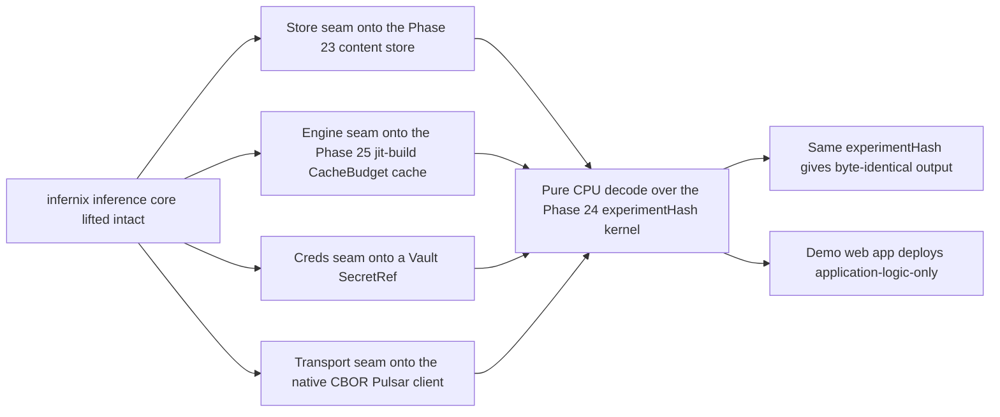

# Phase 26: infernix lift + CPU inference reproducibility

**Status**: Authoritative source
**Supersedes**: N/A
**Referenced by**: DEVELOPMENT_PLAN/README.md, DEVELOPMENT_PLAN/legacy_tracking_for_deletion.md, DEVELOPMENT_PLAN/overview.md, DEVELOPMENT_PLAN/phase_24_determinism_kernel.md, DEVELOPMENT_PLAN/phase_25_jitbuild_engine_cache.md, DEVELOPMENT_PLAN/phase_27_jitml_lift_cuda.md
**Generated sections**: none

> **Purpose**: Lift the sibling `infernix` inference library onto the amoebius runtime — its store onto the
> three-tier content-addressed MinIO store, its transport onto the native CBOR Pulsar client, its credentials
> onto Vault secrets-by-name, and its engine onto the jit-build resolver's `CacheBudget`-bounded cache — one
> reversible subsystem at a time, and prove live on linux-cpu that a CPU-inference workflow reproduces
> byte-identical output under one `experimentHash` while its PureScript demo web app deploys as
> application-logic-only.

---

## Phase Status

📋 Planned. Nothing in this phase is implemented; every sprint below is 📋 Planned and every prescriptive
statement is design intent, never a tested amoebius result. The phase runs on the **linux-cpu** substrate in
**Register 3** (live infrastructure) — a single-node `kind` cluster brought up by the Phase 13 midwife with the
standard HA platform services standing (Phase 18), Vault + PKI live (Phase 17), the native CBOR Pulsar client
(Phase 22), the three-tier content store + workflow runtime (Phase 23), the determinism kernel (Phase 24), and
the jit-build engine resolver + `CacheBudget` cache (Phase 25) all closed. It opens only after the Phase 25
gate, because infernix re-homes onto every one of those seams rather than reimplementing them. infernix runs
today over a Helm/WebSocket/k8s-Secret/Python-engine-fork envelope in the sibling `~/infernix`; that its
inference orchestration, engine-pool routing, durable-context event-sourcing, and `.ready`-staged artifact
store work is **sibling evidence, not an amoebius result** — amoebius has lifted none of it yet. Status
transitions are recorded reverse-chronologically here once work begins.

## Phase Summary

This phase lifts the second-to-last of amoebius's proven sibling cores onto the amoebius seams and proves the
result live. Per the lift-and-compose rule, the **substance of infernix lifts largely intact** — the inference
orchestration, engine-pool routing, and durable-context event-source are not where amoebius is novel — while
the **infrastructure envelope around it is replaced**, because each envelope shape is one amoebius already
rejects on doctrine grounds. Four seams are cut, each behind a reversible adapter so a regression in one
subsystem never forces a flag-day rollback of the others: infernix's model store re-homes onto the Phase-23
three-tier content-addressed MinIO store keyed under the Phase-24 `experimentHash` namespace; its
WebSocket/protobuf/base64-in-JSON transport re-homes onto the Phase-22 native binary Pulsar client with
exclusively-CBOR payloads; its k8s-Secret / hardcoded credentials re-home onto a Vault `SecretRef` the parent
injects; and its Python engine-fork / baked per-engine venv re-homes onto the Phase-25 jit-build resolver,
which materializes a **named catalog engine identity** on first miss into the `CacheBudget`-bounded
content-addressed cache — no baked engine, no arbitrary URL, no author-a-download syntax.

With the seams cut, the phase makes infernix CPU inference **deterministic by construction** by riding the
Phase-24 kernel rather than a private determinism path: a pinned content-addressed model, a pure decode stage,
and a request-carried SplitMix seed, with the linux-cpu substrate folded into `experimentHash` so that
same-substrate reproducibility is the honest contract and cross-substrate bit-equality is never asserted.

The **infernix demo web app** — the PureScript single-page app shipped with `~/infernix` that renders its
inference output — deploys here as **application-logic-only**: it is authored once as application logic that
*uses* the infernix inference extension, while its HA replica count, substrate, and inference binding are an
orthogonal deployment-rules surface, and its frontend contract types are regenerated from the amoebius-composed
Haskell ADTs via `purescript-bridge` as a build artifact that is never committed. A demo web app that *uses* an
extension is application logic, not itself an extension, so the closed extension set stays {infernix, jitML}.
The full behind-Keycloak/Envoy SPA composition is Phase 32; this phase deploys the demo app application-logic-only
via the Deployment-`replicas=1` control-plane singleton (Phase 20), whose single-instance stays a k8s/etcd
property with no bespoke election.

**Substrate:** linux-cpu — the whole gate runs on a single-node `kind` cluster on a linux-cpu host in
Register 3 (live infrastructure); no accelerator is in scope (the CUDA training lift is Phase 27), so
cross-substrate behaviour is explicitly out of contract, and the seam re-homings themselves are
decode/render/compose work that stays Register-1/2 validatable ahead of the live proof.

**Register:** 3 — live infrastructure (§K).

**Gate:** an infernix CPU-inference workflow is **reproducible on linux-cpu** — running it twice under an
unchanged `experimentHash` produces byte-identical output, while a deliberately changed input (the pinned
model, the request seed, or the resolved `.dhall`) yields a different `experimentHash`, occupies a distinct
store namespace, and is allowed to differ — **and its PureScript demo web app deploys as
application-logic-only** (authored once as logic that uses the extension; its replica count / substrate /
inference binding a separate deployment-rules dial; its contract regenerated, never committed); the whole
`InForceSpec` topology spins up, runs, and tears down leak-free, emitting a proven/tested/assumed ledger that
records same-substrate reproduction as *tested* and cross-substrate bit-equality as *explicitly not asserted*.

## Doctrine adopted

This phase is the first live amoebius realization of the lift-and-compose rule for an ML extension. Each bullet
names the section it adopts; individual sprints cite the same sections where they build on them.

- [`lift_and_compose_doctrine.md §2`](../documents/engineering/lift_and_compose_doctrine.md) — *the reuse map*:
  infernix's inference orchestration, engine-pool routing, and durable-context event-source lift largely intact
  as an extension nested under the `InForceSpec`, and its PureScript demo-SPA shell lifts with its contract
  regenerated — the change is the *seam*, not the substance.
- [`lift_and_compose_doctrine.md §3`](../documents/engineering/lift_and_compose_doctrine.md) — *the friction
  envelope*: the four re-homings this phase performs — Helm → typed `render`, Pulsar WebSocket/protobuf/base64
  → the native CBOR client, k8s-Secret / hardcoded creds → a Vault `SecretRef`, and Python engine-fork / baked
  venv → the jit-build `CacheBudget`-bounded cache — each a shape amoebius rejects on doctrine grounds, each
  Register-1/2 validatable before the live proof.
- [`lift_and_compose_doctrine.md §5`](../documents/engineering/lift_and_compose_doctrine.md) — *evidence, not
  proof*: that infernix serves and reproduces today argues the amoebius design is achievable; it is not an
  amoebius result until this phase's gate passes, and the migration-removal record is the legacy ledger.
- [`app_vs_deployment_doctrine.md §7`](../documents/engineering/app_vs_deployment_doctrine.md#7-infernix-is-a-shared-library-the-inference-substrate-is-a-deployment-rule)
  and [`§8`](../documents/engineering/app_vs_deployment_doctrine.md#8-shared-library-use-is-application-logic)
  — *infernix is a shared library; the inference substrate is a deployment rule* / *shared-library use is
  application logic*: infernix is realized as a shared Haskell library unified under the DSL (its call graph is
  app logic; *where* inference runs is a deployment rule), migrated behind reversible seams, with
  [`§6`](../documents/engineering/app_vs_deployment_doctrine.md#6-the-proof-case-a-demo-web-app-as-application-logic-only)
  — *the proof case: a demo web app as application-logic-only* — the demo app the last sprint deploys.
- [`content_addressing_doctrine.md §4`](../documents/engineering/content_addressing_doctrine.md#4-determinism-by-construction-pinned-inputs--pure-stages--derived-seed)
  — *determinism by construction: pinned inputs + pure stages + derived seed*: infernix's CPU decode is wired
  through the three legs on the Phase-24 kernel rather than a private determinism path, keeping the honest
  ceiling of [`§6`](../documents/engineering/content_addressing_doctrine.md#6-the-honest-ceiling-types-make-the-bookkeeping-total-not-the-physics-deterministic)
  — same-substrate reproducibility only.
- [`content_addressing_doctrine.md §4.5`](../documents/engineering/content_addressing_doctrine.md#45-the-ml-asset-lifecycle-one-bounded-content-addressed-cache-resolved-on-first-miss)
  — *the ML-asset lifecycle: one bounded content-addressed cache, resolved on first miss*: infernix's engine is
  a named catalog identity the Phase-25 jit-build resolver materializes on first miss into a `CacheBudget`-bounded
  cache — never baked, never URL-fetched.
- [`pulsar_client_doctrine.md §1`](../documents/engineering/pulsar_client_doctrine.md#1-one-client-one-wire-no-websockets),
  [`§3.1`](../documents/engineering/pulsar_client_doctrine.md#31-payloads-are-exclusively-cbor),
  [`§5`](../documents/engineering/pulsar_client_doctrine.md#5-the-capability-surface-lookup--produce--consume--subscribe--seek),
  and [`§7`](../documents/engineering/pulsar_client_doctrine.md#7-delivery-at-least-once-with-broker-side-dedup-the-robust-default)
  — *one client, one wire, no WebSockets* / *payloads are exclusively CBOR* / *the capability surface* /
  *at-least-once with broker-side dedup*: infernix's inference events ride the native binary protocol with
  CBOR-only bodies over the Phase-22 client, preserving at-least-once + dedup semantics.
- [`vault_pki_doctrine.md §3`](../documents/engineering/vault_pki_doctrine.md#3-the-secretref-contract-a-name-never-a-value)
  and [`§7`](../documents/engineering/vault_pki_doctrine.md#7-parent-injects-secrets-into-the-childs-vault)
  — *the `SecretRef` contract: a name, never a value* / *parent injects secrets into the child's Vault*:
  infernix's credentials (its JWT-auth material and any engine-registry pull secret) become a `SecretRef` name
  the parent injects into the child's Vault — no k8s-Secret, no hardcoded default in the `.dhall`.
- [`testing_doctrine.md`](../documents/engineering/testing_doctrine.md) — *Register 3 (live)* and the per-run
  proven/tested/assumed ledger: the register this gate reaches, its spin-up → run → always-tear-down contract,
  and the ledger that marks cross-substrate equality UNVERIFIED, never green.

## Sprints

## Sprint 26.1: infernix as a shared library + reversible content-store adapter seam 📋

**Status**: Planned
**Implementation**: `infernix/src/Infernix/Adapter/Store.hs`, `infernix/infernix.cabal` (library target),
`infernix/dhall/infernix.dhall` (the config record that nests in the `InForceSpec`) — target paths, not yet built.
**Blocked by**: Phase 23 gate (the three-tier content-addressed store the seam writes into); Phase 24 gate (the
`ContentAddress` typeclass + `experimentHash` namespace the store keys under); Phase 20 gate (the live DSL deploy
via the Deployment-`replicas=1` singleton that schedules the lifted library).
**Independent Validation**: with the seam in "amoebius" mode, infernix model staging writes `blobs/<sha256>` +
canonical-CBOR `manifests/<sha256>` under the `experimentHash` namespace and writes the `.ready` sentinel
**last**, so a half-staged model has no serveable reference; flipping the seam to "legacy" mode and back restores
the prior store with **no infernix `.hs` source change**, proving reversibility.
**Docs to update**: `documents/engineering/lift_and_compose_doctrine.md`,
`documents/engineering/app_vs_deployment_doctrine.md`,
`documents/engineering/content_addressing_doctrine.md`, `DEVELOPMENT_PLAN/system_components.md`, this document.

### Objective
Adopt [`lift_and_compose_doctrine.md §2`](../documents/engineering/lift_and_compose_doctrine.md) and
[`app_vs_deployment_doctrine.md §7`](../documents/engineering/app_vs_deployment_doctrine.md#7-infernix-is-a-shared-library-the-inference-substrate-is-a-deployment-rule):
package infernix as a shared Haskell library unified under the DSL (its `.dhall` nests inside the `InForceSpec`)
and cut its model store over to the Phase-23 content-addressed store behind a **reversible adapter seam** — the
first of the one-subsystem-at-a-time migration moves.

### Deliverables
- An `Infernix.Adapter.Store` seam with two interchangeable backends (legacy infernix store ↔ the amoebius
  three-tier store), selectable without editing infernix call sites.
- infernix model staging routed through the seam: weights → `blobs/<sha256>`, a canonical-CBOR content-addressed
  manifest, and the `.ready` sentinel written last, keyed under the Phase-24 `experimentHash` namespace, so an
  `ArtifactRef` is obtainable only from a completed staging.
- The infernix library exposing its config as a Dhall record that composes into the amoebius spec — shared-library
  use modeled as application logic, not a parallel system.

### Validation
1. End-to-end stage-then-serve in "amoebius" mode: a half-downloaded model has no serveable reference; a completed
   one does, reachable only through the `.ready` sentinel.
2. Reversibility: switching the seam to "legacy" and back changes no infernix `.hs` source and leaves both stores
   functional.

### Remaining Work
The whole sprint (📋 Planned).

## Sprint 26.2: infernix transport + topics onto the native CBOR Pulsar client; creds onto a Vault `SecretRef` 📋

**Status**: Planned
**Implementation**: `infernix/src/Infernix/Adapter/Pulsar.hs`, `infernix/src/Infernix/Adapter/Topology.hs`,
`infernix/src/Infernix/Adapter/Secrets.hs` — target paths, not yet built.
**Blocked by**: Sprint 26.1; Phase 22 gate (the native Pulsar client — capability surface, CBOR codec, dedup);
Phase 17 gate (the root Vault + PKI and the built-in Haskell Vault client that reads a `SecretRef`).
**Independent Validation**: an infernix inference request/response round-trips over the native binary Pulsar
protocol (no WebSocket path) through the seam with a CBOR-only body; the topology seam expresses infernix's topics
via the amoebius topology algebra; infernix's JWT-auth material resolves from a Vault `SecretRef` name with no
k8s-Secret and no hardcoded default; each seam reverts independently to its legacy backend with no infernix source
change.
**Docs to update**: `documents/engineering/lift_and_compose_doctrine.md`,
`documents/engineering/pulsar_client_doctrine.md`, `documents/engineering/vault_pki_doctrine.md`,
`DEVELOPMENT_PLAN/system_components.md`.

### Objective
Adopt [`lift_and_compose_doctrine.md §3`](../documents/engineering/lift_and_compose_doctrine.md),
[`pulsar_client_doctrine.md §1`](../documents/engineering/pulsar_client_doctrine.md#1-one-client-one-wire-no-websockets)/[`§3.1`](../documents/engineering/pulsar_client_doctrine.md#31-payloads-are-exclusively-cbor),
and [`vault_pki_doctrine.md §3`](../documents/engineering/vault_pki_doctrine.md#3-the-secretref-contract-a-name-never-a-value):
cut infernix's transport, topic lifecycles, and credentials over to the amoebius seams — the native CBOR client,
the topology algebra, and Vault secrets-by-name — again **one subsystem at a time behind reversible seams** — so
infernix's call graph rides amoebius's runtime while its placement stays a deployment-rules decision.

### Deliverables
- An `Infernix.Adapter.Pulsar` seam carrying infernix inference events over the Phase-22 native client with
  exclusively-CBOR bodies, preserving at-least-once + broker-side dedup (determinism applies to the durable body
  only; broker ids/timestamps are never hashed).
- An `Infernix.Adapter.Topology` seam expressing infernix's topics in the amoebius topology algebra
  (`<workflow>.<command|event>.<substrate>`), replacing the sibling's WebSocket-bridge topic wiring.
- An `Infernix.Adapter.Secrets` seam carrying infernix's JWT-auth material (and any engine-registry pull secret)
  as a `SecretRef` name the parent injects into the child's Vault — no k8s-Secret, no plaintext default in the
  `.dhall`.
- A documented cutover order (store → pulsar/topology → secrets) where each seam is independently reversible.

### Validation
1. A request/response inference round-trip completes over the native Pulsar protocol with a CBOR-only body and no
   WebSocket path; a non-CBOR body is unrepresentable.
2. infernix's credentials resolve only from a Vault `SecretRef`; the `.dhall` names the secret and never carries a
   value; each seam, toggled to its legacy backend and back, leaves infernix source unchanged and the system
   functional.

### Remaining Work
The whole sprint (📋 Planned).

## Sprint 26.3: infernix engine onto the jit-build resolver's `CacheBudget`-bounded cache 📋

**Status**: Planned
**Implementation**: `infernix/src/Infernix/Adapter/Engine.hs`, `infernix/dhall/engine_catalog.dhall` (the named
engine identities) — target paths, not yet built.
**Blocked by**: Sprint 26.1; Phase 25 gate (the jit-build engine resolver + the `CacheBudget`-bounded
content-addressed engine cache infernix's engine now resolves through).
**Independent Validation**: infernix's inference engine is named by a typed identity from the closed catalog and
resolved on first miss into the Phase-25 `CacheBudget`-bounded cache; a second inference pod on the same node
reuses the cached engine with no re-materialization; there is no baked per-engine venv, no `Python`-fork at image
build, and no arbitrary-`Url` arm — an attempt to author an engine by download URL has no constructor.
**Docs to update**: `documents/engineering/lift_and_compose_doctrine.md`,
`documents/engineering/content_addressing_doctrine.md`, `DEVELOPMENT_PLAN/system_components.md`.

### Objective
Adopt [`lift_and_compose_doctrine.md §3`](../documents/engineering/lift_and_compose_doctrine.md) and
[`content_addressing_doctrine.md §4.5`](../documents/engineering/content_addressing_doctrine.md#45-the-ml-asset-lifecycle-one-bounded-content-addressed-cache-resolved-on-first-miss):
replace infernix's Python engine-fork / baked-venv envelope with a named catalog engine identity the Phase-25
jit-build resolver materializes on first miss into the `CacheBudget`-bounded content-addressed cache — the
deliberate exception to the "every service binary is baked" rule, and the last of infernix's four seams.

### Deliverables
- An `Infernix.Adapter.Engine` seam whose engine is a **named identity** from the closed `engine_catalog.dhall`,
  resolved by the shared jit-build resolver, never fetched by URL and never baked into the base image.
- First-miss materialization into the Phase-25 cache and warm reuse on a second pod, with `CacheBudget ≤` host
  storage upheld by the resolver (this phase consumes that bound, it does not re-implement it).
- An in-file note that the inference engine is the deliberate non-baked exception; infernix's service-binary
  dependencies (if any) stay baked in the multi-arch base image.

### Validation
1. A named engine identity resolves on first miss into the bounded cache; a second inference pod reuses it with no
   re-materialization.
2. There is no baked engine, no image-build Python fork, and no constructor for an engine authored by download
   URL.

### Remaining Work
The whole sprint (📋 Planned).

## Sprint 26.4: deterministic-by-construction CPU decode over the Phase-24 kernel 📋

**Status**: Planned
**Implementation**: `infernix/src/Infernix/Inference/Deterministic.hs` — target path, not yet built.
**Blocked by**: Sprint 26.1; Sprint 26.2; Sprint 26.3; Phase 24 gate (the `ContentAddress` /
`deriveExperimentHash` / `deriveSplitMixSeed` kernel this decode rides instead of a private determinism path).
**Independent Validation**: a pure CPU decode stage takes a content-addressed model, a request, and a
kernel-derived SplitMix seed and produces byte-identical output for an unchanged `experimentHash`, with all I/O at
the interpreter boundary and no ambient-entropy or wall-clock read inside the stage.
**Docs to update**: `documents/engineering/content_addressing_doctrine.md`,
`documents/engineering/app_vs_deployment_doctrine.md`, `DEVELOPMENT_PLAN/system_components.md`.

### Objective
Adopt [`content_addressing_doctrine.md §4`](../documents/engineering/content_addressing_doctrine.md#4-determinism-by-construction-pinned-inputs--pure-stages--derived-seed)
and the honest ceiling in [`§6`](../documents/engineering/content_addressing_doctrine.md#6-the-honest-ceiling-types-make-the-bookkeeping-total-not-the-physics-deterministic):
wire the three determinism legs through an infernix CPU decode — a pinned content-addressed model (Sprint 26.1),
a pure decode stage, and a request-carried seed derived by the Phase-24 kernel (greedy or seeded sampling, never
ambient entropy) — so same-substrate reproducibility holds by construction without a private determinism path and
without overclaiming cross-substrate equality.

### Deliverables
- A pure infernix CPU decode stage taking a content-addressed model, a request, and a `deriveSplitMixSeed`-derived
  seed, with all I/O pushed to the interpreter boundary.
- The decode's identity folded through `deriveExperimentHash` (resolved `.dhall` ‖ linux-cpu substrate
  fingerprint), so two genuinely different requests occupy different store namespaces and cannot collide.
- An in-file honesty note that identity/seed totality is proven-in-types, same-substrate reproduction is a live
  test (the gate), and cross-substrate bit-equality is deliberately never asserted.

### Validation
1. The decode stage is pure: given the same content-addressed model, request, and derived seed it returns
   byte-identical output, with no wall-clock, worker-id, or `/dev/urandom` read inside the stage.
2. Any changed input (model, request seed, resolved `.dhall`) changes `experimentHash` and the store namespace.

### Remaining Work
The whole sprint (📋 Planned).

## Sprint 26.5: the demo web app application-logic-only + the live reproducibility gate 📋

**Status**: Planned
**Implementation**: `infernix/web/` (the lifted PureScript demo SPA shell), the `purescript-bridge` contract
regeneration wired to the amoebius-composed Haskell ADTs, `test/dhall/phase_26_infernix_repro.dhall` (the gate
topology), `test/live/InfernixReproSpec.hs` — target paths, not yet built.
**Blocked by**: Sprint 26.4; Phase 20 gate (the live DSL deploy via the Deployment-`replicas=1` singleton that
schedules the demo app and the workflow); Phase 25 gate (the resolved engine cache the inference runs against).
**Independent Validation**: a `.dhall` workflow runs the infernix CPU inference twice on linux-cpu and asserts
byte-identical output under an unchanged `experimentHash`, asserts a divergent `experimentHash` and a distinct
store namespace for any changed input, deploys the demo SPA application-logic-only (its replica count / substrate
/ inference binding a separate deployment-rules record; its contract regenerated as a build artifact, never
committed), tears down leak-free, and emits a proven/tested/assumed ledger artifact.
**Docs to update**: `documents/engineering/app_vs_deployment_doctrine.md`,
`documents/engineering/lift_and_compose_doctrine.md`, `documents/engineering/content_addressing_doctrine.md`,
`DEVELOPMENT_PLAN/README.md`, `DEVELOPMENT_PLAN/substrates.md`.

### Objective
Adopt [`app_vs_deployment_doctrine.md §6`](../documents/engineering/app_vs_deployment_doctrine.md#6-the-proof-case-a-demo-web-app-as-application-logic-only)/[`§8`](../documents/engineering/app_vs_deployment_doctrine.md#8-shared-library-use-is-application-logic)
and [`content_addressing_doctrine.md §4`](../documents/engineering/content_addressing_doctrine.md#4-determinism-by-construction-pinned-inputs--pure-stages--derived-seed):
assemble the phase's single Register-3 gate — the lifted infernix CPU inference reproduces byte-identically under
one `experimentHash`, and its PureScript demo web app deploys as application-logic-only — proving both the
lift-and-compose re-homing and the app-vs-deployment split on live linux-cpu.

### Deliverables
- The gate `test/dhall/phase_26_infernix_repro.dhall` topology and its `InfernixReproSpec`: spin up on the
  linux-cpu kind cluster against the standing Pulsar + MinIO + Vault + engine cache, run the infernix CPU
  inference twice, store each output as a content-addressed blob under its `experimentHash` namespace, compare
  outputs, and always tear down.
- The lifted PureScript demo web app deployed **application-logic-only** — authored once as logic that uses the
  infernix extension, with its HA replica count, substrate, and inference binding an orthogonal deployment-rules
  record, and its frontend contract regenerated from the amoebius-composed Haskell ADTs via `purescript-bridge`
  as a build artifact that is never committed. Full behind-Keycloak/Envoy SPA composition is deferred to Phase 32.
- A ledger artifact recording: identity/seed totality as **proven-in-types**, same-substrate reproduction as
  **tested on linux-cpu**, cross-substrate bit-equality as **explicitly not asserted**, and the four seam
  re-homings (store, transport, secrets, engine) as **lifted and live-proven** — sibling evidence generalized,
  not a fresh amoebius result until this gate is green.

### Validation
1. Two runs with the same `experimentHash` on linux-cpu produce byte-identical infernix output; a changed model,
   request seed, or resolved `.dhall` produces a different `experimentHash` and a distinct store namespace.
2. The demo SPA deploys application-logic-only — its deployment shape is a separate dial, its contract regenerated
   and uncommitted — and the whole topology tears down leak-free and re-runs idempotently.
3. The ledger artifact is emitted and marks no cross-substrate claim green.

### Remaining Work
The whole sprint (📋 Planned).

## Documentation Requirements

**Engineering docs to update (when the gate runs, flip the honest layer, never before):**
- `documents/engineering/lift_and_compose_doctrine.md` — record that the §2 infernix reuse-map row and the four
  §3 friction re-homings (Helm → typed render is inherited from Phase 15; Pulsar WebSocket → native CBOR;
  k8s-Secret → Vault `SecretRef`; Python engine-fork/baked → jit-build cache) are realized in the
  `Infernix.Adapter.*` seams; keep §5 evidence-not-proof honesty until the gate is green.
- `documents/engineering/app_vs_deployment_doctrine.md` — §6/§7/§8 gain a concrete amoebius reference: infernix's
  adapter-seam module paths as the realized "shared library unified under the DSL," and the demo app as the
  live application-logic-only proof case.
- `documents/engineering/content_addressing_doctrine.md` — the §6 proven/tested/assumed table gains an
  amoebius-tested linux-cpu infernix-reproducibility datapoint alongside the Phase-24 kernel row; note the §4.5
  engine cache is consumed by infernix here.
- `documents/engineering/pulsar_client_doctrine.md`, `documents/engineering/vault_pki_doctrine.md` — record that
  infernix's transport rides the §1/§3.1 native CBOR client and its creds ride the §3 `SecretRef` contract, live.

**Cross-references to add:**
- `DEVELOPMENT_PLAN/README.md` — flip the Phase-26 status when the gate passes; link this document.
- `DEVELOPMENT_PLAN/substrates.md` — record Phase 26's gate substrate (linux-cpu) in the per-phase substrate map.
- `DEVELOPMENT_PLAN/system_components.md` — register `infernix/src/Infernix/Adapter/{Store,Pulsar,Topology,Secrets,Engine}.hs`,
  `infernix/src/Infernix/Inference/Deterministic.hs`, the demo web app + contract regen, and the
  `InfernixReproSpec` live suite as Phase-26 design-first rows.
- `DEVELOPMENT_PLAN/legacy_tracking_for_deletion.md` — record which sibling `~/infernix` envelope artifacts
  (Helm charts, WebSocket bridge, k8s-Secret creds, baked engine venvs) this lift retires.

## Related Documents
- [README.md](README.md) — the live tracker; Phase 26 objective, gate, and substrate
- [development_plan_standards.md](development_plan_standards.md) — the rulebook this document obeys (skeleton,
  sprint format, the doctrine-citation rule, the three-register + honesty + one-substrate disciplines)
- [overview.md](overview.md) — the target architecture and cross-cutting invariants (lift-and-compose, the demo
  web apps as application-logic-only, the non-baked jit-resolved engine, the honest reproducibility ceiling)
- [system_components.md](system_components.md) — the target component inventory for the infernix module paths above
- [Lift and Compose Doctrine](../documents/engineering/lift_and_compose_doctrine.md) — the reuse map, the friction
  envelope, and the evidence-not-proof discipline this phase realizes for infernix
- [App vs Deployment Doctrine](../documents/engineering/app_vs_deployment_doctrine.md) — infernix as a shared
  library, the inference substrate as a deployment rule, and the demo web app as application-logic-only
- [Content Addressing & Determinism Doctrine](../documents/engineering/content_addressing_doctrine.md) — the
  determinism legs, the ML-asset cache, and the honest ceiling infernix's CPU decode rides
- [Native Pulsar Client Doctrine](../documents/engineering/pulsar_client_doctrine.md) — the native CBOR client and
  capability surface infernix's transport re-homes onto
- [Vault / PKI Doctrine](../documents/engineering/vault_pki_doctrine.md) — the `SecretRef` contract infernix's
  credentials re-home onto
- [Testing Doctrine](../documents/engineering/testing_doctrine.md) — Register 3 (live), the spin-up → run →
  always-tear-down contract, and the per-run proven/tested/assumed ledger
- [phase_24](phase_24_determinism_kernel.md) — the `experimentHash` + SplitMix determinism kernel this phase's CPU
  decode rides
- [phase_25](phase_25_jitbuild_engine_cache.md) — the jit-build engine resolver + `CacheBudget` cache infernix's
  engine resolves through
- [phase_27](phase_27_jitml_lift_cuda.md) — the jitML lift onto the same seams, the next ML extension
- [Engineering Doctrine Index](../documents/engineering/README.md) — the doctrine suite these phases adopt
