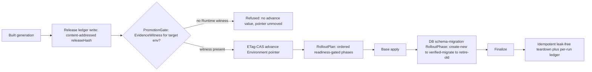

# Phase 26: Release lifecycle

**Status**: Authoritative source
**Supersedes**: N/A
**Referenced by**: DEVELOPMENT_PLAN/README.md, DEVELOPMENT_PLAN/overview.md, DEVELOPMENT_PLAN/system_components.md
**Generated sections**: none

> **Purpose**: Compose delivery — the immutable `Release` ledger keyed by `releaseHash`, the per-`Environment`
> ETag-CAS promotion pointer, the `PromotionGate` that makes promote-unverified→prod unrepresentable, and the
> readiness-gated `RolloutPlan`/`RolloutPhase` apply (DB schema-migration as a phase) — as typed values over
> primitives amoebius already owns, gated live on linux-cpu with no external CI/CD control plane.

---

## Phase Status

📋 Planned. Nothing in this phase is implemented; every sprint below is 📋 Planned and every prescriptive
statement is design intent, never a tested amoebius result. The phase runs on the **linux-cpu** substrate in
**Register 3** (live infrastructure) — the single-node `kind` cluster of Phases 13–19 with its standard
platform-service stack already reconciled by the Phase-22 control-plane singleton onto the Phase-17 retained
storage. It opens only after the Phase 22 gate (live DSL deploy via the Deployment-`replicas=1` singleton and
the SSA reconciler the `RolloutPlan` enacts on) and the Phase 25 gate (the three-tier content-addressed store
the `releaseHash`-keyed ledger writes into) both close, because delivery here **composes** those primitives
rather than reimplementing a reconciler or a store. The four delivery shapes are generalized from siblings —
jitML's phased readiness-gated rollout and its pre/post-grant schema phase, infernix's `.ready`-gated artifact,
the content store's ETag-CAS `trial` pointer — each **sibling evidence, not an amoebius result**; amoebius has
built none of the `Release` ledger, the `Environment` promotion pointer, the `PromotionGate`, or the
`RolloutPlan`. Status transitions are recorded reverse-chronologically here once work begins.

## Phase Summary

This phase delivers the **release lifecycle** — build's downstream half, *promote* and *roll out* — as typed
composition on primitives amoebius already owns, with **no external CI/CD control plane** (no Argo, no Flux, no
Tekton). It composes four values on one substrate. First, the immutable **`Release` ledger**: every built
generation is an append-only, content-addressed entry keyed by
`releaseHash = sha256(resolved-deployment-dhall ‖ image-digests ‖ substrate-fp)`, written into the Phase-25
store — promoting the manifest reconciler's *optional* applied-log to THE canonical, immutable release record.
Second, the per-**`Environment`** (`Dev`/`Staging`/`Prod`) **ETag-CAS promotion pointer**: "promote to prod"
is a compare-and-swap of that environment's pointer from the old `releaseHash` to the new one — not a rebuild;
app bytes are byte-identical across environments. Third, the **`PromotionGate`**: a typed precondition whose
`advance` constructor demands an `EvidenceWitness` read from the Phase-36 test-topology evidence ledger, so an
under-verified `Release` has **no `advance` value to hand the CAS** — promote-unverified→prod is
type-foreclosed unrepresentable, not a runtime check that fires. Fourth, the readiness-gated
**`RolloutPlan`/`RolloutPhase`** apply on the Phase-22 in-cluster SSA reconciler: an ordered plan whose each
phase is observed done from live object state (never a `threadDelay`), with a **DB schema-migration
`RolloutPhase`** obeying `create-new → verified-migrate → retire-old`.

The load-bearing property this phase proves live is that **an under-verified `Release` cannot advance to prod
and a satisfied gate can** — the evidence edge, not an operator's discretion, is what moves the pointer. A
`Release` whose ledger records the Runtime/chaos layer UNVERIFIED yields no Runtime `EvidenceWitness`, so the
`Prod` `PromotionGate` supplies no `advance` value and the pointer does not move; a `Release` carrying the
required evidence strength advances the ETag-CAS pointer, after which the SSA reconciler converges
`render(release)` through the ordered `RolloutPlan`. The scope deliberately consumes upstream primitives as
given: the `releaseHash` formula and the hash/pointer master registry are the Phase-25/Phase-31 store's
(consumed here as an opaque content-address protocol); the proven/tested/assumed evidence ledger the gate
reads is Phase-36's (consumed here as an opaque witness); the Gateway-API canary weight-shift and the
cross-cluster/geo promotion boundary are **not** exercised by this gate (Phase 37 and Phase 28 respectively).

**Substrate:** linux-cpu — the whole gate runs on a single-node `kind` cluster on a linux-cpu host, in
Register 3 (live infrastructure); no apple, linux-cuda, or windows substrate is touched. The ledger/pointer
protocols and the `PromotionGate` are substrate-agnostic in design but validated only here.

**Register:** 3 — live infrastructure (§K).

**Gate:** an `InForceSpec` test topology on the linux-cpu kind cluster exercises the four delivery values
end-to-end and passes only when all hold. (i) A **live `Release`-ledger write produces a content-addressed
`releaseHash`** — recomputed by an independent sha256 over the resolved deployment-dhall ‖ image-digests ‖
substrate-fp and asserted byte-equal to the Phase-0-committed golden key, the ledger entry immutable in the
Phase-25 store. (ii) An **`Environment` promotion whose `Release` ledger lacks the required evidence strength
is refused by the `PromotionGate`** — the committed under-verified fixture `release_unverified` (its evidence
ledger marks the Runtime/chaos layer UNVERIFIED) yields no `advance` value for `Prod`, and the refusal is
asserted with the specific reason tag `PromotionRefused:RuntimeEvidenceMissing` (not merely "failed"), paired
with a positive `release_verified` differing only in the Runtime evidence edge; the refusal is observed as **no
pointer advance in the store's ETag history** (an external-observer read of the pointer HEAD, not a
self-emitted gate log). (iii) A **satisfied `PromotionGate` advances the ETag-CAS `Environment` pointer** — the
prod pointer's ETag transitions from the old `releaseHash` to `release_verified`'s, observed from the store's
pointer history. (iv) A **readiness-gated `RolloutPlan` applies its phases in order** — the phase-apply order is
read from an **external observer at the OS/API boundary** (the API-server audit log / the run's ApplySet
field-manager apply sequence, never the reconciler's self-report), each phase gated on live object status, and
the plan **includes a DB schema-migration `RolloutPhase`** obeying `create-new → verified-migrate → retire-old`
against the standing Phase-23 Postgres (the retire phase never denotes byte destruction). The whole topology
spins up, runs, tears down **leak-free**, and **re-runs idempotently under a distinct `experiment-hash`
namespace** (a cache-bypassing independent recompute of the `releaseHash`, not a store-hit), emitting a
committed proven/tested/assumed ledger that names its register (3) and substrate (linux-cpu) and marks the
runtime layer **tested, never proven** and the cross-cluster/canary layers **UNVERIFIED**. The gate is checked
against the Phase-0-committed fixtures named in Sprints 26.1–26.4 and **MUST turn red** on the committed seeded
mutant `mutant/gate-admits-unverified` — a `PromotionGate` whose guard is weakened so a promotion that SHOULD
be refused (`release_unverified` → `Prod`) is **admitted** — and on the additional mutants named per sprint.
The representative set is exactly the `release_lifecycle.dhall` topology's **one trivial app with three
environment pointers (`Dev`/`Staging`/`Prod`), two committed `Release` entries (`release_verified`,
`release_unverified`), and one `RolloutPlan` of three ordered phases (base-apply → DB schema-migration →
finalize)** over the standing single-node platform stack plus one Postgres.

## Doctrine adopted

This phase is the first live amoebius realization of the release lifecycle. It adopts
[`release_lifecycle_doctrine.md`](../documents/engineering/release_lifecycle_doctrine.md) end to end — the
composition doctrine that owns the delivery values and defers every primitive they compose. Each bullet names
the section it adopts; individual sprints cite the same sections where they build on them.

- [`inforcespec_migration_doctrine.md`](../documents/engineering/inforcespec_migration_doctrine.md)
  — **the no-destruction InForceSpec-migration invariants.** A RolloutPlan that evolves the live spec is checked
  at `dhall update`: the StorageMutation closed union, the decode-time orphan / retention-shrink rejection, and
  the owner-immutability diff fold foreclose a promotion that would strand or silently destroy retained data;
  the phase corpus includes an orphaned-retained-coordinate and an owner-retag negative, each Gate-2
  decode-rejected.
- [`release_lifecycle_doctrine.md §1`](../documents/engineering/release_lifecycle_doctrine.md#1-no-external-cicd-control-plane--delivery-is-typed-composition-on-primitives-amoebius-owns)
  — *no external CI/CD control plane — delivery is typed composition*: this phase installs no second control
  plane; the whole lifecycle is a handful of typed values composed over the Phase-22 reconciler and the
  Phase-25 store, with the desired state recomputed as `render(release)` from an immutable value, never polled
  from a controller's opinion.
- [`release_lifecycle_doctrine.md §2`](../documents/engineering/release_lifecycle_doctrine.md#2-release-and-the-immutable-release-ledger-releasehash)
  — *`Release` and the immutable release ledger (`releaseHash`)*: every built generation is an append-only,
  content-addressed `Release` entry keyed by `releaseHash`, promoting the manifest reconciler's optional
  applied-log
  ([`manifest_generation_doctrine.md §6.1`](../documents/engineering/manifest_generation_doctrine.md#61-the-release-ledger-the-applied-log-is-canonical-not-optional))
  to THE canonical immutable ledger, immutability enforced as runtime-checked content-addressed-write residue.
- [`release_lifecycle_doctrine.md §3`](../documents/engineering/release_lifecycle_doctrine.md#3-environment-and-the-etag-cas-promotion-pointer)
  — *`Environment` and the ETag-CAS promotion pointer*: `Dev`/`Staging`/`Prod` is a closed union each naming a
  mutable pointer into the immutable ledger; promotion is an ETag-CAS of that pointer
  ([`content_addressing_doctrine.md §2.3`](../documents/engineering/content_addressing_doctrine.md#23-the-hashpointer-master-table-four-hash-classes-three-pointer-kinds),
  the `environment` pointer kind), then a converge — app bytes byte-identical across environments.
- [`release_lifecycle_doctrine.md §4`](../documents/engineering/release_lifecycle_doctrine.md#4-promotiongate-promote-unverifiedprod-is-unrepresentable)
  — *`PromotionGate`: promote-unverified→prod is unrepresentable*: `advance` demands an `EvidenceWitness` read
  from the test-topology evidence ledger
  ([`testing_doctrine.md §4`](../documents/engineering/testing_doctrine.md#4-no-skips-fail-fast-and-the-per-run-ledger-artifact));
  prod requires the Runtime/chaos layer *proven*, so an under-verified `Release` has no `advance` term —
  catalogued at
  [`illegal_state_catalog.md §3.26`](../documents/illegal_state/illegal_state_lifecycle.md#326-an-unverified-environment-promotion-promote--prod-without-the-required-evidence),
  the "a handle exists only once its evidence edge does" technique.
- [`release_lifecycle_doctrine.md §5`](../documents/engineering/release_lifecycle_doctrine.md#5-rolloutplan--rolloutphase-the-readiness-gated-apply)
  — *`RolloutPlan`/`RolloutPhase`: the readiness-gated apply*: an ordered plan enacted by the Phase-22 SSA
  reconciler
  ([`manifest_generation_doctrine.md §5`](../documents/engineering/manifest_generation_doctrine.md#5-the-applyreconcile-engine-server-side-apply-owned-field-manager-prune-wait)),
  each phase's readiness a condition observed from live state
  ([`readiness_ordering_doctrine.md §3`](../documents/engineering/readiness_ordering_doctrine.md#3-readiness-is-a-condition-never-a-duration),
  never a duration), with DB schema-migration a phase obeying `create-new → verified-migrate → retire-old`
  ([`storage_lifecycle_doctrine.md §8`](../documents/engineering/storage_lifecycle_doctrine.md#8-shrinking-storage-without-representing-data-destruction)).

## Sprints

## Sprint 26.1: The immutable `Release` ledger (`releaseHash`) 📋

**Status**: Planned
**Implementation**: `amoebius-release/src/Amoebius/Release/Ledger.hs`,
`amoebius-release/src/Amoebius/Release/ReleaseHash.hs` (target paths; not yet built)
**Blocked by**: Phase 25 gate (the three-tier content-addressed store the ledger writes into — blobs ←
manifests ← pointers); Phase 22 gate (the reconciler whose rendered generations the ledger records) — both
external earlier-phase prerequisites.
**Independent Validation**: this suite runs in **Register 3** against the **live single-node kind-cluster
MinIO** store stood up in Phase 25, never an in-process fake — the register is stated so its evidential weight
is unambiguous. A `Release` write emits a `releaseHash` **recomputed by an independent sha256** over
`resolved-deployment-dhall ‖ image-digests ‖ substrate-fp` (not the amoebius folder's own output) and equal to
the Phase-0-committed golden key; two writes of the same logical `Release` deduplicate to one entry and return
the same hash; a second write attempting to edit a field of an existing `releaseHash` entry is **rejected** by
the content-addressed write protocol (immutability is runtime-checked residue).
**Docs to update**: `documents/engineering/release_lifecycle_doctrine.md` (§2),
`documents/engineering/manifest_generation_doctrine.md` (§6.1 — the applied-log promoted to canonical),
`DEVELOPMENT_PLAN/system_components.md`, this document.

### Objective
Adopt [`release_lifecycle_doctrine.md §2 — the immutable release ledger (`releaseHash`)`](../documents/engineering/release_lifecycle_doctrine.md#2-release-and-the-immutable-release-ledger-releasehash),
promoting the optional applied-log of
[`manifest_generation_doctrine.md §6.1`](../documents/engineering/manifest_generation_doctrine.md#61-the-release-ledger-the-applied-log-is-canonical-not-optional)
to THE canonical, content-addressed, append-only release record keyed by `releaseHash`.

### Deliverables
- A `Release` value — `{ releaseHash, deploymentDhallRef, imageDigests, substrateFp }` — written as an
  append-only entry into the Phase-25 store (pointers → manifests → blobs), keyed by
  `releaseHash = sha256(resolved-deployment-dhall ‖ image-digests ‖ substrate-fp)`; the hash is consumed as
  the registered `releaseHash` class of the Phase-25/Phase-31 hash/pointer master table, not re-owned here.
- Immutability by construction: no field of a written `Release` is ever edited; the content-addressed write
  protocol rejects any bytes that do not hash to their key, so a half-written or edited-out-from-under entry is
  unrepresentable at the store boundary.
- Deduplication: writing an already-present logical `Release` returns the existing `releaseHash` and adds no
  new entry — content-addressed, self-naming.
- **Phase-0-pinned oracles (committed before the folder exists):** a golden `test/golden/release_hash.txt` —
  the expected `releaseHash` for one fixed `Release` fixture `test/golden/release_fixture.json`, computed by an
  **independent sha256 tool** (not the amoebius folder) and committed in Phase 0; and a **specific-reason
  negative** `release_fixture_perturbed.json` (the same `Release` with a single image digest changed) whose
  expected outcome is a `releaseHash` **differing from the golden at the derived key** — paired with the
  positive that differs only in that digest. Committed seeded mutant (operator: dropped-input / effect swap):
  `mutant/hash-omits-substrate` — a folder that omits `substrate-fp` from the hash preimage, collapsing two
  substrate-distinct generations to one key; the gate MUST turn this mutant **red** against the golden vector.

### Validation
1. Write the fixed `release_fixture` and assert the emitted `releaseHash` is **byte-equal to the committed
   golden `release_hash.txt`** (independently recomputed), and that a second write deduplicates to the same
   entry and hash.
2. Assert the specific-reason negative `release_fixture_perturbed.json` yields a `releaseHash` **that differs
   from the golden** (a changed image digest changes identity), and that `mutant/hash-omits-substrate` turns
   this validation **red** (two substrate-distinct fixtures collapse to one key).
3. Attempt to edit a field of an existing `releaseHash` entry and assert the content-addressed write protocol
   **rejects** it — the ledger is append-only and immutable.

> **Honesty.** The immutability and self-naming are **runtime-checked residue** of the content-addressed write
> protocol (a blob at a hash either is the bytes that hash to it, or the write is rejected), not a
> compile-time impossibility. This generalizes the sibling `experimentHash` fold from ML *artifacts* to
> deployment *generations* — sibling evidence, not an amoebius result.

### Remaining Work
The whole sprint (📋 Planned).

## Sprint 26.2: The `Environment` ETag-CAS promotion pointer 📋

**Status**: Planned
**Implementation**: `amoebius-release/src/Amoebius/Release/Environment.hs`,
`amoebius-release/src/Amoebius/Release/Promote.hs` (target paths; not yet built)
**Blocked by**: Sprint 26.1 (the immutable `Release` entries a pointer advances onto); Phase 25 gate (the
ETag-CAS `pointers/*` write protocol the `environment` pointer kind reuses) — an external earlier-phase
prerequisite.
**Independent Validation**: this suite runs in **Register 3** against the live Phase-25 store. `Environment` is
a closed three-arm union (`Dev`/`Staging`/`Prod`) — an un-enumerated fourth environment has no constructor
(type-foreclosed). Advancing an environment is an `If-Match` compare-and-swap of that environment's pointer
from the old `releaseHash` to the new one (the exact protocol that advances a `trial`/`model` pointer); the
CAS is the atomic commit and a concurrent lost-update loser gets `412`, re-reads, and re-applies. The pointer
history retained by the store answers "what was in prod, when, and which `Release` preceded it" as a
first-class read, and promotion adds **no** new `Release` — the same immutable entry can be pointed at by
`Staging` then `Prod`.
**Docs to update**: `documents/engineering/release_lifecycle_doctrine.md` (§3),
`documents/engineering/content_addressing_doctrine.md` (§2.3 — the `environment` pointer kind),
`documents/engineering/app_vs_deployment_doctrine.md` (§3 — app bytes byte-identical across environments),
`DEVELOPMENT_PLAN/system_components.md`, this document.

### Objective
Adopt [`release_lifecycle_doctrine.md §3 — the ETag-CAS promotion pointer`](../documents/engineering/release_lifecycle_doctrine.md#3-environment-and-the-etag-cas-promotion-pointer),
reusing the [`content_addressing_doctrine.md §2.3`](../documents/engineering/content_addressing_doctrine.md#23-the-hashpointer-master-table-four-hash-classes-three-pointer-kinds)
ETag-CAS protocol for the `environment` pointer kind: model promotion as a compare-and-swap of an environment's
pointer over the fixed ledger, not a redeploy.

### Deliverables
- A closed `Environment = Dev | Staging | Prod` union — no fourth, unnamed environment is representable — each
  naming one ETag-CAS pointer into the ledger, its body a `releaseHash`.
- `promote :: Environment -> ReleaseHash -> PointerCas`: an `If-Match` compare-and-swap advancing the named
  environment's pointer from its current `releaseHash` to the target, with the pure CAS decision
  (`PointerWritten` vs `PointerConflict`) and a retry on `412` that re-reads the current HEAD. Promotion
  produces **no** new `Release`.
- App-bytes invariance: the same `Release` (same image digests, same app logic) is what `Staging` then `Prod`
  point at; there is no `if prod then …` in an app spec and no rebuild between environments — everything that
  differs rides the deployment-rules surface.
- The store's retained pointer history as the audit trail — the prior pointer values are a first-class query,
  replacing a git-polling controller's changelog.
- **Phase-0-pinned oracles:** a committed **compile-fail fixture** `test/reject/fourth_environment.hs` whose
  expected outcome is a **specific type error at the `Environment` constructor site** (no constructor for a
  fourth arm), paired with a positive that names an enumerated arm; and a golden pointer-history transcript
  `test/golden/promote_history.txt` (the expected ETag sequence for a fixed `Dev → Staging → Prod` promotion
  chain, authored independently). Committed seeded mutant (operator: guard weakening): `mutant/blind-put` — a
  promoter that `PUT`s the pointer without `If-Match`, so a concurrent lost update silently clobbers; the gate
  MUST turn it **red** by a racing-CAS check that observes a lost write.

### Validation
1. Assert the compile-fail fixture `fourth_environment.hs` **fails to type-check at the constructor site** (an
   un-enumerated environment has no constructor), paired with a passing enumerated-arm positive.
2. Promote a fixed `Dev → Staging → Prod` chain and assert the pointer ETag sequence is **byte-equal to the
   committed `promote_history.txt`**, that `Staging` and `Prod` end pointing at the **same** immutable
   `Release` (zero app rebuild), and that no new `Release` entry was written.
3. Race two concurrent `promote` calls; assert one commits, the loser gets `412`, re-reads and re-applies, and
   assert `mutant/blind-put` turns this validation **red** (a lost update is observed under the racing check).

> **Honesty.** Atomicity of promotion is **runtime-checked** — the ETag-CAS protocol forecloses the
> lost-update/split-promotion race, not a type-level impossibility. The **closedness** of `Environment` (no
> fourth environment) is **type-foreclosed**. The ETag-CAS flip is proven for `trial` pointers in the sibling
> store; the `environment` pointer reuses that exact protocol for a new pointee — sibling evidence for the
> mechanism, not an amoebius result for environment promotion.

### Remaining Work
The whole sprint (📋 Planned).

## Sprint 26.3: The `PromotionGate` — promote-unverified→prod type-foreclosed 📋

**Status**: Planned
**Implementation**: `amoebius-release/src/Amoebius/Release/PromotionGate.hs`,
`amoebius-release/src/Amoebius/Release/EvidenceWitness.hs` (target paths; not yet built)
**Blocked by**: Sprint 26.2 (the ETag-CAS pointer advance the gate is a precondition on); Phase 25 gate (the
`Release` ledger whose entries carry the evidence reference) — external earlier-phase prerequisites. The
Phase-36 test-topology evidence ledger is consumed as an **opaque `EvidenceWitness`**; this sprint does not
build the ledger, only the environment→required-strength mapping that reads it.
**Independent Validation**: this suite runs in **Register 3**. The gate's `advance` constructor demands an
`EvidenceWitness`; the environment→required-strength mapping is monotone (`Dev` on a green Decision layer;
`Prod` on the Runtime/chaos layer **proven**). A `Release` whose consumed evidence ledger records the
Runtime/chaos layer **UNVERIFIED** — a Tier-1-only in-process ledger, or a skipped-but-applicable move —
yields **no Runtime witness**, so there is **no `advance` value** to hand the Sprint-26.2 CAS: the promotion is
**refused** with the specific reason tag `PromotionRefused:RuntimeEvidenceMissing`, and the environment
pointer HEAD is **unchanged in the store** (observed from the pointer history, not a gate self-report). A
`Release` carrying a proven Runtime witness constructs an `advance` value that the CAS commits. The mapping
table is a committed hand-authored fixture, independent of the gate's own fold.
**Docs to update**: `documents/engineering/release_lifecycle_doctrine.md` (§4),
`documents/engineering/testing_doctrine.md` (§4 — the evidence ledger the gate consumes),
`documents/illegal_state/illegal_state_lifecycle.md` (§3.26 — the catalogued unrepresentable state),
`DEVELOPMENT_PLAN/system_components.md`, this document.

### Objective
Adopt [`release_lifecycle_doctrine.md §4 — promote-unverified→prod is unrepresentable`](../documents/engineering/release_lifecycle_doctrine.md#4-promotiongate-promote-unverifiedprod-is-unrepresentable):
make the environment-pointer advance demand an `EvidenceWitness` read from the
[`testing_doctrine.md §4`](../documents/engineering/testing_doctrine.md#4-no-skips-fail-fast-and-the-per-run-ledger-artifact)
evidence ledger, so an under-verified `Release` has no term that promotes it to prod — the
[`illegal_state_catalog.md §3.26`](../documents/illegal_state/illegal_state_lifecycle.md#326-an-unverified-environment-promotion-promote--prod-without-the-required-evidence)
unrepresentable state.

### Deliverables
- `advance :: Environment -> Release -> EvidenceWitness -> PointerCas` — the advance is inhabited only when the
  witness for the target environment's required layer exists; no witness ⇒ no `advance` value ⇒ nothing to CAS.
  This is the same idiom as infernix's `.ready`-gated `ArtifactRef`: a handle exists only once its evidence
  edge does.
- The environment→required-evidence-strength **mapping** (this doctrine's sole owned policy): `Dev` advances
  on a green Decision layer; `Prod` requires the Runtime/chaos layer **proven**, not assumed. The mapping is a
  committed value the gate enforces at construction time; it does **not** compute the ledger, only reads it.
- The Tier-1-only fence: a purely in-process evidence ledger (Dhall typecheck + decoder + QuickCheck + TLA+/TLC,
  no live substrate) supplies **no Runtime `EvidenceWitness`**, so a `Prod` `PromotionGate` cannot be advanced
  on it — "we validated the DSL in-process" can never mean "the cluster enforces it".
- A refusal carries the **specific reason** (`PromotionRefused:RuntimeEvidenceMissing`), not a bare failure,
  and leaves the environment pointer HEAD untouched.
- **Phase-0-pinned oracles (authored before the gate exists):** the committed environment→required-strength
  mapping table `test/golden/evidence_strength.txt` (hand-authored, independent of the gate's fold); the
  under-verified `Release` fixture `test/fixture/release_unverified` (its consumed evidence ledger marks the
  Runtime/chaos layer UNVERIFIED) with expected outcome **refused with tag
  `PromotionRefused:RuntimeEvidenceMissing`**; and the positive `test/fixture/release_verified` differing
  **only in the Runtime evidence edge** with expected outcome **advance**. Committed seeded mutant (operator:
  guard weakening): `mutant/gate-admits-unverified` — a `PromotionGate` whose precondition is weakened so
  `release_unverified → Prod` is **admitted**; the gate MUST turn it **red** (the promotion that SHOULD be
  refused advances the pointer).

### Validation
1. Attempt `release_unverified → Prod` and assert it is **refused with the specific tag
   `PromotionRefused:RuntimeEvidenceMissing`** (not a bare failure) and that the `Prod` pointer HEAD is
   **unchanged in the store's ETag history** (external-observer read, not a gate self-report); assert the
   paired positive `release_verified → Prod` (differing only in the Runtime evidence edge) **advances**.
2. Assert the required-strength decision is taken **against the committed `evidence_strength.txt`** hand table,
   never against a value derived from the gate's own fold, and that a Tier-1-only (in-process,
   Runtime-UNVERIFIED) ledger supplies no Runtime witness for `Prod`.
3. Assert `mutant/gate-admits-unverified` turns this validation **red** — an admitted under-verified promotion
   is a gate failure, observed as an unwarranted pointer advance in the store history.

> **Honesty.** Promote-unverified→prod is **type-foreclosed** (uninhabitable — no `advance` term); this sprint
> validates the *live wiring* of that foreclosure through the Phase-25 store and the consumed Phase-36 evidence
> ledger, so the result is **tested at runtime, never proven** by this phase. The strength mapping is a policy
> value enforced at construction time. The `.ready`-gated idiom is proven in the sibling infernix — sibling
> evidence for the shape; the `PromotionGate` itself is unbuilt amoebius design intent that also generalizes
> the already-scoped multicluster `PromotionGate`.

### Remaining Work
The whole sprint (📋 Planned).

## Sprint 26.4: `RolloutPlan`/`RolloutPhase` readiness-gated apply + DB schema-migration phase (gate) 📋

**Status**: Planned
**Implementation**: `amoebius-release/src/Amoebius/Release/RolloutPlan.hs`,
`amoebius-release/src/Amoebius/Release/SchemaMigration.hs`,
`amoebius-release/dhall/test/release_lifecycle.dhall` (the gate topology),
`amoebius-release/test/live/ReleaseLifecycleSpec.hs` (target paths; not yet built)
**Blocked by**: Sprints 26.1–26.3 (the ledger, the ETag-CAS pointer, and the `PromotionGate` the plan is
enacted after); Phase 22 gate (the in-cluster SSA/ApplySet reconciler and the `replicas=1` singleton the plan
applies on); Phase 23 gate (the in-namespace Postgres the schema-migration phase targets); Phase 17 / Phase 14
gates (the cluster-lifecycle teardown the InForceSpec drives) — external earlier-phase prerequisites.
**Independent Validation**: this suite runs in **Register 3** on the live single-node kind cluster. A
`RolloutPlan` is an ordered `[RolloutPhase]`; each phase's objects are applied under the `amoebius` field
manager and its readiness gate is **observed from the live object** (rollout complete / `Ready` / CR `status`
healthy — never a `threadDelay`), and only then does the next phase apply. The **phase-apply order is read
from an external observer at the OS/API boundary** (the API-server audit log / the run's ApplySet apply
sequence), never the reconciler's self-emitted trace. The DB schema-migration `RolloutPhase` obeys
`create-new → verified-migrate → retire-old`: the migrate phase provisions the new schema, migrates and
**verifies** the copy, and only a later phase retires the old — the retire step inheriting the
durable-data-deletion prohibition so **no `.dhall` value denotes "discard these bytes"**.
**Docs to update**: `documents/engineering/release_lifecycle_doctrine.md` (§5),
`documents/engineering/manifest_generation_doctrine.md` (§5 — the SSA reconciler the plan enacts on),
`documents/engineering/readiness_ordering_doctrine.md` (§3 — readiness a condition, never a duration),
`documents/engineering/storage_lifecycle_doctrine.md` (§8 — create-new → verified-migrate → retire-old),
`DEVELOPMENT_PLAN/README.md`.

### Objective
Adopt [`release_lifecycle_doctrine.md §5 — the readiness-gated apply`](../documents/engineering/release_lifecycle_doctrine.md#5-rolloutplan--rolloutphase-the-readiness-gated-apply):
enact a satisfied promotion as an ordered, readiness-gated `RolloutPlan` on the Phase-22 SSA reconciler — with
DB schema-migration as a [`storage_lifecycle_doctrine.md §8`](../documents/engineering/storage_lifecycle_doctrine.md#8-shrinking-storage-without-representing-data-destruction)
`create-new → verified-migrate → retire-old` phase — and assemble the phase gate exercising all four delivery
values end-to-end.

### Deliverables
- `RolloutPlan = [RolloutPhase]` where each `RolloutPhase` carries `{ phaseObjects, phaseGate }`: the desired
  slice this phase applies and the readiness condition observed from live state that gates the next phase.
  Enacted by the Phase-22 SSA/ApplySet engine ([`manifest_generation_doctrine.md §5`](../documents/engineering/manifest_generation_doctrine.md#5-the-applyreconcile-engine-server-side-apply-owned-field-manager-prune-wait));
  it introduces **no new reconciler**.
- A **DB schema-migration `RolloutPhase`** against the standing Phase-23 Postgres obeying
  `create-new → verified-migrate → retire-old`: provision the new schema/columns, migrate and **verify** the
  copy, then retire the old in a later phase — the retire step inheriting the durable-data-deletion
  prohibition. This is the delivery home of the promoted schema-migration candidate.
- Rollback as ordinary operations over the immutable ledger: **re-apply** the prior generation's object set via
  the same SSA declare-and-prune path, or **CAS the environment pointer back** to the prior `Release` (Sprint
  26.2) and let the reconciler converge — no special "undo" machinery, because a prior generation is a valid
  `Release` and a prior pointer value is a valid CAS target.
- The gate `release_lifecycle.dhall` test topology — the named **representative set: one trivial app with three
  environment pointers (`Dev`/`Staging`/`Prod`), two committed `Release` entries (`release_verified`,
  `release_unverified`), and one `RolloutPlan` of three ordered phases (base-apply → DB schema-migration →
  finalize)** over the standing platform stack plus one Postgres — and its `ReleaseLifecycleSpec`: write the
  ledger, refuse the under-verified promotion, advance the satisfied one, roll out in order, and always tear
  down, emitting a per-run ledger artifact.
- **Phase-0-pinned oracles and committed mutants (authored before the runtime exists):** the committed
  ordered-apply reference `test/golden/rollout_order.txt` (the expected phase-apply sequence, authored
  independently and matched against the API-server audit observer, not the reconciler's self-report); the
  committed post-migration verify oracle `test/golden/migrated_rows.txt` (the expected verified row set of the
  schema migration, independent of the migrator's own count); and committed seeded mutants the gate MUST turn
  **red** — `mutant/gate-admits-unverified` (Sprint 26.3; the phase-level mandated mutant — the promotion that
  SHOULD be refused but is admitted), `mutant/rollout-reorders-retire` (operator: effect reorder — a
  `RolloutPlan` that retires-old **before** verified-migrate, violating `create-new → verified-migrate →
  retire-old` and risking byte loss), and `mutant/phase-gate-selfreport` (operator: effect swap — a
  `RolloutPhase` that gates the next phase on a self-emitted "done" log rather than observed live object
  status, caught by the external-observer apply-order trace).

### Validation
1. Run the gate topology end-to-end on the linux-cpu kind cluster and assert, **live**: (a) the `Release`
   ledger write emits a `releaseHash` byte-equal to the committed golden (Sprint 26.1, independently
   recomputed); (b) `release_unverified → Prod` is **refused with `PromotionRefused:RuntimeEvidenceMissing`**
   and the `Prod` pointer HEAD is unchanged in the store (Sprint 26.3); (c) `release_verified → Prod`
   **advances the ETag-CAS pointer** (Sprint 26.2), observed from the store's pointer history; (d) the
   `RolloutPlan` applies its phases in the order of the committed `rollout_order.txt`, **read from the
   API-server audit observer** (not the reconciler's self-report), each phase gated on observed live status.
2. Assert the **DB schema-migration `RolloutPhase`** provisions the new schema, migrates and **verifies** the
   copy against the committed `migrated_rows.txt` oracle, and only a later phase retires the old — asserting no
   phase, including retire, denotes durable-byte destruction. Assert `mutant/rollout-reorders-retire` turns
   this validation **red** (retire-before-verified-migrate is a gate failure).
3. Assert the mandated `mutant/gate-admits-unverified` turns the gate **red** (an admitted under-verified
   promotion advances the pointer that should not move), and `mutant/phase-gate-selfreport` turns it **red**
   (the external-observer apply-order trace catches a phase gated on a self-report rather than live status).
4. Assert **leak-free teardown** — the postflight sweep inventories every applied k8s object (by the run's
   ApplySet/field manager), every pointer/ledger entry under the run's `experiment-hash` prefix, and the
   Postgres schemas the migration phase created, emitting the full inventory plus the named retained set into
   the per-run ledger; any non-empty remainder outside the retained set fails the gate — and **re-runs
   idempotently under a distinct `experiment-hash` namespace** (a cache-bypassing independent recompute of the
   `releaseHash`, never a store-hit), the compute path asserted to have executed.
5. Assert the run emits a committed **proven/tested/assumed ledger** naming its register (3) and substrate
   (linux-cpu), marking the **runtime layer tested — never proven** (§K, a live-band Register-3 gate), the
   type-foreclosure of promote-unverified→prod proven-in-types but its live wiring tested, and the
   **cross-cluster/geo promotion and the Gateway-API canary weight-shift layers UNVERIFIED** (deferred to
   Phase 28 and Phase 37); skipping an applicable move marks that layer UNVERIFIED, never green.

> **Honesty.** This is a **Register 3** result on **linux-cpu**: the gate proves the *live wiring* of the four
> delivery values, so the runtime layer is **tested, never proven**. The `RolloutPhase` pattern is jitML's
> `HelmPhase` idea lifted **off Helm** (amoebius renders every object itself — no charts), and the
> schema-migration-as-a-phase shape is LIVE in the sibling jitML's pre/post-grant split — **sibling evidence,
> not an amoebius result**. This gate exercises the **intra-cluster** ordered apply and the schema-migration
> phase only; the **Gateway-API canary weight-shift** and **Pulsar consumer-group cutover** RolloutPhases of
> §5, and the **cross-cluster/geo promotion** boundary, are adopted in doctrine but **not exercised here** —
> their proof rides Phase 37 and Phase 28. Pulumi cloud-IaC (tier a) and the host spot-fleet reconciler
> (tier b) are unrelated; only tier (c), the in-cluster SSA reconciler, enacts this plan.

### Remaining Work
The whole sprint (📋 Planned).

## Documentation Requirements

**Engineering docs to update (when the gate runs, flip the honest layer, never before):**
- `documents/engineering/release_lifecycle_doctrine.md` — record that §2 (the `releaseHash` release ledger),
  §3 (the `environment` ETag-CAS promotion pointer), §4 (the `PromotionGate`), and §5 (the readiness-gated
  `RolloutPlan`/`RolloutPhase` with the DB schema-migration phase) are realized live in `amoebius-release`,
  with the Gateway-API canary weight-shift, the Pulsar consumer-group cutover, and the cross-cluster/geo
  promotion boundary explicitly still deferred (Phase 37 / Phase 28); flip the Phase-0 reference-only honesty
  note to live-proof status for the exercised values (status itself stays in this plan).
- `documents/engineering/manifest_generation_doctrine.md` — record that §6.1's optional applied-log is
  promoted to THE canonical release ledger by this phase, and that the §5 SSA reconciler is the tier-(c) engine
  the `RolloutPlan` enacts on.
- `documents/engineering/testing_doctrine.md` — record that the §4 per-run proven/tested/assumed evidence
  ledger is consumed by the `PromotionGate` as the `EvidenceWitness`, and that a Tier-1-only in-process ledger
  supplies no Runtime witness for `Prod`.
- `documents/engineering/storage_lifecycle_doctrine.md` — record the §8 `create-new → verified-migrate →
  retire-old` DB schema-migration `RolloutPhase` and the durable-data-deletion prohibition it inherits.
- `documents/illegal_state/illegal_state_lifecycle.md` — record that §3.26 (an unverified environment
  promotion) is realized as the type-foreclosed `PromotionGate` with live-wiring evidence from this gate.

**Cross-references to add:**
- `DEVELOPMENT_PLAN/README.md` — flip the Phase-26 status when the gate passes; link this document.
- `DEVELOPMENT_PLAN/substrates.md` — record Phase 26's gate substrate (linux-cpu) in the per-phase substrate
  map.
- `DEVELOPMENT_PLAN/system_components.md` — register the `amoebius-release` package and its target module paths
  (`Ledger`, `ReleaseHash`, `Environment`, `Promote`, `PromotionGate`, `EvidenceWitness`, `RolloutPlan`,
  `SchemaMigration`), mapped to the owning release-lifecycle doctrine, as Phase-26 design-first rows.

## Related Documents
- [README.md](README.md) — the live tracker; Phase 26 objective, gate, and substrate
- [development_plan_standards.md](development_plan_standards.md) — the rulebook this document obeys (skeleton,
  sprint format, the doctrine-citation rule, the three-register + honesty + one-substrate disciplines, and the
  §M gate-integrity clauses)
- [overview.md](overview.md) — the target architecture and cross-cutting invariants (no external CI/CD control
  plane; single-instance delegated to k8s/etcd; the content-addressed store)
- [system_components.md](system_components.md) — the target component inventory for the module paths above
- [Release Lifecycle Doctrine](../documents/engineering/release_lifecycle_doctrine.md) — the immutable
  `Release` ledger, the `Environment` ETag-CAS promotion pointer, the `PromotionGate`, and the
  `RolloutPlan`/`RolloutPhase` this phase realizes
- [Manifest Generation Doctrine](../documents/engineering/manifest_generation_doctrine.md) — [§5](../documents/engineering/manifest_generation_doctrine.md#5-the-applyreconcile-engine-server-side-apply-owned-field-manager-prune-wait)
  the SSA reconciler the `RolloutPlan` enacts on, [§6.1](../documents/engineering/manifest_generation_doctrine.md#61-the-release-ledger-the-applied-log-is-canonical-not-optional)
  the applied-log promoted to the canonical ledger
- [Content Addressing & Determinism Doctrine](../documents/engineering/content_addressing_doctrine.md) — [§2.3](../documents/engineering/content_addressing_doctrine.md#23-the-hashpointer-master-table-four-hash-classes-three-pointer-kinds)
  the hash/pointer master table (`releaseHash`, the `environment` pointer kind) reused for promotion
- [Testing Doctrine](../documents/engineering/testing_doctrine.md) — [§4](../documents/engineering/testing_doctrine.md#4-no-skips-fail-fast-and-the-per-run-ledger-artifact)
  the per-run proven/tested/assumed evidence ledger the `PromotionGate` consumes as its `EvidenceWitness`
- [Readiness Ordering Doctrine](../documents/engineering/readiness_ordering_doctrine.md) — [§3](../documents/engineering/readiness_ordering_doctrine.md#3-readiness-is-a-condition-never-a-duration)
  the `ReadinessGate` on a `RolloutPhase` is a condition, never a duration
- [Storage Lifecycle Doctrine](../documents/engineering/storage_lifecycle_doctrine.md) — [§8](../documents/engineering/storage_lifecycle_doctrine.md#8-shrinking-storage-without-representing-data-destruction)
  `create-new → verified-migrate → retire-old` for the schema-migration `RolloutPhase`
- [App vs Deployment Doctrine](../documents/engineering/app_vs_deployment_doctrine.md) — [§3](../documents/engineering/app_vs_deployment_doctrine.md#3-the-deployment-rules-surface--how-the-same-app-runs)
  env differences are deployment rules; app bytes byte-identical across environments
- [Illegal State Catalog](../documents/illegal_state/illegal_state_catalog.md) — [§3.26](../documents/illegal_state/illegal_state_lifecycle.md#326-an-unverified-environment-promotion-promote--prod-without-the-required-evidence)
  promote-unverified→prod is type-foreclosed unrepresentable
- [phase_22](phase_22_live_dsl_singleton.md) — the live DSL deploy via the `replicas=1` singleton and the SSA
  reconciler the `RolloutPlan` enacts on
- [phase_25](phase_25_content_store_workflow.md) — the three-tier content-addressed store the `releaseHash`-keyed
  ledger writes into
- [Engineering Doctrine Index](../documents/engineering/README.md) — the doctrine suite these phases adopt
