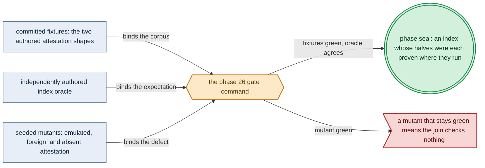

# Phase 26: Complementary-architecture child + the attested multi-architecture index

> **Purpose**: Build the base image's second architecture on hardware that natively executes it, then join both
> children into one OCI index that admits a child only on the attestation produced by the host that ran it.
> **Read this if**: phase 26 is next in the queue, or a later phase depends on the multi-architecture index.

Phase 26 delivers the complementary architecture of the base image and the index that joins it to
[Phase 25](phase_25_base_image_registry.md)'s; its design is owned by
[image_build_doctrine.md](../documents/engineering/image_build_doctrine.md) and
[substrate_doctrine.md](../documents/engineering/substrate_doctrine.md), and the plan for reaching it is owned
here. It does not own the bake catalog, the acquisition ladder, or the registry standup, all of which are
Phase 25's and are consumed unchanged. Register 3, live, on the `apple` substrate's `linux-cpu/arm64` lane.

Link-graph metadata

**Status**: Authoritative source
**Supersedes**: N/A
**Referenced by**: DEVELOPMENT_PLAN/README.md, DEVELOPMENT_PLAN/overview.md, DEVELOPMENT_PLAN/phase_25_base_image_registry.md
**Generated sections**: none

## Contents
- [Phase Status](#phase-status)
- [Phase Summary](#phase-summary)
- [Gate integrity](#gate-integrity)
- [Doctrine adopted](#doctrine-adopted)
- [Sprints](#sprints)
- [Sprint 26.1: The complementary-architecture bake on its own hardware ⏸️](#sprint-261-the-complementary-architecture-bake-on-its-own-hardware-)
- [Sprint 26.2: The attested index join and its atomic advertisement ⏸️](#sprint-262-the-attested-index-join-and-its-atomic-advertisement-)
- [Sprint 26.3: The no-emulation and unattested-child negatives ⏸️](#sprint-263-the-no-emulation-and-unattested-child-negatives-)
- [Documentation Requirements](#documentation-requirements)
- [Related Documents](#related-documents)

---

## Phase Status

⏸️ Blocked pending Phase-25 revalidation. Authored 2026-08-16 by the natural-architecture amendment, which
split the former single multi-architecture claim: no host may build the half it cannot execute, so the second
child and the index that joins it become their own phase on their own substrate
([`development_plan_phase_model.md` §L](development_plan_phase_model.md#l-one-substrate-discipline), the
complementary-architecture pair). No sprint has run; this phase has no implementation footprint and claims
none.

## Phase Summary

Phase 25 leaves the cluster pulling only from itself, at one architecture. This phase supplies the other one
and makes the pair a single addressable image.

It bakes the **same typed catalog** on a host whose natural architecture is the complement of Phase 25's,
executes every baked binary there **natively**, and emits that architecture's OCI child with its own
attestation. It then **joins** the two children into one OCI index under one digest-pinned tag. The join is a
manifest-level operation over content that already exists: it moves descriptors and blobs by digest and
executes no baked binary, which is why it is architecture-neutral and may run from either host.

The index is where the amendment's rule becomes a check rather than a claim. A child is admitted **only** with
the attestation produced by the hardware that executed it — recording that host's detected substrate, selected
lane, and natural architecture, and the per-binary execution and ELF-machine observations for that child. A
child whose attestation is missing, belongs to the other architecture, or cannot be verified against the
content it describes is treated exactly as a child that was never pushed: the index is not advertised.

What this phase deliberately does not do is re-derive Phase 25's work. The acquisition ladder, the bake
inventory oracle, the registry standup, the mutation-admission proxy, and the egress boundary are consumed as
Phase 25 sealed them. This phase adds one architecture, one join, and the negatives that keep the join honest.

**Phase scope:** one cohesive claim — *the published base image resolves on both architectures, and each half
was proven where it runs*. Its seams are the complementary bake, the attested join, and the negatives; its
acceptance command is one gate; it splits further only if a third architecture is ever added, which would be
its own substrate and therefore its own phase.

**Substrate:** apple ([§L](development_plan_standards.md#l-one-substrate-discipline)) — the gate needs a host
whose natural architecture is `arm64`, and on this project's hardware that is the Apple Silicon machine, which
supplies the CPU-only Linux lane through Lima
([`substrates.md` §3](substrates.md#3-virtualized-substrates-incus--lima--wsl2)). The Apple-Metal lane is
**not** exercised here — that is [Phase 54](phase_54_apple_metal_host_daemon.md)'s — so naming `apple` claims
the host, not the accelerator. Any host natively running `arm64` Linux satisfies the same requirement.

**Lane:** linux-cpu/arm64 — the complement of Phase 25's `linux-cpu/amd64`.

**Register:** 3 — live infrastructure ([§K](development_plan_standards.md#k-honesty-proven--tested--assumed)).

**Gate:** `python3 tools/attested_index_gate.py --execute` publishes an index whose two children each carry a
natively produced attestation, and satisfies every fixture, oracle, OS-boundary observation, and seeded mutant
named in [Gate integrity](#gate-integrity).

## Gate integrity

Per [`development_plan_standards.md` §M](development_plan_standards.md#m-gate-integrity-a-gate-cannot-be-passed-by-a-stub),
the oracles below are authored independently of the implementation and committed before it. This section is
the phase doc's explicit representative set (§M.7).

*Design intent. Phase 26's gate apparatus; [§M](development_plan_standards.md#m-gate-integrity-a-gate-cannot-be-passed-by-a-stub) owns its clauses and [`substrate_doctrine.md` §1.1](../documents/engineering/substrate_doctrine.md#11-the-natural-architecture-rule) the rule they enforce.*

**What the gate command accepts.** On a host whose natural architecture is `arm64`, the typed catalog bakes
that architecture's child, every baked binary executes natively by absolute path against the Phase-25 oracle's
pinned probes, and the child's attestation is written. The gate then joins that child with the Phase-25 child
by digest and advertises one index under one immutable digest-pinned tag. Both architectures resolve under
that tag from the in-cluster registry, and the egress observer sees zero public-registry connections
throughout.

The gate is not passed unless, in addition:

- **No emulator participates (§M.5).** An OS-boundary observer — process accounting plus the kernel's
  registered `binfmt_misc` interpreter table, read before and after — proves no foreign-architecture
  interpreter was registered, mounted, or executed for the whole run. A self-report from the build tooling
  cannot satisfy this; the check reads the kernel, not the builder.
- **Each attestation is bound to the host that produced it (§M.9/§M.10).** The harness issues a fresh nonce
  after the builder starts on each host; the attestation carries it, and the join recovers it from the
  independent observation. A pre-recorded or copied attestation fails because it cannot carry this run's nonce.
- **The reference side is independent (§M.3).** The expected index shape — descriptor count, the platform of
  each child, and the attestation fields required per child — is an authored fixture,
  `test/fixture/attested_index/expected_index.dhall`, never a value the join emits about itself.
- **The negatives name their reason (§M.8).** Each negative below asserts the exact refusal tag and is paired
  with the positive that differs only in the foreclosed dimension.
- **Both halves are the same catalog (§M.3).** An independent reconciliation proves the two children were
  baked from one `dhall/amoebius/BakeCatalog.dhall` content digest and one resolved toolchain graph identity,
  so the index cannot join two different images that merely differ in architecture.

**Committed seeded mutants, each of which its named sprint must turn red (§M.2):**
- `test/mutant/attested_index/emulated-child` — the complementary child produced under a mounted
  foreign-architecture interpreter; red at Sprint 26.1's kernel-read `binfmt` negative.
- `test/mutant/attested_index/stub-arm64-binary` — a zero-byte binary at a baked path in the `arm64` child;
  red at Sprint 26.1's native execution and ELF check. This is the pre-amendment Phase-25 mutant, re-homed to
  the phase whose gate can now execute it.
- `test/mutant/attested_index/foreign-attestation` — the `arm64` child paired with the `amd64` child's
  attestation; red at Sprint 26.2's per-child architecture binding.
- `test/mutant/attested_index/unattested-child` — a child pushed with no attestation at all; red at Sprint
  26.2's admission check.
- `test/mutant/attested_index/advertise-before-join` — the tag advertised while only one child is present; red
  at Sprint 26.2's registry-API un-advertised assertion.
- `test/mutant/attested_index/divergent-catalog` — the two children baked from different catalog digests; red
  at Sprint 26.3's same-catalog reconciliation.

## Doctrine adopted

- [`substrate_doctrine.md` §1.1 — the natural-architecture rule](../documents/engineering/substrate_doctrine.md#11-the-natural-architecture-rule):
  a substrate proves its lane only at its own architecture, which is why this phase exists as a separate gate
  on a separate host rather than as a second platform argument to Phase 25's build.
- [`image_build_doctrine.md` §3 — multi-architecture images: one natively built child per architecture](../documents/engineering/image_build_doctrine.md#3-multi-architecture-images--one-natively-built-child-per-architecture):
  the index is a join of children that already exist, and a child is admitted only with the attestation of the
  hardware that executed it.
- [`image_build_doctrine.md` §4 — atomic publication](../documents/engineering/image_build_doctrine.md#4-atomic-publication--a-partial-multi-arch-upload-is-a-failed-upload):
  the advertisement is one act; an unattested child is an absent child, so a half-attested index is never
  advertised.
- [`development_plan_gate_integrity.md` §S](development_plan_gate_integrity.md#s-universal-artifact-hygiene-gate)
  clause 15: the run records the detected substrate, the selected lane, and the natural architecture, and every
  executed artifact belongs to that architecture.

## Sprints

## Sprint 26.1: The complementary-architecture bake on its own hardware ⏸️

**Status**: Blocked by the Phase-25 gate, which produces the child this sprint complements.
**Implementation**: `tools/attested_index_build.py`, `src/Amoebius/Image/Attestation.hs`
**Blocked by**: Phase 25's gate.
**Requires**: `host-toolchain`
**Independent Validation**: `docker buildx imagetools inspect <child>` reports exactly `linux/arm64`; every
baked binary executes natively by absolute path against Phase 25's committed
`bake_inventory_expected.dhall` probes; the layer passes its ELF `e_machine` check; and a before/after read of
the kernel's `binfmt_misc` table proves no foreign interpreter was registered.
**Docs to update**: `documents/engineering/image_build_doctrine.md`, `documents/engineering/substrate_doctrine.md`

### Objective
Adopt [`substrate_doctrine.md` §1.1 — the natural-architecture rule](../documents/engineering/substrate_doctrine.md#11-the-natural-architecture-rule);
bake the complementary child from the same typed catalog on hardware that natively runs it.

### Deliverables
- The complementary-architecture OCI child, built by one `buildx` invocation naming only that platform.
- A typed `Attestation` recording the host's detected substrate, selected lane, natural architecture, the
  run nonce, and the per-binary execution and ELF-machine observations for that child.
- The committed mutants `emulated-child` and `stub-arm64-binary`.

### Validation
1. The child's platform set is exactly this host's natural platform.
2. Every baked binary runs natively by absolute path and matches its pinned probe.
3. The `binfmt_misc` table is unchanged across the run and no emulator binary is executed.
4. Both committed mutants turn the sprint red for their specific reasons.

### Remaining Work
The whole sprint.

## Sprint 26.2: The attested index join and its atomic advertisement ⏸️

**Status**: Blocked by Sprint 26.1.
**Implementation**: `src/Amoebius/Image/AttestedIndex.hs`, `tools/attested_index_publish.py`
**Blocked by**: Sprint 26.1.
**Independent Validation**: the joined index equals the authored
`test/fixture/attested_index/expected_index.dhall` shape; each child's attestation verifies against the
content it describes and against the nonce its host was issued; and the registry API omits the tag until both
attested children are present.
**Docs to update**: `documents/engineering/image_build_doctrine.md`

### Objective
Adopt [`image_build_doctrine.md` §3](../documents/engineering/image_build_doctrine.md#3-multi-architecture-images--one-natively-built-child-per-architecture)
and [§4](../documents/engineering/image_build_doctrine.md#4-atomic-publication--a-partial-multi-arch-upload-is-a-failed-upload);
join two attested children into one advertised index.

### Deliverables
- The pure join: two attested children to one index, total, with a closed refusal set for a missing,
  foreign, or unverifiable attestation.
- One immutable digest-pinned tag under which both architectures resolve from the in-cluster registry.
- The committed mutants `foreign-attestation`, `unattested-child`, and `advertise-before-join`.

### Validation
1. The index descriptor set equals the authored oracle, child for child.
2. Each attestation verifies against its child's content digest and its host's issued nonce.
3. A `GET /v2/<repo>/tags/list` omits the tag until the second attested child lands.
4. All three committed mutants turn the sprint red for their specific reasons.

### Remaining Work
The whole sprint.

## Sprint 26.3: The no-emulation and unattested-child negatives ⏸️

**Status**: Blocked by Sprint 26.2.
**Implementation**: `tools/attested_index_gate.py`
**Blocked by**: Sprint 26.2.
**Independent Validation**: the sealed gate runs every negative and reports each refusal tag, and an
independent reconciliation proves both children came from one catalog digest and one resolved toolchain graph.
**Docs to update**: `documents/engineering/image_build_doctrine.md`, `DEVELOPMENT_PLAN/substrates.md`

### Objective
Adopt [`development_plan_gate_integrity.md` §S](development_plan_gate_integrity.md#s-universal-artifact-hygiene-gate)
clause 15; seal the phase behind negatives that fail for their stated reasons.

### Deliverables
- The phase gate composing both sprints' validations plus the same-catalog reconciliation.
- The committed mutant `divergent-catalog`.
- A repository-local attestation recording both hosts' substrate, lane, and natural architecture.

### Validation
1. Every negative asserts its exact refusal tag, each paired with a positive differing only in the foreclosed
   dimension.
2. The same-catalog reconciliation joins both children to one `BakeCatalog.dhall` content digest.
3. `divergent-catalog` turns the gate red.
4. The universal postconditions of [§S](development_plan_gate_integrity.md#s-universal-artifact-hygiene-gate)
   hold on both hosts, including clause 15 on each.

### Remaining Work
The whole sprint.

## Documentation Requirements

**Engineering docs to update (when the gate runs, flip the honest layer, never before):**
- `documents/engineering/image_build_doctrine.md` — the attested-join half of §3 moves from target shape to
  validated boundary, naming the index this phase published.
- `documents/engineering/substrate_doctrine.md` — the `apple` substrate's `linux-cpu/arm64` lane gains its
  first live result, while the Metal lane stays UNVERIFIED until Phase 54.

**Cross-references to add:**
- `DEVELOPMENT_PLAN/substrates.md` — the per-phase map row for this phase.
- `DEVELOPMENT_PLAN/phase_25_base_image_registry.md` — the successor that consumes its child.

## Related Documents
- [Phase 25](phase_25_base_image_registry.md) — the catalog, ladder, registry, and first child this phase consumes
- [Phase 27](phase_27_object_reconciler.md) — the first consumer of the joined index
- [Image Build & Registry](../documents/engineering/image_build_doctrine.md) — the join and publication contract
- [Substrates](../documents/engineering/substrate_doctrine.md) — the natural-architecture rule this phase enforces
- [substrates.md](substrates.md) — the per-phase substrate and lane map
- [README.md](README.md) — the live tracker that owns this phase's status
