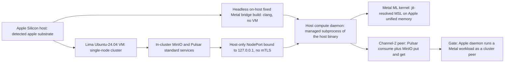

# Phase 28: Apple-Metal host compute daemon

**Status**: Authoritative source
**Supersedes**: N/A
**Referenced by**: DEVELOPMENT_PLAN/README.md, DEVELOPMENT_PLAN/overview.md, DEVELOPMENT_PLAN/phase_27_jitml_lift_cuda.md, DEVELOPMENT_PLAN/phase_29_multicluster_gateway_migration.md, DEVELOPMENT_PLAN/system_components.md, documents/engineering/apple_metal_headless_builds.md
**Generated sections**: none

> **Purpose**: Stand up the Apple-Silicon host compute daemon that runs a Metal ML workload as a plain cluster
> Pulsar/MinIO peer over a host-only loopback NodePort with no mTLS, with the native worker built **headless
> on-host through the fixed Metal bridge — no VM**.

---

## Phase Status

📋 Planned. Nothing in this phase is implemented; every sprint below is 📋 Planned and every prescriptive
statement is design intent, never a tested amoebius result. The phase runs on the **apple** substrate in
**Register 3** (live infrastructure): an Apple-Silicon host whose Lima-synthesized Ubuntu-24.04 Linux VM
carries a single-node cluster. The mechanisms it composes exist only as **sibling evidence, not amoebius
results**: the loopback-NodePort peering pattern is precedent in the sibling prodbox project (in-cluster
Harbor reached at `127.0.0.1:30080` over a loopback-bound NodePort); the headless fixed-Metal-bridge build is
proven in the sibling jitML project and adopted after the sibling infernix library *removed* its own legacy
Tart path; and the substrate detection + no-`PATH` lazy tool-ensure kernel is inherited from the hostbootstrap
seed. None has been built or run as amoebius, and there is no amoebius Tart code, now or planned. Status
transitions are recorded reverse-chronologically here once work begins.

## Phase Summary

This phase delivers the one class of amoebius compute that lives **outside a cluster pod**: a long-running
host subprocess that reaches hardware which refuses to be performantly contained — Apple-Metal needs Apple
Silicon unified memory, so it cannot run in a Linux container or a Linux VM. The phase does four things and
stops there. First, it manages the apple substrate, synthesizing the Linux host the cluster wants via **Lima**
and rooting every host tool in **brew** through the no-environment / no-`PATH` lazy tool-ensure contract —
probe, install-if-absent, resolve the absolute path from the package manager, invoke by full path. Second, it
binds the in-cluster MinIO and Pulsar standard services to a **host-only loopback NodePort** reachable only
from the host (`127.0.0.1:<nodeport>`), with no LoadBalancer, no Envoy route, and no path from LAN/WAN — the
sanctioned localhost carve-out from Keycloak-owns-all-wild-ingress. Third, it builds the native Apple-Metal
worker **headless, directly on the host — no VM (no Tart)** — via a fixed Objective-C/C Metal bridge
source-built with `/usr/bin/clang` by absolute path, with generated MSL compiled at runtime through the OS
Metal framework. Fourth, it runs that worker as a managed subprocess of the host binary and wires it as an
**ordinary Pulsar + MinIO peer over the host-only NodePort with no mTLS**: commands arrive as Pulsar messages,
results land in the content-addressed MinIO store, and there is no bespoke binary↔daemon RPC — coordination
*is* Pulsar/MinIO, with security from the network restriction, not from transport crypto.

The scope stops at the host-worker shell and its wire. The Metal ML kernel it runs is a **named catalog
identity the shared jit-build resolver materializes on first miss into the `CacheBudget`-bounded
content-addressed cache** (Phase 25), never a baked or URL-fetched payload; on the Apple substrate the cache
artifact is content-addressed source metadata — the rendered MSL plus launch/determinism metadata — not a
compiled dylib. The daemon carries no cluster-control authority: state-changing coordination flows through the
same Pulsar/MinIO nervous system every in-cluster worker uses, and the durable side of that store lives in the
Vault-enveloped MinIO bucket that is the stateless Deployment-`replicas=1` control-plane singleton's only
durable state (single-instance delegated to k8s/etcd, **no election**). The windows-CUDA host worker is the
structurally identical case on a different substrate and is named throughout as target shape, but it is **not**
part of this phase's single-substrate gate. This phase consumes earlier phases rather than re-implementing
them: Phase 13's substrate detection, `pb` midwife handoff, and no-`PATH` tool-ensure kernel; Phase 18's MinIO
and Pulsar standard services; Phase 22's native Pulsar client; Phase 23's content-addressed store and workflow
runtime; Phase 24's determinism kernel; Phase 25's jit-build engine cache; and Phase 17's Vault secrets-by-name.

**Substrate:** apple — the whole gate runs on an Apple-Silicon host whose Lima-synthesized Linux VM carries a
single-node cluster in Register 3 (live infrastructure); no linux-cpu, linux-cuda, or windows substrate is
touched by the gate, and the windows-CUDA host worker is named only as the structurally identical non-gate case.

**Register:** 3 — live infrastructure (§K).

**Gate:** an Apple-Silicon host daemon runs a Metal ML workload as a cluster Pulsar/MinIO peer over a host-only
NodePort — one `InForceSpec` in Register 3 brings up the apple-substrate cluster on Lima, exposes MinIO and
Pulsar on a host-only loopback NodePort, builds the native worker **headless on-host via the fixed Metal bridge
(no VM)**, starts the daemon as a managed subprocess, dispatches a Metal inference job over Pulsar with **no
mTLS**, lands its output in the content-addressed MinIO store by content address, and tears the worker and
cluster down leak-free; the run emits a proven/tested/assumed ledger recording that host-only reachability was
*tested* (reachable from `127.0.0.1`, unreachable from the LAN) and that no mTLS or bespoke RPC was introduced
on channel 2, with Apple-Metal physics marked *assumed* (sibling evidence, not an amoebius measurement).

## Doctrine adopted

This phase is the first live amoebius realization of three doctrines; individual sprints cite the same sections
where they adopt them.

- [`host_cluster_comms_doctrine.md §2`](../documents/engineering/host_cluster_comms_doctrine.md#2-the-decision-that-was-open-and-is-now-resolved)
  — *the decision that was open, and is now resolved*: this phase builds the resolved channel-2 design — a host
  compute daemon as a plain Pulsar + MinIO peer over host-only NodePorts with **no mTLS** — taking the two
  localhost-only channels of [`§1`](../documents/engineering/host_cluster_comms_doctrine.md#1-the-whole-surface-two-channels-both-localhost-only),
  the no-bespoke-control-channel rule of [`§3`](../documents/engineering/host_cluster_comms_doctrine.md#3-there-is-no-bespoke-control-channel--coordination-is-pulsar--minio)
  (*coordination is Pulsar + MinIO*), the network-restriction threat model of [`§5`](../documents/engineering/host_cluster_comms_doctrine.md#5-why-no-mtls-is-safe-here-the-network-restriction-is-the-security-boundary)
  (*why no mTLS is safe here*), the loopback-NodePort realization and prodbox precedent of [`§6`](../documents/engineering/host_cluster_comms_doctrine.md#6-the-host-only-restriction-in-practice-and-its-sibling-precedent),
  and the type-excluded illegal states of [`§7`](../documents/engineering/host_cluster_comms_doctrine.md#7-what-the-dsl-makes-unrepresentable-here)
  (*what the DSL makes unrepresentable here*).
- [`substrate_doctrine.md §5`](../documents/engineering/substrate_doctrine.md#5-host-worker-nodes-substrate-specific-hardware-that-refuses-to-be-contained)
  — *host worker nodes: substrate-specific hardware that refuses to be contained*: this phase implements the
  apple host worker (Apple-Metal on unified memory) as a managed subprocess of the host binary with the
  Load → Prereq → Acquire → Ready → Serve → Drain → Exit role lifecycle, built via the virtualized-substrate
  provider of [`§4`](../documents/engineering/substrate_doctrine.md#4-virtualized-substrates-synthesizing-a-linux-host-where-the-host-is-not-linux)
  ([`§4.1 — Lima on Apple`](../documents/engineering/substrate_doctrine.md#41-lima-on-apple) for the Linux VM),
  all under the [`§3`](../documents/engineering/substrate_doctrine.md#3-the-no-environment--no-path-lazy-tool-ensure-contract)
  *no-environment / no-`PATH` lazy tool-ensure contract* rooted in brew, handed off by the Python `pb` midwife
  of [`§6`](../documents/engineering/substrate_doctrine.md#6-the-midwife-contract-a-python-cli-ensures-a-toolchain-builds-the-binary-hands-off)
  (*the midwife contract*), never a shell script.
- [`apple_metal_headless_builds.md §1`](../documents/engineering/apple_metal_headless_builds.md#1-the-commitment-headless-on-host-no-vm)
  — *the commitment: headless, on-host, no VM* — with [`§3 — Architecture`](../documents/engineering/apple_metal_headless_builds.md#3-architecture)
  (the fixed host Metal bridge), [`§4 — Build and prerequisite model`](../documents/engineering/apple_metal_headless_builds.md#4-build-and-prerequisite-model),
  and [`§6 — Why Tart is not viable`](../documents/engineering/apple_metal_headless_builds.md#6-why-tart-is-not-viable-the-no-vm-rationale):
  this phase builds the Apple-Metal worker **headless on the host — no Tart, no macOS VM** — source-building the
  fixed Objective-C/C Metal bridge with `/usr/bin/clang` by absolute path and compiling generated MSL at
  runtime through the OS Metal framework, so a cache miss never starts a VM, invokes SwiftPM, or depends on a
  login keychain.

## Sprints

## Sprint 28.1: Apple substrate management — Lima Linux VM + brew lazy tool-ensure 📋

**Status**: Planned
**Implementation**: `src/Amoebius/Substrate/Apple.hs`, `src/Amoebius/Substrate/Lima.hs`, `src/Amoebius/Substrate/Brew.hs` (target paths; not yet built)
**Blocked by**: Phase 13 gate (external prereq — substrate detection, the `pb` midwife handoff, and the closed-enum no-`PATH` lazy-tool-ensure kernel that invokes by absolute path, here extended to the brew root and the Lima provider on apple)
**Independent Validation**: on a detected apple substrate, `ensure lima` is `brew install lima` when `limactl` is absent and a verified no-op otherwise; a named, project-budget-sized Ubuntu-24.04 VM starts and carries a single-node cluster; every host tool used is resolved to an absolute path via the package manager, and **no bare command name and no environment variable (including `PATH`) is ever read** on the host surface.
**Docs to update**: `documents/engineering/substrate_doctrine.md`

### Objective
Adopt [`substrate_doctrine.md §4.1 — Lima on Apple`](../documents/engineering/substrate_doctrine.md#41-lima-on-apple)
and [`substrate_doctrine.md §3`](../documents/engineering/substrate_doctrine.md#3-the-no-environment--no-path-lazy-tool-ensure-contract)
— the no-environment / no-`PATH` lazy tool-ensure contract — handed off by the Python `pb` midwife of
[`substrate_doctrine.md §6`](../documents/engineering/substrate_doctrine.md#6-the-midwife-contract-a-python-cli-ensures-a-toolchain-builds-the-binary-hands-off):
synthesize the Linux host the apple substrate's cluster runs on via Lima, with every host tool ensured and
invoked by absolute path through brew — the substrate foundation every later Phase-28 sprint stands on.

### Deliverables
- An apple-substrate manager that drives Lima (`limactl`) to start a named, budget-sized Ubuntu-24.04 VM and
  re-invokes amoebius subcommands inside it via `limactl shell <vm> -- <amoebius> <subcmd>` (the composition
  lift is owned elsewhere and only consumed here).
- A brew-rooted lazy-tool-ensure binding: probe → install-if-absent → resolve the absolute path from the
  package manager (`brew --prefix`) → invoke by full path; the install *plan* is a pure value so the substrate
  branching is unit-tested without invoking brew, and only the driver is `IO`.
- A substrate-applicability guard so the apple reconcilers fail fast — before any side effect — when run on a
  non-apple substrate, with a one-line diagnostic.

### Validation
1. With `limactl` absent, the reconciler installs it via brew, re-resolves it to an absolute path, and starts
   the VM; with it present, the same call is a verified no-op (idempotent).
2. A unit test exercises the pure install plan for apple without invoking brew.
3. Static/audit check: no host invocation passes a bare command name, and no code path reads an environment
   variable or `PATH` on the host surface.

### Remaining Work
The whole sprint (📋 Planned).

## Sprint 28.2: Host-only loopback NodePort exposure of MinIO + Pulsar 📋

**Status**: Planned
**Implementation**: `src/Amoebius/HostComms/NodePort.hs`, `src/Amoebius/HostComms/Loopback.hs` (target paths; not yet built)
**Blocked by**: Sprint 28.1 (the Lima VM provides the node network whose NodePorts must be bound to the host's loopback); Phase 18 gate (external prereq — the in-cluster MinIO and Pulsar standard services to expose)
**Independent Validation**: after bring-up, MinIO and Pulsar are reachable from the host at `127.0.0.1:<nodeport>` and **unreachable** from another machine on the LAN and from the WAN; there is no `LoadBalancer`-typed Service, no Envoy route, and no wild listener for either port; the loopback binding holds even though the Lima VM's node network does not bind NodePorts to loopback by default.
**Docs to update**: `documents/engineering/host_cluster_comms_doctrine.md`, `documents/engineering/substrate_doctrine.md`

### Objective
Adopt [`host_cluster_comms_doctrine.md §6 — the host-only restriction in practice`](../documents/engineering/host_cluster_comms_doctrine.md#6-the-host-only-restriction-in-practice-and-its-sibling-precedent)
and [`§1 — two channels, both localhost-only`](../documents/engineering/host_cluster_comms_doctrine.md#1-the-whole-surface-two-channels-both-localhost-only):
realize channel 2's transport — a NodePort bound to the host's loopback so the daemon connects to
`127.0.0.1:<nodeport>` with no path from LAN/WAN — generalizing the prodbox `127.0.0.1:30080` Harbor precedent
(sibling evidence, not an amoebius result) onto the Lima-backed apple substrate. The rendered manifests are
emitted from Haskell and never committed.

### Deliverables
- Rendered host-only NodePort Services for MinIO and Pulsar whose reachability is restricted to host-origin
  traffic, plus the substrate-layer loopback binding / host-only firewalling that makes the
  `127.0.0.1:<nodeport>` shape hold on the Lima VM **without relaxing the restriction** (never by publishing
  the port wider).
- An assertion seam proving the negative: no `LoadBalancer` Service, no Gateway/HTTPRoute, and no wild listener
  references either port — these are the only channel-2 endpoints and they are localhost-only.
- A recorded note that the same loopback shape is what the windows substrate's WSL2 case would target, as
  target shape (not exercised by the apple gate).

### Validation
1. Connect to MinIO and Pulsar from the host at `127.0.0.1:<nodeport>` and succeed; attempt the same from a
   second host on the LAN and fail (connection refused / no route).
2. Assert there is no `LoadBalancer`-typed Service and no Envoy route fronting either port.
3. Tear the cluster down and back up; the loopback binding is re-established idempotently.

### Remaining Work
The whole sprint (📋 Planned).

## Sprint 28.3: Headless host-native Metal bridge + native worker build (no Tart) 📋

**Status**: Planned
**Implementation**: `src/Amoebius/HostWorker/MetalBridge.hs` (fixed ObjC/C bridge install + probe + runtime MSL dispatch), `src/Amoebius/HostWorker/AppleMetalBuild.hs` (target paths; not yet built)
**Blocked by**: Sprint 28.1 (the apple substrate manager + brew lazy tool-ensure that resolves `/usr/bin/clang` and the OS Metal runtime by absolute path); Phase 25 gate (external prereq — the jit-build resolver + `CacheBudget`-bounded content-addressed cache the MSL source-metadata artifact lands in); Phase 24 gate (external prereq — the determinism kernel: fast-math-off, `experimentHash`)
**Independent Validation**: the fixed Objective-C/C Metal bridge dylib is source-built on the host with `/usr/bin/clang` (absolute path, no env/`PATH`), `dlopen`'d, and verified by its probe symbol; generated MSL compiles at runtime via `MTLDevice.makeLibrary(source:options:)` and dispatches on the host GPU; **no VM is ever started, no SwiftPM/`swift build` runs on a cache miss, and no login-keychain unlock is required**; the source-metadata cache artifact is content-addressed and reproducible from identical inputs.
**Docs to update**: `documents/engineering/apple_metal_headless_builds.md`, `documents/engineering/substrate_doctrine.md`

### Objective
Adopt [`apple_metal_headless_builds.md §1 — the commitment: headless, on-host, no VM`](../documents/engineering/apple_metal_headless_builds.md#1-the-commitment-headless-on-host-no-vm),
[`§3 — Architecture`](../documents/engineering/apple_metal_headless_builds.md#3-architecture),
[`§4 — Build and prerequisite model`](../documents/engineering/apple_metal_headless_builds.md#4-build-and-prerequisite-model),
and [`§6 — Why Tart is not viable`](../documents/engineering/apple_metal_headless_builds.md#6-why-tart-is-not-viable-the-no-vm-rationale),
with the host-worker build rule of [`substrate_doctrine.md §5`](../documents/engineering/substrate_doctrine.md#5-host-worker-nodes-substrate-specific-hardware-that-refuses-to-be-contained):
build the Apple-Metal worker **headless, directly on the host — with no macOS VM (no Tart)** — so build
provenance is host-controlled without inheriting VM lifecycle, keychain, or SwiftPM surfaces. The
headless fixed-bridge shape is proven in the sibling jitML project (sibling evidence, not an amoebius result);
this sprint realizes it in amoebius for the first time.

### Deliverables
- A fixed Objective-C/C Metal bridge, source-built once on the host by invoking `/usr/bin/clang` **by absolute
  path** (linking macOS `Foundation`/`Metal`), then `dlopen`'d and verified by resolving an exported probe
  symbol before the worker subscribes to work — no env, no `PATH`, no VM.
- Runtime MSL compilation: the host binary renders Metal Shading Language, writes a content-addressed
  source-metadata cache record into the Phase-25 `CacheBudget`-bounded cache, and dispatches through the
  bridge's `MTLDevice.makeLibrary(source:options:)` with fast-math **off** (the Phase-24 determinism
  contract), reusing an in-process pipeline cache across calls.
- The native Apple-Metal worker built on-host (targeting Apple Silicon unified memory) as a host-worker binary,
  **not** a container image; the optional Homebrew-`swiftc` + explicit-`SDKROOT` lane is available for any
  non-core Swift parts but is never the cache-miss path and never a VM.

### Validation
1. Build the fixed bridge with `/usr/bin/clang`, `dlopen` it, and pass its probe; assert no VM was started and
   no keychain unlock was needed.
2. Compile generated MSL at runtime through the bridge and dispatch a kernel; assert bit-stable output under
   the fast-math-off determinism contract, and that the source-metadata cache record is content-addressed and
   reproducible from identical inputs.
3. Static/audit check: the build/dispatch path invokes only absolute-path tools, reads no environment variable
   or `PATH`, and contains no `tart`, `swift build`, or offline `metal` invocation on the core path.

### Remaining Work
The whole sprint (📋 Planned).

## Sprint 28.4: Host compute daemon lifecycle as a managed subprocess 📋

**Status**: Planned
**Implementation**: `src/Amoebius/HostWorker/Lifecycle.hs`, `src/Amoebius/HostWorker/Supervise.hs` (target paths; not yet built)
**Blocked by**: Sprint 28.3 (the built native worker binary is what the lifecycle manages); Sprint 28.1 (the apple substrate context the subprocess runs in)
**Independent Validation**: the worker runs as a subprocess of the host binary with a defined Load → Prereq → Acquire → Ready → Serve → Drain → Exit lifecycle; a `Drain` runs **even if serving throws**; a missing prerequisite fails fast before `Serve`; killing the host binary tears the worker down with it (no unmanaged orphan process).
**Docs to update**: `documents/engineering/substrate_doctrine.md`

### Objective
Adopt [`substrate_doctrine.md §5 — host worker nodes: substrate-specific hardware that refuses to be contained`](../documents/engineering/substrate_doctrine.md#5-host-worker-nodes-substrate-specific-hardware-that-refuses-to-be-contained):
run the Apple-Metal worker as a **managed subprocess of the host binary** — the one place amoebius compute
lives outside a cluster pod — with the stateless-role lifecycle and a guaranteed drain, so the worker has a
defined startup and a clean shutdown rather than an unmanaged background process.

### Deliverables
- A supervised host-worker lifecycle implementing Load → Prereq → Acquire → Ready → Serve → Drain → Exit, with
  the drain guaranteed via bracket-style resource handling even when `Serve` raises.
- Prerequisite gating that fails fast — before `Serve` — when the Metal worker binary, the host-only NodePort
  endpoints, or the worker's MinIO/Pulsar credential names are not available, with a one-line diagnostic.
- Subprocess ownership tying the worker's lifetime to the host binary: a host-binary exit (clean or signal)
  drains and reaps the worker; no orphaned process survives.

### Validation
1. Start the worker, force `Serve` to throw, and assert `Drain` still runs and resources are released.
2. Remove a prerequisite and assert a fast, pre-`Serve` failure with an actionable message.
3. Kill the host binary mid-`Serve` and assert the worker subprocess is drained and gone.

### Remaining Work
The whole sprint (📋 Planned).

## Sprint 28.5: Channel-2 peer + wild-exposure unrepresentable + the Apple-Metal peer gate 📋

**Status**: Planned
**Implementation**: `src/Amoebius/HostWorker/Peer.hs`, `src/Amoebius/HostWorker/Auth.hs`, `src/Amoebius/HostComms/Illegal.hs`, `test/dhall/phase_28_apple_metal_peer.dhall`, `test/live/AppleMetalPeerSpec.hs` (target paths; not yet built)
**Blocked by**: Sprint 28.2 (the host-only loopback NodePorts the peer dials and the gate asserts is localhost-only); Sprint 28.4 (the daemon lifecycle whose `Serve` step does the peering); Phase 22 gate (external prereq — the native Pulsar CBOR client); Phase 23 gate (external prereq — the content-addressed store + workflow runtime); Phase 17 gate (external prereq — Vault for secrets-by-name auth)
**Independent Validation**: the worker subscribes to its work topic over the native Pulsar TCP binary protocol (no WebSockets), does the work, and writes outputs to the content-addressed MinIO store — all over `127.0.0.1:<nodeport>` with **no mTLS and no bespoke binary↔daemon RPC**; client auth resolves through Vault by secret-name, never via a host environment variable or `PATH`; a `.dhall` that gives a host-origin NodePort a `LoadBalancer` Service, an Envoy route, or any wild listener — or that gives the daemon its own wild ingress — **fails to type-check**; the gate `.dhall` runs the full Apple-Metal peer workflow end-to-end and tears down leak-free, emitting a proven/tested/assumed ledger artifact.
**Docs to update**: `documents/engineering/host_cluster_comms_doctrine.md`, `DEVELOPMENT_PLAN/README.md`, `DEVELOPMENT_PLAN/substrates.md`

### Objective
Adopt [`host_cluster_comms_doctrine.md §3 — coordination is Pulsar + MinIO`](../documents/engineering/host_cluster_comms_doctrine.md#3-there-is-no-bespoke-control-channel--coordination-is-pulsar--minio)
with the resolution of [`§2`](../documents/engineering/host_cluster_comms_doctrine.md#2-the-decision-that-was-open-and-is-now-resolved),
the threat model of [`§5 — why no mTLS is safe here`](../documents/engineering/host_cluster_comms_doctrine.md#5-why-no-mtls-is-safe-here-the-network-restriction-is-the-security-boundary),
and the type-exclusions of [`§7 — what the DSL makes unrepresentable here`](../documents/engineering/host_cluster_comms_doctrine.md#7-what-the-dsl-makes-unrepresentable-here):
make the host worker an ordinary Pulsar/MinIO peer over the host-only NodePort with no custom RPC and no
transport crypto, close the carve-out so its boundaries cannot be drawn wrong, and prove the phase gate from
[`§1`](../documents/engineering/host_cluster_comms_doctrine.md#1-the-whole-surface-two-channels-both-localhost-only)
— an Apple-Silicon host daemon runs a Metal ML workload as a cluster Pulsar/MinIO peer.

### Deliverables
- A channel-2 peer that consumes its work topic via the shared native-protocol Pulsar client (at-least-once +
  dedup preserved; broker ids/timestamps are never part of any content address) and writes results to
  `blobs/<sha256>` + a content-addressed manifest in the MinIO store — the same coordination shape an
  in-cluster worker Pod uses — over a plain socket on `127.0.0.1:<nodeport>` with **no mTLS layer added**, and
  secrets-by-name client auth resolved through Vault (no host env, no `PATH`, no bespoke RPC to the binary).
- Type-level exclusions instantiated from the illegal-state catalog: a host-origin NodePort cannot be expressed
  as `LoadBalancer`-typed, Envoy-routed, or wild-listening, and a host compute daemon cannot publish its own
  wild ingress — its only inbound coordination is Pulsar/MinIO peering.
- The gate `.dhall` (`test/dhall/phase_28_apple_metal_peer.dhall`, emitted from Haskell, never committed):
  bring up the apple cluster on Lima, expose MinIO/Pulsar on the host-only loopback NodePort, build the worker
  **headless on-host via the fixed Metal bridge (no VM)**, start the daemon as a managed subprocess, dispatch a
  Metal inference job over Pulsar, land its output in the content-addressed store, then tear the worker and
  cluster down — emitting a ledger recording NodePort-is-localhost-only and no-mTLS / no-bespoke-RPC as
  **tested on apple**, and Apple-Metal physics as **assumed** (prodbox loopback precedent, not an amoebius
  proof).

### Validation
1. A deliberately wild-exposing host-comms `.dhall` (NodePort as `LoadBalancer`, an Envoy route on it, or a
   daemon wild ingress) fails to type-check.
2. The gate `.dhall` runs the full Apple-Metal peer workflow: the worker consumes the job over native Pulsar
   (no WebSocket frames, no TLS handshake, only `127.0.0.1:<nodeport>`), lands a content-addressed output in
   MinIO retrievable by its content address, and tears down leak-free.
3. Auth resolves the worker's MinIO/Pulsar credentials by name through Vault with no env/`PATH` read; the
   ledger artifact is emitted and marks the Apple-Metal physics row as assumed, not green.

### Remaining Work
The whole sprint (📋 Planned).

## Documentation Requirements

**Engineering docs to update (when the gate runs, flip the honest layer, never before):**
- `documents/engineering/host_cluster_comms_doctrine.md` — its §9 planning-ownership pointer resolves to
  delivered Phase-28 sprints, and the §2/§5/§6 honesty notes flip from "resolved design decision / sibling
  evidence" to a delivered, apple-tested channel-2 peer (status recorded here in the plan, never as doctrine
  status); add the `Amoebius.HostComms.*` and `Amoebius.HostWorker.*` module paths to its cross-reference set.
- `documents/engineering/apple_metal_headless_builds.md` — its §1/§3/§4/§6 honesty notes flip from "jitML
  sibling evidence / design intent" to a delivered, apple-tested amoebius fixed-Metal-bridge build (status in
  the plan, never as doctrine status).
- `documents/engineering/substrate_doctrine.md` — its §9 planning-ownership pointer resolves to delivered
  Phase-28 sprints; the §4.3 "no macOS build VM" note and the §5 host-worker description gain their first
  amoebius datapoint on apple; record that the Lima provider, the headless on-host Metal-bridge build, and the
  brew lazy-tool-ensure were exercised by full-path subprocess with no env/`PATH`.

**Cross-references to add:**
- [README.md](README.md) — flip the Phase-28 row status once the gate passes and link this document.
- [substrates.md](substrates.md) — record Phase 28's gate substrate (apple) in the per-phase substrate map, and
  note the windows-CUDA host worker as the structurally identical non-gate case.
- [system_components.md](system_components.md) — register the host-worker and host-comms modules
  (`Substrate/Apple`, `Substrate/Lima`, `Substrate/Brew`, `HostComms/NodePort`, `HostComms/Loopback`,
  `HostWorker/MetalBridge`, `HostWorker/Lifecycle`, `HostWorker/Peer`) and the `AppleMetalPeerSpec` live suite
  as Phase-28 design-first rows.

## Related Documents
- [README.md](README.md) — the live tracker; the Phase 28 row is the authoritative one-line gate and status
- [development_plan_standards.md](development_plan_standards.md) — the rulebook this document obeys (the
  Register-3 honesty token: a passed gate is a live-substrate result, never a compile claim)
- [overview.md](overview.md) — the target architecture and cross-cutting invariants (the host-only NodePort
  carve-out, host worker nodes, the stateless `replicas=1` singleton, and jit-resolved engine payloads)
- [system_components.md](system_components.md) — the target component inventory for the module paths above
- [Host ↔ Cluster Comms Doctrine](../documents/engineering/host_cluster_comms_doctrine.md) — the host-only
  NodePort, no-mTLS channel-2 peer design this phase implements
- [Apple Metal Headless Builds](../documents/engineering/apple_metal_headless_builds.md) — the headless,
  on-host, no-Tart fixed-Metal-bridge build/run shape this phase implements
- [Substrate Doctrine](../documents/engineering/substrate_doctrine.md) — the apple host worker, the Lima
  provider, the no-env/no-`PATH` tool-ensure, and the `pb` midwife contract this phase implements
- [Pulsar Client Doctrine](../documents/engineering/pulsar_client_doctrine.md) — the native-protocol CBOR
  client the peer rides on (cross-reference, not adopted here)
- [Vault / PKI Doctrine](../documents/engineering/vault_pki_doctrine.md) — the secrets-by-name client auth the
  channel-2 peer resolves through (cross-reference, not adopted here)
- [phase_25](phase_25_jitbuild_engine_cache.md) — the jit-build engine resolver + `CacheBudget` cache the Metal
  kernel is materialized into
- [phase_27](phase_27_jitml_lift_cuda.md) — the CUDA jitML lift; its Windows-CUDA case is the structurally
  identical host worker on a different substrate
- [Engineering Doctrine Index](../documents/engineering/README.md) — the doctrine suite these phases adopt
