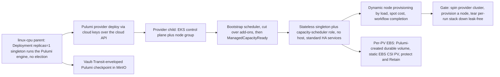

# Phase 30: Provider-managed clusters + dynamic provisioning

**Status**: Authoritative source
**Supersedes**: N/A
**Referenced by**: DEVELOPMENT_PLAN/README.md, DEVELOPMENT_PLAN/overview.md, DEVELOPMENT_PLAN/phase_28_multicluster_spawn_georepl.md, DEVELOPMENT_PLAN/phase_29_gateway_migration_drills.md, DEVELOPMENT_PLAN/phase_36_test_topology_dsl.md, DEVELOPMENT_PLAN/system_components.md
**Generated sections**: none

> **Purpose**: Extend amoebius's reach from self-managed `kind`/`rke2` children to provider-managed clusters
> (EKS) provisioned by encrypted-MinIO-backed Pulumi under the Deployment-`replicas=1` singleton, standing up a
> stateless hostless in-cluster singleton plus capacity-scheduler roles, dynamic node provisioning from explicitly shaped and quota-bounded
> provider node classes, and per-PV EBS decoupled from the node lifecycle and reattached through a static-only
> AWS EBS CSI path — gated live on linux-cpu by spinning a provider cluster up, provisioning a capacity-checked
> node, and tearing down leak-free.

---

## Phase Status

📋 Planned. Nothing in this phase is implemented; every sprint below is 📋 Planned and every prescriptive
statement is design intent, never a tested amoebius result. The phase runs on the **linux-cpu** substrate in
**Register 3** (live infrastructure): the parent amoebius cluster is a single-node `kind` cluster on
linux-cpu, brought up by the Phase 14 midwife, from inside which the Pulumi engine issues the provider deploy
over the cloud API. `→ provider` names the *deploy target class* — a cloud-managed EKS cluster reached over the
cloud API — not a fifth hardware substrate; the provider child has no host and no Apple/CUDA substrate of its
own, so the gate stays single-substrate (`linux-cpu`) while exercising a provider target. The
provider-cluster-via-Pulumi shape, the encrypted-MinIO Pulumi backend, the EKS deploy, and the
operational-vs-elevated credential split are all generalized from the sibling **prodbox** project (its
`aws-eks` Pulumi stack, `Prodbox.Pulumi.EncryptedBackend`, and the credential model) — read as **sibling
evidence, not an amoebius result** (honesty rule, [development_plan_standards.md §K](development_plan_standards.md)).
Status transitions are recorded reverse-chronologically here once work begins.

## Phase Summary

This phase delivers the **first-class managed-provider arm** of the compute-engine axis: EKS is provisioned via
cloud keys over the cloud API, where there is no host binary and the cloud provider owns the control plane. It
owns four deliverables, all driven from a single linux-cpu parent, plus the phase gate.

First, a **provider-cluster Pulumi deploy from inside a parent**: a `pulumi up` that runs **only** from inside
an already-running amoebius cluster, issued by the Deployment-`replicas=1` control-plane singleton (Phase 22) —
whose single-instance is a k8s/etcd property, never a bespoke amoebius election — with the logical checkpoint
held as a closed set of Vault-Transit-enveloped objects in MinIO. There is no laptop `pulumi up`, no plaintext state, and no
`PULUMI_*`/`AWS_*`/`PATH` env side-channel: the `pulumi` binary and cloud plugin are discovered lazily by full
path. The provider stack's exact resource-state field/revision objects, retention and failed-partial/orphan
exposure carry a `StorageBudgetId` and exclusive mutation admission, while its bounded
`PulumiExecutionDemand` provisions complete parent-side executor Jobs plus plugin-cache/workspace peaks before
any checkpoint or cloud effect. Second, a **stateless in-cluster control plane (no host)**: a provider child
has no host access and therefore no host worker daemons. It runs the one singleton reconciler role **and** the
mandatory `amoebius-capacity` scheduler role from the same binary/image, converging the same full standard
cluster shape assembled across Phase 15 and Phases 18–21 from typed manifests — not a thinner cluster. The
parent is the child's bootstrap Lease holder: after the EKS API/base node is reachable it stages
`BootstrapCapacitySchedulerReady`, cuts every provider bootstrap add-on from default scheduling to joined
reservations, installs taint/admission/exclusive Binding authority, and observes `ManagedCapacityReady` before
any platform workload. It then transfers the child Lease through release and fresh holder-absence readback on
that same still-present object to the child
singleton. Third,
**dynamic node
provisioning by logic**: the node set is itself declarative and reactive, grown and shrunk by load, spot-cost,
and workflow completion as *just another reconcile* (Phase 16) over the desired node set in the `.dhall`.
Every provider node class names a catalog-pinned provider SKU and a net per-instance supply shape —
allocatable CPU plus a finite overcommit policy, memory, an explicit
`PerInstanceDiskTemplate` whose backing is
`InstanceStore { skuDevice, provisionedRawBytes, presentation } |
EphemeralRootEbs { policy }`, whose `systemReserve` and non-empty `carves` are
`ProviderUsableDiskCarveTemplate { id, requiredUsableBytes }` values, a closed
`Unified | SplitRuntime | SplitImage` kubelet filesystem layout, OCI-content/snapshot storage model and pull
policy, accelerator-slot templates, zones, price, explicit provider-vCPU
quota cost, and base/maximum counts — all derived from or cross-checked against the immutable SKU snapshot — and the
provider quota separately caps
instances/vCPU, ephemeral node-root EBS bytes/count, durable retained bytes/count, and any accelerator-family
allocation. Node classes also declare pod-slot and driver-indexed CSI-attachment policies. Placement spends
both resources atomically and live admission uses the lesser of the declaration, kubelet/CNI residual, and
`CSINode`/SKU limits. Before Pulumi may create a control
plane, node group, node, or EBS volume, `planInfrastructure` must derive the exact placement/storage/
capability demand for the worst-case elastic shape and prove it is inside both the node-class maxima and
provider quota; no fitting class or quota headroom means a structured rejection with zero cloud effects.
Only receipt-bound materialization later constructs `ProvisionContext` and permits `provision`. A read-only AWS observer obtains
authoritative service-quota limits and current account allocations plus SKU/zone availability. For every
referenced provider-object `CloudQuotaBacking`, the same snapshot also contains complete object count and
complete byte usage in the declaration's exact closed
`Logical { model, witness } | Billed { model, conversion, witness }` accounting arm; a unit/model mismatch or
incomplete object/version pagination refuses. Residual is
`min(declared carve, observed limit - observed usage)`, and unknown/unavailable data refuses. When more than one child shares the
same `CloudAccountId`, the parent first carves owner-distinct per-cluster quotas from the forest
`SharedSupplyLedger`; independent child declarations cannot each reuse the account maximum. The canonical
Phase-30 fixture uses
CPU-only classes whose accelerator offering is explicitly `None`, never an omitted capability.
Fourth, **per-PV EBS decoupled from the node lifecycle under a create-vs-delete credential model**: each claim
has exactly one PV and one EBS volume. Its application/geometry-derived usable bytes pass through the declared
`VolumePresentation` and provider minimum/whole-GiB allocation model to one private rounded
`provisionedBytes` used by PVC, PV, and `CreateVolume`. The EBS is carried in its own durable Pulumi state
flagged `protect`/`Retain` so a
normal per-run teardown never includes it, while the operational credential is *denied* `ec2:DeleteVolume` so
accidental durable-data destruction is unauthorized at the cloud API, not merely discouraged. Pulumi creates
the durable EBS volume; it does **not** delegate provisioning to Kubernetes. The typed manifest reconciler
installs the upstream AWS EBS CSI controller/node components from binaries baked into the amoebius base image
(no Helm and no public image pull), omits the external provisioner, and renders a fresh static PV with
`spec.csi.driver: ebs.csi.aws.com`, `volumeHandle: <Pulumi EBS volume ID>`, and matching Availability-Zone
affinity. The cluster's sole StorageClass remains `kubernetes.io/no-provisioner`.

Provider VM/node-root disks, durable claim volumes, and their transitions keep usable and raw geometry
distinct. Checked construction privately derives one `ProvisionedPerInstanceDiskTemplate` per selected
instance and disk template. For `InstanceStore`, `provisionedRawBytes` is SKU-pinned raw device supply; for
`EphemeralRootEbs`, the summed usable system/layout demand is presentation-expanded and provider-rounded into
the private root request's raw `provisionedBytes`. Only then does the presentation model derive
`mountedUsableBytes` and prove
`systemReserve.requiredUsableBytes + Σ unique carves.requiredUsableBytes ≤ mountedUsableBytes`; no usable
carve enters a raw parent sum. Durable EBS derives the corresponding full
`ProviderVolumeRequest`. Replacement or shrink is a `StorageMigrationDemand`, not an in-place edit: old and
new raw allocations, provider volume counts, copy/verify workspace, and the complete copy Job envelope must
fit simultaneously. A failed copy/verification or unobservable cleanup retains and charges both volumes;
retiring the old binding is never advance quota credit.

Phase 30 is the live owner of storage scaling's `CreateProviderCapacity` arm. Phase 7 owns the policy-only
envelope and observe-then-plan fold, and Phase 16 owns the generic fresh-snapshot validation and single-use
dispatcher. This phase alone supplies the account-scoped cloud mutation capability: the transition embeds an
exact storage-capacity refinement of the batch-owned Pulumi graph, validates it against current durable
byte/count quota and execution supply, consumes its cloud and scaling tokens once, then accepts only
receipt-bound EBS/checkpoint readback. Retained-carve allocation and host migration remain Phase 17 arms.

This phase consumes — and does not re-implement — Phase 15's base image + registry; Phases 17–21's retained
storage, Vault/PKI, platform services, and Keycloak-owned ingress; the Phase 16 typed SSA reconciler; the Phase 22
Deployment-`replicas=1` singleton live-deploy path; and the Phase 28 amoebic-spawn machinery (the encrypted
MinIO backend + per-child Vault-envelope). Provider-cluster spawn is
the *cloud-keyed* sibling of Phase 28's *SSH-keyed* self-managed spawn over the same backend and the same
bring-up → init → reconcile → teardown lifecycle vocabulary. The `Managed Eks` arm carries **no** `LinuxHost`
witness; that type-level foreclosure lands in the pre-cluster band (the Dhall Gate-1 schema in Phase 4, the
GADT decoder in Phase 5, and the capacity/topology folds in Phase 7), and this phase provisions and observes it
at runtime.

**Substrate:** linux-cpu → provider — the §L Parent-drives-provider escape form. The acceptance gate runs on
exactly one hardware substrate, the linux-cpu parent
`kind` cluster from inside which the Pulumi engine issues the deploy; `→ provider` (EKS) is the deploy target
class, not a hardware substrate ([development_plan_standards.md §L](development_plan_standards.md#l-one-substrate-discipline)).

**Register:** 3 (live infrastructure) — the gate spins up real provider resources, runs a workflow, and tears
them down; no register-1/2 in-process check discharges it.

**Gate:** an `InForceSpec` that, from a **linux-cpu** parent, **spins up a provider-managed EKS cluster** via
the encrypted-MinIO-backed Pulumi deploy issued by the Deployment-`replicas=1` singleton (no bespoke election),
brings up its stateless hostless in-cluster control plane, **dynamically provisions an extra node by evaluating a
declared signal rule** (not by an operator hand-editing the target) from a named node class whose exact
CPU/memory/logical-ephemeral/filesystem-layout/content+snapshot/accelerator shape, provider-vCPU and
node-root-storage cost, and maximum count are in the
fixture, and observes it join
with allocatable capacity at least that declaration. Before the first platform Pod, the gate observes the
child's bootstrap scheduler/config/root, complete default-scheduled add-on UID cutover, and full managed
taint/admission/exclusive-Binding writer authority. Before the extra node becomes eligible, provider bootstrap
registers it with the managed-capacity taint, verifies its complete supply/layout/device observation, extends
the scheduler target/config/root by CAS, and observes node-scoped authority; no default-scheduled or unreserved
Pod may race node join. The complete workload envelope, worst-case elastic node
count, parent Pulumi executor/volume peaks, exact checkpoint-object peak, pod slots, and CSI attach slots must
provision inside those shapes and the declared provider quota **before the first cloud
mutation**; the provider quota is itself an owner-distinct carve from the observed account ledger, and the
committed over-quota/double-spend negatives are rejected with zero mutating AWS calls. The gate then re-runs
the same desired state against the still-standing provider stack and verifies a zero-mutation no-op before **tearing the
per-run cluster stack down leak-free** — VPC, control plane, node group, and the provisioned node all destroyed
with no orphans, with any durable per-PV EBS correctly **retained** (a retained durable volume is not a leak —
it is its class behaving correctly). Before teardown, the gate writes a run-unique marker through the claim
bound to the static EBS CSI PV over the retained EBS backing and records the EBS identity and Availability
Zone. A second full spin-up
→ run → teardown cycle from the post-teardown **provider-stack-absent state, with durable EBS retained**, uses
the same declared Availability Zone, recreates the static PV over the same `volumeHandle`, reattaches that EBS,
and reads the marker byte-for-byte; it is expected to issue create/delete calls and is not a no-op. Each cycle
emits a proven/tested/assumed ledger artifact. The elevated-harness reclamation of durable test-flagged EBS
that makes a *full* leak-free test *cycle* possible is Phase 36 work, deferred and never depended on here.

**Leak-free is defined by an independent OS-boundary observer, never by the implementation's own evidence**
(§M.5). "No orphans / leak-free" means: after teardown, an **independent read-only cloud-API sweep** — direct
AWS `Describe*` queries under a distinct read-only audit credential, scoped to the run's unique test tag
(`amoebius:test-run=<run-id>`), explicitly **NOT** the emptied Pulumi checkpoint and **NOT** the managed-resource
registry's own `discover` — returns **zero** ephemeral-class resources (VPC, EKS control plane, node group,
provisioned node, and any provider-spawned ELB/ENI/CloudWatch-log-group/IAM-role bearing the tag), with the
retained durable per-PV EBS the **sole** permitted survivor by class; a non-empty sweep fails the run and its
leak list is recorded in the ledger. "Converges as a no-op" applies only to the second reconcile against the
still-standing stack: the OS-boundary cloud-API audit trail (a CloudTrail-equivalent mutating-call log, external
to the reconciler) records **zero mutating** create/modify/delete calls during that reconcile — not exit 0, not
the reconciler's self-reported empty diff. A repeated full cycle starts from provider-stack-absent state with
durable EBS retained, is expected to create and delete ephemeral resources again, and demonstrates repeatability
by reaching the same empty ephemeral-resource sweep.

**Representative set (§M.7):** the gate corpus is exactly the committed topology
`test/dhall/phase_30_provider_provision.dhall` — one `Managed Eks` control plane, one base managed node group
(size 1), one dynamically provisioned extra node from that **same** `ProviderNodeClass` driven by a
workflow-completion `ScalingPolicy`, two named CPU-only provider node classes (selected and fallback) whose exact
allocatable CPU plus finite overcommit policy, memory, per-instance raw root-disk backing,
`ProviderUsableDiskCarveTemplate` system reserve and layout-indexed usable filesystem carves, image
content/snapshot model and pull concurrency, zones, prices, provider-vCPU costs,
base/maximum counts, pod-slot/`ebs.csi.aws.com` attach-slot policies, and explicit `accelerator = None`
offerings are committed in the fixture. The selected
class uses `EphemeralRootEbs` with `Unified` layout, so it cannot invent SKU-local instance storage; the
separate-runtime layout is exercised live in Phase 14 and by provider layout mutants. A provider quota
bounding maximum instances/vCPU, accelerator allocation, ephemeral node-root EBS bytes/count, and durable EBS
bytes/count; a checkpoint `StorageBudget`; bounded Pulumi plugin/workspace volumes and executor concurrency;
one declared
Availability Zone shared by that node group and one per-PV EBS volume (durable class) attached to a
single-replica StatefulSet claim `<ns>/sts0/pv_0` through a static
`ebs.csi.aws.com` PV whose `volumeHandle` is that Pulumi-created volume ID, a run-unique marker written through
that claim, and the operational create-only credential. **Committed mutation quota (§M.2):** the gate re-runs,
and requires red from, at least
the committed seeded mutants named per sprint below — minimally the teardown-skips-tag-sweep mutant
(`mut-30.5-skip-sweep`, an orphan ELB left untagged-for-destroy that the registry `discover` cannot see but the
independent sweep must catch), the signal-ignoring node-provisioner mutant (`mut-30.4-ignore-signal`), and the
quota-bypass mutant (`mut-30.4-apply-over-quota`) that attempts cloud mutation after the pure quota fold has
failed. All
mutant fixtures and the reference oracles (expected sweep result, expected argv/env, expected denied-call tag,
and expected two-instance identity map)
are authored and **committed in Phase 0 before the implementation exists** (§M.1), independently of the code
under test (§M.3).

## Doctrine adopted

- [`pulumi_iac_doctrine.md §1`](../documents/engineering/pulumi_iac_doctrine.md#1-pulumi-runs-only-from-inside-an-existing-amoebius-cluster)
  — *Pulumi runs only from inside an existing amoebius cluster* — with
  [`§2`](../documents/engineering/pulumi_iac_doctrine.md#2-the-backend-every-byte-of-state-is-a-vault-enveloped-object-in-minio)
  (*every byte of state is a Vault-enveloped object in MinIO*),
  [`§3`](../documents/engineering/pulumi_iac_doctrine.md#3-state-lifetime-matches-resource-lifetime-per-class)
  (*state lifetime matches resource lifetime, per class*),
  [`§4`](../documents/engineering/pulumi_iac_doctrine.md#4-what-pulumi-provisions-the-resource-catalog)
  (*the resource catalog* — provider-cluster and dynamic-node entries),
  [`§6`](../documents/engineering/pulumi_iac_doctrine.md#6-the-ebs-create-vs-delete-credential-model)
  (*the EBS create-vs-delete credential model*), and
  [`§8`](../documents/engineering/pulumi_iac_doctrine.md#8-how-deploys-are-enacted-the-reconciler-referenced-not-restated)
  (*deploys are enacted by the reconciler, not a global state machine*): this phase realizes the catalog's
  provider-cluster, dynamic-node, and per-PV-EBS entries as Pulumi deploys that obey the one rule (engine under
  the singleton, no env vars, no `PATH`, logical checkpoint as a Vault-enveloped MinIO object set), each classified by
  lifetime so the per-run stack dies with its run while durable EBS does not, and each EBS volume guarded by the
  create-but-never-delete operational credential.
- [`cluster_lifecycle_doctrine.md §1`](../documents/engineering/cluster_lifecycle_doctrine.md#1-two-cluster-kinds-one-lifecycle-shape)
  — *two cluster kinds, one lifecycle shape* — with
  [`§3`](../documents/engineering/cluster_lifecycle_doctrine.md#3-amoebic-spawning--the-recursive-forest)
  (*amoebic spawning — the recursive forest*),
  [`§8`](../documents/engineering/cluster_lifecycle_doctrine.md#8-dynamic-node-provisioning)
  (*dynamic node provisioning*), and
  [`§9`](../documents/engineering/cluster_lifecycle_doctrine.md#9-how-bring-up-and-teardown-are-implemented-the-reconciler-not-a-state-machine)
  (*bring-up and teardown are a reconciler, not a state machine*): this phase delivers the *provider-managed*
  column of the two-cluster-kinds table (no child host binary or host worker daemons; one in-cluster singleton
  plus the mandatory capacity-scheduler role)
  as a cloud-keyed amoebic spawn sharing Phase 28's lifecycle vocabulary, and makes the node set declarative so
  provisioning a node is one more pass of the `discover → diff → enact → re-observe`, `Unreachable → refuse`
  reconciler.
- [`daemon_topology_doctrine.md §3.1`](../documents/engineering/daemon_topology_doctrine.md#31-exactly-one-pod-is-a-k8setcd-property-not-an-amoebius-election)
  and [`§5`](../documents/engineering/daemon_topology_doctrine.md#5-single-instance-and-coordination--delegated-not-elected)
  — *exactly one pod is a k8s/etcd property* / *single-instance and coordination — delegated, not elected*: the
  Pulumi engine runs under the Deployment-`replicas=1` singleton whose single-instance is a k8s/etcd concern, so
  nothing in this phase runs a bespoke leadership election. A provider child runs exactly one in-cluster
  singleton role plus the mandatory `amoebius-capacity` scheduler role from the same binary/image, and zero
  host daemons; scheduler reservation/Binding is capacity authority, not singleton election.
- [`storage_lifecycle_doctrine.md §5.1`](../documents/engineering/storage_lifecycle_doctrine.md#51-storage-is-independent-of-the-node-lifecycle)
  and [`§7 / §7.1`](../documents/engineering/storage_lifecycle_doctrine.md#7-deleting-durable-data-is-forbidden-under-normal-operation)
  — *storage is independent of the node lifecycle* / *deleting durable data is forbidden under normal
  operation*: per-PV EBS survives node replacement and reattaches through a statically rendered EBS CSI PV
  rather than dynamic provisioning. Within amoebius automation, only the Phase 36 elevated harness may destroy
  a test-owned volume; production reclaim is an external operator break-glass action against an exact
  `ReclaimEligible` target, never a routine teardown. Provider-volume replacement/shrink consumes the generic
  old+new `StorageMigrationDemand`; old/new raw allocation, copy workspace and execution, and provider
  byte/count overlap stay charged through verification and failed cleanup.
- [`image_build_doctrine.md §2`](../documents/engineering/image_build_doctrine.md#2-the-single-distribution-rule-bake-the-binaries-build-the-amoebius-image-pull-only-in-cluster)
  with [`§7`](../documents/engineering/image_build_doctrine.md#7-what-amoebius-bakes-vs-builds--the-base-container-is-the-supply-chain)
  — *third-party binaries are baked; workloads pull only in-cluster*: the upstream AWS EBS CSI
  controller/node implementation and required sidecars are consumed as baked binaries under typed manifests,
  never as a public image or Helm chart.
- [`resource_capacity_doctrine.md §6`](../documents/engineering/resource_capacity_doctrine.md#6-growable--scalingpolicy-the-quota-bounded-dynamic-provisioning-arm)
  and [`§3.1`](../documents/engineering/resource_capacity_doctrine.md#31-the-systematic-provision-matrix)
  — *`Growable` / `ScalingPolicy`: the escape valve amoebius owns* and *the systematic provision matrix*:
  dynamic node provisioning is the runtime enaction of a typed `ScalingPolicy`; every provider node class
  declares its complete capacity/capability shape, the workload is provisioned against the worst-case elastic
  count, and the provider quota is the outer ceiling. A bounded budget grows only through the policy and never
  to "unbounded"; failure of any CPU, memory, pod-ephemeral (including in-cluster cache), pod/CSI slot,
  durable-storage, Pulumi executor/plugin/workspace, checkpoint-object budget, migration-transition,
  accelerator, VRAM, or provider-quota obligation rejects before cloud mutation.
- [`app_vs_deployment_doctrine.md §3`](../documents/engineering/app_vs_deployment_doctrine.md#3-the-deployment-rules-surface--how-the-same-app-runs)
  — *the deployment-rules surface*: node elasticity lives on the deployment-rules DSL surface; an app never asks
  for nodes.
- [`chaos_failover_doctrine.md §12`](../documents/engineering/chaos_failover_doctrine.md#12-the-moral-core--proven-tested-assumed)
  (cross-reference) — *proven, tested, assumed*: each gate run emits a proven/tested/assumed ledger; skipping an
  applicable teardown-observation move marks that layer UNVERIFIED, never green.

## Sprints

## Sprint 30.1: Provider-cluster Pulumi deploy from inside a parent 📋

**Status**: Planned
**Implementation**: `amoebius-pulumi/src/Amoebius/Pulumi/Provider/Eks.hs` (the EKS provider program — the
phase-new module), built on the `amoebius-pulumi` engine seam (`.../Pulumi/Engine.hs`) and the
Vault-Transit-enveloped MinIO backend (`.../Backend/EncryptedMinio.hs`) **first delivered by Phase 28 and reused
here, not rebuilt** (target paths from [system_components.md](system_components.md); not yet built)
**Blocked by**: Phase 28 gate (amoebic spawning via Pulumi with the encrypted-MinIO backend + per-child
Vault-envelope, the SSH-keyed spawn this generalizes); Phase 22 gate (the Deployment-`replicas=1` singleton
live-deploy path that runs the engine); Phase 19 gate (MinIO reachable as a standard HA platform service);
Phase 18 gate (root Vault + the Transit envelope) — all external earlier-phase prerequisites.
**Independent Validation**: from a linux-cpu parent, a `pulumi up` issued by the in-cluster singleton reaches a
ready EKS control plane + node group built from the fixture's named base-node-class capacity/capability shape;
  the parent first places the complete executor Job plus plugin/workspace peaks and provisions the exact
  checkpoint state-field/revision object peak against its `StorageBudgetId` and exclusive mutation admission;
  the joined node's observed allocatable CPU, memory, logical pod ephemeral capacity, closed
  nodefs/imagefs/containerfs identities and capacities, resident OCI content/snapshot inventory, storage-model
  version, and enforced image-pull policy meet the declared values and its accelerator offering is explicitly
  `None`; the exact checkpoint object set lands in MinIO as opaque Vault-enveloped objects
unreadable without an unsealed Vault; a deploy attempted with a sealed Vault **refuses before any cloud
mutation**; the deploy subprocess is spawned with no `PULUMI_*`/`AWS_*`/`PATH` in its environment and the
`pulumi`/plugin paths are absolute.
**Docs to update**: `documents/engineering/pulumi_iac_doctrine.md` (§1, §2, §4),
`documents/engineering/cluster_lifecycle_doctrine.md` (§3), `documents/engineering/substrate_doctrine.md` (the
no-env/no-`PATH` lazy discovery of `pulumi` + the cloud plugin), `DEVELOPMENT_PLAN/system_components.md`.

### Objective

Adopt [`pulumi_iac_doctrine.md §1 — Pulumi runs only from inside an existing amoebius cluster`](../documents/engineering/pulumi_iac_doctrine.md#1-pulumi-runs-only-from-inside-an-existing-amoebius-cluster)
and the provider-cluster catalog entry in [`§4 — What Pulumi provisions`](../documents/engineering/pulumi_iac_doctrine.md#4-what-pulumi-provisions-the-resource-catalog):
make "spin up a provider-managed cluster" something the cluster does under its Deployment-`replicas=1` singleton
— never something a laptop shell does behind the cluster's back — with state held as a Vault-enveloped MinIO
object set, generalizing Phase 28's SSH-keyed self-managed spawn to a cloud-keyed provider spawn. The
`pulumi` binary and cloud plugin are ensured under
[`substrate_doctrine.md §3 — the no-environment / no-`PATH` lazy tool-ensure contract`](../documents/engineering/substrate_doctrine.md#3-the-no-environment--no-path-lazy-tool-ensure-contract):
discovered lazily by full path, with no `PULUMI_*`/`AWS_*`/`PATH` side-channel exported into any child process.

### Deliverables

- An `Amoebius.Pulumi.Engine` seam that runs the Pulumi engine **only** under the in-cluster singleton (Phase
  22), whose single-instance is a k8s/etcd property; there is no host-shell entrypoint that can `pulumi up` a
  provider cluster.
- An `Amoebius.Pulumi.Backend.EncryptedMinio` backend: the logical checkpoint is a model-derived closed set of
  opaque revision/update objects in the cluster's MinIO, sealed with Vault-Transit envelopes; plaintext data
  keys never land on disk, and a sealed/unreachable Vault **fails the deploy closed** (no unencrypted or
  un-checkpointed fallback).
- A provider-stack `PulumiCheckpointObjectDemand`: exact resource-state identities and field paths/max
  canonical bytes/secrecy, finite revision retention, serial current/old/new update overlap, finite failed-
  partial/orphan exposure and GC horizon, pinned model, attached `StorageBudgetId`, and exclusive
  `ObjectStoreMutationAdmission`. It produces a private exact object peak before unwrap/write/cloud mutation;
  its rate/concurrency model derives a complete placed mutation-gateway `PodResourceEnvelope`, and the engine
  has no direct S3 mutation route.
- A provider `PulumiExecutionDemand` that names the deploy unit, content-digested plugin installed/peak-install
  bytes, disk-backed plugin-cache/workspace volumes, finite concurrency, and cost model. Provisioning returns a
  private `ProvisionedPulumiExecutionDemand` whose executor Jobs have complete image, CPU/memory,
  pod-ephemeral, log, writable-root, mapped-input, retry/rollout/termination envelopes and whose plugin/
  workspace carriers derive presentation/allocation-rounded raw debits from required-usable peaks. Fresh
  validation proves the usable peaks against mounted usable capacity and the raw debits against raw residual
  supply separately. No executor witness means no provider/checkpoint continuation.
- An `Amoebius.Pulumi.Provider.Eks` program that provisions the EKS control plane + a base managed node group
  from a named `ProviderNodeClass` carrying a catalog-pinned
  `ProviderSkuRef { provider = AwsEc2, region, machineType, catalogVersion }`, exact allocatable CPU plus
  finite overcommit policy, memory, declared `podSlots`, CNI/IP `cniSlots`, and driver-indexed
  `attachableVolumes`, a non-empty `localDisks` recipe in which each `PerInstanceDiskTemplate` has
  `InstanceStore { skuDevice, provisionedRawBytes, presentation } |
  EphemeralRootEbs { policy }` backing plus `systemReserve` and non-empty `carves` in
  `ProviderUsableDiskCarveTemplate.requiredUsableBytes`, closed kubelet
  filesystem layout, logical pod-ephemeral capacity, OCI content/snapshot model, image-pull policy, zones,
  price, provider-vCPU cost, base/maximum counts, and closed accelerator offering, via cloud keys resolved
  from the cluster's
  Vault (secrets are *names* in the `.dhall`, bytes injected by the parent), landing the cluster ready for its
  in-cluster control-plane bootstrap (Sprint 30.2). The canonical class declares `accelerator = None`.
- A read-only `observeProviderAccount` boundary using the AWS Service Quotas APIs for the applicable regional
  EC2 vCPU/accelerator/EBS limits, `DescribeInstances`/EKS node-group inventory and `DescribeVolumes` for
  current allocations split by ephemeral node-root versus durable retained owner, and a version-pinned
  `DescribeInstanceTypes`/`DescribeInstanceTypeOfferings` plus
  pricing snapshot for SKU shape/zone/price. For each referenced provider-object quota it additionally reads a
  complete object/version inventory and object count plus current bytes in the quota's exact selected
  `Logical` or `Billed` accounting arm; the latter retains the pinned provider billing/rounding and
  logical-to-billed conversion models. It normalizes one `ObservedProviderAccount`; missing permission,
  unknown pagination/result, incomplete object/version inventory, mismatched byte arm/model, unavailable
  SKU/zone, or stale catalog version is refusal, never zero usage.
  Checked construction proves the declared net node template is a carve of the SKU's raw CPU/memory/
  instance-store/GPU/link shape when `InstanceStore` is selected; its
  `provisionedRawBytes` must equal the SKU device's raw capacity. For `EphemeralRootEbs`, it derives a private
  whole-GiB `ProvisionedNodeRootVolumeRequest` from the system reserve plus unique layout carves' summed
  `requiredUsableBytes`, the required
  `FilesystemPresentation` overhead, and the
  catalog-cross-checked `BackingAllocationPolicy` minimum/quantum. The private request retains
  `requiredUsableBytes`, presentation, allocation witness, integral `sizeGiB`, and raw `provisionedBytes`;
  every base/growth/replacement volume debits the distinct
  node-root EBS ledger. For either backing, a private `ProvisionedPerInstanceDiskTemplate` derives
  presentation-model-pinned `mountedUsableBytes` from that raw instance-store supply or rounded root request,
  then proves the usable system reserve and unique usable carves fit it exactly once. `quotaVcpu` must match
  provider cost.
- Provider pod/attachment observation: derive the node's usable pod slots from the pinned SKU+CNI policy and
  driver attach slots from the pinned SKU+CSI policy; after join, admit only the lesser of those declarations,
  kubelet `status.allocatable.pods`/remaining CNI IP capacity, and `CSINode`/SKU per-driver limits. Unknown
  limits or a live smaller value reject; regional EBS count is an additional ledger, never a substitute.
- The managed-node launch template and bootstrap/user-data realize the provisioned root request and exact
  layout: filesystem/LVM/project-quota identities, kubelet nodefs/log roots, containerd content/snapshot roots,
  pull concurrency, and a provisioned import of the exact pinned amoebius base/scheduler OCI content into the
  first node's CRI store. Resident bytes and import workspace are charged to the selected backing; scheduler
  bootstrap therefore requires neither the not-yet-ready child registry nor a public pull. `SplitRuntime` routes both OCI images and writable layers to imagefs;
  `Unified` aliases all three kubelet identities; the current containerd path rejects `SplitImage` before a
  cloud call.
- `planInfrastructure` derives the provider-cluster demand from the exact `BoundDeployment` and declared
  account/node-class/backing supply. The initial create takes its `InfrastructureRequired` arm;
  `observeProviderAccount → validateInfrastructurePlan` then returns one `ValidatedInfrastructurePlan`
  whose `ProvisionedCloudActionBatch` solely owns the Pulumi execution graph,
  checkpoint domain, dependency/concurrency admission, and quota partition. Each
  `ValidatedCloudProviderAction` is an exact per-deploy projection, bound to account limits/current usage, SKU
  catalog/price, desired resources, parent executor/cache/backing residuals, and provider object versions.
  The managed-node action owns its exact root-volume request map and debit; no independent root-volume action
  can charge or create it again. Every arm-authorized Pulumi/AWS create/modify/destroy CAS-consumes its action
  token and the plan token and immediately re-reads the fingerprint; change restarts the read-only prefix.
  Durable retained EBS has only `EnsurePresent` under routine credentials and no destroy arm; ephemeral
  node-root EBS follows its owning managed-node replacement/deletion lifecycle.
  Only the receipt-bound provider readback constructs `ObservedInfrastructureMaterialization` and
  `ProvisionContext`; `provision` seals the Kubernetes `ProvisionedSpec` afterward. A converged rerun may
  take `NoInfrastructureRequired` only through its explicit already-materialized arm and performs no cloud
  mutation; promised node, endpoint, or volume identities cannot enter the spec.
- Lazy, full-path discovery of the `pulumi` binary and the cloud-provider plugin through the substrate package
  manager; **no** `PULUMI_*`, `AWS_*`, `PULUMI_CONFIG_PASSPHRASE`, or `PATH` is exported into any child process.

### Validation

1. The singleton issues a provider deploy that reaches a ready EKS control plane + node group. The
   "no host-shell entrypoint" claim is discharged by a **runnable attempted-invocation-must-fail** check, not a
   code-review attestation: the committed negative fixture `test/negatives/host_shell_pulumi_up.sh` invokes the
   deploy path from a bare host shell and the check asserts it **fails with the specific reason** "no in-cluster
   singleton context" (a committed expected-error tag `NoSingletonContext`, §M.8), paired with the positive
   in-cluster path that differs only in being run under the singleton (§M.8).
   Before the first cloud call, a declared-fit/observed-account-short fixture and an impossible/SKU-shape-
   mismatch fixture each fail with a specific tag and an empty mutating CloudTrail log. A race fixture changes
   current usage or SKU availability after validation; immediate token recheck emits zero Pulumi/AWS
   mutation.
   After join, an OS-boundary Kubernetes/API/CRI inventory cross-checks the node's allocatable CPU, memory,
   logical ephemeral storage; nodefs/imagefs/containerfs mount, device, filesystem, and quota identities;
   raw root-volume and per-filesystem allocatable/usable capacity; containerd content objects and committed/
   active snapshots; storage-model version and enforced pull-concurrency policy; zone labels; and accelerator
   resource/label absence against the declared base node class. A hard-cap probe must fail at each declared
   boundary without spilling into another carve. Alias, swapped-root, missing content/snapshot bytes,
   one-byte-short capacity, or unsupported `SplitImage` fails the deploy;
   any observed supply below the declaration fails the deploy rather than letting later scheduling discover the
   mismatch.
   Before scheduler creation, independently read back the pinned amoebius image digest as resident in the base
   node CRI store and its import workspace as released/retained according to the model. A missing preload,
   public/child-registry scheduler pull, or uncharged import workspace fails before add-on cutover.
2. Cryptographic-dependence assertion (forecloses a locally-keyed envelope with a bolted-on seal precheck):
   (a) every stored checkpoint revision/update object in MinIO is opaque ciphertext that **decrypts only via a
   direct Vault Transit `decrypt` call with the per-child key** and is **not** decryptable from any key material present on
   the engine pod's filesystem — asserted against the committed Phase-0 ciphertext-shape oracle
   `test/goldens/checkpoint_envelope.json` (envelope structure authored before the backend exists, §M.1/§M.3);
   (b) an **OS-boundary filesystem observer** (an `inotify`/`fanotify` or `strace` watch on the pod filesystem,
   NOT a self-emitted compliance log, §M.5) records **zero** plaintext-data-key bytes written to disk across a
   full deploy; (c) a deploy with a sealed Vault refuses *before* any cloud-side create, and the committed
   seeded mutant `mut-30.1-static-key` (an envelope keyed by a pod-local static key with the seal-status
   precheck still present) MUST go **red** on assertion (a) and (b) while passing the behavioral seal-gate —
   proving the gate tests cryptographic dependence, not just seal-status (§M.2).
3. Process-environment assertion read from an **OS-boundary observer** (an `execve` argv/env-recording shim or
   `strace -f -e execve`, §M.5, never a trace the engine emits about itself): the `pulumi` subprocess is spawned
   with an empty/whitelisted environment (no `PULUMI_*`/`AWS_*`/`PULUMI_CONFIG_PASSPHRASE`/`PATH`) and the
   `pulumi`/plugin paths are absolute, checked against the committed Phase-0 expected-argv/expected-env table
   `test/goldens/engine_execve.txt` authored independently of the engine (§M.1/§M.3). The committed mutant
   `mut-30.1-leak-path` (an engine that exports `PATH` into the child) MUST go red here.
4. Paired one-short fixtures reduce only parent executor or checkpoint-gateway CPU, memory, pod-ephemeral,
   plugin-cache, workspace, or checkpoint `StorageBudget` by one unit. Each returns its specific provision
   error before a Job,
   checkpoint PUT, or AWS mutation. In the fitting case, Kubernetes API readback of the executor Job exactly
   matches the private witnessed image, requests/limits, ephemeral/log/writable/mapped allowances and volumes;
   MinIO `LIST`/`HEAD` plus gateway admission records exactly match the stack's resource-field-derived current,
   old/new, retained-revision, and partial/orphan identities/extents. A failed checkpoint CAS stays charged
   until its finite GC horizon, and a direct mutating S3 request outside the gateway is denied.
5. A `BoundedParallel 2` fixture with two independent deploy units fits either executor alone but not both and
   must reject before effects. The committed `mut-30.1-drop-parallel-executor` mutant, which omits one live Job
   from the peak or admits parallel demand then silently serializes it, MUST go red. Separately, lower only
   kubelet/CNI pod residual or the `CSINode` `ebs.csi.aws.com` attach limit below the declared SKU policy; the
   lesser live value refuses workload admission even while CPU, memory, and regional EBS count remain ample.

> **Honesty.** The encrypted-MinIO Pulumi backend and a working EKS deploy are **proven in prodbox**
> (`Prodbox.Pulumi.EncryptedBackend`; the `aws-eks` stack), with a Vault gate on every apply/destroy — *sibling
> evidence, not an amoebius result*. This sprint re-realizes the shape under the amoebius
> Deployment-`replicas=1` singleton and the per-child envelope for the first time.

### Remaining Work

The whole sprint (📋 Planned).

## Sprint 30.2: Stateless singleton + capacity-scheduler roles for a provider child (no host) 📋

**Status**: Planned
**Implementation**: `amoebius-runtime/src/Amoebius/Daemon/InClusterSingleton.hs` (provider-child singleton
wiring), `amoebius-runtime/src/Amoebius/Cluster/ProviderBringUp.hs` (scheduler cutover,
bootstrap-authority handoff, and init-follows-readiness for a provider child), reusing the Phase-16
`Amoebius.Scheduler.*` role (target paths; not yet built)
**Blocked by**: Sprint 30.1; Phase 15 and Phases 17–21 gates (the base image/registry, retained storage,
Vault/PKI, standard HA services, and Keycloak-owned ingress); Phase 16 gate (the typed renderer + live SSA
reconciler that converges them); Phase 22 gate (the Deployment-`replicas=1` singleton) — external earlier-phase
prerequisites.
**Independent Validation**: a freshly provisioned EKS child first reaches
`BootstrapCapacitySchedulerReady`, cuts every bootstrap add-on to joined custom-scheduler reservations, then
reaches `ManagedCapacityReady` before converging the standard HA platform-service stack from typed manifests
(no Helm, no public-registry pulls), reachable and HA, with wild ingress only via Keycloak. The parent
bootstrap holder releases and is observed absent before the child singleton acquires the mandatory Lease. The
cluster runs **no** host worker daemon and advertises **no** host substrate; re-running bring-up is a no-op.
**Docs to update**: `documents/engineering/cluster_lifecycle_doctrine.md` (§1, §2),
`documents/engineering/daemon_topology_doctrine.md` (the singleton and capacity scheduler as the only
in-cluster daemon roles on a provider child), `documents/engineering/platform_services_doctrine.md` (fungible standard-service convergence on a
provider substrate).

### Objective

Adopt the provider-managed column of [`cluster_lifecycle_doctrine.md §1 — Two cluster kinds, one lifecycle shape`](../documents/engineering/cluster_lifecycle_doctrine.md#1-two-cluster-kinds-one-lifecycle-shape)
and the init-follows-readiness ordering in [`§2 — Bring-up and bootstrap`](../documents/engineering/cluster_lifecycle_doctrine.md#2-bring-up-and-bootstrap):
bring a provider child to the **same fungible shape** as a self-managed cluster using the in-cluster singleton
and capacity-scheduler roles — no child host binary, no host worker daemons, no Apple/CUDA host substrate — so a provider child
is the same machine as any other cluster from the reconciler's point of view.

### Deliverables

- Provider-child bring-up that, once the EKS API and base node are reachable, gives the authenticated parent a
  cold-start capability limited to the child's derived control-plane Namespace and mandatory reconciler Lease.
  It creates/acquires that Lease as the bootstrap holder, reads back the exact holder/resourceVersion, and only
  then can provision the complete scheduler system. It creates `amoebius-capacity-scheduler` with exact
  `pods=1`; the scheduler Deployment references the exact OCI digest preloaded and capacity-debited in the
  base node's CRI store, never the not-yet-ready child registry or a public registry. It observes the default-scheduled
  scheduler's exact active generation/config/root as `BootstrapCapacitySchedulerReady`, patches only the
  finite provider/kube-system bootstrap controller set, and observes old UID absence/release plus replacement
  reservation/Bound/Ready joins. Only then does it install the managed-node taint, identity admission, and
  full exclusive Binding RBAC and independently mint `ManagedCapacityReady`.
- From `ManagedCapacityReady`, use the parent bootstrap holder to converge the typed pre-handoff platform
  prerequisites, including the sealed Vault and MinIO/registry substrate needed by the stateless singleton.
  Apply the child singleton while the parent still holds the Lease; the Pod remains non-Serving and cannot
  mutate. Drain/release the parent bootstrap holder, freshly observe holder absence, then allow only the
  authenticated singleton Pod UID to acquire the same Lease and report `/readyz`. Unknown/stale state refuses.
- Through the child admin REST after that handoff, initialize/unseal Vault, deliver the child's projected
  `.dhall`, and have the singleton converge the complete standard HA platform-service stack (registry, MinIO,
  Vault, Pulsar, Prometheus/Grafana, Postgres, Envoy/Gateway API, Keycloak, cloud LoadBalancer) from typed
  manifests via the Phase-16 reconciler — *not* a thinner or different service set.
- A daemon wiring that runs **exactly one** in-cluster singleton role, one capacity-scheduler role, and *no* host worker-daemon role on a
  provider child; the host-only NodePort comms path and host worker daemons are structurally absent (there is
  no host), and the singleton's single-instance stays a k8s/etcd property, never a bespoke election.
- Substrate-shape honesty at runtime: a provider child advertises no host substrate, confirming the `Managed
  Eks` arm carries no `LinuxHost` / host-worker index — a foreclosure already unrepresentable in the pre-cluster
  band (Phase 4/5/7) and observed here
  ([`illegal_state_catalog.md`](../documents/illegal_state/illegal_state_catalog.md) — the hostless-provider-child
  arm).

### Validation

1. A provisioned EKS child first proves the scheduler's exact bootstrap generation/config/root, complete
   provider add-on cutover, and full managed-node taint/admission/Binding writer domain in that order. A
   guarded test Pod before `ManagedCapacityReady`, an omitted add-on, an old UID still present, a replacement
   without a reservation join, or a second default-scheduler exception must be rejected. Only then does the
   child reach the standard-service fungible shape (the explicit committed service set:
   registry, MinIO, Vault, Pulsar, Prometheus/Grafana, Postgres, Envoy/Gateway API, Keycloak, cloud
   LoadBalancer — §M.7), HA and reachable, wild ingress only via Keycloak. "No Helm, no public-registry pulls"
   is read from an **OS-boundary observer** (an argv-recording shim on the convergence path plus a
   CNI/containerd image-pull log or an egress network trace, §M.5), never a compliance trace the daemon emits
   about itself: the observer records **zero** `helm` invocations and **zero** image pulls from any host outside
   the in-cluster registry. The committed mutant `mut-30.2-public-pull` (a manifest pinned to a public-registry
   image) MUST go **red** on the image-pull observer.
2. The child runs a single in-cluster singleton, one capacity-scheduler role, and zero host daemons; there is no host NodePort peer and no
   host substrate advertised — asserted against the committed negative expectation that the `Managed Eks` arm
   carries no `LinuxHost` witness (the specific foreclosure tag, §M.8).
3. The authority audit shows parent bootstrap holder → drained/released → fresh absence → authenticated child
   singleton holder, with zero parent mutations after release and zero child mutations before acquire. Race
   fixtures cover simultaneous acquire, lost release/acquire response, stale resourceVersion, watch gap, and
   singleton Pod UID replacement; each converges to one holder or refuses without effects.
4. Re-running provider bring-up converges as a no-op, defined observably as **zero mutating cloud-API/K8s-API
   calls** on run 2 in the OS-boundary audit trail (§M.5/§M.6) — not exit 0 and not the reconciler's
   self-reported empty diff.

> **Honesty.** "No host access on a provider cluster" is the design position the doctrine records
> ([cluster_lifecycle_doctrine.md §1](../documents/engineering/cluster_lifecycle_doctrine.md#1-two-cluster-kinds-one-lifecycle-shape));
> prodbox runs EKS but does not drive it as a hostless amoebius child, so this is *new amoebius design*,
> validated here, not inherited proof.

### Remaining Work

The whole sprint (📋 Planned).

## Sprint 30.3: Per-PV EBS decoupled from the node lifecycle + create-vs-delete credential model 📋

**Status**: Planned
**Implementation**: `amoebius-pulumi/src/Amoebius/Pulumi/Ebs.hs` (per-PV durable EBS program, own state,
`protect`/`Retain`), `amoebius-pulumi/src/Amoebius/Pulumi/Credential.hs` (operational create-only vs elevated
delete IAM policy split), `src/Amoebius/Storage/EbsCsi.hs` (typed static-only EBS CSI controller/node + PV
renderer; no external provisioner), `src/Amoebius/Storage/ProviderScaling.hs`
(`CreateProviderCapacity` validation/enactment), `docker/base/Dockerfile`,
`src/Amoebius/Image/BakeInventory.hs`, `test/fixtures/phase30/ebs_csi_bake_expected.dhall` (the Phase-0-pinned
provider-driver binary/version oracle) (target paths; not yet built)
**Blocked by**: Sprint 30.1; Phase 17 gate (`no-provisioner` retained PVs + lossless rebind — the storage
substrate the EBS backs); Phase 15 gate (the multi-arch baked-binary supply chain this sprint extends with
provider-only CSI binaries) — external earlier-phase prerequisites.
**Independent Validation**: one per-PV EBS volume is created in **separate** durable state; its
`ProvisionedVolumeDemand { claim, backing, attachment, requiredUsableBytes, provisionedBytes, presentation,
allocation, witness }` derives an integral-GiB provider request retaining usable/raw geometry, and the same rounded
`provisionedBytes` is rendered on PVC/PV
from the ephemeral cluster stack; a `pulumi destroy` of the cluster stack leaves the EBS **intact**
(`protect`/`Retain`); a real `ec2:DeleteVolume` call under the operational credential is **denied** at the
cloud API; the baked/rendered AWS EBS CSI controller and node components become Ready without an external
provisioner, and the next bring-up re-creates a static `ebs.csi.aws.com` PV whose `volumeHandle` is the same
Pulumi EBS ID and re-attaches it to the same claim. A growable provider-volume budget additionally reaches
`CreateProviderCapacity` only through Phase 16's fresh `ValidatedStorageScalingAction`, the transition's exact
`ValidatedCloudActionBatch`, one-time token consumption, and receipt-bound EBS/checkpoint readback; stale
quota/allocation/account/execution input records zero cloud mutation.
**Docs to update**: `documents/engineering/pulumi_iac_doctrine.md` (§6, §3),
`documents/engineering/storage_lifecycle_doctrine.md` (one PV/EBS per claim, rounded allocation + node-vs-storage decoupling),
`documents/engineering/image_build_doctrine.md` (the provider-only EBS CSI binaries in the base-image supply
chain).

### Objective

Adopt [`pulumi_iac_doctrine.md §6 — The EBS create-vs-delete credential model`](../documents/engineering/pulumi_iac_doctrine.md#6-the-ebs-create-vs-delete-credential-model)
and the per-class state/credential pinning in [`§3 — State lifetime matches resource lifetime, per class`](../documents/engineering/pulumi_iac_doctrine.md#3-state-lifetime-matches-resource-lifetime-per-class):
make durable storage **structurally** outside the ephemeral destroy set and the authority to delete it
**structurally** withheld from normal operation, so "ephemeral cluster, durable data" cannot collapse on a
routine teardown and accidental durable-data destruction is *unauthorized at the cloud API*, not merely
discouraged. Complete the path from Pulumi-created volume to mounted claim explicitly: consume the upstream
AWS EBS CSI implementation from the amoebius base image and render static PVs over known volume IDs, rather
than building an amoebius attach controller or enabling dynamic provisioning
([`storage_lifecycle_doctrine.md §5.1`](../documents/engineering/storage_lifecycle_doctrine.md#51-storage-is-independent-of-the-node-lifecycle)).

This sprint also realizes the provider-volume storage-scaling arm without adding a second create path: a
policy-driven `CreateProviderCapacity` transition is an exact refinement of the same batch-owned EBS program,
quota debit, durable checkpoint, and static-attachment machinery.

### Deliverables

- An `Amoebius.Pulumi.Ebs` program placing each PV's EBS volume in its **own durable-class state** (separate
  logical checkpoint namespace, §3), with one rounded volume per claim, flagged `protect`/`Retain`, and **never** in the per-run cluster
  stack — so a normal `pulumi destroy` of the cluster never includes it.
- Each durable stack's checkpoint is itself an exact `PulumiCheckpointObjectDemand`, with resource-state field
  identities, finite retained revisions and failed-partial/orphan exposure, an owning `StorageBudgetId`, and
  the exclusive checkpoint mutation admission. The durable backend budget remains provisioned independently
  of the ephemeral cluster stack and cannot disappear merely because the live volume is retained.
- Before `CreateVolume`, provisioning consumes the private
  `ProvisionedVolumeDemand`: logical/geometry bytes become `requiredUsableBytes`; its pinned block/filesystem
  presentation adds overhead; the EBS volume-type minimum and whole-GiB quantum derive
  `ProviderVolumeRequest { volumeType, zone, requiredUsableBytes, allocation, sizeGiB, provisionedBytes,
  presentation, witness }`. It then derives a deterministic
  `ProviderVolumeSlotId { account, cluster, claim, request }`, debits that promised slot's
  rounded byte/count cost against the freshly observed durable residual (separate provider quota ledgers for
  durable bytes and volume count), and records `Promised` in
  the private backing witness. The real EBS id returned by create is attached and cross-checked into
  `Materialized`; raw Dhall never fabricates a future `ProviderVolumeId`. Retained rebind keeps the logical
  `BackingId` and slot stable.
- Node-vs-storage decoupling: a destroyed/replaced EC2 node detaches its EBS and the volume survives; the next
  bring-up re-attaches the same volume to the same `<namespace>/<statefulset>/pv_<integer>` claim.
- Provider replacement/shrink enaction consumes a `StorageMigrationDemand { identity, old, replacement,
  policy }` instead of mutating a size in place. The private `ProvisionedStorageMigration` retains both exact
  provisioned volume demands, derived `workspaceBytes`, a complete copy/verify Job
  `copyExecution : PodResourceEnvelope`, the per-backing peak, and witness. Admission charges old+new raw EBS
  bytes and two provider volume-count slots,
  workspace backing, executor image/CPU/memory/pod-ephemeral/log/writable/mapped inputs, pod slot, and both
  required `ebs.csi.aws.com` attachments simultaneously. Cutover occurs only after byte-for-byte verification;
  failure keeps both EBS volumes and checkpoints intact and charged, and old capacity remains committed until
  external privileged deletion is freshly observed.
- The sole `CreateProviderCapacity` enactor for `ValidatedStorageScalingAction`. It immediately rechecks the
  same account/allocation/quota/executor/checkpoint snapshot, requires the transition's exact
  `ProvisionedStorageCapacityCloudBatch` refinement and `ValidatedCloudActionBatch`, atomically consumes the
  scaling token plus every batch action token, and accepts only post-attempt provider readback tied to that
  receipt. `NoChange`, retained-carve allocation, and host-only migration cannot reach this cloud writer;
  ambiguous outcomes retain every possible byte/count/checkpoint commitment and force re-observation.
- A static-only `Amoebius.Storage.EbsCsi` path: the upstream AWS EBS CSI controller/node binaries and required
  sidecars are baked into the amoebius base image and installed from typed manifests (no Helm/public image
  pull), version-pinned by the Phase-0 fixture `test/fixtures/phase30/ebs_csi_bake_expected.dhall`; no
  external-provisioner container is installed; each fresh PV names
  `spec.csi.driver: ebs.csi.aws.com`, the Pulumi-created EBS ID as `volumeHandle`, and node affinity for the
  volume's Availability Zone. Placement consumes one `ebs.csi.aws.com` attach slot per unique mounted PVC,
  using the lesser of the declared driver policy and live `CSINode`/SKU limit. The only StorageClass remains
  `kubernetes.io/no-provisioner`.
- An `Amoebius.Pulumi.Credential` split: the operational credential is granted `ec2:CreateVolume` (plus the
  per-run cluster create/delete it needs) but **denied `ec2:DeleteVolume`** on durable retained volumes. The
  only automated delete authority is the elevated test credential, limited to test-owned volumes and exercised
  in Phase 36 — referenced, not invoked here. Production reclaim uses a separate human-operated external
  break-glass credential against an exact `ReclaimEligible` target; it is not a spec or reconciler capability.
  The distinct CSI runtime identity is attach-only (`Describe*`/`AttachVolume`/`DetachVolume`) and is denied
  both `CreateVolume` and `DeleteVolume`.

### Validation

1. Create a per-PV EBS, render a static PV whose CSI `volumeHandle` is that exact EBS ID and whose zone
   affinity matches the volume, and write a marker through the bound claim. Then `pulumi destroy` the cluster
   stack; assert the EBS survives (it is in separate, `protect`ed durable state) and re-attaches through a
   freshly rendered static PV on the next bring-up with identical bytes. The EBS CSI controller/node
   components must be observed Ready before the bind.
   Assert the pre-create witness contained the deterministic promised slot and no real volume id, the
   integer-GiB `CreateVolume` request exactly matched it, and the returned id was the only transition to
   `Materialized`. Independently observe EBS raw bytes, CSI `volumeMode`/fsType, and mounted usable capacity:
   raw must equal `provisionedBytes` and usable must be at least `requiredUsableBytes`. A slot differing by one
   required-usable byte, allocation minimum/quantum, zone, type, presentation, or account-usage change before
   create invalidates the
   `ValidatedCloudProviderAction` and records zero `CreateVolume` calls.
2. Policy test at the cloud API, not in-process: "denied" means a **real `ec2:DeleteVolume` API call** issued
   under the operational credential against a **live dummy test-flagged EBS volume** returns an
   `AccessDenied`/`UnauthorizedOperation` response from AWS (the volume survives the attempt) — explicitly
   **NOT** the IAM policy simulator, **NOT** an in-process evaluation of the generated policy JSON, which prove
   nothing at the cloud API despite the objective's "unauthorized at the cloud API" framing. Paired positive:
   the same operational credential *can* `ec2:CreateVolume` (a real create succeeds), so the deny is specific to
   the delete dimension (§M.8). The reference policy expectation (which action → allow/deny) is the committed
   Phase-0 hand table `test/goldens/ebs_credential_matrix.txt`, authored independently of the generated
   `Amoebius.Pulumi.Credential` policy (§M.1/§M.3). The committed seeded mutant `mut-30.3-allow-delete` (the
   operational policy with the `ec2:DeleteVolume` `Deny` statement removed) MUST go **red** here — the real
   delete would succeed.
3. Assert claim:PVC/PV:EBS identity/cardinality is 1:1:1; PVC and PV capacities equal the provider-rounded
   `provisionedBytes`, EBS reports that same raw size, and the mounted filesystem supplies the witnessed usable
   bytes. A fixture whose logical bytes are not an integral GiB proves rounding is performed once, and
   one whose filesystem metadata makes raw-equals-usable insufficient is rejected or rounded upward. Assert
   the volume's state is a distinct logical checkpoint namespace from the ephemeral cluster stack's
   checkpoint (asserted by distinct MinIO object keys, read
   from the store, not from the program that wrote it). Assert the cluster still has exactly one StorageClass,
   `kubernetes.io/no-provisioner`; the EBS CSI install contains no external-provisioner; and an independent
   cloud audit records no `CreateVolume` call under the CSI runtime identity. The provider-driver extension to
   `BakeInventory` is checked against the independently authored
   `test/fixtures/phase30/ebs_csi_bake_expected.dhall`, and each pinned controller/node/sidecar binary executes
   by absolute path with its expected version on both base-image architectures. The committed seeded mutant
   `mut-30.3-enable-dynamic-provisioner` (adds the external-provisioner plus an
   `ebs.csi.aws.com` provisioning StorageClass) MUST go red on the object-set and cloud-audit assertions.
4. Exercise a provider-volume replacement/shrink whose steady old and target states each fit. Observe that the
   private migration witness and cloud requests charge old+new raw rounded bytes, two volume-count slots,
   workspace, both CSI attachments, and the full copy/verify Job concurrently before creating the replacement.
   Paired one-short fixtures reduce only durable EBS bytes, durable volume count, workspace backing, executor
   CPU/memory/pod-ephemeral, pod slots, or `ebs.csi.aws.com` attach slots; each rejects before `CreateVolume`,
   Job creation, or checkpoint mutation. The attach check uses the lesser of declaration and live
   `CSINode`/SKU limit and deduplicates repeated mounts of one PVC without deduplicating old versus replacement.
5. Inject copy failure, verification mismatch, and unobservable post-cutover cleanup separately. Every case
   leaves both EBS IDs, exact checkpoint evidence, and old+new provider quota debits intact; none emits
   `ReclaimEligible` or spends the old allocation as credit. A committed
   `mut-30.3-credit-old-before-observed-delete` mutant that admits a transition only by subtracting the old
   volume, and `mut-30.3-drop-copy-executor` that omits the copy Job envelope, MUST both go red. The success
   case cuts the static PV over only after byte-for-byte verification, while the old backing remains charged
   until an independent privileged observation proves deletion.
6. Drive a `Growable` durable-EBS budget across its threshold without editing its desired demand. The fresh
   observation and Phase-7 planner must select `CreateProviderCapacity`; validate that its storage-only action
   domain, deploy/checkpoint projection, rounded byte/count debit, and Pulumi execution demand equal the
   enclosing cloud batch exactly. Change account usage, allocation inventory, checkpoint fingerprint, or
   parent executor residual after validation and assert zero AWS/checkpoint calls. On success, assert each
   scaling and cloud token is consumed once and only receipt-bound EBS/checkpoint readback advances the
   allocation map; replay and lost-response cases re-observe and retain possible commitments. A mutant that
   calls `CreateVolume` directly from the policy/envelope, bypassing the validated batch, must turn red.

> **Honesty.** The create-vs-delete credential split is a **design resolution of an explicitly open question**;
> the operational-vs-elevated *credential class* is proven in prodbox, but EBS-in-prodbox is CSI-driver-created,
> **not** Pulumi-tracked — so amoebius's Pulumi-tracked durable-EBS model is *new design, not inherited proof*.
> Amoebius consumes the upstream AWS EBS CSI implementation only for static attach/mount; its baked-binary,
> generated-manifest, no-external-provisioner realization is also new and untested here.
> The leak-free *reclamation* of durable test-flagged EBS by the elevated harness is Phase 36
> ([`storage_lifecycle_doctrine.md §7.1`](../documents/engineering/storage_lifecycle_doctrine.md#71-the-single-exception-the-elevated-test-harness));
> this sprint builds the create-only guard, the `protect`/`Retain` separation, and the static attachment path;
> it does not exercise durable backing reclamation.

### Remaining Work

The whole sprint (📋 Planned).

## Sprint 30.4: Dynamic node provisioning by logic 📋

**Status**: Planned
**Implementation**: `amoebius-runtime/src/Amoebius/Cluster/NodeProvisioner.hs` (declarative node-set reconcile),
`amoebius-pulumi/src/Amoebius/Pulumi/NodeGroup.hs` (Pulumi add/drain of EC2/managed nodes) (target paths; not
yet built)
**Blocked by**: Sprint 30.1; Phase 22 gate (the Deployment-`replicas=1` singleton the enaction runs under);
Phase 7 gate (the capacity fold re-run against the grown bound); Phase 8 gate (the post-bind policy envelope,
fresh observe-then-plan cloud batch, and opaque `ProvisionedSpec` seal) — external earlier-phase prerequisites.
**Independent Validation**: a `.dhall`-declared node rule (load / spot-cost / workflow-completion) drives the
live node set toward its desired shape by choosing only a declared `ProviderNodeClass` whose complete
capacity/capability shape can host the pending `ResourceEnvelope`; raising the declared target provisions an
EC2/managed node that joins the cluster; lowering it drains and releases the node; re-running converges as a
  no-op. Join is quarantined: the kubelet registers with the managed-capacity taint from its first observable
  Node state, complete supply/layout/device readback precedes scheduler target/config-root extension, and only
  fresh node-scoped taint/admission/Binding authority makes it eligible. An `Unreachable` node observation
  **refuses** rather than charging ahead. A worst-case elastic shape
  with `baseCount > maxCount`, aggregate base supply outside quota, or worst-case growth outside the declared
  maximum-count/provider-quota envelope, or a demand for which no class offers the required
CPU, memory, logical pod-ephemeral capacity (including in-cluster cache headroom), layout-routed nodefs/
imagefs physical capacity, pod slots, driver-specific CSI attach slots, accelerator family/device count, or
capacity for every identity-complete, policy-permitted residency epoch after co-resident per-device
aggregation against net allocatable memory, or whose node-root EBS or durable demand exceeds
its distinct provider storage quota, is rejected before any cloud mutation.
**Docs to update**: `documents/engineering/cluster_lifecycle_doctrine.md` (§8),
`documents/engineering/pulumi_iac_doctrine.md` (§4 — the dynamic-node catalog entry),
`documents/engineering/app_vs_deployment_doctrine.md` (node elasticity as a deployment rule, never app logic).

### Objective

Adopt [`cluster_lifecycle_doctrine.md §8 — Dynamic node provisioning`](../documents/engineering/cluster_lifecycle_doctrine.md#8-dynamic-node-provisioning)
and the dynamic-node catalog entry in [`pulumi_iac_doctrine.md §4 — What Pulumi provisions`](../documents/engineering/pulumi_iac_doctrine.md#4-what-pulumi-provisions-the-resource-catalog):
make the cluster's node set **declarative and reactive** — grown and shrunk by logic, not by hand — so
provisioning a node is *just another reconcile* over the desired node set in the root `InForceSpec`, living on
the deployment-rules surface and never inside an app's logic.

### Deliverables

- An `Amoebius.Cluster.NodeProvisioner` that reads the declared elastic-node rule — a typed `ScalingPolicy`
  ([`resource_capacity_doctrine.md §6`](../documents/engineering/resource_capacity_doctrine.md#6-growable--scalingpolicy-the-quota-bounded-dynamic-provisioning-arm))
  driven by **load** and **workflow completion** (spot-instance-cost-driven scaling is a declared future signal
  class, deferred and not exercised by this phase's gate corpus or seeded mutants) — computes the desired node
  set, and
  drives the live set toward it through the Phase 16 reconciler; no bespoke node state machine. Each
  provisioning step selects from named `ProviderNodeClass` values carrying a catalog-pinned provider SKU,
  allocatable CPU plus finite
  overcommit policy, memory, `podSlots`, CNI/IP `cniSlots`, driver-indexed `attachableVolumes`, a
  `PerInstanceDiskTemplate` with raw `InstanceStore.provisionedRawBytes` or an `EphemeralRootEbs` policy and
  usable `ProviderUsableDiskCarveTemplate.requiredUsableBytes` system/layout carves,
  OCI content/snapshot model and image-pull policy, per-instance accelerator-slot/link templates,
  zones, price, provider-vCPU cost, and base/maximum counts, re-runs the full
  placement/storage/capability fold against the grown bound, and proves the policy's worst-case instance count,
  vCPU, ephemeral node-root EBS bytes/count, durable bytes/count, and accelerator allocation remain inside both
  the declared carve and freshly observed account residual. SKU raw shape/zone/price/quota-cost and provider
  volume allocation rules are re-cross-checked. Old and new root volumes remain simultaneously charged during
  replacement until a fresh observation proves deletion. The cloud quota is the outer
  ceiling, so a bounded budget grows only through this policy and never to "unbounded."
- An `Amoebius.Pulumi.NodeGroup` enaction that adds an EC2/managed node (Pulumi, under the singleton, encrypted
  backend) and drains+releases one when demand or the workflow recedes; node lifetime is the per-run/ephemeral
  class. Its optional root EBS is an explicitly quota-debited ephemeral node-root class destroyed with the
  node; it is distinct from Sprint 30.3's retained durable class.
- A staged managed-node join/leave protocol. Provider launch data makes the kubelet register with the exact
  `ManagedCapacity` taint before any schedulable observation; a missing/late taint quarantines the target and
  rejects the action. Read-only inventory authenticates provider instance→Node UID, allocatable CPU/memory/
  logical ephemeral, filesystem roots/backings/models, pod/CNI/CSI slots, and accelerator/device materialization
  against the provisioned node target. Whole-root CAS then adds the target and its exact reservation templates
  to the active scheduler generation. Only an independent readback of that generation plus node taint,
  identity admission, exclusive Binding writer, and absence of foreign/default-scheduled Pods admits custom-
  scheduled DaemonSets and workloads. Removal first stops new placement, drains and retains all observed/
  ledger/device/attachment artifacts, CAS-removes the target only after release, and only then permits cloud
  deletion.
- Atomic placement spends one pod slot per simultaneously live pod and one driver-scoped attachment per
  unique mounted CSI PVC. Repeated mounts of one PVC deduplicate; distinct old/replacement PVCs do not.
  DaemonSets, Pulumi/copy Jobs, controller children, surge, old/new, and terminating pods all enter the same
  overlap. For each candidate node the usable ceiling is the lesser of declared policy, kubelet
  `status.allocatable.pods`/remaining CNI IPs, and live `CSINode`/SKU attachment limits; unknown observation or
  a lower live limit removes the candidate before provisioning rather than waiting for scheduler/attach failure.
- Three-valued, fail-closed node observation: a node that cannot be observed (`Unreachable`) refuses the
  teardown step rather than being silently treated as gone — no stranded EC2.
- The elasticity rule expressed **only** on the deployment-rules DSL surface
  ([`app_vs_deployment_doctrine.md §3`](../documents/engineering/app_vs_deployment_doctrine.md#3-the-deployment-rules-surface--how-the-same-app-runs));
  an app never asks for nodes.

### Validation

1. **Closed-loop, signal-driven** provisioning (forecloses a static hand-edited replica knob): deploy a fixed
   `ScalingPolicy` rule and then drive **only the signal**, with **no edit to the `.dhall` or the node target
   between observations** — for the **workflow-completion** class, start and later finish a workflow; for the
   **load** class, apply and later remove synthetic load — and assert the extra node is provisioned solely by
   the rule's evaluation of the signal, joins, and is later reclaimed when the signal recedes. A run in which the
   node target was operator-mutated is **invalid**. The scale event and its trigger are read from an
   **OS-boundary observer** (the cloud-API mutating-call audit trail correlating the `RunInstances`/node-group
   modify to the signal event, §M.5), not the provisioner's self-report. Both signal classes
   (workflow-completion, load) are named committed corpus (§M.7). The committed seeded mutant
   `mut-30.4-ignore-signal` (a provisioner whose `ScalingPolicy` signal fields are decoded but never consumed —
   a node moves only on a hand-edited target) MUST go **red** on this validation (§M.2): under signal-only drive
   it never provisions.
2. Re-run the reconcile at a stable target and assert a no-op, defined observably as **zero mutating cloud-API
   calls** in the OS-boundary audit trail on run 2 (§M.5/§M.6) — not exit 0 and not the reconciler's
   self-reported empty diff.
3. Inject an `Unreachable` node observation during release and assert the reconciler **refuses** rather than
   pruning a node it cannot confirm absent, and assert the specific outcome tag `RefuseOnUnreachable` (§M.8),
   paired with the positive `Absent`-observation case that differs only in observability and *does* prune. The
   committed mutant `mut-30.4-unreachable-as-gone` (treating `Unreachable` as `Absent`) MUST go red here.
   Join-race fixtures separately delay the launch taint, schedule a default-scheduler Pod before config
   extension, use a stale scheduler generation, omit the Node UID/provider-instance binding, or expose the node
   before full supply/layout/device readback. Each must quarantine/refuse before workload Binding. A positive
   audit trace proves the first non-bootstrap Pod on the node was custom-scheduled after reservation CAS and
   the node-scoped authority readback.
4. Run the committed one-field negative `test/dhall/phase_30_provider_over_quota.dhall`, whose elastic
   maximum count exceeds the pinned provider instance/vCPU quota while every node-class field remains valid.
   From provider-stack-absent state, `planInfrastructure`/`validateInfrastructurePlan` must return the
   structured quota-overcommit error before invoking Pulumi; the external cloud API
   mutating-call audit must remain empty. A paired positive differing only in maximum count provisions
   infrastructure, observes its consumed-token materialization, and only then seals `ProvisionedSpec`; the
   committed `mut-30.4-apply-over-quota` mutant MUST go red for issuing any create/modify
   call after that rejection.
   Paired one-field fixtures separately exhaust node-root EBS count and bytes while durable headroom remains,
   and exhaust durable bytes while node-root headroom remains; each rejects before mutation, proving the ledgers
   cannot substitute for one another. A replacement-overlap fixture fits steady state but not old+new root
   volumes and must also reject.
5. Give two child-cluster demands the same `CloudAccountId` and per-cluster quotas that each fit alone but
   exceed the observed account quota together. `allocateForestSupply` must return
   `SharedSupplyOvercommit` before either Pulumi stack mutates; independently treating both declarations as the
   full account ceiling is a committed mutant that must turn this red.
   Separately, make the declaration fit while AWS Service Quotas minus current
   `DescribeInstances`/`DescribeVolumes` usage is one unit short; `ObservedProviderAccount` refuses with zero
   mutating calls. Provider-object fixtures independently make selected-unit usage one byte short, object
   count one slot short, substitute `Billed` observation for a `Logical` declaration (and conversely), change
   only the accounting-model version, and truncate object/version pagination; each refuses before checkpoint
   or provider mutation. An unavailable/permission-denied quota or incomplete pagination is also refusal.
6. Fit CPU, memory, storage bytes, and regional EBS count, then make the aggregate simultaneous pod count one
   above every candidate's lesser declared/kubelet/CNI slot residual; provisioning must return `NoPodSlotCover`
   before cloud mutation. In a paired CSI fixture, keep pod slots ample but make one node's live `CSINode`
   `ebs.csi.aws.com` residual one attachment below the unique-PVC set while the SKU declaration is higher; it
   returns `NoCsiAttachSlotCover`. Repeated mounts of one PVC count once, whereas old and replacement PVCs in a
   migration count twice. The committed `mut-30.4-ignore-live-csinode` and
   `mut-30.4-dedup-distinct-pvcs` mutants MUST go red.
7. Replace the elastic class's explicit `accelerator = None` with a CUDA workload demand without adding a CUDA
   offering. The provision fold must return `MissingCapability Cuda` with zero cloud effects; it may not
   provision a larger CPU class or silently select a CPU execution path.
8. Reduce only the candidate's layout-selected physical backing below its OCI-content + snapshotter +
   concurrent-import + writable-rootfs peak, then separately make the observed kubelet pull policy differ from
   the declaration. Also inject a forbidden nodefs/imagefs alias, swap the configured roots, omit a content
   object or active snapshot from observation, and select `SplitImage` under containerd. Each returns the pinned
   image/layout/capability error before any node-group create/modify call; the cloud audit remains empty.
9. Materialize two nodes from the same `ProviderNodeClass`. The pure cover gives each
   combination of `ProviderInstanceId { account, cluster, class, ordinal }` and complete disk/carve/slot
   template path a distinct scoped symbolic disk/carve/accelerator-slot identity;
   after both nodes join, the API/cloud inventory must show distinct concrete backing, carve, and device ids
   attached to those slots, while the capacity fold charges the per-instance bytes/devices twice. The committed
   `mut-30.4-template-id-as-physical` mutant reuses a class-local template id as both nodes' physical id and
   MUST go red before workload admission.
10. For an `EphemeralRootEbs` class, assert the launch-template request is the private integral-GiB
   `ProvisionedNodeRootVolumeRequest`, each joined node exposes the exact layout/mount/quota identities and
   usable capacities, and cloud inventory classifies those volumes as ephemeral node roots. Readback proves
   raw block bytes equal `provisionedBytes`, mounted usable bytes meet `requiredUsableBytes`, and filesystem
   presentation plus allocation minimum/quantum match the witness. A one-quantum-under request or launch
   template that leaves a default unbounded containerd root must turn the gate red. In the pure
   `InstanceStore` companion, assert `provisionedRawBytes` equals the catalog-pinned SKU device raw capacity,
   derive `mountedUsableBytes` through its filesystem presentation, and reject a system-reserve-plus-unique-
   carve sum one usable byte over that mounted capacity; raw and usable byte fields are never substituted.
11. Mutate only the provider machine type/catalog version so its real raw CPU/memory/local-disk/GPU-link shape
   cannot supply the declared net template, or make it unavailable in the declared zone. Catalog/SKU
   validation fails before create. Then change account usage or offering availability after a fitting
   `ValidatedCloudProviderAction` is minted; its immediate recheck invalidates it with zero node-group/instance
   mutations.

> **Honesty.** Dynamic provisioning driven by spot-cost/load/workflow signals is *design intent*; no amoebius
> node-provisioner has been built or measured. The reconcile-not-state-machine shape is *proven in prodbox* for
> AWS resources — sibling evidence, not an amoebius result. This phase provisions provider-managed worker
> nodes only; self-managed rke2 agents remain an unassigned Phase-N live gate. EKS Hybrid Nodes (a full
> stretched member node on a `Managed Eks` control
> plane) are a provider-native capability, type-foreclosed absent that arm, and DEFERRED.

### Remaining Work

The whole sprint (📋 Planned).

## Sprint 30.5: Phase gate — spin a provider cluster, provision a node, tear down leak-free 📋

**Status**: Planned
**Implementation**: `test/dhall/phase_30_provider_provision.dhall` (the gate topology),
`amoebius-pulumi/src/Amoebius/Pulumi/Teardown.hs` (per-run `reconcileAbsent` over the ephemeral cluster + node
subset) (target paths; not yet built)
**Blocked by**: Sprint 30.1, Sprint 30.2, Sprint 30.3, Sprint 30.4.
**Independent Validation**: the gate `InForceSpec` starts from a linux-cpu parent, binds/expands the child,
then derives the provider cluster's initial `ProvisionedInfrastructurePlan` from that exact
`BoundDeployment` against the fixture's complete provider node-class and quota
declarations before any cloud mutation—including exact Pulumi executor/plugin/workspace/cache,
checkpoint-object, pod-slot, CSI-attach, root/durable EBS geometry, and provider byte/count ledgers—then
validates the plan against a fresh provider snapshot, CAS-consumes the plan and per-action tokens, observes
the EKS endpoint/nodes/root volumes into a receipt-bound `ObservedInfrastructureMaterialization`, constructs
`ProvisionContext`, and only then
seals the child `ProvisionedSpec`. It first proves bootstrap scheduler readiness, add-on
cutover, full managed authority, and parent-bootstrap→child-singleton Lease handoff; then brings up its
stateless in-cluster control plane, dynamically provisions an extra node, and observes that node join through the tainted quarantine/config-root/
node-authority stages with the promised allocatable/capability shape, verifies a no-op reconcile while the stack is
still standing, then tears the per-run cluster stack down leak-free (VPC + control plane + node group +
provisioned node all destroyed, no orphans), with any durable per-PV EBS correctly retained; a second full cycle
from provider-stack-absent state in the retained EBS's declared Availability Zone
recreates a static CSI PV over the same `volumeHandle`, reattaches the volume, and reads a run-unique marker
byte-for-byte before also finishing leak-free, and each cycle emits a proven/tested/assumed ledger artifact.
**Docs to update**: `documents/engineering/pulumi_iac_doctrine.md` (§3, §8),
`documents/engineering/cluster_lifecycle_doctrine.md` (§9), `documents/engineering/testing_doctrine.md` (the
per-run ledger; durable-EBS reclamation deferred to Phase 36), `DEVELOPMENT_PLAN/README.md`.

### Objective

Adopt [`pulumi_iac_doctrine.md §3 — State lifetime matches resource lifetime, per class`](../documents/engineering/pulumi_iac_doctrine.md#3-state-lifetime-matches-resource-lifetime-per-class)
and [`§8 — deploys are enacted by the reconciler`](../documents/engineering/pulumi_iac_doctrine.md#8-how-deploys-are-enacted-the-reconciler-referenced-not-restated),
with [`cluster_lifecycle_doctrine.md §9 — bring-up and teardown are a reconciler, not a state machine`](../documents/engineering/cluster_lifecycle_doctrine.md#9-how-bring-up-and-teardown-are-implemented-the-reconciler-not-a-state-machine):
assemble the phase gate — a single `.dhall` that brings a provider cluster up, provisions a node, and tears the
**ephemeral class used by this per-run gate** down leak-free via one `reconcileAbsent` over the owned subset,
with `Unreachable → refuse` and a tag-sweep backstop, while the durable EBS class is correctly left retained.

### Deliverables

- The gate `test/dhall/phase_30_provider_provision.dhall`: spin up the EKS provider cluster (Sprint 30.1),
  first derive the complete app/platform demand and provision it against the named base/elastic node classes,
  the bounded cache demand charged within local ephemeral supply, parent executor Jobs and plugin/workspace
  volumes, exact checkpoint object demand/storage budget/mutation-gateway envelope, pod/CSI slots, durable EBS backing, and distinct
  provider root/durable bytes+count quotas; then
  converge its stateless in-cluster control plane (Sprint 30.2), provision an
  extra node by a declared rule and observe it join only after node-scoped scheduler authority (Sprint 30.4), bind the Pulumi-created EBS through Sprint
  30.3's static CSI PV and write a run-unique marker
  through the retained-EBS claim, verify a no-op reconcile against the still-standing stack, then always tear
  down the per-run cluster + node; the repeated full cycle constrains the recreated node group to the recorded
  EBS Availability Zone, re-renders a PV over the same `volumeHandle`, and verifies the marker after
  reattachment.
- An `Amoebius.Pulumi.Teardown` step: one `reconcileAbsent` over the **ephemeral** registry subset (VPC, EKS
  control plane, node group, dynamically provisioned node) — *Present → destroy → re-observe; Absent → skip;
  Unreachable → refuse* — leaving the durable EBS class (Sprint 30.3) untouched and retained.
- A per-run proven/tested/assumed ledger recording: provider bring-up + node join as **tested on the EKS
  provider target from a linux-cpu parent**; per-run teardown leak-freedom as **tested**; durable EBS retention
  as **correct-by-class**; and the elevated-harness durable-EBS *reclamation* as **explicitly deferred to Phase
  36, not asserted here**.

### Validation

1. Run the gate end-to-end over the committed representative set
   `test/dhall/phase_30_provider_provision.dhall` (named in the Gate above): assert the provider cluster comes
   up only after the pure fold constructs placement, storage, capability, and quota witnesses for the complete
   `ResourceEnvelope`; the child's scheduler reaches bootstrap readiness, every bootstrap add-on old UID is
   released and its replacement reservation-joined, full managed authority is read back, and the parent
   bootstrap Lease holder releases before the authenticated child singleton acquires. Only then does the
   in-cluster control plane converge. The extra node is provisioned by signal, registers already tainted,
   passes full supply/layout/device observation and scheduler-generation CAS/readback, and only then joins the
   placement domain.
   Cross-check each joined node's observed allocatable CPU, memory, logical pod ephemeral capacity,
   kubelet/CNI pod slots, driver-indexed `CSINode` attach slots,
   nodefs/imagefs/containerfs identities and capacities, every resident OCI content object and committed/active
   snapshot, enforced pull policy and image-storage model, provider-vCPU/base/max metadata, zone, and accelerator offering
   against its declared class, failing on any shortfall or policy mismatch; the two nodes materialized from one
   class must also expose distinct concrete backing/carve/device ids for their globally scoped provider-instance
   and complete template-path slots. The bounded cache-owner
   `emptyDir` is charged once inside that local-ephemeral demand, not as a second supply pool. Write a fresh
   run-unique marker through `<ns>/sts0/pv_0` after asserting its static PV uses
   `driver: ebs.csi.aws.com`, `volumeHandle: <that EBS volume ID>`, and matching zone affinity; record the EBS
   volume ID and Availability Zone, then re-run the reconcile against that still-standing stack and assert
   that the OS-boundary cloud-API audit trail records
   **zero mutating** create/modify/delete calls (§M.5/§M.6), not exit 0 or a self-reported empty diff. Then tear
   the per-run stack down. "No orphaned VPC, control plane, node group, or node" is discharged
   **only** by the independent read-only cloud-API tag-sweep observer defined in the Gate (direct AWS
   `Describe*` queries under a distinct read-only audit credential, scoped to the run's
   `amoebius:test-run=<run-id>` tag — explicitly **not**
   the Pulumi post-destroy checkpoint and **not** the registry's own `discover`, both of which the teardown
   itself just drove and which cannot see provider-spawned out-of-registry orphans). The sweep MUST return zero
   ephemeral-class resources; retained durable EBS is the sole permitted survivor by class; a non-empty sweep
   fails the run and the leak list is written into the ledger. The committed seeded mutant `mut-30.5-skip-sweep`
   (teardown that leaves one provider-spawned ELB behind, invisible to the registry `discover`) MUST go **red**
   on this sweep (§M.2) — a run that asserts leak-freedom from the emptied checkpoint alone would pass it, and is
   thereby foreclosed.
2. From the provider-stack-absent state left by Validation 1, with the durable EBS retained, run a second full
   spin-up → run → teardown cycle. Constrain the recreated node group to the recorded EBS Availability Zone,
   re-render the static PV with the same EBS volume ID as its CSI `volumeHandle`, reattach it, and read the
   run-unique marker byte-for-byte before teardown. Expected ephemeral-resource create/delete calls are
   permitted; the cycle must again finish with an empty ephemeral-resource sweep.
3. Assert the run emits a proven/tested/assumed ledger per
   [`chaos_failover_doctrine.md §12`](../documents/engineering/chaos_failover_doctrine.md#12-the-moral-core--proven-tested-assumed),
   recording the independent-sweep leak result (and any leak list), the signal-driven scale correlation, and the
   durable-EBS retention as correct-by-class; skipping an applicable teardown-observation move (including the
   independent sweep) marks that layer **UNVERIFIED**, never green. The elevated-harness durable-EBS reclamation
   stays explicitly deferred to Phase 36 and is recorded as deferred, not asserted here.
4. Run the committed over-quota and missing-capability negatives and assert both fail before the first cloud
   mutating call; the AWS audit trail is empty and no Pulumi checkpoint, EKS control plane, node group, node, or
   EBS volume is created. This is the live zero-effects witness that an impossible provider deployment is not
   represented as a cluster left waiting for capacity.
5. Run the one-short executor/plugin/workspace/checkpoint-budget, pod-slot, CSI-attach, root-EBS, durable-EBS,
   and migration-overlap fixtures from Sprints 30.1/30.3/30.4 and assert the exact private provisioned witness
   is the sole input to Job manifests, checkpoint gateway writes, launch templates, `CreateVolume`, PVC/PV, and
   static CSI attachment. The drop-parallel-executor, early-old-volume-credit, and ignored-live-`CSINode`
   mutants must go red. Every rejection has an empty Kubernetes/Pulumi/checkpoint/AWS mutating audit, while the
   fitting live readback matches the witness rather than a renderer-side re-derivation.

> **Honesty.** This gate proves the **per-run / ephemeral** teardown leak-free; the full leak-free *test cycle*
> — reclaiming durable, test-flagged EBS under the elevated credential — is Phase 36 and is **not** a dependency
> of this phase. Live AWS spend (EKS, EC2, EBS, NAT/ELB) is the *expected* outcome of asking the harness to
> provision a provider cluster, exactly as in the prodbox sibling; it is not a separate gate. The EKS reality is
> proven in prodbox; the amoebius provider-child lifecycle is validated here for the first time.

### Remaining Work

The whole sprint (📋 Planned).

## Documentation Requirements

**Engineering docs to update (when the gate runs, flip the honest layer, never before):**
- `documents/engineering/pulumi_iac_doctrine.md` — record that §1 (the one rule), §2 (the Vault-enveloped MinIO
  backend and exact checkpoint object demand), §3 (per-class state lifetime), §4 (provider-cluster +
  dynamic-node catalog entries, root geometry, pod/CSI slots), §6 (the EBS create-vs-delete and old+new
  migration model), §7 (bounded executor fan-out), and §8 (the reconciler enaction) are realized in
  `amoebius-pulumi`; flip the relevant
  sibling-evidence honesty notes to live-proof status once the gate runs (status itself stays in this plan).
- `documents/engineering/cluster_lifecycle_doctrine.md` — record that §1's provider-managed column (no host,
  in-cluster singleton only), §3 (cloud-keyed amoebic spawn), §8 (dynamic node provisioning), and §9 (reconciler
  teardown) gain an amoebius EKS reference; note the per-run-vs-durable teardown split this phase exercises.
- `documents/engineering/daemon_topology_doctrine.md` — record that the Pulumi engine and the provider-child
  daemon run under the Deployment-`replicas=1` singleton (§3.1), single-instance a k8s/etcd property, with no
  bespoke election anywhere in this phase.
- `documents/engineering/storage_lifecycle_doctrine.md` — record the required-usable versus allocation-rounded
  raw per-PV EBS sizing (1:1), static CSI `volumeHandle` bind, provider old+new migration peak, and
  node-vs-storage decoupling realized by `Amoebius.Pulumi.Ebs` +
  `Amoebius.Storage.EbsCsi`, with durable-EBS reclamation deferred to Phase 36.
- `documents/engineering/image_build_doctrine.md` — record the upstream AWS EBS CSI controller/node
  implementation and required sidecars in the baked provider-infrastructure inventory; no public image or
  Helm path is introduced.
- `documents/engineering/substrate_doctrine.md` — record that `pulumi` + the cloud plugin conform to the
  no-env/no-`PATH` lazy-tool-ensure contract on the linux-cpu parent.
- `documents/engineering/resource_capacity_doctrine.md` — record that
  [`§6`](../documents/engineering/resource_capacity_doctrine.md#6-growable--scalingpolicy-the-quota-bounded-dynamic-provisioning-arm)
  (`Growable`/`ScalingPolicy`) and
  [`§3.1`](../documents/engineering/resource_capacity_doctrine.md#31-the-systematic-provision-matrix)
  (the systematic provision matrix) gain the live node-scaling enaction: dynamic node provisioning is the
  runtime realization of a typed `ScalingPolicy` against the worst-case elastic count under the provider-quota
  ceiling; flip the relevant honest layer once the gate runs.
- `documents/engineering/app_vs_deployment_doctrine.md` — record that
  [`§3`](../documents/engineering/app_vs_deployment_doctrine.md#3-the-deployment-rules-surface--how-the-same-app-runs)
  (the deployment-rules surface) gains the node-elasticity reference: node scaling lives on the
  deployment-rules DSL surface, never in app logic.
- `documents/engineering/testing_doctrine.md` — record the Phase 30 per-run ledger artifact and the explicit
  deferral of elevated durable-EBS reclamation to Phase 36.

**Cross-references to add:**
- `DEVELOPMENT_PLAN/system_components.md` — map the reused `amoebius-pulumi` Engine and EncryptedMinio backend
  to their first delivery in Phase 28; register Provider/Eks, Ebs, Credential, NodeGroup, Teardown,
  `Amoebius.Storage.EbsCsi`, and the `amoebius-runtime` provider-child daemon + NodeProvisioner modules as
  Phase-30 design-first rows, each mapped to its owning doctrine.
- `DEVELOPMENT_PLAN/substrates.md` — record the Phase 30 → `linux-cpu` (parent) row with the `provider` (EKS)
  deploy target annotated as a target class, not a fifth hardware substrate.
- `DEVELOPMENT_PLAN/README.md` — flip the Phase 30 row's status once the gate passes; link this document.

## Related Documents

- [README.md](README.md) — the live tracker; Phase 30 objective, gate, and substrate
- [development_plan_standards.md](development_plan_standards.md) — the rulebook this doc obeys (§D skeleton, §F
  sprint format, §H citation rule, §K honesty, §L one-substrate discipline)
- [overview.md](overview.md) — the target architecture and cross-cutting invariants (no bespoke election;
  single-instance delegated to k8s/etcd; Pulumi runs only from inside a cluster)
- [system_components.md](system_components.md) — the target component inventory (the Implementation paths above
  are its intended layout, not yet built)
- [substrates.md](substrates.md) — the substrate registry and per-phase map (`linux-cpu` parent → `provider`
  target)
- [Pulumi IaC Doctrine](../documents/engineering/pulumi_iac_doctrine.md) — the one rule, the Vault-enveloped
  MinIO backend, the resource catalog, and the EBS create-vs-delete credential model this phase implements
- [Cluster Lifecycle Doctrine](../documents/engineering/cluster_lifecycle_doctrine.md) — the two-cluster-kinds
  shape, dynamic node provisioning, and the reconciler teardown this phase implements
- [Daemon Topology Doctrine](../documents/engineering/daemon_topology_doctrine.md) — the Deployment-`replicas=1`
  singleton (single-instance a k8s/etcd property, no election) that runs the Pulumi engine on a hostless child
- [Storage Lifecycle Doctrine](../documents/engineering/storage_lifecycle_doctrine.md) — per-PV EBS sizing,
  node-vs-storage decoupling, and the elevated-harness durable-delete exception
- [Vault / PKI Doctrine](../documents/engineering/vault_pki_doctrine.md) — the Transit envelope + per-child key
  the Pulumi checkpoint rides on
- [Testing Doctrine](../documents/engineering/testing_doctrine.md) — Register 3 (live), the spin-up → run →
  always-tear-down contract, and the per-run ledger
- [phase_28](phase_28_multicluster_spawn_georepl.md) — the SSH-keyed amoebic spawn, encrypted MinIO
  backend, and per-child envelope this phase generalizes to a cloud-keyed provider spawn
- [phase_36](phase_36_test_topology_dsl.md) — the elevated-harness durable-EBS reclamation that completes the
  §6 model's leak-free test cycle
- [Engineering Doctrine Index](../documents/engineering/README.md) — the doctrine suite these phases adopt
