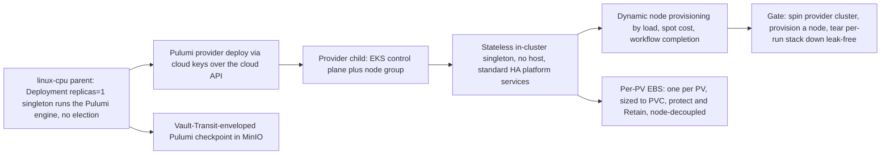

# Phase 30: Provider-managed clusters + dynamic provisioning

**Status**: Authoritative source
**Supersedes**: N/A
**Referenced by**: DEVELOPMENT_PLAN/README.md, DEVELOPMENT_PLAN/overview.md, DEVELOPMENT_PLAN/phase_29_multicluster_gateway_migration.md, DEVELOPMENT_PLAN/phase_31_test_topology_dsl.md, DEVELOPMENT_PLAN/system_components.md
**Generated sections**: none

> **Purpose**: Extend amoebius's reach from self-managed `kind`/`rke2` children to provider-managed clusters
> (EKS) provisioned by encrypted-MinIO-backed Pulumi under the Deployment-`replicas=1` singleton, standing up a
> stateless hostless in-cluster daemon, dynamic node provisioning by a declared rule, and per-PV EBS decoupled
> from the node lifecycle — gated live on linux-cpu by spinning a provider cluster up, provisioning a node, and
> tearing down leak-free.

---

## Phase Status

📋 Planned. Nothing in this phase is implemented; every sprint below is 📋 Planned and every prescriptive
statement is design intent, never a tested amoebius result. The phase runs on the **linux-cpu** substrate in
**Register 3** (live infrastructure): the parent amoebius cluster is a single-node `kind` cluster on
linux-cpu, brought up by the Phase 13 midwife, from inside which the Pulumi engine issues the provider deploy
over the cloud API. `→ provider` names the *deploy target class* — a cloud-managed EKS cluster reached over the
cloud API — not a fifth hardware substrate; the provider child has no host and no Apple/CUDA substrate of its
own, so the gate stays single-substrate (`linux-cpu`) while exercising a provider target. The
provider-cluster-via-Pulumi shape, the encrypted-MinIO Pulumi backend, the EKS deploy, and the
operational-vs-elevated credential split are all generalized from the sibling **prodbox** project (its
`aws-eks` Pulumi stack, `Prodbox.Pulumi.EncryptedBackend`, and the credential model) — read as **sibling
evidence, not an amoebius result** (honesty rule, [development_plan_standards.md §K](development_plan_standards.md)).
Status transitions are recorded reverse-chronologically here once work begins.

## Phase Summary

This phase delivers the **first-class managed-provider arm** of the compute-engine axis: EKS is provisioned via
cloud keys over the cloud API, where there is no host binary and the cloud provider owns the control plane. It
owns four deliverables, all driven from a single linux-cpu parent, plus the phase gate.

First, a **provider-cluster Pulumi deploy from inside a parent**: a `pulumi up` that runs **only** from inside
an already-running amoebius cluster, issued by the Deployment-`replicas=1` control-plane singleton (Phase 20) —
whose single-instance is a k8s/etcd property, never a bespoke amoebius election — with the checkpoint held as a
Vault-Transit-enveloped object in MinIO. There is no laptop `pulumi up`, no plaintext state, and no
`PULUMI_*`/`AWS_*`/`PATH` env side-channel: the `pulumi` binary and cloud plugin are discovered lazily by full
path. Second, a **stateless in-cluster daemon (no host)**: a provider child has no host access and therefore no
host worker daemons, running only the one in-cluster singleton role and converging the same standard HA
platform-service stack (Phase 18) from typed manifests — not a thinner cluster. Third, **dynamic node
provisioning by logic**: the node set is itself declarative and reactive, grown and shrunk by load, spot-cost,
and workflow completion as *just another reconcile* (Phase 15) over the desired node set in the `.dhall`.
Fourth, **per-PV EBS decoupled from the node lifecycle under a create-vs-delete credential model**: each PV's
EBS volume is sized 1:1 to its PVC, carried in its own durable Pulumi state flagged `protect`/`Retain` so a
normal per-run teardown never includes it, while the operational credential is *denied* `ec2:DeleteVolume` so
accidental durable-data destruction is unauthorized at the cloud API, not merely discouraged.

This phase consumes — and does not re-implement — the Phase 16/17/18 storage/Vault/platform substrate, the
Phase 15 typed SSA reconciler, the Phase 20 Deployment-`replicas=1` singleton live-deploy path, and the Phase
29 amoebic-spawn machinery (the encrypted MinIO backend + per-child Vault-envelope). Provider-cluster spawn is
the *cloud-keyed* sibling of Phase 29's *SSH-keyed* self-managed spawn over the same backend and the same
bring-up → init → reconcile → teardown lifecycle vocabulary. The `Managed Eks` arm carries **no** `LinuxHost`
witness; that type-level foreclosure lands in the pre-cluster band (the Dhall Gate-1 schema in Phase 4, the
GADT decoder in Phase 5, and the capacity/topology folds in Phase 7), and this phase provisions and observes it
at runtime.

**Substrate:** linux-cpu — the acceptance gate runs on exactly one hardware substrate, the linux-cpu parent
`kind` cluster from inside which the Pulumi engine issues the deploy; `→ provider` (EKS) is the deploy target
class, not a hardware substrate ([development_plan_standards.md §L](development_plan_standards.md)).

**Register:** 3 (live infrastructure) — the gate spins up real provider resources, runs a workflow, and tears
them down; no register-1/2 in-process check discharges it.

**Gate:** an `InForceSpec` that, from a **linux-cpu** parent, **spins up a provider-managed EKS cluster** via
the encrypted-MinIO-backed Pulumi deploy issued by the Deployment-`replicas=1` singleton (no bespoke election),
brings up its stateless hostless in-cluster daemon, **dynamically provisions an extra node by a declared rule**
and observes it join, then **tears the per-run cluster stack down leak-free** — VPC, control plane, node group,
and the provisioned node all destroyed with no orphans, idempotently on re-run, with any durable per-PV EBS
correctly **retained** (a retained durable volume is not a leak — it is its class behaving correctly). The run
emits a proven/tested/assumed ledger artifact. The elevated-harness reclamation of durable test-flagged EBS
that makes a *full* leak-free test *cycle* possible is Phase 31 work, deferred and never depended on here.

## Doctrine adopted

- [`pulumi_iac_doctrine.md §1`](../documents/engineering/pulumi_iac_doctrine.md#1-pulumi-runs-only-from-inside-an-existing-amoebius-cluster)
  — *Pulumi runs only from inside an existing amoebius cluster* — with
  [`§2`](../documents/engineering/pulumi_iac_doctrine.md#2-the-backend-every-byte-of-state-is-a-vault-enveloped-object-in-minio)
  (*every byte of state is a Vault-enveloped object in MinIO*),
  [`§3`](../documents/engineering/pulumi_iac_doctrine.md#3-state-lifetime-matches-resource-lifetime-per-class)
  (*state lifetime matches resource lifetime, per class*),
  [`§4`](../documents/engineering/pulumi_iac_doctrine.md#4-what-pulumi-provisions-the-resource-catalog)
  (*the resource catalog* — provider-cluster and dynamic-node entries),
  [`§6`](../documents/engineering/pulumi_iac_doctrine.md#6-the-ebs-create-vs-delete-credential-model)
  (*the EBS create-vs-delete credential model*), and
  [`§8`](../documents/engineering/pulumi_iac_doctrine.md#8-how-deploys-are-enacted-the-reconciler-referenced-not-restated)
  (*deploys are enacted by the reconciler, not a global state machine*): this phase realizes the catalog's
  provider-cluster, dynamic-node, and per-PV-EBS entries as Pulumi deploys that obey the one rule (engine under
  the singleton, no env vars, no `PATH`, checkpoint as a Vault-enveloped MinIO object), each classified by
  lifetime so the per-run stack dies with its run while durable EBS does not, and each EBS volume guarded by the
  create-but-never-delete operational credential.
- [`cluster_lifecycle_doctrine.md §1`](../documents/engineering/cluster_lifecycle_doctrine.md#1-two-cluster-kinds-one-lifecycle-shape)
  — *two cluster kinds, one lifecycle shape* — with
  [`§3`](../documents/engineering/cluster_lifecycle_doctrine.md#3-amoebic-spawning--the-recursive-forest)
  (*amoebic spawning — the recursive forest*),
  [`§8`](../documents/engineering/cluster_lifecycle_doctrine.md#8-dynamic-node-provisioning)
  (*dynamic node provisioning*), and
  [`§9`](../documents/engineering/cluster_lifecycle_doctrine.md#9-how-bring-up-and-teardown-are-implemented-the-reconciler-not-a-state-machine)
  (*bring-up and teardown are a reconciler, not a state machine*): this phase delivers the *provider-managed*
  column of the two-cluster-kinds table (no host binary, no host worker daemons, only the in-cluster singleton)
  as a cloud-keyed amoebic spawn sharing Phase 29's lifecycle vocabulary, and makes the node set declarative so
  provisioning a node is one more pass of the `discover → diff → enact → re-observe`, `Unreachable → refuse`
  reconciler.
- [`daemon_topology_doctrine.md §3.1`](../documents/engineering/daemon_topology_doctrine.md#31-exactly-one-pod-is-a-k8setcd-property-not-an-amoebius-election)
  and [`§5`](../documents/engineering/daemon_topology_doctrine.md#5-single-instance-and-coordination--delegated-not-elected)
  — *exactly one pod is a k8s/etcd property* / *single-instance and coordination — delegated, not elected*: the
  Pulumi engine runs under the Deployment-`replicas=1` singleton whose single-instance is a k8s/etcd concern, so
  nothing in this phase runs a leadership election of any kind, and a provider child runs exactly one in-cluster
  singleton role and zero host worker daemons.
- [`storage_lifecycle_doctrine.md §5.1`](../documents/engineering/storage_lifecycle_doctrine.md#51-storage-is-independent-of-the-node-lifecycle)
  and [`§7 / §7.1`](../documents/engineering/storage_lifecycle_doctrine.md#7-deleting-durable-data-is-forbidden-under-normal-operation)
  — *storage is independent of the node lifecycle* / *deleting durable data is forbidden under normal
  operation; the elevated test harness is the single exception*: per-PV EBS survives node replacement and is
  destroyed only by the Phase 31 elevated harness, never by a routine teardown.
- [`resource_capacity_doctrine.md §6`](../documents/engineering/resource_capacity_doctrine.md#6-growable--scalingpolicy-the-escape-valve-amoebius-owns)
  — *`Growable` / `ScalingPolicy`: the escape valve amoebius owns*: dynamic node provisioning is the runtime
  enaction of a typed `ScalingPolicy` whose cloud quota is the outer ceiling, so a bounded budget grows only
  through the policy and never to "unbounded."
- [`app_vs_deployment_doctrine.md §3`](../documents/engineering/app_vs_deployment_doctrine.md#3-the-deployment-rules-surface--how-the-same-app-runs)
  — *the deployment-rules surface*: node elasticity lives on the deployment-rules DSL surface; an app never asks
  for nodes.
- [`chaos_failover_doctrine.md §12`](../documents/engineering/chaos_failover_doctrine.md#12-the-moral-core--proven-tested-assumed)
  (cross-reference) — *proven, tested, assumed*: each gate run emits a proven/tested/assumed ledger; skipping an
  applicable teardown-observation move marks that layer UNVERIFIED, never green.

## Sprints

## Sprint 30.1: Provider-cluster Pulumi deploy from inside a parent 📋

**Status**: Planned
**Implementation**: `amoebius-pulumi/src/Amoebius/Pulumi/Engine.hs` (the in-cluster engine seam under the
singleton), `amoebius-pulumi/src/Amoebius/Pulumi/Backend/EncryptedMinio.hs` (Vault-Transit-enveloped MinIO
checkpoint), `amoebius-pulumi/src/Amoebius/Pulumi/Provider/Eks.hs` (the EKS provider program) (target paths from
[system_components.md](system_components.md); not yet built)
**Blocked by**: Phase 29 gate (amoebic spawning via Pulumi with the encrypted-MinIO backend + per-child
Vault-envelope, the SSH-keyed spawn this generalizes); Phase 20 gate (the Deployment-`replicas=1` singleton
live-deploy path that runs the engine); Phase 18 gate (MinIO reachable as a standard HA platform service);
Phase 17 gate (root Vault + the Transit envelope) — all external earlier-phase prerequisites.
**Independent Validation**: from a linux-cpu parent, a `pulumi up` issued by the in-cluster singleton reaches a
ready EKS control plane + node group; the checkpoint lands in MinIO as an opaque Vault-enveloped object
unreadable without an unsealed Vault; a deploy attempted with a sealed Vault **refuses before any cloud
mutation**; the deploy subprocess is spawned with no `PULUMI_*`/`AWS_*`/`PATH` in its environment and the
`pulumi`/plugin paths are absolute.
**Docs to update**: `documents/engineering/pulumi_iac_doctrine.md` (§1, §2, §4),
`documents/engineering/cluster_lifecycle_doctrine.md` (§3), `documents/engineering/substrate_doctrine.md` (the
no-env/no-`PATH` lazy discovery of `pulumi` + the cloud plugin), `DEVELOPMENT_PLAN/system_components.md`.

### Objective

Adopt [`pulumi_iac_doctrine.md §1 — Pulumi runs only from inside an existing amoebius cluster`](../documents/engineering/pulumi_iac_doctrine.md#1-pulumi-runs-only-from-inside-an-existing-amoebius-cluster)
and the provider-cluster catalog entry in [`§4 — What Pulumi provisions`](../documents/engineering/pulumi_iac_doctrine.md#4-what-pulumi-provisions-the-resource-catalog):
make "spin up a provider-managed cluster" something the cluster does under its Deployment-`replicas=1` singleton
— never something a laptop shell does behind the cluster's back — with state held as a Vault-enveloped MinIO
object, generalizing Phase 29's SSH-keyed self-managed spawn to a cloud-keyed provider spawn.

### Deliverables

- An `Amoebius.Pulumi.Engine` seam that runs the Pulumi engine **only** under the in-cluster singleton (Phase
  20), whose single-instance is a k8s/etcd property; there is no host-shell entrypoint that can `pulumi up` a
  provider cluster.
- An `Amoebius.Pulumi.Backend.EncryptedMinio` backend: the checkpoint is one opaque object in the cluster's
  MinIO, sealed with a Vault-Transit envelope; the plaintext data key never lands on disk, and a
  sealed/unreachable Vault **fails the deploy closed** (no unencrypted or un-checkpointed fallback).
- An `Amoebius.Pulumi.Provider.Eks` program that provisions the EKS control plane + a base managed node group
  via cloud keys resolved from the cluster's Vault (secrets are *names* in the `.dhall`, bytes injected by the
  parent), landing the cluster ready for its in-cluster daemon (Sprint 30.2).
- Lazy, full-path discovery of the `pulumi` binary and the cloud-provider plugin through the substrate package
  manager; **no** `PULUMI_*`, `AWS_*`, `PULUMI_CONFIG_PASSPHRASE`, or `PATH` is exported into any child process.

### Validation

1. The singleton issues a provider deploy that reaches a ready EKS control plane + node group; running the same
   deploy from outside the cluster (a bare host shell) has no supported entrypoint.
2. The checkpoint object in MinIO is opaque ciphertext; reading/writing it requires an unsealed Vault, and a
   deploy with a sealed Vault refuses *before* any cloud-side create.
3. Process-environment assertion: the subprocess is spawned with an empty/whitelisted environment (no
   `PULUMI_*`/`AWS_*`/`PATH`), and the `pulumi`/plugin paths are absolute.

> **Honesty.** The encrypted-MinIO Pulumi backend and a working EKS deploy are **proven in prodbox**
> (`Prodbox.Pulumi.EncryptedBackend`; the `aws-eks` stack), with a Vault gate on every apply/destroy — *sibling
> evidence, not an amoebius result*. This sprint re-realizes the shape under the amoebius
> Deployment-`replicas=1` singleton and the per-child envelope for the first time.

### Remaining Work

The whole sprint (📋 Planned).

## Sprint 30.2: The stateless in-cluster daemon for a provider child (no host) 📋

**Status**: Planned
**Implementation**: `amoebius-runtime/src/Amoebius/Daemon/InClusterSingleton.hs` (provider-child singleton
wiring), `amoebius-runtime/src/Amoebius/Cluster/ProviderBringUp.hs` (init-follows-readiness for a provider
child) (target paths; not yet built)
**Blocked by**: Sprint 30.1; Phase 18 gate (the standard HA platform-service stack + typed manifests); Phase 15
gate (the typed renderer + live SSA reconciler that converges them); Phase 20 gate (the Deployment-`replicas=1`
singleton) — external earlier-phase prerequisites.
**Independent Validation**: a freshly provisioned EKS child converges the standard HA platform-service stack
from typed manifests (no Helm, no public-registry pulls), reachable and HA, with wild ingress only via
Keycloak; the cluster runs **no** host worker daemon and advertises **no** host substrate; re-running bring-up
is a no-op.
**Docs to update**: `documents/engineering/cluster_lifecycle_doctrine.md` (§1, §2),
`documents/engineering/daemon_topology_doctrine.md` (the in-cluster singleton as the only daemon on a provider
child), `documents/engineering/platform_services_doctrine.md` (fungible standard-service convergence on a
provider substrate).

### Objective

Adopt the provider-managed column of [`cluster_lifecycle_doctrine.md §1 — Two cluster kinds, one lifecycle shape`](../documents/engineering/cluster_lifecycle_doctrine.md#1-two-cluster-kinds-one-lifecycle-shape)
and the init-follows-readiness ordering in [`§2 — Bring-up and bootstrap`](../documents/engineering/cluster_lifecycle_doctrine.md#2-bring-up-and-bootstrap):
bring a provider child to the **same fungible shape** as a self-managed cluster using **only** the in-cluster
singleton daemon — no host binary, no host worker daemons, no Apple/CUDA host substrate — so a provider child
is the same machine as any other cluster from the reconciler's point of view.

### Deliverables

- Provider-child bring-up that, once the EKS API is reachable, initializes Vault, hands the child its own
  projected `.dhall`, and converges the standard HA platform-service stack (registry, MinIO, Vault, Pulsar,
  Prometheus/Grafana, Postgres, Envoy/Gateway API, Keycloak, cloud LoadBalancer) from typed manifests via the
  Phase 15 reconciler — *not* a thinner or different service set.
- A daemon wiring that runs **exactly one** in-cluster singleton role and *no* host worker-daemon role on a
  provider child; the host-only NodePort comms path and host worker daemons are structurally absent (there is
  no host), and the singleton's single-instance stays a k8s/etcd property, never a bespoke election.
- Substrate-shape honesty at runtime: a provider child advertises no host substrate, confirming the `Managed
  Eks` arm carries no `LinuxHost` / host-worker index — a foreclosure already unrepresentable in the pre-cluster
  band (Phase 4/5/7) and observed here
  ([`illegal_state_catalog.md`](../documents/illegal_state/illegal_state_catalog.md) — the hostless-provider-child
  arm).

### Validation

1. A provisioned EKS child reaches the same standard-service fungible shape, HA and reachable, wild ingress
   only via Keycloak, all images served in-cluster (no public-registry pulls).
2. The child runs a single in-cluster singleton and zero host daemons; there is no host NodePort peer and no
   host substrate advertised.
3. Re-running provider bring-up converges as a no-op (the idempotent §9 reconcile shape).

> **Honesty.** "No host access on a provider cluster" is the design position the doctrine records
> ([cluster_lifecycle_doctrine.md §1](../documents/engineering/cluster_lifecycle_doctrine.md#1-two-cluster-kinds-one-lifecycle-shape));
> prodbox runs EKS but does not drive it as a hostless amoebius child, so this is *new amoebius design*,
> validated here, not inherited proof.

### Remaining Work

The whole sprint (📋 Planned).

## Sprint 30.3: Per-PV EBS decoupled from the node lifecycle + create-vs-delete credential model 📋

**Status**: Planned
**Implementation**: `amoebius-pulumi/src/Amoebius/Pulumi/Ebs.hs` (per-PV durable EBS program, own state,
`protect`/`Retain`), `amoebius-pulumi/src/Amoebius/Pulumi/Credential.hs` (operational create-only vs elevated
delete IAM policy split) (target paths; not yet built)
**Blocked by**: Sprint 30.1; Phase 16 gate (`no-provisioner` retained PVs + lossless rebind — the storage
substrate the EBS backs) — external earlier-phase prerequisite.
**Independent Validation**: a per-PV EBS volume is created sized 1:1 to its PVC in **separate** durable state
from the ephemeral cluster stack; a `pulumi destroy` of the cluster stack leaves the EBS **intact**
(`protect`/`Retain`); a simulated `ec2:DeleteVolume` under the operational credential is **denied** at the
policy layer; the next bring-up re-attaches the same volume to the same claim.
**Docs to update**: `documents/engineering/pulumi_iac_doctrine.md` (§6, §3),
`documents/engineering/storage_lifecycle_doctrine.md` (per-PV EBS sizing 1:1 + node-vs-storage decoupling).

### Objective

Adopt [`pulumi_iac_doctrine.md §6 — The EBS create-vs-delete credential model`](../documents/engineering/pulumi_iac_doctrine.md#6-the-ebs-create-vs-delete-credential-model)
and the per-class state/credential pinning in [`§3 — State lifetime matches resource lifetime, per class`](../documents/engineering/pulumi_iac_doctrine.md#3-state-lifetime-matches-resource-lifetime-per-class):
make durable storage **structurally** outside the ephemeral destroy set and the authority to delete it
**structurally** withheld from normal operation, so "ephemeral cluster, durable data" cannot collapse on a
routine teardown and accidental durable-data destruction is *unauthorized at the cloud API*, not merely
discouraged ([`storage_lifecycle_doctrine.md §5.1`](../documents/engineering/storage_lifecycle_doctrine.md#51-storage-is-independent-of-the-node-lifecycle)).

### Deliverables

- An `Amoebius.Pulumi.Ebs` program placing each PV's EBS volume in its **own durable-class state** (separate
  checkpoint object, §3), sized 1:1 to its PVC, flagged `protect`/`Retain`, and **never** in the per-run cluster
  stack — so a normal `pulumi destroy` of the cluster never includes it.
- Node-vs-storage decoupling: a destroyed/replaced EC2 node detaches its EBS and the volume survives; the next
  bring-up re-attaches the same volume to the same `<namespace>/<statefulset>/pv_<integer>` claim.
- An `Amoebius.Pulumi.Credential` split: the operational credential is granted `ec2:CreateVolume` (plus the
  per-run cluster create/delete it needs) but **denied `ec2:DeleteVolume`** on durable retained volumes; the
  delete authority lives only with the elevated test credential, exercised in Phase 31 — referenced, not invoked
  here.

### Validation

1. Create a per-PV EBS, then `pulumi destroy` the cluster stack; assert the EBS survives (it is in separate,
   `protect`ed durable state) and re-attaches on the next bring-up with identical bytes.
2. Policy test: a simulated `ec2:DeleteVolume` under the operational credential is denied; the operational
   credential *can* create.
3. Assert EBS size equals its PVC request exactly (1:1), and that the volume's state object is distinct from the
   ephemeral cluster stack's checkpoint.

> **Honesty.** The create-vs-delete credential split is a **design resolution of an explicitly open question**;
> the operational-vs-elevated *credential class* is proven in prodbox, but EBS-in-prodbox is CSI-driver-created,
> **not** Pulumi-tracked — so amoebius's Pulumi-tracked durable-EBS model is *new design, not inherited proof*.
> The leak-free *reclamation* of durable test-flagged EBS by the elevated harness is Phase 31
> ([`storage_lifecycle_doctrine.md §7.1`](../documents/engineering/storage_lifecycle_doctrine.md#71-the-single-exception-the-elevated-test-harness));
> this sprint builds only the create-only guard and the `protect`/`Retain` separation.

### Remaining Work

The whole sprint (📋 Planned).

## Sprint 30.4: Dynamic node provisioning by logic 📋

**Status**: Planned
**Implementation**: `amoebius-runtime/src/Amoebius/Cluster/NodeProvisioner.hs` (declarative node-set reconcile),
`amoebius-pulumi/src/Amoebius/Pulumi/NodeGroup.hs` (Pulumi add/drain of EC2/managed nodes) (target paths; not
yet built)
**Blocked by**: Sprint 30.1; Phase 20 gate (the Deployment-`replicas=1` singleton the enaction runs under);
Phase 7 gate (the capacity fold re-run against the grown bound) — external earlier-phase prerequisites.
**Independent Validation**: a `.dhall`-declared node rule (load / spot-cost / workflow-completion) drives the
live node set toward its desired shape; raising the declared target provisions an EC2/managed node that joins
the cluster; lowering it drains and releases the node; re-running converges as a no-op; an `Unreachable` node
observation **refuses** rather than charging ahead.
**Docs to update**: `documents/engineering/cluster_lifecycle_doctrine.md` (§8),
`documents/engineering/pulumi_iac_doctrine.md` (§4 — the dynamic-node catalog entry),
`documents/engineering/app_vs_deployment_doctrine.md` (node elasticity as a deployment rule, never app logic).

### Objective

Adopt [`cluster_lifecycle_doctrine.md §8 — Dynamic node provisioning`](../documents/engineering/cluster_lifecycle_doctrine.md#8-dynamic-node-provisioning)
and the dynamic-node catalog entry in [`pulumi_iac_doctrine.md §4 — What Pulumi provisions`](../documents/engineering/pulumi_iac_doctrine.md#4-what-pulumi-provisions-the-resource-catalog):
make the cluster's node set **declarative and reactive** — grown and shrunk by logic, not by hand — so
provisioning a node is *just another reconcile* over the desired node set in the root `InForceSpec`, living on
the deployment-rules surface and never inside an app's logic.

### Deliverables

- An `Amoebius.Cluster.NodeProvisioner` that reads the declared elastic-node rule — a typed `ScalingPolicy`
  ([`resource_capacity_doctrine.md §6`](../documents/engineering/resource_capacity_doctrine.md#6-growable--scalingpolicy-the-escape-valve-amoebius-owns))
  driven by **load**, **spot-instance cost**, and **workflow completion** — computes the desired node set, and
  drives the live set toward it through the Phase 15 reconciler; no bespoke node state machine. Each provisioning
  step re-runs the capacity fold against the grown bound, and the cloud quota is the outer ceiling, so a bounded
  budget grows only through this policy and never to "unbounded."
- An `Amoebius.Pulumi.NodeGroup` enaction that adds an EC2/managed node (Pulumi, under the singleton, encrypted
  backend) and drains+releases one when demand or the workflow recedes; node lifetime is the per-run/ephemeral
  class (its EBS, if any, is the durable class from Sprint 30.3).
- Three-valued, fail-closed node observation: a node that cannot be observed (`Unreachable`) refuses the
  teardown step rather than being silently treated as gone — no stranded EC2.
- The elasticity rule expressed **only** on the deployment-rules DSL surface
  ([`app_vs_deployment_doctrine.md §3`](../documents/engineering/app_vs_deployment_doctrine.md#3-the-deployment-rules-surface--how-the-same-app-runs));
  an app never asks for nodes.

### Validation

1. Raise a declared node target (a workflow-completion or load rule) and assert a new node is provisioned and
   joins; lower it and assert the node is drained and released.
2. Re-run the reconcile at a stable target and assert a no-op (idempotence).
3. Inject an `Unreachable` node observation during release and assert the reconciler refuses rather than pruning
   a node it cannot confirm absent.

> **Honesty.** Dynamic provisioning driven by spot-cost/load/workflow signals is *design intent*; no amoebius
> node-provisioner has been built or measured. The reconcile-not-state-machine shape is *proven in prodbox* for
> AWS resources — sibling evidence, not an amoebius result. This phase provisions provider **clusters** and
> self-managed rke2 agents only; EKS Hybrid Nodes (a full stretched member node on a `Managed Eks` control
> plane) are a provider-native capability, type-foreclosed absent that arm, and DEFERRED.

### Remaining Work

The whole sprint (📋 Planned).

## Sprint 30.5: Phase gate — spin a provider cluster, provision a node, tear down leak-free 📋

**Status**: Planned
**Implementation**: `test/dhall/phase_30_provider_provision.dhall` (the gate topology),
`amoebius-pulumi/src/Amoebius/Pulumi/Teardown.hs` (per-run `reconcileAbsent` over the ephemeral cluster + node
subset) (target paths; not yet built)
**Blocked by**: Sprint 30.1, Sprint 30.2, Sprint 30.3, Sprint 30.4.
**Independent Validation**: the gate `InForceSpec` spins up a provider (EKS) cluster from a linux-cpu parent,
brings up its stateless in-cluster daemon, dynamically provisions an extra node and observes it join, then tears
the per-run cluster stack down leak-free (VPC + control plane + node group + provisioned node all destroyed, no
orphans), idempotently on re-run, with any durable per-PV EBS correctly retained; each run emits a
proven/tested/assumed ledger artifact.
**Docs to update**: `documents/engineering/pulumi_iac_doctrine.md` (§3, §8),
`documents/engineering/cluster_lifecycle_doctrine.md` (§9), `documents/engineering/testing_doctrine.md` (the
per-run ledger; durable-EBS reclamation deferred to Phase 31), `DEVELOPMENT_PLAN/README.md`.

### Objective

Adopt [`pulumi_iac_doctrine.md §3 — State lifetime matches resource lifetime, per class`](../documents/engineering/pulumi_iac_doctrine.md#3-state-lifetime-matches-resource-lifetime-per-class)
and [`§8 — deploys are enacted by the reconciler`](../documents/engineering/pulumi_iac_doctrine.md#8-how-deploys-are-enacted-the-reconciler-referenced-not-restated),
with [`cluster_lifecycle_doctrine.md §9 — bring-up and teardown are a reconciler, not a state machine`](../documents/engineering/cluster_lifecycle_doctrine.md#9-how-bring-up-and-teardown-are-implemented-the-reconciler-not-a-state-machine):
assemble the phase gate — a single `.dhall` that brings a provider cluster up, provisions a node, and tears the
**per-run/ephemeral class** down leak-free via one `reconcileAbsent` over the owned subset, with `Unreachable →
refuse` and a tag-sweep backstop, while the durable EBS class is correctly left retained.

### Deliverables

- The gate `test/dhall/phase_30_provider_provision.dhall`: spin up the EKS provider cluster (Sprint 30.1),
  converge its stateless daemon (Sprint 30.2), provision an extra node by a declared rule and observe it join
  (Sprint 30.4), then always tear down the per-run cluster + node.
- An `Amoebius.Pulumi.Teardown` step: one `reconcileAbsent` over the **ephemeral** registry subset (VPC, EKS
  control plane, node group, dynamically provisioned node) — *Present → destroy → re-observe; Absent → skip;
  Unreachable → refuse* — leaving the durable EBS class (Sprint 30.3) untouched and retained.
- A per-run proven/tested/assumed ledger recording: provider bring-up + node join as **tested on the EKS
  provider target from a linux-cpu parent**; per-run teardown leak-freedom as **tested**; durable EBS retention
  as **correct-by-class**; and the elevated-harness durable-EBS *reclamation* as **explicitly deferred to Phase
  31, not asserted here**.

### Validation

1. Run the gate end-to-end: assert the provider cluster comes up, the in-cluster daemon converges, the extra
   node is provisioned and joins, then the per-run stack tears down with **no orphaned** VPC, control plane,
   node group, or node.
2. Re-run the gate and assert idempotent bring-up and leak-free teardown; assert any durable EBS is retained
   (not destroyed) and re-attaches on a subsequent bring-up.
3. Assert the run emits a proven/tested/assumed ledger per
   [`chaos_failover_doctrine.md §12`](../documents/engineering/chaos_failover_doctrine.md#12-the-moral-core--proven-tested-assumed);
   skipping an applicable teardown-observation move marks that layer UNVERIFIED, never green.

> **Honesty.** This gate proves the **per-run / ephemeral** teardown leak-free; the full leak-free *test cycle*
> — reclaiming durable, test-flagged EBS under the elevated credential — is Phase 31 and is **not** a dependency
> of this phase. Live AWS spend (EKS, EC2, EBS, NAT/ELB) is the *expected* outcome of asking the harness to
> provision a provider cluster, exactly as in the prodbox sibling; it is not a separate gate. The EKS reality is
> proven in prodbox; the amoebius provider-child lifecycle is validated here for the first time.

### Remaining Work

The whole sprint (📋 Planned).

## Documentation Requirements

**Engineering docs to update (when the gate runs, flip the honest layer, never before):**
- `documents/engineering/pulumi_iac_doctrine.md` — record that §1 (the one rule), §2 (the Vault-enveloped MinIO
  backend), §3 (per-class state lifetime), §4 (provider-cluster + dynamic-node catalog entries), §6 (the EBS
  create-vs-delete model), and §8 (the reconciler enaction) are realized in `amoebius-pulumi`; flip the relevant
  sibling-evidence honesty notes to live-proof status once the gate runs (status itself stays in this plan).
- `documents/engineering/cluster_lifecycle_doctrine.md` — record that §1's provider-managed column (no host,
  in-cluster singleton only), §3 (cloud-keyed amoebic spawn), §8 (dynamic node provisioning), and §9 (reconciler
  teardown) gain an amoebius EKS reference; note the per-run-vs-durable teardown split this phase exercises.
- `documents/engineering/daemon_topology_doctrine.md` — record that the Pulumi engine and the provider-child
  daemon run under the Deployment-`replicas=1` singleton (§3.1), single-instance a k8s/etcd property, with no
  bespoke election anywhere in this phase.
- `documents/engineering/storage_lifecycle_doctrine.md` — record the per-PV EBS sizing (1:1) and node-vs-storage
  decoupling realized in `Amoebius.Pulumi.Ebs`, with durable-EBS reclamation deferred to Phase 31.
- `documents/engineering/substrate_doctrine.md` — record that `pulumi` + the cloud plugin conform to the
  no-env/no-`PATH` lazy-tool-ensure contract on the linux-cpu parent.
- `documents/engineering/testing_doctrine.md` — record the Phase 30 per-run ledger artifact and the explicit
  deferral of elevated durable-EBS reclamation to Phase 31.

**Cross-references to add:**
- `DEVELOPMENT_PLAN/system_components.md` — register the `amoebius-pulumi` package (Engine, EncryptedMinio
  backend, Provider/Eks, Ebs, Credential, NodeGroup, Teardown) and the `amoebius-runtime` provider-child daemon
  + NodeProvisioner modules, each mapped to its owning doctrine, as Phase-30 design-first rows.
- `DEVELOPMENT_PLAN/substrates.md` — record the Phase 30 → `linux-cpu` (parent) row with the `provider` (EKS)
  deploy target annotated as a target class, not a fifth hardware substrate.
- `DEVELOPMENT_PLAN/README.md` — flip the Phase 30 row's status once the gate passes; link this document.

## Related Documents
- [README.md](README.md) — the live tracker; Phase 30 objective, gate, and substrate
- [development_plan_standards.md](development_plan_standards.md) — the rulebook this doc obeys (§D skeleton, §F
  sprint format, §H citation rule, §K honesty, §L one-substrate discipline)
- [overview.md](overview.md) — the target architecture and cross-cutting invariants (no bespoke election;
  single-instance delegated to k8s/etcd; Pulumi runs only from inside a cluster)
- [system_components.md](system_components.md) — the target component inventory (the Implementation paths above
  are its intended layout, not yet built)
- [substrates.md](substrates.md) — the substrate registry and per-phase map (`linux-cpu` parent → `provider`
  target)
- [Pulumi IaC Doctrine](../documents/engineering/pulumi_iac_doctrine.md) — the one rule, the Vault-enveloped
  MinIO backend, the resource catalog, and the EBS create-vs-delete credential model this phase implements
- [Cluster Lifecycle Doctrine](../documents/engineering/cluster_lifecycle_doctrine.md) — the two-cluster-kinds
  shape, dynamic node provisioning, and the reconciler teardown this phase implements
- [Daemon Topology Doctrine](../documents/engineering/daemon_topology_doctrine.md) — the Deployment-`replicas=1`
  singleton (single-instance a k8s/etcd property, no election) that runs the Pulumi engine on a hostless child
- [Storage Lifecycle Doctrine](../documents/engineering/storage_lifecycle_doctrine.md) — per-PV EBS sizing,
  node-vs-storage decoupling, and the elevated-harness durable-delete exception
- [Vault / PKI Doctrine](../documents/engineering/vault_pki_doctrine.md) — the Transit envelope + per-child key
  the Pulumi checkpoint rides on
- [Testing Doctrine](../documents/engineering/testing_doctrine.md) — Register 3 (live), the spin-up → run →
  always-tear-down contract, and the per-run ledger
- [phase_29](phase_29_multicluster_gateway_migration.md) — the SSH-keyed amoebic spawn, encrypted MinIO
  backend, and per-child envelope this phase generalizes to a cloud-keyed provider spawn
- [phase_31](phase_31_test_topology_dsl.md) — the elevated-harness durable-EBS reclamation that completes the
  §6 model's leak-free test cycle
- [Engineering Doctrine Index](../documents/engineering/README.md) — the doctrine suite these phases adopt
