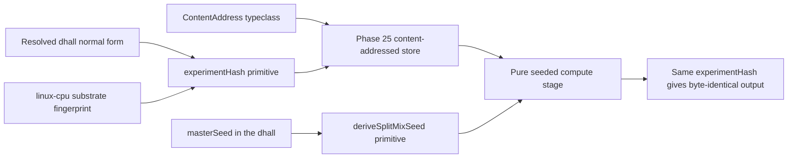

# Phase 31: Determinism kernel

**Status**: Authoritative source
**Supersedes**: N/A
**Referenced by**: DEVELOPMENT_PLAN/README.md, DEVELOPMENT_PLAN/overview.md, DEVELOPMENT_PLAN/phase_12_deterministic_sim_substrate.md, DEVELOPMENT_PLAN/phase_25_content_store_workflow.md, DEVELOPMENT_PLAN/phase_32_jitbuild_engine_cache.md, DEVELOPMENT_PLAN/phase_33_infernix_lift.md, DEVELOPMENT_PLAN/phase_34_jitml_lift_cuda.md, DEVELOPMENT_PLAN/system_components.md, documents/engineering/deterministic_simulation_doctrine.md
**Generated sections**: none

> **Purpose**: Land the three determinism-kernel primitives — the `ContentAddress` typeclass, the
> `experimentHash = sha256(resolved-dhall ‖ substrate-fingerprint)` run identity, and the SplitMix seed
> derivation — and prove on live linux-cpu that a self-contained seeded workload reproduces byte-identical
> output under one `experimentHash` while any changed input changes the hash.

---

## Phase Status

📋 Planned. Nothing in this phase is implemented; every sprint below is 📋 Planned and every prescriptive
statement is design intent, never a tested amoebius result. The phase runs on the **linux-cpu** substrate in
**Register 3** (live infrastructure): a single-node `kind` cluster brought up by the Phase 14 midwife, using
the content-addressed store and workflow runtime landed in Phase 25. The `experimentHash` and SplitMix shapes
are already exercised in the sibling `jitML` project (`jitML/src/JitML/Checkpoint/Format.hs`,
`jitML/src/JitML/Engines/Rng.hs`); read that as **sibling evidence, not an amoebius result** — amoebius has
not yet built the kernel layer. Status transitions are recorded reverse-chronologically here once work begins.

## Phase Summary

This phase turns the content-addressed store delivered in Phase 25 into a reusable **determinism kernel** and
proves it against a minimal, self-contained workload. It does three things and stops there. First, it lifts
Phase 25's concrete blob/manifest key renderers into a kernel-level `ContentAddress` typeclass, so the rule
that *a content-derived name cannot be forged* is one reusable primitive rather than a per-store copy. Second,
it implements the `experimentHash` run identity — a total function of the resolved `.dhall` normal form and the
live linux-cpu substrate fingerprint — so two runs share a store namespace only when they are genuinely the
same experiment on the same substrate. Third, it implements the SplitMix seed derivation that gives every
stream a seed that is a pure function of `(masterSeed, streamIndex)` alone, independent of worker count,
scheduling, and assignment.

These seams are shared, not ML-specific. The SplitMix seed derivation and the `MonadTime`/`MonadTimer` clock
injection that make an ML run bit-reproducible are the **same** injection seams the **Register-2.5 deterministic
simulation** ([`deterministic_simulation_doctrine.md §6`](../documents/engineering/deterministic_simulation_doctrine.md#6-one-determinism-substrate-two-uses))
uses to make a simulation deterministically replayable — one determinism substrate, two uses (reproducible ML
*and* replayable simulation). Injecting time and randomness through typed seams rather than reading wall-clock
or ambient entropy is what makes both "deterministic by construction."

The scope deliberately stops at the kernel primitives and one live reproducibility proof. The gate workload is
a small seeded compute stage — a pinned content-addressed input, a pure stage, and a request-carried derived
seed — deliberately **not** an infernix inference run (that lift is Phase 33) and **not** a jit-resolved ML
engine (the `CacheBudget`-bounded engine cache is Phase 32); the kernel must be proven before either extension
rides it. The substrate fingerprint is gathered by full-path subprocess probes on the live host, never from
`PATH` or environment variables, and the substrate is folded into identity precisely because cross-substrate
bit-equality is not guaranteed — this phase asserts same-substrate reproducibility and refuses to claim
cross-substrate byte-equality. The kernel primitives are pure; the store bytes they name live in the
Vault-enveloped MinIO bucket that is the stateless `replicas=1` control-plane singleton's only durable state.

**Substrate:** linux-cpu — the whole gate runs on a single-node `kind` cluster on a linux-cpu host in
Register 3 (live infrastructure); no apple, linux-cuda, or windows substrate is touched, and cross-substrate
behaviour is explicitly out of contract, while nothing about deriving `experimentHash` or a SplitMix seed
requires live infrastructure (those stay pure, Registers 1–2).

**Register:** 3 — live infrastructure (§K).

**Gate:** `experimentHash = sha256(resolved-dhall ‖ substrate-fingerprint)` together with SplitMix seed
derivation reproduce **byte-identical output on the same linux-cpu substrate**, where the output is a genuine
function of the seed, the pinned input, and the substrate machinery. The gate is passed only when **all** of
the following hold against the **Phase-0-committed oracle set** named below (§M.1); the byte comparisons are
performed **out-of-band by the harness** on blobs it fetched itself, never inferred from a `412 =
success`/`If-None-Match` response on a second PUT (§M.6):

1. **Same-hash reproduction (fresh recompute, not a store hit, §M.6):** the gate workload runs twice under an
   unchanged `experimentHash`; each fresh Pod writes a distinct `<experimentHash>/<runId>` staging prefix whose
   output blob/manifest key is **provably absent**, and run 2 cannot read run 1's retained prefix until its pure
   stage completes and writes. The harness asserts that boundary from the OS observer (§M.5), retains both exact
   output object identities through its out-of-band fetch/compare, and requires byte-for-byte equality.
2. **Seed-sensitivity (§M.1, forecloses a constant-output stub):** two runs identical **except** for the
   `masterSeed` (and, in a second pair, except for the `streamIndex`) produce **different** output bytes on the
   stored blobs. A run whose output is invariant under a changed seed FAILS the gate.
3. **Input-sensitivity (§M.1):** two runs identical **except** for the pinned content-addressed input blob
   produce **different** output bytes on the stored blobs. A run whose output is invariant under a changed
   pinned input FAILS the gate.
4. **Divergent identity for a changed input:** a deliberately changed input — the resolved `.dhall` (the
   committed positive fixture `test/dhall/phase_31_determinism_repro.dhall` versus its committed
   metric-direction-flipped negative sibling, differing **only** in that one field, §M.8) or a substituted
   substrate fingerprint — yields a **different** `experimentHash`, occupies a different store namespace, and is
   allowed to differ in output there. This leg is asserted **jointly** with legs 2–3 so that hash-divergence
   alone (a property of SHA-256, not of amoebius) cannot pass it.
5. **Committed mutant goes red (§M.2):** the committed seeded mutant `test/mutants/Determinism_const_output.hs` —
   the pure stage rewritten to return a constant byte string ignoring seed and input (operator: dropped-effect) —
   is committed under `test/mutants/` and MUST turn legs 2 and 3 red when re-run; the gate names it and the CI
   record shows it red.
6. **Ledger honesty (§K):** the run emits a proven/tested/assumed ledger recording that same-substrate
   reproduction was *tested on linux-cpu*, identity/seed totality was *proven-in-types*, and cross-substrate
   bit-equality was *not asserted* (marked UNVERIFIED, never green).

**Representative oracle set (§M.7), authored and committed in Phase 0 before any kernel module exists:**
`test/dhall/phase_31_determinism_repro.dhall` (positive: one pinned content-addressed input blob, one pure
seeded stage, one `masterSeed`); its three committed negative siblings differing in exactly one dimension each
— `..._flipped_metric.dhall` (resolved-`.dhall` change), `..._alt_seed.dhall` (changed `masterSeed`),
`..._alt_input.dhall` (changed pinned input); the committed hand-authored expected fingerprint schema
`test/golden/phase_31_substrate_fingerprint.schema.json` (§M.3); and the committed mutant
`test/mutants/Determinism_const_output.hs` (§M.2), plus the independently authored
`test/golden/phase_31_resource_shape.json` and resource mutants under `test/mutants/phase_31/`. These four
`.dhall` fixtures, the schema, resource witness, and mutants are the phase's explicit representative set; no golden output bytes are pre-committed (they are substrate-specific),
so the byte-equality legs compare **two fresh runs against each other**, never against a regenerated golden.

## Resource provision — the live recomputes

This phase instantiates the canonical resource matrix and sealed whole-deployment provision boundary from
[`resource_capacity_doctrine.md §3.1`](../documents/engineering/resource_capacity_doctrine.md#31-the-systematic-provision-matrix)
and [`§4`](../documents/engineering/resource_capacity_doctrine.md#4-the-total-fold-fits-carve-place-and-the-nesting);
test-run composites must flatten to canonical execution atoms before either fresh run starts.

The three kernel functions are pure and allocate no deployment unit. The live proof does introduce compute
Pods, so the gate's `BoundDeployment` contains an identity-keyed `DeterminismRunDemand` for every baseline,
seed/input variant, and fingerprint-control run. Each run carries a complete `PodResourceEnvelope`: every
container has a selected-platform `ImageArtifact`, lifecycle, CPU/memory/ephemeral-storage requests and
limits, runtime working set, read-only or bounded-writable rootfs, and log headroom; the Pod carries bounded
disk/memory `emptyDir`s, derived ConfigMap/Secret/projected/service-account-token
`KubeletMappedFileDemand`s, any durable claim with its presentation/backing/attachment class, `cache = None`,
exact byte-free `PodRuntimeMetadataSource` network-attachment identities and container-to-volume mount
identities, and `accelerator = None`. The content-store and Pulsar clients are libraries inside that compute container;
their request/response buffers, CBOR staging, retry state, and output-upload workspace are charged to its
memory and pod-local ephemeral fields rather than represented as client Pods.
Each fresh compute/control run is structurally a finite Job body with explicit completions, parallelism,
backoff, replacement-on-Failed, and terminal retention; it carries no Deployment rollout fields. The inherited
Phase-25 standing orchestrator/workers/gateway retain their Deployment bodies and the collector its Job body.
Each run demand is also an exact Phase-25 `WorkflowRuntimeDemand` projection, never a lone free compute Pod:
it retains the orchestrator, configured active/standby workers (the active run worker is fresh), sole content-
mutation gateway and collector/verification Job with complete envelopes. Its source-equal command/event topics,
subscriptions, client concurrency, cursor/backlog/retention/hot-ledger/offload and exact output gateway/object
extents merge into Pulsar/BookKeeper/MinIO capacity before publish. No broker or standing gateway Pod makes a
new workflow's messages/storage free.

Once `provision` expands each run and workflow `BoundExecutionUnit`, it derives one
`KubeletRuntimeMetadataShape` per planned Pod slot from that Pod's exact runtime-metadata source and complete
container/volume graph under the selected node's pinned `kubeletMetadataModel`; live normalization derives the
observed form under the authenticated Pod UID plus owner/source witness. The private fold derives every
component's bytes and `KubeletNodefs | CriRuntimeRoot` role, resolves it through the selected filesystem
layout, and groups aliases by physical carve once. SplitRuntime charges kubelet components to nodefs and CRI
components to imagefs/containerfs; Unified and SplitImage sum forced aliases before one backing check. No
physical runtime-metadata debit is repeated as logical Pod ephemeral storage.

Pure provision emits one `ProvisionedNodeRuntimeStorageAccounting` per node for every planned epoch
fingerprint; live preflight emits the observed-inventory-fingerprint form. Its planned-slot/observed-UID domain equals the assigned
Pods exactly, qualified Pod metadata and image-model component keys form a disjoint exhaustive partition, and
the combined backing map debits each carve once. The largest simultaneous scope retains all rows; role,
backing, scope/domain, ownership, and alias witnesses are checked independently of the content hash.

The fixture's finite Job actions are serialized by snapshot-bound preflight: the next run receives no apply
capability until the predecessor Pod UID's absence/release witness is fresh. This is staged live evidence, not
an invented cross-kind rollout constructor. Both `<experimentHash>/<runId>` output object sets remain charged
in the exact object-store producer demand through the out-of-band comparison. Each run's Pod/image/snapshot/
writable/log/mapped extents and pod/IP slot remain charged until the API and node observer report that Pod
gone. Only then can the next fresh runtime consume its active-worker/Job slots. If a
future fixture permits one terminating predecessor to overlap its successor, binding must instead enumerate
that old+new epoch and provision two complete envelopes and two pod/IP slots. Each unique CSI PVC spends one
driver attachment slot; the current network-store fixture declares no PVC and therefore spends zero CSI
slots, never an implicit unlimited value. The host gate harness/argv observer has its own finite
`HostResourceEnvelope` (executable digest, CPU/memory, capture/log/scratch bytes on a named backing, no cache
or accelerator); the absolute-path substrate-fingerprint probes and `strace` execute within that envelope,
not in sidecar Pods or as resource-free subprocesses.

After controller expansion, the binder serializes exhaustive `desiredObjects` for all rendered and derived
Kubernetes objects, not selected kinds; live preflight separately joins observed survivors with
old/new/apply-before-prune.
`EtcdLogicalDemand { desiredObjects, churn, model }` includes revisions, Leases and Events; only private
`ProvisionedEtcdLogicalDemand.derivedPeak <= backendQuotaBytes` may continue. Physical capacity separately fits
backend-at-quota plus WALs, retained/saving snapshots and defrag old+new workspace. Live object/quota/backend
readback must equal the witness. One-byte logical/physical shortages and `drop_api_object_demand.dhall`,
`drop_etcd_churn.dhall` or `drop_etcd_model.dhall` reject before apply.

Pure `provision` seals the desired/prior planned epochs and their planned node aggregates. Snapshot-bound live
preflight then joins the exact survivor/reservation inventory, constructs the observed-UID node aggregates,
and refuses any mismatch before the first Pod or store mutation.
The private projections alone render the Pod resources, image digest, volume limits, mapped payloads,
placement and storage objects. Live readback must match the projection exactly: container resources and image
ID, Pod overhead, `emptyDir.sizeLimit`, mapped-file payload/accounting, writable/log high-water, placement,
observed-Pod-UID runtime-metadata component/role/backing rows and node scope aggregate, Pod/IP and CSI-slot use, workflow
orchestrator/standby/gateway/collector envelopes, Pulsar topic/backlog/offload,
and object-store resident/transient extents. The Phase-0 negative bundle lowers CPU,
memory, logical ephemeral, every routed physical backing, runtime-metadata shape/component/role and grouped backing,
image/pull workspace, pod/IP slots, CSI slots (on a
matched PVC-bearing fixture), each resident output object and object-store workspace, or host-harness CPU,
memory, capture/log/scratch, plus each workflow/topic/gateway/collector axis by one
unit/byte and expects a tagged pre-effect `Left`. The committed
`test/mutants/phase_31/drop_run_resource_envelope.dhall`, `drop_host_harness_envelope.dhall`, and
`early_fresh_run.dhall` mutants respectively omit one run's Pod row, omit the probe/harness host row, and
launch the successor before the predecessor is observed gone. All must turn the resource gate red even if the
output bytes happen to match; `drop_workflow_gateway_collector.dhall` separately omits one Phase-25 runtime/
mutation unit and must also fail. Dropping the largest simultaneous metadata row, changing/omitting the selected
node's pinned model, dropping/swapping a role, mismatching the planned/observed domain, overlapping/leaking
qualified Pod/image ownership, double-debiting an alias, or shortening either SplitRuntime backing by one byte
must fail before a Pod effect as well.

## Doctrine adopted

This phase is the first live amoebius realization of the content-addressing/determinism contract. Each bullet
names the section it implements; individual sprints cite the same sections where they adopt them.

- [`content_addressing_doctrine.md §2`](../documents/engineering/content_addressing_doctrine.md#2-the-three-tier-store-blobs--manifests--pointers)
  — *the three-tier store (blobs ← manifests ← pointers)*: the `ContentAddress` typeclass lifts Phase 25's
  `blobs/<sha256>` / `manifests/<sha256>` key renderers into a kernel primitive, keeping the
  `If-None-Match: *` / `412 = success` write protocol owned by the store.
- [`content_addressing_doctrine.md §3`](../documents/engineering/content_addressing_doctrine.md#3-experimenthash-identity-is-what-was-requested--where-it-ran)
  — *`experimentHash`: identity is what was requested ‖ where it ran*: the run identity folds the resolved
  `.dhall` normal form and the substrate fingerprint into one digest, so a flipped metric direction (a
  resolved-`.dhall` change) or a different substrate is a different experiment in a different namespace.
- [`content_addressing_doctrine.md §4`](../documents/engineering/content_addressing_doctrine.md#4-determinism-by-construction-pinned-inputs--pure-stages--derived-seed)
  — *determinism by construction: pinned inputs + pure stages + derived seed*, with its pinned-input leg
  ([§4.1](../documents/engineering/content_addressing_doctrine.md#41-leg-one--pinned-content-addressed-inputs)),
  its derived-seed leg (§4.3), and the totality argument
  ([§4.4](../documents/engineering/content_addressing_doctrine.md#44-what-the-types-make-these-total-cashes-out-to)):
  this phase implements the three legs as kernel primitives and wires them through one live workload.
- [`content_addressing_doctrine.md §6`](../documents/engineering/content_addressing_doctrine.md#6-the-honest-ceiling-types-make-the-bookkeeping-total-not-the-physics-deterministic)
  — *the honest ceiling: types make the bookkeeping total, not the physics deterministic*: the contract stays
  at same-substrate reproducibility; cross-substrate bit-equality is deliberately not asserted and the ledger
  never marks it green.
- [`substrate_doctrine.md §3`](../documents/engineering/substrate_doctrine.md#3-the-no-environment--no-path-lazy-tool-ensure-contract) — *the no-env / no-`PATH`,
  full-path-probe substrate contract*: the linux-cpu substrate fingerprint consumed by `experimentHash` is
  gathered by absolute-path subprocess probes only, never from `PATH` or environment variables.
- [`resource_capacity_doctrine.md §3.1`](../documents/engineering/resource_capacity_doctrine.md#31-the-systematic-provision-matrix)
  and [`§4`](../documents/engineering/resource_capacity_doctrine.md#4-the-total-fold-fits-carve-place-and-the-nesting)
  — *the canonical provision matrix and the total carve/place fold*: the live recompute runs instantiate the
  resource matrix and the sealed whole-deployment provision boundary, and the Phase-0 resource witness and
  mutants (`test/golden/phase_31_resource_shape.json`, `test/mutants/phase_31/*`) validate that provisioning as
  part of the gate.
- [`illegal_state_catalog.md`](../documents/illegal_state/illegal_state_catalog.md) §4.5 — *the totality
  technique*: there is no constructor for a store key from a free string and no inhabitant of "a seed read from
  ambient entropy"; these are states that cannot be written down, not states fixed at runtime.

## Sprints

## Sprint 31.1: `ContentAddress` typeclass kernel primitive 📋

**Status**: Planned
**Implementation**: `src/Amoebius/Kernel/ContentAddress.hs` (target path; not yet built)
**Blocked by**: Phase 25 gate (the three-tier content-addressed store whose blob/manifest key renderers this
typeclass lifts); Phase 10 gate (the `chain`/`Step` kernel the primitive plugs into)
**Independent Validation**: the "no constructor from a free string" claim is verified by a **committed
compile-fail fixture** (§M.8), not a runtime property: `test/compile-fail/phase_31_forge_blobsha.hs` attempts
`BlobSha "deadbeef"` (constructing a carrier from a `Text` literal) and MUST fail to compile at the named locus
"`BlobSha` constructor not in scope / not exported", paired with the positive `contentAddress someBytes` that
compiles; the sprint additionally commits an export-list audit asserting no module re-exports the carrier
constructors. The canonical-encoding property (pure, in-process, no cluster) is over an **independent
oracle**: "logically equal" is defined as two payloads the test constructs to be equal by an independently
hand-authored equivalence (permuted map key order, reordered record fields, equivalent integer encodings) —
**not** derived from the canonical bytes under test (§M.3) — and the generator carries a `cover` obligation
(§M.4) forcing at least 30% of cases to exhibit a genuinely distinct byte pre-image (permuted/reordered) so the
property is non-tautological; those cases must still collapse to the identical key.
**Docs to update**: `documents/engineering/content_addressing_doctrine.md`, `DEVELOPMENT_PLAN/system_components.md`, this document.

### Objective
Adopt [`content_addressing_doctrine.md §2 — the three-tier store`](../documents/engineering/content_addressing_doctrine.md#2-the-three-tier-store-blobs--manifests--pointers)
and the totality argument in [`§4.4`](../documents/engineering/content_addressing_doctrine.md#44-what-the-types-make-these-total-cashes-out-to):
lift Phase 25's concrete blob/manifest key renderers into a kernel-level `ContentAddress` typeclass so that
"a content-derived name cannot be forged" is a single reusable primitive shared later by both infernix
(Phase 33) and jitML (Phase 34), not a per-store copy.

### Deliverables
- A `ContentAddress a` typeclass whose only key-producing operation is `sha256(canonical-bytes a)`, with a
  canonical-encoder requirement so equal logical content yields byte-identical keys.
- Newtyped `BlobSha` / `ManifestSha` carriers with no public constructor from a free `Text`.
- Adapters binding the typeclass to Phase 25's `blobs/<sha256>` and `manifests/<sha256>` writers — the
  `If-None-Match: *`, `412 = success` protocol stays owned by the store.
- The Phase-0-committed compile-fail fixture `test/compile-fail/phase_31_forge_blobsha.hs` (with its expected
  locus), the hand-authored logical-equivalence oracle for the canonical-encoding property, and the mutant
  `test/mutants/ContentAddress_field_order_leak.hs` — authored before `ContentAddress.hs` exists (§M.1–M.3).

### Validation
1. Type-level, verified by the committed compile-fail fixture `test/compile-fail/phase_31_forge_blobsha.hs`
   (§M.8): constructing a `BlobSha`/`ManifestSha` from a free `Text` MUST fail to compile with "constructor not
   in scope / not exported" at the named locus, while the paired positive `contentAddress bytes` compiles. The
   only path to a `BlobSha`/`ManifestSha` is `contentAddress`; an export-list audit confirms no re-export.
2. Property: `contentAddress x == contentAddress y` whenever `x` and `y` are logically equal, where **logical
   equality is defined by a committed hand-authored equivalence independent of the canonical bytes** (§M.3) —
   the generator emits distinct byte pre-images of equal content (permuted map order, reordered fields,
   equivalent integer encodings) and a `cover` obligation (§M.4) requires ≥30% of cases to carry such a
   distinct pre-image; those cases must collapse to the identical key. The committed mutant
   `test/mutants/ContentAddress_field_order_leak.hs` (a canonical-encoder that preserves field order rather than
   sorting; operator: dropped-effect) MUST turn this property red (§M.2).

### Remaining Work
The whole sprint (📋 Planned).

## Sprint 31.2: `experimentHash` identity over the live substrate fingerprint 📋

**Status**: Planned
**Implementation**: `src/Amoebius/Kernel/ExperimentHash.hs` (target path; not yet built)
**Blocked by**: Sprint 31.1; Phase 14 gate (substrate detection — the linux-cpu substrate fingerprint gathered
by full-path probes); Phase 4 gate (the resolved-`.dhall` normal form)
**Independent Validation**: unit tests prove `experimentHash` is a pure function of `(resolved-dhall,
substrate-fingerprint)` and re-derives identically across re-evaluation. The substrate fingerprint conforms to
the **Phase-0-committed schema** `test/golden/phase_31_substrate_fingerprint.schema.json` (§M.3), which pins a
minimum witness set — substrate lane (`linux-cpu`) plus named toolchain witnesses: GHC version, RTS/runtime
version, ISA, and libc/ABI — **each with its absolute probe path**; a fingerprint missing a required witness
FAILS. That the probes ran by absolute path with no `PATH`/env read is asserted from an **OS-boundary observer**
(§M.5): an argv-recording exec shim (or `strace -f -e execve`) whose log shows every probe invoked by absolute
path and shows no `getenv`/`PATH` lookup on the fingerprint path — never a self-emitted compliance trace. A
**sensitivity check** substitutes one named probe's binary with a committed fake (`test/fake/phase_31_fake_ghc`
emitting a different version): the folded digest MUST change; with all real probes unchanged two probes of the
same host MUST fold to the identical digest.
**Docs to update**: `documents/engineering/content_addressing_doctrine.md`, `documents/engineering/substrate_doctrine.md`, `DEVELOPMENT_PLAN/system_components.md`.

### Objective
Adopt [`content_addressing_doctrine.md §3 — experimentHash: identity is what was requested ‖ where it ran`](../documents/engineering/content_addressing_doctrine.md#3-experimenthash-identity-is-what-was-requested--where-it-ran):
implement the run identity that folds the resolved program and the substrate fingerprint into one digest,
consuming the Phase-4 normal form and the Phase-14 full-path substrate probe, per the substrate doctrine's
no-env/no-`PATH` contract.

### Deliverables
- `deriveExperimentHash :: ResolvedDhall -> SubstrateFingerprint -> ExperimentHash` =
  `sha256(resolved-dhall ‖ substrate-fingerprint)`, with the fingerprint gathered by full-path subprocess
  probes, never from environment or `PATH`.
- The store namespace key `<experimentHash>/…` wired so two genuinely different runs — including a flipped
  metric direction (part of the resolved `.dhall`) or a different substrate fingerprint — cannot collide.
- The Phase-0-committed fingerprint schema `test/golden/phase_31_substrate_fingerprint.schema.json` (minimum
  witness set + each witness's absolute probe path) and the committed fake probe `test/fake/phase_31_fake_ghc`
  used by the sensitivity check — both authored before `ExperimentHash.hs` exists (§M.1, §M.3).

### Validation
1. `experimentHash` changes when either the resolved `.dhall` (the committed `..._flipped_metric.dhall` sibling,
   differing only in metric direction) or the substrate fingerprint changes; it is stable across re-evaluation
   of the same inputs. Asserted against the Phase-0-committed fixtures, not values regenerated from the SUT.
2. The fingerprint carries every witness required by `test/golden/phase_31_substrate_fingerprint.schema.json`
   (substrate lane + GHC/RTS/ISA/libc witnesses, each with its absolute probe path); a hardcoded constant such
   as `"linux-cpu"` FAILS the schema check. The linux-cpu fingerprint is gathered only by absolute-path probes
   — verified from the argv-shim/`strace` OS-boundary observer (§M.5), not a self-report — with no `PATH`/env
   read; two probes of the same host fold to the same digest. The **sensitivity check** with one probe replaced
   by the committed fake binary MUST change the folded digest (§M.3). The committed mutant
   `test/mutants/ExperimentHash_const_fingerprint.hs` (fingerprint hardcoded to `"linux-cpu"`; operator:
   dropped-effect) MUST turn the schema and sensitivity checks red (§M.2).

### Remaining Work
The whole sprint (📋 Planned).

## Sprint 31.3: SplitMix seed derivation, worker-count-independent 📋

**Status**: Planned
**Implementation**: `src/Amoebius/Kernel/Rng.hs` (target path; not yet built)
**Blocked by**: Phase 10 gate (the `chain`/`Step` kernel this primitive is called from); Phase 1 gate (the
pinned toolchain that carries the `splitmix` dependency)
**Independent Validation**: unit tests prove `deriveSplitMixSeed` returns the same stream seed for a given
`(masterSeed, streamIndex)` regardless of how many workers or in what order they are simulated, and that no seed
reads wall-clock, a worker id, or ambient entropy (pure, in-process, no cluster).
**Docs to update**: `documents/engineering/content_addressing_doctrine.md`, `DEVELOPMENT_PLAN/system_components.md`.

### Objective
Adopt the derived-seed leg of [`content_addressing_doctrine.md §4 — determinism by construction`](../documents/engineering/content_addressing_doctrine.md#4-determinism-by-construction-pinned-inputs--pure-stages--derived-seed)
(§4.3) and its totality argument in [`§4.4`](../documents/engineering/content_addressing_doctrine.md#44-what-the-types-make-these-total-cashes-out-to):
implement the SplitMix seed derivation that is independent of worker count, scheduling, and assignment, with a
per-stream seed reachable only through one total function.

### Deliverables
- `deriveSplitMixSeed :: SplitMixSeed -> Word64 -> SplitMixSeed` with SplitMix64 mixing and the golden-ratio
  gamma (`0x9E3779B97F4A7C15`), exposing a per-stream seed reachable only through this total function.
- A type discipline in which "a stream with no seed" and "a seed read from ambient entropy" have no inhabitant
  — a seed is reachable only from a typed `(SplitMixSeed, Word64)`.

### Validation
1. A simulated 1-worker vs 100-worker dispatch in arbitrary order seeds stream `37` identically every time. The
   generator carries a `cover` obligation (§M.4) forcing ≥25% of cases into the high-worker-count/shuffled-order
   branch, so the property is not satisfied by a near-constant single-worker generator. Expected seed values for
   streams `0`, `1`, `37` are checked against a **committed hand-computed golden**
   `test/golden/phase_31_splitmix_seeds.json` (§M.1, SplitMix64 with gamma `0x9E3779B97F4A7C15` worked by hand,
   not regenerated from `Rng.hs`).
2. No seed reads wall-clock, a worker id, or `/dev/urandom`; the derivation is a pure function of
   `(masterSeed, streamIndex)` alone. The committed mutant `test/mutants/Rng_workerid_mixed.hs` (seed folds in a
   worker id in addition to `streamIndex`; operator: effect-swap) MUST turn validation 1 red (§M.2).

### Remaining Work
The whole sprint (📋 Planned).

## Sprint 31.4: The live same-substrate reproducibility gate 📋

**Status**: Planned
**Implementation**: `src/Amoebius/Kernel/Determinism.hs`, `test/dhall/phase_31_determinism_repro.dhall`,
`test/live/DeterminismReproSpec.hs`, and `test/live/DeterminismRuntimeStorageSpec.hs` (planned-slot→observed-UID
join, component role/layout backing, scope/domain/ownership/grouping, reservation/observed no-double-debit,
SplitRuntime one-byte-short and alias controls) (target paths; not yet built)
**Blocked by**: Sprint 31.1; Sprint 31.2; Sprint 31.3; Phase 25 gate (the content store + workflow runtime the
gate workload runs on); Phase 14 gate (the live single-node `kind` cluster and the substrate fingerprint)
**Independent Validation**: a `.dhall` workflow runs a minimal seeded compute stage twice on linux-cpu. Run 2
is an **independent fresh recomputation** (§M.6), not a store hit: each fresh Pod has a distinct
`<experimentHash>/<runId>` staging prefix with an absent output key, run 2 cannot read run 1's retained prefix
until its stage completes and writes, and the harness asserts that boundary from an OS observer (§M.5), an
argv/exec shim or `strace` on the compute Pod. The harness retains and fetches both exact object sets and
blobs itself and does an **out-of-band byte comparison**; a `412`/`If-None-Match` result on the second PUT is
never read as equality. It then asserts (a) byte-identical output under an unchanged `experimentHash`; (b)
seed-sensitivity and input-sensitivity per the committed `..._alt_seed.dhall` and `..._alt_input.dhall`
siblings (different output bytes); (c) a divergent `experimentHash` and distinct store namespace for the
`..._flipped_metric.dhall` sibling and for a substrate-fingerprint substitution; and emits a
proven/tested/assumed ledger artifact. The committed mutant `test/mutants/Determinism_const_output.hs` MUST
turn legs (b) red (§M.2).
**Docs to update**: `documents/engineering/content_addressing_doctrine.md`, `documents/engineering/resource_capacity_doctrine.md`, `DEVELOPMENT_PLAN/README.md`, `DEVELOPMENT_PLAN/substrates.md`.

### Objective
Adopt [`content_addressing_doctrine.md §4 — determinism by construction`](../documents/engineering/content_addressing_doctrine.md#4-determinism-by-construction-pinned-inputs--pure-stages--derived-seed)
end-to-end and hold the honest ceiling in [`§6`](../documents/engineering/content_addressing_doctrine.md#6-the-honest-ceiling-types-make-the-bookkeeping-total-not-the-physics-deterministic):
wire the three legs — a pinned content-addressed input
([`§4.1`](../documents/engineering/content_addressing_doctrine.md#41-leg-one--pinned-content-addressed-inputs)),
a pure stage, and a request-carried derived seed — through one self-contained seeded workload, deliberately
without an infernix inference run (Phase 33) or a jit-resolved engine (Phase 32), and prove same-substrate
reproducibility as the phase gate without overclaiming cross-substrate equality.

### Deliverables
- A pure seeded compute stage (`Determinism.hs`) taking a content-addressed input, a request, and a derived
  SplitMix seed, with all I/O at the interpreter boundary.
- The gate `.dhall` (`test/dhall/phase_31_determinism_repro.dhall`) that spins up the Phase-25 workflow, runs
  the stage twice, stores each output as a content-addressed blob under its `experimentHash` namespace, tears
  down, and compares outputs.
- A ledger artifact recording: identity/seed totality as **proven-in-types**, same-substrate reproduction as
  **tested on linux-cpu**, and cross-substrate bit-equality as **explicitly not asserted** (UNVERIFIED),
  matching the doctrine's proven/tested/assumed table.
- The Phase-0-committed representative oracle set (authored before any kernel module exists, §M.1): the positive
  `test/dhall/phase_31_determinism_repro.dhall` and its one-dimension-differing negative siblings
  `..._flipped_metric.dhall`, `..._alt_seed.dhall`, `..._alt_input.dhall` (§M.7, §M.8); the committed mutant
  `test/mutants/Determinism_const_output.hs` (§M.2); and the harness's OS-boundary observer (argv/exec shim or
  `strace`) that witnesses run 2's fresh compute and the fresh-pod output-key absence (§M.5, §M.6).

### Validation
1. Two runs with the same `experimentHash` on linux-cpu produce byte-identical output, where both fresh Pods
   write distinct `<experimentHash>/<runId>` prefixes with initially absent keys and run 2 cannot read run 1's
   retained prefix until its stage writes. The OS-boundary observer (§M.5) confirms that boundary. The
   comparison is an **out-of-band harness byte compare** of both retained/fetched blobs — never a `412`
   on the second PUT, which proves store dedup, not reproduction (§M.6).
2. Output is a genuine function of the machinery: the `..._alt_seed.dhall` run and the `..._alt_input.dhall` run
   each produce **different** output bytes from the base run (asserted on the stored blobs). A stage whose output
   is invariant under a changed seed or a changed pinned input FAILS.
3. Changing the resolved `.dhall` (the `..._flipped_metric.dhall` sibling, differing only in metric direction)
   or substituting the substrate fingerprint produces a different `experimentHash` and a distinct store
   namespace; the run is allowed to differ. Because a single linux-cpu host cannot genuinely re-fingerprint, the
   fingerprint leg is exercised by an **in-process substitution using the committed fake probe**
   (`test/fake/phase_31_fake_ghc`), and the ledger records this leg as **UNVERIFIED for a real distinct
   substrate** (synthetic mutation only), never green.
4. The committed mutant `test/mutants/Determinism_const_output.hs` (constant-output stage) is re-run and MUST
   turn validation 2 red (§M.2).
5. The ledger artifact is emitted and marks no cross-substrate claim green: same-substrate reproduction
   *tested on linux-cpu*, identity/seed totality *proven-in-types*, cross-substrate bit-equality UNVERIFIED.

### Remaining Work
The whole sprint (📋 Planned).

## Documentation Requirements

**Engineering docs to update (when the gate runs, flip the honest layer, never before):**
- `documents/engineering/content_addressing_doctrine.md` — the §6 proven/tested/assumed table gains an
  amoebius-tested linux-cpu same-substrate reproducibility datapoint alongside the existing sibling-evidence
  rows (status is recorded here in the plan, never as doctrine status); add the kernel module paths
  (`ContentAddress`/`ExperimentHash`/`Rng`/`Determinism`) to the doctrine's cross-reference set.
- `documents/engineering/substrate_doctrine.md` — record that the linux-cpu substrate fingerprint consumed by
  `experimentHash` is first exercised here, gathered by full-path probes with no env/`PATH` read.
- `documents/engineering/resource_capacity_doctrine.md` — the canonical provision matrix and sealed
  whole-deployment provision boundary are instantiated by the live recompute runs and gate-validated by the
  Phase-0 resource witness (`test/golden/phase_31_resource_shape.json`) and resource mutants
  (`test/mutants/phase_31/*`); record that linux-cpu datapoint here in the plan, never as doctrine status.

**Cross-references to add:**
- `DEVELOPMENT_PLAN/README.md` — flip the Phase-31 status when the gate passes; link this document.
- `DEVELOPMENT_PLAN/substrates.md` — record Phase 31's gate substrate (linux-cpu) in the per-phase substrate map.
- `DEVELOPMENT_PLAN/system_components.md` — register `src/Amoebius/Kernel/ContentAddress.hs`,
  `src/Amoebius/Kernel/ExperimentHash.hs`, `src/Amoebius/Kernel/Rng.hs`, `src/Amoebius/Kernel/Determinism.hs`,
  and the `DeterminismReproSpec` live suite as Phase-31 design-first rows.

## Related Documents
- [README.md](README.md) — the live tracker and phase ordering this document sits under
- [development_plan_standards.md](development_plan_standards.md) — the rulebook this document obeys
- [overview.md](overview.md) — the target architecture and cross-cutting invariants (content-addressed names,
  the substrate folded into identity, the honest reproducibility ceiling)
- [system_components.md](system_components.md) — the target component inventory for the kernel module paths above
- [Content Addressing & Determinism Doctrine](../documents/engineering/content_addressing_doctrine.md) — the
  three-tier store, the `experimentHash` identity, the three determinism legs, and the honest ceiling adopted here
- [Substrate Doctrine](../documents/engineering/substrate_doctrine.md) — the no-env/no-`PATH`, full-path-probe
  substrate fingerprint that `experimentHash` consumes
- [Illegal-State Catalog](../documents/illegal_state/illegal_state_catalog.md) — the totality technique that makes
  a forged content name and an ambient-entropy seed unrepresentable
- [phase_25](phase_25_content_store_workflow.md) — the content store + workflow runtime this phase lifts and runs on
- [phase_32](phase_32_jitbuild_engine_cache.md) — the jit-build engine resolver + `CacheBudget` cache that rides this kernel next
- [phase_33](phase_33_infernix_lift.md) — the infernix lift whose CPU-inference reproducibility reuses this kernel
- [Engineering Doctrine Index](../documents/engineering/README.md) — the doctrine suite these phases adopt
